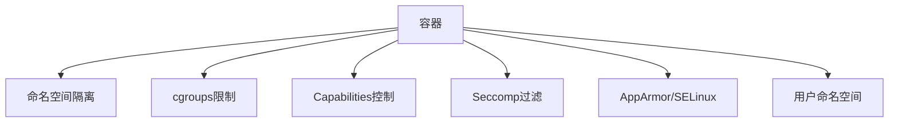
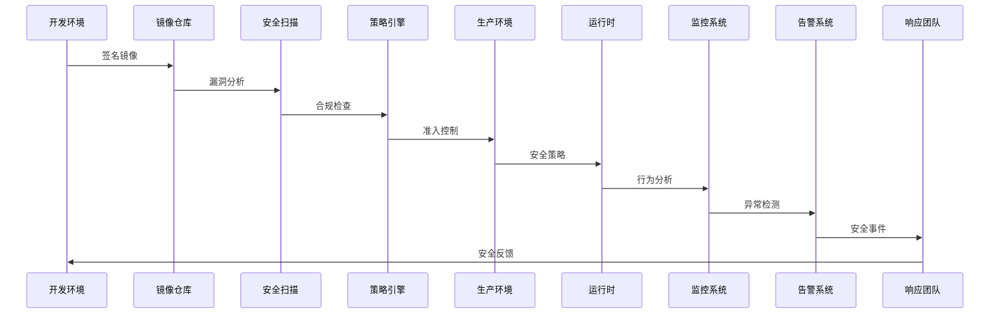

# Docker安全架构分析  

容器技术在提供便捷部署和资源隔离的同时，也带来了新的安全挑战。Docker安全架构采用多层防御策略，通过命名空间隔离、能力控制、安全计算模式等技术，构建了一个相对安全的容器运行环境。本文将深入分析Docker的安全架构，帮助读者理解容器安全的核心机制和最佳实践。

## 1. 安全架构基础  

Docker的安全架构建立在Linux内核安全机制之上，通过多种技术组合实现容器的安全隔离和权限控制。

### 1.1 核心安全组件  

Docker安全架构由以下核心组件构成：



各组件的安全职责：

1. **命名空间隔离（Namespaces）**：
   - 提供进程、网络、文件系统等资源的隔离视图
   - 防止容器间相互干扰和信息泄露
   - 限制容器对主机资源的可见性

2. **控制组（cgroups）**：
   - 限制容器可使用的系统资源（CPU、内存、I/O等）
   - 防止资源耗尽型攻击（DoS）
   - 确保公平的资源分配

3. **Linux能力（Capabilities）**：
   - 细粒度控制容器的特权操作
   - 替代传统的root/非root二元权限模型
   - 遵循最小权限原则

4. **安全计算模式（Seccomp）**：
   - 限制容器可执行的系统调用
   - 减少内核攻击面
   - 阻止恶意系统调用

5. **强制访问控制（AppArmor/SELinux）**：
   - 实施预定义的安全策略
   - 控制容器对文件和系统资源的访问
   - 提供额外的安全防护层

6. **用户命名空间（User Namespaces）**：
   - 将容器内用户映射到主机上的非特权用户
   - 减轻容器逃逸的风险
   - 隔离用户权限

这些组件协同工作，形成多层防御体系，即使一层被突破，其他层仍能提供保护。

### 1.2 默认安全配置  

Docker默认提供了基本的安全配置，但这些配置可能需要根据具体需求进行调整：

```powershell
# 查看容器安全配置
docker inspect --format='{{.HostConfig.SecurityOpt}}' my_container

# 查看默认Seccomp配置
docker info --format '{{.SecurityOptions}}'

# 查看容器能力配置
docker inspect --format='{{.HostConfig.CapAdd}}' my_container
docker inspect --format='{{.HostConfig.CapDrop}}' my_container
```

Docker默认安全配置的特点：

1. **默认启用的保护**：
   - 命名空间隔离（PID、Network、Mount等）
   - 资源限制（可配置）
   - 默认Seccomp配置文件（阻止危险系统调用）
   - 删除了大部分危险的Capabilities

2. **默认未启用的保护**：
   - 用户命名空间（需手动配置）
   - AppArmor/SELinux配置文件（取决于主机系统）
   - 内容信任（镜像签名验证）
   - 只读文件系统

3. **默认配置的局限性**：
   - 容器仍以root用户运行
   - 容器与主机共享内核
   - 网络流量默认不加密
   - 容器间可以相互通信

了解这些默认配置及其局限性，是加固Docker安全的第一步。

## 2. 隔离机制详解  

隔离是容器安全的基础，Docker利用Linux命名空间技术实现了多种资源的隔离。

### 2.1 命名空间隔离  

Linux命名空间为进程提供了资源的隔离视图，Docker利用这一机制隔离容器：

| 命名空间   | 隔离资源       | 安全影响         | 创建方式 |
|------------|----------------|------------------|----------|
| PID        | 进程树         | 防止进程枚举     | clone() with CLONE_NEWPID |
| Network    | 网络栈         | 避免网络嗅探     | clone() with CLONE_NEWNET |
| Mount      | 文件系统挂载点 | 限制文件系统访问 | clone() with CLONE_NEWNS |
| UTS        | 主机名和域名   | 隔离系统标识     | clone() with CLONE_NEWUTS |
| IPC        | 进程间通信     | 防止共享内存攻击 | clone() with CLONE_NEWIPC |
| User       | 用户和组ID     | 隔离权限         | clone() with CLONE_NEWUSER |
| Cgroup     | 控制组         | 资源隔离         | clone() with CLONE_NEWCGROUP |

各命名空间的安全作用：

1. **PID命名空间**：
   - 容器只能看到自己的进程
   - 容器内PID 1是容器的初始进程
   - 防止容器监视或干扰主机或其他容器的进程

   ```powershell
   # 查看容器内进程
   docker exec my_container ps aux
   
   # 查看主机上容器进程
   Get-Process -Name "docker-containerd-shim*"
   ```

2. **Network命名空间**：
   - 容器拥有独立的网络栈（接口、路由表、防火墙规则）
   - 默认通过veth对和网桥连接
   - 防止容器嗅探主机网络流量

   ```powershell
   # 查看容器网络配置
   docker exec my_container ip addr
   
   # 查看容器网络命名空间在主机上的映射
   # 在Linux上执行：
   # ls -la /proc/$(docker inspect --format '{{.State.Pid}}' my_container)/ns/net
   ```

3. **Mount命名空间**：
   - 容器拥有独立的文件系统视图
   - 通过联合文件系统实现镜像分层
   - 限制容器访问主机文件系统

   ```powershell
   # 查看容器挂载点
   docker exec my_container mount
   
   # 查看容器文件系统
   docker exec my_container ls -la /
   ```

4. **UTS命名空间**：
   - 容器可以有自己的主机名
   - 防止容器修改主机标识

   ```powershell
   # 设置容器主机名
   docker run --hostname=container1 -it ubuntu
   ```

5. **IPC命名空间**：
   - 隔离共享内存、信号量和消息队列
   - 防止容器间通过IPC机制通信

   ```powershell
   # 查看容器IPC资源
   docker exec my_container ipcs
   ```

命名空间隔离的局限性：

1. 所有容器共享主机内核
2. 内核漏洞可能导致隔离被突破
3. 特权容器可以绕过部分隔离

### 2.2 用户命名空间  

用户命名空间是Docker安全的重要增强，它将容器内的用户ID映射到主机上的非特权用户：

```powershell
# 启用用户命名空间
# 修改Docker守护进程配置文件
$configPath = "C:\ProgramData\docker\config\daemon.json"
$config = @{
    "userns-remap" = "default"
}
$config | ConvertTo-Json | Set-Content -Path $configPath

# 重启Docker服务
Restart-Service docker

# 验证用户命名空间是否启用
docker info | Select-String "userns"
```

用户命名空间的工作原理：

1. **ID映射**：
   - 容器内的root用户(UID 0)映射到主机上的非特权用户
   - 映射关系存储在/etc/subuid和/etc/subgid文件中
   - 例如：容器内UID 0-65535映射到主机上的100000-165535

2. **安全增强**：
   - 即使容器被攻破，攻击者也只有主机上的非特权用户权限
   - 大幅降低容器逃逸的风险
   - 减轻特权提升漏洞的影响

3. **配置选项**：
   - `default`：使用系统创建的dockremap用户
   - `username`：使用指定的用户
   - `username:group`：使用指定的用户和组

用户命名空间的注意事项：

1. 卷挂载权限可能需要调整
2. 某些需要特权操作的容器可能无法正常工作
3. 与某些Docker功能可能不兼容

用户命名空间是提高Docker安全性的最有效方法之一，强烈建议在生产环境中启用。

## 3. 权限控制模型  

Docker采用细粒度的权限控制模型，通过Linux Capabilities和安全计算模式限制容器的权限。

### 3.1 Linux Capabilities  

Linux Capabilities将传统的超级用户权限分解为更细粒度的能力集合，Docker默认删除了大部分危险的能力：

```powershell
# 查看容器默认能力
docker run --rm -it alpine capsh --print

# 删除所有能力并只添加必要的能力
docker run --cap-drop=ALL --cap-add=NET_BIND_SERVICE --cap-add=CHOWN nginx

# 添加特定能力
docker run --cap-add=SYS_PTRACE ubuntu

# 以特权模式运行（获取所有能力，危险操作）
docker run --privileged ubuntu
```

常用Capabilities及其安全影响：

| Capability | 功能 | 安全风险 |
|------------|------|----------|
| CAP_SYS_ADMIN | 执行系统管理操作 | 极高（几乎等同于root权限） |
| CAP_NET_ADMIN | 执行网络管理任务 | 高（可修改网络配置） |
| CAP_SYS_PTRACE | 调试程序 | 高（可读取其他进程内存） |
| CAP_NET_BIND_SERVICE | 绑定低于1024的端口 | 低（常用于Web服务器） |
| CAP_CHOWN | 修改文件所有者 | 中（可更改文件权限） |
| CAP_DAC_OVERRIDE | 绕过文件权限检查 | 高（可访问任何文件） |
| CAP_KILL | 向任何进程发送信号 | 中（可终止进程） |

Docker默认保留的能力：

```
CAP_CHOWN, CAP_DAC_OVERRIDE, CAP_FOWNER, CAP_FSETID, CAP_KILL, 
CAP_SETGID, CAP_SETUID, CAP_SETPCAP, CAP_NET_BIND_SERVICE, 
CAP_NET_RAW, CAP_SYS_CHROOT, CAP_MKNOD, CAP_AUDIT_WRITE, 
CAP_SETFCAP
```

最小权限原则实践：

1. 删除所有能力，仅添加必要的能力
2. 避免使用--privileged标志
3. 为不同类型的容器创建能力配置模板

### 3.2 安全计算模式（Seccomp）  

Seccomp（Secure Computing Mode）允许过滤容器可执行的系统调用，减少内核攻击面：

```powershell
# 创建自定义Seccomp配置文件
$seccompProfile = @"
{
  "defaultAction": "SCMP_ACT_ERRNO",
  "architectures": [
    "SCMP_ARCH_X86_64",
    "SCMP_ARCH_X86",
    "SCMP_ARCH_AARCH64"
  ],
  "syscalls": [
    {
      "names": [
        "accept",
        "access",
        "arch_prctl",
        "bind",
        "brk",
        "capget",
        "capset",
        "chdir",
        "chmod",
        "chown",
        "close",
        "connect",
        "dup",
        "dup2",
        "epoll_create",
        "epoll_ctl",
        "epoll_wait",
        "execve",
        "exit",
        "exit_group",
        "fcntl",
        "fstat",
        "futex",
        "getcwd",
        "getdents",
        "getgid",
        "getpid",
        "getppid",
        "getuid",
        "ioctl",
        "listen",
        "lseek",
        "mkdir",
        "mmap",
        "mprotect",
        "munmap",
        "nanosleep",
        "open",
        "pipe",
        "poll",
        "read",
        "readlink",
        "rt_sigaction",
        "rt_sigprocmask",
        "rt_sigreturn",
        "select",
        "sendto",
        "setgid",
        "setgroups",
        "setuid",
        "socket",
        "stat",
        "uname",
        "unlink",
        "wait4",
        "write"
      ],
      "action": "SCMP_ACT_ALLOW"
    }
  ]
}
"@

# 保存到文件
$seccompProfile | Set-Content -Path "c:\project\kphub\config\docker\seccomp\profile.json"

# 使用自定义Seccomp配置运行容器
docker run --security-opt seccomp=c:\project\kphub\config\docker\seccomp\profile.json nginx
```

Seccomp配置文件结构：

1. **defaultAction**：默认操作，通常是SCMP_ACT_ERRNO（阻止）
2. **architectures**：适用的CPU架构
3. **syscalls**：系统调用规则列表
   - **names**：系统调用名称
   - **action**：允许(ALLOW)或阻止(ERRNO)
   - **args**：可选的参数过滤器

Seccomp操作类型：

| 操作 | 含义 | 使用场景 |
|------|------|----------|
| SCMP_ACT_ALLOW | 允许系统调用 | 明确允许的安全调用 |
| SCMP_ACT_ERRNO | 返回错误 | 阻止危险调用 |
| SCMP_ACT_KILL | 终止进程 | 极危险的调用 |
| SCMP_ACT_TRACE | 跟踪调用 | 审计和调试 |
| SCMP_ACT_LOG | 记录调用 | 监控和审计 |

Seccomp配置最佳实践：

1. 从Docker默认配置开始，根据需要定制
2. 使用工具分析应用所需的系统调用
3. 遵循白名单原则，只允许必要的调用
4. 测试配置，确保应用正常运行

## 4. 镜像安全  

容器安全始于镜像安全，确保使用可信且无漏洞的镜像是容器安全的基础。

### 4.1 镜像签名验证  

Docker内容信任（Docker Content Trust, DCT）提供了镜像签名和验证机制：

```powershell
# 启用内容信任
$env:DOCKER_CONTENT_TRUST=1

# 拉取签名镜像
docker pull alpine:latest

# 推送签名镜像
docker push myregistry/myimage:latest

# 查看镜像签名信息
docker trust inspect --pretty alpine:latest

# 为镜像添加签名者
docker trust signer add --key signer.pem alice myregistry/myimage
```

内容信任的工作原理：

1. **角色和密钥**：
   - 根密钥（offline key）：长期密钥，离线存储
   - 仓库密钥（repository key）：特定仓库的签名密钥
   - 快照密钥（snapshot key）：记录仓库当前状态
   - 时间戳密钥（timestamp key）：防止重放攻击

2. **签名流程**：
   - 推送镜像时生成签名
   - 签名和元数据存储在Notary服务中
   - 拉取镜像时验证签名

3. **安全增强**：
   - 确保镜像来源可信
   - 防止镜像被篡改
   - 防止中间人攻击

内容信任的局限性：

1. 需要额外的基础设施（Notary服务）
2. 增加操作复杂性
3. 与某些CI/CD流程可能不兼容

### 4.2 漏洞扫描  

定期扫描镜像漏洞是确保容器安全的关键步骤：

```powershell
# 使用Trivy扫描镜像
docker run --rm -v /var/run/docker.sock:/var/run/docker.sock aquasec/trivy image nginx:alpine

# 在CI/CD流程中集成扫描
docker run --rm -v /var/run/docker.sock:/var/run/docker.sock aquasec/trivy image --exit-code 1 --severity HIGH,CRITICAL myapp:latest

# 扫描并输出详细报告
docker run --rm -v /var/run/docker.sock:/var/run/docker.sock -v c:\project\kphub\reports:/reports aquasec/trivy image --format json --output /reports/scan.json nginx:latest
```

常用的镜像扫描工具：

1. **Trivy**：
   - 开源、轻量级
   - 支持多种操作系统和语言包
   - 易于集成到CI/CD流程

2. **Clair**：
   - CoreOS开发的开源工具
   - 可与Harbor等镜像仓库集成
   - 支持API和自定义扫描策略

3. **Docker Scout**：
   - Docker官方提供的扫描服务
   - 与Docker Hub集成
   - 提供软件物料清单(SBOM)分析

4. **Anchore Engine**：
   - 开源、可定制
   - 深度分析镜像内容
   - 支持自定义策略

镜像安全最佳实践：

1. **使用最小基础镜像**：
   - Alpine、Distroless等
   - 减少攻击面和漏洞数量

2. **定期更新基础镜像**：
   - 自动化镜像更新流程
   - 使用最新的安全补丁

3. **多阶段构建**：
   - 分离构建环境和运行环境
   - 最终镜像只包含必要组件

4. **不要在镜像中包含敏感信息**：
   - 使用环境变量或外部存储
   - 注意构建历史中的敏感信息

5. **实施镜像准入策略**：
   - 只允许经过扫描和签名的镜像
   - 阻止使用过时或有严重漏洞的镜像

## 5. 运行时防护  

除了基础的隔离和权限控制，Docker还提供了多种运行时安全增强机制。

### 5.1 只读文件系统  

将容器文件系统设置为只读可以防止运行时修改，增强安全性：

```powershell
# 启用只读模式
docker run --read-only nginx

# 尝试在只读容器中写入文件（会失败）
docker run --read-only alpine touch /tmp/test

# 为特定目录提供写入权限
docker run --read-only -v c:\project\kphub\data\writable:/writable alpine touch /writable/test

# 使用临时文件系统挂载
docker run --read-only --tmpfs /tmp:rw,size=1g nginx
```

只读文件系统的优势：

1. **防止恶意修改**：
   - 阻止攻击者修改系统文件
   - 防止恶意软件持久化

2. **确保一致性**：
   - 容器始终以相同状态运行
   - 简化故障排除和恢复

3. **强制数据分离**：
   - 应用数据必须存储在卷中
   - 促进良好的架构设计

只读容器的最佳实践：

1. 识别需要写入权限的目录
2. 使用卷或tmpfs挂载提供写入权限
3. 将应用日志输出到stdout/stderr
4. 将状态数据存储在外部服务中

### 5.2 资源限制防护  

适当的资源限制可以防止DoS攻击和资源耗尽：

```powershell
# 限制内存和进程数
docker run -d --memory="512m" --memory-swap="1g" --pids-limit=100 nginx

# 限制CPU使用
docker run -d --cpus="0.5" --cpu-shares=512 nginx

# 限制块I/O
docker run -d --device-write-bps /dev/sda:10mb nginx

# 综合资源限制
docker run -d `
    --name secure-app `
    --memory="1g" `
    --memory-swap="1g" `
    --pids-limit=200 `
    --cpus="1" `
    --device-read-bps /dev/sda:20mb `
    --device-write-bps /dev/sda:10mb `
    --ulimit nofile=1024:2048 `
    myapp
```

关键资源限制参数：

1. **内存限制**：
   - `--memory`：硬限制
   - `--memory-reservation`：软限制
   - `--memory-swap`：交换空间限制

2. **CPU限制**：
   - `--cpus`：CPU核心数
   - `--cpu-shares`：相对权重
   - `--cpu-period`和`--cpu-quota`：细粒度控制

3. **进程限制**：
   - `--pids-limit`：最大进程数
   - 防止fork炸弹攻击

4. **I/O限制**：
   - `--device-read-bps`：读取速率
   - `--device-write-bps`：写入速率
   - `--blkio-weight`：I/O权重

5. **文件描述符限制**：
   - `--ulimit nofile`：最大打开文件数
   - 防止文件描述符耗尽

资源限制的安全意义：

1. **防止DoS攻击**：限制单个容器的资源使用
2. **保护主机系统**：防止主机资源耗尽
3. **容器间公平性**：防止单个容器影响其他容器
4. **异常检测**：资源使用异常可能表明安全问题

## 6. 网络安全  

容器网络安全涉及网络隔离、访问控制和加密通信等多个方面。

### 6.1 网络策略  

Docker提供多种网络隔离和控制机制：

```powershell
# 创建隔离网络（无外部连接）
docker network create --internal secure_net

# 在隔离网络中运行容器
docker run -d --network secure_net --name db mysql

# 创建具有特定子网的网络
docker network create --subnet=172.20.0.0/16 custom_net

# 为容器分配固定IP
docker run -d --network custom_net --ip 172.20.0.10 nginx

# 禁用容器间通信
# 修改daemon.json
$configPath = "C:\ProgramData\docker\config\daemon.json"
$config = Get-Content -Path $configPath | ConvertFrom-Json
$config | Add-Member -Name "icc" -Value $false -MemberType NoteProperty -Force
$config | ConvertTo-Json | Set-Content -Path $configPath

# 重启Docker服务
Restart-Service docker
```

网络隔离策略：

1. **网络分段**：
   - 前端网络：连接外部用户
   - 应用网络：业务逻辑
   - 数据网络：数据存储
   - 管理网络：监控和管理

2. **容器间通信控制**：
   - 默认允许同一网络的容器通信
   - 可通过`icc=false`全局禁用
   - 使用多个网络实现精细控制

3. **外部访问控制**：
   - 使用`--internal`创建无外部连接的网络
   - 通过端口映射控制外部访问
   - 使用主机防火墙增强保护

网络安全最佳实践：

1. 使用自定义网络替代默认bridge网络
2. 为不同应用组件创建专用网络
3. 敏感服务使用内部网络，不暴露到外部
4. 使用固定IP简化访问控制配置

### 6.2 TLS加密通信  

Docker支持TLS加密，保护API通信和容器间流量：

```powershell
# 生成CA和证书
$certsDir = "c:\project\kphub\config\docker\certs"
New-Item -Path $certsDir -ItemType Directory -Force

# 生成CA私钥
openssl genrsa -out $certsDir\ca-key.pem 4096

# 生成CA证书
openssl req -new -x509 -days 365 -key $certsDir\ca-key.pem -sha256 -out $certsDir\ca.pem -subj "/CN=docker-ca"

# 生成服务器私钥
openssl genrsa -out $certsDir\server-key.pem 4096

# 生成服务器CSR
openssl req -subj "/CN=docker-server" -sha256 -new -key $certsDir\server-key.pem -out $certsDir\server.csr

# 配置证书扩展
$extFile = "$certsDir\extfile.cnf"
@"
subjectAltName = DNS:localhost,IP:127.0.0.1
extendedKeyUsage = serverAuth
"@ | Set-Content -Path $extFile

# 签署服务器证书
openssl x509 -req -days 365 -sha256 -in $certsDir\server.csr -CA $certsDir\ca.pem -CAkey $certsDir\ca-key.pem -CAcreateserial -out $certsDir\server-cert.pem -extfile $extFile

# 生成客户端私钥
openssl genrsa -out $certsDir\client-key.pem 4096

# 生成客户端CSR
openssl req -subj "/CN=docker-client" -new -key $certsDir\client-key.pem -out $certsDir\client.csr

# 配置客户端证书扩展
@"
extendedKeyUsage = clientAuth
"@ | Set-Content -Path $extFile

# 签署客户端证书
openssl x509 -req -days 365 -sha256 -in $certsDir\client.csr -CA $certsDir\ca.pem -CAkey $certsDir\ca-key.pem -CAcreateserial -out $certsDir\client-cert.pem -extfile $extFile

# 配置Docker守护进程使用TLS
$daemonJson = @"
{
  "tls": true,
  "tlscacert": "$($certsDir -replace '\\', '/')/ca.pem",
  "tlscert": "$($certsDir -replace '\\', '/')/server-cert.pem",
  "tlskey": "$($certsDir -replace '\\', '/')/server-key.pem",
  "tlsverify": true
}
"@
$daemonJson | Set-Content -Path "C:\ProgramData\
继续编写Docker安全架构分析的内容：

### 6.2 TLS加密通信（续）

```powershell
# 配置Docker守护进程使用TLS
$daemonJson = @"
{
  "tls": true,
  "tlscacert": "$($certsDir -replace '\\', '/')/ca.pem",
  "tlscert": "$($certsDir -replace '\\', '/')/server-cert.pem",
  "tlskey": "$($certsDir -replace '\\', '/')/server-key.pem",
  "tlsverify": true
}
"@
$daemonJson | Set-Content -Path "C:\ProgramData\docker\config\daemon.json"

# 重启Docker服务
Restart-Service docker

# 使用TLS连接Docker守护进程
$env:DOCKER_TLS_VERIFY = "1"
$env:DOCKER_CERT_PATH = $certsDir
$env:DOCKER_HOST = "tcp://localhost:2376"

# 验证TLS连接
docker info
```

TLS加密的应用场景：

1. **Docker API通信**：
   - 保护Docker客户端与守护进程之间的通信
   - 防止未授权访问Docker API
   - 验证客户端身份

2. **容器间通信**：
   - 使用加密的overlay网络
   - 保护跨主机容器通信
   - 防止中间人攻击

3. **镜像仓库通信**：
   - 使用HTTPS连接私有仓库
   - 验证仓库身份
   - 保护镜像传输过程

TLS配置的最佳实践：

1. 使用强密码套件和协议（TLS 1.2+）
2. 定期轮换证书（至少每年一次）
3. 保护私钥安全（访问控制、加密存储）
4. 实施证书吊销机制
5. 监控TLS连接尝试和错误

## 7. 审计与监控  

有效的审计和监控系统是检测和响应安全事件的关键。

### 7.1 事件日志  

Docker提供了事件流，可用于监控容器生命周期和操作：

```powershell
# 实时监控Docker事件
docker events

# 过滤特定事件类型
docker events --filter 'event=start'
docker events --filter 'event=die'

# 监控特权操作
docker events --filter 'event=create' --filter 'type=container'

# 将事件记录到文件
docker events --format '{{json .}}' | Out-File -FilePath "c:\project\kphub\logs\docker-events.log"

# 创建事件监控脚本
```

```powershell:c:\project\kphub\scripts\monitor-docker-events.ps1
# 定义可疑事件
$suspiciousEvents = @(
    'container create --privileged',
    'container start --privileged',
    'volume mount /etc',
    'volume mount /var',
    'volume mount C:\Windows'
)

# 启动事件监控
$process = Start-Process -FilePath "docker" -ArgumentList "events --format '{{json .}}'" -NoNewWindow -RedirectStandardOutput "c:\project\kphub\logs\docker-events-stream.log" -PassThru

# 持续分析事件流
Get-Content "c:\project\kphub\logs\docker-events-stream.log" -Wait | ForEach-Object {
    $event = $_ | ConvertFrom-Json
    
    # 记录所有事件
    Add-Content -Path "c:\project\kphub\logs\docker-events.log" -Value $_
    
    # 检查可疑事件
    foreach ($suspicious in $suspiciousEvents) {
        if ($_.Contains($suspicious)) {
            $alertMessage = "警告: 检测到可疑操作 - $_ 时间: $(Get-Date)"
            Add-Content -Path "c:\project\kphub\logs\docker-security-alerts.log" -Value $alertMessage
            
            # 发送告警（示例）
            # Send-MailMessage -To "admin@example.com" -Subject "Docker安全告警" -Body $alertMessage
            
            break
        }
    }
}
```

关键事件类型：

1. **容器生命周期**：
   - create：创建容器
   - start：启动容器
   - stop：停止容器
   - destroy：销毁容器

2. **安全相关事件**：
   - exec：在容器中执行命令
   - update：更新容器配置
   - rename：重命名容器
   - mount：挂载卷

3. **镜像操作**：
   - pull：拉取镜像
   - push：推送镜像
   - tag：标记镜像
   - delete：删除镜像

事件监控的最佳实践：

1. 集中收集和存储事件日志
2. 设置自动告警机制
3. 关注特权操作和异常行为
4. 将事件与其他安全日志关联分析

### 7.2 行为审计  

除了Docker事件，还可以通过系统审计和容器内监控增强安全性：

```powershell
# 使用auditd审计Docker操作（Linux）
# 在Windows中可使用事件查看器

# 记录系统调用（使用自定义seccomp配置）
$auditProfile = @"
{
  "defaultAction": "SCMP_ACT_ALLOW",
  "architectures": ["SCMP_ARCH_X86_64"],
  "syscalls": [
    {
      "name": "mount",
      "action": "SCMP_ACT_LOG"
    },
    {
      "name": "unshare",
      "action": "SCMP_ACT_LOG"
    },
    {
      "name": "ptrace",
      "action": "SCMP_ACT_LOG"
    }
  ]
}
"@
$auditProfile | Set-Content -Path "c:\project\kphub\config\docker\seccomp\audit.json"

# 使用审计配置运行容器
docker run --security-opt seccomp=c:\project\kphub\config\docker\seccomp\audit.json app

# 使用Falco进行运行时监控（Linux）
# 在Windows中可使用Sysmon

# 使用容器内监控工具
docker run -d --name monitoring-agent `
    --pid=container:target_container `
    --net=container:target_container `
    --cap-add=SYS_PTRACE `
    monitoring-image
```

行为审计的关键领域：

1. **系统调用监控**：
   - 识别异常系统调用
   - 检测容器逃逸尝试
   - 记录敏感操作

2. **文件系统监控**：
   - 监控敏感文件访问
   - 检测配置文件修改
   - 识别恶意文件创建

3. **网络活动监控**：
   - 记录异常连接
   - 检测未授权通信
   - 识别数据泄露尝试

4. **进程监控**：
   - 监控进程创建和终止
   - 检测异常进程行为
   - 识别权限提升尝试

行为审计工具：

1. **Falco**：
   - 云原生运行时安全工具
   - 基于系统调用监控
   - 提供预定义的安全规则

2. **Sysdig**：
   - 系统活动监控工具
   - 捕获系统调用和事件
   - 支持容器环境

3. **Aqua Security**：
   - 商业容器安全平台
   - 提供全面的运行时保护
   - 支持异常检测和响应

4. **Twistlock/Prisma Cloud**：
   - 容器安全平台
   - 提供漏洞管理和合规检查
   - 支持运行时防护

## 8. 生产环境建议  

基于Docker安全架构的理解，以下是生产环境的安全最佳实践。

### 8.1 安全基线配置  

生产环境Docker安全基线配置：

```text
1. 禁用--privileged模式
   - 避免使用完全特权容器
   - 使用--cap-add添加必要的能力
   - 记录和审查任何特权容器的使用

2. 启用用户命名空间
   - 配置userns-remap
   - 减轻容器逃逸的影响
   - 调整卷权限以适应用户映射

3. 限制容器能力
   - 删除所有默认能力(--cap-drop=ALL)
   - 只添加必要的能力(--cap-add=specific_cap)
   - 为不同类型的容器创建能力模板

4. 定期扫描镜像漏洞
   - 在CI/CD流程中集成漏洞扫描
   - 设置漏洞严重性阈值
   - 自动阻止有严重漏洞的镜像

5. 启用内容信任
   - 配置DOCKER_CONTENT_TRUST=1
   - 实施镜像签名流程
   - 只允许使用签名镜像

6. 使用只读文件系统
   - 默认使用--read-only标志
   - 为需要写入的目录使用卷或tmpfs
   - 将应用状态存储在外部服务中

7. 实施资源限制
   - 为所有容器设置内存限制
   - 配置CPU限制防止DoS
   - 设置pids-limit防止fork炸弹

8. 网络隔离
   - 使用自定义网络替代默认bridge
   - 为不同应用组件创建专用网络
   - 敏感服务使用--internal网络

9. 使用安全计算配置
   - 应用自定义seccomp配置文件
   - 限制危险系统调用
   - 根据应用需求定制配置

10. 配置审计和监控
    - 收集Docker事件日志
    - 监控异常行为
    - 设置自动告警机制
```

安全基线实施步骤：

1. **评估当前状态**：
   - 审查现有容器配置
   - 识别安全漏洞和风险
   - 确定优先改进领域

2. **制定安全策略**：
   - 定义容器安全标准
   - 创建安全配置模板
   - 建立审批和例外流程

3. **实施安全控制**：
   - 更新Docker守护进程配置
   - 修改容器启动参数
   - 部署监控和审计工具

4. **验证和测试**：
   - 测试安全控制有效性
   - 进行渗透测试
   - 验证应用功能不受影响

5. **持续改进**：
   - 定期审查安全配置
   - 更新以应对新威胁
   - 优化安全控制

### 8.2 安全加固流程  

实施Docker安全的系统化流程：



安全加固流程的关键环节：

1. **安全开发**：
   - 使用安全基础镜像
   - 实施最小化原则
   - 集成安全测试

2. **镜像管理**：
   - 签名和验证镜像
   - 扫描漏洞和恶意软件
   - 强制执行镜像策略

3. **部署控制**：
   - 实施准入控制
   - 验证安全配置
   - 记录部署活动

4. **运行时保护**：
   - 应用安全策略
   - 监控容器行为
   - 检测异常活动

5. **事件响应**：
   - 自动告警机制
   - 隔离可疑容器
   - 取证和分析

6. **持续改进**：
   - 安全事件回顾
   - 更新安全策略
   - 加强薄弱环节

安全加固自动化示例：

```powershell:c:\project\kphub\scripts\docker-security-check.ps1
param (
    [Parameter(Mandatory=$true)]
    [string]$ImageName,
    
    [Parameter(Mandatory=$false)]
    [string]$ContainerName = ""
)

# 记录开始时间
$startTime = Get-Date
Write-Host "开始安全检查: $ImageName" -ForegroundColor Cyan

# 1. 镜像漏洞扫描
Write-Host "执行漏洞扫描..." -ForegroundColor Yellow
$scanResult = docker run --rm -v /var/run/docker.sock:/var/run/docker.sock aquasec/trivy image --exit-code 0 --severity HIGH,CRITICAL $ImageName
$vulnerabilities = $scanResult | Select-String "CRITICAL:"
if ($vulnerabilities) {
    Write-Host "发现严重漏洞:" -ForegroundColor Red
    Write-Host $vulnerabilities -ForegroundColor Red
    $securityPassed = $false
} else {
    Write-Host "未发现严重漏洞" -ForegroundColor Green
    $securityPassed = $true
}

# 2. 检查镜像配置
Write-Host "检查镜像配置..." -ForegroundColor Yellow
$imageInfo = docker inspect $ImageName | ConvertFrom-Json

# 检查是否使用root用户
$user = $imageInfo.Config.User
if ([string]::IsNullOrEmpty($user) -or $user -eq "root" -or $user -eq "0") {
    Write-Host "警告: 镜像使用root用户运行" -ForegroundColor Yellow
    $securityPassed = $false
} else {
    Write-Host "镜像使用非root用户: $user" -ForegroundColor Green
}

# 3. 如果提供了容器名称，检查容器安全配置
if (-not [string]::IsNullOrEmpty($ContainerName)) {
    Write-Host "检查容器安全配置: $ContainerName" -ForegroundColor Yellow
    $containerInfo = docker inspect $ContainerName | ConvertFrom-Json
    
    # 检查特权模式
    $privileged = $containerInfo.HostConfig.Privileged
    if ($privileged) {
        Write-Host "警告: 容器在特权模式下运行" -ForegroundColor Red
        $securityPassed = $false
    } else {
        Write-Host "容器未使用特权模式" -ForegroundColor Green
    }
    
    # 检查能力配置
    $capAdd = $containerInfo.HostConfig.CapAdd
    if ($capAdd -contains "SYS_ADMIN" -or $capAdd -contains "ALL") {
        Write-Host "警告: 容器具有高风险能力: $capAdd" -ForegroundColor Red
        $securityPassed = $false
    } else {
        Write-Host "容器能力配置合理" -ForegroundColor Green
    }
    
    # 检查资源限制
    $memoryLimit = $containerInfo.HostConfig.Memory
    if ($memoryLimit -eq 0) {
        Write-Host "警告: 容器未设置内存限制" -ForegroundColor Yellow
        $securityPassed = $false
    } else {
        $memoryLimitMB = [math]::Round($memoryLimit / (1024*1024), 0)
        Write-Host "容器内存限制: $memoryLimitMB MB" -ForegroundColor Green
    }
    
    # 检查网络配置
    $networkMode = $containerInfo.HostConfig.NetworkMode
    if ($networkMode -eq "host") {
        Write-Host "警告: 容器使用主机网络模式" -ForegroundColor Yellow
        $securityPassed = $false
    } else {
        Write-Host "容器网络模式: $networkMode" -ForegroundColor Green
    }
}

# 4. 生成安全报告
$endTime = Get-Date
$duration = $endTime - $startTime

$reportPath = "c:\project\kphub\reports\security-check-$(Get-Date -Format 'yyyyMMdd-HHmmss').txt"
@"
Docker安全检查报告
==================
检查时间: $startTime
镜像: $ImageName
容器: $ContainerName
检查耗时: $($duration.TotalSeconds) 秒

安全状态: $(if ($securityPassed) { "通过" } else { "需要改进" })

详细结果:
$scanResult

安全建议:
$(if (-not $securityPassed) {
@"
1. 使用非root用户运行容器
2. 避免使用特权模式和高风险能力
3. 设置适当的资源限制
4. 修复严重漏洞
5. 使用专用网络而非主机网络
"@
} else {
    "当前配置符合安全最佳实践"
})
"@ | Set-Content -Path $reportPath

Write-Host "安全检查完成，报告已保存至: $reportPath" -ForegroundColor Cyan
Write-Host "安全状态: $(if ($securityPassed) { "通过" } else { "需要改进" })" -ForegroundColor $(if ($securityPassed) { "Green" } else { "Yellow" })
```

## 9. 高级安全主题

### 9.1 容器逃逸防护

容器逃逸是指攻击者突破容器隔离，访问主机系统或其他容器的行为：

```powershell
# 防止容器逃逸的关键配置

# 1. 禁用不安全的挂载
docker run --security-opt no-new-privileges --cap-drop=ALL nginx

# 2. 阻止修改主机设备
docker run --device=/dev/null:/dev/null:r nginx

# 3. 限制系统调用
docker run --security-opt seccomp=c:\project\kphub\config\docker\seccomp\restrict.json nginx

# 4. 使用AppArmor/SELinux配置文件（Linux）
# docker run --security-opt apparmor=docker-default nginx

# 5. 禁止特权提升
docker run --security-opt no-new-privileges nginx
```

常见的容器逃逸向量：

1. **内核漏洞**：
   - 利用共享内核中的漏洞
   - 通过系统调用触发漏洞
   - 防护：保持内核更新，限制系统调用

2. **挂载攻击**：
   - 挂载敏感主机目录
   - 修改主机文件系统
   - 防护：限制挂载点，使用只读挂载

3. **特权容器**：
   - 利用特权模式或危险能力
   - 访问主机资源
   - 防护：避免特权容器，限制能力

4. **容器运行时漏洞**：
   - 利用Docker守护进程漏洞
   - 通过API攻击
   - 防护：保持Docker更新，限制API访问

防护策略：

1. 实施深度防御
2. 假设容器边界可能被突破
3. 限制容器的权限和访问
4. 监控异常行为

### 9.2 供应链安全

容器供应链安全涉及从代码到生产的整个过程：

```powershell
# 镜像签名和验证
$env:DOCKER_CONTENT_TRUST=1
docker pull myregistry/trusted-image:latest

# 使用软件物料清单(SBOM)
docker sbom myimage:latest

# 实施镜像准入策略
# 在Kubernetes中使用OPA/Gatekeeper
# 在Docker中使用自定义脚本验证

# 镜像构建安全
docker build --no-cache --build-arg BUILDKIT_INLINE_CACHE=0 -t secure-image .
```

供应链安全的关键环节：

1. **代码安全**：
   - 源代码安全审查
   - 依赖项漏洞扫描
   - 安全编码实践

2. **构建安全**：
   - 安全的CI/CD环境
   - 可重现的构建过程
   - 构建时漏洞扫描

3. **镜像安全**：
   - 镜像签名和验证
   - 漏洞扫描和修复
   - 最小化镜像内容

4. **分发安全**：
   - 安全的镜像仓库
   - 传输加密
   - 访问控制

5. **部署安全**：
   - 镜像准入控制
   - 部署前验证
   - 不可变基础设施

供应链安全最佳实践：

1. 使用可信的基础镜像
2. 实施镜像签名和验证
3. 自动化漏洞扫描
4. 维护软件物料清单(SBOM)
5. 实施最小权限原则

## 总结

Docker安全架构通过多层防御机制实现纵深防御，从内核隔离到运行时保护，提供了全面的安全控制。在生产环境中，应综合应用这些安全机制，构建安全的容器环境。

关键安全建议：

1. **最小权限原则**：容器只应拥有必要的权限和资源
2. **多层防御**：同时应用多种安全控制，不依赖单一防护
3. **持续监控**：实时监控容器行为，及时发现异常
4. **自动化安全**：将安全检查集成到CI/CD流程中
5. **定期更新**：保持Docker、内核和容器镜像的更新

Docker安全是一个持续的过程，需要在开发、部署和运行的各个阶段实施安全措施。通过理解Docker的安全架构和采用最佳实践，可以显著降低容器化应用的安全风险，构建更安全的容器环境。