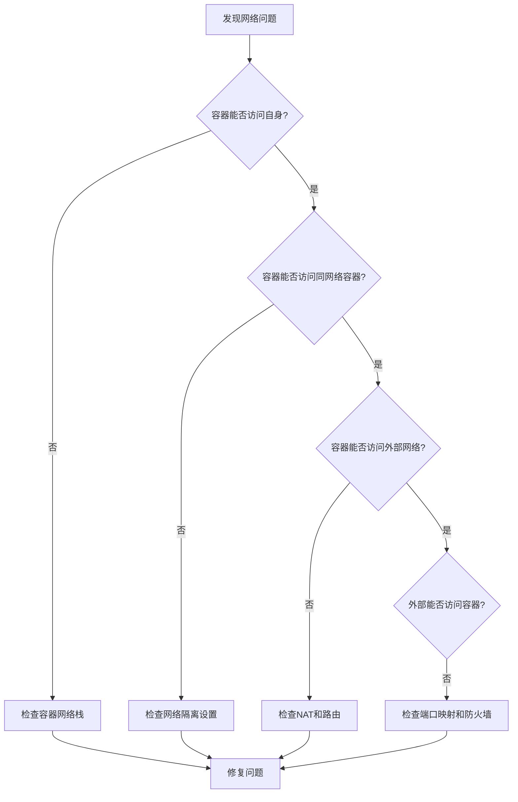
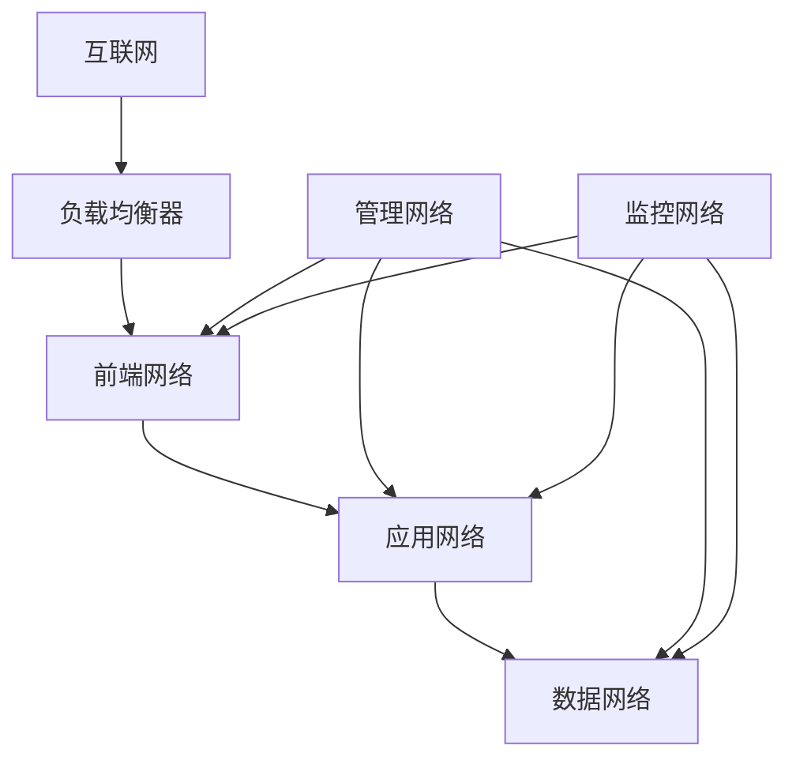

继续编写Docker网络配置与管理的内容：

### 6.2 网络加密（续）

网络加密的最佳实践：

1. **评估加密需求**：
   - 识别需要保护的敏感流量
   - 考虑加密对性能的影响
   - 平衡安全性和复杂性

2. **证书管理**：
   - 使用自动化工具管理TLS证书
   - 实施证书轮换机制
   - 安全存储私钥

3. **分层加密策略**：
   - 外部流量：始终使用TLS
   - 内部敏感流量：根据需要加密
   - 非敏感内部流量：可以不加密以提高性能

4. **监控加密状态**：
   - 检测证书过期
   - 监控加密性能开销
   - 审计加密配置变更

## 7. 故障排查  

Docker网络问题可能导致容器无法通信或服务不可用。掌握网络故障排查技术对于维护容器环境至关重要。

### 7.1 连通性测试  

当容器网络出现问题时，可以使用以下方法进行连通性测试：

```powershell
# 容器内网络测试
docker exec -it web1 ping db1
docker exec -it web1 curl -v http://db1:3306
docker exec -it web1 telnet db1 3306

# 检查容器网络配置
docker exec -it web1 ip addr
docker exec -it web1 route -n
docker exec -it web1 cat /etc/resolv.conf

# 主机到容器的连通性
Test-NetConnection -ComputerName localhost -Port 8080

# 检查端口映射
docker port web1

# 使用专用网络诊断容器
docker run --rm -it --network container:web1 nicolaka/netshoot bash
```

常见网络问题及排查方法：

1. **DNS解析问题**：
   - 症状：容器名无法解析
   - 检查：`docker exec -it container cat /etc/resolv.conf`
   - 解决：确保使用自定义网络，检查DNS配置

2. **端口映射问题**：
   - 症状：无法从外部访问容器服务
   - 检查：`docker port container`，`netstat -an | findstr PORT`
   - 解决：检查端口冲突，防火墙设置，服务是否正常监听

3. **容器间通信问题**：
   - 症状：容器无法相互访问
   - 检查：`docker network inspect network_name`
   - 解决：确保容器在同一网络，检查网络隔离设置

4. **网络性能问题**：
   - 症状：网络延迟高，吞吐量低
   - 检查：使用iperf等工具测试性能
   - 解决：考虑使用host网络模式，调整MTU，检查底层网络

网络故障排查流程：



### 7.2 流量分析  

对于复杂的网络问题，可能需要深入分析网络流量：

```powershell
# 使用诊断容器抓包
docker run --rm -it --net=container:web1 nicolaka/netshoot tcpdump -i eth0

# 保存抓包结果到文件
docker run --rm -it --net=container:web1 nicolaka/netshoot tcpdump -i eth0 -w /tmp/capture.pcap
docker cp $(docker ps -lq):/tmp/capture.pcap c:\project\kphub\logs\capture.pcap

# 分析特定端口流量
docker run --rm -it --net=container:web1 nicolaka/netshoot tcpdump -i eth0 port 80

# 分析特定协议流量
docker run --rm -it --net=container:web1 nicolaka/netshoot tcpdump -i eth0 tcp

# 使用iftop监控实时流量
docker run --rm -it --net=container:web1 nicolaka/netshoot iftop
```

高级网络诊断工具：

1. **tcpdump/Wireshark**：
   - 捕获和分析网络数据包
   - 识别协议问题和异常流量
   - 分析连接建立和断开过程

2. **iftop/nethogs**：
   - 监控实时网络带宽使用
   - 识别高流量容器和连接
   - 发现网络瓶颈

3. **netstat/ss**：
   - 查看网络连接状态
   - 识别连接问题和端口使用
   - 监控连接数量

4. **ping/traceroute**：
   - 测试基本连通性
   - 识别网络路径和延迟
   - 发现路由问题

网络问题分析脚本示例：

```powershell:c:\project\kphub\scripts\docker-network-diagnostics.ps1
param (
    [Parameter(Mandatory=$true)]
    [string]$ContainerName
)

# 获取容器ID和网络信息
$containerId = docker ps -q -f "name=$ContainerName"
if (-not $containerId) {
    Write-Error "容器 $ContainerName 未找到或未运行"
    exit 1
}

Write-Host "===== 容器网络诊断: $ContainerName =====" -ForegroundColor Cyan

# 获取容器网络设置
$networkSettings = docker inspect --format '{{json .NetworkSettings}}' $ContainerName | ConvertFrom-Json
$networks = $networkSettings.Networks

Write-Host "容器IP地址:" -ForegroundColor Yellow
foreach ($network in $networks.PSObject.Properties) {
    $networkName = $network.Name
    $ipAddress = $network.Value.IPAddress
    $gateway = $network.Value.Gateway
    Write-Host "  $networkName : $ipAddress (网关: $gateway)"
}

# 检查端口映射
$ports = docker port $ContainerName
Write-Host "`n端口映射:" -ForegroundColor Yellow
if ($ports) {
    foreach ($port in $ports) {
        Write-Host "  $port"
    }
} else {
    Write-Host "  无端口映射"
}

# 检查DNS配置
Write-Host "`nDNS配置:" -ForegroundColor Yellow
$dnsOutput = docker exec $ContainerName cat /etc/resolv.conf 2>$null
if ($LASTEXITCODE -eq 0) {
    Write-Host $dnsOutput
} else {
    Write-Host "  无法获取DNS配置"
}

# 测试容器内网络连通性
Write-Host "`n网络连通性测试:" -ForegroundColor Yellow

# 测试DNS解析
Write-Host "DNS解析测试:" -ForegroundColor Green
docker exec $ContainerName nslookup google.com 2>$null
if ($LASTEXITCODE -eq 0) {
    Write-Host "  DNS解析正常" -ForegroundColor Green
} else {
    Write-Host "  DNS解析失败" -ForegroundColor Red
}

# 测试互联网连接
Write-Host "互联网连接测试:" -ForegroundColor Green
docker exec $ContainerName ping -c 2 8.8.8.8 2>$null
if ($LASTEXITCODE -eq 0) {
    Write-Host "  互联网连接正常" -ForegroundColor Green
} else {
    Write-Host "  互联网连接失败" -ForegroundColor Red
}

# 检查网络接口
Write-Host "`n网络接口:" -ForegroundColor Yellow
docker exec $ContainerName ip addr 2>$null
if ($LASTEXITCODE -ne 0) {
    # 尝试使用ifconfig（某些容器没有ip命令）
    docker exec $ContainerName ifconfig 2>$null
}

# 检查路由表
Write-Host "`n路由表:" -ForegroundColor Yellow
docker exec $ContainerName route -n 2>$null
if ($LASTEXITCODE -ne 0) {
    # 尝试使用netstat（某些容器没有route命令）
    docker exec $ContainerName netstat -rn 2>$null
}

# 检查iptables规则（仅适用于Linux容器）
Write-Host "`n防火墙规则:" -ForegroundColor Yellow
docker exec $ContainerName iptables -L 2>$null
if ($LASTEXITCODE -ne 0) {
    Write-Host "  无法获取防火墙规则或容器不支持iptables"
}

# 提供诊断建议
Write-Host "`n===== 诊断建议 =====" -ForegroundColor Cyan
Write-Host "1. 如果容器无法连接到互联网，检查NAT设置和默认路由"
Write-Host "2. 如果容器间无法通信，确保它们在同一网络或已正确连接"
Write-Host "3. 如果DNS解析失败，检查DNS服务器配置"
Write-Host "4. 如果端口映射不工作，检查主机防火墙和端口冲突"
Write-Host "5. 对于复杂问题，考虑使用 'docker run --rm -it --net=container:$ContainerName nicolaka/netshoot' 进行深入分析"
```

## 8. 生产环境建议  

在生产环境中部署Docker网络需要考虑性能、可靠性、安全性和可维护性等多方面因素。

### 8.1 网络规划原则  

生产环境Docker网络规划应遵循以下原则：

```text
1. 业务隔离：不同服务使用独立网络
   - 前端服务网络
   - 应用服务网络
   - 数据服务网络
   - 管理服务网络

2. 安全分区：内外网服务分离
   - 外部访问区（DMZ）
   - 应用处理区
   - 数据存储区
   - 管理控制区

3. 性能优化：高频通信服务使用host模式
   - 计算密集型服务
   - 高吞吐量数据处理
   - 低延迟要求服务

4. 可扩展性：预留IP地址空间
   - 使用足够大的子网（至少/20或更大）
   - 为每个应用组预留独立子网
   - 考虑未来扩展需求

5. 高可用性：网络冗余设计
   - 多路径连接
   - 自动故障转移
   - 负载均衡

6. 可观测性：网络监控与日志
   - 流量监控
   - 连接状态跟踪
   - 异常检测
```

网络架构设计示例：



生产环境网络配置示例：

```powershell
# 创建生产环境网络架构

# 1. 前端网络（连接外部）
docker network create `
    --driver=bridge `
    --subnet=172.20.0.0/24 `
    --gateway=172.20.0.1 `
    --label environment=production `
    --label tier=frontend `
    prod_frontend_net

# 2. 应用网络（服务间通信）
docker network create `
    --driver=bridge `
    --subnet=172.21.0.0/24 `
    --gateway=172.21.0.1 `
    --label environment=production `
    --label tier=application `
    prod_app_net

# 3. 数据网络（数据存储）
docker network create `
    --driver=bridge `
    --subnet=172.22.0.0/24 `
    --gateway=172.22.0.1 `
    --internal `
    --label environment=production `
    --label tier=data `
    prod_data_net

# 4. 管理网络
docker network create `
    --driver=bridge `
    --subnet=172.23.0.0/24 `
    --gateway=172.23.0.1 `
    --label environment=production `
    --label tier=management `
    prod_mgmt_net

# 部署Web服务
docker run -d `
    --name prod_web `
    --network prod_frontend_net `
    --restart always `
    -p 80:80 `
    -p 443:443 `
    nginx:stable
docker network connect prod_app_net prod_web

# 部署应用服务
docker run -d `
    --name prod_app `
    --network prod_app_net `
    --restart always `
    --memory="1g" `
    --cpus="1.0" `
    app_image:latest
docker network connect prod_data_net prod_app

# 部署数据库
docker run -d `
    --name prod_db `
    --network prod_data_net `
    --restart always `
    --memory="2g" `
    --cpus="2.0" `
    -v db_data:/var/lib/mysql `
    mysql:5.7

# 部署管理服务
docker run -d `
    --name prod_monitor `
    --network prod_mgmt_net `
    --restart always `
    monitoring_image:latest
docker network connect prod_frontend_net prod_monitor
docker network connect prod_app_net prod_monitor
docker network connect prod_data_net prod_monitor
```

### 8.2 监控配置  

网络监控是保障生产环境稳定运行的关键：

```powershell
# 部署网络监控容器
docker run -d --name net_monitor `
    --net=host `
    -v /var/run/docker.sock:/var/run/docker.sock `
    -v c:\project\kphub\monitoring\data:/data `
    nicolaka/netshoot `
    /bin/sh -c "while true; do iftop -t -s 10 > /data/network_stats_\$(date +%Y%m%d_%H%M%S).log; sleep 300; done"

# 使用Prometheus监控Docker网络
docker run -d --name prometheus `
    --network prod_mgmt_net `
    -p 9090:9090 `
    -v c:\project\kphub\monitoring\prometheus.yml:/etc/prometheus/prometheus.yml `
    prom/prometheus

# 部署Grafana可视化
docker run -d --name grafana `
    --network prod_mgmt_net `
    -p 3000:3000 `
    -v c:\project\kphub\monitoring\grafana:/var/lib/grafana `
    grafana/grafana

# 部署cAdvisor收集容器指标
docker run -d --name cadvisor `
    --network prod_mgmt_net `
    -p 8080:8080 `
    -v /:/rootfs:ro `
    -v /var/run:/var/run:ro `
    -v /sys:/sys:ro `
    -v /var/lib/docker/:/var/lib/docker:ro `
    google/cadvisor
```

网络监控的关键指标：

1. **吞吐量**：
   - 每秒传输字节数
   - 每秒请求数
   - 网络利用率

2. **延迟**：
   - 请求响应时间
   - 连接建立时间
   - 网络往返时间

3. **错误率**：
   - 丢包率
   - 连接失败率
   - 重传率

4. **连接状态**：
   - 活动连接数
   - 连接建立/关闭率
   - 连接队列长度

5. **DNS性能**：
   - 解析成功率
   - 解析时间
   - 缓存命中率

网络监控告警配置示例：

```yaml:c:\project\kphub\monitoring\prometheus\alerts.yml
groups:
- name: docker_network_alerts
  rules:
  - alert: ContainerHighNetworkUsage
    expr: rate(container_network_transmit_bytes_total{name=~".+"}[1m]) + rate(container_network_receive_bytes_total{name=~".+"}[1m]) > 100000000
    for: 1m
    labels:
      severity: warning
    annotations:
      summary: "容器网络使用率高 ({{ $labels.name }})"
      description: "容器 {{ $labels.name }} 的网络使用率超过100Mbps，当前值: {{ $value | humanize }}Bps"

  - alert: ContainerNetworkErrors
    expr: rate(container_network_receive_errors_total{name=~".+"}[1m]) > 0 or rate(container_network_transmit_errors_total{name=~".+"}[1m]) > 0
    for: 2m
    labels:
      severity: critical
    annotations:
      summary: "容器网络错误 ({{ $labels.name }})"
      description: "容器 {{ $labels.name }} 检测到网络错误"

  - alert: DockerBridgeNetworkUtilization
    expr: (sum(rate(container_network_transmit_bytes_total{network="bridge"}[1m])) + sum(rate(container_network_receive_bytes_total{network="bridge"}[1m]))) / 1000000000 > 0.8
    for: 5m
    labels:
      severity: warning
    annotations:
      summary: "Docker bridge网络利用率高"
      description: "Docker bridge网络利用率超过80%，当前值: {{ $value | humanize }}Gbps"
```

## 9. 高级网络场景

### 9.1 多主机服务发现

在分布式环境中，服务发现是容器通信的关键：

```powershell
# 使用Docker Swarm内置服务发现
docker swarm init --advertise-addr 192.168.1.10
docker service create --name api_service --replicas 3 --network overlay_net api_image

# 使用Consul进行服务发现
docker run -d --name consul `
    -p 8500:8500 `
    -p 8600:8600/udp `
    consul agent -server -bootstrap-expect=1 -ui -client=0.0.0.0

# 注册服务到Consul
docker run -d --name web `
    --network bridge `
    -e "SERVICE_NAME=web" `
    -e "SERVICE_TAGS=production" `
    -e "SERVICE_PORT=80" `
    --label "traefik.enable=true" `
    --label "traefik.http.routers.web.rule=Host(`example.com`)" `
    nginx

# 使用Traefik作为服务发现和负载均衡
docker run -d --name traefik `
    -p 80:80 `
    -p 8080:8080 `
    -v /var/run/docker.sock:/var/run/docker.sock `
    traefik:v2.4 `
    --api.insecure=true `
    --providers.docker=true `
    --providers.docker.exposedbydefault=false
```

服务发现的工作原理：
1. 服务注册：容器启动时向服务注册中心注册
2. 服务查询：容器需要通信时查询服务注册中心
3. 负载均衡：请求分发到多个服务实例
4. 健康检查：监控服务状态，移除不健康实例

### 9.2 网络策略和流量控制

在复杂环境中，可能需要实施网络策略和流量控制：

```powershell
# 使用Docker Compose实现网络策略
# docker-compose.yml示例
```

```yaml:c:\project\kphub\docker-compose.yml
version: '3.8'

networks:
  frontend:
    driver: bridge
  backend:
    driver: bridge
    internal: true
  database:
    driver: bridge
    internal: true
    ipam:
      config:
        - subnet: 172.28.0.0/16

services:
  nginx:
    image: nginx:alpine
    networks:
      - frontend
      - backend
    ports:
      - "80:80"
    deploy:
      resources:
        limits:
          cpus: '0.5'
          memory: 512M

  api:
    image: api_image
    networks:
      - backend
      - database
    environment:
      - DB_HOST=db
    deploy:
      resources:
        limits:
          cpus: '1.0'
          memory: 1G

  db:
    image: mysql:5.7
    networks:
      - database
    volumes:
      - db_data:/var/lib/mysql
    environment:
      - MYSQL_ROOT_PASSWORD=secret
    deploy:
      resources:
        limits:
          cpus: '2.0'
          memory: 4G

volumes:
  db_data:
```

流量控制和QoS：

```powershell
# 使用tc进行流量控制（Linux容器）
docker run --rm -it --cap-add=NET_ADMIN alpine sh -c "
  apk add --no-cache iproute2 &&
  tc qdisc add dev eth0 root handle 1: htb default 12 &&
  tc class add dev eth0 parent 1: classid 1:1 htb rate 100mbit &&
  tc class add dev eth0 parent 1:1 classid 1:10 htb rate 50mbit &&
  tc class add dev eth0 parent 1:1 classid 1:11 htb rate 30mbit &&
  tc class add dev eth0 parent 1:1 classid 1:12 htb rate 20mbit
"

# 使用Docker Compose设置网络别名
```

```yaml:c:\project\kphub\docker-compose-aliases.yml
version: '3.8'

services:
  db:
    image: mysql:5.7
    networks:
      backend:
        aliases:
          - database.local
          - mysql.service
    environment:
      - MYSQL_ROOT_PASSWORD=secret

networks:
  backend:
    driver: bridge
```

## 总结

Docker网络是容器化应用的核心组件，提供了从简单单机部署到复杂分布式系统的网络解决方案。通过合理配置Docker网络，可以实现容器间的高效通信、安全隔离和外部访问控制。

在生产环境中，应根据应用需求选择合适的网络驱动和配置，实施网络分段和安全策略，并建立完善的监控系统。随着容器化应用规模的扩大，可能需要考虑跨主机网络、服务发现和负载均衡等高级功能。

Docker网络配置的最佳实践：

1. **使用自定义网络**：避免使用默认bridge网络，为不同应用创建独立网络
2. **实施网络分段**：按功能和安全级别划分网络
3. **限制网络暴露**：仅映射必要的端口，使用内部网络隔离敏感服务
4. **规划IP地址空间**：为不同环境和应用预留足够的地址空间
5. **监控网络性能**：实时监控网络流量和连接状态
6. **自动化网络配置**：使用Docker Compose或编排工具管理网络配置
7. **定期审查网络安全**：检查网络隔离和访问控制策略

通过深入理解Docker网络机制和遵循最佳实践，可以构建既灵活又安全的容器化应用网络架构，为应用提供可靠的通信基础。