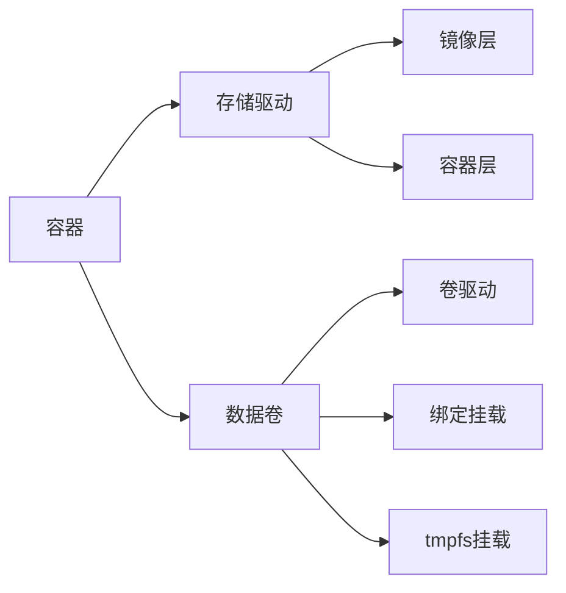
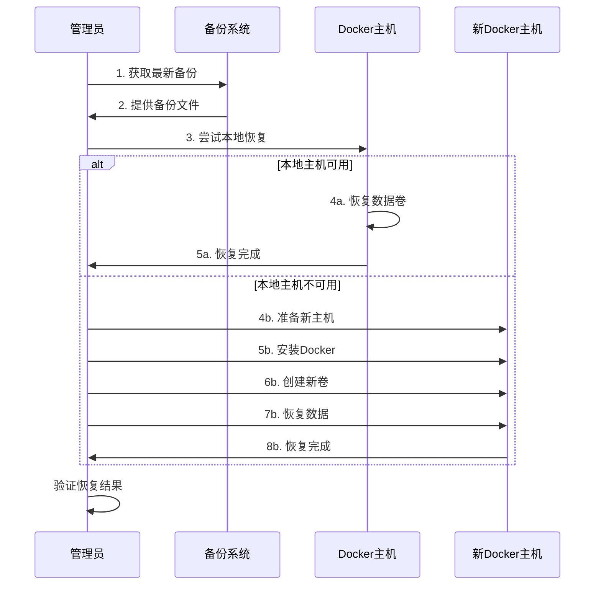
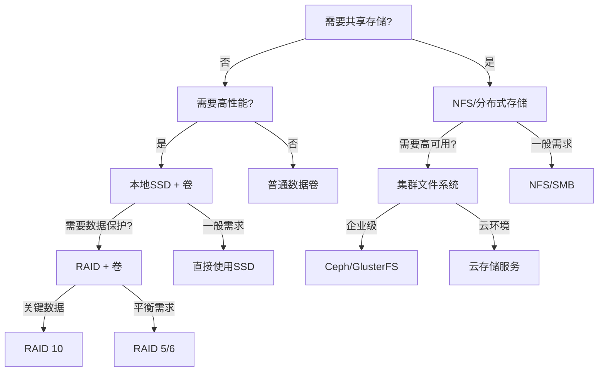
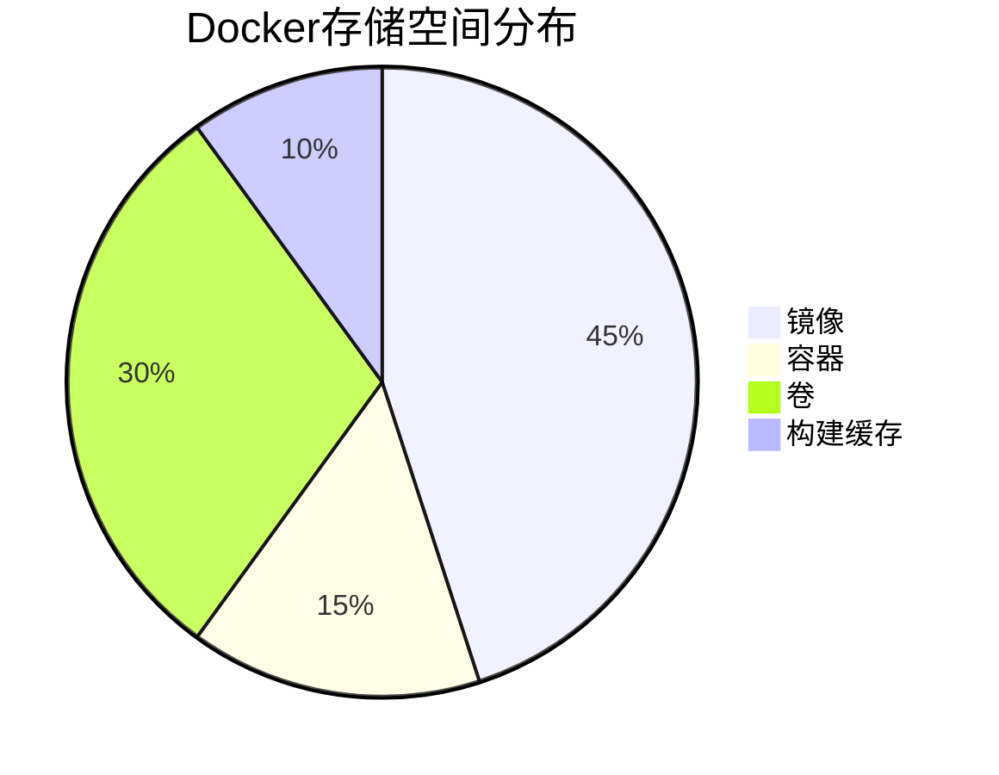
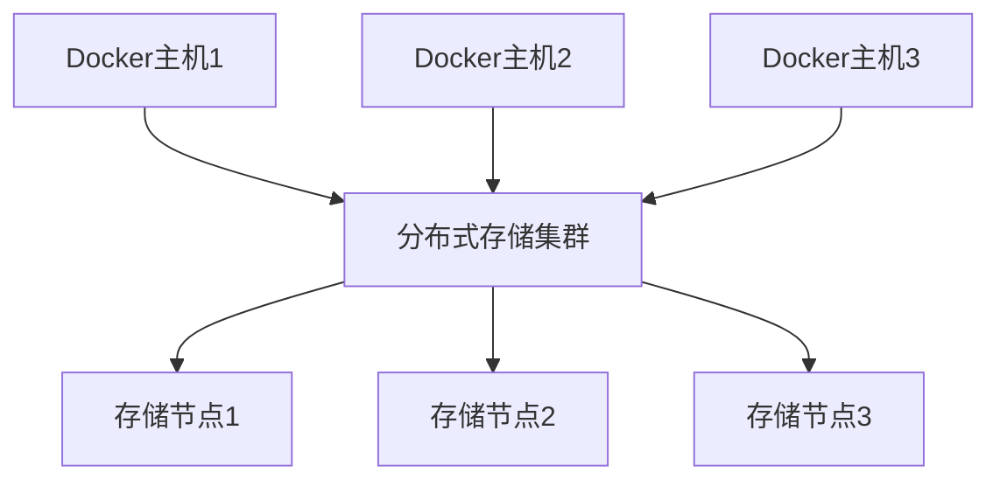
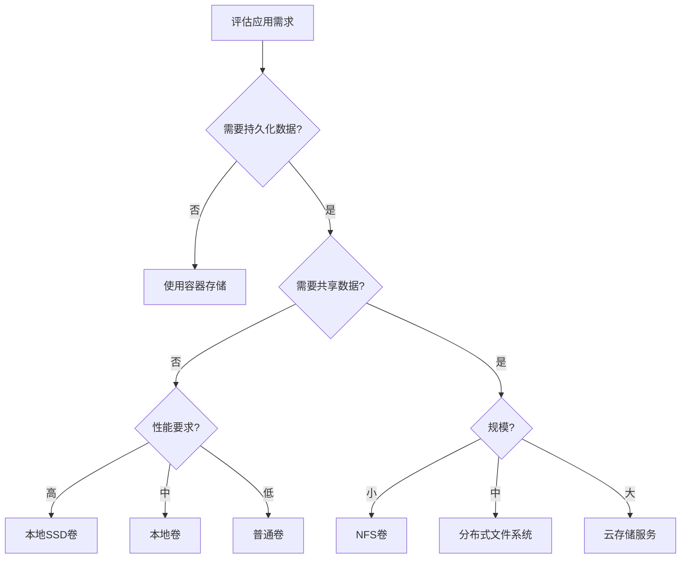

# Docker存储驱动与卷管理  

Docker的存储系统是容器技术中至关重要的组成部分，它不仅关系到容器的性能和稳定性，还直接影响数据的持久化和共享能力。本文将深入介绍Docker的存储架构、存储驱动选择、数据卷管理以及生产环境中的最佳实践，帮助读者全面理解Docker存储系统并能够根据实际需求进行合理配置。

## 1. 存储架构概述  

Docker的存储架构由多个组件组成，包括存储驱动、镜像层、容器层和数据卷等。了解这些组件之间的关系和工作原理，是合理使用Docker存储系统的基础。

### 1.1 存储组件关系  

Docker存储系统的核心组件及其关系如下：



各组件的功能和关系：

1. **容器（Container）**：
   - 运行中的镜像实例
   - 包含应用程序及其依赖环境
   - 可以访问存储驱动管理的文件系统和挂载的数据卷

2. **存储驱动（Storage Driver）**：
   - 管理镜像层和容器层
   - 实现分层存储和写时复制（CoW）机制
   - 不同驱动有不同的性能特性和兼容性

3. **镜像层（Image Layers）**：
   - 只读层，包含基础操作系统和应用程序文件
   - 多个容器可以共享相同的镜像层
   - 通过分层结构实现空间效率

4. **容器层（Container Layer）**：
   - 可写层，记录容器运行时的文件变更
   - 每个容器拥有独立的容器层
   - 容器停止后数据会丢失（除非使用数据卷）

5. **数据卷（Volumes）**：
   - 独立于容器的持久化存储
   - 可以在多个容器间共享
   - 不受容器生命周期影响

6. **卷驱动（Volume Driver）**：
   - 管理数据卷的创建、挂载和删除
   - 支持本地存储和远程存储系统
   - 可以通过插件扩展支持更多存储类型

7. **绑定挂载（Bind Mounts）**：
   - 将主机上的目录或文件挂载到容器中
   - 直接使用主机文件系统
   - 性能好但依赖主机目录结构

8. **tmpfs挂载（tmpfs Mounts）**：
   - 在容器内存中创建临时文件系统
   - 数据不写入持久存储
   - 适用于敏感数据和临时文件

Docker存储架构的工作流程：

1. 容器启动时，Docker通过存储驱动将多个镜像层以联合挂载方式组合成统一的文件系统视图
2. 容器对文件的修改通过写时复制机制写入容器层
3. 数据卷直接挂载到容器内的指定路径，绕过存储驱动
4. 容器删除后，容器层数据丢失，但数据卷中的数据保留

### 1.2 存储驱动对比  

Docker支持多种存储驱动，每种驱动都有其特定的优势和适用场景：

| 驱动类型     | 适用场景           | 性能 | 稳定性 | 支持平台      | 特点                       |
|--------------|-------------------|------|--------|--------------|----------------------------|
| overlay2     | 通用场景           | 高   | 高     | Linux        | 最佳选择，平衡性能和稳定性 |
| aufs         | 旧系统兼容         | 中   | 中     | Linux        | 较早的驱动，逐渐被淘汰     |
| devicemapper | 企业存储           | 中   | 高     | Linux        | 支持直接LVM，适合大规模部署|
| btrfs        | 高级文件系统       | 高   | 中     | Linux        | 支持快照，需要btrfs文件系统|
| zfs          | 高可靠性需求       | 高   | 高     | Linux/FreeBSD| 数据完整性好，内存占用高   |
| vfs          | 测试环境           | 低   | 高     | 全平台       | 不支持分层，每层复制全部文件|
| windowsfilter| Windows容器        | 中   | 高     | Windows      | Windows平台的默认驱动      |

各存储驱动的详细特性：

1. **overlay2**：
   - **工作原理**：使用OverlayFS联合文件系统，将多层直接叠加
   - **优势**：读写性能好，inode利用率高
   - **限制**：需要Linux内核版本≥4.0
   - **适用场景**：大多数生产环境的首选驱动

2. **aufs**：
   - **工作原理**：较早的联合文件系统实现
   - **优势**：成熟稳定，兼容性好
   - **限制**：不在主线Linux内核中，性能较overlay2差
   - **适用场景**：旧版Linux系统

3. **devicemapper**：
   - **工作原理**：基于设备映射技术，直接操作块设备
   - **优势**：可靠性高，支持直接LVM配置
   - **限制**：默认loop-lvm配置性能差
   - **适用场景**：需要直接操作块设备的企业环境

4. **btrfs**：
   - **工作原理**：利用Btrfs文件系统的写时复制和快照功能
   - **优势**：原生支持快照，性能好
   - **限制**：需要使用Btrfs文件系统
   - **适用场景**：使用Btrfs文件系统的环境

5. **zfs**：
   - **工作原理**：利用ZFS文件系统的高级特性
   - **优势**：数据完整性好，支持压缩和去重
   - **限制**：内存需求高
   - **适用场景**：对数据完整性要求高的环境

6. **vfs**：
   - **工作原理**：不使用联合挂载，每层复制全部文件
   - **优势**：简单可靠，兼容性最好
   - **限制**：性能极差，空间利用率低
   - **适用场景**：仅用于测试或不支持其他驱动的环境

7. **windowsfilter**：
   - **工作原理**：Windows平台专用的分层文件系统
   - **优势**：为Windows容器优化
   - **限制**：仅支持Windows
   - **适用场景**：Windows容器环境

选择存储驱动的考虑因素：
- 操作系统和内核版本兼容性
- 文件系统类型
- 工作负载特性（读密集型/写密集型）
- 稳定性和性能需求
- 是否需要特殊功能（如快照、数据完整性）

## 2. 存储驱动配置  

正确配置存储驱动对Docker的性能和稳定性至关重要。本节将介绍如何查看和修改Docker的存储驱动配置。

### 2.1 查看当前驱动  

在配置存储驱动前，首先需要了解当前系统使用的驱动类型和配置：

```powershell
# 查看存储驱动配置
docker info --format '{{.Driver}}'

# 查看详细存储信息
docker info | Select-String -Pattern "Storage Driver"

# 查看存储驱动状态和配置
docker info | Select-String -Pattern "Storage Driver" -Context 0,10

# 查看镜像和容器的存储使用情况
docker system df
```

存储驱动信息解读：

```
Storage Driver: overlay2
 Backing Filesystem: extfs
 Supports d_type: true
 Native Overlay Diff: true
 userxattr: false
 Using metacopy: false
```

这些信息表示：
- 当前使用的存储驱动是overlay2
- 底层文件系统是extfs（ext4）
- 支持d_type（目录项类型），这对overlay2性能很重要
- 支持原生差异计算，可提高效率
- 未启用用户扩展属性
- 未使用元数据复制功能

### 2.2 修改存储驱动  

在某些情况下，可能需要更改默认的存储驱动以获得更好的性能或兼容性：

```powershell
# 停止Docker服务
Stop-Service docker

# 创建或修改daemon.json配置文件
$config = @"
{
  "storage-driver": "overlay2",
  "storage-opts": [
    "overlay2.override_kernel_check=true",
    "overlay2.size=20G"
  ]
}
"@
$config | Out-File -FilePath "c:\programdata\docker\config\daemon.json" -Encoding ascii

# 启动Docker服务
Start-Service docker

# 验证配置是否生效
docker info --format '{{.Driver}}'
```

常用存储驱动配置选项：

1. **overlay2选项**：
   - `overlay2.override_kernel_check`：忽略内核版本检查
   - `overlay2.size`：限制容器可写层大小

2. **devicemapper选项**：
   - `dm.thinpooldev`：指定thin-pool设备
   - `dm.use_deferred_removal`：启用延迟删除
   - `dm.use_deferred_deletion`：启用延迟删除
   - `dm.basesize`：基础设备大小

3. **btrfs选项**：
   - `btrfs.min_space`：最小可用空间

4. **zfs选项**：
   - `zfs.fsname`：ZFS文件系统名称

修改存储驱动的注意事项：

1. **数据迁移**：
   - 更改存储驱动会导致现有容器无法访问
   - 需要提前备份重要数据
   - 考虑使用数据卷存储持久化数据

2. **兼容性检查**：
   - 确认新驱动与系统兼容
   - 检查内核版本和配置
   - 测试环境验证后再应用到生产

3. **性能测试**：
   - 在更改前后进行基准测试
   - 测试实际工作负载性能
   - 监控系统资源使用情况

存储驱动配置示例（针对不同场景）：

```powershell
# 生产环境overlay2配置
$productionConfig = @"
{
  "storage-driver": "overlay2",
  "log-driver": "json-file",
  "log-opts": {
    "max-size": "10m",
    "max-file": "3"
  }
}
"@

# 高性能devicemapper配置（Linux）
$highPerfConfig = @"
{
  "storage-driver": "devicemapper",
  "storage-opts": [
    "dm.directlvm_device=/dev/xvdf",
    "dm.thinp_percent=95",
    "dm.thinp_metapercent=1",
    "dm.thinp_autoextend_threshold=80",
    "dm.thinp_autoextend_percent=20",
    "dm.directlvm_device_force=false"
  ]
}
"@

# Windows容器配置
$windowsConfig = @"
{
  "storage-driver": "windowsfilter",
  "storage-opts": [
    "size=120GB"
  ]
}
"@
```

## 3. 数据卷管理  

数据卷是Docker中持久化和共享数据的主要方式，它独立于容器的生命周期，提供了更好的数据管理能力。

### 3.1 卷生命周期  

数据卷有自己的生命周期，包括创建、使用、备份和删除等阶段：

```powershell
# 创建数据卷
docker volume create app_data

# 创建带标签的数据卷
docker volume create --label environment=production --label app=database db_data

# 创建指定驱动的数据卷
docker volume create --driver local --opt type=nfs --opt o=addr=192.168.1.1,rw --opt device=:/path/to/dir nfs_data

# 查看所有数据卷
docker volume ls

# 过滤特定标签的数据卷
docker volume ls --filter label=environment=production

# 查看卷详情
docker volume inspect app_data

# 查看卷的JSON格式信息
docker volume inspect --format '{{json .}}' app_data | ConvertFrom-Json

# 删除特定数据卷
docker volume rm app_data

# 清理无用卷（未被容器使用的卷）
docker volume prune

# 清理带确认的无用卷
docker volume prune --force

# 清理特定标签的无用卷
docker volume prune --filter label=environment=testing
```

数据卷的状态和生命周期：

1. **创建阶段**：
   - 手动创建：通过`docker volume create`命令
   - 自动创建：容器使用未定义的卷时自动创建
   - 驱动创建：特定卷驱动可能有自己的创建逻辑

2. **使用阶段**：
   - 挂载到容器：通过`-v`或`--mount`选项
   - 可以同时挂载到多个容器
   - 可以设置为只读或读写模式

3. **维护阶段**：
   - 备份：将卷数据复制到外部存储
   - 迁移：在不同环境间转移卷数据
   - 监控：检查卷使用情况和性能

4. **删除阶段**：
   - 手动删除：通过`docker volume rm`命令
   - 批量清理：通过`docker volume prune`命令
   - 注意：删除卷会永久丢失数据

数据卷的元数据和属性：

```json
{
    "CreatedAt": "2023-01-15T10:30:45Z",
    "Driver": "local",
    "Labels": {
        "environment": "production",
        "app": "database"
    },
    "Mountpoint": "/var/lib/docker/volumes/app_data/_data",
    "Name": "app_data",
    "Options": {
        "type": "nfs",
        "device": ":/path/to/dir",
        "o": "addr=192.168.1.1,rw"
    },
    "Scope": "local"
}
```

这些信息表示：
- 创建时间：2023年1月15日
- 使用的驱动：local
- 标签：环境为production，应用为database
- 挂载点：卷在主机上的实际存储位置
- 卷名称：app_data
- 选项：使用NFS类型，设备路径和挂载选项
- 作用域：本地（也可能是全局，用于集群环境）

### 3.2 卷使用示例  

数据卷的使用方式多样，可以满足不同的数据持久化和共享需求：

```powershell
# 基本卷挂载
docker run -d --name mysql_db -v app_data:/var/lib/mysql mysql:8.0

# 使用--mount选项（更明确的语法）
docker run -d --name mysql_db --mount source=app_data,target=/var/lib/mysql mysql:8.0

# 只读挂载
docker run -d --name config_service -v app_data:/app/config:ro nginx

# 挂载到多个容器
docker run -d --name writer -v shared_data:/data ubuntu bash -c "echo 'Hello' > /data/file.txt"
docker run -d --name reader -v shared_data:/data:ro ubuntu cat /data/file.txt

# 使用绑定挂载（挂载主机目录）
docker run -d -v c:\project\kphub\data:/app/data nginx

# 使用tmpfs挂载（内存中的临时文件系统）
docker run -d --name temp_container --tmpfs /app/temp:rw,size=100M ubuntu

# 指定卷驱动选项
docker run -d --name nfs_container --mount source=nfs_data,target=/data,volume-driver=local,volume-opt=type=nfs nginx

# 在Docker Compose中使用卷
```

```yaml:c:\project\kphub\docker-compose.yml
version: '3.8'
services:
  db:
    image: mysql:8.0
    volumes:
      - db_data:/var/lib/mysql
      - ./config/mysql:/etc/mysql/conf.d:ro
    environment:
      MYSQL_ROOT_PASSWORD: example

  web:
    image: nginx
    volumes:
      - web_content:/usr/share/nginx/html
      - ./logs:/var/log/nginx
    ports:
      - "80:80"
    depends_on:
      - db

volumes:
  db_data:
    driver: local
    labels:
      environment: development
  web_content:
    external: true
```

数据卷的不同挂载方式比较：

| 挂载类型 | 语法 | 优势 | 限制 | 适用场景 |
|---------|------|------|------|----------|
| 卷挂载 | `-v volume_name:/container/path` | 由Docker管理，跨平台，性能好 | 不易直接访问数据 | 数据库、应用数据 |
| 绑定挂载 | `-v /host/path:/container/path` | 直接访问主机文件，易于备份 | 依赖主机目录结构 | 配置文件、源代码 |
| tmpfs挂载 | `--tmpfs /container/path` | 高性能，安全（不写入磁盘） | 数据不持久，内存占用 | 敏感数据、临时文件 |

卷挂载的高级用例：

1. **数据库持久化**：
   ```powershell
   docker run -d --name postgres -v pg_data:/var/lib/postgresql/data -e POSTGRES_PASSWORD=secret postgres:13
   ```

2. **配置文件共享**：
   ```powershell
   docker run -d --name nginx -v c:\project\kphub\config\nginx.conf:/etc/nginx/nginx.conf:ro -v web_data:/usr/share/nginx/html nginx
   ```

3. **日志收集**：
   ```powershell
   docker run -d --name app -v c:\project\kphub\logs:/app/logs app_image
   ```

4. **开发环境代码挂载**：
   ```powershell
   docker run -d --name dev -v c:\project\kphub\src:/app -p 3000:3000 node:14 npm start
   ```

5. **多容器数据共享**：
   ```powershell
   # 创建数据容器
   docker create --name data_container -v shared_data:/data alpine
   
   # 从数据容器挂载卷
   docker run --volumes-from data_container app_image
   ```

## 4. 高级存储方案  

随着应用规模的增长，可能需要更高级的存储解决方案来满足性能、可靠性和可扩展性需求。

### 4.1 NFS卷配置  

网络文件系统（NFS）是一种常用的共享存储解决方案，特别适合多主机环境：

```powershell
# 创建NFS卷
docker volume create `
    --driver local `
    --opt type=nfs `
    --opt o=addr=192.168.1.100,rw,nfsvers=4 `
    --opt device=:/data `
    nfs_volume

# 使用NFS卷
docker run -d --name nfs_container -v nfs_volume:/app/data app_image

# 查看NFS卷详情
docker volume inspect nfs_volume

# 在Docker Compose中使用NFS卷
```

```yaml:c:\project\kphub\docker-compose-nfs.yml
version: '3.8'
services:
  app:
    image: app_image
    volumes:
      - nfs_data:/app/data
    deploy:
      replicas: 3

volumes:
  nfs_data:
    driver: local
    driver_opts:
      type: nfs
      o: addr=192.168.1.100,rw,nfsvers=4
      device: ":/data"
```

NFS卷的优势和限制：

**优势**：
- 多主机共享：多个Docker主机可以访问相同的数据
- 集中管理：数据集中存储，便于备份和管理
- 容量扩展：可以根据需要扩展NFS服务器存储容量
- 独立性：数据存储独立于Docker主机

**限制**：
- 性能开销：网络延迟可能影响性能
- 单点故障：NFS服务器可能成为单点故障
- 配置复杂：需要额外设置和维护NFS服务
- 安全考虑：需要正确配置网络和访问控制

NFS卷的最佳实践：

1. **性能优化**：
   - 使用高速网络连接
   - 配置适当的NFS缓存参数
   - 考虑使用NFSv4以获得更好的性能

2. **高可用性**：
   - 配置NFS服务器冗余
   - 使用共享存储后端
   - 实施自动故障转移

3. **安全配置**：
   - 限制NFS访问到特定网络
   - 使用防火墙规则保护NFS服务
   - 考虑使用Kerberos认证

4. **监控和维护**：
   - 监控NFS服务器性能和可用性
   - 定期检查文件系统完整性
   - 实施备份策略

### 4.2 块存储卷  

块存储提供了更高的性能和可靠性，适合I/O密集型应用：

```powershell
# 在Linux上使用iSCSI卷
# docker volume create `
#     --driver=local `
#     --opt type=iscsi `
#     --opt targetportals=192.168.1.100:3260 `
#     --opt iqn=iqn.2020-01.com.example:storage.target00 `
#     --opt chapuser=username `
#     --opt chappassword=password `
#     iscsi_vol

# 在Windows上使用iSCSI卷（需要先在Windows中配置iSCSI）
# 1. 打开iSCSI发起程序并连接到目标
# 2. 初始化并格式化磁盘
# 3. 使用绑定挂载

# 使用块存储卷
docker run -d --name db_server -v iscsi_vol:/var/lib/mysql mysql:8.0

# 在云环境中使用块存储
# AWS EBS示例
docker volume create `
    --driver=rexray/ebs `
    --opt size=100 `
    --opt volumetype=gp2 `
    ebs_volume

# Azure Disk示例
docker volume create `
    --driver=azurefile `
    --opt share=myshare `
    azure_volume
```

块存储解决方案比较：

| 存储类型 | 性能 | 可靠性 | 可扩展性 | 适用场景 |
|---------|------|-------|---------|----------|
| iSCSI   | 高   | 高    | 中      | 数据库、高I/O应用 |
| FC SAN  | 极高 | 极高  | 中      | 关键业务应用 |
| AWS EBS | 高   | 高    | 高      | AWS云上应用 |
| Azure Disk | 高 | 高   | 高      | Azure云上应用 |
| GCP PD  | 高   | 高    | 高      | GCP云上应用 |

块存储的高级配置：

1. **多路径配置**：
   - 提供冗余连接路径
   - 增强可用性和性能
   - 自动故障转移

2. **RAID配置**：
   - RAID 0：提高性能
   - RAID 1：提高可靠性
   - RAID 5/6：平衡性能和可靠性

3. **QoS设置**：
   - 限制IOPS和吞吐量
   - 保证关键应用性能
   - 防止资源争用

4. **快照和备份**：
   - 定期创建存储快照
   - 实施自动备份策略
   - 配置跨区域复制

## 5. 数据备份恢复  

数据备份和恢复是存储管理中至关重要的环节，良好的备份策略可以防止数据丢失并确保业务连续性。

### 5.1 卷备份方案  

Docker卷的备份可以通过多种方式实现：

```powershell
# 基本卷备份方法
docker run --rm `
    -v app_data:/volume `
    -v c:\project\kphub\backup:/backup `
    alpine tar czf /backup/app_data_$(Get-Date -Format "yyyyMMdd").tar.gz -C /volume .

# 使用管道进行备份
docker run --rm -v app_data:/volume alpine tar cz -C /volume . | `
    Out-File -FilePath "c:\project\kphub\backup\app_data_$(Get-Date -Format "yyyyMMdd").tar.gz" -Encoding byte

# 备份运行中的数据库容器
docker exec -it mysql_db mysqldump -u root -p --all-databases > c:\project\kphub\backup\mysql_backup_$(Get-Date -Format "yyyyMMdd").sql

# 创建自动备份脚本
```

```powershell:c:\project\kphub\scripts\backup-volumes.ps1
param (
    [Parameter(Mandatory=$true)]
    [string[]]$VolumeNames,
    
    [Parameter(Mandatory=$true)]
    [string]$BackupDir,
    
    [Parameter(Mandatory=$false)]
    [int]$RetentionDays = 7
)

# 创建备份目录
if (-not (Test-Path $BackupDir)) {
    New-Item -Path $BackupDir -ItemType Directory -Force | Out-Null
}

$date = Get-Date -Format "yyyyMMdd_HHmmss"

foreach ($volume in $VolumeNames) {
    Write-Host "备份卷: $volume"
    
    # 检查卷是否存在
    $volumeExists = docker volume ls --format "{{.Name}}" | Where-Object { $_ -eq $volume }
    if (-not $volumeExists) {
        Write-Error "卷 $volume 不存在，跳过备份"
        continue
    }
    
    $backupFile = Join-Path $BackupDir "${volume}_${date}.tar.gz"
    
    # 执行备份
    docker run --rm -v ${volume}:/volume -v ${BackupDir}:/backup:rw alpine tar czf /backup/$(Split-Path $backupFile -Leaf) -C /volume .
    
    if ($LASTEXITCODE -eq 0) {
        Write-Host "成功备份卷 $volume 到 $backupFile" -ForegroundColor Green
    } else {
        Write-Error "备份卷 $volume 失败"
    }
}

# 清理旧备份
if ($RetentionDays -gt 0) {
    Write-Host "清理超过 $RetentionDays 天的旧备份..."
    $oldBackups = Get-ChildItem -Path $BackupDir -Filter "*.tar.gz" | Where-Object {
        $_.LastWriteTime -lt (Get-Date).AddDays(-$RetentionDays)
    }
    
    foreach ($backup in $oldBackups) {
        Remove-Item $backup.FullName -Force
        Write-Host "已删除
继续编写Docker存储驱动与卷管理的内容：

### 5.1 卷备份方案（续）

```powershell:c:\project\kphub\scripts\backup-volumes.ps1
    foreach ($backup in $oldBackups) {
        Remove-Item $backup.FullName -Force
        Write-Host "已删除旧备份: $($backup.Name)" -ForegroundColor Yellow
    }
    
    Write-Host "清理完成，共删除 $($oldBackups.Count) 个旧备份文件"
}

Write-Host "备份过程完成" -ForegroundColor Green
```

卷备份的不同策略比较：

1. **完整备份**：
   - 备份整个卷的内容
   - 优势：简单、恢复快速
   - 劣势：占用空间大、备份时间长
   - 适用场景：小型卷、低频备份

2. **增量备份**：
   - 只备份自上次备份后变化的文件
   - 优势：备份速度快、占用空间小
   - 劣势：恢复复杂、依赖基础备份
   - 适用场景：大型卷、频繁备份

3. **应用感知备份**：
   - 利用应用程序的备份功能（如数据库导出）
   - 优势：数据一致性好、可恢复性高
   - 劣势：特定于应用、可能需要停机
   - 适用场景：数据库、关键业务应用

4. **快照备份**：
   - 利用存储系统的快照功能
   - 优势：速度极快、几乎无停机
   - 劣势：依赖存储系统、可能需要特殊驱动
   - 适用场景：高可用系统、大型数据集

企业级备份解决方案：

```powershell
# 使用Restic进行加密备份
docker run --rm -v app_data:/data -v c:\project\kphub\backup:/backup -e RESTIC_PASSWORD=secure_password restic/restic -r /backup backup /data

# 使用Duplicity进行增量备份
docker run --rm -v app_data:/source -v c:\project\kphub\backup:/backup duplicity /source file:///backup

# 使用Barman备份PostgreSQL
docker run --rm --link postgres:postgres -v barman_data:/var/lib/barman barman backup postgres
```

### 5.2 数据恢复流程  

数据恢复是备份过程的另一半，同样重要：

```powershell
# 基本卷恢复方法
docker run --rm `
    -v new_volume:/volume `
    -v c:\project\kphub\backup:/backup `
    alpine tar xzf /backup/app_data_20230101.tar.gz -C /volume

# 恢复到新创建的卷
docker volume create restored_volume
docker run --rm `
    -v restored_volume:/volume `
    -v c:\project\kphub\backup:/backup `
    alpine sh -c "cd /volume && tar xzf /backup/app_data_20230101.tar.gz"

# 恢复数据库备份
docker exec -i mysql_db mysql -u root -p < c:\project\kphub\backup\mysql_backup_20230101.sql

# 创建数据恢复脚本
```

```powershell:c:\project\kphub\scripts\restore-volume.ps1
param (
    [Parameter(Mandatory=$true)]
    [string]$BackupFile,
    
    [Parameter(Mandatory=$true)]
    [string]$TargetVolume,
    
    [Parameter(Mandatory=$false)]
    [switch]$CreateVolume,
    
    [Parameter(Mandatory=$false)]
    [switch]$Force
)

# 检查备份文件是否存在
if (-not (Test-Path $BackupFile)) {
    Write-Error "备份文件不存在: $BackupFile"
    exit 1
}

# 检查目标卷是否存在
$volumeExists = docker volume ls --format "{{.Name}}" | Where-Object { $_ -eq $TargetVolume }

if (-not $volumeExists) {
    if ($CreateVolume) {
        Write-Host "创建新卷: $TargetVolume"
        docker volume create $TargetVolume
        if ($LASTEXITCODE -ne 0) {
            Write-Error "创建卷失败: $TargetVolume"
            exit 1
        }
    } else {
        Write-Error "目标卷不存在: $TargetVolume。使用 -CreateVolume 参数创建新卷。"
        exit 1
    }
}

# 检查卷是否在使用中
$volumeInUse = docker ps -q --filter "volume=$TargetVolume"
if ($volumeInUse) {
    if ($Force) {
        Write-Warning "卷 $TargetVolume 正在被容器使用，将强制停止这些容器"
        docker ps -q --filter "volume=$TargetVolume" | ForEach-Object {
            docker stop $_
            Write-Host "已停止容器: $_"
        }
    } else {
        Write-Error "卷 $TargetVolume 正在被容器使用。使用 -Force 参数强制停止这些容器。"
        Write-Host "以下容器正在使用该卷:"
        docker ps --filter "volume=$TargetVolume"
        exit 1
    }
}

# 执行恢复
$backupDir = Split-Path $BackupFile -Parent
$backupFileName = Split-Path $BackupFile -Leaf

Write-Host "开始恢复 $BackupFile 到卷 $TargetVolume..."
docker run --rm -v ${TargetVolume}:/volume -v ${backupDir}:/backup:ro alpine tar xzf /backup/$backupFileName -C /volume

if ($LASTEXITCODE -eq 0) {
    Write-Host "成功恢复卷 $TargetVolume" -ForegroundColor Green
} else {
    Write-Error "恢复卷 $TargetVolume 失败"
    exit 1
}

# 显示恢复后的卷信息
Write-Host "恢复后的卷信息:"
docker volume inspect $TargetVolume
```

数据恢复的最佳实践：

1. **恢复前验证**：
   - 检查备份文件完整性
   - 验证备份内容
   - 在非生产环境测试恢复

2. **恢复计划**：
   - 制定详细的恢复步骤
   - 确定恢复优先级
   - 评估恢复时间和影响

3. **恢复后验证**：
   - 检查数据完整性
   - 验证应用功能
   - 确认性能和可用性

4. **文档和演练**：
   - 记录恢复过程
   - 定期进行恢复演练
   - 更新和改进恢复流程

灾难恢复场景示例：



## 6. 生产环境建议  

在生产环境中，存储系统的选择和配置对应用的性能、可靠性和可维护性有重大影响。

### 6.1 存储选型指南  

根据不同的需求场景，选择合适的存储解决方案：



存储选型决策矩阵：

| 需求 | 推荐存储方案 | 优势 | 注意事项 |
|-----|------------|------|---------|
| 高性能数据库 | 本地SSD + 卷 | 最低延迟，高IOPS | 单主机限制，需备份策略 |
| 共享文件存储 | NFS卷 | 多主机共享，集中管理 | 网络依赖，性能受限 |
| 大规模集群 | 分布式存储(Ceph) | 高可扩展性，容错能力 | 复杂性高，资源需求大 |
| 云原生应用 | 云存储服务 | 弹性扩展，托管服务 | 供应商锁定，成本考量 |
| 开发测试环境 | 本地卷 | 简单，低成本 | 性能可能不稳定 |
| 混合工作负载 | 分层存储策略 | 按需分配资源 | 管理复杂度增加 |

生产环境存储配置示例：

```powershell
# 高性能数据库存储配置
docker volume create `
    --driver=local `
    --opt type=tmpfs `
    --opt device=tmpfs `
    --opt o=size=10G,uid=999 `
    db_cache_vol

# 持久数据存储配置
docker volume create `
    --driver=local `
    --opt type=ext4 `
    --opt device=/dev/sdb1 `
    db_data_vol

# 使用存储配置运行数据库
docker run -d `
    --name production_db `
    -v db_data_vol:/var/lib/mysql `
    -v db_cache_vol:/var/lib/mysql/cache `
    --memory=8g `
    --cpus=4 `
    mysql:8.0
```

存储规划的最佳实践：

1. **容量规划**：
   - 评估当前存储需求
   - 预测增长趋势
   - 规划扩展策略
   - 设置使用率警报（通常在80%）

2. **性能规划**：
   - 识别I/O密集型工作负载
   - 测量基准性能需求
   - 选择适合的存储介质
   - 考虑缓存策略

3. **可靠性规划**：
   - 评估数据重要性
   - 实施适当的冗余
   - 制定备份策略
   - 规划灾难恢复

4. **成本优化**：
   - 分层存储（热/温/冷数据）
   - 适当的存储分配
   - 定期回收未使用空间
   - 监控存储使用效率

### 6.2 监控配置  

存储监控是维护生产环境稳定性的关键：

```powershell
# 基本存储使用情况监控
docker system df -v

# 监控卷使用情况
docker run --rm -v /:/hostfs:ro alpine df -h /hostfs/var/lib/docker/volumes

# 使用Prometheus监控Docker存储
docker run -d `
    --name cadvisor `
    --volume=/:/rootfs:ro `
    --volume=/var/run:/var/run:ro `
    --volume=/sys:/sys:ro `
    --volume=/var/lib/docker/:/var/lib/docker:ro `
    --publish=8080:8080 `
    --restart=always `
    google/cadvisor:latest

# 创建存储监控脚本
```

```powershell:c:\project\kphub\scripts\monitor-storage.ps1
param (
    [Parameter(Mandatory=$false)]
    [int]$WarningThreshold = 80,
    
    [Parameter(Mandatory=$false)]
    [int]$CriticalThreshold = 90,
    
    [Parameter(Mandatory=$false)]
    [string]$OutputFile = "c:\project\kphub\logs\storage-monitor-$(Get-Date -Format 'yyyyMMdd').log"
)

function Write-Log {
    param (
        [string]$Message,
        [string]$Level = "INFO"
    )
    
    $timestamp = Get-Date -Format "yyyy-MM-dd HH:mm:ss"
    $logMessage = "[$timestamp] [$Level] $Message"
    
    Write-Output $logMessage
    Add-Content -Path $OutputFile -Value $logMessage
}

# 创建日志目录
$logDir = Split-Path $OutputFile -Parent
if (-not (Test-Path $logDir)) {
    New-Item -Path $logDir -ItemType Directory -Force | Out-Null
}

Write-Log "开始存储监控检查"

# 检查Docker系统存储使用情况
try {
    $systemDf = docker system df --format "{{json .}}" | ConvertFrom-Json
    
    Write-Log "Docker存储概览:"
    Write-Log "镜像: $($systemDf.Images.TotalCount) (使用: $($systemDf.Images.Size))"
    Write-Log "容器: $($systemDf.Containers.TotalCount) (使用: $($systemDf.Containers.Size))"
    Write-Log "卷: $($systemDf.Volumes.TotalCount) (使用: $($systemDf.Volumes.Size))"
    Write-Log "构建缓存: $($systemDf.BuildCache.TotalCount) (使用: $($systemDf.BuildCache.Size))"
} catch {
    Write-Log "获取Docker系统存储信息失败: $_" "ERROR"
}

# 检查卷使用情况
try {
    $volumes = docker volume ls --format "{{.Name}}"
    
    foreach ($volume in $volumes) {
        $volumeInfo = docker volume inspect $volume | ConvertFrom-Json
        $mountpoint = $volumeInfo.Mountpoint
        
        # 使用临时容器检查卷使用情况
        $usageInfo = docker run --rm -v ${volume}:/volume alpine sh -c "du -sh /volume 2>/dev/null || echo 'N/A'"
        
        Write-Log "卷 '$volume' 使用情况: $usageInfo"
    }
} catch {
    Write-Log "获取卷使用情况失败: $_" "ERROR"
}

# 检查Docker根目录使用情况
try {
    $dockerRoot = docker info --format '{{.DockerRootDir}}'
    $driveInfo = Get-PSDrive -Name ($dockerRoot.Substring(0, 1))
    
    $usedSpace = $driveInfo.Used
    $totalSpace = $driveInfo.Used + $driveInfo.Free
    $usedPercent = [math]::Round(($usedSpace / $totalSpace) * 100, 2)
    
    Write-Log "Docker根目录 ($dockerRoot) 使用情况: ${usedPercent}% (${usedSpace}/${totalSpace})"
    
    if ($usedPercent -ge $CriticalThreshold) {
        Write-Log "存储使用率超过临界值 (${usedPercent}% >= ${CriticalThreshold}%)" "CRITICAL"
    } elseif ($usedPercent -ge $WarningThreshold) {
        Write-Log "存储使用率超过警告值 (${usedPercent}% >= ${WarningThreshold}%)" "WARNING"
    }
} catch {
    Write-Log "获取Docker根目录使用情况失败: $_" "ERROR"
}

# 检查大型容器
try {
    Write-Log "最大的5个容器:"
    docker ps --size --format "{{.Names}}: {{.Size}}" | Sort-Object -Descending | Select-Object -First 5 | ForEach-Object {
        Write-Log $_
    }
} catch {
    Write-Log "获取容器大小信息失败: $_" "ERROR"
}

# 检查大型镜像
try {
    Write-Log "最大的5个镜像:"
    docker images --format "{{.Repository}}:{{.Tag}} - {{.Size}}" | Sort-Object -Descending | Select-Object -First 5 | ForEach-Object {
        Write-Log $_
    }
} catch {
    Write-Log "获取镜像大小信息失败: $_" "ERROR"
}

Write-Log "存储监控检查完成"
```

存储监控的关键指标：

1. **容量指标**：
   - 总存储容量
   - 已用存储空间
   - 可用存储空间
   - 使用率百分比

2. **性能指标**：
   - IOPS（每秒I/O操作数）
   - 吞吐量（MB/s）
   - 延迟（毫秒）
   - 队列深度

3. **健康指标**：
   - 错误率
   - 重分配扇区数
   - 坏块数
   - SMART状态

4. **操作指标**：
   - 读写比例
   - 顺序/随机访问比例
   - 平均I/O大小
   - 峰值使用时间

存储告警配置示例：

```yaml:c:\project\kphub\monitoring\prometheus\storage-alerts.yml
groups:
- name: docker_storage_alerts
  rules:
  - alert: DockerStorageNearlyFull
    expr: (1 - (node_filesystem_avail_bytes{mountpoint="/var/lib/docker"} / node_filesystem_size_bytes{mountpoint="/var/lib/docker"})) * 100 > 85
    for: 5m
    labels:
      severity: warning
    annotations:
      summary: "Docker存储空间即将耗尽"
      description: "Docker存储使用率超过85%，当前值: {{ $value }}%"

  - alert: DockerStorageCritical
    expr: (1 - (node_filesystem_avail_bytes{mountpoint="/var/lib/docker"} / node_filesystem_size_bytes{mountpoint="/var/lib/docker"})) * 100 > 95
    for: 5m
    labels:
      severity: critical
    annotations:
      summary: "Docker存储空间严重不足"
      description: "Docker存储使用率超过95%，当前值: {{ $value }}%"

  - alert: VolumeHighLatency
    expr: rate(node_disk_read_time_seconds{device=~"sd.*"}[1m]) / rate(node_disk_reads_completed_total{device=~"sd.*"}[1m]) > 0.1
    for: 5m
    labels:
      severity: warning
    annotations:
      summary: "存储延迟过高"
      description: "设备 {{ $labels.device }} 的读取延迟超过100ms，当前值: {{ $value }}s"
```

## 7. 故障排查  

存储问题可能导致容器无法启动、应用性能下降或数据丢失。掌握故障排查技术对于维护Docker环境至关重要。

### 7.1 存储性能分析  

当遇到存储性能问题时，可以使用以下方法进行分析：

```powershell
# 使用诊断工具分析I/O性能
docker run --rm -it --privileged --pid=host nicolaka/netshoot iostat -dx 2

# 监控特定容器的I/O活动
docker stats --format "table {{.Name}}\t{{.BlockIO}}"

# 使用fio测试卷性能
docker run --rm -v test_volume:/data purestorage/fio --directory=/data --direct=1 --rw=randrw --bs=4k --size=1G --numjobs=4 --runtime=60 --group_reporting --name=test

# 使用strace分析容器I/O系统调用
docker run --rm -it --cap-add SYS_PTRACE alpine sh -c "apk add strace && strace -f -e trace=file ls -la"

# 创建I/O性能测试脚本
```

```powershell:c:\project\kphub\scripts\test-volume-performance.ps1
param (
    [Parameter(Mandatory=$true)]
    [string]$VolumeName,
    
    [Parameter(Mandatory=$false)]
    [ValidateSet("read", "write", "randread", "randwrite", "randrw")]
    [string]$TestType = "randrw",
    
    [Parameter(Mandatory=$false)]
    [ValidateSet("4k", "8k", "16k", "32k", "64k", "128k", "1m")]
    [string]$BlockSize = "4k",
    
    [Parameter(Mandatory=$false)]
    [string]$FileSize = "1G",
    
    [Parameter(Mandatory=$false)]
    [int]$Duration = 60,
    
    [Parameter(Mandatory=$false)]
    [int]$Jobs = 4
)

# 检查卷是否存在
$volumeExists = docker volume ls --format "{{.Name}}" | Where-Object { $_ -eq $VolumeName }
if (-not $volumeExists) {
    Write-Error "卷 $VolumeName 不存在"
    exit 1
}

Write-Host "开始对卷 $VolumeName 进行性能测试..." -ForegroundColor Cyan
Write-Host "测试类型: $TestType, 块大小: $BlockSize, 文件大小: $FileSize, 持续时间: ${Duration}s, 并发任务: $Jobs" -ForegroundColor Cyan

# 创建测试容器
$testCommand = "fio --name=test --filename=/data/testfile --direct=1 --rw=$TestType --bs=$BlockSize --size=$FileSize --numjobs=$Jobs --runtime=$Duration --group_reporting"

Write-Host "执行命令: $testCommand" -ForegroundColor Yellow
docker run --rm -v ${VolumeName}:/data purestorage/fio $testCommand

if ($LASTEXITCODE -eq 0) {
    Write-Host "性能测试完成" -ForegroundColor Green
} else {
    Write-Error "性能测试失败"
}

# 清理测试文件
Write-Host "清理测试文件..."
docker run --rm -v ${VolumeName}:/data alpine rm -f /data/testfile

Write-Host "测试结束" -ForegroundColor Cyan
```

存储性能问题的常见原因和解决方法：

1. **I/O瓶颈**：
   - 症状：高延迟，低吞吐量
   - 原因：存储介质速度慢，过多并发I/O
   - 解决：升级存储硬件，优化I/O模式，使用缓存

2. **存储驱动问题**：
   - 症状：特定操作缓慢，系统负载高
   - 原因：驱动配置不当，不适合工作负载
   - 解决：更换或优化存储驱动配置

3. **文件系统碎片**：
   - 症状：随着时间推移性能下降
   - 原因：频繁的写入和删除操作
   - 解决：定期碎片整理，重新创建卷

4. **资源竞争**：
   - 症状：性能不稳定，峰值时段问题明显
   - 原因：多个容器共享存储资源
   - 解决：实施I/O限制，分离高I/O工作负载

5. **网络存储延迟**：
   - 症状：操作延迟高，吞吐量受限
   - 原因：网络带宽不足，距离远
   - 解决：优化网络配置，使用本地缓存

### 7.2 空间回收  

随着时间推移，Docker环境可能会积累大量未使用的存储资源，导致空间不足：

```powershell
# 清理构建缓存
docker builder prune -f

# 清理无用镜像
docker image prune -a --filter "until=24h"

# 清理无用容器
docker container prune -f

# 清理无用卷
docker volume prune -f

# 一键清理所有无用资源
docker system prune -a --volumes

# 创建定期清理脚本
```

```powershell:c:\project\kphub\scripts\cleanup-docker-storage.ps1
param (
    [Parameter(Mandatory=$false)]
    [switch]$Force,
    
    [Parameter(Mandatory=$false)]
    [switch]$IncludeVolumes,
    
    [Parameter(Mandatory=$false)]
    [int]$ImageAge = 7,
    
    [Parameter(Mandatory=$false)]
    [int]$ContainerAge = 2,
    
    [Parameter(Mandatory=$false)]
    [string]$LogFile = "c:\project\kphub\logs\docker-cleanup-$(Get-Date -Format 'yyyyMMdd').log"
)

function Write-Log {
    param (
        [string]$Message
    )
    
    $timestamp = Get-Date -Format "yyyy-MM-dd HH:mm:ss"
    $logMessage = "[$timestamp] $Message"
    
    Write-Output $logMessage
    Add-Content -Path $LogFile -Value $logMessage
}

# 创建日志目录
$logDir = Split-Path $LogFile -Parent
if (-not (Test-Path $logDir)) {
    New-Item -Path $logDir -ItemType Directory -Force | Out-Null
}

# 记录初始状态
Write-Log "开始Docker存储清理"
Write-Log "初始存储状态:"
$initialState = docker system df
Write-Log ($initialState | Out-String)

# 确认操作
if (-not $Force) {
    $confirmation = Read-Host "此操作将删除未使用的Docker资源。是否继续? (y/n)"
    if ($confirmation -ne 'y') {
        Write-Log "用户取消操作"
        exit 0
    }
}

# 清理停止的容器
Write-Log "清理停止的容器 (超过 $ContainerAge 天)..."
$containerFilter = "--filter status=exited --filter status=created --filter status=dead --filter until=${ContainerAge}d"
$containersToRemove = docker container ls -a $containerFilter --format "{{.ID}}"

if ($containersToRemove) {
    $count = ($containersToRemove | Measure-Object -Line).Lines
    Write-Log "发现 $count 个可清理的容器"
    
    if ($Force) {
        docker container prune -f $containerFilter
        Write-Log "已清理停止的容器"
    } else {
        $confirmation = Read-Host "是否清理这些容器? (y/n)"
        if ($confirmation -eq 'y') {
            docker container prune -f $containerFilter
            Write-Log "已清理停止的容器"
        } else {
            Write-Log "跳过容器清理"
        }
    }
} else {
    Write-Log "没有找到可清理的容器"
}

# 清理未使用的镜像
Write-Log "清理未使用的镜像 (超过 $ImageAge 天)..."
$imageFilter = "--filter dangling=true --filter until=${ImageAge}d"
$imagesToRemove = docker images -f dangling=true -f "before=$(Get-Date).AddDays(-$ImageAge).ToString('yyyy-MM-dd')" --format "{{.ID}}"

if ($imagesToRemove) {
    $count = ($imagesToRemove | Measure-Object -Line).Lines
    Write-Log "发现 $count 个可清理的镜像"
    
    if ($Force) {
        docker image prune -f $imageFilter
        Write-Log "已清理未使用的镜像"
    } else {
        $confirmation = Read-Host "是否清理这些镜像? (y/n)"
        if ($confirmation -eq 'y') {
            docker image prune -f $imageFilter
            Write-Log "已清理未使用的镜像"
        } else {
            Write-Log "跳过镜像清理"
        }
    }
} else {
    Write-Log "没有找到可清理的镜像"
}

# 清理构建缓存
Write-Log "清理构建缓存..."
docker builder prune -f
Write-Log "已清理构建缓存"

# 清理网络
Write-Log "清理未使用的网络..."
docker network prune -f
Write-Log "已清理未使用的网络"
继续编写Docker存储驱动与卷管理的内容：

### 7.2 空间回收（续）

```powershell:c:\project\kphub\scripts\cleanup-docker-storage.ps1
# 清理卷（如果启用）
if ($IncludeVolumes) {
    Write-Log "清理未使用的卷..."
    
    if ($Force) {
        docker volume prune -f
        Write-Log "已清理未使用的卷"
    } else {
        $confirmation = Read-Host "是否清理未使用的卷? 这将永久删除数据 (y/n)"
        if ($confirmation -eq 'y') {
            docker volume prune -f
            Write-Log "已清理未使用的卷"
        } else {
            Write-Log "跳过卷清理"
        }
    }
} else {
    Write-Log "跳过卷清理 (未启用)"
}

# 记录最终状态
Write-Log "清理完成"
Write-Log "最终存储状态:"
$finalState = docker system df
Write-Log ($finalState | Out-String)

# 计算释放的空间
Write-Log "清理操作完成"
Write-Host "查看详细日志: $LogFile" -ForegroundColor Green
```

存储空间回收的最佳实践：

1. **定期清理策略**：
   - 设置自动化清理计划（如每周一次）
   - 根据环境规模调整清理频率
   - 在非高峰时段执行清理操作

2. **分层清理方法**：
   - 首先清理构建缓存和临时文件
   - 然后清理未使用的容器和镜像
   - 最后考虑清理未使用的卷（需谨慎）

3. **保留策略**：
   - 为不同资源类型设置不同的保留期
   - 保留最近使用的镜像和容器
   - 使用标签标记不应清理的资源

4. **监控与预警**：
   - 设置存储使用阈值警报
   - 在达到阈值前主动清理
   - 监控清理操作的效果

Docker存储空间分布示例：



## 8. 高级存储场景

随着Docker应用的复杂度增加，可能需要处理一些高级存储场景，如加密存储、分布式存储和备份自动化等。

### 8.1 存储加密

保护敏感数据安全是许多企业环境的关键需求：

```powershell
# 创建加密卷（使用第三方插件）
docker volume create `
    --driver=cloudstor:aws `
    --opt backing=ebs `
    --opt encrypted=true `
    --opt kms-key-id=arn:aws:kms:region:account:key/key-id `
    encrypted_volume

# 使用LUKS加密卷（Linux环境）
# 1. 创建加密容器文件
# dd if=/dev/zero of=/path/to/container.img bs=1M count=1024
# 2. 设置LUKS加密
# cryptsetup luksFormat /path/to/container.img
# 3. 打开加密容器
# cryptsetup luksOpen /path/to/container.img encrypted_container
# 4. 格式化
# mkfs.ext4 /dev/mapper/encrypted_container
# 5. 挂载
# mount /dev/mapper/encrypted_container /mnt/encrypted
# 6. 使用绑定挂载

# 使用VeraCrypt在Windows上创建加密卷
# 1. 使用VeraCrypt创建加密容器
# 2. 挂载加密容器到Windows驱动器
# 3. 使用绑定挂载
docker run -d -v E:\encrypted:/data:ro nginx
```

加密存储的注意事项：

1. **性能影响**：
   - 加密/解密操作会增加CPU负载
   - 可能降低I/O性能
   - 考虑使用硬件加速

2. **密钥管理**：
   - 安全存储加密密钥
   - 实施密钥轮换策略
   - 建立密钥恢复机制

3. **备份考虑**：
   - 备份加密数据和密钥
   - 测试加密备份的恢复过程
   - 确保备份本身也受到保护

4. **合规要求**：
   - 了解行业特定的加密要求
   - 记录加密实施和流程
   - 定期审核加密控制

### 8.2 分布式存储集成

在多节点环境中，分布式存储可以提供高可用性和可扩展性：

```powershell
# 使用Ceph RBD卷（Linux环境）
# docker volume create `
#     --driver=rbd `
#     --opt monitors=192.168.1.1:6789,192.168.1.2:6789 `
#     --opt pool=docker `
#     --opt image=my-image `
#     --opt size=10G `
#     ceph_volume

# 使用GlusterFS卷
# docker volume create `
#     --driver=local `
#     --opt type=glusterfs `
#     --opt device=gluster-server:/gv0 `
#     --opt o=addr=gluster-server `
#     gluster_volume

# 使用AWS EFS（适用于AWS环境）
docker volume create `
    --driver=local `
    --opt type=nfs `
    --opt o=addr=fs-xxx.efs.region.amazonaws.com `
    --opt device=:/ `
    efs_volume

# 使用Azure Files（适用于Azure环境）
docker volume create `
    --driver=azurefile `
    --opt share=myshare `
    azure_volume
```

分布式存储架构示例：



分布式存储的优势和挑战：

**优势**：
- 高可用性：数据冗余存储，单节点故障不影响整体可用性
- 可扩展性：可以通过添加节点线性扩展容量和性能
- 一致性：所有节点可以访问相同的数据
- 负载均衡：I/O操作可以分布到多个节点

**挑战**：
- 复杂性：设置和维护比本地存储复杂
- 网络依赖：对网络质量和带宽有较高要求
- 性能开销：分布式协议可能引入额外延迟
- 故障排查：问题诊断和解决更加复杂

### 8.3 自动化存储管理

随着环境规模的增长，自动化存储管理变得越来越重要：

```powershell:c:\project\kphub\scripts\storage-automation.ps1
# 存储自动化脚本示例

# 参数定义
param (
    [Parameter(Mandatory=$false)]
    [string]$Action = "monitor",
    
    [Parameter(Mandatory=$false)]
    [string]$ConfigFile = "c:\project\kphub\config\storage-automation.json",
    
    [Parameter(Mandatory=$false)]
    [string]$LogDir = "c:\project\kphub\logs"
)

# 创建日志目录
if (-not (Test-Path $LogDir)) {
    New-Item -Path $LogDir -ItemType Directory -Force | Out-Null
}

$logFile = Join-Path $LogDir "storage-automation-$(Get-Date -Format 'yyyyMMdd').log"

function Write-Log {
    param (
        [string]$Message,
        [string]$Level = "INFO"
    )
    
    $timestamp = Get-Date -Format "yyyy-MM-dd HH:mm:ss"
    $logMessage = "[$timestamp] [$Level] $Message"
    
    Write-Output $logMessage
    Add-Content -Path $logFile -Value $logMessage
}

# 加载配置
if (Test-Path $ConfigFile) {
    try {
        $config = Get-Content $ConfigFile -Raw | ConvertFrom-Json
        Write-Log "已加载配置文件: $ConfigFile"
    } catch {
        Write-Log "配置文件加载失败: $_" "ERROR"
        exit 1
    }
} else {
    # 创建默认配置
    $config = @{
        volumeSettings = @{
            autoCleanup = $true
            cleanupThreshold = 85
            retentionDays = 7
            excludedVolumes = @("critical_data", "db_data")
        }
        backupSettings = @{
            enabled = $true
            schedule = "daily"
            backupDir = "c:\project\kphub\backup"
            retention = 14
            volumes = @("app_data", "config_data")
        }
        monitoringSettings = @{
            warningThreshold = 80
            criticalThreshold = 90
            checkInterval = 60
        }
    }
    
    $config | ConvertTo-Json -Depth 4 | Out-File $ConfigFile -Encoding utf8
    Write-Log "已创建默认配置文件: $ConfigFile"
}

# 执行监控操作
function Monitor-Storage {
    Write-Log "开始存储监控..."
    
    # 检查Docker根目录使用情况
    try {
        $dockerRoot = docker info --format '{{.DockerRootDir}}'
        $driveInfo = Get-PSDrive -Name ($dockerRoot.Substring(0, 1))
        
        $usedSpace = $driveInfo.Used
        $totalSpace = $driveInfo.Used + $driveInfo.Free
        $usedPercent = [math]::Round(($usedSpace / $totalSpace) * 100, 2)
        
        Write-Log "Docker根目录 ($dockerRoot) 使用情况: ${usedPercent}% ($(($usedSpace/1GB).ToString('F2'))GB/$(($totalSpace/1GB).ToString('F2'))GB)"
        
        # 检查是否超过阈值
        if ($usedPercent -ge $config.monitoringSettings.criticalThreshold) {
            Write-Log "存储使用率超过临界值 (${usedPercent}% >= $($config.monitoringSettings.criticalThreshold)%)" "CRITICAL"
            
            # 如果配置了自动清理，执行清理
            if ($config.volumeSettings.autoCleanup -and $usedPercent -ge $config.volumeSettings.cleanupThreshold) {
                Write-Log "触发自动清理..."
                Cleanup-Storage
            }
        } elseif ($usedPercent -ge $config.monitoringSettings.warningThreshold) {
            Write-Log "存储使用率超过警告值 (${usedPercent}% >= $($config.monitoringSettings.warningThreshold)%)" "WARNING"
        }
    } catch {
        Write-Log "监控存储使用情况失败: $_" "ERROR"
    }
    
    # 检查卷使用情况
    try {
        $volumes = docker volume ls --format "{{.Name}}"
        
        foreach ($volume in $volumes) {
            # 使用临时容器检查卷使用情况
            $usageInfo = docker run --rm -v ${volume}:/volume alpine sh -c "du -sh /volume 2>/dev/null || echo 'N/A'"
            Write-Log "卷 '$volume' 使用情况: $usageInfo"
        }
    } catch {
        Write-Log "获取卷使用情况失败: $_" "ERROR"
    }
    
    Write-Log "存储监控完成"
}

# 执行清理操作
function Cleanup-Storage {
    Write-Log "开始存储清理..."
    
    # 清理构建缓存
    try {
        docker builder prune -f
        Write-Log "已清理构建缓存"
    } catch {
        Write-Log "清理构建缓存失败: $_" "ERROR"
    }
    
    # 清理未使用的镜像
    try {
        $imageFilter = "--filter dangling=true --filter until=$($config.volumeSettings.retentionDays)d"
        docker image prune -f $imageFilter
        Write-Log "已清理未使用的镜像"
    } catch {
        Write-Log "清理镜像失败: $_" "ERROR"
    }
    
    # 清理停止的容器
    try {
        docker container prune -f
        Write-Log "已清理停止的容器"
    } catch {
        Write-Log "清理容器失败: $_" "ERROR"
    }
    
    # 清理未使用的网络
    try {
        docker network prune -f
        Write-Log "已清理未使用的网络"
    } catch {
        Write-Log "清理网络失败: $_" "ERROR"
    }
    
    # 清理未使用的卷（排除指定卷）
    try {
        $excludedVolumes = $config.volumeSettings.excludedVolumes
        $volumesToRemove = docker volume ls --filter dangling=true --format "{{.Name}}" | Where-Object { $excludedVolumes -notcontains $_ }
        
        foreach ($volume in $volumesToRemove) {
            docker volume rm $volume
            Write-Log "已删除未使用的卷: $volume"
        }
    } catch {
        Write-Log "清理卷失败: $_" "ERROR"
    }
    
    Write-Log "存储清理完成"
}

# 执行备份操作
function Backup-Volumes {
    if (-not $config.backupSettings.enabled) {
        Write-Log "卷备份未启用，跳过"
        return
    }
    
    Write-Log "开始卷备份..."
    
    # 创建备份目录
    $backupDir = $config.backupSettings.backupDir
    if (-not (Test-Path $backupDir)) {
        New-Item -Path $backupDir -ItemType Directory -Force | Out-Null
        Write-Log "已创建备份目录: $backupDir"
    }
    
    $date = Get-Date -Format "yyyyMMdd_HHmmss"
    
    # 备份指定的卷
    foreach ($volume in $config.backupSettings.volumes) {
        Write-Log "备份卷: $volume"
        
        # 检查卷是否存在
        $volumeExists = docker volume ls --format "{{.Name}}" | Where-Object { $_ -eq $volume }
        if (-not $volumeExists) {
            Write-Log "卷 $volume 不存在，跳过备份" "WARNING"
            continue
        }
        
        $backupFile = Join-Path $backupDir "${volume}_${date}.tar.gz"
        
        # 执行备份
        try {
            docker run --rm -v ${volume}:/volume -v ${backupDir}:/backup:rw alpine tar czf /backup/$(Split-Path $backupFile -Leaf) -C /volume .
            
            if ($LASTEXITCODE -eq 0) {
                Write-Log "成功备份卷 $volume 到 $backupFile"
            } else {
                Write-Log "备份卷 $volume 失败" "ERROR"
            }
        } catch {
            Write-Log "备份卷 $volume 时发生错误: $_" "ERROR"
        }
    }
    
    # 清理旧备份
    try {
        $retention = $config.backupSettings.retention
        if ($retention -gt 0) {
            Write-Log "清理超过 $retention 天的旧备份..."
            $oldBackups = Get-ChildItem -Path $backupDir -Filter "*.tar.gz" | Where-Object {
                $_.LastWriteTime -lt (Get-Date).AddDays(-$retention)
            }
            
            foreach ($backup in $oldBackups) {
                Remove-Item $backup.FullName -Force
                Write-Log "已删除旧备份: $($backup.Name)"
            }
            
            Write-Log "清理完成，共删除 $($oldBackups.Count) 个旧备份文件"
        }
    } catch {
        Write-Log "清理旧备份时发生错误: $_" "ERROR"
    }
    
    Write-Log "卷备份完成"
}

# 根据指定的操作执行相应的功能
switch ($Action) {
    "monitor" {
        Monitor-Storage
    }
    "cleanup" {
        Cleanup-Storage
    }
    "backup" {
        Backup-Volumes
    }
    "all" {
        Monitor-Storage
        Cleanup-Storage
        Backup-Volumes
    }
    default {
        Write-Log "未知操作: $Action" "ERROR"
        Write-Log "支持的操作: monitor, cleanup, backup, all"
    }
}

Write-Log "脚本执行完成"
```

自动化存储管理的关键组件：

1. **监控系统**：
   - 实时跟踪存储使用情况
   - 检测性能异常
   - 触发警报和自动化操作

2. **策略引擎**：
   - 定义存储管理规则
   - 根据条件执行操作
   - 平衡性能和容量需求

3. **调度系统**：
   - 安排定期维护任务
   - 在适当时间执行备份
   - 协调清理操作

4. **报告系统**：
   - 生成存储使用报告
   - 跟踪历史趋势
   - 提供容量规划建议

## 9. 总结与最佳实践

Docker存储系统是容器化应用的基础，正确理解和配置存储组件对于构建可靠、高性能的容器环境至关重要。

### 9.1 存储架构选择指南

根据不同的应用需求，选择合适的存储架构：

| 应用类型 | 推荐存储驱动 | 推荐卷类型 | 关键考虑因素 |
|---------|------------|-----------|------------|
| 无状态应用 | overlay2 | tmpfs/本地卷 | 性能、启动速度 |
| 数据库 | overlay2 | 本地SSD卷/块存储 | IOPS、持久性、备份 |
| 文件服务 | overlay2 | NFS/分布式存储 | 容量、共享能力 |
| 日志系统 | overlay2 | 本地卷+定期归档 | 写入性能、归档策略 |
| 开发环境 | overlay2 | 绑定挂载 | 便捷性、实时更新 |
| 高可用系统 | overlay2 | 分布式存储 | 冗余、故障转移 |

存储架构决策流程：



### 9.2 存储最佳实践总结

基于前面的内容，总结Docker存储的最佳实践：

1. **存储驱动选择**：
   - 优先使用overlay2驱动（性能和稳定性最佳）
   - 根据操作系统和内核版本选择兼容的驱动
   - 在生产环境中避免使用实验性驱动

2. **数据持久化策略**：
   - 使用命名卷存储持久化数据
   - 避免在容器可写层存储重要数据
   - 为不同类型的数据使用不同的卷

3. **性能优化**：
   - I/O密集型应用使用本地SSD卷
   - 考虑使用tmpfs挂载存储临时数据
   - 监控并优化存储I/O模式

4. **安全实践**：
   - 实施最小权限原则
   - 考虑使用加密卷保护敏感数据
   - 定期审核卷访问权限

5. **备份策略**：
   - 实施定期自动备份
   - 测试备份恢复过程
   - 存储备份在独立的物理位置

6. **监控与维护**：
   - 监控存储使用率和性能
   - 实施自动化清理策略
   - 定期检查存储健康状态

7. **扩展性考虑**：
   - 规划足够的存储容量
   - 选择可扩展的存储解决方案
   - 考虑未来的增长需求

8. **文档与标准化**：
   - 记录存储配置和策略
   - 使用一致的命名约定
   - 标准化卷管理流程

通过合理配置和管理Docker存储系统，可以构建既高效又可靠的容器化应用环境，满足从开发测试到企业级生产的各种需求。

Docker存储是一个复杂而重要的主题，随着容器技术的发展，存储解决方案也在不断演进。持续学习和实践是掌握Docker存储管理的关键。