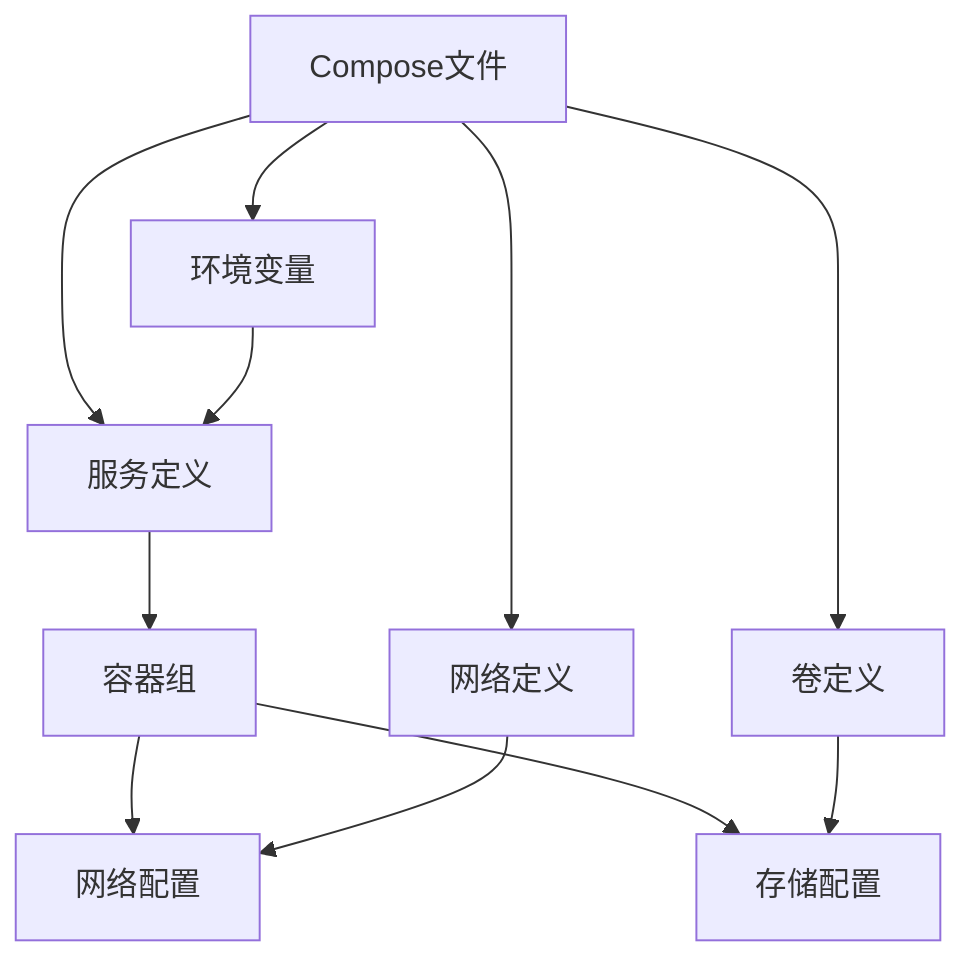
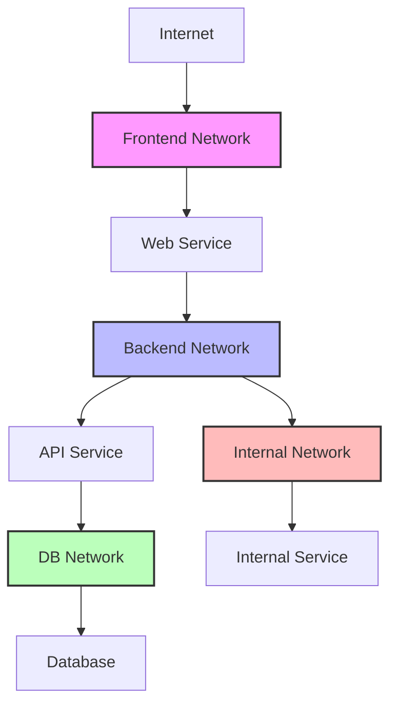
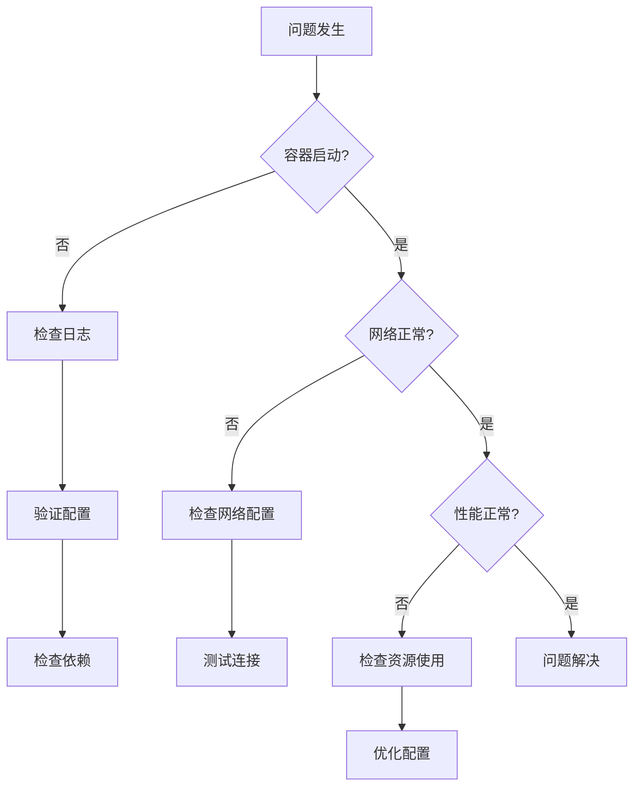
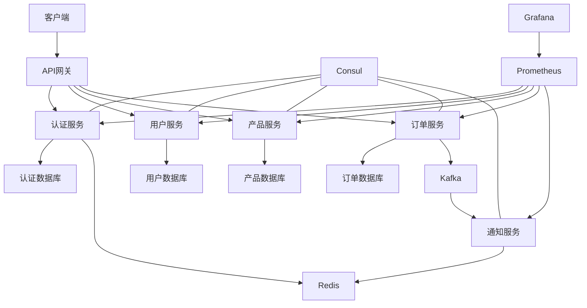

# Docker Compose多容器编排  

Docker Compose是Docker生态系统中的一个核心工具，它通过简单的YAML文件配置，实现了多容器应用的定义和运行。无论是开发环境、测试环境还是生产环境，Docker Compose都能帮助开发者和运维人员轻松管理复杂的多容器应用。本文将深入介绍Docker Compose的核心概念、配置方法和最佳实践。

## 1. 核心概念  

Docker Compose的核心理念是"基础设施即代码"，它允许开发者将多容器应用的配置编写为代码，实现应用环境的版本控制、复制和共享。

### 1.1 编排架构  

Docker Compose的架构由以下核心组件构成：



各组件的功能和关系：

1. **Compose文件**：
   - YAML格式的配置文件，通常命名为`docker-compose.yml`
   - 定义了整个应用的服务、网络和卷
   - 可以包含环境变量和扩展字段

2. **服务定义**：
   - 每个服务对应一个容器或容器组
   - 指定容器的镜像、配置和运行参数
   - 定义服务间的依赖关系

3. **容器组**：
   - 同一服务可以运行多个容器实例
   - 支持水平扩展和负载均衡
   - 共享相同的配置和镜像

4. **网络配置**：
   - 定义服务间的通信网络
   - 支持多种网络驱动和拓扑
   - 控制网络隔离和访问策略

5. **存储配置**：
   - 管理容器的数据持久化
   - 支持卷、绑定挂载和临时存储
   - 确保数据在容器生命周期外保存

Docker Compose的工作流程：

1. 读取Compose文件和环境变量
2. 创建所需的网络和卷
3. 按依赖顺序构建或拉取服务镜像
4. 创建和启动服务容器
5. 监控容器状态并根据配置进行管理

### 1.2 版本差异  

Docker Compose文件格式经历了多个版本的演进，每个版本都引入了新特性并提高了兼容性：

| 版本   | 功能特性                   | 兼容性       | 主要改进                     |
|--------|--------------------------|-------------|----------------------------|
| v1     | 基础服务定义              | Docker 1.6+ | 初始版本，简单服务配置        |
| v2     | 扩展语法                  | Docker 1.10+| 网络和卷命名，服务依赖        |
| v2.1   | 增强变量支持              | Docker 1.12+| 条件配置，健康检查            |
| v3     | Swarm模式支持             | Docker 1.13+| 集群部署，服务配置            |
| v3.3   | 构建增强                  | Docker 17.06+| 构建参数，部署标签           |
| v3.4   | 健康检查扩展              | Docker 17.09+| 启动顺序，扩展字段           |
| v3.8   | 配置增强                  | Docker 19.03+| GPU支持，配置模板            |

版本选择建议：

- **开发环境**：使用最新版本以获取全部功能
- **生产环境**：根据Docker引擎版本选择兼容的版本
- **混合环境**：考虑使用v3.x以获得最佳兼容性和功能

版本迁移注意事项：

1. **v1到v2迁移**：
   - 添加`version: '2'`字段
   - 将服务定义移至`services`下
   - 网络和卷需要显式定义

2. **v2到v3迁移**：
   - 更新`version`字段
   - 将`volumes_from`替换为命名卷
   - 使用`deploy`替代部分容器配置
   - 移除`depends_on`的条件形式

3. **通用迁移策略**：
   - 先在非生产环境测试
   - 使用`docker-compose config`验证配置
   - 逐步迁移，确保每步都能正常工作

## 2. 文件配置详解  

Docker Compose文件是整个编排系统的核心，它使用YAML格式定义应用的各个组件和配置。

### 2.1 基础模板  

一个基本的Docker Compose文件包含版本声明和服务定义：

```yaml:c:\project\kphub\docker\compose\template.yml
version: '3.8'
services:
  web:
    image: nginx:alpine
    ports:
      - "8080:80"
    depends_on:
      - db
    restart: unless-stopped
    environment:
      APP_ENV: production
    volumes:
      - ./html:/usr/share/nginx/html

  db:
    image: postgres:13
    environment:
      POSTGRES_PASSWORD: example
      POSTGRES_DB: app_database
    volumes:
      - db-data:/var/lib/postgresql/data

volumes:
  db-data:
```

文件结构解析：

1. **version**：指定Compose文件格式版本
2. **services**：定义应用包含的服务
   - **web**：服务名称，可自定义
     - **image**：使用的Docker镜像
     - **ports**：端口映射（主机端口:容器端口）
     - **depends_on**：依赖关系，确保db服务先启动
     - **restart**：重启策略
     - **environment**：环境变量设置
     - **volumes**：存储卷挂载
   - **db**：数据库服务
     - 类似配置...
3. **volumes**：定义命名卷
   - **db-data**：卷名称，用于持久化数据库数据

更复杂的配置示例：

```yaml:c:\project\kphub\docker\compose\advanced-template.yml
version: '3.8'
services:
  web:
    build:
      context: ./web
      dockerfile: Dockerfile.prod
      args:
        NODE_ENV: production
    image: myapp/web:${TAG:-latest}
    ports:
      - "80:80"
      - "443:443"
    depends_on:
      - api
    networks:
      - frontend
      - backend
    deploy:
      replicas: 2
      update_config:
        parallelism: 1
        delay: 10s
      restart_policy:
        condition: on-failure
    healthcheck:
      test: ["CMD", "curl", "-f", "http://localhost/health"]
      interval: 30s
      timeout: 5s
      retries: 3
      start_period: 40s

  api:
    build: ./api
    image: myapp/api:${TAG:-latest}
    expose:
      - "3000"
    depends_on:
      db:
        condition: service_healthy
    networks:
      - backend
    environment:
      - DB_HOST=db
      - DB_USER=${DB_USER}
      - DB_PASS=${DB_PASS}
    volumes:
      - api-logs:/app/logs

  db:
    image: mysql:8.0
    volumes:
      - db-data:/var/lib/mysql
      - ./init-scripts:/docker-entrypoint-initdb.d
    networks:
      - backend
    environment:
      - MYSQL_ROOT_PASSWORD=${DB_ROOT_PASSWORD}
      - MYSQL_DATABASE=appdb
    healthcheck:
      test: ["CMD", "mysqladmin", "ping", "-h", "localhost"]
      interval: 10s
      timeout: 5s
      retries: 5

networks:
  frontend:
  backend:
    internal: true

volumes:
  db-data:
    driver: local
  api-logs:
```

### 2.2 配置继承  

对于复杂应用，可以使用YAML的锚点和别名功能实现配置继承，减少重复代码：

```yaml:c:\project\kphub\docker\compose\inheritance.yml
version: '3.8'

# 定义通用配置
x-common: &common
  restart: unless-stopped
  networks:
    - app-net
  logging:
    driver: "json-file"
    options:
      max-size: "10m"
      max-file: "3"

# 定义服务配置
x-service: &service
  <<: *common
  deploy:
    resources:
      limits:
        cpus: '0.5'
        memory: 256M

services:
  web:
    <<: *service
    image: nginx:alpine
    ports:
      - "80:80"
    volumes:
      - ./html:/usr/share/nginx/html

  api:
    <<: *service
    image: node:14-alpine
    working_dir: /app
    command: npm start
    volumes:
      - ./api:/app
    environment:
      NODE_ENV: production

  db:
    <<: *common
    image: postgres:13
    environment:
      POSTGRES_PASSWORD: example
    volumes:
      - db-data:/var/lib/postgresql/data

networks:
  app-net:

volumes:
  db-data:
```

配置继承的优势：

1. **减少重复**：共享配置只需定义一次
2. **提高可维护性**：集中管理通用配置
3. **降低错误风险**：避免复制粘贴导致的不一致
4. **增强可读性**：清晰表达配置的层次结构

配置继承的高级用法：

```yaml:c:\project\kphub\docker\compose\advanced-inheritance.yml
version: '3.8'

# 基础服务配置
x-base: &base
  restart: unless-stopped
  logging:
    driver: "json-file"
    options:
      max-size: "10m"
      max-file: "3"

# 网络配置
x-networks: &networks
  networks:
    - backend

# Web服务配置
x-web: &web
  <<: [*base, *networks]
  image: nginx:alpine
  expose:
    - "80"

services:
  # 前端Web服务
  web-frontend:
    <<: *web
    ports:
      - "80:80"
    volumes:
      - ./frontend:/usr/share/nginx/html
    environment:
      - API_URL=http://api:3000

  # 管理后台Web服务
  web-admin:
    <<: *web
    ports:
      - "8080:80"
    volumes:
      - ./admin:/usr/share/nginx/html
    environment:
      - API_URL=http://api:3000/admin

  # API服务
  api:
    <<: [*base, *networks]
    image: node:14-alpine
    working_dir: /app
    command: npm start
    volumes:
      - ./api:/app
    environment:
      - NODE_ENV=production
      - DB_HOST=db

  # 数据库服务
  db:
    <<: [*base, *networks]
    image: postgres:13
    environment:
      - POSTGRES_PASSWORD=${DB_PASSWORD:-example}
    volumes:
      - db-data:/var/lib/postgresql/data

networks:
  backend:

volumes:
  db-data:
```

## 3. 服务管理  

Docker Compose提供了丰富的命令行工具，用于管理服务的整个生命周期，从创建到销毁。

### 3.1 生命周期控制  

服务生命周期管理是Docker Compose的核心功能：

```powershell
# 创建并启动所有服务（前台运行）
docker-compose -f c:\project\kphub\docker\compose\app.yml up

# 创建并启动所有服务（后台运行）
docker-compose -f c:\project\kphub\docker\compose\app.yml up -d

# 停止服务但不删除容器
docker-compose -f c:\project\kphub\docker\compose\app.yml stop

# 启动已存在的服务容器
docker-compose -f c:\project\kphub\docker\compose\app.yml start

# 重启服务
docker-compose -f c:\project\kphub\docker\compose\app.yml restart

# 停止并删除容器、网络
docker-compose -f c:\project\kphub\docker\compose\app.yml down

# 停止并删除容器、网络、卷、镜像
docker-compose -f c:\project\kphub\docker\compose\app.yml down --volumes --rmi all

# 暂停服务
docker-compose -f c:\project\kphub\docker\compose\app.yml pause

# 恢复暂停的服务
docker-compose -f c:\project\kphub\docker\compose\app.yml unpause
```

生命周期管理的最佳实践：

1. **使用项目名称**：
   ```powershell
   docker-compose -p myproject -f c:\project\kphub\docker\compose\app.yml up -d
   ```
   这样可以避免不同项目之间的资源冲突

2. **环境变量控制**：
   ```powershell
   $env:COMPOSE_PROJECT_NAME="myproject"
   $env:COMPOSE_FILE="c:\project\kphub\docker\compose\app.yml"
   docker-compose up -d
   ```
   设置环境变量简化命令行参数

3. **按服务管理**：
   ```powershell
   # 只启动特定服务及其依赖
   docker-compose -f c:\project\kphub\docker\compose\app.yml up -d web
   
   # 只重启特定服务
   docker-compose -f c:\project\kphub\docker\compose\app.yml restart api
   ```
   精细控制服务启停

4. **构建控制**：
   ```powershell
   # 强制重新构建镜像
   docker-compose -f c:\project\kphub\docker\compose\app.yml build --no-cache
   
   # 构建并启动
   docker-compose -f c:\project\kphub\docker\compose\app.yml up -d --build
   ```
   管理镜像构建过程

### 3.2 服务扩缩容  

Docker Compose支持服务的水平扩展，允许运行多个容器实例：

```powershell
# 扩展web服务到3个实例
docker-compose -f c:\project\kphub\docker\compose\app.yml up -d --scale web=3

# 同时扩展多个服务
docker-compose -f c:\project\kphub\docker\compose\app.yml up -d --scale web=3 --scale worker=5

# 缩减服务实例
docker-compose -f c:\project\kphub\docker\compose\app.yml up -d --scale web=1
```

扩缩容的注意事项：

1. **端口冲突**：
   - 当扩展服务时，如果配置了固定的主机端口映射，会导致端口冲突
   - 解决方案：使用端口范围或不指定主机端口

   ```yaml
   # 不指定主机端口，自动分配
   ports:
     - "80"
   
   # 或使用端口范围
   ports:
     - "8080-8090:80"
   ```

2. **负载均衡**：
   - 多个容器实例需要负载均衡
   - 可以使用额外的反向代理（如Nginx、Traefik）

   ```yaml
   # 使用Traefik作为负载均衡器
   services:
     traefik:
       image: traefik:v2.4
       ports:
         - "80:80"
       volumes:
         - /var/run/docker.sock:/var/run/docker.sock
       command:
         - "--providers.docker=true"
         - "--providers.docker.exposedbydefault=false"
     
     web:
       image: nginx
       labels:
         - "traefik.enable=true"
         - "traefik.http.routers.web.rule=Host(`example.com`)"
   ```

3. **有状态服务**：
   - 数据库等有状态服务通常不适合简单扩展
   - 需要特殊的集群配置（如主从复制）

4. **资源考量**：
   - 扩展服务会增加资源消耗
   - 确保主机有足够的CPU、内存和存储

扩缩容的高级配置：

```yaml:c:\project\kphub\docker\compose\scaling.yml
version: '3.8'

services:
  web:
    image: nginx:alpine
    deploy:
      mode: replicated
      replicas: 3
      update_config:
        parallelism: 1
        delay: 10s
      resources:
        limits:
          cpus: '0.5'
          memory: 256M
    ports:
      - "80"
    healthcheck:
      test: ["CMD", "curl", "-f", "http://localhost"]
      interval: 30s
      timeout: 5s
      retries: 3

  api:
    image: myapp/api:latest
    deploy:
      mode: replicated
      replicas: 2
    environment:
      - DB_HOST=db

  db:
    image: postgres:13
    deploy:
      replicas: 1
      placement:
        constraints:
          - node.role == manager
    volumes:
      - db-data:/var/lib/postgresql/data

volumes:
  db-data:
```

## 4. 网络配置  

Docker Compose提供了灵活的网络配置选项，允许创建复杂的网络拓扑和隔离策略。

### 4.1 自定义网络  

默认情况下，Docker Compose会为每个项目创建一个默认网络，但也支持自定义网络配置：

```yaml:c:\project\kphub\docker\compose\networks.yml
version: '3.8'

services:
  web:
    image: nginx:alpine
    networks:
      - frontend
      - backend

  api:
    image: myapp/api:latest
    networks:
      - backend
      - db-network

  db:
    image: postgres:13
    networks:
      - db-network

networks:
  frontend:
    driver: bridge
    ipam:
      driver: default
      config:
        - subnet: 172.20.0.0/16
          gateway: 172.20.0.1
    
  backend:
    driver: bridge
    ipam:
      config:
        - subnet: 172.21.0.0/16
    
  db-network:
    driver: bridge
    ipam:
      config:
        - subnet: 172.22.0.0/16
```

网络配置选项详解：

1. **driver**：网络驱动类型
   - `bridge`：默认驱动，创建独立的网络命名空间
   - `host`：使用主机网络栈，无网络隔离
   - `overlay`：跨多个Docker主机的网络（Swarm模式）
   - `macvlan`：分配MAC地址，直接连接物理网络
   - `none`：禁用所有网络

2. **ipam**：IP地址管理
   - `driver`：IPAM驱动，通常为`default`
   - `config`：IP配置，包括子网和网关

3. **options**：驱动特定选项
   ```yaml
   networks:
     app-net:
       driver: bridge
       driver_opts:
         com.docker.network.bridge.name: app-bridge
         com.docker.network.bridge.enable_icc: "true"
   ```

4. **外部网络**：使用已存在的网络
   ```yaml
   networks:
     existing-network:
       external: true
   ```

5. **网络别名**：为服务在特定网络中设置别名
   ```yaml
   services:
     db:
       networks:
         backend:
           aliases:
             - database
             - mysql.service
   ```

### 4.2 网络隔离  

网络隔离是Docker安全策略的重要组成部分，可以限制服务之间的通信：

```yaml:c:\project\kphub\docker\compose\network-isolation.yml
version: '3.8'

services:
  web:
    image: nginx:alpine
    networks:
      - frontend
      - backend
    ports:
      - "80:80"

  api:
    image: myapp/api:latest
    networks:
      - backend
      - db-network

  db:
    image: postgres:13
    networks:
      - db-network
    environment:
      POSTGRES_PASSWORD: example

  internal-service:
    image: myapp/internal:latest
    networks:
      - internal

networks:
  frontend:
    # 可从外部访问
  
  backend:
    # 应用内部通信
    internal: false
  
  db-network:
    # 数据库隔离网络
    internal: true
  
  internal:
    # 完全隔离的内部网络
    internal: true
```

网络隔离的最佳实践：

1. **多层网络架构**：
   - 前端网络：连接面向用户的服务
   - 应用网络：连接应用服务
   - 数据网络：连接数据存储服务
   - 管理网络：连接监控和管理服务

2. **最小权限原则**：
   - 服务只连接到必需的网络
   - 使用`internal: true`创建内部网络
   - 限制对敏感服务的访问

3. **网络分段**：
   - 按功能或安全级别分隔网络
   - 使用不同子网隔离流量
   - 实施网络策略控制流量

4. **服务发现**：
   - 利用Docker DNS进行服务发现
   - 使用网络别名提供额外的服务名称
   - 考虑使用专用服务发现工具（如Consul）

网络隔离示例图：



## 5. 数据持久化  

Docker容器本身是临时的，但应用数据通常需要持久保存。Docker Compose提供了多种数据持久化选项。

### 5.1 卷配置  

命名卷是Docker推荐的数据持久化方式，它由Docker管理，独立于容器生命周期：

```yaml:c:\project\kphub\docker\compose\volumes.yml
version: '3.8'

services:
  db:
    image: mysql:8.0
    volumes:
      - db-data:/var/lib/mysql
    environment:
      MYSQL_ROOT_PASSWORD: example

  redis:
    image: redis:6
    volumes:
      - redis-data:/data

  elasticsearch:
    image: elasticsearch:7.10.0
    volumes:
      - es-data:/usr/share/elasticsearch/data
    environment:
      - discovery.type=single-node

volumes:
  db-data:
    driver: local
    driver_opts:
      type: none
      device: c:\project\kphub\data\mysql
      o: bind
  
  redis-data:
    driver: local
  
  es-data:
    driver_opts:
      type: nfs
      o: addr=192.168.1.100,rw
      device: :/storage/elasticsearch
```

卷配置选项详解：

1. **driver**：卷驱动类型
   - `local`：默认驱动，存储在本地文件系统
   - 其他驱动：如`nfs`、`ceph`、云存储驱动等

2. **driver_opts**：驱动特定选项
   - `type`：存储类型（如`nfs`、`btrfs`等）
   - `device`：设备路径
   - `o`：挂载选项

3. **外部卷**：使用已存在的卷
   ```yaml
   volumes:
     existing-volume:
       external: true
   ```

4. **卷标签**：添加元数据标签
   ```yaml
   volumes:
     db-data:
       labels:
         com.example.environment: production
         com.example.backup: daily
   ```

5. **卷名称**：自定义卷名称
   ```yaml
   volumes:
     db-data:
       name: "myproject_database_data"
   ```

### 5.2 绑定挂载  

绑定挂载将主机上的文件或目录直接挂载到容器中，适合开发环境和配置文件：

```yaml:c:\project\kphub\docker\compose\bind-mounts.yml
version: '3.8'

services:
  web:
    image: nginx:alpine
    volumes:
      # 绑定挂载静态文件
      - c:\project\kphub\web\html:/usr/share/nginx/html:ro
      # 绑定挂载配置文件
      - c:\project\kphub\web\nginx.conf:/etc/nginx/nginx.conf:ro
      # 绑定挂载日志目录
      - c:\project\kphub\logs\nginx:/var/log/nginx

  app:
    build: ./app
    volumes:
      # 开发环境代码挂载
      - c:\project\kphub\app\src:/app/src
      # 配置文件挂载
      - c:\project\kphub\app\config:/app/config:ro
      # 数据目录挂载
      - c:\project\kphub\data:/app/data
      # 单个文件挂载
      - c:\project\kphub\app\.env:/app/.env:ro
```

绑定挂载的使用场景：

1. **开发环境**：
   - 挂载源代码目录，实现实时代码更新
   - 无需重建容器即可测试代码变更

2. **配置文件**：
   - 挂载外部配置文件到容器
   - 便于修改配置而无需重建镜像

3. **日志收集**：
   - 将容器日志输出到主机目录
   - 便于查看和处理日志文件

4. **数据导入/导出**：
   - 挂载数据目录用于导入或导出数据
   - 便于数据迁移和备份

绑定挂载的注意事项：

1. **路径兼容性**：
   - Windows和Linux路径格式不同
   - 在Windows上使用正斜杠（/）或双反斜杠（\\）

2. **权限问题**：
   - 容器内外的用户ID可能不同
   - 可能需要调整文件权限或使用卷

3. **性能考虑**：
   - Windows上的绑定挂载性能可能较低
   - 考虑使用WSL2提高性能

4. **安全风险**：
   - 绑定挂载可能暴露主机文件
   - 谨慎使用，尤其是在生产环境

## 6. 环境变量管理  

环境变量是容器配置的重要方式，Docker Compose提供了多种环境变量管理方法。

### 6.1 变量文件  

环境变量文件（.env文件）可以集中管理配置，避免硬编码敏感信息：

```env:c:\project\kphub\docker\compose\.env
# 数据库配置
DB_HOST=db
DB_PORT=5432
DB_NAME=myapp
DB_USER=postgres
DB_PASSWORD=secret

# API配置
API_PORT=3000
API_KEY=123456
LOG_LEVEL=info

# 邮件配置
SMTP_HOST=smtp.example.com
SMTP_PORT=587
SMTP_USER=user@example.com
SMTP_PASS=password

# 应用配置
APP_ENV=production
DEBUG=false
```

在Compose文件中使用环境变量：

```yaml:c:\project\kphub\docker\compose\env-vars.yml
version: '3.8'

services:
  api:
    image: myapp/api:${TAG:-latest}
    ports:
      - "${API_PORT:-3000}:3000"
    environment:
      - DB_HOST=${DB_HOST}
      - DB_PORT=${DB_PORT}
      - DB
继续编写Docker Compose多容器编排的内容：

### 6.1 变量文件（续）

```yaml:c:\project\kphub\docker\compose\env-vars.yml
version: '3.8'

services:
  api:
    image: myapp/api:${TAG:-latest}
    ports:
      - "${API_PORT:-3000}:3000"
    environment:
      - DB_HOST=${DB_HOST}
      - DB_PORT=${DB_PORT}
      - DB_NAME=${DB_NAME}
      - DB_USER=${DB_USER}
      - DB_PASSWORD=${DB_PASSWORD}
      - API_KEY=${API_KEY}
      - LOG_LEVEL=${LOG_LEVEL}
      - APP_ENV=${APP_ENV}
    depends_on:
      - db

  db:
    image: postgres:13
    environment:
      - POSTGRES_DB=${DB_NAME}
      - POSTGRES_USER=${DB_USER}
      - POSTGRES_PASSWORD=${DB_PASSWORD}
    volumes:
      - db-data:/var/lib/postgresql/data

  mail:
    image: mailhog/mailhog
    ports:
      - "8025:8025"
    environment:
      - SMTP_HOST=${SMTP_HOST}
      - SMTP_PORT=${SMTP_PORT}
      - SMTP_USER=${SMTP_USER}
      - SMTP_PASS=${SMTP_PASS}

volumes:
  db-data:
```

环境变量的使用技巧：

1. **默认值**：
   - 使用`${VARIABLE:-default}`语法提供默认值
   - 当变量未定义时使用默认值

2. **变量替换**：
   - 在Compose文件中的任何地方使用`${VARIABLE}`
   - 包括服务名、卷名、网络名等

3. **变量引用**：
   - 环境变量可以引用其他环境变量
   - 例如：`BASE_URL=http://${HOST}:${PORT}`

4. **变量作用域**：
   - `.env`文件中的变量用于Compose文件替换
   - `environment`和`env_file`中的变量传递给容器

5. **敏感信息处理**：
   - 不要将包含敏感信息的`.env`文件提交到版本控制
   - 使用`.env.example`作为模板，不包含实际值
   - 考虑使用Docker secrets或外部密钥管理系统

### 6.2 多环境配置  

在不同环境（开发、测试、生产）中使用不同的配置是常见需求：

```yaml:c:\project\kphub\docker\compose\multi-env.yml
version: '3.8'

services:
  api:
    image: myapp/api:${TAG:-latest}
    env_file:
      - c:\project\kphub\docker\compose\.env.common
      - c:\project\kphub\docker\compose\.env.${APP_ENV:-development}
    environment:
      - APP_ENV=${APP_ENV:-development}
    ports:
      - "${API_PORT:-3000}:3000"

  db:
    image: postgres:13
    env_file:
      - c:\project\kphub\docker\compose\.env.common
      - c:\project\kphub\docker\compose\.env.${APP_ENV:-development}
    volumes:
      - db-data-${APP_ENV:-development}:/var/lib/postgresql/data

volumes:
  db-data-development:
  db-data-testing:
  db-data-production:
```

环境特定的配置文件：

```env:c:\project\kphub\docker\compose\.env.common
# 通用配置
APP_NAME=MyApp
TIMEZONE=UTC
```

```env:c:\project\kphub\docker\compose\.env.development
# 开发环境配置
DB_HOST=db
DB_PORT=5432
DB_NAME=myapp_dev
DB_USER=dev_user
DB_PASSWORD=dev_password
API_PORT=3000
DEBUG=true
LOG_LEVEL=debug
```

```env:c:\project\kphub\docker\compose\.env.testing
# 测试环境配置
DB_HOST=db
DB_PORT=5432
DB_NAME=myapp_test
DB_USER=test_user
DB_PASSWORD=test_password
API_PORT=3001
DEBUG=false
LOG_LEVEL=info
```

```env:c:\project\kphub\docker\compose\.env.production
# 生产环境配置
DB_HOST=db
DB_PORT=5432
DB_NAME=myapp_prod
DB_USER=prod_user
DB_PASSWORD=prod_password
API_PORT=3000
DEBUG=false
LOG_LEVEL=warn
```

多环境配置的使用方法：

```powershell
# 设置环境变量
$env:APP_ENV="development"

# 启动开发环境
docker-compose -f c:\project\kphub\docker\compose\multi-env.yml up -d

# 切换到测试环境
$env:APP_ENV="testing"
docker-compose -f c:\project\kphub\docker\compose\multi-env.yml up -d

# 切换到生产环境
$env:APP_ENV="production"
docker-compose -f c:\project\kphub\docker\compose\multi-env.yml up -d
```

多环境配置的最佳实践：

1. **配置分层**：
   - 通用配置放在基础文件中
   - 环境特定配置放在环境文件中
   - 敏感信息放在单独的文件中

2. **环境命名约定**：
   - 使用一致的环境名称（development、testing、staging、production）
   - 在资源名称中包含环境标识（如卷名）

3. **配置验证**：
   - 使用`docker-compose config`验证配置
   - 确保所有必需的变量都已定义

4. **配置文档**：
   - 记录所有配置选项及其用途
   - 提供示例值和默认值

多环境配置的高级方法：

```yaml:c:\project\kphub\docker\compose\advanced-multi-env.yml
version: '3.8'

x-app-common: &app-common
  restart: unless-stopped
  logging:
    driver: "json-file"
    options:
      max-size: "10m"
      max-file: "3"

services:
  api:
    <<: *app-common
    image: myapp/api:${TAG:-latest}
    env_file:
      - c:\project\kphub\docker\compose\.env.common
      - c:\project\kphub\docker\compose\.env.${APP_ENV:-development}
    environment:
      - APP_ENV=${APP_ENV:-development}
    ports:
      - "${API_PORT:-3000}:3000"
    deploy:
      resources:
        limits:
          cpus: '${API_CPU_LIMIT:-0.5}'
          memory: ${API_MEMORY_LIMIT:-256M}

  db:
    <<: *app-common
    image: postgres:13
    env_file:
      - c:\project\kphub\docker\compose\.env.common
      - c:\project\kphub\docker\compose\.env.${APP_ENV:-development}
    volumes:
      - db-data-${APP_ENV:-development}:/var/lib/postgresql/data
    deploy:
      resources:
        limits:
          cpus: '${DB_CPU_LIMIT:-0.5}'
          memory: ${DB_MEMORY_LIMIT:-512M}

  # 仅在非生产环境启动的服务
  adminer:
    image: adminer
    ports:
      - "${ADMINER_PORT:-8080}:8080"
    depends_on:
      - db
    profiles:
      - development
      - testing

volumes:
  db-data-development:
  db-data-testing:
  db-data-production:
```

## 7. 生产实践  

在生产环境中使用Docker Compose需要考虑更多因素，如健康检查、资源限制、日志管理等。

### 7.1 健康检查  

健康检查可以监控容器的状态，确保服务正常运行：

```yaml:c:\project\kphub\docker\compose\healthcheck.yml
version: '3.8'

services:
  web:
    image: nginx:alpine
    ports:
      - "80:80"
    healthcheck:
      test: ["CMD", "curl", "-f", "http://localhost"]
      interval: 30s
      timeout: 3s
      retries: 3
      start_period: 40s

  api:
    image: myapp/api:latest
    healthcheck:
      test: ["CMD", "curl", "-f", "http://localhost:3000/health"]
      interval: 15s
      timeout: 5s
      retries: 5
      start_period: 10s
    depends_on:
      db:
        condition: service_healthy

  db:
    image: postgres:13
    environment:
      POSTGRES_PASSWORD: example
    healthcheck:
      test: ["CMD-SHELL", "pg_isready -U postgres"]
      interval: 10s
      timeout: 5s
      retries: 5
      start_period: 30s
    volumes:
      - db-data:/var/lib/postgresql/data

volumes:
  db-data:
```

健康检查参数详解：

1. **test**：健康检查命令
   - `["CMD", ...]`：在容器内执行命令
   - `["CMD-SHELL", ...]`：使用shell执行命令
   - `NONE`：禁用继承的健康检查

2. **interval**：检查间隔时间
   - 两次检查之间的时间间隔
   - 默认为30秒

3. **timeout**：检查超时时间
   - 单次检查的最长执行时间
   - 默认为30秒

4. **retries**：重试次数
   - 连续失败多少次后标记为不健康
   - 默认为3次

5. **start_period**：启动宽限期
   - 容器启动后的初始化时间
   - 此期间的失败不计入重试次数
   - 默认为0秒

常见服务的健康检查示例：

```yaml
# MySQL健康检查
healthcheck:
  test: ["CMD", "mysqladmin", "ping", "-h", "localhost", "-u", "root", "-p${MYSQL_ROOT_PASSWORD}"]
  interval: 10s
  timeout: 5s
  retries: 5

# Redis健康检查
healthcheck:
  test: ["CMD", "redis-cli", "ping"]
  interval: 5s
  timeout: 3s
  retries: 3

# MongoDB健康检查
healthcheck:
  test: ["CMD", "mongo", "--eval", "db.adminCommand('ping')"]
  interval: 10s
  timeout: 5s
  retries: 5

# Elasticsearch健康检查
healthcheck:
  test: ["CMD-SHELL", "curl -s http://localhost:9200/_cluster/health | grep -q '\"status\":\"green\"\\|\"status\":\"yellow\"'"]
  interval: 20s
  timeout: 10s
  retries: 3
```

健康检查的最佳实践：

1. **专用健康端点**：
   - 为应用创建专用的健康检查API端点
   - 端点应检查关键依赖（如数据库连接）

2. **合理的时间设置**：
   - 根据服务启动时间设置`start_period`
   - 根据服务响应时间设置`timeout`
   - 避免过于频繁的检查（影响性能）

3. **轻量级检查**：
   - 健康检查应该快速完成
   - 避免消耗大量资源
   - 避免修改数据或状态

4. **依赖健康检查**：
   - 使用`depends_on.condition: service_healthy`
   - 确保服务按正确顺序启动

### 7.2 资源限制  

在生产环境中，合理限制容器资源使用是避免单个服务影响整个系统的关键：

```yaml:c:\project\kphub\docker\compose\resource-limits.yml
version: '3.8'

services:
  web:
    image: nginx:alpine
    deploy:
      resources:
        limits:
          cpus: '0.5'
          memory: 256M
        reservations:
          cpus: '0.1'
          memory: 128M

  api:
    image: myapp/api:latest
    deploy:
      resources:
        limits:
          cpus: '1.0'
          memory: 512M
        reservations:
          cpus: '0.2'
          memory: 256M

  worker:
    image: myapp/worker:latest
    deploy:
      resources:
        limits:
          cpus: '2.0'
          memory: 1G
        reservations:
          cpus: '0.5'
          memory: 512M

  db:
    image: postgres:13
    deploy:
      resources:
        limits:
          cpus: '2.0'
          memory: 2G
        reservations:
          cpus: '1.0'
          memory: 1G
    volumes:
      - db-data:/var/lib/postgresql/data

volumes:
  db-data:
```

资源限制参数详解：

1. **limits**：资源使用上限
   - `cpus`：CPU使用限制（如0.5表示半个CPU核心）
   - `memory`：内存使用限制（如256M、1G）
   - 容器不能超过这些限制

2. **reservations**：资源保证
   - `cpus`：保证的CPU资源
   - `memory`：保证的内存资源
   - 容器至少能获得这些资源

资源限制的最佳实践：

1. **基于实际需求设置**：
   - 监控服务的实际资源使用
   - 设置适当的限制和保证
   - 为峰值负载留出余量

2. **服务优先级**：
   - 关键服务设置更高的资源保证
   - 非关键服务设置更严格的限制
   - 考虑使用服务质量（QoS）策略

3. **资源比例**：
   - 内存限制通常是保证的2-3倍
   - CPU限制通常是平均使用的1.5-2倍
   - 避免过度分配导致资源争用

4. **监控和调整**：
   - 持续监控资源使用情况
   - 根据实际情况调整限制
   - 处理资源不足的告警

资源限制的高级配置：

```yaml:c:\project\kphub\docker\compose\advanced-resources.yml
version: '3.8'

x-resources:
  &default-resources
  deploy:
    resources:
      limits:
        cpus: '0.5'
        memory: 256M
      reservations:
        cpus: '0.1'
        memory: 128M

services:
  web:
    image: nginx:alpine
    <<: *default-resources
    deploy:
      resources:
        limits:
          cpus: '${WEB_CPU_LIMIT:-0.5}'
          memory: ${WEB_MEMORY_LIMIT:-256M}
      restart_policy:
        condition: on-failure
        max_attempts: 3
      update_config:
        parallelism: 2
        delay: 10s
        order: start-first

  api:
    image: myapp/api:latest
    deploy:
      resources:
        limits:
          cpus: '${API_CPU_LIMIT:-1.0}'
          memory: ${API_MEMORY_LIMIT:-512M}
      placement:
        constraints:
          - node.role == worker
          - node.labels.type == application

  db:
    image: postgres:13
    deploy:
      resources:
        limits:
          cpus: '${DB_CPU_LIMIT:-2.0}'
          memory: ${DB_MEMORY_LIMIT:-2G}
      placement:
        constraints:
          - node.labels.type == database
      restart_policy:
        condition: any
        delay: 5s
        window: 120s
```

## 8. 调试技巧  

调试Docker Compose应用是开发和维护过程中的重要环节，掌握调试技巧可以提高效率。

### 8.1 日志查看  

Docker Compose提供了便捷的日志查看功能：

```powershell
# 查看所有服务的日志
docker-compose -f c:\project\kphub\docker\compose\app.yml logs

# 实时跟踪日志（类似tail -f）
docker-compose -f c:\project\kphub\docker\compose\app.yml logs -f

# 查看特定服务的日志
docker-compose -f c:\project\kphub\docker\compose\app.yml logs web

# 查看最近100行日志
docker-compose -f c:\project\kphub\docker\compose\app.yml logs --tail=100 api

# 显示时间戳
docker-compose -f c:\project\kphub\docker\compose\app.yml logs -f --timestamps db

# 组合使用
docker-compose -f c:\project\kphub\docker\compose\app.yml logs -f --tail=50 --timestamps web api
```

日志配置选项：

```yaml:c:\project\kphub\docker\compose\logging.yml
version: '3.8'

services:
  web:
    image: nginx:alpine
    logging:
      driver: "json-file"
      options:
        max-size: "10m"
        max-file: "3"
        compress: "true"

  api:
    image: myapp/api:latest
    logging:
      driver: "local"
      options:
        max-size: "20m"
        max-file: "5"

  db:
    image: postgres:13
    logging:
      driver: "syslog"
      options:
        syslog-address: "tcp://192.168.0.42:123"
        tag: "{{.Name}}/{{.ID}}"
```

日志驱动类型：

1. **json-file**：默认驱动，将日志存储为JSON文件
2. **local**：优化的本地日志存储
3. **syslog**：将日志发送到syslog服务器
4. **journald**：将日志发送到journald（Linux）
5. **gelf**：将日志发送为GELF格式（Graylog）
6. **fluentd**：将日志发送到Fluentd服务
7. **awslogs**：将日志发送到Amazon CloudWatch
8. **splunk**：将日志发送到Splunk
9. **etwlogs**：将日志发送到ETW（Windows）
10. **none**：禁用日志存储

日志管理的最佳实践：

1. **日志轮转**：
   - 设置`max-size`和`max-file`限制日志大小
   - 防止日志文件占用过多磁盘空间

2. **集中式日志**：
   - 使用ELK（Elasticsearch、Logstash、Kibana）堆栈
   - 或使用其他日志聚合系统（如Graylog、Splunk）

3. **结构化日志**：
   - 使用JSON或其他结构化格式
   - 便于搜索和分析

4. **日志级别控制**：
   - 通过环境变量控制应用的日志级别
   - 生产环境使用较高级别（如INFO、WARN）

### 8.2 配置验证  

在应用Compose配置前，验证配置是否正确非常重要：

```powershell
# 验证配置语法
docker-compose -f c:\project\kphub\docker\compose\app.yml config

# 验证并查看解析后的配置
docker-compose -f c:\project\kphub\docker\compose\app.yml config --services

# 验证特定服务的配置
docker-compose -f c:\project\kphub\docker\compose\app.yml config --services web

# 检查服务依赖关系
docker-compose -f c:\project\kphub\docker\compose\app.yml depends-on api
```

调试和故障排除技巧：

1. **交互式调试**：
   ```powershell
   # 在运行中的容器中执行命令
   docker-compose -f c:\project\kphub\docker\compose\app.yml exec web sh
   
   # 启动一个新容器并运行命令
   docker-compose -f c:\project\kphub\docker\compose\app.yml run --rm web sh
   ```

2. **查看容器详情**：
   ```powershell
   # 查看容器状态
   docker-compose -f c:\project\kphub\docker\compose\app.yml ps
   
   # 查看容器详细信息
   docker inspect <container_id>
   ```

3. **网络调试**：
   ```powershell
   # 在容器中安装网络工具
   docker-compose -f c:\project\kphub\docker\compose\app.yml exec web apk add --no-cache curl iputils
   
   # 测试网络连接
   docker-compose -f c:\project\kphub\docker\compose\app.yml exec web ping db
   ```

4. **环境变量检查**：
   ```powershell
   # 查看容器环境变量
   docker-compose -f c:\project\kphub\docker\compose\app.yml exec web env
   ```

5. **配置差异比较**：
   ```powershell
   # 比较不同环境的配置
   $env:APP_ENV="development"
   docker-compose -f c:\project\kphub\docker\compose\app.yml config > dev-config.yml
   
   $env:APP_ENV="production"
   docker-compose -f c:\project\kphub\docker\compose\app.yml config > prod-config.yml
   
   # 使用比较工具查看差异
   Compare-Object (Get-Content dev-config.yml) (Get-Content prod-config.yml)
   ```

## 9. 高级应用场景

随着应用复杂度的增加，Docker Compose可以应对更多高级场景，如多环境部署、CI/CD集成等。

### 9.1 多文件组合

Docker Compose支持使用多个配置文件，便于分离基础配置和环境特定配置：

```yaml:c:\project\kphub\docker\compose\base.yml
version: '3.8'

services:
  web:
    image: nginx:alpine
    networks:
      - frontend
    volumes:
      - ./html:/usr/share/nginx/html

  api:
    build: ./api
    networks:
      - frontend
      - backend
    depends_on:
      - db

  db:
    image: postgres:13
    networks:
      - backend
    volumes:
      - db-data:/var/lib/postgresql/data

networks:
  frontend:
  backend:

volumes:
  db-data:
```

```yaml:c:\project\kphub\docker\compose\development.yml
version: '3.8'

services:
  web:
    ports:
      - "8080:80"
    volumes:
      - ./dev/html:/usr/share/nginx/html

  api:
    build:
      context: ./api
      dockerfile: Dockerfile.dev
    volumes:
      - ./api:/app
    environment:
      - DEBUG=true
      - LOG_LEVEL=debug

  db:
    environment:
      - POSTGRES_PASSWORD=dev_password
    ports:
      - "5432:5432"

  # 仅开发环境的服务
  adminer:
    image: adminer
    ports:
      - "8081:8080"
    networks:
      - backend
    depends_on:
      - db
```

```yaml:c:\project\kphub\docker\compose\production.yml
version: '3.8'

services:
  web:
    restart: always
    ports:
      - "80:80"
      - "443:443"
    deploy:
      resources:
        limits:
          cpus: '0.5'
          memory: 256M

  api:
    restart: always
    deploy:
      resources:
        limits:
          cpus: '1.0'
          memory: 512M
    environment:
      - DEBUG=false
      - LOG_LEVEL=warn

  db:
    restart: always
    deploy:
      resources:
        limits:
          cpus: '2.0'
          memory: 2G
    environment:
      - POSTGRES_PASSWORD=${DB_PASSWORD}
```

使用多文件组合：

```powershell
# 开发环境
docker-compose -f c:\project\kphub\docker\compose\base.yml -f c:\project\kphub\docker\compose\development.yml up -d

# 生产环境
docker-compose -f c:\project\kphub\docker\compose\base.yml -f c:\project\kphub\docker\compose\production.yml up -d
```

多文件组合的规则：

1. **后面的文件会覆盖前面的文件**
2. **简单值（如字符串、数字）会被替换**
3. **映射（如字典）会被合并**
4. **序列（如数组）会被替换，而不是合并**

### 9.2 CI/CD集成

Docker Compose可以轻松集成到CI/CD流程中：

```yaml:c:\project\kphub\docker\compose\ci.yml
version: '3.8'

services:
  app:
    build:
      context: .
      dockerfile: Dockerfile.test
    environment:
      - NODE_ENV=test
      - DB_HOST=db-test
      - DB_NAME=test_db
    depends_on:
      - db-test
    command: npm test

  db-test:
    image: postgres:13
    environment:
      - POSTGRES_DB=test_db
      - POSTGRES_USER=test_user
      - POSTGRES_PASSWORD=test_password
    tmpfs:
      - /var/lib/postgresql/data
```

CI/CD流水线示例（Jenkins Pipeline）：

```groovy:c:\project\kphub\Jenkinsfile
pipeline {
    agent any
    
    stages {
        stage('Checkout') {
            steps {
                checkout scm
            }
        }
        
        stage('Build') {
            steps {
                bat 'docker-compose -f c:\\project\\kphub\\docker\\compose\\ci.yml build'
            }
        }
        
        stage('Test') {
            steps {
                bat 'docker-compose -f c:\\project\\kphub\\docker\\compose\\ci.yml up --abort-on-container-exit'
            }
            post {
                always {
                    bat 'docker-compose -f c:\\project\\kphub\\docker\\compose\\ci.yml down -v'
                }
            }
        }
        
        stage('Deploy to Staging') {
            when {
                branch 'develop'
            }
            steps {
                bat 'docker-compose -f c:\\project\\kphub\\docker\\compose\\base.yml -f c:\\project\\kphub\\docker\\compose\\staging.yml build'
                bat 'docker-compose -f c:\\project\\kphub\\docker\\compose\\base.yml -f c:\\project\\kphub\\docker\\compose\\staging.yml up -d'
            }
        }
        
        stage('Deploy to Production') {
            when {
                branch 'main'
            }
            steps {
                bat 'docker-compose -f c:\\project\\kphub\\docker\\compose\\base.yml -f c:\\project\\kphub\\docker\\compose\\production.yml build'
                bat 'docker-compose -f c:\\project\\kphub\\docker\\compose\\base.yml -f c:\\project\\kphub\\docker\\compose\\production.yml up -d'
            }
        }
    }
}
```

CI/CD集成的最佳实践：

1. **使用临时存储**：
   - 测试环境使用`tmpfs`避免I/O开销
   - 避免测试数据持久化

2. **构建缓存**：
   - 利用构建缓存加速CI流程
   - 考虑使用`--build-arg`传递构建参数

3. **并行测试**：
   - 使用`--scale`运行多个测试实例
   - 分割测试套件提高效率

4. **环境隔离**：
   - 为每个CI作业使用唯一的项目名称
   - 避免资源冲突

## 10. 总结与最佳实践

Docker Compose是容器编排的强大工具，掌握其核心概念和最佳实践可以显著提高开发和运维效率。

### 10.1 设计原则

成功的Docker Compose项目通常遵循以下设计原则：

1. **单一职责**：
   - 每个服务专注于单一功能
   - 避免创建"万能"容器

2. **可配置性**：
   - 使用环境变量实现配置
   - 避免硬编码配置值

3. **可扩展性**：
   - 设计支持水平扩展的服务
   - 避免服务间的紧耦合

4. **可观测性**：
   - 实现健康检查
   - 配置适当的日志记录

5. **安全性**：
   - 最小权限原则
   - 敏感信息使用环境变量或secrets

### 10.2 最佳实践总结

基于前面的内容，总结Docker Compose的最佳实践：

1. **版本控制**：
   - 将Compose文件纳入版本控制
   - 记录配置变更历史

2. **环境管理**：
   - 使用多文件组合支持不同环境
   - 使用`.env`文件管
继续编写Docker Compose多容器编排的内容：

### 10.2 最佳实践总结（续）

2. **环境管理**：
   - 使用多文件组合支持不同环境
   - 使用`.env`文件管理环境变量
   - 为敏感信息提供安全的存储方式

3. **服务设计**：
   - 一个容器一个进程
   - 使用官方镜像作为基础
   - 优先使用声明式配置

4. **网络配置**：
   - 使用自定义网络隔离服务
   - 限制对外暴露的端口
   - 实施最小访问原则

5. **数据管理**：
   - 使用命名卷存储持久数据
   - 为不同环境使用不同的卷
   - 实施定期备份策略

6. **资源控制**：
   - 设置适当的资源限制
   - 监控资源使用情况
   - 根据实际需求调整配置

7. **可观测性**：
   - 配置健康检查
   - 实施集中式日志管理
   - 使用监控工具跟踪性能

8. **CI/CD集成**：
   - 自动化测试和部署
   - 使用多阶段构建优化镜像
   - 实施蓝绿部署或金丝雀发布

### 10.3 常见问题与解决方案

在使用Docker Compose过程中，可能会遇到各种问题，以下是一些常见问题及其解决方案：

1. **容器无法启动**：
   - 检查日志：`docker-compose logs <service>`
   - 验证配置：`docker-compose config`
   - 检查依赖服务是否正常

2. **网络连接问题**：
   - 检查网络配置：`docker network ls`
   - 验证服务可达性：`docker-compose exec <service> ping <other_service>`
   - 检查防火墙和安全组设置

3. **卷挂载问题**：
   - 检查卷是否存在：`docker volume ls`
   - 验证路径是否正确
   - 检查权限设置

4. **性能问题**：
   - 检查资源使用情况：`docker stats`
   - 优化资源限制
   - 考虑服务拆分或扩展

5. **更新和迁移**：
   - 使用版本控制跟踪配置变更
   - 实施蓝绿部署策略
   - 备份数据后再迁移



### 10.4 未来发展趋势

Docker Compose作为容器编排工具，正在不断发展：

1. **与Kubernetes集成**：
   - 使用`docker compose`命令（注意没有连字符）
   - 支持将Compose文件转换为Kubernetes资源
   - 简化从开发到生产的过渡

2. **增强的安全特性**：
   - 更好的secrets管理
   - 细粒度的访问控制
   - 安全扫描集成

3. **改进的开发体验**：
   - 更好的热重载支持
   - 增强的调试功能
   - IDE集成改进

4. **云原生集成**：
   - 与云服务提供商更紧密的集成
   - 支持云原生构建工具
   - 无服务器容器支持

## 11. 实战案例

通过实际案例，可以更好地理解Docker Compose的应用。

### 11.1 Web应用与数据库

一个典型的Web应用与数据库的Docker Compose配置：

```yaml:c:\project\kphub\docker\compose\web-app\docker-compose.yml
version: '3.8'

services:
  web:
    build: ./frontend
    ports:
      - "80:80"
    depends_on:
      - api
    networks:
      - frontend
    environment:
      - API_URL=http://api:3000
    healthcheck:
      test: ["CMD", "curl", "-f", "http://localhost"]
      interval: 30s
      timeout: 5s
      retries: 3

  api:
    build: ./backend
    ports:
      - "3000:3000"
    depends_on:
      db:
        condition: service_healthy
    networks:
      - frontend
      - backend
    environment:
      - DB_HOST=db
      - DB_PORT=5432
      - DB_NAME=${DB_NAME:-app}
      - DB_USER=${DB_USER:-postgres}
      - DB_PASSWORD=${DB_PASSWORD:-example}
      - NODE_ENV=${NODE_ENV:-production}
    volumes:
      - api-logs:/app/logs
    healthcheck:
      test: ["CMD", "curl", "-f", "http://localhost:3000/health"]
      interval: 15s
      timeout: 5s
      retries: 3

  db:
    image: postgres:13
    volumes:
      - db-data:/var/lib/postgresql/data
      - ./db/init:/docker-entrypoint-initdb.d
    networks:
      - backend
    environment:
      - POSTGRES_DB=${DB_NAME:-app}
      - POSTGRES_USER=${DB_USER:-postgres}
      - POSTGRES_PASSWORD=${DB_PASSWORD:-example}
    healthcheck:
      test: ["CMD-SHELL", "pg_isready -U postgres"]
      interval: 10s
      timeout: 5s
      retries: 5
    ports:
      - "5432:5432"

networks:
  frontend:
  backend:
    internal: true

volumes:
  db-data:
  api-logs:
```

前端Dockerfile示例：

```dockerfile:c:\project\kphub\docker\compose\web-app\frontend\Dockerfile
FROM node:14 AS build

WORKDIR /app
COPY package*.json ./
RUN npm install
COPY . .
RUN npm run build

FROM nginx:alpine
COPY --from=build /app/build /usr/share/nginx/html
COPY nginx.conf /etc/nginx/conf.d/default.conf
EXPOSE 80
CMD ["nginx", "-g", "daemon off;"]
```

后端Dockerfile示例：

```dockerfile:c:\project\kphub\docker\compose\web-app\backend\Dockerfile
FROM node:14-alpine

WORKDIR /app
COPY package*.json ./
RUN npm install --production
COPY . .

EXPOSE 3000
CMD ["node", "server.js"]
```

数据库初始化脚本：

```sql:c:\project\kphub\docker\compose\web-app\db\init\01-schema.sql
CREATE TABLE IF NOT EXISTS users (
  id SERIAL PRIMARY KEY,
  username VARCHAR(50) UNIQUE NOT NULL,
  email VARCHAR(100) UNIQUE NOT NULL,
  created_at TIMESTAMP WITH TIME ZONE DEFAULT CURRENT_TIMESTAMP
);

CREATE TABLE IF NOT EXISTS posts (
  id SERIAL PRIMARY KEY,
  title VARCHAR(200) NOT NULL,
  content TEXT,
  user_id INTEGER REFERENCES users(id),
  created_at TIMESTAMP WITH TIME ZONE DEFAULT CURRENT_TIMESTAMP
);
```

### 11.2 微服务架构

一个微服务架构的Docker Compose配置：

```yaml:c:\project\kphub\docker\compose\microservices\docker-compose.yml
version: '3.8'

x-common-variables: &common-variables
  LOG_LEVEL: ${LOG_LEVEL:-info}
  TRACING_ENABLED: ${TRACING_ENABLED:-true}
  METRICS_ENABLED: ${METRICS_ENABLED:-true}

x-service-defaults: &service-defaults
  restart: unless-stopped
  deploy:
    resources:
      limits:
        cpus: '0.5'
        memory: 512M
  logging:
    driver: "json-file"
    options:
      max-size: "10m"
      max-file: "3"
  networks:
    - backend

services:
  # API网关
  gateway:
    <<: *service-defaults
    image: nginx:alpine
    ports:
      - "80:80"
      - "443:443"
    volumes:
      - ./gateway/nginx.conf:/etc/nginx/nginx.conf:ro
      - ./gateway/certs:/etc/nginx/certs:ro
    networks:
      - frontend
      - backend
    depends_on:
      - auth-service
      - user-service
      - product-service
      - order-service

  # 服务发现
  consul:
    image: consul:1.9
    ports:
      - "8500:8500"
    volumes:
      - consul-data:/consul/data
    networks:
      - backend

  # 认证服务
  auth-service:
    <<: *service-defaults
    build: ./auth-service
    environment:
      <<: *common-variables
      DB_HOST: auth-db
      REDIS_HOST: redis
      SERVICE_NAME: auth-service
    depends_on:
      - auth-db
      - redis
      - consul

  # 用户服务
  user-service:
    <<: *service-defaults
    build: ./user-service
    environment:
      <<: *common-variables
      DB_HOST: user-db
      SERVICE_NAME: user-service
    depends_on:
      - user-db
      - consul

  # 产品服务
  product-service:
    <<: *service-defaults
    build: ./product-service
    environment:
      <<: *common-variables
      DB_HOST: product-db
      SERVICE_NAME: product-service
    depends_on:
      - product-db
      - consul

  # 订单服务
  order-service:
    <<: *service-defaults
    build: ./order-service
    environment:
      <<: *common-variables
      DB_HOST: order-db
      KAFKA_BROKERS: kafka:9092
      SERVICE_NAME: order-service
    depends_on:
      - order-db
      - kafka
      - consul

  # 通知服务
  notification-service:
    <<: *service-defaults
    build: ./notification-service
    environment:
      <<: *common-variables
      KAFKA_BROKERS: kafka:9092
      REDIS_HOST: redis
      SERVICE_NAME: notification-service
    depends_on:
      - kafka
      - redis
      - consul

  # 数据库服务
  auth-db:
    <<: *service-defaults
    image: postgres:13
    environment:
      POSTGRES_DB: auth
      POSTGRES_USER: ${DB_USER:-postgres}
      POSTGRES_PASSWORD: ${DB_PASSWORD:-example}
    volumes:
      - auth-db-data:/var/lib/postgresql/data
      - ./init-scripts/auth-db:/docker-entrypoint-initdb.d

  user-db:
    <<: *service-defaults
    image: postgres:13
    environment:
      POSTGRES_DB: users
      POSTGRES_USER: ${DB_USER:-postgres}
      POSTGRES_PASSWORD: ${DB_PASSWORD:-example}
    volumes:
      - user-db-data:/var/lib/postgresql/data
      - ./init-scripts/user-db:/docker-entrypoint-initdb.d

  product-db:
    <<: *service-defaults
    image: postgres:13
    environment:
      POSTGRES_DB: products
      POSTGRES_USER: ${DB_USER:-postgres}
      POSTGRES_PASSWORD: ${DB_PASSWORD:-example}
    volumes:
      - product-db-data:/var/lib/postgresql/data
      - ./init-scripts/product-db:/docker-entrypoint-initdb.d

  order-db:
    <<: *service-defaults
    image: postgres:13
    environment:
      POSTGRES_DB: orders
      POSTGRES_USER: ${DB_USER:-postgres}
      POSTGRES_PASSWORD: ${DB_PASSWORD:-example}
    volumes:
      - order-db-data:/var/lib/postgresql/data
      - ./init-scripts/order-db:/docker-entrypoint-initdb.d

  # 基础设施服务
  redis:
    <<: *service-defaults
    image: redis:6-alpine
    volumes:
      - redis-data:/data

  kafka:
    <<: *service-defaults
    image: confluentinc/cp-kafka:6.1.0
    environment:
      KAFKA_BROKER_ID: 1
      KAFKA_ZOOKEEPER_CONNECT: zookeeper:2181
      KAFKA_ADVERTISED_LISTENERS: PLAINTEXT://kafka:9092
      KAFKA_OFFSETS_TOPIC_REPLICATION_FACTOR: 1
    depends_on:
      - zookeeper
    volumes:
      - kafka-data:/var/lib/kafka/data

  zookeeper:
    <<: *service-defaults
    image: confluentinc/cp-zookeeper:6.1.0
    environment:
      ZOOKEEPER_CLIENT_PORT: 2181
    volumes:
      - zookeeper-data:/var/lib/zookeeper/data

  # 监控服务
  prometheus:
    <<: *service-defaults
    image: prom/prometheus:v2.26.0
    ports:
      - "9090:9090"
    volumes:
      - ./monitoring/prometheus.yml:/etc/prometheus/prometheus.yml
      - prometheus-data:/prometheus

  grafana:
    <<: *service-defaults
    image: grafana/grafana:7.5.5
    ports:
      - "3000:3000"
    environment:
      GF_SECURITY_ADMIN_PASSWORD: ${GRAFANA_PASSWORD:-admin}
    volumes:
      - ./monitoring/grafana/provisioning:/etc/grafana/provisioning
      - grafana-data:/var/lib/grafana
    depends_on:
      - prometheus

networks:
  frontend:
  backend:
    internal: true

volumes:
  consul-data:
  auth-db-data:
  user-db-data:
  product-db-data:
  order-db-data:
  redis-data:
  kafka-data:
  zookeeper-data:
  prometheus-data:
  grafana-data:
```

微服务架构图：



### 11.3 开发环境工具集

一个开发环境工具集的Docker Compose配置：

```yaml:c:\project\kphub\docker\compose\dev-tools\docker-compose.yml
version: '3.8'

services:
  # 代码质量分析
  sonarqube:
    image: sonarqube:8.9-community
    ports:
      - "9000:9000"
    environment:
      - SONARQUBE_JDBC_URL=jdbc:postgresql://sonar-db:5432/sonar
      - SONARQUBE_JDBC_USERNAME=sonar
      - SONARQUBE_JDBC_PASSWORD=sonar
    volumes:
      - sonarqube-data:/opt/sonarqube/data
      - sonarqube-extensions:/opt/sonarqube/extensions
      - sonarqube-logs:/opt/sonarqube/logs
    depends_on:
      - sonar-db

  sonar-db:
    image: postgres:13
    environment:
      - POSTGRES_USER=sonar
      - POSTGRES_PASSWORD=sonar
      - POSTGRES_DB=sonar
    volumes:
      - sonar-db-data:/var/lib/postgresql/data

  # 持续集成
  jenkins:
    image: jenkins/jenkins:lts
    ports:
      - "8080:8080"
      - "50000:50000"
    volumes:
      - jenkins-data:/var/jenkins_home
      - /var/run/docker.sock:/var/run/docker.sock
    environment:
      - JAVA_OPTS=-Djenkins.install.runSetupWizard=false

  # 代码仓库
  gitlab:
    image: gitlab/gitlab-ce:latest
    ports:
      - "80:80"
      - "443:443"
      - "22:22"
    volumes:
      - gitlab-config:/etc/gitlab
      - gitlab-logs:/var/log/gitlab
      - gitlab-data:/var/opt/gitlab
    environment:
      GITLAB_OMNIBUS_CONFIG: |
        external_url 'http://gitlab.local'
        gitlab_rails['gitlab_shell_ssh_port'] = 22

  # 制品仓库
  nexus:
    image: sonatype/nexus3
    ports:
      - "8081:8081"
    volumes:
      - nexus-data:/nexus-data

  # 文档管理
  confluence:
    image: atlassian/confluence-server
    ports:
      - "8090:8090"
    volumes:
      - confluence-data:/var/atlassian/application-data/confluence
    environment:
      - JVM_MINIMUM_MEMORY=1024m
      - JVM_MAXIMUM_MEMORY=2048m

  # API文档
  swagger-ui:
    image: swaggerapi/swagger-ui
    ports:
      - "8082:8080"
    environment:
      - API_URL=http://localhost:8082/api-docs.json
    volumes:
      - ./api-docs:/usr/share/nginx/html/api-docs

  # 数据库管理
  adminer:
    image: adminer
    ports:
      - "8083:8080"
    environment:
      - ADMINER_DEFAULT_SERVER=postgres
      - ADMINER_DESIGN=pepa-linha

  postgres:
    image: postgres:13
    environment:
      - POSTGRES_PASSWORD=example
    volumes:
      - postgres-data:/var/lib/postgresql/data
    ports:
      - "5432:5432"

  # 消息队列管理
  rabbitmq:
    image: rabbitmq:3-management
    ports:
      - "5672:5672"
      - "15672:15672"
    volumes:
      - rabbitmq-data:/var/lib/rabbitmq

  # 缓存服务
  redis:
    image: redis:6
    ports:
      - "6379:6379"
    volumes:
      - redis-data:/data

  # 搜索引擎
  elasticsearch:
    image: elasticsearch:7.12.0
    environment:
      - discovery.type=single-node
      - "ES_JAVA_OPTS=-Xms512m -Xmx512m"
    ports:
      - "9200:9200"
      - "9300:9300"
    volumes:
      - elasticsearch-data:/usr/share/elasticsearch/data

  kibana:
    image: kibana:7.12.0
    ports:
      - "5601:5601"
    environment:
      - ELASTICSEARCH_HOSTS=http://elasticsearch:9200
    depends_on:
      - elasticsearch

volumes:
  sonarqube-data:
  sonarqube-extensions:
  sonarqube-logs:
  sonar-db-data:
  jenkins-data:
  gitlab-config:
  gitlab-logs:
  gitlab-data:
  nexus-data:
  confluence-data:
  postgres-data:
  rabbitmq-data:
  redis-data:
  elasticsearch-data:
```

通过Docker Compose，我们可以轻松地定义、配置和运行多容器Docker应用，无论是简单的Web应用还是复杂的微服务架构。掌握Docker Compose的核心概念和最佳实践，将帮助开发者和运维人员更高效地管理容器化应用。