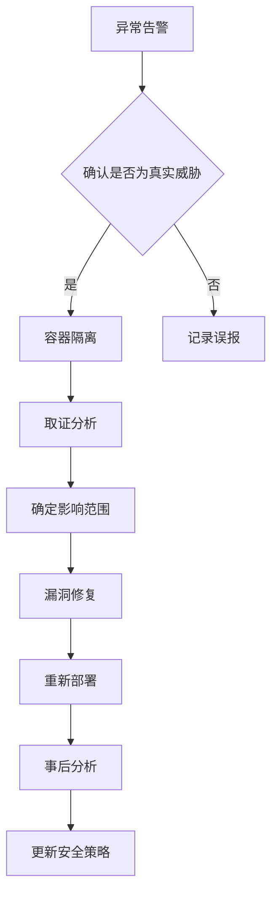
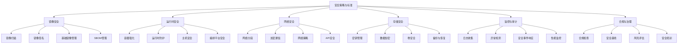

# Docker安全最佳实践  

容器技术在带来便捷性和灵活性的同时，也引入了新的安全挑战。本文将从镜像安全、运行时防护、网络隔离、权限控制、存储安全、审计监控、合规检查和应急响应等多个维度，详细介绍Docker安全最佳实践，帮助用户构建安全可靠的容器环境。

## 1. 镜像安全  

镜像是容器的基础，镜像安全是整个容器安全体系的第一道防线。

### 1.1 镜像扫描工具对比  

镜像扫描工具可以帮助识别镜像中的漏洞和安全问题，以下是几种常用工具的对比：

| 工具名称   | 扫描维度       | 集成方式      | 优势 | 劣势 |
|------------|--------------|--------------|------|------|
| Trivy      | CVE/配置      | CLI/CI       | 速度快、易于使用、支持多种操作系统 | 功能相对简单 |
| Clair      | 深度漏洞       | API服务       | 深度扫描、可扩展性强 | 部署复杂、资源消耗大 |
| Anchore    | 策略合规       | 企业级方案    | 全面的策略引擎、合规检查 | 学习曲线陡峭、商业版本较贵 |
| Docker Scout | 软件供应链    | CLI/Docker Desktop | 与Docker生态深度集成 | 部分功能需要订阅 |
| Snyk       | 漏洞/许可证    | CLI/CI/IDE   | 全面的漏洞数据库、开发者友好 | 免费版功能有限 |

选择合适的扫描工具时，应考虑以下因素：
- 扫描范围和深度
- 与现有CI/CD流程的集成难度
- 扫描速度和资源消耗
- 误报率和准确性
- 成本和许可模式

#### Trivy使用示例

```powershell
# 安装Trivy
Invoke-WebRequest -Uri "https://github.com/aquasecurity/trivy/releases/download/v0.37.3/trivy_0.37.3_windows_amd64.zip" -OutFile "c:\project\kphub\trivy.zip"
Expand-Archive -Path "c:\project\kphub\trivy.zip" -DestinationPath "c:\project\kphub\trivy"

# 扫描本地镜像
c:\project\kphub\trivy\trivy image nginx:latest

# 扫描并输出为JSON格式
c:\project\kphub\trivy\trivy image -f json -o c:\project\kphub\reports\nginx-scan.json nginx:latest

# 仅显示高危和严重漏洞
c:\project\kphub\trivy\trivy image --severity HIGH,CRITICAL nginx:latest

# 扫描Dockerfile
c:\project\kphub\trivy\trivy config c:\project\kphub\docker\app\Dockerfile
```

#### 在CI/CD流水线中集成镜像扫描

```yaml:c:\project\kphub\docker\ci\azure-pipelines.yml
trigger:
- main

pool:
  vmImage: 'ubuntu-latest'

steps:
- script: |
    docker build -t myapp:$(Build.BuildId) .
  displayName: 'Build Docker image'

- script: |
    curl -sfL https://raw.githubusercontent.com/aquasecurity/trivy/main/contrib/install.sh | sh -s -- -b /usr/local/bin
    trivy image --exit-code 1 --severity HIGH,CRITICAL myapp:$(Build.BuildId)
  displayName: 'Scan Docker image for vulnerabilities'
  continueOnError: true

- script: |
    docker push myregistry.azurecr.io/myapp:$(Build.BuildId)
  displayName: 'Push Docker image'
  condition: succeeded()
```

### 1.2 安全基础镜像  

选择安全的基础镜像是减少攻击面的有效方法。以下是几种常见的安全基础镜像：

1. **Distroless镜像**：只包含应用程序及其运行时依赖，不包含包管理器、shell等不必要的组件

```dockerfile:c:\project\kphub\docker\secure-base\Dockerfile
FROM gcr.io/distroless/base-debian11
COPY --chown=1000:1000 app /app
USER 1000
CMD ["/app"]
```

2. **Alpine镜像**：基于Alpine Linux，体积小、安全更新及时

```dockerfile:c:\project\kphub\docker\secure-base\alpine-Dockerfile
FROM alpine:3.16
RUN apk --no-cache add ca-certificates && \
    addgroup -S appgroup && adduser -S appuser -G appgroup
COPY --chown=appuser:appgroup app /app
USER appuser
CMD ["/app"]
```

3. **多阶段构建**：减少最终镜像中的构建工具和依赖

```dockerfile:c:\project\kphub\docker\secure-base\multistage-Dockerfile
# 构建阶段
FROM golang:1.19-alpine AS builder
WORKDIR /app
COPY . .
RUN go mod download && \
    CGO_ENABLED=0 GOOS=linux go build -a -installsuffix cgo -o app .

# 运行阶段
FROM alpine:3.16
RUN apk --no-cache add ca-certificates && \
    addgroup -S appgroup && adduser -S appuser -G appgroup
WORKDIR /app
COPY --from=builder --chown=appuser:appgroup /app/app .
USER appuser
CMD ["./app"]
```

### 1.3 镜像构建最佳实践

1. **使用.dockerignore文件**：排除不必要的文件，减少攻击面

```text:c:\project\kphub\docker\secure-base\.dockerignore
.git
.env
*.md
tests/
node_modules/
*.log
```

2. **固定依赖版本**：确保构建的可重复性和安全性

```dockerfile:c:\project\kphub\docker\secure-base\fixed-versions-Dockerfile
FROM node:16.17.0-alpine3.16
WORKDIR /app
COPY package*.json ./
RUN npm ci --production
COPY . .
USER node
CMD ["node", "index.js"]
```

3. **最小化层数**：减少镜像大小，提高构建和部署效率

```dockerfile:c:\project\kphub\docker\secure-base\minimal-layers-Dockerfile
FROM python:3.9-slim
WORKDIR /app
COPY requirements.txt .
RUN pip install --no-cache-dir -r requirements.txt && \
    useradd -m appuser
COPY --chown=appuser:appuser . .
USER appuser
CMD ["python", "app.py"]
```

4. **使用内容信任和签名**：确保镜像的完整性和来源

```powershell
# 启用Docker内容信任
$env:DOCKER_CONTENT_TRUST=1

# 签名并推送镜像
docker push myregistry.example.com/myapp:1.0.0
```

## 2. 运行时防护  

即使使用了安全的镜像，也需要在运行时采取措施保护容器。

### 2.1 安全启动参数  

Docker提供了多种安全相关的运行参数，可以限制容器的权限和资源：

```powershell
# 最小权限运行
docker run -d `
    --name secure-app `
    --read-only `
    --cap-drop=ALL `
    --security-opt=no-new-privileges `
    --memory=512m `
    --cpu-shares=512 `
    --pids-limit=100 `
    myapp:latest
```

参数说明：
- `--read-only`：将容器文件系统设为只读，防止恶意写入
- `--cap-drop=ALL`：删除所有Linux能力，减少权限
- `--security-opt=no-new-privileges`：防止通过setuid或setgid获取额外权限
- `--memory=512m`：限制内存使用，防止DoS攻击
- `--cpu-shares=512`：限制CPU使用
- `--pids-limit=100`：限制进程数量，防止fork炸弹

对于需要写入的目录，可以单独挂载可写卷：

```powershell
docker run -d `
    --name secure-app `
    --read-only `
    --tmpfs /tmp `
    -v app-logs:/app/logs `
    myapp:latest
```

### 2.2 Seccomp配置  

Seccomp (Secure Computing Mode) 可以限制容器内进程可以使用的系统调用，进一步减少攻击面：

```json:c:\project\kphub\docker\seccomp\profile.json
{
  "defaultAction": "SCMP_ACT_ERRNO",
  "architectures": [
    "SCMP_ARCH_X86_64",
    "SCMP_ARCH_X86",
    "SCMP_ARCH_AARCH64"
  ],
  "syscalls": [
    {
      "name": "accept",
      "action": "SCMP_ACT_ALLOW"
    },
    {
      "name": "accept4",
      "action": "SCMP_ACT_ALLOW"
    },
    {
      "name": "access",
      "action": "SCMP_ACT_ALLOW"
    },
    {
      "name": "arch_prctl",
      "action": "SCMP_ACT_ALLOW"
    },
    {
      "name": "bind",
      "action": "SCMP_ACT_ALLOW"
    },
    {
      "name": "brk",
      "action": "SCMP_ACT_ALLOW"
    },
    {
      "name": "close",
      "action": "SCMP_ACT_ALLOW"
    },
    {
      "name": "connect",
      "action": "SCMP_ACT_ALLOW"
    },
    {
      "name": "exit",
      "action": "SCMP_ACT_ALLOW"
    },
    {
      "name": "exit_group",
      "action": "SCMP_ACT_ALLOW"
    },
    {
      "name": "fcntl",
      "action": "SCMP_ACT_ALLOW"
    },
    {
      "name": "fstat",
      "action": "SCMP_ACT_ALLOW"
    },
    {
      "name": "futex",
      "action": "SCMP_ACT_ALLOW"
    },
    {
      "name": "getcwd",
      "action": "SCMP_ACT_ALLOW"
    },
    {
      "name": "getpid",
      "action": "SCMP_ACT_ALLOW"
    },
    {
      "name": "getsockname",
      "action": "SCMP_ACT_ALLOW"
    },
    {
      "name": "getsockopt",
      "action": "SCMP_ACT_ALLOW"
    },
    {
      "name": "listen",
      "action": "SCMP_ACT_ALLOW"
    },
    {
      "name": "lseek",
      "action": "SCMP_ACT_ALLOW"
    },
    {
      "name": "mmap",
      "action": "SCMP_ACT_ALLOW"
    },
    {
      "name": "mprotect",
      "action": "SCMP_ACT_ALLOW"
    },
    {
      "name": "munmap",
      "action": "SCMP_ACT_ALLOW"
    },
    {
      "name": "open",
      "action": "SCMP_ACT_ALLOW"
    },
    {
      "name": "read",
      "action": "SCMP_ACT_ALLOW"
    },
    {
      "name": "recvfrom",
      "action": "SCMP_ACT_ALLOW"
    },
    {
      "name": "rt_sigaction",
      "action": "SCMP_ACT_ALLOW"
    },
    {
      "name": "rt_sigprocmask",
      "action": "SCMP_ACT_ALLOW"
    },
    {
      "name": "sendto",
      "action": "SCMP_ACT_ALLOW"
    },
    {
      "name": "setitimer",
      "action": "SCMP_ACT_ALLOW"
    },
    {
      "name": "setsockopt",
      "action": "SCMP_ACT_ALLOW"
    },
    {
      "name": "socket",
      "action": "SCMP_ACT_ALLOW"
    },
    {
      "name": "stat",
      "action": "SCMP_ACT_ALLOW"
    },
    {
      "name": "uname",
      "action": "SCMP_ACT_ALLOW"
    },
    {
      "name": "write",
      "action": "SCMP_ACT_ALLOW"
    }
  ]
}
```

使用自定义Seccomp配置文件启动容器：

```powershell
docker run -d `
    --name secure-app `
    --security-opt seccomp=c:\project\kphub\docker\seccomp\profile.json `
    myapp:latest
```

### 2.3 AppArmor/SELinux配置

在Linux系统上，可以使用AppArmor或SELinux进一步限制容器的行为：

```powershell
# 使用AppArmor配置文件（Linux系统）
docker run -d `
    --name secure-app `
    --security-opt apparmor=docker-default `
    myapp:latest
```

AppArmor配置文件示例：

```text:c:\project\kphub\docker\apparmor\docker-custom
#include <tunables/global>

profile docker-custom flags=(attach_disconnected,mediate_deleted) {
  #include <abstractions/base>

  network,
  capability,
  file,
  umount,

  deny /etc/** w,
  deny /root/** rwl,
  deny /bin/** wl,
  deny /sbin/** wl,
  deny /usr/bin/** wl,
  deny /usr/sbin/** wl,

  /var/run/docker.sock rw,
  /app/** rwl,
  /tmp/** rwl,
}
```

### 2.4 运行时监控工具

除了静态配置，还可以使用运行时监控工具检测异常行为：

1. **Falco**：开源的容器运行时安全监控工具

```yaml:c:\project\kphub\docker\falco\falco.yaml
falco:
  rules_file:
    - /etc/falco/falco_rules.yaml
    - /etc/falco/falco_rules.local.yaml
    - /etc/falco/rules.d

syscall_event_drops:
  actions:
    - log
    - alert

outputs:
  rate: 1
  stdout_output:
    enabled: true
  file_output:
    enabled: true
    keep_alive: false
    filename: /var/log/falco.log
  program_output:
    enabled: false
    keep_alive: false
    program: "jq '{text: .output}' | curl -d @- -X POST https://hooks.slack.com/services/XXX"
```

Falco规则示例：

```yaml:c:\project\kphub\docker\falco\rules.yaml
- rule: Terminal shell in container
  desc: A shell was used as the entrypoint/exec point into a container with an attached terminal
  condition: >
    spawned_process and container
    and shell_procs and proc.tty != 0
    and container_entrypoint
  output: >
    A shell was spawned in a container with an attached terminal (user=%user.name container_id=%container.id
    container_name=%container.name shell=%proc.name parent=%proc.pname cmdline=%proc.cmdline)
  priority: NOTICE
  tags: [container, shell]

- rule: File system modified in read-only container
  desc: Detect file system modification in a read-only container
  condition: >
    open_write and container and container.mount_readonly
  output: >
    File system modified in read-only container (user=%user.name command=%proc.cmdline
    container_id=%container.id container_name=%container.name file=%fd.name)
  priority: WARNING
  tags: [container, filesystem]
```

2. **Docker Bench Security**：检查Docker环境是否符合CIS基准

```powershell
docker run --rm -it `
    --net host --pid host --userns host `
    --cap-add audit_control `
    -v /var/lib:/var/lib `
    -v /var/run/docker.sock:/var/run/docker.sock `
    -v /usr/lib/systemd:/usr/lib/systemd `
    -v /etc:/etc `
    docker/docker-bench-security
```

## 3. 网络隔离  

容器网络安全是防止横向移动和数据泄露的关键。

### 3.1 网络分段策略  

通过创建隔离的网络，可以限制容器间的通信：

```powershell
# 创建隔离网络
docker network create `
    --internal `
    --subnet=172.20.0.0/16 `
    --opt com.docker.network.bridge.enable_icc=false `
    secure_net
```

参数说明：
- `--internal`：创建不连接外网的内部网络
- `--subnet`：指定子网范围
- `--opt com.docker.network.bridge.enable_icc=false`：禁用容器间通信

使用Docker Compose实现网络分段：

```yaml:c:\project\kphub\docker\compose\network-isolation.yml
version: '3.8'

services:
  frontend:
    image: nginx:alpine
    networks:
      - frontend
    ports:
      - "80:80"

  api:
    image: api:latest
    networks:
      - frontend
      - backend

  database:
    image: postgres:13
    networks:
      - backend
    volumes:
      - db-data:/var/lib/postgresql/data

networks:
  frontend:
    driver: bridge
  backend:
    driver: bridge
    internal: true

volumes:
  db-data:
```

在这个例子中：
- `frontend`网络允许外部访问
- `backend`网络是内部网络，不能直接访问外部
- 只有`api`服务可以同时访问前端和后端网络
- 数据库只在后端网络中可见，无法从外部直接访问

### 3.2 加密通信配置  

为了保护传输中的数据，应该使用TLS加密容器间通信：

1. **生成TLS证书**：

```powershell
# 创建证书目录
New-Item -Path "c:\project\kphub\docker\certs" -ItemType Directory -Force

# 生成CA私钥
openssl genrsa -out c:\project\kphub\docker\certs\ca.key 4096

# 生成CA证书
openssl req -new -x509 -key c:\project\kphub\docker\certs\ca.key `
    -out c:\project\kphub\docker\certs\ca.crt -days 365 `
    -subj "/CN=Docker CA"

# 生成服务器私钥
openssl genrsa -out c:\project\kphub\docker\certs\server.key 4096

# 生成服务器CSR
openssl req -new -key c:\project\kphub\docker\certs\server.key `
    -out c:\project\kphub\docker\certs\server.csr `
    -subj "/CN=example.com"

# 签发服务器证书
openssl x509 -req -in c:\project\kphub\docker\certs\server.csr `
    -CA c:\project\kphub\docker\certs\ca.crt `
    -CAkey c:\project\kphub\docker\certs\ca.key `
    -CAcreateserial `
    -out c:\project\kphub\docker\certs\server.crt -days 365
```

2. **配置Nginx使用TLS**：

```dockerfile:c:\project\kphub\docker\secure-nginx\Dockerfile
FROM nginx:alpine
COPY ./certs/server.crt /etc/nginx/ssl/server.crt
COPY ./certs/server.key /etc/nginx/ssl/server.key
COPY ./nginx.conf /etc/nginx/conf.d/default.conf
```

```nginx:c:\project\kphub\docker\secure-nginx\nginx.conf
server {
    listen 443 ssl;
    server_name example.com;

    ssl_certificate /etc/nginx/ssl/server.crt;
    ssl_certificate_key /etc/nginx/ssl/server.key;
    ssl_protocols TLSv1.2 TLSv1.3;
    ssl_ciphers HIGH:!aNULL:!MD5;
    ssl_prefer_server_ciphers on;
    ssl_session_cache shared:SSL:10m;
    ssl_session_timeout 10m;

    location / {
        proxy_pass http://app:8080;
        proxy_set_header Host $host;
        proxy_set_header X-Real-IP $remote_addr;
        proxy_set_header X-Forwarded-For $proxy_add_x_forwarded_for;
        proxy_set_header X-Forwarded-Proto $scheme;
    }
}
```

3. **使用Docker Compose部署加密通信**：

```yaml:c:\project\kphub\docker\compose\secure-communication.yml
version: '3.8'

services:
  nginx:
    build:
      context: ../secure-nginx
      dockerfile: Dockerfile
    ports:
      - "443:443"
    networks:
      - frontend
    depends_on:
      - app

  app:
    image: app:latest
    networks:
      - frontend
      - backend
    environment:
      - DB_HOST=db
      - DB_USER=postgres
      - DB_PASSWORD_FILE=/run/secrets/db_password

  db:
    image: postgres:13
    networks:
      - backend
    volumes:
      - db-data:/var/lib/postgresql/data
    environment:
      - POSTGRES_PASSWORD_FILE=/run/secrets/db_password
    secrets:
      - db_password

networks:
  frontend:
    driver: bridge
  backend:
    driver: bridge
    internal: true

volumes:
  db-data:

secrets:
  db_password:
    file: ../secrets/db.pwd
```

### 3.3 网络策略和防火墙

在Kubernetes环境中，可以使用NetworkPolicy限制Pod间通信：

```yaml:c:\project\kphub\docker\k8s\network-policy.yml
apiVersion: networking.k8s.io/v1
kind: NetworkPolicy
metadata:
  name: db-policy
  namespace: production
spec:
  podSelector:
    matchLabels:
      app: database
  policyTypes:
  - Ingress
  ingress:
  - from:
    - podSelector:
        matchLabels:
          app: backend
    ports:
    - protocol: TCP
      port: 5432
```

对于Docker Swarm，可以使用overlay网络和服务隔离：

```yaml:c:\project\kphub\docker\swarm\secure-stack.yml
version: '3.8'

services:
  frontend:
    image: frontend:latest
    deploy:
      replicas: 2
    networks:
      - frontend
    ports:
      - "443:443"

  backend:
    image: backend:latest
    deploy:
      replicas: 3
    networks:
      - frontend
      - backend
    secrets:
      - db_password

  database:
    image: postgres:13
    deploy:
      replicas: 1
      placement:
        constraints:
          - node.role == manager
    networks:
      - backend
    volumes:
      - db-data:/var/lib/postgresql/data
    secrets:
      - db_password

networks:
  frontend:
    driver: overlay
  backend:
    driver: overlay
    attachable: false

volumes:
  db-data:

secrets:
  db_password:
    external: true
```

## 4. 权限控制  

限制容器的权限是防止容器逃逸和提权攻击的关键。

### 4.1 用户命名空间  

用户命名空间可以将容器内的root用户映射到主机上的非特权用户：

```powershell
# 在Docker daemon配置中启用用户命名空间
# 编辑 C:\ProgramData\docker\config\daemon.json

# 添加以下配置
# {
#   "userns-remap": "default"
# }

# 重启Docker服务
Restart-Service docker
```

这将创建一个名为"dockremap"的用户，并将容器内的root用户映射到主机上的这个非特权用户。

也可以在运行容器时指定用户：

```powershell
docker run -d --user 1000:1000 nginx:alpine
```

在Dockerfile中设置非root用户：

```dockerfile:c:\project\kphub\docker\non-root\Dockerfile
FROM node:16-alpine
RUN addgroup -S appgroup && adduser -S appuser -G appgroup
WORKDIR /app
COPY --chown=appuser:appgroup . .
USER appuser
CMD ["node", "app.js"]
```

### 4.2 能力限制  

Linux能力机制允许细粒度控制特权操作，默认情况下Docker会删除一些危险的能力，但最佳实践是删除所有能力，然后只添加必要的能力：

```powershell
# 删除所有能力，然后只添加必要的能力
docker run -d `
    --cap-drop=ALL `
    --cap-add=NET_BIND_SERVICE `
    --cap-add=CHOWN `
    nginx:alpine
```

常用的Linux能力：

| 能力 | 描述 | 安全风险 |
|------|------|----------|
| NET_BIND_SERVICE | 允许绑定1024以下的端口 | 低 |
| CHOWN | 允许修改文件所有者 | 中 |
| DAC_OVERRIDE | 允许绕过文件读写权限检查 | 高 |
| NET_ADMIN | 允许网络管理操作 | 高 |
| SYS_ADMIN | 允许执行系统管理操作 | 极高 |
| SYS_PTRACE | 允许跟踪进程 | 高 |
| SETUID/SETGID | 允许设置进程用户/组ID | 高 |

### 4.3 特权模式与安全风险

特权模式(`--privileged`)给予容器几乎与主机相同的权限，应该避免使用：

```powershell
# 不要这样做，除非绝对必要
docker run -d --privileged nginx:alpine
```

特权模式的风险：
- 容器可以访问所有设备
- 容器可以修改主机内核参数
- 容器可以挂载主机文件系统
- 容器可以执行几乎所有特权操作

如果必须使用特权容器，应该：
- 限制只在特定主机上运行
- 实施严格的访问控制
- 增强监控和审计
- 定期检查容器行为

### 4.4 PID和IPC命名空间

限制进程间通信和可见性：

```powershell
# 使用PID命名空间隔离
docker run -d --pid=host nginx:alpine  # 不推荐，容器可以看到主机进程

# 正确做法：使用默认PID命名空间
docker run -d nginx:alpine

# 限制IPC命名空间
docker run -d --ipc=none nginx:alpine
```

## 5. 存储安全  

保护容器数据存储是安全策略的重要组成部分。

### 5.1 敏感数据管理  

Docker提供了多种管理敏感数据的方法：

1. **使用Docker Secrets**：

```powershell
# 创建密钥
New-Item -Path "c:\project\kphub\docker\secrets" -ItemType Directory -Force
Set-Content -Path "c:\project\kphub\docker\secrets\db.pwd" -Value "SecurePassword123!"

# 在Swarm模式下创建密钥
docker secret create db_password c:\project\kphub\docker\secrets\db.pwd

# 使用密钥
docker service create `
    --name db `
    --secret db_password `
    -e POSTGRES_PASSWORD_FILE=/run/secrets/db_password `
    postgres:13
```

2. **使用环境变量文件**：

```env:c:\project\kphub\docker\env\db.env
POSTGRES_USER=dbuser
POSTGRES_PASSWORD=SecurePassword123!
POSTGRES_DB=appdb
```

```powershell
docker run -d `
    --env-file c:\project\kphub\docker\env\db.env `
    postgres:13
```

3. **使用Docker Compose管理密钥**：

```yaml:c:\project\kphub\docker\compose\secrets.yml
version: '3.8'

services:
  app:
    image: myapp:latest
    secrets:
      - db_password
      - api_key
    environment:
      - DB_PASSWORD_FILE=/run
继续编写Docker安全最佳实践的内容：

### 5.1 敏感数据管理（续）

3. **使用Docker Compose管理密钥**：

```yaml:c:\project\kphub\docker\compose\secrets.yml
version: '3.8'

services:
  app:
    image: myapp:latest
    secrets:
      - db_password
      - api_key
    environment:
      - DB_PASSWORD_FILE=/run/secrets/db_password
      - API_KEY_FILE=/run/secrets/api_key

  db:
    image: postgres:13
    secrets:
      - db_password
    environment:
      - POSTGRES_PASSWORD_FILE=/run/secrets/db_password

secrets:
  db_password:
    file: ../secrets/db.pwd
  api_key:
    file: ../secrets/api.key
```

4. **使用外部密钥管理系统**：

```yaml:c:\project\kphub\docker\compose\vault-integration.yml
version: '3.8'

services:
  app:
    image: myapp:latest
    environment:
      - VAULT_ADDR=https://vault.example.com:8200
      - VAULT_TOKEN_FILE=/run/secrets/vault_token
    secrets:
      - vault_token
    command: ["sh", "-c", "vault read -format=json secret/db | jq -r .data.password > /tmp/dbpass && ./start-app.sh"]

secrets:
  vault_token:
    file: ../secrets/vault.token
```

### 5.2 卷权限控制  

正确管理卷权限可以防止未授权访问和数据泄露：

1. **在Dockerfile中设置正确的权限**：

```dockerfile:c:\project\kphub\docker\volume-security\Dockerfile
FROM python:3.9-slim

# 创建应用用户
RUN groupadd -r appgroup && useradd -r -g appgroup appuser

# 创建并设置数据目录权限
RUN mkdir -p /data/logs /data/config \
    && chown -R appuser:appgroup /data \
    && chmod 750 /data \
    && chmod 770 /data/logs \
    && chmod 750 /data/config

VOLUME ["/data/logs", "/data/config"]

USER appuser

CMD ["python", "app.py"]
```

2. **使用只读卷**：

```powershell
docker run -d `
    -v c:\project\kphub\config:/config:ro `
    -v c:\project\kphub\logs:/logs `
    myapp:latest
```

3. **使用临时文件系统**：

```powershell
docker run -d `
    --tmpfs /tmp:rw,noexec,nosuid,size=100m `
    myapp:latest
```

4. **使用命名卷并设置权限**：

```powershell
# 创建命名卷
docker volume create --name app-data

# 初始化卷权限
docker run --rm -v app-data:/data alpine sh -c "chown -R 1000:1000 /data && chmod -R 750 /data"

# 使用卷
docker run -d -v app-data:/data myapp:latest
```

### 5.3 数据加密

保护静态数据的安全：

1. **文件系统加密**：

```powershell
# 在Windows上创建BitLocker加密卷
Enable-BitLocker -MountPoint "D:" -EncryptionMethod Aes256 -UsedSpaceOnly -Pin (ConvertTo-SecureString "123456" -AsPlainText -Force)

# 将加密卷挂载到容器
docker run -d -v D:\secure:/data myapp:latest
```

2. **使用加密工具**：

```dockerfile:c:\project\kphub\docker\encrypted-storage\Dockerfile
FROM ubuntu:20.04

RUN apt-get update && apt-get install -y \
    gnupg \
    && rm -rf /var/lib/apt/lists/*

COPY encrypt.sh /usr/local/bin/
COPY decrypt.sh /usr/local/bin/

RUN chmod +x /usr/local/bin/encrypt.sh /usr/local/bin/decrypt.sh

ENTRYPOINT ["/usr/local/bin/decrypt.sh"]
CMD ["app"]
```

```bash:c:\project\kphub\docker\encrypted-storage\encrypt.sh
#!/bin/bash
set -e

if [ -z "$GPG_KEY" ]; then
  echo "GPG_KEY environment variable is required"
  exit 1
fi

if [ -z "$1" ]; then
  echo "Usage: encrypt.sh <file>"
  exit 1
fi

gpg --batch --yes --recipient "$GPG_KEY" --encrypt "$1"
```

```bash:c:\project\kphub\docker\encrypted-storage\decrypt.sh
#!/bin/bash
set -e

if [ -z "$GPG_PASSPHRASE" ]; then
  echo "GPG_PASSPHRASE environment variable is required"
  exit 1
fi

# 解密配置文件
for file in /config/*.gpg; do
  if [ -f "$file" ]; then
    echo "$GPG_PASSPHRASE" | gpg --batch --yes --passphrase-fd 0 --decrypt "$file" > "${file%.gpg}"
  fi
done

# 执行原始命令
exec "$@"
```

## 6. 审计监控  

有效的审计和监控是检测和响应安全事件的关键。

### 6.1 事件日志收集  

Docker提供了多种方式收集容器日志和事件：

1. **使用Docker Events API**：

```powershell
# 监控特权操作
docker events --filter 'event=privileged' `
    >> c:\project\kphub\docker\logs\audit.log
```

2. **配置日志驱动**：

```json:c:\ProgramData\docker\config\daemon.json
{
  "log-driver": "json-file",
  "log-opts": {
    "max-size": "10m",
    "max-file": "3",
    "labels": "production_status",
    "env": "os,customer"
  }
}
```

3. **使用ELK Stack收集日志**：

```yaml:c:\project\kphub\docker\logging\docker-compose.yml
version: '3.8'

services:
  elasticsearch:
    image: docker.elastic.co/elasticsearch/elasticsearch:7.14.0
    environment:
      - discovery.type=single-node
      - bootstrap.memory_lock=true
      - "ES_JAVA_OPTS=-Xms512m -Xmx512m"
    ulimits:
      memlock:
        soft: -1
        hard: -1
    volumes:
      - esdata:/usr/share/elasticsearch/data
    ports:
      - "9200:9200"

  logstash:
    image: docker.elastic.co/logstash/logstash:7.14.0
    volumes:
      - ./logstash/pipeline:/usr/share/logstash/pipeline
    ports:
      - "5044:5044"
    depends_on:
      - elasticsearch

  kibana:
    image: docker.elastic.co/kibana/kibana:7.14.0
    ports:
      - "5601:5601"
    depends_on:
      - elasticsearch

  filebeat:
    image: docker.elastic.co/beats/filebeat:7.14.0
    user: root
    volumes:
      - ./filebeat/filebeat.yml:/usr/share/filebeat/filebeat.yml:ro
      - /var/lib/docker/containers:/var/lib/docker/containers:ro
      - /var/run/docker.sock:/var/run/docker.sock:ro
    depends_on:
      - logstash

volumes:
  esdata:
```

```yaml:c:\project\kphub\docker\logging\filebeat\filebeat.yml
filebeat.inputs:
- type: container
  paths:
    - '/var/lib/docker/containers/*/*.log'
  processors:
    - add_docker_metadata:
        host: "unix:///var/run/docker.sock"

processors:
  - add_host_metadata: ~
  - add_cloud_metadata: ~

output.logstash:
  hosts: ["logstash:5044"]
```

### 6.2 行为基线检测  

使用Falco等工具监控容器异常行为：

```powershell
docker run -d `
    --name falco `
    --privileged `
    -v /var/run/docker.sock:/host/var/run/docker.sock `
    -v c:\project\kphub\docker\falco\falco.yaml:/etc/falco/falco.yaml `
    -v c:\project\kphub\docker\falco\rules:/etc/falco/rules.d `
    falcosecurity/falco
```

自定义Falco规则示例：

```yaml:c:\project\kphub\docker\falco\rules\custom-rules.yaml
- rule: Container Shell Activity
  desc: A shell command was executed within a container
  condition: >
    container.id != "" and
    proc.name = bash and
    not container.image.repository in (allowed_shells_images)
  output: >
    Shell activity detected in container (user=%user.name container_id=%container.id
    container_name=%container.name image=%container.image.repository:%container.image.tag
    shell=%proc.name parent=%proc.pname cmdline=%proc.cmdline)
  priority: WARNING
  tags: [container, shell]

- rule: Sensitive File Access
  desc: Sensitive file accessed in container
  condition: >
    container.id != "" and
    fd.name startswith /etc/passwd and
    not container.image.repository in (allowed_passwd_images)
  output: >
    Sensitive file accessed in container (user=%user.name container_id=%container.id
    container_name=%container.name image=%container.image.repository:%container.image.tag
    file=%fd.name)
  priority: WARNING
  tags: [container, filesystem]

- list: allowed_shells_images
  items: [
    "alpine",
    "debian",
    "ubuntu"
  ]

- list: allowed_passwd_images
  items: [
    "auth-service"
  ]
```

### 6.3 容器运行时防护

使用运行时防护工具增强容器安全：

1. **Aqua Security**：

```yaml:c:\project\kphub\docker\runtime\aqua-agent.yml
version: '3.8'

services:
  aqua-agent:
    image: aquasec/enforcer:5.3
    restart: always
    privileged: true
    volumes:
      - /var/run/docker.sock:/var/run/docker.sock
      - /opt/aquasec:/opt/aquasec
    environment:
      - AQUA_SERVER=aqua-server:3622
      - AQUA_TOKEN=<token>
```

2. **Sysdig Secure**：

```yaml:c:\project\kphub\docker\runtime\sysdig-agent.yml
version: '3.8'

services:
  sysdig-agent:
    image: sysdig/agent
    restart: always
    privileged: true
    volumes:
      - /var/run/docker.sock:/host/var/run/docker.sock
      - /dev:/host/dev
      - /proc:/host/proc:ro
      - /boot:/host/boot:ro
      - /lib/modules:/host/lib/modules:ro
      - /usr:/host/usr:ro
    environment:
      - ACCESS_KEY=<access_key>
      - SECURE=true
```

## 7. 合规检查  

确保Docker环境符合行业标准和最佳实践。

### 7.1 CIS基准检测  

CIS Docker Benchmark提供了Docker安全配置的标准：

```powershell
# 使用Docker Bench Security检查CIS合规性
docker run -it --net host --pid host `
    -v /var/run/docker.sock:/var/run/docker.sock `
    -v c:\project\kphub\docker\cis\:/output `
    aquasec/kube-bench:latest `
    --benchmark docker-ce
```

CIS Docker Benchmark主要检查项：

1. **主机配置**：
   - Docker版本和补丁
   - Linux内核参数
   - 文件系统权限

2. **Docker守护进程配置**：
   - TLS认证
   - 默认ulimit设置
   - 日志级别和驱动

3. **Docker守护进程文件权限**：
   - 套接字文件权限
   - 配置文件权限

4. **容器镜像和构建文件**：
   - 使用受信任的基础镜像
   - 不在镜像中包含敏感信息

5. **容器运行时**：
   - 限制特权容器
   - 挂载敏感主机路径
   - 网络命名空间配置

### 7.2 安全评分工具  

使用Docker Scout等工具评估容器安全状况：

```powershell
# 安装Docker Scout CLI
docker extension install docker/scout-extension

# 分析镜像安全状况
docker scout quickview myapp:latest

# 生成详细报告
docker scout cves myapp:latest --format json > c:\project\kphub\docker\reports\myapp-cves.json

# 比较两个镜像的安全状况
docker scout compare myapp:latest myapp:previous
```

Docker Scout评估维度：

1. **漏洞扫描**：
   - 操作系统包漏洞
   - 语言依赖漏洞
   - 严重性分级

2. **最佳实践检查**：
   - 使用非root用户
   - 多阶段构建
   - 镜像大小优化

3. **软件物料清单(SBOM)**：
   - 组件列表
   - 许可证合规性
   - 依赖关系图

### 7.3 自动化合规检查

将合规检查集成到CI/CD流水线中：

```yaml:c:\project\kphub\docker\ci\compliance-pipeline.yml
name: Docker Security Compliance

on:
  push:
    branches: [ main ]
  pull_request:
    branches: [ main ]

jobs:
  security-scan:
    runs-on: ubuntu-latest
    steps:
      - name: Checkout code
        uses: actions/checkout@v2

      - name: Build image
        run: docker build -t myapp:${{ github.sha }} .

      - name: Run Trivy vulnerability scanner
        uses: aquasecurity/trivy-action@master
        with:
          image-ref: 'myapp:${{ github.sha }}'
          format: 'sarif'
          output: 'trivy-results.sarif'
          severity: 'CRITICAL,HIGH'
          exit-code: '1'
          ignore-unfixed: true

      - name: Run Dockle linter
        uses: goodwithtech/dockle-action@v1
        with:
          image: 'myapp:${{ github.sha }}'
          format: 'sarif'
          output: 'dockle-results.sarif'
          exit-code: '1'
          ignore: 'CIS-DI-0001'

      - name: Upload Trivy scan results to GitHub Security tab
        uses: github/codeql-action/upload-sarif@v1
        with:
          sarif_file: 'trivy-results.sarif'

      - name: Upload Dockle scan results to GitHub Security tab
        uses: github/codeql-action/upload-sarif@v1
        with:
          sarif_file: 'dockle-results.sarif'
```

## 8. 应急响应  

即使采取了所有预防措施，仍需准备应对安全事件的能力。

### 8.1 入侵检测流程  

建立容器安全事件的响应流程：



入侵检测流程详解：

1. **异常告警**：
   - 监控系统检测到异常行为
   - 安全工具发出警报
   - 用户报告可疑活动

2. **确认威胁**：
   - 分析告警信息
   - 检查日志和事件
   - 确定是否为误报

3. **容器隔离**：
   - 停止可疑容器
   - 断开网络连接
   - 保留容器状态以供分析

4. **取证分析**：
   - 收集容器镜像和运行时数据
   - 分析日志和文件系统
   - 确定入侵途径和方法

5. **确定影响范围**：
   - 识别受影响的系统和数据
   - 评估潜在的数据泄露
   - 确定业务影响

6. **漏洞修复**：
   - 修补安全漏洞
   - 更新容器镜像
   - 加强安全配置

7. **重新部署**：
   - 使用安全的镜像重新部署
   - 验证安全配置
   - 恢复正常服务

8. **事后分析**：
   - 编写事件报告
   - 分析安全漏洞根本原因
   - 总结经验教训

9. **更新安全策略**：
   - 改进监控和告警机制
   - 更新安全基线和策略
   - 加强安全培训

### 8.2 取证工具包  

准备容器取证工具，以便在安全事件发生时快速响应：

```powershell
# 创建取证工具容器
docker run --rm -it `
    -v /var/run/docker.sock:/var/run/docker.sock `
    -v c:\project\kphub\docker\forensics:/output `
    alpine/dfir
```

自定义取证工具包：

```dockerfile:c:\project\kphub\docker\forensics\Dockerfile
FROM ubuntu:20.04

RUN apt-get update && apt-get install -y \
    curl \
    jq \
    iproute2 \
    net-tools \
    netcat \
    tcpdump \
    strace \
    lsof \
    procps \
    psmisc \
    binutils \
    file \
    xxd \
    && rm -rf /var/lib/apt/lists/*

COPY forensic-scripts/ /usr/local/bin/
RUN chmod +x /usr/local/bin/*.sh

WORKDIR /investigation
ENTRYPOINT ["/bin/bash"]
```

取证脚本示例：

```bash:c:\project\kphub\docker\forensics\forensic-scripts\container-dump.sh
#!/bin/bash
set -e

if [ -z "$1" ]; then
  echo "Usage: container-dump.sh <container_id>"
  exit 1
fi

CONTAINER_ID=$1
OUTPUT_DIR="/output/${CONTAINER_ID}"

mkdir -p "${OUTPUT_DIR}"

# 收集容器信息
docker inspect "${CONTAINER_ID}" > "${OUTPUT_DIR}/container-info.json"

# 导出容器文件系统
docker export "${CONTAINER_ID}" > "${OUTPUT_DIR}/container-fs.tar"

# 收集容器日志
docker logs "${CONTAINER_ID}" > "${OUTPUT_DIR}/container-logs.txt"

# 收集容器进程信息
docker top "${CONTAINER_ID}" > "${OUTPUT_DIR}/container-processes.txt"

# 收集网络信息
docker exec "${CONTAINER_ID}" netstat -tulpn > "${OUTPUT_DIR}/container-netstat.txt" 2>/dev/null || true
docker exec "${CONTAINER_ID}" ip addr > "${OUTPUT_DIR}/container-ip.txt" 2>/dev/null || true

# 收集运行时信息
docker exec "${CONTAINER_ID}" ps aux > "${OUTPUT_DIR}/container-ps.txt" 2>/dev/null || true
docker exec "${CONTAINER_ID}" env > "${OUTPUT_DIR}/container-env.txt" 2>/dev/null || true

echo "Container forensic data collected in ${OUTPUT_DIR}"
```

### 8.3 容器隔离策略

在检测到安全事件时，快速隔离受影响的容器：

```powershell
# 隔离可疑容器（断开网络但保持运行）
docker network disconnect bridge suspicious-container

# 创建取证快照
docker commit suspicious-container forensic-snapshot:$(Get-Date -Format "yyyyMMdd-HHmmss")

# 停止容器但不删除（保留证据）
docker stop suspicious-container
```

使用Docker Compose实现隔离：

```yaml:c:\project\kphub\docker\incident-response\isolate.yml
version: '3.8'

services:
  forensic-container:
    image: ${CONTAINER_IMAGE}
    container_name: forensic-${CONTAINER_ID}
    network_mode: none
    volumes:
      - ${CONTAINER_ID}:/data
    command: sleep infinity
```

```powershell
# 使用隔离配置
$env:CONTAINER_IMAGE="suspicious-image"
$env:CONTAINER_ID="suspicious-container"
docker-compose -f c:\project\kphub\docker\incident-response\isolate.yml up -d
```

## 9. 安全最佳实践总结

基于前面的内容，总结Docker安全的关键最佳实践：

### 9.1 镜像安全最佳实践

1. **使用官方或受信任的基础镜像**
2. **定期更新基础镜像和依赖**
3. **使用多阶段构建减少镜像大小**
4. **在CI/CD流程中集成镜像扫描**
5. **实施镜像签名和验证**
6. **避免在镜像中包含敏感信息**
7. **使用非root用户运行应用**
8. **最小化镜像中的包和依赖**

### 9.2 运行时安全最佳实践

1. **使用只读文件系统**
2. **删除不必要的Linux能力**
3. **启用Seccomp过滤器**
4. **避免使用特权容器**
5. **限制资源使用（CPU、内存、进程数）**
6. **使用用户命名空间隔离**
7. **定期审计容器配置**
8. **实施运行时监控和异常检测**

### 9.3 网络安全最佳实践

1. **使用内部网络隔离敏感服务**
2. **实施网络分段和微分段**
3. **使用TLS加密容器间通信**
4. **限制容器间通信（ICC）**
5. **避免将敏感端口暴露到主机**
6. **使用网络策略控制流量**
7. **实施防火墙规则**
8. **监控网络流量和异常行为**

### 9.4 存储安全最佳实践

1. **使用Docker Secrets管理敏感数据**
2. **正确设置卷和挂载点权限**
3. **使用临时文件系统存储临时数据**
4. **加密敏感数据**
5. **避免挂载敏感主机目录**
6. **定期备份重要数据**
7. **实施数据访问审计**
8. **使用卷驱动加密数据**

### 9.5 监控和审计最佳实践

1. **集中收集和分析容器日志**
2. **监控Docker API和事件**
3. **实施行为基线和异常检测**
4. **定期执行安全扫描和合规检查**
5. **保留足够的审计日志**
6. **设置关键事件的告警**
7. **使用SIEM系统集成容器安全事件**
8. **定期审查访问控制和权限**

## 10. 企业级Docker安全架构

对于企业环境，应该实施全面的Docker安全架构：



### 10.1 分层安全策略

企业应采用分层安全策略保护容器环境：

1. **基础设施层**：
   - 主机操作系统强化
   - 网络分段和防火墙
   - 物理安全和访问控制

2. **容器平台层**：
   - Docker守护进程安全配置
   - 编排平台安全设置
   - API访问控制和认证

3. **镜像和注册表层**：
   - 镜像扫描和签名
   - 注册表访问控制
   - 镜像生命周期管理

4. **容器运行时层**：
   - 容器强化和隔离
   - 运行时监控和防护
   - 资源限制和QoS

5. **应用层**：
   - 应用安全编码
   - 依赖管理
   - 身份验证和授权

6. **数据层**：
   - 数据加密
   - 访问控制
   - 备份和恢复

### 10.2 安全运营中心(SOC)集成

将容器安全事件集成到企业安全运营中心：

```yaml:c:\project\kphub\docker\soc\siem-integration.yml
version: '3.8'

services:
  filebeat:
    image: docker.elastic.co/beats/filebeat:7.14.0
    user: root
    volumes:
      - ./filebeat/filebeat.yml:/usr/share/filebeat/filebeat.yml:ro
      - /var/lib/docker/containers:/var/lib/docker/containers:ro
      - /var/run/docker.sock:/var/run/docker.sock:ro
    environment:
      - ELASTICSEARCH_HOST=siem.example.com
      - ELASTICSEARCH_PORT=9200
      - ELASTICSEARCH_USERNAME=elastic
      - ELASTICSEARCH_PASSWORD=${ELASTIC_PASSWORD}
```

```yaml:c:\project\kphub\docker\soc\filebeat\filebeat.yml
filebeat.inputs:
- type: container
  paths:
    - '/var/lib/docker/containers/*/*.log'
  processors:
    - add_docker_metadata:
        host: "unix:///var/run/docker.sock"
    - add_fields:
        target: ''
        fields:
          data_source: 'docker'
          environment: 'production'

processors:
  - add_host_metadata: ~
  - add_cloud_metadata: ~

output.elasticsearch:
  hosts: ["${ELASTICSEARCH_HOST}:${ELASTICSEARCH_PORT}"]
  username: "${ELASTICSEARCH_USERNAME}"
  password: "${ELASTICSEARCH_PASSWORD}"
  indices:
    - index: "docker-logs-%{+yyyy.MM.dd}"
```

## 结论

Docker安全是一个多层次、持续演进的过程，需要从镜像构建到运行时防护的全面考虑。通过实施本文介绍的最佳实践，组织可以显著提高容器环境的安全性，减少安全风险。

生产环境应建立从镜像构建到运行时防护的全流程安全体系，关键系统建议每周执行安全扫描，所有变更需通过安全评审。记录所有操作日志并保留至少6个月以供审计。定期进行安全培训和演练，确保团队能够有效应对安全事件。

随着容器技术的不断发展，安全实践也需要不断更新和完善。组织应该持续关注Docker安全领域的最新发展，及时调整安全策略和实践，以应对不断变化的威胁环境。