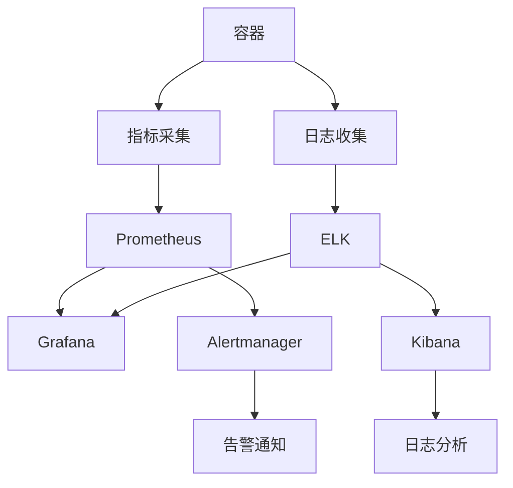
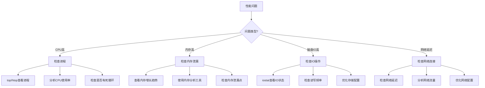
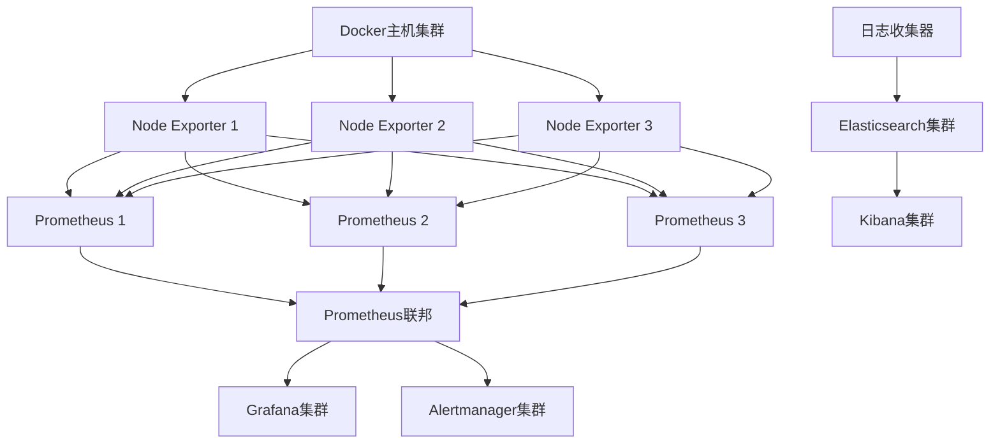
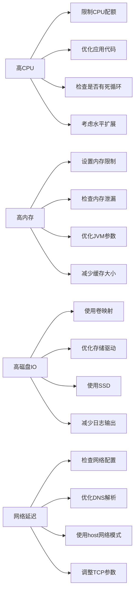
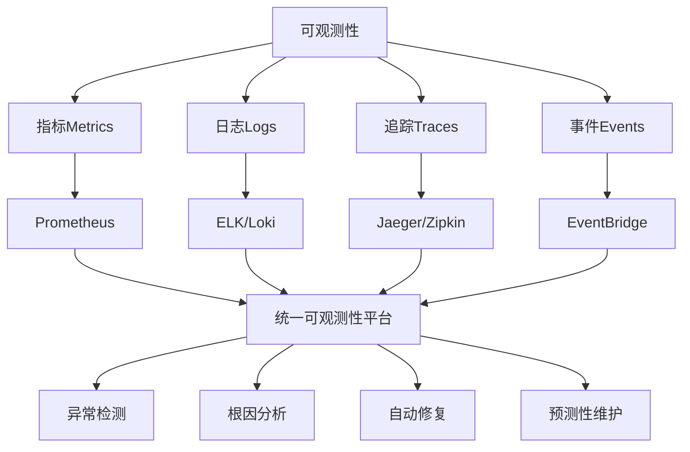

# Docker监控与日志管理  

容器化应用的普及带来了新的监控和日志管理挑战。与传统应用不同，容器具有短暂性、动态性和分布式特点，需要专门的监控和日志管理策略。本文将详细介绍Docker环境下的监控体系架构、指标采集方案、日志管理方案、性能分析方法、告警策略设置以及可视化平台构建，帮助用户建立完善的Docker监控与日志管理体系。

## 1. 监控体系架构  

一个完善的Docker监控体系需要覆盖容器、主机和应用三个层面，通过多维度数据采集和分析，实现全面监控。

### 1.1 监控组件拓扑  

Docker监控体系通常由以下组件构成，形成一个完整的数据流转路径：



各组件职责说明：
- **容器**：监控的对象，包括Docker容器和宿主机
- **指标采集**：通过cAdvisor、Node Exporter等工具采集性能指标
- **日志收集**：通过Filebeat、Fluentd等工具收集容器日志
- **Prometheus**：时序数据库，存储和查询指标数据
- **ELK**：Elasticsearch、Logstash、Kibana，用于日志存储、处理和分析
- **Grafana**：可视化平台，展示监控指标和日志数据
- **Alertmanager**：告警管理器，处理告警规则和通知

### 1.2 关键监控指标  

Docker环境中需要监控的关键指标可分为以下几类：

| 类别       | 指标项                  | 采集方式        | 重要性 | 建议阈值 |
|------------|-------------------------|----------------|--------|----------|
| 资源       | CPU使用率               | cAdvisor       | 高     | 80%      |
| 资源       | 内存使用率              | cAdvisor       | 高     | 85%      |
| 资源       | 磁盘使用率              | Node Exporter  | 高     | 80%      |
| 网络       | 网络流入/流出流量       | cAdvisor       | 中     | 根据带宽 |
| 网络       | TCP连接数               | Node Exporter  | 中     | 根据应用 |
| 网络       | 网络错误包              | Node Exporter  | 中     | >0       |
| 存储       | IOPS                    | Device Mapper  | 中     | 根据设备 |
| 存储       | 吞吐量                  | Device Mapper  | 中     | 根据设备 |
| 存储       | I/O等待时间             | Node Exporter  | 高     | >100ms   |
| 容器       | 容器数量                | Docker API     | 低     | 根据主机 |
| 容器       | 容器重启次数            | Docker API     | 高     | >3       |
| 容器       | OOM Kill次数            | cAdvisor       | 高     | >0       |
| 应用       | HTTP请求响应时间        | 应用Exporter   | 高     | >500ms   |
| 应用       | 错误率                  | 应用Exporter   | 高     | >1%      |
| 系统       | 负载平均值              | Node Exporter  | 高     | >CPU核数 |

### 1.3 多层次监控策略

有效的Docker监控需要覆盖多个层次：

1. **基础设施层**：
   - 主机CPU、内存、磁盘、网络
   - 虚拟化平台指标
   - 存储系统性能

2. **Docker引擎层**：
   - Docker守护进程状态
   - 镜像和容器管理
   - 存储驱动性能

3. **容器层**：
   - 容器资源使用
   - 容器生命周期事件
   - 容器网络连接

4. **应用层**：
   - 应用特定指标
   - 业务逻辑监控
   - 用户体验数据

## 2. 指标采集方案  

指标采集是监控系统的基础，需要选择合适的工具和配置方式。

### 2.1 Prometheus配置  

Prometheus是一个开源的监控系统和时序数据库，特别适合容器环境的监控：

```yaml:c:\project\kphub\docker\monitor\prometheus.yml
global:
  scrape_interval: 15s     # 默认抓取间隔
  evaluation_interval: 15s # 规则评估间隔

# 告警管理器配置
alerting:
  alertmanagers:
  - static_configs:
    - targets:
      - alertmanager:9093

# 规则文件列表
rule_files:
  - "alert.rules"

# 抓取配置
scrape_configs:
  # Docker容器监控
  - job_name: 'docker'
    static_configs:
      - targets: ['cadvisor:8080']
    
  # 主机监控
  - job_name: 'node'
    static_configs:
      - targets: ['node-exporter:9100']
    
  # Docker守护进程监控
  - job_name: 'dockerd'
    static_configs:
      - targets: ['dockerd-exporter:9323']
    
  # 应用监控示例
  - job_name: 'app'
    static_configs:
      - targets: ['app:8000']
    
  # Prometheus自身监控
  - job_name: 'prometheus'
    static_configs:
      - targets: ['localhost:9090']
```

使用Docker Compose部署Prometheus：

```yaml:c:\project\kphub\docker\compose\prometheus.yml
version: '3.8'

services:
  prometheus:
    image: prom/prometheus:v2.37.0
    volumes:
      - c:\project\kphub\docker\monitor\prometheus.yml:/etc/prometheus/prometheus.yml
      - c:\project\kphub\docker\monitor\alert.rules:/etc/prometheus/alert.rules
      - prometheus_data:/prometheus
    command:
      - '--config.file=/etc/prometheus/prometheus.yml'
      - '--storage.tsdb.path=/prometheus'
      - '--web.console.libraries=/usr/share/prometheus/console_libraries'
      - '--web.console.templates=/usr/share/prometheus/consoles'
    ports:
      - "9090:9090"
    restart: unless-stopped

volumes:
  prometheus_data:
```

### 2.2 cAdvisor部署  

cAdvisor (Container Advisor) 提供容器用户的资源使用情况和性能特性的信息：

```powershell
docker run -d `
  --volume=c:/:/rootfs:ro `
  --volume=c:/var/run:/var/run:ro `
  --volume=c:/sys:/sys:ro `
  --volume=c:/var/lib/docker/:/var/lib/docker:ro `
  --publish=8080:8080 `
  --name=cadvisor `
  --restart=always `
  gcr.io/cadvisor/cadvisor:v0.47.0
```

在Docker Compose中集成cAdvisor：

```yaml:c:\project\kphub\docker\compose\monitoring-stack.yml
version: '3.8'

services:
  cadvisor:
    image: gcr.io/cadvisor/cadvisor:v0.47.0
    volumes:
      - c:/:/rootfs:ro
      - c:/var/run:/var/run:ro
      - c:/sys:/sys:ro
      - c:/var/lib/docker/:/var/lib/docker:ro
    ports:
      - "8080:8080"
    restart: unless-stopped
    
  node-exporter:
    image: prom/node-exporter:v1.3.1
    volumes:
      - c:/proc:/host/proc:ro
      - c:/sys:/host/sys:ro
      - c:/:/rootfs:ro
    command:
      - '--path.procfs=/host/proc'
      - '--path.sysfs=/host/sys'
      - '--collector.filesystem.ignored-mount-points=^/(sys|proc|dev|host|etc)($$|/)'
    ports:
      - "9100:9100"
    restart: unless-stopped
    
  dockerd-exporter:
    image: stefanprodan/dockerd-exporter:latest
    environment:
      - DOCKER_GWBRIDGE=172.18.0.1
    ports:
      - "9323:9323"
    restart: unless-stopped
```

### 2.3 自定义指标采集

除了基础指标外，还可以采集应用特定的指标：

1. **使用Prometheus客户端库**：

```python:c:\project\kphub\docker\monitor\app-metrics.py
from prometheus_client import start_http_server, Counter, Gauge, Histogram
import random
import time

# 创建指标
REQUEST_COUNT = Counter('app_requests_total', 'Total app HTTP requests')
REQUEST_INPROGRESS = Gauge('app_requests_inprogress', 'Inprogress requests')
REQUEST_LATENCY = Histogram('app_request_latency_seconds', 'Request latency')

# 模拟请求处理
def process_request():
    REQUEST_COUNT.inc()
    REQUEST_INPROGRESS.inc()
    
    # 模拟处理时间
    latency = random.random()
    time.sleep(latency)
    
    REQUEST_LATENCY.observe(latency)
    REQUEST_INPROGRESS.dec()

if __name__ == '__main__':
    # 启动指标服务器
    start_http_server(8000)
    
    # 模拟应用
    while True:
        process_request()
        time.sleep(1)
```

2. **使用Prometheus Exporter**：

```dockerfile:c:\project\kphub\docker\monitor\custom-exporter\Dockerfile
FROM python:3.9-slim

WORKDIR /app

COPY requirements.txt .
RUN pip install --no-cache-dir -r requirements.txt

COPY app-metrics.py .

EXPOSE 8000

CMD ["python", "app-metrics.py"]
```

## 3. 日志管理方案  

容器日志管理需要考虑日志收集、存储、分析和查询等多个方面。

### 3.1 日志驱动配置  

Docker提供多种日志驱动，可以根据需求选择合适的驱动：

```powershell
# 配置默认日志驱动（修改Docker守护进程配置）
# 编辑 C:\ProgramData\docker\config\daemon.json

# 添加以下配置
# {
#   "log-driver": "json-file",
#   "log-opts": {
#     "max-size": "100m",
#     "max-file": "3"
#   }
# }

# 重启Docker服务
Restart-Service docker
```

常用日志驱动对比：

| 日志驱动 | 适用场景 | 优点 | 缺点 |
|----------|----------|------|------|
| json-file | 开发环境、小型部署 | 简单易用，支持docker logs命令 | 日志文件可能占用大量磁盘空间 |
| syslog | 集中式日志管理 | 与系统日志集成 | 不支持docker logs命令 |
| journald | 使用systemd的系统 | 结构化日志，支持查询 | 仅限于systemd系统 |
| fluentd | 大型分布式环境 | 灵活的日志路由和处理 | 需要额外部署fluentd服务 |
| splunk | 企业环境 | 强大的分析和搜索能力 | 商业软件，成本高 |
| awslogs | AWS环境 | 与CloudWatch集成 | 仅适用于AWS |
| gelf | 通用日志格式 | 支持结构化日志 | 需要兼容GELF的日志服务器 |

为单个容器配置日志驱动：

```powershell
docker run -d `
  --name web `
  --log-driver json-file `
  --log-opt max-size=10m `
  --log-opt max-file=3 `
  nginx
```

### 3.2 ELK集成配置  

ELK (Elasticsearch, Logstash, Kibana) 是流行的日志管理解决方案：

```yaml:c:\project\kphub\docker\compose\elk.yml
version: '3.8'

services:
  elasticsearch:
    image: docker.elastic.co/elasticsearch/elasticsearch:8.6.2
    environment:
      - discovery.type=single-node
      - ES_JAVA_OPTS=-Xms512m -Xmx512m
      - xpack.security.enabled=false
    volumes:
      - elasticsearch_data:/usr/share/elasticsearch/data
    ports:
      - "9200:9200"
    restart: unless-stopped
    
  logstash:
    image: docker.elastic.co/logstash/logstash:8.6.2
    volumes:
      - c:\project\kphub\docker\logstash\pipeline:/usr/share/logstash/pipeline
    ports:
      - "5044:5044"
    depends_on:
      - elasticsearch
    restart: unless-stopped
    
  kibana:
    image: docker.elastic.co/kibana/kibana:8.6.2
    environment:
      - ELASTICSEARCH_HOSTS=http://elasticsearch:9200
    ports:
      - "5601:5601"
    depends_on:
      - elasticsearch
    restart: unless-stopped
    
  filebeat:
    image: docker.elastic.co/beats/filebeat:8.6.2
    volumes:
      - c:/var/lib/docker/containers:/var/lib/docker/containers:ro
      - c:\project\kphub\docker\filebeat.yml:/usr/share/filebeat/filebeat.yml:ro
    depends_on:
      - elasticsearch
      - logstash
    restart: unless-stopped

volumes:
  elasticsearch_data:
```

Filebeat配置文件：

```yaml:c:\project\kphub\docker\filebeat.yml
filebeat.inputs:
- type: container
  paths:
    - '/var/lib/docker/containers/*/*.log'
  json.keys_under_root: true
  json.message_key: log
  json.add_error_key: true
  processors:
    - add_docker_metadata:
        host: "unix:///var/run/docker.sock"

processors:
  - add_host_metadata: ~
  - add_cloud_metadata: ~
  - add_docker_metadata: ~

output.elasticsearch:
  hosts: ["elasticsearch:9200"]
  indices:
    - index: "docker-%{+yyyy.MM.dd}"

# 或者输出到Logstash
# output.logstash:
#   hosts: ["logstash:5044"]
```

Logstash管道配置：

```conf:c:\project\kphub\docker\logstash\pipeline\docker.conf
input {
  beats {
    port => 5044
  }
}

filter {
  if [container] {
    mutate {
      add_field => { "[@metadata][target_index]" => "docker-%{+YYYY.MM.dd}" }
    }
    
    # 解析日志级别
    grok {
      match => { "message" => "(?<loglevel>INFO|DEBUG|WARN|ERROR|FATAL)" }
    }
    
    # 时间戳处理
    date {
      match => [ "timestamp", "ISO8601" ]
      target => "@timestamp"
    }
  }
}

output {
  elasticsearch {
    hosts => ["elasticsearch:9200"]
    index => "%{[@metadata][target_index]}"
  }
}
```

### 3.3 日志轮转策略

为防止日志占用过多磁盘空间，需要配置合理的日志轮转策略：

```json:c:\ProgramData\docker\config\daemon.json
{
  "log-driver": "json-file",
  "log-opts": {
    "max-size": "100m",
    "max-file": "5",
    "compress": "true"
  }
}
```

对于已存在的容器，可以使用logrotate工具：

```conf:c:\project\kphub\docker\logrotate\docker-logs
/var/lib/docker/containers/*/*.log {
    daily
    rotate 7
    compress
    delaycompress
    missingok
    copytruncate
    dateext
    dateformat -%Y%m%d
    create 0644 root root
}
```

## 4. 性能分析方法  

当容器出现性能问题时，需要有系统的分析方法定位和解决问题。

### 4.1 实时资源监控  

Docker提供了基本的资源监控命令：

```powershell
# 容器级监控
docker stats --format "table {{.Name}}\t{{.CPUPerc}}\t{{.MemUsage}}\t{{.NetIO}}\t{{.BlockIO}}"

# 查看特定容器
docker stats web db

# 自定义输出格式
docker stats --format "{{.Name}}: {{.CPUPerc}} CPU, {{.MemUsage}} MEM"

# 系统级检查
docker run --rm -it --net=host --pid=host nicolaka/netshoot top
```

使用netshoot工具箱进行高级监控：

```powershell
# 网络监控
docker run --rm -it --net=host nicolaka/netshoot iftop

# 进程监控
docker run --rm -it --pid=host nicolaka/netshoot htop

# 系统负载监控
docker run --rm -it --pid=host nicolaka/netshoot nload
```

### 4.2 瓶颈定位工具  

针对不同类型的性能问题，可以使用专门的工具进行分析：

```powershell
# 网络延迟检测
docker run --rm -it --net=container:web nicolaka/netshoot ping db

# TCP连接分析
docker run --rm -it --net=container:web nicolaka/netshoot tcpdump -i eth0

# 网络带宽测试
docker run --rm -it --net=container:web nicolaka/netshoot iperf3 -c iperf-server

# 磁盘IO分析
docker run --rm -it --privileged nicolaka/netshoot iostat -dx 2

# 文件系统性能测试
docker run --rm -it --privileged nicolaka/netshoot fio --name=test --filename=/tmp/test --bs=4k --direct=1 --rw=randread --size=1G
```

使用sysdig进行深度系统分析：

```powershell
# 安装sysdig
docker run -d --name sysdig --privileged -v c:/var/run/docker.sock:/host/var/run/docker.sock -v c:/dev:/host/dev -v c:/proc:/host/proc:ro -v c:/boot:/host/boot:ro -v c:/lib/modules:/host/lib/modules:ro -v c:/usr:/host/usr:ro sysdig/sysdig

# 查看容器系统调用
docker exec sysdig sysdig -c topprocs_cpu container.name=web

# 监控容器文件活动
docker exec sysdig sysdig -c topfiles_bytes container.name=db

# 分析网络连接
docker exec sysdig sysdig -c topconns container.name=web
```

### 4.3 性能问题排查流程

系统化的性能问题排查流程：



## 5. 告警策略设置  

有效的告警策略可以帮助及时发现和解决问题，避免系统故障。

### 5.1 Alertmanager配置  

Alertmanager处理由Prometheus发送的告警：

```yaml:c:\project\kphub\docker\monitor\alertmanager.yml
global:
  resolve_timeout: 5m
  smtp_smarthost: 'smtp.example.com:587'
  smtp_from: 'alertmanager@example.com'
  smtp_auth_username: 'alertmanager'
  smtp_auth_password: 'password'
  smtp_require_tls: true

route:
  group_by: ['alertname', 'job']
  group_wait: 30s
  group_interval: 5m
  repeat_interval: 4h
  receiver: 'email-team'
  routes:
  - match:
      severity: critical
    receiver: 'pager-team'
    continue: true
  - match:
      severity: warning
    receiver: 'slack-team'

receivers:
- name: 'email-team'
  email_configs:
  - to: 'team@example.com'
    send_resolved: true

- name: 'pager-team'
  pagerduty_configs:
  - service_key: '<pagerduty-service-key>'
    send_resolved: true

- name: 'slack-team'
  slack_configs:
  - channel: '#docker-alerts'
    api_url: 'https://hooks.slack.com/services/XXX/YYY/ZZZ'
    send_resolved: true
    title: '{{ .GroupLabels.alertname }}'
    text: '{{ .CommonAnnotations.description }}'
```

告警规则配置：

```yaml:c:\project\kphub\docker\monitor\alert.rules
groups:
- name: docker-alerts
  rules:
  # 容器CPU使用率高
  - alert: HighCPUUsage
    expr: sum(rate(container_cpu_usage_seconds_total{name!=""}[1m])) by (name) > 0.9
    for: 5m
    labels:
      severity: warning
    annotations:
      summary: "High CPU usage detected"
      description: "Container {{ $labels.name }} has high CPU usage ({{ $value | printf \"%.2f\" }})"

  # 容器内存使用率高
  - alert: HighMemoryUsage
    expr: container_memory_usage_bytes{name!=""} / container_spec_memory_limit_bytes{name!=""} * 100 > 85
    for: 5m
    labels:
      severity: warning
    annotations:
      summary: "High memory usage detected"
      description: "Container {{ $labels.name }} memory usage is {{ $value | printf \"%.2f\" }}%"

  # 容器重启
  - alert: ContainerRestarting
    expr: changes(container_start_time_seconds{name!=""}[15m]) > 3
    for: 5m
    labels:
      severity: warning
    annotations:
      summary: "Container restarting frequently"
      description: "Container {{ $labels.name }} has restarted {{ $value }} times in the last 15 minutes"

  # 磁盘空间不足
  - alert: LowDiskSpace
    expr: (node_filesystem_avail_bytes / node_filesystem_size_bytes) * 100 < 10
    for: 5m
    labels:
      severity: critical
    annotations:
      summary: "Low disk space"
      description: "Node {{ $labels.instance }} has less than 10% free disk space on {{ $labels.mountpoint }}"

  # 容器OOM Kill
  - alert: ContainerOOMKilled
    expr: kube_pod_container_status_last_terminated_reason{reason="OOMKilled"} == 1
    for: 1m
    labels:
      severity: critical
    annotations:
      summary: "Container OOM Killed"
      description: "Container {{ $labels.container }} in pod {{ $labels.pod }} has been OOM Killed"
```

### 5.2 告警通知模板  

自定义告警通知模板可以提供更有用的信息：

```yaml:c:\project\kphub\docker\monitor\templates\slack.tmpl
{{ define "slack.default.title" }}
[{{ .Status | toUpper }}{{ if eq .Status "firing" }}:{{ .Alerts.Firing | len }}{{ end }}] {{ .CommonLabels.alertname }}
{{ end }}

{{ define "slack.default.text" }}
{{ range .Alerts }}
*Alert:* {{ .Labels.alertname }}{{ if .Labels.severity }} - `{{ .Labels.severity }}`{{ end }}
*Description:* {{ .Annotations.description }}
*Details:*
{{ range .Labels.SortedPairs }} • *{{ .Name }}:* `{{ .Value }}`
{{ end }}
{{ end }}
{{ end }}
```

在Alertmanager配置中使用模板：

```yaml
receivers:
- name: 'slack-team'
  slack_configs:
  - channel: '#docker-alerts'
    api_url: 'https://hooks.slack.com/services/XXX/YYY/ZZZ'
    send_resolved: true
    title: '{{ template "slack.default.title" . }}'
    text: '{{ template "slack.default.text" . }}'
```

### 5.3 告警分级策略

根据告警的严重程度和影响范围，设置不同的告警级别和处理流程：

```yaml:c:\project\kphub\docker\monitor\alert-levels.yml
# 告警级别定义
levels:
  # 信息级别 - 仅记录，不需要立即处理
  info:
    description: "Informational alerts that do not require immediate action"
    notification: "log-only"
    response_time: "None"
  
  # 警告级别 - 需要关注，但不是紧急
  warning:
    description: "Warning alerts that should be investigated during working hours"
    notification: "email, slack"
    response_time: "24 hours"
  
  # 错误级别 - 需要尽快处理
  error:
    description: "Error alerts that require prompt attention"
    notification: "email, slack, sms"
    response_time: "4 hours"
  
  # 严重级别 - 需要立即处理
  critical:
    description: "Critical alerts that require immediate attention"
    notification: "email, slack, sms, phone"
    response_time: "30 minutes"
```

## 6. 可视化平台构建  

可视化平台可以直观地展示监控数据，帮助快速发现问题。

### 6.1 Grafana仪表盘  

Grafana是一个流行的开源可视化平台，可以展示来自Prometheus等数据源的数据：

```json:c:\project\kphub\docker\grafana\dashboards\docker.json
{
  "annotations": {
    "list": [
      {
        "builtIn": 1,
        "datasource": "-- Grafana --",
        "enable": true,
        "hide": true,
        "iconColor": "rgba(0, 211, 255, 1)",
        "name": "Annotations & Alerts",
        "type": "dashboard"
      }
    ]
  },
  "editable": true,
  "gnetId": null,
  "graphTooltip": 0,
  "id": 1,
  "links": [],
  "panels": [
    {
      "aliasColors": {},
      "bars": false,
      "dashLength": 10,
      "dashes": false,
      "datasource": "Prometheus",
      "fill": 1,
      "fillGradient": 0,
      "gridPos": {
        "h": 8,
        "w": 12,
        "x": 0,
        "y": 0
      },
      "hiddenSeries": false,
      "id": 2,
      "legend": {
        "avg": false,
        "current": false,
        "max": false,
        "min": false,
        "show": true,
        "total": false,
        "values": false
      },
      "lines": true,
      "linewidth": 1,
      "nullPointMode": "null",
      "options": {
        "dataLinks": []
      },
      "percentage": false,
      "pointradius": 2,
      "points": false,
      "renderer": "flot",
      "seriesOverrides": [],
      "spaceLength": 10,
      "stack": false,
      "steppedLine": false,
      "targets": [
        {
          "expr": "sum(rate(container_cpu_usage_seconds_total{name!=\"\"}[1m])) by (name)",
          "interval": "",
          "legendFormat
继续编写Docker监控与日志管理的内容：

### 6.1 Grafana仪表盘（续）

```json:c:\project\kphub\docker\grafana\dashboards\docker.json
          "expr": "sum(rate(container_cpu_usage_seconds_total{name!=\"\"}[1m])) by (name)",
          "interval": "",
          "legendFormat": "{{name}}",
          "refId": "A"
        }
      ],
      "thresholds": [],
      "timeFrom": null,
      "timeRegions": [],
      "timeShift": null,
      "title": "Container CPU Usage",
      "tooltip": {
        "shared": true,
        "sort": 0,
        "value_type": "individual"
      },
      "type": "graph",
      "xaxis": {
        "buckets": null,
        "mode": "time",
        "name": null,
        "show": true,
        "values": []
      },
      "yaxes": [
        {
          "format": "percentunit",
          "label": null,
          "logBase": 1,
          "max": null,
          "min": null,
          "show": true
        },
        {
          "format": "short",
          "label": null,
          "logBase": 1,
          "max": null,
          "min": null,
          "show": true
        }
      ],
      "yaxis": {
        "align": false,
        "alignLevel": null
      }
    },
    {
      "aliasColors": {},
      "bars": false,
      "dashLength": 10,
      "dashes": false,
      "datasource": "Prometheus",
      "fill": 1,
      "fillGradient": 0,
      "gridPos": {
        "h": 8,
        "w": 12,
        "x": 12,
        "y": 0
      },
      "hiddenSeries": false,
      "id": 4,
      "legend": {
        "avg": false,
        "current": false,
        "max": false,
        "min": false,
        "show": true,
        "total": false,
        "values": false
      },
      "lines": true,
      "linewidth": 1,
      "nullPointMode": "null",
      "options": {
        "dataLinks": []
      },
      "percentage": false,
      "pointradius": 2,
      "points": false,
      "renderer": "flot",
      "seriesOverrides": [],
      "spaceLength": 10,
      "stack": false,
      "steppedLine": false,
      "targets": [
        {
          "expr": "container_memory_usage_bytes{name!=\"\"}",
          "interval": "",
          "legendFormat": "{{name}}",
          "refId": "A"
        }
      ],
      "thresholds": [],
      "timeFrom": null,
      "timeRegions": [],
      "timeShift": null,
      "title": "Container Memory Usage",
      "tooltip": {
        "shared": true,
        "sort": 0,
        "value_type": "individual"
      },
      "type": "graph",
      "xaxis": {
        "buckets": null,
        "mode": "time",
        "name": null,
        "show": true,
        "values": []
      },
      "yaxes": [
        {
          "format": "bytes",
          "label": null,
          "logBase": 1,
          "max": null,
          "min": null,
          "show": true
        },
        {
          "format": "short",
          "label": null,
          "logBase": 1,
          "max": null,
          "min": null,
          "show": true
        }
      ],
      "yaxis": {
        "align": false,
        "alignLevel": null
      }
    }
  ],
  "refresh": "10s",
  "schemaVersion": 22,
  "style": "dark",
  "tags": [],
  "templating": {
    "list": []
  },
  "time": {
    "from": "now-6h",
    "to": "now"
  },
  "timepicker": {
    "refresh_intervals": [
      "5s",
      "10s",
      "30s",
      "1m",
      "5m",
      "15m",
      "30m",
      "1h",
      "2h",
      "1d"
    ]
  },
  "timezone": "",
  "title": "Docker Containers",
  "uid": "docker",
  "version": 1
}
```

使用Docker Compose部署Grafana：

```yaml:c:\project\kphub\docker\compose\grafana.yml
version: '3.8'

services:
  grafana:
    image: grafana/grafana:9.3.2
    volumes:
      - grafana_data:/var/lib/grafana
      - c:\project\kphub\docker\grafana\dashboards:/etc/grafana/provisioning/dashboards
      - c:\project\kphub\docker\grafana\datasources:/etc/grafana/provisioning/datasources
    environment:
      - GF_SECURITY_ADMIN_PASSWORD=admin
      - GF_USERS_ALLOW_SIGN_UP=false
      - GF_INSTALL_PLUGINS=grafana-piechart-panel,grafana-worldmap-panel
    ports:
      - "3000:3000"
    restart: unless-stopped
    depends_on:
      - prometheus

volumes:
  grafana_data:
```

Grafana数据源配置：

```yaml:c:\project\kphub\docker\grafana\datasources\prometheus.yml
apiVersion: 1

datasources:
  - name: Prometheus
    type: prometheus
    access: proxy
    url: http://prometheus:9090
    isDefault: true
    editable: false
```

### 6.2 日志查询语法  

Kibana提供了强大的日志查询功能，掌握查询语法可以快速定位问题：

```plaintext
# 基本查询
container_name:"web"                   # 查询特定容器的日志
loglevel:"ERROR"                       # 查询错误级别的日志
message:"Exception"                    # 查询包含"Exception"的日志

# 组合查询
container_name:"web" AND loglevel:"ERROR"  # 查询web容器的错误日志
container_name:"api" OR container_name:"web"  # 查询api或web容器的日志
container_name:"db" AND NOT message:"routine"  # 排除常规消息

# 范围查询
@timestamp:[2023-01-01 TO 2023-01-02]  # 查询特定日期范围的日志
response_time:>500                     # 查询响应时间大于500ms的日志

# 通配符查询
container_name:web*                    # 查询以"web"开头的容器名
message:*timeout*                      # 查询包含"timeout"的消息

# 正则表达式查询
message:/\d{3}-\d{2}-\d{4}/           # 查询包含类似"123-45-6789"格式的消息
```

高级Kibana查询技巧：

1. **使用Lucene查询语法**：

```plaintext
# 精确短语匹配
message:"connection refused"

# 字段存在性检查
_exists_:error_code

# 模糊匹配
message:connecti~2  # 允许最多2个字符的差异，匹配"connection"等

# 邻近搜索
message:"docker container"~5  # "docker"和"container"之间最多有5个词
```

2. **使用Kibana查询DSL**：

```json:c:\project\kphub\docker\kibana\query-examples.json
// 复杂条件查询
{
  "query": {
    "bool": {
      "must": [
        { "match": { "container_name": "web" } }
      ],
      "filter": [
        { "range": { "@timestamp": { "gte": "now-1h" } } }
      ],
      "should": [
        { "match": { "loglevel": "ERROR" } },
        { "match": { "loglevel": "WARN" } }
      ],
      "minimum_should_match": 1
    }
  }
}

// 聚合查询 - 按容器名分组统计错误数
{
  "size": 0,
  "query": {
    "match": { "loglevel": "ERROR" }
  },
  "aggs": {
    "errors_by_container": {
      "terms": {
        "field": "container_name.keyword",
        "size": 10
      }
    }
  }
}
```

### 6.3 自定义监控面板

除了使用预定义的仪表盘外，还可以根据业务需求创建自定义监控面板：

1. **业务指标仪表盘**：

```json:c:\project\kphub\docker\grafana\dashboards\business-metrics.json
{
  "title": "业务指标监控",
  "panels": [
    {
      "title": "API请求量",
      "type": "graph",
      "datasource": "Prometheus",
      "targets": [{
        "expr": "sum(rate(http_requests_total[5m])) by (service, endpoint)",
        "legendFormat": "{{service}} - {{endpoint}}"
      }]
    },
    {
      "title": "响应时间分布",
      "type": "heatmap",
      "datasource": "Prometheus",
      "targets": [{
        "expr": "sum(rate(http_request_duration_seconds_bucket[5m])) by (le)",
        "format": "heatmap"
      }]
    },
    {
      "title": "错误率",
      "type": "graph",
      "datasource": "Prometheus",
      "targets": [{
        "expr": "sum(rate(http_requests_total{status_code=~\"5..\"}[5m])) / sum(rate(http_requests_total[5m])) * 100",
        "legendFormat": "错误百分比"
      }]
    }
  ]
}
```

2. **系统健康仪表盘**：

```json:c:\project\kphub\docker\grafana\dashboards\system-health.json
{
  "title": "系统健康监控",
  "panels": [
    {
      "title": "主机CPU使用率",
      "type": "gauge",
      "datasource": "Prometheus",
      "targets": [{
        "expr": "100 - (avg by(instance) (irate(node_cpu_seconds_total{mode=\"idle\"}[5m])) * 100)"
      }],
      "options": {
        "thresholds": [
          { "color": "green", "value": null },
          { "color": "yellow", "value": 70 },
          { "color": "red", "value": 85 }
        ]
      }
    },
    {
      "title": "主机内存使用率",
      "type": "gauge",
      "datasource": "Prometheus",
      "targets": [{
        "expr": "(node_memory_MemTotal_bytes - node_memory_MemAvailable_bytes) / node_memory_MemTotal_bytes * 100"
      }],
      "options": {
        "thresholds": [
          { "color": "green", "value": null },
          { "color": "yellow", "value": 75 },
          { "color": "red", "value": 90 }
        ]
      }
    },
    {
      "title": "磁盘使用率",
      "type": "gauge",
      "datasource": "Prometheus",
      "targets": [{
        "expr": "100 - ((node_filesystem_avail_bytes / node_filesystem_size_bytes) * 100)"
      }],
      "options": {
        "thresholds": [
          { "color": "green", "value": null },
          { "color": "yellow", "value": 75 },
          { "color": "red", "value": 90 }
        ]
      }
    }
  ]
}
```

3. **容器异常监控仪表盘**：

```json:c:\project\kphub\docker\grafana\dashboards\container-anomalies.json
{
  "title": "容器异常监控",
  "panels": [
    {
      "title": "容器重启次数",
      "type": "graph",
      "datasource": "Prometheus",
      "targets": [{
        "expr": "changes(container_start_time_seconds{name!=\"\"}[1h])",
        "legendFormat": "{{name}}"
      }]
    },
    {
      "title": "OOM终止事件",
      "type": "stat",
      "datasource": "Prometheus",
      "targets": [{
        "expr": "sum(container_oom_events_total) by (name)",
        "legendFormat": "{{name}}"
      }]
    },
    {
      "title": "异常退出容器",
      "type": "table",
      "datasource": "Prometheus",
      "targets": [{
        "expr": "container_last_seen{name!=\"\"} unless (time() - container_last_seen{name!=\"\"} < 300)",
        "format": "table",
        "instant": true
      }]
    }
  ]
}
```

## 7. 生产环境建议  

在生产环境中部署Docker监控系统需要考虑可靠性、可扩展性和安全性等多个方面。

### 7.1 监控部署规范  

生产环境的监控部署应遵循以下规范：

```text
1. 所有节点部署Node Exporter
   - 确保覆盖所有Docker主机
   - 配置适当的资源限制
   - 使用相同版本保持一致性

2. 每集群至少3个Prometheus实例
   - 实现高可用部署
   - 配置数据分片和联邦
   - 设置适当的数据保留期

3. 日志保留周期≥30天
   - 配置日志轮转策略
   - 实现日志压缩和归档
   - 考虑冷热存储分离

4. 关键指标设置多级告警阈值
   - 配置预警和严重告警级别
   - 设置不同的通知渠道
   - 实现告警抑制和分组

5. 监控系统自身监控
   - 监控Prometheus、Grafana等组件
   - 配置监控系统健康检查
   - 设置监控系统告警

6. 安全访问控制
   - 实施RBAC权限控制
   - 配置TLS加密
   - 限制网络访问
```

监控系统高可用部署架构：



### 7.2 性能优化检查表  

当发现容器性能问题时，可以按照以下检查表进行优化：



CPU优化策略：

1. **限制CPU使用**：
```powershell
docker run -d --cpu-shares=512 --cpus=1.5 nginx
```

2. **设置CPU亲和性**：
```powershell
docker run -d --cpuset-cpus="0,1" nginx
```

3. **优化应用代码**：
   - 使用性能分析工具找出热点
   - 优化算法和数据结构
   - 实现缓存机制
   - 考虑异步处理

内存优化策略：

1. **设置内存限制**：
```powershell
docker run -d --memory=1g --memory-swap=2g nginx
```

2. **监控内存使用**：
```powershell
docker stats --no-stream --format "table {{.Name}}\t{{.MemUsage}}\t{{.MemPerc}}"
```

3. **检查内存泄漏**：
   - 使用内存分析工具
   - 监控内存增长趋势
   - 定期重启长时间运行的容器

磁盘IO优化策略：

1. **使用卷映射**：
```powershell
docker run -d -v data-volume:/data nginx
```

2. **选择合适的存储驱动**：
```json:c:\ProgramData\docker\config\daemon.json
{
  "storage-driver": "overlay2"
}
```

3. **优化日志配置**：
```powershell
docker run -d --log-driver=json-file --log-opt max-size=10m --log-opt max-file=3 nginx
```

网络优化策略：

1. **使用host网络模式**：
```powershell
docker run -d --network=host nginx
```

2. **优化DNS配置**：
```powershell
docker run -d --dns=8.8.8.8 --dns-search=example.com nginx
```

3. **调整网络参数**：
```powershell
docker run -d --sysctl net.ipv4.tcp_keepalive_time=600 nginx
```

### 7.3 监控最佳实践

以下是Docker环境监控的最佳实践：

1. **建立基线**：
   - 记录正常运行时的性能指标
   - 设置合理的告警阈值
   - 定期更新基线数据

2. **分层监控**：
   - 基础设施层：主机、网络、存储
   - 容器平台层：Docker引擎、编排系统
   - 应用层：业务指标、用户体验

3. **自动化响应**：
   - 配置自动扩缩容
   - 实现自动重启异常容器
   - 设置自动备份和恢复

4. **监控数据持久化**：
   - 使用持久化存储
   - 配置数据备份策略
   - 实现数据压缩和归档

5. **监控系统高可用**：
   - 部署多个监控实例
   - 实现监控系统冗余
   - 配置监控系统自身监控

6. **集成CI/CD流程**：
   - 在部署前进行性能测试
   - 自动更新监控配置
   - 实现蓝绿部署和金丝雀发布

### 7.4 日志管理最佳实践

有效的日志管理可以帮助快速定位和解决问题：

1. **结构化日志**：
   - 使用JSON格式记录日志
   - 包含时间戳、级别、服务名等字段
   - 添加请求ID实现分布式追踪

2. **集中式日志管理**：
   - 使用ELK或类似平台集中收集日志
   - 实现日志索引和搜索
   - 配置日志保留策略

3. **日志级别控制**：
   - 生产环境使用适当的日志级别
   - 支持动态调整日志级别
   - 关键操作使用INFO级别记录

4. **日志安全**：
   - 敏感信息脱敏
   - 实施日志访问控制
   - 配置日志审计

5. **日志分析**：
   - 实现日志异常检测
   - 配置日志告警规则
   - 生成日志分析报告

## 8. 高级监控技术

除了基本的监控方案外，还可以使用一些高级技术提升监控能力。

### 8.1 分布式追踪

分布式追踪可以帮助理解微服务架构中的请求流程：

```yaml:c:\project\kphub\docker\compose\jaeger.yml
version: '3.8'

services:
  jaeger:
    image: jaegertracing/all-in-one:1.35
    ports:
      - "5775:5775/udp"
      - "6831:6831/udp"
      - "6832:6832/udp"
      - "5778:5778"
      - "16686:16686"
      - "14268:14268"
      - "14250:14250"
    environment:
      - COLLECTOR_ZIPKIN_HOST_PORT=9411
```

在应用中集成Jaeger：

```python:c:\project\kphub\docker\tracing\app.py
from flask import Flask
from jaeger_client import Config
from flask_opentracing import FlaskTracing

app = Flask(__name__)

# 配置Jaeger
config = Config(
    config={
        'sampler': {
            'type': 'const',
            'param': 1,
        },
        'logging': True,
    },
    service_name='my-service',
)
tracer = config.initialize_tracer()
tracing = FlaskTracing(tracer, True, app)

@app.route('/')
def hello():
    with tracer.start_span('get-hello') as span:
        span.set_tag('http.method', 'GET')
        return 'Hello World!'

if __name__ == '__main__':
    app.run(host='0.0.0.0', port=8000)
```

### 8.2 服务网格监控

使用Istio等服务网格技术可以获得更细粒度的服务监控：

```yaml:c:\project\kphub\docker\k8s\istio-monitoring.yml
apiVersion: install.istio.io/v1alpha1
kind: IstioOperator
spec:
  components:
    base:
      enabled: true
    pilot:
      enabled: true
    ingressGateways:
      - name: istio-ingressgateway
        enabled: true
    telemetry:
      enabled: true
  addonComponents:
    grafana:
      enabled: true
    prometheus:
      enabled: true
    kiali:
      enabled: true
    tracing:
      enabled: true
  values:
    global:
      proxy:
        tracer: zipkin
```

### 8.3 异常检测

使用机器学习技术实现异常检测：

```python:c:\project\kphub\docker\anomaly\detector.py
import pandas as pd
import numpy as np
from sklearn.ensemble import IsolationForest
import requests
import time
import json

# 从Prometheus获取数据
def get_metrics():
    response = requests.get('http://prometheus:9090/api/v1/query', params={
        'query': 'rate(container_cpu_usage_seconds_total[5m])'
    })
    results = response.json()['data']['result']
    data = []
    for result in results:
        name = result['metric'].get('name', 'unknown')
        value = float(result['value'][1])
        data.append({'name': name, 'cpu_usage': value})
    return pd.DataFrame(data)

# 训练异常检测模型
def train_model(data):
    model = IsolationForest(contamination=0.05)
    model.fit(data[['cpu_usage']])
    return model

# 检测异常
def detect_anomalies(model, data):
    predictions = model.predict(data[['cpu_usage']])
    data['anomaly'] = predictions
    anomalies = data[data['anomaly'] == -1]
    return anomalies

# 发送告警
def send_alert(anomalies):
    if len(anomalies) > 0:
        for _, row in anomalies.iterrows():
            alert = {
                'labels': {
                    'alertname': 'AnomalyCpuUsage',
                    'container': row['name'],
                    'severity': 'warning'
                },
                'annotations': {
                    'summary': f"Anomaly detected for container {row['name']}",
                    'description': f"CPU usage {row['cpu_usage']} is abnormal"
                }
            }
            requests.post('http://alertmanager:9093/api/v1/alerts', json=[alert])

# 主循环
if __name__ == '__main__':
    # 初始训练
    print("Initial training...")
    data = get_metrics()
    model = train_model(data)
    
    # 持续监控
    while True:
        try:
            print("Checking for anomalies...")
            current_data = get_metrics()
            anomalies = detect_anomalies(model, current_data)
            send_alert(anomalies)
            
            # 每天重新训练模型
            if time.time() % 86400 < 60:  # 每天的前60秒
                print("Retraining model...")
                model = train_model(current_data)
                
            time.sleep(300)  # 每5分钟检查一次
        except Exception as e:
            print(f"Error: {e}")
            time.sleep(60)  # 出错后等待1分钟再重试
```

## 9. 监控与日志管理的未来趋势

随着容器技术的发展，监控和日志管理也在不断演进。

### 9.1 可观测性平台

传统的监控正在向可观测性平台演进，整合指标、日志和追踪：



### 9.2 eBPF技术

eBPF (Extended Berkeley Packet Filter) 技术提供了更深入的系统观测能力：

```yaml:c:\project\kphub\docker\ebpf\pixie.yml
apiVersion: apps/v1
kind: DaemonSet
metadata:
  name: pixie-agent
  namespace: pl
spec:
  selector:
    matchLabels:
      name: pixie-agent
  template:
    metadata:
      labels:
        name: pixie-agent
    spec:
      hostPID: true
      hostNetwork: true
      dnsPolicy: ClusterFirstWithHostNet
      containers:
      - name: pixie-agent
        image: pixielabs/pixie-dev:latest
        securityContext:
          privileged: true
        volumeMounts:
        - name: host-root
          mountPath: /host
          readOnly: true
      volumes:
      - name: host-root
        hostPath:
          path: /
```

### 9.3 AIOps

AIOps (Artificial Intelligence for IT Operations) 将AI技术应用于IT运维：

```python:c:\project\kphub\docker\aiops\predictor.py
import pandas as pd
import numpy as np
from prophet import Prophet
import requests
import time
import json

# 从Prometheus获取历史数据
def get_historical_data():
    end_time = int(time.time())
    start_time = end_time - 7 * 24 * 3600  # 获取过去7天的数据
    
    response = requests.get('http://prometheus:9090/api/v1/query_range', params={
        'query': 'sum(rate(container_cpu_usage_seconds_total[5m]))',
        'start': start_time,
        'end': end_time,
        'step': '1h'
    })
    
    results = response.json()['data']['result'][0]['values']
    data = pd.DataFrame(results, columns=['ds', 'y'])
    data['ds'] = pd.to_datetime(data['ds'], unit='s')
    data['y'] = data['y'].astype(float)
    
    return data

# 训练预测模型
def train_model(data):
    model = Prophet(
        yearly_seasonality=False,
        weekly_seasonality=True,
        daily_seasonality=True,
        changepoint_prior_scale=0.05
    )
    model.fit(data)
    return model

# 预测未来资源使用
def predict_future(model
继续编写Docker监控与日志管理的内容：

### 9.3 AIOps（续）

```python:c:\project\kphub\docker\aiops\predictor.py
# 预测未来资源使用
def predict_future(model, periods=24):
    future = model.make_future_dataframe(periods=periods, freq='H')
    forecast = model.predict(future)
    return forecast

# 生成资源规划建议
def generate_recommendations(forecast):
    current_max = forecast['yhat'].max()
    current_avg = forecast['yhat'].mean()
    
    recommendations = {
        'cpu_recommendation': max(1, round(current_max * 1.2, 1)),  # 预留20%余量
        'memory_recommendation': f"{int(current_max * 1024 * 1.5)}Mi",  # 预留50%内存余量
        'scaling_suggestion': 'horizontal' if current_max / current_avg > 2 else 'vertical',
        'peak_times': forecast[forecast['yhat'] > current_avg * 1.2]['ds'].dt.hour.value_counts().to_dict()
    }
    
    return recommendations

# 主函数
if __name__ == '__main__':
    # 获取历史数据
    print("Fetching historical data...")
    data = get_historical_data()
    
    # 训练模型
    print("Training prediction model...")
    model = train_model(data)
    
    # 预测未来资源使用
    print("Predicting future resource usage...")
    forecast = predict_future(model)
    
    # 生成资源规划建议
    recommendations = generate_recommendations(forecast)
    print(f"Resource recommendations: {json.dumps(recommendations, indent=2)}")
    
    # 将预测结果写入文件
    forecast[['ds', 'yhat', 'yhat_lower', 'yhat_upper']].to_csv('forecast.csv', index=False)
    
    # 可视化预测结果
    fig = model.plot(forecast)
    fig.savefig('forecast.png')
```

## 10. 综合监控解决方案

为了满足不同规模企业的需求，以下提供几种综合监控解决方案。

### 10.1 小型环境监控方案

适用于小型团队或开发环境的轻量级监控方案：

```yaml:c:\project\kphub\docker\compose\small-monitoring.yml
version: '3.8'

services:
  prometheus:
    image: prom/prometheus:v2.37.0
    volumes:
      - c:\project\kphub\docker\monitor\prometheus.yml:/etc/prometheus/prometheus.yml
    ports:
      - "9090:9090"
    restart: unless-stopped
  
  grafana:
    image: grafana/grafana:9.3.2
    depends_on:
      - prometheus
    ports:
      - "3000:3000"
    environment:
      - GF_SECURITY_ADMIN_PASSWORD=admin
      - GF_USERS_ALLOW_SIGN_UP=false
    volumes:
      - grafana_data:/var/lib/grafana
    restart: unless-stopped
  
  cadvisor:
    image: gcr.io/cadvisor/cadvisor:v0.47.0
    volumes:
      - c:/:/rootfs:ro
      - c:/var/run:/var/run:ro
      - c:/sys:/sys:ro
      - c:/var/lib/docker/:/var/lib/docker:ro
    ports:
      - "8080:8080"
    restart: unless-stopped
  
  node-exporter:
    image: prom/node-exporter:v1.3.1
    volumes:
      - c:/proc:/host/proc:ro
      - c:/sys:/host/sys:ro
      - c:/:/rootfs:ro
    command:
      - '--path.procfs=/host/proc'
      - '--path.sysfs=/host/sys'
    ports:
      - "9100:9100"
    restart: unless-stopped

volumes:
  grafana_data:
```

小型环境的Prometheus配置：

```yaml:c:\project\kphub\docker\monitor\small-prometheus.yml
global:
  scrape_interval: 15s

scrape_configs:
  - job_name: 'prometheus'
    static_configs:
      - targets: ['localhost:9090']
  
  - job_name: 'cadvisor'
    static_configs:
      - targets: ['cadvisor:8080']
  
  - job_name: 'node'
    static_configs:
      - targets: ['node-exporter:9100']
```

### 10.2 中型环境监控方案

适用于中型团队或测试环境的监控方案：

```yaml:c:\project\kphub\docker\compose\medium-monitoring.yml
version: '3.8'

services:
  prometheus:
    image: prom/prometheus:v2.37.0
    volumes:
      - c:\project\kphub\docker\monitor\prometheus.yml:/etc/prometheus/prometheus.yml
      - c:\project\kphub\docker\monitor\alert.rules:/etc/prometheus/alert.rules
      - prometheus_data:/prometheus
    command:
      - '--config.file=/etc/prometheus/prometheus.yml'
      - '--storage.tsdb.path=/prometheus'
      - '--storage.tsdb.retention.time=15d'
    ports:
      - "9090:9090"
    restart: unless-stopped
  
  alertmanager:
    image: prom/alertmanager:v0.24.0
    volumes:
      - c:\project\kphub\docker\monitor\alertmanager.yml:/etc/alertmanager/alertmanager.yml
    ports:
      - "9093:9093"
    restart: unless-stopped
  
  grafana:
    image: grafana/grafana:9.3.2
    depends_on:
      - prometheus
    ports:
      - "3000:3000"
    environment:
      - GF_SECURITY_ADMIN_PASSWORD=admin
      - GF_USERS_ALLOW_SIGN_UP=false
      - GF_INSTALL_PLUGINS=grafana-piechart-panel,grafana-worldmap-panel
    volumes:
      - grafana_data:/var/lib/grafana
      - c:\project\kphub\docker\grafana\dashboards:/etc/grafana/provisioning/dashboards
      - c:\project\kphub\docker\grafana\datasources:/etc/grafana/provisioning/datasources
    restart: unless-stopped
  
  cadvisor:
    image: gcr.io/cadvisor/cadvisor:v0.47.0
    volumes:
      - c:/:/rootfs:ro
      - c:/var/run:/var/run:ro
      - c:/sys:/sys:ro
      - c:/var/lib/docker/:/var/lib/docker:ro
    ports:
      - "8080:8080"
    restart: unless-stopped
  
  node-exporter:
    image: prom/node-exporter:v1.3.1
    volumes:
      - c:/proc:/host/proc:ro
      - c:/sys:/host/sys:ro
      - c:/:/rootfs:ro
    command:
      - '--path.procfs=/host/proc'
      - '--path.sysfs=/host/sys'
    ports:
      - "9100:9100"
    restart: unless-stopped
  
  elasticsearch:
    image: docker.elastic.co/elasticsearch/elasticsearch:8.6.2
    environment:
      - discovery.type=single-node
      - ES_JAVA_OPTS=-Xms1g -Xmx1g
      - xpack.security.enabled=false
    volumes:
      - elasticsearch_data:/usr/share/elasticsearch/data
    ports:
      - "9200:9200"
    restart: unless-stopped
  
  kibana:
    image: docker.elastic.co/kibana/kibana:8.6.2
    depends_on:
      - elasticsearch
    environment:
      - ELASTICSEARCH_HOSTS=http://elasticsearch:9200
    ports:
      - "5601:5601"
    restart: unless-stopped
  
  filebeat:
    image: docker.elastic.co/beats/filebeat:8.6.2
    volumes:
      - c:/var/lib/docker/containers:/var/lib/docker/containers:ro
      - c:\project\kphub\docker\filebeat.yml:/usr/share/filebeat/filebeat.yml:ro
    depends_on:
      - elasticsearch
    restart: unless-stopped

volumes:
  prometheus_data:
  grafana_data:
  elasticsearch_data:
```

### 10.3 大型环境监控方案

适用于大型团队或生产环境的高可用监控方案：

```yaml:c:\project\kphub\docker\compose\large-monitoring.yml
# 此配置仅为示例，生产环境建议使用Kubernetes部署
version: '3.8'

services:
  prometheus-1:
    image: prom/prometheus:v2.37.0
    volumes:
      - c:\project\kphub\docker\monitor\prometheus-1.yml:/etc/prometheus/prometheus.yml
      - c:\project\kphub\docker\monitor\alert.rules:/etc/prometheus/alert.rules
      - prometheus_data_1:/prometheus
    command:
      - '--config.file=/etc/prometheus/prometheus.yml'
      - '--storage.tsdb.path=/prometheus'
      - '--storage.tsdb.retention.time=30d'
      - '--web.enable-lifecycle'
    ports:
      - "9091:9090"
    restart: unless-stopped
  
  prometheus-2:
    image: prom/prometheus:v2.37.0
    volumes:
      - c:\project\kphub\docker\monitor\prometheus-2.yml:/etc/prometheus/prometheus.yml
      - c:\project\kphub\docker\monitor\alert.rules:/etc/prometheus/alert.rules
      - prometheus_data_2:/prometheus
    command:
      - '--config.file=/etc/prometheus/prometheus.yml'
      - '--storage.tsdb.path=/prometheus'
      - '--storage.tsdb.retention.time=30d'
      - '--web.enable-lifecycle'
    ports:
      - "9092:9090"
    restart: unless-stopped
  
  prometheus-federation:
    image: prom/prometheus:v2.37.0
    volumes:
      - c:\project\kphub\docker\monitor\prometheus-federation.yml:/etc/prometheus/prometheus.yml
      - prometheus_federation_data:/prometheus
    command:
      - '--config.file=/etc/prometheus/prometheus.yml'
      - '--storage.tsdb.path=/prometheus'
      - '--storage.tsdb.retention.time=90d'
      - '--web.enable-lifecycle'
    ports:
      - "9090:9090"
    restart: unless-stopped
  
  alertmanager-1:
    image: prom/alertmanager:v0.24.0
    volumes:
      - c:\project\kphub\docker\monitor\alertmanager-1.yml:/etc/alertmanager/alertmanager.yml
    ports:
      - "9093:9093"
    restart: unless-stopped
  
  alertmanager-2:
    image: prom/alertmanager:v0.24.0
    volumes:
      - c:\project\kphub\docker\monitor\alertmanager-2.yml:/etc/alertmanager/alertmanager.yml
    ports:
      - "9094:9093"
    restart: unless-stopped
  
  grafana-1:
    image: grafana/grafana:9.3.2
    depends_on:
      - prometheus-federation
    ports:
      - "3000:3000"
    environment:
      - GF_SECURITY_ADMIN_PASSWORD=admin
      - GF_USERS_ALLOW_SIGN_UP=false
      - GF_INSTALL_PLUGINS=grafana-piechart-panel,grafana-worldmap-panel
      - GF_AUTH_PROXY_ENABLED=true
    volumes:
      - grafana_data_1:/var/lib/grafana
      - c:\project\kphub\docker\grafana\dashboards:/etc/grafana/provisioning/dashboards
      - c:\project\kphub\docker\grafana\datasources:/etc/grafana/provisioning/datasources
    restart: unless-stopped
  
  grafana-2:
    image: grafana/grafana:9.3.2
    depends_on:
      - prometheus-federation
    ports:
      - "3001:3000"
    environment:
      - GF_SECURITY_ADMIN_PASSWORD=admin
      - GF_USERS_ALLOW_SIGN_UP=false
      - GF_INSTALL_PLUGINS=grafana-piechart-panel,grafana-worldmap-panel
      - GF_AUTH_PROXY_ENABLED=true
    volumes:
      - grafana_data_2:/var/lib/grafana
      - c:\project\kphub\docker\grafana\dashboards:/etc/grafana/provisioning/dashboards
      - c:\project\kphub\docker\grafana\datasources:/etc/grafana/provisioning/datasources
    restart: unless-stopped
  
  elasticsearch-1:
    image: docker.elastic.co/elasticsearch/elasticsearch:8.6.2
    environment:
      - node.name=es01
      - cluster.name=es-docker-cluster
      - discovery.seed_hosts=elasticsearch-2,elasticsearch-3
      - cluster.initial_master_nodes=es01,es02,es03
      - bootstrap.memory_lock=true
      - "ES_JAVA_OPTS=-Xms2g -Xmx2g"
    volumes:
      - elasticsearch_data_1:/usr/share/elasticsearch/data
    ports:
      - "9200:9200"
    restart: unless-stopped
  
  elasticsearch-2:
    image: docker.elastic.co/elasticsearch/elasticsearch:8.6.2
    environment:
      - node.name=es02
      - cluster.name=es-docker-cluster
      - discovery.seed_hosts=elasticsearch-1,elasticsearch-3
      - cluster.initial_master_nodes=es01,es02,es03
      - bootstrap.memory_lock=true
      - "ES_JAVA_OPTS=-Xms2g -Xmx2g"
    volumes:
      - elasticsearch_data_2:/usr/share/elasticsearch/data
    restart: unless-stopped
  
  elasticsearch-3:
    image: docker.elastic.co/elasticsearch/elasticsearch:8.6.2
    environment:
      - node.name=es03
      - cluster.name=es-docker-cluster
      - discovery.seed_hosts=elasticsearch-1,elasticsearch-2
      - cluster.initial_master_nodes=es01,es02,es03
      - bootstrap.memory_lock=true
      - "ES_JAVA_OPTS=-Xms2g -Xmx2g"
    volumes:
      - elasticsearch_data_3:/usr/share/elasticsearch/data
    restart: unless-stopped
  
  kibana:
    image: docker.elastic.co/kibana/kibana:8.6.2
    depends_on:
      - elasticsearch-1
    environment:
      - ELASTICSEARCH_HOSTS=http://elasticsearch-1:9200
    ports:
      - "5601:5601"
    restart: unless-stopped
  
  logstash:
    image: docker.elastic.co/logstash/logstash:8.6.2
    volumes:
      - c:\project\kphub\docker\logstash\pipeline:/usr/share/logstash/pipeline
    ports:
      - "5044:5044"
    depends_on:
      - elasticsearch-1
    restart: unless-stopped
  
  filebeat:
    image: docker.elastic.co/beats/filebeat:8.6.2
    volumes:
      - c:/var/lib/docker/containers:/var/lib/docker/containers:ro
      - c:\project\kphub\docker\filebeat.yml:/usr/share/filebeat/filebeat.yml:ro
    depends_on:
      - logstash
    restart: unless-stopped
  
  metricbeat:
    image: docker.elastic.co/beats/metricbeat:8.6.2
    volumes:
      - c:\project\kphub\docker\metricbeat.yml:/usr/share/metricbeat/metricbeat.yml:ro
      - c:/var/run/docker.sock:/var/run/docker.sock:ro
    depends_on:
      - elasticsearch-1
    restart: unless-stopped
  
  nginx:
    image: nginx:latest
    volumes:
      - c:\project\kphub\docker\nginx\nginx.conf:/etc/nginx/nginx.conf:ro
    ports:
      - "80:80"
      - "443:443"
    depends_on:
      - grafana-1
      - grafana-2
      - kibana
      - prometheus-federation
    restart: unless-stopped

volumes:
  prometheus_data_1:
  prometheus_data_2:
  prometheus_federation_data:
  grafana_data_1:
  grafana_data_2:
  elasticsearch_data_1:
  elasticsearch_data_2:
  elasticsearch_data_3:
```

## 11. 总结与最佳实践

Docker监控与日志管理是容器化应用运维的核心组成部分，通过本文介绍的方法和工具，可以构建完善的监控体系。

### 11.1 监控体系关键点

1. **全面覆盖**：监控应覆盖主机、容器和应用三个层面
2. **多维度指标**：收集CPU、内存、磁盘、网络等多维度指标
3. **实时告警**：配置合理的告警阈值和通知渠道
4. **历史数据**：保留足够的历史数据用于趋势分析
5. **可视化**：使用直观的仪表盘展示监控数据
6. **自动化响应**：实现自动扩缩容和故障恢复
7. **安全性**：保护监控系统和数据安全

### 11.2 日志管理关键点

1. **集中收集**：将所有容器日志集中收集
2. **结构化处理**：使用结构化日志格式便于分析
3. **高效存储**：实施日志轮转和压缩策略
4. **快速检索**：支持多维度日志查询
5. **关联分析**：将日志与监控指标关联
6. **安全合规**：确保日志管理符合安全和合规要求
7. **长期归档**：实现重要日志的长期归档

### 11.3 生产环境检查清单

在将监控系统部署到生产环境前，请检查以下项目：

- [ ] 监控系统高可用配置
- [ ] 监控数据持久化存储
- [ ] 告警通知渠道测试
- [ ] 监控系统性能测试
- [ ] 监控系统安全加固
- [ ] 日志收集完整性验证
- [ ] 日志存储容量规划
- [ ] 监控和日志系统备份策略
- [ ] 监控指标基线设置
- [ ] 运维人员培训

通过实施本文介绍的Docker监控与日志管理方案，可以显著提高容器环境的可观测性，及时发现和解决问题，确保应用稳定运行。随着容器技术的不断发展，监控和日志管理技术也将持续演进，建议定期更新监控策略和工具，以适应不断变化的需求。