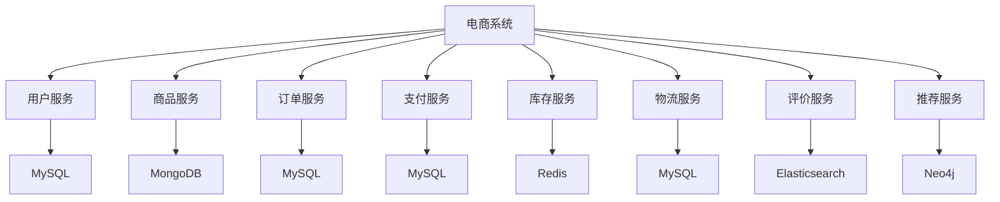
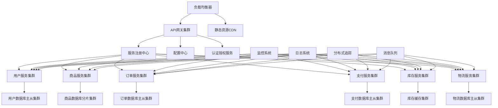

# Docker微服务应用部署  

微服务架构已成为现代应用开发的主流模式，而Docker容器技术则为微服务提供了理想的部署载体。本文将详细介绍如何使用Docker技术部署微服务应用，从架构设计到生产环境实践，帮助开发者构建可靠、可扩展的微服务系统。

## 1. 项目架构设计  

微服务架构的核心是将单体应用拆分为多个独立服务，每个服务负责特定的业务功能。合理的架构设计是成功实施微服务的基础。

### 1.1 微服务拆分示例  

以电商系统为例，可以按照业务领域进行服务拆分：



服务拆分原则：

1. **单一职责**：每个服务只负责一个特定的业务功能
2. **领域驱动设计**：根据业务领域边界进行拆分
3. **数据自治**：每个服务管理自己的数据存储
4. **接口明确**：服务间通过定义良好的API通信
5. **独立部署**：服务可以独立开发、测试和部署

### 1.2 容器化部署拓扑  

微服务容器化部署需要规划各服务的资源配置、端口映射和依赖关系：

```text
服务名称        端口      依赖数据库        镜像名称            资源需求
user-service    8080     user-db          user:v1.2         CPU:0.5 MEM:512M
product-svc     8081     product-db       product:v1.5      CPU:1.0 MEM:1G
order-service   8082     order-db         order:v1.3        CPU:1.0 MEM:1G
payment-svc     8083     payment-db       payment:v1.1      CPU:0.5 MEM:512M
inventory-svc   8084     inventory-cache  inventory:v1.0    CPU:0.5 MEM:768M
logistics-svc   8085     logistics-db     logistics:v1.0    CPU:0.5 MEM:512M
review-svc      8086     review-search    review:v1.2       CPU:0.5 MEM:768M
recommend-svc   8087     recommend-graph  recommend:v1.0    CPU:2.0 MEM:2G
api-gateway     8000     -                gateway:v1.4      CPU:1.0 MEM:1G
```

部署拓扑设计考虑因素：

1. **服务依赖**：明确服务间的依赖关系，确保正确的启动顺序
2. **资源分配**：根据服务负载特性分配合适的CPU和内存资源
3. **网络规划**：设计服务间的网络通信方式和安全策略
4. **存储需求**：规划持久化数据的存储方案
5. **扩展策略**：确定哪些服务需要水平扩展能力

## 2. 容器化改造  

将现有服务改造为容器化应用是实施Docker微服务的第一步。

### 2.1 服务Dockerfile示例  

以Java Spring Boot应用为例的基本Dockerfile：

```dockerfile:c:\project\kphub\microservices\user-service\Dockerfile
FROM openjdk:11-jre-slim

# 添加元数据
LABEL maintainer="devops@example.com"
LABEL version="1.2"
LABEL description="User Service for E-commerce Platform"

# 设置工作目录
WORKDIR /app

# 复制应用JAR包
COPY target/user-service.jar /app/

# 暴露应用端口
EXPOSE 8080

# 设置健康检查
HEALTHCHECK --interval=30s --timeout=3s --start-period=60s --retries=3 \
  CMD curl -f http://localhost:8080/actuator/health || exit 1

# 设置JVM参数和启动命令
ENV JAVA_OPTS="-Xms256m -Xmx512m -Djava.security.egd=file:/dev/./urandom"
ENTRYPOINT ["sh", "-c", "java $JAVA_OPTS -jar /app/user-service.jar"]
```

Node.js应用的Dockerfile示例：

```dockerfile:c:\project\kphub\microservices\product-service\Dockerfile
FROM node:16-alpine

# 添加元数据
LABEL maintainer="devops@example.com"
LABEL version="1.5"
LABEL description="Product Service for E-commerce Platform"

# 设置工作目录
WORKDIR /usr/src/app

# 复制依赖文件并安装
COPY package*.json ./
RUN npm ci --only=production

# 复制应用代码
COPY . .

# 暴露应用端口
EXPOSE 8081

# 设置健康检查
HEALTHCHECK --interval=30s --timeout=3s --start-period=30s --retries=3 \
  CMD wget --no-verbose --tries=1 --spider http://localhost:8081/health || exit 1

# 启动命令
CMD ["node", "server.js"]
```

### 2.2 多阶段构建优化  

多阶段构建可以显著减小最终镜像大小，提高部署效率：

```dockerfile:c:\project\kphub\microservices\order-service\Dockerfile
# 构建阶段
FROM maven:3.8-jdk-11 AS build
WORKDIR /workspace

# 复制POM文件并下载依赖（利用Docker缓存机制）
COPY pom.xml .
RUN mvn dependency:go-offline

# 复制源代码并构建
COPY src src
RUN mvn clean package -DskipTests

# 运行阶段
FROM openjdk:11-jre-slim
WORKDIR /app

# 复制构建产物
COPY --from=build /workspace/target/*.jar app.jar

# 暴露端口
EXPOSE 8082

# 健康检查
HEALTHCHECK --interval=30s --timeout=3s --start-period=60s --retries=3 \
  CMD curl -f http://localhost:8082/actuator/health || exit 1

# 启动命令
ENTRYPOINT ["java", "-Djava.security.egd=file:/dev/./urandom", "-jar", "/app/app.jar"]
```

前端应用的多阶段构建示例：

```dockerfile:c:\project\kphub\microservices\web-frontend\Dockerfile
# 构建阶段
FROM node:16-alpine AS build
WORKDIR /app
COPY package*.json ./
RUN npm ci
COPY . .
RUN npm run build

# 运行阶段
FROM nginx:alpine
COPY --from=build /app/dist /usr/share/nginx/html
COPY nginx.conf /etc/nginx/conf.d/default.conf
EXPOSE 80
HEALTHCHECK --interval=30s --timeout=3s --start-period=10s --retries=3 \
  CMD wget --no-verbose --tries=1 --spider http://localhost/ || exit 1
CMD ["nginx", "-g", "daemon off;"]
```

多阶段构建的优势：

1. **减小镜像体积**：最终镜像只包含运行所需的文件
2. **提高安全性**：减少潜在漏洞暴露面
3. **加快部署速度**：小镜像传输和启动更快
4. **优化缓存**：合理利用Docker缓存机制加速构建

## 3. 服务编排  

Docker Compose是开发和测试环境中编排微服务的理想工具，而Docker Swarm或Kubernetes则适用于生产环境。

### 3.1 Compose文件结构  

基本的Docker Compose配置示例：

```yaml:c:\project\kphub\microservices\docker-compose.yml
version: '3.8'

services:
  # API网关
  api-gateway:
    build: ./api-gateway
    ports:
      - "8000:8000"
    environment:
      - USER_SERVICE_URL=http://user-service:8080
      - PRODUCT_SERVICE_URL=http://product-service:8081
      - ORDER_SERVICE_URL=http://order-service:8082
    depends_on:
      - user-service
      - product-service
      - order-service
    networks:
      - frontend
      - backend

  # 用户服务
  user-service:
    build: ./user-service
    ports:
      - "8080:8080"
    environment:
      - SPRING_DATASOURCE_URL=jdbc:mysql://user-db:3306/userdb
      - SPRING_DATASOURCE_USERNAME=root
      - SPRING_DATASOURCE_PASSWORD=rootpass
    depends_on:
      - user-db
    networks:
      - backend
    volumes:
      - ./config/user-service:/config

  # 用户数据库
  user-db:
    image: mysql:8.0
    environment:
      - MYSQL_DATABASE=userdb
      - MYSQL_ROOT_PASSWORD=rootpass
    volumes:
      - user-db-data:/var/lib/mysql
      - ./init/user-db:/docker-entrypoint-initdb.d
    networks:
      - backend

  # 商品服务
  product-service:
    build: ./product-service
    ports:
      - "8081:8081"
    environment:
      - MONGODB_URI=mongodb://product-db:27017/productdb
    depends_on:
      - product-db
    networks:
      - backend
    volumes:
      - ./config/product-service:/config

  # 商品数据库
  product-db:
    image: mongo:5.0
    volumes:
      - product-db-data:/data/db
    networks:
      - backend

  # 订单服务
  order-service:
    build: ./order-service
    ports:
      - "8082:8082"
    environment:
      - SPRING_DATASOURCE_URL=jdbc:mysql://order-db:3306/orderdb
      - SPRING_DATASOURCE_USERNAME=root
      - SPRING_DATASOURCE_PASSWORD=rootpass
      - USER_SERVICE_URL=http://user-service:8080
      - PRODUCT_SERVICE_URL=http://product-service:8081
    depends_on:
      - order-db
      - user-service
      - product-service
    networks:
      - backend
    volumes:
      - ./config/order-service:/config

  # 订单数据库
  order-db:
    image: mysql:8.0
    environment:
      - MYSQL_DATABASE=orderdb
      - MYSQL_ROOT_PASSWORD=rootpass
    volumes:
      - order-db-data:/var/lib/mysql
      - ./init/order-db:/docker-entrypoint-initdb.d
    networks:
      - backend

networks:
  frontend:
  backend:

volumes:
  user-db-data:
  product-db-data:
  order-db-data:
```

### 3.2 生产环境扩展配置  

生产环境需要更多的配置来确保服务的可靠性和可扩展性：

```yaml:c:\project\kphub\microservices\docker-compose.prod.yml
version: '3.8'

services:
  api-gateway:
    image: ${REGISTRY_URL}/api-gateway:${TAG}
    deploy:
      replicas: 2
      resources:
        limits:
          cpus: '1.0'
          memory: 1G
        reservations:
          cpus: '0.5'
          memory: 512M
      restart_policy:
        condition: on-failure
        max_attempts: 3
        window: 120s
      update_config:
        parallelism: 1
        delay: 10s
        order: start-first
        failure_action: rollback
      rollback_config:
        parallelism: 1
        delay: 5s
        failure_action: pause
    logging:
      driver: "json-file"
      options:
        max-size: "10m"
        max-file: "3"
    secrets:
      - api_gateway_config

  user-service:
    image: ${REGISTRY_URL}/user-service:${TAG}
    deploy:
      replicas: 3
      resources:
        limits:
          cpus: '0.5'
          memory: 512M
        reservations:
          cpus: '0.2'
          memory: 256M
      restart_policy:
        condition: on-failure
      update_config:
        parallelism: 1
        delay: 10s
        order: start-first
    logging:
      driver: "json-file"
      options:
        max-size: "10m"
        max-file: "3"
    secrets:
      - user_service_config
      - db_credentials

  product-service:
    image: ${REGISTRY_URL}/product-service:${TAG}
    deploy:
      replicas: 3
      resources:
        limits:
          cpus: '1.0'
          memory: 1G
        reservations:
          cpus: '0.5'
          memory: 512M
      restart_policy:
        condition: on-failure
      update_config:
        parallelism: 1
        delay: 10s
        order: start-first
    logging:
      driver: "json-file"
      options:
        max-size: "10m"
        max-file: "3"
    secrets:
      - product_service_config
      - mongodb_credentials

secrets:
  api_gateway_config:
    external: true
  user_service_config:
    external: true
  product_service_config:
    external: true
  db_credentials:
    external: true
  mongodb_credentials:
    external: true
```

生产环境配置关键点：

1. **资源限制**：为每个服务设置CPU和内存限制，防止单个服务消耗过多资源
2. **副本数量**：根据负载需求设置服务实例数量
3. **重启策略**：配置服务故障时的自动重启策略
4. **更新策略**：定义服务更新时的滚动更新方式
5. **日志配置**：设置日志轮转策略，避免磁盘空间耗尽
6. **敏感信息**：使用secrets管理敏感配置，提高安全性

## 4. 网络配置  

微服务架构中，网络配置对服务间通信和安全隔离至关重要。

### 4.1 自定义网络  

Docker提供多种网络驱动，适用于不同的部署场景：

```powershell
# 创建bridge网络（单机部署）
docker network create --driver bridge micro-bridge

# 创建overlay网络（集群部署）
docker network create --driver overlay --attachable micro-net

# 创建具有子网和网关的网络
docker network create --driver bridge --subnet=172.20.0.0/16 --gateway=172.20.0.1 micro-subnet

# 创建具有加密通信的overlay网络
docker network create --driver overlay --opt encrypted=true secure-micro-net
```

在Docker Compose中配置多网络：

```yaml:c:\project\kphub\microservices\networks.yml
version: '3.8'

networks:
  # 前端网络 - 用于外部访问
  frontend:
    driver: bridge
    ipam:
      driver: default
      config:
        - subnet: 172.20.0.0/24

  # 后端网络 - 用于服务间通信
  backend:
    driver: bridge
    internal: true  # 内部网络，不连接外网
    ipam:
      driver: default
      config:
        - subnet: 172.20.1.0/24

  # 数据网络 - 用于服务与数据库通信
  datastore:
    driver: bridge
    internal: true
    ipam:
      driver: default
      config:
        - subnet: 172.20.2.0/24
```

### 4.2 服务发现配置  

微服务架构中，服务发现是关键组件，可以通过多种方式实现：

1. **DNS服务发现**（Docker内置）：

```yaml:c:\project\kphub\microservices\dns-discovery.yml
services:
  product-service:
    networks:
      - micro-net
    dns:
      - 8.8.8.8
      - 8.8.4.4
    dns_search:
      - service.local
```

2. **使用Consul进行服务发现**：

```yaml:c:\project\kphub\microservices\consul-discovery.yml
version: '3.8'

services:
  consul:
    image: consul:1.11
    ports:
      - "8500:8500"
    command: agent -server -bootstrap -ui -client=0.0.0.0
    networks:
      - micro-net

  user-service:
    build: ./user-service
    environment:
      - CONSUL_HOST=consul
      - CONSUL_PORT=8500
      - SERVICE_NAME=user-service
    depends_on:
      - consul
    networks:
      - micro-net

  product-service:
    build: ./product-service
    environment:
      - CONSUL_HOST=consul
      - CONSUL_PORT=8500
      - SERVICE_NAME=product-service
    depends_on:
      - consul
    networks:
      - micro-net

networks:
  micro-net:
    driver: overlay
```

3. **使用API网关进行服务路由**：

```yaml:c:\project\kphub\microservices\api-gateway.yml
version: '3.8'

services:
  api-gateway:
    image: nginx:alpine
    ports:
      - "80:80"
    volumes:
      - ./nginx/nginx.conf:/etc/nginx/nginx.conf:ro
    networks:
      - frontend
      - backend
    depends_on:
      - user-service
      - product-service
      - order-service

  user-service:
    networks:
      - backend
    # 其他配置...

  product-service:
    networks:
      - backend
    # 其他配置...

networks:
  frontend:
  backend:
    internal: true
```

对应的Nginx配置：

```nginx:c:\project\kphub\microservices\nginx\nginx.conf
events {
    worker_connections 1024;
}

http {
    server {
        listen 80;
        
        location /api/users {
            proxy_pass http://user-service:8080;
            proxy_set_header Host $host;
            proxy_set_header X-Real-IP $remote_addr;
        }
        
        location /api/products {
            proxy_pass http://product-service:8081;
            proxy_set_header Host $host;
            proxy_set_header X-Real-IP $remote_addr;
        }
        
        location /api/orders {
            proxy_pass http://order-service:8082;
            proxy_set_header Host $host;
            proxy_set_header X-Real-IP $remote_addr;
        }
    }
}
```

## 5. 数据持久化  

微服务架构中，数据持久化需要考虑数据隔离、备份恢复和性能优化。

### 5.1 数据库卷配置  

Docker提供多种卷类型，适用于不同的数据持久化需求：

```yaml:c:\project\kphub\microservices\volumes.yml
version: '3.8'

services:
  user-db:
    image: mysql:8.0
    volumes:
      # 命名卷 - 适用于需要持久化的数据
      - user-data:/var/lib/mysql
      # 绑定挂载 - 适用于初始化脚本
      - ./init/user-db:/docker-entrypoint-initdb.d
      # 配置文件挂载
      - ./config/mysql/my.cnf:/etc/mysql/conf.d/custom.cnf:ro
    environment:
      MYSQL_ROOT_PASSWORD: rootpass
      MYSQL_DATABASE: userdb

  product-db:
    image: mongo:5.0
    volumes:
      # 使用NFS卷 - 适用于集群环境
      - product-data:/data/db
    command: --wiredTigerCacheSizeGB 1

volumes:
  # 本地命名卷
  user-data:
  
  # NFS卷配置
  product-data:
    driver: local
    driver_opts:
      type: nfs
      o: addr=192.168.1.100,rw
      device: ":/path/to/nfs/share"
      
  # 使用卷加密（需要支持的驱动）
  secure-data:
    driver: local
    driver_opts:
      type: cifs
      o: "username=user,password=pass,file_mode=0700,dir_mode=0700"
      device: "//192.168.1.100/share"
```

生产环境中的高级卷配置：

```yaml:c:\project\kphub\microservices\advanced-volumes.yml
version: '3.8'

services:
  db-cluster:
    image: mysql:8.0
    volumes:
      - db-data:/var/lib/mysql
    deploy:
      placement:
        constraints:
          - node.labels.storage == ssd

volumes:
  db-data:
    driver: rexray/ebs
    driver_opts:
      size: "20"
      volumeType: "gp2"
      iops: "1000"
      encrypted: "true"
```

### 5.2 配置文件管理  

微服务配置管理的最佳实践：

1. **使用Docker Config**：

```powershell
# 创建配置
docker config create app-config c:\project\kphub\microservices\config.yml

# 在服务中使用配置
docker service create --name user-service --config app-config user:v1.2
```

2. **使用Docker Secrets**：

```powershell
# 创建密钥
docker secret create db-password c:\project\kphub\microservices\password.txt

# 在服务中使用密钥
docker service create --name user-service --secret db-password user:v1.2
```

3. **在Compose文件中使用配置和密钥**：

```yaml:c:\project\kphub\microservices\configs-secrets.yml
version: '3.8'

services:
  user-service:
    image: user:v1.2
    configs:
      - source: app-config
        target: /app/config.yml
    secrets:
      - source: db-password
        target: /app/secrets/db-password
        mode: 0400

configs:
  app-config:
    file: ./configs/app-config.yml

secrets:
  db-password:
    file: ./secrets/db-password.txt
```

4. **使用环境变量注入配置**：

```yaml:c:\project\kphub\microservices\env-config.yml
version: '3.8'

services:
  user-service:
    image: user:v1.2
    environment:
      - DB_HOST=user-db
      - DB_PORT=3306
      - DB_NAME=userdb
      - LOG_LEVEL=info
    env_file:
      - ./env/user-service.env
```

5. **使用配置中心（如Spring Cloud Config）**：

```yaml:c:\project\kphub\microservices\config-server.yml
version: '3.8'

services:
  config-server:
    image: config-server:latest
    ports:
      - "8888:8888"
    volumes:
      - ./config-repo:/config-repo
    environment:
      - SPRING_PROFILES_ACTIVE=native
      - SPRING_CLOUD_CONFIG_SERVER_NATIVE_SEARCH_LOCATIONS=file:/config-repo

  user-service:
    image: user:v1.2
    environment:
      - SPRING_PROFILES_ACTIVE=docker
      - SPRING_CLOUD_CONFIG_URI=http://config-server:8888
    depends_on:
      - config-server
```

## 6. CI/CD集成  

持续集成和持续部署是微服务开发的关键实践，可以加速交付并提高质量。

### 6.1 GitLab流水线  

使用GitLab CI/CD自动构建和部署微服务：

```yaml:c:\project\kphub\microservices\.gitlab-ci.yml
stages:
  - build
  - test
  - scan
  - deploy-dev
  - deploy-prod

variables:
  DOCKER_REGISTRY: registry.example.com
  DOCKER_TLS_CERTDIR: "/certs"

# 构建阶段
build:
  stage: build
  image: docker:20.10.12
  services:
    - docker:20.10.12-dind
  before_script:
    - docker login -u $CI_REGISTRY_USER -p $CI_REGISTRY_PASSWORD $CI_REGISTRY
  script:
    - docker build -t $DOCKER_REGISTRY/user-service:$CI_COMMIT_SHA -t $DOCKER_REGISTRY/user-service:latest ./user-service
    - docker push $DOCKER_REGISTRY/user-service:$CI_COMMIT_SHA
    - docker push $DOCKER_REGISTRY/user-service:latest
  only:
    changes:
      - user-service/**/*

# 测试阶段
test:
  stage: test
  image: maven:3.8-openjdk-11
  script:
    - cd user-service
    - mvn test
  artifacts:
    paths:
      - user-service/target/surefire-reports/
    expire_in: 1 week

# 安全扫描
security-scan:
  stage: scan
  image: aquasec/trivy
  script:
    - trivy image $DOCKER_REGISTRY/user-service:$CI_COMMIT_SHA
  allow_failure: true

# 开发环境部署
deploy-dev:
  stage: deploy-dev
  image: docker:20.10.12
  services:
    - docker:20.10.12-dind
  before_script:
    - apk add --no-cache curl
    - curl -LO https://storage.googleapis.com/kubernetes-release/release/v1.21.0/bin/linux/amd64/kubectl
    - chmod +x ./kubectl && mv ./kubectl /usr/local/bin/kubectl
    - kubectl config set-cluster k8s --server="$KUBE_URL" --insecure-skip-tls-verify=true
    - kubectl config set-credentials admin --token="$KUBE_TOKEN"
    - kubectl config set-context default --cluster=k8s --user=admin
    - kubectl config use-context default
  script:
    - sed -i "s|IMAGE_TAG|$CI_COMMIT_SHA|g" kubernetes/dev/deployment.yaml
    - kubectl apply -f kubernetes/dev/deployment.yaml
  environment:
    name: development
    url: https://dev.example.com
  only:
    - develop

# 生产环境部署
deploy-prod:
  stage: deploy-prod
  image: docker:20.10.12
  services:
    - docker:20.10.12-dind
  before_script:
    - apk add --no-cache curl
    - curl -LO https://storage.googleapis.com/kubernetes-release/release/v1.21.0/bin/linux/amd64/kubectl
    - chmod +x ./kubectl && mv ./kubectl /usr/local/bin/kubectl
    - kubectl config set-cluster k8s --server="$KUBE_URL" --insecure-skip-tls-verify=true
    - kubectl config set-credentials admin --token="$KUBE_TOKEN"
    - kubectl config set-context default --cluster=k8s --user=admin
    - kubectl config use-context default
  script:
    - sed -i "s|IMAGE_TAG|$CI_COMMIT_SHA|g" kubernetes/prod/deployment.yaml
    - kubectl apply -f kubernetes/prod/deployment.yaml
  environment:
    name: production
    url: https://example.com
  when: manual
  only:
    - master
```

### 6.2 滚动更新策略  

在Docker Swarm或Kubernetes中配置滚动更新策略，确保服务平滑升级：

Docker Swarm滚动更新配置：

```yaml:c:\project\kphub\microservices\rolling-update.yml
version: '3.8'

services:
  user-service:
    image: user:v1.2
    deploy:
      replicas: 5
      update_config:
        parallelism: 2        # 每次更新2个容器
        delay: 10s            # 更新间隔10秒
        order: start-first    # 先启动新容器再停止旧容器
        failure_action: rollback  # 失败时自动回滚
        monitor: 60s          # 监控更新状态60秒
      rollback_config:
        parallelism: 2
        delay: 5s
        failure_action: pause
        monitor: 30s
        order: stop-first
```

Kubernetes滚动更新配置：

```yaml:c:\project\kphub\microservices\kubernetes\deployment.yaml
apiVersion: apps/v1
kind: Deployment
metadata:
  name: user-service
  namespace: microservices
spec:
  replicas: 5
  strategy:
    type: RollingUpdate
    rollingUpdate:
      maxSurge: 1         # 最多可以创建超出期望副本数的1个Pod
      maxUnavailable: 1   # 最多可以有1个Pod不
继续完成Kubernetes滚动更新配置：

```yaml:c:\project\kphub\microservices\kubernetes\deployment.yaml
apiVersion: apps/v1
kind: Deployment
metadata:
  name: user-service
  namespace: microservices
spec:
  replicas: 5
  strategy:
    type: RollingUpdate
    rollingUpdate:
      maxSurge: 1         # 最多可以创建超出期望副本数的1个Pod
      maxUnavailable: 1   # 最多可以有1个Pod不可用
  selector:
    matchLabels:
      app: user-service
  template:
    metadata:
      labels:
        app: user-service
    spec:
      containers:
      - name: user-service
        image: registry.example.com/user-service:v1.2
        ports:
        - containerPort: 8080
        readinessProbe:
          httpGet:
            path: /actuator/health
            port: 8080
          initialDelaySeconds: 10
          periodSeconds: 5
        livenessProbe:
          httpGet:
            path: /actuator/health
            port: 8080
          initialDelaySeconds: 60
          periodSeconds: 15
```

蓝绿部署配置示例：

```yaml:c:\project\kphub\microservices\kubernetes\blue-green.yaml
apiVersion: apps/v1
kind: Deployment
metadata:
  name: user-service-blue
  namespace: microservices
spec:
  replicas: 3
  selector:
    matchLabels:
      app: user-service
      version: blue
  template:
    metadata:
      labels:
        app: user-service
        version: blue
    spec:
      containers:
      - name: user-service
        image: registry.example.com/user-service:v1.1
        ports:
        - containerPort: 8080
---
apiVersion: apps/v1
kind: Deployment
metadata:
  name: user-service-green
  namespace: microservices
spec:
  replicas: 3
  selector:
    matchLabels:
      app: user-service
      version: green
  template:
    metadata:
      labels:
        app: user-service
        version: green
    spec:
      containers:
      - name: user-service
        image: registry.example.com/user-service:v1.2
        ports:
        - containerPort: 8080
---
apiVersion: v1
kind: Service
metadata:
  name: user-service
  namespace: microservices
spec:
  selector:
    app: user-service
    version: blue  # 切换到green版本时修改此处
  ports:
  - port: 80
    targetPort: 8080
```

## 7. 监控告警  

微服务架构的复杂性要求建立全面的监控和告警系统，以便及时发现和解决问题。

### 7.1 服务健康检查  

健康检查是确保服务可用性的基础机制：

```yaml:c:\project\kphub\microservices\healthcheck.yml
version: '3.8'

services:
  user-service:
    image: user:v1.2
    healthcheck:
      test: ["CMD", "curl", "-f", "http://localhost:8080/actuator/health"]
      interval: 30s    # 每30秒检查一次
      timeout: 3s      # 检查超时时间为3秒
      retries: 3       # 连续失败3次视为不健康
      start_period: 60s  # 启动后60秒开始检查
    deploy:
      restart_policy:
        condition: on-failure
        max_attempts: 3
        window: 120s

  product-service:
    image: product:v1.5
    healthcheck:
      test: ["CMD-SHELL", "wget -q --spider http://localhost:8081/health || exit 1"]
      interval: 30s
      timeout: 3s
      retries: 3
      start_period: 30s
```

Kubernetes中的健康检查配置：

```yaml:c:\project\kphub\microservices\kubernetes\probes.yaml
apiVersion: apps/v1
kind: Deployment
metadata:
  name: user-service
spec:
  template:
    spec:
      containers:
      - name: user-service
        image: user:v1.2
        ports:
        - containerPort: 8080
        # 就绪探针 - 确定Pod是否准备好接收流量
        readinessProbe:
          httpGet:
            path: /actuator/health
            port: 8080
          initialDelaySeconds: 15  # 容器启动后多久开始探测
          periodSeconds: 10        # 探测间隔
          timeoutSeconds: 3        # 探测超时时间
          successThreshold: 1      # 成功阈值
          failureThreshold: 3      # 失败阈值
        
        # 存活探针 - 确定是否需要重启容器
        livenessProbe:
          httpGet:
            path: /actuator/health
            port: 8080
          initialDelaySeconds: 60
          periodSeconds: 20
          timeoutSeconds: 5
          failureThreshold: 3
        
        # 启动探针 - 确定容器是否已启动
        startupProbe:
          httpGet:
            path: /actuator/health
            port: 8080
          initialDelaySeconds: 5
          periodSeconds: 5
          failureThreshold: 12  # 允许60秒的启动时间(5*12=60)
```

### 7.2 指标采集配置  

使用Prometheus和Grafana构建微服务监控系统：

```yaml:c:\project\kphub\microservices\monitoring.yml
version: '3.8'

services:
  prometheus:
    image: prom/prometheus:v2.37.0
    volumes:
      - c:\project\kphub\microservices\prometheus\prometheus.yml:/etc/prometheus/prometheus.yml
    ports:
      - "9090:9090"
    networks:
      - monitoring

  grafana:
    image: grafana/grafana:9.3.2
    depends_on:
      - prometheus
    ports:
      - "3000:3000"
    volumes:
      - grafana_data:/var/lib/grafana
      - c:\project\kphub\microservices\grafana\dashboards:/etc/grafana/provisioning/dashboards
      - c:\project\kphub\microservices\grafana\datasources:/etc/grafana/provisioning/datasources
    networks:
      - monitoring

  alertmanager:
    image: prom/alertmanager:v0.24.0
    volumes:
      - c:\project\kphub\microservices\prometheus\alertmanager.yml:/etc/alertmanager/alertmanager.yml
    ports:
      - "9093:9093"
    networks:
      - monitoring

  user-service:
    image: user:v1.2
    environment:
      - MANAGEMENT_ENDPOINTS_WEB_EXPOSURE_INCLUDE=health,info,metrics,prometheus
    ports:
      - "8080:8080"
    networks:
      - app
      - monitoring

  product-service:
    image: product:v1.5
    environment:
      - METRICS_ENABLED=true
    ports:
      - "8081:8081"
    networks:
      - app
      - monitoring

networks:
  app:
  monitoring:

volumes:
  grafana_data:
```

Prometheus配置文件：

```yaml:c:\project\kphub\microservices\prometheus\prometheus.yml
global:
  scrape_interval: 15s
  evaluation_interval: 15s

alerting:
  alertmanagers:
    - static_configs:
        - targets:
            - alertmanager:9093

rule_files:
  - "alert.rules"

scrape_configs:
  - job_name: 'prometheus'
    static_configs:
      - targets: ['localhost:9090']

  - job_name: 'user-service'
    metrics_path: '/actuator/prometheus'
    static_configs:
      - targets: ['user-service:8080']

  - job_name: 'product-service'
    metrics_path: '/metrics'
    static_configs:
      - targets: ['product-service:8081']
```

告警规则配置：

```yaml:c:\project\kphub\microservices\prometheus\alert.rules
groups:
- name: service_alerts
  rules:
  - alert: ServiceDown
    expr: up == 0
    for: 1m
    labels:
      severity: critical
    annotations:
      summary: "服务 {{ $labels.job }} 已停止"
      description: "服务 {{ $labels.job }} 实例 {{ $labels.instance }} 已停止超过1分钟"

  - alert: HighCpuUsage
    expr: process_cpu_usage > 0.8
    for: 5m
    labels:
      severity: warning
    annotations:
      summary: "服务 {{ $labels.job }} CPU使用率过高"
      description: "服务 {{ $labels.job }} 实例 {{ $labels.instance }} CPU使用率超过80%已持续5分钟"

  - alert: HighMemoryUsage
    expr: jvm_memory_used_bytes / jvm_memory_max_bytes > 0.9
    for: 5m
    labels:
      severity: warning
    annotations:
      summary: "服务 {{ $labels.job }} 内存使用率过高"
      description: "服务 {{ $labels.job }} 实例 {{ $labels.instance }} 内存使用率超过90%已持续5分钟"

  - alert: HighErrorRate
    expr: sum(rate(http_server_requests_seconds_count{status=~"5.."}[5m])) / sum(rate(http_server_requests_seconds_count[5m])) > 0.05
    for: 2m
    labels:
      severity: critical
    annotations:
      summary: "服务 {{ $labels.job }} 错误率过高"
      description: "服务 {{ $labels.job }} 错误率超过5%已持续2分钟"
```

## 8. 生产实践建议  

将微服务部署到生产环境需要考虑多方面因素，以下是一些最佳实践。

### 8.1 部署检查清单  

生产环境部署前的检查清单：

```text:c:\project\kphub\microservices\production-checklist.txt
# Docker微服务生产部署检查清单

## 容器配置
1. 所有服务配置健康检查
2. 设置合理的资源限制（CPU、内存）
3. 使用非root用户运行容器
4. 移除不必要的软件包和文件
5. 设置只读文件系统（适用时）
6. 配置日志轮转策略
7. 设置合理的重启策略

## 数据管理
1. 数据库启用定期备份
2. 配置数据卷持久化
3. 敏感数据使用secrets管理
4. 配置文件使用configs管理
5. 实施数据库连接池
6. 配置数据库高可用

## 网络安全
1. 仅暴露必要端口
2. 配置网络隔离策略
3. 实施TLS加密
4. 配置API认证和授权
5. 设置适当的CORS策略
6. 配置网络流量限制

## 监控告警
1. 启用服务监控指标
2. 配置关键指标告警
3. 设置日志聚合和分析
4. 实施分布式追踪
5. 配置服务依赖监控
6. 设置业务指标监控

## 高可用配置
1. 服务配置多副本
2. 实施负载均衡
3. 配置跨节点部署
4. 设置自动扩缩容
5. 实施熔断和限流机制
6. 配置服务降级策略

## 部署流程
1. 实施蓝绿部署或金丝雀发布
2. 配置自动回滚机制
3. 设置部署前测试
4. 实施部署后验证
5. 配置变更审计日志
6. 设置部署通知机制

## 安全合规
1. 镜像安全扫描
2. 容器运行时安全监控
3. 配置合规性检查
4. 实施最小权限原则
5. 设置安全更新策略
6. 配置审计日志
```

### 8.2 扩展架构设计  

随着业务增长，微服务架构需要不断扩展和优化：



扩展架构的关键组件：

1. **API网关**：集中处理请求路由、认证、限流等横切关注点
2. **服务注册与发现**：动态管理服务实例，支持服务自动发现
3. **配置中心**：集中管理配置，支持动态配置更新
4. **认证授权服务**：统一处理身份验证和权限控制
5. **消息队列**：实现服务间异步通信，提高系统弹性
6. **分布式缓存**：减轻数据库压力，提高响应速度
7. **分布式追踪**：跟踪请求在微服务间的流转路径
8. **集中式日志**：聚合所有服务日志，便于问题排查
9. **监控告警**：实时监控系统状态，及时发现问题
10. **服务熔断与降级**：防止故障级联传播，保障系统稳定性

## 9. 微服务最佳实践

### 9.1 服务设计原则

微服务设计应遵循以下原则：

```text:c:\project\kphub\microservices\design-principles.txt
# 微服务设计原则

## 单一职责原则
- 每个服务只负责一个特定的业务功能
- 服务边界应与业务领域边界一致
- 避免创建过于庞大或过于微小的服务

## 服务自治原则
- 服务应能独立开发、测试和部署
- 服务应有自己的数据存储
- 避免服务间的紧耦合依赖

## 接口明确原则
- 服务API应定义清晰且稳定
- 使用版本化API管理变更
- 采用契约优先的API设计方法

## 无状态设计
- 服务应尽可能设计为无状态
- 状态应存储在数据库或缓存中
- 便于水平扩展和故障恢复

## 容错设计
- 服务应能优雅处理依赖服务的故障
- 实现熔断、重试和降级机制
- 避免故障级联传播

## 可观测性设计
- 服务应暴露健康状态和指标
- 实现结构化日志记录
- 支持分布式追踪

## 安全设计
- 服务间通信应加密
- 实施最小权限原则
- 敏感数据应加密存储
```

### 9.2 容器化最佳实践

Docker容器化微服务的最佳实践：

```text:c:\project\kphub\microservices\containerization-best-practices.txt
# 微服务容器化最佳实践

## 镜像构建
- 使用官方基础镜像
- 采用多阶段构建减小镜像体积
- 合理组织Dockerfile指令顺序，优化缓存
- 不在镜像中存储敏感信息
- 为镜像添加适当的标签和元数据
- 定期更新基础镜像以修复安全漏洞

## 容器配置
- 使用非root用户运行容器
- 设置资源限制（CPU、内存）
- 配置健康检查
- 实施只读文件系统（适用时）
- 移除不必要的软件包和文件
- 使用环境变量注入配置

## 数据管理
- 使用命名卷存储持久化数据
- 实施数据备份策略
- 使用secrets管理敏感数据
- 配置日志轮转
- 考虑数据迁移和版本管理

## 网络配置
- 仅暴露必要端口
- 使用自定义网络隔离服务
- 实施服务发现机制
- 配置网络安全策略
- 考虑服务间通信加密

## 部署策略
- 实施滚动更新或蓝绿部署
- 配置自动扩缩容
- 使用标签和版本管理容器
- 实施服务编排（Docker Swarm或Kubernetes）
- 配置负载均衡
```

### 9.3 性能优化策略

微服务性能优化的关键策略：

```text:c:\project\kphub\microservices\performance-optimization.txt
# 微服务性能优化策略

## 应用层优化
- 实施缓存机制（本地缓存、分布式缓存）
- 优化数据库查询和索引
- 实施异步处理和消息队列
- 优化JVM参数（适用于Java应用）
- 实施连接池管理
- 使用压缩减少网络传输

## 容器优化
- 合理设置容器资源限制
- 优化容器镜像大小
- 使用Alpine等轻量级基础镜像
- 配置合适的垃圾回收策略
- 监控和调整容器资源使用

## 网络优化
- 减少服务间不必要的通信
- 使用二进制协议（如gRPC）代替REST
- 实施API网关聚合请求
- 配置合适的超时和重试策略
- 使用连接池减少连接建立开销

## 数据库优化
- 实施数据库分片和分区
- 配置读写分离
- 优化索引和查询
- 实施数据库连接池
- 考虑NoSQL数据库用于特定场景

## 扩展策略
- 识别并扩展瓶颈服务
- 实施自动扩缩容
- 考虑功能分解以提高可扩展性
- 使用负载均衡分散请求
- 实施缓存以减轻后端服务压力
```

## 10. 案例分析

### 10.1 电商平台微服务改造

以下是一个电商平台从单体应用迁移到Docker微服务的案例分析：

```text:c:\project\kphub\microservices\case-study-ecommerce.txt
# 电商平台微服务改造案例分析

## 背景
- 传统单体电商应用面临扩展性和维护性挑战
- 高峰期性能瓶颈导致用户体验下降
- 功能迭代周期长，难以快速响应市场需求

## 改造策略
1. 渐进式微服务拆分
   - 首先将前后端分离
   - 优先拆分变化频率高的模块（商品、促销）
   - 逐步拆分核心业务模块（订单、支付）
   - 最后拆分基础服务（用户、认证）

2. 容器化实施
   - 标准化开发环境（Docker开发容器）
   - 构建CI/CD流水线自动化构建和部署
   - 实施容器编排（Kubernetes）
   - 配置服务发现和负载均衡

3. 数据策略
   - 初期：共享数据库，服务访问各自的表
   - 中期：数据库按服务拆分，实施数据同步
   - 后期：完全独立的数据库，通过事件驱动保持一致性

## 技术架构
- 前端：React + Nginx容器
- API网关：Spring Cloud Gateway容器
- 服务注册：Consul容器集群
- 核心服务：Spring Boot容器
- 消息队列：RabbitMQ容器集群
- 数据库：MySQL和MongoDB容器（主从架构）
- 缓存：Redis容器集群
- 搜索：Elasticsearch容器集群
- 监控：Prometheus + Grafana容器

## 成果
- 部署时间从小时级缩短到分钟级
- 服务可独立扩展，高峰期可自动扩容
- 开发团队可并行工作，迭代周期缩短50%
- 系统可用性从99.9%提升到99.99%
- 峰值处理能力提升300%

## 挑战与解决方案
1. 分布式事务
   - 实施Saga模式
   - 使用事件溯源保证最终一致性

2. 服务依赖复杂性
   - 实施服务网格（Istio）
   - 配置熔断和重试策略

3. 监控复杂性
   - 集中式日志（ELK）
   - 分布式追踪（Jaeger）
   - 业务指标监控（Prometheus）

4. 部署复杂性
   - 标准化CI/CD流程
   - 实施GitOps自动化部署
   - 配置环境一致性检查
```

### 10.2 金融系统微服务案例

金融系统对可靠性和安全性要求极高，以下是其微服务改造案例：

```text:c:\project\kphub\microservices\case-study-finance.txt
# 金融系统微服务改造案例分析

## 背景
- 传统银行核心系统基于大型机架构
- 系统变更周期长，难以适应数字化转型需求
- 新功能上线需要完整系统测试，周期长达数月

## 改造策略
1. 领域驱动设计
   - 识别核心领域和边界上下文
   - 按业务能力拆分微服务
   - 定义服务间通信契约

2. 双模式架构
   - 核心账务系统保持稳定
   - 新增业务功能采用微服务架构
   - 通过集成层连接新旧系统

3. 安全优先
   - 实施零信任安全模型
   - 服务间通信全程加密
   - 敏感数据加密存储
   - 实施细粒度访问控制

## 技术架构
- 容器平台：OpenShift（基于Kubernetes）
- 服务网格：Istio（安全通信和流量控制）
- API管理：Apigee（API网关和安全策略）
- 身份认证：Keycloak容器（OAuth2/OIDC）
- 核心服务：Spring Boot容器（金融交易处理）
- 数据库：Oracle RAC容器（账务数据）
- 消息系统：Kafka容器集群（事件驱动架构）
- 监控：Dynatrace容器（APM监控）
- 日志：Splunk容器（安全审计和合规）

## 成果
- 新功能上线周期从月缩短到周
- 系统可用性达到99.999%（五个9）
- 交易处理能力提升200%
- 开发团队生产力提升60%
- 满足金融监管合规要求

## 挑战与解决方案
1. 严格的合规要求
   - 实施全面审计日志
   - 自动化合规检查
   - 定期安全扫描和渗透测试

2. 高可用性要求
   - 多区域部署
   - 自动故障转移
   - 灾难恢复演练

3. 数据一致性
   - 实施两阶段提交协议
   - 使用补偿事务
   - 定期数据一致性检查

4. 性能要求
   - 实施性能基准测试
   - 自动化性能回归测试
   - 持续性能监控和优化
```

## 总结

Docker微服务部署是现代应用架构的重要实践，通过合理的架构设计、容器化改造、服务编排、网络配置、数据持久化、CI/CD集成和监控告警，可以构建高可用、可扩展的微服务系统。

微服务架构的成功实施需要关注以下关键点：

1. **合理的服务拆分**：按业务领域边界划分服务，保持服务的内聚性和自治性
2. **标准化容器构建**：使用多阶段构建、最小化基础镜像、安全配置等最佳实践
3. **完善的服务编排**：配置服务依赖、资源限制、扩展策略和更新策略
4. **安全的网络配置**：实施网络隔离、服务发现和安全通信
5. **可靠的数据管理**：使用卷持久化数据、配置备份策略、管理配置和敏感信息
6. **自动化的CI/CD**：实现自动构建、测试、部署和回滚
7. **全面的监控告警**：配置健康检查、指标采集、日志聚合和告警通知

通过渐进式改造策略，从单体应用逐步迁移到微服务架构，可以降低风险并逐步实现系统现代化。在生产环境部署前，务必遵循部署检查清单，确保系统的可靠性、安全性和可观测性。

随着业务发展，可以通过扩展架构设计，引入更多高级组件如API网关、服务网格、分布式追踪等，进一步提升系统的可扩展性和可管理性。