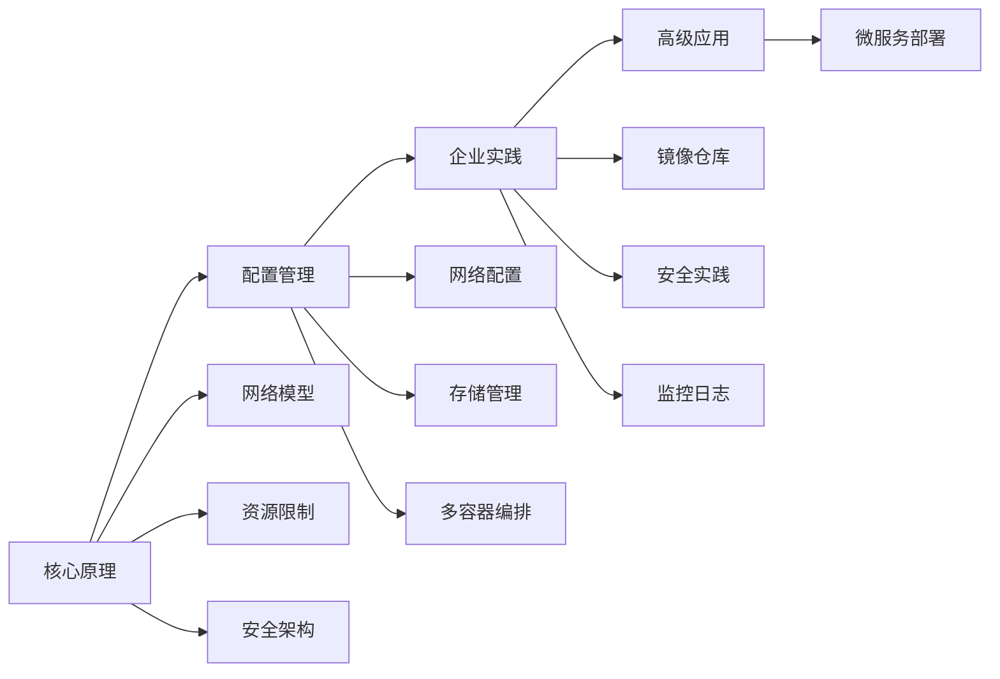

# Docker知识库总览

Docker作为现代容器化技术的代表，已成为开发、测试和部署应用的标准工具。本知识库全面覆盖Docker的核心原理、配置管理、企业实践和高级应用，旨在帮助读者从入门到精通，构建完整的Docker技术体系。

## 知识体系结构

本知识库采用"原理→配置→实践→应用"的递进学习路径，通过四大模块系统化地呈现Docker技术栈：

所有文档均提供Windows/Linux双平台示例，关键章节配有架构图与实战案例。建议按顺序系统学习，生产环境部署时参考企业实践篇方案。

## 1. 核心原理篇

核心原理篇深入剖析Docker的底层技术实现，帮助读者理解容器化技术的本质。

### [01-Docker网络模型详解](./01-Docker网络模型详解.md)

本文深入解析Docker网络架构、命名空间隔离及各种网络驱动实现原理。通过学习，您将了解：

- Docker网络架构的分层设计与实现机制
- 网络命名空间(Network Namespace)如何实现容器网络隔离
- Bridge、Host、Overlay等网络驱动的工作原理与适用场景
- Docker DNS服务与服务发现机制的实现
- 容器间通信的底层实现与数据包流转路径

### [02-容器资源限制机制](./02-容器资源限制机制.md)

详解cgroups资源控制原理与CPU/内存/IO限制配置方法。本文将帮助您掌握：

- Linux cgroups子系统的工作原理与Docker的集成方式
- CPU资源限制的实现机制与配置参数详解
- 内存资源控制与OOM(Out of Memory)处理机制
- 磁盘I/O限制的实现原理与性能调优
- 网络带宽控制的配置方法与监控手段
- 资源限制的最佳实践与常见问题排查

### [03-Docker安全架构分析](./03-Docker安全架构分析.md)

剖析Docker安全隔离机制与权限控制模型。通过本文，您将了解：

- Docker多层安全防护架构设计
- Linux命名空间(Namespaces)实现的进程隔离机制
- Capabilities机制与特权控制
- Seccomp过滤器与系统调用限制
- AppArmor/SELinux与Docker的集成
- Docker守护进程的安全配置与最佳实践
- 容器逃逸攻击分析与防护策略

## 2. 配置管理篇

配置管理篇聚焦Docker的日常操作与配置技巧，帮助读者掌握Docker环境的基础管理能力。

### [04-Docker网络配置与管理](./04-Docker网络配置与管理.md)

实战指南：自定义网络、跨主机通信与端口映射配置。本文将指导您：

- Docker网络类型的选择策略与配置方法
- 自定义网络的创建、管理与使用场景
- 端口映射的工作原理与高级配置技巧
- 跨主机容器网络的实现方案对比
- Docker Swarm网络与Overlay网络配置
- 网络故障排查与性能优化方法
- 容器网络安全策略与访问控制配置

### [05-Docker存储驱动与卷管理](./05-Docker存储驱动与卷管理.md)

存储驱动选型与数据持久化方案实现。通过本文，您将掌握：

- Docker存储架构与分层文件系统原理
- 各种存储驱动(Overlay2、Devicemapper等)的对比与选择
- Docker卷(Volumes)的创建、管理与备份策略
- 绑定挂载(Bind Mounts)的使用场景与限制
- tmpfs挂载与内存数据管理
- 数据持久化的最佳实践与方案设计
- 存储性能优化与故障排查方法

### [06-Docker-Compose多容器编排](./06-Docker-Compose多容器编排.md)

YAML语法详解与多服务编排实战。本文将帮助您：

- Docker Compose的工作原理与核心概念
- Compose文件格式与YAML语法详解
- 多容器应用的定义、构建与部署流程
- 服务依赖、启动顺序与健康检查配置
- 环境变量管理与配置文件注入
- 网络与卷配置的最佳实践
- 开发、测试与生产环境的Compose配置策略
- Compose与Swarm的集成使用方法

## 3. 企业实践篇

企业实践篇关注Docker在生产环境中的部署与管理，提供企业级解决方案与最佳实践。

### [07-Docker镜像仓库搭建与管理](./07-Docker镜像仓库搭建与管理.md)

私有Registry部署与Harbor企业级方案。本文将详细介绍：

- Docker镜像分发机制与Registry API规范
- 私有Registry的部署架构与配置方法
- Harbor企业级镜像仓库的安装与高可用配置
- 镜像签名与内容信任(Content Trust)机制
- 镜像漏洞扫描与安全策略配置
- 镜像仓库的权限管理与访问控制
- 镜像同步、复制与灾备策略
- CI/CD流水线与镜像仓库的集成方案

### [08-Docker安全最佳实践](./08-Docker安全最佳实践.md)

生产环境安全加固方案与合规检查。通过本文，您将了解：

- Docker生产环境的安全基线配置
- 最小特权原则的实施策略
- 容器镜像的安全构建与漏洞管理
- 运行时安全监控与防护方案
- 容器网络安全与数据保护策略
- Docker环境的合规性检查与审计
- 安全事件响应与恢复流程
- CIS Docker Benchmark实施指南

### [09-Docker监控与日志管理](./09-Docker监控与日志管理.md)

Prometheus+ELK全栈监控体系搭建。本文将指导您：

- Docker监控指标体系与数据采集方案
- Prometheus+Grafana监控系统的部署与配置
- 容器日志驱动的选择与配置方法
- ELK/EFK日志聚合平台的搭建与管理
- 告警规则设计与通知渠道配置
- 性能瓶颈分析与资源优化方法
- 分布式追踪系统与监控的集成
- 大规模容器集群的监控策略与性能优化

## 4. 高级应用篇

高级应用篇展示Docker技术在实际业务场景中的应用，帮助读者将Docker技术与业务需求相结合。

### [10-Docker微服务应用部署](./10-Docker微服务应用部署.md)

从容器化改造到CI/CD集成的完整实战。本文将全面覆盖：

- 微服务架构设计与容器化改造策略
- 多阶段构建与镜像优化技术
- Docker Compose与Swarm的服务编排
- 微服务网络配置与服务发现机制
- 数据持久化与配置管理最佳实践
- CI/CD流水线与Docker的深度集成
- 滚动更新与蓝绿部署策略
- 微服务监控与日志管理方案
- 生产环境部署检查清单与最佳实践

## 学习建议

1. **循序渐进**：按照知识库的组织顺序学习，先掌握核心原理，再学习配置管理，然后是企业实践，最后是高级应用。

2. **动手实践**：每个章节都提供了详细的实践案例，建议读者跟随教程动手操作，加深理解。

3. **环境准备**：准备Windows和Linux双环境，以便全面理解不同平台下Docker的行为差异。

4. **深入原理**：不仅要知道"怎么做"，更要理解"为什么这么做"，核心原理篇的内容将帮助您构建扎实的技术基础。

5. **结合业务**：学习高级应用篇时，尝试将Docker技术与自身业务场景结合，设计适合自己的容器化方案。

无论您是Docker初学者还是有经验的开发运维人员，本知识库都能为您提供系统化的学习路径和实用的技术指南，帮助您在容器化技术领域不断提升。