# Kubernetes架构与核心概念  

Kubernetes（简称K8s）是一个开源的容器编排平台，用于自动化部署、扩展和管理容器化应用程序。本文将深入介绍Kubernetes的架构设计、核心组件和基本概念，帮助读者建立对Kubernetes系统的全面认识。

## 1. 整体架构  

Kubernetes采用主从架构（Master-Worker），由控制平面（Control Plane）和数据平面（Data Plane）组成。控制平面负责集群的决策和管理，数据平面负责运行实际的工作负载。

### 1.1 组件拓扑图  

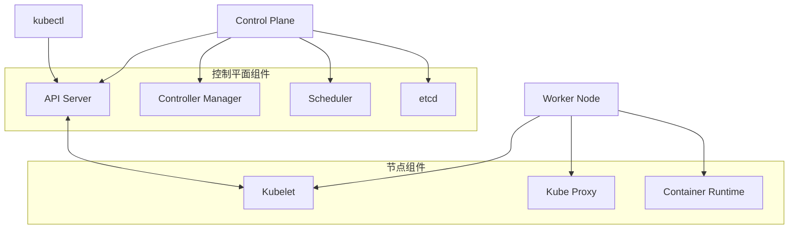

### 1.2 核心组件功能  

| 组件名称 | 职责描述 | 关键特性 | 部署位置 |
|---------|---------|---------|---------|
| API Server | 集群的统一入口，提供RESTful API | 认证授权、数据验证、水平扩展 | 控制平面 |
| Controller Manager | 维护集群状态，执行自动化控制 | 故障检测与修复、状态协调 | 控制平面 |
| Scheduler | 为新创建的Pod选择合适的节点 | 资源需求匹配、亲和性规则、负载均衡 | 控制平面 |
| etcd | 分布式键值存储，保存集群所有数据 | 高可用、一致性、持久化 | 控制平面 |
| Kubelet | 管理节点上的容器生命周期 | 健康检查、资源监控、容器创建 | 工作节点 |
| Kube-proxy | 维护节点网络规则和服务转发 | 负载均衡、服务发现、网络代理 | 工作节点 |
| Container Runtime | 运行容器的软件 | 镜像管理、容器生命周期 | 工作节点 |

## 2. 控制平面详解  

控制平面是Kubernetes集群的大脑，负责全局决策和事件检测与响应。

### 2.1 API Server工作原理  

API Server是Kubernetes控制平面的前端，所有的内部组件和外部用户都通过它与集群交互。

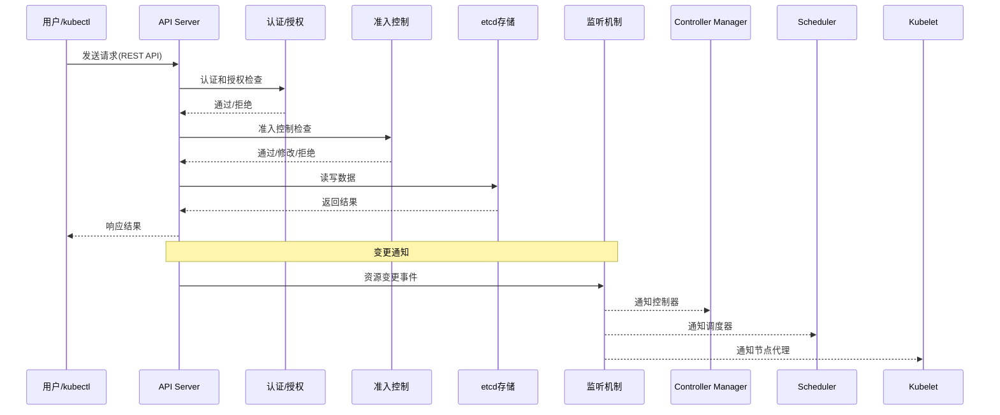

API Server的主要职责：
- 提供集群管理的REST API接口
- 请求的认证、授权和准入控制
- 集群状态的数据存储中心
- 组件间的通信枢纽
- 提供watch机制，支持事件通知

### 2.2 etcd数据存储  

etcd是Kubernetes的后端存储，保存了集群的所有配置数据和状态信息。

```text
etcd存储结构:
/registry/pods/default/nginx-pod
/registry/services/default/web-service
/registry/deployments/default/nginx-deployment
```

查看etcd中的数据：

```powershell
# 查看etcd中的所有键
ETCDCTL_API=3 etcdctl --endpoints=127.0.0.1:2379 get / --prefix --keys-only

# 查看特定资源
ETCDCTL_API=3 etcdctl --endpoints=127.0.0.1:2379 get /registry/pods/default/nginx --prefix

# 备份etcd数据
ETCDCTL_API=3 etcdctl --endpoints=127.0.0.1:2379 snapshot save snapshot.db
```

etcd的关键特性：
- 分布式一致性：使用Raft算法确保数据一致性
- 高可用性：通常部署为3、5或7节点集群
- 数据安全：支持TLS加密和客户端认证
- 监视机制：支持监听键的变化，是Kubernetes事件通知的基础

### 2.3 Controller Manager详解

Controller Manager包含多个控制器，每个控制器负责一种特定资源的状态管理。

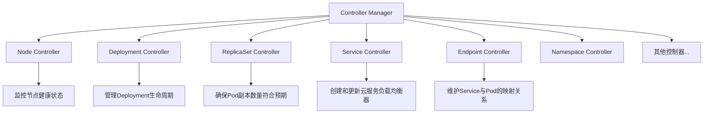

控制器的工作原理：
1. 通过API Server监听资源变化
2. 观察资源的当前状态
3. 将当前状态与期望状态进行比较
4. 执行操作使当前状态向期望状态靠拢

```go
// 控制器的核心逻辑伪代码
for {
    currentState := getCurrentState()
    desiredState := getDesiredState()
    
    if currentState != desiredState {
        performAction(currentState, desiredState)
    }
    
    sleep(reconciliationPeriod)
}
```

### 2.4 Scheduler工作机制

Scheduler负责为新创建的Pod选择最合适的节点。

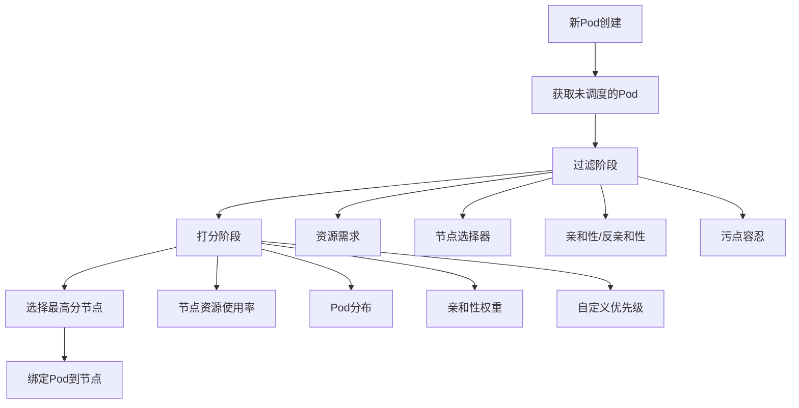

调度过程详解：
1. **过滤阶段**：排除不满足Pod需求的节点
   - 资源不足的节点（CPU、内存）
   - 不符合nodeSelector的节点
   - 不符合亲和性规则的节点
   - 有不能容忍的污点的节点

2. **打分阶段**：对通过过滤的节点进行评分
   - 资源使用率（优先选择资源使用率低的节点）
   - Pod分布（优先选择Pod数量少的节点）
   - 亲和性权重（根据亲和性规则计算权重）
   - 自定义优先级函数

3. **选择与绑定**：选择得分最高的节点，并将Pod绑定到该节点

## 3. 节点组件  

节点组件运行在每个工作节点上，负责维护运行中的Pod并提供Kubernetes运行环境。

### 3.1 Kubelet架构  

Kubelet是节点上的主要代理，负责确保容器在Pod中运行。

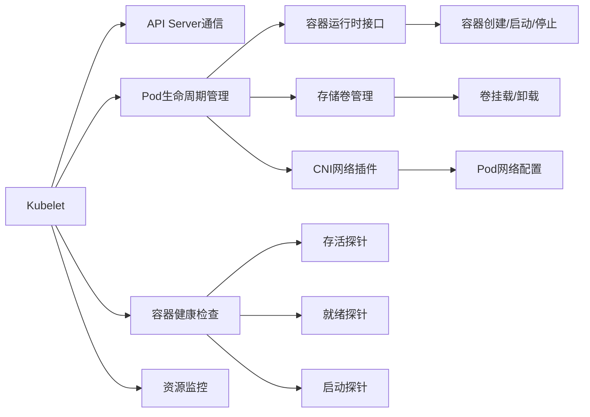

Kubelet的主要职责：
- 接收并执行来自API Server的Pod规范（PodSpec）
- 通过容器运行时接口（CRI）管理容器
- 执行Pod的健康检查
- 上报节点和Pod的状态
- 管理容器的镜像和存储卷

### 3.2 容器运行时接口  

容器运行时接口（CRI）是Kubelet与容器运行时之间的标准接口。

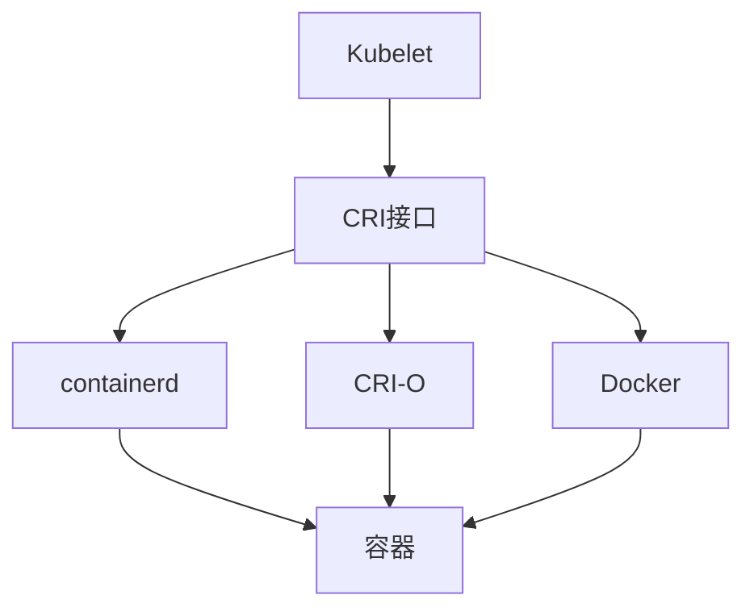

CRI定义了两个主要服务：
1. **RuntimeService**：管理容器生命周期
   - 创建/启动/停止/删除容器
   - 执行命令
   - 获取容器状态和信息

2. **ImageService**：管理镜像
   - 拉取镜像
   - 列出镜像
   - 删除镜像

支持的容器运行时：
- **containerd**：Docker公司开发的轻量级容器运行时
- **CRI-O**：专为Kubernetes设计的轻量级运行时
- **Docker**：通过dockershim适配器支持（Kubernetes 1.24后移除）

### 3.3 Kube-proxy工作原理

Kube-proxy负责实现Kubernetes Service的网络功能。

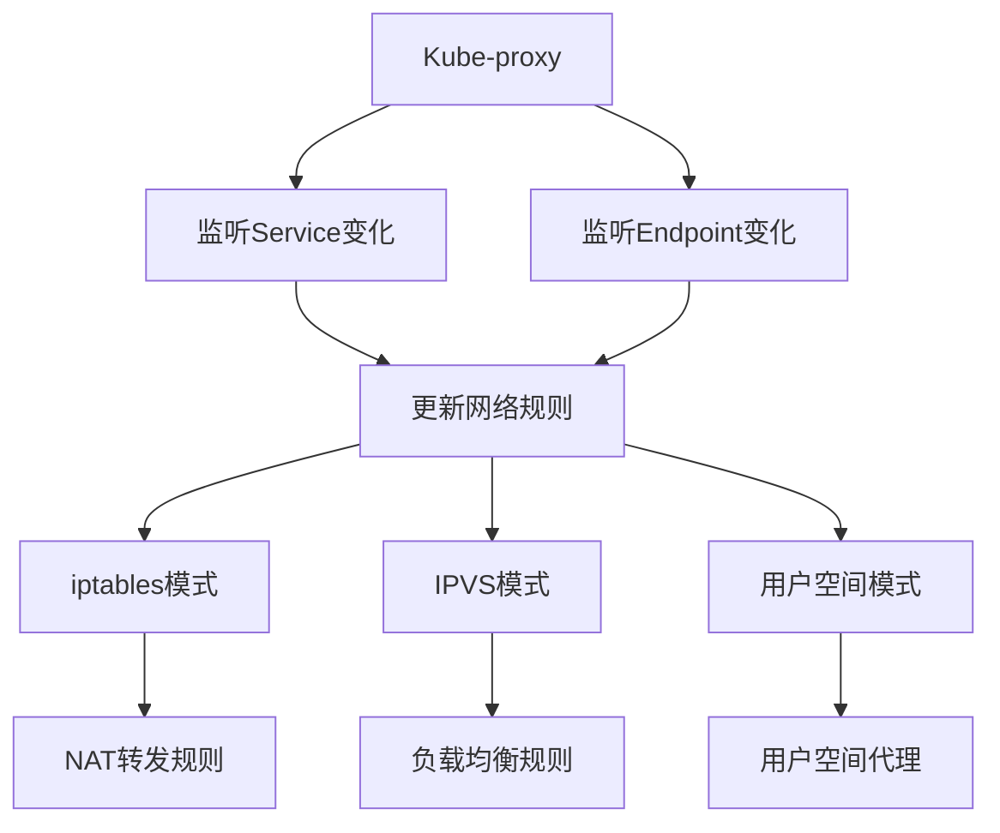

Kube-proxy的实现模式：

1. **iptables模式**（默认）
   - 使用Linux iptables规则实现服务负载均衡
   - 规则基于随机选择，无法感知后端Pod状态
   - 适用于中小规模集群

2. **IPVS模式**
   - 使用Linux内核IPVS模块实现负载均衡
   - 支持多种负载均衡算法（轮询、最少连接等）
   - 性能更好，适用于大规模集群

3. **用户空间模式**（已弃用）
   - 在用户空间实现代理
   - 性能较差，主要用于兼容旧版本

## 4. 核心概念  

Kubernetes的核心概念构成了其资源模型，理解这些概念对于有效使用Kubernetes至关重要。

### 4.1 Pod模型解析  

Pod是Kubernetes中最小的可部署单元，由一个或多个容器组成。

```yaml:c:\project\kphub\kubernetes\pod-example.yml
apiVersion: v1
kind: Pod
metadata:
  name: nginx-pod
  labels:
    app: nginx
    tier: frontend
  annotations:
    description: "Web服务器Pod示例"
spec:
  containers:
  - name: nginx
    image: nginx:1.19
    ports:
    - containerPort: 80
    resources:
      requests:
        memory: "64Mi"
        cpu: "250m"
      limits:
        memory: "128Mi"
        cpu: "500m"
    volumeMounts:
    - name: nginx-config
      mountPath: /etc/nginx/conf.d
    livenessProbe:
      httpGet:
        path: /
        port: 80
      initialDelaySeconds: 30
      periodSeconds: 10
    readinessProbe:
      httpGet:
        path: /
        port: 80
      initialDelaySeconds: 5
      periodSeconds: 5
  volumes:
  - name: nginx-config
    configMap:
      name: nginx-config
```

Pod的关键特性：
- **共享网络命名空间**：Pod内的所有容器共享同一IP地址和端口空间
- **共享存储卷**：Pod内的容器可以访问共享的存储卷
- **临时性**：Pod可能随时被终止和替换，不应假设Pod的IP地址不变
- **原子性**：Pod作为一个整体被调度、创建和删除
- **健康检查**：支持存活探针、就绪探针和启动探针

### 4.2 工作负载资源  

Kubernetes提供了多种工作负载资源，用于管理Pod的生命周期。

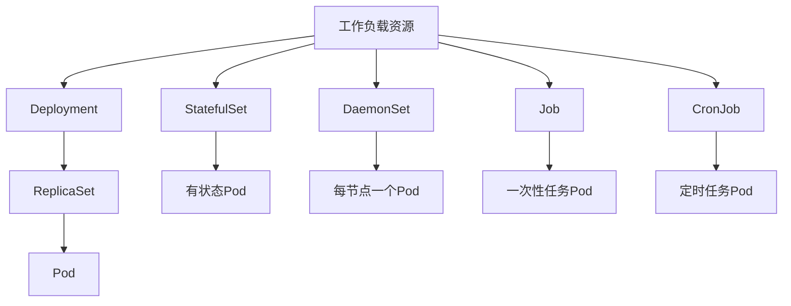

1. **Deployment**：管理无状态应用，支持声明式更新和回滚
   ```yaml:c:\project\kphub\kubernetes\deployment-example.yml
   apiVersion: apps/v1
   kind: Deployment
   metadata:
     name: nginx-deployment
     labels:
       app: nginx
   spec:
     replicas: 3
     selector:
       matchLabels:
         app: nginx
     strategy:
       type: RollingUpdate
       rollingUpdate:
         maxSurge: 1
         maxUnavailable: 1
     template:
       metadata:
         labels:
           app: nginx
       spec:
         containers:
         - name: nginx
           image: nginx:1.19
           ports:
           - containerPort: 80
   ```

2. **StatefulSet**：管理有状态应用，提供稳定的网络标识和持久存储
   ```yaml:c:\project\kphub\kubernetes\statefulset-example.yml
   apiVersion: apps/v1
   kind: StatefulSet
   metadata:
     name: web
   spec:
     serviceName: "nginx"
     replicas: 3
     selector:
       matchLabels:
         app: nginx
     template:
       metadata:
         labels:
           app: nginx
       spec:
         containers:
         - name: nginx
           image: nginx:1.19
           ports:
           - containerPort: 80
           volumeMounts:
           - name: www
             mountPath: /usr/share/nginx/html
     volumeClaimTemplates:
     - metadata:
         name: www
       spec:
         accessModes: [ "ReadWriteOnce" ]
         resources:
           requests:
             storage: 1Gi
   ```

3. **DaemonSet**：确保所有（或部分）节点运行一个Pod副本
   ```yaml:c:\project\kphub\kubernetes\daemonset-example.yml
   apiVersion: apps/v1
   kind: DaemonSet
   metadata:
     name: fluentd-elasticsearch
   spec:
     selector:
       matchLabels:
         name: fluentd-elasticsearch
     template:
       metadata:
         labels:
           name: fluentd-elasticsearch
       spec:
         containers:
         - name: fluentd-elasticsearch
           image: quay.io/fluentd_elasticsearch/fluentd:v2.5.2
           resources:
             limits:
               memory: 200Mi
             requests:
               cpu: 100m
               memory: 200Mi
   ```

4. **Job**：运行一次性任务，确保指定数量的Pod成功完成
5. **CronJob**：按照时间计划运行Job

### 4.3 服务发现与负载均衡  

Kubernetes Service提供了稳定的网络访问点，用于访问一组Pod。

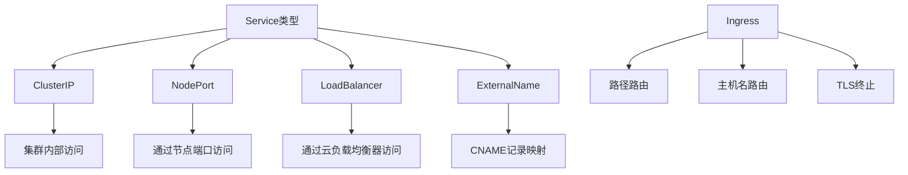

Service示例：

```yaml:c:\project\kphub\kubernetes\service-example.yml
apiVersion: v1
kind: Service
metadata:
  name: nginx-service
spec:
  selector:
    app: nginx
  ports:
  - port: 80
    targetPort: 80
  type: ClusterIP
```

Ingress示例：

```yaml:c:\project\kphub\kubernetes\ingress-example.yml
apiVersion: networking.k8s.io/v1
kind: Ingress
metadata:
  name: nginx-ingress
  annotations:
    nginx.ingress.kubernetes.io/rewrite-target: /
spec:
  rules:
  - host: example.com
    http:
      paths:
      - path: /
        pathType: Prefix
        backend:
          service:
            name: nginx-service
            port:
              number: 80
```

### 4.4 配置与存储  

Kubernetes提供了多种资源用于管理配置和存储。

1. **ConfigMap**：存储非敏感配置数据
   ```yaml:c:\project\kphub\kubernetes\configmap-example.yml
   apiVersion: v1
   kind: ConfigMap
   metadata:
     name: nginx-config
   data:
     nginx.conf: |
       server {
         listen 80;
         server_name example.com;
         location / {
           root /usr/share/nginx/html;
           index index.html;
         }
       }
   ```

2. **Secret**：存储敏感数据，如密码和密钥
   ```yaml:c:\project\kphub\kubernetes\secret-example.yml
   apiVersion: v1
   kind: Secret
   metadata:
     name: db-credentials
   type: Opaque
   data:
     username: YWRtaW4=  # base64编码的"admin"
     password: cGFzc3dvcmQxMjM=  # base64编码的"password123"
   ```

3. **PersistentVolume**和**PersistentVolumeClaim**：管理持久化存储
   ```yaml:c:\project\kphub\kubernetes\pv-pvc-example.yml
   apiVersion: v1
   kind: PersistentVolume
   metadata:
     name: pv-example
   spec:
     capacity:
       storage: 10Gi
     accessModes:
       - ReadWriteOnce
     persistentVolumeReclaimPolicy: Retain
     storageClassName: standard
     hostPath:
       path: /data/pv-example
   ---
   apiVersion: v1
   kind: PersistentVolumeClaim
   metadata:
     name: pvc-example
   spec:
     accessModes:
       - ReadWriteOnce
     resources:
       requests:
         storage: 5Gi
     storageClassName: standard
   ```

## 5. 网络模型  

Kubernetes网络模型定义了容器、Pod和服务之间的通信方式。

### 5.1 CNI规范  

容器网络接口（CNI）是Kubernetes网络插件的标准。

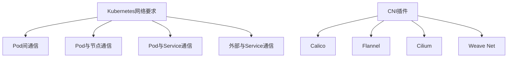

Kubernetes网络模型的四个基本要求：
1. 所有Pod可以在不使用NAT的情况下相互通信
2. 所有节点可以在不使用NAT的情况下与所有Pod通信
3. Pod看到的自己的IP与其他Pod看到的相同
4. Pod内的所有容器共享网络命名空间（IP和端口空间）

CNI插件负责实现这些网络要求，常见的CNI插件包括：
- **Calico**：基于BGP的高性能网络插件，支持网络策略
- **Flannel**：简单易用的覆盖网络
- **Cilium**：基于eBPF的网络插件，提供高级网络功能和安全策略
- **Weave Net**：多主机容器网络解决方案

### 5.2 服务发现机制  

Kubernetes提供了DNS服务发现机制，允许Pod通过域名访问服务。

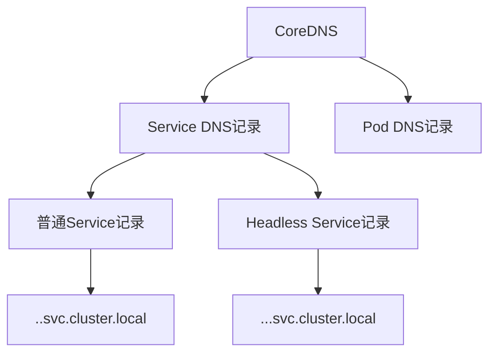

DNS记录格式：
- **Service**：`<service-name>.<namespace>.svc.cluster.local`
  - 解析为Service的ClusterIP
- **Headless Service**（无ClusterIP）：`<service-name>.<namespace>.svc.cluster.local`
  - 解析为所有Pod的IP地址列表
- **Pod**：`<pod-ip>.<namespace>.pod.cluster.local`
  - 解析为Pod的IP地址

示例：
```powershell
# 在Pod内部查询DNS
kubectl exec -it nginx-pod -- nslookup nginx-service.default.svc.cluster.local

# 查看DNS配置
kubectl get configmap coredns -n kube-system -o yaml
```

### 5.3 网络策略

NetworkPolicy资源允许控制Pod之间的网络流量。

```yaml:c:\project\kphub\kubernetes\network-policy-example.yml
apiVersion: networking.k8s.io/v1
kind: NetworkPolicy
metadata:
  name: db-network-policy
  namespace: default
spec:
  podSelector:
    matchLabels:
      role: db
  policyTypes:
  - Ingress
  - Egress
  ingress:
  - from:
    - podSelector:
        matchLabels:
          role: api-server
    ports:
    - protocol: TCP
      port: 3306
  egress:
  - to:
    - podSelector:
        matchLabels:
          role: monitoring
    ports:
    - protocol: TCP
      port: 9090
```

网络策略特点：
- 默认情况下，Pod接受来自任何源的流量
- 网络策略是累加的，多个策略会组合应用
- 需要支持NetworkPolicy的CNI插件（如Calico、Cilium）

## 6. 调度机制  

Kubernetes调度器负责决定Pod应该运行在哪个节点上。

### 6.1 调度流程  

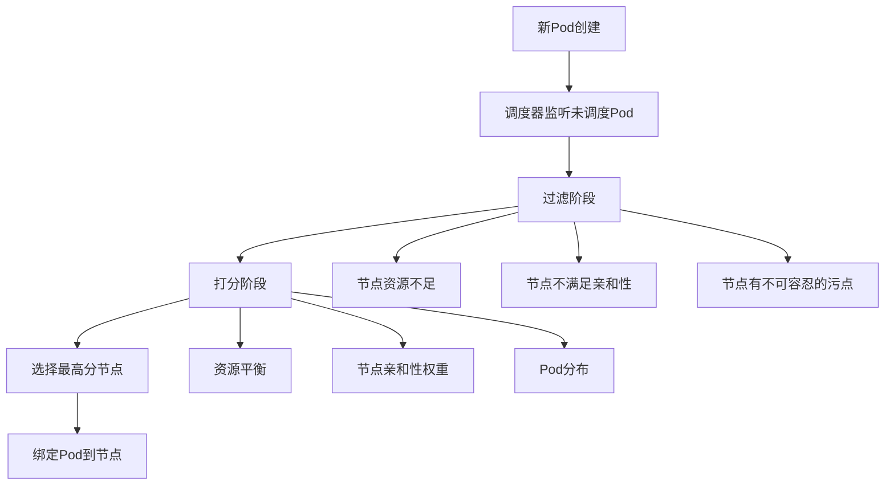

### 6.2 节点选择器与亲和性  

Kubernetes提供了多种机制来控制Pod的调度位置。

1. **nodeSelector**：基于节点标签的简单调度约束
   ```yaml
   nodeSelector:
     disktype: ssd
   ```

2. **节点亲和性**：更灵活的节点选择规则
   ```yaml:c:\project\kphub\kubernetes\node-affinity-example.yml
   affinity:
     nodeAffinity:
       requiredDuringSchedulingIgnoredDuringExecution:
         nodeSelectorTerms:
         - matchExpressions:
           - key: kubernetes.io/e2e-az-name
             operator: In
             values:
             - e2e-az1
             - e2e-az2
       preferredDuringSchedulingIgnoredDuringExecution:
       - weight: 1
         preference:
           matchExpressions:
           - key: disktype
             operator: In
             values:
             - ssd
   ```

3. **Pod亲和性和反亲和性**：基于已经运行的Pod的调度约束
   ```yaml:c:\project\kphub\kubernetes\pod-affinity-example.yml
   affinity:
     podAffinity:
       requiredDuringSchedulingIgnoredDuringExecution:
       - labelSelector:
           matchExpressions:
           - key: app
             operator: In
             values:
             - cache
         topologyKey: "kubernetes.io/hostname"
     podAntiAffinity:
       preferredDuringSchedulingIgnoredDuringExecution:
       - weight: 100
         podAffinityTerm:
           labelSelector:
             matchExpressions:
             - key: app
               operator: In
               values:
               - web
           topologyKey: "kubernetes.io/hostname"
   ```

4. **污点和容忍**：允许节点排斥特定的Pod
   ```yaml:c:\project\kphub\kubernetes\taint-toleration-example.yml
   # 节点污点设置
   kubectl taint nodes node1 key=value:NoSchedule
   
   # Pod容忍设置
   tolerations:
   - key: "key"
     operator: "Equal"
     value: "value"
     effect: "NoSchedule"
   ```

### 6.3 自定义调度器

Kubernetes允许部署多个调度器，可以为特定的Pod指定使用哪个调度器。

```yaml:c:\project\kphub\kubernetes\custom-scheduler-example.yml
apiVersion: v1
kind: Pod
metadata:
  name: custom-scheduled-pod
spec:
  schedulerName: my-custom-scheduler
  containers:
  - name: nginx
    image: nginx:1.19
```

## 7. 生产实践  

将Kubernetes部署到生产环境需要考虑高可用性、安全性和可维护性。

### 7.1 高可用部署  

生产环境中，Kubernetes控制平面应该部署为高可用配置。

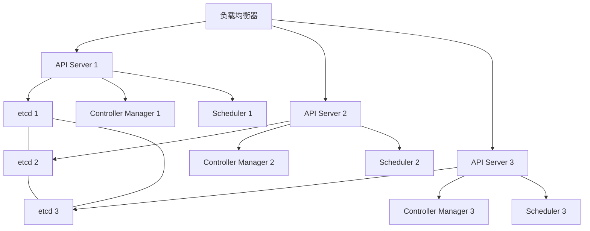

高可用部署的关键点：
- 至少3个控制平面节点
- 负载均衡器分发API请求
- etcd集群使用奇数节点（通常3、5或7个）
- 控制器和调度器配置为领导者选举模式
- 工作节点分布在多个可用区

### 7.2 版本兼容矩阵  

Kubernetes各组件之间存在版本兼容性要求。

| Kubernetes版本 | 支持的etcd版本 | 支持的容器运行时 | kubelet版
继续完成Kubernetes架构与核心概念文档：

### 7.2 版本兼容矩阵  

Kubernetes各组件之间存在版本兼容性要求，在规划部署和升级时需要考虑。

| Kubernetes版本 | 支持的etcd版本 | 支持的容器运行时 | kubelet版本偏差 |
|----------------|----------------|------------------|----------------|
| 1.24           | 3.5.0-3.5.x    | containerd 1.6+, CRI-O 1.24+ | -2个小版本 |
| 1.23           | 3.5.0-3.5.x    | containerd 1.5+, CRI-O 1.23+, Docker 20.10+ | -2个小版本 |
| 1.22           | 3.5.0-3.5.x    | containerd 1.5+, CRI-O 1.22+, Docker 20.10+ | -2个小版本 |
| 1.21           | 3.4.13-3.5.x   | containerd 1.4+, CRI-O 1.21+, Docker 20.10+ | -2个小版本 |

版本兼容性注意事项：
- API Server可以比kubelet高2个小版本，但不能低于kubelet版本
- 控制平面组件应该使用相同版本
- 升级时应遵循版本跳跃限制（通常不能跨越多个主版本）
- 定期检查Kubernetes版本支持周期，规划升级时间

### 7.3 备份与恢复策略

生产环境中，定期备份Kubernetes集群数据是确保业务连续性的关键。

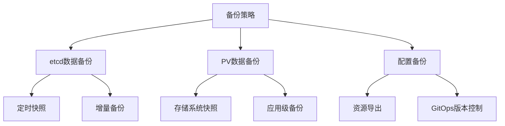

etcd备份示例：

```powershell
# 创建etcd快照
ETCDCTL_API=3 etcdctl --endpoints=https://127.0.0.1:2379 \
  --cacert=/etc/kubernetes/pki/etcd/ca.crt \
  --cert=/etc/kubernetes/pki/etcd/server.crt \
  --key=/etc/kubernetes/pki/etcd/server.key \
  snapshot save etcd-snapshot-$(date +%Y%m%d).db

# 从快照恢复
ETCDCTL_API=3 etcdctl snapshot restore etcd-snapshot-20220101.db \
  --data-dir=/var/lib/etcd-restore
```

资源备份示例：

```powershell
# 备份所有命名空间的资源
kubectl get all --all-namespaces -o yaml > all-resources.yaml

# 备份特定资源类型
kubectl get deployments,services,configmaps -n default -o yaml > default-resources.yaml
```

### 7.4 安全最佳实践

Kubernetes安全是一个多层次的问题，需要从多个方面进行加固。

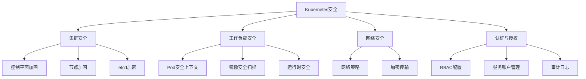

安全最佳实践：

1. **API Server安全**
   - 启用TLS加密
   - 配置强认证机制（证书、OIDC等）
   - 限制匿名访问

2. **RBAC权限控制**
   ```yaml:c:\project\kphub\kubernetes\rbac-example.yml
   apiVersion: rbac.authorization.k8s.io/v1
   kind: Role
   metadata:
     namespace: default
     name: pod-reader
   rules:
   - apiGroups: [""]
     resources: ["pods"]
     verbs: ["get", "watch", "list"]
   ---
   apiVersion: rbac.authorization.k8s.io/v1
   kind: RoleBinding
   metadata:
     name: read-pods
     namespace: default
   subjects:
   - kind: User
     name: jane
     apiGroup: rbac.authorization.k8s.io
   roleRef:
     kind: Role
     name: pod-reader
     apiGroup: rbac.authorization.k8s.io
   ```

3. **Pod安全上下文**
   ```yaml:c:\project\kphub\kubernetes\security-context-example.yml
   apiVersion: v1
   kind: Pod
   metadata:
     name: security-context-demo
   spec:
     securityContext:
       runAsUser: 1000
       runAsGroup: 3000
       fsGroup: 2000
     containers:
     - name: sec-ctx-demo
       image: busybox
       command: ["sh", "-c", "sleep 3600"]
       securityContext:
         allowPrivilegeEscalation: false
         capabilities:
           drop:
           - ALL
         readOnlyRootFilesystem: true
   ```

4. **网络安全**
   - 实施默认拒绝的网络策略
   - 使用TLS加密服务间通信
   - 限制Pod对外部网络的访问

5. **审计日志**
   - 配置API Server审计日志
   - 收集和分析节点和容器日志
   - 实施异常检测和告警

## 8. 扩展与定制  

Kubernetes提供了多种扩展机制，允许用户定制和扩展其功能。

### 8.1 自定义资源定义(CRD)  

CRD允许用户定义新的资源类型，扩展Kubernetes API。

```yaml:c:\project\kphub\kubernetes\crd-example.yml
apiVersion: apiextensions.k8s.io/v1
kind: CustomResourceDefinition
metadata:
  name: backups.example.com
spec:
  group: example.com
  versions:
    - name: v1
      served: true
      storage: true
      schema:
        openAPIV3Schema:
          type: object
          properties:
            spec:
              type: object
              properties:
                source:
                  type: string
                schedule:
                  type: string
                retention:
                  type: integer
  scope: Namespaced
  names:
    plural: backups
    singular: backup
    kind: Backup
    shortNames:
    - bk
```

使用自定义资源：

```yaml:c:\project\kphub\kubernetes\custom-resource-example.yml
apiVersion: example.com/v1
kind: Backup
metadata:
  name: database-backup
spec:
  source: mysql-database
  schedule: "0 0 * * *"
  retention: 7
```

### 8.2 Operator模式  

Operator是Kubernetes的扩展，使用自定义资源管理复杂应用。

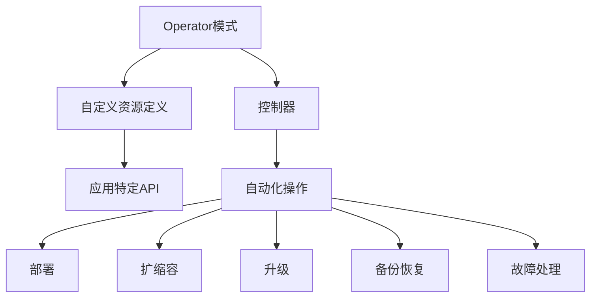

Operator的工作原理：
1. 定义自定义资源（CRD）表示应用状态
2. 实现控制器监视这些资源
3. 控制器执行操作使实际状态与期望状态一致
4. 自动化复杂的运维任务

常见的Operator示例：
- Prometheus Operator：管理监控系统
- Elasticsearch Operator：管理Elasticsearch集群
- PostgreSQL Operator：管理PostgreSQL数据库
- Istio Operator：管理服务网格

### 8.3 准入控制器  

准入控制器拦截API请求，在对象持久化之前进行验证或修改。

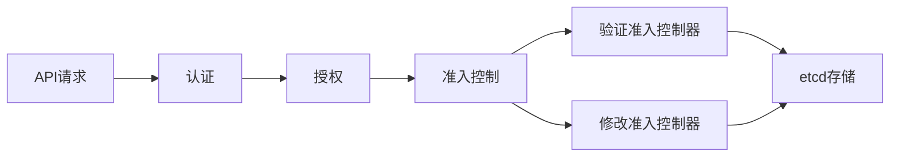

准入控制器类型：
1. **验证准入控制器**：可以拒绝请求
2. **修改准入控制器**：可以修改请求对象

常见的准入控制器：
- **PodSecurityPolicy**：强制执行Pod安全标准
- **ResourceQuota**：确保资源使用不超过配额
- **LimitRanger**：为没有指定资源限制的Pod设置默认值
- **ValidatingWebhookConfiguration**：调用外部HTTP服务进行验证
- **MutatingWebhookConfiguration**：调用外部HTTP服务进行修改

准入Webhook配置示例：

```yaml:c:\project\kphub\kubernetes\webhook-example.yml
apiVersion: admissionregistration.k8s.io/v1
kind: ValidatingWebhookConfiguration
metadata:
  name: pod-policy-validator
webhooks:
- name: pod-policy.example.com
  clientConfig:
    service:
      namespace: webhook-system
      name: webhook-service
      path: "/validate-pods"
    caBundle: <base64-encoded-ca-cert>
  rules:
  - apiGroups: [""]
    apiVersions: ["v1"]
    operations: ["CREATE", "UPDATE"]
    resources: ["pods"]
    scope: "Namespaced"
  admissionReviewVersions: ["v1"]
  sideEffects: None
  timeoutSeconds: 5
```

## 9. 故障排查与诊断  

Kubernetes环境中的故障排查需要系统化的方法和工具。

### 9.1 常见问题诊断流程  

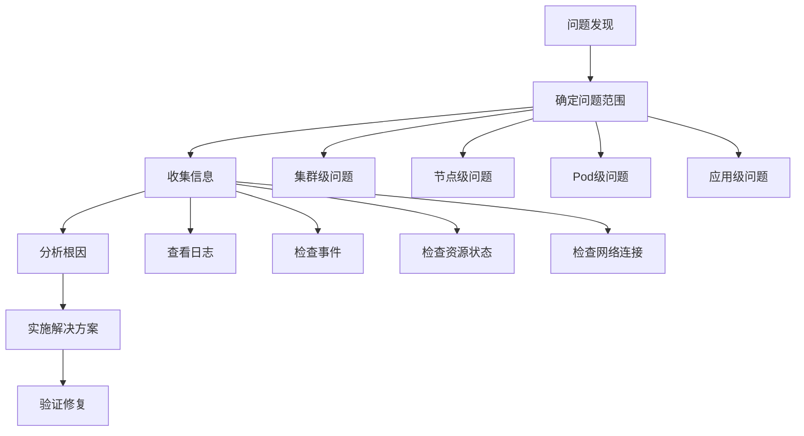

### 9.2 常用诊断命令  

```powershell
# 查看Pod状态
kubectl get pods -n <namespace>
kubectl describe pod <pod-name> -n <namespace>

# 查看Pod日志
kubectl logs <pod-name> -n <namespace>
kubectl logs <pod-name> -c <container-name> -n <namespace>
kubectl logs --previous <pod-name> -n <namespace>  # 查看之前容器的日志

# 查看事件
kubectl get events -n <namespace>
kubectl get events --sort-by='.lastTimestamp' -n <namespace>

# 检查节点状态
kubectl get nodes
kubectl describe node <node-name>
kubectl top node

# 检查资源使用情况
kubectl top pod -n <namespace>
kubectl top pod --containers -n <namespace>

# 执行容器命令
kubectl exec -it <pod-name> -n <namespace> -- <command>
kubectl exec -it <pod-name> -c <container-name> -n <namespace> -- <command>

# 端口转发
kubectl port-forward <pod-name> <local-port>:<pod-port> -n <namespace>

# 查看API资源
kubectl api-resources
kubectl explain <resource>
```

### 9.3 常见问题及解决方案  

1. **Pod一直处于Pending状态**
   - 可能原因：资源不足、PVC未绑定、节点选择器无匹配
   - 解决方案：
     ```powershell
     # 检查节点资源
     kubectl describe node
     
     # 检查PVC状态
     kubectl get pvc -n <namespace>
     
     # 检查Pod事件
     kubectl describe pod <pod-name> -n <namespace>
     ```

2. **Pod一直处于CrashLoopBackOff状态**
   - 可能原因：应用错误、资源限制、配置错误
   - 解决方案：
     ```powershell
     # 查看Pod日志
     kubectl logs <pod-name> -n <namespace>
     
     # 检查资源使用情况
     kubectl top pod <pod-name> -n <namespace>
     
     # 检查配置
     kubectl describe pod <pod-name> -n <namespace>
     ```

3. **Service无法访问**
   - 可能原因：标签选择器不匹配、端口配置错误、网络策略限制
   - 解决方案：
     ```powershell
     # 检查Service和Pod的标签
     kubectl get pods --show-labels -n <namespace>
     kubectl describe service <service-name> -n <namespace>
     
     # 测试Service连接
     kubectl run test-connection --image=busybox -it --rm -- wget -O- <service-name>:<port>
     ```

4. **节点NotReady**
   - 可能原因：kubelet问题、网络问题、资源耗尽
   - 解决方案：
     ```powershell
     # 检查节点状态
     kubectl describe node <node-name>
     
     # 检查kubelet日志
     # 在节点上执行
     journalctl -u kubelet
     ```

5. **PVC一直处于Pending状态**
   - 可能原因：存储类不存在、存储提供者问题
   - 解决方案：
     ```powershell
     # 检查StorageClass
     kubectl get storageclass
     
     # 检查PVC事件
     kubectl describe pvc <pvc-name> -n <namespace>
     ```

## 10. 性能优化与最佳实践  

优化Kubernetes集群性能需要从多个层面进行考虑。

### 10.1 资源请求与限制  

合理设置资源请求和限制是优化集群资源使用的关键。

```yaml:c:\project\kphub\kubernetes\resource-limits-example.yml
apiVersion: v1
kind: Pod
metadata:
  name: resource-demo
spec:
  containers:
  - name: resource-demo
    image: nginx
    resources:
      requests:
        memory: "64Mi"
        cpu: "250m"
      limits:
        memory: "128Mi"
        cpu: "500m"
```

资源配置最佳实践：
- 为所有容器设置资源请求
- 根据实际使用情况设置资源限制
- 避免过度分配或不足分配
- 使用资源配额控制命名空间资源使用
- 监控实际资源使用情况并调整配置

### 10.2 水平自动扩缩容  

HPA（Horizontal Pod Autoscaler）可以根据负载自动调整Pod副本数。

```yaml:c:\project\kphub\kubernetes\hpa-example.yml
apiVersion: autoscaling/v2
kind: HorizontalPodAutoscaler
metadata:
  name: nginx-hpa
spec:
  scaleTargetRef:
    apiVersion: apps/v1
    kind: Deployment
    name: nginx
  minReplicas: 2
  maxReplicas: 10
  metrics:
  - type: Resource
    resource:
      name: cpu
      target:
        type: Utilization
        averageUtilization: 80
  - type: Resource
    resource:
      name: memory
      target:
        type: Utilization
        averageUtilization: 80
```

HPA最佳实践：
- 设置合理的最小和最大副本数
- 选择适当的指标和目标值
- 配置适当的冷却期，避免频繁扩缩
- 结合垂直自动扩缩（VPA）使用
- 测试自动扩缩行为，确保符合预期

### 10.3 集群扩展性考虑  

大规模Kubernetes集群需要特别关注扩展性问题。

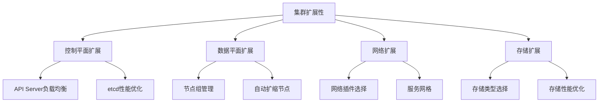

扩展性最佳实践：
- 使用节点池或节点组管理不同类型的工作负载
- 实施集群自动扩缩（Cluster Autoscaler）
- 选择适合规模的网络插件
- 优化etcd性能（使用SSD、调整参数）
- 实施资源配额和限制
- 使用命名空间隔离不同环境和团队
- 定期清理未使用的资源

### 10.4 生产环境检查清单  

部署生产环境Kubernetes集群的关键检查项：

```text:c:\project\kphub\kubernetes\production-checklist.txt
# Kubernetes生产环境检查清单

## 高可用性
- [ ] 控制平面组件冗余部署（至少3个节点）
- [ ] etcd集群使用奇数节点（3/5/7）
- [ ] 工作节点分布在多个可用区
- [ ] 关键应用使用多副本部署
- [ ] 配置Pod反亲和性避免单点故障

## 安全性
- [ ] 启用RBAC并遵循最小权限原则
- [ ] 实施网络策略限制Pod间通信
- [ ] 配置Pod安全上下文限制容器权限
- [ ] 启用审计日志并集中存储
- [ ] 定期更新集群和容器镜像
- [ ] 实施镜像扫描和准入控制

## 监控与告警
- [ ] 部署集群监控系统（Prometheus + Grafana）
- [ ] 配置关键指标告警
- [ ] 实施日志聚合（ELK/EFK）
- [ ] 监控控制平面组件健康状态
- [ ] 配置资源使用率告警
- [ ] 实施分布式追踪（Jaeger/Zipkin）

## 备份与恢复
- [ ] 定期备份etcd数据
- [ ] 备份关键应用数据
- [ ] 测试恢复流程
- [ ] 文档化灾难恢复计划
- [ ] 配置集群状态导出

## 资源管理
- [ ] 为所有容器设置资源请求和限制
- [ ] 实施命名空间资源配额
- [ ] 配置HPA自动扩缩容
- [ ] 实施优先级和抢占
- [ ] 配置集群自动扩缩

## 网络配置
- [ ] 选择适合规模的CNI插件
- [ ] 配置合理的Pod CIDR和Service CIDR
- [ ] 实施Ingress控制器和证书管理
- [ ] 配置外部DNS集成
- [ ] 考虑服务网格实施（如Istio）

## 存储配置
- [ ] 选择适合工作负载的存储解决方案
- [ ] 配置存储类和默认存储类
- [ ] 实施存储备份策略
- [ ] 测试存储性能满足需求
- [ ] 配置存储监控

## 升级策略
- [ ] 制定集群升级计划
- [ ] 在测试环境验证升级
- [ ] 配置节点维护策略
- [ ] 文档化回滚流程
- [ ] 考虑使用集群API进行声明式管理
```

## 总结

Kubernetes是一个功能强大的容器编排平台，通过其分层架构和声明式API，实现了容器化应用的自动化部署、扩展和管理。本文详细介绍了Kubernetes的架构设计、核心组件和基本概念，帮助读者建立对Kubernetes系统的全面认识。

理解Kubernetes的核心概念和工作原理是有效使用和管理Kubernetes集群的基础。随着对Kubernetes的深入学习和实践，您将能够设计、部署和管理复杂的容器化应用，充分利用Kubernetes提供的自动化、弹性和可扩展性优势。

在生产环境中部署Kubernetes时，应特别关注高可用性、安全性、监控和备份等方面，确保集群的稳定性和可靠性。通过遵循最佳实践和持续优化，可以构建一个健壮、高效的Kubernetes平台，支持各种规模和复杂度的应用部署需求。