# 声明式API与控制器模式  

Kubernetes的核心设计理念之一是声明式API与控制器模式的结合，这种设计使得系统能够自动化地维护集群状态，并为用户提供简单而强大的接口。本文将深入探讨这一设计模式的原理、实现和最佳实践。

## 1. 声明式API原理  

声明式API允许用户描述系统的期望状态，而不是指定达到该状态的具体步骤。系统会持续工作以确保实际状态与期望状态一致。

### 1.1 与命令式API对比  

| 特性 | 声明式API | 命令式API |  
|------|----------|----------|  
| 操作方式 | 描述期望状态 | 执行具体操作指令 |  
| 关注点 | 结果（想要什么） | 过程（如何做） |  
| 幂等性 | 天然支持 | 需要额外实现 |  
| 状态管理 | 系统维护实际状态 | 用户管理状态 |  
| 错误处理 | 自动重试和恢复 | 通常需要用户干预 |  
| 并发安全 | 更容易保证 | 需要额外机制 |  
| 学习曲线 | 初期较陡峭 | 初期较平缓 |  

命令式与声明式的区别可以通过日常例子来理解：
- **命令式**：告诉厨师"切三个洋葱，加热锅，放入黄油，炒洋葱..."（具体步骤）
- **声明式**：告诉厨师"我想要一份洋葱汤"（期望结果）

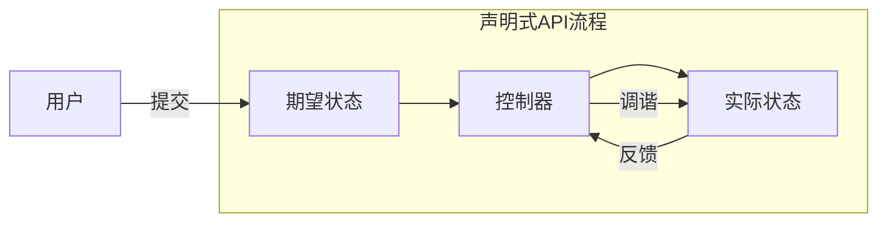

在Kubernetes中，声明式API的工作流程如下：
1. 用户通过YAML文件定义资源的期望状态
2. 控制器持续监控资源的实际状态
3. 当实际状态与期望状态不一致时，控制器执行操作使其一致
4. 系统持续维护这种一致性，即使在出现故障时也会自动恢复

### 1.2 典型资源定义  

以下是一个典型的Kubernetes声明式资源定义示例：

```yaml:c:\project\kphub\kubernetes\declarative.yml
apiVersion: apps/v1
kind: Deployment
metadata:
  name: nginx
  namespace: default
  labels:
    app: nginx
    environment: production
spec:
  replicas: 3                    # 期望的Pod副本数
  selector:
    matchLabels:
      app: nginx
  strategy:
    type: RollingUpdate          # 更新策略
    rollingUpdate:
      maxSurge: 1
      maxUnavailable: 1
  template:
    metadata:
      labels:
        app: nginx
    spec:
      containers:
      - name: nginx
        image: nginx:1.19
        ports:
        - containerPort: 80
        resources:
          requests:
            cpu: "100m"
            memory: "128Mi"
          limits:
            cpu: "200m"
            memory: "256Mi"
        livenessProbe:
          httpGet:
            path: /
            port: 80
          initialDelaySeconds: 30
          periodSeconds: 10
```

这个YAML文件声明了一个名为`nginx`的Deployment资源，具有以下特点：
- 期望运行3个Pod副本
- 使用nginx:1.19镜像
- 定义了资源请求和限制
- 配置了健康检查
- 使用RollingUpdate策略进行更新

用户只需关注"想要什么"（3个nginx Pod），而不是"如何做"（创建Pod、监控状态、替换失败的Pod等）。系统会自动处理实现细节。

### 1.3 声明式操作的优势

声明式API在Kubernetes中带来了多项关键优势：

1. **自愈能力**：系统会自动检测并修复偏离期望状态的情况
2. **版本控制友好**：YAML文件可以存储在Git等版本控制系统中
3. **GitOps支持**：可以通过Git操作管理集群配置
4. **审计和合规**：清晰记录系统配置的历史变更
5. **减少人为错误**：避免手动执行复杂操作序列
6. **简化复杂操作**：抽象底层实现细节

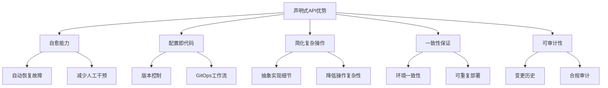

## 2. 控制器模式  

控制器模式是Kubernetes实现声明式API的核心机制，它通过持续监控和调谐使系统状态与用户期望一致。

### 2.1 控制循环流程  

控制器通过一个持续运行的循环来监控和调整系统状态：

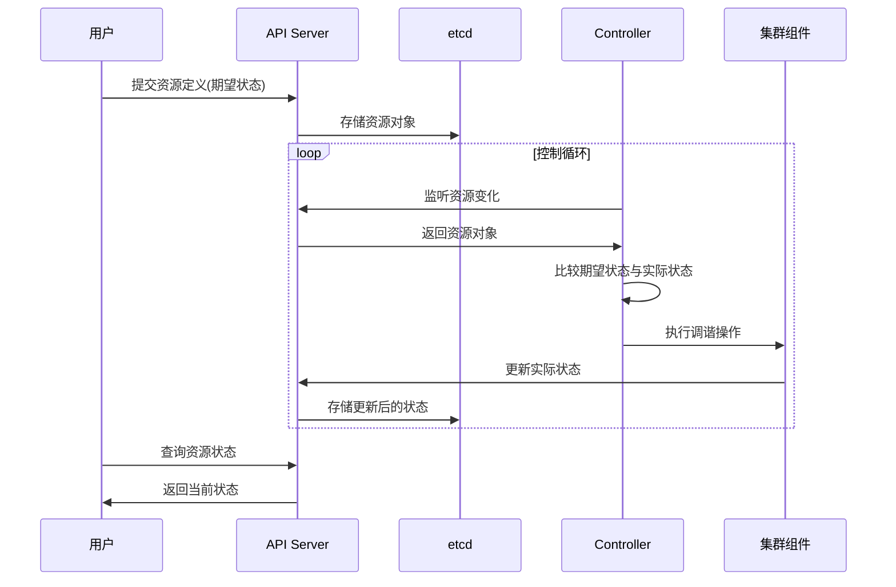

控制循环的关键步骤：

1. **观察**：控制器通过API Server监听特定资源的变化
2. **分析**：比较资源的期望状态（spec）和实际状态（status）
3. **执行**：采取必要的操作使实际状态向期望状态靠拢
4. **更新**：将最新的实际状态报告给API Server

这个循环持续运行，确保即使在出现临时故障或外部干扰时，系统也能恢复到期望状态。

### 2.2 控制器实现示例  

以下是一个简化的控制器实现示例，展示了控制循环的核心逻辑：

```go:c:\project\kphub\kubernetes\controller\sample.go
package controller

import (
    "context"
    "fmt"
    "time"
    
    appsv1 "k8s.io/api/apps/v1"
    "k8s.io/apimachinery/pkg/api/errors"
    metav1 "k8s.io/apimachinery/pkg/apis/meta/v1"
    "k8s.io/client-go/kubernetes"
    "k8s.io/klog/v2"
)

// Controller 实现一个简单的Deployment控制器
type Controller struct {
    clientset kubernetes.Interface
    namespace string
    resyncPeriod time.Duration
}

// NewController 创建一个新的控制器实例
func NewController(clientset kubernetes.Interface, namespace string) *Controller {
    return &Controller{
        clientset:    clientset,
        namespace:    namespace,
        resyncPeriod: 30 * time.Second,
    }
}

// Run 启动控制器的主循环
func (c *Controller) Run(stopCh <-chan struct{}) {
    klog.Info("Starting controller")
    defer klog.Info("Shutting down controller")
    
    // 控制循环
    for {
        select {
        case <-stopCh:
            return
        default:
            // 获取所有Deployment
            deployments, err := c.clientset.AppsV1().Deployments(c.namespace).List(context.TODO(), metav1.ListOptions{})
            if err != nil {
                klog.Errorf("Error listing deployments: %v", err)
                time.Sleep(c.resyncPeriod)
                continue
            }
            
            // 处理每个Deployment
            for _, deployment := range deployments.Items {
                if err := c.reconcileDeployment(&deployment); err != nil {
                    klog.Errorf("Error reconciling deployment %s: %v", deployment.Name, err)
                }
            }
            
            time.Sleep(c.resyncPeriod)
        }
    }
}

// reconcileDeployment 调谐单个Deployment资源
func (c *Controller) reconcileDeployment(deployment *appsv1.Deployment) error {
    // 获取期望状态
    desiredReplicas := *deployment.Spec.Replicas
    
    // 获取实际状态
    currentReplicas := deployment.Status.Replicas
    
    klog.Infof("Deployment %s: desired replicas: %d, current replicas: %d", 
        deployment.Name, desiredReplicas, currentReplicas)
    
    // 如果状态不一致，执行调谐
    if desiredReplicas != currentReplicas {
        klog.Infof("Reconciling deployment %s", deployment.Name)
        
        // 在实际控制器中，这里会执行创建/删除Pod的操作
        // 这里简化为打印日志
        klog.Infof("Adjusting replicas for %s from %d to %d", 
            deployment.Name, currentReplicas, desiredReplicas)
        
        // 更新状态
        deployment.Status.Replicas = desiredReplicas
        _, err := c.clientset.AppsV1().Deployments(deployment.Namespace).UpdateStatus(
            context.TODO(), deployment, metav1.UpdateOptions{})
        if err != nil {
            return fmt.Errorf("failed to update deployment status: %v", err)
        }
    }
    
    return nil
}
```

这个示例展示了控制器的基本结构：
- 定期获取资源的当前状态
- 比较期望状态和实际状态
- 执行必要的调谐操作
- 更新资源状态

实际的Kubernetes控制器更加复杂，包括事件处理、缓存、并发控制等高级特性。

### 2.3 常见内置控制器

Kubernetes包含多个内置控制器，每个控制器负责特定类型资源的生命周期管理：

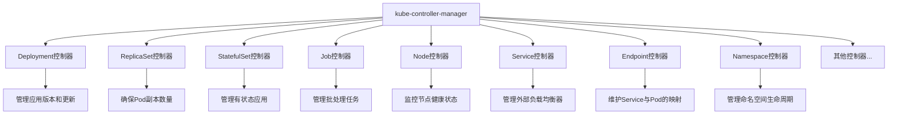

每个控制器专注于一个特定领域，遵循"单一职责原则"，这种设计使系统更加模块化和可扩展。

## 3. 调谐循环  

调谐循环（Reconciliation Loop）是控制器的核心机制，负责持续调整系统状态以匹配期望状态。

### 3.1 状态比对机制  

调谐过程涉及以下关键步骤：

```text
1. 获取资源对象的spec字段（期望状态）
2. 查询集群实际运行状态（通常反映在status字段）
3. 计算期望状态与实际状态之间的差异
4. 执行必要的操作消除这些差异
5. 更新status字段反映最新的实际状态
```

状态比对是一个level-based（基于水平）而非edge-based（基于边缘）的过程：
- **Level-based**：关注当前状态与期望状态的差异，不关心如何达到当前状态
- **Edge-based**：关注状态变化的事件或触发器

Level-based方法更加健壮，因为它不依赖于事件历史，每次调谐都基于当前的完整状态。

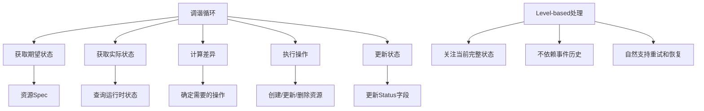

### 3.2 事件处理流程  

虽然调谐是level-based的，但为了效率，控制器通常使用事件触发调谐：

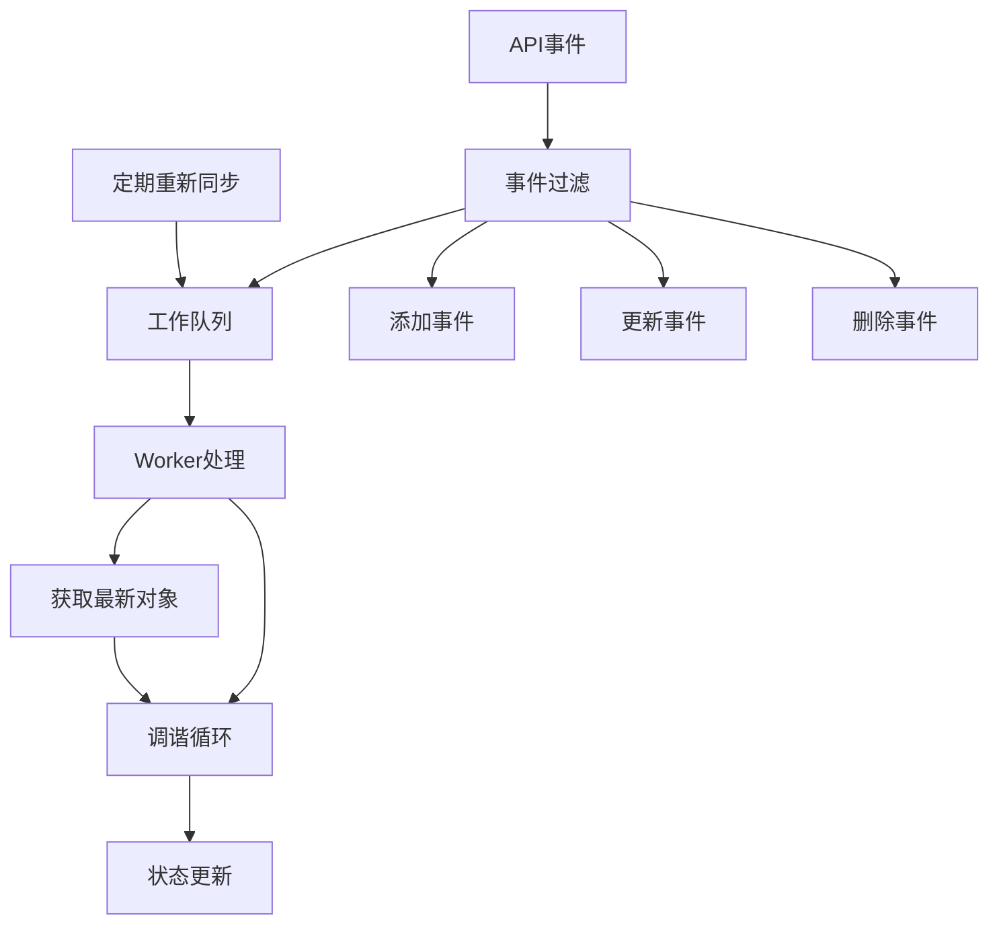

事件处理流程的关键组件：

1. **事件源**：监听API Server的资源变化
2. **事件过滤**：筛选相关事件，减少不必要的处理
3. **工作队列**：缓冲事件并处理去重
4. **Worker**：从队列获取事件并执行调谐
5. **定期重新同步**：即使没有事件也定期执行调谐，确保状态一致性

这种设计结合了event-driven（事件驱动）的效率和level-based的可靠性。

### 3.3 调谐的幂等性

调谐操作必须是幂等的，即多次执行相同的调谐操作应该产生相同的结果。这一特性对于确保系统的可靠性至关重要。

```go:c:\project\kphub\kubernetes\controller\idempotent.go
// 幂等调谐示例
func (c *Controller) reconcilePod(pod *corev1.Pod) error {
    // 不管调用多少次，结果都是一致的
    if pod.DeletionTimestamp != nil {
        // Pod正在删除，不做任何操作
        return nil
    }
    
    // 检查Pod是否需要创建
    existingPod, err := c.clientset.CoreV1().Pods(pod.Namespace).Get(
        context.TODO(), pod.Name, metav1.GetOptions{})
    
    if errors.IsNotFound(err) {
        // Pod不存在，创建它
        _, err = c.clientset.CoreV1().Pods(pod.Namespace).Create(
            context.TODO(), pod, metav1.CreateOptions{})
        return err
    } else if err != nil {
        // 其他错误
        return err
    }
    
    // Pod已存在，检查是否需要更新
    if podNeedsUpdate(existingPod, pod) {
        // 更新Pod
        _, err = c.clientset.CoreV1().Pods(pod.Namespace).Update(
            context.TODO(), pod, metav1.UpdateOptions{})
        return err
    }
    
    // Pod已存在且不需要更新
    return nil
}

// 判断Pod是否需要更新
func podNeedsUpdate(old, new *corev1.Pod) bool {
    // 比较关键字段，确定是否需要更新
    // ...
    return false
}
```

幂等性设计原则：
- 操作前检查当前状态
- 只在必要时执行变更
- 使用乐观并发控制（如ResourceVersion）
- 处理冲突和错误情况
- 设计可重试的操作

## 4. 自定义控制器  

Kubernetes的可扩展性允许开发者创建自定义控制器，管理自定义资源或实现特定的业务逻辑。

### 4.1 开发框架组件  

自定义控制器通常基于client-go库构建，包含以下关键组件：

```text
- Informer: 监听资源变化并维护本地缓存
- Workqueue: 事件队列，支持去重和重试
- Indexer: 提供高效的本地缓存查询
- Handler: 实现业务逻辑处理
- Client: 与API Server通信
```

这些组件协同工作，形成一个高效的控制器框架：

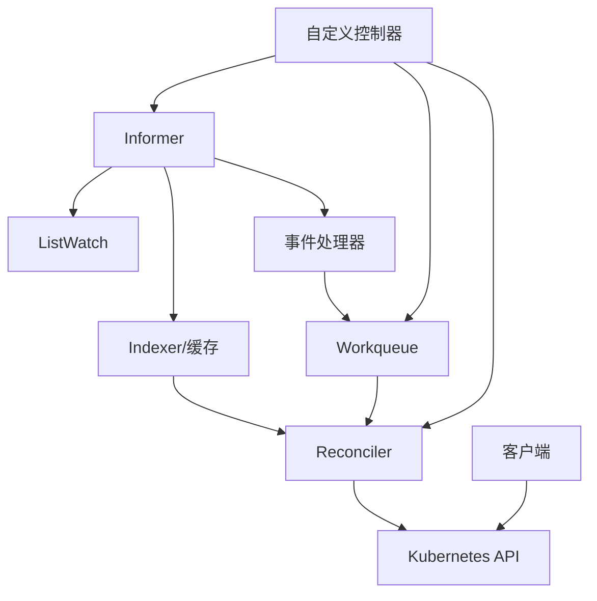

### 4.2 关键代码结构  

以下是一个自定义控制器的基本框架：

```go:c:\project\kphub\kubernetes\controller\framework.go
package controller

import (
    "fmt"
    "time"
    
    "k8s.io/apimachinery/pkg/apis/meta/v1/unstructured"
    "k8s.io/apimachinery/pkg/runtime/schema"
    "k8s.io/apimachinery/pkg/util/wait"
    "k8s.io/client-go/dynamic"
    "k8s.io/client-go/dynamic/dynamicinformer"
    "k8s.io/client-go/tools/cache"
    "k8s.io/client-go/util/workqueue"
    "k8s.io/klog/v2"
)

// HandlerFunc 定义处理资源的函数类型
type HandlerFunc func(obj *unstructured.Unstructured) error

// Controller 实现自定义资源的控制器
type Controller struct {
    // 客户端
    client dynamic.Interface
    
    // 资源类型信息
    gvr schema.GroupVersionResource
    
    // 事件处理组件
    informer cache.SharedIndexInformer
    indexer  cache.Indexer
    queue    workqueue.RateLimitingInterface
    
    // 业务逻辑处理函数
    handler HandlerFunc
}

// NewController 创建一个新的控制器
func NewController(
    client dynamic.Interface,
    gvr schema.GroupVersionResource,
    handler HandlerFunc,
) *Controller {
    // 创建动态informer
    factory := dynamicinformer.NewFilteredDynamicSharedInformerFactory(
        client, time.Minute*30, "", nil)
    informer := factory.ForResource(gvr).Informer()
    
    // 创建工作队列
    queue := workqueue.NewRateLimitingQueue(workqueue.DefaultControllerRateLimiter())
    
    // 创建控制器
    controller := &Controller{
        client:   client,
        gvr:      gvr,
        informer: informer,
        indexer:  informer.GetIndexer(),
        queue:    queue,
        handler:  handler,
    }
    
    // 设置事件处理器
    informer.AddEventHandler(cache.ResourceEventHandlerFuncs{
        AddFunc: controller.enqueueObject,
        UpdateFunc: func(old, new interface{}) {
            controller.enqueueObject(new)
        },
        DeleteFunc: controller.enqueueObject,
    })
    
    return controller
}

// 将对象加入工作队列
func (c *Controller) enqueueObject(obj interface{}) {
    key, err := cache.MetaNamespaceKeyFunc(obj)
    if err != nil {
        klog.Errorf("Failed to get key for object: %v", err)
        return
    }
    c.queue.Add(key)
}

// Run 启动控制器
func (c *Controller) Run(workers int, stopCh <-chan struct{}) error {
    defer c.queue.ShutDown()
    
    // 启动informer
    klog.Info("Starting informer")
    go c.informer.Run(stopCh)
    
    // 等待缓存同步
    klog.Info("Waiting for informer cache to sync")
    if !cache.WaitForCacheSync(stopCh, c.informer.HasSynced) {
        return fmt.Errorf("failed to wait for caches to sync")
    }
    
    // 启动worker
    klog.Infof("Starting %d workers", workers)
    for i := 0; i < workers; i++ {
        go wait.Until(c.runWorker, time.Second, stopCh)
    }
    
    klog.Info("Controller started")
    <-stopCh
    klog.Info("Controller stopped")
    
    return nil
}

// runWorker 运行工作循环
func (c *Controller) runWorker() {
    for c.processNextItem() {
    }
}

// processNextItem 处理队列中的下一个项目
func (c *Controller) processNextItem() bool {
    // 从队列获取下一个项目
    key, quit := c.queue.Get()
    if quit {
        return false
    }
    defer c.queue.Done(key)
    
    // 处理项目
    err := c.syncObject(key.(string))
    if err != nil {
        // 处理失败，重新入队
        klog.Errorf("Error syncing object %s: %v", key, err)
        c.queue.AddRateLimited(key)
        return true
    }
    
    // 处理成功，重置重试计数
    c.queue.Forget(key)
    return true
}

// syncObject 同步单个对象
func (c *Controller) syncObject(key string) error {
    namespace, name, err := cache.SplitMetaNamespaceKey(key)
    if err != nil {
        return fmt.Errorf("invalid resource key: %s", key)
    }
    
    // 从缓存获取对象
    obj, exists, err := c.indexer.GetByKey(key)
    if err != nil {
        return fmt.Errorf("failed to get object from indexer: %v", err)
    }
    
    if !exists {
        klog.Infof("Object %s/%s has been deleted", namespace, name)
        // 对象已删除，可能需要清理相关资源
        return nil
    }
    
    // 转换为unstructured对象
    unstructuredObj, ok := obj.(*unstructured.Unstructured)
    if !ok {
        return fmt.Errorf("expected unstructured object, got %T", obj)
    }
    
    // 调用处理函数
    return c.handler(unstructuredObj)
}
```

这个框架实现了自定义控制器的基本功能：
- 监听资源变化
- 维护本地缓存
- 使用工作队列处理事件
- 调用自定义处理逻辑
- 处理错误和重试

### 4.3 自定义资源定义(CRD)

自定义控制器通常与自定义资源定义(CRD)一起使用，扩展Kubernetes API：

```yaml:c:\project\kphub\kubernetes\crd-example.yml
apiVersion: apiextensions.k8s.io/v1
kind: CustomResourceDefinition
metadata:
  name: applications.app.example.com
spec:
  group: app.example.com
  names:
    kind: Application
    plural: applications
    singular: application
    shortNames:
    - app
  scope: Namespaced
  versions:
  - name: v1
    served: true
    storage: true
    schema:
      openAPIV3Schema:
        type: object
        properties:
          spec:
            type: object
            required: ["deploymentName", "replicas"]
            properties:
              deploymentName:
                type: string
              replicas:
                type: integer
                minimum: 1
              image:
                type: string
              command:
                type: array
                items:
                  type: string
          status:
            type: object
            properties:
              availableReplicas:
                type: integer
              phase:
                type: string
    subresources:
      status: {}
    additionalPrinterColumns:
    - name: Replicas
      type: integer
      jsonPath: .spec.replicas
    - name: Available
      type: integer
      jsonPath: .status.availableReplicas
    - name: Phase
      type: string
      jsonPath: .status.phase
```

自定义资源的使用示例：

```yaml:c:\project\kphub\kubernetes\cr-example.yml
apiVersion: app.example.com/v1
kind: Application
metadata:
  name: my-app
spec:
  deploymentName: my-app-deployment
  replicas: 3
  image: nginx:1.19
  command: ["nginx", "-g", "daemon off;"]
```

## 5. 生产实践  

在生产环境中使用声明式API和控制器模式需要遵循一系列最佳实践。

### 5.1 控制器设计原则  

设计高质量控制器的关键原则：

```text
1. 幂等性：多次执行结果一致
   - 操作前检查当前状态
   - 使用乐观并发控制

2. 水平扩展：支持多实例协同工作
   - 使用领导者选举避免冲突
   - 避免依赖本地状态

3. 事件过滤：避免不必要调谐
   - 使用标签选择器过滤资源
   - 实现智能变更检测

4. 重试机制：处理临时故障
   - 使用指数退避重试
   - 区分永久性和临时性错误

5. 防止级联失败
   - 实现断路器模式
   - 限制并发操作数量

6. 优雅降级
   - 在部分功能不可用时保持核心功能
   - 实现回退机制

7. 可观测性
   - 输出详细日志
   - 暴露关键指标
   - 记录重要事件
```

这些原则确保控制器在复杂的分布式环境中可靠运行。

### 5.2 性能优化策略  

控制器性能优化的关键策略：

```yaml:c:\project\kphub\kubernetes\controller-optimization.yml
# kube-controller-manager配置示例
apiVersion: v1
kind: Pod
metadata:
  name: kube-controller-manager
  namespace: kube-system
spec:
  containers:
  - name: kube-controller-manager
    image: k8s.gcr.io/kube-controller-manager:v1.22.0
    command:
    - kube-controller-manager
    - --concurrent-deployment-syncs=10      # 并发处理的Deployment数量
    - --concurrent-endpoint-syncs=5         # 并发处理的Endpoint数量
    - --concurrent-service-syncs=3          # 并发处理的Service数量
    - --concurrent-rc-syncs=10              # 并发处理的ReplicationController数量
    - --concurrent-resource-quota-syncs=5   # 并发处理的ResourceQuota数量
    - --kube-
继续完成声明式API与控制器模式文档：

### 5.2 性能优化策略  

控制器性能优化的关键策略：

```yaml:c:\project\kphub\kubernetes\controller-optimization.yml
# kube-controller-manager配置示例
apiVersion: v1
kind: Pod
metadata:
  name: kube-controller-manager
  namespace: kube-system
spec:
  containers:
  - name: kube-controller-manager
    image: k8s.gcr.io/kube-controller-manager:v1.22.0
    command:
    - kube-controller-manager
    - --concurrent-deployment-syncs=10      # 并发处理的Deployment数量
    - --concurrent-endpoint-syncs=5         # 并发处理的Endpoint数量
    - --concurrent-service-syncs=3          # 并发处理的Service数量
    - --concurrent-rc-syncs=10              # 并发处理的ReplicationController数量
    - --concurrent-resource-quota-syncs=5   # 并发处理的ResourceQuota数量
    - --kube-api-qps=100                    # API Server请求速率限制
    - --kube-api-burst=150                  # API Server突发请求限制
    - --node-monitor-period=5s              # 节点状态检查周期
    - --node-monitor-grace-period=40s       # 节点不可达容忍时间
    - --route-reconciliation-period=10s     # 路由调谐周期
```

性能优化的关键方面：

1. **并发控制**
   - 调整各控制器的并发处理数量
   - 根据集群规模和硬件资源调整

2. **API请求限制**
   - 设置合理的QPS和突发请求限制
   - 避免对API Server造成过大压力

3. **本地缓存**
   - 使用Informer缓存减少API调用
   - 实现高效的索引提升查询性能

4. **批量处理**
   - 合并多个操作减少API调用
   - 使用批量更新接口

5. **资源过滤**
   - 使用字段选择器减少传输数据量
   - 使用标签选择器过滤不相关资源

```go:c:\project\kphub\kubernetes\controller\optimization.go
// 性能优化示例

// 1. 使用字段选择器减少数据传输
pods, err := clientset.CoreV1().Pods(namespace).List(context.TODO(), metav1.ListOptions{
    FieldSelector: "status.phase=Running",
})

// 2. 使用标签选择器过滤资源
pods, err := clientset.CoreV1().Pods(namespace).List(context.TODO(), metav1.ListOptions{
    LabelSelector: "app=nginx,environment=production",
})

// 3. 使用共享Informer减少API调用
factory := informers.NewSharedInformerFactory(clientset, time.Minute*30)
podInformer := factory.Core().V1().Pods()
podLister := podInformer.Lister()

// 从缓存获取数据而非直接调用API
pods, err := podLister.Pods(namespace).List(labels.Everything())

// 4. 实现高效索引
indexer.AddIndexers(cache.Indexers{
    "byOwner": indexByOwnerReference,
})

// 5. 批量处理
var updates []batch.Write
for _, obj := range objectsToUpdate {
    updates = append(updates, batch.Write{
        Type:  batch.Update,
        Object: obj,
    })
}
result, err := client.Batch(updates)
```

### 5.3 监控与可观测性

控制器的可观测性对于生产环境至关重要：

```go:c:\project\kphub\kubernetes\controller\metrics.go
package controller

import (
    "time"
    
    "github.com/prometheus/client_golang/prometheus"
    "github.com/prometheus/client_golang/prometheus/promauto"
)

// 定义指标
var (
    reconcileTotal = promauto.NewCounterVec(
        prometheus.CounterOpts{
            Name: "controller_reconcile_total",
            Help: "The total number of reconciliations",
        },
        []string{"controller", "resource"},
    )
    
    reconcileErrors = promauto.NewCounterVec(
        prometheus.CounterOpts{
            Name: "controller_reconcile_errors_total",
            Help: "The total number of reconciliation errors",
        },
        []string{"controller", "resource"},
    )
    
    reconcileDuration = promauto.NewHistogramVec(
        prometheus.HistogramOpts{
            Name:    "controller_reconcile_duration_seconds",
            Help:    "The duration of reconciliations",
            Buckets: prometheus.DefBuckets,
        },
        []string{"controller", "resource"},
    )
    
    workqueueDepth = promauto.NewGaugeVec(
        prometheus.GaugeOpts{
            Name: "controller_workqueue_depth",
            Help: "Current depth of the work queue",
        },
        []string{"controller"},
    )
    
    workqueueLatency = promauto.NewHistogramVec(
        prometheus.HistogramOpts{
            Name:    "controller_workqueue_latency_seconds",
            Help:    "How long an item stays in the work queue",
            Buckets: prometheus.DefBuckets,
        },
        []string{"controller"},
    )
)

// 在调谐函数中使用指标
func (c *Controller) reconcile(obj interface{}) error {
    // 记录开始时间
    start := time.Now()
    
    // 更新队列深度指标
    workqueueDepth.WithLabelValues(c.name).Set(float64(c.queue.Len()))
    
    // 执行调谐
    err := c.doReconcile(obj)
    
    // 记录调谐总数
    reconcileTotal.WithLabelValues(c.name, c.resourceType).Inc()
    
    // 记录调谐持续时间
    duration := time.Since(start).Seconds()
    reconcileDuration.WithLabelValues(c.name, c.resourceType).Observe(duration)
    
    // 如果有错误，记录错误计数
    if err != nil {
        reconcileErrors.WithLabelValues(c.name, c.resourceType).Inc()
    }
    
    return err
}
```

关键监控指标：
- 调谐操作总数和错误数
- 调谐操作持续时间
- 工作队列深度和延迟
- 资源处理速率
- API请求速率和错误率
- 缓存命中率

## 6. 常见模式  

Kubernetes中的控制器实现了多种设计模式，理解这些模式有助于设计高质量的自定义控制器。

### 6.1 级联控制  

级联控制是Kubernetes中常见的模式，高级资源控制器创建和管理低级资源：

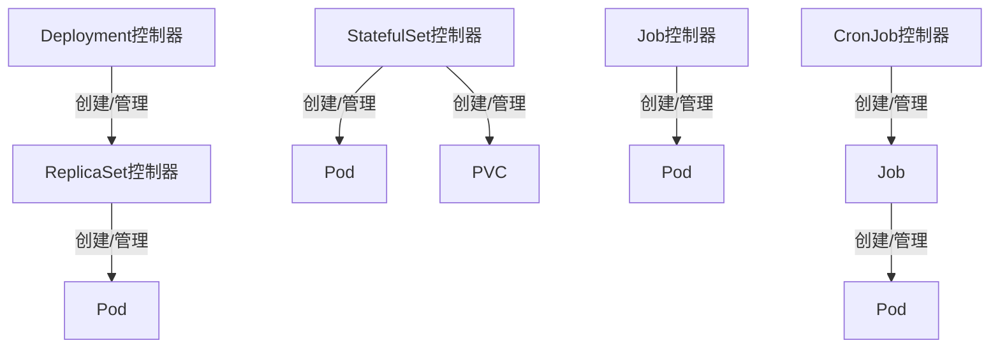

级联控制的特点：
- 每个控制器专注于单一职责
- 高级控制器不直接管理最终资源
- 通过所有权引用（OwnerReferences）建立资源间关系
- 支持级联删除

```yaml:c:\project\kphub\kubernetes\owner-reference-example.yml
apiVersion: v1
kind: Pod
metadata:
  name: nginx-pod
  ownerReferences:
  - apiVersion: apps/v1
    kind: ReplicaSet
    name: nginx-replicaset
    uid: d9607e19-f88f-11e6-a518-42010a800195
    controller: true
    blockOwnerDeletion: true
spec:
  containers:
  - name: nginx
    image: nginx:1.19
```

级联控制的优势：
- 分离关注点，简化控制器逻辑
- 支持资源的自动清理
- 允许不同层次的抽象和功能扩展

### 6.2 辅助控制器  

辅助控制器模式涉及多个控制器协同工作，每个控制器负责特定方面：

```text
主要辅助控制器示例：

- Deployment控制器：管理ReplicaSet版本和更新策略
- HorizontalPodAutoscaler：自动调整Pod副本数
- PodDisruptionBudget：确保Pod维护期间的可用性
- NetworkPolicy控制器：实现网络访问控制
- ResourceQuota控制器：强制资源使用限制
- LimitRanger：设置默认资源限制
- ServiceAccount控制器：管理服务账户和密钥
```

辅助控制器的特点：
- 专注于横切关注点
- 不直接创建资源，而是修改或监控资源
- 通常实现特定的策略或约束

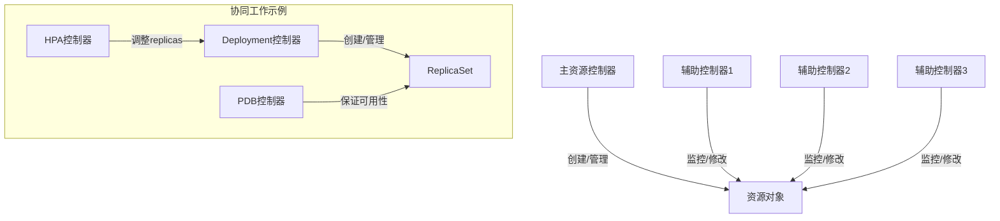

### 6.3 Operator模式

Operator模式是控制器模式的扩展，专注于管理特定应用的生命周期：

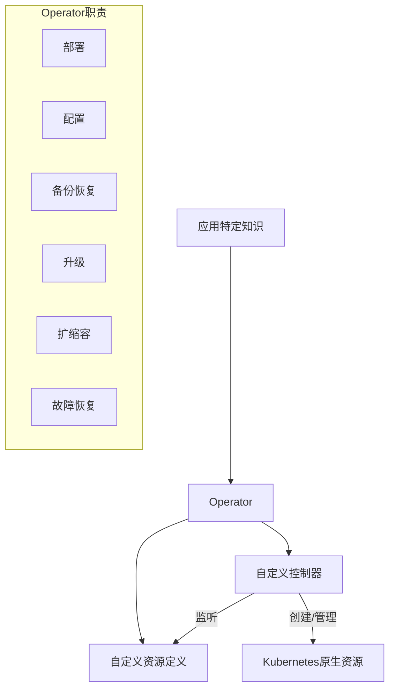

Operator的关键特点：
- 将特定应用的领域知识编码到控制器中
- 使用自定义资源表示应用配置和状态
- 自动化复杂的运维任务
- 处理应用特有的生命周期管理

```yaml:c:\project\kphub\kubernetes\operator-example.yml
# 自定义资源示例：PostgreSQL数据库
apiVersion: postgres-operator.example.com/v1
kind: PostgresCluster
metadata:
  name: example-db
spec:
  version: "13.4"
  instances: 3
  resources:
    requests:
      cpu: "1"
      memory: "2Gi"
    limits:
      cpu: "2"
      memory: "4Gi"
  storage:
    size: "100Gi"
    storageClass: "ssd"
  backup:
    schedule: "0 0 * * *"
    retention: 7
  monitoring: true
  tls: true
```

Operator实现的典型功能：
- 自动化部署和配置
- 备份和恢复
- 版本升级
- 自动扩缩容
- 故障检测和恢复
- 性能优化

## 7. 最佳实践与常见陷阱  

### 7.1 声明式API最佳实践  

使用声明式API的最佳实践：

```text
1. 资源设计原则
   - 遵循Kubernetes API约定
   - 使用标准字段和命名规范
   - 明确区分spec（期望状态）和status（实际状态）
   - 设计合理的默认值

2. 版本控制
   - 使用Git管理YAML配置
   - 实施GitOps工作流
   - 使用kustomize或Helm管理环境差异
   - 实现渐进式部署策略

3. 资源组织
   - 使用命名空间隔离资源
   - 一致使用标签和注解
   - 实施资源所有权关系
   - 使用ConfigMap和Secret管理配置

4. 安全实践
   - 实施最小权限原则
   - 使用RBAC控制访问
   - 避免在YAML中硬编码敏感信息
   - 使用ServiceAccount限制Pod权限
```

### 7.2 常见陷阱与解决方案  

开发和使用控制器时的常见陷阱：

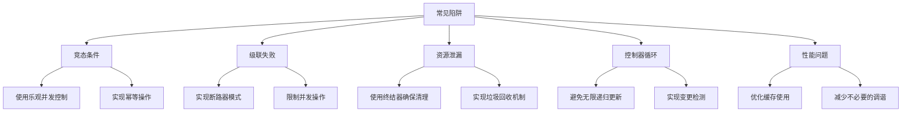

1. **竞态条件**
   - 问题：多个控制器同时修改同一资源
   - 解决方案：
     ```go
     // 使用乐观并发控制
     for retries := 0; retries < maxRetries; retries++ {
         // 获取最新对象
         current, err := client.Get(name, metav1.GetOptions{})
         if err != nil {
             return err
         }
         
         // 修改对象
         updated := current.DeepCopy()
         updated.Spec.Replicas = 3
         
         // 尝试更新
         _, err = client.Update(updated, metav1.UpdateOptions{})
         if err == nil {
             return nil // 成功
         }
         
         // 检查是否是冲突错误
         if !errors.IsConflict(err) {
             return err // 其他错误
         }
         
         // 冲突，重试
         time.Sleep(retryDelay)
     }
     ```

2. **控制器循环**
   - 问题：控制器无限更新资源，导致循环
   - 解决方案：
     ```go
     // 实现变更检测，只在必要时更新
     func needsUpdate(old, new *appsv1.Deployment) bool {
         // 只比较关键字段，避免不必要的更新
         if old.Spec.Replicas != new.Spec.Replicas {
             return true
         }
         if old.Spec.Template.Spec.Containers[0].Image != 
            new.Spec.Template.Spec.Containers[0].Image {
             return true
         }
         return false
     }
     
     // 在调谐中使用
     if needsUpdate(current, desired) {
         _, err = client.Update(desired, metav1.UpdateOptions{})
     }
     ```

3. **资源泄漏**
   - 问题：删除主资源时未清理关联资源
   - 解决方案：使用终结器（Finalizer）
     ```yaml:c:\project\kphub\kubernetes\finalizer-example.yml
     apiVersion: apps/v1
     kind: Deployment
     metadata:
       name: example
       finalizers:
       - kubernetes.io/pv-protection
     ```
     
     ```go
     // 终结器处理逻辑
     func (c *Controller) handleDeletion(obj *unstructured.Unstructured) error {
         // 检查是否有删除时间戳
         if obj.GetDeletionTimestamp() == nil {
             return nil // 不是删除操作
         }
         
         // 检查是否有我们的终结器
         finalizers := obj.GetFinalizers()
         if !containsString(finalizers, myFinalizer) {
             return nil // 我们的终结器不存在
         }
         
         // 执行清理操作
         if err := c.cleanupResources(obj); err != nil {
             return err // 清理失败，保留终结器
         }
         
         // 清理成功，移除终结器
         newFinalizers := removeString(finalizers, myFinalizer)
         obj.SetFinalizers(newFinalizers)
         
         // 更新对象
         _, err := c.client.Update(obj, metav1.UpdateOptions{})
         return err
     }
     ```

4. **级联失败**
   - 问题：一个组件失败导致整个系统崩溃
   - 解决方案：实现断路器和退避策略
     ```go
     // 断路器实现
     type CircuitBreaker struct {
         failures     int
         maxFailures  int
         resetTimeout time.Duration
         lastFailure  time.Time
         open         bool
     }
     
     func (cb *CircuitBreaker) Execute(operation func() error) error {
         // 检查断路器是否打开
         if cb.open {
             // 检查是否可以重置
             if time.Since(cb.lastFailure) > cb.resetTimeout {
                 cb.open = false
                 cb.failures = 0
             } else {
                 return fmt.Errorf("circuit breaker open")
             }
         }
         
         // 执行操作
         err := operation()
         if err != nil {
             cb.failures++
             cb.lastFailure = time.Now()
             
             // 检查是否需要打开断路器
             if cb.failures >= cb.maxFailures {
                 cb.open = true
             }
         } else {
             // 成功，重置失败计数
             cb.failures = 0
         }
         
         return err
     }
     ```

### 7.3 调试与故障排除  

控制器问题的调试技巧：

```text
1. 日志分析
   - 启用详细日志级别
   - 查找错误模式和重试
   - 分析事件序列

2. 事件检查
   - 查看资源相关的事件
   - 分析控制器报告的问题

3. 状态检查
   - 比较资源的spec和status
   - 检查所有权关系

4. 控制器指标
   - 分析调谐失败率
   - 检查队列深度和延迟
   - 监控API请求错误

5. 调试工具
   - kubectl describe
   - kubectl get events
   - kubectl logs
   - 控制器调试端点
```

调试命令示例：

```powershell
# 查看资源状态
kubectl get deployment nginx -o yaml

# 查看相关事件
kubectl get events --field-selector involvedObject.name=nginx

# 查看控制器日志
kubectl logs -n kube-system deployment/deployment-controller -c kube-controller-manager

# 使用调试工具
kubectl debug deployment/nginx --image=busybox --target=nginx

# 检查控制器指标
kubectl port-forward -n kube-system deployment/kube-controller-manager 8080:8080
curl http://localhost:8080/metrics | grep controller_
```

## 8. 未来发展趋势  

声明式API和控制器模式的未来发展方向：

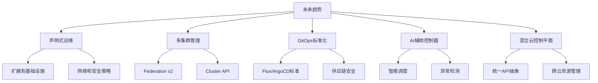

关键发展趋势：

1. **声明式运维扩展**
   - 将声明式模型扩展到更多领域
   - 基础设施即代码与Kubernetes集成
   - 网络、安全和策略的声明式管理

2. **多集群管理标准化**
   - Cluster API成为管理Kubernetes集群的标准
   - 改进的联邦机制用于多集群应用部署
   - 统一的多集群控制平面

3. **GitOps成熟**
   - GitOps工具和实践的标准化
   - 增强的安全和合规性验证
   - 与CI/CD系统的深度集成

4. **AI增强控制器**
   - 智能调度和资源分配
   - 基于机器学习的异常检测
   - 自适应控制策略

5. **混合云控制平面**
   - 统一管理多云和本地资源
   - 抽象云提供商差异
   - 一致的多环境部署体验

## 总结

声明式API和控制器模式是Kubernetes的核心设计理念，它们共同提供了一个强大而灵活的系统，用于自动化容器化应用的管理。通过声明期望状态而非指定具体步骤，Kubernetes使复杂系统的管理变得更加简单和可靠。

控制器模式通过持续调谐实际状态与期望状态，实现了系统的自愈能力和稳定性。这种设计不仅适用于Kubernetes核心组件，也为扩展和自定义提供了清晰的模式。

理解这些概念对于有效使用Kubernetes、排查问题和设计自定义扩展至关重要。随着云原生技术的发展，声明式API和控制器模式的应用范围将继续扩大，成为现代分布式系统设计的基础模式。

在实践中，遵循本文介绍的最佳实践和避免常见陷阱，将帮助您构建更加健壮、可扩展和易于维护的Kubernetes应用和扩展。