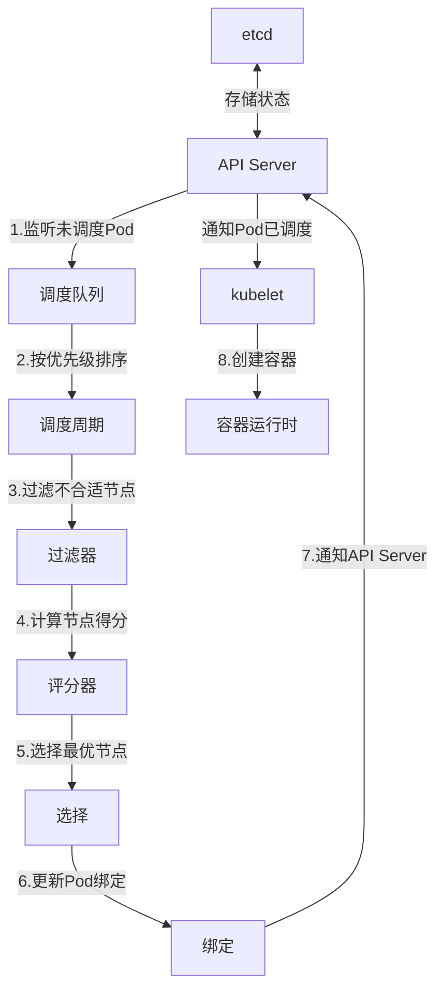
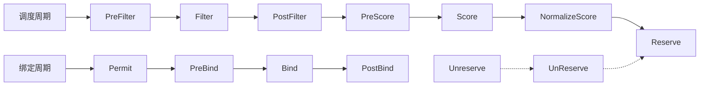
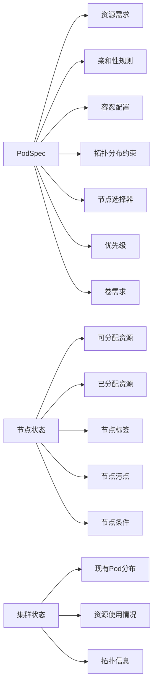
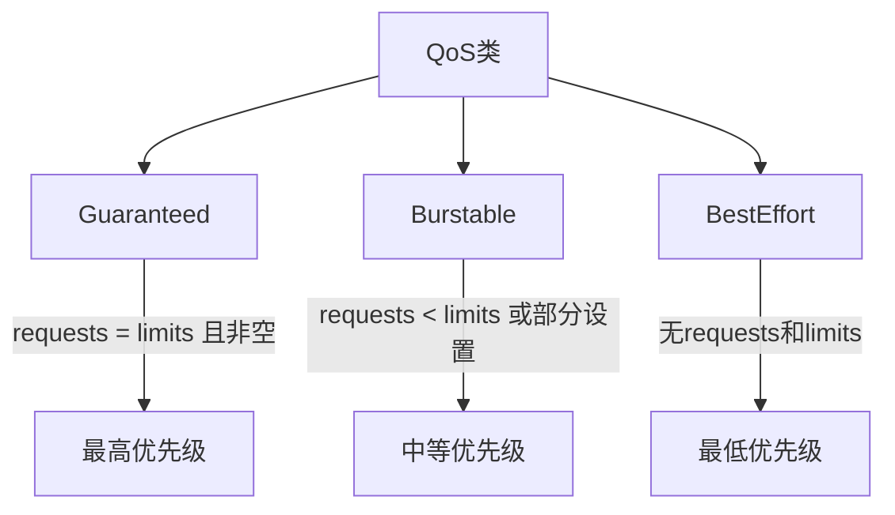
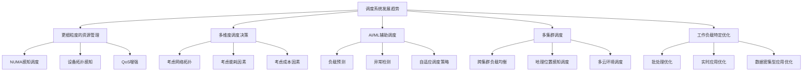

# Kubernetes调度系统原理  

Kubernetes调度系统是整个集群的核心组件之一，负责决定Pod应该运行在哪个节点上。一个高效的调度系统能够最大化集群资源利用率，同时满足应用的各种约束条件。本文将深入探讨Kubernetes调度系统的架构、算法和实践经验。

## 1. 调度器架构  

Kubernetes调度器（kube-scheduler）是一个独立的组件，它监听API Server中未被调度的Pod（PodSpec.nodeName为空），为这些Pod找到合适的节点，并将决策结果通知给API Server。

### 1.1 核心组件交互  

调度器与其他Kubernetes组件的交互流程如下：



调度器内部架构由以下主要组件组成：

1. **调度队列**：管理待调度的Pod，通常按优先级排序
2. **调度周期**：包含过滤和评分两个主要阶段
3. **过滤器**：实现各种预选策略，排除不满足条件的节点
4. **评分器**：对通过过滤的节点进行打分，选择最优节点
5. **绑定**：将Pod与选定节点绑定，更新API Server中的Pod对象

### 1.2 调度流程阶段  

调度过程可以分为三个主要阶段，每个阶段在整个调度过程中占用不同比例的时间：

| 阶段       | 耗时占比 | 关键操作                                   | 可扩展性挑战                |  
|------------|----------|-------------------------------------------|----------------------------|  
| 过滤       | 60%      | 排除不满足条件节点                         | 节点数量增加时性能下降显著   |  
| 评分       | 30%      | 计算节点优先级                             | 评分算法复杂度与节点数相关   |  
| 绑定       | 10%      | 更新etcd绑定记录                           | 通常不是性能瓶颈            |  

```go:c:\project\kphub\kubernetes\pkg\scheduler\scheduler.go
// 简化的调度流程
func (sched *Scheduler) scheduleOne(ctx context.Context) {
    // 1. 从队列获取下一个要调度的Pod
    podInfo := sched.NextPod()
    pod := podInfo.Pod
    
    // 2. 调度周期开始
    start := time.Now()
    
    // 3. 过滤阶段 - 找出所有可行节点
    feasibleNodes, err := sched.findNodesThatFitPod(ctx, pod)
    if err != nil || len(feasibleNodes) == 0 {
        // 处理无可用节点情况
        return
    }
    
    // 4. 评分阶段 - 对可行节点进行打分
    priorityList, err := sched.prioritizeNodes(ctx, pod, feasibleNodes)
    if err != nil {
        // 处理评分错误
        return
    }
    
    // 5. 选择最高分节点
    selectedNode := priorityList[0].Name
    
    // 6. 绑定阶段 - 将Pod绑定到选中节点
    err = sched.bindPod(ctx, pod, selectedNode)
    if err != nil {
        // 处理绑定错误
        return
    }
    
    // 7. 记录调度延迟
    metrics.SchedulingLatency.Observe(time.Since(start))
}
```

### 1.3 调度器配置

Kubernetes调度器支持通过配置文件进行定制，可以启用或禁用特定的调度插件，调整插件权重等：

```yaml:c:\project\kphub\kubernetes\config\scheduler-config.yaml
apiVersion: kubescheduler.config.k8s.io/v1beta1
kind: KubeSchedulerConfiguration
clientConnection:
  kubeconfig: /etc/kubernetes/scheduler.conf
profiles:
- schedulerName: default-scheduler
  plugins:
    filter:
      enabled:
      - name: NodeResourcesFit
      - name: NodeName
      - name: PodTopologySpread
      disabled:
      - name: TaintToleration
    score:
      enabled:
      - name: NodeResourcesBalancedAllocation
        weight: 1
      - name: ImageLocality
        weight: 1
      - name: PodTopologySpread
        weight: 2
  pluginConfig:
  - name: PodTopologySpread
    args:
      defaultConstraints:
      - maxSkew: 1
        topologyKey: kubernetes.io/hostname
        whenUnsatisfiable: ScheduleAnyway
```

## 2. 调度算法详解  

Kubernetes调度算法分为两个主要阶段：预选（Predicates）和优选（Priorities）。

### 2.1 预选策略(Predicates)  

预选策略是硬性条件，用于过滤不满足Pod要求的节点。常见的预选策略包括：

```go:c:\project\kphub\kubernetes\pkg\scheduler\algorithm\predicates.go
// PodFitsResources检查节点是否有足够资源运行Pod
func PodFitsResources(pod *v1.Pod, nodeInfo *schedulernodeinfo.NodeInfo) bool {
    // 获取Pod请求的资源
    podRequest := calculatePodResourceRequest(pod)
    
    // 检查节点剩余资源是否满足Pod需求
    if nodeInfo.Allocatable.MilliCPU < podRequest.MilliCPU {
        return false
    }
    if nodeInfo.Allocatable.Memory < podRequest.Memory {
        return false
    }
    if nodeInfo.Allocatable.EphemeralStorage < podRequest.EphemeralStorage {
        return false
    }
    
    // 检查GPU等扩展资源
    for rName, rQuant := range podRequest.ScalarResources {
        if nodeInfo.Allocatable.ScalarResources[rName] < rQuant {
            return false
        }
    }
    
    return true
}

// PodMatchNodeSelector检查Pod的节点选择器是否匹配节点标签
func PodMatchNodeSelector(pod *v1.Pod, node *v1.Node) bool {
    // 检查nodeSelector
    if pod.Spec.NodeSelector != nil {
        for key, value := range pod.Spec.NodeSelector {
            if node.Labels[key] != value {
                return false
            }
        }
    }
    
    // 检查nodeAffinity
    if pod.Spec.Affinity != nil && pod.Spec.Affinity.NodeAffinity != nil {
        nodeAffinity := pod.Spec.Affinity.NodeAffinity
        if nodeAffinity.RequiredDuringSchedulingIgnoredDuringExecution != nil {
            if !nodeMatchesNodeSelectorTerms(node, 
                nodeAffinity.RequiredDuringSchedulingIgnoredDuringExecution) {
                return false
            }
        }
    }
    
    return true
}
```

主要的预选策略包括：

1. **PodFitsResources**：检查节点是否有足够的CPU、内存和存储资源
2. **PodMatchNodeSelector**：检查Pod的节点选择器和亲和性规则是否匹配节点
3. **PodFitsHost**：检查Pod指定的主机名是否匹配节点
4. **PodToleratesNodeTaints**：检查Pod是否能容忍节点上的污点
5. **CheckNodeUnschedulable**：检查节点是否被标记为不可调度
6. **PodFitsHostPorts**：检查Pod请求的端口在节点上是否可用
7. **CheckVolumeBinding**：检查节点是否满足Pod的卷绑定要求
8. **NoVolumeZoneConflict**：检查节点区域是否与Pod的卷区域冲突
9. **CheckNodeDiskPressure**：检查节点是否有磁盘压力
10. **CheckNodeMemoryPressure**：检查节点是否有内存压力

### 2.2 优选策略(Priorities)  

优选策略用于对通过预选的节点进行打分，选择最优节点。每个优选策略会返回一个0-10的分数，最终分数是各策略分数的加权和。

```go:c:\project\kphub\kubernetes\pkg\scheduler\algorithm\priorities.go
// LeastRequestedPriority优先选择资源使用率低的节点
func LeastRequestedPriority(pod *v1.Pod, nodes []*v1.Node, nodeInfo map[string]*schedulernodeinfo.NodeInfo) ([]schedulerapi.HostPriority, error) {
    result := make([]schedulerapi.HostPriority, 0, len(nodes))
    
    for _, node := range nodes {
        // 获取节点信息
        info := nodeInfo[node.Name]
        
        // 计算CPU和内存使用率
        cpuFraction := fractionOfCapacity(pod.Spec.Containers, info, v1.ResourceCPU)
        memoryFraction := fractionOfCapacity(pod.Spec.Containers, info, v1.ResourceMemory)
        
        // 计算分数 (10 - 平均使用率*10)
        score := int(((1 - cpuFraction) + (1 - memoryFraction)) * 5)
        
        // 确保分数在0-10范围内
        if score < 0 {
            score = 0
        } else if score > 10 {
            score = 10
        }
        
        result = append(result, schedulerapi.HostPriority{
            Host:  node.Name,
            Score: score,
        })
    }
    
    return result, nil
}

// BalancedResourceAllocation优先选择资源使用均衡的节点
func BalancedResourceAllocation(pod *v1.Pod, nodes []*v1.Node, nodeInfo map[string]*schedulernodeinfo.NodeInfo) ([]schedulerapi.HostPriority, error) {
    result := make([]schedulerapi.HostPriority, 0, len(nodes))
    
    for _, node := range nodes {
        // 获取节点信息
        info := nodeInfo[node.Name]
        
        // 计算CPU和内存使用率
        cpuFraction := fractionOfCapacity(pod.Spec.Containers, info, v1.ResourceCPU)
        memoryFraction := fractionOfCapacity(pod.Spec.Containers, info, v1.ResourceMemory)
        
        // 计算使用率差异
        difference := math.Abs(cpuFraction - memoryFraction)
        
        // 计算分数 (10 - 差异*10)
        score := int((1 - difference) * 10)
        
        // 确保分数在0-10范围内
        if score < 0 {
            score = 0
        } else if score > 10 {
            score = 10
        }
        
        result = append(result, schedulerapi.HostPriority{
            Host:  node.Name,
            Score: score,
        })
    }
    
    return result, nil
}
```

主要的优选策略包括：

1. **LeastRequestedPriority**：优先选择资源使用率低的节点，提高资源利用率
2. **BalancedResourceAllocation**：优先选择CPU和内存使用率均衡的节点
3. **NodeAffinityPriority**：根据节点亲和性规则的匹配程度评分
4. **InterPodAffinityPriority**：根据Pod间亲和性和反亲和性规则评分
5. **MostRequestedPriority**：优先选择资源使用率高的节点，适合批处理工作负载
6. **ImageLocalityPriority**：优先选择已有Pod所需镜像的节点，减少镜像拉取时间
7. **NodePreferAvoidPodsPriority**：根据节点注解`scheduler.alpha.kubernetes.io/preferAvoidPods`评分
8. **TaintTolerationPriority**：优先选择Pod容忍其所有污点的节点
9. **PodTopologySpreadPriority**：优先选择能够均匀分布Pod的节点

### 2.3 调度器插件机制

从Kubernetes 1.15开始，调度器引入了插件机制，使用调度框架（Scheduling Framework）替代传统的预选/优选策略。插件可以在调度的多个阶段注册回调函数：



每个插件可以实现一个或多个扩展点接口，例如：

```go:c:\project\kphub\kubernetes\pkg\scheduler\framework\plugins\noderesources\fit.go
// NodeResourcesFit实现Filter扩展点
type NodeResourcesFit struct {
    // ...
}

// Name返回插件名称
func (pl *NodeResourcesFit) Name() string {
    return Name
}

// Filter检查Pod是否适合节点
func (pl *NodeResourcesFit) Filter(ctx context.Context, state *framework.CycleState, pod *v1.Pod, nodeInfo *framework.NodeInfo) *framework.Status {
    // 检查节点资源是否满足Pod需求
    if !podFitsResources(pod, nodeInfo) {
        return framework.NewStatus(framework.Unschedulable, "Insufficient resources")
    }
    return nil
}

// Score对节点进行评分
func (pl *NodeResourcesFit) Score(ctx context.Context, state *framework.CycleState, pod *v1.Pod, nodeName string) (int64, *framework.Status) {
    // 计算节点得分
    // ...
    return score, nil
}
```

## 3. 资源分配机制  

Kubernetes的资源分配是调度系统的核心功能，它确保Pod能够获得所需的计算资源，同时避免资源过度分配。

### 3.1 资源请求与限制  

Pod可以为每个容器指定资源请求（requests）和限制（limits）：

```yaml:c:\project\kphub\kubernetes\pods\resource-demo.yaml
apiVersion: v1
kind: Pod
metadata:
  name: resource-demo
spec:
  containers:
  - name: nginx
    image: nginx:1.19
    resources:
      requests:
        cpu: "500m"      # 0.5 CPU核心
        memory: "512Mi"  # 512 MiB内存
      limits:
        cpu: "1"         # 1 CPU核心
        memory: "1Gi"    # 1 GiB内存
    ports:
    - containerPort: 80
  - name: redis
    image: redis:6.0
    resources:
      requests:
        cpu: "200m"
        memory: "256Mi"
      limits:
        cpu: "400m"
        memory: "512Mi"
```

资源请求和限制的区别：

1. **资源请求（requests）**：
   - 调度器保证Pod只会被调度到有足够资源的节点上
   - 节点上所有Pod的资源请求总和不能超过节点容量
   - 容器可以使用超过请求的资源，但不能超过限制

2. **资源限制（limits）**：
   - 容器使用的资源不能超过限制
   - 如果容器尝试使用超过CPU限制的资源，它会被节流
   - 如果容器尝试使用超过内存限制的资源，它可能会被终止（OOM）

资源类型：

1. **CPU**：以核心为单位，可以是小数（如0.5或500m，表示半个核心）
2. **内存**：以字节为单位，可以使用Ki、Mi、Gi等后缀
3. **临时存储**：容器可写层和emptyDir卷的存储空间
4. **扩展资源**：如GPU、FPGA等自定义资源

### 3.2 调度上下文  

调度器在为Pod选择节点时，会考虑多种因素，这些因素共同构成了调度上下文：



调度上下文中的关键信息：

1. **Pod信息**：
   - 资源请求和限制
   - 节点选择器和亲和性规则
   - 污点容忍
   - 拓扑分布约束
   - 优先级和抢占设置

2. **节点信息**：
   - 可分配资源（CPU、内存、存储等）
   - 已分配资源
   - 节点标签和污点
   - 节点条件（Ready、DiskPressure等）

3. **集群信息**：
   - 现有Pod的分布情况
   - 整体资源使用情况
   - 集群拓扑（区域、可用区等）

### 3.3 资源超额分配与服务质量

Kubernetes支持资源超额分配（overcommitment），即节点上所有容器的资源限制总和可以超过节点容量。为了处理资源竞争，Kubernetes使用服务质量（QoS）类来确定Pod的优先级：



QoS类的确定规则：

1. **Guaranteed**：
   - 所有容器都设置了相等的资源请求和限制
   - 所有容器都指定了CPU和内存资源

2. **Burstable**：
   - 至少一个容器设置了资源请求
   - 不满足Guaranteed条件

3. **BestEffort**：
   - 没有任何容器设置资源请求或限制

当节点资源不足时，Kubernetes会按照BestEffort、Burstable、Guaranteed的顺序终止Pod，保证高优先级Pod的稳定运行。

## 4. 高级调度功能  

Kubernetes提供了多种高级调度功能，用于满足复杂的部署需求。

### 4.1 节点亲和性  

节点亲和性（Node Affinity）允许Pod指定它们希望运行在哪些节点上，基于节点标签进行匹配：

```yaml:c:\project\kphub\kubernetes\pods\node-affinity.yaml
apiVersion: v1
kind: Pod
metadata:
  name: gpu-pod
spec:
  affinity:
    nodeAffinity:
      requiredDuringSchedulingIgnoredDuringExecution:
        nodeSelectorTerms:
        - matchExpressions:
          - key: gpu-type
            operator: In
            values: ["a100", "v100"]
      preferredDuringSchedulingIgnoredDuringExecution:
      - weight: 10
        preference:
          matchExpressions:
          - key: gpu-type
            operator: In
            values: ["a100"]
      - weight: 5
        preference:
          matchExpressions:
          - key: zone
            operator: In
            values: ["east"]
  containers:
  - name: gpu-container
    image: nvidia/cuda:11.0-base
```

节点亲和性类型：

1. **requiredDuringSchedulingIgnoredDuringExecution**：
   - 硬性要求，Pod必须调度到满足条件的节点上
   - 如果没有节点满足条件，Pod将保持Pending状态

2. **preferredDuringSchedulingIgnoredDuringExecution**：
   - 软性偏好，调度器会尝试将Pod调度到满足条件的节点上
   - 如果没有节点满足条件，Pod仍会被调度到其他节点上
   - 可以设置权重（weight）来指定偏好的强度

操作符类型：
- `In`：标签值必须匹配列表中的一个值
- `NotIn`：标签值不能匹配列表中的任何值
- `Exists`：节点必须包含指定的标签（不检查值）
- `DoesNotExist`：节点不能包含指定的标签
- `Gt`/`Lt`：标签值必须大于/小于指定值

### 4.2 Pod亲和/反亲和  

Pod亲和性（Pod Affinity）和反亲和性（Pod Anti-Affinity）允许基于已经运行的Pod的标签来约束Pod的调度：

```yaml:c:\project\kphub\kubernetes\pods\pod-affinity.yaml
apiVersion: v1
kind: Pod
metadata:
  name: web-pod
  labels:
    app: web
spec:
  affinity:
    podAffinity:
      requiredDuringSchedulingIgnoredDuringExecution:
      - labelSelector:
          matchExpressions:
          - key: app
            operator: In
            values: ["cache"]
        topologyKey: "kubernetes.io/hostname"
    podAntiAffinity:
      preferredDuringSchedulingIgnoredDuringExecution:
      - weight: 100
        podAffinityTerm:
          labelSelector:
            matchExpressions:
            - key: app
              operator: In
              values: ["web"]
          topologyKey: "kubernetes.io/hostname"
  containers:
  - name: web-app
    image: nginx:1.19
```

Pod亲和性和反亲和性的关键概念：

1. **podAffinity**：
   - 吸引力规则，Pod希望与满足条件的其他Pod共存
   - 例如：Web服务器希望与缓存服务器在同一节点上

2. **podAntiAffinity**：
   - 排斥力规则，Pod希望避开满足条件的其他Pod
   - 例如：为了高可用性，相同应用的Pod应分布在不同节点上

3. **topologyKey**：
   - 定义亲和性/反亲和性的拓扑范围
   - 常用值：
     - `kubernetes.io/hostname`：节点级别
     - `topology.kubernetes.io/zone`：可用区级别
     - `topology.kubernetes.io/region`：区域级别

Pod亲和性和反亲和性的应用场景：

1. **高可用性部署**：
   - 使用Pod反亲和性将相同应用的Pod分布在不同节点上
   - 确保单个节点故障不会影响整个应用

2. **性能优化**：
   - 使用Pod亲和性将有通信需求的Pod放在同一节点上
   - 减少网络延迟，提高应用性能

3. **共享资源**：
   - 将需要共享本地存储或特殊硬件的Pod放在同一节点上

### 4.3 污点和容忍  

污点（Taints）和容忍（Tolerations）提供了一种机制，允许节点排斥特定的Pod，除非Pod明确表示可以容忍这些污点：

```yaml:c:\project\kphub\kubernetes\nodes\taint-example.yaml
# 为节点添加污点
apiVersion: v1
kind: Node
metadata:
  name: node1
spec:
  taints:
  - key: dedicated
    value: gpu
    effect: NoSchedule
  - key: memory-pressure
    value: "true"
    effect: PreferNoSchedule
```

```yaml:c:\project\kphub\kubernetes\pods\toleration-example.yaml
# Pod容忍节点污点
apiVersion: v1
kind: Pod
metadata:
  name: gpu-pod
spec:
  tolerations:
  - key: dedicated
    operator: Equal
    value: gpu
    effect: NoSchedule
  - key: memory-pressure
    operator: Exists
    effect: PreferNoSchedule
  containers:
  - name: gpu-container
    image: nvidia/cuda:11.0-base
```

污点效果（Effect）类型：

1. **NoSchedule**：
   - 不允许调度不容忍该污点的Pod
   - 已经运行的Pod不受影响

2. **PreferNoSchedule**：
   - 尽量避免调度不容忍该污点的Pod
   - 如果没有其他选择，仍可能调度到该节点

3. **NoExecute**：
   - 不允许调度不容忍该污点的Pod
   - 已经运行的不容忍该污点的Pod会被驱逐

容忍操作符：
- `Equal`：要求污点的key和value都匹配
- `Exists`：只要求污点的key匹配，不检查value

污点和容忍的应用场景：

1. **专用节点**：
   - 为特定工作负载保留节点（如GPU节点）
   - 防止其他Pod使用这些特殊资源

2. **节点维护**：
   - 在节点维护前添加污点，防止新Pod调度
   - 使用`NoExecute`效果驱逐现有Pod

3. **故障节点**：
   - 自动为有问题的节点添加污点
   - 例如，节点控制器会为不可达的节点添加`node.kubernetes.io/unreachable`污点

### 4.4 拓扑分布约束  

拓扑分布约束（Topology Spread Constraints）允许控制Pod在集群拓扑域（如区域、可用区、节点）中的分布：

```yaml:c:\project\kphub\kubernetes\pods\topology-spread.yaml
apiVersion: v1
kind: Pod
metadata:
  name: web-server
  labels:
    app: web
spec:
  topologySpreadConstraints:
  - maxSkew: 1
    topologyKey: kubernetes.io/hostname
    whenUnsatisfiable: DoNotSchedule
    labelSelector:
      matchLabels:
        app: web
  - maxSkew: 2
    topologyKey: topology.kubernetes.io/zone
    whenUnsatisfiable: ScheduleAnyway
    labelSelector:
      matchLabels:
        app: web
  containers:
  - name: nginx
    image: nginx:1.19
```

拓扑分布约束的关键参数：

1. **maxSkew**：
   - 允许的最大不平衡度
   - 例如，maxSkew=1表示任意两个拓扑域之间的Pod数量差异不能超过1

2. **topologyKey**：
   - 定义拓扑域的节点标签
   - 常用值：
     - `kubernetes.io/hostname`：节点级别
     - `topology.kubernetes.io/zone`：可用区级别
     - `topology.kubernetes.io/region`：区域级别

3. **whenUnsatisfiable**：
   - 当无法满足约束时的行为
   - `DoNotSchedule`：不调度Pod（硬性要求）
   - `ScheduleAnyway`：仍然调度Pod，但尽量满足约束（软性要求）
继续完成Kubernetes调度系统原理文档：

## 5. 调度器扩展  

Kubernetes提供了多种方式来扩展和定制调度行为，以满足特定的业务需求。

### 5.1 调度框架扩展点  

调度框架（Scheduling Framework）是Kubernetes 1.15引入的新架构，它定义了一系列扩展点，允许开发者通过插件机制定制调度行为：

```text
调度周期扩展点：
- PreFilter: 预处理Pod信息，可以拒绝Pod或预先计算调度状态
- Filter: 过滤不满足条件的节点（相当于传统的Predicates）
- PostFilter: 当没有节点通过过滤时执行，可以尝试抢占或提供诊断信息
- PreScore: 在评分前执行，可以计算共享状态
- Score: 为通过过滤的节点评分（相当于传统的Priorities）
- NormalizeScore: 标准化各个Score插件的分数
- Reserve: 在绑定前预留节点资源

绑定周期扩展点：
- Permit: 允许或拒绝调度决策，可以等待外部条件
- PreBind: 在绑定前执行，可以准备绑定所需的资源
- Bind: 将Pod绑定到节点
- PostBind: 绑定成功后执行清理操作

其他扩展点：
- UnReserve: 当Reserve后的Pod无法成功调度时执行
```

每个扩展点都有特定的接口，插件可以实现一个或多个扩展点：

```go:c:\project\kphub\kubernetes\pkg\scheduler\framework\interface.go
// Plugin是调度框架插件的基本接口
type Plugin interface {
    Name() string
}

// PreFilterPlugin是PreFilter扩展点的接口
type PreFilterPlugin interface {
    Plugin
    PreFilter(ctx context.Context, state *CycleState, p *v1.Pod) *Status
}

// FilterPlugin是Filter扩展点的接口
type FilterPlugin interface {
    Plugin
    Filter(ctx context.Context, state *CycleState, pod *v1.Pod, nodeInfo *NodeInfo) *Status
}

// ScorePlugin是Score扩展点的接口
type ScorePlugin interface {
    Plugin
    Score(ctx context.Context, state *CycleState, p *v1.Pod, nodeName string) (int64, *Status)
}

// BindPlugin是Bind扩展点的接口
type BindPlugin interface {
    Plugin
    Bind(ctx context.Context, state *CycleState, p *v1.Pod, nodeName string) *Status
}
```

### 5.2 自定义调度器  

除了扩展默认调度器，Kubernetes还允许部署多个调度器实例，每个Pod可以指定使用哪个调度器：

```yaml:c:\project\kphub\kubernetes\pods\custom-scheduler.yaml
apiVersion: v1
kind: Pod
metadata:
  name: custom-scheduled-pod
spec:
  schedulerName: my-custom-scheduler  # 指定使用自定义调度器
  containers:
  - name: container
    image: nginx:1.19
```

自定义调度器的实现示例：

```go:c:\project\kphub\kubernetes\custom-scheduler\main.go
package main

import (
    "context"
    "flag"
    "fmt"
    "os"
    
    "k8s.io/component-base/logs"
    "k8s.io/kubernetes/cmd/kube-scheduler/app"
    
    // 导入自定义插件
    "example.com/scheduler-plugins/pkg/myplugin"
)

func main() {
    // 初始化命令行参数
    cmd := app.NewSchedulerCommand(
        app.WithPlugin(myplugin.Name, myplugin.New),
    )
    
    // 设置调度器名称
    args := os.Args
    for i := range args {
        if args[i] == "--scheduler-name" && i < len(args)-1 {
            continue
        }
    }
    args = append(args, "--scheduler-name=my-custom-scheduler")
    
    // 运行调度器
    if err := cmd.Execute(); err != nil {
        fmt.Fprintf(os.Stderr, "%v\n", err)
        os.Exit(1)
    }
}
```

自定义插件示例：

```go:c:\project\kphub\kubernetes\custom-scheduler\pkg\myplugin\myplugin.go
package myplugin

import (
    "context"
    
    v1 "k8s.io/api/core/v1"
    "k8s.io/apimachinery/pkg/runtime"
    "k8s.io/kubernetes/pkg/scheduler/framework"
)

// Name是插件的名称
const Name = "MyPlugin"

// MyPlugin实现了Filter和Score扩展点
type MyPlugin struct {
    handle framework.Handle
}

// New创建一个新的MyPlugin实例
func New(obj runtime.Object, handle framework.Handle) (framework.Plugin, error) {
    return &MyPlugin{handle: handle}, nil
}

// Name返回插件名称
func (mp *MyPlugin) Name() string {
    return Name
}

// Filter实现Filter扩展点
func (mp *MyPlugin) Filter(ctx context.Context, state *framework.CycleState, pod *v1.Pod, nodeInfo *framework.NodeInfo) *framework.Status {
    // 自定义过滤逻辑
    node := nodeInfo.Node()
    
    // 示例：只选择有特定标签的节点
    if value, ok := node.Labels["custom-scheduler/enabled"]; !ok || value != "true" {
        return framework.NewStatus(framework.Unschedulable, "node does not have required label")
    }
    
    return nil
}

// Score实现Score扩展点
func (mp *MyPlugin) Score(ctx context.Context, state *framework.CycleState, pod *v1.Pod, nodeName string) (int64, *framework.Status) {
    // 获取节点信息
    nodeInfo, err := mp.handle.SnapshotSharedLister().NodeInfos().Get(nodeName)
    if err != nil {
        return 0, framework.NewStatus(framework.Error, fmt.Sprintf("getting node %q from Snapshot: %v", nodeName, err))
    }
    
    // 自定义评分逻辑
    node := nodeInfo.Node()
    
    // 示例：根据自定义标签评分
    if value, ok := node.Labels["custom-scheduler/score"]; ok {
        score, err := strconv.ParseInt(value, 10, 64)
        if err == nil && score >= 0 && score <= 100 {
            return score, nil
        }
    }
    
    // 默认分数
    return 50, nil
}

// ScoreExtensions返回Score扩展
func (mp *MyPlugin) ScoreExtensions() framework.ScoreExtensions {
    return nil
}
```

### 5.3 调度器策略配置

在使用调度框架之前，Kubernetes支持通过策略配置文件定制调度器行为：

```json:c:\project\kphub\kubernetes\config\scheduler-policy.json
{
  "kind": "Policy",
  "apiVersion": "v1",
  "predicates": [
    {
      "name": "PodFitsResources"
    },
    {
      "name": "PodFitsHostPorts"
    },
    {
      "name": "PodMatchNodeSelector"
    },
    {
      "name": "NoVolumeZoneConflict"
    },
    {
      "name": "PodToleratesNodeTaints"
    },
    {
      "name": "CheckNodeUnschedulable"
    }
  ],
  "priorities": [
    {
      "name": "LeastRequestedPriority",
      "weight": 1
    },
    {
      "name": "BalancedResourceAllocation",
      "weight": 1
    },
    {
      "name": "NodeAffinityPriority",
      "weight": 2
    },
    {
      "name": "ImageLocalityPriority",
      "weight": 1
    }
  ],
  "extenders": [
    {
      "urlPrefix": "http://scheduler-extender:8888",
      "filterVerb": "filter",
      "prioritizeVerb": "prioritize",
      "weight": 5,
      "enableHttps": false,
      "nodeCacheCapable": false
    }
  ]
}
```

虽然这种配置方式在新版本中已被调度框架取代，但在某些场景下仍然有用，特别是当需要使用调度器扩展器（Scheduler Extender）时。

## 6. 生产实践  

在生产环境中使用Kubernetes调度系统需要考虑性能、可靠性和可维护性等多个方面。

### 6.1 调度性能优化  

随着集群规模的增长，调度性能可能成为瓶颈。以下是一些优化调度性能的方法：

```text
1. 增加并行调度线程数:
   --kube-scheduler参数: --parallelism=16
   
   这个参数控制调度器同时处理多少个Pod，默认值是16。
   对于大型集群，可以适当增加这个值，但要注意不要设置过高，
   以免对API Server造成过大压力。

2. 设置API Server请求限制:
   --kube-scheduler参数: --kube-api-qps=100 --kube-api-burst=150
   
   这些参数控制调度器对API Server的请求速率。
   QPS是每秒查询数，burst是允许的短时突发请求数。
   默认值分别是50和100，对于大型集群可能需要增加。

3. 禁用不必要的调度插件:
   在KubeSchedulerConfiguration中配置disabled插件列表。
   
   如果某些调度插件对你的环境不重要，可以禁用它们以提高性能。
   例如，如果不使用卷拓扑约束，可以禁用VolumeBinding插件。

4. 优化节点标签:
   减少不必要的节点标签，特别是频繁变化的标签。
   
   调度器需要处理所有节点标签，过多的标签会增加内存使用和处理时间。

5. 使用节点污点减少不必要的调度尝试:
   为特殊用途的节点添加污点，减少调度器需要评估的节点数量。
   
   例如，为控制平面节点添加NoSchedule污点，避免调度器考虑这些节点。

6. 使用多个调度器:
   为不同类型的工作负载使用不同的调度器。
   
   可以部署多个调度器实例，每个实例负责特定类型的Pod，
   减少单个调度器的负担。
```

调度器性能监控指标：

```text
# 调度延迟
scheduler_scheduling_algorithm_duration_seconds
scheduler_binding_duration_seconds
scheduler_e2e_scheduling_duration_seconds

# 调度队列
scheduler_pending_pods
scheduler_queue_incoming_pods_total
scheduler_schedule_attempts_total

# 调度结果
scheduler_pod_scheduling_duration_seconds
scheduler_schedule_attempts_total{result="scheduled"}
scheduler_schedule_attempts_total{result="unschedulable"}
```

### 6.2 问题排查指南  

当Pod无法被调度时，可以使用以下方法进行排查：

```powershell
# 查看Pod状态
kubectl get pod <pod-name> -o wide

# 查看Pod详细信息
kubectl describe pod <pod-name>

# 查看调度事件
kubectl get events --field-selector involvedObject.kind=Pod,involvedObject.name=<pod-name>

# 查看所有调度相关事件
kubectl get events --field-selector reason=FailedScheduling,reason=Scheduled

# 查看节点资源使用情况
kubectl describe node <node-name>

# 查看调度器日志
kubectl logs -n kube-system <scheduler-pod-name>

# 模拟调度过程
kubectl create --dry-run=server -f pod.yaml
```

常见的调度问题及解决方法：

1. **资源不足**：
   - 症状：Pod处于Pending状态，事件显示"Insufficient cpu/memory/gpu"
   - 解决方法：
     - 减少Pod的资源请求
     - 添加更多节点到集群
     - 终止不必要的Pod释放资源

2. **节点选择器/亲和性不匹配**：
   - 症状：Pod处于Pending状态，事件显示"0/10 nodes are available: 10 node(s) didn't match node selector"
   - 解决方法：
     - 检查节点标签是否正确
     - 调整Pod的节点选择器或亲和性规则
     - 为节点添加所需标签

3. **污点阻止调度**：
   - 症状：Pod处于Pending状态，事件显示"0/10 nodes are available: 10 node(s) have taints that the pod doesn't tolerate"
   - 解决方法：
     - 为Pod添加适当的容忍
     - 移除节点上的污点
     - 添加未设置污点的节点

4. **卷绑定问题**：
   - 症状：Pod处于Pending状态，事件显示"waiting for a volume to be created, either by external provisioner or manually created by system administrator"
   - 解决方法：
     - 检查PVC状态和存储类配置
     - 确保存储提供者正常工作
     - 手动创建所需的PV

5. **端口冲突**：
   - 症状：Pod处于Pending状态，事件显示"0/10 nodes are available: 10 node(s) didn't have free ports for the requested pod ports"
   - 解决方法：
     - 更改Pod使用的端口
     - 终止使用冲突端口的Pod
     - 添加更多节点

### 6.3 高可用性部署策略

在生产环境中，应用的高可用性至关重要。以下是一些使用Kubernetes调度功能实现高可用性的策略：

```yaml:c:\project\kphub\kubernetes\deployments\high-availability.yaml
apiVersion: apps/v1
kind: Deployment
metadata:
  name: high-availability-app
spec:
  replicas: 3
  selector:
    matchLabels:
      app: ha-app
  template:
    metadata:
      labels:
        app: ha-app
    spec:
      affinity:
        podAntiAffinity:
          requiredDuringSchedulingIgnoredDuringExecution:
          - labelSelector:
              matchExpressions:
              - key: app
                operator: In
                values:
                - ha-app
            topologyKey: "kubernetes.io/hostname"
        nodeAffinity:
          requiredDuringSchedulingIgnoredDuringExecution:
            nodeSelectorTerms:
            - matchExpressions:
              - key: topology.kubernetes.io/zone
                operator: In
                values:
                - zone-a
                - zone-b
                - zone-c
      topologySpreadConstraints:
      - maxSkew: 1
        topologyKey: topology.kubernetes.io/zone
        whenUnsatisfiable: DoNotSchedule
        labelSelector:
          matchLabels:
            app: ha-app
      containers:
      - name: app
        image: myapp:1.0
        resources:
          requests:
            cpu: "100m"
            memory: "256Mi"
          limits:
            cpu: "200m"
            memory: "512Mi"
```

高可用性部署的关键策略：

1. **跨节点分布**：
   - 使用Pod反亲和性确保Pod分布在不同节点上
   - 防止单个节点故障影响整个应用

2. **跨可用区分布**：
   - 使用拓扑分布约束确保Pod均匀分布在不同可用区
   - 防止单个可用区故障影响应用可用性

3. **资源预留**：
   - 为系统组件预留足够资源
   - 防止节点过度分配导致系统不稳定

4. **Pod干扰预算**：
   - 使用PodDisruptionBudget限制同时中断的Pod数量
   - 确保维护操作不会影响应用可用性

```yaml:c:\project\kphub\kubernetes\pdb\pod-disruption-budget.yaml
apiVersion: policy/v1
kind: PodDisruptionBudget
metadata:
  name: ha-app-pdb
spec:
  minAvailable: 2  # 或者使用maxUnavailable: 1
  selector:
    matchLabels:
      app: ha-app
```

5. **多副本部署**：
   - 为应用部署足够数量的副本
   - 考虑应用特性和负载需求确定副本数

6. **优雅终止**：
   - 配置合适的terminationGracePeriodSeconds
   - 确保应用有足够时间完成正在处理的请求

## 7. 调度策略演进  

Kubernetes调度系统在不断演进，引入新功能并改进现有功能。

### 7.1 调度器版本对比  

Kubernetes调度器的主要版本演进：

| 版本       | 核心改进                                | 新增功能                                |  
|------------|----------------------------------------|----------------------------------------|  
| v1.0-v1.2  | 基础调度功能                           | 资源调度、节点选择器                    |  
| v1.3-v1.5  | 节点亲和性                             | 污点和容忍                              |  
| v1.6-v1.9  | Pod亲和性和反亲和性                    | 优先级和抢占                            |  
| v1.10-v1.14| 改进的资源管理                         | 资源配额、扩展资源                      |  
| v1.15      | 引入调度框架                           | 插件化架构                              |  
| v1.16-v1.17| 调度框架改进                           | 更多扩展点                              |  
| v1.18      | 支持调度器配置热更新                   | 多配置文件                              |  
| v1.19-v1.21| 拓扑分布约束                           | 默认拓扑分布                            |  
| v1.22      | 默认启用SchedulingGates功能            | 二阶段调度                              |  
| v1.23-v1.24| 动态资源分配                           | 资源申请和分配分离                      |  
| v1.25+     | 节点资源拓扑感知                       | 考虑NUMA拓扑的调度                      |  

### 7.2 未来发展趋势

Kubernetes调度系统的未来发展趋势：



1. **更细粒度的资源管理**：
   - NUMA感知调度：考虑CPU和内存的物理拓扑
   - 设备拓扑感知：优化GPU、FPGA等加速器的使用
   - 增强的QoS机制：更精细的资源隔离和保证

2. **多维度调度决策**：
   - 网络拓扑感知：考虑Pod之间的网络需求
   - 能耗优化：减少数据中心能源消耗
   - 成本感知调度：考虑不同节点的运行成本

3. **AI/ML辅助调度**：
   - 基于历史数据预测工作负载
   - 自动检测异常调度模式
   - 自适应调整调度策略

4. **多集群调度**：
   - 跨集群负载均衡
   - 考虑地理位置的全球调度
   - 多云环境的统一调度

5. **工作负载特定优化**：
   - 批处理作业的高吞吐量调度
   - 实时应用的低延迟调度
   - 数据密集型应用的数据局部性优化

## 8. 实战案例分析

### 8.1 大规模集群调度优化

在拥有数千个节点的大规模集群中，调度性能是一个关键挑战。以下是一个实际案例的优化过程：

```text
案例背景：
- 5000+节点的生产集群
- 每天调度50000+个Pod
- 调度延迟高，部分Pod等待时间超过5分钟

问题分析：
1. 调度器CPU使用率高，接近限制
2. 调度队列积压
3. 过滤阶段耗时过长

优化措施：
1. 增加调度器资源限制
   - CPU从2核增加到8核
   - 内存从2GB增加到8GB

2. 调整并行度
   - 将parallelism从16增加到32
   - 增加kube-api-qps从50到200

3. 节点分组
   - 使用节点标签将节点分为不同用途组
   - 使用nodeSelector预先过滤节点

4. 优化调度插件
   - 禁用不必要的过滤插件
   - 调整评分插件权重

5. 部署多个调度器
   - 为不同类型工作负载部署专用调度器
   - 减轻默认调度器负担

优化结果：
- 平均调度延迟从30秒降至3秒
- 99%分位调度延迟从5分钟降至15秒
- 调度器CPU使用率降至50%以下
- 队列积压现象基本消除
```

### 8.2 混合工作负载调度策略

在同时运行在线服务和批处理作业的混合工作负载环境中，需要平衡资源利用率和服务质量：

```yaml:c:\project\kphub\kubernetes\deployments\mixed-workload.yaml
# 在线服务 - 高优先级，资源保证
apiVersion: apps/v1
kind: Deployment
metadata:
  name: online-service
spec:
  replicas: 10
  selector:
    matchLabels:
      app: online-service
  template:
    metadata:
      labels:
        app: online-service
    spec:
      priorityClassName: high-priority
      affinity:
        nodeAffinity:
          requiredDuringSchedulingIgnoredDuringExecution:
            nodeSelectorTerms:
            - matchExpressions:
              - key: node-type
                operator: In
                values:
                - "online"
      containers:
      - name: service
        image: my-service:1.0
        resources:
          requests:
            cpu: "1"
            memory: "2Gi"
          limits:
            cpu: "1"
            memory: "2Gi"
---
# 批处理作业 - 低优先级，可抢占
apiVersion: batch/v1
kind: Job
metadata:
  name: batch-job
spec:
  parallelism: 50
  completions: 100
  template:
    metadata:
      labels:
        job: batch-job
    spec:
      priorityClassName: low-priority
      affinity:
        nodeAffinity:
          preferredDuringSchedulingIgnoredDuringExecution:
          - weight: 1
            preference:
              matchExpressions:
              - key: node-type
                operator: In
                values:
                - "batch"
      containers:
      - name: job
        image: my-job:1.0
        resources:
          requests:
            cpu: "500m"
            memory: "1Gi"
          limits:
            cpu: "2"
            memory: "4Gi"
      restartPolicy: Never
```

混合工作负载调度策略：

1. **优先级和抢占**：
   - 为在线服务设置高优先级
   - 为批处理作业设置低优先级
   - 允许在资源紧张时抢占低优先级作业

```yaml:c:\project\kphub\kubernetes\priority\priority-classes.yaml
apiVersion: scheduling.k8s.io/v1
kind: PriorityClass
metadata:
  name: high-priority
value: 1000000
globalDefault: false
description: "用于关键在线服务的高优先级"
---
apiVersion: scheduling.k8s.io/v1
kind: PriorityClass
metadata:
  name: low-priority
value: 10000
globalDefault: false
description: "用于批处理作业的低优先级"
```

2. **节点分组**：
   - 将节点分为在线服务节点和批处理节点
   - 在线服务优先使用在线服务节点
   - 批处理作业优先使用批处理节点，但可以使用任何可用节点

3. **资源配置**：
   - 在线服务使用相等的requests和limits，确保资源保证
   - 批处理作业使用较低的requests和较高的limits，允许资源超额分配

4. **弹性伸缩**：
   - 使用HPA自动扩展在线服务
   - 使用集群自动扩缩器根据需求添加或移除节点

```yaml:c:\project\kphub\kubernetes\autoscaling/hpa.yaml
apiVersion: autoscaling/v2
kind: HorizontalPodAutoscaler
metadata:
  name: online-service-hpa
spec:
  scaleTargetRef:
    apiVersion: apps/v1
    kind: Deployment
    name: online-service
  minReplicas: 5
  maxReplicas: 20
  metrics:
  - type: Resource
    resource:
      name: cpu
      target:
        type: Utilization
        averageUtilization: 70
```

## 总结

Kubernetes调度系统是一个复杂而强大的组件，它通过多阶段的调度流程，将Pod分配到最合适的节点上。调度器考虑资源需求、亲和性规则、污点容忍等多种因素，实现高效的资源分配和工作负载分布。

随着Kubernetes的发展，调度系统也在不断演进，从简单的资源匹配到支持复杂的拓扑感知调度，从固定的调度算法到可插拔的调度框架。这些进步使得Kubernetes能够适应各种规模和类型的工作负载需求。

在生产环境中，了解调度系统的工作原理和优化技巧至关重要。通过合理配置资源请求和限制、使用亲和性和反亲和性规则、优化调度器性能等措施，可以提高集群的资源利用率和应用的可用性。

随着云原生技术的发展，Kubernetes调度系统将继续演进，支持更细粒度的资源管理、多维度的调度决策、AI辅助调度等新功能，为用户提供更智能、更高效的容器编排能力。