# Kubernetes网络模型详解  

Kubernetes作为容器编排平台，其网络模型是整个系统的核心组成部分。理解Kubernetes网络模型对于构建、维护和排查集群问题至关重要。本文将深入探讨Kubernetes网络的基础原理、实现方式以及最佳实践。

## 1. 网络模型基础  

Kubernetes网络模型定义了容器、Pod、节点和集群之间的通信方式，为分布式应用提供了基础设施支持。

### 1.1 设计原则  

Kubernetes网络模型基于以下四个基本原则：

```text
1. 所有Pod可以直接通信，无需NAT
   - 每个Pod拥有唯一的IP地址
   - Pod之间可以直接通过IP地址通信，无需经过地址转换
   - 这种扁平网络模型简化了应用设计

2. 节点可以与所有Pod通信
   - 节点上的进程（如kubelet）可以直接访问任何Pod
   - 便于节点对Pod进行健康检查和管理

3. Pod看到的自身IP与其他Pod看到的IP一致
   - Pod内的容器共享网络命名空间
   - 不存在"内部IP"和"外部IP"的区别
   - 简化了应用的网络感知

4. Service ClusterIP仅在集群内可达
   - 提供集群内部的服务发现和负载均衡
   - 与外部网络隔离，增强安全性
```

这些原则确保了Kubernetes网络的一致性和可预测性，同时为不同的网络实现提供了明确的目标。

### 1.2 网络组件架构  

Kubernetes网络由多个组件协同工作，形成完整的网络栈：

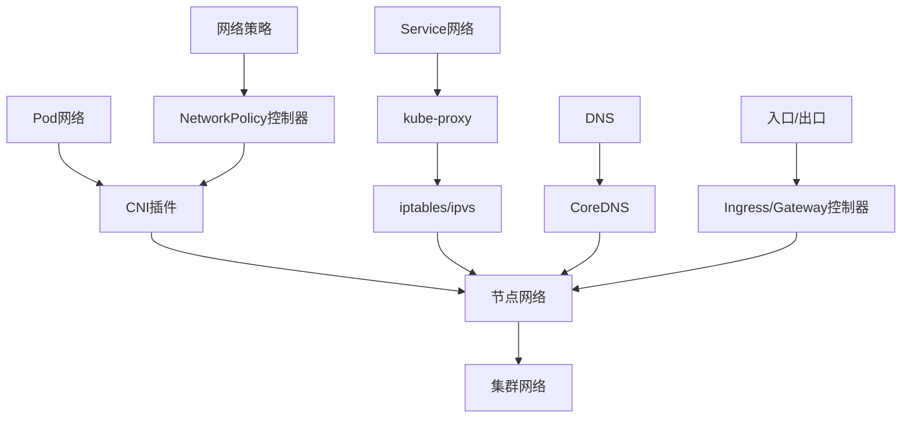

主要组件及其职责：

1. **CNI插件**：
   - 负责Pod网络的创建和管理
   - 实现Pod IP分配、路由配置等功能
   - 提供Pod间通信的底层实现

2. **kube-proxy**：
   - 实现Service的网络功能
   - 管理集群内负载均衡
   - 支持iptables、ipvs等多种实现方式

3. **CoreDNS**：
   - 提供集群内DNS解析服务
   - 支持Service名称到IP的解析
   - 实现服务发现功能

4. **NetworkPolicy控制器**：
   - 实现网络访问控制策略
   - 通常由CNI插件提供支持
   - 控制Pod间通信的安全性

### 1.3 网络通信模式

Kubernetes中存在四种主要的网络通信模式：

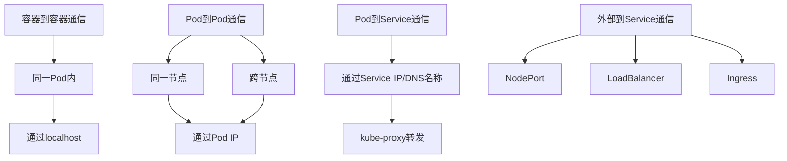

1. **容器到容器通信**：
   - 同一Pod内的容器共享网络命名空间
   - 可以通过localhost直接通信
   - 共享同一IP地址和端口空间

2. **Pod到Pod通信**：
   - 每个Pod有唯一的IP地址
   - 无论Pod位于哪个节点，都可以直接通过IP通信
   - 具体实现依赖于CNI插件

3. **Pod到Service通信**：
   - Pod通过Service名称或ClusterIP访问服务
   - kube-proxy负责将流量转发到后端Pod
   - 提供服务发现和负载均衡

4. **外部到Service通信**：
   - 通过NodePort、LoadBalancer或Ingress暴露服务
   - 允许集群外部访问集群内服务
   - 提供不同级别的访问控制和路由能力

## 2. Pod网络实现  

Pod网络是Kubernetes网络模型的基础，它确保每个Pod拥有唯一的IP地址，并能与其他Pod直接通信。

### 2.1 CNI插件工作流程  

容器网络接口(CNI)是Kubernetes用于配置Pod网络的标准接口。当Pod创建或删除时，Kubelet会调用CNI插件来配置网络：

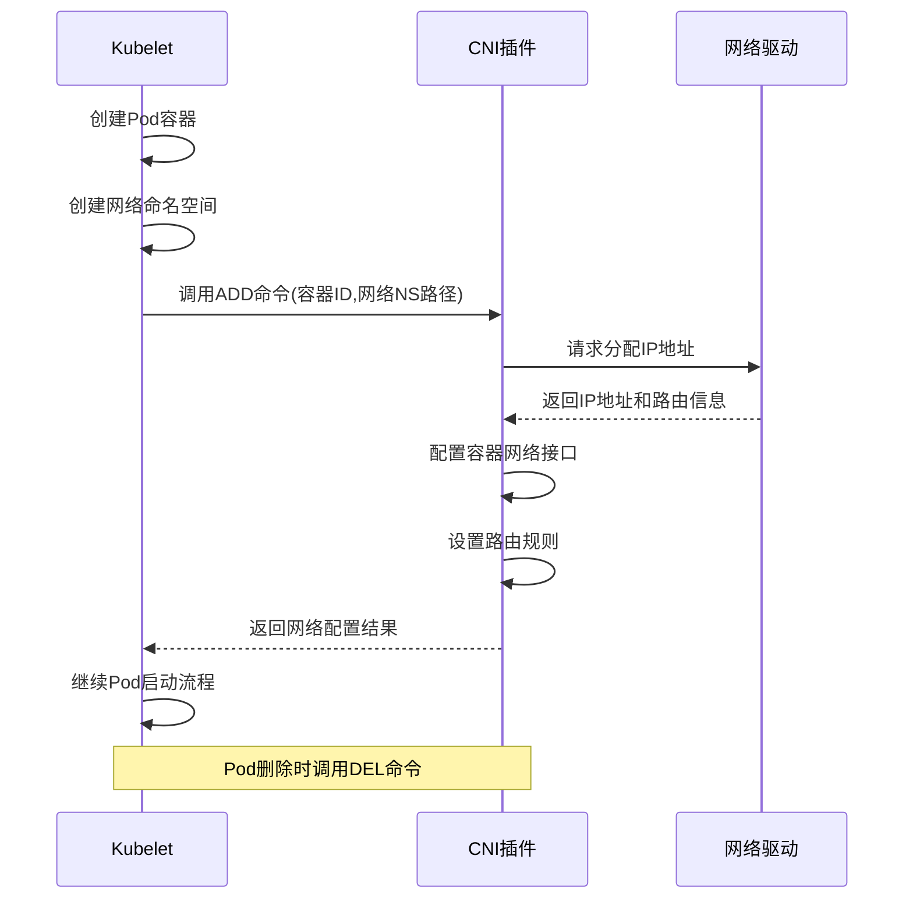

CNI插件的主要职责：

1. **网络资源分配**：
   - 为Pod分配IP地址
   - 创建虚拟网络接口
   - 配置路由规则

2. **网络连接建立**：
   - 将Pod连接到节点网络
   - 确保Pod间通信路径
   - 配置网络命名空间

3. **资源清理**：
   - Pod删除时回收网络资源
   - 释放IP地址
   - 删除相关路由规则

CNI插件的工作流程示例：

```go:c:\project\kphub\kubernetes\cni\example-plugin.go
package main

import (
    "encoding/json"
    "fmt"
    "net"
    "os"
    
    "github.com/containernetworking/cni/pkg/skel"
    "github.com/containernetworking/cni/pkg/types"
    current "github.com/containernetworking/cni/pkg/types/100"
    "github.com/containernetworking/cni/pkg/version"
    "github.com/containernetworking/plugins/pkg/ip"
    "github.com/containernetworking/plugins/pkg/ns"
    "github.com/vishvananda/netlink"
)

// NetConf 是插件的配置结构
type NetConf struct {
    types.NetConf
    Subnet string `json:"subnet"`
}

func cmdAdd(args *skel.CmdArgs) error {
    // 解析配置
    conf := NetConf{}
    if err := json.Unmarshal(args.StdinData, &conf); err != nil {
        return fmt.Errorf("failed to parse config: %v", err)
    }
    
    // 创建网络命名空间对象
    netns, err := ns.GetNS(args.Netns)
    if err != nil {
        return fmt.Errorf("failed to open netns %q: %v", args.Netns, err)
    }
    defer netns.Close()
    
    // 分配IP地址
    ipnet, err := allocateIP(conf.Subnet)
    if err != nil {
        return err
    }
    
    // 创建veth对
    hostInterface := "veth" + args.ContainerID[:8]
    containerInterface := "eth0"
    
    // 配置网络
    if err := setupNetwork(netns, hostInterface, containerInterface, ipnet); err != nil {
        return err
    }
    
    // 返回结果
    result := &current.Result{
        CNIVersion: conf.CNIVersion,
        IPs: []*current.IPConfig{
            {
                Address: *ipnet,
                Gateway: net.ParseIP("10.244.0.1"),
            },
        },
    }
    
    return types.PrintResult(result, conf.CNIVersion)
}

func cmdDel(args *skel.CmdArgs) error {
    // 清理网络资源
    hostInterface := "veth" + args.ContainerID[:8]
    if err := removeInterface(hostInterface); err != nil {
        return err
    }
    
    return nil
}

func main() {
    skel.PluginMain(cmdAdd, cmdCheck, cmdDel, version.All, "Example CNI Plugin v1.0.0")
}

// 其他辅助函数...
```

### 2.2 主流CNI方案对比  

Kubernetes支持多种CNI插件，每种插件都有其独特的实现方式和适用场景：

| 插件名称   | 实现原理                      | 优势                           | 劣势                       | 适用场景                   |  
|------------|------------------------------|--------------------------------|----------------------------|----------------------------|  
| Calico     | BGP路由/IPIP隧道              | 高性能、支持网络策略、无封装选项 | 配置相对复杂               | 大规模生产环境、需要网络策略 |  
| Flannel    | VXLAN/Host-GW                | 简单易用、配置少                | 功能较少、性能一般         | 开发测试环境、简单部署      |  
| Cilium     | eBPF技术                     | 高性能、L7策略、可观测性        | 要求较新的内核版本         | 高性能要求、微服务架构      |  
| Weave Net  | VXLAN/Fastpath               | 简单可靠、自动发现              | 大规模下性能挑战           | 中小规模集群               |  
| Antrea     | Open vSwitch/Geneve          | 与VMware集成、高性能            | 社区相对较新               | VMware环境                 |  

#### Calico工作原理

Calico使用BGP协议在节点间交换路由信息，实现Pod网络的互通：

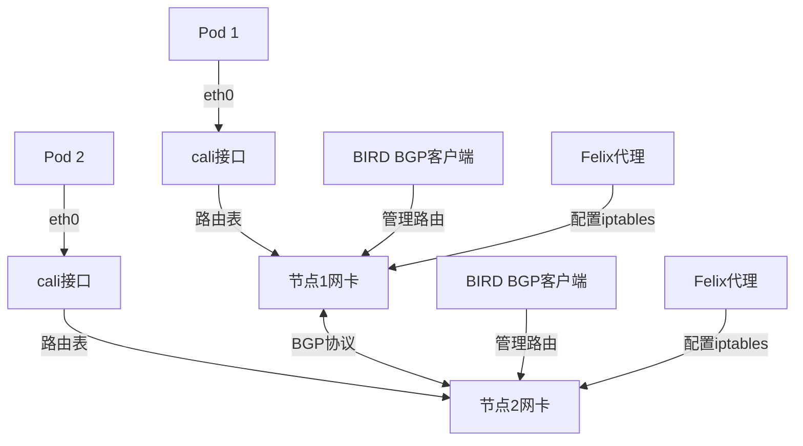

Calico配置示例：

```yaml:c:\project\kphub\kubernetes\cni\calico-config.yaml
kind: ConfigMap
apiVersion: v1
metadata:
  name: calico-config
  namespace: kube-system
data:
  calico_backend: "bird"
  
  # 配置IPAM
  cni_network_config: |-
    {
      "name": "k8s-pod-network",
      "cniVersion": "0.3.1",
      "plugins": [
        {
          "type": "calico",
          "log_level": "info",
          "datastore_type": "kubernetes",
          "nodename": "__KUBERNETES_NODE_NAME__",
          "mtu": 1500,
          "ipam": {
            "type": "calico-ipam"
          },
          "policy": {
            "type": "k8s"
          },
          "kubernetes": {
            "kubeconfig": "__KUBECONFIG_FILEPATH__"
          }
        },
        {
          "type": "portmap",
          "snat": true,
          "capabilities": {"portMappings": true}
        }
      ]
    }
```

#### Flannel工作原理

Flannel主要使用VXLAN技术创建覆盖网络：

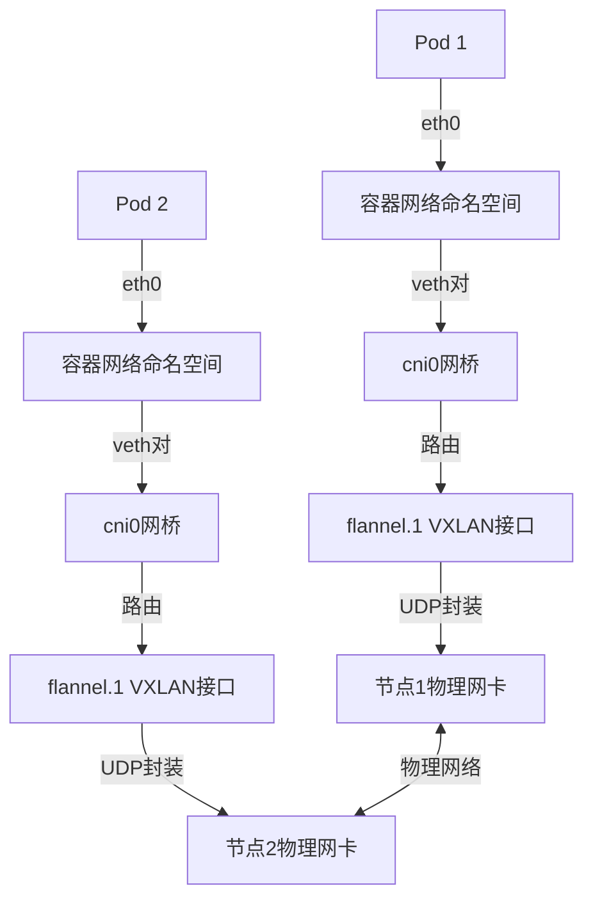

Flannel配置示例：

```yaml:c:\project\kphub\kubernetes\cni\flannel-config.yaml
apiVersion: v1
kind: ConfigMap
metadata:
  name: kube-flannel-cfg
  namespace: kube-system
data:
  net-conf.json: |
    {
      "Network": "10.244.0.0/16",
      "Backend": {
        "Type": "vxlan",
        "VNI": 1,
        "DirectRouting": false
      }
    }
```

#### Cilium工作原理

Cilium利用eBPF技术直接在Linux内核中编程网络数据路径：

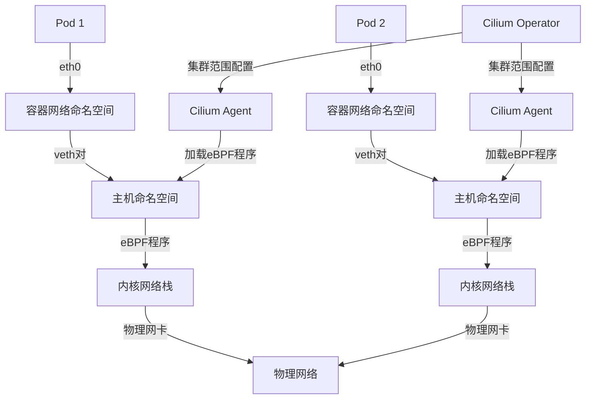

Cilium配置示例：

```yaml:c:\project\kphub\kubernetes\cni\cilium-config.yaml
apiVersion: v1
kind: ConfigMap
metadata:
  name: cilium-config
  namespace: kube-system
data:
  # 启用eBPF主机路由
  enable-host-legacy-routing: "false"
  
  # 启用本地路由模式
  routing-mode: "native"
  
  # 启用带宽管理
  enable-bandwidth-manager: "true"
  
  # 启用L7代理
  enable-l7-proxy: "true"
  
  # 启用Hubble监控
  enable-hubble: "true"
  hubble-listen-address: ":4244"
  hubble-metrics: "drop,tcp,flow,icmp,http"
```

### 2.3 Pod网络数据流向

了解Pod网络的数据流向有助于理解网络问题和性能优化：

#### 同一节点上的Pod通信


同一节点上的Pod通信流程：
1. 数据包从源Pod的eth0接口发出
2. 通过veth对到达节点命名空间
3. 经过节点上的网桥或路由
4. 通过目标Pod的veth对
5. 到达目标Pod的eth0接口

#### 跨节点的Pod通信

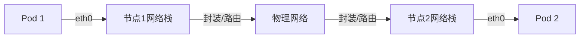

跨节点Pod通信流程（以VXLAN为例）：
1. 数据包从源Pod的eth0接口发出
2. 通过veth对到达节点命名空间
3. 根据路由规则，转发到覆盖网络接口（如flannel.1）
4. 数据包被封装在UDP包中（VXLAN封装）
5. 通过物理网络发送到目标节点
6. 目标节点解封装数据包
7. 根据路由规则转发到目标Pod
8. 到达目标Pod的eth0接口

## 3. Service网络  

Service是Kubernetes中的核心概念，它提供了稳定的网络端点，用于访问一组Pod。

### 3.1 Service类型  

Kubernetes支持多种Service类型，满足不同的访问需求：

```yaml:c:\project\kphub\kubernetes\service\types.yaml
# ClusterIP类型 - 仅集群内部可访问
apiVersion: v1
kind: Service
metadata:
  name: my-clusterip-service
spec:
  type: ClusterIP
  selector:
    app: my-app
  ports:
    - protocol: TCP
      port: 80
      targetPort: 8080
---
# NodePort类型 - 通过节点端口访问
apiVersion: v1
kind: Service
metadata:
  name: my-nodeport-service
spec:
  type: NodePort
  selector:
    app: my-app
  ports:
    - protocol: TCP
      port: 80          # 集群内部端口
      targetPort: 8080  # 容器端口
      nodePort: 30080   # 节点端口(可选,默认30000-32767)
---
# LoadBalancer类型 - 使用云提供商负载均衡器
apiVersion: v1
kind: Service
metadata:
  name: my-lb-service
spec:
  type: LoadBalancer
  selector:
    app: my-app
  ports:
    - protocol: TCP
      port: 80
      targetPort: 8080
---
# ExternalName类型 - CNAME别名
apiVersion: v1
kind: Service
metadata:
  name: my-external-service
spec:
  type: ExternalName
  externalName: api.example.com
```

各种Service类型的特点和使用场景：

1. **ClusterIP**：
   - 默认类型，分配集群内部IP
   - 仅在集群内部可访问
   - 用于内部服务通信

2. **NodePort**：
   - 在ClusterIP基础上，在每个节点上开放端口
   - 可通过`<节点IP>:<节点端口>`访问
   - 适用于开发测试或临时外部访问

3. **LoadBalancer**：
   - 在NodePort基础上，创建外部负载均衡器
   - 自动分配外部IP地址
   - 适用于生产环境外部访问

4. **ExternalName**：
   - 不分配IP，创建CNAME DNS记录
   - 将服务映射到外部域名
   - 用于访问外部服务

### 3.2 kube-proxy实现  

kube-proxy是实现Service网络功能的关键组件，它在每个节点上运行，负责维护网络规则，将发往Service的流量转发到后端Pod：

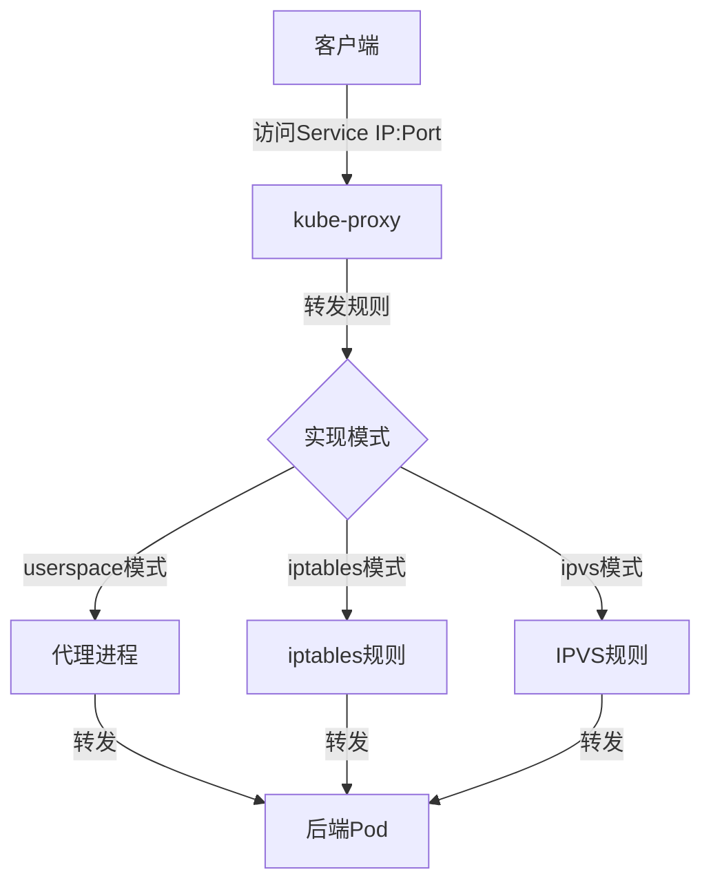

kube-proxy支持三种实现模式：

1. **userspace模式**（已弃用）：
   - kube-proxy作为用户空间代理
   - 性能较差，每个连接都需要在用户空间和内核空间之间切换
   - 最早的实现方式，现已很少使用

2. **iptables模式**：
   - 使用Linux内核的iptables规则
   - 纯内核空间处理，性能较好
   - 使用随机选择实现负载均衡
   - 默认模式，适用于大多数场景

3. **ipvs模式**：
   - 使用Linux内核的IPVS（IP Virtual Server）
   - 专为负载均衡设计，性能更好
   - 支持多种调度算法：轮询(rr)、加权轮询(wrr)、最少连接(lc)等
   - 适用于大规模集群

#### iptables模式工作原理

```text:c:\project\kphub\kubernetes\service\iptables-example.txt
# 示例Service: my-service (ClusterIP: 10.96.0.1, Port: 80)
# 后端Pod: pod-1 (10.244.1.2:8080), pod-2 (10.244.2.3:8080)

# KUBE-SERVICES链 - 入口点
-A PREROUTING -j KUBE-SERVICES

# Service规则
-A KUBE-SERVICES -d 10.96.0.1/32 -p tcp -m tcp --dport 80 -j KUBE-SVC-XXXX

# 负载均衡规则 - 随机选择后端
-A KUBE-SVC-XXXX -m statistic --mode random --probability 0.5 -j KUBE-SEP-1
-A KUBE-SVC-XXXX -j KUBE-SEP-2

# 后端Pod 1的规则
-A KUBE-SEP-1 -p tcp -m tcp -j DNAT --to-destination 10.244.1.2:8080

# 后端Pod 2的规则
-A KUBE-SEP-2 -p tcp -m tcp -j DNAT --to-destination 10.244.2.3:8080
```

iptables模式的特点：
- 规则链式处理，每个Service对应一组规则
- 使用随机概率实现负载均衡
- 规则数量与Service和Pod数量成正比
- 大规模集群下规则数量可能导致性能问题

#### IPVS模式工作原理

```text:c:\project\kphub\kubernetes\service\ipvs-example.txt
# 创建虚拟服务
ipvsadm -A -t 10.96.0.1:80 -s rr

# 添加后端真实服务器
ipvsadm -a -t 10.96.0.1:80 -r 10.244.1.2:8080 -m
ipvsadm -a -t 10.96.0.1:80 -r 10.244.2.3:8080 -m

# 查看IPVS规则
$ ipvsadm -ln
IP Virtual Server version 1.2.1 (size=4096)
Prot LocalAddress:Port Scheduler Flags
  -> RemoteAddress:Port           Forward Weight ActiveConn InActConn
TCP  10.96.0.1:80 rr
  -> 10.244.1.2:8080              Masq    1      0          0
  -> 10.244.2.3:8080              Masq    1      0          0
```

IPVS模式的特点：
- 使用哈希表实现，性能更好
- 支持多种负载均衡算法
- 连接状态在内核中跟踪
- 适用于大规模集群

### 3.3 Service与Endpoints

Service通过Endpoints对象跟踪后端Pod的IP地址和端口：

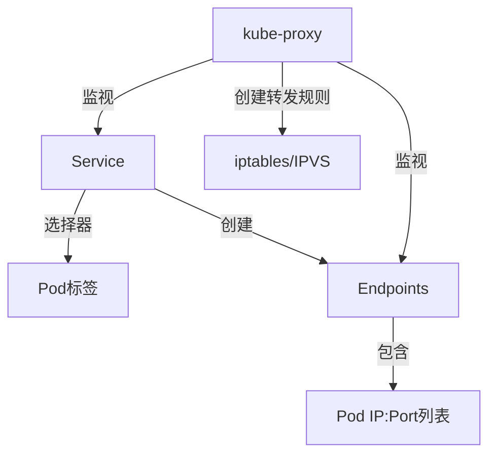

Endpoints对象示例：

```yaml:c:\project\kphub\kubernetes\service\endpoints-example.yaml
apiVersion: v1
kind: Endpoints
metadata:
  name: my-service  # 必须与Service同名
subsets:
  - addresses:
      - ip: 10.244.1.2  # Pod 1 IP
      - ip: 10.244.2.3  # Pod 2 IP
    ports:
      - port: 8080      # 目标端口
        protocol: TCP
```

当Service定义了选择器时，Kubernetes会自动创建和维护Endpoints对象。如果Service没有定义选择器，则需要手动创建Endpoints对象。

### 3.4 无选择器Service

无选择器Service允许将Service连接到集群外部的服务或自定义Endpoints：

```yaml:c:\project\kphub\kubernetes\service\external-service.yaml
# 无选择器Service
apiVersion: v1
kind: Service
metadata:
  name: external-db
spec:
  ports:
    - protocol: TCP
      port: 3306
      targetPort: 3306
---
# 手动创建Endpoints
apiVersion: v1
kind: Endpoints
metadata:
  name: external-db  # 必须与Service同名
subsets:
  - addresses:
      - ip: 192.168.1.100  # 外部数据库IP
    ports:
      - port: 3306
        protocol: TCP
```

无选择器Service的应用场景：
- 连接到外部数据库或API
- 连接到不同命名空间或集群的服务
- 在蓝绿部署中控制流量切换

## 4. 网络策略  

NetworkPolicy是Kubernetes中的资源对象，用于控制Pod之间的网络通信。它提供了类似防火墙的功能，允许定义基于标签的访问控制规则。

### 4.1 NetworkPolicy配置  

NetworkPolicy通过选择器和规则定义允许的网络流量：

```yaml:c:\project\kphub\kubernetes\network\policy.yaml
apiVersion: networking.k8s.io/v1
kind: NetworkPolicy
metadata:
  name: db-access-policy
  namespace: default
spec:
  podSelector:
    matchLabels:
      role: db
  policyTypes:
  - Ingress
  - Egress
  ingress:
  - from:
    - podSelector:
        matchLabels:
          role: api
    - namespaceSelector:
        matchLabels:
          purpose: monitoring
    ports:
    - protocol: TCP
      port: 5432
  egress:
  - to:
    - podSelector:
        matchLabels:
          role: logging
    ports:
    - protocol: TCP
      port: 9200
```

NetworkPolicy的主要组成部分：

1. **podSelector**：
   - 定义策略适用的Pod
   - 基于标签选择器

2. **policyTypes**：
   - 指定策略类型：Ingress（入站）、Egress（出站）或两者

3. **ingress**：
   - 定义允许的入站流量规则
   - 包含来源选择器和端口规则

4. **egress**：
   - 定义允许的出站流量规则
   - 包含目标选择器和端口规则

### 4.2 策略规则类型  

NetworkPolicy支持多种选择器类型，用于精确控制流量：

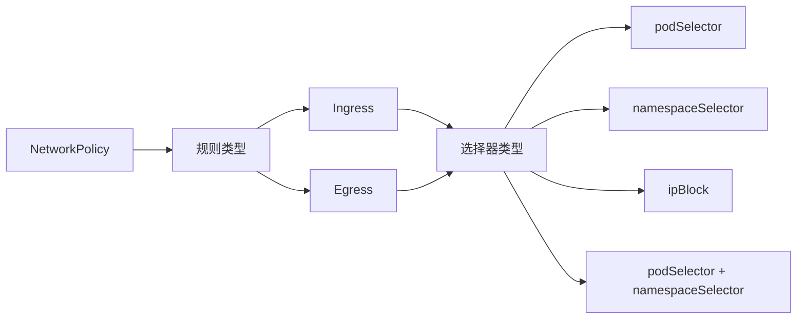

选择器类型及示例：

1. **podSelector**：
   - 基于Pod标签选择
   - 默认在同一命名空间内

```yaml
from:
- podSelector:
    matchLabels:
      role: frontend
```

2. **namespaceSelector**：
   - 基于命名空间标签选择
   - 选择整个命名空间中的所有Pod

```yaml
from:
- namespaceSelector:
    matchLabels:
      environment: production
```

3
继续完成Kubernetes网络模型详解文档：

### 4.2 策略规则类型（续）  

3. **ipBlock**：
   - 基于CIDR块选择
   - 适用于控制与外部系统的通信

```yaml
from:
- ipBlock:
    cidr: 172.17.0.0/16
    except:
    - 172.17.1.0/24
```

4. **podSelector + namespaceSelector**：
   - 组合选择器，实现跨命名空间的Pod选择
   - 两个选择器之间是AND关系（同时满足）

```yaml
from:
- podSelector:
    matchLabels:
      role: frontend
  namespaceSelector:
    matchLabels:
      environment: production
```

5. **多个规则项**：
   - 多个from/to项之间是OR关系（满足任一即可）
   - 可以组合不同类型的选择器

```yaml
from:
- podSelector:
    matchLabels:
      role: frontend
- namespaceSelector:
    matchLabels:
      environment: monitoring
- ipBlock:
    cidr: 10.0.0.0/24
```

### 4.3 默认策略行为

了解NetworkPolicy的默认行为对于正确配置网络安全至关重要：

1. **默认允许所有流量**：
   - 如果没有NetworkPolicy选择Pod，则允许所有入站和出站流量
   - 这是Kubernetes的默认行为

2. **选择后默认拒绝**：
   - 一旦Pod被NetworkPolicy选中，未明确允许的流量将被拒绝
   - 需要显式定义允许规则

3. **空规则的影响**：
   - 空的ingress规则：拒绝所有入站流量
   - 空的egress规则：拒绝所有出站流量
   - 未指定policyTypes：只应用定义的规则类型

```yaml:c:\project\kphub\kubernetes\network\default-deny.yaml
# 拒绝所有入站流量
apiVersion: networking.k8s.io/v1
kind: NetworkPolicy
metadata:
  name: default-deny-ingress
spec:
  podSelector: {}  # 选择命名空间中的所有Pod
  policyTypes:
  - Ingress
---
# 拒绝所有出站流量
apiVersion: networking.k8s.io/v1
kind: NetworkPolicy
metadata:
  name: default-deny-egress
spec:
  podSelector: {}
  policyTypes:
  - Egress
```

### 4.4 网络策略最佳实践

在生产环境中实施网络策略的建议：

1. **采用默认拒绝策略**：
   - 先实施默认拒绝策略，然后添加必要的允许规则
   - 遵循最小权限原则

2. **基于角色定义策略**：
   - 使用一致的标签体系（如app、role、tier）
   - 根据应用架构定义策略

3. **分层策略**：
   - 命名空间级别：控制跨命名空间通信
   - 应用级别：控制应用组件间通信
   - Pod级别：精细控制特定Pod

4. **测试和验证**：
   - 在应用策略前测试连通性
   - 使用网络工具验证策略效果
   - 逐步实施，避免中断服务

```yaml:c:\project\kphub\kubernetes\network\tiered-policy.yaml
# 命名空间级别策略 - 允许监控系统访问
apiVersion: networking.k8s.io/v1
kind: NetworkPolicy
metadata:
  name: allow-monitoring
  namespace: app
spec:
  podSelector: {}  # 应用于所有Pod
  ingress:
  - from:
    - namespaceSelector:
        matchLabels:
          role: monitoring
    ports:
    - protocol: TCP
      port: 9100  # metrics端口
---
# 应用级别策略 - 前端到后端通信
apiVersion: networking.k8s.io/v1
kind: NetworkPolicy
metadata:
  name: frontend-to-backend
  namespace: app
spec:
  podSelector:
    matchLabels:
      tier: backend
  ingress:
  - from:
    - podSelector:
        matchLabels:
          tier: frontend
    ports:
    - protocol: TCP
      port: 8080
```

## 5. DNS服务发现  

Kubernetes提供内置的DNS服务，用于服务发现和名称解析。这使得应用可以通过服务名称而不是IP地址相互访问。

### 5.1 记录格式  

Kubernetes DNS服务为不同类型的资源创建不同格式的DNS记录：

```text
# Pod DNS记录
<pod-ip-with-dashes>.<namespace>.pod.cluster.local
例如: 10-244-1-10.default.pod.cluster.local

# Service DNS记录
<service-name>.<namespace>.svc.cluster.local
例如: kubernetes.default.svc.cluster.local

# 带端口的Service SRV记录
_<port-name>._<protocol>.<service-name>.<namespace>.svc.cluster.local
例如: _https._tcp.kubernetes.default.svc.cluster.local

# Headless Service的后端Pod记录
<pod-name>.<service-name>.<namespace>.svc.cluster.local
例如: pod-0.stateful.default.svc.cluster.local
```

DNS记录类型：

1. **A/AAAA记录**：
   - 将服务名称解析为IP地址
   - Service解析为ClusterIP
   - Headless Service解析为后端Pod IP列表

2. **SRV记录**：
   - 包含服务端口和主机名信息
   - 用于具有多个端口的服务

3. **PTR记录**：
   - 反向DNS查询
   - 将IP地址解析为名称

### 5.2 CoreDNS配置  

CoreDNS是Kubernetes默认的DNS服务器，它通过Corefile配置文件定义行为：

```text:c:\project\kphub\kubernetes\coredns\Corefile
.:53 {
    # 错误日志
    errors
    
    # 健康检查
    health {
        lameduck 5s
    }
    
    # 准备就绪探针
    ready
    
    # Kubernetes插件 - 处理集群DNS
    kubernetes cluster.local in-addr.arpa ip6.arpa {
        # 启用Pod域名解析
        pods insecure
        
        # 上游解析器
        fallthrough in-addr.arpa ip6.arpa
        
        # TTL设置
        ttl 30
    }
    
    # 缓存设置
    cache 30
    
    # 循环负载均衡
    loadbalance round_robin
    
    # 转发外部域名查询
    forward . /etc/resolv.conf {
        max_concurrent 1000
    }
    
    # 自动重载配置
    reload
    
    # 记录查询日志(可选,生产环境通常禁用)
    # log
}
```

CoreDNS部署在kube-system命名空间中，通常作为Deployment运行，并通过Service暴露：

```yaml:c:\project\kphub\kubernetes\coredns\coredns-deploy.yaml
apiVersion: apps/v1
kind: Deployment
metadata:
  name: coredns
  namespace: kube-system
spec:
  replicas: 2
  selector:
    matchLabels:
      k8s-app: kube-dns
  template:
    metadata:
      labels:
        k8s-app: kube-dns
    spec:
      containers:
      - name: coredns
        image: coredns/coredns:1.8.4
        args: [ "-conf", "/etc/coredns/Corefile" ]
        volumeMounts:
        - name: config-volume
          mountPath: /etc/coredns
        ports:
        - containerPort: 53
          name: dns
          protocol: UDP
        - containerPort: 53
          name: dns-tcp
          protocol: TCP
      volumes:
      - name: config-volume
        configMap:
          name: coredns
          items:
          - key: Corefile
            path: Corefile
---
apiVersion: v1
kind: Service
metadata:
  name: kube-dns
  namespace: kube-system
spec:
  selector:
    k8s-app: kube-dns
  clusterIP: 10.96.0.10  # 集群DNS服务IP
  ports:
  - name: dns
    port: 53
    protocol: UDP
  - name: dns-tcp
    port: 53
    protocol: TCP
```

### 5.3 DNS策略和配置

Pod可以通过dnsPolicy和dnsConfig字段自定义DNS设置：

```yaml:c:\project\kphub\kubernetes\dns\pod-dns-config.yaml
apiVersion: v1
kind: Pod
metadata:
  name: custom-dns-pod
spec:
  containers:
  - name: app
    image: nginx
  # DNS策略
  dnsPolicy: "ClusterFirst"
  # 自定义DNS配置
  dnsConfig:
    nameservers:
    - 1.1.1.1
    searches:
    - ns1.svc.cluster.local
    - my.dns.search.suffix
    options:
    - name: ndots
      value: "5"
    - name: timeout
      value: "3"
```

DNS策略类型：

1. **ClusterFirst**（默认）：
   - 优先使用集群DNS服务
   - 未能解析的查询转发到上游DNS

2. **Default**：
   - 从节点继承DNS配置
   - 使用节点的/etc/resolv.conf

3. **None**：
   - 忽略所有默认设置
   - 必须提供dnsConfig

4. **ClusterFirstWithHostNet**：
   - 用于hostNetwork: true的Pod
   - 行为类似ClusterFirst

### 5.4 服务发现最佳实践

有效利用Kubernetes DNS服务发现的建议：

1. **使用短名称**：
   - 同一命名空间内可以使用服务短名称（如`mysql`而非`mysql.default.svc.cluster.local`）
   - 简化配置和代码

2. **命名空间隔离**：
   - 使用命名空间组织服务
   - 跨命名空间访问使用`<service>.<namespace>`格式

3. **Headless Service**：
   - 需要访问特定Pod时使用Headless Service
   - 适用于StatefulSet等有状态应用

```yaml:c:\project\kphub\kubernetes\dns\headless-service.yaml
apiVersion: v1
kind: Service
metadata:
  name: mongodb
spec:
  clusterIP: None  # Headless Service
  selector:
    app: mongodb
  ports:
  - port: 27017
---
apiVersion: apps/v1
kind: StatefulSet
metadata:
  name: mongodb
spec:
  serviceName: mongodb  # 关联Headless Service
  replicas: 3
  selector:
    matchLabels:
      app: mongodb
  template:
    metadata:
      labels:
        app: mongodb
    spec:
      containers:
      - name: mongodb
        image: mongo:4.4
```

4. **DNS缓存**：
   - 合理设置TTL值
   - 考虑在应用中实现DNS缓存
   - 避免频繁DNS查询

5. **监控DNS性能**：
   - 监控CoreDNS指标
   - 关注DNS查询延迟和错误率

## 6. 生产实践  

在生产环境中运行Kubernetes网络需要考虑性能、可靠性和安全性等多个方面。

### 6.1 网络性能优化  

优化Kubernetes网络性能的关键措施：

```powershell
# 1. 启用IPVS模式
# 编辑kube-proxy配置
kubectl edit cm kube-proxy -n kube-system
# 修改mode: "ipvs"
# 重启kube-proxy
kubectl rollout restart ds kube-proxy -n kube-system

# 2. 调整MTU大小
# 检查当前MTU
kubectl exec -it network-test -- ip link show eth0
# 修改CNI配置中的MTU值(以Calico为例)
kubectl edit cm calico-config -n kube-system
# 修改mtu: "1500"

# 3. 启用BBR拥塞控制(在节点上执行)
# 检查是否启用
sysctl net.ipv4.tcp_congestion_control
# 启用BBR
sysctl -w net.ipv4.tcp_congestion_control=bbr
sysctl -w net.core.default_qdisc=fq

# 4. 调整内核网络参数(在节点上执行)
sysctl -w net.core.somaxconn=32768
sysctl -w net.ipv4.tcp_max_syn_backlog=8192
sysctl -w net.ipv4.tcp_tw_reuse=1
```

性能优化的关键领域：

1. **kube-proxy优化**：
   - 使用IPVS模式替代iptables模式
   - 减少规则链长度
   - 考虑使用eBPF替代方案（如Cilium）

2. **CNI插件选择**：
   - 大规模集群考虑使用BGP模式的Calico
   - 高性能要求考虑使用Cilium（eBPF）
   - 避免不必要的封装开销

3. **网络拓扑优化**：
   - 减少网络跳数
   - 优化Pod亲和性，减少跨节点通信
   - 使用节点本地DNS缓存

4. **内核参数调优**：
   - 增加连接跟踪表大小
   - 优化TCP参数
   - 启用高级拥塞控制算法

### 6.2 问题排查命令  

Kubernetes网络问题排查的常用命令：

```powershell
# 检查Pod网络连通性
kubectl exec -it <pod-name> -- ping <target-ip>
kubectl exec -it <pod-name> -- curl -v <service-name>

# 检查DNS解析
kubectl exec -it <pod-name> -- nslookup kubernetes.default
kubectl exec -it <pod-name> -- cat /etc/resolv.conf

# 查看Service详情
kubectl get svc <service-name> -o yaml
kubectl describe svc <service-name>

# 查看Endpoints
kubectl get endpoints <service-name>
kubectl describe endpoints <service-name>

# 查看kube-proxy日志
kubectl logs -n kube-system -l k8s-app=kube-proxy

# 查看CoreDNS日志
kubectl logs -n kube-system -l k8s-app=kube-dns

# 查看CNI日志(以Calico为例)
kubectl logs -n kube-system -l k8s-app=calico-node

# 查看Service iptables规则
# 在节点上执行
iptables-save | grep <service-name>
# 或者在特权容器中执行
kubectl run -it --rm debug --image=nicolaka/netshoot --privileged -- bash
iptables-save | grep <service-name>

# 查看IPVS规则
# 在节点上执行
ipvsadm -ln
# 或者在特权容器中执行
kubectl run -it --rm debug --image=nicolaka/netshoot --privileged -- bash
ipvsadm -ln
```

常见网络问题及排查思路：

1. **Pod无法通信**：
   - 检查Pod IP分配
   - 验证路由表
   - 检查网络策略
   - 验证CNI插件状态

2. **Service访问失败**：
   - 检查Service和Endpoints
   - 验证kube-proxy规则
   - 检查Pod健康状态
   - 验证DNS解析

3. **DNS解析问题**：
   - 检查CoreDNS运行状态
   - 验证DNS配置
   - 检查网络连通性
   - 查看CoreDNS日志

4. **网络性能问题**：
   - 检查MTU配置
   - 验证节点网络性能
   - 检查CNI插件配置
   - 监控网络指标

### 6.3 网络监控

有效监控Kubernetes网络对于保障应用可用性至关重要：

```yaml:c:\project\kphub\kubernetes\monitoring\network-metrics.yaml
apiVersion: monitoring.coreos.com/v1
kind: ServiceMonitor
metadata:
  name: network-metrics
  namespace: monitoring
spec:
  selector:
    matchLabels:
      k8s-app: kube-proxy
  endpoints:
  - port: metrics
    interval: 30s
---
apiVersion: monitoring.coreos.com/v1
kind: ServiceMonitor
metadata:
  name: cni-metrics
  namespace: monitoring
spec:
  selector:
    matchLabels:
      k8s-app: calico-node  # 根据CNI插件调整
  endpoints:
  - port: metrics
    interval: 30s
```

关键监控指标：

1. **网络吞吐量**：
   - 节点网络接口吞吐量
   - Pod网络流量
   - Service连接数

2. **网络延迟**：
   - Pod间通信延迟
   - Service访问延迟
   - DNS查询延迟

3. **错误率**：
   - 丢包率
   - 连接错误
   - DNS解析失败

4. **资源使用**：
   - conntrack表使用率
   - iptables/IPVS规则数量
   - 网络命名空间数量

推荐的监控工具：

- **Prometheus + Grafana**：收集和可视化网络指标
- **kube-state-metrics**：提供Kubernetes对象状态指标
- **node-exporter**：提供节点级网络指标
- **Hubble**（Cilium）：提供详细的网络流量可视化
- **Weave Scope**：提供容器网络拓扑可视化

## 7. 多集群网络  

随着Kubernetes的广泛采用，多集群部署变得越来越常见。连接多个Kubernetes集群的网络需要特殊考虑。

### 7.1 方案对比  

多集群网络连接的主要方案：

| 方案        | 实现方式                    | 优势                           | 劣势                         | 延迟    |  
|------------|----------------------------|--------------------------------|------------------------------|--------|  
| VPN隧道     | IPSec/WireGuard/OpenVPN    | 配置灵活、加密安全              | 额外加密开销、需要维护VPN      | 较高    |  
| 专线连接    | 云提供商Direct Connect      | 低延迟、高带宽、稳定性好        | 成本高、配置复杂              | 低      |  
| Service Mesh | Istio/Linkerd多集群模式    | 统一服务发现、流量管理          | 复杂度高、资源消耗大          | 中等    |  
| 集群联邦    | KubeFed/Admiralty          | 统一管理多集群资源              | 成熟度较低、功能有限          | 取决于底层 |  
| 网格网络    | Cilium Cluster Mesh        | 扁平网络、原生性能              | 支持的CNI有限、配置复杂       | 中等    |  

#### VPN隧道方案

使用VPN连接多个集群的网络：

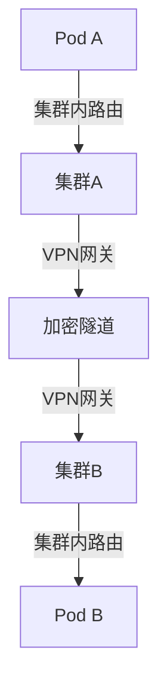

VPN配置示例（使用WireGuard）：

```yaml:c:\project\kphub\kubernetes\multi-cluster\wireguard.yaml
apiVersion: apps/v1
kind: DaemonSet
metadata:
  name: wireguard-node
  namespace: kube-system
spec:
  selector:
    matchLabels:
      app: wireguard-node
  template:
    metadata:
      labels:
        app: wireguard-node
    spec:
      hostNetwork: true
      containers:
      - name: wireguard
        image: linuxserver/wireguard
        securityContext:
          privileged: true
        volumeMounts:
        - name: config
          mountPath: /config
        - name: modules
          mountPath: /lib/modules
      volumes:
      - name: config
        configMap:
          name: wireguard-config
      - name: modules
        hostPath:
          path: /lib/modules
```

#### Service Mesh方案

使用Istio连接多个集群：

```yaml:c:\project\kphub\kubernetes\multi-cluster\istio-multicluster.yaml
# 集群1配置
apiVersion: install.istio.io/v1alpha1
kind: IstioOperator
metadata:
  name: istio-control-plane
spec:
  profile: default
  values:
    global:
      meshID: mesh1
      multiCluster:
        clusterName: cluster1
      network: network1
---
# 远程Secret配置
apiVersion: v1
kind: Secret
metadata:
  name: istio-remote-secret-cluster2
  namespace: istio-system
type: istio.io/multiCluster
stringData:
  cluster2.yaml: |
    apiVersion: v1
    kind: Config
    clusters:
    - cluster:
        certificate-authority-data: <CA_DATA>
        server: https://cluster2-api-server:6443
      name: cluster2
    contexts:
    - context:
        cluster: cluster2
        user: cluster2
      name: cluster2
    current-context: cluster2
    users:
    - name: cluster2
      user:
        token: <TOKEN>
```

### 7.2 多集群服务发现

实现跨集群服务发现的主要方法：

1. **DNS基于方法**：
   - 使用外部DNS服务（如CoreDNS with multicluster插件）
   - 配置跨集群DNS转发

```yaml:c:\project\kphub\kubernetes\multi-cluster\coredns-multicluster.yaml
apiVersion: v1
kind: ConfigMap
metadata:
  name: coredns
  namespace: kube-system
data:
  Corefile: |
    .:53 {
        errors
        health
        kubernetes cluster.local in-addr.arpa ip6.arpa {
            pods insecure
            fallthrough in-addr.arpa ip6.arpa
        }
        # 集群2服务发现
        cluster2.svc.global {
            forward . 10.96.0.10.cluster2
        }
        cache 30
        forward . /etc/resolv.conf
    }
```

2. **Service Mesh方法**：
   - 使用Istio/Linkerd的多集群服务发现
   - 统一服务注册表

```yaml:c:\project\kphub\kubernetes\multi-cluster\istio-service-discovery.yaml
apiVersion: networking.istio.io/v1alpha3
kind: ServiceEntry
metadata:
  name: cluster2-services
spec:
  hosts:
  - "*.cluster2.global"
  location: MESH_INTERNAL
  ports:
  - number: 80
    name: http
    protocol: HTTP
  resolution: DNS
  endpoints:
  - address: cluster2-istio-ingress.example.com
    ports:
      http: 443
```

3. **自定义API聚合**：
   - 开发自定义服务注册表
   - 聚合多集群服务信息

### 7.3 多集群网络安全

保障多集群网络安全的关键措施：

1. **传输加密**：
   - 使用mTLS加密集群间通信
   - 配置VPN隧道加密

2. **网络隔离**：
   - 实施严格的网络策略
   - 限制集群间可访问的服务

```yaml:c:\project\kphub\kubernetes\multi-cluster\network-policy.yaml
apiVersion: networking.k8s.io/v1
kind: NetworkPolicy
metadata:
  name: restrict-cross-cluster
spec:
  podSelector:
    matchLabels:
      app: internal-service
  policyTypes:
  - Ingress
  ingress:
  - from:
    - ipBlock:
        cidr: 10.0.0.0/16  # 本集群Pod CIDR
    ports:
    - protocol: TCP
      port: 80
```

3. **身份验证**：
   - 使用ServiceAccount进行服务身份验证
   - 实施RBAC控制

4. **审计和监控**：
   - 记录集群间通信
   - 监控异常流量模式

## 8. 未来发展趋势

Kubernetes网络正在快速发展，以下是一些重要的发展趋势：

### 8.1 eBPF技术

eBPF（扩展的Berkeley Packet Filter）正在改变Kubernetes网络实现：

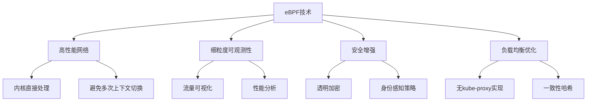

eBPF的主要优势：

1. **性能提升**：
   - 直接在内核中处理网络包
   - 避免用户空间和内核空间切换
   - 减少网络栈开销

2. **增强可观测性**：
   - 详细的网络流量分析
   - 端到端延迟监控
   - 应用级别可视化

3. **安全增强**：
   - 更细粒度的网络策略
   - 透明加密
   - 运行时威胁检测

代表项目：Cilium、Hubble、Falco

### 8.2 服务网格集成

服务网格与Kubernetes网络的深度集成：

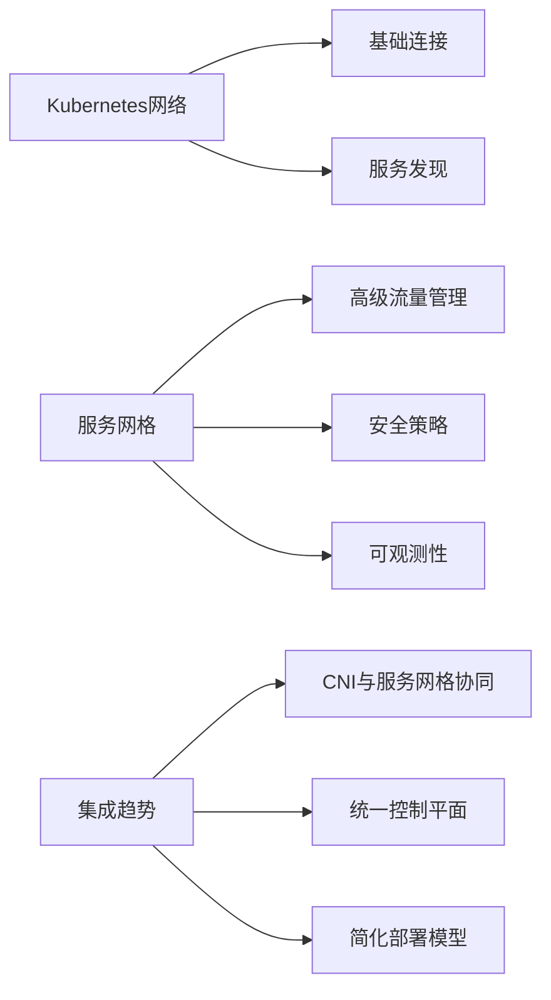

服务网格集成的主要方向：

1. **CNI与服务网格协同**：
   - CNI插件与服务网格数据平面集成
   - 减少网络层次和性能开销

2. **统一网络策略**：
   - 协调Kubernetes NetworkPolicy和服务网格策略
   - 提供一致的安全模型

3. **简化操作模型**：
   - 降低服务网格部署复杂性
   - 提供更好的默认配置

代表项目：Istio与Cilium集成、Linkerd与Calico集成

### 8.3 多集群和混合云网络

随着多云和混合云部署的增加，跨环境网络连接变得更加重要：

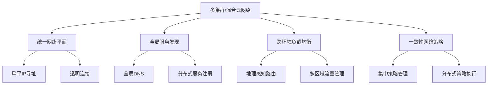

多集群网络的发展方向：

1. **统一网络抽象**：
   - 跨集群/云的一致网络模型
   - 简化多环境部署

2. **智能流量路由**：
   - 基于延迟、成本的路由决策
   - 地理位置感知的负载均衡

3. **全局网络策略**：
   - 集中定义、分布式执行的安全策略
   - 跨环境一致的安全模型

代表项目：Cilium Cluster Mesh、Istio多集群、Submariner

## 总结

Kubernetes网络模型是一个复杂而强大的系统，它通过多层抽象提供
继续完成Kubernetes网络模型详解文档：

## 总结

Kubernetes网络模型是一个复杂而强大的系统，它通过多层抽象提供了容器间通信、服务发现和负载均衡等核心功能。理解这些网络组件的工作原理对于构建、维护和排查Kubernetes集群至关重要。

本文详细介绍了Kubernetes网络的各个方面：

1. **网络模型基础**：Kubernetes网络的设计原则和组件架构，确保了所有Pod可以直接通信，节点可以与所有Pod通信，以及Pod看到的自身IP与其他Pod看到的IP一致。

2. **Pod网络实现**：通过CNI插件实现Pod网络连接，比较了Calico、Flannel和Cilium等主流CNI方案的优缺点和适用场景。

3. **Service网络**：Service提供了稳定的网络端点，kube-proxy通过iptables或IPVS实现了集群内的服务发现和负载均衡。

4. **网络策略**：NetworkPolicy提供了类似防火墙的功能，允许定义基于标签的访问控制规则，增强了集群的网络安全性。

5. **DNS服务发现**：CoreDNS为Kubernetes提供了内置的DNS服务，支持服务名称解析和服务发现。

6. **生产实践**：包括网络性能优化、问题排查命令和网络监控等实用技巧，帮助运维人员保障集群网络的稳定性和性能。

7. **多集群网络**：随着多集群部署的普及，VPN隧道、专线连接和Service Mesh等多种方案可以实现集群间的网络连接和服务发现。

8. **未来发展趋势**：eBPF技术、服务网格集成以及多集群和混合云网络是Kubernetes网络的重要发展方向。

在生产环境中，应根据具体需求选择合适的网络方案。对于小型集群，Flannel可能是最简单的选择；对于大规模生产环境，Calico或Cilium可能更适合；对于需要高级网络策略和可观测性的场景，Cilium的eBPF技术提供了显著优势。

无论选择哪种网络方案，都应遵循最佳实践：实施网络策略保障安全，监控网络性能和健康状态，优化网络配置提高性能，以及定期测试和验证网络连通性。

随着云原生技术的发展，Kubernetes网络将继续演进，提供更高性能、更安全、更易于管理的网络解决方案，支持更复杂的应用部署模式和多云环境。

## 参考资源

1. [Kubernetes官方文档 - 集群网络](https://kubernetes.io/docs/concepts/cluster-administration/networking/)
2. [CNI规范](https://github.com/containernetworking/cni/blob/master/SPEC.md)
3. [Calico项目](https://www.projectcalico.org/)
4. [Flannel项目](https://github.com/flannel-io/flannel)
5. [Cilium项目](https://cilium.io/)
6. [CoreDNS项目](https://coredns.io/)
7. [Istio服务网格](https://istio.io/)
8. [eBPF.io](https://ebpf.io/)

通过深入理解Kubernetes网络模型，开发和运维人员可以更好地设计、部署和维护云原生应用，充分利用Kubernetes提供的网络能力，构建可靠、安全、高性能的分布式系统。