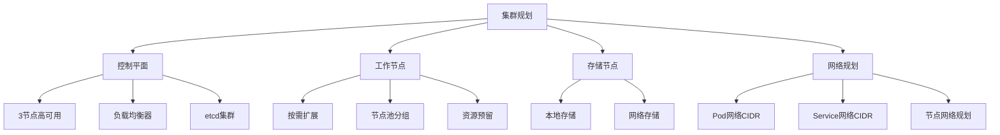

# Kubernetes集群搭建  

Kubernetes（简称K8s）已成为容器编排的事实标准，掌握如何搭建和管理Kubernetes集群是云原生技术栈的基础技能。本文将详细介绍多种Kubernetes集群部署方案，从开发环境到生产环境，帮助读者根据实际需求选择合适的部署方式。

## 1. 部署方案对比  

在开始部署Kubernetes集群前，了解各种部署方案的优缺点至关重要，这有助于根据实际需求选择最合适的方案。

### 1.1 主流部署方式  

Kubernetes提供了多种部署方式，每种方式都有其适用场景：

| 部署方式       | 适用场景           | 复杂度 | 维护成本 | 优势                      | 劣势                        |  
|----------------|------------------|--------|----------|---------------------------|----------------------------|  
| kubeadm        | 生产/测试环境      | 中      | 中       | 官方支持、自动化程度高     | 定制化能力有限              |  
| 二进制安装      | 定制化需求         | 高      | 高       | 完全控制、适合特殊环境     | 手动操作多、维护复杂        |  
| 托管服务(EKS/AKS/GKE) | 企业云环境  | 低      | 低       | 无需管理控制平面、自动升级 | 成本较高、定制化受限        |  
| Minikube       | 本地开发          | 低      | 低       | 单节点部署简单、资源占用小 | 不适合多节点测试            |  
| Kind           | CI/CD测试环境     | 低      | 低       | 容器中运行K8s、速度快     | 功能有限、不适合生产        |  
| k3s            | 边缘计算/IoT      | 低      | 低       | 轻量级、资源占用少        | 部分企业特性缺失            |  

选择部署方式时需要考虑的因素：
- 团队的技术能力和经验
- 基础设施环境（本地数据中心、公有云、混合云）
- 业务需求（高可用性、性能、安全性）
- 预算和资源限制
- 长期维护和升级策略

### 1.2 节点规划建议  

合理的节点规划是构建稳定Kubernetes集群的基础：



**控制平面节点规划**：
- 生产环境建议至少3个控制平面节点，实现高可用
- 每个节点至少4核CPU、8GB内存
- 使用SSD存储提高etcd性能
- 控制平面节点之间延迟应小于10ms

**工作节点规划**：
- 根据工作负载需求确定节点数量和规格
- 考虑使用节点池分组不同类型的工作负载
- 为系统组件预留足够资源（kubelet --system-reserved）
- 考虑节点的可扩展性和弹性伸缩策略

**网络规划**：
- Pod网络CIDR（如10.244.0.0/16）不应与现有网络冲突
- Service网络CIDR（如10.96.0.0/12）不应与Pod网络和现有网络冲突
- 节点间网络应确保低延迟、高带宽
- 考虑网络策略和安全隔离需求

## 2. kubeadm部署  

kubeadm是Kubernetes官方提供的集群引导工具，它简化了Kubernetes集群的创建过程，是生产环境部署的推荐方式之一。

### 2.1 环境准备  

在所有节点上执行以下步骤，准备Kubernetes运行环境：

```powershell
# 设置系统参数
# 禁用交换分区
wsl -d Ubuntu-20.04 -e swapoff -a
wsl -d Ubuntu-20.04 -e sed -i '/swap/s/^/#/' /etc/fstab

# 安装容器运行时（以Docker为例）
Install-Module -Name DockerMsftProvider -Force
Install-Package -Name docker -ProviderName DockerMsftProvider -Force
Start-Service Docker

# 配置Docker使用systemd作为cgroup驱动
$dockerConfigPath = "C:\ProgramData\Docker\config\daemon.json"
$dockerConfig = @{
    "exec-opts" = @("native.cgroupdriver=systemd")
    "log-driver" = "json-file"
    "log-opts" = @{
        "max-size" = "100m"
    }
    "storage-driver" = "overlay2"
}
$dockerConfig | ConvertTo-Json | Set-Content -Path $dockerConfigPath
Restart-Service Docker

# 安装kubeadm、kubelet和kubectl
$k8sVersion = "1.24.0"
$downloadUrl = "https://dl.k8s.io/release/v$k8sVersion/bin/windows/amd64"

# 创建目标目录
New-Item -Path "C:\k" -ItemType Directory -Force

# 下载kubeadm、kubelet和kubectl
Invoke-WebRequest -Uri "$downloadUrl/kubeadm.exe" -OutFile "C:\k\kubeadm.exe"
Invoke-WebRequest -Uri "$downloadUrl/kubelet.exe" -OutFile "C:\k\kubelet.exe"
Invoke-WebRequest -Uri "$downloadUrl/kubectl.exe" -OutFile "C:\k\kubectl.exe"

# 添加到PATH
$env:Path += ";C:\k"
[Environment]::SetEnvironmentVariable("Path", $env:Path, [EnvironmentVariableTarget]::Machine)

# 配置kubelet服务
# 注意：Windows上需要使用特定的kubelet配置
```

**系统要求**：
- 每台机器至少2GB内存
- 至少2个CPU核心
- 集群中所有机器网络互通
- 每台机器具有唯一的主机名、MAC地址和product_uuid
- 开放特定端口（控制平面节点：6443, 2379-2380, 10250-10252；工作节点：10250, 30000-32767）
- 禁用交换分区

### 2.2 初始化控制平面  

在主节点上执行以下命令，初始化Kubernetes控制平面：

```powershell
# 创建kubeadm配置文件
$kubeadmConfig = @"
apiVersion: kubeadm.k8s.io/v1beta3
kind: InitConfiguration
nodeRegistration:
  criSocket: unix:///var/run/containerd/containerd.sock
localAPIEndpoint:
  advertiseAddress: 192.168.1.100  # 替换为主节点IP
  bindPort: 6443
---
apiVersion: kubeadm.k8s.io/v1beta3
kind: ClusterConfiguration
kubernetesVersion: v1.24.0
controlPlaneEndpoint: "k8s-lb.example.com:6443"  # 替换为负载均衡器地址
networking:
  podSubnet: 10.244.0.0/16
  serviceSubnet: 10.96.0.0/12
"@
$kubeadmConfig | Out-File -FilePath C:\project\kphub\kubernetes\kubeadm-config.yaml -Encoding ascii

# 初始化控制平面
kubeadm init --config=C:\project\kphub\kubernetes\kubeadm-config.yaml --upload-certs

# 配置kubectl
mkdir -p $HOME/.kube
Copy-Item -Path "/etc/kubernetes/admin.conf" -Destination "$HOME/.kube/config"

# 安装网络插件（以Calico为例）
kubectl apply -f https://docs.projectcalico.org/manifests/calico.yaml
```

初始化成功后，kubeadm会输出如何将工作节点加入集群的命令，类似于：

```powershell
# 加入工作节点的命令示例
kubeadm join k8s-lb.example.com:6443 --token abcdef.0123456789abcdef \
    --discovery-token-ca-cert-hash sha256:1234567890abcdef1234567890abcdef1234567890abcdef1234567890abcdef
```

### 2.3 添加工作节点

在每个工作节点上执行以下命令，将其加入到Kubernetes集群：

```powershell
# 执行kubeadm join命令（使用初始化控制平面时输出的命令）
kubeadm join k8s-lb.example.com:6443 --token abcdef.0123456789abcdef \
    --discovery-token-ca-cert-hash sha256:1234567890abcdef1234567890abcdef1234567890abcdef1234567890abcdef
```

如果token已过期（默认24小时有效），可以在控制平面节点上创建新token：

```powershell
# 创建新的加入令牌
kubeadm token create --print-join-command
```

### 2.4 配置高可用控制平面

对于生产环境，建议部署高可用控制平面（至少3个控制平面节点）：

```powershell
# 在第二个和第三个控制平面节点上执行
# 使用第一个控制平面初始化时输出的命令
kubeadm join k8s-lb.example.com:6443 --token abcdef.0123456789abcdef \
    --discovery-token-ca-cert-hash sha256:1234567890abcdef1234567890abcdef1234567890abcdef1234567890abcdef \
    --control-plane --certificate-key 1234567890abcdef1234567890abcdef1234567890abcdef1234567890abcdef
```

如果证书密钥已过期，可以在第一个控制平面节点上生成新的证书密钥：

```powershell
# 生成新的证书密钥
kubeadm init phase upload-certs --upload-certs
```

## 3. 二进制部署  

二进制部署方式提供了最大的灵活性和控制力，适合对Kubernetes有深入了解并有特殊定制需求的团队。

### 3.1 组件下载  

首先，下载Kubernetes核心组件的二进制文件：

```powershell
# 创建目录
New-Item -Path "C:\project\kphub\kubernetes\bin" -ItemType Directory -Force
Set-Location -Path "C:\project\kphub\kubernetes\bin"

# 定义组件版本
$k8sVersion = "v1.24.0"
$etcdVersion = "v3.5.4"

# 下载Kubernetes核心组件
$k8sComponents = @(
    "kube-apiserver",
    "kube-controller-manager",
    "kube-scheduler",
    "kubectl",
    "kubelet",
    "kube-proxy"
)

foreach ($component in $k8sComponents) {
    $url = "https://dl.k8s.io/$k8sVersion/bin/windows/amd64/$component.exe"
    $outFile = "$component.exe"
    Write-Host "Downloading $component from $url..."
    Invoke-WebRequest -Uri $url -OutFile $outFile
}

# 下载etcd
$etcdUrl = "https://github.com/etcd-io/etcd/releases/download/$etcdVersion/etcd-$etcdVersion-windows-amd64.zip"
$etcdZip = "etcd.zip"
Invoke-WebRequest -Uri $etcdUrl -OutFile $etcdZip
Expand-Archive -Path $etcdZip -DestinationPath ".\etcd"
Copy-Item -Path ".\etcd\etcd-$etcdVersion-windows-amd64\etcd.exe" -Destination ".\etcd.exe"
Copy-Item -Path ".\etcd\etcd-$etcdVersion-windows-amd64\etcdctl.exe" -Destination ".\etcdctl.exe"
Remove-Item -Path $etcdZip
Remove-Item -Path ".\etcd" -Recurse

# 设置执行权限
foreach ($file in Get-ChildItem -Path "." -Filter "*.exe") {
    icacls $file.FullName /grant "Everyone:(RX)"
}
```

### 3.2 证书生成  

Kubernetes组件之间通过TLS进行安全通信，需要生成各种证书：

```powershell
# 创建证书目录
New-Item -Path "C:\project\kphub\kubernetes\pki" -ItemType Directory -Force
Set-Location -Path "C:\project\kphub\kubernetes\pki"

# 安装OpenSSL（如果尚未安装）
choco install openssl -y

# 生成CA证书
openssl genrsa -out ca.key 2048
openssl req -x509 -new -nodes -key ca.key -subj "/CN=kubernetes-ca" -days 10000 -out ca.crt

# 生成API Server证书
openssl genrsa -out apiserver.key 2048
$sans = "DNS:kubernetes,DNS:kubernetes.default,DNS:kubernetes.default.svc,DNS:kubernetes.default.svc.cluster.local,IP:10.96.0.1,IP:192.168.1.100"
openssl req -new -key apiserver.key -subj "/CN=kube-apiserver" -out apiserver.csr -config <(
cat <<EOF
[req]
req_extensions = v3_req
distinguished_name = req_distinguished_name
[req_distinguished_name]
[v3_req]
basicConstraints = CA:FALSE
keyUsage = nonRepudiation, digitalSignature, keyEncipherment
extendedKeyUsage = serverAuth
subjectAltName = $sans
EOF
)
openssl x509 -req -in apiserver.csr -CA ca.crt -CAkey ca.key -CAcreateserial -out apiserver.crt -days 10000 -extensions v3_req

# 生成其他组件证书
# 类似方式生成以下证书：
# - apiserver-kubelet-client
# - front-proxy-ca
# - front-proxy-client
# - etcd/ca
# - etcd/server
# - etcd/peer
# - etcd/healthcheck-client
# - apiserver-etcd-client
# - sa.key和sa.pub（用于服务账户）
```

### 3.3 配置文件准备

为每个组件创建配置文件：

```powershell
# 创建配置目录
New-Item -Path "C:\project\kphub\kubernetes\config" -ItemType Directory -Force
Set-Location -Path "C:\project\kphub\kubernetes\config"

# kube-apiserver配置
$apiserverConfig = @"
KUBE_API_ARGS="--advertise-address=192.168.1.100 \
  --allow-privileged=true \
  --authorization-mode=Node,RBAC \
  --client-ca-file=C:/project/kphub/kubernetes/pki/ca.crt \
  --enable-admission-plugins=NodeRestriction \
  --enable-bootstrap-token-auth=true \
  --etcd-cafile=C:/project/kphub/kubernetes/pki/etcd/ca.crt \
  --etcd-certfile=C:/project/kphub/kubernetes/pki/apiserver-etcd-client.crt \
  --etcd-keyfile=C:/project/kphub/kubernetes/pki/apiserver-etcd-client.key \
  --etcd-servers=https://127.0.0.1:2379 \
  --kubelet-client-certificate=C:/project/kphub/kubernetes/pki/apiserver-kubelet-client.crt \
  --kubelet-client-key=C:/project/kphub/kubernetes/pki/apiserver-kubelet-client.key \
  --kubelet-preferred-address-types=InternalIP,ExternalIP,Hostname \
  --proxy-client-cert-file=C:/project/kphub/kubernetes/pki/front-proxy-client.crt \
  --proxy-client-key-file=C:/project/kphub/kubernetes/pki/front-proxy-client.key \
  --requestheader-allowed-names=front-proxy-client \
  --requestheader-client-ca-file=C:/project/kphub/kubernetes/pki/front-proxy-ca.crt \
  --requestheader-extra-headers-prefix=X-Remote-Extra- \
  --requestheader-group-headers=X-Remote-Group \
  --requestheader-username-headers=X-Remote-User \
  --secure-port=6443 \
  --service-account-issuer=https://kubernetes.default.svc.cluster.local \
  --service-account-key-file=C:/project/kphub/kubernetes/pki/sa.pub \
  --service-account-signing-key-file=C:/project/kphub/kubernetes/pki/sa.key \
  --service-cluster-ip-range=10.96.0.0/12 \
  --tls-cert-file=C:/project/kphub/kubernetes/pki/apiserver.crt \
  --tls-private-key-file=C:/project/kphub/kubernetes/pki/apiserver.key"
"@
$apiserverConfig | Out-File -FilePath "kube-apiserver.conf" -Encoding ascii

# 类似方式创建其他组件的配置文件：
# - kube-controller-manager.conf
# - kube-scheduler.conf
# - kubelet.conf
# - kube-proxy.conf
# - etcd.conf
```

### 3.4 创建系统服务

将Kubernetes组件配置为Windows服务：

```powershell
# 创建etcd服务
$etcdService = @"
[Unit]
Description=Etcd Server
After=network.target

[Service]
Type=simple
WorkingDirectory=C:/project/kphub/kubernetes/bin
EnvironmentFile=C:/project/kphub/kubernetes/config/etcd.conf
ExecStart=C:/project/kphub/kubernetes/bin/etcd.exe

[Install]
WantedBy=multi-user.target
"@
$etcdService | Out-File -FilePath "C:\project\kphub\kubernetes\services\etcd.service" -Encoding ascii

# 类似方式创建其他组件的服务文件：
# - kube-apiserver.service
# - kube-controller-manager.service
# - kube-scheduler.service
# - kubelet.service
# - kube-proxy.service

# 使用NSSM工具安装服务
# 注意：Windows环境下通常使用NSSM或类似工具管理服务
choco install nssm -y

# 安装etcd服务
nssm install etcd C:\project\kphub\kubernetes\bin\etcd.exe
nssm set etcd AppParameters "--config-file=C:\project\kphub\kubernetes\config\etcd.conf"
nssm start etcd

# 类似方式安装其他服务
```

## 4. 托管集群创建  

云服务提供商的托管Kubernetes服务（如AWS EKS、Azure AKS、Google GKE）提供了最简单的部署方式，适合希望减少运维负担的团队。

### 4.1 EKS集群创建  

在AWS上创建EKS集群：

```powershell
# 安装AWS CLI
Invoke-WebRequest -Uri "https://awscli.amazonaws.com/AWSCLIV2.msi" -OutFile "AWSCLIV2.msi"
Start-Process -FilePath "msiexec.exe" -ArgumentList "/i","AWSCLIV2.msi","/quiet" -Wait
Remove-Item -Path "AWSCLIV2.msi"

# 配置AWS凭证
aws configure

# 安装eksctl工具
choco install eksctl -y

# 使用eksctl创建集群
$clusterConfig = @"
apiVersion: eksctl.io/v1alpha5
kind: ClusterConfig
metadata:
  name: prod-cluster
  region: us-west-2
  version: "1.24"
vpc:
  cidr: 192.168.0.0/16
  nat:
    gateway: Single
nodeGroups:
  - name: ng-1
    instanceType: m5.large
    desiredCapacity: 3
    minSize: 2
    maxSize: 5
    privateNetworking: true
    ssh:
      allow: false
    labels:
      role: worker
    tags:
      nodegroup-role: worker
    iam:
      withAddonPolicies:
        albIngress: true
        cloudWatch: true
        autoScaler: true
"@
$clusterConfig | Out-File -FilePath "C:\project\kphub\kubernetes\eks\cluster.yaml" -Encoding ascii

# 创建集群
eksctl create cluster -f C:\project\kphub\kubernetes\eks\cluster.yaml

# 配置kubectl访问EKS集群
aws eks update-kubeconfig --name prod-cluster --region us-west-2
```

### 4.2 AKS集群创建  

在Azure上创建AKS集群：

```powershell
# 安装Azure CLI
Invoke-WebRequest -Uri "https://aka.ms/installazurecliwindows" -OutFile "AzureCLI.msi"
Start-Process -FilePath "msiexec.exe" -ArgumentList "/i","AzureCLI.msi","/quiet" -Wait
Remove-Item -Path "AzureCLI.msi"

# 登录Azure
az login

# 创建资源组
az group create --name myResourceGroup --location eastus

# 创建AKS集群
az aks create `
    --resource-group myResourceGroup `
    --name myAKSCluster `
    --node-count 3 `
    --enable-addons monitoring `
    --generate-ssh-keys `
    --kubernetes-version 1.24.0 `
    --network-plugin azure `
    --vm-set-type VirtualMachineScaleSets `
    --load-balancer-sku standard

# 获取凭证
az aks get-credentials --resource-group myResourceGroup --name myAKSCluster
```

### 4.3 GKE集群创建  

在Google Cloud上创建GKE集群：

```powershell
# 安装Google Cloud SDK
Invoke-WebRequest -Uri "https://dl.google.com/dl/cloudsdk/channels/rapid/GoogleCloudSDKInstaller.exe" -OutFile "GoogleCloudSDKInstaller.exe"
Start-Process -FilePath "GoogleCloudSDKInstaller.exe" -Wait
Remove-Item -Path "GoogleCloudSDKInstaller.exe"

# 登录Google Cloud
gcloud auth login

# 设置项目
gcloud config set project my-project-id

# 创建GKE集群
gcloud container clusters create my-gke-cluster `
    --zone us-central1-a `
    --num-nodes 3 `
    --cluster-version 1.24 `
    --machine-type e2-standard-2 `
    --enable-autoscaling `
    --min-nodes 1 `
    --max-nodes 5 `
    --enable-network-policy

# 获取凭证
gcloud container clusters get-credentials my-gke-cluster --zone us-central1-a
```

## 5. 本地开发环境  

对于开发和测试目的，可以使用轻量级工具在本地快速创建Kubernetes集群。

### 5.1 Minikube安装  

Minikube是本地Kubernetes的最佳选择之一，特别适合开发人员：

```powershell
# 使用Chocolatey安装Minikube
choco install minikube -y

# 启动Minikube集群
minikube start --driver=hyperv `
    --cpus=4 `
    --memory=8192mb `
    --disk-size=50g `
    --kubernetes-version=v1.24.0

# 验证集群状态
minikube status

# 启用插件
minikube addons enable ingress
minikube addons enable metrics-server
minikube addons enable dashboard

# 访问Kubernetes仪表板
minikube dashboard

# 获取集群IP
minikube ip

# 停止集群
# minikube stop

# 删除集群
# minikube delete
```

Minikube支持多种驱动程序，包括：
- hyperv（Windows Hyper-V）
- virtualbox（Oracle VirtualBox）
- docker（Docker容器）
- podman（Podman容器）
- none（直接在主机上运行，需要Linux）

### 5.2 Kind集群创建  

Kind（Kubernetes IN Docker）是另一个流行的本地开发工具，它在Docker容器中运行Kubernetes节点：

```powershell
# 安装Kind
choco install kind -y

# 创建Kind配置文件
$kindConfig = @"
kind: Cluster
apiVersion: kind.x-k8s.io/v1alpha4
nodes:
- role: control-plane
  kubeadmConfigPatches:
  - |
    kind: InitConfiguration
    nodeRegistration:
      kubeletExtraArgs:
        node-labels: "ingress-ready=true"
  extraPortMappings:
  - containerPort: 80
    hostPort: 80
    protocol: TCP
  - containerPort: 443
    hostPort: 443
    protocol: TCP
- role: worker
- role: worker
"@
$kindConfig | Out-File -FilePath "C:\project\kphub\kubernetes\kind\cluster-config.yaml" -Encoding ascii

# 创建集群
kind create cluster --name dev-cluster --config C:\project\kphub\kubernetes\kind\cluster-config.yaml

# 安装Ingress控制器
kubectl apply -f https://raw.githubusercontent.com/kubernetes/ingress-nginx/main/deploy/static/provider/kind/deploy.yaml

# 验证集群
kubectl get nodes
```

Kind的主要优势：
- 轻量级，启动速度快
- 支持多节点集群
- 非常适合CI/CD环境
- 可以测试集群级功能

### 5.3 k3d集群创建

k3d是k3s（轻量级Kubernetes发行版）的Docker包装器，提供了另一种本地开发选项：

```powershell
# 安装k3d
choco install k3d -y

# 创建集群
k3d cluster create dev-cluster `
    --api-port 6550 `
    --servers 1 `
    --agents 2 `
    --port "80:80@loadbalancer" `
    --port "443:443@loadbalancer"

# 验证集群
kubectl get nodes
```

k3d的主要优势：
- 基于k3s，启动非常快
- 资源占用少
- 内置负载均衡器
- 适合资源受限的环境

## 6. 网络插件配置  

Kubernetes网络插件（CNI）负责实现Pod网络通信，不同插件有不同的特性和适用场景。

### 6.1 Calico安装  

Calico是一个流行的CNI插件，提供高性能、可扩展的网络解决方案：

```powershell
# 下载Calico清单
Invoke-WebRequest -Uri "https://docs.projectcalico.org/manifests/calico.yaml" -OutFile "C:\project\kphub\kubernetes\network\calico.yaml"

# 应用Calico配置
kubectl apply -f C:\project\kphub\kubernetes\network\calico.yaml

# 验证Calico Pod运行状态
kubectl get pods -n kube-system -l k8s-app=calico-node
```

Calico的主要特点：
- 使用BGP路由协议，无需封装，性能高
- 支持网络策略，提供微分段安全
- 可与Istio集成，支持应用层策略
- 适合大规模生产环境

### 6.2 Flannel配置  

Flannel是一个简单、易用的CNI插件，适合入门和小型集群：

```powershell
# 下载Flannel清单
Invoke-WebRequest -Uri "https://raw.githubusercontent.com/flannel-io/flannel/master/Documentation/kube-flannel.yml" -OutFile "C:\project\kphub\kubernetes\network\kube-flannel.yaml"

# 应用Flannel配置
kubectl apply -f C:\project\kphub\kubernetes\network\kube-flannel.yaml

# 验证Flannel Pod运行状态
kubectl get pods -n kube-system -l app=flannel
```

Flannel的主要特点：
- 配置简单，易于部署
- 使用VXLAN或host-gw后端
- 资源占用少
- 适合学习和小型集群

### 6.3 Cilium配置

Cilium是基于eBPF的现代CNI插件，提供高级
继续完成Kubernetes集群搭建文档：

### 6.3 Cilium配置

Cilium是基于eBPF的现代CNI插件，提供高级网络功能和安全策略：

```powershell
# 安装Cilium CLI
Invoke-WebRequest -Uri "https://github.com/cilium/cilium-cli/releases/latest/download/cilium-windows-amd64.exe" -OutFile "C:\Windows\System32\cilium.exe"

# 使用Cilium CLI安装Cilium
cilium install --version 1.12.0

# 验证安装状态
cilium status

# 启用Hubble（Cilium的可观测性组件）
cilium hubble enable --ui
```

Cilium的主要特点：
- 基于eBPF技术，性能卓越
- 支持L3-L7层网络策略
- 提供丰富的可观测性功能
- 支持透明加密和服务网格
- 适合对性能和安全有高要求的环境

## 7. 集群验证  

部署完成后，需要验证集群的各个组件是否正常工作。

### 7.1 健康状态检查  

检查集群组件和节点状态：

```powershell
# 检查控制平面组件状态
kubectl get componentstatuses
# 或使用较新版本的命令
kubectl get --raw='/healthz?verbose'

# 检查节点状态
kubectl get nodes -o wide

# 检查系统Pod状态
kubectl get pods -n kube-system

# 检查集群信息
kubectl cluster-info

# 检查API服务器健康状态
curl -k https://localhost:6443/healthz

# 检查etcd健康状态
kubectl exec -it -n kube-system etcd-master -- etcdctl --endpoints=https://127.0.0.1:2379 --cacert=/etc/kubernetes/pki/etcd/ca.crt --cert=/etc/kubernetes/pki/etcd/server.crt --key=/etc/kubernetes/pki/etcd/server.key endpoint health
```

### 7.2 测试应用部署  

部署测试应用验证集群功能：

```powershell
# 创建测试命名空间
kubectl create namespace test

# 部署Nginx应用
kubectl create deployment nginx --image=nginx -n test
kubectl scale deployment nginx --replicas=3 -n test

# 创建Service
kubectl expose deployment nginx --port=80 --type=NodePort -n test

# 获取Service信息
$nodePort = kubectl get svc nginx -n test -o jsonpath='{.spec.ports[0].nodePort}'
$nodeIP = kubectl get nodes -o jsonpath='{.items[0].status.addresses[?(@.type=="InternalIP")].address}'

# 测试访问
Start-Process "http://$nodeIP`:$nodePort"

# 检查Pod日志
kubectl logs -n test -l app=nginx

# 测试Pod间通信
$podName = kubectl get pods -n test -l app=nginx -o jsonpath='{.items[0].metadata.name}'
kubectl exec -it $podName -n test -- curl -s http://nginx
```

### 7.3 功能测试清单

使用以下清单验证集群的关键功能：

```yaml:c:\project\kphub\kubernetes\tests\functionality-tests.yaml
apiVersion: v1
kind: Namespace
metadata:
  name: cluster-tests
---
# 测试持久卷
apiVersion: v1
kind: PersistentVolumeClaim
metadata:
  name: test-pvc
  namespace: cluster-tests
spec:
  accessModes:
    - ReadWriteOnce
  resources:
    requests:
      storage: 1Gi
---
# 测试ConfigMap
apiVersion: v1
kind: ConfigMap
metadata:
  name: test-config
  namespace: cluster-tests
data:
  test.properties: |
    environment=test
    version=1.0.0
---
# 测试Secret
apiVersion: v1
kind: Secret
metadata:
  name: test-secret
  namespace: cluster-tests
type: Opaque
data:
  username: YWRtaW4=  # admin
  password: cGFzc3dvcmQxMjM=  # password123
---
# 测试Pod与存储、配置集成
apiVersion: v1
kind: Pod
metadata:
  name: test-pod
  namespace: cluster-tests
spec:
  containers:
  - name: test-container
    image: busybox
    command: ["sh", "-c", "while true; do echo $(date) >> /data/test.log; sleep 10; done"]
    volumeMounts:
    - name: config-volume
      mountPath: /config
    - name: secret-volume
      mountPath: /secret
    - name: data-volume
      mountPath: /data
  volumes:
  - name: config-volume
    configMap:
      name: test-config
  - name: secret-volume
    secret:
      secretName: test-secret
  - name: data-volume
    persistentVolumeClaim:
      claimName: test-pvc
---
# 测试网络策略
apiVersion: networking.k8s.io/v1
kind: NetworkPolicy
metadata:
  name: test-network-policy
  namespace: cluster-tests
spec:
  podSelector:
    matchLabels:
      role: db
  ingress:
  - from:
    - podSelector:
        matchLabels:
          role: frontend
    ports:
    - protocol: TCP
      port: 5432
```

执行功能测试：

```powershell
# 应用测试资源
kubectl apply -f c:\project\kphub\kubernetes\tests\functionality-tests.yaml

# 检查资源创建状态
kubectl get all,pvc,configmap,secret,networkpolicy -n cluster-tests

# 清理测试资源
# kubectl delete namespace cluster-tests
```

## 8. 生产建议  

将Kubernetes集群部署到生产环境需要考虑高可用性、安全性、可扩展性和可维护性。

### 8.1 高可用配置  

生产环境中的高可用配置建议：

```yaml:c:\project\kphub\kubernetes\ha-config.yaml
apiVersion: kubeadm.k8s.io/v1beta3
kind: ClusterConfiguration
kubernetesVersion: v1.24.0
controlPlaneEndpoint: "k8s-api.example.com:6443"  # 负载均衡器地址
apiServer:
  certSANs:
  - "k8s-api.example.com"
  - "k8s-api-internal.example.com"
  - "192.168.1.100"
  - "192.168.1.101"
  - "192.168.1.102"
  extraArgs:
    event-ttl: "168h"
    enable-admission-plugins: "NodeRestriction,PodSecurityPolicy"
controllerManager:
  extraArgs:
    cluster-signing-duration: "87600h"
    terminated-pod-gc-threshold: "50"
scheduler:
  extraArgs:
    address: "0.0.0.0"
etcd:
  local:
    extraArgs:
      auto-compaction-retention: "8"
networking:
  podSubnet: "10.244.0.0/16"
  serviceSubnet: "10.96.0.0/12"
```

高可用架构的关键组件：

1. **负载均衡器**：
   - 在控制平面节点前部署负载均衡器
   - 可以使用硬件负载均衡器或软件解决方案（如HAProxy、Nginx）
   - 配置健康检查，确保流量只转发到健康的API服务器

```powershell
# HAProxy配置示例（在负载均衡器节点上）
$haproxyConfig = @"
global
    log /dev/log local0
    log /dev/log local1 notice
    daemon

defaults
    log global
    mode tcp
    option tcplog
    timeout connect 5000
    timeout client 50000
    timeout server 50000

frontend kubernetes-frontend
    bind *:6443
    mode tcp
    default_backend kubernetes-backend

backend kubernetes-backend
    mode tcp
    balance roundrobin
    option tcp-check
    server master1 192.168.1.100:6443 check fall 3 rise 2
    server master2 192.168.1.101:6443 check fall 3 rise 2
    server master3 192.168.1.102:6443 check fall 3 rise 2
"@
$haproxyConfig | Out-File -FilePath "C:\project\kphub\kubernetes\haproxy\haproxy.cfg" -Encoding ascii
```

2. **etcd集群**：
   - 部署至少3个etcd实例，确保高可用性
   - 考虑将etcd部署在专用节点上，与控制平面分离
   - 配置定期备份

3. **多控制平面节点**：
   - 部署至少3个控制平面节点
   - 确保节点分布在不同的故障域（如不同机架或可用区）

### 8.2 备份恢复方案  

定期备份是确保集群数据安全的关键：

```powershell
# 创建etcd备份脚本
$etcdBackupScript = @"
# 设置变量
`$BACKUP_DIR="C:\project\kphub\kubernetes\backups"
`$BACKUP_FILE="`$BACKUP_DIR\etcd-snapshot-`$(Get-Date -Format 'yyyy-MM-dd-HHmmss').db"
`$ETCDCTL_API=3
`$ENDPOINTS="https://127.0.0.1:2379"
`$CACERT="C:\etc\kubernetes\pki\etcd\ca.crt"
`$CERT="C:\etc\kubernetes\pki\etcd\server.crt"
`$KEY="C:\etc\kubernetes\pki\etcd\server.key"

# 创建备份目录
if (-not (Test-Path `$BACKUP_DIR)) {
    New-Item -Path `$BACKUP_DIR -ItemType Directory -Force
}

# 执行备份
etcdctl --endpoints=`$ENDPOINTS `
    --cacert=`$CACERT `
    --cert=`$CERT `
    --key=`$KEY `
    snapshot save `$BACKUP_FILE

# 保留最近30个备份
Get-ChildItem -Path `$BACKUP_DIR -Filter "etcd-snapshot-*.db" | 
    Sort-Object -Property LastWriteTime -Descending | 
    Select-Object -Skip 30 | 
    Remove-Item -Force

# 备份Kubernetes资源
kubectl get all --all-namespaces -o yaml > `$BACKUP_DIR\k8s-all-resources-`$(Get-Date -Format 'yyyy-MM-dd-HHmmss').yaml
"@
$etcdBackupScript | Out-File -FilePath "C:\project\kphub\kubernetes\scripts\backup-etcd.ps1" -Encoding ascii

# 创建计划任务，每天执行备份
$action = New-ScheduledTaskAction -Execute "PowerShell.exe" -Argument "-File C:\project\kphub\kubernetes\scripts\backup-etcd.ps1"
$trigger = New-ScheduledTaskTrigger -Daily -At 2am
Register-ScheduledTask -TaskName "K8sEtcdBackup" -Action $action -Trigger $trigger -RunLevel Highest -User "System"
```

etcd恢复过程：

```powershell
# etcd恢复脚本
$etcdRestoreScript = @"
# 设置变量
`$BACKUP_FILE="C:\project\kphub\kubernetes\backups\etcd-snapshot-2023-05-01-020000.db"
`$ETCDCTL_API=3
`$DATA_DIR="C:\var\lib\etcd-restore"

# 停止Kubernetes服务
Stop-Service -Name kubelet
Stop-Service -Name kube-apiserver
Stop-Service -Name kube-controller-manager
Stop-Service -Name kube-scheduler
Stop-Service -Name etcd

# 恢复etcd数据
etcdctl snapshot restore `$BACKUP_FILE `
    --data-dir=`$DATA_DIR `
    --name=master `
    --initial-cluster=master=https://127.0.0.1:2380 `
    --initial-cluster-token=etcd-cluster-1 `
    --initial-advertise-peer-urls=https://127.0.0.1:2380

# 替换etcd数据目录
Remove-Item -Path "C:\var\lib\etcd" -Recurse -Force
Rename-Item -Path `$DATA_DIR -NewName "C:\var\lib\etcd"

# 启动服务
Start-Service -Name etcd
Start-Service -Name kube-apiserver
Start-Service -Name kube-controller-manager
Start-Service -Name kube-scheduler
Start-Service -Name kubelet
"@
$etcdRestoreScript | Out-File -FilePath "C:\project\kphub\kubernetes\scripts\restore-etcd.ps1" -Encoding ascii
```

### 8.3 安全加固建议

生产环境中的Kubernetes安全加固措施：

```yaml:c:\project\kphub\kubernetes\security\pod-security-policy.yaml
apiVersion: policy/v1beta1
kind: PodSecurityPolicy
metadata:
  name: restricted
spec:
  privileged: false
  allowPrivilegeEscalation: false
  requiredDropCapabilities:
    - ALL
  volumes:
    - 'configMap'
    - 'emptyDir'
    - 'projected'
    - 'secret'
    - 'downwardAPI'
    - 'persistentVolumeClaim'
  hostNetwork: false
  hostIPC: false
  hostPID: false
  runAsUser:
    rule: 'MustRunAsNonRoot'
  seLinux:
    rule: 'RunAsAny'
  supplementalGroups:
    rule: 'MustRunAs'
    ranges:
      - min: 1
        max: 65535
  fsGroup:
    rule: 'MustRunAs'
    ranges:
      - min: 1
        max: 65535
  readOnlyRootFilesystem: true
```

安全加固的关键领域：

1. **API服务器安全**：
   - 启用审计日志
   - 配置RBAC权限
   - 使用TLS加密通信
   - 限制匿名访问

2. **节点安全**：
   - 定期更新操作系统和容器运行时
   - 限制节点访问
   - 使用节点自动修复功能
   - 配置网络策略

3. **容器安全**：
   - 使用Pod安全策略或Pod安全标准
   - 扫描容器镜像漏洞
   - 实施最小权限原则
   - 使用只读文件系统

4. **网络安全**：
   - 实施网络策略
   - 使用加密通信
   - 限制出站流量
   - 保护Service账户令牌

### 8.4 监控和日志方案

生产环境中的监控和日志收集配置：

```yaml:c:\project\kphub\kubernetes\monitoring\prometheus-operator.yaml
apiVersion: v1
kind: Namespace
metadata:
  name: monitoring
---
# 使用Helm安装Prometheus Operator
# 以下是values.yaml的内容示例
apiVersion: helm.cattle.io/v1
kind: HelmChart
metadata:
  name: prometheus-operator
  namespace: kube-system
spec:
  chart: kube-prometheus-stack
  repo: https://prometheus-community.github.io/helm-charts
  targetNamespace: monitoring
  valuesContent: |-
    grafana:
      adminPassword: "admin-password"
      persistence:
        enabled: true
        size: 10Gi
    prometheus:
      prometheusSpec:
        retention: 15d
        storageSpec:
          volumeClaimTemplate:
            spec:
              storageClassName: standard
              resources:
                requests:
                  storage: 50Gi
    alertmanager:
      alertmanagerSpec:
        storage:
          volumeClaimTemplate:
            spec:
              storageClassName: standard
              resources:
                requests:
                  storage: 10Gi
```

日志收集方案：

```yaml:c:\project\kphub\kubernetes\logging\efk-stack.yaml
apiVersion: v1
kind: Namespace
metadata:
  name: logging
---
# 使用Helm安装EFK栈
apiVersion: helm.cattle.io/v1
kind: HelmChart
metadata:
  name: elasticsearch
  namespace: kube-system
spec:
  chart: elasticsearch
  repo: https://helm.elastic.co
  targetNamespace: logging
  valuesContent: |-
    replicas: 3
    minimumMasterNodes: 2
    resources:
      requests:
        cpu: "1000m"
        memory: "2Gi"
      limits:
        cpu: "2000m"
        memory: "4Gi"
    volumeClaimTemplate:
      accessModes: [ "ReadWriteOnce" ]
      resources:
        requests:
          storage: 100Gi
---
apiVersion: helm.cattle.io/v1
kind: HelmChart
metadata:
  name: kibana
  namespace: kube-system
spec:
  chart: kibana
  repo: https://helm.elastic.co
  targetNamespace: logging
  valuesContent: |-
    elasticsearchHosts: "http://elasticsearch-master:9200"
---
apiVersion: helm.cattle.io/v1
kind: HelmChart
metadata:
  name: fluent-bit
  namespace: kube-system
spec:
  chart: fluent-bit
  repo: https://fluent.github.io/helm-charts
  targetNamespace: logging
  valuesContent: |-
    backend:
      type: es
      es:
        host: elasticsearch-master
        port: 9200
```

## 9. 升级与维护  

Kubernetes集群需要定期升级和维护，以获取新功能、性能改进和安全补丁。

### 9.1 集群升级策略  

使用kubeadm升级集群：

```powershell
# 升级kubeadm
Invoke-WebRequest -Uri "https://dl.k8s.io/release/v1.25.0/bin/windows/amd64/kubeadm.exe" -OutFile "C:\k\kubeadm.exe"

# 检查升级计划
kubeadm upgrade plan

# 升级控制平面组件
kubeadm upgrade apply v1.25.0

# 升级kubelet和kubectl
Invoke-WebRequest -Uri "https://dl.k8s.io/release/v1.25.0/bin/windows/amd64/kubelet.exe" -OutFile "C:\k\kubelet.exe"
Invoke-WebRequest -Uri "https://dl.k8s.io/release/v1.25.0/bin/windows/amd64/kubectl.exe" -OutFile "C:\k\kubectl.exe"

# 重启kubelet服务
Restart-Service -Name kubelet
```

升级工作节点：

```powershell
# 在控制平面节点上执行
# 标记节点为不可调度
kubectl drain worker1 --ignore-daemonsets

# 在工作节点上执行
# 升级kubeadm
Invoke-WebRequest -Uri "https://dl.k8s.io/release/v1.25.0/bin/windows/amd64/kubeadm.exe" -OutFile "C:\k\kubeadm.exe"

# 升级节点配置
kubeadm upgrade node

# 升级kubelet和kubectl
Invoke-WebRequest -Uri "https://dl.k8s.io/release/v1.25.0/bin/windows/amd64/kubelet.exe" -OutFile "C:\k\kubelet.exe"
Invoke-WebRequest -Uri "https://dl.k8s.io/release/v1.25.0/bin/windows/amd64/kubectl.exe" -OutFile "C:\k\kubectl.exe"

# 重启kubelet服务
Restart-Service -Name kubelet

# 在控制平面节点上执行
# 标记节点为可调度
kubectl uncordon worker1
```

### 9.2 证书轮换  

Kubernetes证书需要定期更新：

```powershell
# 检查证书过期时间
kubeadm certs check-expiration

# 手动更新所有证书
kubeadm certs renew all

# 配置自动证书轮换
$certRenewalScript = @"
# 检查证书过期时间
`$expirationOutput = kubeadm certs check-expiration
`$needsRenewal = `$expirationOutput | Select-String -Pattern "less than 30 days"

if (`$needsRenewal) {
    # 更新证书
    kubeadm certs renew all
    
    # 重启控制平面组件
    Restart-Service -Name kube-apiserver
    Restart-Service -Name kube-controller-manager
    Restart-Service -Name kube-scheduler
    
    # 更新kubeconfig文件
    cp /etc/kubernetes/admin.conf `$HOME/.kube/config
}
"@
$certRenewalScript | Out-File -FilePath "C:\project\kphub\kubernetes\scripts\renew-certs.ps1" -Encoding ascii

# 创建计划任务，每月执行证书检查
$action = New-ScheduledTaskAction -Execute "PowerShell.exe" -Argument "-File C:\project\kphub\kubernetes\scripts\renew-certs.ps1"
$trigger = New-ScheduledTaskTrigger -Weekly -DaysOfWeek Monday -WeeksInterval 4 -At 3am
Register-ScheduledTask -TaskName "K8sCertRenewal" -Action $action -Trigger $trigger -RunLevel Highest -User "System"
```

### 9.3 故障排除指南

常见问题的排查方法：

```powershell
# 创建故障排除指南
$troubleshootingGuide = @"
# Kubernetes集群故障排除指南

## 1. 节点状态问题

### 节点NotReady
```
# 检查kubelet状态
Get-Service kubelet
# 查看kubelet日志
Get-EventLog -LogName System -Source Kubelet -Newest 50
# 检查kubelet配置
cat C:\var\lib\kubelet\config.yaml
```

## 2. Pod问题

### Pod一直处于Pending状态
```
# 检查节点资源
kubectl describe node
# 检查Pod事件
kubectl describe pod <pod-name>
```

### Pod一直处于CrashLoopBackOff状态
```
# 查看Pod日志
kubectl logs <pod-name>
# 检查Pod配置
kubectl describe pod <pod-name>
```

## 3. 网络问题

### Service无法访问
```
# 检查Service
kubectl describe service <service-name>
# 检查Endpoints
kubectl get endpoints <service-name>
# 检查kube-proxy日志
kubectl logs -n kube-system -l k8s-app=kube-proxy
```

### 集群DNS问题
```
# 检查CoreDNS Pod
kubectl get pods -n kube-system -l k8s-app=kube-dns
# 测试DNS解析
kubectl run -it --rm debug --image=busybox -- nslookup kubernetes.default
```

## 4. 控制平面问题

### API Server不可用
```
# 检查API Server状态
Get-Service kube-apiserver
# 查看API Server日志
Get-EventLog -LogName System -Source "kube-apiserver" -Newest 50
# 检查证书
kubeadm certs check-expiration
```

### etcd问题
```
# 检查etcd健康状态
kubectl exec -it -n kube-system etcd-master -- etcdctl --endpoints=https://127.0.0.1:2379 --cacert=/etc/kubernetes/pki/etcd/ca.crt --cert=/etc/kubernetes/pki/etcd/server.crt --key=/etc/kubernetes/pki/etcd/server.key endpoint health
# 查看etcd日志
kubectl logs -n kube-system etcd-master
```
"@
$troubleshootingGuide | Out-File -FilePath "C:\project\kphub\kubernetes\docs\troubleshooting-guide.md" -Encoding utf8
```

## 总结

Kubernetes集群搭建是一个复杂的过程，需要考虑多种因素，包括部署方式、网络配置、存储选择、安全加固和维护策略。本文详细介绍了从开发环境到生产环境的多种部署方案，以及相关的最佳实践。

选择合适的部署方案应基于以下考虑：
- 对于开发和测试环境，Minikube、Kind或k3d提供了简单快速的解决方案
- 对于生产环境，kubeadm是一个平衡易用性和灵活性的选择
- 对于企业级部署，托管Kubernetes服务(EKS/AKS/GKE)可以减少运维负担
- 对于特殊需求，二进制部署提供了最大的定制化能力

无论选择哪种部署方式，都应遵循以下最佳实践：
- 实施高可用架构，避免单点故障
- 建立完善的备份和恢复策略
- 加强集群安全性，实施最小权限原则
- 配置全面的监控和日志收集
- 制定明确的升级和维护计划

通过合理规划和配置，可以构建一个稳定、安全、高效的Kubernetes集群，为容器化应用提供可靠的运行环境。