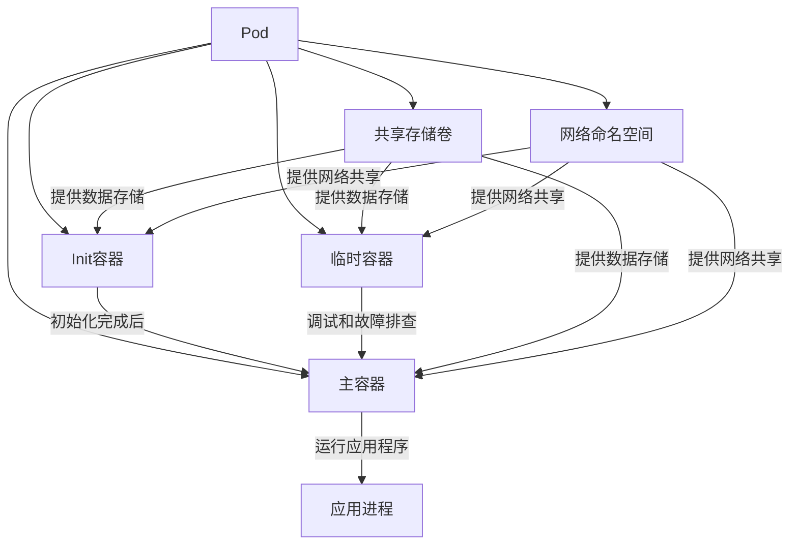
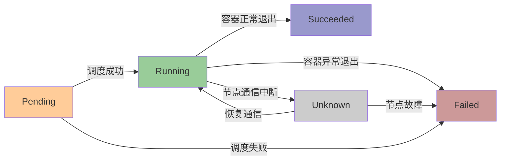
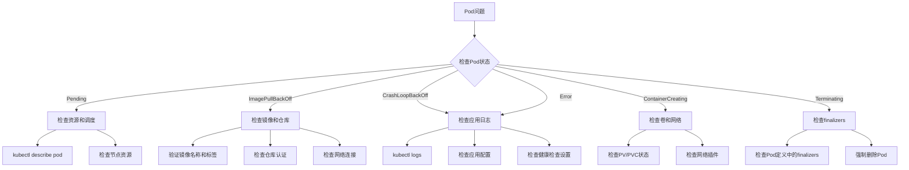

# Pod创建与管理  

Pod是Kubernetes中最小的可部署计算单元，也是应用程序的基本构建块。理解Pod的创建和管理是掌握Kubernetes的基础。本文将详细介绍Pod的概念、生命周期、配置方法以及最佳实践，帮助你有效地在Kubernetes环境中管理应用程序。

## 1. Pod基础概念  

Pod是Kubernetes中可以创建和管理的最小可部署单元，它是一个或多个容器的集合，这些容器共享存储、网络和运行规范。

### 1.1 Pod组成结构  

Pod内部结构包含多个组件，它们共同工作以支持应用程序的运行：



**组件详解**：

1. **Init容器**：
   - 在主容器启动前按顺序运行
   - 用于初始化工作，如创建文件、等待依赖服务就绪
   - 必须成功完成才能启动主容器

2. **主容器**：
   - Pod的核心组件，运行应用程序
   - 可以包含一个或多个容器
   - 同时启动并平行运行

3. **临时容器**：
   - 用于调试和故障排查
   - 不会自动重启
   - 不影响Pod的生命周期

4. **共享存储卷**：
   - 在Pod内的所有容器之间共享
   - 允许容器间数据交换
   - 支持多种存储类型

5. **网络命名空间**：
   - Pod内所有容器共享同一IP地址
   - 容器间可通过localhost通信
   - 共享网络端口空间

### 1.2 核心字段说明  

Pod的YAML定义包含多个关键字段，了解这些字段对于正确配置Pod至关重要：

| 字段名称                | 作用描述                     | 示例值                        | 重要性 |
|------------------------|----------------------------|-------------------------------|-------|
| metadata.name          | Pod的唯一标识符              | nginx-pod                    | 必须   |
| metadata.namespace     | Pod所属的命名空间            | default                      | 可选   |
| metadata.labels        | 用于选择和组织Pod的标签      | app: nginx, tier: frontend   | 推荐   |
| spec.containers        | 定义主容器列表               | name: nginx, image: nginx:1.19 | 必须   |
| spec.initContainers    | 定义初始化容器列表           | name: init-db                | 可选   |
| spec.volumes           | 挂载存储卷配置               | name: data                   | 可选   |
| spec.nodeName          | 指定调度节点                 | worker-node-01              | 可选   |
| spec.nodeSelector      | 节点选择器                   | disk: ssd                    | 可选   |
| spec.restartPolicy     | 重启策略                     | Always/OnFailure/Never       | 可选   |
| spec.serviceAccountName| 服务账户名称                 | default                      | 可选   |
| spec.tolerations       | 容忍度设置                   | key: node-role, value: master| 可选   |
| spec.affinity          | 亲和性设置                   | nodeAffinity, podAffinity    | 可选   |
| status                 | Pod当前状态信息(只读)        | phase: Running              | 自动生成|

**字段使用建议**：

- **metadata.labels**：始终为Pod添加有意义的标签，便于管理和选择
- **spec.containers**：为容器设置合理的资源请求和限制
- **spec.restartPolicy**：根据应用特性选择合适的重启策略
- **spec.nodeSelector/affinity**：用于控制Pod调度位置

## 2. Pod生命周期  

Pod从创建到终止经历多个阶段，了解这些阶段有助于排查问题和优化应用。

### 2.1 状态转换流程  

Pod的生命周期包含多个状态，它们之间的转换遵循特定规则：



**状态详解**：

1. **Pending**：
   - Pod已创建但尚未完成调度
   - 可能原因：资源不足、PVC绑定延迟、镜像拉取
   - 持续时间取决于集群资源和调度策略

2. **Running**：
   - Pod已绑定到节点，所有容器已创建
   - 至少有一个容器正在运行或正在启动/重启
   - 正常的工作状态

3. **Succeeded**：
   - Pod中所有容器已成功终止且不会重启
   - 常见于一次性任务或批处理作业
   - 终态，不会再发生变化

4. **Failed**：
   - Pod中所有容器已终止，至少一个容器以失败状态退出
   - 可能原因：应用程序错误、资源耗尽、节点故障
   - 终态，需要排查原因

5. **Unknown**：
   - 无法获取Pod状态
   - 通常是因为节点通信问题
   - 临时状态，会随着通信恢复而更新

### 2.2 关键事件类型  

Kubernetes记录Pod生命周期中的重要事件，这些事件对于理解Pod状态变化和排查问题非常有用：

```powershell
# 查看特定Pod的事件
kubectl get events --field-selector involvedObject.name=<pod-name>

# 查看所有Pod相关事件
kubectl get events --field-selector involvedObject.kind=Pod
```

**常见Pod事件类型**：

```text
Scheduled: 成功调度到节点
SuccessfulAttachVolume: 成功挂载存储卷
Pulling: 正在拉取容器镜像
Pulled: 成功拉取容器镜像
Created: 容器已创建
Started: 容器已启动
Killing: 正在终止容器
Unhealthy: 健康检查失败
BackOff: 容器启动失败，正在回退重试
FailedMount: 挂载存储卷失败
FailedScheduling: 调度失败
```

**事件分析示例**：

```text
LAST SEEN   TYPE      REASON              OBJECT                    MESSAGE
2m          Normal    Scheduled           pod/nginx-pod             Successfully assigned default/nginx-pod to worker-node-01
1m55s       Normal    Pulling             pod/nginx-pod             Pulling image "nginx:1.19"
1m40s       Normal    Pulled              pod/nginx-pod             Successfully pulled image "nginx:1.19"
1m39s       Normal    Created             pod/nginx-pod             Created container nginx
1m39s       Normal    Started             pod/nginx-pod             Started container nginx
```

通过分析事件序列，可以了解Pod的完整生命周期过程和可能的问题点。

## 3. Pod配置实践  

创建Pod需要编写YAML配置文件，本节将介绍从基础到高级的Pod配置方法。

### 3.1 基础YAML示例  

最简单的Pod配置包含基本的元数据和容器定义：

```yaml:c:\project\kphub\kubernetes\pods\basic.yaml
apiVersion: v1
kind: Pod
metadata:
  name: nginx
  labels:
    app: nginx
    tier: frontend
  annotations:
    description: "Web服务器Pod"
spec:
  containers:
  - name: nginx
    image: nginx:1.19
    ports:
    - containerPort: 80
      name: http
    env:
    - name: NGINX_HOST
      value: example.com
    - name: NGINX_PORT
      value: "80"
```

**配置说明**：
- **apiVersion/kind**：指定API版本和资源类型
- **metadata**：包含名称、标签和注释
- **spec.containers**：定义容器名称、镜像、端口和环境变量

创建Pod的命令：

```powershell
# 创建Pod
kubectl apply -f c:\project\kphub\kubernetes\pods\basic.yaml

# 查看Pod状态
kubectl get pod nginx

# 查看Pod详情
kubectl describe pod nginx
```

### 3.2 多容器Pod配置  

多容器Pod适用于紧密耦合的应用组件，如主应用与日志收集、代理或辅助服务：

```yaml:c:\project\kphub\kubernetes\pods\multi-container.yaml
apiVersion: v1
kind: Pod
metadata:
  name: web-app
  labels:
    app: web-app
spec:
  containers:
  - name: web
    image: nginx:1.19
    ports:
    - containerPort: 80
    volumeMounts:
    - name: shared-logs
      mountPath: /var/log/nginx
  
  - name: log-agent
    image: fluent/fluentd:v1.12
    volumeMounts:
    - name: shared-logs
      mountPath: /var/log/nginx
      readOnly: true
    - name: fluentd-config
      mountPath: /fluentd/etc
  
  volumes:
  - name: shared-logs
    emptyDir: {}
  - name: fluentd-config
    configMap:
      name: fluentd-config
```

**多容器Pod设计模式**：

1. **边车模式（Sidecar）**：
   - 辅助容器增强主容器功能
   - 例如：日志收集、监控代理
   - 特点：不影响主应用逻辑

2. **大使模式（Ambassador）**：
   - 代理容器处理网络连接
   - 例如：代理数据库连接、负载均衡
   - 特点：简化主应用网络处理

3. **适配器模式（Adapter）**：
   - 标准化主容器输出
   - 例如：监控数据格式转换
   - 特点：使主应用与外部系统兼容

### 3.3 Init容器配置

Init容器在主容器启动前按顺序运行，用于执行初始化任务：

```yaml:c:\project\kphub\kubernetes\pods\init-container.yaml
apiVersion: v1
kind: Pod
metadata:
  name: myapp-pod
  labels:
    app: myapp
spec:
  initContainers:
  - name: init-db-ready
    image: busybox:1.28
    command: ['sh', '-c', 'until nslookup mysql; do echo waiting for mysql; sleep 2; done;']
  
  - name: init-config
    image: busybox:1.28
    command: ['sh', '-c', 'echo "初始化配置" > /work-dir/index.html']
    volumeMounts:
    - name: workdir
      mountPath: /work-dir
  
  containers:
  - name: myapp-container
    image: nginx:1.19
    ports:
    - containerPort: 80
    volumeMounts:
    - name: workdir
      mountPath: /usr/share/nginx/html
  
  volumes:
  - name: workdir
    emptyDir: {}
```

**Init容器的常见用途**：
- 等待依赖服务就绪（数据库、API等）
- 初始化配置文件或数据
- 注册服务或执行一次性设置
- 延迟主应用启动直到满足特定条件

## 4. 存储配置  

Pod可以使用多种类型的存储卷，从临时存储到持久化存储，满足不同的数据需求。

### 4.1 临时卷使用  

临时卷的生命周期与Pod相同，Pod删除时数据也会丢失：

```yaml:c:\project\kphub\kubernetes\pods\ephemeral-storage.yaml
apiVersion: v1
kind: Pod
metadata:
  name: cache-pod
spec:
  containers:
  - name: cache-container
    image: redis:6.0
    volumeMounts:
    - name: cache-storage
      mountPath: /data
  
  volumes:
  - name: cache-storage
    emptyDir: 
      medium: Memory  # 使用内存作为存储介质
      sizeLimit: 256Mi  # 限制大小
```

**临时卷类型**：

1. **emptyDir**：
   - 最基本的临时存储
   - 可以使用内存或磁盘作为介质
   - 适用于缓存、临时文件共享

2. **configMap**：
   - 将配置数据作为文件挂载
   - 支持自动更新（延迟）
   - 适用于配置文件

```yaml
volumes:
- name: config-volume
  configMap:
    name: app-config
    items:
    - key: app.properties
      path: app.properties
```

3. **secret**：
   - 将敏感数据作为文件挂载
   - 存储在内存中
   - 适用于证书、密钥、密码

```yaml
volumes:
- name: secret-volume
  secret:
    secretName: app-secrets
    defaultMode: 0400  # 只读权限
```

### 4.2 持久卷挂载  

持久卷的生命周期独立于Pod，确保数据在Pod重启或删除后仍然存在：

```yaml:c:\project\kphub\kubernetes\pods\persistent-storage.yaml
apiVersion: v1
kind: Pod
metadata:
  name: database-pod
spec:
  containers:
  - name: db
    image: mysql:8.0
    env:
    - name: MYSQL_ROOT_PASSWORD
      valueFrom:
        secretKeyRef:
          name: mysql-secrets
          key: root-password
    volumeMounts:
    - name: data-storage
      mountPath: /var/lib/mysql
  
  volumes:
  - name: data-storage
    persistentVolumeClaim:
      claimName: mysql-pvc
```

**持久卷使用流程**：

1. 创建PersistentVolume（PV）或使用动态供应
2. 创建PersistentVolumeClaim（PVC）请求存储
3. 在Pod中引用PVC

```yaml:c:\project\kphub\kubernetes\pods\pvc-example.yaml
apiVersion: v1
kind: PersistentVolumeClaim
metadata:
  name: mysql-pvc
spec:
  accessModes:
    - ReadWriteOnce
  resources:
    requests:
      storage: 10Gi
  storageClassName: standard
```

**持久卷的访问模式**：
- **ReadWriteOnce (RWO)**：单节点读写
- **ReadOnlyMany (ROX)**：多节点只读
- **ReadWriteMany (RWX)**：多节点读写（并非所有存储类型都支持）

## 5. 资源管理  

合理配置Pod资源请求和限制对于集群稳定性和应用性能至关重要。

### 5.1 资源限制配置  

资源配置包括请求（requests）和限制（limits）两部分：

```yaml:c:\project\kphub\kubernetes\pods\resource-limits.yaml
apiVersion: v1
kind: Pod
metadata:
  name: resource-demo
spec:
  containers:
  - name: app
    image: nginx:1.19
    resources:
      requests:
        cpu: "500m"      # 0.5 CPU核心
        memory: "512Mi"  # 512 MB内存
      limits:
        cpu: "1"         # 1 CPU核心
        memory: "1Gi"    # 1 GB内存
```

**资源单位说明**：

- **CPU**：
  - 1 = 1个核心
  - 100m = 0.1核心（m表示毫核，1000m = 1核心）
  - 最小单位为1m

- **内存**：
  - Mi = 兆字节（1024进制）
  - M = 兆字节（1000进制）
  - Gi = 吉字节（1024进制）
  - G = 吉字节（1000进制）

**资源配置的作用**：

- **requests**：
  - 调度决策的依据
  - 保证Pod有足够资源运行
  - 不限制容器使用更多资源（如果有可用资源）

- **limits**：
  - 限制容器最大资源使用量
  - 超过CPU限制会被节流（不会被杀死）
  - 超过内存限制会导致OOM（容器被杀死并可能重启）

### 5.2 服务质量等级  

Kubernetes根据资源配置将Pod分为三个QoS（服务质量）等级，影响Pod在资源压力下的优先级：

```text
Guaranteed: 所有容器都设置了相同的requests和limits
Burstable: 至少一个容器设置了requests，但不满足Guaranteed条件
BestEffort: 没有容器设置requests或limits
```

**QoS等级对比**：

| QoS等级 | 资源配置 | 驱逐优先级 | 适用场景 |
|---------|---------|-----------|---------|
| Guaranteed | limits = requests | 最低 | 关键业务应用 |
| Burstable | requests < limits | 中等 | 一般业务应用 |
| BestEffort | 未设置 | 最高 | 非关键任务 |

**QoS配置示例**：

```yaml:c:\project\kphub\kubernetes\pods\qos-examples.yaml
# Guaranteed QoS
apiVersion: v1
kind: Pod
metadata:
  name: guaranteed-pod
spec:
  containers:
  - name: app
    image: nginx
    resources:
      requests:
        cpu: "1"
        memory: "1Gi"
      limits:
        cpu: "1"
        memory: "1Gi"
---
# Burstable QoS
apiVersion: v1
kind: Pod
metadata:
  name: burstable-pod
spec:
  containers:
  - name: app
    image: nginx
    resources:
      requests:
        cpu: "500m"
        memory: "512Mi"
      limits:
        cpu: "1"
        memory: "1Gi"
---
# BestEffort QoS
apiVersion: v1
kind: Pod
metadata:
  name: besteffort-pod
spec:
  containers:
  - name: app
    image: nginx
    # 未设置resources
```

## 6. 调试与维护  

Pod运行过程中可能需要调试和维护，Kubernetes提供了多种工具和方法。

### 6.1 临时容器调试  

临时容器（Ephemeral Containers）是Kubernetes 1.16引入的功能，专门用于调试运行中的Pod：

```powershell
# 在运行中的Pod中启动临时容器进行调试
kubectl debug -it <pod-name> --image=busybox:1.28 --target=<container-name>

# 示例：调试一个没有调试工具的生产容器
kubectl debug -it nginx-pod --image=nicolaka/netshoot --target=nginx
```

**临时容器的优势**：
- 不需要修改原始Pod定义
- 可以在运行中的Pod中添加
- 可以访问Pod的网络和存储
- 不会在容器崩溃时自动重启

**常用调试镜像**：
- **busybox**：轻量级基础工具
- **nicolaka/netshoot**：网络诊断工具集
- **alpine**：轻量级Linux发行版
- **ubuntu**：完整的Linux环境

### 6.2 日志查看命令  

查看Pod日志是排查问题的基本方法：

```powershell
# 查看Pod日志
kubectl logs <pod-name>

# 查看特定容器的日志（多容器Pod）
kubectl logs <pod-name> -c <container-name>

# 实时查看日志
kubectl logs -f <pod-name>

# 查看最近的日志行数
kubectl logs --tail=100 <pod-name>

# 查看特定时间段的日志
kubectl logs --since=1h <pod-name>

# 查看包含特定字符串的日志
kubectl logs <pod-name> | findstr "ERROR"
```

**日志查看最佳实践**：
- 使用`-f`参数实时监控问题
- 结合`--since`参数查看最近日志，避免处理大量历史数据
- 对于多容器Pod，始终指定`-c`参数
- 使用`findstr`（Windows）或`grep`（Linux）过滤关键信息

### 6.3 Pod内执行命令

在运行中的容器内执行命令，用于检查环境或执行操作：

```powershell
# 在容器中执行单个命令
kubectl exec <pod-name> -- <command>

# 在特定容器中执行命令（多容器Pod）
kubectl exec <pod-name> -c <container-name> -- <command>

# 交互式shell
kubectl exec -it <pod-name> -- /bin/sh

# 示例：检查网络连接
kubectl exec nginx-pod -- curl -s http://localhost:80

# 示例：查看环境变量
kubectl exec nginx-pod -- env
```

## 7. 生产实践  

在生产环境中，Pod配置需要考虑可靠性、可用性和可维护性。

### 7.1 健康检查配置  

Kubernetes提供三种健康检查机制，确保应用程序正常运行：

```yaml:c:\project\kphub\kubernetes\pods\health-checks.yaml
apiVersion: v1
kind: Pod
metadata:
  name: web-app
spec:
  containers:
  - name: web
    image: nginx:1.19
    ports:
    - containerPort: 80
    
    # 存活检查：确定容器是否运行
    livenessProbe:
      httpGet:
        path: /health
        port: 80
      initialDelaySeconds: 15  # 容器启动后多久开始检查
      periodSeconds: 10        # 检查间隔
      timeoutSeconds: 5        # 检查超时时间
      failureThreshold: 3      # 连续失败次数触发重启
    
    # 就绪检查：确定容器是否可以接收流量
    readinessProbe:
      httpGet:
        path: /ready
        port: 80
      initialDelaySeconds: 5
      periodSeconds: 5
    
    # 启动检查：确定容器是否已成功启动
    startupProbe:
      httpGet:
        path: /startup
        port: 80
      failureThreshold: 30     # 允许更多失败次数
      periodSeconds: 10
```

**健康检查类型对比**：

| 检查类型 | 目的 | 失败后行为 | 适用场景 |
|---------|------|-----------|---------|
| livenessProbe | 检测应用是否运行 | 重启容器 | 检测死锁、无响应 |
| readinessProbe | 检测应用是否可服务 | 从服务负载均衡中移除 | 检测临时故障、启动准备 |
| startupProbe | 检测应用是否启动完成 | 延迟其他探针 | 启动缓慢的应用 |

**探测方法**：

1. **HTTP GET**：
   - 发送HTTP请求，返回2xx或3xx状态码表示成功
   - 适用于Web应用

2. **TCP Socket**：
   - 尝试建立TCP连接，连接成功表示通过
   - 适用于数据库、缓存服务等

```yaml
livenessProbe:
  tcpSocket:
    port: 3306
  periodSeconds: 10
```

3. **Exec**：
   - 执行命令，返回状态码0表示成功
   - 适用于自定义检查逻辑

```yaml
livenessProbe:
  exec:
    command:
    - sh
    - -c
    - "ps aux | grep java | grep -v grep"
  periodSeconds: 15
```

### 7.2 Pod中断预算  

PodDisruptionBudget (PDB) 限制自愿中断（如节点维护）期间可以同时停止的Pod数量，确保服务可用性：

```yaml:c:\project\kphub\kubernetes\pods\pdb.yaml
apiVersion: policy/v1
kind: PodDisruptionBudget
metadata:
  name: zk-pdb
spec:
  minAvailable: 2    # 或使用 maxUnavailable
  selector:
    matchLabels:
      app: zookeeper
```

**PDB配置选项**：

- **minAvailable**：
  - 指定必须保持可用的Pod最小数量
  - 可以是绝对数字或百分比（如"50%"）

- **maxUnavailable**：
  - 指定允许不可用的Pod最大数量
  - 可以是绝对数字或百分比

**PDB最佳实践**：

- 为所有关键服务配置PDB
- 对于无状态应用，使用maxUnavailable
- 对于有状态应用，使用minAvailable
- 确保PDB选择器与实际运行的Pod匹配

### 7.3 Pod安全上下文

SecurityContext定义Pod或容器的权限和访问控制设置：

```yaml:c:\project\kphub\kubernetes\pods\security-context.yaml
apiVersion: v1
kind: Pod
metadata:
  name: security-context-demo
spec:
  # Pod级别安全上下文
  securityContext:
    runAsNonRoot: true
    fsGroup: 2000
  
  containers:
  - name: app
    image: nginx:1.19
    # 容器级别安全上下文（覆盖Pod级别）
    securityContext:
      runAsUser: 1000
      runAsGroup: 3000
      allowPrivilegeEscalation: false
      capabilities:
        drop:
        - ALL
        add:
        - NET_BIND_SERVICE
      readOnlyRootFilesystem: true
```

**常用安全设置**：

- **runAsNonRoot**: 防止容器以root用户运行
- **runAsUser/runAsGroup**: 指定用户和组ID
- **fsGroup**: 控制挂载卷的所有权
- **allowPrivilegeEscalation**: 控制是否允许提权
- **capabilities**: 细粒度控制Linux capabilities
- **readOnlyRootFilesystem**: 使根文件系统只读

## 8. 高级特性  

了解Pod的高级特性可以更好地满足复杂场景的需求。

### 8.1 静态Pod配置  

静态Pod由kubelet直接管理，不通过API服务器，常用于部署控制平面组件：

```powershell
# 查看kubelet配置
Get-Content C:\var\lib\kubelet\config.yaml | Select-String staticPodPath
```

```yaml
# kubelet配置中的静态Pod路径
staticPodPath: c:\project\kphub\kubernetes\static-pods
```

创建静态Pod：

```yaml:c:\project\kphub\kubernetes\static-pods\static-web.yaml
apiVersion: v1
kind: Pod
metadata:
  name: static-web
  namespace: default
spec:
  containers:
  - name: web
    image: nginx:1.19
    ports:
    - containerPort: 80
```

**静态Pod特点**：
- 由kubelet直接管理，不依赖API服务器
- 名称后缀为节点名称
- 不能使用ConfigMap、Secret等依赖API服务器的资源
- 不能被
继续完成Pod创建与管理文档：

### 8.1 静态Pod配置  

静态Pod由kubelet直接管理，不通过API服务器，常用于部署控制平面组件：

```powershell
# 查看kubelet配置
Get-Content C:\var\lib\kubelet\config.yaml | Select-String staticPodPath
```

```yaml
# kubelet配置中的静态Pod路径
staticPodPath: c:\project\kphub\kubernetes\static-pods
```

创建静态Pod：

```yaml:c:\project\kphub\kubernetes\static-pods\static-web.yaml
apiVersion: v1
kind: Pod
metadata:
  name: static-web
  namespace: default
spec:
  containers:
  - name: web
    image: nginx:1.19
    ports:
    - containerPort: 80
```

**静态Pod特点**：
- 由kubelet直接管理，不依赖API服务器
- 名称后缀为节点名称（如static-web-node1）
- 不能使用ConfigMap、Secret等依赖API服务器的资源
- 不能被控制器（如Deployment）管理
- 适用于部署控制平面组件或节点级服务

### 8.2 Pod拓扑约束  

拓扑分布约束（Topology Spread Constraints）控制Pod在集群中的分布，提高可用性：

```yaml:c:\project\kphub\kubernetes\pods\topology-spread.yaml
apiVersion: v1
kind: Pod
metadata:
  name: web-server
  labels:
    app: web
spec:
  topologySpreadConstraints:
  - maxSkew: 1                     # 允许的不平衡度
    topologyKey: topology.kubernetes.io/zone  # 拓扑域
    whenUnsatisfiable: DoNotSchedule  # 不满足时的行为
    labelSelector:
      matchLabels:
        app: web
  
  - maxSkew: 2
    topologyKey: kubernetes.io/hostname  # 按节点分布
    whenUnsatisfiable: ScheduleAnyway
    labelSelector:
      matchLabels:
        app: web
  
  containers:
  - name: nginx
    image: nginx:1.19
```

**拓扑约束参数说明**：

- **maxSkew**：
  - 定义不同拓扑域之间Pod数量的最大差异
  - 值越小，分布越均匀

- **topologyKey**：
  - 定义拓扑域，基于节点标签
  - 常用值：
    - `topology.kubernetes.io/zone`：可用区
    - `topology.kubernetes.io/region`：地区
    - `kubernetes.io/hostname`：节点

- **whenUnsatisfiable**：
  - `DoNotSchedule`：不满足条件时不调度（硬性要求）
  - `ScheduleAnyway`：尽量满足，但不满足也可调度（软性要求）

- **labelSelector**：
  - 选择要考虑的Pod集合
  - 通常与Pod自身标签匹配

**拓扑约束应用场景**：
- 跨可用区分布应用以提高可用性
- 避免将相同服务的实例集中在同一节点
- 平衡节点负载

### 8.3 Pod优先级与抢占

Pod优先级定义了Pod的重要性，影响调度顺序和资源竞争时的行为：

```yaml:c:\project\kphub\kubernetes\pods\priority.yaml
# 首先创建PriorityClass
apiVersion: scheduling.k8s.io/v1
kind: PriorityClass
metadata:
  name: high-priority
value: 1000000
globalDefault: false
description: "高优先级Pod，用于关键业务应用"
---
# 使用PriorityClass的Pod
apiVersion: v1
kind: Pod
metadata:
  name: critical-app
spec:
  priorityClassName: high-priority
  containers:
  - name: app
    image: nginx:1.19
```

**优先级与抢占机制**：
- 高优先级Pod可以抢占（驱逐）低优先级Pod
- 系统会选择驱逐影响最小的Pod组合
- 被抢占的Pod会被优雅终止

**内置优先级类**：
- `system-cluster-critical`：集群关键组件
- `system-node-critical`：节点关键组件

**优先级使用建议**：
- 为不同类型的工作负载定义2-3个优先级类
- 保留高优先级给真正的关键应用
- 避免所有Pod都使用高优先级
- 结合资源配额限制高优先级Pod的数量

### 8.4 Pod亲和性与反亲和性

亲和性规则控制Pod与其他Pod或节点的位置关系：

```yaml:c:\project\kphub\kubernetes\pods\affinity.yaml
apiVersion: v1
kind: Pod
metadata:
  name: web-app
  labels:
    app: web
spec:
  # 节点亲和性：控制Pod与节点的关系
  affinity:
    nodeAffinity:
      requiredDuringSchedulingIgnoredDuringExecution:
        nodeSelectorTerms:
        - matchExpressions:
          - key: disk-type
            operator: In
            values:
            - ssd
      preferredDuringSchedulingIgnoredDuringExecution:
      - weight: 1
        preference:
          matchExpressions:
          - key: node-role
            operator: In
            values:
            - worker
    
    # Pod亲和性：吸引Pod靠近其他Pod
    podAffinity:
      preferredDuringSchedulingIgnoredDuringExecution:
      - weight: 100
        podAffinityTerm:
          labelSelector:
            matchExpressions:
            - key: app
              operator: In
              values:
              - cache
          topologyKey: kubernetes.io/hostname
    
    # Pod反亲和性：使Pod远离其他Pod
    podAntiAffinity:
      requiredDuringSchedulingIgnoredDuringExecution:
      - labelSelector:
          matchExpressions:
          - key: app
            operator: In
            values:
            - web
        topologyKey: kubernetes.io/hostname
  
  containers:
  - name: web
    image: nginx:1.19
```

**亲和性类型**：

1. **nodeAffinity**：
   - 控制Pod与节点的亲和关系
   - 基于节点标签
   - 替代并增强了nodeSelector

2. **podAffinity**：
   - 吸引Pod调度到已有特定Pod的节点
   - 例如：将前端与缓存部署在同一节点

3. **podAntiAffinity**：
   - 避免Pod调度到已有特定Pod的节点
   - 例如：将同一应用的多个实例分散到不同节点

**亲和性策略**：

- **requiredDuringSchedulingIgnoredDuringExecution**：
  - 硬性要求，不满足则不调度
  - "必须"规则

- **preferredDuringSchedulingIgnoredDuringExecution**：
  - 软性偏好，尽量满足
  - "尽量"规则
  - 可设置权重（weight）影响优先级

**常见使用场景**：
- 将应用部署到特定硬件（GPU、SSD）的节点
- 将相互通信频繁的Pod部署在同一节点或机架
- 将同一应用的多个实例分散到不同节点或可用区
- 避免不兼容的应用部署在同一节点

## 9. 故障排查  

Pod问题是Kubernetes中最常见的故障类型，掌握排查方法至关重要。

### 9.1 常见Pod问题  

了解常见的Pod问题及其原因有助于快速定位和解决问题：

| 问题状态 | 可能原因 | 排查方法 |
|---------|---------|---------|
| Pending | 资源不足、PVC未绑定、调度器问题 | `kubectl describe pod` |
| ImagePullBackOff | 镜像不存在、仓库认证失败、网络问题 | 检查镜像名称、Secret配置 |
| CrashLoopBackOff | 应用启动失败、健康检查失败、资源不足 | `kubectl logs` |
| Error | 容器启动命令失败、配置错误 | `kubectl logs` |
| ContainerCreating | 卷挂载问题、网络配置错误 | `kubectl describe pod` |
| Terminating (卡住) | 容器无响应、finalizer问题 | 强制删除Pod |

### 9.2 排查命令集合  

以下是排查Pod问题的常用命令集合：

```powershell
# 查看Pod状态
kubectl get pod <pod-name> -o wide

# 查看Pod详细信息和事件
kubectl describe pod <pod-name>

# 查看Pod日志
kubectl logs <pod-name> -c <container-name>

# 查看前一个容器的日志（如果容器已重启）
kubectl logs <pod-name> -c <container-name> --previous

# 查看Pod的YAML定义
kubectl get pod <pod-name> -o yaml

# 在容器中执行命令
kubectl exec -it <pod-name> -c <container-name> -- /bin/sh

# 查看Pod相关事件
kubectl get events --field-selector involvedObject.name=<pod-name>

# 使用临时容器调试
kubectl debug -it <pod-name> --image=busybox --target=<container-name>

# 强制删除卡在Terminating状态的Pod
kubectl delete pod <pod-name> --grace-period=0 --force
```

### 9.3 问题排查流程  

系统化的排查流程可以提高解决问题的效率：



**排查Pending状态**：
```powershell
# 检查节点资源
kubectl describe nodes

# 检查PVC状态（如果使用）
kubectl get pvc

# 检查Pod事件
kubectl describe pod <pod-name>
```

**排查ImagePullBackOff**：
```powershell
# 验证镜像是否存在
docker pull <image>:<tag>

# 检查镜像拉取Secret
kubectl get secret <pull-secret> -o yaml

# 检查节点上的Docker配置
Get-Content C:\ProgramData\Docker\config.json
```

**排查CrashLoopBackOff**：
```powershell
# 查看容器日志
kubectl logs <pod-name> -c <container-name>

# 查看前一个容器实例的日志
kubectl logs <pod-name> -c <container-name> --previous

# 检查启动命令和参数
kubectl get pod <pod-name> -o yaml | Select-String -Pattern "command|args"
```

## 10. 最佳实践  

总结Pod创建与管理的最佳实践，帮助构建可靠、高效的应用部署。

### 10.1 Pod设计原则  

设计高质量Pod的核心原则：

1. **单一职责**：
   - 每个容器专注于单一功能
   - 避免在一个容器中运行多个进程
   - 使用多容器Pod组合相关功能

2. **可观测性**：
   - 配置适当的健康检查
   - 输出结构化日志
   - 暴露监控指标

3. **资源管理**：
   - 为所有容器设置资源请求和限制
   - 根据实际需求调整资源配置
   - 考虑使用垂直Pod自动缩放

4. **安全性**：
   - 使用非root用户运行容器
   - 配置只读根文件系统
   - 限制容器capabilities
   - 使用网络策略限制通信

5. **可靠性**：
   - 实施适当的重启策略
   - 配置合理的终止宽限期
   - 处理SIGTERM信号实现优雅关闭

### 10.2 生产环境配置清单  

生产环境Pod配置的完整示例：

```yaml:c:\project\kphub\kubernetes\pods\production-ready.yaml
apiVersion: v1
kind: Pod
metadata:
  name: production-app
  labels:
    app: production-app
    environment: production
  annotations:
    prometheus.io/scrape: "true"
    prometheus.io/port: "8080"
    prometheus.io/path: "/metrics"
spec:
  # 安全上下文
  securityContext:
    runAsNonRoot: true
    fsGroup: 2000
  
  # 容器定义
  containers:
  - name: app
    image: example/app:v1.2.3
    imagePullPolicy: Always
    
    # 端口定义
    ports:
    - name: http
      containerPort: 8080
      protocol: TCP
    
    # 资源限制
    resources:
      requests:
        cpu: "500m"
        memory: "512Mi"
      limits:
        cpu: "1"
        memory: "1Gi"
    
    # 健康检查
    livenessProbe:
      httpGet:
        path: /health
        port: http
      initialDelaySeconds: 30
      periodSeconds: 10
      timeoutSeconds: 5
      failureThreshold: 3
    
    readinessProbe:
      httpGet:
        path: /ready
        port: http
      initialDelaySeconds: 5
      periodSeconds: 5
    
    startupProbe:
      httpGet:
        path: /startup
        port: http
      failureThreshold: 30
      periodSeconds: 10
    
    # 生命周期钩子
    lifecycle:
      postStart:
        exec:
          command: ["/bin/sh", "-c", "echo Container started > /tmp/started"]
      preStop:
        exec:
          command: ["/bin/sh", "-c", "sleep 10"]
    
    # 环境变量
    env:
    - name: LOG_LEVEL
      value: "info"
    - name: POD_NAME
      valueFrom:
        fieldRef:
          fieldPath: metadata.name
    - name: DB_PASSWORD
      valueFrom:
        secretKeyRef:
          name: app-secrets
          key: db-password
    
    # 卷挂载
    volumeMounts:
    - name: config-volume
      mountPath: /etc/app
      readOnly: true
    - name: data-volume
      mountPath: /var/data
    - name: tmp-volume
      mountPath: /tmp
    
    # 安全上下文
    securityContext:
      allowPrivilegeEscalation: false
      capabilities:
        drop:
        - ALL
      readOnlyRootFilesystem: true
  
  # 初始化容器
  initContainers:
  - name: init-db-check
    image: busybox:1.28
    command: ['sh', '-c', 'until nslookup db-service; do echo waiting for db; sleep 2; done;']
  
  # 卷定义
  volumes:
  - name: config-volume
    configMap:
      name: app-config
  - name: data-volume
    persistentVolumeClaim:
      claimName: app-data
  - name: tmp-volume
    emptyDir: {}
  
  # 调度设置
  affinity:
    podAntiAffinity:
      requiredDuringSchedulingIgnoredDuringExecution:
      - labelSelector:
          matchExpressions:
          - key: app
            operator: In
            values:
            - production-app
        topologyKey: kubernetes.io/hostname
  
  # 容忍度
  tolerations:
  - key: node-role.kubernetes.io/production
    operator: Exists
    effect: NoSchedule
  
  # 终止宽限期
  terminationGracePeriodSeconds: 60
  
  # 服务账户
  serviceAccountName: app-service-account
  
  # 重启策略
  restartPolicy: Always
  
  # DNS策略
  dnsPolicy: ClusterFirst
```

### 10.3 常见反模式  

避免以下Pod配置中的常见错误：

1. **资源配置不当**：
   - 未设置资源请求和限制
   - 资源请求过高导致浪费
   - 资源限制过低导致OOM

2. **健康检查问题**：
   - 缺少健康检查
   - 健康检查路径错误
   - 初始延迟时间过短
   - 超时时间过短

3. **镜像标签使用**：
   - 使用`latest`标签
   - 未指定具体版本
   - 频繁更改镜像标签

4. **安全配置缺失**：
   - 以root用户运行容器
   - 未限制容器权限
   - 挂载敏感主机路径

5. **生命周期管理**：
   - 忽略SIGTERM信号
   - 终止宽限期过短
   - 未实现优雅关闭

## 总结

Pod是Kubernetes的核心概念，掌握Pod的创建和管理是使用Kubernetes的基础。本文详细介绍了Pod的基本概念、生命周期、配置方法、调试技巧以及生产环境最佳实践。

在实际应用中，应遵循以下原则：

1. **合理设计Pod结构**：根据应用特性选择合适的容器组合方式，遵循单一职责原则。

2. **配置适当的资源限制**：为每个容器设置合理的资源请求和限制，避免资源争用和浪费。

3. **实施健康检查**：配置合适的存活检查、就绪检查和启动检查，提高应用可靠性。

4. **注重安全性**：使用非root用户、只读文件系统和最小权限原则增强Pod安全性。

5. **优化调度策略**：利用亲和性、反亲和性和拓扑分布控制Pod在集群中的分布。

6. **做好监控和调试**：熟练使用日志查看、临时容器和执行命令等调试技巧，快速定位和解决问题。

通过合理配置和管理Pod，可以构建稳定、高效、安全的Kubernetes应用，充分发挥容器编排的优势。