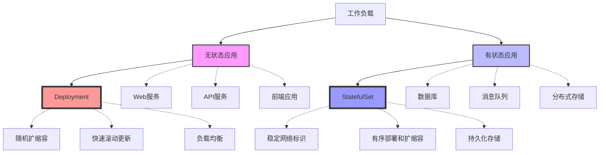
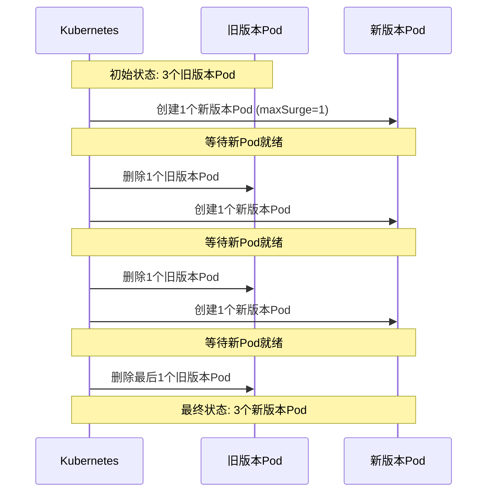
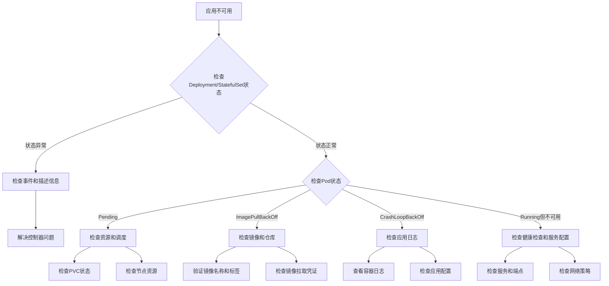

# Deployment与StatefulSet应用  

Kubernetes提供了多种工作负载资源，用于部署和管理应用程序。其中，Deployment和StatefulSet是两种最常用的控制器，分别适用于不同类型的应用场景。本文将详细介绍这两种资源的概念、配置方法、最佳实践以及常见问题的解决方案。

## 1. 核心概念对比  

Deployment和StatefulSet是Kubernetes中两种主要的工作负载API，它们各自针对不同类型的应用进行了优化。

### 1.1 适用场景分析  



**无状态应用**：
- 不需要保存数据或状态
- 每个实例是等价的，可以随时创建或销毁
- 客户端不需要"记住"与哪个实例通信
- 例如：Web服务器、API服务、前端应用

**有状态应用**：
- 需要持久化数据
- 实例之间不完全等价，通常有主从关系
- 需要稳定的网络标识和存储
- 例如：数据库、消息队列、分布式存储系统

### 1.2 特性差异  

| 特性                | Deployment          | StatefulSet         | 说明                                      |
|---------------------|--------------------|--------------------|------------------------------------------|
| Pod标识             | 随机哈希           | 固定序号           | StatefulSet: pod-0, pod-1; Deployment: random-hash |
| 存储卷              | 共享               | 独享               | StatefulSet为每个Pod提供独立的PVC         |
| 网络标识            | 变化               | 稳定               | StatefulSet提供稳定的DNS名称              |
| 更新策略            | 滚动更新           | 分片更新           | StatefulSet可以按序号范围更新              |
| 扩缩容顺序          | 任意               | 有序               | StatefulSet按索引顺序创建/删除Pod         |
| 删除行为            | 并行删除           | 逆序删除           | StatefulSet从高序号到低序号删除           |
| 自动伸缩            | 支持               | 有限支持           | StatefulSet需要谨慎配置HPA                |
| 负载均衡            | Service            | Headless Service   | StatefulSet通常使用无头服务               |
| 应用复杂度          | 低                 | 高                 | StatefulSet通常需要更复杂的配置           |

## 2. Deployment详解  

Deployment是Kubernetes中最常用的工作负载资源，用于部署无状态应用。它提供了声明式更新、滚动发布和回滚等功能。

### 2.1 基础配置示例  

以下是一个基本的Deployment配置示例：

```yaml:c:\project\kphub\kubernetes\deployments\basic.yaml
apiVersion: apps/v1
kind: Deployment
metadata:
  name: nginx
  labels:
    app: nginx
    tier: frontend
spec:
  # 副本数量
  replicas: 3
  
  # 选择器，用于匹配Pod
  selector:
    matchLabels:
      app: nginx
  
  # Pod模板
  template:
    metadata:
      labels:
        app: nginx
    spec:
      containers:
      - name: nginx
        image: nginx:1.19
        ports:
        - containerPort: 80
        resources:
          requests:
            cpu: 100m
            memory: 128Mi
          limits:
            cpu: 500m
            memory: 256Mi
        readinessProbe:
          httpGet:
            path: /
            port: 80
          initialDelaySeconds: 5
          periodSeconds: 10
```

**Deployment关键字段说明**：

- **replicas**：指定期望的Pod副本数量
- **selector**：定义如何选择要管理的Pod
- **template**：Pod模板，定义Pod的规格
- **strategy**：定义更新策略（默认为RollingUpdate）

创建Deployment的命令：

```powershell
# 创建Deployment
kubectl apply -f c:\project\kphub\kubernetes\deployments\basic.yaml

# 查看Deployment状态
kubectl get deployment nginx

# 查看Deployment详情
kubectl describe deployment nginx

# 查看由Deployment创建的Pod
kubectl get pods -l app=nginx
```

### 2.2 滚动更新策略  

Deployment支持多种更新策略，最常用的是滚动更新（RollingUpdate）：

```yaml:c:\project\kphub\kubernetes\deployments\rolling-update.yaml
apiVersion: apps/v1
kind: Deployment
metadata:
  name: nginx
spec:
  replicas: 5
  selector:
    matchLabels:
      app: nginx
  # 更新策略配置
  strategy:
    type: RollingUpdate
    rollingUpdate:
      maxSurge: 1        # 最多可以超出期望副本数的Pod数量
      maxUnavailable: 0  # 更新过程中允许不可用的Pod数量
  template:
    metadata:
      labels:
        app: nginx
    spec:
      containers:
      - name: nginx
        image: nginx:1.20  # 更新镜像版本
```

**更新策略类型**：

1. **RollingUpdate**（滚动更新）：
   - 逐步替换旧Pod，同时创建新Pod
   - 可以通过maxSurge和maxUnavailable控制更新速度
   - 适合大多数应用场景

2. **Recreate**（重建）：
   - 先删除所有旧Pod，再创建新Pod
   - 会导致应用短暂不可用
   - 适用于不支持多版本并存的应用

**滚动更新参数说明**：

- **maxSurge**：
  - 定义更新过程中可以超出期望副本数的Pod数量
  - 可以是绝对数字或百分比（如25%）
  - 设置为0表示严格按序替换

- **maxUnavailable**：
  - 定义更新过程中允许不可用的Pod数量
  - 可以是绝对数字或百分比
  - 设置为0表示始终保持所有Pod可用（需要配合maxSurge > 0）

**滚动更新过程**：



### 2.3 扩缩容与自动伸缩

Deployment支持手动和自动扩缩容：

```powershell
# 手动扩容到5个副本
kubectl scale deployment nginx --replicas=5

# 基于CPU使用率自动扩缩容
kubectl autoscale deployment nginx --min=2 --max=10 --cpu-percent=80
```

**HorizontalPodAutoscaler配置**：

```yaml:c:\project\kphub\kubernetes\deployments\hpa.yaml
apiVersion: autoscaling/v2
kind: HorizontalPodAutoscaler
metadata:
  name: nginx-hpa
spec:
  scaleTargetRef:
    apiVersion: apps/v1
    kind: Deployment
    name: nginx
  minReplicas: 2
  maxReplicas: 10
  metrics:
  - type: Resource
    resource:
      name: cpu
      target:
        type: Utilization
        averageUtilization: 80
  - type: Resource
    resource:
      name: memory
      target:
        type: Utilization
        averageUtilization: 80
  behavior:
    scaleDown:
      stabilizationWindowSeconds: 300
    scaleUp:
      stabilizationWindowSeconds: 60
```

**自动伸缩特性**：
- 支持基于CPU、内存等资源指标扩缩容
- 可以配置稳定窗口避免频繁扩缩
- 支持自定义指标和外部指标

## 3. StatefulSet配置  

StatefulSet专为有状态应用设计，提供稳定的网络标识和持久化存储。

### 3.1 有状态服务示例  

以下是一个MySQL StatefulSet配置示例：

```yaml:c:\project\kphub\kubernetes\statefulsets\mysql.yaml
apiVersion: apps/v1
kind: StatefulSet
metadata:
  name: mysql
spec:
  # 关联的服务名称（必须是Headless Service）
  serviceName: "mysql"
  replicas: 3
  selector:
    matchLabels:
      app: mysql
  template:
    metadata:
      labels:
        app: mysql
    spec:
      terminationGracePeriodSeconds: 60  # 优雅终止时间
      containers:
      - name: mysql
        image: mysql:5.7
        ports:
        - containerPort: 3306
          name: mysql
        env:
        - name: MYSQL_ROOT_PASSWORD
          valueFrom:
            secretKeyRef:
              name: mysql-secret
              key: password
        volumeMounts:
        - name: data
          mountPath: /var/lib/mysql
        resources:
          requests:
            cpu: 500m
            memory: 1Gi
          limits:
            cpu: 1
            memory: 2Gi
  # 卷声明模板（为每个Pod创建独立的PVC）
  volumeClaimTemplates:
  - metadata:
      name: data
    spec:
      accessModes: ["ReadWriteOnce"]
      storageClassName: "standard"
      resources:
        requests:
          storage: 10Gi
```

**相关的Headless Service配置**：

```yaml:c:\project\kphub\kubernetes\statefulsets\mysql-service.yaml
apiVersion: v1
kind: Service
metadata:
  name: mysql
  labels:
    app: mysql
spec:
  ports:
  - port: 3306
    name: mysql
  clusterIP: None  # Headless Service
  selector:
    app: mysql
```

**StatefulSet关键字段说明**：

- **serviceName**：关联的Headless Service名称
- **volumeClaimTemplates**：为每个Pod创建独立的PVC
- **podManagementPolicy**：Pod管理策略（默认为OrderedReady）
- **updateStrategy**：更新策略（默认为RollingUpdate）

**StatefulSet创建的资源命名规则**：

- **Pod名称**：`<statefulset-name>-<ordinal-index>`
  例如：mysql-0, mysql-1, mysql-2

- **PVC名称**：`<volume-claim-name>-<statefulset-name>-<ordinal-index>`
  例如：data-mysql-0, data-mysql-1, data-mysql-2

- **DNS名称**：
  - Pod：`<pod-name>.<service-name>.<namespace>.svc.cluster.local`
  - 例如：mysql-0.mysql.default.svc.cluster.local

### 3.2 拓扑约束配置  

StatefulSet提供了更细粒度的控制，包括Pod管理策略和更新策略：

```yaml:c:\project\kphub\kubernetes\statefulsets\advanced.yaml
apiVersion: apps/v1
kind: StatefulSet
metadata:
  name: zookeeper
spec:
  serviceName: "zookeeper"
  replicas: 3
  selector:
    matchLabels:
      app: zookeeper
  # Pod管理策略
  podManagementPolicy: Parallel  # 并行管理（默认为OrderedReady）
  
  # 更新策略
  updateStrategy:
    type: RollingUpdate
    rollingUpdate:
      partition: 1  # 只更新序号 >= 1 的Pod
  
  template:
    metadata:
      labels:
        app: zookeeper
    spec:
      containers:
      - name: zookeeper
        image: zookeeper:3.6
```

**Pod管理策略**：

1. **OrderedReady**（默认）：
   - 按顺序创建Pod（从0到N-1）
   - 等待前一个Pod就绪后再创建下一个
   - 按逆序删除Pod（从N-1到0）

2. **Parallel**：
   - 并行创建或删除所有Pod
   - 不等待Pod就绪
   - 适用于不需要严格启动顺序的应用

**更新策略**：

1. **RollingUpdate**：
   - 按顺序更新Pod（从N-1到0）
   - 可以通过partition参数控制更新范围
   - partition：只更新序号 >= partition的Pod

2. **OnDelete**：
   - 仅在手动删除Pod时更新
   - 适用于需要手动控制更新过程的场景

**partition参数的应用场景**：

- **金丝雀发布**：设置较高的partition值，只更新少量Pod
- **分阶段更新**：逐步降低partition值，分批更新Pod
- **测试新版本**：更新高序号Pod进行测试，保持低序号Pod稳定

### 3.3 初始化和启动顺序

对于有状态应用，正确的初始化和启动顺序至关重要：

```yaml:c:\project\kphub\kubernetes\statefulsets\init-container.yaml
apiVersion: apps/v1
kind: StatefulSet
metadata:
  name: cassandra
spec:
  serviceName: cassandra
  replicas: 3
  selector:
    matchLabels:
      app: cassandra
  template:
    metadata:
      labels:
        app: cassandra
    spec:
      # 初始化容器
      initContainers:
      - name: check-service
        image: busybox:1.28
        command:
        - sh
        - -c
        - |
          # 等待前一个节点就绪
          ordinal=$(echo $HOSTNAME | rev | cut -d'-' -f1 | rev)
          if [ $ordinal -gt 0 ]; then
            until nslookup cassandra-$(($ordinal-1)).cassandra; do
              echo "Waiting for cassandra-$(($ordinal-1)) to be ready"
              sleep 5
            done
          fi
      
      containers:
      - name: cassandra
        image: cassandra:3.11
        lifecycle:
          postStart:
            exec:
              command:
              - sh
              - -c
              - |
                # 配置节点角色
                ordinal=$(echo $HOSTNAME | rev | cut -d'-' -f1 | rev)
                if [ $ordinal -eq 0 ]; then
                  echo "Configuring as seed node"
                else
                  echo "Joining cluster with seed cassandra-0"
                fi
```

**有状态应用的初始化模式**：

1. **主从模式**：
   - 先启动主节点（通常是序号0）
   - 从节点等待主节点就绪后再启动
   - 从节点需要知道主节点的地址

2. **对等模式**：
   - 所有节点地位平等
   - 新节点加入现有集群
   - 通常需要选举或发现机制

3. **环形模式**：
   - 节点形成环形拓扑
   - 每个节点连接到前一个和后一个节点
   - 适用于某些分布式系统

## 4. 更新与回滚  

Kubernetes提供了强大的版本控制和回滚机制，帮助管理应用的生命周期。

### 4.1 版本控制操作  

Deployment和StatefulSet都支持版本控制和回滚：

```powershell
# 更新Deployment镜像
kubectl set image deployment/nginx nginx=nginx:1.21

# 查看更新状态
kubectl rollout status deployment/nginx

# 暂停更新
kubectl rollout pause deployment/nginx

# 恢复更新
kubectl rollout resume deployment/nginx

# 查看更新历史
kubectl rollout history deployment/nginx

# 查看特定版本的详细信息
kubectl rollout history deployment/nginx --revision=2

# 回滚到上一版本
kubectl rollout undo deployment/nginx

# 回滚到指定版本
kubectl rollout undo deployment/nginx --to-revision=2
```

**StatefulSet的版本控制**：

```powershell
# 更新StatefulSet镜像
kubectl set image statefulset/mysql mysql=mysql:8.0

# 查看更新状态
kubectl rollout status statefulset/mysql

# 回滚StatefulSet
kubectl rollout undo statefulset/mysql
```

**控制更新历史**：

```yaml:c:\project\kphub\kubernetes\deployments\revision-history.yaml
apiVersion: apps/v1
kind: Deployment
metadata:
  name: nginx
spec:
  # 保留的历史版本数量
  revisionHistoryLimit: 5
  # 其他配置...
```

### 4.2 金丝雀发布策略  

金丝雀发布是一种将新版本逐步引入生产环境的策略：

```yaml:c:\project\kphub\kubernetes\deployments\canary.yaml
# 主要版本
apiVersion: apps/v1
kind: Deployment
metadata:
  name: app-stable
spec:
  replicas: 8
  selector:
    matchLabels:
      app: myapp
      version: stable
  template:
    metadata:
      labels:
        app: myapp
        version: stable
    spec:
      containers:
      - name: app
        image: myapp:1.0
---
# 金丝雀版本
apiVersion: apps/v1
kind: Deployment
metadata:
  name: app-canary
spec:
  replicas: 2  # 20%的流量
  selector:
    matchLabels:
      app: myapp
      version: canary
  template:
    metadata:
      labels:
        app: myapp
        version: canary
    spec:
      containers:
      - name: app
        image: myapp:1.1
---
# 共享的Service
apiVersion: v1
kind: Service
metadata:
  name: myapp
spec:
  selector:
    app: myapp  # 同时匹配stable和canary
  ports:
  - port: 80
    targetPort: 8080
```

**使用Ingress进行流量分割**：

```yaml:c:\project\kphub\kubernetes\deployments\canary-ingress.yaml
apiVersion: networking.k8s.io/v1
kind: Ingress
metadata:
  name: myapp
  annotations:
    nginx.ingress.kubernetes.io/canary: "true"
    nginx.ingress.kubernetes.io/canary-weight: "20"
spec:
  rules:
  - host: myapp.example.com
    http:
      paths:
      - path: /
        pathType: Prefix
        backend:
          service:
            name: myapp-canary
            port:
              number: 80
```

**金丝雀发布的实施步骤**：

1. 部署少量新版本实例（如10-20%）
2. 监控新版本的性能和错误率
3. 如果新版本表现良好，逐步增加比例
4. 最终完全替换旧版本
5. 如果发现问题，快速回滚到旧版本

### 4.3 蓝绿部署

蓝绿部署是另一种常用的发布策略，通过同时维护两个环境实现零停机更新：

```yaml:c:\project\kphub\kubernetes\deployments\blue-green.yaml
# 蓝环境（当前生产环境）
apiVersion: apps/v1
kind: Deployment
metadata:
  name: app-blue
spec:
  replicas: 3
  selector:
    matchLabels:
      app: myapp
      version: blue
  template:
    metadata:
      labels:
        app: myapp
        version: blue
    spec:
      containers:
      - name: app
        image: myapp:1.0
---
# 绿环境（新版本）
apiVersion: apps/v1
kind: Deployment
metadata:
  name: app-green
spec:
  replicas: 3
  selector:
    matchLabels:
      app: myapp
      version: green
  template:
    metadata:
      labels:
        app: myapp
        version: green
    spec:
      containers:
      - name: app
        image: myapp:1.1
---
# 服务（指向当前活动环境）
apiVersion: v1
kind: Service
metadata:
  name: myapp
spec:
  selector:
    app: myapp
    version: blue  # 切换到绿环境时改为green
  ports:
  - port: 80
    targetPort: 8080
```

**蓝绿部署的实施步骤**：

1. 部署新版本（绿环境），但不接收生产流量
2. 对绿环境进行全面测试
3. 通过更新Service选择器将流量切换到绿环境
4. 监控一段时间确认无问题
5. 如果发现问题，立即切回蓝环境
6. 确认稳定后，可以删除旧环境

## 5. 存储管理  

有状态应用通常需要持久化存储，Kubernetes提供了多种存储解决方案。

### 5.1 动态卷供应  

动态卷供应允许系统根据PVC自动创建PV：

```yaml:c:\project\kphub\kubernetes\storage\pvc.yaml
kind: PersistentVolumeClaim
apiVersion: v1
metadata:
  name: data-mysql-0
spec:
  storageClassName: fast
  accessModes:
    - ReadWriteOnce
  resources:
    requests:
      storage: 10Gi
```

**StatefulSet的卷声明模板**：

```yaml
volumeClaimTemplates:
- metadata:
    name: data
  spec:
    accessModes: ["ReadWriteOnce"]
    storageClassName: fast
    resources:
      requests:
        storage: 10Gi
```

**卷声明模板的特点**：

- 为每个Pod创建独立的PVC
- PVC名称格式：`<volume-name>-<statefulset-name>-<ordinal>`
- PVC与Pod生命周期解耦（删除Pod不会删除PVC）
- 支持Pod重新调度到其他节点时重用数据

### 5.2 存储类配置  

StorageClass定义了存储的供应方式和性能特性：

```yaml:c:\project\kphub\kubernetes\storage\storage-class.yaml
apiVersion: storage.k8s.io/v1
kind: StorageClass
metadata:
  name: fast
provisioner: disk.csi.azure.com
parameters:
  skuname: Premium_LRS
  cachingMode: ReadOnly
reclaimPolicy: Retain
allowVolumeExpansion: true
volumeBindingMode: WaitForFirstConsumer
```

**StorageClass关键字段**：

- **provisioner**：存储供应者（取决于云提供商或存储系统）
- **parameters**：供应者特定的参数
- **reclaimPolicy**：PV删除策略（Delete或Retain）
- **allowVolumeExpansion**：是否允许扩容
- **volumeBindingMode**：绑定模式（立即绑定或等待首次使用）

**常见存储类配置示例**：

1. **Azure Disk**：
```yaml
provisioner: disk.csi.azure.com
parameters:
  skuname: Premium_LRS
```

2. **AWS EBS**：
```yaml
provisioner: ebs.csi.aws.com
parameters:
  type: gp3
  iopsPerGB: "10"
```

3. **GCE PD**：
```yaml
provisioner: pd.csi.storage.gke.io
parameters:
  type: pd-ssd
```

4. **本地存储**：
```yaml
provisioner: kubernetes.io/no-provisioner
volumeBindingMode: WaitForFirstConsumer
```

### 5.3 备份与恢复

有状态应用的数据备份和恢复是生产环境中的关键考虑因素：

```yaml:c:\project\kphub\kubernetes\storage\volume-snapshot.yaml
# 创建卷快照
apiVersion: snapshot.storage.k8s.io/v1
kind: VolumeSnapshot
metadata:
  name: mysql-data-snapshot
spec:
  volumeSnapshotClassName: csi-snapshot-class
  source:
    persistentVolumeClaimName: data-mysql-0
```

**从快照恢复**：

```yaml:c:\project\kphub\kubernetes\storage\restore-from-snapshot.yaml
apiVersion: v1
kind: PersistentVolumeClaim
metadata:
  name: mysql-data-restored
spec:
  storageClassName: fast
  dataSource:
    name: mysql-data-snapshot
    kind: VolumeSnapshot
    apiGroup: snapshot.storage.k8s.io
  accessModes:
    - ReadWriteOnce
  resources:
    requests:
      storage: 10Gi
```

**备份策略最佳实践**：

1. **定期创建卷快照**
2. **应用级备份**（如数据库转储）
3. **备份验证和恢复测试**
4. **跨区域或跨集群备份**
5. **备份自动化和监控**

## 6. 生产实践  

在生产环境中部署应用需要考虑高可用性、性能和安全性等多方面因素。

### 6.1 高可用配置  

通过反亲和性规则将Pod分散到不同节点，提高可用性：

```yaml:c:\project\kphub\kubernetes\deployments\high-availability.yaml
apiVersion: apps/v1
kind: Deployment
metadata:
  name: web-app
spec:
  replicas: 5
  selector:
    matchLabels:
      app: web-app
  template:
    metadata:
      labels:
        app: web-app
    spec:
      # Pod反亲和性配置
      affinity:
        podAntiAffinity:
          # 硬性要求：不同节点
          requiredDuringSchedulingIgnoredDuringExecution:
          - labelSelector:
              matchExpressions:
              - key: app
                operator: In
                values: ["web-app"]
            topologyKey: "kubernetes.io/hostname"
          
          # 软性要求：尽量不同可用区
          preferredDuringSchedulingIgnoredDuringExecution:
          - weight: 100
            podAffinityTerm:
              labelSelector:
                matchExpressions:
                - key: app
                  operator: In
                  values: ["web-app"]
              topologyKey: "topology.kubernetes.io/zone"
      
      # 容忍度配置
      tolerations:
      - key: "node-role.kubernetes.io/control-plane"
        operator: "Exists"
        effect: "NoSchedule"
      
      containers:
      - name: web-app
        image: nginx:1.19
```

**StatefulSet高可用配置**：

```yaml:c:\project\kphub\kubernetes\statefulsets\high-availability.yaml
apiVersion: apps/v1
kind: StatefulSet
metadata:
  name: mysql
spec:
  serviceName: mysql
  replicas: 3
  selector:
    matchLabels:
      app: mysql
  template:
    metadata:
      labels:
        app: mysql
    spec:
      affinity:
        podAntiAffinity:
          requiredDuringSchedulingIgn
继续完成Deployment与StatefulSet应用文档：

### 6.1 高可用配置  

通过反亲和性规则将Pod分散到不同节点，提高可用性：

```yaml:c:\project\kphub\kubernetes\deployments\high-availability.yaml
apiVersion: apps/v1
kind: Deployment
metadata:
  name: web-app
spec:
  replicas: 5
  selector:
    matchLabels:
      app: web-app
  template:
    metadata:
      labels:
        app: web-app
    spec:
      # Pod反亲和性配置
      affinity:
        podAntiAffinity:
          # 硬性要求：不同节点
          requiredDuringSchedulingIgnoredDuringExecution:
          - labelSelector:
              matchExpressions:
              - key: app
                operator: In
                values: ["web-app"]
            topologyKey: "kubernetes.io/hostname"
          
          # 软性要求：尽量不同可用区
          preferredDuringSchedulingIgnoredDuringExecution:
          - weight: 100
            podAffinityTerm:
              labelSelector:
                matchExpressions:
                - key: app
                  operator: In
                  values: ["web-app"]
              topologyKey: "topology.kubernetes.io/zone"
      
      # 容忍度配置
      tolerations:
      - key: "node-role.kubernetes.io/control-plane"
        operator: "Exists"
        effect: "NoSchedule"
      
      containers:
      - name: web-app
        image: nginx:1.19
```

**StatefulSet高可用配置**：

```yaml:c:\project\kphub\kubernetes\statefulsets\high-availability.yaml
apiVersion: apps/v1
kind: StatefulSet
metadata:
  name: mysql
spec:
  serviceName: mysql
  replicas: 3
  selector:
    matchLabels:
      app: mysql
  template:
    metadata:
      labels:
        app: mysql
    spec:
      affinity:
        podAntiAffinity:
          requiredDuringSchedulingIgnoredDuringExecution:
          - labelSelector:
              matchExpressions:
              - key: app
                operator: In
                values: ["mysql"]
            topologyKey: "kubernetes.io/hostname"
      containers:
      - name: mysql
        image: mysql:5.7
```

**高可用最佳实践**：

1. **跨节点分布**：
   - 使用反亲和性规则将Pod分散到不同节点
   - 防止单节点故障影响整个应用

2. **跨可用区分布**：
   - 将Pod分散到不同可用区
   - 防止数据中心级别的故障

3. **适当的副本数量**：
   - 无状态应用：至少3个副本
   - 有状态应用：根据应用特性决定（如MySQL主从）

4. **合理的更新策略**：
   - 设置适当的maxSurge和maxUnavailable
   - 避免同时更新所有实例

5. **Pod中断预算**：
   - 限制同时中断的Pod数量
   - 确保服务持续可用

```yaml:c:\project\kphub\kubernetes\deployments\pdb.yaml
apiVersion: policy/v1
kind: PodDisruptionBudget
metadata:
  name: web-app-pdb
spec:
  minAvailable: 80%
  selector:
    matchLabels:
      app: web-app
```

### 6.2 资源监控配置  

合理配置资源请求和限制，确保应用稳定运行：

```yaml:c:\project\kphub\kubernetes\deployments\resource-config.yaml
apiVersion: apps/v1
kind: Deployment
metadata:
  name: api-service
spec:
  replicas: 3
  selector:
    matchLabels:
      app: api-service
  template:
    metadata:
      labels:
        app: api-service
      annotations:
        prometheus.io/scrape: "true"
        prometheus.io/port: "8080"
        prometheus.io/path: "/metrics"
    spec:
      containers:
      - name: api
        image: api-service:1.0
        ports:
        - containerPort: 8080
        # 资源请求和限制
        resources:
          requests:
            cpu: "1"
            memory: "2Gi"
          limits:
            cpu: "2"
            memory: "4Gi"
        # 就绪探针
        readinessProbe:
          httpGet:
            path: /health
            port: 8080
          initialDelaySeconds: 10
          periodSeconds: 5
        # 存活探针
        livenessProbe:
          httpGet:
            path: /health
            port: 8080
          initialDelaySeconds: 30
          periodSeconds: 10
```

**资源配置最佳实践**：

1. **基于实际测量设置资源**：
   - 使用监控工具测量应用实际资源使用
   - 设置请求略高于平均使用量
   - 设置限制略高于峰值使用量

2. **CPU与内存配置区别**：
   - CPU是可压缩资源：超出限制会被节流，不会被杀死
   - 内存是不可压缩资源：超出限制会导致OOM，容器被杀死

3. **QoS等级考虑**：
   - 关键应用使用Guaranteed QoS（requests=limits）
   - 一般应用使用Burstable QoS（requests < limits）

4. **监控指标暴露**：
   - 使用Prometheus注解暴露监控指标
   - 配置适当的健康检查端点

### 6.3 网络策略与安全

限制Pod间通信，提高应用安全性：

```yaml:c:\project\kphub\kubernetes\security\network-policy.yaml
apiVersion: networking.k8s.io/v1
kind: NetworkPolicy
metadata:
  name: db-network-policy
  namespace: production
spec:
  podSelector:
    matchLabels:
      app: mysql
  policyTypes:
  - Ingress
  - Egress
  ingress:
  - from:
    - podSelector:
        matchLabels:
          tier: backend
    ports:
    - protocol: TCP
      port: 3306
  egress:
  - to:
    - namespaceSelector:
        matchLabels:
          name: kube-system
    ports:
    - protocol: UDP
      port: 53
```

**安全上下文配置**：

```yaml:c:\project\kphub\kubernetes\security\security-context.yaml
apiVersion: apps/v1
kind: Deployment
metadata:
  name: secure-app
spec:
  replicas: 3
  selector:
    matchLabels:
      app: secure-app
  template:
    metadata:
      labels:
        app: secure-app
    spec:
      securityContext:
        runAsNonRoot: true
        fsGroup: 2000
      containers:
      - name: app
        image: secure-app:1.0
        securityContext:
          allowPrivilegeEscalation: false
          readOnlyRootFilesystem: true
          capabilities:
            drop:
            - ALL
```

**安全最佳实践**：

1. **最小权限原则**：
   - 使用网络策略限制Pod通信
   - 配置适当的安全上下文
   - 使用非root用户运行容器

2. **敏感信息管理**：
   - 使用Secret存储敏感信息
   - 避免在Pod定义中硬编码密码

3. **镜像安全**：
   - 使用可信镜像源
   - 定期扫描镜像漏洞
   - 实施镜像签名验证

## 7. 问题排查  

当Deployment或StatefulSet出现问题时，系统化的排查方法可以帮助快速定位和解决问题。

### 7.1 状态检查命令  

以下是常用的状态检查命令：

```powershell
# 查看Deployment状态
kubectl get deployment <name>

# 查看Deployment详情
kubectl describe deployment <name>

# 查看ReplicaSet状态
kubectl get rs -l app=<app-label>

# 查看StatefulSet状态
kubectl get statefulset <name>

# 查看StatefulSet详情
kubectl describe statefulset <name>

# 查看Pod创建事件
kubectl get events --field-selector involvedObject.kind=Pod

# 查看Pod状态
kubectl get pods -l app=<app-label>

# 查看Pod详情
kubectl describe pod <pod-name>

# 检查存储卷状态
kubectl get pvc -l app=<app-label>

# 查看PVC详情
kubectl describe pvc <pvc-name>
```

**状态检查流程图**：



### 7.2 常见问题处理  

以下是常见问题及其解决方法：

**Deployment常见问题**：

1. **滚动更新卡住**：
   ```text
   问题：Deployment滚动更新卡住，新Pod无法就绪
   原因：可能是就绪探针配置不当，或新版本存在问题
   解决：
   - 检查就绪探针配置
   - 查看新Pod日志排查应用问题
   - 调整maxSurge和maxUnavailable参数
   - 如需紧急恢复：kubectl rollout undo deployment/<name>
   ```

2. **扩容失败**：
   ```text
   问题：无法扩容到期望的副本数
   原因：资源不足、节点选择器限制、PVC绑定问题
   解决：
   - 检查节点资源使用情况
   - 检查节点选择器和亲和性设置
   - 检查PVC状态（如果使用）
   - 考虑调整资源请求
   ```

3. **Pod频繁重启**：
   ```text
   问题：Pod处于CrashLoopBackOff状态
   原因：应用崩溃、健康检查失败、资源限制过低
   解决：
   - 查看容器日志了解崩溃原因
   - 检查健康检查配置是否合理
   - 检查资源限制是否足够
   - 临时增加资源限制进行测试
   ```

**StatefulSet常见问题**：

1. **Pod卡在Pending状态**：
   ```text
   问题：StatefulSet Pod卡在Pending状态
   原因：PVC无法绑定、存储类配置问题
   解决：
   - 检查PVC状态：kubectl get pvc
   - 检查存储类配置：kubectl get sc
   - 检查存储供应商状态
   - 如果使用本地存储，确保节点有足够空间
   ```

2. **顺序创建问题**：
   ```text
   问题：高序号Pod已创建，但低序号Pod仍在等待
   原因：OrderedReady策略下，前一个Pod未就绪
   解决：
   - 检查低序号Pod的状态和事件
   - 解决低序号Pod的问题
   - 考虑使用Parallel管理策略
   ```

3. **更新卡住**：
   ```text
   问题：StatefulSet更新卡住
   原因：Pod无法就绪、分区更新策略配置
   解决：
   - 检查更新策略和分区设置
   - 检查Pod就绪状态
   - 如果使用OnDelete策略，手动删除Pod触发更新
   ```

4. **数据不一致**：
   ```text
   问题：StatefulSet Pod之间数据不一致
   原因：应用同步问题、存储问题
   解决：
   - 检查应用日志了解同步状态
   - 验证存储卷挂载正确
   - 检查应用的数据复制机制
   ```

### 7.3 日志和监控

有效的日志和监控对于排查问题至关重要：

```powershell
# 查看容器日志
kubectl logs <pod-name> -c <container-name>

# 查看前一个容器实例的日志（如果已重启）
kubectl logs <pod-name> -c <container-name> --previous

# 实时查看日志
kubectl logs -f <pod-name>

# 查看最近的日志行数
kubectl logs --tail=100 <pod-name>

# 查看特定时间段的日志
kubectl logs --since=1h <pod-name>
```

**监控指标收集**：

```yaml:c:\project\kphub\kubernetes\monitoring\prometheus-servicemonitor.yaml
apiVersion: monitoring.coreos.com/v1
kind: ServiceMonitor
metadata:
  name: app-monitor
  namespace: monitoring
spec:
  selector:
    matchLabels:
      app: myapp
  endpoints:
  - port: metrics
    interval: 15s
    path: /metrics
```

**监控最佳实践**：

1. **应用指标暴露**：
   - 暴露关键业务指标
   - 暴露资源使用指标
   - 使用标准格式（如Prometheus格式）

2. **日志最佳实践**：
   - 使用结构化日志（JSON格式）
   - 包含关键上下文信息
   - 适当的日志级别
   - 避免敏感信息

3. **告警配置**：
   - 基于SLO/SLA设置告警阈值
   - 避免告警风暴
   - 设置适当的告警级别和通知渠道

## 8. 高级场景与模式  

除了基本用法外，Deployment和StatefulSet还可以应用于多种高级场景。

### 8.1 多区域部署  

在多个区域部署应用以提高可用性和性能：

```yaml:c:\project\kphub\kubernetes\deployments\multi-region.yaml
apiVersion: apps/v1
kind: Deployment
metadata:
  name: global-app
spec:
  replicas: 9  # 每个区域3个副本
  selector:
    matchLabels:
      app: global-app
  template:
    metadata:
      labels:
        app: global-app
    spec:
      affinity:
        nodeAffinity:
          requiredDuringSchedulingIgnoredDuringExecution:
            nodeSelectorTerms:
            - matchExpressions:
              - key: topology.kubernetes.io/region
                operator: In
                values:
                - us-east
                - us-west
                - eu-central
        podAntiAffinity:
          requiredDuringSchedulingIgnoredDuringExecution:
          - labelSelector:
              matchLabels:
                app: global-app
            topologyKey: "topology.kubernetes.io/zone"
      containers:
      - name: app
        image: global-app:1.0
```

**多区域部署考虑因素**：

1. **数据同步**：
   - 区域间数据如何同步
   - 是否需要全局数据库
   - 数据一致性要求

2. **流量路由**：
   - 如何将用户路由到最近区域
   - 区域故障时的流量切换
   - 全局负载均衡

3. **配置管理**：
   - 区域特定配置
   - 配置同步机制
   - 版本控制

### 8.2 自动扩缩容模式  

基于自定义指标的自动扩缩容：

```yaml:c:\project\kphub\kubernetes\deployments\custom-hpa.yaml
apiVersion: autoscaling/v2
kind: HorizontalPodAutoscaler
metadata:
  name: queue-processor
spec:
  scaleTargetRef:
    apiVersion: apps/v1
    kind: Deployment
    name: queue-processor
  minReplicas: 2
  maxReplicas: 20
  metrics:
  - type: Pods
    pods:
      metric:
        name: queue_messages_per_pod
      target:
        type: AverageValue
        averageValue: 100
  - type: External
    external:
      metric:
        name: kafka_lag
        selector:
          matchLabels:
            topic: orders
      target:
        type: Value
        value: 1000
```

**垂直Pod自动扩缩器**：

```yaml:c:\project\kphub\kubernetes\deployments\vpa.yaml
apiVersion: autoscaling.k8s.io/v1
kind: VerticalPodAutoscaler
metadata:
  name: api-server-vpa
spec:
  targetRef:
    apiVersion: apps/v1
    kind: Deployment
    name: api-server
  updatePolicy:
    updateMode: Auto
  resourcePolicy:
    containerPolicies:
    - containerName: '*'
      minAllowed:
        cpu: 100m
        memory: 128Mi
      maxAllowed:
        cpu: 4
        memory: 8Gi
```

**自动扩缩容最佳实践**：

1. **选择合适的指标**：
   - CPU/内存：通用资源指标
   - 队列长度：适用于批处理工作负载
   - 请求延迟：适用于Web服务
   - 并发连接：适用于网络服务

2. **设置合理的阈值**：
   - 避免频繁扩缩容
   - 考虑应用启动时间
   - 设置适当的冷却期

3. **组合使用HPA和VPA**：
   - HPA处理副本数量
   - VPA优化资源配置

### 8.3 高级更新策略  

实现零停机更新的高级策略：

```yaml:c:\project\kphub\kubernetes\deployments\advanced-update.yaml
apiVersion: apps/v1
kind: Deployment
metadata:
  name: critical-service
  annotations:
    kubernetes.io/change-cause: "Update to v2.0 with new feature X"
spec:
  replicas: 10
  strategy:
    type: RollingUpdate
    rollingUpdate:
      maxSurge: 1
      maxUnavailable: 0
  minReadySeconds: 60  # 确保新Pod稳定运行
  progressDeadlineSeconds: 600  # 更新超时时间
  revisionHistoryLimit: 5  # 保留历史版本数
  selector:
    matchLabels:
      app: critical-service
  template:
    metadata:
      labels:
        app: critical-service
    spec:
      terminationGracePeriodSeconds: 60  # 优雅终止时间
      containers:
      - name: app
        image: critical-service:2.0
        lifecycle:
          preStop:
            exec:
              command: ["/bin/sh", "-c", "sleep 10; /app/shutdown.sh"]
```

**StatefulSet分阶段更新**：

```yaml:c:\project\kphub\kubernetes\statefulsets\phased-update.yaml
apiVersion: apps/v1
kind: StatefulSet
metadata:
  name: cassandra
spec:
  serviceName: cassandra
  replicas: 5
  updateStrategy:
    type: RollingUpdate
    rollingUpdate:
      partition: 3  # 只更新序号 >= 3 的Pod
```

**分阶段更新流程**：

1. 设置高partition值，只更新少量Pod
2. 验证新版本稳定性
3. 逐步降低partition值，分批更新
4. 最终设置partition为0完成全部更新

## 9. 最佳实践总结  

### 9.1 Deployment最佳实践  

1. **配置健康检查**：
   - 配置适当的就绪探针和存活探针
   - 就绪探针确保流量只发送到就绪的Pod
   - 存活探针检测并重启故障Pod

2. **资源管理**：
   - 为所有容器设置资源请求和限制
   - 基于实际使用情况调整资源配置
   - 考虑使用VPA自动优化资源配置

3. **更新策略**：
   - 使用RollingUpdate策略实现零停机更新
   - 设置合理的maxSurge和maxUnavailable
   - 配置适当的minReadySeconds确保新Pod稳定

4. **高可用性**：
   - 使用反亲和性规则分散Pod
   - 至少部署3个副本
   - 配置Pod中断预算

5. **版本控制**：
   - 使用特定版本标签而非latest
   - 保留适当数量的历史版本
   - 为每次更新添加change-cause注释

### 9.2 StatefulSet最佳实践  

1. **存储管理**：
   - 使用适当的StorageClass
   - 考虑数据备份和恢复策略
   - 测试存储性能满足应用需求

2. **网络配置**：
   - 使用Headless Service提供稳定网络标识
   - 考虑Pod间通信需求
   - 配置适当的网络策略

3. **有序部署**：
   - 理解OrderedReady和Parallel策略的区别
   - 根据应用需求选择合适的策略
   - 使用initContainers处理依赖关系

4. **更新策略**：
   - 使用partition参数实现分阶段更新
   - 考虑数据迁移和兼容性
   - 测试回滚流程

5. **监控与告警**：
   - 监控关键应用指标
   - 设置适当的告警阈值
   - 监控存储使用情况

### 9.3 生产环境检查清单  

部署到生产环境前的检查清单：

```text
[ ] 资源配置
    [ ] 设置了合理的资源请求和限制
    [ ] 考虑了高峰期资源需求
    [ ] 配置了适当的QoS等级

[ ] 高可用性
    [ ] 配置了足够的副本数
    [ ] 使用了Pod反亲和性规则
    [ ] 配置了Pod中断预算
    [ ] 测试了节点故障场景

[ ] 健康检查
    [ ] 配置了适当的就绪探针
    [ ] 配置了适当的存活探针
    [ ] 设置了合理的超时和失败阈值

[ ] 更新策略
    [ ] 配置了合适的更新策略
    [ ] 测试了更新和回滚流程
    [ ] 设置了适当的更新参数

[ ] 存储（适用于StatefulSet）
    [ ] 选择了合适的存储类
    [ ] 配置了足够的存储容量
    [ ] 实施了数据备份策略
    [ ] 测试了存储故障恢复

[ ] 安全性
    [ ] 配置了网络策略
    [ ] 使用了安全上下文
    [ ] 敏感信息存储在Secret中
    [ ] 容器以非root用户运行

[ ] 监控与日志
    [ ] 配置了应用指标收集
    [ ] 配置了资源使用监控
    [ ] 设置了适当的告警规则
    [ ] 实施了日志收集方案
```

## 总结

Deployment和StatefulSet是Kubernetes中管理应用的两种核心工作负载资源，它们分别针对无状态和有状态应用进行了优化。

Deployment适用于Web服务、API服务和前端应用等无状态应用，提供了简单的扩缩容、滚动更新和回滚功能。在生产环境中，应配置适当的资源限制、健康检查和高可用策略，确保应用稳定运行。

StatefulSet适用于数据库、消息队列和分布式存储等有状态应用，提供了稳定的网络标识、有序部署和独立存储。在使用StatefulSet时，需要特别关注存储配置、备份策略和更新方式，确保数据安全和服务可用性。

无论使用哪种工作负载资源，都应遵循Kubernetes的最佳实践，包括资源管理、高可用配置、安全加固和监控告警，以构建稳定、可靠的应用部署。