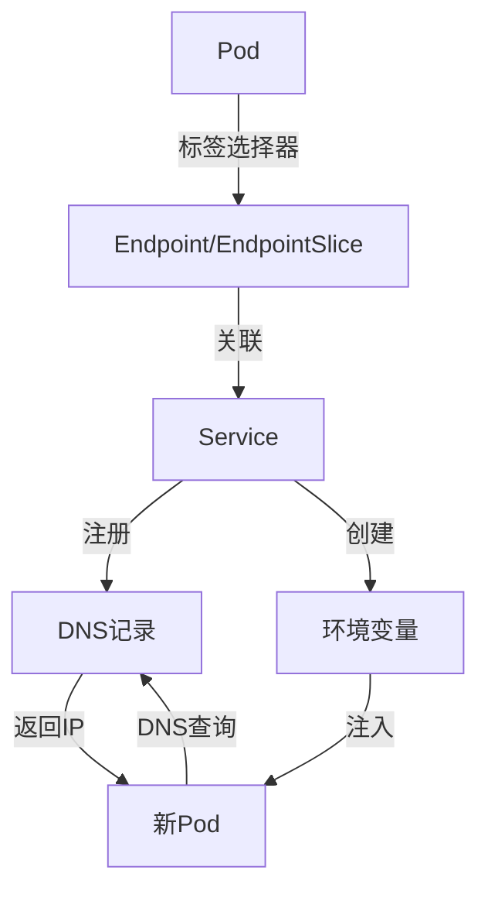
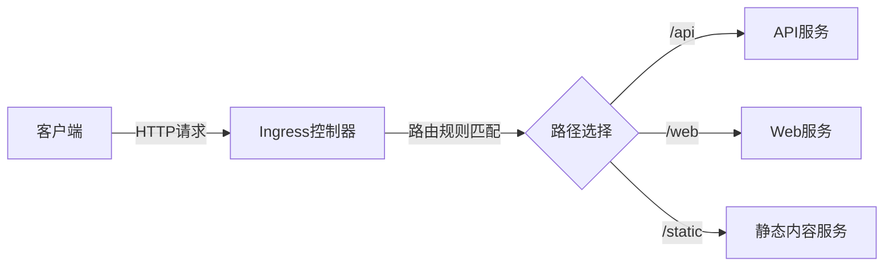
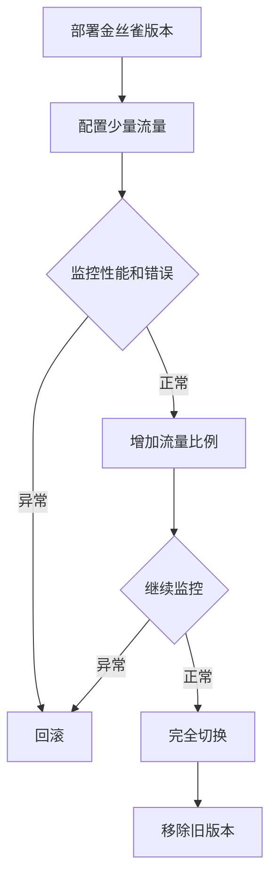

# Service与Ingress网络配置  

在Kubernetes中，Service和Ingress是两个关键的网络资源，它们共同构成了应用的网络访问层。Service提供了集群内部的服务发现和负载均衡功能，而Ingress则管理集群外部的HTTP流量路由。本文将详细介绍这两种资源的概念、配置方法和最佳实践。

## 1. Service核心概念  

Service是Kubernetes中的一个抽象概念，它定义了一组Pod的逻辑集合和访问这些Pod的策略。Service通过标签选择器识别一组Pod，并为这些Pod提供统一的网络入口点，实现了服务发现和负载均衡功能。

### 1.1 服务类型对比  

Kubernetes提供了多种Service类型，每种类型适用于不同的场景：

| 类型          | 作用范围       | 典型场景          | 特点                                |
|---------------|--------------|-----------------|-------------------------------------|
| ClusterIP     | 集群内部       | 服务间通信        | 仅集群内可访问，稳定IP，默认类型       |
| NodePort      | 节点级别       | 开发测试环境      | 通过节点IP+端口访问，端口范围30000-32767|
| LoadBalancer  | 云服务商       | 生产环境暴露服务  | 自动创建外部负载均衡器，需云平台支持    |
| ExternalName  | DNS别名       | 外部服务集成      | 返回CNAME记录，无代理，仅DNS解析      |
| Headless      | 无集群IP       | 有状态服务DNS发现 | 不分配ClusterIP，返回所有Pod的DNS记录 |

**ClusterIP**：
- 默认的Service类型
- 分配一个集群内部的虚拟IP
- 只能在集群内部访问
- 适用于内部微服务通信

**NodePort**：
- 在ClusterIP基础上，在每个节点上开放一个静态端口
- 可通过`<节点IP>:<NodePort>`访问服务
- 端口范围默认为30000-32767
- 适用于开发环境或临时外部访问

**LoadBalancer**：
- 在NodePort基础上，自动创建外部负载均衡器
- 负载均衡器将流量转发到NodePort
- 需要云平台支持
- 适用于生产环境对外暴露服务

**ExternalName**：
- 将服务映射到外部DNS名称
- 不创建任何代理，仅进行DNS CNAME解析
- 适用于集成外部服务

**Headless Service**：
- 不分配ClusterIP（设置`clusterIP: None`）
- DNS查询返回所有Pod的IP地址
- 适用于有状态应用的服务发现

### 1.2 服务发现机制  

Kubernetes的服务发现机制是通过DNS和环境变量实现的：



**服务发现流程**：

1. **创建Service**：
   - 定义Service并指定标签选择器
   - Kubernetes创建一个虚拟IP（ClusterIP）

2. **Endpoint生成**：
   - Endpoint控制器监控Service和Pod
   - 为匹配标签的Pod创建Endpoint对象
   - 较新的集群使用EndpointSlice提高扩展性

3. **DNS记录注册**：
   - CoreDNS监控Service资源
   - 为每个Service创建DNS记录
   - 格式：`<service-name>.<namespace>.svc.cluster.local`

4. **Pod访问服务**：
   - 通过DNS名称访问服务
   - 或使用自动注入的环境变量
   - kube-proxy负责流量转发

**DNS解析规则**：

- **普通Service**：
  - `<service-name>.<namespace>.svc.cluster.local` 解析为Service的ClusterIP

- **Headless Service**：
  - `<service-name>.<namespace>.svc.cluster.local` 解析为所有Pod的IP列表
  - `<pod-name>.<service-name>.<namespace>.svc.cluster.local` 解析为特定Pod的IP

- **StatefulSet Pod**：
  - 每个Pod获得稳定的DNS名称
  - 格式：`<pod-name>.<service-name>.<namespace>.svc.cluster.local`

**环境变量**：
- 格式：`<SERVICE_NAME>_SERVICE_HOST` 和 `<SERVICE_NAME>_SERVICE_PORT`
- 例如：`REDIS_SERVICE_HOST=10.0.0.11` 和 `REDIS_SERVICE_PORT=6379`
- 注意：只能发现在Pod创建前已存在的Service

## 2. Service配置实践  

### 2.1 ClusterIP配置  

ClusterIP是最基本的Service类型，提供集群内部的服务发现和负载均衡：

```yaml:c:\project\kphub\kubernetes\services\clusterip.yaml
apiVersion: v1
kind: Service
metadata:
  name: web-service
  labels:
    app: web
    tier: frontend
spec:
  type: ClusterIP  # 默认类型，可省略
  selector:
    app: web  # 选择标签为app=web的Pod
  ports:
  - name: http  # 端口名称，多端口时必须
    protocol: TCP  # 协议：TCP, UDP, SCTP
    port: 80  # Service暴露的端口
    targetPort: 9376  # Pod上的端口
  sessionAffinity: None  # 会话亲和性
```

**关键字段说明**：

- **selector**：标签选择器，用于选择后端Pod
- **ports**：定义Service端口映射
  - **port**：Service暴露的端口
  - **targetPort**：Pod上的端口（可以是名称或数字）
  - **name**：端口名称（多端口时必须）
  - **protocol**：端口协议（TCP/UDP/SCTP）
- **sessionAffinity**：会话亲和性设置（None/ClientIP）

**多端口配置**：

```yaml:c:\project\kphub\kubernetes\services\multi-port.yaml
apiVersion: v1
kind: Service
metadata:
  name: my-service
spec:
  selector:
    app: MyApp
  ports:
  - name: http
    port: 80
    targetPort: 8080
  - name: https
    port: 443
    targetPort: 8443
```

**使用命名端口**：

```yaml:c:\project\kphub\kubernetes\services\named-port.yaml
# Pod定义中的命名端口
apiVersion: v1
kind: Pod
metadata:
  name: web
  labels:
    app: web
spec:
  containers:
  - name: web
    image: nginx
    ports:
    - name: http-port
      containerPort: 8080
---
# Service引用命名端口
apiVersion: v1
kind: Service
metadata:
  name: web-service
spec:
  selector:
    app: web
  ports:
  - port: 80
    targetPort: http-port  # 引用Pod中的命名端口
```

### 2.2 NodePort配置  

NodePort类型的Service在每个节点上开放一个静态端口，使服务可以从集群外部访问：

```yaml:c:\project\kphub\kubernetes\services\nodeport.yaml
apiVersion: v1
kind: Service
metadata:
  name: web-service
spec:
  type: NodePort
  selector:
    app: web
  ports:
  - port: 80  # 集群内部访问端口
    targetPort: 9376  # Pod端口
    nodePort: 30080  # 节点端口，不指定时自动分配
```

**NodePort特点**：

- 在每个节点上开放相同的端口
- 端口范围默认为30000-32767（可配置）
- 如果不指定nodePort，系统会自动分配一个可用端口
- 可以通过任意节点IP访问：`<节点IP>:<nodePort>`
- 底层仍然创建ClusterIP，集群内部可以通过ClusterIP访问

**访问NodePort服务**：

```powershell
# 获取节点IP
kubectl get nodes -o wide

# 访问NodePort服务
curl http://<节点IP>:30080
```

**NodePort的局限性**：

- 端口范围有限
- 每个服务占用所有节点上的同一个端口
- 节点IP可能变化
- 节点可能位于私有网络中，外部无法直接访问
- 没有内置的负载均衡机制（流量可能集中到某个节点）

### 2.3 LoadBalancer配置  

LoadBalancer类型的Service在云环境中自动创建外部负载均衡器：

```yaml:c:\project\kphub\kubernetes\services\loadbalancer.yaml
apiVersion: v1
kind: Service
metadata:
  name: web-service
  annotations:
    service.beta.kubernetes.io/azure-load-balancer-internal: "true"
    service.beta.kubernetes.io/azure-load-balancer-internal-subnet: "internal-subnet"
spec:
  type: LoadBalancer
  selector:
    app: web
  ports:
  - port: 80
    targetPort: 9376
  loadBalancerIP: 10.0.0.100  # 指定负载均衡器IP（如果支持）
  externalTrafficPolicy: Local  # 流量路由策略
```

**LoadBalancer特点**：

- 自动创建外部负载均衡器（依赖云提供商）
- 负载均衡器将流量分发到各节点
- 自动分配外部IP地址
- 底层仍然创建NodePort和ClusterIP

**关键配置参数**：

- **loadBalancerIP**：指定负载均衡器IP（如果云提供商支持）
- **loadBalancerSourceRanges**：限制可访问的源IP范围
- **externalTrafficPolicy**：
  - **Cluster**（默认）：可能导致额外跳转，但分布更均匀
  - **Local**：保留客户端源IP，直接转发到本地Pod，但可能分布不均

**云提供商特定注解**：

不同的云提供商支持通过注解（annotations）配置负载均衡器的特性：

```yaml
metadata:
  annotations:
    # Azure特定配置
    service.beta.kubernetes.io/azure-load-balancer-internal: "true"
    
    # AWS特定配置
    service.beta.kubernetes.io/aws-load-balancer-type: "nlb"
    service.beta.kubernetes.io/aws-load-balancer-ssl-cert: "arn:aws:acm:..."
    
    # GCP特定配置
    cloud.google.com/neg: '{"ingress": true}'
```

### 2.4 Headless Service配置  

Headless Service不分配ClusterIP，用于直接访问后端Pod：

```yaml:c:\project\kphub\kubernetes\services\headless.yaml
apiVersion: v1
kind: Service
metadata:
  name: mysql
spec:
  clusterIP: None  # 定义为Headless Service
  selector:
    app: mysql
  ports:
  - port: 3306
    targetPort: 3306
```

**Headless Service特点**：

- 不分配ClusterIP（设置`clusterIP: None`）
- DNS查询返回所有Pod的IP地址
- 客户端负责选择要连接的Pod
- 常用于StatefulSet的服务发现

**与StatefulSet结合使用**：

```yaml:c:\project\kphub\kubernetes\services\statefulset-headless.yaml
apiVersion: v1
kind: Service
metadata:
  name: mysql
spec:
  clusterIP: None
  selector:
    app: mysql
  ports:
  - port: 3306
---
apiVersion: apps/v1
kind: StatefulSet
metadata:
  name: mysql
spec:
  serviceName: mysql  # 关联Headless Service
  replicas: 3
  selector:
    matchLabels:
      app: mysql
  template:
    metadata:
      labels:
        app: mysql
    spec:
      containers:
      - name: mysql
        image: mysql:5.7
```

**DNS解析行为**：

- 查询Service DNS：`mysql.default.svc.cluster.local`
  - 返回所有Pod的IP地址列表

- 查询特定Pod：`mysql-0.mysql.default.svc.cluster.local`
  - 返回特定Pod的IP地址

## 3. Ingress详解  

Ingress是Kubernetes中管理外部访问集群内服务的API对象，主要用于HTTP和HTTPS流量路由。它提供了负载均衡、SSL终止和基于名称的虚拟主机等功能。

### 3.1 基本路由配置  

基本的Ingress配置示例：

```yaml:c:\project\kphub\kubernetes\ingress\basic.yaml
apiVersion: networking.k8s.io/v1
kind: Ingress
metadata:
  name: example-ingress
  annotations:
    nginx.ingress.kubernetes.io/rewrite-target: /
spec:
  rules:
  - host: example.com  # 主机名
    http:
      paths:
      - path: /  # 路径
        pathType: Prefix  # 路径类型
        backend:
          service:
            name: web-service  # 后端服务
            port:
              number: 80  # 服务端口
```

**关键字段说明**：

- **rules**：定义主机和路径规则
  - **host**：请求的主机名（可选）
  - **paths**：URL路径列表
    - **path**：URL路径
    - **pathType**：路径匹配类型
      - **Exact**：精确匹配
      - **Prefix**：前缀匹配
      - **ImplementationSpecific**：由Ingress控制器定义
    - **backend**：后端服务配置

**Ingress工作原理**：



**注意事项**：

- Ingress本身不提供流量路由功能，需要配合Ingress控制器使用
- 常用的Ingress控制器包括：Nginx、Traefik、HAProxy、Kong等
- 不同的Ingress控制器支持不同的注解和功能

### 3.2 多路径路由  

Ingress可以根据URL路径将流量路由到不同的后端服务：

```yaml:c:\project\kphub\kubernetes\ingress\multi-path.yaml
apiVersion: networking.k8s.io/v1
kind: Ingress
metadata:
  name: multi-path-ingress
spec:
  rules:
  - host: example.com
    http:
      paths:
      - path: /
        pathType: Prefix
        backend:
          service:
            name: web-service
            port:
              number: 80
      - path: /api
        pathType: Prefix
        backend:
          service:
            name: api-service
            port:
              number: 8080
      - path: /static
        pathType: Prefix
        backend:
          service:
            name: static-service
            port:
              number: 80
```

**路径重写**：

许多Ingress控制器支持通过注解进行路径重写：

```yaml:c:\project\kphub\kubernetes\ingress\path-rewrite.yaml
apiVersion: networking.k8s.io/v1
kind: Ingress
metadata:
  name: rewrite-ingress
  annotations:
    nginx.ingress.kubernetes.io/rewrite-target: /$2
spec:
  rules:
  - host: example.com
    http:
      paths:
      - path: /api(/|$)(.*)
        pathType: Prefix
        backend:
          service:
            name: api-service
            port:
              number: 8080
```

在上面的例子中，请求`/api/users`会被重写为`/users`再转发给后端服务。

### 3.3 基于名称的虚拟主机  

Ingress可以根据主机名将流量路由到不同的后端服务：

```yaml:c:\project\kphub\kubernetes\ingress\name-based.yaml
apiVersion: networking.k8s.io/v1
kind: Ingress
metadata:
  name: name-based-ingress
spec:
  rules:
  - host: app1.example.com
    http:
      paths:
      - path: /
        pathType: Prefix
        backend:
          service:
            name: app1-service
            port:
              number: 80
  - host: app2.example.com
    http:
      paths:
      - path: /
        pathType: Prefix
        backend:
          service:
            name: app2-service
            port:
              number: 80
```

**默认后端**：

可以配置默认后端，处理不匹配任何规则的请求：

```yaml:c:\project\kphub\kubernetes\ingress\default-backend.yaml
apiVersion: networking.k8s.io/v1
kind: Ingress
metadata:
  name: ingress-with-default
spec:
  defaultBackend:
    service:
      name: default-service
      port:
        number: 80
  rules:
  - host: example.com
    http:
      paths:
      - path: /api
        pathType: Prefix
        backend:
          service:
            name: api-service
            port:
              number: 8080
```

## 4. 流量管理  

### 4.1 负载均衡策略  

Kubernetes提供了多种负载均衡策略，可以通过Service和Ingress配置：

**Service负载均衡**：

Service默认使用轮询（Round Robin）算法进行负载均衡，这是由kube-proxy实现的。

```yaml:c:\project\kphub\kubernetes\services\lb-policy.yaml
apiVersion: v1
kind: Service
metadata:
  name: web-service
  annotations:
    # 云提供商特定的负载均衡器类型
    service.beta.kubernetes.io/aws-load-balancer-type: "nlb"
    # 内部或外部负载均衡器
    service.beta.kubernetes.io/azure-load-balancer-internal: "true"
spec:
  type: LoadBalancer
  # 外部流量策略
  externalTrafficPolicy: Local  # Local或Cluster
  # 内部流量策略（Kubernetes v1.22+）
  internalTrafficPolicy: Local  # Local或Cluster
  selector:
    app: web
  ports:
  - port: 80
    targetPort: 8080
```

**externalTrafficPolicy选项**：

- **Cluster**（默认）：
  - 将外部流量分发到所有节点上的Pod
  - 可能导致额外的网络跳转
  - 客户端源IP可能丢失
  - 负载分布更均匀

- **Local**：
  - 将外部流量只分发到本地节点上的Pod
  - 避免额外的网络跳转
  - 保留客户端源IP
  - 负载可能分布不均匀
  - 如果节点上没有对应Pod，连接会失败

**Ingress控制器负载均衡**：

不同的Ingress控制器支持不同的负载均衡算法，通常通过注解配置：

```yaml:c:\project\kphub\kubernetes\ingress\lb-algorithm.yaml
apiVersion: networking.k8s.io/v1
kind: Ingress
metadata:
  name: balanced-ingress
  annotations:
    # Nginx Ingress控制器负载均衡算法
    nginx.ingress.kubernetes.io/load-balance: "ewma"  # round_robin, least_conn, ip_hash, ewma
    # 连接限制
    nginx.ingress.kubernetes.io/limit-connections: "100"
    # 速率限制
    nginx.ingress.kubernetes.io/limit-rps: "50"
spec:
  rules:
  - host: example.com
    http:
      paths:
      - path: /
        pathType: Prefix
        backend:
          service:
            name: web-service
            port:
              number: 80
```

**常见负载均衡算法**：

1. **Round Robin**（轮询）：
   - 依次将请求分配给后端服务器
   - 简单且公平，适用于大多数场景

2. **Least Connections**（最少连接）：
   - 将请求发送到当前连接数最少的服务器
   - 适用于长连接场景

3. **IP Hash**（IP哈希）：
   - 基于客户端IP地址的哈希值选择服务器
   - 确保同一客户端总是被路由到同一服务器
   - 实现简单的会话保持

4. **EWMA**（指数加权移动平均）：
   - 基于服务器响应时间动态调整权重
   - 适用于性能不均衡的后端服务

### 4.2 会话保持配置  

会话保持（Session Affinity）确保来自同一客户端的请求总是被路由到同一个Pod：

**Service会话保持**：

```yaml:c:\project\kphub\kubernetes\services\session-affinity.yaml
apiVersion: v1
kind: Service
metadata:
  name: web-service
spec:
  selector:
    app: web
  ports:
  - port: 80
    targetPort: 8080
  # 启用基于客户端IP的会话保持
  sessionAffinity: ClientIP
  # 会话保持超时时间
  sessionAffinityConfig:
    clientIP:
      timeoutSeconds: 3600  # 默认为10800秒（3小时）
```

**Ingress会话保持**：

不同的Ingress控制器提供不同的会话保持机制：

```yaml:c:\project\kphub\kubernetes\ingress\session-affinity.yaml
apiVersion: networking.k8s.io/v1
kind: Ingress
metadata:
  name: sticky-ingress
  annotations:
    # Nginx Ingress控制器会话保持
    nginx.ingress.kubernetes.io/affinity: "cookie"
    nginx.ingress.kubernetes.io/session-cookie-name: "INGRESSCOOKIE"
    nginx.ingress.kubernetes.io/session-cookie-expires: "172800"
    nginx.ingress.kubernetes.io/session-cookie-max-age: "172800"
spec:
  rules:
  - host: example.com
    http:
      paths:
      - path: /
        pathType: Prefix
        backend:
          service:
            name: web-service
            port:
              number: 80
```

**会话保持方法**：

1. **基于客户端IP**：
   - 简单，不需要客户端支持
   - 不适用于经过代理或NAT的客户端
   - 客户端IP变化会导致会话丢失

2. **基于Cookie**：
   - 更可靠，不依赖客户端IP
   - 需要客户端支持Cookie
   - 可以设置过期时间
   - 适用于Web应用

3. **应用层会话管理**：
   - 使用分布式缓存（如Redis）存储会话数据
   - 所有Pod可以访问相同的会话数据
   - 不依赖网络层会话保持
   - 更灵活，但需要应用支持

### 4.3 流量分割与蓝绿部署  

Ingress可以用于实现流量分割、蓝绿部署和金丝雀发布：

**流量分割（金丝雀发布）**：

```yaml:c:\project\kphub\kubernetes\ingress\canary.yaml
# 主要版本Ingress
apiVersion: networking.k8s.io/v1
kind: Ingress
metadata:
  name: main-ingress
spec:
  rules:
  - host: example.com
    http:
      paths:
      - path: /
        pathType: Prefix
        backend:
          service:
            name: main-service
            port:
              number: 80
---
# 金丝雀版本Ingress
apiVersion: networking.k8s.io/v1
kind: Ingress
metadata:
  name: canary-ingress
  annotations:
    nginx.ingress.kubernetes.io/canary: "true"
    nginx.ingress.kubernetes.io/canary-weight: "20"  # 20%的流量
spec:
  rules:
  - host: example.com
    http:
      paths:
      - path: /
        pathType: Prefix
        backend:
          service:
            name: canary-service
            port:
              number: 80
```

**基于Header的流量分割**：

```yaml:c:\project\kphub\kubernetes\ingress\header-based.yaml
apiVersion: networking.k8s.io/v1
kind: Ingress
metadata:
  name: header-based-canary
  annotations:
    nginx.ingress.kubernetes.io/canary: "true"
    nginx.ingress.kubernetes.io/canary-by-header: "X-Canary"
    nginx.ingress.kubernetes.io/canary-by-header-value: "true"
spec:
  rules:
  - host: example.com
    http:
      paths:
      - path: /
        pathType: Prefix
        backend:
          service:
            name: canary-service
            port:
              number: 80
```

**蓝绿部署**：

蓝绿部署可以通过切换Ingress后端服务实现：

```yaml:c:\project\kphub\kubernetes\ingress\blue-green.yaml
# 蓝环境Service
apiVersion: v1
kind: Service
metadata:
  name: app-blue
spec:
  selector:
    app: myapp
    version: blue
  ports:
  - port: 80
    targetPort: 8080
---
# 绿环境Service
apiVersion: v1
kind: Service
metadata:
  name: app-green
spec:
  selector:
    app: myapp
    version: green
  ports:
  - port: 80
    targetPort: 8080
---
# Ingress（指向当前活动环境）
apiVersion: networking.k8s.io/v1
kind: Ingress
metadata:
  name: app-ingress
spec:
  rules:
  - host: example.com
    http:
      paths:
      - path: /
        pathType: Prefix
        backend:
          service:
            name: app-blue  # 切换到绿环境时改为app-green
            port:
              number: 80
```

## 5. TLS安全配置  

### 5.1 证书管理  

Ingress支持TLS终止，可以配置HTTPS访问：

```yaml:c:\project\kphub\kubernetes\ingress\tls.yaml
apiVersion: networking.k8s.io/v1
kind: Ingress
metadata:
  name: secure-ingress
spec:
  tls:
  - hosts:
    - example.com
    - www.example.com
    secretName: example-tls  # 包含证书和私钥的Secret
  rules:
  - host: example.com
    http:
      paths:
      - path: /
        pathType: Prefix
        backend:
          service:
            name: web-service
            port:
              number: 80
  - host: www.example.com
    http:
      paths:
      - path: /
        pathType: Prefix
        backend:
          service:
            name: web-service
            port:
              number: 80
```

**TLS Secret格式**：

TLS Secret必须包含名为`tls.crt`和`tls.key`的键：
- `tls.crt`：PEM格式的证书（或证书链）
- `tls.key`：PEM格式的私钥

### 5.2 证书创建命令  

**手动创建自签名证书**：

```powershell
# 生成私钥
openssl genrsa -out c:\project\kphub\kubernetes\certs\tls.key 2048

# 生成自签名证书
openssl req -new -x509 -key c:\project\kphub\kubernetes\certs\tls.key -out c:\project\kphub\kubernetes\certs\tls.crt -days 365 -subj "/CN=example.com"

# 创建Kubernetes Secret
kubectl
继续完成Service与Ingress网络配置文档：

### 5.2 证书创建命令  

**手动创建自签名证书**：

```powershell
# 生成私钥
openssl genrsa -out c:\project\kphub\kubernetes\certs\tls.key 2048

# 生成自签名证书
openssl req -new -x509 -key c:\project\kphub\kubernetes\certs\tls.key -out c:\project\kphub\kubernetes\certs\tls.crt -days 365 -subj "/CN=example.com"

# 创建Kubernetes Secret
kubectl create secret tls example-tls --key=c:\project\kphub\kubernetes\certs\tls.key --cert=c:\project\kphub\kubernetes\certs\tls.crt
```

**使用cert-manager自动管理证书**：

```yaml:c:\project\kphub\kubernetes\cert-manager\issuer.yaml
apiVersion: cert-manager.io/v1
kind: ClusterIssuer
metadata:
  name: letsencrypt-prod
spec:
  acme:
    server: https://acme-v02.api.letsencrypt.org/directory
    email: admin@example.com
    privateKeySecretRef:
      name: letsencrypt-prod
    solvers:
    - http01:
        ingress:
          class: nginx
```

**使用cert-manager自动获取证书**：

```yaml:c:\project\kphub\kubernetes\ingress\cert-manager.yaml
apiVersion: networking.k8s.io/v1
kind: Ingress
metadata:
  name: secured-ingress
  annotations:
    cert-manager.io/cluster-issuer: "letsencrypt-prod"
spec:
  tls:
  - hosts:
    - example.com
    secretName: example-tls-cert
  rules:
  - host: example.com
    http:
      paths:
      - path: /
        pathType: Prefix
        backend:
          service:
            name: web-service
            port:
              number: 80
```

### 5.3 TLS配置最佳实践

**安全配置建议**：

```yaml:c:\project\kphub\kubernetes\ingress\secure-config.yaml
apiVersion: networking.k8s.io/v1
kind: Ingress
metadata:
  name: secure-ingress
  annotations:
    # 强制HTTPS重定向
    nginx.ingress.kubernetes.io/ssl-redirect: "true"
    # 设置HSTS头
    nginx.ingress.kubernetes.io/hsts: "true"
    nginx.ingress.kubernetes.io/hsts-max-age: "31536000"
    nginx.ingress.kubernetes.io/hsts-include-subdomains: "true"
    # 配置TLS版本和密码套件
    nginx.ingress.kubernetes.io/ssl-protocols: "TLSv1.2 TLSv1.3"
    nginx.ingress.kubernetes.io/ssl-ciphers: "HIGH:!aNULL:!MD5"
spec:
  tls:
  - hosts:
    - secure.example.com
    secretName: secure-tls
  rules:
  - host: secure.example.com
    http:
      paths:
      - path: /
        pathType: Prefix
        backend:
          service:
            name: web-service
            port:
              number: 80
```

**TLS安全最佳实践**：

1. **使用最新的TLS版本**：
   - 启用TLSv1.2和TLSv1.3
   - 禁用旧版本（TLSv1.0和TLSv1.1）

2. **配置强密码套件**：
   - 优先使用AEAD密码（如AES-GCM）
   - 禁用弱密码和不安全算法

3. **启用HSTS**：
   - 强制客户端使用HTTPS
   - 设置适当的max-age（至少一年）
   - 考虑包含子域

4. **证书管理**：
   - 使用可信CA签发的证书
   - 配置证书自动更新
   - 监控证书过期时间

5. **定期轮换密钥**：
   - 定期更新TLS私钥
   - 使用足够长的密钥（RSA 2048位以上）

## 6. 生产实践  

### 6.1 Ingress控制器部署  

Ingress资源本身不提供路由功能，需要部署Ingress控制器：

**使用Helm部署Nginx Ingress控制器**：

```powershell
# 添加Helm仓库
helm repo add ingress-nginx https://kubernetes.github.io/ingress-nginx
helm repo update

# 安装Nginx Ingress控制器
helm install nginx-ingress ingress-nginx/ingress-nginx `
  --namespace ingress-nginx `
  --create-namespace `
  --set controller.replicaCount=2 `
  --set controller.nodeSelector."kubernetes\.io/os"=linux `
  --set controller.admissionWebhooks.enabled=true `
  --set controller.metrics.enabled=true
```

**Nginx Ingress控制器的YAML部署**：

```yaml:c:\project\kphub\kubernetes\ingress-controller\nginx-ingress.yaml
apiVersion: apps/v1
kind: Deployment
metadata:
  name: nginx-ingress-controller
  namespace: ingress-nginx
spec:
  replicas: 2
  selector:
    matchLabels:
      app: nginx-ingress
  template:
    metadata:
      labels:
        app: nginx-ingress
    spec:
      serviceAccountName: nginx-ingress-serviceaccount
      containers:
      - name: nginx-ingress-controller
        image: k8s.gcr.io/ingress-nginx/controller:v1.2.0
        args:
        - /nginx-ingress-controller
        - --publish-service=ingress-nginx/nginx-ingress
        - --election-id=ingress-controller-leader
        - --ingress-class=nginx
        - --configmap=ingress-nginx/nginx-configuration
        ports:
        - name: http
          containerPort: 80
        - name: https
          containerPort: 443
        resources:
          requests:
            cpu: 100m
            memory: 90Mi
          limits:
            cpu: 1
            memory: 1Gi
---
apiVersion: v1
kind: Service
metadata:
  name: nginx-ingress
  namespace: ingress-nginx
spec:
  type: LoadBalancer
  ports:
  - port: 80
    targetPort: 80
    name: http
  - port: 443
    targetPort: 443
    name: https
  selector:
    app: nginx-ingress
```

**Ingress控制器高可用配置**：

1. **多副本部署**：
   - 至少部署2个副本
   - 使用Pod反亲和性分散到不同节点

2. **资源配置**：
   - 设置适当的资源请求和限制
   - 监控资源使用情况

3. **监控与告警**：
   - 启用指标收集
   - 配置关键指标告警

4. **配置持久化**：
   - 使用ConfigMap存储配置
   - 避免重启时丢失配置

### 6.2 灰度发布配置  

灰度发布（金丝雀发布）允许逐步将流量迁移到新版本：

```yaml:c:\project\kphub\kubernetes\ingress\canary-deployment.yaml
# 主要版本Service和Deployment
apiVersion: v1
kind: Service
metadata:
  name: app-main
spec:
  selector:
    app: myapp
    version: stable
  ports:
  - port: 80
    targetPort: 8080
---
apiVersion: apps/v1
kind: Deployment
metadata:
  name: app-main
spec:
  replicas: 5
  selector:
    matchLabels:
      app: myapp
      version: stable
  template:
    metadata:
      labels:
        app: myapp
        version: stable
    spec:
      containers:
      - name: app
        image: myapp:1.0
---
# 金丝雀版本Service和Deployment
apiVersion: v1
kind: Service
metadata:
  name: app-canary
spec:
  selector:
    app: myapp
    version: canary
  ports:
  - port: 80
    targetPort: 8080
---
apiVersion: apps/v1
kind: Deployment
metadata:
  name: app-canary
spec:
  replicas: 1
  selector:
    matchLabels:
      app: myapp
      version: canary
  template:
    metadata:
      labels:
        app: myapp
        version: canary
    spec:
      containers:
      - name: app
        image: myapp:1.1
---
# 主Ingress
apiVersion: networking.k8s.io/v1
kind: Ingress
metadata:
  name: app-main-ingress
spec:
  rules:
  - host: myapp.example.com
    http:
      paths:
      - path: /
        pathType: Prefix
        backend:
          service:
            name: app-main
            port:
              number: 80
---
# 金丝雀Ingress
apiVersion: networking.k8s.io/v1
kind: Ingress
metadata:
  name: app-canary-ingress
  annotations:
    nginx.ingress.kubernetes.io/canary: "true"
    nginx.ingress.kubernetes.io/canary-weight: "20"
spec:
  rules:
  - host: myapp.example.com
    http:
      paths:
      - path: /
        pathType: Prefix
        backend:
          service:
            name: app-canary
            port:
              number: 80
```

**灰度发布策略**：

1. **基于权重**：
   - 设置流量百分比（如20%）
   - 逐步增加权重直到100%
   - 适用于随机分配流量

2. **基于Header**：
   - 使用特定Header标识测试流量
   - 适用于内部测试和特定用户群体

3. **基于Cookie**：
   - 使用Cookie标识用户
   - 确保用户体验一致性

4. **基于源IP**：
   - 根据客户端IP地址路由流量
   - 适用于地理位置相关测试

**灰度发布流程**：



### 6.3 服务网格集成

服务网格（如Istio、Linkerd）提供更高级的流量管理功能：

```yaml:c:\project\kphub\kubernetes\istio\virtual-service.yaml
apiVersion: networking.istio.io/v1alpha3
kind: VirtualService
metadata:
  name: reviews
spec:
  hosts:
  - reviews
  http:
  - match:
    - headers:
        end-user:
          exact: jason
    route:
    - destination:
        host: reviews
        subset: v2
  - route:
    - destination:
        host: reviews
        subset: v1
```

**服务网格优势**：

1. **高级流量管理**：
   - 细粒度流量控制
   - 请求重试和超时
   - 断路器和故障注入

2. **安全增强**：
   - 服务间mTLS加密
   - 身份验证和授权
   - 证书自动轮换

3. **可观测性**：
   - 分布式追踪
   - 详细的流量指标
   - 服务依赖可视化

## 7. 问题排查  

### 7.1 网络诊断命令  

排查Service和Ingress问题的常用命令：

```powershell
# 检查Service状态
kubectl get service <service-name>

# 查看Service详情
kubectl describe service <service-name>

# 检查Endpoint状态
kubectl get endpoints <service-name>

# 查看Pod标签（确认是否匹配Service选择器）
kubectl get pods --show-labels

# 检查Ingress状态
kubectl get ingress <ingress-name>

# 查看Ingress详情
kubectl describe ingress <ingress-name>

# 检查Ingress控制器日志
kubectl logs -n ingress-nginx deployment/nginx-ingress-controller

# 测试服务连通性
kubectl run -it --rm test --image=busybox -- wget -qO- <service-name>

# 检查DNS解析
kubectl run -it --rm test --image=busybox -- nslookup <service-name>

# 查看Service的iptables规则（需要在节点上运行）
iptables-save | grep <service-name>
```

**网络诊断工具Pod**：

```yaml:c:\project\kphub\kubernetes\troubleshooting\network-debug.yaml
apiVersion: v1
kind: Pod
metadata:
  name: network-debug
spec:
  containers:
  - name: network-debug
    image: nicolaka/netshoot
    command:
    - sleep
    - "3600"
```

部署后可以使用以下命令进入Pod进行网络诊断：

```powershell
kubectl exec -it network-debug -- bash

# 在Pod内部可以使用各种网络工具
# curl, wget, dig, nslookup, tcpdump, netstat, ping, traceroute等
```

### 7.2 常见问题处理  

**Service相关问题**：

1. **Service无法访问**：
   ```text
   问题：无法通过Service名称访问Pod
   
   可能原因：
   - 标签选择器不匹配
   - Pod未就绪
   - 端口配置错误
   - kube-proxy问题
   - DNS问题
   
   排查步骤：
   1. 检查Service和Pod标签是否匹配：
      kubectl get pods --show-labels
      kubectl describe service <service-name>
   
   2. 检查Endpoint是否存在：
      kubectl get endpoints <service-name>
   
   3. 检查Pod是否就绪：
      kubectl get pods -l <selector>
   
   4. 检查端口配置：
      kubectl describe service <service-name>
      kubectl describe pod <pod-name>
   
   5. 直接访问Pod IP测试：
      kubectl get pods -o wide
      kubectl run -it --rm test --image=busybox -- wget -qO- <pod-ip>:<port>
   
   6. 检查DNS解析：
      kubectl run -it --rm test --image=busybox -- nslookup <service-name>
   
   7. 检查kube-proxy日志：
      kubectl logs -n kube-system -l k8s-app=kube-proxy
   ```

2. **NodePort无法访问**：
   ```text
   问题：无法通过NodePort访问服务
   
   可能原因：
   - 防火墙规则阻止
   - 安全组配置
   - 节点网络问题
   - Service配置错误
   
   排查步骤：
   1. 确认NodePort端口：
      kubectl get service <service-name>
   
   2. 检查节点防火墙规则：
      - Windows: Get-NetFirewallRule | Where-Object {$_.Name -like "*<port>*"}
      - 云平台: 检查安全组配置
   
   3. 在节点本地测试：
      curl localhost:<nodePort>
   
   4. 检查kube-proxy配置：
      kubectl describe configmap -n kube-system kube-proxy
   
   5. 检查iptables规则（Linux节点）：
      iptables-save | grep <nodePort>
   ```

**Ingress相关问题**：

1. **Ingress路由不生效**：
   ```text
   问题：Ingress配置后无法访问服务
   
   可能原因：
   - Ingress控制器未部署
   - Ingress类型不匹配
   - 后端Service问题
   - 主机名配置错误
   - TLS配置问题
   
   排查步骤：
   1. 检查Ingress控制器是否运行：
      kubectl get pods -n ingress-nginx
   
   2. 检查Ingress状态：
      kubectl describe ingress <ingress-name>
   
   3. 检查Ingress控制器日志：
      kubectl logs -n ingress-nginx deployment/nginx-ingress-controller
   
   4. 验证后端Service是否正常：
      kubectl get service <service-name>
      kubectl get endpoints <service-name>
   
   5. 检查Ingress类型：
      kubectl get ingress <ingress-name> -o yaml | grep "kubernetes.io/ingress.class"
   
   6. 直接访问Service测试：
      kubectl run -it --rm test --image=busybox -- wget -qO- <service-name>
   
   7. 检查DNS解析（如果使用主机名）：
      nslookup <hostname>
   ```

2. **TLS/HTTPS问题**：
   ```text
   问题：HTTPS访问失败或证书错误
   
   可能原因：
   - 证书配置错误
   - 证书过期
   - Secret不存在
   - 主机名不匹配
   
   排查步骤：
   1. 检查Secret是否存在：
      kubectl get secret <secret-name>
   
   2. 验证证书内容：
      kubectl get secret <secret-name> -o jsonpath='{.data.tls\.crt}' | base64 --decode | openssl x509 -text
   
   3. 检查证书有效期：
      kubectl get secret <secret-name> -o jsonpath='{.data.tls\.crt}' | base64 --decode | openssl x509 -noout -dates
   
   4. 确认证书主机名：
      kubectl get secret <secret-name> -o jsonpath='{.data.tls\.crt}' | base64 --decode | openssl x509 -noout -subject
   
   5. 检查Ingress TLS配置：
      kubectl get ingress <ingress-name> -o yaml
   
   6. 使用OpenSSL测试HTTPS连接：
      openssl s_client -connect <ingress-ip>:443 -servername <hostname>
   ```

### 7.3 性能优化

**Service性能优化**：

1. **会话亲和性**：
   - 仅在必要时启用会话亲和性
   - 会话亲和性会增加kube-proxy的负载

2. **外部流量策略**：
   - 使用`externalTrafficPolicy: Local`减少额外跳转
   - 但要注意负载分布可能不均匀

3. **连接追踪**：
   - 调整连接追踪限制以支持高并发连接
   - 监控conntrack表使用情况

**Ingress性能优化**：

```yaml:c:\project\kphub\kubernetes\ingress\performance.yaml
apiVersion: networking.k8s.io/v1
kind: Ingress
metadata:
  name: optimized-ingress
  annotations:
    nginx.ingress.kubernetes.io/proxy-body-size: "10m"
    nginx.ingress.kubernetes.io/proxy-connect-timeout: "30"
    nginx.ingress.kubernetes.io/proxy-send-timeout: "60"
    nginx.ingress.kubernetes.io/proxy-read-timeout: "60"
    nginx.ingress.kubernetes.io/proxy-buffers-number: "4"
    nginx.ingress.kubernetes.io/proxy-buffer-size: "8k"
    nginx.ingress.kubernetes.io/ssl-session-cache: "true"
    nginx.ingress.kubernetes.io/ssl-session-tickets: "true"
    nginx.ingress.kubernetes.io/upstream-keepalive-connections: "100"
    nginx.ingress.kubernetes.io/use-gzip: "true"
    nginx.ingress.kubernetes.io/gzip-min-length: "1000"
    nginx.ingress.kubernetes.io/gzip-types: "text/plain text/css application/javascript application/json application/xml"
spec:
  rules:
  - host: performance.example.com
    http:
      paths:
      - path: /
        pathType: Prefix
        backend:
          service:
            name: web-service
            port:
              number: 80
```

**性能优化最佳实践**：

1. **资源配置**：
   - 为Ingress控制器分配足够资源
   - 监控CPU和内存使用情况

2. **连接优化**：
   - 启用HTTP/2
   - 配置适当的keepalive参数
   - 启用SSL会话缓存

3. **缓存和压缩**：
   - 启用gzip压缩
   - 配置适当的缓存策略
   - 使用CDN分担静态内容负载

4. **超时设置**：
   - 配置合理的连接、读取和发送超时
   - 避免过长的超时导致资源耗尽

5. **监控与扩展**：
   - 监控关键指标（连接数、延迟、错误率）
   - 根据负载自动扩展Ingress控制器

## 8. 高级场景与模式  

### 8.1 多集群服务发现  

在多集群环境中实现服务发现：

```yaml:c:\project\kphub\kubernetes\multi-cluster\service-export.yaml
# 在集群A中导出服务
apiVersion: multicluster.x-k8s.io/v1alpha1
kind: ServiceExport
metadata:
  name: web-service
  namespace: default
---
# 在集群B中导入服务
apiVersion: multicluster.x-k8s.io/v1alpha1
kind: ServiceImport
metadata:
  name: web-service
  namespace: default
spec:
  type: ClusterSetIP
  ports:
  - port: 80
    protocol: TCP
```

**多集群服务发现方案**：

1. **Kubernetes Federation**：
   - 提供跨集群资源管理
   - 支持服务发现和DNS集成

2. **Istio多集群**：
   - 使用Istio控制平面连接多个集群
   - 提供统一的服务网格

3. **Submariner**：
   - 专注于多集群网络连接
   - 支持跨集群服务发现和网络策略

### 8.2 ExternalName与外部服务集成  

使用ExternalName类型的Service集成外部服务：

```yaml:c:\project\kphub\kubernetes\services\external-name.yaml
apiVersion: v1
kind: Service
metadata:
  name: external-database
spec:
  type: ExternalName
  externalName: database.example.com
  ports:
  - port: 3306
```

**外部服务集成方法**：

1. **ExternalName**：
   - 简单的DNS CNAME映射
   - 不提供负载均衡或健康检查

2. **无选择器Service + Endpoints**：
   ```yaml:c:\project\kphub\kubernetes\services\external-endpoints.yaml
   apiVersion: v1
   kind: Service
   metadata:
     name: external-service
   spec:
     ports:
     - port: 80
       targetPort: 80
   ---
   apiVersion: v1
   kind: Endpoints
   metadata:
     name: external-service
   subsets:
   - addresses:
     - ip: 192.168.1.100
     - ip: 192.168.1.101
     ports:
     - port: 80
     ```

3. **EndpointSlice**（Kubernetes v1.17+）：
   ```yaml:c:\project\kphub\kubernetes\services\endpoint-slice.yaml
   apiVersion: discovery.k8s.io/v1
   kind: EndpointSlice
   metadata:
     name: external-service-1
     labels:
       kubernetes.io/service-name: external-service
   addressType: IPv4
   ports:
   - name: http
     protocol: TCP
     port: 80
   endpoints:
   - addresses:
     - 192.168.1.100
     - 192.168.1.101
     conditions:
       ready: true
   ```

### 8.3 自定义Ingress控制器配置  

通过ConfigMap自定义Ingress控制器配置：

```yaml:c:\project\kphub\kubernetes\ingress-controller\custom-config.yaml
apiVersion: v1
kind: ConfigMap
metadata:
  name: nginx-configuration
  namespace: ingress-nginx
data:
  proxy-body-size: "50m"
  proxy-connect-timeout: "10"
  proxy-read-timeout: "120"
  proxy-send-timeout: "120"
  server-tokens: "false"
  ssl-protocols: "TLSv1.2 TLSv1.3"
  use-forwarded-headers: "true"
  enable-brotli: "true"
  http2: "true"
  keep-alive: "75"
  keep-alive-requests: "100"
  log-format-upstream: '{"time": "$time_iso8601", "remote_addr": "$remote_addr", "request_id": "$req_id", "request": "$request", "status": $status, "bytes_sent": $bytes_sent, "request_time": $request_time, "upstream_addr": "$upstream_addr", "upstream_status": "$upstream_status", "upstream_response_time": "$upstream_response_time"}'
```

**自定义Nginx模板**：

```yaml:c:\project\kphub\kubernetes\ingress-controller\custom-template.yaml
apiVersion: v1
kind: ConfigMap
metadata:
  name: nginx-template
  namespace: ingress-nginx
data:
  nginx.tmpl: |
    # 自定义Nginx配置模板
    http {
      # 全局HTTP配置
      
      # 自定义日志格式
      log_format json_combined '{"time": "$time_iso8601", ...}';
      
      # 其他自定义配置
      
      # 包含默认模板的其余部分
      {{ template "http" . }}
    }
```

## 总结

Service和Ingress是Kubernetes网络架构中的关键组件，它们共同提供了服务发现、负载均衡和流量路由功能。

Service提供了集群内部的服务发现和负载均衡，支持多种类型以满足不同场景的需求：ClusterIP用于集群内部通信，NodePort和LoadBalancer用于外部访问，Headless Service用于有状态应用的直接Pod访问。

Ingress则提供了HTTP层的路由功能，支持基于主机名和路径的流量分发、TLS终止、会话保持和高级流量管理。通过Ingress，可以实现金丝雀发布、蓝绿部署等复杂的发布策略。

在生产环境中，应当注重安全配置、性能优化和高可用部署。使用TLS加密保护流量，配置适当的资源限制和监控告警，确保Ingress控制器的多副本部署。

通过掌握Service和Ingress的配置和排查技巧，可以构建稳定、高效、安全的Kubernetes网络架构，为应用提供可靠的网络访问层。