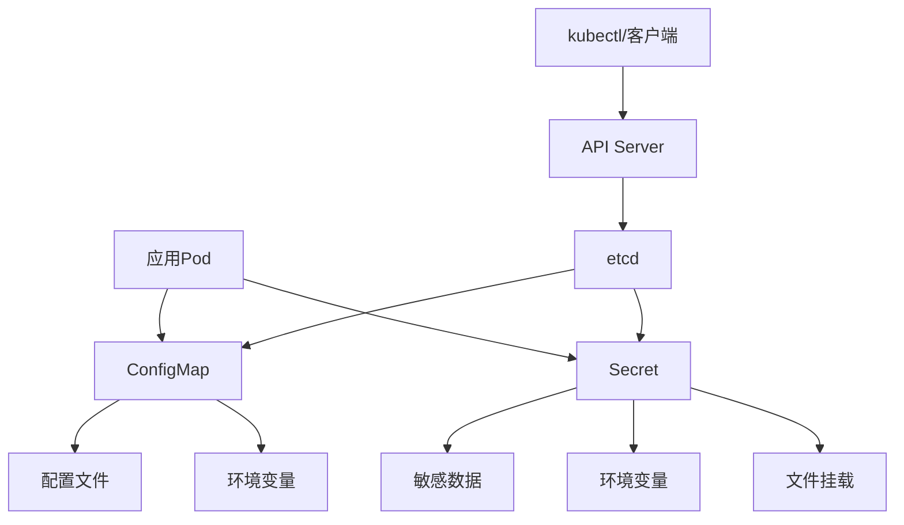

# ConfigMap与Secret配置管理  

在Kubernetes中，应用程序配置管理是一个关键问题。为了实现配置与代码分离的最佳实践，Kubernetes提供了两种主要资源：ConfigMap和Secret。这两种资源使得配置可以独立于应用程序代码进行管理和更新，从而提高了应用程序的可移植性和可维护性。

## 1. 核心概念对比  

ConfigMap和Secret都是Kubernetes中用于存储配置数据的资源，但它们有着不同的用途和安全特性。

### 1.1 特性对比表  

| 特性          | ConfigMap                  | Secret                     |  
|---------------|---------------------------|---------------------------|  
| 数据类型      | 普通配置                  | 敏感信息                  |  
| 存储方式      | 明文存储                  | Base64编码（默认）        |  
| 内存存储      | 否                        | 是（仅内存tmpfs）         |  
| 大小限制      | 1MB                       | 1MB                       |  
| 加密支持      | 不支持                    | 支持（需配置）            |  
| 典型应用场景  | 环境变量/配置文件         | 密码/证书/密钥/令牌       |  
| 访问控制      | 标准RBAC                  | 更严格的RBAC              |  
| 自动更新      | 需要额外配置              | 需要额外配置              |  

### 1.2 资源关系图  

ConfigMap和Secret在Kubernetes架构中的位置及其与Pod的关系：



### 1.3 工作原理

**ConfigMap工作原理**：
1. 用户通过API创建ConfigMap资源
2. ConfigMap数据存储在etcd中
3. 当Pod引用ConfigMap时，Kubelet会从API服务器获取ConfigMap数据
4. Kubelet将ConfigMap数据注入到Pod中（环境变量或文件）
5. 应用程序从环境变量或文件中读取配置

**Secret工作原理**：
1. 用户创建Secret资源（数据会被Base64编码）
2. Secret数据存储在etcd中（可配置加密存储）
3. Secret只分发到需要它的节点上
4. Secret数据在节点上存储在tmpfs（内存文件系统）中，不写入磁盘
5. 当Pod被删除时，节点上的Secret数据也会被删除

## 2. ConfigMap实战  

ConfigMap是Kubernetes中用于存储非敏感配置数据的资源对象，可以用作环境变量、命令行参数或配置文件。

### 2.1 从文件创建  

可以从单个文件、多个文件或目录创建ConfigMap：

```powershell
# 从单个文件创建ConfigMap
kubectl create configmap game-config --from-file=c:\project\kphub\kubernetes\config\game.properties

# 从多个文件创建
kubectl create configmap game-config-multi --from-file=c:\project\kphub\kubernetes\config\game.properties --from-file=c:\project\kphub\kubernetes\config\ui.properties

# 从目录创建
kubectl create configmap game-config-dir --from-file=c:\project\kphub\kubernetes\config\

# 从键值对创建
kubectl create configmap special-config --from-literal=special.how=very --from-literal=special.type=charm
```

**文件内容示例**：

```properties:c:\project\kphub\kubernetes\config\game.properties
enemies=aliens
lives=3
enemies.cheat=true
enemies.cheat.level=noGoodRotten
secret.code.passphrase=UUDDLRLRBABAS
secret.code.allowed=true
secret.code.lives=30
```

创建后可以查看ConfigMap内容：

```powershell
kubectl get configmap game-config -o yaml
```

输出结果：

```yaml
apiVersion: v1
kind: ConfigMap
metadata:
  name: game-config
  namespace: default
data:
  game.properties: |
    enemies=aliens
    lives=3
    enemies.cheat=true
    enemies.cheat.level=noGoodRotten
    secret.code.passphrase=UUDDLRLRBABAS
    secret.code.allowed=true
    secret.code.lives=30
```

### 2.2 完整YAML示例  

通过YAML文件直接创建ConfigMap：

```yaml:c:\project\kphub\kubernetes\configmaps\app-config.yaml
apiVersion: v1
kind: ConfigMap
metadata:
  name: app-config
  namespace: default
  labels:
    app: myapp
    environment: production
data:
  # 简单键值对
  log_level: "INFO"
  max_connections: "100"
  enable_feature_x: "true"
  
  # 复杂配置（JSON格式）
  config.json: |
    {
      "timeout": 30,
      "retries": 3,
      "endpoints": {
        "api": "https://api.example.com",
        "auth": "https://auth.example.com"
      },
      "features": {
        "featureA": true,
        "featureB": false
      }
    }
  
  # 复杂配置（YAML格式）
  config.yaml: |
    server:
      port: 8080
      timeout: 30s
    database:
      host: db.example.com
      port: 5432
      maxConnections: 100
    logging:
      level: info
      format: json
  
  # 复杂配置（属性文件格式）
  application.properties: |
    app.name=MyApplication
    app.description=A sample application
    app.version=1.0.0
    app.timeout=30
    app.maxRetries=3
```

应用ConfigMap：

```powershell
kubectl apply -f c:\project\kphub\kubernetes\configmaps\app-config.yaml
```

### 2.3 ConfigMap命名规范与最佳实践

**命名规范**：
- 使用小写字母、数字、连字符（-）
- 名称应该具有描述性，表明其用途
- 可以包含应用名称和环境信息
- 例如：`app-name-config-env`

**组织策略**：
- 按应用分组：每个应用使用独立的ConfigMap
- 按环境分组：不同环境使用不同的ConfigMap
- 按功能分组：将相关配置分组到同一ConfigMap中

**版本控制**：
- 在名称中包含版本信息：`app-config-v1`
- 或使用标签标记版本：`version: v1`
- 保留历史版本以便回滚

**大小考虑**：
- 保持ConfigMap大小在1MB以下
- 对于大型配置，考虑拆分为多个ConfigMap
- 非常大的配置可能需要考虑其他存储解决方案

## 3. Secret安全管理  

Secret用于存储和管理敏感信息，如密码、OAuth令牌和SSH密钥等。

### 3.1 创建加密Secret  

可以通过多种方式创建Secret：

```powershell
# 从文件创建
kubectl create secret generic db-secret `
  --from-file=username=c:\project\kphub\kubernetes\secrets\db-user.txt `
  --from-file=password=c:\project\kphub\kubernetes\secrets\db-pass.txt

# 从字面值创建
kubectl create secret generic api-secret `
  --from-literal=api-key=abcdefg123456 `
  --from-literal=api-secret=very-secret-value

# 创建Docker仓库认证Secret
kubectl create secret docker-registry regcred `
  --docker-server=https://index.docker.io/v1/ `
  --docker-username=username `
  --docker-password=password `
  --docker-email=email@example.com
```

**文件内容示例**：

```text:c:\project\kphub\kubernetes\secrets\db-user.txt
admin
```

```text:c:\project\kphub\kubernetes\secrets\db-pass.txt
p@ssw0rd
```

### 3.2 Secret类型  

Kubernetes支持多种类型的Secret，每种类型用于特定用途：

```yaml:c:\project\kphub\kubernetes\secrets\generic-secret.yaml
apiVersion: v1
kind: Secret
metadata:
  name: db-credentials
type: Opaque  # 通用Secret类型
data:
  username: YWRtaW4=  # Base64编码的"admin"
  password: cEBzc3cwcmQ=  # Base64编码的"p@ssw0rd"
```

```yaml:c:\project\kphub\kubernetes\secrets\tls-secret.yaml
apiVersion: v1
kind: Secret
metadata:
  name: tls-cert
type: kubernetes.io/tls  # TLS证书Secret类型
data:
  tls.crt: BASE64_ENCODED_CERT  # Base64编码的证书
  tls.key: BASE64_ENCODED_KEY   # Base64编码的私钥
```

**其他Secret类型**：

- `kubernetes.io/service-account-token`：服务账号令牌
- `kubernetes.io/dockerconfigjson`：Docker仓库认证
- `kubernetes.io/ssh-auth`：SSH认证
- `kubernetes.io/basic-auth`：基本认证

### 3.3 手动创建Base64编码

在创建Secret时，数据需要进行Base64编码：

```powershell
# PowerShell中进行Base64编码
$plaintext = "admin"
$bytes = [System.Text.Encoding]::UTF8.GetBytes($plaintext)
$encoded = [Convert]::ToBase64String($bytes)
Write-Output $encoded
# 输出: YWRtaW4=

# 解码Base64
$decoded = [System.Text.Encoding]::UTF8.GetString([Convert]::FromBase64String($encoded))
Write-Output $decoded
# 输出: admin
```

使用编码后的值创建Secret：

```yaml:c:\project\kphub\kubernetes\secrets\manual-secret.yaml
apiVersion: v1
kind: Secret
metadata:
  name: manual-secret
type: Opaque
data:
  username: YWRtaW4=
  password: cEBzc3cwcmQ=
```

### 3.4 使用stringData字段

对于更简单的创建方式，可以使用`stringData`字段，它会自动进行Base64编码：

```yaml:c:\project\kphub\kubernetes\secrets\string-data-secret.yaml
apiVersion: v1
kind: Secret
metadata:
  name: string-data-secret
type: Opaque
stringData:  # 自动进行Base64编码
  username: admin
  password: p@ssw0rd
  config.yaml: |
    apiUrl: https://api.example.com
    timeout: 30s
```

## 4. 配置注入方式  

ConfigMap和Secret可以通过多种方式注入到Pod中，以供应用程序使用。

### 4.1 环境变量注入  

将ConfigMap或Secret中的数据作为环境变量注入到容器中：

```yaml:c:\project\kphub\kubernetes\pods\env-pod.yaml
apiVersion: v1
kind: Pod
metadata:
  name: config-env-pod
spec:
  containers:
  - name: app
    image: busybox
    command: ["/bin/sh", "-c", "env | grep LOG_LEVEL && sleep 3600"]
    env:
    # 从ConfigMap注入单个环境变量
    - name: LOG_LEVEL
      valueFrom:
        configMapKeyRef:
          name: app-config
          key: log_level
    
    # 从Secret注入单个环境变量
    - name: DB_PASSWORD
      valueFrom:
        secretKeyRef:
          name: db-secret
          key: password
          optional: false  # 如果Secret不存在则Pod无法启动
    
    # 直接设置环境变量
    - name: APP_NAME
      value: "MyApp"
```

**注入所有键值对作为环境变量**：

```yaml:c:\project\kphub\kubernetes\pods\envfrom-pod.yaml
apiVersion: v1
kind: Pod
metadata:
  name: config-envfrom-pod
spec:
  containers:
  - name: app
    image: busybox
    command: ["/bin/sh", "-c", "env && sleep 3600"]
    # 注入整个ConfigMap作为环境变量
    envFrom:
    - configMapRef:
        name: app-config
        optional: true  # 如果ConfigMap不存在，Pod仍然可以启动
    
    # 注入整个Secret作为环境变量
    - secretRef:
        name: db-secret
    
    # 添加前缀
    - configMapRef:
        name: special-config
        prefix: CONFIG_  # 所有键名前添加CONFIG_前缀
```

### 4.2 文件挂载方式  

将ConfigMap或Secret挂载为容器中的文件：

```yaml:c:\project\kphub\kubernetes\pods\volume-pod.yaml
apiVersion: v1
kind: Pod
metadata:
  name: config-volume-pod
spec:
  containers:
  - name: app
    image: busybox
    command: ["/bin/sh", "-c", "cat /etc/config/config.json && cat /etc/secret/username && sleep 3600"]
    # 挂载点配置
    volumeMounts:
    # 挂载ConfigMap
    - name: config-volume
      mountPath: /etc/config
      readOnly: true
    
    # 挂载Secret
    - name: secret-volume
      mountPath: /etc/secret
      readOnly: true
    
    # 挂载单个文件（不是整个目录）
    - name: special-config-volume
      mountPath: /etc/app/special-config.properties
      subPath: special-config.properties  # 只挂载特定文件
      readOnly: true
  
  # 卷定义
  volumes:
  # ConfigMap卷
  - name: config-volume
    configMap:
      name: app-config
      # 可选：指定要包含的键
      items:
      - key: config.json
        path: config.json
      - key: config.yaml
        path: config.yaml
      defaultMode: 0644  # 文件权限
  
  # Secret卷
  - name: secret-volume
    secret:
      secretName: db-secret
      defaultMode: 0600  # 更严格的文件权限
  
  # 特定配置卷
  - name: special-config-volume
    configMap:
      name: special-config
```

### 4.3 命令行参数注入

通过环境变量间接将配置注入到命令行参数：

```yaml:c:\project\kphub\kubernetes\pods\args-pod.yaml
apiVersion: v1
kind: Pod
metadata:
  name: config-args-pod
spec:
  containers:
  - name: app
    image: myapp:1.0
    # 使用环境变量在命令行参数中
    command: ["/app/start.sh"]
    args: ["--log-level=$(LOG_LEVEL)", "--max-connections=$(MAX_CONN)"]
    env:
    - name: LOG_LEVEL
      valueFrom:
        configMapKeyRef:
          name: app-config
          key: log_level
    - name: MAX_CONN
      valueFrom:
        configMapKeyRef:
          name: app-config
          key: max_connections
```

### 4.4 注入方式对比

| 注入方式 | 优点 | 缺点 | 适用场景 |
|---------|------|------|---------|
| 环境变量 | 简单直接，大多数应用原生支持 | 无法动态更新，需重启Pod | 简单配置，启动参数 |
| 卷挂载 | 支持动态更新，无需重启Pod | 应用需要支持文件读取，配置更复杂 | 复杂配置，需要热更新 |
| 命令行参数 | 显式，便于调试 | 无法动态更新，长度限制 | 关键启动参数 |

## 5. 热更新策略  

ConfigMap和Secret的更新不会自动触发Pod重启，但挂载为卷的配置可以自动更新。

### 5.1 自动更新机制  

**卷挂载的自动更新**：

当ConfigMap或Secret更新后，挂载为卷的文件会自动更新，但有一定延迟（通常在几十秒内）：

```yaml:c:\project\kphub\kubernetes\pods\auto-reload-pod.yaml
apiVersion: v1
kind: Pod
metadata:
  name: auto-reload-pod
spec:
  containers:
  - name: app
    image: nginx
    volumeMounts:
    - name: config-volume
      mountPath: /etc/nginx/conf.d
  volumes:
  - name: config-volume
    configMap:
      name: nginx-config
```

**更新ConfigMap**：

```powershell
# 更新ConfigMap
kubectl edit configmap nginx-config
# 或
kubectl patch configmap nginx-config --patch '{"data":{"nginx.conf":"新的配置内容"}}'
```

**注意事项**：
- 更新后的文件会在容器中自动更新（通常在1-2分钟内）
- 环境变量注入的配置不会自动更新
- 应用程序需要能够检测并重新加载配置文件
- 子路径挂载（subPath）的文件不会自动更新

### 5.2 使用第三方工具实现自动重载  

对于需要在配置更改时重启Pod的场景，可以使用第三方工具：

**使用Reloader工具**：

```yaml:c:\project\kphub\kubernetes\deployments\reloader-deployment.yaml
apiVersion: apps/v1
kind: Deployment
metadata:
  name: my-app
  annotations:
    # Reloader注解，监控ConfigMap变化
    reloader.stakater.com/auto: "true"
    # 指定要监控的ConfigMap
    configmap.reloader.stakater.com/reload: "app-config"
    # 指定要监控的Secret
    secret.reloader.stakater.com/reload: "app-secret"
spec:
  replicas: 3
  selector:
    matchLabels:
      app: my-app
  template:
    metadata:
      labels:
        app: my-app
    spec:
      containers:
      - name: app
        image: myapp:1.0
        env:
        - name: CONFIG_VERSION
          valueFrom:
            configMapKeyRef:
              name: app-config
              key: version
```

**安装Reloader**：

```powershell
# 使用Helm安装Reloader
helm repo add stakater https://stakater.github.io/stakater-charts
helm repo update
helm install reloader stakater/reloader --namespace kube-system
```

### 5.3 手动触发更新  

对于不支持自动重载的应用，可以手动触发更新：

```powershell
# 重启Deployment
kubectl rollout restart deployment/my-app

# 删除Pod，让它重新创建
kubectl delete pod my-app-pod

# 使用kubectl apply强制更新
kubectl apply -f c:\project\kphub\kubernetes\deployments\my-app.yaml --force
```

### 5.4 应用程序级别的配置重载

最佳实践是让应用程序支持配置热重载：

```yaml:c:\project\kphub\kubernetes\pods\app-reload-pod.yaml
apiVersion: v1
kind: Pod
metadata:
  name: app-reload-pod
spec:
  containers:
  - name: app
    image: myapp:1.0
    # 应用程序监控配置文件变化并自动重载
    command: ["/app/start.sh", "--watch-config", "/etc/app/config.yaml"]
    volumeMounts:
    - name: config-volume
      mountPath: /etc/app
  volumes:
  - name: config-volume
    configMap:
      name: app-config
```

**应用程序实现配置热重载的方法**：
1. 定期检查配置文件的修改时间
2. 使用文件系统通知机制（如inotify）
3. 实现信号处理（如SIGHUP）触发配置重载
4. 使用专门的配置管理库（如Spring Cloud Config）

## 6. 生产实践  

在生产环境中使用ConfigMap和Secret需要考虑更多因素，如安全性、可维护性和可扩展性。

### 6.1 敏感数据加密  

Kubernetes默认将Secret以Base64编码存储在etcd中，但这不是真正的加密。为了增强安全性，可以启用etcd加密：

**配置etcd加密**：

```yaml:c:\project\kphub\kubernetes\encryption\encryption-config.yaml
apiVersion: apiserver.config.k8s.io/v1
kind: EncryptionConfiguration
resources:
  - resources:
    - secrets
    providers:
    - aescbc:
        keys:
        - name: key1
          secret: <base64编码的32字节密钥>
    - identity: {}
```

**安装和配置加密**：

```powershell
# 生成加密密钥
$key = New-Object byte[] 32
[Security.Cryptography.RNGCryptoServiceProvider]::Create().GetBytes($key)
$encodedKey = [Convert]::ToBase64String($key)

# 创建加密配置
$encryptionConfig = @"
apiVersion: apiserver.config.k8s.io/v1
kind: EncryptionConfiguration
resources:
  - resources:
    - secrets
    providers:
    - aescbc:
        keys:
        - name: key1
          secret: $encodedKey
    - identity: {}
"@

# 保存到文件
$encryptionConfig | Out-File -FilePath c:\project\kphub\kubernetes\encryption\encryption-config.yaml -Encoding utf8

# 创建包含加密配置的Secret
kubectl create secret generic encryption-key `
  --from-file=c:\project\kphub\kubernetes\encryption\encryption-config.yaml `
  -n kube-system
```

**使用外部密钥管理系统**：

对于更高级的安全需求，可以集成外部密钥管理系统：

```yaml:c:\project\kphub\kubernetes\secrets\external-secrets.yaml
apiVersion: "kubernetes-client.io/v1"
kind: ExternalSecret
metadata:
  name: database-credentials
spec:
  backendType: secretsManager
  data:
    - key: production/db/credentials
      name: username
      property: username
    - key: production/db/credentials
      name: password
      property: password
```

### 6.2 配置版本控制  

在生产环境中，配置变更需要版本控制和审计：

**命名约定**：

```text
命名规范: 
app-config-v1
app-config-v2
```

**使用标签标记版本**：

```yaml:c:\project\kphub\kubernetes\configmaps\versioned-config.yaml
apiVersion: v1
kind: ConfigMap
metadata:
  name: app-config
  labels:
    app: myapp
    version: v1.2.3
    environment: production
data:
  # 配置数据
```

**使用注解记录变更**：

```yaml:c:\project\kphub\kubernetes\configmaps\annotated-config.yaml
apiVersion: v1
kind: ConfigMap
metadata:
  name: app-config
  annotations:
    kubernetes.io/change-cause: "Updated database connection timeout to 30s"
    last-modified-by: "user@example.com"
    last-modified-date: "2023-05-15"
data:
  # 配置数据
```

**使用GitOps管理配置**：

```powershell
# 使用Flux或ArgoCD从Git仓库同步配置
kubectl apply -f c:\project\kphub\kubernetes\gitops\flux-config.yaml
```

### 6.3 多环境配置管理  

在不同环境（开发、测试、生产）中管理配置：

**使用命名空间隔离**：

```yaml:c:\project\kphub\kubernetes\namespaces\environments.yaml
apiVersion: v1
kind: Namespace
metadata:
  name: development
---
apiVersion: v1
kind: Namespace
metadata:
  name: staging
---
apiVersion: v1
kind: Namespace
metadata:
  name: production
```

**环境特定的ConfigMap**：

```yaml:c:\project\kphub\kubernetes\configmaps\multi-env-config.yaml
# 开发环境配置
apiVersion: v1
kind: ConfigMap
metadata:
  name: app-config
  namespace: development
data:
  log_level: "DEBUG"
  api_url: "http://dev-api.example.com"
---
# 生产环境配置
apiVersion: v1
kind: ConfigMap
metadata:
  name: app-config
  namespace: production
data:
  log_level: "INFO"
  api_url: "https://api.example.com"
```

**使用Kustomize管理多环境配置**：

```yaml:c:\project\kphub\kubernetes\kustomize\base\configmap.yaml
apiVersion: v1
kind: ConfigMap
metadata:
  name: app-config
data:
  log_level: "INFO"
```

```yaml:c:\project\kphub\kubernetes\kustomize\overlays\development\kustomization.yaml
apiVersion: kustomize.config.k8s.io/v1beta1
kind: Kustomization
resources:
- ../../base
patchesStrategicMerge:
- configmap-patch.yaml
```

```yaml:c:\project\kphub\kubernetes\kustomize\overlays\development\configmap-patch.yaml
apiVersion: v1
kind: ConfigMap
metadata:
  name: app-config
data:
  log_level: "DEBUG"
```

### 6.4 配置验证与测试

在应用配置前进行验证：

**使用ConfigMap验证Pod**：

```yaml:c:\project\kphub\kubernetes\pods\config-validator.yaml
apiVersion: v1
kind: Pod
metadata:
  name: config-validator
spec:
  restartPolicy: Never
  containers:
  - name: validator
    image: config-validator:1.0
    command: ["/validator", "--config-path", "/etc/app/config.yaml"]
    volumeMounts:
    - name: config-volume
      mountPath: /etc/app
  volumes:
  - name: config-volume
    configMap:
      name: app-config
```

**使用Admission Webhook验证**：

```yaml:c:\project\kphub\kubernetes\webhooks\config-validator.yaml
apiVersion: admissionregistration.k8s.io/v1
kind: ValidatingWebhookConfiguration
metadata:
  name: config-validator
webhooks:
- name: config-validator.example.com
  clientConfig:
    service:
      namespace: default
      name: config-validator
      path: "/validate"
    caBundle: <base64编码的CA证书>
  rules:
  - apiGroups: [""]
    apiVersions: ["v1"]
    resources: ["configmaps"]
    operations: ["CREATE", "UPDATE"]
  failurePolicy: Fail
```

## 7. 安全建议  

ConfigMap和Secret的安全管理对于保护应用程序配置和敏感数据至关重要。

### 7.1 RBAC权限控制  

使用基于角色的访问控制限制对ConfigMap和Secret的访问：

```yaml:c:\project\kphub\kubernetes\rbac\config-reader-role.yaml
apiVersion: rbac.authorization.k8s.io/v1
kind: Role
metadata:
  name: config-reader
  namespace: default
rules:
- apiGroups: [""]
  resources: ["configmaps"]
  verbs: ["get", "list"]
  resourceNames: ["app-config"]  # 限制只能访问特定ConfigMap
```

```yaml:c:\project\kphub\kubernetes\rbac\secret-reader-role.yaml
apiVersion: rbac.authorization.k8s.io/v1
kind: Role
metadata:
  name: secret-reader
  namespace: default
rules:
- apiGroups: [""]
  resources: ["secrets"]
  verbs: ["get"]
  resourceNames: ["app-secret"]  # 限制只能访问特定Secret
```

**绑定角色到用户或服务账号**：

```yaml:c:\project\kphub\kubernetes\rbac\role-binding.yaml
apiVersion: rbac.authorization.k8s.io/v1
kind: RoleBinding
metadata:
  name: read-configs
  namespace: default
subjects:
- kind: ServiceAccount
  name: app-service-account
  namespace: default
roleRef:
  kind: Role
  name: config-reader
  apiGroup: rbac.authorization.k8s.io
```

**创建专用服务账号**：

```yaml:
继续完成ConfigMap与Secret配置管理文档：

### 7.1 RBAC权限控制  

使用基于角色的访问控制限制对ConfigMap和Secret的访问：

```yaml:c:\project\kphub\kubernetes\rbac\config-reader-role.yaml
apiVersion: rbac.authorization.k8s.io/v1
kind: Role
metadata:
  name: config-reader
  namespace: default
rules:
- apiGroups: [""]
  resources: ["configmaps"]
  verbs: ["get", "list"]
  resourceNames: ["app-config"]  # 限制只能访问特定ConfigMap
```

```yaml:c:\project\kphub\kubernetes\rbac\secret-reader-role.yaml
apiVersion: rbac.authorization.k8s.io/v1
kind: Role
metadata:
  name: secret-reader
  namespace: default
rules:
- apiGroups: [""]
  resources: ["secrets"]
  verbs: ["get"]
  resourceNames: ["app-secret"]  # 限制只能访问特定Secret
```

**绑定角色到用户或服务账号**：

```yaml:c:\project\kphub\kubernetes\rbac\role-binding.yaml
apiVersion: rbac.authorization.k8s.io/v1
kind: RoleBinding
metadata:
  name: read-configs
  namespace: default
subjects:
- kind: ServiceAccount
  name: app-service-account
  namespace: default
roleRef:
  kind: Role
  name: config-reader
  apiGroup: rbac.authorization.k8s.io
```

**创建专用服务账号**：

```yaml:c:\project\kphub\kubernetes\rbac\service-account.yaml
apiVersion: v1
kind: ServiceAccount
metadata:
  name: app-service-account
  namespace: default
```

**最小权限原则**：
- 仅授予必要的权限
- 限制对特定资源的访问
- 分离读取和写入权限
- 定期审查和轮换权限

### 7.2 审计日志配置  

启用审计日志以跟踪对ConfigMap和Secret的访问和修改：

```yaml:c:\project\kphub\kubernetes\audit\audit-policy.yaml
apiVersion: audit.k8s.io/v1
kind: Policy
rules:
# 记录所有对Secret的操作
- level: RequestResponse
  resources:
  - group: ""
    resources: ["secrets"]

# 记录对ConfigMap的修改操作
- level: Metadata
  resources:
  - group: ""
    resources: ["configmaps"]
  verbs: ["create", "update", "patch", "delete"]

# 其他资源使用较低的审计级别
- level: Metadata
  resources:
  - group: ""
    resources: ["pods", "services"]
```

**配置审计日志后端**：

```powershell
# 创建包含审计令牌的Secret
kubectl create secret generic audit-secret `
  --from-literal=token=myaudittoken `
  -n kube-system
```

**审计日志级别**：
- `None`：不记录
- `Metadata`：记录请求元数据（用户、时间、资源等），但不记录请求体或响应体
- `Request`：记录元数据和请求体，但不记录响应体
- `RequestResponse`：记录元数据、请求体和响应体

### 7.3 Secret安全最佳实践

**限制Secret的可见性**：

```yaml:c:\project\kphub\kubernetes\pods\secure-pod.yaml
apiVersion: v1
kind: Pod
metadata:
  name: secure-pod
spec:
  containers:
  - name: app
    image: myapp:1.0
    # 只挂载必要的Secret
    volumeMounts:
    - name: app-secret-volume
      mountPath: /etc/app/secrets
      readOnly: true  # 确保只读挂载
  volumes:
  - name: app-secret-volume
    secret:
      secretName: app-secret
      # 只挂载必要的键
      items:
      - key: api-key
        path: api-key
      defaultMode: 0400  # 严格的文件权限
```

**Secret轮换策略**：

```yaml:c:\project\kphub\kubernetes\secrets\rotated-secret.yaml
apiVersion: v1
kind: Secret
metadata:
  name: rotated-secret-v2  # 版本化命名
  annotations:
    rotation-date: "2023-06-01"
    expires: "2023-12-01"
type: Opaque
data:
  api-key: <新的Base64编码密钥>
```

**使用临时Secret**：

```yaml:c:\project\kphub\kubernetes\pods\ephemeral-secret-pod.yaml
apiVersion: v1
kind: Pod
metadata:
  name: ephemeral-secret-pod
spec:
  containers:
  - name: app
    image: myapp:1.0
  # 使用临时卷
  volumes:
  - name: token-vol
    ephemeral:
      volumeClaimTemplate:
        metadata:
          labels:
            type: ephemeral
        spec:
          accessModes: ["ReadWriteOnce"]
          storageClassName: "memory"
          resources:
            requests:
              storage: 1Mi
```

### 7.4 网络安全考虑

**加密传输中的数据**：

```yaml:c:\project\kphub\kubernetes\network-policy\secure-policy.yaml
apiVersion: networking.k8s.io/v1
kind: NetworkPolicy
metadata:
  name: config-access-policy
spec:
  podSelector:
    matchLabels:
      role: config-consumer
  policyTypes:
  - Ingress
  - Egress
  ingress:
  - from:
    - podSelector:
        matchLabels:
          role: config-provider
  egress:
  - to:
    - podSelector:
        matchLabels:
          role: config-provider
```

**使用服务网格加密**：

```yaml:c:\project\kphub\kubernetes\service-mesh\istio-mtls.yaml
apiVersion: security.istio.io/v1beta1
kind: PeerAuthentication
metadata:
  name: default
  namespace: default
spec:
  mtls:
    mode: STRICT  # 强制使用mTLS
```

## 8. 高级使用场景

### 8.1 动态配置更新

实现配置的动态更新，无需重启应用：

```yaml:c:\project\kphub\kubernetes\advanced\dynamic-config.yaml
apiVersion: apps/v1
kind: Deployment
metadata:
  name: dynamic-config-app
spec:
  replicas: 3
  selector:
    matchLabels:
      app: dynamic-config
  template:
    metadata:
      labels:
        app: dynamic-config
    spec:
      containers:
      - name: app
        image: dynamic-config-app:1.0
        # 应用支持配置热重载
        args: ["--config-watch", "/etc/app/config"]
        volumeMounts:
        - name: config-volume
          mountPath: /etc/app/config
        # 添加文件系统通知工具
        - name: inotify-tools
          mountPath: /usr/bin/inotifywait
          subPath: inotifywait
      volumes:
      - name: config-volume
        configMap:
          name: app-config
      - name: inotify-tools
        emptyDir: {}
      initContainers:
      - name: install-inotify
        image: alpine
        command: ["sh", "-c", "apk add --no-cache inotify-tools && cp /usr/bin/inotifywait /data/"]
        volumeMounts:
        - name: inotify-tools
          mountPath: /data
```

**使用ConfigMap控制器**：

```yaml:c:\project\kphub\kubernetes\advanced\configmap-controller.yaml
apiVersion: apps/v1
kind: Deployment
metadata:
  name: configmap-controller
spec:
  replicas: 1
  selector:
    matchLabels:
      app: configmap-controller
  template:
    metadata:
      labels:
        app: configmap-controller
    spec:
      serviceAccountName: configmap-controller
      containers:
      - name: controller
        image: configmap-controller:1.0
        args:
        - --watch-namespace=default
        - --annotation=config-reload
```

### 8.2 配置依赖管理

处理配置之间的依赖关系：

```yaml:c:\project\kphub\kubernetes\advanced\config-dependencies.yaml
apiVersion: v1
kind: ConfigMap
metadata:
  name: database-config
data:
  host: "db.example.com"
  port: "5432"
---
apiVersion: v1
kind: ConfigMap
metadata:
  name: app-config
  annotations:
    dependencies: "database-config"
data:
  database_url: "postgresql://$(DATABASE_HOST):$(DATABASE_PORT)/mydb"
---
apiVersion: v1
kind: Pod
metadata:
  name: config-dependency-pod
spec:
  containers:
  - name: app
    image: myapp:1.0
    env:
    - name: DATABASE_HOST
      valueFrom:
        configMapKeyRef:
          name: database-config
          key: host
    - name: DATABASE_PORT
      valueFrom:
        configMapKeyRef:
          name: database-config
          key: port
    envFrom:
    - configMapRef:
        name: app-config
```

### 8.3 使用Helm管理配置

使用Helm模板化配置：

```yaml:c:\project\kphub\kubernetes\helm\templates\configmap.yaml
apiVersion: v1
kind: ConfigMap
metadata:
  name: {{ .Release.Name }}-config
  labels:
    app: {{ .Release.Name }}
    chart: {{ .Chart.Name }}-{{ .Chart.Version }}
    release: {{ .Release.Name }}
data:
  log_level: {{ .Values.logLevel | default "INFO" | quote }}
  database_url: {{ printf "postgresql://%s:%s/%s" .Values.db.host .Values.db.port .Values.db.name | quote }}
  {{- if .Values.features.enableCache }}
  cache_ttl: {{ .Values.cache.ttl | default 300 | quote }}
  {{- end }}
```

```yaml:c:\project\kphub\kubernetes\helm\values.yaml
# 默认配置值
logLevel: "INFO"

db:
  host: "localhost"
  port: "5432"
  name: "myapp"

features:
  enableCache: false

cache:
  ttl: 300
```

### 8.4 使用Operator管理配置

自定义资源和Operator管理复杂配置：

```yaml:c:\project\kphub\kubernetes\operators\app-config-crd.yaml
apiVersion: apiextensions.k8s.io/v1
kind: CustomResourceDefinition
metadata:
  name: appconfigs.config.example.com
spec:
  group: config.example.com
  versions:
  - name: v1
    served: true
    storage: true
    schema:
      openAPIV3Schema:
        type: object
        properties:
          spec:
            type: object
            properties:
              logLevel:
                type: string
              database:
                type: object
                properties:
                  host:
                    type: string
                  port:
                    type: string
                  name:
                    type: string
  scope: Namespaced
  names:
    plural: appconfigs
    singular: appconfig
    kind: AppConfig
    shortNames:
    - ac
```

```yaml:c:\project\kphub\kubernetes\operators\app-config-cr.yaml
apiVersion: config.example.com/v1
kind: AppConfig
metadata:
  name: my-app-config
spec:
  logLevel: "DEBUG"
  database:
    host: "db.example.com"
    port: "5432"
    name: "production"
```

## 总结

ConfigMap和Secret是Kubernetes中管理应用配置和敏感数据的关键资源。它们使应用程序配置与代码分离，提高了应用的可移植性和可维护性。

**ConfigMap适用场景**：
- 非敏感配置数据
- 环境变量
- 配置文件
- 命令行参数

**Secret适用场景**：
- 密码和API密钥
- TLS证书和私钥
- OAuth令牌
- SSH密钥

在生产环境中，应当遵循以下最佳实践：
1. 使用RBAC严格控制访问权限
2. 启用etcd加密保护敏感数据
3. 实施配置版本控制和审计
4. 定期轮换Secret
5. 使用适当的注入方式（环境变量或卷挂载）
6. 考虑配置热更新机制
7. 集成外部密钥管理系统处理高价值密钥

通过合理使用ConfigMap和Secret，可以构建更安全、更灵活、更易于维护的Kubernetes应用程序。