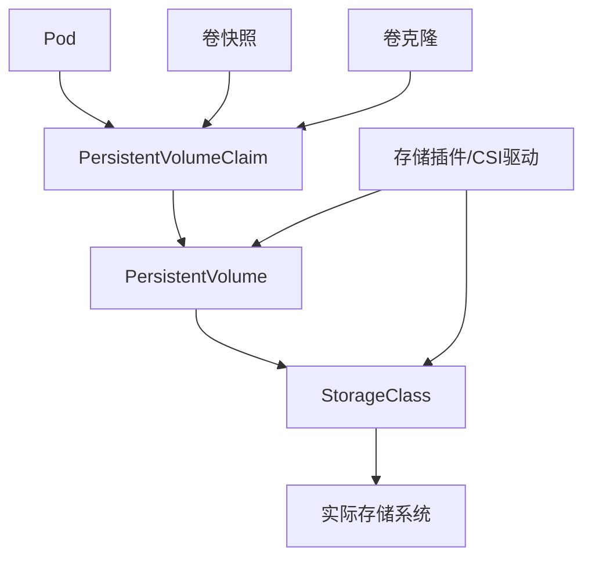
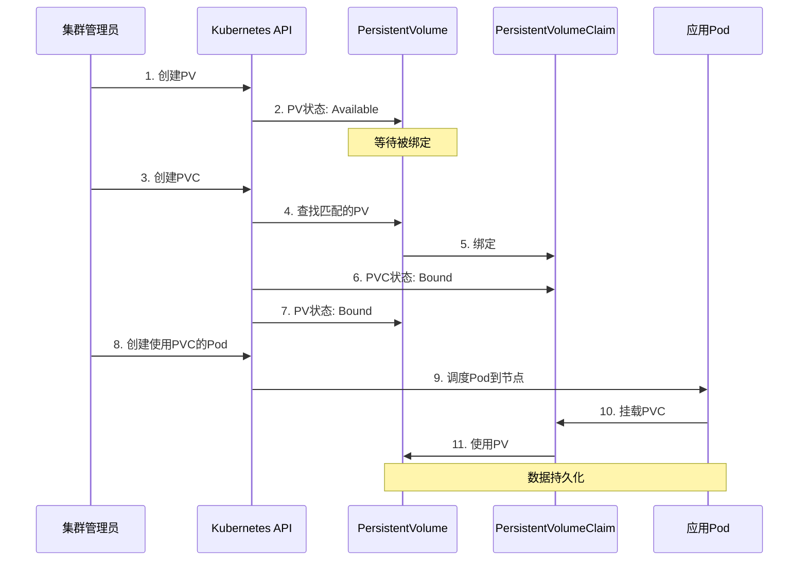
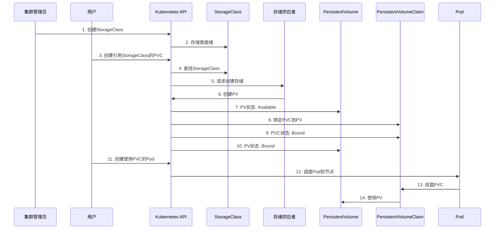

# PersistentVolume存储管理  

在Kubernetes中，持久化存储是保证应用数据持久性和可靠性的关键组件。通过PersistentVolume（PV）和PersistentVolumeClaim（PVC）机制，Kubernetes将存储资源的供应与消费分离，使应用开发者无需关心底层存储细节，同时为集群管理员提供了灵活的存储管理能力。

## 1. 存储架构概述  

Kubernetes存储系统由多个组件组成，它们共同协作提供了完整的存储生命周期管理。

### 1.1 核心组件关系  

Kubernetes存储架构中的核心组件及其关系如下：



**核心组件说明**：

1. **Pod**：
   - 使用存储的最终消费者
   - 通过volumeMounts字段挂载存储卷

2. **PersistentVolumeClaim (PVC)**：
   - 用户对存储的请求
   - 指定所需的存储大小、访问模式和StorageClass
   - 充当Pod和PV之间的抽象层

3. **PersistentVolume (PV)**：
   - 集群中的存储资源
   - 由管理员手动创建或通过StorageClass动态创建
   - 具有独立于Pod的生命周期

4. **StorageClass**：
   - 定义存储的"类别"
   - 指定存储供应者（Provisioner）
   - 配置存储的参数（如性能、冗余级别）
   - 支持动态创建PV

5. **存储插件/CSI驱动**：
   - 连接Kubernetes和实际存储系统
   - 实现卷的创建、挂载、卸载等操作
   - CSI（Container Storage Interface）是标准化的存储接口

6. **实际存储系统**：
   - 提供真正的存储服务
   - 可以是云存储、NFS、本地磁盘等

### 1.2 存储供应模式  

Kubernetes支持两种主要的存储供应模式：静态供应和动态供应。

| 模式类型       | 工作方式               | 适用场景          | 优点                 | 缺点                |
|----------------|----------------------|-----------------|----------------------|---------------------|
| 静态供应        | 管理员预先创建PV       | 固定存储需求      | 完全控制存储参数      | 管理开销大，灵活性低  |
| 动态供应        | 按需自动创建PV        | 弹性伸缩环境      | 自动化程度高，灵活     | 可能缺乏精细控制     |

**静态供应流程**：
1. 集群管理员创建底层存储资源（如NFS共享、云存储卷）
2. 管理员创建对应的PersistentVolume资源
3. 用户创建PersistentVolumeClaim请求存储
4. Kubernetes将PVC与匹配的PV绑定
5. Pod使用PVC挂载存储

**动态供应流程**：
1. 管理员创建StorageClass定义存储类型和参数
2. 用户创建PVC并指定StorageClass
3. 存储供应者根据PVC和StorageClass自动创建PV
4. Kubernetes将PVC与新创建的PV绑定
5. Pod使用PVC挂载存储

### 1.3 访问模式与回收策略

**访问模式**决定了PV可以如何被挂载：

| 访问模式         | 缩写     | 描述                                     | 支持情况           |
|-----------------|----------|----------------------------------------|-------------------|
| ReadWriteOnce   | RWO      | 可被单个节点以读写方式挂载                 | 大多数存储类型支持   |
| ReadOnlyMany    | ROX      | 可被多个节点以只读方式挂载                 | 部分存储类型支持     |
| ReadWriteMany   | RWX      | 可被多个节点以读写方式挂载                 | 少数存储类型支持     |
| ReadWriteOncePod| RWOP     | 只能被单个Pod以读写方式挂载（1.22+）       | 少数存储类型支持     |

**回收策略**定义了PV在PVC被删除后的处理方式：

| 回收策略        | 描述                                     | 适用场景                |
|----------------|----------------------------------------|------------------------|
| Retain         | 保留数据，需手动回收                       | 重要数据，需要手动备份    |
| Delete         | 删除底层存储资源                          | 临时数据，自动化环境      |
| Recycle        | 自动清空数据（已弃用）                     | 不推荐使用              |

## 2. 静态配置实践  

静态供应是最基本的存储配置方式，管理员需要预先创建PV资源。

### 2.1 PV基础配置  

以下是一个基于NFS的PersistentVolume配置示例：

```yaml:c:\project\kphub\kubernetes\storage\static-pv.yaml
apiVersion: v1
kind: PersistentVolume
metadata:
  name: pv-001
  labels:
    type: nfs
    environment: production
spec:
  capacity:
    storage: 10Gi  # 存储容量
  volumeMode: Filesystem  # 卷模式：Filesystem或Block
  accessModes:
    - ReadWriteOnce  # 访问模式
  persistentVolumeReclaimPolicy: Retain  # 回收策略
  storageClassName: manual  # 存储类名称
  mountOptions:  # 挂载选项
    - hard
    - nfsvers=4.1
  nfs:  # NFS特定配置
    path: /data/nfs
    server: 192.168.1.100
```

**关键字段说明**：

- **capacity**：定义PV的存储容量
- **volumeMode**：
  - `Filesystem`（默认）：提供文件系统
  - `Block`：提供原始块设备
- **accessModes**：定义访问模式（可以指定多个，但绑定时只使用一个）
- **persistentVolumeReclaimPolicy**：定义回收策略
- **storageClassName**：关联到StorageClass（静态供应通常使用"manual"或空）
- **mountOptions**：特定于存储类型的挂载选项
- **nfs/csi/hostPath等**：特定存储类型的配置参数

### 2.2 PVC绑定配置  

创建PersistentVolumeClaim来请求存储资源：

```yaml:c:\project\kphub\kubernetes\storage\static-pvc.yaml
apiVersion: v1
kind: PersistentVolumeClaim
metadata:
  name: pvc-001
  namespace: default
spec:
  accessModes:
    - ReadWriteOnce  # 访问模式必须与PV兼容
  resources:
    requests:
      storage: 5Gi  # 请求的存储大小
  storageClassName: manual  # 必须与PV匹配
  selector:  # 可选：使用标签选择器筛选PV
    matchLabels:
      type: nfs
      environment: production
```

**PVC与PV绑定规则**：

1. **存储类名称**必须匹配
2. **访问模式**必须兼容
3. **存储大小**必须满足（PV容量 ≥ PVC请求）
4. 如果指定了**选择器**，则PV必须匹配标签
5. 如果多个PV满足条件，Kubernetes会选择**最小的满足条件的PV**

### 2.3 在Pod中使用PVC

将PVC挂载到Pod中：

```yaml:c:\project\kphub\kubernetes\storage\pod-with-pvc.yaml
apiVersion: v1
kind: Pod
metadata:
  name: nginx-with-pvc
spec:
  containers:
  - name: nginx
    image: nginx
    volumeMounts:
    - name: nginx-data
      mountPath: /usr/share/nginx/html  # 容器内挂载路径
      readOnly: false  # 是否只读
  volumes:
  - name: nginx-data
    persistentVolumeClaim:
      claimName: pvc-001  # 引用PVC名称
```

**完整的静态供应流程**：



## 3. 动态供应实现  

动态供应通过StorageClass自动创建PV，简化了存储管理。

### 3.1 StorageClass定义  

StorageClass定义了存储的"类别"，包括供应者和参数：

```yaml:c:\project\kphub\kubernetes\storage\storageclass.yaml
apiVersion: storage.k8s.io/v1
kind: StorageClass
metadata:
  name: fast
  annotations:
    storageclass.kubernetes.io/is-default-class: "false"  # 是否为默认存储类
provisioner: disk.csi.azure.com  # 存储供应者
parameters:  # 供应者特定参数
  skuname: Premium_LRS  # Azure磁盘类型
  cachingMode: ReadOnly  # 缓存模式
  fsType: ext4  # 文件系统类型
reclaimPolicy: Delete  # PV的回收策略
volumeBindingMode: Immediate  # 卷绑定模式
allowVolumeExpansion: true  # 是否允许卷扩展
```

**关键字段说明**：

- **provisioner**：指定存储供应者（如云提供商CSI驱动）
- **parameters**：供应者特定的参数，不同供应者参数不同
- **reclaimPolicy**：创建的PV的回收策略（默认为Delete）
- **volumeBindingMode**：
  - `Immediate`：立即创建PV并绑定（默认）
  - `WaitForFirstConsumer`：等到Pod调度后再创建PV
- **allowVolumeExpansion**：是否允许PVC请求更多存储
- **mountOptions**：创建的PV的挂载选项

### 3.2 动态PVC示例  

使用StorageClass创建动态PVC：

```yaml:c:\project\kphub\kubernetes\storage\dynamic-pvc.yaml
apiVersion: v1
kind: PersistentVolumeClaim
metadata:
  name: dynamic-pvc
spec:
  storageClassName: fast  # 引用StorageClass
  accessModes:
    - ReadWriteOnce
  resources:
    requests:
      storage: 100Gi
```

**动态供应流程**：



### 3.3 默认StorageClass

可以将一个StorageClass设置为默认，这样不指定storageClassName的PVC会自动使用它：

```yaml:c:\project\kphub\kubernetes\storage\default-storageclass.yaml
apiVersion: storage.k8s.io/v1
kind: StorageClass
metadata:
  name: standard
  annotations:
    storageclass.kubernetes.io/is-default-class: "true"  # 设置为默认
provisioner: kubernetes.io/aws-ebs
parameters:
  type: gp2
```

使用默认StorageClass的PVC：

```yaml:c:\project\kphub\kubernetes\storage\default-pvc.yaml
apiVersion: v1
kind: PersistentVolumeClaim
metadata:
  name: default-pvc
spec:
  accessModes:
    - ReadWriteOnce
  resources:
    requests:
      storage: 10Gi
  # 不指定storageClassName，将使用默认StorageClass
```

## 4. 存储解决方案  

Kubernetes支持多种存储解决方案，从本地存储到云存储。

### 4.1 本地存储配置  

本地存储适用于需要高性能但不需要数据可移植性的场景：

```yaml:c:\project\kphub\kubernetes\storage\local-pv.yaml
apiVersion: v1
kind: PersistentVolume
metadata:
  name: local-pv
spec:
  capacity:
    storage: 100Gi
  volumeMode: Filesystem
  accessModes:
  - ReadWriteOnce
  persistentVolumeReclaimPolicy: Delete
  storageClassName: local-storage
  local:
    path: /mnt/disks/ssd1  # 节点上的本地路径
  nodeAffinity:  # 必须指定节点亲和性
    required:
      nodeSelectorTerms:
      - matchExpressions:
        - key: kubernetes.io/hostname
          operator: In
          values:
          - "node-01"  # 指定节点
```

**本地存储StorageClass**：

```yaml:c:\project\kphub\kubernetes\storage\local-storageclass.yaml
apiVersion: storage.k8s.io/v1
kind: StorageClass
metadata:
  name: local-storage
provisioner: kubernetes.io/no-provisioner  # 本地存储不支持动态供应
volumeBindingMode: WaitForFirstConsumer  # 等待Pod调度后再绑定
```

**本地存储的优缺点**：

优点：
- 低延迟，高吞吐量
- 适合数据库等性能敏感应用
- 无需额外网络开销

缺点：
- 数据不可移植（Pod必须调度到特定节点）
- 节点故障可能导致数据丢失
- 需要手动管理备份和恢复

### 4.2 云存储集成  

云存储提供了可靠性和灵活性，是生产环境的常见选择：

**AWS EBS存储**：

```yaml:c:\project\kphub\kubernetes\storage\aws-ebs.yaml
apiVersion: storage.k8s.io/v1
kind: StorageClass
metadata:
  name: ebs-sc
provisioner: ebs.csi.aws.com
parameters:
  type: gp3
  iops: "3000"
  throughput: "125"
  encrypted: "true"
  kmsKeyId: "arn:aws:kms:us-west-2:123456789012:key/abcd1234-1234-1234-1234-123456789012"
```

**Azure Disk存储**：

```yaml:c:\project\kphub\kubernetes\storage\azure-disk.yaml
apiVersion: v1
kind: PersistentVolume
metadata:
  name: azure-managed-disk
spec:
  capacity:
    storage: 100Gi
  accessModes:
    - ReadWriteOnce
  persistentVolumeReclaimPolicy: Retain
  storageClassName: managed-premium
  csi:
    driver: disk.csi.azure.com
    volumeHandle: pvc-12345678-90ab-cdef-ghij-klmnopqrstuv  # 磁盘ID
    fsType: ext4
    volumeAttributes:
      fsType: ext4
      cachingMode: ReadOnly
```

**GCP Persistent Disk**：

```yaml:c:\project\kphub\kubernetes\storage\gcp-pd.yaml
apiVersion: storage.k8s.io/v1
kind: StorageClass
metadata:
  name: premium-rwo
provisioner: pd.csi.storage.gke.io
parameters:
  type: pd-ssd
  replication-type: none
volumeBindingMode: WaitForFirstConsumer
allowVolumeExpansion: true
```

### 4.3 网络文件系统

网络文件系统适用于多Pod共享读写的场景：

**NFS配置**：

```yaml:c:\project\kphub\kubernetes\storage\nfs-pv.yaml
apiVersion: v1
kind: PersistentVolume
metadata:
  name: nfs-pv
spec:
  capacity:
    storage: 1Gi
  accessModes:
    - ReadWriteMany  # 支持多节点读写
  persistentVolumeReclaimPolicy: Retain
  nfs:
    server: nfs-server.example.com
    path: "/exports"
```

**使用NFS动态供应**：

```yaml:c:\project\kphub\kubernetes\storage\nfs-storageclass.yaml
apiVersion: storage.k8s.io/v1
kind: StorageClass
metadata:
  name: nfs
provisioner: nfs.csi.k8s.io
parameters:
  server: nfs-server.example.com
  share: /exports
reclaimPolicy: Delete
volumeBindingMode: Immediate
```

### 4.4 存储解决方案对比

| 存储类型       | 访问模式支持      | 数据持久性 | 性能     | 适用场景                   |
|---------------|-----------------|----------|---------|---------------------------|
| 本地存储       | RWO             | 低       | 高      | 高性能数据库，临时数据      |
| AWS EBS       | RWO             | 高       | 中-高   | 生产数据库，有状态应用      |
| Azure Disk    | RWO             | 高       | 中-高   | 生产数据库，有状态应用      |
| GCP PD        | RWO             | 高       | 中-高   | 生产数据库，有状态应用      |
| NFS           | RWO, ROX, RWX   | 高       | 中      | 共享文件，多读多写场景      |
| AWS EFS       | RWO, ROX, RWX   | 高       | 中      | 共享文件，多读多写场景      |
| Azure Files   | RWO, ROX, RWX   | 高       | 中      | 共享文件，多读多写场景      |
| Ceph RBD      | RWO, ROX        | 高       | 高      | 高性能数据库，块存储需求    |
| GlusterFS     | RWO, ROX, RWX   | 高       | 中      | 共享文件，需要扩展性        |

## 5. 数据保护机制  

保护存储数据是生产环境的关键需求。

### 5.1 回收策略配置  

PV的回收策略决定了当PVC被删除时如何处理数据：

```text
Retain: 手动回收（默认）
- PV保持"Released"状态，不可重新使用
- 数据保留在存储中
- 管理员需要手动清理数据并删除PV

Delete: 自动删除
- PV和底层存储资源自动删除
- 所有数据将丢失
- 适用于临时数据

Recycle: 自动擦除（已弃用）
- 简单执行"rm -rf /thevolume/*"
- 不推荐使用，将被动态供应取代
```

**设置默认回收策略**：

```yaml:c:\project\kphub\kubernetes\storage\reclaim-storageclass.yaml
apiVersion: storage.k8s.io/v1
kind: StorageClass
metadata:
  name: standard
provisioner: kubernetes.io/aws-ebs
reclaimPolicy: Retain  # 默认为Delete
```

**修改现有PV的回收策略**：

```powershell
# 修改PV的回收策略
kubectl patch pv pv-001 -p '{"spec":{"persistentVolumeReclaimPolicy":"Retain"}}'
```

### 5.2 卷快照管理  

卷快照允许创建PVC的时间点备份：

**创建VolumeSnapshotClass**：

```yaml:c:\project\kphub\kubernetes\storage\snapshot-class.yaml
apiVersion: snapshot.storage.k8s.io/v1
kind: VolumeSnapshotClass
metadata:
  name: csi-azure-vsc
driver: disk.csi.azure.com
deletionPolicy: Delete
parameters:
  incremental: "true"  # 支持增量快照
```

**创建卷快照**：

```yaml:c:\project\kphub\kubernetes\storage\volume-snapshot.yaml
apiVersion: snapshot.storage.k8s.io/v1
kind: VolumeSnapshot
metadata:
  name: db-snapshot
spec:
  volumeSnapshotClassName: csi-azure-vsc
  source:
    persistentVolumeClaimName: db-pvc  # 源PVC
```

**从快照恢复**：

```yaml:c:\project\kphub\kubernetes\storage\restore-from-snapshot.yaml
apiVersion: v1
kind: PersistentVolumeClaim
metadata:
  name: db-restore
spec:
  storageClassName: standard
  dataSource:
    name: db-snapshot
    kind: VolumeSnapshot
    apiGroup: snapshot.storage.k8s.io
  accessModes:
    - ReadWriteOnce
  resources:
    requests:
      storage: 100Gi
```

### 5.3 卷克隆

卷克隆允许从现有PVC创建新PVC：

```yaml:c:\project\kphub\kubernetes\storage\volume-clone.yaml
apiVersion: v1
kind: PersistentVolumeClaim
metadata:
  name: cloned-pvc
spec:
  storageClassName: standard
  dataSource:
    name: source-pvc  # 源PVC
    kind: PersistentVolumeClaim
  accessModes:
    - ReadWriteOnce
  resources:
    requests:
      storage: 100Gi
```

### 5.4 备份与恢复策略

**使用Velero进行备份**：

```powershell
# 安装Velero
velero install --provider azure --bucket velero --secret-file ./credentials-velero

# 创建备份
velero backup create db-backup --include-namespaces database

# 从备份恢复
velero restore create --from-backup db-backup
```

**备份最佳实践**：

1. **定期备份**：设置定时备份作业
2. **测试恢复**：定期验证备份可以成功恢复
3. **异地备份**：将备份存储在不同区域或云提供商
4. **应用一致性备份**：确保数据库等应用在备份前处于一致状态
5. **保留策略**：设置合理的备份保留期限

## 6. 生产实践  

在生产环境中，存储配置需要考虑性能、可靠性和可扩展性。

### 6.1 存储性能优化  

不同的应用对存储性能有不同的需求：

```yaml:c:\project\kphub\kubernetes\storage\performance-sc.yaml
apiVersion: storage.k8s.io/v1
kind: StorageClass
metadata:
  name: high-performance
provisioner: disk.csi.azure.com
parameters:
  skuname: Premium_LRS  # 高性能磁盘类型
  cachingMode: ReadOnly  # 读缓存提高性能
  diskIOPS: "5000"  # 每秒IO操作数
  diskMBps: "200"  # 每秒吞吐量
```

**性能优化建议**：

1. **选择合适的存储类型**：
   - 高IOPS需求：SSD或NVMe存储
   - 高吞吐量需求：优化吞吐量的存储类型
   - 低延迟需求：本地存储或高性能云存储

2. **缓存配置**：
   - ReadOnly：适合读多写少的工作负载
   - None：适合写密集型工作负载
   - ReadWrite：适合混合工作负载，但有数据丢失风险

3. **文件系统选择**：
   - ext4：通用性能良好
   - xfs：适合大文件和高并发
   - btrfs：支持快照和压缩

4. **卷大小调整**：
   - 某些云提供商的性能与卷大小成正比
   - 考虑使用更大的卷以获得更好的性能

### 6.2 多可用区部署  

为了提高可用性，可以将存储部署在多个可用区：

```yaml:c:\project\kphub\kubernetes\storage\multi-zone-sc.yaml
apiVersion: storage.k8s.io/v1
kind: StorageClass
metadata:
  name: multi-zone-sc
provisioner: kubernetes.io/aws-ebs
parameters:
  type: gp3
  encrypted: "true"
volumeBindingMode: WaitForFirstConsumer  # 等待Pod调度后再创建卷
allowedTopologies:  # 限制卷创建的可用区
- matchLabelExpressions:
  - key: topology.kubernetes.io/zone
    values:
    - "us-east-1a"
    - "us-east-1b"
    - "us-east-1c"
```

**多可用区策略**：

1. **使用WaitForFirstConsumer**：
   - 确保卷在Pod所在的可用区创建
   - 减少跨可用区数据传输

2. **StatefulSet拓扑分布**：
   - 使用Pod拓扑分布约束将Pod分散到不同可用区
   - 提高整体应用可用性

3. **区域级存储**：
   - 对于需要多Pod访问的存储，使用区域级存储服务
   - 如AWS EFS、Azure Files等

### 6.3 存储扩容

动态调整存储容量是生产环境的常见需求：

```yaml:c:\project\kphub\kubernetes\storage\expandable-sc.yaml
apiVersion: storage.k8s.io/v1
kind: StorageClass
metadata:
  name: expandable-sc
provisioner: kubernetes.io/aws-ebs
parameters:
  type: gp3
allowVolumeExpansion: true  # 允许卷扩容
```

**扩容PVC**：

```yaml:c:\project\kphub\kubernetes\storage\expand-pvc.yaml
apiVersion: v1
kind: PersistentVolumeClaim
metadata:
  name: expandable-pvc
spec:
  storageClassName: expandable-sc
  accessModes:
    - ReadWriteOnce
  resources:
    requests:
      storage: 100Gi  # 初始大小
```

扩容操作：

```powershell
# 编辑PVC增加存储请求
kubectl edit pvc expandable-p
继续完成PersistentVolume存储管理文档：

```powershell
# 编辑PVC增加存储请求
kubectl edit pvc expandable-pvc
```

修改spec.resources.requests.storage字段：

```yaml:c:\project\kphub\kubernetes\storage\expanded-pvc.yaml
apiVersion: v1
kind: PersistentVolumeClaim
metadata:
  name: expandable-pvc
spec:
  storageClassName: expandable-sc
  accessModes:
    - ReadWriteOnce
  resources:
    requests:
      storage: 200Gi  # 扩容后的大小
```

或使用patch命令：

```powershell
kubectl patch pvc expandable-pvc -p '{"spec":{"resources":{"requests":{"storage":"200Gi"}}}}'
```

**扩容注意事项**：
- 只能增加容量，不能减少
- 某些存储类型需要重启Pod才能识别新容量
- 文件系统扩容可能需要额外步骤
- 不是所有存储提供商都支持在线扩容

### 6.4 存储监控与告警

监控存储使用情况对于容量规划和问题排查至关重要：

**使用Prometheus监控存储**：

```yaml:c:\project\kphub\kubernetes\monitoring\storage-monitor.yaml
apiVersion: monitoring.coreos.com/v1
kind: ServiceMonitor
metadata:
  name: csi-metrics
  namespace: monitoring
spec:
  selector:
    matchLabels:
      app: csi-driver
  endpoints:
  - port: metrics
    interval: 30s
```

**关键监控指标**：
- 容量使用率
- IOPS和吞吐量
- 延迟
- 卷挂载状态
- 配额使用情况

**存储告警规则**：

```yaml:c:\project\kphub\kubernetes\monitoring\storage-alerts.yaml
apiVersion: monitoring.coreos.com/v1
kind: PrometheusRule
metadata:
  name: storage-alerts
  namespace: monitoring
spec:
  groups:
  - name: storage
    rules:
    - alert: PersistentVolumeUsageCritical
      expr: kubelet_volume_stats_used_bytes / kubelet_volume_stats_capacity_bytes > 0.85
      for: 5m
      labels:
        severity: critical
      annotations:
        summary: "PV使用率超过85%"
        description: "PVC {{ $labels.persistentvolumeclaim }} 在命名空间 {{ $labels.namespace }} 的使用率为 {{ $value | humanizePercentage }}"
```

## 7. 运维管理  

有效的存储运维管理对于保证系统稳定性至关重要。

### 7.1 状态监控命令  

常用的存储监控命令：

```powershell
# 查看所有PV的状态
kubectl get pv

# 查看所有PVC的状态
kubectl get pvc --all-namespaces

# 检查特定PV的详细信息
kubectl describe pv <pv-name>

# 检查特定PVC的详细信息
kubectl describe pvc <pvc-name> -n <namespace>

# 查看StorageClass配置
kubectl get storageclass

# 检查卷快照
kubectl get volumesnapshot --all-namespaces

# 查看CSI驱动状态
kubectl get pods -n kube-system -l app=csi-driver

# 检查Pod的卷挂载状态
kubectl describe pod <pod-name> -n <namespace>

# 查看存储容量
kubectl get pv -o custom-columns=NAME:.metadata.name,CAPACITY:.spec.capacity.storage

# 检查PVC与PV的绑定关系
kubectl get pvc -o custom-columns=PVC:.metadata.name,PV:.spec.volumeName,STATUS:.status.phase --all-namespaces
```

**存储状态监控脚本**：

```powershell
# 检查所有Pending状态的PVC
$pendingPVCs = kubectl get pvc --all-namespaces --field-selector=status.phase=Pending -o json | ConvertFrom-Json
if ($pendingPVCs.items.Count -gt 0) {
    Write-Host "发现Pending状态的PVC:"
    foreach ($pvc in $pendingPVCs.items) {
        Write-Host "PVC: $($pvc.metadata.name), 命名空间: $($pvc.metadata.namespace)"
        kubectl describe pvc $pvc.metadata.name -n $pvc.metadata.namespace
    }
} else {
    Write-Host "没有Pending状态的PVC"
}

# 检查存储使用率高的PV
kubectl get --raw /api/v1/nodes/$NODE/proxy/stats/summary | ConvertFrom-Json | Select-Object -ExpandProperty pods | ForEach-Object {
    $pod = $_
    $_.volume | ForEach-Object {
        if ($_.capacityBytes -gt 0) {
            $usagePercent = [math]::Round(($_.usedBytes / $_.capacityBytes) * 100, 2)
            if ($usagePercent -gt 80) {
                Write-Host "警告: Pod $($pod.podRef.name) 的卷 $($_.name) 使用率为 $usagePercent%"
            }
        }
    }
}
```

### 7.2 常见问题处理  

**PVC一直处于Pending状态**：

```text
问题：PVC处于Pending状态
可能原因：
1. 没有匹配的PV
2. StorageClass不存在或配置错误
3. 存储供应者问题
4. 资源配额限制

排查步骤：
1. 检查PVC状态和事件
   kubectl describe pvc <pvc-name>

2. 验证StorageClass是否存在
   kubectl get storageclass <storage-class-name>

3. 检查存储供应者Pod状态
   kubectl get pods -n kube-system -l app=<provisioner>

4. 查看存储供应者日志
   kubectl logs -n kube-system <provisioner-pod-name>

5. 检查资源配额
   kubectl get resourcequota -n <namespace>

解决方案：
- 创建匹配的PV（静态供应）
- 修复StorageClass配置
- 重启存储供应者Pod
- 调整资源配额
```

**Pod挂载卷失败**：

```text
问题：Pod挂载卷失败
可能原因：
1. PV/PVC绑定问题
2. 节点存储插件问题
3. 底层存储系统问题
4. 权限问题

排查步骤：
1. 检查Pod事件
   kubectl describe pod <pod-name>

2. 验证PVC状态
   kubectl describe pvc <pvc-name>

3. 检查节点存储插件
   kubectl get pods -n kube-system -l app=<storage-plugin>

4. 查看kubelet日志
   kubectl logs -n kube-system <kubelet-pod-name>
   或在节点上：Get-WinEvent -LogName System | Where-Object {$_.Message -like "*volume*"}

5. 检查底层存储系统

解决方案：
- 确保PVC处于Bound状态
- 重启节点存储插件
- 修复底层存储系统问题
- 检查并修复权限设置
```

**无法删除PV**：

```text
问题：PV处于Released状态但无法删除
可能原因：
1. 回收策略为Retain
2. 卷保护终结器阻止删除
3. 存储资源删除失败

排查步骤：
1. 检查PV状态和回收策略
   kubectl describe pv <pv-name>

2. 检查PV的终结器
   kubectl get pv <pv-name> -o yaml | Select-String finalizers

解决方案：
- 如果回收策略为Retain，手动删除底层存储资源后删除PV
- 移除终结器（谨慎操作）：
  kubectl patch pv <pv-name> -p '{"metadata":{"finalizers":null}}'
- 强制删除：
  kubectl delete pv <pv-name> --grace-period=0 --force
```

**存储性能问题**：

```text
问题：存储性能不佳
可能原因：
1. 存储类型不匹配工作负载
2. 资源争用
3. 网络问题
4. 存储系统瓶颈

排查步骤：
1. 监控存储性能指标
   - IOPS
   - 吞吐量
   - 延迟

2. 检查Pod资源使用情况
   kubectl top pod <pod-name>

3. 验证存储类型是否适合工作负载

4. 检查网络性能

解决方案：
- 使用更高性能的存储类型
- 调整缓存设置
- 优化应用程序I/O模式
- 扩展存储资源
- 使用本地存储减少网络开销
```

### 7.3 存储迁移策略

在需要更改存储类型或迁移数据时，可以使用以下策略：

**使用卷快照迁移**：

```yaml:c:\project\kphub\kubernetes\storage\migration-snapshot.yaml
# 1. 创建源卷的快照
apiVersion: snapshot.storage.k8s.io/v1
kind: VolumeSnapshot
metadata:
  name: source-snapshot
spec:
  volumeSnapshotClassName: csi-snapshot-class
  source:
    persistentVolumeClaimName: source-pvc

# 2. 从快照创建新PVC
apiVersion: v1
kind: PersistentVolumeClaim
metadata:
  name: target-pvc
spec:
  storageClassName: new-storage-class
  dataSource:
    name: source-snapshot
    kind: VolumeSnapshot
    apiGroup: snapshot.storage.k8s.io
  accessModes:
    - ReadWriteOnce
  resources:
    requests:
      storage: 100Gi
```

**使用数据复制工具**：

```yaml:c:\project\kphub\kubernetes\storage\migration-job.yaml
apiVersion: batch/v1
kind: Job
metadata:
  name: data-migration-job
spec:
  template:
    spec:
      containers:
      - name: migration
        image: busybox
        command: ["sh", "-c", "cp -av /source/* /target/"]
        volumeMounts:
        - name: source-volume
          mountPath: /source
          readOnly: true
        - name: target-volume
          mountPath: /target
      restartPolicy: Never
      volumes:
      - name: source-volume
        persistentVolumeClaim:
          claimName: source-pvc
      - name: target-volume
        persistentVolumeClaim:
          claimName: target-pvc
```

**使用备份恢复工具**：

```powershell
# 使用Velero备份和恢复
velero backup create app-backup --include-namespaces app
velero restore create --from-backup app-backup --namespace-mappings app:app-new
```

## 总结

Kubernetes的持久化存储系统提供了灵活、可扩展的数据管理能力，满足了不同应用的存储需求。通过PersistentVolume和PersistentVolumeClaim的抽象，实现了存储资源的供应与消费分离，简化了应用开发和部署流程。

在选择存储解决方案时，应根据应用特性考虑以下因素：
- 性能需求（IOPS、吞吐量、延迟）
- 访问模式（单节点读写、多节点读写）
- 数据持久性和可靠性要求
- 扩展性和可移植性需求
- 成本因素

对于生产环境，建议采用以下最佳实践：
1. 使用动态供应简化存储管理
2. 实施适当的备份和恢复策略
3. 监控存储使用情况和性能
4. 为关键数据使用多可用区部署
5. 定期测试恢复流程
6. 根据应用需求选择合适的存储类型
7. 实施适当的访问控制和安全措施

通过合理配置和管理Kubernetes存储资源，可以为应用提供可靠、高性能的数据服务，支持企业关键业务的稳定运行。