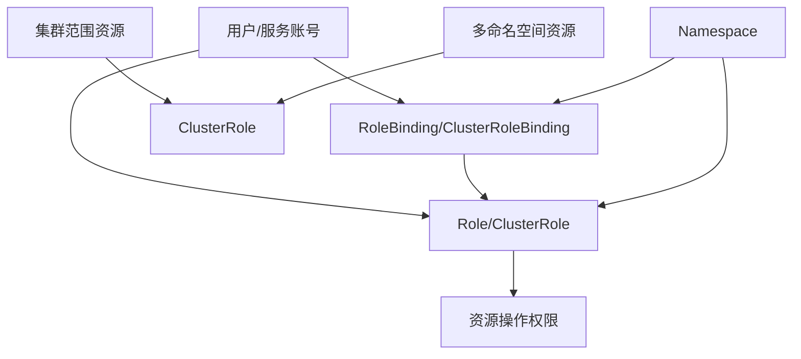

# Kubernetes安全设置  

Kubernetes作为容器编排平台，其安全性对于保护应用和数据至关重要。本文将详细介绍Kubernetes的安全架构、配置最佳实践以及常见安全风险的防范措施，帮助您构建一个安全可靠的Kubernetes环境。

## 1. 认证与授权  

Kubernetes安全的第一道防线是认证与授权机制，确保只有合法用户和服务能够访问集群资源。

### 1.1 认证方式对比  

Kubernetes支持多种认证方式，可以根据不同场景选择合适的认证机制：

| 认证类型       | 适用场景               | 配置示例              | 优点                 | 缺点                |
|----------------|----------------------|---------------------|---------------------|---------------------|
| X509证书        | 集群组件间通信        | kubeconfig文件配置   | 安全性高，无需中央服务 | 证书管理复杂         |
| Bearer Token    | 服务账号认证          | ServiceAccount Token | 易于集成，自动轮换    | 令牌泄露风险         |
| Webhook         | 集成外部认证系统      | OIDC/OAuth2集成     | 集中身份管理，SSO支持 | 依赖外部服务         |
| 基本认证         | 开发测试环境          | 用户名密码           | 配置简单             | 安全性低，不推荐生产  |
| Bootstrap Token | 节点引导加入集群      | kubeadm join        | 简化节点加入流程      | 临时使用，安全性有限  |

**X509证书认证示例**：

```yaml:c:\project\kphub\kubernetes\security\kubeconfig.yaml
apiVersion: v1
kind: Config
clusters:
- cluster:
    certificate-authority-data: <base64-encoded-ca>
    server: https://kubernetes.example.com:6443
  name: kubernetes
users:
- name: admin
  user:
    client-certificate-data: <base64-encoded-cert>
    client-key-data: <base64-encoded-key>
contexts:
- context:
    cluster: kubernetes
    user: admin
  name: admin@kubernetes
current-context: admin@kubernetes
```

**ServiceAccount Token认证**：

```yaml:c:\project\kphub\kubernetes\security\service-account.yaml
apiVersion: v1
kind: ServiceAccount
metadata:
  name: app-service-account
  namespace: default
---
apiVersion: v1
kind: Secret
metadata:
  name: app-service-account-token
  annotations:
    kubernetes.io/service-account.name: app-service-account
type: kubernetes.io/service-account-token
```

**OIDC认证配置**：

```yaml:c:\project\kphub\kubernetes\security\kube-apiserver-oidc.yaml
apiVersion: v1
kind: Pod
metadata:
  name: kube-apiserver
  namespace: kube-system
spec:
  containers:
  - name: kube-apiserver
    image: k8s.gcr.io/kube-apiserver:v1.23.0
    command:
    - kube-apiserver
    - --oidc-issuer-url=https://accounts.google.com
    - --oidc-client-id=kubernetes
    - --oidc-username-claim=email
    - --oidc-groups-claim=groups
```

### 1.2 RBAC权限模型  

基于角色的访问控制(RBAC)是Kubernetes的主要授权机制，通过定义角色和绑定来控制用户对资源的访问权限。



**RBAC核心组件**：

1. **Role**：命名空间级别的角色，定义对特定命名空间内资源的权限
2. **ClusterRole**：集群级别的角色，可以授予集群范围资源的权限
3. **RoleBinding**：将Role绑定到用户/组/服务账号，限定在特定命名空间
4. **ClusterRoleBinding**：将ClusterRole绑定到用户/组/服务账号，作用于整个集群

**RBAC权限粒度**：

- **资源(resources)**：pods, deployments, services等
- **动词(verbs)**：get, list, watch, create, update, patch, delete等
- **资源名称(resourceNames)**：限定特定资源实例
- **非资源URL**：/healthz, /metrics等API端点

## 2. RBAC配置实践  

RBAC配置是Kubernetes安全的基础，通过精细的权限控制减少安全风险。

### 2.1 角色定义  

**命名空间级别角色(Role)**：

```yaml:c:\project\kphub\kubernetes\security\role.yaml
apiVersion: rbac.authorization.k8s.io/v1
kind: Role
metadata:
  namespace: default
  name: pod-reader
rules:
- apiGroups: [""]  # 核心API组
  resources: ["pods"]  # 资源类型
  verbs: ["get", "watch", "list"]  # 允许的操作
  resourceNames: ["frontend", "backend"]  # 可选：限制特定资源实例
```

**集群级别角色(ClusterRole)**：

```yaml:c:\project\kphub\kubernetes\security\cluster-role.yaml
apiVersion: rbac.authorization.k8s.io/v1
kind: ClusterRole
metadata:
  name: node-reader
rules:
- apiGroups: [""]
  resources: ["nodes"]
  verbs: ["get", "list", "watch"]
- apiGroups: ["metrics.k8s.io"]
  resources: ["nodes"]
  verbs: ["get", "list", "watch"]
- nonResourceURLs: ["/healthz", "/version"]  # 非资源URL
  verbs: ["get"]
```

**常见预定义ClusterRole**：

1. **cluster-admin**：超级管理员，拥有所有权限
2. **admin**：命名空间管理员，可以管理命名空间内的大部分资源
3. **edit**：可以修改命名空间内的大部分资源，但不能修改角色和角色绑定
4. **view**：只读访问命名空间内的大部分资源

### 2.2 角色绑定  

**命名空间级别绑定(RoleBinding)**：

```yaml:c:\project\kphub\kubernetes\security\role-binding.yaml
apiVersion: rbac.authorization.k8s.io/v1
kind: RoleBinding
metadata:
  name: read-pods
  namespace: default
subjects:  # 可以绑定到多个主体
- kind: User  # 用户
  name: dev-user
  apiGroup: rbac.authorization.k8s.io
- kind: ServiceAccount  # 服务账号
  name: jenkins
  namespace: ci
- kind: Group  # 用户组
  name: system:developers
  apiGroup: rbac.authorization.k8s.io
roleRef:  # 引用的角色，只能引用一个
  kind: Role  # 或ClusterRole
  name: pod-reader
  apiGroup: rbac.authorization.k8s.io
```

**集群级别绑定(ClusterRoleBinding)**：

```yaml:c:\project\kphub\kubernetes\security\cluster-role-binding.yaml
apiVersion: rbac.authorization.k8s.io/v1
kind: ClusterRoleBinding
metadata:
  name: read-nodes
subjects:
- kind: Group
  name: system:monitoring
  apiGroup: rbac.authorization.k8s.io
roleRef:
  kind: ClusterRole
  name: node-reader
  apiGroup: rbac.authorization.k8s.io
```

### 2.3 服务账号权限配置

为应用程序配置适当的服务账号和权限：

```yaml:c:\project\kphub\kubernetes\security\app-rbac.yaml
# 1. 创建服务账号
apiVersion: v1
kind: ServiceAccount
metadata:
  name: app-sa
  namespace: production
---
# 2. 创建角色
apiVersion: rbac.authorization.k8s.io/v1
kind: Role
metadata:
  name: app-role
  namespace: production
rules:
- apiGroups: [""]
  resources: ["configmaps", "secrets"]
  verbs: ["get", "list"]
  resourceNames: ["app-config", "app-secret"]  # 限制只能访问特定资源
- apiGroups: [""]
  resources: ["pods"]
  verbs: ["get", "list", "watch"]
---
# 3. 绑定角色到服务账号
apiVersion: rbac.authorization.k8s.io/v1
kind: RoleBinding
metadata:
  name: app-role-binding
  namespace: production
subjects:
- kind: ServiceAccount
  name: app-sa
roleRef:
  kind: Role
  name: app-role
  apiGroup: rbac.authorization.k8s.io
---
# 4. 在Pod中使用服务账号
apiVersion: v1
kind: Pod
metadata:
  name: app-pod
  namespace: production
spec:
  serviceAccountName: app-sa  # 指定服务账号
  containers:
  - name: app
    image: myapp:1.0
```

### 2.4 RBAC最小权限原则

遵循最小权限原则配置RBAC：

1. **按职责划分角色**：为不同职责创建专用角色
2. **限制资源范围**：只授予必要资源的访问权限
3. **限制操作类型**：只授予必要的操作权限
4. **使用resourceNames**：限制对特定资源实例的访问
5. **定期审查权限**：移除不再需要的权限

**权限审计命令**：

```powershell
# 检查用户权限
kubectl auth can-i get pods --as=dev-user --namespace=default

# 列出所有可以执行特定操作的用户
kubectl get clusterrolebindings,rolebindings --all-namespaces -o json | ConvertFrom-Json | Select-Object -ExpandProperty items | Where-Object {$_.roleRef.name -eq "cluster-admin"}
```

## 3. Pod安全策略  

Pod是Kubernetes的基本执行单元，确保Pod安全对整个集群安全至关重要。

### 3.1 安全上下文配置  

Pod和容器级别的安全上下文(SecurityContext)允许定义权限和访问控制设置：

```yaml:c:\project\kphub\kubernetes\security\pod-security.yaml
apiVersion: v1
kind: Pod
metadata:
  name: security-context-demo
spec:
  # Pod级别安全上下文
  securityContext:
    runAsNonRoot: true  # 禁止以root用户运行
    runAsUser: 1000     # 指定用户ID
    runAsGroup: 3000    # 指定组ID
    fsGroup: 2000       # 文件系统组
    supplementalGroups: [1000, 2000]  # 额外的组
  containers:
  - name: secure-container
    image: nginx:1.20
    # 容器级别安全上下文（覆盖Pod级别）
    securityContext:
      runAsUser: 1001  # 容器特定用户ID
      allowPrivilegeEscalation: false  # 禁止权限提升
      capabilities:
        drop:  # 移除Linux capabilities
        - ALL
        add:   # 添加必要的capabilities
        - NET_BIND_SERVICE
      readOnlyRootFilesystem: true  # 只读根文件系统
      privileged: false  # 非特权容器
      procMount: Default  # proc挂载类型
    volumeMounts:
    - name: writable-volume
      mountPath: /var/cache/nginx  # 可写目录
  volumes:
  - name: writable-volume
    emptyDir: {}
```

**关键安全设置说明**：

1. **runAsNonRoot**: 防止容器以root用户运行，减少潜在风险
2. **capabilities**: 限制容器的Linux capabilities，遵循最小权限原则
3. **readOnlyRootFilesystem**: 防止容器修改其文件系统，增加安全性
4. **allowPrivilegeEscalation**: 防止进程获取比父进程更多的权限
5. **privileged**: 禁止特权容器，特权容器可以访问主机所有设备

### 3.2 PodSecurityPolicy示例  

PodSecurityPolicy(PSP)是集群级别的资源，用于控制Pod的安全敏感设置。注意：PSP在Kubernetes v1.21+已被弃用，将被Pod Security Admission取代。

```yaml:c:\project\kphub\kubernetes\security\pod-security-policy.yaml
apiVersion: policy/v1beta1
kind: PodSecurityPolicy
metadata:
  name: restricted
spec:
  privileged: false  # 禁止特权容器
  allowPrivilegeEscalation: false  # 禁止权限提升
  requiredDropCapabilities:  # 必须移除的capabilities
    - ALL
  defaultAddCapabilities: []  # 默认添加的capabilities
  allowedCapabilities: []  # 允许添加的capabilities
  
  # 用户和组设置
  runAsUser:
    rule: MustRunAsNonRoot  # 必须以非root用户运行
  runAsGroup:
    rule: MustRunAs  # 必须指定组
    ranges:
    - min: 1000
      max: 65535
  supplementalGroups:
    rule: MustRunAs
    ranges:
    - min: 1000
      max: 65535
  fsGroup:
    rule: MustRunAs
    ranges:
    - min: 1000
      max: 65535
  
  # 卷和文件系统设置
  volumes:  # 允许的卷类型
  - configMap
  - emptyDir
  - projected
  - secret
  - downwardAPI
  - persistentVolumeClaim
  readOnlyRootFilesystem: true  # 只读根文件系统
  
  # 主机命名空间设置
  hostNetwork: false  # 禁止使用主机网络
  hostIPC: false      # 禁止使用主机IPC
  hostPID: false      # 禁止使用主机PID
  
  # SELinux设置
  seLinux:
    rule: RunAsAny
```

**启用PodSecurityPolicy**：

```yaml:c:\project\kphub\kubernetes\security\psp-rbac.yaml
# 创建允许使用PSP的ClusterRole
apiVersion: rbac.authorization.k8s.io/v1
kind: ClusterRole
metadata:
  name: psp:restricted
rules:
- apiGroups: ['policy']
  resources: ['podsecuritypolicies']
  verbs: ['use']
  resourceNames: ['restricted']
---
# 绑定到所有已认证用户
apiVersion: rbac.authorization.k8s.io/v1
kind: ClusterRoleBinding
metadata:
  name: psp:authenticated
subjects:
- kind: Group
  name: system:authenticated
  apiGroup: rbac.authorization.k8s.io
roleRef:
  kind: ClusterRole
  name: psp:restricted
  apiGroup: rbac.authorization.k8s.io
```

### 3.3 Pod Security Standards

从Kubernetes v1.23开始，Pod Security Standards(PSS)作为PSP的替代方案，定义了三个安全级别：

1. **Privileged**: 不受限制的策略，等同于禁用Pod安全强制执行
2. **Baseline**: 最小限制策略，防止已知的权限提升
3. **Restricted**: 严格限制策略，遵循强化的最佳实践

**启用Pod Security Standards**：

```yaml:c:\project\kphub\kubernetes\security\pod-security-standards.yaml
apiVersion: v1
kind: Namespace
metadata:
  name: production
  labels:
    # 强制执行restricted策略
    pod-security.kubernetes.io/enforce: restricted
    # 在违反baseline策略时发出警告
    pod-security.kubernetes.io/warn: baseline
    # 在违反restricted策略时审计记录
    pod-security.kubernetes.io/audit: restricted
```

**符合Restricted策略的Pod示例**：

```yaml:c:\project\kphub\kubernetes\security\restricted-pod.yaml
apiVersion: v1
kind: Pod
metadata:
  name: restricted-pod
  namespace: production
spec:
  securityContext:
    runAsNonRoot: true
    seccompProfile:
      type: RuntimeDefault
  containers:
  - name: restricted-container
    image: nginx:1.20
    securityContext:
      allowPrivilegeEscalation: false
      capabilities:
        drop:
        - ALL
      runAsUser: 1000
      runAsGroup: 3000
      readOnlyRootFilesystem: true
```

## 4. 网络隔离  

Kubernetes网络策略允许控制Pod之间的通信，实现微分段和零信任网络架构。

### 4.1 NetworkPolicy配置  

NetworkPolicy资源定义了Pod间通信的规则：

```yaml:c:\project\kphub\kubernetes\security\network-policy.yaml
apiVersion: networking.k8s.io/v1
kind: NetworkPolicy
metadata:
  name: db-isolation
  namespace: production
spec:
  podSelector:  # 应用策略的Pod
    matchLabels:
      role: db
  policyTypes:  # 策略类型
  - Ingress     # 入站规则
  - Egress      # 出站规则
  ingress:      # 入站规则列表
  - from:       # 允许的来源
    - podSelector:  # 同命名空间的Pod
        matchLabels:
          role: api
    - namespaceSelector:  # 特定命名空间的所有Pod
        matchLabels:
          purpose: monitoring
    - ipBlock:    # IP地址范围
        cidr: 172.17.0.0/16
        except:   # 排除的IP
        - 172.17.1.0/24
    ports:       # 允许的端口
    - protocol: TCP
      port: 5432
  egress:        # 出站规则列表
  - to:          # 允许的目标
    - podSelector:
        matchLabels:
          role: logging
    ports:
    - protocol: TCP
      port: 12201
```

**网络策略的关键组件**：

1. **podSelector**: 确定策略应用到哪些Pod
2. **policyTypes**: 指定是入站规则(Ingress)、出站规则(Egress)或两者
3. **ingress/egress**: 定义允许的入站/出站连接
4. **from/to**: 指定允许的流量来源/目标
   - podSelector: 同命名空间内的Pod
   - namespaceSelector: 特定命名空间的Pod
   - ipBlock: IP地址范围
5. **ports**: 允许的协议和端口

### 4.2 默认拒绝规则  

实施零信任网络模型，默认拒绝所有流量，然后明确允许必要的通信：

```yaml:c:\project\kphub\kubernetes\security\default-deny.yaml
# 默认拒绝所有入站流量
apiVersion: networking.k8s.io/v1
kind: NetworkPolicy
metadata:
  name: default-deny-ingress
  namespace: production
spec:
  podSelector: {}  # 选择命名空间中的所有Pod
  policyTypes:
  - Ingress       # 只应用入站规则
---
# 默认拒绝所有出站流量
apiVersion: networking.k8s.io/v1
kind: NetworkPolicy
metadata:
  name: default-deny-egress
  namespace: production
spec:
  podSelector: {}
  policyTypes:
  - Egress        # 只应用出站规则
```

### 4.3 多层网络隔离策略

为不同类型的应用实施分层网络策略：

```yaml:c:\project\kphub\kubernetes\security\tiered-network-policy.yaml
# 1. 前端层 - 允许入站HTTP/HTTPS流量
apiVersion: networking.k8s.io/v1
kind: NetworkPolicy
metadata:
  name: frontend-policy
  namespace: production
spec:
  podSelector:
    matchLabels:
      tier: frontend
  policyTypes:
  - Ingress
  - Egress
  ingress:
  - ports:
    - port: 80
    - port: 443
  egress:
  - to:
    - podSelector:
        matchLabels:
          tier: api
    ports:
    - port: 8080

# 2. API层 - 只允许来自前端的流量
apiVersion: networking.k8s.io/v1
kind: NetworkPolicy
metadata:
  name: api-policy
  namespace: production
spec:
  podSelector:
    matchLabels:
      tier: api
  policyTypes:
  - Ingress
  - Egress
  ingress:
  - from:
    - podSelector:
        matchLabels:
          tier: frontend
    ports:
    - port: 8080
  egress:
  - to:
    - podSelector:
        matchLabels:
          tier: database
    ports:
    - port: 5432

# 3. 数据库层 - 只允许来自API的流量
apiVersion: networking.k8s.io/v1
kind: NetworkPolicy
metadata:
  name: database-policy
  namespace: production
spec:
  podSelector:
    matchLabels:
      tier: database
  policyTypes:
  - Ingress
  ingress:
  - from:
    - podSelector:
        matchLabels:
          tier: api
    ports:
    - port: 5432
```

### 4.4 网络策略最佳实践

1. **默认拒绝**：在所有命名空间实施默认拒绝策略
2. **分层防御**：为每个应用层实施专门的网络策略
3. **最小权限**：只允许必要的通信路径和端口
4. **命名空间隔离**：使用命名空间分隔不同环境和应用
5. **监控和审计**：监控网络流量并记录违规尝试

## 5. 密钥管理  

安全管理敏感信息是Kubernetes安全的重要组成部分。

### 5.1 Secret加密配置  

默认情况下，Kubernetes将Secret以Base64编码存储在etcd中，这不是真正的加密。启用etcd加密可以增强安全性：

```yaml:c:\project\kphub\kubernetes\security\encryption-config.yaml
apiVersion: apiserver.config.k8s.io/v1
kind: EncryptionConfiguration
resources:
  - resources:
    - secrets
    providers:
    - aescbc:  # AES-CBC加密
        keys:
        - name: key1
          secret: <base64-encoded-32-byte-key>
    - identity: {}  # 回退到未加密
```

**生成加密密钥**：

```powershell
# 生成随机32字节密钥
$key = New-Object byte[] 32
[Security.Cryptography.RNGCryptoServiceProvider]::Create().GetBytes($key)
$encodedKey = [Convert]::ToBase64String($key)
Write-Output $encodedKey

# 创建加密配置文件
$encryptionConfig = @"
apiVersion: apiserver.config.k8s.io/v1
kind: EncryptionConfiguration
resources:
  - resources:
    - secrets
    providers:
    - aescbc:
        keys:
        - name: key1
          secret: $encodedKey
    - identity: {}
"@

# 保存到文件
$encryptionConfig | Out-File -FilePath c:\project\kphub\kubernetes\security\encryption-config.yaml -Encoding utf8

# 创建包含加密配置的Secret
kubectl create secret generic encryption-key `
  --from-file=c:\project\kphub\kubernetes\security\encryption-config.yaml `
  -n kube-system
```

**配置API服务器使用加密**：

```yaml:c:\project\kphub\kubernetes\security\kube-apiserver-encryption.yaml
apiVersion: v1
kind: Pod
metadata:
  name: kube-apiserver
  namespace: kube-system
spec:
  containers:
  - name: kube-apiserver
    image: k8s.gcr.io/kube-apiserver:v1.23.0
    command:
    - kube-apiserver
    - --encryption-provider-config=/etc/kubernetes/encryption/encryption-config.yaml
    volumeMounts:
    - name: encryption-config
      mountPath: /etc/kubernetes/encryption
      readOnly: true
  volumes:
  - name: encryption-config
    secret:
      secretName: encryption-key
```

### 5.2 密钥轮换策略  

定期轮换加密密钥是安全最佳实践：

```yaml:c:\project\kphub\kubernetes\security\encryption-rotation.yaml
apiVersion: apiserver.config.k8s.io/v1
kind: EncryptionConfiguration
resources:
  - resources:
    - secrets
    providers:
    - aescbc:
        keys:
        - name: key2  # 新密钥放在第一位
          secret: <new-base64-encoded-key>
        - name: key1  # 旧密钥
          secret: <old-base64-encoded-key>
    - identity: {}
```

**密钥轮换流程**：

1. 添加新密钥到providers列表的第一位
2. 重启API服务器
3. 重新创建所有Secret以使用新密钥加密：

```powershell
# 获取所有Secret并重新应用
kubectl get secrets --all-namespaces -o json | ConvertFrom-Json | 
  Select-Object -ExpandProperty items | 
  ForEach-Object {
    $name = $_.metadata.name
    $namespace = $_.metadata.namespace
    $type = $_.type
    $data = $_.data
    
    # 跳过Kubernetes管理的Secret
    if ($name -notmatch "^(default-token|kubernetes)") {
      # 创建临时文件
      $tempFile = New-TemporaryFile
      $_ | ConvertTo-Json -Depth 100 | Out-File $tempFile
      
      # 重新应用Secret
      kubectl replace -f $tempFile
      
      # 删除临时文件
      Remove-Item $tempFile
    }
  }
```

4. 移除旧密钥
5. 重启API服务器

### 5.3 外部密钥管理集成

对于更高级的密钥管理，可以集成外部密钥管理系统：

**使用HashiCorp Vault**：

```yaml:c:\project\kphub\kubernetes\security\vault-agent.yaml
apiVersion: v1
kind: Pod
metadata:
  name: app-with-vault
spec:
  serviceAccountName: vault-auth
  containers:
  - name: app
    image: app:1.0
    volumeMounts:
    - name: secrets
      mountPath: /etc/secrets
      readOnly: true
  initContainers:
  - name: vault-agent
    image: vault:1.9.0
    command: ['vault', 'agent', '-config=/etc/vault/config.hcl']
    volumeMounts:
    - name: vault-config
      mountPath: /etc/vault
    - name: secrets
      mountPath: /etc/secrets
  volumes:
  - name: vault-config
    configMap:
      name: vault-agent-config
  - name: secrets
    emptyDir:
      medium: Memory
```

**使用AWS Secrets Manager**：

```yaml:c:\project\kphub\kubernetes\security\aws-secrets-operator.yaml
apiVersion: secrets-store.csi.x-k8s.io/v1
kind: SecretProviderClass
metadata:
  name: aws-secrets
spec:
  provider: aws
  parameters:
    objects: |
      - objectName: "production/db-credentials"
        objectType: "secretsmanager"
        objectAlias: "db-credentials.json"
---
apiVersion: v1
kind: Pod
metadata:
  name: app-with-aws-secrets
spec:
  containers:
  - name: app
    image: app:1.0
    volumeMounts:
    - name: secrets-store
      mountPath: "/mnt/secrets-store"
      readOnly: true
  volumes:
  - name: secrets-store
    csi:
      driver: secrets-store.csi.k8s.io
      readOnly: true
      volumeAttributes:
        secretProviderClass: "aws-secrets"
```

## 6. 审计日志  

审计日志记录集群中的所有操作，对于安全监控和合规性至关重要。

### 6.1 审计策略配置  

配置Kubernetes API服务器的审计策略：

```yaml:c:\project\kphub\kubernetes\security\audit-policy.yaml
apiVersion: audit.k8s.io/v1
kind: Policy
# 不记录的请求
omitStages:
  - "RequestReceived"
#
继续完成Kubernetes安全设置文档：

```yaml:c:\project\kphub\kubernetes\security\audit-policy.yaml
apiVersion: audit.k8s.io/v1
kind: Policy
# 不记录的请求
omitStages:
  - "RequestReceived"
# 默认审计级别
rules:
  # 记录Pod操作的请求和响应体
  - level: RequestResponse
    resources:
    - group: ""
      resources: ["pods"]
  
  # 记录Secret的元数据，但不记录内容
  - level: Metadata
    resources:
    - group: ""
      resources: ["secrets"]
  
  # 记录ConfigMap的变更
  - level: Request
    resources:
    - group: ""
      resources: ["configmaps"]
    verbs: ["create", "update", "patch", "delete"]
  
  # 记录认证和授权失败
  - level: Metadata
    userGroups: ["system:unauthenticated"]
    verbs: ["*"]
  
  # 记录持久卷操作
  - level: Request
    resources:
    - group: ""
      resources: ["persistentvolumes", "persistentvolumeclaims"]
  
  # 记录RBAC变更
  - level: Request
    resources:
    - group: "rbac.authorization.k8s.io"
      resources: ["roles", "rolebindings", "clusterroles", "clusterrolebindings"]
  
  # 其他资源使用较低的审计级别
  - level: Metadata
    resources:
    - group: "" # 核心API组
```

**配置API服务器启用审计日志**：

```yaml:c:\project\kphub\kubernetes\security\kube-apiserver-audit.yaml
apiVersion: v1
kind: Pod
metadata:
  name: kube-apiserver
  namespace: kube-system
spec:
  containers:
  - name: kube-apiserver
    image: k8s.gcr.io/kube-apiserver:v1.23.0
    command:
    - kube-apiserver
    - --audit-policy-file=/etc/kubernetes/audit/audit-policy.yaml
    - --audit-log-path=/var/log/kubernetes/audit/audit.log
    - --audit-log-maxage=30
    - --audit-log-maxbackup=10
    - --audit-log-maxsize=100
    volumeMounts:
    - name: audit-policy
      mountPath: /etc/kubernetes/audit
      readOnly: true
    - name: audit-log
      mountPath: /var/log/kubernetes/audit
  volumes:
  - name: audit-policy
    configMap:
      name: audit-policy
  - name: audit-log
    hostPath:
      path: /var/log/kubernetes/audit
      type: DirectoryOrCreate
```

### 6.2 日志收集与分析

收集和分析审计日志对于安全监控至关重要：

```powershell
# 从API服务器Pod收集审计日志
kubectl logs -n kube-system kube-apiserver-node-1 > c:\project\kphub\kubernetes\security\audit.log

# 使用PowerShell分析审计日志
Get-Content c:\project\kphub\kubernetes\security\audit.log | ConvertFrom-Json | 
  Where-Object { $_.user.username -ne "system:serviceaccount:kube-system:deployment-controller" } |
  Where-Object { $_.verb -in @("create", "update", "delete", "patch") } |
  Select-Object -Property @{Name="Time";Expression={$_.requestReceivedTimestamp}}, 
                          @{Name="User";Expression={$_.user.username}}, 
                          @{Name="Resource";Expression={$_.objectRef.resource}}, 
                          @{Name="Name";Expression={$_.objectRef.name}}, 
                          @{Name="Namespace";Expression={$_.objectRef.namespace}}, 
                          @{Name="Operation";Expression={$_.verb}} |
  Format-Table -AutoSize
```

**使用ELK Stack分析审计日志**：

```yaml:c:\project\kphub\kubernetes\security\filebeat-audit.yaml
apiVersion: v1
kind: ConfigMap
metadata:
  name: filebeat-config
  namespace: logging
data:
  filebeat.yml: |-
    filebeat.inputs:
    - type: log
      enabled: true
      paths:
        - /var/log/kubernetes/audit/audit.log
      json.keys_under_root: true
      json.add_error_key: true
      
    output.elasticsearch:
      hosts: ["elasticsearch:9200"]
      index: "k8s-audit-%{+yyyy.MM.dd}"
---
apiVersion: apps/v1
kind: DaemonSet
metadata:
  name: filebeat
  namespace: logging
spec:
  selector:
    matchLabels:
      app: filebeat
  template:
    metadata:
      labels:
        app: filebeat
    spec:
      serviceAccountName: filebeat
      containers:
      - name: filebeat
        image: docker.elastic.co/beats/filebeat:7.15.0
        volumeMounts:
        - name: config
          mountPath: /usr/share/filebeat/filebeat.yml
          subPath: filebeat.yml
        - name: audit-logs
          mountPath: /var/log/kubernetes/audit
          readOnly: true
      volumes:
      - name: config
        configMap:
          name: filebeat-config
      - name: audit-logs
        hostPath:
          path: /var/log/kubernetes/audit
```

### 6.3 审计告警设置

设置关键操作的审计告警：

```yaml:c:\project\kphub\kubernetes\security\audit-alerts.yaml
apiVersion: monitoring.coreos.com/v1
kind: PrometheusRule
metadata:
  name: audit-alerts
  namespace: monitoring
spec:
  groups:
  - name: audit
    rules:
    - alert: UnauthorizedAccessAttempt
      expr: sum(rate(apiserver_request_total{code=~"401|403"}[5m])) by (user, resource) > 5
      for: 1m
      labels:
        severity: warning
      annotations:
        summary: "检测到未授权访问尝试"
        description: "用户 {{ $labels.user }} 尝试访问 {{ $labels.resource }} 但被拒绝"
    
    - alert: PrivilegedContainerCreated
      expr: kube_pod_container_info{container="privileged"} > 0
      for: 1m
      labels:
        severity: critical
      annotations:
        summary: "创建了特权容器"
        description: "命名空间 {{ $labels.namespace }} 中创建了特权容器 {{ $labels.container }}"
    
    - alert: SecretModification
      expr: sum(rate(apiserver_request_total{resource="secrets",verb=~"create|update|patch|delete"}[5m])) by (user, namespace) > 0
      for: 1m
      labels:
        severity: warning
      annotations:
        summary: "Secret被修改"
        description: "用户 {{ $labels.user }} 修改了命名空间 {{ $labels.namespace }} 中的Secret"
```

## 7. 安全加固检查  

定期进行安全检查和合规性评估是维护Kubernetes安全的关键。

### 7.1 CIS基准测试  

CIS Kubernetes基准提供了安全配置的最佳实践：

```powershell
# 安装kube-bench
kubectl apply -f https://raw.githubusercontent.com/aquasecurity/kube-bench/main/job.yaml

# 运行CIS基准测试
kubectl logs -l app=kube-bench

# 使用本地kube-bench
kube-bench run --targets master,node --benchmark cis-1.6
```

**CIS基准检查示例**：

```yaml:c:\project\kphub\kubernetes\security\kube-bench-job.yaml
apiVersion: batch/v1
kind: Job
metadata:
  name: kube-bench
spec:
  template:
    spec:
      hostPID: true
      containers:
      - name: kube-bench
        image: aquasec/kube-bench:latest
        command: ["kube-bench", "--benchmark", "cis-1.6"]
        volumeMounts:
        - name: var-lib-kubelet
          mountPath: /var/lib/kubelet
          readOnly: true
        - name: etc-kubernetes
          mountPath: /etc/kubernetes
          readOnly: true
      restartPolicy: Never
      volumes:
      - name: var-lib-kubelet
        hostPath:
          path: /var/lib/kubelet
      - name: etc-kubernetes
        hostPath:
          path: /etc/kubernetes
```

### 7.2 漏洞扫描工具  

使用容器和Kubernetes漏洞扫描工具：

```powershell
# 安装Trivy
choco install trivy -y

# 扫描容器镜像
trivy image nginx:1.20

# 扫描Kubernetes资源
trivy k8s --report summary all

# 扫描特定命名空间
trivy k8s --namespace production --report summary all
```

**集成Trivy到CI/CD流程**：

```yaml:c:\project\kphub\kubernetes\security\trivy-pipeline.yaml
name: Security Scan

on:
  push:
    branches: [ main ]
  pull_request:
    branches: [ main ]

jobs:
  scan:
    runs-on: ubuntu-latest
    steps:
    - uses: actions/checkout@v2
    
    - name: Build image
      run: docker build -t myapp:${{ github.sha }} .
    
    - name: Scan image
      uses: aquasecurity/trivy-action@master
      with:
        image-ref: 'myapp:${{ github.sha }}'
        format: 'sarif'
        output: 'trivy-results.sarif'
        severity: 'CRITICAL,HIGH'
        exit-code: '1'
        ignore-unfixed: true
    
    - name: Upload Trivy scan results
      uses: github/codeql-action/upload-sarif@v1
      with:
        sarif_file: 'trivy-results.sarif'
```

### 7.3 运行时安全监控

使用Falco进行运行时安全监控：

```yaml:c:\project\kphub\kubernetes\security\falco.yaml
apiVersion: apps/v1
kind: DaemonSet
metadata:
  name: falco
  namespace: security
spec:
  selector:
    matchLabels:
      app: falco
  template:
    metadata:
      labels:
        app: falco
    spec:
      containers:
      - name: falco
        image: falcosecurity/falco:0.30.0
        securityContext:
          privileged: true
        volumeMounts:
        - name: dev-fs
          mountPath: /host/dev
        - name: proc-fs
          mountPath: /host/proc
          readOnly: true
        - name: boot-fs
          mountPath: /host/boot
          readOnly: true
        - name: lib-modules
          mountPath: /host/lib/modules
          readOnly: true
        - name: usr-fs
          mountPath: /host/usr
          readOnly: true
        - name: falco-config
          mountPath: /etc/falco
      volumes:
      - name: dev-fs
        hostPath:
          path: /dev
      - name: proc-fs
        hostPath:
          path: /proc
      - name: boot-fs
        hostPath:
          path: /boot
      - name: lib-modules
        hostPath:
          path: /lib/modules
      - name: usr-fs
        hostPath:
          path: /usr
      - name: falco-config
        configMap:
          name: falco-config
```

**Falco规则示例**：

```yaml:c:\project\kphub\kubernetes\security\falco-rules.yaml
apiVersion: v1
kind: ConfigMap
metadata:
  name: falco-rules
  namespace: security
data:
  falco_rules.local.yaml: |-
    - rule: Terminal shell in container
      desc: A shell was spawned by a pod in the Kubernetes cluster
      condition: container and container.image != "falco" and shell_procs and evt.type != "execve"
      output: Shell opened in container (user=%user.name container=%container.name pod=%k8s.pod.name ns=%k8s.ns.name image=%container.image)
      priority: WARNING
      
    - rule: Privilege Escalation
      desc: Detect privilege escalation via sudo or su
      condition: spawned_process and proc.name in (sudo, su)
      output: Privilege escalation detected (user=%user.name command=%proc.cmdline container=%container.name pod=%k8s.pod.name)
      priority: CRITICAL
      
    - rule: Sensitive File Access
      desc: Detect access to sensitive files
      condition: open_read and fd.name startswith /etc/shadow
      output: Sensitive file accessed (user=%user.name file=%fd.name command=%proc.cmdline container=%container.name pod=%k8s.pod.name)
      priority: CRITICAL
```

## 8. 安全最佳实践

### 8.1 容器镜像安全

确保容器镜像安全是Kubernetes安全的基础：

```yaml:c:\project\kphub\kubernetes\security\secure-pod-image.yaml
apiVersion: v1
kind: Pod
metadata:
  name: secure-image-pod
spec:
  containers:
  - name: app
    image: myregistry.example.com/app:1.0@sha256:abcdef123456  # 使用镜像摘要而非标签
    imagePullPolicy: Always  # 始终拉取最新镜像
  imagePullSecrets:
  - name: registry-credentials  # 私有仓库凭证
```

**镜像安全最佳实践**：

1. **使用最小基础镜像**：Alpine或distroless镜像
2. **扫描镜像漏洞**：使用Trivy、Clair等工具
3. **签名和验证镜像**：使用Notary或Cosign
4. **使用镜像摘要**：确保镜像不可变性
5. **定期更新基础镜像**：修复已知漏洞

### 8.2 多租户安全隔离

在多租户环境中实现安全隔离：

```yaml:c:\project\kphub\kubernetes\security\tenant-isolation.yaml
# 1. 命名空间隔离
apiVersion: v1
kind: Namespace
metadata:
  name: tenant-a
  labels:
    tenant: a
---
# 2. 资源配额
apiVersion: v1
kind: ResourceQuota
metadata:
  name: tenant-quota
  namespace: tenant-a
spec:
  hard:
    pods: "20"
    requests.cpu: "2"
    requests.memory: 2Gi
    limits.cpu: "4"
    limits.memory: 4Gi
---
# 3. 网络隔离
apiVersion: networking.k8s.io/v1
kind: NetworkPolicy
metadata:
  name: tenant-isolation
  namespace: tenant-a
spec:
  podSelector: {}
  policyTypes:
  - Ingress
  - Egress
  ingress:
  - from:
    - namespaceSelector:
        matchLabels:
          tenant: a
  egress:
  - to:
    - namespaceSelector:
        matchLabels:
          tenant: a
  - to:
    - namespaceSelector:
        matchLabels:
          common: true  # 允许访问共享服务
---
# 4. RBAC隔离
apiVersion: rbac.authorization.k8s.io/v1
kind: RoleBinding
metadata:
  name: tenant-admin
  namespace: tenant-a
subjects:
- kind: User
  name: tenant-a-admin
  apiGroup: rbac.authorization.k8s.io
roleRef:
  kind: ClusterRole
  name: admin
  apiGroup: rbac.authorization.k8s.io
```

### 8.3 安全更新策略

实施安全的Kubernetes更新策略：

```yaml:c:\project\kphub\kubernetes\security\update-strategy.yaml
apiVersion: apps/v1
kind: Deployment
metadata:
  name: secure-app
spec:
  replicas: 3
  strategy:
    type: RollingUpdate
    rollingUpdate:
      maxUnavailable: 1
      maxSurge: 1
  selector:
    matchLabels:
      app: secure-app
  template:
    metadata:
      labels:
        app: secure-app
    spec:
      containers:
      - name: app
        image: myapp:1.0
        securityContext:
          runAsNonRoot: true
          readOnlyRootFilesystem: true
        startupProbe:  # 确保容器正常启动
          httpGet:
            path: /healthz
            port: 8080
          failureThreshold: 30
          periodSeconds: 10
        livenessProbe:  # 检测运行时问题
          httpGet:
            path: /healthz
            port: 8080
          initialDelaySeconds: 60
          periodSeconds: 15
        readinessProbe:  # 确保流量只发送到就绪的Pod
          httpGet:
            path: /ready
            port: 8080
          initialDelaySeconds: 5
          periodSeconds: 5
```

**更新安全最佳实践**：

1. **使用滚动更新**：减少服务中断
2. **实施金丝雀发布**：逐步推出更新
3. **配置健康检查**：确保只有健康的Pod接收流量
4. **设置更新超时**：防止更新卡住
5. **准备回滚计划**：在更新失败时快速恢复

### 8.4 灾难恢复计划

为Kubernetes集群制定灾难恢复计划：

```yaml:c:\project\kphub\kubernetes\security\backup-job.yaml
apiVersion: batch/v1
kind: CronJob
metadata:
  name: etcd-backup
  namespace: kube-system
spec:
  schedule: "0 1 * * *"  # 每天凌晨1点
  jobTemplate:
    spec:
      template:
        spec:
          containers:
          - name: etcd-backup
            image: bitnami/etcd:latest
            command:
            - /bin/sh
            - -c
            - |
              ETCDCTL_API=3 etcdctl --endpoints=https://127.0.0.1:2379 \
                --cacert=/etc/kubernetes/pki/etcd/ca.crt \
                --cert=/etc/kubernetes/pki/etcd/server.crt \
                --key=/etc/kubernetes/pki/etcd/server.key \
                snapshot save /backup/etcd-snapshot-$(date +%Y%m%d-%H%M%S).db && \
              echo "Backup completed successfully"
            volumeMounts:
            - name: etcd-certs
              mountPath: /etc/kubernetes/pki/etcd
              readOnly: true
            - name: backup
              mountPath: /backup
          restartPolicy: OnFailure
          volumes:
          - name: etcd-certs
            hostPath:
              path: /etc/kubernetes/pki/etcd
              type: Directory
          - name: backup
            persistentVolumeClaim:
              claimName: etcd-backup-pvc
```

**灾难恢复最佳实践**：

1. **定期备份etcd**：Kubernetes集群状态的核心
2. **备份Kubernetes资源**：使用Velero等工具
3. **多区域备份**：将备份存储在不同区域
4. **定期测试恢复**：验证备份的有效性
5. **文档化恢复流程**：确保团队了解恢复步骤
6. **自动化恢复流程**：减少人为错误

## 总结

Kubernetes安全是一个多层次的挑战，需要从多个方面进行防护。通过实施本文介绍的安全措施，可以显著提高Kubernetes环境的安全性：

1. **认证与授权**：使用RBAC实施最小权限原则，确保用户和服务只能访问必要的资源
2. **Pod安全**：使用SecurityContext和Pod Security Standards限制容器权限
3. **网络安全**：实施NetworkPolicy实现微分段，限制Pod间通信
4. **密钥管理**：加密存储敏感信息，定期轮换密钥
5. **审计与监控**：启用审计日志，监控异常活动
6. **合规性检查**：定期进行CIS基准测试和漏洞扫描
7. **运行时安全**：使用Falco等工具监控运行时行为

对于生产环境，建议采用"深度防御"策略，结合多层安全控制。定期进行安全评估和演练，确保团队能够有效应对安全事件。随着Kubernetes生态系统的发展，及时了解和应用新的安全最佳实践也至关重要。

记住，Kubernetes安全是一个持续的过程，而非一次性的工作。通过持续改进和适应新的威胁，可以保持Kubernetes环境的安全性。