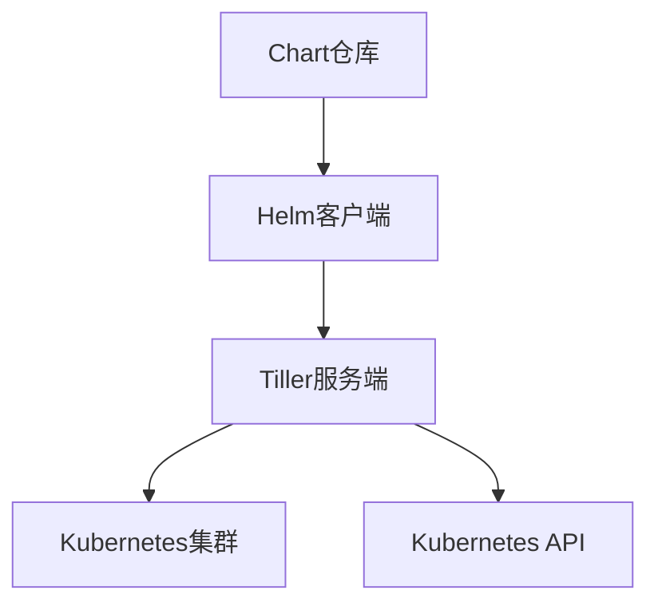
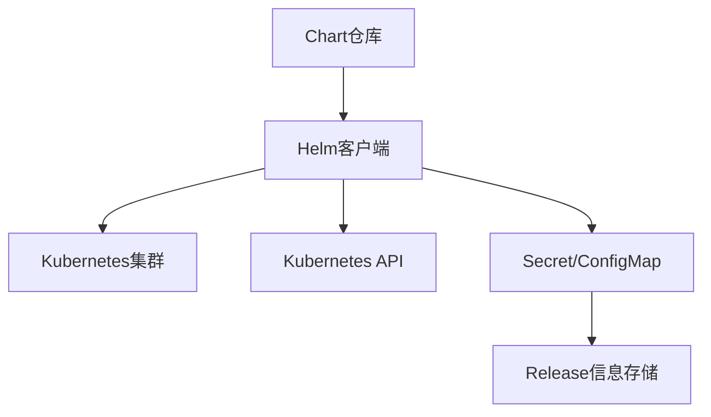
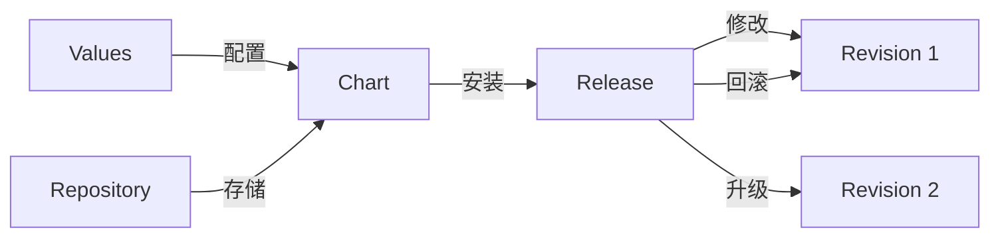

# Helm包管理工具使用  

Helm是Kubernetes的包管理工具，类似于Linux中的apt、yum或Node.js中的npm。它简化了Kubernetes应用的部署和管理，通过预定义的"图表"(Charts)来打包、配置和部署应用到Kubernetes集群。本文将详细介绍Helm的核心概念、使用方法以及最佳实践。

## 1. Helm核心概念  

Helm通过几个关键概念构建了一个强大的包管理系统，理解这些概念对于有效使用Helm至关重要。

### 1.1 组件架构  

Helm的架构随着版本演进发生了变化。Helm 3移除了Tiller服务端组件，采用了更安全的客户端架构。

**Helm 2架构(已弃用)：**



**Helm 3架构(当前)：**



**架构变化说明：**
- Helm 2使用客户端-服务端架构，Tiller在集群内运行并管理发布
- Helm 3移除了Tiller，直接使用Kubernetes API和用户凭证
- 发布信息现在存储在Secret或ConfigMap中，而不是集中存储在Tiller中
- 安全性得到提升，权限控制更加精细

### 1.2 核心术语  

理解Helm的核心术语对于使用和开发Helm Charts至关重要：

| 术语       | 说明                          | 类比                   | 示例                  |
|------------|-----------------------------|------------------------|----------------------|
| Chart      | 应用打包模板                  | 软件安装包              | mysql, nginx, redis  |
| Release    | 运行中的Chart实例             | 已安装的软件实例         | production-mysql     |
| Repository | Chart存储仓库                | 软件仓库                | bitnami, stable      |
| Values     | Chart的配置值                | 软件配置参数            | 副本数、镜像标签       |
| Template   | 资源定义模板                  | 配置文件模板            | deployment.yaml      |
| Revision   | Release的版本历史            | 软件更新历史            | mysql-v1, mysql-v2   |

**核心概念关系图：**



## 2. Chart开发指南  

Chart是Helm的核心，它包含了部署应用所需的所有Kubernetes资源定义和配置。

### 2.1 目录结构  

一个标准的Helm Chart目录结构如下：

```text:c:\project\kphub\kubernetes\helm\mychart\
mychart/
├── Chart.yaml          # Chart的元数据信息
├── values.yaml         # 默认配置值
├── charts/             # 依赖的子Chart
├── templates/          # 模板文件目录
│   ├── deployment.yaml # Kubernetes Deployment定义
│   ├── service.yaml    # Kubernetes Service定义
│   ├── ingress.yaml    # Kubernetes Ingress定义
│   ├── configmap.yaml  # Kubernetes ConfigMap定义
│   ├── secret.yaml     # Kubernetes Secret定义
│   ├── NOTES.txt       # 安装说明
│   └── _helpers.tpl    # 模板辅助函数
├── crds/               # 自定义资源定义(CRDs)
├── templates/tests/    # 测试模板
└── README.md           # 文档说明
```

**Chart.yaml文件示例：**

```yaml:c:\project\kphub\kubernetes\helm\mychart\Chart.yaml
apiVersion: v2                # Helm API版本
name: mychart                 # Chart名称
version: 0.1.0                # Chart版本
description: A Helm chart for Kubernetes  # 描述
type: application             # Chart类型(application或library)
appVersion: "1.16.0"          # 应用版本
maintainers:                  # 维护者信息
  - name: John Doe
    email: john@example.com
dependencies:                 # 依赖的其他Chart
  - name: mysql
    version: 8.8.0
    repository: https://charts.bitnami.com/bitnami
    condition: mysql.enabled  # 条件安装
```

### 2.2 模板语法示例  

Helm使用Go模板语言来动态生成Kubernetes资源定义。以下是一些常用的模板语法示例：

**基本变量引用：**

```yaml:c:\project\kphub\kubernetes\helm\mychart\templates\deployment.yaml
apiVersion: apps/v1
kind: Deployment
metadata:
  name: {{ .Release.Name }}-web  # 使用Release名称
  labels:
    app: {{ .Chart.Name }}       # 使用Chart名称
    chart: "{{ .Chart.Name }}-{{ .Chart.Version }}"
    release: {{ .Release.Name }}
    heritage: {{ .Release.Service }}
spec:
  replicas: {{ .Values.replicaCount }}  # 从values.yaml获取副本数
  selector:
    matchLabels:
      app: {{ .Chart.Name }}
      release: {{ .Release.Name }}
  template:
    metadata:
      labels:
        app: {{ .Chart.Name }}
        release: {{ .Release.Name }}
    spec:
      containers:
      - name: {{ .Chart.Name }}
        image: "{{ .Values.image.repository }}:{{ .Values.image.tag }}"
        imagePullPolicy: {{ .Values.image.pullPolicy }}
        ports:
        - containerPort: {{ .Values.service.port }}
          name: http
        resources:
{{ toYaml .Values.resources | indent 12 }}  # 转换YAML并缩进
```

**条件语句：**

```yaml:c:\project\kphub\kubernetes\helm\mychart\templates\service.yaml
apiVersion: v1
kind: Service
metadata:
  name: {{ .Release.Name }}-service
  {{- if .Values.service.annotations }}  # 条件判断
  annotations:
    {{- range $key, $value := .Values.service.annotations }}
    {{ $key }}: {{ $value | quote }}
    {{- end }}
  {{- end }}
spec:
  type: {{ .Values.service.type }}
  ports:
  - port: {{ .Values.service.port }}
    targetPort: http
    protocol: TCP
    name: http
  selector:
    app: {{ .Chart.Name }}
    release: {{ .Release.Name }}
```

**循环语句：**

```yaml:c:\project\kphub\kubernetes\helm\mychart\templates\configmap.yaml
apiVersion: v1
kind: ConfigMap
metadata:
  name: {{ .Release.Name }}-configmap
data:
  {{- range $key, $val := .Values.configData }}
  {{ $key }}: {{ $val | quote }}
  {{- end }}
  {{- range .Values.servers }}
  server-{{ .name }}: {{ .address | quote }}
  {{- end }}
```

**辅助函数定义(_helpers.tpl)：**

```yaml:c:\project\kphub\kubernetes\helm\mychart\templates\_helpers.tpl
{{/* 生成应用名称 */}}
{{- define "mychart.name" -}}
{{- default .Chart.Name .Values.nameOverride | trunc 63 | trimSuffix "-" -}}
{{- end -}}

{{/* 生成完整名称 */}}
{{- define "mychart.fullname" -}}
{{- if .Values.fullnameOverride -}}
{{- .Values.fullnameOverride | trunc 63 | trimSuffix "-" -}}
{{- else -}}
{{- $name := default .Chart.Name .Values.nameOverride -}}
{{- printf "%s-%s" .Release.Name $name | trunc 63 | trimSuffix "-" -}}
{{- end -}}
{{- end -}}
```

**使用辅助函数：**

```yaml:c:\project\kphub\kubernetes\helm\mychart\templates\ingress.yaml
apiVersion: networking.k8s.io/v1
kind: Ingress
metadata:
  name: {{ template "mychart.fullname" . }}  # 使用辅助函数
  labels:
    app: {{ template "mychart.name" . }}
spec:
  rules:
  {{- range .Values.ingress.hosts }}
  - host: {{ . }}
    http:
      paths:
      - path: /
        pathType: Prefix
        backend:
          service:
            name: {{ template "mychart.fullname" $ }}
            port:
              number: {{ $.Values.service.port }}
  {{- end }}
```

### 2.3 values.yaml配置

values.yaml文件定义了Chart的默认配置值：

```yaml:c:\project\kphub\kubernetes\helm\mychart\values.yaml
# 应用配置
replicaCount: 1

image:
  repository: nginx
  tag: "1.21.6"
  pullPolicy: IfNotPresent

nameOverride: ""
fullnameOverride: ""

# 服务配置
service:
  type: ClusterIP
  port: 80
  annotations:
    prometheus.io/scrape: "true"

# 资源限制
resources:
  limits:
    cpu: 100m
    memory: 128Mi
  requests:
    cpu: 50m
    memory: 64Mi

# Ingress配置
ingress:
  enabled: false
  hosts:
    - chart-example.local

# 配置数据
configData:
  log_level: info
  max_connections: "100"

# 服务器列表
servers:
  - name: server1
    address: 192.168.1.1
  - name: server2
    address: 192.168.1.2

# 数据库配置
mysql:
  enabled: true
  rootPassword: "password"
```

## 3. 仓库管理  

Helm Chart仓库是存储和共享Chart的地方，类似于Docker镜像仓库。

### 3.1 添加仓库  

添加和管理Helm仓库的常用命令：

```powershell
# 添加官方仓库
helm repo add stable https://charts.helm.sh/stable

# 添加Bitnami仓库
helm repo add bitnami https://charts.bitnami.com/bitnami

# 添加Azure仓库
helm repo add azure https://mirror.azure.cn/kubernetes/charts/

# 更新所有仓库
helm repo update

# 列出所有仓库
helm repo list

# 搜索Chart
helm search repo nginx

# 查看Chart详细信息
helm show chart bitnami/nginx
helm show values bitnami/nginx
helm show all bitnami/nginx

# 删除仓库
helm repo remove bitnami
```

### 3.2 本地仓库搭建  

可以搭建私有Helm仓库来存储和分享内部开发的Chart：

**使用本地文件系统(简单方式)：**

```powershell
# 创建本地仓库目录
mkdir c:\project\kphub\kubernetes\helm\repo

# 打包Chart
helm package c:\project\kphub\kubernetes\helm\mychart -d c:\project\kphub\kubernetes\helm\repo

# 生成索引文件
helm repo index c:\project\kphub\kubernetes\helm\repo --url http://localhost:8080

# 使用简单HTTP服务器提供仓库访问
cd c:\project\kphub\kubernetes\helm\repo
python -m http.server 8080

# 添加本地仓库
helm repo add local http://localhost:8080
```

**使用ChartMuseum(生产环境推荐)：**

```powershell
# 安装ChartMuseum
helm repo add chartmuseum https://chartmuseum.github.io/charts
helm install chartmuseum chartmuseum/chartmuseum --set env.open.STORAGE=local --set persistence.enabled=true --set persistence.size=10Gi

# 获取ChartMuseum访问地址
$SERVICE_IP=$(kubectl get svc --namespace default chartmuseum -o jsonpath='{.status.loadBalancer.ingress[0].ip}')
$SERVICE_PORT=$(kubectl get svc --namespace default chartmuseum -o jsonpath='{.spec.ports[0].port}')
echo http://$SERVICE_IP:$SERVICE_PORT

# 添加ChartMuseum仓库
helm repo add myrepo http://$SERVICE_IP:$SERVICE_PORT
```

**使用Harbor(企业级解决方案)：**

Harbor是一个企业级的容器镜像仓库，也支持Helm Chart存储：

```powershell
# 安装Harbor
helm repo add harbor https://helm.goharbor.io
helm install harbor harbor/harbor --set expose.type=nodePort --set externalURL=http://harbor.example.com

# 配置Harbor作为Helm仓库
helm repo add harbor-repo --username admin --password Harbor12345 https://harbor.example.com/chartrepo/library
```

## 4. 应用生命周期  

Helm管理应用的完整生命周期，从部署、升级到卸载。

### 4.1 部署与升级  

**安装Chart：**

```powershell
# 基本安装
helm install myapp c:\project\kphub\kubernetes\helm\mychart

# 使用自定义values文件
helm install myapp c:\project\kphub\kubernetes\helm\mychart -f c:\project\kphub\kubernetes\helm\values-prod.yaml

# 使用--set覆盖单个值
helm install myapp c:\project\kphub\kubernetes\helm\mychart --set replicaCount=3 --set image.tag=latest

# 从仓库安装
helm install mydb bitnami/mysql --set auth.rootPassword=secretpassword

# 安装到特定命名空间
helm install myapp c:\project\kphub\kubernetes\helm\mychart -n production

# 安装并等待所有资源就绪
helm install myapp c:\project\kphub\kubernetes\helm\mychart --wait --timeout 5m

# 安装前查看生成的资源清单
helm install myapp c:\project\kphub\kubernetes\helm\mychart --dry-run
```

**升级Release：**

```powershell
# 基本升级
helm upgrade myapp c:\project\kphub\kubernetes\helm\mychart

# 使用新的values文件升级
helm upgrade myapp c:\project\kphub\kubernetes\helm\mychart -f c:\project\kphub\kubernetes\helm\values-v2.yaml

# 使用--set覆盖单个值
helm upgrade myapp c:\project\kphub\kubernetes\helm\mychart --set replicaCount=5

# 如果Release不存在则安装
helm upgrade --install myapp c:\project\kphub\kubernetes\helm\mychart

# 保留历史记录以支持回滚
helm upgrade myapp c:\project\kphub\kubernetes\helm\mychart --history-max 10

# 升级并等待所有资源就绪
helm upgrade myapp c:\project\kphub\kubernetes\helm\mychart --wait --timeout 5m
```

### 4.2 回滚操作  

Helm支持回滚到之前的Release版本：

```powershell
# 查看Release历史
helm history myapp

# 回滚到特定版本
helm rollback myapp 2  # 回滚到修订版本2

# 回滚并等待完成
helm rollback myapp 2 --wait --timeout 5m

# 回滚到上一个版本
helm rollback myapp 0  # 0表示上一个版本
```

**Release历史示例输出：**

```text
REVISION    UPDATED                     STATUS      CHART           APP VERSION    DESCRIPTION
1           Mon Apr 18 14:21:30 2023    superseded  mychart-0.1.0   1.16.0         Install complete
2           Mon Apr 18 15:10:45 2023    superseded  mychart-0.1.0   1.16.0         Upgrade complete
3           Mon Apr 18 16:32:12 2023    deployed    mychart-0.1.1   1.16.1         Upgrade complete
```

### 4.3 查看与卸载

管理已部署的Release：

```powershell
# 列出所有Release
helm list
helm ls -A  # 所有命名空间

# 查看特定Release详情
helm status myapp

# 查看Release的values
helm get values myapp

# 查看生成的资源清单
helm get manifest myapp

# 卸载Release
helm uninstall myapp

# 卸载但保留历史记录
helm uninstall myapp --keep-history
```

## 5. 高级功能  

Helm提供了多种高级功能，使应用管理更加灵活和强大。

### 5.1 Hooks配置  

Hooks允许在Release生命周期的特定点执行操作：

```yaml:c:\project\kphub\kubernetes\helm\mychart\templates\pre-install-job.yaml
apiVersion: batch/v1
kind: Job
metadata:
  name: "{{ .Release.Name }}-init"
  annotations:
    "helm.sh/hook": pre-install  # 安装前执行
    "helm.sh/hook-weight": "0"   # 执行顺序(数字越小越先执行)
    "helm.sh/hook-delete-policy": hook-succeeded  # 成功后删除
spec:
  template:
    spec:
      restartPolicy: Never
      containers:
      - name: init-db
        image: busybox
        command: ["sh", "-c", "echo 'Initializing database...' && sleep 10"]
```

**可用的Hook类型：**

| Hook类型               | 触发时机                           |
|------------------------|-----------------------------------|
| pre-install            | 在模板渲染后，资源创建前           |
| post-install           | 在所有资源加载到Kubernetes后       |
| pre-delete             | 在删除Release前                    |
| post-delete            | 在Release删除后                    |
| pre-upgrade            | 在升级操作期间，模板渲染后但更新前 |
| post-upgrade           | 在升级操作期间，所有资源更新后     |
| pre-rollback           | 在回滚操作期间，模板渲染后但更新前 |
| post-rollback          | 在回滚操作期间，所有资源更新后     |
| test                   | 当执行helm test命令时              |

**数据库备份Hook示例：**

```yaml:c:\project\kphub\kubernetes\helm\mychart\templates\pre-upgrade-backup.yaml
apiVersion: batch/v1
kind: Job
metadata:
  name: "{{ .Release.Name }}-backup-{{ .Release.Revision }}"
  annotations:
    "helm.sh/hook": pre-upgrade
    "helm.sh/hook-delete-policy": before-hook-creation,hook-succeeded
spec:
  template:
    spec:
      restartPolicy: Never
      containers:
      - name: backup
        image: bitnami/mysql:8.0
        command:
        - /bin/bash
        - -c
        - |
          mysqldump -h {{ .Release.Name }}-mysql -u root -p$MYSQL_ROOT_PASSWORD --all-databases > /backup/backup-{{ .Release.Revision }}.sql
        env:
        - name: MYSQL_ROOT_PASSWORD
          valueFrom:
            secretKeyRef:
              name: {{ .Release.Name }}-mysql
              key: mysql-root-password
        volumeMounts:
        - name: backup-volume
          mountPath: /backup
      volumes:
      - name: backup-volume
        persistentVolumeClaim:
          claimName: {{ .Release.Name }}-backup-pvc
```

### 5.2 依赖管理  

Helm支持Chart之间的依赖关系，可以在Chart.yaml中定义：

```yaml:c:\project\kphub\kubernetes\helm\mychart\Chart.yaml
apiVersion: v2
name: mychart
version: 0.1.0
dependencies:
  - name: mysql
    version: 8.8.0
    repository: https://charts.bitnami.com/bitnami
    condition: mysql.enabled  # 条件安装
  - name: redis
    version: 16.8.5
    repository: https://charts.bitnami.com/bitnami
    alias: cache  # 别名
  - name: elasticsearch
    version: 19.0.0
    repository: https://charts.bitnami.com/bitnami
    tags:  # 标签
      - logging
```

**管理依赖的命令：**

```powershell
# 更新依赖
cd c:\project\kphub\kubernetes\helm\mychart
helm dependency update

# 构建依赖(下载到charts/目录)
helm dependency build

# 列出依赖
helm dependency list
```

**在values.yaml中配置依赖：**

```yaml:c:\project\kphub\kubernetes\helm\mychart\values.yaml
# 启用MySQL依赖
mysql:
  enabled: true
  auth:
    rootPassword: "password123"
    database: myapp
    username: myapp
    password: "apppassword"
  primary:
    persistence:
      size: 8Gi

# Redis配置(使用别名)
cache:
  auth:
    password: "redispassword"
  master:
    persistence:
      size: 4Gi

# 标签控制
tags:
  logging: true  # 启用带有logging标签的依赖
```

### 5.3 子Chart和全局值

父Chart可以与子Chart共享值：

```yaml:c:\project\kphub\kubernetes\helm\mychart\values.yaml
# 全局值(所有子Chart可访问)
global:
  environment: production
  imageRegistry: docker.example.com
  imagePullSecrets:
    - name: registry-secret

# 子Chart特定值
mysql:
  image:
    registry: null  # 使用全局registry
    repository: mysql
    tag: 8.0
```

在子Chart模板中访问全局值：

```yaml:c:\project\kphub\kubernetes\helm\mychart\charts\subchart\templates\deployment.yaml
apiVersion: apps/v1
kind: Deployment
metadata:
  name: {{ .Release.Name }}-subchart
spec:
  template:
    spec:
      containers:
      - name: {{ .Chart.Name }}
        image: "{{ .Values.global.imageRegistry }}/{{ .Values.image.repository }}:{{ .Values.image.tag }}"
      {{- if .Values.global.imagePullSecrets }}
      imagePullSecrets:
        {{- toYaml .Values.global.imagePullSecrets | nindent 8 }}
      {{- end }}
```

## 6. 生产实践  

在生产环境中使用Helm需要考虑多种因素，包括环境管理、安全性和CI/CD集成。

### 6.1 多环境管理  

使用不同的values文件管理多环境配置：

**开发环境配置：**

```yaml:c:\project\kphub\kubernetes\helm\env\values-dev.yaml
# 开发环境配置
replicaCount: 1

image:
  tag: latest

resources:
  limits:
    cpu: 200m
    memory: 256Mi
  requests:
    cpu: 100m
    memory: 128Mi

# 开发环境特定设置
development:
  debugEnabled: true
  logLevel: debug

mysql:
  enabled: true
  auth:
    rootPassword: "dev-password"
```

**生产环境配置：**

```yaml:c:\project\kphub\kubernetes\helm\env\values-prod.yaml
# 生产环境配置
replicaCount: 3

image:
  tag: stable

resources:
  limits:
    cpu: 1000m
    memory: 1Gi
  requests:
    cpu: 500m
    memory: 512Mi

# 生产环境特定设置
production:
  highAvailability: true
  backupEnabled: true

mysql:
  enabled: true
  auth:
    rootPassword: "${MYSQL_ROOT_PASSWORD}"  # 从环境变量获取
  primary:
    persistence:
      size: 100Gi
  replication:
    enabled: true
    replicas: 2
```

**使用环境特定配置：**

```powershell
# 开发环境部署
helm install myapp-dev c:\project\kphub\kubernetes\helm\mychart -f c:\project\kphub\kubernetes\helm\env\values-dev.yaml -n development

# 生产环境部署
$env:MYSQL_ROOT_PASSWORD = "secure-password"
helm install myapp-prod c:\project\kphub\kubernetes\helm\mychart -f c:\project\kphub\kubernetes\helm\env\values-prod.yaml -n production
```

### 6.2 安全配置  

管理敏感信息是Helm使用中的重要考虑因素：

**使用Kubernetes Secrets：**

```yaml:c:\project\kphub\kubernetes\helm\mychart\templates\secret.yaml
apiVersion: v1
kind: Secret
metadata:
  name: {{ .Release.Name }}-secret
type: Opaque
data:
  {{- if .Values.secrets.apiKey }}
  api-key: {{ .Values.secrets.apiKey | b64enc }}
  {{- end }}
  {{- if .Values.secrets.dbPassword }}
  db-password: {{ .Values.secrets.dbPassword | b64enc }}
  {{- end }}
```

**使用外部Secret管理工具：**

1. **Helm Secrets插件**：

```powershell
# 安装Helm Secrets插件
helm plugin install https://github.com/jkroepke/helm-secrets

# 创建加密的values文件
helm secrets enc c:\project\kphub\kubernetes\helm\secrets\secrets.yaml

# 使用加密的values文件
helm secrets install myapp c:\project\kphub\kubernetes\helm\mychart -f c:\project\kphub\kubernetes\helm\secrets\secrets.yaml
```

2. **HashiCorp Vault集成**：

```yaml:c:\project\kphub\kubernetes\helm\vault-agent\values.yaml
vault:
  enabled: true
  role: myapp
  authPath: auth/kubernetes
  secretPath: secret/data/myapp
```

```yaml:c:\project\kphub\kubernetes\helm\mychart\templates\deployment.yaml
# 使用Vault Agent注入
spec:
  template:
    metadata:
      annotations:
        vault.hashicorp.com/agent-inject: "true"
        vault.hashicorp.com/agent-inject-secret-db-creds: "secret/data/myapp/db"
        vault.hashicorp.com/role: "myapp"
    spec:
      # ...
```

3. **使用Sealed Secrets**：

```powershell
# 安装Sealed Secrets控制器
helm repo add sealed-secrets https://bitnami-labs.github.io/sealed-secrets
helm install sealed-secrets sealed-secrets/sealed-secrets

# 安装kubeseal CLI
choco install kubeseal

# 创建Sealed Secret
kubectl create secret generic mysecret --dry-run=client --from-literal=password=supersecret -o yaml | kubeseal > sealed-secret.yaml

# 应用Sealed Secret
kubectl apply -f sealed-secret.yaml
```

### 6.3 CI/CD集成

将Helm集成到CI/CD流程中可以实现自动化部署：

**GitLab CI/CD示例：**

```yaml:c:\project\kphub\kubernetes\helm\ci\.gitlab-ci.yml
stages:
  - build
  - test
  - deploy

variables:
  HELM_VERSION: 3.8.0

helm-lint:
  stage: test
  image: alpine/helm:${HELM_VERSION}
  script:
    - helm lint c:\project\kphub\kubernetes\helm\mychart

helm-deploy-dev:
  stage: deploy
  image: alpine/helm:${HELM_VERSION}
  script:
    - helm upgrade --install myapp-dev c:\project\kphub\kubernetes\helm\mychart 
      -f c:\project\kphub\kubernetes\helm\env\values-dev.yaml 
      --namespace development 
      --set image.tag=${CI_COMMIT_SHORT_SHA}
  environment:
    name: development
  only:
    - develop

helm-deploy-prod:
  stage: deploy
  image: alpine/helm:${HELM_VERSION}
  script:
    - helm upgrade --install myapp-prod c:\project\kphub\kubernetes\helm\mychart 
      -f c:\project\kphub\kubernetes\helm\env\values-prod.yaml 
      --namespace production 
      --set image.tag=${CI_COMMIT_TAG}
  environment:
    name: production
  only:
    - tags
```

**GitHub Actions示例：**

```yaml:c:\project\kphub\kubernetes\helm\ci\github-workflow.yml
name: Deploy with Helm

on:
  push:
    branches: [ main ]
    tags: [ 'v*' ]
  pull_request:
    branches: [ main ]

jobs:
  lint:
    runs-on: ubuntu-latest
    steps:
    - uses: actions/checkout@v2
    - name: Helm Lint
      uses: azure/setup-helm@v1
      with:
        version: '3.8.0'
    - run: helm lint c:\project\kphub\kubernetes\helm\mychart

  deploy:
    needs: lint
    runs-on: ubuntu-latest
    
继续完成Helm包管理工具使用文档：

```yaml:c:\project\kphub\kubernetes\helm\ci\github-workflow.yml
name: Deploy with Helm

on:
  push:
    branches: [ main ]
    tags: [ 'v*' ]
  pull_request:
    branches: [ main ]

jobs:
  lint:
    runs-on: ubuntu-latest
    steps:
    - uses: actions/checkout@v2
    - name: Helm Lint
      uses: azure/setup-helm@v1
      with:
        version: '3.8.0'
    - run: helm lint c:\project\kphub\kubernetes\helm\mychart

  deploy:
    needs: lint
    runs-on: ubuntu-latest
    if: github.event_name == 'push'
    steps:
    - uses: actions/checkout@v2
    
    - name: Set up kubeconfig
      uses: azure/k8s-set-context@v1
      with:
        kubeconfig: ${{ secrets.KUBE_CONFIG }}
    
    - name: Setup Helm
      uses: azure/setup-helm@v1
      with:
        version: '3.8.0'
    
    - name: Deploy to Dev
      if: github.ref == 'refs/heads/main'
      run: |
        helm upgrade --install myapp-dev c:\project\kphub\kubernetes\helm\mychart \
          -f c:\project\kphub\kubernetes\helm\env\values-dev.yaml \
          --namespace development \
          --set image.tag=${GITHUB_SHA::7}
    
    - name: Deploy to Production
      if: startsWith(github.ref, 'refs/tags/v')
      run: |
        helm upgrade --install myapp-prod c:\project\kphub\kubernetes\helm\mychart \
          -f c:\project\kphub\kubernetes\helm\env\values-prod.yaml \
          --namespace production \
          --set image.tag=${GITHUB_REF#refs/tags/}
```

**ArgoCD集成示例：**

```yaml:c:\project\kphub\kubernetes\helm\argocd\application.yaml
apiVersion: argoproj.io/v1alpha1
kind: Application
metadata:
  name: myapp
  namespace: argocd
spec:
  project: default
  source:
    repoURL: https://github.com/example/helm-charts.git
    targetRevision: HEAD
    path: charts/mychart
    helm:
      valueFiles:
      - values-prod.yaml
      parameters:
      - name: image.tag
        value: v1.0.0
  destination:
    server: https://kubernetes.default.svc
    namespace: production
  syncPolicy:
    automated:
      prune: true
      selfHeal: true
    syncOptions:
    - CreateNamespace=true
```

## 7. 问题排查  

使用Helm时可能会遇到各种问题，了解排查方法可以提高效率。

### 7.1 调试命令  

Helm提供了多种调试工具来帮助排查问题：

```powershell
# 验证Chart格式
helm lint c:\project\kphub\kubernetes\helm\mychart

# 查看渲染后的模板(不安装)
helm template c:\project\kphub\kubernetes\helm\mychart

# 使用特定values文件查看渲染结果
helm template c:\project\kphub\kubernetes\helm\mychart -f c:\project\kphub\kubernetes\helm\env\values-prod.yaml

# 调试模式查看更多信息
helm template --debug c:\project\kphub\kubernetes\helm\mychart

# 验证安装(不实际安装)
helm install --dry-run --debug myapp c:\project\kphub\kubernetes\helm\mychart

# 查看特定资源的渲染结果
helm template c:\project\kphub\kubernetes\helm\mychart -s templates/deployment.yaml

# 验证Chart依赖
helm dependency list c:\project\kphub\kubernetes\helm\mychart

# 测试已安装的Release
helm test myapp
```

### 7.2 常见问题  

以下是使用Helm时常见的问题及其解决方案：

```text
问题：模板渲染错误
症状：安装或升级时出现"Error: template: mychart/templates/deployment.yaml:15:20: executing..."
原因：模板语法错误，变量引用错误或缺少值
解决：
1. 使用--debug参数检查渲染结果
2. 检查模板语法，特别是括号、缩进和引号
3. 确保引用的值在values.yaml中存在
4. 使用默认值处理可能缺失的值: {{ .Values.key | default "defaultValue" }}

问题：依赖下载失败  
症状：执行helm dependency update时出现"Error: no cached repo found"
原因：仓库未添加或网络问题
解决：
1. 确保已添加依赖的仓库: helm repo add bitnami https://charts.bitnami.com/bitnami
2. 更新仓库缓存: helm repo update
3. 检查网络连接和代理设置
4. 手动下载Chart并放入charts/目录

问题：安装失败但Release仍然存在
症状：安装过程中出错，但helm list仍显示该Release
原因：安装过程中部分资源已创建，但后续资源创建失败
解决：
1. 使用helm uninstall <release-name> 清理失败的Release
2. 如果无法删除，使用--force参数: helm uninstall <release-name> --force
3. 修复问题后重新安装

问题：升级后应用行为异常
症状：升级后应用无法正常工作，但Kubernetes资源状态正常
原因：配置变更不兼容或应用需要额外步骤处理升级
解决：
1. 检查应用日志查找错误信息
2. 比较旧版和新版values的差异
3. 考虑使用pre-upgrade和post-upgrade钩子处理特殊升级逻辑
4. 回滚到之前的版本: helm rollback <release-name> <revision>

问题：权限不足
症状：安装或升级时出现"Error: UPGRADE FAILED: cannot patch..."
原因：Helm使用的ServiceAccount权限不足
解决：
1. 确保ServiceAccount有足够的RBAC权限
2. 检查是否需要创建特定的ClusterRole和RoleBinding
3. 使用具有足够权限的kubeconfig文件

问题：Chart版本冲突
症状：依赖更新时出现版本约束错误
原因：依赖的Chart版本约束冲突
解决：
1. 在Chart.yaml中调整版本约束
2. 使用alias避免命名冲突
3. 考虑使用条件(condition)或标签(tags)控制依赖安装
```

### 7.3 性能优化

对于大型Helm Chart或复杂的部署，可以采取以下优化措施：

```text
1. 减少依赖数量
   - 合并相关Chart减少依赖层级
   - 使用条件安装避免不必要的依赖

2. 优化模板渲染
   - 减少重复的模板代码，使用_helpers.tpl定义通用函数
   - 避免复杂的嵌套条件和循环
   - 使用命名模板(named templates)提高可读性和性能

3. 资源管理
   - 为所有容器设置资源请求和限制
   - 使用HorizontalPodAutoscaler自动扩展
   - 配置适当的存活和就绪探针

4. 部署策略
   - 使用适当的RollingUpdate策略
   - 设置合理的maxSurge和maxUnavailable值
   - 对于大型应用，考虑分阶段部署

5. 缓存和并行处理
   - 使用本地Chart缓存
   - 预先下载依赖: helm dependency build
   - 使用--wait和--timeout参数控制部署等待时间
```

## 8. Helm 3迁移指南

如果您仍在使用Helm 2，以下是迁移到Helm 3的关键步骤：

```powershell
# 1. 安装Helm 3
choco install kubernetes-helm

# 2. 安装迁移插件
helm plugin install https://github.com/helm/helm-2to3

# 3. 迁移配置
helm 2to3 move config

# 4. 迁移Release(针对每个命名空间)
helm 2to3 convert <release-name>

# 5. 清理Helm 2数据
helm 2to3 cleanup
```

**Helm 2与Helm 3的主要区别：**

1. **移除Tiller**：Helm 3不再需要Tiller服务端组件
2. **Release存储**：Release信息存储在对应的命名空间中，而非集中存储
3. **命名空间作用域**：Release名称在命名空间内唯一，不同命名空间可以有同名Release
4. **Chart API版本**：使用apiVersion: v2
5. **依赖管理**：使用Chart.yaml而非requirements.yaml管理依赖
6. **推送Chart**：使用helm push代替helm serve
7. **库Chart**：支持type: library的Chart类型
8. **JSON Schema验证**：支持values.schema.json验证配置

## 总结

Helm作为Kubernetes的包管理工具，极大地简化了应用的部署和管理。通过本文介绍的概念和实践，您应该能够：

1. **理解Helm的核心概念**：Chart、Release和Repository
2. **开发自己的Chart**：创建模板、管理依赖和配置值
3. **管理应用生命周期**：部署、升级、回滚和卸载应用
4. **使用高级功能**：Hooks、依赖管理和子Chart
5. **实施生产最佳实践**：多环境管理、安全配置和CI/CD集成
6. **排查常见问题**：使用调试工具和解决典型错误

在生产环境中使用Helm时，建议遵循以下最佳实践：

- 使用版本控制管理Chart和values文件
- 为不同环境创建专用的values文件
- 实施适当的安全措施保护敏感信息
- 集成到CI/CD流程实现自动化部署
- 定期更新Chart和依赖以获取安全修复
- 使用语义化版本控制Chart版本
- 编写详细的文档说明Chart的用途和配置选项

通过Helm，您可以标准化应用部署流程，提高团队效率，并确保跨环境的一致性。随着Kubernetes生态系统的不断发展，Helm将继续成为管理复杂应用部署的重要工具。