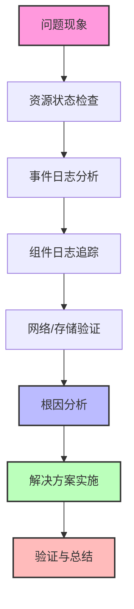

# Kubernetes问题诊断  

Kubernetes作为容器编排平台，其复杂性使得问题诊断成为一项挑战。本文将系统介绍Kubernetes问题诊断的方法论、工具和常见场景解决方案，帮助您快速定位和解决Kubernetes环境中的各类问题。

## 1. 诊断流程框架  

在Kubernetes环境中进行问题诊断需要遵循一定的方法论和流程，这样可以提高诊断效率，避免盲目排查。

### 1.1 问题定位方法论  

问题诊断应遵循从整体到局部、从表象到本质的原则，按照以下流程进行：



**诊断流程详解：**

1. **问题现象收集**：明确问题的具体表现，包括错误信息、异常行为和影响范围
2. **资源状态检查**：检查相关Kubernetes资源的状态，如Pod、Service、Node等
3. **事件日志分析**：查看Kubernetes事件日志，了解资源状态变化和错误信息
4. **组件日志追踪**：检查相关组件的日志，如容器日志、控制平面组件日志等
5. **网络/存储验证**：验证网络连通性和存储可用性
6. **根因分析**：基于收集的信息，分析问题的根本原因
7. **解决方案实施**：应用相应的解决方案
8. **验证与总结**：验证问题是否解决，总结经验教训

### 1.2 关键检查点  

在诊断过程中，以下是需要重点关注的检查点：

| 检查维度       | 诊断命令                     | 重点关注内容          | 异常表现                |
|----------------|----------------------------|---------------------|------------------------|
| 集群状态       | `kubectl get cs`           | 组件健康状态          | 组件显示Unhealthy       |
| Pod状态        | `kubectl describe pod`     | 事件和Conditions     | CrashLoopBackOff等状态 |
| 节点资源       | `kubectl top nodes`        | CPU/Memory使用率     | 资源使用率接近100%      |
| 集群事件       | `kubectl get events --sort-by=.metadata.creationTimestamp` | 错误和警告事件 | Warning和Error类型事件 |
| 服务状态       | `kubectl get svc,ep`       | 服务端点是否正常      | Endpoints列表为空       |
| 网络策略       | `kubectl get netpol`       | 网络访问控制规则      | 意外阻断的流量          |
| 存储状态       | `kubectl get pv,pvc`       | 存储卷绑定状态        | PVC处于Pending状态     |
| 控制器状态     | `kubectl get deploy,sts,ds` | 期望副本数与实际副本数 | 可用副本数少于期望副本数 |

**扩展检查命令：**

```powershell
# 检查所有命名空间中的资源状态
kubectl get all --all-namespaces

# 检查节点状态和条件
kubectl describe nodes | findstr "Conditions:"

# 检查集群中的所有事件，按时间排序
kubectl get events --all-namespaces --sort-by=.metadata.creationTimestamp

# 检查API资源的健康状态
kubectl api-resources --verbs=list --namespaced -o name | ForEach-Object { 
    Write-Host "Resource: $_" 
    kubectl get $_ --all-namespaces 
}
```

## 2. 核心组件问题  

Kubernetes核心组件的健康状态直接影响整个集群的可用性，因此诊断核心组件问题是排查集群问题的首要步骤。

### 2.1 API Server故障  

API Server是Kubernetes的核心组件，所有的API操作都需要通过它进行。

**常见故障现象：**
- kubectl命令返回连接超时或拒绝
- 集群资源无法创建、更新或删除
- 控制平面组件无法正常工作

**诊断步骤：**

```powershell
# 检查API Server Pod状态
kubectl get pods -n kube-system -l component=kube-apiserver

# 检查API Server日志
kubectl logs -n kube-system kube-apiserver-node1

# 检查API Server进程
Get-Process | Where-Object { $_.ProcessName -like "*kube-apiserver*" }

# 测试API连通性
curl -k https://localhost:6443/healthz

# 检查API Server证书
openssl x509 -in C:\etc\kubernetes\pki\apiserver.crt -text -noout | findstr "Not After"

# 检查etcd连接
kubectl exec -it -n kube-system etcd-node1 -- etcdctl --endpoints=https://127.0.0.1:2379 --cacert=/etc/kubernetes/pki/etcd/ca.crt --cert=/etc/kubernetes/pki/etcd/server.crt --key=/etc/kubernetes/pki/etcd/server.key endpoint health
```

**常见问题及解决方案：**

1. **证书过期**：
   ```powershell
   # 更新证书
   kubeadm alpha certs renew apiserver
   
   # 重启API Server
   Restart-Service kubelet
   ```

2. **资源不足**：
   ```powershell
   # 检查节点资源
   kubectl top nodes
   
   # 增加API Server资源限制
   kubectl edit -n kube-system pod/kube-apiserver-node1
   ```

3. **etcd连接问题**：
   ```powershell
   # 检查etcd健康状态
   kubectl exec -it -n kube-system etcd-node1 -- etcdctl --endpoints=https://127.0.0.1:2379 --cacert=/etc/kubernetes/pki/etcd/ca.crt --cert=/etc/kubernetes/pki/etcd/server.crt --key=/etc/kubernetes/pki/etcd/server.key endpoint health
   
   # 重启etcd
   kubectl delete pod -n kube-system etcd-node1
   ```

### 2.2 kubelet异常处理  

kubelet负责管理节点上的容器，是工作节点上最重要的组件。

**常见故障现象：**
- 节点状态显示NotReady
- Pod无法在节点上启动
- 容器无法正常运行

**诊断步骤：**

```powershell
# 查看kubelet服务状态
Get-Service kubelet

# 检查kubelet日志
Get-EventLog -LogName Application -Source kubelet -Newest 100

# 或者使用PowerShell查看日志
Get-WinEvent -FilterHashtable @{LogName='Application'; ProviderName='kubelet'} -MaxEvents 100

# 检查节点状态
kubectl get nodes -o wide

# 查看节点详细信息
kubectl describe node node1

# 检查kubelet配置
Get-Content C:\etc\kubernetes\kubelet\kubelet-config.yaml

# 检查kubelet证书
openssl x509 -in C:\var\lib\kubelet\pki\kubelet-client-current.pem -text -noout | findstr "Not After"
```

**常见问题及解决方案：**

1. **kubelet服务未运行**：
   ```powershell
   # 启动kubelet服务
   Start-Service kubelet
   
   # 设置自动启动
   Set-Service -Name kubelet -StartupType Automatic
   ```

2. **节点资源不足**：
   ```powershell
   # 检查节点资源使用情况
   kubectl describe node node1 | findstr "Allocatable|Allocated"
   
   # 清理节点上的无用容器和镜像
   docker system prune -af
   ```

3. **证书问题**：
   ```powershell
   # 重新生成kubelet证书
   kubeadm alpha certs renew kubelet-client
   
   # 重启kubelet
   Restart-Service kubelet
   ```

4. **配置错误**：
   ```powershell
   # 修复kubelet配置
   kubeadm init phase kubelet-start --node-name node1
   
   # 重启kubelet
   Restart-Service kubelet
   ```

### 2.3 Scheduler和Controller Manager问题

Scheduler负责Pod调度，Controller Manager负责控制器的运行。

**常见故障现象：**
- Pod一直处于Pending状态
- 控制器无法正常工作，如Deployment无法创建Pod

**诊断步骤：**

```powershell
# 检查Scheduler和Controller Manager状态
kubectl get pods -n kube-system -l component=kube-scheduler
kubectl get pods -n kube-system -l component=kube-controller-manager

# 查看日志
kubectl logs -n kube-system kube-scheduler-node1
kubectl logs -n kube-system kube-controller-manager-node1

# 检查组件健康状态
kubectl get componentstatuses
```

**常见问题及解决方案：**

1. **组件未运行**：
   ```powershell
   # 重启组件
   kubectl delete pod -n kube-system kube-scheduler-node1
   kubectl delete pod -n kube-system kube-controller-manager-node1
   ```

2. **配置错误**：
   ```powershell
   # 检查配置
   kubectl describe pod -n kube-system kube-scheduler-node1
   
   # 修复配置
   kubeadm init phase control-plane scheduler
   kubeadm init phase control-plane controller-manager
   ```

## 3. 工作负载问题  

工作负载问题是Kubernetes环境中最常见的问题类型，包括Pod启动失败、服务不可用等。

### 3.1 Pod启动失败  

Pod是Kubernetes中最小的可部署单元，其启动失败是最常见的问题之一。

**常见Pod状态及含义：**

| 状态              | 含义                                   | 可能原因                           |
|-------------------|----------------------------------------|----------------------------------|
| Pending           | Pod已创建但尚未调度到节点               | 资源不足、PVC未绑定、节点亲和性问题 |
| ContainerCreating | Pod已调度但容器尚未创建完成             | 镜像拉取问题、存储挂载问题         |
| Running           | Pod已成功运行                          | 正常状态                          |
| CrashLoopBackOff  | 容器反复崩溃并重启                     | 应用错误、资源不足、配置错误       |
| Error             | Pod启动过程中发生错误                  | 容器启动命令错误、依赖服务不可用   |
| Completed         | Pod中的所有容器已成功执行并退出         | 正常状态(对于Job/CronJob)         |
| ImagePullBackOff  | 无法拉取容器镜像                       | 镜像不存在、仓库认证失败           |

**诊断步骤：**

```powershell
# 获取Pod状态
kubectl get pod my-pod -o wide

# 获取详细事件
kubectl describe pod/my-pod | findstr "Failed Warning"

# 查看容器日志
kubectl logs my-pod -c main-container

# 查看之前的容器日志(如果容器已重启)
kubectl logs -p my-pod -c main-container

# 查看初始化容器日志
kubectl logs my-pod -c init-container

# 检查Pod定义
kubectl get pod my-pod -o yaml
```

**常见问题及解决方案：**

1. **CrashLoopBackOff**：
   ```powershell
   # 检查容器日志
   kubectl logs my-pod
   
   # 检查容器启动命令
   kubectl get pod my-pod -o yaml | findstr "command args"
   
   # 使用调试容器
   kubectl debug my-pod -it --image=busybox --target=main-container
   ```

2. **ImagePullBackOff**：
   ```powershell
   # 检查镜像名称是否正确
   kubectl describe pod my-pod | findstr "Image:"
   
   # 检查镜像拉取凭证
   kubectl get secret regcred -o yaml
   
   # 修复镜像拉取问题
   kubectl patch deployment my-deployment --patch '{"spec": {"template": {"spec": {"imagePullSecrets": [{"name": "regcred"}]}}}}'
   ```

3. **Pending状态**：
   ```powershell
   # 检查节点资源
   kubectl describe nodes | findstr "Allocatable|Allocated"
   
   # 检查PVC状态
   kubectl get pvc
   
   # 检查Pod调度约束
   kubectl get pod my-pod -o yaml | findstr -A10 "nodeSelector|affinity|tolerations"
   ```

### 3.2 常见错误代码  

了解常见的错误代码有助于快速定位问题：

```text
CrashLoopBackOff: 容器持续崩溃重启
- 可能原因: 应用程序错误、资源限制、配置错误
- 解决方法: 检查应用日志、调整资源限制、验证配置

ImagePullBackOff: 镜像拉取失败
- 可能原因: 镜像不存在、仓库认证失败、网络问题
- 解决方法: 验证镜像名称、配置镜像拉取凭证、检查网络连接

ErrImagePull: 镜像拉取错误
- 可能原因: 与ImagePullBackOff类似
- 解决方法: 与ImagePullBackOff类似

CreateContainerConfigError: 创建容器配置错误
- 可能原因: ConfigMap或Secret不存在、卷挂载路径错误
- 解决方法: 检查引用的ConfigMap/Secret、验证卷挂载配置

CreateContainerError: 创建容器错误
- 可能原因: 容器运行时错误、安全上下文问题
- 解决方法: 检查容器运行时状态、调整安全上下文设置

InvalidImageName: 无效的镜像名称
- 可能原因: 镜像名称格式错误
- 解决方法: 修正镜像名称格式

OOMKilled: 内存不足被杀死
- 可能原因: 容器内存限制过低、内存泄漏
- 解决方法: 增加内存限制、修复内存泄漏问题

ContainerCannotRun: 容器无法运行
- 可能原因: 容器启动命令错误、权限问题
- 解决方法: 检查容器启动命令、调整权限设置
```

### 3.3 服务访问问题

服务(Service)是暴露应用的主要方式，服务访问问题也很常见。

**诊断步骤：**

```powershell
# 检查服务状态
kubectl get svc my-service

# 检查服务端点
kubectl get endpoints my-service

# 检查Pod标签是否匹配Service选择器
kubectl get pods --selector=app=my-app

# 测试服务DNS解析
kubectl run -it --rm debug --image=busybox -- nslookup my-service.default.svc.cluster.local

# 测试服务连通性
kubectl run -it --rm debug --image=busybox -- wget -O- http://my-service.default.svc.cluster.local:80
```

**常见问题及解决方案：**

1. **服务没有端点**：
   ```powershell
   # 检查Pod标签
   kubectl get pods --show-labels
   
   # 修正Service选择器
   kubectl edit svc my-service
   ```

2. **服务端口配置错误**：
   ```powershell
   # 检查Service和Pod端口配置
   kubectl describe svc my-service
   kubectl describe pod -l app=my-app
   
   # 修正Service端口
   kubectl edit svc my-service
   ```

3. **Pod健康检查失败**：
   ```powershell
   # 检查Pod就绪状态
   kubectl get pods -l app=my-app -o wide
   
   # 检查就绪探针配置
   kubectl describe pod -l app=my-app | findstr -A10 "Readiness"
   ```

## 4. 网络问题排查  

Kubernetes网络问题通常比较复杂，涉及多个层面，包括Pod网络、Service网络、Ingress等。

### 4.1 服务连通性测试  

测试服务连通性是排查网络问题的基本步骤：

```powershell
# 创建诊断Pod
kubectl run -it --rm debug --image=nicolaka/netshoot -- bash

# 在诊断Pod中执行以下命令

# DNS解析测试
nslookup kubernetes.default.svc.cluster.local

# 服务连通性测试
curl -v http://service-name.namespace.svc.cluster.local

# 端口扫描
nmap -p 80 service-name.namespace.svc.cluster.local

# TCP连接测试
nc -zv service-name.namespace.svc.cluster.local 80

# 路由跟踪
traceroute service-name.namespace.svc.cluster.local

# HTTP请求测试
wget -O- http://service-name.namespace.svc.cluster.local

# 查看网络接口
ip addr

# 查看路由表
ip route

# 查看DNS配置
cat /etc/resolv.conf
```

**常见网络问题诊断工具：**

1. **netshoot**：包含多种网络诊断工具的容器镜像
2. **busybox**：轻量级工具集，包含基本的网络命令
3. **nmap**：网络扫描工具
4. **tcpdump**：网络数据包分析工具
5. **dig/nslookup**：DNS查询工具
6. **curl/wget**：HTTP请求工具

### 4.2 网络策略验证  

NetworkPolicy用于控制Pod之间的网络通信，错误的网络策略可能导致服务无法访问：

```powershell
# 检查所有命名空间的NetworkPolicy
kubectl get networkpolicy --all-namespaces

# 查看特定NetworkPolicy详情
kubectl describe networkpolicy -n my-namespace my-policy

# 检查Pod是否受NetworkPolicy影响
kubectl get pods -n my-namespace --show-labels

# 查看kube-proxy状态
kubectl get pods -n kube-system -l k8s-app=kube-proxy

# 查看iptables规则(在节点上执行)
kubectl exec -n kube-system kube-proxy-xxxx -- iptables-save | findstr "KUBE-SERVICES"
```

**常见网络策略问题及解决方案：**

1. **过于严格的网络策略**：
   ```powershell
   # 临时禁用网络策略
   kubectl delete networkpolicy -n my-namespace my-policy
   
   # 创建允许所有入站流量的策略
   kubectl apply -f - <<EOF
   apiVersion: networking.k8s.io/v1
   kind: NetworkPolicy
   metadata:
     name: allow-all-ingress
     namespace: my-namespace
   spec:
     podSelector: {}
     ingress:
     - {}
   EOF
   ```

2. **网络插件问题**：
   ```powershell
   # 检查网络插件Pod状态
   kubectl get pods -n kube-system -l k8s-app=calico-node
   
   # 查看网络插件日志
   kubectl logs -n kube-system calico-node-xxxx
   ```

3. **kube-proxy问题**：
   ```powershell
   # 重启kube-proxy
   kubectl delete pod -n kube-system -l k8s-app=kube-proxy
   
   # 检查kube-proxy配置
   kubectl describe configmap -n kube-system kube-proxy
   ```

### 4.3 DNS问题排查

DNS问题是Kubernetes网络问题中的常见类型：

```powershell
# 检查CoreDNS状态
kubectl get pods -n kube-system -l k8s-app=kube-dns

# 查看CoreDNS日志
kubectl logs -n kube-system -l k8s-app=kube-dns

# 检查CoreDNS配置
kubectl get configmap -n kube-system coredns -o yaml

# 创建测试Pod进行DNS查询
kubectl run -it --rm debug --image=busybox -- nslookup kubernetes.default.svc.cluster.local

# 检查DNS服务
kubectl get svc -n kube-system kube-dns

# 检查Pod的DNS配置
kubectl exec -it my-pod -- cat /etc/resolv.conf
```

**常见DNS问题及解决方案：**

1. **CoreDNS Pod不健康**：
   ```powershell
   # 重启CoreDNS Pod
   kubectl delete pod -n kube-system -l k8s-app=kube-dns
   ```

2. **DNS配置错误**：
   ```powershell
   # 检查kubelet DNS配置
   kubectl describe node node1 | findstr "ClusterDNS"
   
   # 修复CoreDNS配置
   kubectl edit configmap -n kube-system coredns
   ```

3. **DNS缓存问题**：
   ```powershell
   # 清除DNS缓存
   kubectl delete pod -n kube-system -l k8s-app=kube-dns
   
   # 重启受影响的Pod
   kubectl delete pod my-pod
   ```

## 5. 存储问题诊断  

存储问题通常涉及PersistentVolume(PV)、PersistentVolumeClaim(PVC)和StorageClass。

### 5.1 PVC挂载失败  

PVC挂载失败是常见的存储问题：

```powershell
# 检查PVC状态
kubectl get pvc my-pvc

# 检查PV状态
kubectl get pv

# 查看PVC详情
kubectl describe pvc my-pvc

# 查看PV详情
kubectl describe pv pv-name

# 检查StorageClass
kubectl get storageclass

# 查看Pod挂载情况
kubectl describe pod my-pod | findstr -A10 "Volumes"
```

**常见PVC问题及解决方案：**

1. **PVC一直处于Pending状态**：
   ```powershell
   # 检查StorageClass是否存在
   kubectl get storageclass
   
   # 检查PVC请求的存储大小是否超过限制
   kubectl describe pvc my-pvc
   
   # 创建匹配的PV(静态供应)
   kubectl apply -f - <<EOF
   apiVersion: v1
   kind: PersistentVolume
   metadata:
     name: my-pv
   spec:
     capacity:
       storage: 5Gi
     accessModes:
       - ReadWriteOnce
     persistentVolumeReclaimPolicy: Retain
     storageClassName: manual
     hostPath:
       path: /mnt/data
   EOF
   ```

2. **PV绑定但Pod无法挂载**：
   ```powershell
   # 检查Pod事件
   kubectl describe pod my-pod
   
   # 检查存储提供者状态
   kubectl get pods -n kube-system -l app=csi-driver
   
   # 检查节点上的挂载点
   kubectl debug node/node1 -it --image=busybox -- ls -l /var/lib/kubelet/pods/
   ```

3. **存储类配置错误**：
   ```powershell
   # 检查StorageClass参数
   kubectl describe storageclass standard
   
   # 创建新的StorageClass
   kubectl apply -f - <<EOF
   apiVersion: storage.k8s.io/v1
   kind: StorageClass
   metadata:
     name: fast
   provisioner: kubernetes.io/aws-ebs
   parameters:
     type: gp2
   reclaimPolicy: Delete
   allowVolumeExpansion: true
   EOF
   ```

### 5.2 卷访问权限  

卷访问权限问题通常与文件系统权限或SELinux/AppArmor配置有关：

```powershell
# 检查Pod中的卷挂载权限
kubectl exec my-pod -- ls -l /data

# 在Pod中创建测试文件
kubectl exec my-pod -- touch /data/test-file

# 检查Pod安全上下文
kubectl get pod my-pod -o yaml | findstr -A10 "securityContext"

# 检查PV访问模式
kubectl get pv pv-name -o yaml | findstr "accessModes"

# 检查CSI驱动日志
kubectl logs -n kube-system pod/csi-driver-node-xxxx
```

**常见访问权限问题及解决方案：**

1. **文件系统权限问题**：
   ```powershell
   # 修改Pod安全上下文
   kubectl patch pod my-pod --type=json -p='[{"op": "add", "path": "/spec/containers/0/securityContext", "value": {"runAsUser": 1000, "fsGroup": 2000}}]'
   
   # 或者编辑Deployment
   kubectl edit deployment my-deployment
   ```

2. **只读文件系统**：
   ```powershell
   # 检查PV是否为只读
   kubectl get pv pv-name -o yaml | findstr "readOnly"
   
   # 修改PVC访问模式
   kubectl patch pvc my-pvc -p '{"spec":{"accessModes":["ReadWriteOnce"]}}'
   ```

3. **CSI驱动问题**：
   ```powershell
   # 重启CSI驱动Pod
   kubectl delete pod -n kube-system csi-driver-node-xxxx
   
   # 检查CSI驱动版本兼容性
   kubectl describe pod -n kube-system csi-driver-node-xxxx | findstr "Image:"
   ```

## 6. 诊断工具集  

掌握各种诊断工具可以提高问题排查效率。

### 6.1 常用工具安装  

以下是一些常用的Kubernetes诊断工具：

```powershell
# 安装kubectl-krew插件管理器
(New-Object System.Net.WebClient).DownloadFile("https://github.com/kubernetes-sigs/krew/releases/latest/download/krew.exe", "$env:TEMP\krew.exe")
& "$env:TEMP\krew.exe" install krew
$env:PATH += ";${env:USERPROFILE}\.krew\bin"

# 安装kubectl调试插件
kubectl krew install debug

# 安装kubectl-neat(清理资源定义)
kubectl krew install neat

# 安装kubectl-sniff(网络抓包)
kubectl krew install sniff

# 安装kubectl-trace(系统跟踪)
kubectl krew install trace

# 安装kubectl-view-secret(查看Secret)
kubectl krew install view-secret

# 获取节点诊断信息
kubectl debug node/node1 -it --image=busybox

# 创建临时诊断Pod
kubectl run diagnostic --image=nicolaka/netshoot -it --rm -- bash
```

**常用诊断容器镜像：**

1. **nicolaka/netshoot**：网络诊断工具集
2. **busybox**：基本Linux工具
3. **alpine**：轻量级Linux发行版
4. **curlimages/curl**：HTTP请求工具
5. **wbitt/network-multitool**：网络多功能工具

### 6.2 高级诊断工具  

对于更复杂的问题，可以使用以下高级诊断工具：

```text
kube-state-metrics: 集群状态指标收集
- 提供集群资源对象的状态指标
- 可与Prometheus集成监控集群健康状态
- 安装: kubectl apply -f https://github.com/kubernetes/kube-state-metrics/tree/master/examples/standard

prometheus-operator: 监控告警系统
- 全面的Kubernetes监控解决方案
- 提供预配置的告警规则和仪表板
- 安装: helm install prometheus prometheus-community/kube-prometheus-stack

kubectl-neat: 精简资源配置输出
- 移除自动生成的字段，便于查看关键配置
- 使用: kubectl get pod my-pod -
继续完成Kubernetes问题诊断文档：

```text
kubectl-neat: 精简资源配置输出
- 移除自动生成的字段，便于查看关键配置
- 使用: kubectl get pod my-pod -o yaml | kubectl neat
- 安装: kubectl krew install neat

kubectx/kubens: 快速切换集群和命名空间
- 简化多集群和多命名空间管理
- 使用: kubectx <集群名> / kubens <命名空间>
- 安装: kubectl krew install ctx ns

k9s: 终端UI交互式集群管理
- 提供终端界面管理Kubernetes资源
- 支持日志查看、资源编辑和Pod Shell访问
- 安装: choco install k9s

stern: 多Pod日志聚合工具
- 同时查看多个Pod的日志
- 支持正则表达式匹配Pod名称
- 安装: choco install stern
```

### 6.3 自定义诊断脚本

创建自定义脚本可以自动化常见的诊断任务：

```powershell:c:\project\kphub\kubernetes\scripts\k8s-diagnostics.ps1
# Kubernetes诊断脚本
param (
    [string]$namespace = "default",
    [string]$podPrefix = "",
    [switch]$includeEvents = $false,
    [switch]$includeLogs = $false
)

Write-Host "===== 集群状态检查 =====" -ForegroundColor Cyan
kubectl get nodes -o wide
kubectl get cs

Write-Host "`n===== 命名空间资源检查 =====" -ForegroundColor Cyan
kubectl get all -n $namespace

if ($podPrefix) {
    Write-Host "`n===== Pod详细信息 =====" -ForegroundColor Cyan
    $pods = kubectl get pods -n $namespace | Where-Object { $_ -match $podPrefix }
    foreach ($pod in $pods) {
        $podName = ($pod -split '\s+')[0]
        if ($podName -ne "NAME") {
            Write-Host "`n--- Pod: $podName ---" -ForegroundColor Yellow
            kubectl describe pod $podName -n $namespace | Select-String -Pattern "Status:|Containers:|Conditions:|Node:|IP:"
            
            if ($includeEvents) {
                Write-Host "`n--- 事件 ---" -ForegroundColor Yellow
                kubectl describe pod $podName -n $namespace | Select-String -Pattern "Events:" -Context 0,20
            }
            
            if ($includeLogs) {
                Write-Host "`n--- 日志 ---" -ForegroundColor Yellow
                kubectl logs $podName -n $namespace --tail=50
            }
        }
    }
}

Write-Host "`n===== 服务和端点检查 =====" -ForegroundColor Cyan
kubectl get svc,ep -n $namespace

Write-Host "`n===== PVC状态检查 =====" -ForegroundColor Cyan
kubectl get pvc -n $namespace

Write-Host "`n===== 最近事件 =====" -ForegroundColor Cyan
kubectl get events -n $namespace --sort-by='.lastTimestamp' | Select-Object -Last 20
```

## 7. 典型场景解决方案  

以下是一些常见问题场景的解决方案。

### 7.1 节点资源不足  

节点资源不足是导致Pod无法调度的常见原因：

```powershell
# 检查节点资源使用情况
kubectl top nodes

# 查看节点详细资源分配
kubectl describe nodes | findstr -A10 "Allocated resources"

# 查找资源消耗较高的Pod
kubectl top pods --all-namespaces --sort-by=cpu

# 驱逐不可调度Pod
kubectl drain node1 --ignore-daemonsets --delete-emptydir-data

# 调整资源配额
kubectl edit quota -n my-namespace

# 为命名空间设置资源限制
kubectl apply -f - <<EOF
apiVersion: v1
kind: ResourceQuota
metadata:
  name: compute-quota
  namespace: my-namespace
spec:
  hard:
    requests.cpu: "4"
    requests.memory: 8Gi
    limits.cpu: "8"
    limits.memory: 16Gi
    pods: "20"
EOF

# 为Pod设置资源请求和限制
kubectl set resources deployment my-deployment -c=my-container --limits=cpu=500m,memory=512Mi --requests=cpu=200m,memory=256Mi
```

**解决资源不足的策略：**

1. **水平扩展**：增加节点数量
   ```powershell
   # 对于托管Kubernetes服务，通常可以通过控制台增加节点池大小
   # 对于自管理集群，可以添加新节点
   kubeadm token create --print-join-command
   # 然后在新节点上执行join命令
   ```

2. **垂直扩展**：增加节点资源
   ```powershell
   # 对于虚拟机，可以增加CPU和内存
   # 对于云服务，可以更改节点类型
   ```

3. **优化资源使用**：
   ```powershell
   # 设置合理的资源请求和限制
   kubectl set resources deployment my-deployment -c=my-container --limits=cpu=500m,memory=512Mi --requests=cpu=200m,memory=256Mi
   
   # 使用HPA自动扩缩容
   kubectl autoscale deployment my-deployment --min=2 --max=10 --cpu-percent=80
   ```

### 7.2 证书过期处理  

Kubernetes证书过期是一个常见的运维问题：

```powershell
# 检查证书有效期
openssl x509 -in C:\etc\kubernetes\pki\apiserver.crt -noout -dates

# 检查所有证书有效期
Get-ChildItem C:\etc\kubernetes\pki -Recurse -Filter *.crt | ForEach-Object {
    $cert = New-Object System.Security.Cryptography.X509Certificates.X509Certificate2 $_.FullName
    Write-Host "$($_.Name): $($cert.NotAfter)"
}

# 手动更新证书(kubeadm集群)
kubeadm alpha certs renew all

# 重启控制平面组件
Restart-Service kubelet

# 检查证书更新情况
kubeadm alpha certs check-expiration
```

**证书管理最佳实践：**

1. **定期检查证书有效期**：
   ```powershell
   # 创建证书检查脚本
   $certDir = "C:\etc\kubernetes\pki"
   $warningDays = 30
   
   Get-ChildItem $certDir -Recurse -Filter *.crt | ForEach-Object {
       $cert = New-Object System.Security.Cryptography.X509Certificates.X509Certificate2 $_.FullName
       $daysLeft = ($cert.NotAfter - (Get-Date)).Days
       
       if ($daysLeft -lt $warningDays) {
           Write-Host "警告: $($_.Name) 将在 $daysLeft 天后过期" -ForegroundColor Red
       } else {
           Write-Host "$($_.Name): 还有 $daysLeft 天过期" -ForegroundColor Green
       }
   }
   ```

2. **自动化证书更新**：
   ```powershell
   # 创建计划任务定期更新证书
   $action = New-ScheduledTaskAction -Execute "powershell.exe" -Argument "-File C:\scripts\renew-k8s-certs.ps1"
   $trigger = New-ScheduledTaskTrigger -Daily -At 3am
   Register-ScheduledTask -Action $action -Trigger $trigger -TaskName "RenewK8sCerts" -Description "Renew Kubernetes certificates"
   ```

3. **使用cert-manager管理证书**：
   ```powershell
   # 安装cert-manager
   kubectl apply -f https://github.com/jetstack/cert-manager/releases/download/v1.8.0/cert-manager.yaml
   
   # 创建自签名颁发者
   kubectl apply -f - <<EOF
   apiVersion: cert-manager.io/v1
   kind: ClusterIssuer
   metadata:
     name: selfsigned-issuer
   spec:
     selfSigned: {}
   EOF
   
   # 为服务创建证书
   kubectl apply -f - <<EOF
   apiVersion: cert-manager.io/v1
   kind: Certificate
   metadata:
     name: my-service-cert
     namespace: default
   spec:
     secretName: my-service-tls
     duration: 2160h # 90天
     renewBefore: 360h # 15天
     subject:
       organizations:
         - My Organization
     isCA: false
     privateKey:
       algorithm: RSA
       encoding: PKCS1
       size: 2048
     usages:
       - server auth
     dnsNames:
       - my-service.default.svc.cluster.local
       - my-service.default.svc
     issuerRef:
       name: selfsigned-issuer
       kind: ClusterIssuer
   EOF
   ```

### 7.3 集群升级问题

Kubernetes集群升级是一项复杂的任务，可能会遇到各种问题：

```powershell
# 检查当前版本
kubectl version

# 检查升级计划(kubeadm集群)
kubeadm upgrade plan

# 升级控制平面
kubeadm upgrade apply v1.23.0

# 升级kubelet
Stop-Service kubelet
choco upgrade kubernetes-cli
choco upgrade kubelet
Start-Service kubelet

# 验证升级结果
kubectl get nodes
```

**升级问题排查：**

1. **版本兼容性问题**：
   ```powershell
   # 检查组件版本兼容性
   kubectl version --short
   
   # 确保kubelet版本不高于API Server版本
   Get-Process -Name kubelet | Select-Object -ExpandProperty Path
   ```

2. **升级后Pod无法启动**：
   ```powershell
   # 检查API版本变化
   kubectl api-versions
   
   # 更新不兼容的资源定义
   kubectl convert -f old-deployment.yaml --output-version apps/v1 > new-deployment.yaml
   ```

3. **控制平面组件失败**：
   ```powershell
   # 检查组件状态
   kubectl get pods -n kube-system
   
   # 检查组件日志
   kubectl logs -n kube-system kube-apiserver-node1
   ```

### 7.4 etcd备份与恢复

etcd存储了集群的所有状态，备份和恢复etcd是灾难恢复的关键：

```powershell
# 备份etcd数据
$ETCDCTL_API=3 etcdctl --endpoints=https://127.0.0.1:2379 `
  --cacert=C:\etc\kubernetes\pki\etcd\ca.crt `
  --cert=C:\etc\kubernetes\pki\etcd\server.crt `
  --key=C:\etc\kubernetes\pki\etcd\server.key `
  snapshot save C:\backup\etcd-snapshot-$(Get-Date -Format "yyyyMMdd-HHmmss").db

# 验证备份
$ETCDCTL_API=3 etcdctl --write-out=table snapshot status C:\backup\etcd-snapshot-20230101-120000.db

# 恢复etcd数据(需要停止etcd服务)
Stop-Service kubelet
Stop-Process -Name etcd -Force

$ETCDCTL_API=3 etcdctl --endpoints=https://127.0.0.1:2379 `
  --cacert=C:\etc\kubernetes\pki\etcd\ca.crt `
  --cert=C:\etc\kubernetes\pki\etcd\server.crt `
  --key=C:\etc\kubernetes\pki\etcd\server.key `
  snapshot restore C:\backup\etcd-snapshot-20230101-120000.db `
  --data-dir=C:\var\lib\etcd-restore

# 更新etcd配置使用新的数据目录
# 编辑etcd.yaml文件
# 将volumes.hostPath.path从/var/lib/etcd改为/var/lib/etcd-restore

# 重启服务
Start-Service kubelet
```

**etcd管理最佳实践：**

1. **定期备份**：
   ```powershell
   # 创建定时备份任务
   $backupScript = @"
   `$ETCDCTL_API=3 etcdctl --endpoints=https://127.0.0.1:2379 `
     --cacert=C:\etc\kubernetes\pki\etcd\ca.crt `
     --cert=C:\etc\kubernetes\pki\etcd\server.crt `
     --key=C:\etc\kubernetes\pki\etcd\server.key `
     snapshot save C:\backup\etcd-snapshot-`$(Get-Date -Format "yyyyMMdd-HHmmss").db
   
   # 保留最近30天的备份
   Get-ChildItem C:\backup\etcd-snapshot-*.db | Where-Object { `$_.LastWriteTime -lt (Get-Date).AddDays(-30) } | Remove-Item
   "@
   
   Set-Content -Path C:\scripts\backup-etcd.ps1 -Value $backupScript
   
   # 创建计划任务
   $action = New-ScheduledTaskAction -Execute "powershell.exe" -Argument "-File C:\scripts\backup-etcd.ps1"
   $trigger = New-ScheduledTaskTrigger -Daily -At 2am
   Register-ScheduledTask -Action $action -Trigger $trigger -TaskName "BackupEtcd" -Description "Backup Kubernetes etcd database"
   ```

2. **监控etcd健康状态**：
   ```powershell
   # 检查etcd健康状态
   $ETCDCTL_API=3 etcdctl --endpoints=https://127.0.0.1:2379 `
     --cacert=C:\etc\kubernetes\pki\etcd\ca.crt `
     --cert=C:\etc\kubernetes\pki\etcd\server.crt `
     --key=C:\etc\kubernetes\pki\etcd\server.key `
     endpoint health
   
   # 检查etcd成员列表
   $ETCDCTL_API=3 etcdctl --endpoints=https://127.0.0.1:2379 `
     --cacert=C:\etc\kubernetes\pki\etcd\ca.crt `
     --cert=C:\etc\kubernetes\pki\etcd\server.crt `
     --key=C:\etc\kubernetes\pki\etcd\server.key `
     member list
   ```

3. **定期压缩和碎片整理**：
   ```powershell
   # 获取当前修订版本
   $REVISION=$($ETCDCTL_API=3 etcdctl --endpoints=https://127.0.0.1:2379 `
     --cacert=C:\etc\kubernetes\pki\etcd\ca.crt `
     --cert=C:\etc\kubernetes\pki\etcd\server.crt `
     --key=C:\etc\kubernetes\pki\etcd\server.key `
     endpoint status --write-out="json" | ConvertFrom-Json | Select-Object -ExpandProperty header | Select-Object -ExpandProperty revision)
   
   # 压缩历史
   $ETCDCTL_API=3 etcdctl --endpoints=https://127.0.0.1:2379 `
     --cacert=C:\etc\kubernetes\pki\etcd\ca.crt `
     --cert=C:\etc\kubernetes\pki\etcd\server.crt `
     --key=C:\etc\kubernetes\pki\etcd\server.key `
     compact $REVISION
   
   # 碎片整理
   $ETCDCTL_API=3 etcdctl --endpoints=https://127.0.0.1:2379 `
     --cacert=C:\etc\kubernetes\pki\etcd\ca.crt `
     --cert=C:\etc\kubernetes\pki\etcd\server.crt `
     --key=C:\etc\kubernetes\pki\etcd\server.key `
     defrag
   ```

## 8. 监控与预防  

除了问题诊断，建立有效的监控系统和预防措施也非常重要。

### 8.1 监控系统搭建

```yaml:c:\project\kphub\kubernetes\monitoring\prometheus-values.yaml
# Prometheus Stack配置
prometheus:
  prometheusSpec:
    retention: 15d
    resources:
      requests:
        memory: 1Gi
        cpu: 500m
      limits:
        memory: 2Gi
        cpu: 1000m
    storageSpec:
      volumeClaimTemplate:
        spec:
          storageClassName: standard
          accessModes: ["ReadWriteOnce"]
          resources:
            requests:
              storage: 50Gi

alertmanager:
  alertmanagerSpec:
    storage:
      volumeClaimTemplate:
        spec:
          storageClassName: standard
          accessModes: ["ReadWriteOnce"]
          resources:
            requests:
              storage: 10Gi

grafana:
  persistence:
    enabled: true
    storageClassName: standard
    size: 10Gi
  dashboardProviders:
    dashboardproviders.yaml:
      apiVersion: 1
      providers:
      - name: 'kubernetes'
        orgId: 1
        folder: 'Kubernetes'
        type: file
        disableDeletion: false
        editable: true
        options:
          path: /var/lib/grafana/dashboards/kubernetes
```

```powershell
# 安装Prometheus Stack
helm repo add prometheus-community https://prometheus-community.github.io/helm-charts
helm repo update
helm install prometheus prometheus-community/kube-prometheus-stack -f c:\project\kphub\kubernetes\monitoring\prometheus-values.yaml
```

### 8.2 关键告警配置

```yaml:c:\project\kphub\kubernetes\monitoring\alerts.yaml
apiVersion: monitoring.coreos.com/v1
kind: PrometheusRule
metadata:
  name: kubernetes-critical-alerts
  namespace: monitoring
spec:
  groups:
  - name: kubernetes-critical
    rules:
    - alert: KubernetesPodCrashLooping
      expr: rate(kube_pod_container_status_restarts_total[15m]) > 0
      for: 15m
      labels:
        severity: critical
      annotations:
        summary: "Pod {{ $labels.namespace }}/{{ $labels.pod }} 容器重启"
        description: "Pod {{ $labels.namespace }}/{{ $labels.pod }} 容器 {{ $labels.container }} 在过去15分钟内重启"
        
    - alert: KubernetesNodeNotReady
      expr: kube_node_status_condition{condition="Ready",status="false"} == 1
      for: 15m
      labels:
        severity: critical
      annotations:
        summary: "节点 {{ $labels.node }} 不可用"
        description: "节点 {{ $labels.node }} 已经不可用超过15分钟"
        
    - alert: KubernetesPersistentVolumeFilling
      expr: kubelet_volume_stats_available_bytes / kubelet_volume_stats_capacity_bytes < 0.1
      for: 15m
      labels:
        severity: warning
      annotations:
        summary: "PV空间不足"
        description: "PV {{ $labels.persistentvolumeclaim }} 剩余空间不足10%"
        
    - alert: KubernetesAPIServerErrors
      expr: sum(rate(apiserver_request_total{code=~"5.."}[5m])) / sum(rate(apiserver_request_total[5m])) > 0.05
      for: 10m
      labels:
        severity: critical
      annotations:
        summary: "API Server错误率高"
        description: "API Server错误率超过5%，持续10分钟"
        
    - alert: KubernetesNodeHighCPU
      expr: instance:node_cpu:ratio > 0.8
      for: 30m
      labels:
        severity: warning
      annotations:
        summary: "节点 {{ $labels.instance }} CPU使用率高"
        description: "节点 {{ $labels.instance }} CPU使用率超过80%，持续30分钟"
```

### 8.3 预防性检查脚本

```powershell:c:\project\kphub\kubernetes\scripts\preventive-check.ps1
# Kubernetes预防性检查脚本
param (
    [switch]$sendEmail = $false,
    [string]$emailTo = "admin@example.com"
)

$issues = @()
$warnings = 0
$errors = 0

# 检查节点状态
Write-Host "检查节点状态..." -ForegroundColor Cyan
$nodes = kubectl get nodes -o json | ConvertFrom-Json
foreach ($node in $nodes.items) {
    $notReady = $false
    foreach ($condition in $node.status.conditions) {
        if ($condition.type -eq "Ready" -and $condition.status -ne "True") {
            $notReady = $true
            $issues += "错误: 节点 $($node.metadata.name) 不可用，状态: $($condition.status), 原因: $($condition.reason)"
            $errors++
        }
    }
    
    # 检查节点资源
    $nodeUsage = kubectl top node $node.metadata.name --no-headers
    if ($nodeUsage) {
        $cpuUsage = [int]($nodeUsage -split '\s+')[2].Replace('%','')
        $memUsage = [int]($nodeUsage -split '\s+')[4].Replace('%','')
        
        if ($cpuUsage -gt 80) {
            $issues += "警告: 节点 $($node.metadata.name) CPU使用率高: ${cpuUsage}%"
            $warnings++
        }
        
        if ($memUsage -gt 80) {
            $issues += "警告: 节点 $($node.metadata.name) 内存使用率高: ${memUsage}%"
            $warnings++
        }
    }
}

# 检查Pod状态
Write-Host "检查Pod状态..." -ForegroundColor Cyan
$pods = kubectl get pods --all-namespaces -o json | ConvertFrom-Json
foreach ($pod in $pods.items) {
    if ($pod.status.phase -ne "Running" -and $pod.status.phase -ne "Succeeded") {
        $issues += "警告: Pod $($pod.metadata.namespace)/$($pod.metadata.name) 状态: $($pod.status.phase)"
        $warnings++
    }
    
    foreach ($container in $pod.status.containerStatuses) {
        if (-not $container.ready -and $pod.status.phase -eq "Running") {
            $issues += "警告: Pod $($pod.metadata.namespace)/$($pod.metadata.name) 容器 $($container.name) 未就绪"
            $warnings++
        }
        
        if ($container.restartCount -gt 5) {
            $issues += "警告: Pod $($pod.metadata.namespace)/$($pod.metadata.name) 容器 $($container.name) 重启次数: $($container.restartCount)"
            $warnings++
        }
    }
}

# 检查PVC状态
Write-Host "检查PVC状态..." -ForegroundColor Cyan
$pvcs = kubectl get pvc --all-namespaces -o json | ConvertFrom-Json
foreach ($pvc in $pvcs.items) {
    if ($pvc.status.phase -ne "Bound") {
        $issues += "警告: PVC $($pvc.metadata.namespace)/$($pvc.metadata.name) 状态: $($pvc.status.phase)"
        $warnings++
    }
}

# 检查证书过期
Write-Host "检查证书过期..." -ForegroundColor Cyan
$certDir = "C:\etc\kubernetes\pki"
if (Test-Path $certDir) {
    Get-ChildItem $certDir -Recurse -Filter *.crt | ForEach-Object {
        try {
            $cert = New-Object System.Security.Cryptography.X509Certificates.X509Certificate2 $_.FullName
            $daysLeft = ($cert.NotAfter - (Get-Date)).Days
            
            if ($daysLeft -lt 30) {
                $issues += "警告: 证书 $($_.Name) 将在 $daysLeft 天后过期"
                $warnings++
            }
        } catch {
            $issues += "错误: 无法读取证书 $($_.Name): $_"
            $errors++
        }
    }
}

# 输出结果
Write-Host "`n===== 检查结果 =====" -ForegroundColor Yellow
Write-Host "发现 $warnings 个警告, $errors 个错误`n" -ForegroundColor $(if ($errors -gt 0) { "Red" } elseif ($warnings -gt 0) { "Yellow" } else { "Green" })

foreach ($issue in $issues) {
    if ($issue -match "^错误") {
        Write-Host $issue -ForegroundColor Red
    } else {
        Write-Host $issue -ForegroundColor Yellow
    }
}

# 发送邮件通知
if ($sendEmail -and ($warnings -gt 0 -or $errors -gt 0)) {
    $subject = "Kubernetes集群检查报告: $warnings 警告, $errors 错误"
    $body = "Kubernetes集群预防性检查发现以下问题:`n`n"
    $body += $issues -join "`n"
    
    Send-MailMessage -From "k8s-monitor@example.com" -To $emailTo -Subject $subject -Body $body -SmtpServer "smtp.example.com"
    Write-Host "`n已发送邮件通知到 $emailTo" -ForegroundColor Cyan
}
```

## 总结

Kubernetes问题诊断是一项复杂但系统化的工作，需要掌握多种工具和方法。本文介绍了从诊断流程框架到具体问题解决方案的全面内容，希望能帮助您更有效地排查和解决Kubernetes环境中的各类问题。

关键要点总结：

1. **遵循系统化的诊断流程**：从问题现象收集开始，逐步深入分析根因
2. **掌握核心诊断命令**：kubectl describe、kubectl logs、kubectl get events等
3. **了解常见问题模式**：Pod启动失败、网络连通性问题、存储挂载问题等
4. **使用专业诊断工具**：kube-state-metrics、Prometheus、k9s等
5. **建立预防性检查机制**：定期备份、证书监控、资源使用监控等

在生产环境中，建议：
- 部署完善的监控告警系统，及时发现潜在问题
- 建立标准化的问题诊断流程和文档
- 定期进行预防性检查，避免问题发生
- 保持集群组件的更新，修复已知漏洞
- 进行灾难恢复演练，确保在关键问题发生时能够快速恢复

通过系统化的问题诊断和预防措施，可以显著提高Kubernetes集群的稳定性和可靠性，减少服务中断时间，提升用户体验。