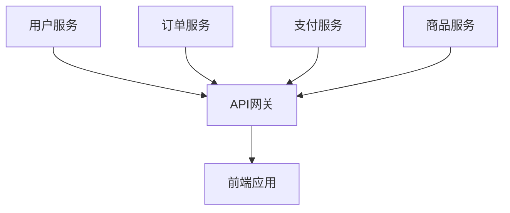

# K8s微服务架构部署  

## 1. 架构设计  

### 1.1 微服务拆分示例  


### 1.2 技术栈选择  
| 组件类型       | 推荐方案               | 备注                  |  
|----------------|----------------------|---------------------|  
| 服务注册发现    | Kubernetes Service   | 内置DNS轮询          |  
| API网关         | Nginx Ingress        | 支持金丝雀发布        |  
| 服务网格        | Istio                | 流量管理/熔断        |  

## 2. 容器化改造  

### 2.1 Dockerfile示例  
```dockerfile:c:\project\kphub\microservice\user-service\Dockerfile
FROM openjdk:11-jre
COPY target/user-service.jar /app/
EXPOSE 8080
ENTRYPOINT ["java","-jar","/app/user-service.jar"]
```

### 2.2 多阶段构建优化  
```dockerfile
FROM maven:3.6 AS build
COPY . /src
RUN mvn -f /src/pom.xml package

FROM openjdk:11-jre
COPY --from=build /src/target/*.jar /app/service.jar
```

## 3. Kubernetes部署  

### 3.1 服务部署配置  
```yaml:c:\project\kphub\kubernetes\microservice\user-service.yaml
apiVersion: apps/v1
kind: Deployment
metadata:
  name: user-service
spec:
  replicas: 3
  selector:
    matchLabels:
      app: user-service
  template:
    metadata:
      labels:
        app: user-service
    spec:
      containers:
      - name: user
        image: registry.example.com/user-service:v1.2.0
        ports:
        - containerPort: 8080
```

### 3.2 网关路由配置  
```yaml:c:\project\kphub\kubernetes\microservice\ingress.yaml
apiVersion: networking.k8s.io/v1
kind: Ingress
metadata:
  name: microservice-gateway
  annotations:
    nginx.ingress.kubernetes.io/rewrite-target: /$2
spec:
  rules:
  - host: api.example.com
    http:
      paths:
      - path: /user(/|$)(.*)
        pathType: Prefix
        backend:
          service:
            name: user-service
            port:
              number: 8080
```

## 4. CI/CD流水线  

### 4.1 GitLab CI配置  
```yaml:c:\project\kphub\gitlab-ci\microservice-pipeline.yml
stages:
  - build
  - test
  - deploy

build_job:
  stage: build
  script:
    - mvn package -DskipTests
    - docker build -t $CI_REGISTRY_IMAGE:$CI_COMMIT_SHA .

deploy_prod:
  stage: deploy
  environment: production
  only:
    - master
  script:
    - kubectl set image deployment/user-service user=$CI_REGISTRY_IMAGE:$CI_COMMIT_SHA -n prod
```

### 4.2 ArgoCD声明式部署  
```yaml:c:\project\kphub\kubernetes\argocd\application.yaml
apiVersion: argoproj.io/v1alpha1
kind: Application
metadata:
  name: user-service
spec:
  destination:
    namespace: prod
    server: https://kubernetes.default.svc
  source:
    path: kubernetes/microservice
    repoURL: https://git.example.com/microservice.git
    targetRevision: HEAD
```

## 5. 服务网格集成  

### 5.1 Istio Sidecar注入  
```yaml
apiVersion: apps/v1
kind: Deployment
metadata:
  annotations:
    sidecar.istio.io/inject: "true"
```

### 5.2 流量管理策略  
```yaml:c:\project\kphub\kubernetes\istio\virtualservice.yaml
apiVersion: networking.istio.io/v1alpha3
kind: VirtualService
metadata:
  name: user-service
spec:
  hosts:
  - "user.example.com"
  http:
  - route:
    - destination:
        host: user-service
        subset: v1
      weight: 90
    - destination:
        host: user-service
        subset: v2
      weight: 10
```

## 6. 监控与日志  

### 6.1 Prometheus监控配置  
```yaml:c:\project\kphub\kubernetes\monitoring\service-monitor.yaml
apiVersion: monitoring.coreos.com/v1
kind: ServiceMonitor
metadata:
  name: user-service-monitor
spec:
  endpoints:
  - port: http
    interval: 15s
  selector:
    matchLabels:
      app: user-service
```

### 6.2 EFK日志收集  
```yaml:c:\project\kphub\kubernetes\logging\fluentd-config.yaml
apiVersion: v1
kind: ConfigMap
metadata:
  name: fluentd-config
data:
  fluent.conf: |
    <match kubernetes.**>
      @type elasticsearch
      host elasticsearch-logging
      port 9200
      logstash_format true
    </match>
```

## 7. 生产优化  

### 7.1 HPA自动扩缩容  
```yaml:c:\project\kphub\kubernetes\autoscaling\hpa.yaml
apiVersion: autoscaling/v2
kind: HorizontalPodAutoscaler
metadata:
  name: user-service-hpa
spec:
  scaleTargetRef:
    apiVersion: apps/v1
    kind: Deployment
    name: user-service
  minReplicas: 2
  maxReplicas: 10
  metrics:
  - type: Resource
    resource:
      name: cpu
      target:
        type: Utilization
        averageUtilization: 70
```

### 7.2 多集群部署方案  
```yaml:c:\project\kphub\kubernetes\federation\placement.yaml
apiVersion: scheduling.kubefed.io/v1alpha1
kind: ReplicaSchedulingPreference
metadata:
  name: user-service
spec:
  targetClusters:
    cluster1: 60%
    cluster2: 40%
```

微服务架构在Kubernetes上的部署需要综合考虑服务拆分、流量管理、可观测性等要素。生产环境建议采用渐进式发布策略，配合服务网格实现细粒度流量控制。监控系统应覆盖从基础设施到业务指标的全栈观测，关键服务需配置多集群容灾方案。