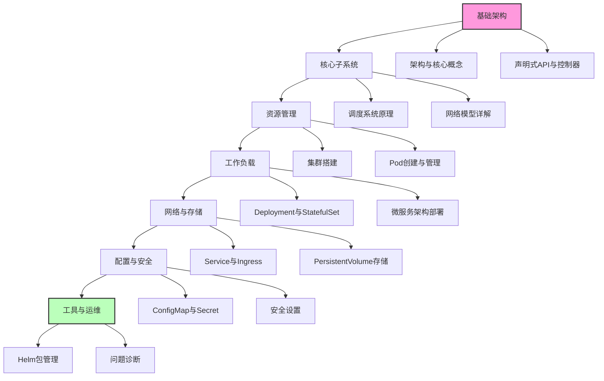
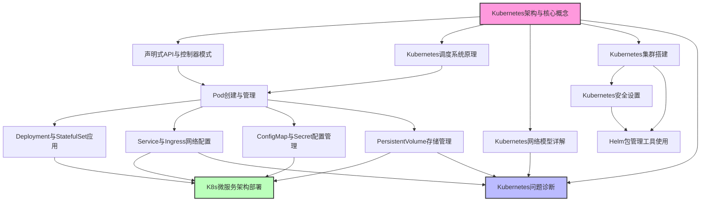

# Kubernetes知识库总览

Kubernetes已成为容器编排领域的事实标准，为企业提供了强大的容器化应用管理平台。本知识库系统性地整理了Kubernetes的核心概念、架构设计、实践技巧和运维方案，旨在帮助开发者和运维人员全面掌握Kubernetes技术栈。

无论您是刚接触Kubernetes的初学者，还是希望深入理解其内部机制的高级用户，本知识库都能为您提供有价值的参考。知识库内容从基础概念到高级实践，循序渐进，同时注重理论与实践的结合。

## 学习路径

以下流程图展示了学习Kubernetes的推荐路径，从基础架构开始，逐步深入到各个专业领域：

## 1. 基础架构

Kubernetes的基础架构是理解整个系统的关键，包括其设计理念、组件架构和API模型。

- [01-Kubernetes架构与核心概念](./01-Kubernetes架构与核心概念.md)  
  全面介绍Kubernetes的整体架构设计，包括控制平面组件（API Server、Controller Manager、Scheduler、etcd）和数据平面组件（Kubelet、Kube-proxy、Container Runtime）的工作原理与交互方式。同时详细解析Pod、Node、Namespace等基础资源对象的设计思想和使用场景。

- [02-声明式API与控制器模式](./02-声明式API与控制器模式.md)  
  深入剖析Kubernetes声明式API的设计理念，对比命令式与声明式系统的差异。详细讲解控制器的工作原理、协调循环机制以及自定义资源定义(CRD)和自定义控制器的开发方法，帮助理解Kubernetes的核心设计模式。

## 2. 核心子系统

核心子系统是Kubernetes实现容器编排和管理的关键机制，包括调度系统和网络模型。

- [03-Kubernetes调度系统原理](./03-Kubernetes调度系统原理.md)  
  详细分析Kubernetes调度器的工作流程，包括调度队列管理、预选(Predicates)和优选(Priorities)算法的实现原理。介绍节点亲和性、污点与容忍、资源需求与限制等高级调度特性，以及如何实现自定义调度策略和扩展调度器功能。

- [04-Kubernetes网络模型详解](./04-Kubernetes网络模型详解.md)  
  全面剖析Kubernetes网络模型的四层网络要求，深入解读CNI(容器网络接口)插件机制。比较分析Calico、Flannel、Cilium等主流网络方案的实现原理和适用场景。详细讲解Service网络实现原理、DNS服务发现机制以及多集群网络互联方案。

## 3. 资源管理

资源管理涵盖了Kubernetes集群的搭建和基础资源单元Pod的管理，是实际操作Kubernetes的基础。

- [05-Kubernetes集群搭建](./05-Kubernetes集群搭建.md)  
  对比分析多种Kubernetes集群部署方案，包括kubeadm工具部署、二进制安装方式以及各大云服务商的托管Kubernetes服务。详细介绍集群规划、高可用配置、证书管理以及集群升级策略，帮助用户根据实际需求选择合适的部署方案。

- [06-Pod创建与管理](./06-Pod创建与管理.md)  
  深入讲解Pod作为Kubernetes最小调度单元的生命周期管理，包括Pod的创建、调度、运行和销毁全过程。详细介绍Init容器、Sidecar模式、健康检查机制、资源限制配置以及Pod安全上下文设置。提供Pod调试和故障排查的实用技巧。

## 4. 工作负载

工作负载管理是Kubernetes的核心功能，涵盖了不同类型应用的部署和管理策略。

- [07-Deployment与StatefulSet应用](./07-Deployment与StatefulSet应用.md)  
  全面对比无状态(Deployment)与有状态(StatefulSet)服务的部署策略和使用场景。详细讲解滚动更新、蓝绿部署、金丝雀发布等发布策略的实现方法。介绍StatefulSet的稳定网络标识、存储管理和分区更新控制，以及DaemonSet和Job/CronJob的应用场景。

- [14-K8s微服务架构部署](./14-K8s微服务架构部署.md)  
  系统介绍微服务架构在Kubernetes上的完整落地实践，包括服务拆分策略、API网关选型、服务注册与发现机制。深入讲解服务网格(Service Mesh)的实现原理和集成方案，对比Istio、Linkerd等主流服务网格技术。提供微服务监控、追踪和弹性伸缩的最佳实践。

## 5. 网络与存储

网络与存储是容器化应用的关键基础设施，Kubernetes提供了丰富的网络和存储管理能力。

- [08-Service与Ingress网络配置](./08-Service与Ingress网络配置.md)  
  详细解析Kubernetes服务发现机制，包括ClusterIP、NodePort、LoadBalancer等Service类型的实现原理和使用场景。深入介绍Ingress资源的工作原理，对比分析Nginx Ingress、Traefik、Kong等主流Ingress控制器的特点。讲解流量管理策略，包括路由规则、TLS终止和负载均衡配置。

- [10-PersistentVolume存储管理](./10-PersistentVolume存储管理.md)  
  全面介绍Kubernetes存储体系，包括PersistentVolume(PV)、PersistentVolumeClaim(PVC)和StorageClass的设计理念和使用方法。详细讲解存储卷生命周期管理、动态供应机制和访问模式。对比分析本地存储、NFS、Ceph、云存储等不同存储后端的集成方案和性能优化策略。

## 6. 配置与安全

配置管理和安全设置是保障Kubernetes应用稳定运行和安全可靠的重要保障。

- [09-ConfigMap与Secret配置管理](./09-ConfigMap与Secret配置管理.md)  
  深入讲解Kubernetes配置管理机制，包括ConfigMap和Secret资源的创建、更新和使用方法。详细介绍配置热更新实现方案、配置版本管理策略以及敏感数据的加密管理最佳实践。提供多环境配置管理和配置中心集成的解决方案。

- [11-Kubernetes安全设置](./11-Kubernetes安全设置.md)  
  全面介绍Kubernetes安全体系，包括认证、授权和准入控制三大安全机制。详细讲解RBAC(基于角色的访问控制)权限模型、ServiceAccount的使用方法、Pod安全策略(PSP)配置以及网络策略(NetworkPolicy)实现的网络隔离方案。提供集群安全加固和合规检查的最佳实践。

## 7. 工具与运维

工具与运维是Kubernetes生产环境落地的关键环节，包括应用包管理和问题诊断。

- [12-Helm包管理工具使用](./12-Helm包管理工具使用.md)  
  详细介绍Helm作为Kubernetes包管理工具的核心概念和使用方法。深入讲解Chart开发规范、模板语法、依赖管理机制以及仓库管理。提供生产环境Helm应用发布策略、多环境配置管理和CI/CD集成方案，帮助用户规范化应用部署流程。

- [13-Kubernetes问题诊断](./13-Kubernetes问题诊断.md)  
  系统化介绍Kubernetes故障排查方法论和工具链。详细讲解核心组件异常处理方案、网络故障诊断流程、存储问题排查技巧以及应用容器故障分析方法。提供性能瓶颈分析、日志收集分析和监控告警体系建设的最佳实践，帮助用户构建高效的问题诊断和解决流程。

## 知识体系关联图

以下关系图展示了Kubernetes各知识模块之间的关联关系，帮助您理解各部分知识的内在联系：

## 学习建议

1. **循序渐进**：建议按照"基础架构→核心子系统→资源管理→工作负载→网络与存储→配置与安全→工具与运维"的顺序学习，循序渐进地掌握Kubernetes知识体系。

2. **理论结合实践**：在学习每个模块的理论知识后，建议立即通过实际操作进行验证和巩固，可以使用Minikube或Kind等工具在本地搭建测试环境。

3. **深入源码**：对于希望深入理解Kubernetes内部机制的高级用户，建议阅读相关组件的源代码，了解实现细节。

4. **关注生态**：Kubernetes拥有丰富的生态系统，建议关注CNCF(云原生计算基金会)孵化的相关项目，扩展Kubernetes的应用场景。

5. **持续学习**：Kubernetes技术发展迅速，建议定期关注官方文档和社区动态，了解新特性和最佳实践。

通过本知识库的系统学习，您将能够全面掌握Kubernetes的核心概念和实践技能，为容器化应用的开发、部署和运维打下坚实基础。