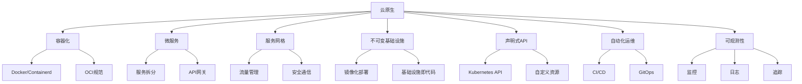
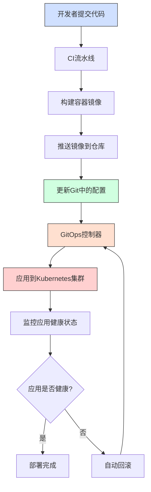
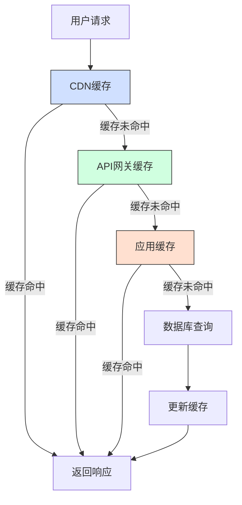
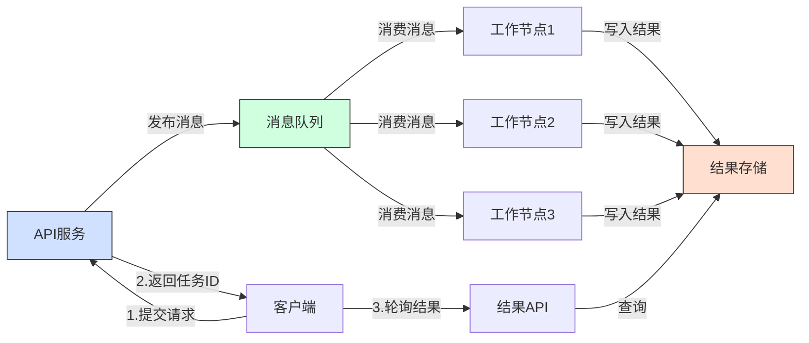
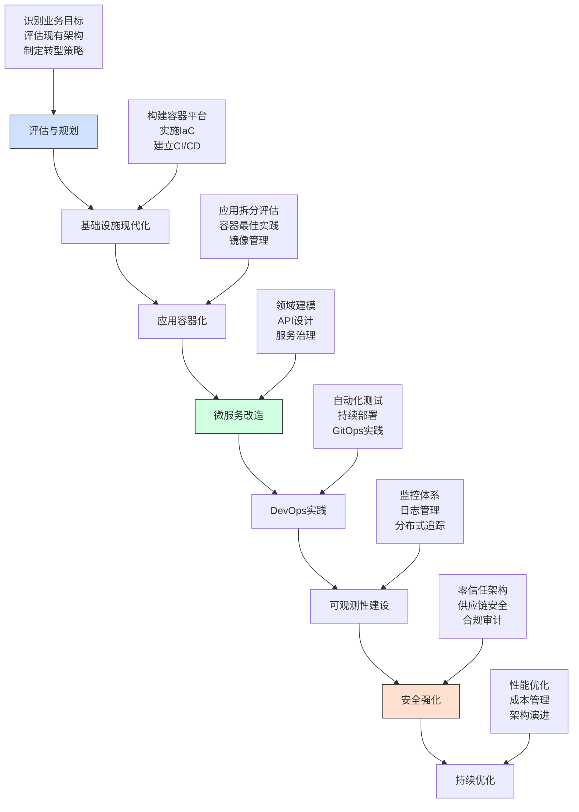

# 云原生架构设计原则  

云原生架构是一种专为云环境设计的应用架构模式，它充分利用云计算的弹性和分布式特性，使应用能够在现代动态环境中高效运行。本文将系统介绍云原生架构的核心设计理念、关键原则和最佳实践，帮助开发者和架构师构建更具弹性、可扩展性和可观测性的系统。

## 1. 核心设计理念  

云原生架构的核心理念是将应用设计为原生适配云环境的服务，而非简单地将传统应用迁移到云上。这种设计思想体现在多个层面，包括应用架构、部署模式和运维方式。

### 1.1 云原生技术栈  

云原生技术栈是实现云原生架构的基础，包含多个相互关联的技术领域：



**技术栈详解：**

1. **容器化**：将应用及其依赖封装在容器中，实现环境一致性和隔离性
   - 容器运行时：Docker、Containerd、CRI-O
   - 容器编排：Kubernetes、Docker Swarm

2. **微服务**：将应用拆分为松耦合的小型服务，每个服务专注于特定业务功能
   - 服务通信：REST、gRPC、消息队列
   - 服务治理：服务注册发现、负载均衡

3. **服务网格**：专用基础设施层，处理服务间通信、安全和观测
   - 实现方案：Istio、Linkerd、Consul Connect
   - 核心功能：流量管理、安全策略、可观测性

4. **不可变基础设施**：将基础设施视为可替换的组件，而非持续修改的实体
   - 镜像化部署：容器镜像、虚拟机镜像
   - 基础设施即代码：Terraform、CloudFormation

5. **声明式API**：通过描述期望状态而非操作步骤来管理系统
   - Kubernetes API：Deployment、Service、ConfigMap
   - 自定义资源：CRD、Operator模式

6. **自动化运维**：通过自动化流程实现持续集成、持续部署和自动扩缩容
   - CI/CD工具：Jenkins、GitLab CI、GitHub Actions
   - 配置管理：Ansible、Puppet、Chef

7. **可观测性**：通过监控、日志和追踪全面了解系统状态
   - 监控工具：Prometheus、Grafana
   - 日志管理：ELK Stack、Loki
   - 分布式追踪：Jaeger、Zipkin

### 1.2 与传统架构对比  

云原生架构与传统架构在多个维度存在显著差异，理解这些差异有助于把握云原生设计的核心思想：

| 维度         | 传统架构               | 云原生架构             | 优势说明                     |
|--------------|----------------------|----------------------|------------------------------|
| 部署单元      | 虚拟机/物理机         | 容器/Pod             | 更轻量、启动更快、资源利用率更高 |
| 扩展方式      | 垂直扩展（增加单机资源）| 水平扩展（增加实例数） | 无单点瓶颈、线性扩展能力       |
| 交付周期      | 周/月级              | 天/小时级            | 快速迭代、持续交付             |
| 状态管理      | 本地状态存储          | 外部化状态            | 服务无状态化、易于扩展和迁移    |
| 故障处理      | 尽量避免故障          | 拥抱故障（设计容错）   | 系统整体更具弹性              |
| 运维模式      | 手动操作为主          | 自动化为主            | 降低人为错误、提高效率         |
| 资源分配      | 静态预分配            | 动态按需分配          | 资源利用率更高、成本更优       |
| 服务依赖      | 紧耦合                | 松耦合               | 独立演化、故障隔离             |
| 安全边界      | 网络边界防护          | 零信任模型            | 更细粒度的安全控制            |
| 监控方式      | 基础设施监控为主      | 全栈可观测性          | 更全面的系统洞察能力          |

**传统架构的局限性：**

1. **资源利用率低**：预分配资源导致大量资源闲置
2. **扩展性受限**：垂直扩展存在物理上限
3. **部署复杂**：环境依赖导致"在我机器上能运行"问题
4. **变更风险高**：大型单体应用变更影响面广
5. **恢复时间长**：故障恢复通常需要人工干预

**云原生架构的优势：**

1. **弹性伸缩**：根据负载自动调整资源
2. **快速恢复**：故障组件可快速替换
3. **持续交付**：自动化流水线支持频繁发布
4. **成本优化**：按需使用资源，避免浪费
5. **创新加速**：降低试错成本，鼓励创新

## 2. 关键设计原则  

云原生应用设计遵循一系列关键原则，这些原则共同构成了云原生架构的基础。

### 2.1 松耦合设计  

松耦合是云原生架构的核心原则，它使服务能够独立演化和扩展，同时提高系统的弹性和可维护性。

**实现松耦合的关键策略：**

```text
1. 服务间通过标准化API通信
   - 使用REST、GraphQL或gRPC等协议
   - 明确定义API契约和版本策略
   - 实施API网关统一管理服务入口

2. 避免共享数据库
   - 每个服务维护自己的数据存储
   - 使用数据复制或事件溯源保持数据一致性
   - 实施领域驱动设计(DDD)界定服务边界

3. 使用异步消息队列
   - 解耦服务间的直接依赖
   - 实现发布-订阅模式进行事件通知
   - 提供缓冲机制应对流量峰值

4. 实施容错设计
   - 服务间调用添加超时控制
   - 使用断路器模式防止级联故障
   - 实现优雅降级策略

5. 避免分布式事务
   - 采用最终一致性模型
   - 使用Saga模式或补偿事务
   - 实现幂等操作支持重试机制
```

**松耦合设计示例：**

```yaml:c:\project\kphub\cloudnative\service-communication.yaml
# 服务间通信配置示例
services:
  order-service:
    api:
      type: REST
      version: v1
      endpoints:
        - path: /orders
          methods: [GET, POST]
        - path: /orders/{id}
          methods: [GET, PUT, DELETE]
    database:
      type: dedicated
      technology: postgresql
    events:
      publishes:
        - name: order.created
        - name: order.updated
        - name: order.cancelled
      subscribes:
        - name: payment.completed
        - name: inventory.reserved

  payment-service:
    api:
      type: gRPC
      version: v1
      services:
        - name: PaymentService
          methods:
            - ProcessPayment
            - RefundPayment
    database:
      type: dedicated
      technology: mongodb
    events:
      publishes:
        - name: payment.completed
        - name: payment.failed
      subscribes:
        - name: order.created
```

### 2.2 弹性设计模式  

弹性设计是云原生应用的关键特性，它使系统能够在面对故障、负载波动和网络不稳定等情况时保持可用性和性能。

**核心弹性模式：**

1. **断路器模式**：防止对故障服务的持续调用导致级联故障
2. **重试策略**：处理临时性故障，通过重试恢复正常
3. **超时控制**：避免请求无限期等待，释放资源
4. **舱壁隔离**：将系统分割为独立的故障域，限制故障影响范围
5. **限流机制**：保护系统免受过载影响
6. **优雅降级**：在部分功能不可用时提供有限服务
7. **幂等性设计**：确保操作可以安全重试

**弹性设计配置示例：**

```yaml:c:\project\kphub\cloudnative\resilience-patterns.yaml
# 弹性模式配置示例
resilience:
  # 断路器配置
  circuitBreaker:
    failureThreshold: 3       # 触发断路器的失败次数阈值
    successThreshold: 2       # 半开状态下恢复所需的成功次数
    timeoutSeconds: 5         # 请求超时时间
    resetTimeoutSeconds: 30   # 断路器从开到半开状态的等待时间
  
  # 重试策略
  retryPolicy:
    maxAttempts: 3            # 最大重试次数
    backoff: 1s               # 初始重试间隔
    maxBackoff: 10s           # 最大重试间隔
    backoffMultiplier: 2      # 重试间隔增长因子
    retryableStatusCodes:     # 可重试的状态码
      - 408  # Request Timeout
      - 429  # Too Many Requests
      - 503  # Service Unavailable
  
  # 限流配置
  rateLimiter:
    requestsPerSecond: 100    # 每秒请求数限制
    burstSize: 20             # 突发请求容量
  
  # 舱壁隔离
  bulkhead:
    maxConcurrentCalls: 25    # 最大并发请求数
    maxQueueSize: 10          # 等待队列大小
  
  # 超时控制
  timeout:
    callTimeoutMs: 2000       # 调用超时时间(毫秒)
    
  # 故障注入(用于测试弹性)
  faultInjection:
    delay:
      percentage: 10          # 延迟注入百分比
      fixedDelayMs: 100       # 固定延迟时间(毫秒)
    abort:
      percentage: 5           # 中断注入百分比
      httpStatus: 503         # 中断时返回的HTTP状态码
```

**弹性设计实现示例：**

```java:c:\project\kphub\cloudnative\resilience\CircuitBreakerExample.java
// 使用Resilience4j实现断路器模式
import io.github.resilience4j.circuitbreaker.CircuitBreaker;
import io.github.resilience4j.circuitbreaker.CircuitBreakerConfig;
import io.vavr.control.Try;

import java.time.Duration;
import java.util.function.Supplier;

public class CircuitBreakerExample {
    
    public static void main(String[] args) {
        // 配置断路器
        CircuitBreakerConfig config = CircuitBreakerConfig.custom()
            .failureRateThreshold(50)                // 50%的失败率将触发断路器
            .waitDurationInOpenState(Duration.ofMillis(1000))  // 断路器打开后等待时间
            .permittedNumberOfCallsInHalfOpenState(2)          // 半开状态允许的调用次数
            .slidingWindowSize(10)                             // 滑动窗口大小
            .build();
            
        // 创建断路器
        CircuitBreaker circuitBreaker = CircuitBreaker.of("paymentService", config);
        
        // 创建受保护的函数
        Supplier<String> decoratedSupplier = CircuitBreaker
            .decorateSupplier(circuitBreaker, () -> callPaymentService());
            
        // 执行
        for (int i = 0; i < 20; i++) {
            Try<String> result = Try.ofSupplier(decoratedSupplier);
            if (result.isSuccess()) {
                System.out.println("Call succeeded: " + result.get());
            } else {
                System.out.println("Call failed: " + result.getCause().getMessage());
            }
            
            // 模拟延迟
            try {
                Thread.sleep(100);
            } catch (InterruptedException e) {
                Thread.currentThread().interrupt();
            }
        }
    }
    
    private static String callPaymentService() {
        // 模拟服务调用，随机失败
        if (Math.random() < 0.7) {  // 70%的失败率
            throw new RuntimeException("Payment service unavailable");
        }
        return "Payment processed successfully";
    }
}
```

## 3. 基础设施原则  

云原生架构依赖于现代化的基础设施实践，这些实践使应用能够充分利用云环境的优势。

### 3.1 不可变基础设施  

不可变基础设施是云原生架构的基础原则之一，它将基础设施视为可替换而非可修改的组件，从而提高系统的可靠性和一致性。

**不可变基础设施的核心理念：**

1. **环境一致性**：开发、测试和生产环境保持一致
2. **版本化基础设施**：基础设施配置像代码一样有版本控制
3. **零停机部署**：通过替换而非修改实现更新
4. **回滚能力**：出现问题时可快速回退到已知良好状态
5. **自动化部署**：减少人工干预，提高可靠性

**不可变基础设施实践：**

```powershell
# 1. 构建不可变容器镜像
# 使用多阶段构建优化镜像大小
docker build -t app:v1.2 -f Dockerfile.multistage .

# 2. 为镜像添加版本标签并推送到仓库
docker tag app:v1.2 registry.example.com/app:v1.2
docker push registry.example.com/app:v1.2

# 3. 使用镜像摘要而非标签确保不可变性
docker pull registry.example.com/app@sha256:a1b2c3d4e5f6...

# 4. 使用Kubernetes部署不可变Pod
kubectl apply -f deployment.yaml

# 5. 使用滚动更新策略实现零停机部署
kubectl set image deployment/app app=registry.example.com/app:v1.3

# 6. 出现问题时快速回滚
kubectl rollout undo deployment/app
```

**不可变基础设施的Dockerfile示例：**

```dockerfile:c:\project\kphub\cloudnative\Dockerfile.multistage
# 构建阶段
FROM maven:3.8-openjdk-11 AS build
WORKDIR /app
COPY pom.xml .
# 缓存Maven依赖
RUN mvn dependency:go-offline
COPY src ./src
RUN mvn package -DskipTests

# 运行阶段
FROM openjdk:11-jre-slim
WORKDIR /app
# 添加非root用户提高安全性
RUN addgroup --system appgroup && adduser --system appuser --ingroup appgroup
USER appuser
# 仅复制构建产物，减小镜像体积
COPY --from=build /app/target/*.jar app.jar
# 使用exec形式的ENTRYPOINT确保容器正确接收信号
ENTRYPOINT ["java", "-jar", "app.jar"]
# 健康检查
HEALTHCHECK --interval=30s --timeout=3s \
  CMD wget -q -O /dev/null http://localhost:8080/actuator/health || exit 1
# 元数据标签
LABEL maintainer="team@example.com" \
      version="1.2" \
      description="Cloud Native Application"
```

### 3.2 声明式配置管理  

声明式配置是云原生应用的关键特性，它通过描述系统的期望状态而非实现步骤，简化了复杂系统的管理。

**声明式配置的优势：**

1. **自我修复**：系统自动调整以匹配声明的期望状态
2. **版本控制**：配置可以像代码一样进行版本管理
3. **可审计性**：清晰记录系统配置的变更历史
4. **简化复杂性**：专注于"做什么"而非"怎么做"
5. **一致性**：减少环境差异和配置漂移

**Kubernetes声明式配置示例：**

```yaml:c:\project\kphub\kubernetes\deployment.yaml
apiVersion: apps/v1
kind: Deployment
metadata:
  name: app
  labels:
    app: microservice
    component: backend
spec:
  replicas: 3
  selector:
    matchLabels:
      app: microservice
  strategy:
    type: RollingUpdate
    rollingUpdate:
      maxSurge: 1
      maxUnavailable: 0
  template:
    metadata:
      labels:
        app: microservice
        component: backend
    spec:
      containers:
      - name: app
        image: registry.example.com/app:v1.2
        ports:
        - containerPort: 8080
        resources:
          requests:
            cpu: 100m
            memory: 256Mi
          limits:
            cpu: 500m
            memory: 512Mi
        readinessProbe:
          httpGet:
            path: /actuator/health
            port: 8080
          initialDelaySeconds: 10
          periodSeconds: 5
        livenessProbe:
          httpGet:
            path: /actuator/health
            port: 8080
          initialDelaySeconds: 60
          periodSeconds: 15
        env:
        - name: SPRING_PROFILES_ACTIVE
          value: "production"
        - name: LOG_LEVEL
          value: "INFO"
      securityContext:
        runAsNonRoot: true
        runAsUser: 1000
      terminationGracePeriodSeconds: 30
```

**基础设施即代码(IaC)示例：**

```hcl:c:\project\kphub\cloudnative\terraform\main.tf
# Terraform声明式基础设施配置
provider "aws" {
  region = "us-west-2"
}

# 定义VPC
resource "aws_vpc" "main" {
  cidr_block = "10.0.0.0/16"
  
  tags = {
    Name = "main-vpc"
    Environment = "production"
  }
}

# 定义子网
resource "aws_subnet" "public" {
  count = 3
  vpc_id = aws_vpc.main.id
  cidr_block = "10.0.${count.index}.0/24"
  availability_zone = data.aws_availability_zones.available.names[count.index]
  map_public_ip_on_launch = true
  
  tags = {
    Name = "public-subnet-${count.index}"
    Environment = "production"
  }
}

# 定义EKS集群
resource "aws_eks_cluster" "main" {
  name = "production-cluster"
  role_arn = aws_iam_role.eks_cluster.arn
  
  vpc_config {
    subnet_ids = aws_subnet.public[*].id
  }
  
  # 确保IAM角色在集群之前创建
  depends_on = [
    aws_iam_role_policy_attachment.eks_cluster_policy
  ]
}

# 定义节点组
resource "aws_eks_node_group" "main" {
  cluster_name = aws_eks_cluster.main.name
  node_group_name = "production-workers"
  node_role_arn = aws_iam_role.eks_nodes.arn
  subnet_ids = aws_subnet.public[*].id
  
  scaling_config {
    desired_size = 3
    max_size = 5
    min_size = 1
  }
  
  instance_types = ["t3.medium"]
  
  # 确保IAM角色在节点组之前创建
  depends_on = [
    aws_iam_role_policy_attachment.eks_worker_policy
  ]
}

# 输出集群端点
output "cluster_endpoint" {
  value = aws_eks_cluster.main.endpoint
}
```

## 4. 可观测性原则  

可观测性是云原生架构的关键支柱，它使团队能够了解分布式系统的内部状态，快速定位问题并优化性能。

### 4.1 监控指标体系  

有效的监控指标体系是可观测性的基础，它提供了系统行为的量化视图。

**监控指标的四个黄金信号：**

1. **延迟(Latency)**：服务响应请求所需的时间
2. **流量(Traffic)**：系统需求的度量，如HTTP请求率
3. **错误(Errors)**：失败请求的比率
4. **饱和度(Saturation)**：系统资源使用率

**RED方法（面向服务监控）：**

```text
RED方法专注于服务级别的用户体验监控：

- 请求率(Rate)：每秒接收的请求数
  - 衡量服务负载
  - 识别流量模式和异常
  - 帮助容量规划

- 错误率(Errors)：失败请求的百分比
  - 直接反映服务质量
  - 触发告警的关键指标
  - 按错误类型分类(4xx vs 5xx)

- 持续时间(Duration)：请求处理时间
  - 使用分位数而非平均值(p50, p90, p99)
  - 识别长尾延迟问题
  - 与SLO/SLA直接相关
```

**USE方法（面向资源监控）：**

```text
USE方法专注于资源利用率监控：

- 利用率(Utilization)：资源忙碌的时间百分比
  - CPU使用率
  - 内存使用率
  - 磁盘使用率
  - 网络带宽使用率

- 饱和度(Saturation)：资源队列中等待的工作量
  - CPU负载
  - 内存交换
  - 磁盘I/O队列
  - 网络缓冲区

- 错误(Errors)：资源错误计数
  - 内存分配失败
  - 网络丢包
  - 磁盘I/O错误
```

**Prometheus监控配置示例：**

```yaml:c:\project\kphub\cloudnative\monitoring\prometheus.yaml
global:
  scrape_interval: 15s
  evaluation_interval: 15s

# 告警规则
rule_files:
  - "alerts.yaml"

# 告警管理器配置
alerting:
  alertmanagers:
  - static_configs:
    - targets:
      - alertmanager:9093

# 抓取配置
scrape_configs:
  # Kubernetes API服务器
  - job_name: 'kubernetes-apiservers'
    kubernetes_sd_configs:
    - role: endpoints
    scheme: https
    tls_config:
      ca_file: /var/run/secrets/kubernetes.io/serviceaccount/ca.crt
    bearer_token_file: /var/run/secrets/kubernetes.io/serviceaccount/token
    relabel_configs:
    - source_labels: [__meta_kubernetes_namespace, __meta_kubernetes_service_name, __meta_kubernetes_endpoint_port_name]
      action: keep
      regex: default;kubernetes;https

  # Kubernetes节点
  - job_name: 'kubernetes-nodes'
    kubernetes_sd_configs:
    - role: node
    scheme: https
    tls_config:
      ca_file: /var/run/secrets/kubernetes.io/serviceaccount/ca.crt
    bearer_token_file: /var/run/secrets/kubernetes.io/serviceaccount/token
    relabel_configs:
    - action: labelmap
      regex: __meta_kubernetes_node_label_(.+)

  # Kubernetes Pod
  - job_name: 'kubernetes-pods'
    kubernetes_sd_configs:
    - role: pod
    relabel_configs:
    - source_labels: [__meta_kubernetes_pod_annotation_prometheus_io_scrape]
      action: keep
      regex: true
    - source_labels: [__meta_kubernetes_pod_annotation_prometheus_io_path]
      action: replace
      target_label: __metrics_path__
      regex: (.+)
    - source_labels: [__address__, __meta_kubernetes_pod_annotation_prometheus_io_port]
      action: replace
      regex: ([^:]+)(?::\d+)?;(\d+)
      replacement: $1:$2
      target_label: __address__
    - action: labelmap
      regex: __meta_kubernetes_pod_label_(.+)
    - source_labels: [__meta_kubernetes_namespace]
      action: replace
      target_label: kubernetes_namespace
    - source_labels: [__meta_kubernetes_pod_name]
      action: replace
      target_label: kubernetes_pod_name
```

**告警规则示例：**

```yaml:c:\project\kphub\cloudnative\monitoring\alerts.yaml
groups:
- name: service_alerts
  rules:
  # 高错误率告警
  - alert: HighErrorRate
    expr: sum(rate(http_requests_total{status=~"5.."}[5m])) / sum(rate(http_requests_total[5m])) > 0.05
    for: 2m
    labels:
      severity: critical
    annotations:
      summary: "High error rate detected"
      description: "Error rate is above 5% for the last 2 minutes (current value: {{ $value }})"
      
  # 高延迟告警
  - alert: HighLatency
    expr: histogram_quantile(0.95, sum(rate(http_request_duration_seconds_bucket[5m])) by (le)) > 0.5
    for: 5m
    labels:
      severity: warning
    annotations:
      summary: "High latency detected"
      description: "95th percentile latency is above 500ms for the last 5 minutes (current value: {{ $value }}s)"
      
  # 实例健康检查
  - alert: InstanceDown
    expr: up == 0
    for: 1m
    labels:
      severity: critical
    annotations:
      summary: "Instance {{ $labels.instance }} down"
      description: "Instance {{ $labels.instance }} has been down for more than 1 minute"
      
  # 资源饱和度告警
  - alert: HighCPUUsage
    expr: (1 - avg by(instance)(rate(node_cpu_seconds_total{mode="idle"}[5m]))) > 0.8
    for: 5m
    labels:
      severity: warning
    annotations:
      summary: "High CPU usage on {{ $labels.instance }}"
      description: "CPU usage is above 80% for the last 5 minutes (current value: {{ $value | humanizePercentage }})"
```

### 4.2 日志规范  

结构化日志是云原生应用的最佳实践，它使日志数据更易于搜索、过滤和分析。

**结构化日志的关键要素：**

1. **统一格式**：所有服务使用一致的日志格式
2. **机器可解析**：通常使用JSON格式
3. **关联标识符**：包含请求ID、会话
继续编写云原生架构设计原则文档：

### 4.2 日志规范  

结构化日志是云原生应用的最佳实践，它使日志数据更易于搜索、过滤和分析。

**结构化日志的关键要素：**

1. **统一格式**：所有服务使用一致的日志格式
2. **机器可解析**：通常使用JSON格式
3. **关联标识符**：包含请求ID、会话ID和跟踪ID
4. **上下文信息**：包含服务名称、实例ID和环境信息
5. **分级严重性**：使用标准化的日志级别
6. **时间戳标准化**：使用ISO8601格式的UTC时间

**标准化日志格式示例：**

```python:c:\project\kphub\logging\log-format.py
# 标准化日志格式示例
{
  "timestamp": "2023-05-15T08:12:34.567Z",  # ISO8601格式的UTC时间
  "severity": "INFO",                        # 日志级别(DEBUG/INFO/WARN/ERROR/FATAL)
  "service": "payment-service",              # 服务名称
  "instance": "payment-service-5d87f4b6b8-2jh9x", # 实例标识
  "trace_id": "4ac342a3e4a9a9c2",            # 分布式追踪ID
  "span_id": "fc239d33a90a7ebb",             # 当前操作的跨度ID
  "request_id": "5f4b56a2-12c4-4a9b-bd38-c3c95e483174", # 请求唯一标识
  "user_id": "user-12345",                   # 用户标识(如适用)
  "message": "Payment transaction processed successfully", # 日志消息
  "data": {                                  # 结构化上下文数据
    "transaction_id": "tx-9876543",
    "amount": 125.50,
    "currency": "USD",
    "status": "completed"
  },
  "code": "PAYMENT.SUCCESS",                 # 业务代码
  "duration_ms": 87,                         # 操作耗时(毫秒)
  "environment": "production"                # 环境标识
}
```

**日志最佳实践：**

```text
1. 日志级别使用指南
   - DEBUG: 详细的开发信息，仅在开发/调试环境启用
   - INFO: 正常操作信息，表明服务正常运行
   - WARN: 潜在问题警告，不影响当前操作但可能需要关注
   - ERROR: 操作失败，但服务仍能继续运行
   - FATAL: 严重错误，导致服务无法继续运行

2. 敏感数据处理
   - 永不记录密码、令牌、密钥等敏感信息
   - 对个人身份信息(PII)进行脱敏处理
   - 信用卡号仅记录最后4位
   - 考虑使用数据掩码技术

3. 异常处理
   - 记录完整的异常堆栈
   - 包含导致异常的上下文信息
   - 使用唯一错误代码便于追踪

4. 性能考虑
   - 异步日志记录避免阻塞主线程
   - 使用采样策略减少高流量路径的日志量
   - 实现日志缓冲机制应对突发流量
```

**Spring Boot结构化日志配置示例：**

```xml:c:\project\kphub\cloudnative\logging\logback-spring.xml
<?xml version="1.0" encoding="UTF-8"?>
<configuration>
    <!-- 控制台输出 -->
    <appender name="CONSOLE" class="ch.qos.logback.core.ConsoleAppender">
        <encoder class="net.logstash.logback.encoder.LogstashEncoder">
            <!-- 自定义字段 -->
            <customFields>{"service":"payment-service","environment":"${ENVIRONMENT:-development}"}</customFields>
            <!-- 包含MDC中的跟踪ID -->
            <includeMdcKeyName>traceId</includeMdcKeyName>
            <includeMdcKeyName>spanId</includeMdcKeyName>
            <includeMdcKeyName>requestId</includeMdcKeyName>
        </encoder>
    </appender>
    
    <!-- 文件输出 -->
    <appender name="FILE" class="ch.qos.logback.core.rolling.RollingFileAppender">
        <file>/var/log/application.log</file>
        <rollingPolicy class="ch.qos.logback.core.rolling.TimeBasedRollingPolicy">
            <fileNamePattern>/var/log/application.%d{yyyy-MM-dd}.log</fileNamePattern>
            <maxHistory>30</maxHistory>
        </rollingPolicy>
        <encoder class="net.logstash.logback.encoder.LogstashEncoder">
            <customFields>{"service":"payment-service","environment":"${ENVIRONMENT:-development}"}</customFields>
            <includeMdcKeyName>traceId</includeMdcKeyName>
            <includeMdcKeyName>spanId</includeMdcKeyName>
            <includeMdcKeyName>requestId</includeMdcKeyName>
        </encoder>
    </appender>
    
    <!-- 异步处理提高性能 -->
    <appender name="ASYNC" class="ch.qos.logback.classic.AsyncAppender">
        <appender-ref ref="FILE" />
        <queueSize>512</queueSize>
        <discardingThreshold>0</discardingThreshold>
    </appender>
    
    <!-- 根日志级别 -->
    <root level="INFO">
        <appender-ref ref="CONSOLE" />
        <appender-ref ref="ASYNC" />
    </root>
    
    <!-- 特定包的日志级别 -->
    <logger name="org.springframework" level="WARN" />
    <logger name="com.example.payment" level="DEBUG" />
</configuration>
```

### 4.3 分布式追踪

分布式追踪是云原生可观测性的重要组成部分，它帮助开发者理解请求如何在微服务架构中流动。

**分布式追踪的核心概念：**

1. **追踪(Trace)**：表示一个端到端请求的完整路径
2. **跨度(Span)**：表示一个工作单元，是追踪的基本组成部分
3. **上下文传播**：在服务间传递追踪信息
4. **采样**：控制需要收集的追踪数据量

**OpenTelemetry追踪配置示例：**

```yaml:c:\project\kphub\cloudnative\tracing\otel-collector-config.yaml
receivers:
  otlp:
    protocols:
      grpc:
        endpoint: 0.0.0.0:4317
      http:
        endpoint: 0.0.0.0:4318

processors:
  batch:
    timeout: 1s
    send_batch_size: 1024
  
  # 采样处理器
  probabilistic_sampler:
    hash_seed: 22
    sampling_percentage: 10  # 采样率10%
  
  # 资源属性处理器
  resource:
    attributes:
    - key: environment
      value: production
      action: upsert

exporters:
  jaeger:
    endpoint: jaeger-collector:14250
    tls:
      insecure: true
  
  # 导出到Prometheus
  prometheus:
    endpoint: 0.0.0.0:8889
    namespace: otel
  
  # 导出到Elasticsearch
  elasticsearch:
    endpoints: ["https://elasticsearch:9200"]
    username: elastic
    password: ${ELASTIC_PASSWORD}

service:
  pipelines:
    traces:
      receivers: [otlp]
      processors: [batch, probabilistic_sampler, resource]
      exporters: [jaeger]
    
    metrics:
      receivers: [otlp]
      processors: [batch, resource]
      exporters: [prometheus]
```

**Java应用集成OpenTelemetry示例：**

```java:c:\project\kphub\cloudnative\tracing\TracingConfig.java
import io.opentelemetry.api.GlobalOpenTelemetry;
import io.opentelemetry.api.trace.Span;
import io.opentelemetry.api.trace.Tracer;
import io.opentelemetry.context.Scope;
import io.opentelemetry.sdk.OpenTelemetrySdk;
import io.opentelemetry.sdk.trace.SdkTracerProvider;
import io.opentelemetry.sdk.trace.export.BatchSpanProcessor;
import io.opentelemetry.exporter.otlp.trace.OtlpGrpcSpanExporter;
import io.opentelemetry.api.common.Attributes;
import io.opentelemetry.api.trace.SpanKind;
import org.springframework.context.annotation.Bean;
import org.springframework.context.annotation.Configuration;

@Configuration
public class TracingConfig {

    @Bean
    public Tracer tracer() {
        // 创建OTLP导出器
        OtlpGrpcSpanExporter spanExporter = OtlpGrpcSpanExporter.builder()
                .setEndpoint("http://otel-collector:4317")
                .build();

        // 创建批处理器
        BatchSpanProcessor spanProcessor = BatchSpanProcessor.builder(spanExporter)
                .build();

        // 构建SDK
        SdkTracerProvider tracerProvider = SdkTracerProvider.builder()
                .addSpanProcessor(spanProcessor)
                .build();

        OpenTelemetrySdk openTelemetry = OpenTelemetrySdk.builder()
                .setTracerProvider(tracerProvider)
                .build();

        // 获取Tracer
        return openTelemetry.getTracer("com.example.payment-service");
    }
    
    // 示例：如何在业务代码中使用追踪
    public void processPayment(String paymentId, double amount) {
        Tracer tracer = GlobalOpenTelemetry.getTracer("com.example.payment-service");
        
        // 创建一个新的Span
        Span span = tracer.spanBuilder("processPayment")
                .setSpanKind(SpanKind.INTERNAL)
                .setAttribute("payment.id", paymentId)
                .setAttribute("payment.amount", amount)
                .startSpan();
        
        // 将Span放入当前上下文
        try (Scope scope = span.makeCurrent()) {
            // 业务逻辑
            validatePayment(paymentId);
            
            // 创建子Span
            Span childSpan = tracer.spanBuilder("chargePayment")
                    .setSpanKind(SpanKind.CLIENT)
                    .startSpan();
            
            try (Scope childScope = childSpan.makeCurrent()) {
                // 调用支付网关
                chargePaymentGateway(paymentId, amount);
            } catch (Exception e) {
                childSpan.recordException(e);
                childSpan.setStatus(StatusCode.ERROR, e.getMessage());
                throw e;
            } finally {
                childSpan.end();
            }
            
            // 记录事件
            span.addEvent("Payment processed");
        } catch (Exception e) {
            span.recordException(e);
            span.setStatus(StatusCode.ERROR, e.getMessage());
            throw e;
        } finally {
            span.end();
        }
    }
}
```

## 5. 自动化实践  

自动化是云原生架构的核心支柱，它通过减少人工干预提高系统的可靠性和一致性。

### 5.1 CI/CD流水线  

持续集成和持续部署(CI/CD)流水线是云原生应用交付的基础，它实现了从代码提交到生产部署的自动化。

**CI/CD流程：**


**CI/CD最佳实践：**

1. **管道即代码**：将CI/CD配置作为代码管理
2. **快速反馈**：尽早发现并修复问题
3. **环境一致性**：确保所有环境使用相同的配置
4. **自动化测试**：包括单元测试、集成测试和端到端测试
5. **安全扫描**：集成漏洞扫描和合规检查
6. **蓝绿部署/金丝雀发布**：降低部署风险
7. **自动回滚**：在部署失败时自动恢复

**GitHub Actions CI/CD配置示例：**

```yaml:c:\project\kphub\cloudnative\ci-cd\github-actions-workflow.yaml
name: CI/CD Pipeline

on:
  push:
    branches: [ main, develop ]
  pull_request:
    branches: [ main, develop ]

env:
  REGISTRY: ghcr.io
  IMAGE_NAME: ${{ github.repository }}

jobs:
  # 代码质量检查
  code-quality:
    runs-on: ubuntu-latest
    steps:
      - uses: actions/checkout@v3
      
      - name: Set up JDK 11
        uses: actions/setup-java@v3
        with:
          java-version: '11'
          distribution: 'temurin'
          cache: maven
      
      - name: Code quality checks
        run: mvn verify sonar:sonar -Dsonar.projectKey=my-project -Dsonar.host.url=${{ secrets.SONAR_URL }} -Dsonar.login=${{ secrets.SONAR_TOKEN }}

  # 构建和测试
  build-and-test:
    runs-on: ubuntu-latest
    needs: code-quality
    steps:
      - uses: actions/checkout@v3
      
      - name: Set up JDK 11
        uses: actions/setup-java@v3
        with:
          java-version: '11'
          distribution: 'temurin'
          cache: maven
      
      - name: Build with Maven
        run: mvn -B package --file pom.xml
      
      - name: Run tests
        run: mvn test
      
      - name: Upload artifact
        uses: actions/upload-artifact@v3
        with:
          name: app-jar
          path: target/*.jar

  # 构建容器镜像
  build-image:
    runs-on: ubuntu-latest
    needs: build-and-test
    permissions:
      contents: read
      packages: write
    steps:
      - uses: actions/checkout@v3
      
      - name: Download artifact
        uses: actions/download-artifact@v3
        with:
          name: app-jar
          path: target/
      
      - name: Log in to the Container registry
        uses: docker/login-action@v2
        with:
          registry: ${{ env.REGISTRY }}
          username: ${{ github.actor }}
          password: ${{ secrets.GITHUB_TOKEN }}
      
      - name: Extract metadata
        id: meta
        uses: docker/metadata-action@v4
        with:
          images: ${{ env.REGISTRY }}/${{ env.IMAGE_NAME }}
          tags: |
            type=semver,pattern={{version}}
            type=sha,format=short
            type=ref,event=branch
      
      - name: Build and push Docker image
        uses: docker/build-push-action@v4
        with:
          context: .
          push: true
          tags: ${{ steps.meta.outputs.tags }}
          labels: ${{ steps.meta.outputs.labels }}

  # 安全扫描
  security-scan:
    runs-on: ubuntu-latest
    needs: build-image
    steps:
      - name: Scan image for vulnerabilities
        uses: aquasecurity/trivy-action@master
        with:
          image-ref: ${{ env.REGISTRY }}/${{ env.IMAGE_NAME }}:${{ github.sha }}
          format: 'sarif'
          output: 'trivy-results.sarif'
          severity: 'CRITICAL,HIGH'
      
      - name: Upload Trivy scan results
        uses: github/codeql-action/upload-sarif@v2
        with:
          sarif_file: 'trivy-results.sarif'

  # 部署到测试环境
  deploy-test:
    runs-on: ubuntu-latest
    needs: security-scan
    if: github.ref == 'refs/heads/develop'
    environment: test
    steps:
      - uses: actions/checkout@v3
      
      - name: Set up Kubernetes config
        uses: azure/k8s-set-context@v3
        with:
          kubeconfig: ${{ secrets.KUBE_CONFIG_TEST }}
      
      - name: Deploy to test environment
        run: |
          # 替换镜像标签
          sed -i "s|image:.*|image: ${{ env.REGISTRY }}/${{ env.IMAGE_NAME }}:${{ github.sha }}|g" k8s/deployment.yaml
          kubectl apply -f k8s/
          kubectl rollout status deployment/app -n test

  # 部署到生产环境
  deploy-prod:
    runs-on: ubuntu-latest
    needs: deploy-test
    if: github.ref == 'refs/heads/main'
    environment:
      name: production
      url: https://api.example.com
    steps:
      - uses: actions/checkout@v3
      
      - name: Set up Kubernetes config
        uses: azure/k8s-set-context@v3
        with:
          kubeconfig: ${{ secrets.KUBE_CONFIG_PROD }}
      
      - name: Deploy to production environment
        run: |
          # 替换镜像标签
          sed -i "s|image:.*|image: ${{ env.REGISTRY }}/${{ env.IMAGE_NAME }}:${{ github.sha }}|g" k8s/deployment.yaml
          kubectl apply -f k8s/
          kubectl rollout status deployment/app -n production
      
      # 金丝雀发布
      - name: Canary deployment
        run: |
          # 部署10%流量到新版本
          kubectl apply -f k8s/canary/
          # 等待5分钟观察
          sleep 300
          # 检查错误率
          ERROR_RATE=$(kubectl exec -it prometheus-0 -n monitoring -- curl -s 'http://localhost:9090/api/v1/query?query=sum(rate(http_requests_total{status=~"5..",deployment="app-canary"}[5m]))/sum(rate(http_requests_total{deployment="app-canary"}[5m]))' | jq '.data.result[0].value[1]')
          if (( $(echo "$ERROR_RATE > 0.01" | bc -l) )); then
            echo "Error rate too high: $ERROR_RATE"
            kubectl delete -f k8s/canary/
            exit 1
          fi
          # 全量发布
          kubectl apply -f k8s/
          kubectl delete -f k8s/canary/
```

### 5.2 GitOps工作流  

GitOps是一种操作Kubernetes集群的模式，它使用Git作为声明式基础设施和应用的单一事实来源。

**GitOps核心原则：**

1. **声明式**：整个系统通过声明式配置描述
2. **版本控制**：系统期望状态存储在Git中
3. **自动化**：自动将Git中的变更应用到系统
4. **持续协调**：确保实际状态与期望状态匹配

**Argo CD配置示例：**

```yaml:c:\project\kphub\gitops\application.yaml
apiVersion: argoproj.io/v1alpha1
kind: Application
metadata:
  name: microservice-app
  namespace: argocd
spec:
  project: default
  source:
    repoURL: https://git.example.com/app.git
    path: k8s/
    targetRevision: HEAD
    # Helm配置(如果使用Helm)
    helm:
      valueFiles:
        - values-prod.yaml
      parameters:
        - name: image.tag
          value: v1.2.3
  destination:
    server: https://kubernetes.default.svc
    namespace: production
  syncPolicy:
    automated:
      prune: true      # 自动删除不再存在于Git中的资源
      selfHeal: true   # 自动修复偏离期望状态的资源
      allowEmpty: false # 不允许同步空目录
    syncOptions:
      - CreateNamespace=true
      - PrunePropagationPolicy=foreground
      - PruneLast=true
    retry:
      limit: 5
      backoff:
        duration: 5s
        factor: 2
        maxDuration: 3m
  # 健康检查
  revisionHistoryLimit: 10
  ignoreDifferences:
  - group: apps
    kind: Deployment
    jsonPointers:
    - /spec/replicas
```

**GitOps工作流示例：**



**Flux CD配置示例：**

```yaml:c:\project\kphub\gitops\flux-kustomization.yaml
apiVersion: kustomize.toolkit.fluxcd.io/v1beta2
kind: Kustomization
metadata:
  name: apps
  namespace: flux-system
spec:
  interval: 1m0s
  path: ./apps
  prune: true
  sourceRef:
    kind: GitRepository
    name: flux-system
  healthChecks:
    - apiVersion: apps/v1
      kind: Deployment
      name: frontend
      namespace: default
    - apiVersion: apps/v1
      kind: Deployment
      name: backend
      namespace: default
  timeout: 2m0s
---
apiVersion: source.toolkit.fluxcd.io/v1beta2
kind: GitRepository
metadata:
  name: flux-system
  namespace: flux-system
spec:
  interval: 1m0s
  ref:
    branch: main
  secretRef:
    name: flux-system
  url: ssh://git@github.com/example/gitops-repo
---
apiVersion: notification.toolkit.fluxcd.io/v1beta1
kind: Provider
metadata:
  name: slack
  namespace: flux-system
spec:
  type: slack
  channel: gitops-notifications
  address: https://hooks.slack.com/services/YOUR/SLACK/WEBHOOK
---
apiVersion: notification.toolkit.fluxcd.io/v1beta1
kind: Alert
metadata:
  name: on-call-webapp
  namespace: flux-system
spec:
  providerRef:
    name: slack
  eventSeverity: info
  eventSources:
    - kind: Kustomization
      name: apps
    - kind: GitRepository
      name: flux-system
  exclusionList:
    - ".*upgrade.*succeeded.*"
```

## 6. 安全设计  

安全是云原生架构的关键考量，需要在设计之初就纳入整个生命周期。

### 6.1 零信任架构  

零信任架构是一种安全模型，它假设网络边界内外都存在威胁，因此对所有访问请求进行严格验证。

**零信任架构的核心要素：**

```text
核心要素:

1. 最小权限原则
   - 仅授予完成任务所需的最小权限
   - 实施基于角色的访问控制(RBAC)
   - 定期审查和撤销不必要的权限
   - 使用临时凭证而非长期凭证

2. 服务间mTLS
   - 所有服务间通信使用双向TLS认证
   - 自动证书轮换和管理
   - 集成服务网格实现透明mTLS
   - 实施证书吊销机制

3. 动态凭证管理
   - 使用短期、自动轮换的凭证
   - 集成密钥管理服务(如Vault)
   - 实施密钥封装和解封流程
   - 审计所有凭证访问

4. 持续验证
   - 基于上下文的动态访问控制
   - 实时风险评估和自适应认证
   - 异常行为检测和响应
   - 持续监控和审计

5. 微分段
   - 实施细粒度网络策略
   - 基于身份的访问控制而非IP
   - 限制横向移动能力
   - 隔离关键工作负载
```

**Istio安全配置示例：**

```yaml:c:\project\kphub\cloudnative\security\istio-security.yaml
# 启用服务间mTLS
apiVersion: security.istio.io/v1beta1
kind: PeerAuthentication
metadata:
  name: default
  namespace: istio-system
spec:
  mtls:
    mode: STRICT  # 强制所有服务间通信使用mTLS
---
# 定义授权策略
apiVersion: security.istio.io/v1beta1
kind: AuthorizationPolicy
metadata:
  name: payment-service-policy
  namespace: default
spec:
  selector:
    matchLabels:
      app: payment-service
  rules:
  - from:
    - source:
        principals: ["cluster.local/ns/default/sa/order-service"]
    to:
    - operation:
        methods: ["POST"]
        paths: ["/api/payments"]
  - from:
    - source:
        principals: ["cluster.local/ns/default/sa/admin-service"]
    to:
    - operation:
        methods: ["GET", "POST", "PUT", "DELETE"]
---
# 定义请求认证
apiVersion: security.istio.io/v1beta1
kind: RequestAuthentication
metadata:
  name: jwt-auth
  namespace: default
spec:
  selector:
    matchLabels:
      app: payment-service
  jwtRules:
  - issuer: "https://accounts.example.com"
    jwksUri: "https://accounts.example.com/.well-known/jwks.json"
```

**Kubernetes网络策略示例：**

```yaml:c:\project\kphub\cloudnative\security\network-policy.yaml
# 默认拒绝所有入站流量
apiVersion: networking.k8s.io/v1
kind: NetworkPolicy
metadata:
  name: default-deny-ingress
  namespace: default
spec:
  podSelector: {}
  policyTypes:
  - Ingress
---
# 允许特定服务间通信
apiVersion: networking.k8s.io/v1
kind: NetworkPolicy
metadata:
  name: payment-service-policy
  namespace: default
spec:
  podSelector:
    matchLabels:
      app: payment-service
  policyTypes:
  - Ingress
  ingress:
  - from:
    - podSelector:
        matchLabels:
          app: order-service
    ports:
    - protocol: TCP
      port: 8080
  - from:
    - namespaceSelector:
        matchLabels:
          name: monitoring
      podSelector:
        matchLabels:
          app: prometheus
    ports:
    - protocol: TCP
      port: 9090
```

### 6.2 安全加固检查项  

安全加固是确保云原生应用安全的关键步骤，包括多个层面的安全检查和最佳实践。

**容器安全检查：**

```powershell
# 容器镜像漏洞扫描
trivy image registry.example.com/app:v1.2

# 检查镜像是否使用了最新的基础镜像
docker images --format "{{.Repository}}:{{.Tag}}" | xargs trivy image

# 检查容器运行时安全配置
docker info --format '{{json .SecurityOptions}}'

# 检查容器是否以非root用户运行
docker inspect --format '{{.Config.User}}' container_id

# 检查容器是否使用了只读文件系统
docker inspect --format '{{.HostConfig.ReadonlyRootfs}}' container_id
```

**Kubernetes安全检查：**

```powershell
# 运行CIS Kubernetes基准测试
kube-bench run --targets master,node

# 检查Pod安全上下文配置
kubectl get pods -o jsonpath='{range .items[*]}{.metadata.name}{"\t"}{.spec
继续编写云原生架构设计原则文档：

```powershell
# 检查Pod安全上下文配置
kubectl get pods -o jsonpath='{range .items[*]}{.metadata.name}{"\t"}{.spec.securityContext}{"\n"}{end}'

# 检查RBAC权限配置
kubectl auth can-i --list --as=system:serviceaccount:default:default

# 检查Secret是否加密
kubectl get secrets -o json | jq '.items[] | .metadata.name'
kubectl get secret kubernetes-dashboard-key-holder -o yaml

# 检查网络策略
kubectl get networkpolicies --all-namespaces

# 检查准入控制器配置
kubectl exec -it kube-apiserver-pod -n kube-system -- kube-apiserver -h | grep enable-admission-plugins
```

**安全最佳实践清单：**

```text
1. 容器镜像安全
   ✓ 使用最小化基础镜像(如Alpine、distroless)
   ✓ 定期更新基础镜像修复漏洞
   ✓ 使用多阶段构建减小镜像体积
   ✓ 镜像签名和验证
   ✓ 扫描镜像中的漏洞和恶意软件
   ✓ 不在镜像中存储敏感信息

2. Kubernetes配置安全
   ✓ 启用RBAC并遵循最小权限原则
   ✓ 为每个应用使用专用ServiceAccount
   ✓ 配置网络策略限制Pod间通信
   ✓ 启用审计日志记录关键操作
   ✓ 使用PodSecurityPolicy或Pod Security Standards限制Pod权限
   ✓ 加密etcd中的Secret数据
   ✓ 定期轮换证书和凭证

3. 运行时安全
   ✓ 以非root用户运行容器
   ✓ 使用只读文件系统
   ✓ 删除不必要的Linux能力
   ✓ 启用SELinux或AppArmor增强隔离
   ✓ 限制系统调用(seccomp)
   ✓ 实施资源限制(CPU、内存)
   ✓ 使用运行时安全工具(如Falco)监控异常行为

4. 供应链安全
   ✓ 验证第三方依赖的完整性
   ✓ 使用软件物料清单(SBOM)跟踪组件
   ✓ 实施CI/CD流水线安全控制
   ✓ 使用可信构建服务
   ✓ 实施GitOps流程确保部署透明性
```

**Kubernetes Pod安全上下文示例：**

```yaml:c:\project\kphub\cloudnative\security\secure-pod.yaml
apiVersion: v1
kind: Pod
metadata:
  name: secure-pod
spec:
  securityContext:
    runAsNonRoot: true
    runAsUser: 1000
    runAsGroup: 3000
    fsGroup: 2000
    seccompProfile:
      type: RuntimeDefault
  containers:
  - name: secure-container
    image: registry.example.com/app:v1.2
    securityContext:
      allowPrivilegeEscalation: false
      readOnlyRootFilesystem: true
      privileged: false
      capabilities:
        drop:
        - ALL
        add:
        - NET_BIND_SERVICE
    resources:
      limits:
        cpu: "1"
        memory: "512Mi"
      requests:
        cpu: "0.5"
        memory: "256Mi"
    ports:
    - containerPort: 8080
    volumeMounts:
    - name: tmp-volume
      mountPath: /tmp
    - name: config-volume
      mountPath: /config
      readOnly: true
  volumes:
  - name: tmp-volume
    emptyDir: {}
  - name: config-volume
    configMap:
      name: app-config
```

## 7. 性能优化原则

云原生应用的性能优化需要考虑分布式系统的特性，从多个层面进行设计和调优。

### 7.1 资源管理与扩展

有效的资源管理是云原生应用性能的基础，包括合理的资源分配和自动扩展策略。

**资源请求与限制：**

```yaml:c:\project\kphub\cloudnative\performance\resource-management.yaml
apiVersion: apps/v1
kind: Deployment
metadata:
  name: api-service
spec:
  replicas: 3
  template:
    spec:
      containers:
      - name: api-service
        image: registry.example.com/api-service:v1.2
        resources:
          requests:
            cpu: 100m        # 0.1 CPU核心
            memory: 256Mi    # 256 MB内存
          limits:
            cpu: 500m        # 0.5 CPU核心
            memory: 512Mi    # 512 MB内存
        # 资源使用率指标暴露
        ports:
        - containerPort: 8080
        - containerPort: 9090  # 指标端口
```

**水平自动扩展配置：**

```yaml:c:\project\kphub\cloudnative\performance\horizontal-autoscaler.yaml
apiVersion: autoscaling/v2
kind: HorizontalPodAutoscaler
metadata:
  name: api-service-hpa
spec:
  scaleTargetRef:
    apiVersion: apps/v1
    kind: Deployment
    name: api-service
  minReplicas: 3
  maxReplicas: 10
  metrics:
  # CPU使用率指标
  - type: Resource
    resource:
      name: cpu
      target:
        type: Utilization
        averageUtilization: 70
  # 内存使用率指标
  - type: Resource
    resource:
      name: memory
      target:
        type: Utilization
        averageUtilization: 80
  # 自定义指标
  - type: Pods
    pods:
      metric:
        name: http_requests_per_second
      target:
        type: AverageValue
        averageValue: 100
  # 外部指标
  - type: External
    external:
      metric:
        name: queue_messages_ready
        selector:
          matchLabels:
            queue: worker-queue
      target:
        type: AverageValue
        averageValue: 30
  behavior:
    scaleDown:
      stabilizationWindowSeconds: 300  # 缩容稳定窗口
      policies:
      - type: Percent
        value: 10
        periodSeconds: 60
    scaleUp:
      stabilizationWindowSeconds: 0    # 扩容立即响应
      policies:
      - type: Percent
        value: 100
        periodSeconds: 60
      - type: Pods
        value: 4
        periodSeconds: 60
      selectPolicy: Max
```

**垂直自动扩展配置：**

```yaml:c:\project\kphub\cloudnative\performance\vertical-autoscaler.yaml
apiVersion: autoscaling.k8s.io/v1
kind: VerticalPodAutoscaler
metadata:
  name: api-service-vpa
spec:
  targetRef:
    apiVersion: apps/v1
    kind: Deployment
    name: api-service
  updatePolicy:
    updateMode: Auto
  resourcePolicy:
    containerPolicies:
    - containerName: '*'
      minAllowed:
        cpu: 50m
        memory: 100Mi
      maxAllowed:
        cpu: 1
        memory: 1Gi
      controlledResources: ["cpu", "memory"]
```

### 7.2 缓存策略

缓存是提高云原生应用性能的关键技术，合理的缓存策略可以显著减少延迟并提高吞吐量。

**多级缓存策略：**



**Redis缓存配置示例：**

```yaml:c:\project\kphub\cloudnative\performance\redis-cache.yaml
apiVersion: apps/v1
kind: StatefulSet
metadata:
  name: redis-cache
spec:
  serviceName: redis-cache
  replicas: 3
  selector:
    matchLabels:
      app: redis-cache
  template:
    metadata:
      labels:
        app: redis-cache
    spec:
      containers:
      - name: redis
        image: redis:6.2-alpine
        command: ["redis-server", "/etc/redis/redis.conf", "--protected-mode", "no"]
        ports:
        - containerPort: 6379
          name: redis
        resources:
          requests:
            cpu: 100m
            memory: 512Mi
          limits:
            cpu: 500m
            memory: 1Gi
        volumeMounts:
        - name: redis-config
          mountPath: /etc/redis
        - name: redis-data
          mountPath: /data
      volumes:
      - name: redis-config
        configMap:
          name: redis-config
  volumeClaimTemplates:
  - metadata:
      name: redis-data
    spec:
      accessModes: [ "ReadWriteOnce" ]
      resources:
        requests:
          storage: 10Gi
---
apiVersion: v1
kind: ConfigMap
metadata:
  name: redis-config
data:
  redis.conf: |
    # 性能优化配置
    maxmemory 800mb
    maxmemory-policy allkeys-lru
    lazyfree-lazy-eviction yes
    lazyfree-lazy-expire yes
    lazyfree-lazy-server-del yes
    replica-lazy-flush yes
    appendonly yes
    appendfsync everysec
    no-appendfsync-on-rewrite yes
    auto-aof-rewrite-percentage 100
    auto-aof-rewrite-min-size 64mb
    # 集群配置
    cluster-enabled yes
    cluster-config-file /data/nodes.conf
    cluster-node-timeout 5000
```

**缓存最佳实践：**

```text
1. 缓存策略选择
   - 读多写少：使用Cache-Aside模式
   - 写多读多：使用Write-Through模式
   - 高一致性要求：使用Read-Through模式
   - 允许最终一致性：使用Write-Behind模式

2. 缓存失效策略
   - 基于时间(TTL)：适用于相对稳定的数据
   - 基于容量(LRU/LFU)：适用于热点数据缓存
   - 基于事件：数据变更时主动失效缓存

3. 缓存穿透防护
   - 使用布隆过滤器过滤不存在的键
   - 对空结果也进行缓存(设置较短TTL)
   - 实施请求限流保护后端服务

4. 缓存雪崩防护
   - 为缓存项设置随机过期时间
   - 使用本地缓存作为二级缓存
   - 实施熔断机制保护数据源
   - 预热关键缓存数据

5. 缓存一致性保障
   - 设置合理的TTL自动过期
   - 使用消息队列通知缓存更新
   - 实施两阶段提交保证强一致性
   - 接受最终一致性降低复杂度
```

### 7.3 异步处理模式

异步处理是云原生应用处理高负载的关键模式，它通过解耦请求处理和实际工作提高系统吞吐量。

**异步处理架构：**



**Kafka消息队列配置：**

```yaml:c:\project\kphub\cloudnative\performance\kafka-config.yaml
apiVersion: kafka.strimzi.io/v1beta2
kind: Kafka
metadata:
  name: event-streaming
spec:
  kafka:
    version: 3.3.1
    replicas: 3
    listeners:
      - name: plain
        port: 9092
        type: internal
        tls: false
      - name: tls
        port: 9093
        type: internal
        tls: true
    config:
      offsets.topic.replication.factor: 3
      transaction.state.log.replication.factor: 3
      transaction.state.log.min.isr: 2
      default.replication.factor: 3
      min.insync.replicas: 2
      inter.broker.protocol.version: "3.3"
    storage:
      type: jbod
      volumes:
      - id: 0
        type: persistent-claim
        size: 100Gi
        deleteClaim: false
  zookeeper:
    replicas: 3
    storage:
      type: persistent-claim
      size: 10Gi
      deleteClaim: false
  entityOperator:
    topicOperator: {}
    userOperator: {}
```

**异步处理最佳实践：**

```text
1. 消息可靠性保障
   - 使用持久化消息队列
   - 实施消息确认机制(ACK)
   - 配置适当的重试策略
   - 实现幂等性消费者

2. 任务优先级管理
   - 使用多个队列区分优先级
   - 实施优先级调度算法
   - 为关键任务预留资源

3. 背压处理
   - 实施消费者限流
   - 动态调整生产速率
   - 使用缓冲区管理突发流量
   - 实现请求降级策略

4. 结果处理策略
   - 使用回调通知(Webhook)
   - 实现轮询API
   - 使用WebSocket推送结果
   - 结合事件溯源记录状态变更

5. 监控与可观测性
   - 跟踪消息处理延迟
   - 监控队列深度和消费速率
   - 记录消息处理成功/失败率
   - 实现分布式追踪关联请求与消息
```

## 8. 总结与最佳实践

云原生架构设计是一个综合性的工程，需要在多个维度进行权衡和优化。以下是关键的最佳实践总结。

### 8.1 架构设计核心原则

```text
1. 设计原则
   - 拥抱云环境的不确定性，设计容错系统
   - 优先考虑水平扩展而非垂直扩展
   - 将状态外部化，设计无状态服务
   - 使用声明式API描述系统期望状态
   - 实施自动化运维，减少人工干预

2. 服务设计
   - 围绕业务能力组织服务，而非技术层次
   - 实施领域驱动设计(DDD)界定服务边界
   - 为每个服务提供明确的API契约
   - 避免分布式事务，接受最终一致性
   - 设计自治服务，减少同步依赖

3. 数据管理
   - 每个服务管理自己的数据
   - 使用事件溯源记录状态变更
   - 实施CQRS分离读写模型
   - 使用异步消息实现服务间数据同步
   - 设计多级缓存策略提高性能

4. 弹性设计
   - 实施断路器防止级联故障
   - 使用舱壁模式隔离故障域
   - 设计优雅降级策略
   - 实施自动重试和幂等性
   - 使用超时控制避免资源耗尽
```

### 8.2 实施路线图

云原生架构转型是一个渐进的过程，需要分阶段实施：



### 8.3 常见陷阱与规避策略

```text
1. 过度微服务化
   - 陷阱：将系统分解为过多小型服务，增加复杂性
   - 规避：从单体或少量服务开始，随业务复杂度增长逐步拆分
   - 建议：使用领域驱动设计识别合理的服务边界

2. 忽视数据一致性
   - 陷阱：低估分布式系统中数据一致性的复杂性
   - 规避：明确定义一致性需求，选择合适的数据同步模式
   - 建议：接受最终一致性，使用事件驱动架构

3. 可观测性不足
   - 陷阱：缺乏对分布式系统的可见性，难以排查问题
   - 规避：从设计之初就构建完善的监控、日志和追踪体系
   - 建议：实施统一的可观测性平台，关注用户体验指标

4. 安全考虑滞后
   - 陷阱：将安全作为事后考虑，导致架构级安全缺陷
   - 规避：在设计阶段纳入安全考量，实施DevSecOps
   - 建议：采用零信任模型，实施多层次防御策略

5. 忽视云成本管理
   - 陷阱：云资源使用不当导致成本失控
   - 规避：建立资源标记和成本分配机制，定期审查资源使用
   - 建议：实施自动扩缩容，使用Spot实例，优化资源请求
```

云原生架构设计是一个持续演进的过程，需要在实践中不断学习和调整。通过遵循本文介绍的设计原则和最佳实践，组织可以构建更具弹性、可扩展性和可观测性的系统，充分发挥云环境的优势，加速业务创新。