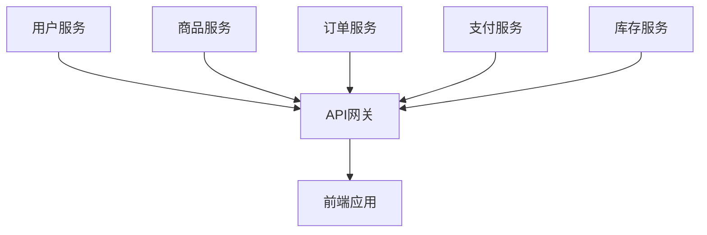

# 云原生架构设计原则实践  

## 1. 微服务拆分实战  

### 1.1 电商系统服务划分  


### 1.2 服务通信规范  
```yaml:c:\project\kphub\microservice\api-gateway.yaml
apiVersion: networking.k8s.io/v1
kind: Ingress
metadata:
  name: api-gateway
  annotations:
    nginx.ingress.kubernetes.io/rewrite-target: /$2
spec:
  rules:
  - host: api.shop.com
    http:
      paths:
      - path: /user(/|$)(.*)
        backend:
          service:
            name: user-service
            port: 8080
```

## 2. 弹性设计实现  

### 2.1 熔断器配置  
```java:c:\project\kphub\microservice\order-service\src\main\java\com\shop\order\OrderController.java
@CircuitBreaker(
    name = "paymentService",
    fallbackMethod = "paymentFallback"
)
public PaymentResult processPayment(Order order) {
    return paymentClient.charge(order);
}
```

### 2.2 自动扩缩容  
```yaml:c:\project\kphub\kubernetes\hpa.yaml
apiVersion: autoscaling/v2
kind: HorizontalPodAutoscaler
metadata:
  name: product-service-hpa
spec:
  scaleTargetRef:
    apiVersion: apps/v1
    kind: Deployment
    name: product-service
  minReplicas: 2
  maxReplicas: 10
  metrics:
  - type: Resource
    resource:
      name: cpu
      target:
        type: Utilization
        averageUtilization: 70
```

## 3. 状态管理方案  

### 3.1 有状态服务部署  
```yaml:c:\project\kphub\kubernetes\statefulset\redis.yaml
apiVersion: apps/v1
kind: StatefulSet
metadata:
  name: redis
spec:
  serviceName: "redis"
  replicas: 3
  template:
    spec:
      containers:
      - name: redis
        image: redis:6
        ports:
        - containerPort: 6379
        volumeMounts:
        - name: data
          mountPath: /data
  volumeClaimTemplates:
  - metadata:
      name: data
    spec:
      accessModes: ["ReadWriteOnce"]
      resources:
        requests:
          storage: 10Gi
```

### 3.2 会话保持配置  
```yaml:c:\project\kphub\kubernetes\service\session-affinity.yaml
apiVersion: v1
kind: Service
metadata:
  name: cart-service
spec:
  sessionAffinity: ClientIP
  sessionAffinityConfig:
    clientIP:
      timeoutSeconds: 3600
  ports:
  - port: 80
    targetPort: 8080
```

## 4. 自动化运维体系  

### 4.1 GitOps工作流  


### 4.2 基础设施即代码  
```terraform:c:\project\kphub\terraform\main.tf
resource "kubernetes_namespace" "prod" {
  metadata {
    name = "production"
  }
}

resource "helm_release" "nginx_ingress" {
  name       = "nginx-ingress"
  repository = "https://kubernetes-charts.storage.googleapis.com"
  chart      = "nginx-ingress"
  namespace  = kubernetes_namespace.prod.metadata[0].name
}
```

## 5. 可观测性实践  

### 5.1 指标采集配置  
```yaml:c:\project\kphub\kubernetes\monitoring\service-monitor.yaml
apiVersion: monitoring.coreos.com/v1
kind: ServiceMonitor
metadata:
  name: order-service-monitor
spec:
  endpoints:
  - port: http
    interval: 15s
    path: /actuator/prometheus
  selector:
    matchLabels:
      app: order-service
```

### 5.2 分布式追踪  
```java:c:\project\kphub\microservice\payment-service\src\main\java\com\shop\payment\PaymentController.java
@GetMapping("/pay")
public PaymentResult pay(@RequestHeader("X-B3-TraceId") String traceId) {
    log.info("Processing payment with traceId: {}", traceId);
    // 业务逻辑
}
```

## 6. 安全加固实施  

### 6.1 网络策略  
```yaml:c:\project\kphub\kubernetes\network-policy\db-isolation.yaml
apiVersion: networking.k8s.io/v1
kind: NetworkPolicy
metadata:
  name: db-isolation
spec:
  podSelector:
    matchLabels:
      app: mysql
  policyTypes:
  - Ingress
  ingress:
  - from:
    - podSelector:
        matchLabels:
          app: order-service
    ports:
    - protocol: TCP
      port: 3306
```

### 6.2 密钥管理  
```powershell
# 创建加密Secret
kubectl create secret generic db-credential \
  --from-literal=username=admin \
  --from-literal=password=MyP@ssw0rd \
  --namespace production
```

云原生架构实践需要从设计阶段就考虑弹性、可观测性和自动化。生产环境建议采用渐进式交付策略，配合完善的监控告警系统。关键服务需实现多层级容错机制，所有变更应通过自动化流水线完成验证和部署。