# CNCF技术全景图解析  

云原生计算基金会（Cloud Native Computing Foundation，简称CNCF）是Linux基金会旗下的一个组织，致力于推动云原生技术和生态系统的发展。CNCF技术全景图（Landscape）是云原生领域最全面的技术地图，汇集了云原生生态系统中的各类开源项目和商业产品，为企业和开发者提供了清晰的技术导航。

## 1. 全景图架构概览  

CNCF全景图按照技术领域和成熟度进行分类，帮助用户快速了解云原生生态系统的整体结构和各个组件的定位。

### 1.1 技术领域划分  

CNCF全景图将云原生技术栈分为六大核心领域，每个领域包含多个子类别，形成了一个完整的技术体系：

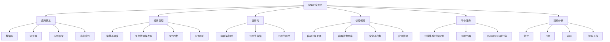

**各领域核心功能：**

1. **应用开发（Application Definition & Development）**：
   - 提供构建云原生应用所需的数据库、消息队列、API网关等基础组件
   - 包含应用框架、开发工具和应用定义标准

2. **编排管理（Orchestration & Management）**：
   - 负责容器和应用的自动化部署、扩展和管理
   - 包括Kubernetes等容器编排系统和服务网格技术

3. **运行时（Runtime）**：
   - 提供容器运行的底层支持，包括容器运行时、存储和网络
   - 确保容器在各种环境中一致运行的基础设施

4. **供应保障（Provisioning）**：
   - 负责基础设施自动化、配置管理和安全合规
   - 提供从代码到基础设施的自动化工具链

5. **平台服务（Platform）**：
   - 提供构建云原生平台的核心组件
   - 包括Kubernetes发行版、PaaS和无服务器平台

6. **观察分析（Observability & Analysis）**：
   - 提供监控、日志、追踪和性能分析工具
   - 帮助理解和优化分布式系统的运行状态

### 1.2 成熟度分级标准  

CNCF采用三级成熟度模型来评估项目，帮助用户了解项目的稳定性和生产就绪程度：

| 级别       | 含义                  | 代表项目          | 选型建议                |
|------------|---------------------|-----------------|------------------------|
| Graduated  | 毕业项目：已被广泛采用，具有活跃的治理流程和明确的项目可持续性 | Kubernetes, Prometheus, Envoy, containerd, CoreDNS | 生产环境首选，具有长期稳定性保障 |
| Incubating | 孵化项目：已被多个组织采用，具有增长的贡献者社区和明确的价值 | Argo, Flux, gRPC, Jaeger, Linkerd | 可用于生产环境，但需评估成熟度和社区支持 |
| Sandbox    | 沙箱项目：早期阶段，鼓励开放治理和社区参与 | KubeEdge, OpenEBS, Thanos, Volcano | 建议在非关键环境测试验证，关注发展动态 |

**成熟度评估标准：**

1. **毕业（Graduated）项目标准**：
   - 至少在三个生产环境中得到采用
   - 拥有多个独立的贡献者和组织
   - 具有明确定义的项目治理和提交流程
   - 通过CNCF技术尽职调查
   - 获得CNCF技术监督委员会（TOC）的超级多数票支持

2. **孵化（Incubating）项目标准**：
   - 至少在三个独立最终用户组织中使用
   - 拥有健康的贡献者数量
   - 展示出社区参与的增长潜力
   - 明确定义的治理流程

3. **沙箱（Sandbox）项目标准**：
   - 符合CNCF的云原生定义
   - 采用开源许可证（Apache 2.0推荐）
   - 承诺透明度、良好行为和开放治理

**成熟度演进路径：**

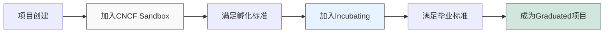

## 2. 核心项目解析  

CNCF托管了众多关键项目，这些项目构成了云原生技术栈的核心组件。以下是各个领域的代表性项目及其特点。

### 2.1 编排管理领域  

编排管理是云原生架构的核心，负责容器和应用的自动化部署、扩展和管理。

```text
Kubernetes: 容器编排的事实标准
- 核心功能：自动化部署、扩展和管理容器化应用
- 关键特性：声明式API、自愈能力、水平扩展、负载均衡
- 生态系统：庞大的插件和扩展生态，支持各种工作负载
- 成熟度：Graduated（2016年毕业的首个CNCF项目）

Helm: Kubernetes应用包管理器
- 核心功能：定义、安装和升级Kubernetes应用
- 关键特性：应用打包（Charts）、版本管理、依赖管理
- 使用场景：简化复杂应用的部署和管理
- 成熟度：Graduated（2020年毕业）

KubeEdge: 边缘计算Kubernetes扩展
- 核心功能：将容器化应用编排能力扩展到边缘设备
- 关键特性：边缘自治、元数据同步、设备管理
- 使用场景：IoT设备管理、边缘AI推理、远程站点部署
- 成熟度：Sandbox（2019年加入）

Argo: Kubernetes原生工作流引擎
- 核心功能：在Kubernetes上运行工作流和应用交付
- 关键组件：Argo Workflows、Argo CD、Argo Events、Argo Rollouts
- 使用场景：CI/CD、GitOps、复杂数据处理
- 成熟度：Incubating（2020年加入孵化阶段）

Flux: Kubernetes的GitOps工具
- 核心功能：自动将Git仓库中的配置应用到Kubernetes集群
- 关键特性：持续交付、多租户、多集群支持
- 使用场景：GitOps实践、自动化部署
- 成熟度：Incubating（2019年加入孵化阶段）
```

**Kubernetes架构图：**

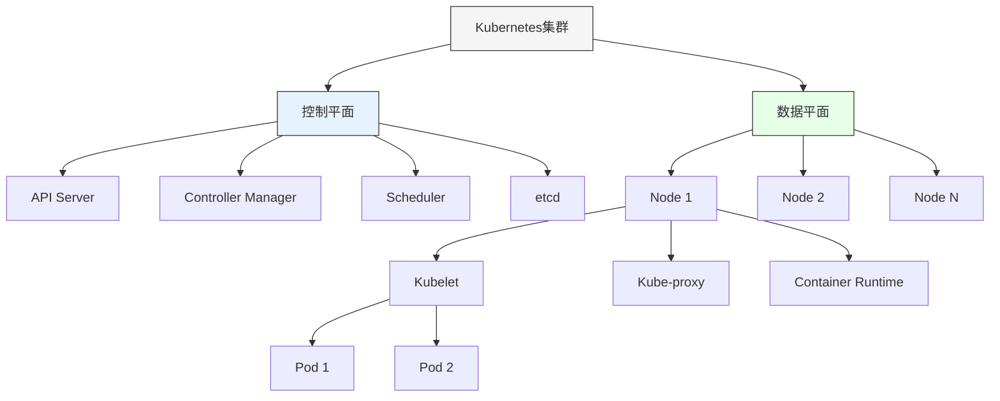

### 2.2 运行时领域  

运行时领域提供容器运行的底层支持，确保容器在各种环境中一致运行。

```yaml:c:\project\kphub\cncf\runtime-comparison.yaml
containerd:
  type: 容器运行时
  特点: 轻量级、符合OCI标准、高性能
  组件:
    - containerd-shim: 容器生命周期管理
    - ctr: 命令行工具
  优势:
    - 作为Docker引擎的核心组件被提取出来
    - 被Kubernetes直接支持
    - 资源占用少，稳定性高
  成熟度: Graduated (2019年毕业)

runc:
  type: 低级容器运行时
  特点: OCI规范参考实现、底层容器创建工具
  功能:
    - 容器生命周期管理
    - 资源隔离与限制
  使用方式: 通常由高级运行时(如containerd)调用
  成熟度: Graduated (作为containerd的一部分)

CRI-O:
  type: Kubernetes专用容器运行时
  特点: 专为Kubernetes优化、轻量级
  优势:
    - 专注于Kubernetes集成
    - 不包含不必要的功能
    - 安全性优先设计
  成熟度: Incubating

gVisor:
  type: 安全容器运行时
  特点: 用户空间内核隔离、增强安全性
  工作原理:
    - 在容器和主机内核之间提供一个内核接口的用户空间实现
    - 拦截应用系统调用并提供中间层处理
  适用场景:
    - 多租户环境
    - 运行不受信任的代码
    - 需要额外安全隔离的场景
  成熟度: Sandbox

Kata Containers:
  type: 轻量级虚拟机容器
  特点: 虚拟机级别隔离、OCI兼容
  工作原理:
    - 结合VM安全性和容器轻量级特性
    - 每个容器运行在专用轻量级VM中
  优势:
    - 强隔离性
    - 与Kubernetes完全兼容
    - 硬件级安全特性支持
  成熟度: Sandbox
```

**容器运行时架构对比：**

```mermaid
graph TD
    subgraph "标准容器运行时"
    A[应用] --> B[containerd/CRI-O]
    B --> C[runc]
    C --> D[Linux内核]
    end
    
    subgraph "gVisor安全容器"
    E[应用] --> F[containerd/CRI-O]
    F --> G[runsc]
    G --> H[用户空间内核]
    H --> I[有限的系统调用]
    I --> J[Linux内核]
    end
    
    subgraph "Kata Containers"
    K[应用] --> L[containerd/CRI-O]
    L --> M[kata-runtime]
    M --> N[轻量级VM]
    N --> O[Linux内核]
    end
    
    style B fill:#e6f3ff,stroke:#333,stroke-width:1px
    style G fill:#ffe6e6,stroke:#333,stroke-width:1px
    style M fill:#e6ffe6,stroke:#333,stroke-width:1px
```

### 2.3 存储与网络领域

云原生存储和网络解决方案为容器化应用提供持久化存储和网络连接能力。

```text
云原生存储项目:

Rook: 云原生存储编排系统
- 核心功能：将存储软件转变为自管理、自扩展和自修复的存储服务
- 支持后端：Ceph、NFS、EdgeFS等
- 关键特性：存储编排、声明式管理、内置监控
- 成熟度：Graduated（2020年毕业）

Longhorn: 轻量级分布式块存储系统
- 核心功能：为Kubernetes提供持久化存储
- 关键特性：微服务架构、跨节点复制、备份恢复
- 使用场景：边缘计算、生产工作负载
- 成熟度：Incubating（2020年加入孵化阶段）

OpenEBS: 容器附加存储
- 核心功能：基于容器的存储控制平面
- 存储引擎：Jiva、cStor、Local PV、Mayastor
- 关键特性：存储策略、快照、克隆
- 成熟度：Sandbox（2019年加入）

云原生网络项目:

CNI (Container Network Interface): 容器网络接口标准
- 核心功能：定义容器网络插件的标准接口
- 关键特性：插件化架构、简单API
- 实现项目：Calico、Cilium、Flannel等
- 成熟度：Incubating

Cilium: 基于eBPF的网络、安全和可观测性
- 核心功能：提供API感知的网络和安全
- 关键特性：eBPF技术、L7网络策略、透明加密
- 使用场景：微服务安全、多集群连接
- 成熟度：Incubating（2021年加入孵化阶段）

Calico: 安全网络连接解决方案
- 核心功能：为容器、虚拟机和裸机工作负载提供网络连接和网络安全
- 关键特性：BGP路由、网络策略、IPAM
- 使用场景：大规模Kubernetes集群、多云环境
- 成熟度：非CNCF项目，但广泛使用
```

## 3. 关键技术栈  

云原生技术栈中的一些关键领域形成了独特的生态系统，这些领域的技术选型对整体架构有重大影响。

### 3.1 服务网格方案对比  

服务网格为微服务架构提供了统一的流量管理、安全和可观测性能力，是云原生架构的重要组成部分。

| 项目       | 特点                  | 数据平面          | 控制平面         | 适用场景          | 成熟度      |
|------------|---------------------|-----------------|-----------------|-----------------|------------|
| Istio      | 功能全面、可扩展性强   | Envoy           | istiod          | 企业级服务网格、复杂场景 | Graduated  |
| Linkerd    | 轻量简单、低资源占用   | 自研(Rust)       | 控制平面(Go)     | 中小规模集群、入门级需求 | Incubating |
| Kuma       | 多集群支持、通用性强   | Envoy           | kuma-cp         | 混合云环境、多区域部署 | Sandbox    |
| Consul Connect | 服务发现集成、多平台 | Envoy           | Consul Server   | 已有Consul用户、混合工作负载 | 非CNCF    |
| Traefik Mesh | 入口网关集成、简单易用 | Traefik Proxy   | 控制器          | 小型部署、边缘计算 | 非CNCF     |

**服务网格功能对比：**

```yaml:c:\project\kphub\cncf\service-mesh-comparison.yaml
流量管理:
  Istio:
    路由规则: 全面支持(VirtualService, DestinationRule)
    负载均衡: 多种算法(轮询, 随机, 最少连接)
    流量分割: 精细控制(百分比, 标签, 标头)
    故障注入: 支持延迟和错误注入
  Linkerd:
    路由规则: 基本支持
    负载均衡: EWMA算法(指数加权移动平均)
    流量分割: 支持基本分割
    故障注入: 有限支持
  Kuma:
    路由规则: 支持通用路由
    负载均衡: 支持多种算法
    流量分割: 基本支持
    故障注入: 支持

安全:
  Istio:
    mTLS: 自动mTLS, 渐进式部署
    授权策略: 细粒度RBAC
    证书管理: 内置证书颁发和轮换
    外部CA集成: 支持
  Linkerd:
    mTLS: 自动mTLS
    授权策略: 基本支持
    证书管理: 自动证书轮换
    外部CA集成: 有限支持
  Kuma:
    mTLS: 支持多种mTLS后端
    授权策略: 支持
    证书管理: 内置和外部支持
    外部CA集成: 支持

可观测性:
  Istio:
    指标: 丰富的Prometheus指标
    分布式追踪: 与多种追踪系统集成
    访问日志: 可配置的访问日志
    可视化: Kiali集成
  Linkerd:
    指标: 内置Prometheus指标
    分布式追踪: 支持OpenCensus
    访问日志: 基本支持
    可视化: 内置仪表板
  Kuma:
    指标: Prometheus集成
    分布式追踪: 支持Zipkin/Jaeger
    访问日志: 支持
    可视化: Kuma GUI

部署复杂性:
  Istio: 高(多组件, 复杂配置)
  Linkerd: 低(简单安装, 自动注入)
  Kuma: 中(通用配置模型)

资源消耗:
  Istio: 高(控制平面和数据平面均较重)
  Linkerd: 低(轻量级数据平面)
  Kuma: 中(取决于配置)
```

**服务网格架构图：**

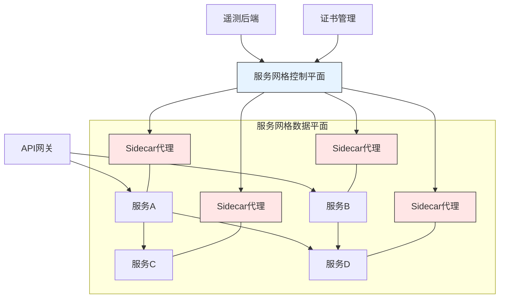

### 3.2 可观测性技术栈  

可观测性是云原生架构的关键支柱，通过指标、日志和追踪提供对分布式系统的深入洞察。

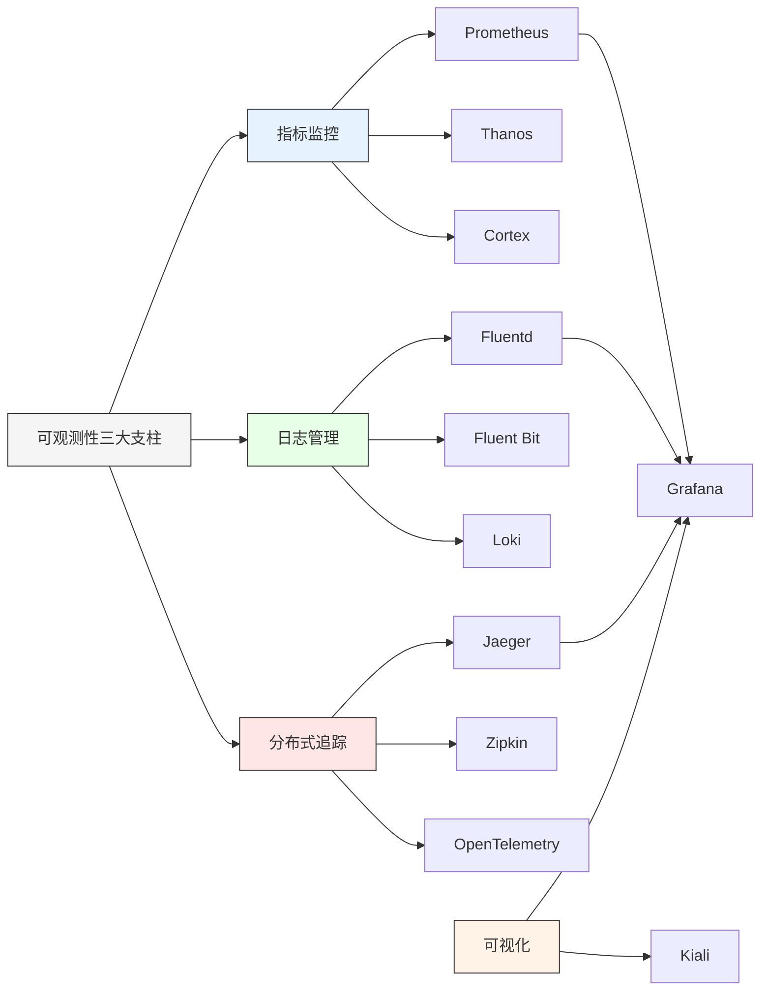

**可观测性项目详解：**

```text
指标监控:

Prometheus: 时序数据库和监控系统
- 核心功能：收集和存储时间序列数据，提供查询语言PromQL
- 关键特性：多维数据模型、动态服务发现、强大的查询语言
- 集成生态：AlertManager(告警)、Grafana(可视化)
- 成熟度：Graduated（2018年毕业）

Thanos: Prometheus横向扩展解决方案
- 核心功能：全局查询视图、长期存储、高可用性
- 关键组件：Sidecar、Query、Store、Compact
- 使用场景：大规模Prometheus部署、多集群监控
- 成熟度：Incubating（2020年加入孵化阶段）

日志管理:

Fluentd: 统一日志层
- 核心功能：收集、处理和转发日志数据
- 关键特性：插件生态系统、多源输入、多目标输出
- 使用场景：日志聚合、ETL处理
- 成熟度：Graduated（2019年毕业）

Fluent Bit: 轻量级日志处理器
- 核心功能：收集、处理和转发日志数据
- 关键特性：低资源占用、高性能、C语言实现
- 使用场景：边缘设备、资源受限环境
- 成熟度：Incubating（与Fluentd同属Fluent生态）

Loki: 日志聚合系统
- 核心功能：类Prometheus的日志聚合
- 关键特性：标签索引、低成本存储、与Grafana集成
- 使用场景：Kubernetes日志、成本敏感环境
- 成熟度：Sandbox（2019年加入）

分布式追踪:

Jaeger: 分布式追踪系统
- 核心功能：跟踪分布式系统中的事务
- 关键特性：分布式上下文传播、根因分析、服务依赖分析
- 使用场景：微服务架构、性能优化
- 成熟度：Graduated（2019年毕业）

OpenTelemetry: 可观测性框架
- 核心功能：提供统一的API、库和代理来收集遥测数据
- 关键特性：多语言SDK、与多种后端集成、标准化数据格式
- 使用场景：统一指标、日志和追踪
- 成熟度：Incubating（2019年加入孵化阶段）
```

**OpenTelemetry统一可观测性架构：**

```yaml:c:\project\kphub\cncf\opentelemetry-architecture.yaml
组件:
  SDK:
    - 追踪API: 创建和管理spans
    - 指标API: 记录应用和系统指标
    - 日志API: 结构化日志记录
    - 上下文传播: 跨服务传递追踪上下文
    - 资源信息: 描述生成遥测数据的实体
  
  Collector:
    - 接收器: 接收多种格式的遥测数据
    - 处理器: 转换和增强遥测数据
    - 导出器: 将数据发送到多个后端
    - 扩展: 提供额外功能(健康检查、性能监控等)

数据流:
  应用 --> SDK --> Exporter --> Collector --> 后端存储 --> 可视化工具

支持语言:
  - Java
  - Go
  - Python
  - JavaScript/Node.js
  - .NET
  - Ruby
  - PHP
  - Erlang/Elixir
  - Swift
  - C++

后端集成:
  指标:
    - Prometheus
    - Google Cloud Monitoring
    - Azure Monitor
    - Amazon CloudWatch
  追踪:
    - Jaeger
    - Zipkin
    - Google Cloud Trace
    - Azure Monitor
    - AWS X-Ray
  日志:
    - Elasticsearch
    - Google Cloud Logging
    - Azure Monitor Logs
    - Amazon CloudWatch Logs

部署模式:
  - 代理模式: Collector作为守护进程或sidecar
  - 网关模式: Collector作为中央网关
  - 层次化: 边缘Collector和聚合Collector
```

## 4. 新兴技术趋势  

CNCF生态系统不断演进，新兴技术领域正在改变云原生应用的构建和运行方式。

### 4.1 边缘计算项目  

边缘计算将计算能力从中心云扩展到网络边缘，为低延迟应用和物联网场景提供支持。

```text
KubeEdge: Kubernetes边缘扩展
- 核心功能：将Kubernetes能力扩展到边缘设备
- 关键组件：
  * CloudCore: 云端组件，与Kubernetes API服务器交互
  * EdgeCore: 边缘组件，管理容器化应用和设备
- 技术特点：
  * 边缘自治：即使与云断开连接也能继续运行
  * 云边协同：统一的应用编排和设备管理
  * 轻量级：针对资源受限设备优化
- 使用场景：
  * 智能制造
  * 智慧城市
  * 边缘AI推理
- 成熟度：Sandbox（2019年加入）

OpenYurt: 边缘自治能力
- 核心功能：将Kubernetes扩展到边缘计算场景
- 关键组件：
  * YurtHub: 边缘网关，缓存云端API请求
  * YurtController: 管理节点心跳和自治域
  * YurtTunnel: 建立云边安全通道
- 技术特点：
  * 非侵入式：最小化修改Kubernetes
  * 边缘自治：支持网络不稳定场景
  * 单集群管理：统一管理云和边缘节点
- 使用场景：
  * 零售边缘计算
  * CDN边缘节点
  * 远程站点管理
- 成熟度：Sandbox（2020年加入）

Volcano:
继续编写CNCF技术全景图解析文档：

```text
Volcano: 高性能工作负载调度引擎
- 核心功能：为AI、大数据等高性能计算工作负载提供批处理能力
- 关键组件：
  * Scheduler: 批处理作业调度器
  * Controller: 管理CRD资源生命周期
  * Admission: 验证作业规范
- 技术特点：
  * 队列管理：支持多租户资源隔离
  * 高级调度：支持作业优先级、抢占和公平共享
  * 资源预留：支持资源预分配
- 使用场景：
  * AI训练和推理
  * 大数据分析
  * 科学计算
- 成熟度：Sandbox（2019年加入）

SuperEdge: 边缘容器管理系统
- 核心功能：为边缘计算场景提供容器化基础设施
- 关键组件：
  * TunnelCore: 云边安全通信
  * EdgeMesh: 边缘服务网格
  * ServiceGroup: 应用管理
- 技术特点：
  * 边缘自治：支持离线运行
  * 分布式健康检查：适应弱网环境
  * 边缘单元化管理：将边缘节点分组
- 使用场景：
  * 边缘计算
  * 物联网
  * 分布式站点
- 成熟度：非CNCF项目
```

**边缘计算架构图：**

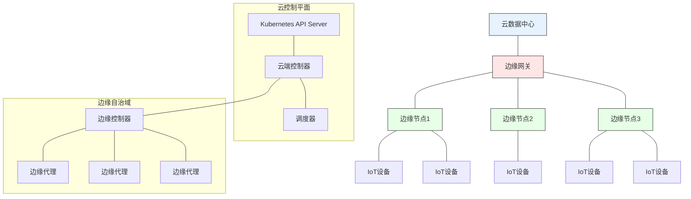

### 4.2 无服务器技术  

无服务器计算模型让开发者专注于代码而不必管理底层基础设施，是云原生应用开发的重要趋势。

```yaml:c:\project\kphub\cncf\serverless.yaml
Knative:
  核心组件:
    - Serving: 
        功能: 自动化容器部署和自动扩缩容
        特点: 请求驱动、冷启动优化、流量分割
        组件: Activator, Autoscaler, Controller, Queue-Proxy
    - Eventing: 
        功能: 事件驱动架构基础设施
        特点: 事件源、事件代理、触发器
        组件: Broker, Trigger, Source, Channel, Subscription
  优势:
    - Kubernetes原生: 直接构建在Kubernetes之上
    - 标准化: 提供无服务器工作负载的标准
    - 可移植性: 跨云和本地环境一致运行
    - 自动扩缩容: 支持缩容到零和快速扩容
  成熟度: Incubating (2019年加入孵化阶段)

OpenFunction:
  特点: 多云无服务器框架
  核心功能:
    - 同步函数: 处理HTTP请求
    - 异步函数: 处理事件
    - 函数构建: 自动化源代码到容器镜像
  组件:
    - Function: 定义函数及其运行时
    - Builder: 构建函数源码
    - Serving: 部署和运行函数
  运行时支持:
    - Knative: 同步函数运行时
    - Dapr: 异步函数运行时
    - OpenFaaS: 可选运行时
  优势:
    - 多语言支持: Go, Node.js, Python, Java等
    - 事件驱动: 与各种事件源集成
    - 可扩展: 插件化架构
  成熟度: Sandbox (2021年加入)

Dapr:
  全称: Distributed Application Runtime
  核心功能: 提供分布式系统构建块
  构建块:
    - 服务调用: 服务间安全可靠通信
    - 状态管理: 状态存储抽象
    - 发布订阅: 消息传递模式
    - 绑定: 外部系统触发和交互
    - Actors: 虚拟Actor模式实现
    - 可观测性: 分布式追踪和指标
  部署模式:
    - Sidecar: 与应用容器一起运行
    - 独立进程: 开发环境使用
  优势:
    - 语言无关: 通过HTTP/gRPC API交互
    - 运行时无关: 可在任何环境运行
    - 可插拔组件: 灵活后端选择
  成熟度: Incubating (2021年加入孵化阶段)

KEDA:
  全称: Kubernetes Event-driven Autoscaling
  核心功能: 基于事件源的Kubernetes工作负载自动扩缩容
  组件:
    - Scaler: 连接各种事件源
    - Metrics Adapter: 将事件数据转换为指标
    - Operator: 管理ScaledObject资源
  支持的事件源:
    - 消息队列: Kafka, RabbitMQ, NATS
    - 数据库: PostgreSQL, MySQL, MongoDB
    - 云服务: AWS SQS, Azure Service Bus, GCP PubSub
    - 自定义指标: Prometheus
  优势:
    - 精细控制: 基于实际工作负载扩缩容
    - 缩容到零: 支持完全缩容
    - 可扩展: 自定义扩缩容器
  成熟度: Incubating (2020年加入孵化阶段)
```

**无服务器架构对比：**

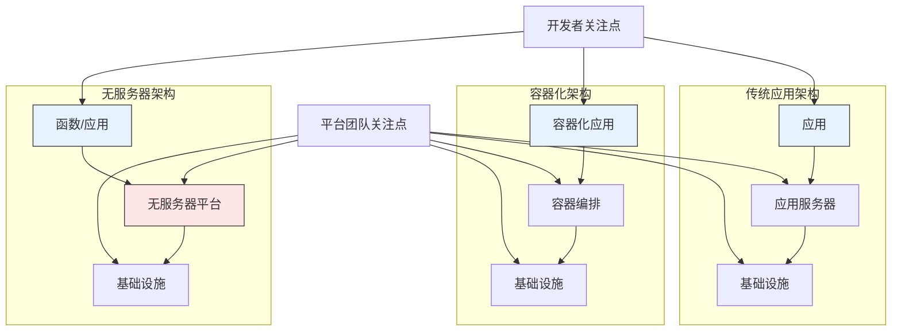

## 5. 项目选型指南  

在丰富的CNCF生态系统中选择合适的技术组件是构建成功云原生架构的关键。以下是项目评估和选型的指南。

### 5.1 评估维度  

选择CNCF项目时应考虑多个维度，确保技术选型符合组织需求和长期战略。

```text
- 社区活跃度 (GitHub stars/commits)
  * GitHub星标数量: 反映项目受欢迎程度
  * 贡献者数量: 多样化的贡献者社区表明项目健康
  * 提交频率: 持续的开发活动表明项目活跃
  * Issue响应时间: 反映社区支持质量
  * 版本发布频率: 表明项目的维护状态

- 生产就绪度 (CNCF成熟度)
  * CNCF阶段: Graduated > Incubating > Sandbox
  * 生产用户案例: 真实企业采用情况
  * 文档质量: 完整的文档表明项目成熟
  * 版本稳定性: 稳定的API和向后兼容性
  * 安全漏洞响应: 安全问题处理流程

- 集成复杂度 (依赖项数量)
  * 架构复杂性: 组件数量和交互方式
  * 依赖项: 外部依赖的数量和稳定性
  * 学习曲线: 团队掌握技术的难度
  * 运维复杂性: 部署和维护的复杂程度
  * 升级难度: 版本升级的复杂性和风险

- 企业支持 (商业发行版)
  * 商业支持: 是否有企业提供商业支持
  * 培训资源: 可用的培训和认证
  * 咨询服务: 专业服务的可用性
  * 企业功能: 企业级功能(如多租户、RBAC)
  * 长期支持: 长期支持版本的可用性

- 性能和可扩展性
  * 资源消耗: CPU、内存和存储需求
  * 扩展极限: 支持的最大规模
  * 性能基准: 与类似解决方案的性能对比
  * 高可用性: 内置的冗余和故障转移能力
  * 灾难恢复: 备份和恢复机制

- 生态系统兼容性
  * 与现有技术栈的集成: 与组织现有技术的兼容性
  * 插件生态系统: 可用扩展和集成的丰富度
  * 标准遵循: 遵循行业标准的程度
  * 多云支持: 跨不同云环境的可移植性
  * 工具支持: IDE和开发工具的集成
```

**项目评估雷达图示例：**

```yaml:c:\project\kphub\cncf\project-evaluation.yaml
项目A评估:
  社区活跃度: 9
  生产就绪度: 8
  集成复杂度: 6
  企业支持: 9
  性能和可扩展性: 7
  生态系统兼容性: 8
  总分: 47/60

项目B评估:
  社区活跃度: 7
  生产就绪度: 5
  集成复杂度: 8
  企业支持: 4
  性能和可扩展性: 9
  生态系统兼容性: 6
  总分: 39/60

项目C评估:
  社区活跃度: 5
  生产就绪度: 3
  集成复杂度: 9
  企业支持: 2
  性能和可扩展性: 8
  生态系统兼容性: 4
  总分: 31/60
```

### 5.2 技术组合示例  

根据不同场景和需求，以下是一些推荐的技术组合示例。

```yaml:c:\project\kphub\cncf\tech-stack.yaml
production_stack:
  # 企业级生产环境技术栈
  orchestration: Kubernetes
  service_mesh: Istio
  monitoring: Prometheus+Grafana
  logging: Fluentd+Elasticsearch
  tracing: Jaeger
  storage: Rook-Ceph
  networking: Calico/Cilium
  security: OPA/Gatekeeper
  ci_cd: Tekton+ArgoCD
  适用场景:
    - 大型企业应用
    - 多团队协作环境
    - 高安全性要求场景
    - 需要全面可观测性的系统
  优势:
    - 完整的功能覆盖
    - 强大的扩展性
    - 成熟的社区支持
    - 丰富的企业级功能
  挑战:
    - 较高的学习曲线
    - 资源需求较大
    - 运维复杂性高

edge_stack:
  # 边缘计算技术栈
  orchestration: KubeEdge/K3s
  monitoring: OpenTelemetry
  logging: Fluent Bit
  networking: Cilium
  messaging: NATS
  storage: OpenEBS/Longhorn
  适用场景:
    - 边缘计算部署
    - IoT设备管理
    - 资源受限环境
    - 需要离线运行能力
  优势:
    - 轻量级资源占用
    - 边缘自治能力
    - 适应不稳定网络
    - 低延迟本地处理
  挑战:
    - 功能可能受限
    - 边缘安全挑战
    - 设备管理复杂性

serverless_stack:
  # 无服务器技术栈
  platform: Knative
  autoscaling: KEDA
  runtime: Dapr
  monitoring: OpenTelemetry
  networking: Contour/Kourier
  适用场景:
    - 事件驱动架构
    - 波动工作负载
    - 开发者体验优先
    - 按需计算资源
  优势:
    - 降低运维负担
    - 按使用付费模型
    - 快速开发迭代
    - 自动扩缩容
  挑战:
    - 冷启动延迟
    - 长时间运行任务不适合
    - 供应商锁定风险

data_intensive_stack:
  # 数据密集型应用技术栈
  orchestration: Kubernetes
  batch_processing: Volcano
  streaming: Strimzi (Kafka Operator)
  storage: Rook-Ceph
  database: Vitess/TiDB Operator
  ml_platform: Kubeflow
  适用场景:
    - 大数据处理
    - 机器学习工作负载
    - 流处理应用
    - 高性能计算
  优势:
    - 高性能数据处理
    - 批处理优化
    - 扩展性强
    - 专用资源调度
  挑战:
    - 资源需求高
    - 数据管理复杂
    - 需要专业知识
```

**技术栈选择决策树：**

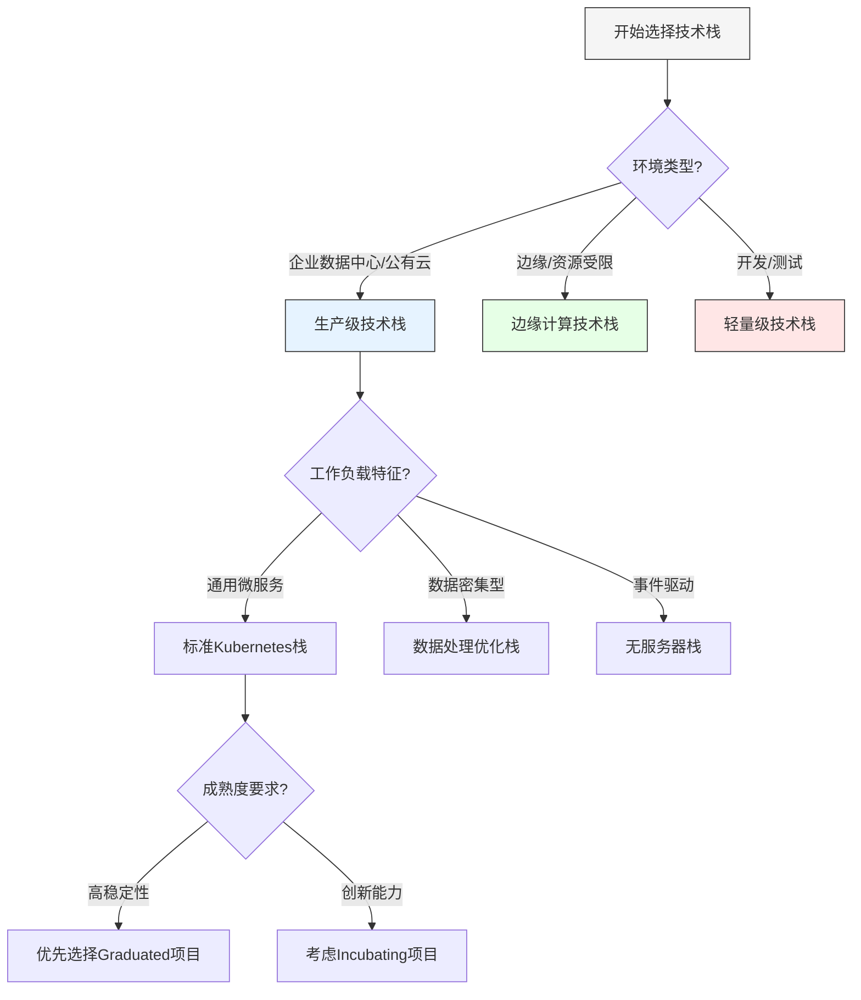

## 6. 参与贡献路径  

参与CNCF项目贡献是提升云原生技术能力和影响力的重要途径，也是了解前沿技术发展的最佳方式。

### 6.1 社区参与方式  

CNCF社区提供了多种参与方式，从初学者到专家都可以找到适合的贡献路径。

```powershell
# 克隆项目代码
git clone https://github.com/cncf/sandbox-project.git c:\project\kphub\cncf\contribution

# 查看Good First Issue
gh issue list -R cncf/sandbox-project -l "good first issue"

# 设置开发环境
cd c:\project\kphub\cncf\contribution
make setup-dev

# 运行测试
make test

# 提交PR
git checkout -b feature/my-contribution
# 编辑代码
git add .
git commit -m "Add feature X"
git push origin feature/my-contribution
```

**贡献路径：**

```text
1. 文档贡献
   - 修复文档错误
   - 改进入门指南
   - 添加使用示例
   - 翻译文档
   - 编写博客文章

2. 代码贡献
   - 修复简单bug (Good First Issues)
   - 添加小功能
   - 改进测试覆盖率
   - 性能优化
   - 实现重要特性

3. 社区支持
   - 回答GitHub issues
   - 参与Slack/Discord讨论
   - 帮助新贡献者
   - 参与社区会议
   - 组织本地用户组

4. 特殊贡献
   - 安全漏洞报告
   - 兼容性测试
   - 基准测试
   - 集成示例
   - 案例研究
```

**贡献者成长路径：**

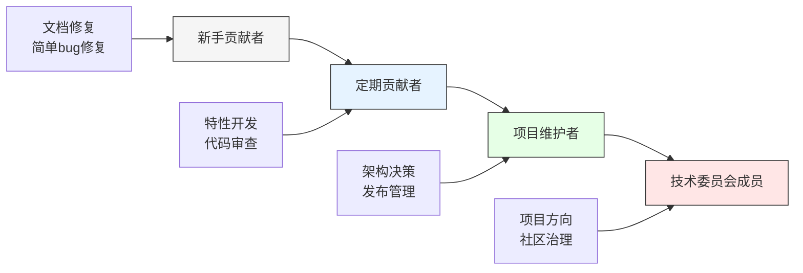

### 6.2 CNCF认证体系  

CNCF提供了一系列认证项目，帮助个人验证云原生技术能力并提升职业发展。

```text
- KCNA (Kubernetes and Cloud Native Associate)
  * 级别: 入门级
  * 内容: Kubernetes基础知识、容器编排、云原生架构
  * 适合人群: 云原生初学者、非技术角色
  * 考试形式: 多选题，线上监考
  * 准备资源: CNCF培训课程、官方文档

- CKA (Certified Kubernetes Administrator)
  * 级别: 中级
  * 内容: Kubernetes集群管理、安全、网络、存储
  * 适合人群: DevOps工程师、系统管理员
  * 考试形式: 实操题，线上监考
  * 准备资源: Kubernetes文档、实践实验室

- CKAD (Certified Kubernetes Application Developer)
  * 级别: 中级
  * 内容: 容器化应用设计、部署和配置
  * 适合人群: 应用开发者、DevOps工程师
  * 考试形式: 实操题，线上监考
  * 准备资源: Kubernetes文档、实践实验室

- CKS (Certified Kubernetes Security Specialist)
  * 级别: 高级
  * 内容: Kubernetes安全最佳实践、集群强化、供应链安全
  * 适合人群: 安全专家、高级Kubernetes管理员
  * 考试形式: 实操题，线上监考
  * 准备资源: Kubernetes安全文档、实践实验室

- CKAD+Prometheus (Monitoring with Prometheus)
  * 级别: 中级
  * 内容: Prometheus部署、配置、监控和告警
  * 适合人群: SRE、监控工程师
  * 考试形式: 实操题，线上监考
  * 准备资源: Prometheus文档、实践实验室
```

**认证路径建议：**

```yaml:c:\project\kphub\cncf\certification-path.yaml
入门路径:
  第一步: KCNA (Kubernetes基础认证)
  第二步: 选择CKA(管理员)或CKAD(开发者)方向
  学习资源:
    - Kubernetes官方文档
    - CNCF免费培训课程
    - Katacoda交互式学习
    - Kubernetes Playground

管理员路径:
  第一步: KCNA (可选)
  第二步: CKA (Kubernetes管理员)
  第三步: CKS (Kubernetes安全专家)
  学习资源:
    - Kubernetes The Hard Way
    - Kubernetes文档
    - 实践实验室
    - 管理员最佳实践指南

开发者路径:
  第一步: KCNA (可选)
  第二步: CKAD (Kubernetes应用开发者)
  第三步: 专业化认证 (如Prometheus)
  学习资源:
    - Kubernetes应用模式
    - 容器化最佳实践
    - 实践项目
    - 开发者工具指南

SRE/平台工程师路径:
  第一步: CKA (Kubernetes管理员)
  第二步: 可观测性认证 (Prometheus)
  第三步: CKS (Kubernetes安全专家)
  学习资源:
    - SRE书籍和实践
    - 可观测性平台设计
    - 自动化和GitOps工具
    - 性能优化技术
```

## 7. 云原生技术趋势与展望

CNCF生态系统持续快速发展，了解技术趋势对于规划云原生战略至关重要。

### 7.1 技术发展趋势

```text
1. 平台工程兴起
   - 从DevOps到平台工程的演进
   - 内部开发者平台(IDP)构建
   - 自助服务能力和开发者体验优化
   - 代表项目: Backstage, Crossplane, Kratix

2. GitOps成为主流
   - 声明式基础设施管理
   - Git作为单一事实来源
   - 自动化配置同步和漂移检测
   - 代表项目: Flux, Argo CD, Rancher Fleet

3. eBPF技术应用扩展
   - 网络和安全可观测性
   - 高性能网络数据路径
   - 无侵入式系统监控
   - 代表项目: Cilium, Falco, Pixie

4. WebAssembly在云原生中的应用
   - 轻量级、安全的运行时
   - 多语言支持
   - 边缘计算和函数即服务场景
   - 代表项目: WasmEdge, Krustlet, Spin

5. 多集群和混合云管理
   - 统一多集群管理平面
   - 工作负载可移植性
   - 集群联邦和资源分发
   - 代表项目: Karmada, Cluster API, KubeVela

6. AI/ML与云原生融合
   - MLOps工具链云原生化
   - AI工作负载专用调度器
   - 模型训练和推理优化
   - 代表项目: Kubeflow, Ray, Volcano
```

### 7.2 选型决策框架

在快速发展的云原生生态中，如何做出明智的技术选型决策是一个关键挑战。以下是一个结构化的决策框架：

```yaml:c:\project\kphub\cncf\decision-framework.yaml
评估维度:
  业务需求:
    - 业务目标与技术的一致性
    - 当前和未来的扩展需求
    - 性能和可用性要求
    - 合规和安全要求
    - 成本约束

  技术因素:
    - 与现有技术栈的兼容性
    - 技术成熟度和稳定性
    - 社区活跃度和支持
    - 学习曲线和团队技能
    - 运维复杂性

  组织因素:
    - 团队规模和技能水平
    - 内部支持能力
    - 变更管理流程
    - 组织文化适应性
    - 长期维护能力

决策流程:
  1. 需求分析:
     - 明确业务目标和技术需求
     - 识别关键约束和非功能需求
     - 定义成功标准

  2. 技术调研:
     - 识别候选技术
     - 评估CNCF成熟度级别
     - 研究社区活跃度和采用情况
     - 分析技术优缺点

  3. 概念验证:
     - 设计小规模测试
     - 验证关键功能和集成点
     - 评估性能和可扩展性
     - 识别潜在风险

  4. 决策矩阵:
     - 建立评估标准和权重
     - 对候选技术进行评分
     - 计算加权总分
     - 记录决策理由

  5. 实施计划:
     - 制定分阶段实施策略
     - 定义成功指标
     - 规划培训和知识转移
     - 设计监控和反馈机制
```

**技术选型决策矩阵示例：**

```text
评分标准: 1-5分 (1=很差, 5=优秀)
权重: 1-3 (1=低重要性, 3=高重要性)

| 评估标准           | 权重 | 技术A | 技术B | 技术C |
|-------------------|------|-------|-------|-------|
| 功能完整性         | 3    | 5     | 3     | 4     |
| 性能和可扩展性     | 3    | 4     | 5     | 3     |
| 社区活跃度         | 2    | 5     | 3     | 2     |
| 学习曲线           | 2    | 2     | 4     | 3     |
| 运维复杂性         | 2    | 2     | 4     | 3     |
| 集成能力           | 3    | 4     | 3     | 5     |
| 安全性             | 3    | 4     | 3     | 4     |
| 成本               | 2    | 3     | 4     | 3     |
|-------------------|------|-------|-------|-------|
| 加权总分           |      | 72    | 67    | 66    |
| 排名               |      | 1     | 2     | 3     |
```

## 8. 总结

CNCF技术全景图为云原生生态系统提供了全面的导航，帮助组织和个人了解和选择适合的技术组件。

关键要点：

1. **成熟度分级**：CNCF项目分为Graduated、Incubating和Sandbox三个级别，反映了
继续编写CNCF技术全景图解析文档：

## 8. 总结

CNCF技术全景图为云原生生态系统提供了全面的导航，帮助组织和个人了解和选择适合的技术组件。

关键要点：

1. **成熟度分级**：CNCF项目分为Graduated、Incubating和Sandbox三个级别，反映了项目的稳定性和采用程度。生产环境应优先考虑Graduated项目，同时关注有潜力的Incubating项目。

2. **技术领域划分**：CNCF全景图将云原生技术分为应用开发、编排管理、运行时、供应保障、平台服务和观察分析六大领域，形成完整的技术栈。

3. **核心项目**：Kubernetes作为容器编排的事实标准，是CNCF生态系统的核心。围绕Kubernetes形成了丰富的扩展生态，包括Helm、Prometheus、Envoy等关键项目。

4. **技术趋势**：边缘计算、无服务器、GitOps、eBPF和平台工程是当前云原生领域的重要发展趋势，代表了技术演进的方向。

5. **选型原则**：技术选型应综合考虑社区活跃度、生产就绪度、集成复杂度、企业支持等多个维度，并结合组织自身的业务需求和技术能力。

6. **参与贡献**：参与CNCF项目贡献是提升云原生技术能力的有效途径，可以从文档贡献开始，逐步参与代码开发和社区治理。

7. **认证体系**：CNCF提供了从入门到专家的认证体系，包括KCNA、CKA、CKAD和CKS等，帮助个人验证技术能力并促进职业发展。

云原生技术的快速发展为应用现代化提供了强大支持，但也带来了技术选型和整合的挑战。通过理解CNCF技术全景图，组织可以制定更加明智的云原生战略，构建灵活、可靠和高效的现代应用架构。

在云原生之旅中，建议采取渐进式方法，从核心需求出发，选择成熟稳定的技术组件，建立良好的基础设施和实践，然后逐步引入创新技术，不断优化和演进技术栈，以适应业务发展和技术变革。

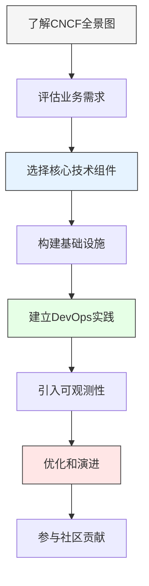

通过深入理解CNCF技术全景图，组织可以在云原生转型过程中做出更加明智的决策，避免常见陷阱，充分利用开源社区的创新成果，构建面向未来的应用架构。