# CNCF技术全景图实践  

本文将从实践角度出发，详细介绍如何在实际项目中应用CNCF（云原生计算基金会）技术栈，包括技术选型方法、微服务架构实现、边缘计算方案、无服务器平台、持续交付流水线以及生产环境优化等方面的具体实践指南。

## 1. 技术选型方法论  

在云原生技术选型过程中，需要综合考虑业务需求、技术成熟度、团队能力和长期维护成本等多个因素，采用系统化的方法进行决策。

### 1.1 选型决策矩阵  

技术选型决策矩阵是一种结构化的评估工具，帮助团队基于多维度标准做出客观决策。

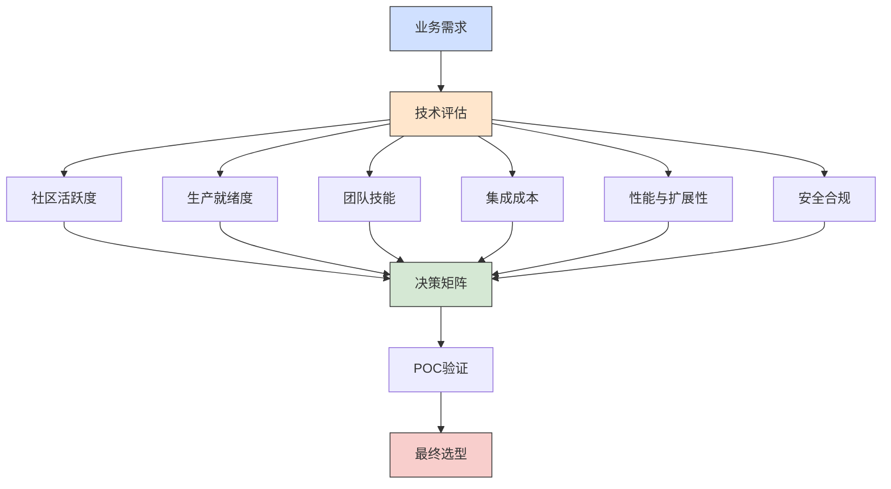

**决策矩阵实施步骤：**

1. **明确业务需求**：
   - 确定关键业务目标和技术需求
   - 识别非功能性需求（性能、可用性、安全性等）
   - 定义成功标准和约束条件

2. **建立评估维度**：
   - 社区活跃度：GitHub stars、贡献者数量、更新频率
   - 生产就绪度：CNCF成熟度级别、生产案例、文档质量
   - 团队技能匹配度：学习曲线、现有经验、培训资源
   - 集成成本：与现有系统兼容性、迁移复杂度、维护成本
   - 性能与扩展性：负载能力、资源消耗、扩展极限
   - 安全合规：安全特性、合规认证、漏洞响应

3. **评分与权重**：
   - 为每个维度分配权重（1-5分）
   - 对候选技术进行评分（1-10分）
   - 计算加权总分

```yaml:c:\project\kphub\cncf\selection\decision-matrix.yaml
评估项目: 服务网格选型
候选方案:
  - Istio
  - Linkerd
  - Consul Connect

评估维度:
  社区活跃度:
    权重: 4
    评分:
      Istio: 9      # 大型社区，Google支持
      Linkerd: 7    # 活跃社区，Buoyant支持
      Consul: 6     # HashiCorp支持，但专注更广

  生产就绪度:
    权重: 5
    评分:
      Istio: 8      # CNCF毕业项目，大规模部署案例
      Linkerd: 7    # CNCF孵化项目，稳定可靠
      Consul: 8     # 成熟产品，但服务网格功能较新

  团队技能:
    权重: 3
    评分:
      Istio: 6      # 复杂度高，学习曲线陡峭
      Linkerd: 8    # 简单易用，文档友好
      Consul: 7     # 如果团队已使用Consul则有优势

  集成成本:
    权重: 4
    评分:
      Istio: 5      # 集成复杂，资源需求高
      Linkerd: 8    # 轻量级，易于集成
      Consul: 6     # 与现有Consul集成好，否则中等

  性能与扩展性:
    权重: 4
    评分:
      Istio: 7      # 功能全面但开销较大
      Linkerd: 8    # 性能优化，资源消耗低
      Consul: 6     # 性能适中

  安全合规:
    权重: 3
    评分:
      Istio: 9      # 安全功能全面
      Linkerd: 7    # 基本安全功能完善
      Consul: 8     # 强安全特性

总分计算:
  Istio: (4*9 + 5*8 + 3*6 + 4*5 + 4*7 + 3*9) / 23 = 7.3
  Linkerd: (4*7 + 5*7 + 3*8 + 4*8 + 4*8 + 3*7) / 23 = 7.4
  Consul: (4*6 + 5*8 + 3*7 + 4*6 + 4*6 + 3*8) / 23 = 6.8

结论: 基于评分，Linkerd略优于Istio，但需要进行POC验证实际表现
```

4. **概念验证（POC）**：
   - 在小规模环境中测试最高分的2-3个候选方案
   - 验证关键功能和性能指标
   - 评估实际操作体验和问题

5. **最终决策**：
   - 综合评分和POC结果
   - 考虑长期战略影响
   - 制定实施和迁移计划

### 1.2 典型技术组合  

根据不同业务场景，CNCF生态系统中的技术可以组合成多种解决方案。以下是几种典型场景的技术栈组合：

| 场景类型       | 技术栈组合                          | 适用场景                      | 优势                           |
|----------------|-----------------------------------|-------------------------------|--------------------------------|
| 微服务中台      | Kubernetes + Istio + ArgoCD + Prometheus | 企业级微服务平台、多团队协作 | 完整的服务治理、自动化部署、可观测性 |
| 边缘计算        | KubeEdge + OpenTelemetry + Fluent Bit | IoT设备管理、边缘智能处理    | 边缘自治、轻量级监控、离线工作能力 |
| 无服务器        | Knative + Tekton + Dapr + KEDA    | 事件驱动应用、波动工作负载     | 自动扩缩容、事件处理、开发效率提升 |
| 数据密集型      | Kubernetes + Strimzi + Rook + Kubeflow | 大数据处理、机器学习工作负载 | 存储编排、流处理、AI/ML工作流    |
| 混合云管理      | Cluster API + Crossplane + Flux    | 多云环境、基础设施即代码      | 统一管理接口、声明式配置、GitOps实践 |

**微服务中台技术栈详解：**

```yaml:c:\project\kphub\cncf\stacks\microservices-stack.yaml
核心组件:
  容器编排:
    技术: Kubernetes
    版本: 1.24+
    用途: 容器生命周期管理、自动扩缩容、服务发现
    关键配置:
      - 多可用区部署
      - RBAC安全配置
      - 资源配额管理

  服务网格:
    技术: Istio
    版本: 1.15+
    用途: 流量管理、安全通信、可观测性
    关键配置:
      - mTLS加密
      - 流量分割
      - 故障注入测试

  持续部署:
    技术: ArgoCD
    版本: 2.4+
    用途: GitOps实践、配置同步、多集群部署
    关键配置:
      - 应用同步策略
      - 健康检查
      - RBAC权限控制

  监控告警:
    技术: Prometheus + Grafana + Alertmanager
    版本: Prometheus 2.40+, Grafana 9.0+
    用途: 指标收集、可视化、告警通知
    关键配置:
      - 服务SLO定义
      - 告警规则
      - 高可用部署

  日志管理:
    技术: Elasticsearch + Fluentd + Kibana (EFK)
    版本: Elasticsearch 7.17+
    用途: 日志聚合、搜索分析
    关键配置:
      - 索引生命周期管理
      - 日志结构化
      - 访问控制

  追踪系统:
    技术: Jaeger/OpenTelemetry
    版本: Jaeger 1.35+
    用途: 分布式追踪、性能分析
    关键配置:
      - 采样策略
      - 存储后端
      - 服务依赖图

扩展组件:
  API网关:
    技术: Kong/Gloo
    用途: 流量入口、认证授权、限流

  密钥管理:
    技术: Vault
    用途: 敏感信息管理、动态密钥

  服务注册:
    技术: CoreDNS/etcd
    用途: 服务发现、配置存储
```

## 2. 微服务架构实现  

微服务架构是云原生应用的主流模式，通过将应用拆分为松耦合的服务，实现独立开发、部署和扩展。

### 2.1 服务网格集成  

服务网格为微服务提供统一的流量管理、安全通信和可观测性能力，是微服务架构的关键基础设施。

**Istio架构与组件：**

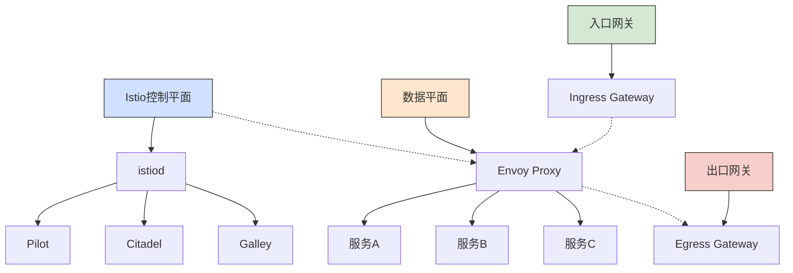

**Istio网关配置示例：**

```yaml:c:\project\kphub\cncf\istio\gateway.yaml
apiVersion: networking.istio.io/v1alpha3
kind: Gateway
metadata:
  name: bookinfo-gateway
spec:
  selector:
    istio: ingressgateway  # 使用默认的入口网关
  servers:
  - port:
      number: 80
      name: http
      protocol: HTTP
    hosts:
    - "*.example.com"  # 允许访问的主机名
---
apiVersion: networking.istio.io/v1alpha3
kind: VirtualService
metadata:
  name: bookinfo
spec:
  hosts:
  - "bookinfo.example.com"
  gateways:
  - bookinfo-gateway
  http:
  - match:
    - uri:
        prefix: /productpage
    - uri:
        prefix: /login
    - uri:
        prefix: /logout
    - uri:
        prefix: /api/v1/products
    route:
    - destination:
        host: productpage
        port:
          number: 9080
```

**流量管理配置：**

```yaml:c:\project\kphub\cncf\istio\traffic-management.yaml
# 目标规则：定义服务子集和流量策略
apiVersion: networking.istio.io/v1alpha3
kind: DestinationRule
metadata:
  name: reviews
spec:
  host: reviews  # 服务名称
  trafficPolicy:
    loadBalancer:
      simple: RANDOM  # 负载均衡策略
  subsets:
  - name: v1  # 版本v1子集
    labels:
      version: v1
  - name: v2  # 版本v2子集
    labels:
      version: v2
    trafficPolicy:
      loadBalancer:
        simple: ROUND_ROBIN
  - name: v3  # 版本v3子集
    labels:
      version: v3
---
# 虚拟服务：定义流量路由规则
apiVersion: networking.istio.io/v1alpha3
kind: VirtualService
metadata:
  name: reviews
spec:
  hosts:
  - reviews  # 应用到reviews服务
  http:
  - match:
    - headers:
        end-user:
          exact: jason  # 用户为jason的请求
    route:
    - destination:
        host: reviews
        subset: v2  # 路由到v2版本
  - route:  # 其他所有请求
    - destination:
        host: reviews
        subset: v1  # 路由到v1版本
      weight: 75  # 75%流量
    - destination:
        host: reviews
        subset: v3  # 路由到v3版本
      weight: 25  # 25%流量
```

**故障注入测试：**

```yaml:c:\project\kphub\cncf\istio\fault-injection.yaml
apiVersion: networking.istio.io/v1alpha3
kind: VirtualService
metadata:
  name: ratings
spec:
  hosts:
  - ratings
  http:
  - fault:  # 故障注入配置
      delay:  # 延迟故障
        percentage:
          value: 10.0  # 影响10%的请求
        fixedDelay: 5s  # 固定延迟5秒
      abort:  # 中止故障
        percentage:
          value: 5.0  # 影响5%的请求
        httpStatus: 500  # 返回HTTP 500错误
    route:
    - destination:
        host: ratings
        subset: v1
```

**安全策略配置：**

```yaml:c:\project\kphub\cncf\istio\security.yaml
# 对等认证策略：启用mTLS
apiVersion: security.istio.io/v1beta1
kind: PeerAuthentication
metadata:
  name: default
  namespace: istio-system
spec:
  mtls:
    mode: STRICT  # 严格模式，只允许mTLS通信
---
# 授权策略：基于角色的访问控制
apiVersion: security.istio.io/v1beta1
kind: AuthorizationPolicy
metadata:
  name: productpage-viewer
  namespace: default
spec:
  selector:
    matchLabels:
      app: productpage
  rules:
  - from:
    - source:
        namespaces: ["default"]  # 来源命名空间
    to:
    - operation:
        methods: ["GET"]  # 允许GET方法
  - from:
    - source:
        principals: ["cluster.local/ns/default/sa/bookinfo-admin"]  # 特定服务账户
    to:
    - operation:
        methods: ["GET", "POST", "PUT", "DELETE"]  # 允许所有方法
```

### 2.2 可观测性配置  

可观测性是云原生应用的关键能力，通过监控、日志和追踪提供系统运行状态的全面视图。

**Prometheus监控配置：**

```yaml:c:\project\kphub\cncf\monitoring\prometheus-values.yaml
prometheus:
  retention: 15d  # 数据保留时间
  resources:
    requests:
      memory: 16Gi
      cpu: 2
    limits:
      memory: 20Gi
      cpu: 4
  persistentVolume:
    size: 100Gi
    storageClass: "ssd"
  
  # 高可用配置
  replicaCount: 2
  podAntiAffinity: true
  
  # 告警规则
  serverFiles:
    alerting_rules.yml:
      groups:
      - name: node-alerts
        rules:
        - alert: HighCPULoad
          expr: node_load1 > 1.5
          for: 10m
          labels:
            severity: warning
          annotations:
            summary: "High CPU load on {{$labels.instance}}"
            description: "CPU load is above 1.5 for 10 minutes"

alertmanager:
  enabled: true
  replicaCount: 2
  config:
    global:
      resolve_timeout: 5m
    route:
      group_by: ['alertname', 'job']
      group_wait: 30s
      group_interval: 5m
      repeat_interval: 12h
      receiver: 'slack'
    receivers:
    - name: 'slack'
      slack_configs:
      - channel: '#alerts'
        send_resolved: true
    - name: 'email'
      email_configs:
      - to: 'team@example.com'

grafana:
  adminPassword: "admin123"
  persistence:
    enabled: true
    size: 10Gi
  dashboardProviders:
    dashboardproviders.yaml:
      apiVersion: 1
      providers:
      - name: 'default'
        orgId: 1
        folder: ''
        type: file
        disableDeletion: false
        editable: true
        options:
          path: /var/lib/grafana/dashboards/default
```

**自定义服务监控配置：**

```yaml:c:\project\kphub\cncf\monitoring\service-monitor.yaml
apiVersion: monitoring.coreos.com/v1
kind: ServiceMonitor
metadata:
  name: api-service
  namespace: monitoring
  labels:
    release: prometheus  # 与Prometheus Operator配置匹配
spec:
  selector:
    matchLabels:
      app: api-service  # 选择要监控的服务
  endpoints:
  - port: metrics  # 指标暴露端口
    interval: 15s  # 抓取间隔
    path: /metrics  # 指标路径
  namespaceSelector:
    matchNames:
    - default  # 目标服务所在命名空间
```

**分布式追踪配置：**

```yaml:c:\project\kphub\cncf\monitoring\jaeger-values.yaml
jaeger:
  # 部署模式：all-in-one, production, streaming
  mode: production
  
  # 存储配置
  storage:
    type: elasticsearch  # 存储后端类型
    elasticsearch:
      host: elasticsearch-master.monitoring.svc
      port: 9200
      indexPrefix: jaeger
  
  # 采样配置
  collector:
    service:
      type: ClusterIP
    replicaCount: 2
    resources:
      limits:
        cpu: 1
        memory: 1Gi
      requests:
        cpu: 500m
        memory: 512Mi
    samplingConfig:
      default_strategy:
        type: probabilistic
        param: 0.1  # 10%采样率
  
  # 查询服务配置
  query:
    service:
      type: ClusterIP
    replicaCount: 2
    resources:
      limits:
        cpu: 500m
        memory: 512Mi
      requests:
        cpu: 100m
        memory: 128Mi
  
  # Agent配置
  agent:
    strategy: DaemonSet
    resources:
      limits:
        cpu: 200m
        memory: 256Mi
      requests:
        cpu: 50m
        memory: 64Mi
```

**应用集成示例（Java）：**

```java:c:\project\kphub\cncf\monitoring\TracingConfig.java
import io.opentelemetry.api.OpenTelemetry;
import io.opentelemetry.api.trace.Tracer;
import io.opentelemetry.exporter.jaeger.JaegerGrpcSpanExporter;
import io.opentelemetry.sdk.OpenTelemetrySdk;
import io.opentelemetry.sdk.trace.SdkTracerProvider;
import io.opentelemetry.sdk.trace.export.BatchSpanProcessor;
import org.springframework.context.annotation.Bean;
import org.springframework.context.annotation.Configuration;

@Configuration
public class TracingConfig {

    @Bean
    public OpenTelemetry openTelemetry() {
        // 创建Jaeger导出器
        JaegerGrpcSpanExporter jaegerExporter = JaegerGrpcSpanExporter.builder()
                .setEndpoint("http://jaeger-collector.monitoring:14250")
                .build();

        // 创建批处理Span处理器
        BatchSpanProcessor spanProcessor = BatchSpanProcessor.builder(jaegerExporter)
                .build();

        // 构建并返回OpenTelemetry SDK
        SdkTracerProvider tracerProvider = SdkTracerProvider.builder()
                .addSpanProcessor(spanProcessor)
                .build();

        return OpenTelemetrySdk.builder()
                .setTracerProvider(tracerProvider)
                .buildAndRegisterGlobal();
    }

    @Bean
    public Tracer tracer(OpenTelemetry openTelemetry) {
        return openTelemetry.getTracer("com.example.service");
    }
}
```

## 3. 边缘计算方案  

边缘计算将计算能力从中心云扩展到网络边缘，为低延迟应用和物联网场景提供支持。

### 3.1 KubeEdge部署  

KubeEdge是一个开源系统，将容器化应用编排能力扩展到边缘设备，实现云边协同。

**KubeEdge架构：**

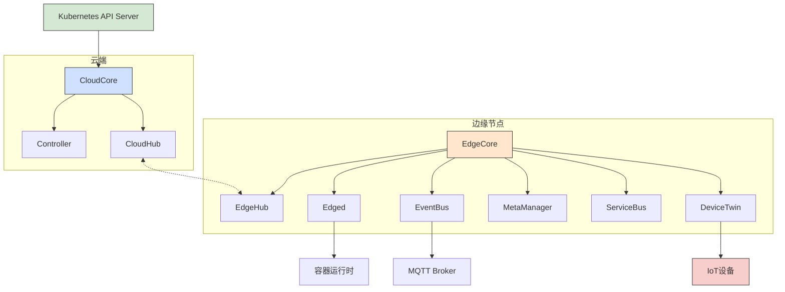

**云端组件部署：**

```yaml:c:\project\kphub\cncf\kubeedge\cloudcore.yaml
apiVersion: apps/v1
kind: Deployment
metadata:
  name: cloudcore
  namespace: kubeedge
  labels:
    app: kubeedge
    component: cloudcore
spec:
  replicas: 1
  selector:
    matchLabels:
      app: kubeedge
      component: cloudcore
  template:
    metadata:
      labels:
        app: kubeedge
        component: cloudcore
    spec:
      hostNetwork: true
      containers:
      - name: cloudcore
        image: kubeedge/cloudcore:v1.10.0
        imagePullPolicy: IfNotPresent
        ports:
        - containerPort: 10000
          name: cloudhub
          hostPort: 10000
        - containerPort: 10001
          name: cloudhub-quic
          hostPort: 10001
        - containerPort: 10002
          name: cloudhub-https
          hostPort: 10002
        - containerPort: 10003
          name: cloudstream
          hostPort: 10003
        - containerPort: 10004
          name: tunnelport
          hostPort: 10004
        resources:
          limits:
            cpu: 200m
            memory: 512Mi
          requests:
            cpu: 100m
            memory: 256Mi
        volumeMounts:
        - name: conf
          mountPath: /etc/kubeedge/config
        - name: certs
          mountPath: /etc/kubeedge/certs
      volumes:
      - name: conf
        configMap:
          name: cloudcore
      - name: certs
        secret:
          secretName: cloudcore-certs
```

**边缘节点部署命令：**

```powershell
# 1. 安装keadm工具
curl -L https://github.com/kubeedge/kubeedge/releases/download/v1.10.0/keadm-v1.10.0-windows-amd64.tar.gz -o keadm.tar.gz
tar -xzvf keadm.tar.gz
move keadm.exe C:\Windows\System32\

# 2. 在云端生成边缘节点加入令牌
keadm gettoken > token.txt

# 3. 安装边缘节点
keadm join --cloudcore-ipport=192.168.1.100:10000 --token=`cat token.txt` --cert-path=c:\project\kphub\kubeedge\certs --edgenode-name=edge-node-1

# 4. 验证节点状态
kubectl get nodes
```

**边缘节点配置：**

```yaml:c:\project\kphub\cncf\kubeedge\edgecore-config.yaml
apiVersion: edgecore.config.kubeedge.io/v1alpha1
kind: EdgeCore
metadata:
  name: edgecore
  namespace: kubeedge
spec:
  modules:
    edged:
      enable: true
      containerRuntime: docker  # 容器运行时
      runtimeType: docker
      remoteRuntimeEndpoint: unix:///var/run/dockershim.sock
      remoteImageEndpoint: unix:///var/run/dockershim.sock
      hostnameOverride: edge-node-1
      nodeIP: 192.168.1.101
      registerNode: true
      interfaceName: eth0
      devicePluginEnabled: false
      gpuPluginEnabled: false
    edgehub:
      enable: true
      heartbeat: 15  # 心跳间隔(秒)
      projectID: e632aba927ea4ac2b575ec1603d56f10
      tlsCAFile: /etc/kubeedge/certs/rootCA.crt
      tlsCertFile: /etc/kubeedge/certs/edge.crt
      tlsPrivateKeyFile: /etc/kubeedge/certs/edge.key
      websocket:
        enable: true
        server: 192.168.1.100:10000
      quic:
        enable: false
    eventbus:
      enable: true
      mqttMode: 2  # 0-内部MQTT代理, 2-外部MQTT代理
      mqttQOS: 0  # QoS级别
      mqttRetain: false
      mqttServerExternal: tcp://mosquitto.mqtt:1883  # 外部MQTT代理地址
    metamanager:
      enable: true
    devicetwin:
      enable: true
    serviceBus:
      enable: false
```

### 3.2 设备管理配置  

KubeEdge提供了设备管理能力，可以通过Kubernetes API管理边缘设备。

**设备模型定义：**

```yaml:c:\project\kphub\cncf\kubeedge\device-model.yaml
apiVersion: devices.kubeedge.io/v1alpha2
kind: DeviceModel
metadata:
  name: temperature-sensor
  namespace: default
spec:
  properties:
  - name: temperature
    description: "环境温度"
    type:
      string:
        accessMode: ReadOnly
        defaultValue: "0"
  - name: humidity
    description: "环境湿度"
    type:
      string:
        accessMode: ReadOnly
        defaultValue: "0"
  - name: threshold
    description: "温度阈值"
    type:
      string:
        accessMode: ReadWrite
        defaultValue: "30"
```

**设备实例定义：**

```yaml:c:\project\kphub\cncf\kubeedge\device-instance.yaml
apiVersion: devices.kubeedge.io/v1alpha2
kind: Device
metadata:
  name: sensor-01
  namespace: default
  labels:
    device: temperature-sensor
    location: room-1
spec:
  deviceModelRef:
    name: temperature-sensor
  protocol:
    mqtt:
      client:
        server: tcp://mosquitto.mqtt:1883
      topic: devices/sensor-01/messages
      contentType: json
  nodeSelector:
    nodeSelectorTerms:
    - matchExpressions:
      - key: kubernetes.io/hostname
        operator: In
        values:
        - edge-node-1
  data:
    properties:
    - name: temperature
      desired:
        metadata:
          type: string
        value: "
继续编写CNCF技术全景图实践文档：

```yaml:c:\project\kphub\cncf\kubeedge\device-instance.yaml
apiVersion: devices.kubeedge.io/v1alpha2
kind: Device
metadata:
  name: sensor-01
  namespace: default
  labels:
    device: temperature-sensor
    location: room-1
spec:
  deviceModelRef:
    name: temperature-sensor
  protocol:
    mqtt:
      client:
        server: tcp://mosquitto.mqtt:1883
      topic: devices/sensor-01/messages
      contentType: json
  nodeSelector:
    nodeSelectorTerms:
    - matchExpressions:
      - key: kubernetes.io/hostname
        operator: In
        values:
        - edge-node-1
  data:
    properties:
    - name: temperature
      desired:
        metadata:
          type: string
        value: "0"
    - name: humidity
      desired:
        metadata:
          type: string
        value: "0"
    - name: threshold
      desired:
        metadata:
          type: string
        value: "30"
  status:
    twins:
    - propertyName: temperature
    - propertyName: humidity
    - propertyName: threshold
```

**边缘应用部署：**

```yaml:c:\project\kphub\cncf\kubeedge\edge-deployment.yaml
apiVersion: apps/v1
kind: Deployment
metadata:
  name: temperature-processor
  namespace: default
spec:
  replicas: 1
  selector:
    matchLabels:
      app: temperature-processor
  template:
    metadata:
      labels:
        app: temperature-processor
    spec:
      nodeSelector:
        kubernetes.io/hostname: edge-node-1  # 指定部署到边缘节点
      containers:
      - name: processor
        image: example/temp-processor:v1.0
        resources:
          limits:
            cpu: 200m
            memory: 256Mi
          requests:
            cpu: 100m
            memory: 128Mi
        env:
        - name: MQTT_SERVER
          value: "tcp://mosquitto.mqtt:1883"
        - name: DEVICE_TOPIC
          value: "devices/sensor-01/messages"
        - name: THRESHOLD_TOPIC
          value: "devices/sensor-01/threshold"
```

**边缘-云协同工作流：**

```yaml:c:\project\kphub\cncf\kubeedge\edge-cloud-workflow.yaml
apiVersion: rules.kubeedge.io/v1
kind: Rule
metadata:
  name: temperature-alert
  namespace: default
spec:
  source: "device-twin-source"
  sourceResource: "sensor-01/temperature"
  condition: "gt"
  sourceCondition:
    - name: "threshold"
      type: "device-twin"
      device: "sensor-01"
      twinname: "threshold"
  target: "rest-target"
  targetResource: "http://alert-service.default.svc.cluster.local:8080/api/alerts"
```

## 4. 无服务器平台  

无服务器计算模型让开发者专注于代码而不必管理底层基础设施，是云原生应用开发的重要趋势。

### 4.1 Knative Serving  

Knative Serving提供了基于Kubernetes的无服务器容器部署和自动扩缩容能力。

**Knative架构：**

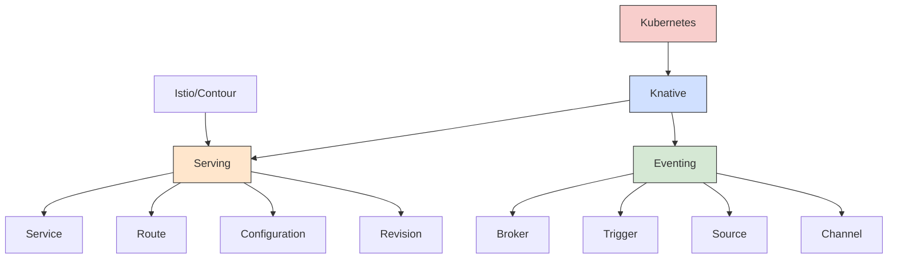

**Knative Serving安装：**

```powershell
# 安装Knative Serving CRDs
kubectl apply -f https://github.com/knative/serving/releases/download/knative-v1.8.0/serving-crds.yaml

# 安装Knative Serving核心组件
kubectl apply -f https://github.com/knative/serving/releases/download/knative-v1.8.0/serving-core.yaml

# 安装Kourier网络层
kubectl apply -f https://github.com/knative/net-kourier/releases/download/knative-v1.8.0/kourier.yaml

# 配置Knative Serving使用Kourier
kubectl patch configmap/config-network \
  --namespace knative-serving \
  --type merge \
  --patch '{"data":{"ingress.class":"kourier.ingress.networking.knative.dev"}}'

# 配置DNS
kubectl apply -f https://github.com/knative/serving/releases/download/knative-v1.8.0/serving-default-domain.yaml
```

**服务部署示例：**

```yaml:c:\project\kphub\cncf\knative\service.yaml
apiVersion: serving.knative.dev/v1
kind: Service
metadata:
  name: hello-world
  namespace: default
spec:
  template:
    metadata:
      annotations:
        # 自动扩缩容配置
        autoscaling.knative.dev/minScale: "1"  # 最小实例数
        autoscaling.knative.dev/maxScale: "10"  # 最大实例数
        autoscaling.knative.dev/target: "50"  # 目标并发请求数
    spec:
      containers:
      - image: gcr.io/knative-samples/helloworld-go
        ports:
        - containerPort: 8080
        env:
        - name: TARGET
          value: "CNCF"
        resources:
          limits:
            cpu: 300m
            memory: 256Mi
          requests:
            cpu: 100m
            memory: 128Mi
  traffic:
  - percent: 100  # 100%流量路由到最新版本
    latestRevision: true
```

**蓝绿部署配置：**

```yaml:c:\project\kphub\cncf\knative\blue-green.yaml
apiVersion: serving.knative.dev/v1
kind: Service
metadata:
  name: hello-world
  namespace: default
spec:
  template:
    metadata:
      name: hello-world-v2  # 指定修订版本名称
    spec:
      containers:
      - image: gcr.io/knative-samples/helloworld-go:v2
        env:
        - name: TARGET
          value: "CNCF v2"
  traffic:
  - revisionName: hello-world-v1  # 旧版本
    percent: 50
    tag: v1  # 为此流量分配创建命名路由
  - revisionName: hello-world-v2  # 新版本
    percent: 50
    tag: v2  # 为此流量分配创建命名路由
```

### 4.2 事件驱动架构  

Knative Eventing提供了事件驱动架构的基础设施，支持松耦合的事件生产和消费。

**Knative Eventing安装：**

```powershell
# 安装Knative Eventing CRDs
kubectl apply -f https://github.com/knative/eventing/releases/download/knative-v1.8.0/eventing-crds.yaml

# 安装Knative Eventing核心组件
kubectl apply -f https://github.com/knative/eventing/releases/download/knative-v1.8.0/eventing-core.yaml

# 安装默认Channel (InMemoryChannel)
kubectl apply -f https://github.com/knative/eventing/releases/download/knative-v1.8.0/in-memory-channel.yaml

# 安装默认Broker (MTChannelBasedBroker)
kubectl apply -f https://github.com/knative/eventing/releases/download/knative-v1.8.0/mt-channel-broker.yaml
```

**事件源配置：**

```yaml:c:\project\kphub\cncf\knative\event-source.yaml
# 创建一个PingSource，定期发送事件
apiVersion: sources.knative.dev/v1
kind: PingSource
metadata:
  name: ping-source
  namespace: default
spec:
  schedule: "*/1 * * * *"  # 每分钟触发一次
  contentType: "application/json"
  data: '{"message": "Hello from PingSource!"}'
  sink:
    ref:
      apiVersion: eventing.knative.dev/v1
      kind: Broker
      name: default
```

**事件代理和触发器：**

```yaml:c:\project\kphub\cncf\knative\trigger.yaml
# 创建默认Broker
apiVersion: eventing.knative.dev/v1
kind: Broker
metadata:
  name: default
  namespace: default
---
# 创建Trigger，根据事件类型过滤并路由事件
apiVersion: eventing.knative.dev/v1
kind: Trigger
metadata:
  name: log-trigger
  namespace: default
spec:
  broker: default
  filter:
    attributes:
      type: com.example.someevent  # 事件类型过滤
      source: ping-source
  subscriber:
    ref:
      apiVersion: serving.knative.dev/v1
      kind: Service
      name: event-logger
```

**事件消费服务：**

```yaml:c:\project\kphub\cncf\knative\event-consumer.yaml
apiVersion: serving.knative.dev/v1
kind: Service
metadata:
  name: event-logger
  namespace: default
spec:
  template:
    spec:
      containers:
      - image: gcr.io/knative-releases/knative.dev/eventing-contrib/cmd/event_display
        resources:
          limits:
            cpu: 200m
            memory: 128Mi
          requests:
            cpu: 100m
            memory: 64Mi
```

**完整事件流示例：**

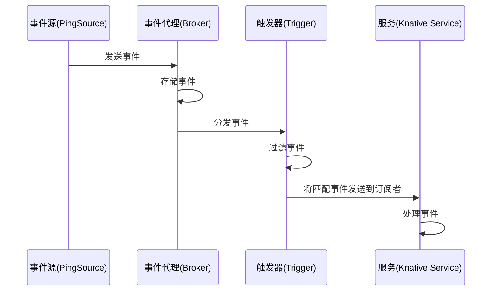

## 5. 持续交付流水线  

云原生环境中的持续交付需要专门的工具和实践，以支持容器化应用的快速、可靠部署。

### 5.1 Tekton任务定义  

Tekton是一个强大而灵活的Kubernetes原生CI/CD框架，提供了构建、测试和部署云原生应用的能力。

**Tekton架构：**

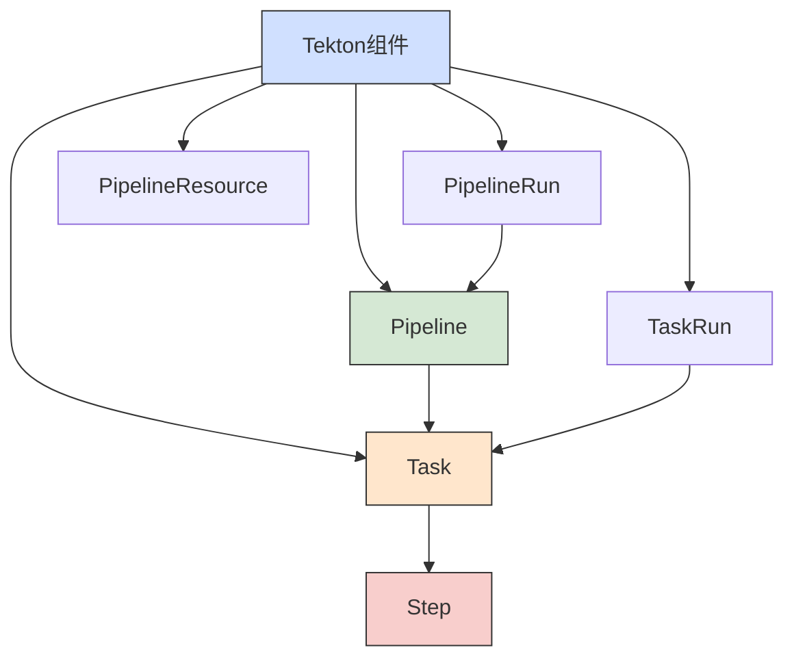

**Tekton安装：**

```powershell
# 安装Tekton Pipelines
kubectl apply -f https://storage.googleapis.com/tekton-releases/pipeline/latest/release.yaml

# 安装Tekton Dashboard
kubectl apply -f https://storage.googleapis.com/tekton-releases/dashboard/latest/tekton-dashboard-release.yaml

# 安装Tekton Triggers
kubectl apply -f https://storage.googleapis.com/tekton-releases/triggers/latest/release.yaml
```

**基本任务定义：**

```yaml:c:\project\kphub\cncf\tekton\task.yaml
apiVersion: tekton.dev/v1beta1
kind: Task
metadata:
  name: build-push
spec:
  params:
  - name: image-name
    type: string
    description: 构建的镜像名称
  - name: git-url
    type: string
    description: 源代码仓库URL
  - name: git-revision
    type: string
    description: Git修订版本
    default: main
  workspaces:
  - name: source
    description: 源代码工作区
  steps:
  - name: git-clone
    image: alpine/git:v2.26.2
    script: |
      git clone $(params.git-url) /workspace/source/
      cd /workspace/source/
      git checkout $(params.git-revision)
  
  - name: build
    image: maven:3.6
    workingDir: /workspace/source
    script: |
      mvn -B clean package -DskipTests
  
  - name: test
    image: maven:3.6
    workingDir: /workspace/source
    script: |
      mvn -B test
  
  - name: build-and-push
    image: gcr.io/kaniko-project/executor:v1.8.0
    workingDir: /workspace/source
    args:
    - --dockerfile=Dockerfile
    - --context=/workspace/source
    - --destination=$(params.image-name)
    - --skip-tls-verify
```

**管道定义：**

```yaml:c:\project\kphub\cncf\tekton\pipeline.yaml
apiVersion: tekton.dev/v1beta1
kind: Pipeline
metadata:
  name: build-test-deploy
spec:
  workspaces:
  - name: shared-workspace
    description: 共享工作区
  params:
  - name: git-url
    type: string
    description: 源代码仓库URL
  - name: git-revision
    type: string
    description: Git修订版本
    default: main
  - name: image-name
    type: string
    description: 构建的镜像名称
  - name: app-name
    type: string
    description: 应用名称
  - name: namespace
    type: string
    description: 部署命名空间
    default: default
  
  tasks:
  - name: fetch-source
    taskRef:
      name: git-clone
    workspaces:
    - name: output
      workspace: shared-workspace
    params:
    - name: url
      value: $(params.git-url)
    - name: revision
      value: $(params.git-revision)
  
  - name: run-tests
    taskRef:
      name: maven-test
    runAfter:
    - fetch-source
    workspaces:
    - name: source
      workspace: shared-workspace
  
  - name: build-image
    taskRef:
      name: build-push
    runAfter:
    - run-tests
    workspaces:
    - name: source
      workspace: shared-workspace
    params:
    - name: image-name
      value: $(params.image-name)
  
  - name: scan-image
    taskRef:
      name: trivy-scanner
    runAfter:
    - build-image
    params:
    - name: image-name
      value: $(params.image-name)
  
  - name: deploy-to-k8s
    taskRef:
      name: kubectl-deploy
    runAfter:
    - scan-image
    params:
    - name: image-name
      value: $(params.image-name)
    - name: app-name
      value: $(params.app-name)
    - name: namespace
      value: $(params.namespace)
    workspaces:
    - name: source
      workspace: shared-workspace
```

**管道运行：**

```yaml:c:\project\kphub\cncf\tekton\pipeline-run.yaml
apiVersion: tekton.dev/v1beta1
kind: PipelineRun
metadata:
  name: build-test-deploy-run-1
spec:
  pipelineRef:
    name: build-test-deploy
  workspaces:
  - name: shared-workspace
    persistentVolumeClaim:
      claimName: tekton-workspace-pvc
  params:
  - name: git-url
    value: https://github.com/example/app.git
  - name: git-revision
    value: main
  - name: image-name
    value: registry.example.com/app:latest
  - name: app-name
    value: example-app
  - name: namespace
    value: production
```

### 5.2 GitOps工作流  

GitOps是一种持续交付方法，使用Git作为单一事实来源，自动化应用部署和基础设施管理。

**GitOps工作流程：**

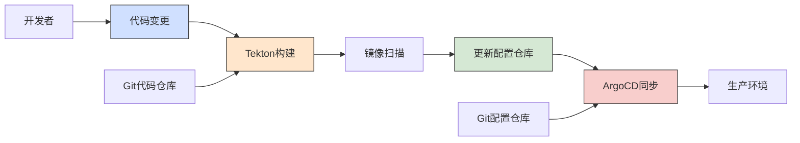

**ArgoCD安装：**

```powershell
# 创建命名空间
kubectl create namespace argocd

# 安装ArgoCD
kubectl apply -n argocd -f https://raw.githubusercontent.com/argoproj/argo-cd/stable/manifests/install.yaml

# 获取初始管理员密码
kubectl -n argocd get secret argocd-initial-admin-secret -o jsonpath="{.data.password}" | base64 --decode

# 安装ArgoCD CLI
choco install argocd-cli
```

**ArgoCD应用定义：**

```yaml:c:\project\kphub\cncf\argo\application.yaml
apiVersion: argoproj.io/v1alpha1
kind: Application
metadata:
  name: example-app
  namespace: argocd
spec:
  project: default
  source:
    repoURL: https://github.com/example/gitops-config.git
    targetRevision: HEAD
    path: apps/example-app
  destination:
    server: https://kubernetes.default.svc
    namespace: production
  syncPolicy:
    automated:
      prune: true  # 自动删除不再存在于Git中的资源
      selfHeal: true  # 自动修复偏离Git定义的资源
    syncOptions:
    - CreateNamespace=true
    retry:
      limit: 5
      backoff:
        duration: 5s
        factor: 2
        maxDuration: 3m
```

**Tekton与ArgoCD集成：**

```yaml:c:\project\kphub\cncf\tekton\gitops-task.yaml
apiVersion: tekton.dev/v1beta1
kind: Task
metadata:
  name: update-gitops-repo
spec:
  params:
  - name: git-url
    type: string
    description: GitOps配置仓库URL
  - name: git-revision
    type: string
    description: Git分支
    default: main
  - name: app-name
    type: string
    description: 应用名称
  - name: image-name
    type: string
    description: 新镜像名称和标签
  - name: git-user-name
    type: string
    description: Git用户名
    default: "Tekton Pipeline"
  - name: git-user-email
    type: string
    description: Git用户邮箱
    default: "tekton@example.com"
  workspaces:
  - name: source
    description: 包含GitOps配置的工作区
  steps:
  - name: git-clone
    image: alpine/git:v2.26.2
    script: |
      git clone $(params.git-url) /workspace/gitops/
      cd /workspace/gitops/
      git checkout $(params.git-revision)
  
  - name: update-image
    image: mikefarah/yq:4
    workingDir: /workspace/gitops/
    script: |
      cd apps/$(params.app-name)/
      # 使用yq更新deployment.yaml中的镜像
      yq eval '.spec.template.spec.containers[0].image = "$(params.image-name)"' -i deployment.yaml
  
  - name: git-commit
    image: alpine/git:v2.26.2
    workingDir: /workspace/gitops/
    script: |
      git config --global user.name "$(params.git-user-name)"
      git config --global user.email "$(params.git-user-email)"
      git add apps/$(params.app-name)/deployment.yaml
      git commit -m "Update $(params.app-name) image to $(params.image-name)"
      git push origin $(params.git-revision)
```

## 6. 生产环境优化  

将云原生应用部署到生产环境需要考虑多集群管理、高可用性、成本优化等多个方面。

### 6.1 多集群管理  

随着应用规模的增长，多集群部署成为常见需求，用于实现地理冗余、隔离环境或满足合规要求。

**多集群架构：**

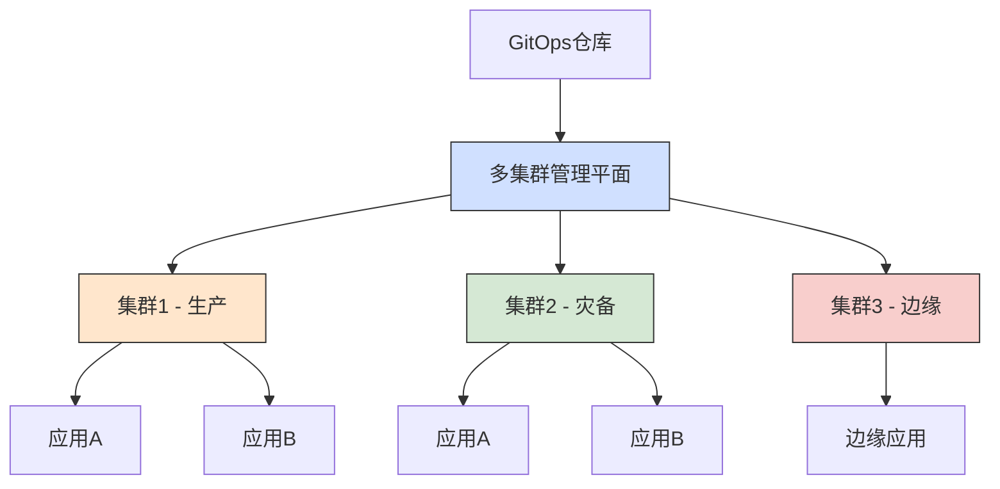

**ArgoCD ApplicationSet：**

```yaml:c:\project\kphub\cncf\argo\appset.yaml
apiVersion: argoproj.io/v1alpha1
kind: ApplicationSet
metadata:
  name: prod-clusters
  namespace: argocd
spec:
  generators:
  - list:
      elements:
      - cluster: cluster-east
        url: https://kubernetes.east-region.example.com
        environment: production
      - cluster: cluster-west
        url: https://kubernetes.west-region.example.com
        environment: production
      - cluster: cluster-dr
        url: https://kubernetes.dr-site.example.com
        environment: dr
  template:
    metadata:
      name: '{{cluster}}-app'
    spec:
      project: default
      source:
        repoURL: https://git.example.com/app.git
        targetRevision: HEAD
        path: k8s/{{environment}}
      destination:
        server: '{{url}}'
        namespace: default
      syncPolicy:
        automated:
          prune: true
          selfHeal: true
```

**集群联邦配置：**

```yaml:c:\project\kphub\cncf\kubefed\federated-deployment.yaml
apiVersion: types.kubefed.io/v1beta1
kind: FederatedDeployment
metadata:
  name: test-deployment
  namespace: test-namespace
spec:
  template:
    metadata:
      labels:
        app: test-app
    spec:
      replicas: 3
      selector:
        matchLabels:
          app: test-app
      template:
        metadata:
          labels:
            app: test-app
        spec:
          containers:
          - image: nginx:1.17
            name: nginx
  placement:
    clusters:
    - name: cluster-east
    - name: cluster-west
  overrides:
  - clusterName: cluster-east
    clusterOverrides:
    - path: "/spec/replicas"
      value: 5
  - clusterName: cluster-west
    clusterOverrides:
    - path: "/spec/replicas"
      value: 3
```

### 6.2 成本优化策略  

云原生环境中的成本优化需要从资源利用率、自动扩缩容和工作负载调度等多个方面入手。

**资源请求与限制优化：**

```yaml:c:\project\kphub\cncf\optimization\resource-limits.yaml
apiVersion: apps/v1
kind: Deployment
metadata:
  name: optimized-app
spec:
  replicas: 3
  template:
    spec:
      containers:
      - name: app
        image: example/app:v1.0
        resources:
          requests:
            cpu: 100m        # 0.1 CPU核心
            memory: 256Mi    # 256 MB内存
          limits:
            cpu: 500m        # 0.5 CPU核心
            memory: 512Mi    # 512 MB内存
        # 资源使用率指标暴露
        ports:
        - containerPort: 8080
        - containerPort: 9090  # 指标端口
```

**水平自动扩展配置：**

```powershell
# 启用集群自动缩放
kubectl autoscale deployment myapp --cpu-percent=50 --min=2 --max=10

# 设置资源配额
kubectl create quota dev-team --hard=cpu=10,memory=20Gi,pods=20
```

**垂直自动扩展配置：**

```yaml:c:\project\kphub\cncf\optimization\vpa.yaml
apiVersion: autoscaling.k8s.io/v1
kind: VerticalPodAutoscaler
metadata:
  name: optimized-app-vpa
spec:
  targetRef:
    apiVersion: apps/v1
    kind: Deployment
    name: optimized-app
  updatePolicy:
    updateMode: Auto  # 自动应用推荐的资源设置
  resourcePolicy:
    containerPolicies:
    - containerName: '*'
      minAllowed:
        cpu: 50m
        memory: 100Mi
      maxAllowed:
        cpu: 1
        memory: 1Gi
      controlledResources: ["cpu", "memory"]
```

**成本分配与标记：**

```yaml:c:\project\kphub\cncf\optimization\cost-allocation.yaml
apiVersion: v1
kind: Namespace
metadata:
  name: team-a
  labels:
    department: engineering
    team: frontend
    cost-center: cc-123
    environment: production
---
apiVersion: apps/v1
kind: Deployment
metadata:
  name: frontend-app
  namespace: team-a
  labels:
    app: frontend
    department: engineering
    team: frontend
    cost-center: cc-123
    environment: production
spec:
  replicas: 3
  selector:
    matchLabels:
      app: frontend
  template:
    metadata:
      labels:
        app: frontend
        department: engineering
        team: frontend
        cost-center: cc-123
        environment: production
    spec:
      containers:
      - name: frontend
        image: example/frontend:v1.0
```

**Spot实例使用策略：**

```yaml:c:\project\kphub\cncf\optimization\spot-instances.yaml
apiVersion: apps/v1
kind: Deployment
metadata:
  name: batch-processor
  labels:
    app: batch-processor
spec:
  replicas: 5
  selector:
    matchLabels:
      app: batch-processor
  template:
    metadata:
      labels:
        app: batch-processor
    spec:
      affinity:
        nodeAffinity:
          preferredDuringSchedulingIgnoredDuringExecution:
          - weight: 100
            preference:
              matchExpressions:
              - key: node.kubernetes.io/instance-type
                operator: In
                values:
                - spot
      tolerations:
      - key: "spot"
        operator: "Equal"
        value: "true"
        effect: "NoSchedule"
      containers:
      - name: processor
        image: example/batch-processor:v1.0
```

**成本监控与优化工具：**

```yaml:c:\project\kphub\cncf\optimization\kubecost.yaml
apiVersion: helm.toolkit.fluxcd.io/v2beta1
kind: HelmRelease
metadata:
  name: kubecost
  namespace: kubecost
spec:
  interval: 1h
  chart:
    spec:
      chart: cost-analyzer
      version: '1.96.0'
      sourceRef:
        kind: HelmRepository
        name: kubecost
        namespace: kubecost
  values:
    kubecostToken: "YOUR_KUBECOST_TOKEN"
    prometheus:
      server:
        resources:
          limits:
            cpu: 1000m
            memory: 2Gi
          requests:
            cpu: 500m
            memory: 1Gi
    grafana:
      sidecar:
        dashboards:
          enabled: true
```

## 7. 实践案例与最佳实践

以下是一些实际案例和最佳实践，帮助团队在实施CNCF技术栈时避免常见陷阱。

### 7.1 微服务迁移案例

**传统应用向微服务迁移路径：**

```mermaid
graph LR
    A[单体应用] --> B[容器化单体]
    B --> C[拆分关键服务]
    C --> D[服务网格集成]
    
继续编写CNCF技术全景图实践文档：

### 7.1 微服务迁移案例

**传统应用向微服务迁移路径：**

```mermaid
graph LR
    A[单体应用] --> B[容器化单体]
    B --> C[拆分关键服务]
    C --> D[服务网格集成]
    D --> E[全面微服务化]
    
    style A fill:#d0e0ff,stroke:#333,stroke-width:1px
    style C fill:#ffe6cc,stroke:#333,stroke-width:1px
    style E fill:#d5e8d4,stroke:#333,stroke-width:1px
```

**迁移步骤详解：**

1. **容器化单体应用**
   - 不改变应用架构，仅将应用打包为容器
   - 创建CI/CD流水线，实现自动构建和部署
   - 引入基本监控和日志收集

```yaml:c:\project\kphub\cncf\cases\monolith-containerization.yaml
apiVersion: apps/v1
kind: Deployment
metadata:
  name: monolith-app
  namespace: legacy
spec:
  replicas: 3
  selector:
    matchLabels:
      app: monolith
  template:
    metadata:
      labels:
        app: monolith
    spec:
      containers:
      - name: monolith
        image: example/monolith:v1.0
        ports:
        - containerPort: 8080
        resources:
          limits:
            cpu: 2
            memory: 4Gi
          requests:
            cpu: 1
            memory: 2Gi
        readinessProbe:
          httpGet:
            path: /health
            port: 8080
          initialDelaySeconds: 60
          periodSeconds: 10
        livenessProbe:
          httpGet:
            path: /health
            port: 8080
          initialDelaySeconds: 120
          periodSeconds: 20
        env:
        - name: DB_HOST
          valueFrom:
            configMapKeyRef:
              name: monolith-config
              key: db_host
        - name: DB_PASSWORD
          valueFrom:
            secretKeyRef:
              name: monolith-secrets
              key: db_password
```

2. **拆分关键服务**
   - 识别松耦合的边界服务进行拆分
   - 实现服务间通信（REST/gRPC）
   - 引入API网关管理服务入口

```yaml:c:\project\kphub\cncf\cases\service-extraction.yaml
# 用户服务 - 从单体中提取的第一个微服务
apiVersion: apps/v1
kind: Deployment
metadata:
  name: user-service
  namespace: microservices
spec:
  replicas: 2
  selector:
    matchLabels:
      app: user-service
  template:
    metadata:
      labels:
        app: user-service
    spec:
      containers:
      - name: user-service
        image: example/user-service:v1.0
        ports:
        - containerPort: 8080
        resources:
          limits:
            cpu: 500m
            memory: 1Gi
          requests:
            cpu: 200m
            memory: 512Mi
---
# API网关配置
apiVersion: networking.k8s.io/v1
kind: Ingress
metadata:
  name: api-gateway
  namespace: microservices
  annotations:
    kubernetes.io/ingress.class: "nginx"
    nginx.ingress.kubernetes.io/rewrite-target: /$2
spec:
  rules:
  - host: api.example.com
    http:
      paths:
      - path: /users(/|$)(.*)
        pathType: Prefix
        backend:
          service:
            name: user-service
            port:
              number: 8080
      - path: /(.*)
        pathType: Prefix
        backend:
          service:
            name: monolith-app
            port:
              number: 8080
```

3. **服务网格集成**
   - 部署Istio服务网格
   - 实现细粒度流量控制
   - 增强可观测性和安全性

```yaml:c:\project\kphub\cncf\cases\service-mesh-integration.yaml
# 为命名空间启用Istio注入
apiVersion: v1
kind: Namespace
metadata:
  name: microservices
  labels:
    istio-injection: enabled
---
# 服务间通信策略
apiVersion: networking.istio.io/v1alpha3
kind: VirtualService
metadata:
  name: user-service
  namespace: microservices
spec:
  hosts:
  - user-service
  http:
  - route:
    - destination:
        host: user-service
        subset: v1
    retries:
      attempts: 3
      perTryTimeout: 2s
    timeout: 5s
---
# 断路器配置
apiVersion: networking.istio.io/v1alpha3
kind: DestinationRule
metadata:
  name: user-service
  namespace: microservices
spec:
  host: user-service
  trafficPolicy:
    connectionPool:
      tcp:
        maxConnections: 100
      http:
        http1MaxPendingRequests: 10
        maxRequestsPerConnection: 10
    outlierDetection:
      consecutive5xxErrors: 5
      interval: 30s
      baseEjectionTime: 30s
```

4. **全面微服务化**
   - 完成所有业务域的服务拆分
   - 实现数据库分离和事件驱动架构
   - 建立完整的DevOps流程

```yaml:c:\project\kphub\cncf\cases\complete-microservices.yaml
# 事件驱动架构 - Kafka配置
apiVersion: kafka.strimzi.io/v1beta2
kind: Kafka
metadata:
  name: event-bus
  namespace: microservices
spec:
  kafka:
    version: 3.2.0
    replicas: 3
    listeners:
      - name: plain
        port: 9092
        type: internal
        tls: false
      - name: tls
        port: 9093
        type: internal
        tls: true
    config:
      offsets.topic.replication.factor: 3
      transaction.state.log.replication.factor: 3
      transaction.state.log.min.isr: 2
    storage:
      type: jbod
      volumes:
      - id: 0
        type: persistent-claim
        size: 100Gi
        deleteClaim: false
  zookeeper:
    replicas: 3
    storage:
      type: persistent-claim
      size: 20Gi
      deleteClaim: false
  entityOperator:
    topicOperator: {}
    userOperator: {}
```

**迁移案例关键经验：**

1. **渐进式迁移**：避免大爆炸式重写，采用增量迁移策略
2. **领域驱动设计**：基于业务领域边界进行服务拆分
3. **数据管理策略**：解决分布式数据一致性和查询挑战
4. **自动化测试**：建立全面的自动化测试确保迁移质量
5. **团队结构调整**：按业务能力组织团队，而非技术层次

### 7.2 边缘计算实践案例

**智能制造边缘计算架构：**

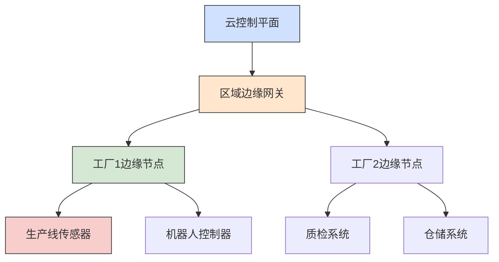

**边缘节点部署配置：**

```yaml:c:\project\kphub\cncf\cases\edge-manufacturing.yaml
# 边缘节点配置
apiVersion: apps/v1
kind: Deployment
metadata:
  name: edge-controller
  namespace: factory-1
spec:
  replicas: 1
  selector:
    matchLabels:
      app: edge-controller
  template:
    metadata:
      labels:
        app: edge-controller
    spec:
      nodeSelector:
        node-role.kubernetes.io/edge: "true"
      containers:
      - name: controller
        image: example/edge-controller:v1.0
        resources:
          limits:
            cpu: 1
            memory: 2Gi
          requests:
            cpu: 500m
            memory: 1Gi
        env:
        - name: EDGE_ID
          value: "factory-1-main"
        - name: MQTT_BROKER
          value: "mqtt://mqtt-broker.factory-1:1883"
        volumeMounts:
        - name: edge-config
          mountPath: /etc/edge-config
      volumes:
      - name: edge-config
        configMap:
          name: edge-controller-config
---
# 设备连接配置
apiVersion: devices.kubeedge.io/v1alpha2
kind: DeviceModel
metadata:
  name: temperature-sensor
  namespace: factory-1
spec:
  properties:
  - name: temperature
    description: "温度传感器读数"
    type:
      int:
        accessMode: ReadOnly
        defaultValue: 0
  - name: humidity
    description: "湿度传感器读数"
    type:
      int:
        accessMode: ReadOnly
        defaultValue: 0
---
# 边缘应用自治配置
apiVersion: apps/v1
kind: Deployment
metadata:
  name: anomaly-detector
  namespace: factory-1
spec:
  replicas: 1
  selector:
    matchLabels:
      app: anomaly-detector
  template:
    metadata:
      labels:
        app: anomaly-detector
    spec:
      nodeSelector:
        node-role.kubernetes.io/edge: "true"
      containers:
      - name: detector
        image: example/anomaly-detector:v1.0
        resources:
          limits:
            cpu: 500m
            memory: 1Gi
          requests:
            cpu: 200m
            memory: 512Mi
        env:
        - name: OFFLINE_MODE_ENABLED
          value: "true"
        - name: DATA_BUFFER_SIZE
          value: "1000"
        - name: SYNC_INTERVAL
          value: "300"  # 5分钟同步一次
```

**边缘-云协同工作流：**

```yaml:c:\project\kphub\cncf\cases\edge-cloud-workflow.yaml
# 边缘数据处理流水线
apiVersion: tekton.dev/v1beta1
kind: Pipeline
metadata:
  name: edge-data-processing
  namespace: factory-1
spec:
  workspaces:
  - name: shared-data
  params:
  - name: data-source
    type: string
    description: 数据源标识
  - name: time-window
    type: string
    description: 处理时间窗口
    default: "1h"
  tasks:
  - name: collect-data
    taskRef:
      name: sensor-data-collector
    params:
    - name: source
      value: $(params.data-source)
    - name: window
      value: $(params.time-window)
    workspaces:
    - name: output
      workspace: shared-data
  
  - name: process-locally
    taskRef:
      name: edge-data-processor
    runAfter:
    - collect-data
    params:
    - name: algorithm
      value: "anomaly-detection"
    workspaces:
    - name: data
      workspace: shared-data
  
  - name: sync-to-cloud
    taskRef:
      name: cloud-data-sync
    runAfter:
    - process-locally
    params:
    - name: destination
      value: "data-lake"
    - name: compression
      value: "true"
    workspaces:
    - name: data
      workspace: shared-data
```

**边缘计算实践经验：**

1. **网络弹性设计**：处理间歇性连接和有限带宽
2. **本地数据处理**：实现边缘智能和数据预处理
3. **资源优化**：针对受限硬件优化应用资源使用
4. **安全防护**：实施边缘节点安全加固和数据保护
5. **远程管理**：建立高效的远程监控和更新机制

### 7.3 无服务器应用案例

**事件驱动电商平台架构：**

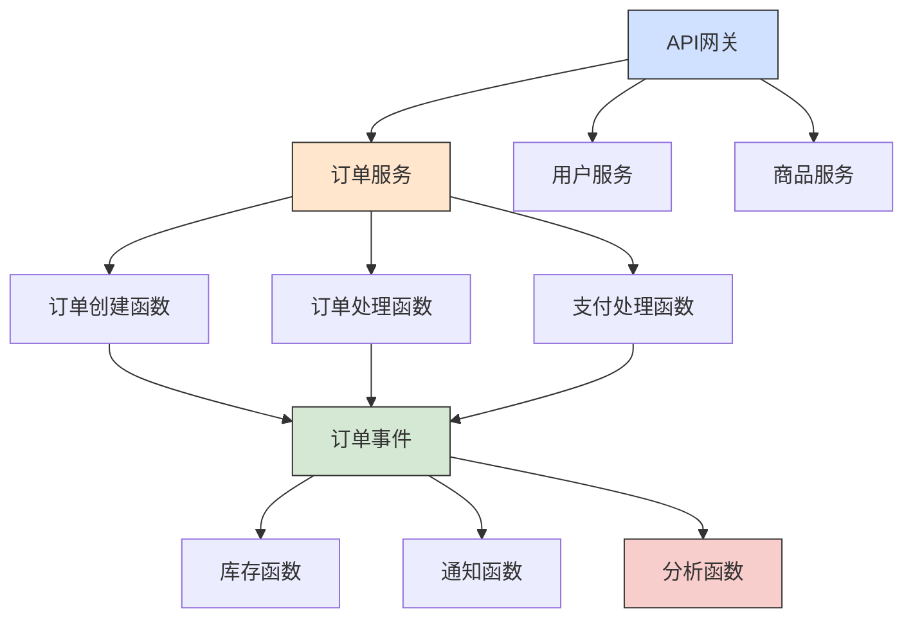

**Knative服务配置：**

```yaml:c:\project\kphub\cncf\cases\serverless-ecommerce.yaml
# 订单创建服务
apiVersion: serving.knative.dev/v1
kind: Service
metadata:
  name: order-creation
  namespace: ecommerce
spec:
  template:
    metadata:
      annotations:
        autoscaling.knative.dev/minScale: "1"
        autoscaling.knative.dev/maxScale: "10"
        autoscaling.knative.dev/target: "50"
    spec:
      containers:
      - image: example/order-service:v1.0
        env:
        - name: SERVICE_TYPE
          value: "creation"
        - name: DB_CONNECTION
          valueFrom:
            secretKeyRef:
              name: db-secrets
              key: connection-string
        resources:
          limits:
            cpu: 1
            memory: 512Mi
          requests:
            cpu: 200m
            memory: 256Mi
---
# 事件代理配置
apiVersion: eventing.knative.dev/v1
kind: Broker
metadata:
  name: order-events
  namespace: ecommerce
---
# 订单创建事件源
apiVersion: sources.knative.dev/v1
kind: ApiServerSource
metadata:
  name: order-creation-source
  namespace: ecommerce
spec:
  serviceAccountName: events-sa
  mode: Resource
  resources:
  - apiVersion: serving.knative.dev/v1
    kind: Service
    controller: true
  sink:
    ref:
      apiVersion: eventing.knative.dev/v1
      kind: Broker
      name: order-events
---
# 库存更新触发器
apiVersion: eventing.knative.dev/v1
kind: Trigger
metadata:
  name: inventory-update-trigger
  namespace: ecommerce
spec:
  broker: order-events
  filter:
    attributes:
      type: dev.knative.apiserver.resource.update
      source: order-creation-source
  subscriber:
    ref:
      apiVersion: serving.knative.dev/v1
      kind: Service
      name: inventory-service
```

**自动扩缩容配置：**

```yaml:c:\project\kphub\cncf\cases\serverless-scaling.yaml
# KEDA扩缩容配置
apiVersion: keda.sh/v1alpha1
kind: ScaledObject
metadata:
  name: order-processor-scaler
  namespace: ecommerce
spec:
  scaleTargetRef:
    apiVersion: apps/v1
    kind: Deployment
    name: order-processor
  pollingInterval: 15
  cooldownPeriod: 30
  minReplicaCount: 0
  maxReplicaCount: 20
  triggers:
  - type: kafka
    metadata:
      bootstrapServers: kafka-broker.kafka:9092
      consumerGroup: order-processor-group
      topic: orders
      lagThreshold: "10"
---
# Dapr集成配置
apiVersion: dapr.io/v1alpha1
kind: Component
metadata:
  name: order-state
  namespace: ecommerce
spec:
  type: state.redis
  version: v1
  metadata:
  - name: redisHost
    value: redis-master.redis:6379
  - name: redisPassword
    secretKeyRef:
      name: redis-secrets
      key: redis-password
---
apiVersion: dapr.io/v1alpha1
kind: Component
metadata:
  name: order-pubsub
  namespace: ecommerce
spec:
  type: pubsub.kafka
  version: v1
  metadata:
  - name: brokers
    value: kafka-broker.kafka:9092
  - name: consumerID
    value: order-processor
  - name: authRequired
    value: "false"
```

**无服务器应用实践经验：**

1. **事件驱动设计**：基于事件流设计应用架构
2. **状态管理策略**：处理无服务器环境中的状态管理挑战
3. **冷启动优化**：减少函数冷启动延迟的技术
4. **成本监控**：建立函数调用和资源使用的成本监控
5. **测试策略**：针对事件驱动架构的测试方法

### 7.4 多云部署最佳实践

**多云Kubernetes管理架构：**

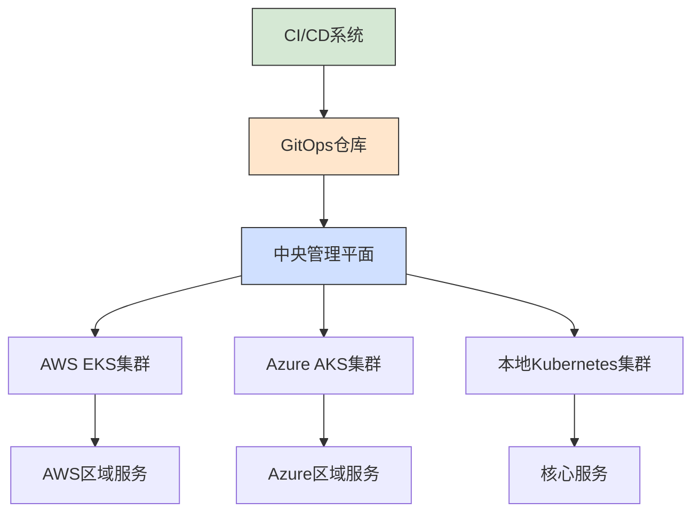

**Cluster API配置：**

```yaml:c:\project\kphub\cncf\cases\multi-cloud.yaml
# AWS集群配置
apiVersion: cluster.x-k8s.io/v1beta1
kind: Cluster
metadata:
  name: aws-cluster
  namespace: clusters
spec:
  clusterNetwork:
    pods:
      cidrBlocks: ["192.168.0.0/16"]
    services:
      cidrBlocks: ["10.96.0.0/12"]
  controlPlaneRef:
    apiVersion: controlplane.cluster.x-k8s.io/v1beta1
    kind: KubeadmControlPlane
    name: aws-control-plane
  infrastructureRef:
    apiVersion: infrastructure.cluster.x-k8s.io/v1beta1
    kind: AWSCluster
    name: aws-cluster
---
# Azure集群配置
apiVersion: cluster.x-k8s.io/v1beta1
kind: Cluster
metadata:
  name: azure-cluster
  namespace: clusters
spec:
  clusterNetwork:
    pods:
      cidrBlocks: ["192.168.0.0/16"]
    services:
      cidrBlocks: ["10.96.0.0/12"]
  controlPlaneRef:
    apiVersion: controlplane.cluster.x-k8s.io/v1beta1
    kind: KubeadmControlPlane
    name: azure-control-plane
  infrastructureRef:
    apiVersion: infrastructure.cluster.x-k8s.io/v1beta1
    kind: AzureCluster
    name: azure-cluster
```

**多云资源管理：**

```yaml:c:\project\kphub\cncf\cases\crossplane-resources.yaml
# Crossplane Provider配置
apiVersion: pkg.crossplane.io/v1
kind: Provider
metadata:
  name: provider-aws
spec:
  package: crossplane/provider-aws:v0.30.0
---
apiVersion: pkg.crossplane.io/v1
kind: Provider
metadata:
  name: provider-azure
spec:
  package: crossplane/provider-azure:v0.19.0
---
# AWS S3存储桶配置
apiVersion: s3.aws.crossplane.io/v1beta1
kind: Bucket
metadata:
  name: app-assets
spec:
  forProvider:
    region: us-west-2
    acl: private
    locationConstraint: us-west-2
    serverSideEncryptionConfiguration:
      rules:
        - applyServerSideEncryptionByDefault:
            sseAlgorithm: AES256
  providerConfigRef:
    name: aws-provider
---
# Azure存储账户配置
apiVersion: storage.azure.crossplane.io/v1alpha3
kind: Account
metadata:
  name: appstorageaccount
spec:
  forProvider:
    resourceGroupName: app-resources
    location: eastus
    kind: StorageV2
    tier: Standard
    replicationType: LRS
    enableHttpsTrafficOnly: true
  providerConfigRef:
    name: azure-provider
```

**多云GitOps配置：**

```yaml:c:\project\kphub\cncf\cases\multi-cloud-gitops.yaml
# Flux多集群配置
apiVersion: source.toolkit.fluxcd.io/v1beta2
kind: GitRepository
metadata:
  name: app-configs
  namespace: flux-system
spec:
  interval: 1m
  url: https://github.com/example/app-configs
  ref:
    branch: main
---
apiVersion: kustomize.toolkit.fluxcd.io/v1beta2
kind: Kustomization
metadata:
  name: aws-apps
  namespace: flux-system
spec:
  interval: 10m
  path: ./clusters/aws
  prune: true
  sourceRef:
    kind: GitRepository
    name: app-configs
  kubeConfig:
    secretRef:
      name: aws-kubeconfig
      key: kubeconfig
---
apiVersion: kustomize.toolkit.fluxcd.io/v1beta2
kind: Kustomization
metadata:
  name: azure-apps
  namespace: flux-system
spec:
  interval: 10m
  path: ./clusters/azure
  prune: true
  sourceRef:
    kind: GitRepository
    name: app-configs
  kubeConfig:
    secretRef:
      name: azure-kubeconfig
      key: kubeconfig
```

**多云部署最佳实践：**

1. **抽象基础设施**：使用Crossplane等工具抽象云提供商差异
2. **统一配置管理**：通过GitOps实现多云配置一致性
3. **服务网格联邦**：使用Istio多集群功能实现跨云服务发现
4. **多云CI/CD**：建立统一的CI/CD流水线支持多云部署
5. **灾备策略**：实施跨云灾备和故障转移机制

## 8. 总结与展望

CNCF技术全景图提供了丰富的云原生工具和实践，本文从实践角度详细介绍了如何在实际项目中应用这些技术。

### 8.1 实施路线图

对于组织而言，采用CNCF技术栈应遵循渐进式路线图：

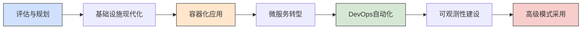

1. **评估与规划**：
   - 评估现有应用和基础设施
   - 确定业务目标和技术需求
   - 制定云原生转型路线图

2. **基础设施现代化**：
   - 部署Kubernetes集群
   - 实施基础网络和存储解决方案
   - 建立基本安全控制

3. **容器化应用**：
   - 将现有应用容器化
   - 实施容器镜像管理和安全扫描
   - 建立基本CI/CD流水线

4. **微服务转型**：
   - 拆分关键业务服务
   - 实施服务网格
   - 采用API网关和服务发现

5. **DevOps自动化**：
   - 实施GitOps工作流
   - 自动化测试和部署
   - 建立基础设施即代码实践

6. **可观测性建设**：
   - 部署监控、日志和追踪系统
   - 建立告警和事件响应机制
   - 实施SLO/SLI监控

7. **高级模式采用**：
   - 实施多集群和混合云管理
   - 采用无服务器和事件驱动架构
   - 实施高级安全控制和策略

### 8.2 关键成功因素

成功实施CNCF技术栈的关键因素包括：

1. **领导层支持**：确保高层理解云原生转型的价值和挑战
2. **团队技能培养**：投资团队培训和认证
3. **渐进式实施**：避免大爆炸式转型，采用增量方法
4. **文化转变**：培养DevOps文化和持续学习心态
5. **技术债务管理**：平衡创新与技术债务偿还
6. **社区参与**：积极参与开源社区，获取最新实践

### 8.3 未来趋势展望

CNCF生态系统持续快速发展，未来趋势包括：

1. **平台工程崛起**：内部开发者平台成为云原生实践的核心
2. **多集群管理成熟**：跨云和混合环境的统一管理平面
3. **安全左移与供应链安全**：从开发初期就融入安全实践
4. **AI/ML与云原生融合**：机器学习工作负载的云原生化
5. **边缘计算标准化**：边缘计算模式和实践的标准化
6. **可观测性高级模式**：基于OpenTelemetry的统一可观测性

CNCF技术全景图实践是一个持续演进的过程，组织应保持对新技术和实践的关注，同时确保技术选择与业务目标紧密对齐。通过系统化的方法论和渐进式实施，可以充分发挥云原生技术的优势，实现业务敏捷性、可靠性和创新能力的提升。