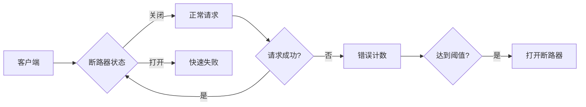

# 云原生应用设计模式  

## 1. 弹性设计模式  

### 1.1 断路器模式  


### 1.2 重试模式实现  
```yaml:c:\project\kphub\patterns\retry-config.yaml
retry:
  maxAttempts: 3
  backoff:
    initialInterval: 1s
    multiplier: 2
    maxInterval: 10s
  retryableExceptions:
    - java.net.ConnectException
    - java.net.SocketTimeoutException
```

## 2. 分布式数据管理  

### 2.1 Saga事务模式  
```java:c:\project\kphub\patterns\saga\OrderSaga.java
public class OrderSaga {
    @SagaAction(compensationMethod = "cancelPayment")
    public void makePayment(PaymentRequest request) {
        paymentService.charge(request);
    }
    
    public void cancelPayment(PaymentRequest request) {
        paymentService.refund(request);
    }
}
```

### 2.2 CQRS实现方案  
```yaml:c:\project\kphub\patterns\cqrs\deployment.yaml
apiVersion: apps/v1
kind: Deployment
metadata:
  name: query-service
spec:
  replicas: 3
  template:
    spec:
      containers:
      - name: query
        image: query-service:1.0
        ports:
        - containerPort: 8080
---
apiVersion: apps/v1
kind: Deployment
metadata:
  name: command-service
spec:
  replicas: 2  
  template:
    spec:
      containers:
      - name: command
        image: command-service:1.0
        ports:
        - containerPort: 8081
```

## 3. 服务通信模式  

### 3.1 服务网格模式  
```yaml:c:\project\kphub\patterns\istio\virtualservice.yaml
apiVersion: networking.istio.io/v1alpha3
kind: VirtualService
metadata:
  name: product-vs
spec:
  hosts:
  - product-service
  http:
  - route:
    - destination:
        host: product-service
        subset: v1
      weight: 90
    - destination:
        host: product-service  
        subset: v2
      weight: 10
```

### 3.2 异步消息模式  
```java:c:\project\kphub\patterns\messaging\OrderListener.java
@KafkaListener(topics = "orders")
public void handleOrder(OrderEvent event) {
    inventoryService.reserveStock(event);
    paymentService.processPayment(event); 
}
```

## 4. 配置管理  

### 4.1 配置热更新  
```yaml:c:\project\kphub\patterns\config\configmap.yaml
apiVersion: v1
kind: ConfigMap
metadata:
  name: app-config
  annotations:
    config.hash: {{ sha256 .Values.config }}
data:
  application.yaml: |
    server:
      port: 8080
    feature:
      newCheckout: true
```

### 4.2 配置版本控制  
```text
config/
├── dev/
│   ├── application.yaml
│   └── feature-flags.yaml
├── staging/
│   ├── application.yaml
│   └── feature-flags.yaml
└── prod/
    ├── application.yaml
    └── feature-flags.yaml
```

## 5. 可观测性模式  

### 5.1 分布式追踪  
```java:c:\project\kphub\patterns\tracing\OrderController.java
@GetMapping("/orders/{id}")
public Order getOrder(@PathVariable String id) {
    Span span = tracer.spanBuilder("getOrder").startSpan();
    try (Scope scope = span.makeCurrent()) {
        return orderService.findById(id);
    } finally {
        span.end();
    }
}
```

### 5.2 健康检查  
```yaml:c:\project\kphub\patterns\health\deployment.yaml
livenessProbe:
  httpGet:
    path: /actuator/health/liveness
    port: 8080
  initialDelaySeconds: 30
  periodSeconds: 10
readinessProbe:  
  httpGet:
    path: /actuator/health/readiness
    port: 8080
  initialDelaySeconds: 5
  periodSeconds: 5
```

## 6. 安全模式  

### 6.1 零信任安全  
```yaml:c:\project\kphub\patterns\security\network-policy.yaml
apiVersion: networking.k8s.io/v1
kind: NetworkPolicy
metadata:
  name: db-policy
spec:
  podSelector:
    matchLabels:
      app: mysql
  policyTypes:
  - Ingress
  ingress:
  - from:
    - podSelector:
        matchLabels:
          app: order-service
    ports:
    - protocol: TCP
      port: 3306
```

### 6.2 密钥轮换  
```powershell
# 自动轮换TLS证书
kubectl create secret tls app-tls --cert=new.crt --key=new.key --dry-run=client -o yaml | kubectl apply -f -
kubectl rollout restart deployment/app
```

云原生设计模式应根据业务场景组合使用，生产环境建议优先实现弹性模式和可观测性模式。关键业务事务需采用Saga模式保证数据一致性，所有服务通信应配置适当的超时和重试策略。安全模式需贯穿整个应用生命周期，配置管理应实现版本控制和审计跟踪。