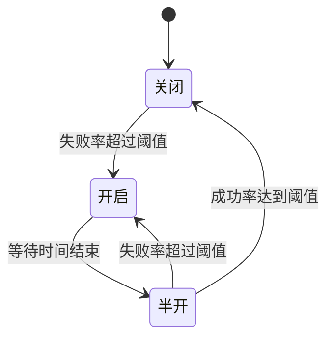
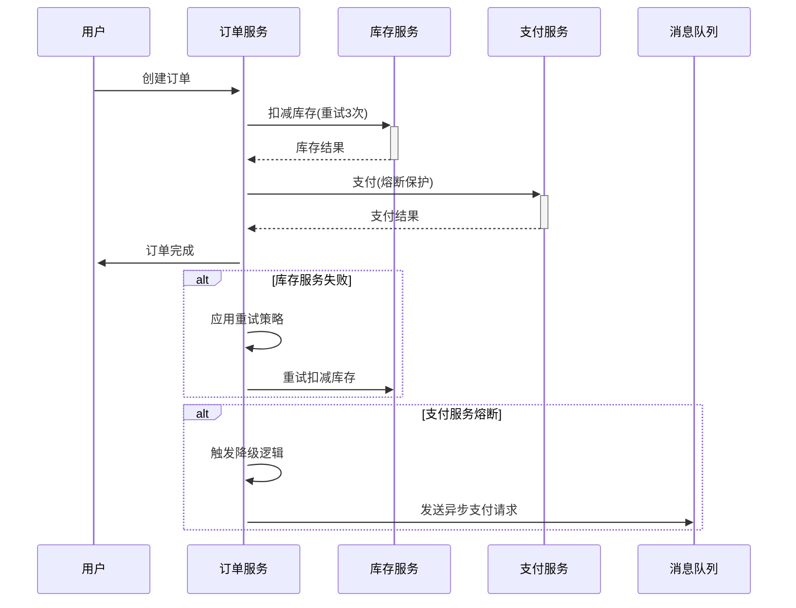

# 云原生应用设计模式实践  

云原生应用设计模式是一系列解决分布式系统常见问题的架构方案，这些模式帮助开发者构建更具弹性、可扩展性和可维护性的应用。本文将详细介绍几种核心设计模式的实践方法，包括边车模式、大使模式、断路器模式和重试模式等，并通过实际案例展示它们的应用场景。

## 1. 边车模式实现  

边车模式（Sidecar Pattern）是一种将应用功能分解为单独容器的模式，主容器专注于核心业务逻辑，而边车容器则处理日志收集、监控、代理、安全等辅助功能。

### 1.1 日志收集边车  

日志收集是边车模式的典型应用场景。主应用容器将日志写入共享卷，边车容器负责收集和转发这些日志。

```yaml:c:\project\kphub\patterns\sidecar\log-sidecar.yaml
apiVersion: v1
kind: Pod
metadata:
  name: app-with-logger
  labels:
    app: web-application
spec:
  containers:
  - name: app
    image: my-app:1.0
    ports:
    - containerPort: 8080
    volumeMounts:
    - name: log-volume
      mountPath: /var/log/app
    resources:
      limits:
        memory: "256Mi"
        cpu: "500m"
      requests:
        memory: "128Mi"
        cpu: "100m"
  - name: log-agent
    image: fluentd:latest
    volumeMounts:
    - name: log-volume
      mountPath: /var/log/app
      readOnly: true  # 只读访问日志
    - name: config-volume
      mountPath: /etc/fluentd
    resources:
      limits:
        memory: "200Mi"
        cpu: "200m"
      requests:
        memory: "100Mi"
        cpu: "100m"
  volumes:
  - name: log-volume
    emptyDir: {}  # Pod内共享的临时卷
  - name: config-volume
    configMap:
      name: fluentd-config
```

边车容器的Fluentd配置示例：

```xml:c:\project\kphub\patterns\sidecar\fluentd-config.xml
<source>
  @type tail
  path /var/log/app/*.log
  pos_file /var/log/app/fluentd.pos
  tag app.*
  <parse>
    @type json
  </parse>
</source>

<match app.**>
  @type elasticsearch
  host elasticsearch-service
  port 9200
  logstash_format true
  logstash_prefix app-logs
  flush_interval 5s
</match>
```

**工作原理：**

1. 主应用容器将日志写入共享卷（`/var/log/app`）
2. Fluentd边车容器监控该目录中的日志文件
3. 当检测到新日志时，Fluentd解析并转发到Elasticsearch
4. 两个容器共享Pod的生命周期，但各自关注不同职责

**优势：**
- 主应用无需集成日志转发逻辑
- 日志收集组件可独立升级
- 不同应用可复用相同的日志收集配置

### 1.2 网络代理边车  

网络代理边车用于处理服务间通信的横切关注点，如TLS终止、认证、限流等。

```yaml:c:\project\kphub\patterns\sidecar\proxy-sidecar.yaml
apiVersion: apps/v1
kind: Deployment
metadata:
  name: web-app
  labels:
    app: web-app
spec:
  replicas: 3
  selector:
    matchLabels:
      app: web-app
  template:
    metadata:
      labels:
        app: web-app
    spec:
      containers:
      - name: web
        image: nginx:alpine
        ports:
        - containerPort: 80
        volumeMounts:
        - name: web-content
          mountPath: /usr/share/nginx/html
        resources:
          limits:
            memory: "128Mi"
            cpu: "300m"
          requests:
            memory: "64Mi"
            cpu: "100m"
      - name: proxy
        image: envoyproxy/envoy:v1.20
        ports:
        - containerPort: 8080
          name: proxy
        volumeMounts:
        - name: envoy-config
          mountPath: /etc/envoy
        resources:
          limits:
            memory: "256Mi"
            cpu: "300m"
          requests:
            memory: "128Mi"
            cpu: "100m"
      volumes:
      - name: web-content
        configMap:
          name: web-content
      - name: envoy-config
        configMap:
          name: envoy-config
```

Envoy代理配置示例：

```yaml:c:\project\kphub\patterns\sidecar\envoy-config.yaml
admin:
  access_log_path: /tmp/admin_access.log
  address:
    socket_address:
      protocol: TCP
      address: 0.0.0.0
      port_value: 9901

static_resources:
  listeners:
  - name: listener_0
    address:
      socket_address:
        protocol: TCP
        address: 0.0.0.0
        port_value: 8080
    filter_chains:
    - filters:
      - name: envoy.filters.network.http_connection_manager
        typed_config:
          "@type": type.googleapis.com/envoy.extensions.filters.network.http_connection_manager.v3.HttpConnectionManager
          stat_prefix: ingress_http
          route_config:
            name: local_route
            virtual_hosts:
            - name: local_service
              domains: ["*"]
              routes:
              - match:
                  prefix: "/"
                route:
                  cluster: local_service
                  timeout: 0.5s
                  retry_policy:
                    retry_on: connect-failure,refused-stream,unavailable
                    num_retries: 3
                    retry_host_predicate:
                    - name: envoy.retry_host_predicates.previous_hosts
          http_filters:
          - name: envoy.filters.http.router
            typed_config:
              "@type": type.googleapis.com/envoy.extensions.filters.http.router.v3.Router
  
  clusters:
  - name: local_service
    connect_timeout: 0.25s
    type: STATIC
    lb_policy: ROUND_ROBIN
    load_assignment:
      cluster_name: local_service
      endpoints:
      - lb_endpoints:
        - endpoint:
            address:
              socket_address:
                address: 127.0.0.1
                port_value: 80
```

**工作原理：**

1. 外部流量首先到达Envoy代理（端口8080）
2. Envoy处理横切关注点（认证、限流、重试等）
3. 处理后的请求转发到同Pod内的Web应用（端口80）
4. 响应通过相同路径返回

**应用场景：**
- API网关功能
- 服务网格数据平面
- 安全代理
- 流量监控与分析

## 2. 大使模式应用  

大使模式（Ambassador Pattern）是边车模式的特殊形式，专注于代表应用与外部服务通信。大使容器封装访问外部服务的复杂性，提供统一接口。

### 2.1 数据库连接代理  

数据库连接代理是大使模式的典型应用，它可以处理连接池管理、读写分离、故障转移等功能。

```java:c:\project\kphub\patterns\ambassador\DbProxy.java
package com.example.ambassador;

import org.springframework.beans.factory.annotation.Autowired;
import org.springframework.web.bind.annotation.GetMapping;
import org.springframework.web.bind.annotation.PostMapping;
import org.springframework.web.bind.annotation.RequestParam;
import org.springframework.web.bind.annotation.RestController;
import org.springframework.jdbc.core.JdbcTemplate;
import org.slf4j.Logger;
import org.slf4j.LoggerFactory;

import javax.sql.DataSource;
import java.util.List;
import java.util.Map;
import java.util.concurrent.ConcurrentHashMap;
import java.util.concurrent.atomic.AtomicInteger;

@RestController
public class DbProxy {
    private static final Logger logger = LoggerFactory.getLogger(DbProxy.class);
    private final JdbcTemplate jdbcTemplate;
    private final Map<String, AtomicInteger> queryStats = new ConcurrentHashMap<>();
    
    @Autowired
    public DbProxy(DataSource dataSource) {
        this.jdbcTemplate = new JdbcTemplate(dataSource);
    }
    
    @GetMapping("/query")
    public List<Map<String, Object>> query(@RequestParam String sql) {
        // 记录查询统计
        queryStats.computeIfAbsent(sql, k -> new AtomicInteger(0)).incrementAndGet();
        
        // SQL注入防护
        if (containsSqlInjection(sql)) {
            logger.warn("Potential SQL injection attempt: {}", sql);
            throw new SecurityException("Invalid SQL query");
        }
        
        // 审计日志
        logger.info("Executing query: {}", sql);
        
        // 判断读写操作，实现读写分离
        boolean isReadOperation = isReadOperation(sql);
        
        try {
            if (isReadOperation) {
                // 读操作路由到只读副本
                return executeOnReadReplica(sql);
            } else {
                // 写操作路由到主库
                return executeOnMaster(sql);
            }
        } catch (Exception e) {
            logger.error("Query execution failed: {}", e.getMessage(), e);
            throw new RuntimeException("Database operation failed", e);
        }
    }
    
    @GetMapping("/stats")
    public Map<String, Integer> getQueryStats() {
        Map<String, Integer> stats = new ConcurrentHashMap<>();
        queryStats.forEach((key, value) -> stats.put(key, value.get()));
        return stats;
    }
    
    private List<Map<String, Object>> executeOnReadReplica(String sql) {
        // 实际项目中可能会有多个只读副本，这里简化处理
        logger.info("Routing to read replica");
        return jdbcTemplate.queryForList(sql);
    }
    
    private List<Map<String, Object>> executeOnMaster(String sql) {
        logger.info("Routing to master database");
        return jdbcTemplate.queryForList(sql);
    }
    
    private boolean isReadOperation(String sql) {
        String normalizedSql = sql.trim().toLowerCase();
        return normalizedSql.startsWith("select") || normalizedSql.startsWith("show");
    }
    
    private boolean containsSqlInjection(String sql) {
        // 简单的SQL注入检测，实际应用中应使用更复杂的检测逻辑
        String normalized = sql.toLowerCase();
        return normalized.contains("--") || 
               normalized.contains(";") || 
               normalized.contains("drop table") ||
               normalized.contains("drop database");
    }
}
```

数据库代理配置：

```yaml:c:\project\kphub\patterns\ambassador\db-proxy-deployment.yaml
apiVersion: apps/v1
kind: Deployment
metadata:
  name: db-proxy
spec:
  replicas: 2
  selector:
    matchLabels:
      app: db-proxy
  template:
    metadata:
      labels:
        app: db-proxy
    spec:
      containers:
      - name: db-proxy
        image: db-proxy:1.0
        ports:
        - containerPort: 8080
        env:
        - name: MASTER_DB_URL
          valueFrom:
            secretKeyRef:
              name: db-credentials
              key: master-url
        - name: READ_REPLICA_URL
          valueFrom:
            secretKeyRef:
              name: db-credentials
              key: replica-url
        - name: DB_USERNAME
          valueFrom:
            secretKeyRef:
              name: db-credentials
              key: username
        - name: DB_PASSWORD
          valueFrom:
            secretKeyRef:
              name: db-credentials
              key: password
        resources:
          limits:
            memory: "512Mi"
            cpu: "500m"
          requests:
            memory: "256Mi"
            cpu: "200m"
        livenessProbe:
          httpGet:
            path: /health
            port: 8080
          initialDelaySeconds: 30
          periodSeconds: 10
```

**大使模式优势：**
- 封装数据库访问复杂性
- 集中管理连接池和安全策略
- 实现透明的读写分离
- 提供统一的监控和审计点

### 2.2 服务熔断大使  

服务熔断大使用于保护外部服务免受过载，并在服务不可用时提供优雅降级。

```yaml:c:\project\kphub\patterns\ambassador\circuit-breaker.yaml
apiVersion: networking.istio.io/v1alpha3
kind: DestinationRule
metadata:
  name: payment-dr
spec:
  host: payment-service
  trafficPolicy:
    connectionPool:
      tcp: 
        maxConnections: 100  # 最大TCP连接数
        connectTimeout: 3s   # 连接超时
      http:
        http2MaxRequests: 1000  # HTTP/2最大请求数
        maxRequestsPerConnection: 10  # 每连接最大请求数
        maxRetries: 3  # 最大重试次数
    outlierDetection:
      consecutiveErrors: 5  # 连续错误阈值
      interval: 1s  # 检测间隔
      baseEjectionTime: 30s  # 最小驱逐时间
      maxEjectionPercent: 50  # 最大驱逐百分比
      minHealthPercent: 40  # 健康实例最小百分比
```

使用Envoy实现的熔断大使：

```yaml:c:\project\kphub\patterns\ambassador\envoy-circuit-breaker.yaml
static_resources:
  clusters:
  - name: payment_service
    connect_timeout: 0.25s
    type: STRICT_DNS
    dns_lookup_family: V4_ONLY
    lb_policy: ROUND_ROBIN
    load_assignment:
      cluster_name: payment_service
      endpoints:
      - lb_endpoints:
        - endpoint:
            address:
              socket_address:
                address: payment-service
                port_value: 8080
    circuit_breakers:
      thresholds:
      - priority: DEFAULT
        max_connections: 100
        max_pending_requests: 100
        max_requests: 1000
        max_retries: 3
        track_remaining: true
      - priority: HIGH
        max_connections: 200
        max_pending_requests: 200
        max_requests: 2000
        max_retries: 5
    outlier_detection:
      consecutive_5xx: 5
      interval: 1s
      base_ejection_time: 30s
      max_ejection_percent: 50
      enforcing_consecutive_5xx: 100
      enforcing_success_rate: 100
      success_rate_minimum_hosts: 5
      success_rate_request_volume: 10
      success_rate_stdev_factor: 1900
```

**工作原理：**
1. 大使容器接收所有对外部服务的请求
2. 实现熔断逻辑，监控服务健康状态
3. 当检测到服务异常时，触发熔断
4. 熔断期间，快速失败或返回降级响应

## 3. 断路器实战  

断路器模式（Circuit Breaker Pattern）是一种防止级联故障的保护机制，当检测到服务异常时，断路器会"断开"，阻止更多请求到达故障服务。

### 3.1 Spring Cloud实现  

Spring Cloud提供了声明式断路器实现，通过注解即可为方法添加熔断保护。

```java:c:\project\kphub\patterns\circuit-breaker\PaymentService.java
package com.example.payment;

import io.github.resilience4j.circuitbreaker.annotation.CircuitBreaker;
import io.github.resilience4j.retry.annotation.Retry;
import io.github.resilience4j.bulkhead.annotation.Bulkhead;
import io.github.resilience4j.timelimiter.annotation.TimeLimiter;

import org.slf4j.Logger;
import org.slf4j.LoggerFactory;
import org.springframework.beans.factory.annotation.Autowired;
import org.springframework.stereotype.Service;

import java.util.concurrent.CompletableFuture;
import java.util.concurrent.TimeoutException;

@Service
public class PaymentService {
    private static final Logger logger = LoggerFactory.getLogger(PaymentService.class);
    
    private final PaymentClient paymentClient;
    
    @Autowired
    public PaymentService(PaymentClient paymentClient) {
        this.paymentClient = paymentClient;
    }
    
    @CircuitBreaker(
        name = "paymentService",
        fallbackMethod = "fallbackPayment"
    )
    @Retry(name = "paymentRetry", fallbackMethod = "fallbackPayment")
    @Bulkhead(name = "paymentBulkhead", fallbackMethod = "fallbackPayment")
    public PaymentResult charge(Order order) {
        logger.info("Processing payment for order: {}", order.getId());
        return paymentClient.charge(order);
    }
    
    @CircuitBreaker(
        name = "paymentServiceAsync",
        fallbackMethod = "fallbackAsyncPayment"
    )
    @TimeLimiter(name = "paymentTimeLimiter")
    public CompletableFuture<PaymentResult> chargeAsync(Order order) {
        logger.info("Processing async payment for order: {}", order.getId());
        return CompletableFuture.supplyAsync(() -> paymentClient.charge(order));
    }
    
    public PaymentResult fallbackPayment(Order order, Exception e) {
        logger.warn("Payment service unavailable, using fallback for order: {}", order.getId(), e);
        
        // 记录失败事件，用于后续处理
        saveFailedPaymentForRetry(order);
        
        if (e instanceof TimeoutException) {
            return new PaymentResult("pending", "支付处理中，请稍后查询结果");
        }
        
        return new PaymentResult("fallback", "支付服务暂不可用，已将订单加入队列");
    }
    
    public CompletableFuture<PaymentResult> fallbackAsyncPayment(Order order, Exception e) {
        logger.warn("Async payment failed for order: {}", order.getId(), e);
        return CompletableFuture.completedFuture(fallbackPayment(order, e));
    }
    
    private void saveFailedPaymentForRetry(Order order) {
        // 将失败的支付请求保存到队列或数据库，供后续重试
        logger.info("Saving failed payment for later retry: {}", order.getId());
        // 实际实现可能涉及消息队列或数据库操作
    }
}
```

断路器配置：

```yaml:c:\project\kphub\patterns\circuit-breaker\application.yaml
resilience4j:
  circuitbreaker:
    instances:
      paymentService:
        registerHealthIndicator: true
        slidingWindowSize: 10
        slidingWindowType: COUNT_BASED
        minimumNumberOfCalls: 5
        failureRateThreshold: 50
        waitDurationInOpenState: 10s
        permittedNumberOfCallsInHalfOpenState: 3
        automaticTransitionFromOpenToHalfOpenEnabled: true
        recordExceptions:
          - java.io.IOException
          - java.net.ConnectException
          - org.springframework.web.client.HttpServerErrorException
      paymentServiceAsync:
        slidingWindowSize: 100
        permittedNumberOfCallsInHalfOpenState: 10
        waitDurationInOpenState: 5s
        failureRateThreshold: 30
  retry:
    instances:
      paymentRetry:
        maxAttempts: 3
        waitDuration: 1s
        retryExceptions:
          - java.io.IOException
          - java.net.ConnectException
        ignoreExceptions:
          - com.example.payment.InvalidPaymentException
  bulkhead:
    instances:
      paymentBulkhead:
        maxConcurrentCalls: 20
        maxWaitDuration: 500ms
  timelimiter:
    instances:
      paymentTimeLimiter:
        timeoutDuration: 2s
        cancelRunningFuture: true
```

**断路器状态转换：**



### 3.2 Istio熔断配置  

Istio服务网格提供了基础设施层面的熔断能力，无需修改应用代码。

```yaml:c:\project\kphub\patterns\circuit-breaker\istio-breaker.yaml
apiVersion: networking.istio.io/v1alpha3
kind: DestinationRule
metadata:
  name: inventory-dr
spec:
  host: inventory-service
  trafficPolicy:
    connectionPool:
      http:
        http1MaxPendingRequests: 100
        maxRequestsPerConnection: 10
      tcp:
        maxConnections: 100
    outlierDetection:
      consecutive5xxErrors: 3
      interval: 5s
      baseEjectionTime: 60s
      maxEjectionPercent: 50
      minHealthPercent: 40
  subsets:
  - name: v1
    labels:
      version: v1
    trafficPolicy:
      connectionPool:
        http:
          maxRequestsPerConnection: 5
  - name: v2
    labels:
      version: v2
```

Istio熔断监控配置：

```yaml:c:\project\kphub\patterns\circuit-breaker\istio-monitoring.yaml
apiVersion: telemetry.istio.io/v1alpha1
kind: Telemetry
metadata:
  name: inventory-telemetry
spec:
  metrics:
  - providers:
    - name: prometheus
    overrides:
    - match:
        metric: REQUEST_COUNT
        mode: CLIENT_AND_SERVER
      tagOverrides:
        response_code:
          value: response.code
        response_flags:
          value: response.flags
        connection_security_policy:
          value: connection.security_policy
  tracing:
  - providers:
    - name: zipkin
    randomSamplingPercentage: 50.0
```

**Istio熔断工作原理：**
1. Istio代理（Envoy）拦截所有服务间通信
2. 根据配置监控请求成功/失败率
3. 当失败率超过阈值时，将实例从负载均衡池中移除
4. 定期尝试恢复被移除的实例

## 4. 重试模式实现  

重试模式（Retry Pattern）通过自动重试临时失败的操作来提高系统弹性，特别适用于网络通信等不稳定场景。

### 4.1 Kubernetes原生重试  

Kubernetes提供了Pod重启和健康检查机制，作为应用级重试的基础保障。

```yaml:c:\project\kphub\patterns\retry\deployment.yaml
apiVersion: apps/v1
kind: Deployment
metadata:
  name: order-service
  labels:
    app: order-service
spec:
  replicas: 3
  selector:
    matchLabels:
      app: order-service
  template:
    metadata:
      labels:
        app: order-service
    spec:
      containers:
      - name: order
        image: order-service:2.1
        ports:
        - containerPort: 8080
        env:
        - name: SPRING_PROFILES_ACTIVE
          value: "production"
        - name: DB_HOST
          valueFrom:
            configMapKeyRef:
              name: order-config
              key: db_host
        resources:
          limits:
            memory: "512Mi"
            cpu: "500m"
          requests:
            memory: "256Mi"
            cpu: "200m"
        readinessProbe:
          httpGet:
            path: /actuator/health/readiness
            port: 8080
          initialDelaySeconds: 20
          periodSeconds: 10
          timeoutSeconds: 3
          successThreshold: 1
          failureThreshold: 3
        livenessProbe:
          httpGet:
            path: /actuator/health/liveness
            port: 8080
          initialDelaySeconds: 30
          periodSeconds: 15
          timeoutSeconds: 5
          failureThreshold: 3
        startupProbe:
          httpGet:
            path: /actuator/health
            port: 8080
          initialDelaySeconds: 10
          periodSeconds: 5
          failureThreshold: 12  # 允许60秒启动时间
```

**Kubernetes重试机制：**
- **Pod重启策略**：`Always`、`OnFailure`、`Never`
- **存活探针**：检测应用是否运行，失败时重启容器
- **就绪探针**：检测应用是否准备好接收流量
- **启动探针**：为启动缓慢的应用提供额外时间

### 4.2 应用层重试策略  

应用层重试策略可以更精细地控制重试行为，包括退避算法、条件判断等。

```java:c:\project\kphub\patterns\retry\InventoryClient.java
package com.example.inventory;

import org.springframework.retry.annotation.Backoff;
import org.springframework.retry.annotation.Recover;
import org.springframework.retry.annotation.Retryable;
import org.springframework.stereotype.Component;
import org.springframework.web.client.ResourceAccessException;
import org.springframework.web.client.RestClientException;
import org.springframework.web.client.HttpServerErrorException;

import java.net.SocketTimeoutException;
import java.util.concurrent.TimeoutException;

import org.slf4j.Logger;
import org.slf4j.LoggerFactory;

@Component
public class InventoryClient {
    private static final Logger logger = LoggerFactory.getLogger(InventoryClient.class);
    
    private final RestTemplateInventoryService inventoryService;
    
    public InventoryClient(RestTemplateInventoryService inventoryService) {
        this.inventoryService = inventoryService;
    }
    
    @Retryable(
        value = {
            ResourceAccessException.class,
            TimeoutException.class,
            HttpServerErrorException.class
        },
        exclude = {
            InventoryNotFoundException.class,
            InvalidRequestException.class
        },
        maxAttempts = 3,
        backoff = @Backoff(delay = 1000, multiplier = 2, maxDelay = 5000)
    )
    public InventoryResult checkStock(OrderItem item) {
        logger.info("Checking stock for item: {}, attempt: {}", 
                   item.getProductId(), 
                   RetryContext.getAttemptCount());
        
        try {
            return inventoryService.checkStock(item);
        } catch (Exception e) {
            logger.warn("Stock check failed for item: {}, error: {}", 
                       item.getProductId(), 
                       e.getMessage());
            throw e;
        }
    }
    
    @Recover
    public InventoryResult fallbackCheckStock(Exception e, OrderItem item) {
        logger.error("All retries failed for stock check of item: {}", 
                    item.getProductId(), e);
        
        // 对不同异常类型进行不同处理
        if (e instanceof TimeoutException) {
            // 超时可能意味着库存服务过载，假设有库存但无法确认
            return new InventoryResult(item.getProductId(), true, 
                                      "库存状态未知，假设可用");
        } else if (e instanceof HttpServerErrorException) {
            // 服务器错误，可能是临时问题
            return new InventoryResult(item.getProductId(), false, 
                                      "库存服务暂时不可用");
        }
        
        // 默认假设无库存，确保订单不会被错误处理
        return new InventoryResult(item.getProductId(), false, 
                                  "无法确认库存状态");
    }
    
    // 指数退避重试的手动实现示例
    public InventoryResult checkStockWithExponentialBackoff(OrderItem item) {
        int maxRetries = 5;
        long initialDelay = 100; // 毫秒
        
        for (int attempt = 0; attempt <= maxRetries; attempt++) {
            try {
                return inventoryService.checkStock(item);
            } catch (Exception e) {
                if (attempt == maxRetries || !isRetryable(e)) {
                    logger.error("Final retry attempt failed", e);
                    throw e;
                }
                
                long delay = initialDelay * (long) Math.pow(2, attempt);
                logger.warn("Retry attempt {} failed, retrying in {} ms", 
                           attempt, delay, e);
                
                try {
                    Thread.sleep(delay);
                } catch (InterruptedException ie) {
                    Thread.currentThread().interrupt();
                    throw new RuntimeException("Retry interrupted", ie);
                }
            }
        }
        
        throw new RuntimeException("Should not reach here
继续编写云原生应用设计模式实践文档：

```java:c:\project\kphub\patterns\retry\InventoryClient.java
    // 指数退避重试的手动实现示例
    public InventoryResult checkStockWithExponentialBackoff(OrderItem item) {
        int maxRetries = 5;
        long initialDelay = 100; // 毫秒
        
        for (int attempt = 0; attempt <= maxRetries; attempt++) {
            try {
                return inventoryService.checkStock(item);
            } catch (Exception e) {
                if (attempt == maxRetries || !isRetryable(e)) {
                    logger.error("Final retry attempt failed", e);
                    throw e;
                }
                
                long delay = initialDelay * (long) Math.pow(2, attempt);
                logger.warn("Retry attempt {} failed, retrying in {} ms", 
                           attempt, delay, e);
                
                try {
                    Thread.sleep(delay);
                } catch (InterruptedException ie) {
                    Thread.currentThread().interrupt();
                    throw new RuntimeException("Retry interrupted", ie);
                }
            }
        }
        
        throw new RuntimeException("Should not reach here");
    }
    
    private boolean isRetryable(Exception e) {
        return e instanceof ResourceAccessException ||
               e instanceof TimeoutException ||
               e instanceof HttpServerErrorException;
    }
}
```

**重试策略最佳实践：**

1. **区分临时性和永久性故障**：只对临时性故障进行重试
2. **使用指数退避算法**：避免重试风暴和服务过载
3. **设置最大重试次数**：防止无限重试消耗资源
4. **添加抖动（Jitter）**：在退避时间上增加随机因素，避免多个客户端同时重试
5. **记录重试日志**：便于问题排查和监控

## 5. 实战案例演示  

### 5.1 电商下单流程  

以下是一个电商系统下单流程的实现，综合应用了多种云原生设计模式。



**订单服务实现：**

```java:c:\project\kphub\patterns\case-study\OrderService.java
package com.example.order;

import io.github.resilience4j.circuitbreaker.annotation.CircuitBreaker;
import org.springframework.retry.annotation.Retryable;
import org.springframework.retry.annotation.Backoff;
import org.springframework.stereotype.Service;
import org.springframework.transaction.annotation.Transactional;

import java.util.concurrent.TimeoutException;

@Service
public class OrderService {
    private final InventoryClient inventoryClient;
    private final PaymentService paymentService;
    private final OrderRepository orderRepository;
    private final MessagePublisher messagePublisher;
    
    public OrderService(
            InventoryClient inventoryClient,
            PaymentService paymentService,
            OrderRepository orderRepository,
            MessagePublisher messagePublisher) {
        this.inventoryClient = inventoryClient;
        this.paymentService = paymentService;
        this.orderRepository = orderRepository;
        this.messagePublisher = messagePublisher;
    }
    
    @Transactional
    public OrderResult createOrder(OrderRequest request) {
        // 1. 创建订单记录
        Order order = new Order();
        order.setUserId(request.getUserId());
        order.setItems(request.getItems());
        order.setStatus(OrderStatus.PENDING);
        order = orderRepository.save(order);
        
        try {
            // 2. 检查并扣减库存
            checkAndReduceInventory(order);
            
            // 3. 处理支付
            processPayment(order);
            
            // 4. 完成订单
            order.setStatus(OrderStatus.COMPLETED);
            orderRepository.save(order);
            
            // 5. 发布订单完成事件
            messagePublisher.publishOrderCompleted(order);
            
            return new OrderResult(order.getId(), OrderStatus.COMPLETED, "订单处理成功");
        } catch (Exception e) {
            // 处理失败，回滚或补偿
            handleOrderFailure(order, e);
            throw e;
        }
    }
    
    @Retryable(
        value = {InventoryException.class, TimeoutException.class},
        maxAttempts = 3,
        backoff = @Backoff(delay = 1000, multiplier = 2)
    )
    private void checkAndReduceInventory(Order order) {
        for (OrderItem item : order.getItems()) {
            InventoryResult result = inventoryClient.reduceStock(item);
            if (!result.isSuccess()) {
                throw new InventoryException("库存不足: " + item.getProductId());
            }
        }
    }
    
    @CircuitBreaker(
        name = "paymentService",
        fallbackMethod = "fallbackPayment"
    )
    private PaymentResult processPayment(Order order) {
        return paymentService.charge(order);
    }
    
    private PaymentResult fallbackPayment(Order order, Exception e) {
        // 降级处理 - 将支付请求放入队列异步处理
        order.setStatus(OrderStatus.PAYMENT_PENDING);
        orderRepository.save(order);
        
        // 发布异步支付事件
        messagePublisher.publishAsyncPaymentRequest(order);
        
        return new PaymentResult("async", "支付请求已加入队列，稍后处理");
    }
    
    private void handleOrderFailure(Order order, Exception e) {
        if (e instanceof InventoryException) {
            order.setStatus(OrderStatus.INVENTORY_FAILED);
        } else if (e instanceof PaymentException) {
            order.setStatus(OrderStatus.PAYMENT_FAILED);
        } else {
            order.setStatus(OrderStatus.FAILED);
        }
        
        orderRepository.save(order);
        messagePublisher.publishOrderFailed(order, e.getMessage());
    }
}
```

**Kubernetes部署配置：**

```yaml:c:\project\kphub\patterns\case-study\order-service.yaml
apiVersion: apps/v1
kind: Deployment
metadata:
  name: order-service
  labels:
    app: order-service
spec:
  replicas: 3
  selector:
    matchLabels:
      app: order-service
  template:
    metadata:
      labels:
        app: order-service
    spec:
      containers:
      - name: order-service
        image: example/order-service:1.0
        ports:
        - containerPort: 8080
        env:
        - name: SPRING_PROFILES_ACTIVE
          value: "production"
        - name: INVENTORY_SERVICE_URL
          value: "http://inventory-service:8080"
        - name: PAYMENT_SERVICE_URL
          value: "http://payment-service:8080"
        - name: KAFKA_BOOTSTRAP_SERVERS
          value: "kafka:9092"
        resources:
          limits:
            memory: "512Mi"
            cpu: "500m"
          requests:
            memory: "256Mi"
            cpu: "200m"
        livenessProbe:
          httpGet:
            path: /actuator/health/liveness
            port: 8080
          initialDelaySeconds: 30
          periodSeconds: 15
        readinessProbe:
          httpGet:
            path: /actuator/health/readiness
            port: 8080
          initialDelaySeconds: 20
          periodSeconds: 10
```

### 5.2 配置热更新演示  

配置热更新是云原生应用的重要能力，允许在不重启应用的情况下更新配置。

**ConfigMap定义：**

```yaml:c:\project\kphub\patterns\config\configmap-v1.yaml
apiVersion: v1
kind: ConfigMap
metadata:
  name: order-service-config
  namespace: default
data:
  application.properties: |
    # 应用配置
    app.name=order-service
    app.description=订单处理服务
    
    # 功能开关
    feature.async-inventory=false
    feature.payment-retry=true
    
    # 性能配置
    performance.thread-pool-size=50
    performance.max-connections=100
    
    # 业务规则
    business.max-order-items=20
    business.min-order-amount=10
```

**更新后的ConfigMap：**

```yaml:c:\project\kphub\patterns\config\configmap-v2.yaml
apiVersion: v1
kind: ConfigMap
metadata:
  name: order-service-config
  namespace: default
data:
  application.properties: |
    # 应用配置
    app.name=order-service
    app.description=订单处理服务 - 优化版
    
    # 功能开关
    feature.async-inventory=true
    feature.payment-retry=true
    feature.new-promotion-engine=true
    
    # 性能配置
    performance.thread-pool-size=100
    performance.max-connections=200
    performance.cache-size=1000
    
    # 业务规则
    business.max-order-items=50
    business.min-order-amount=5
    business.enable-vip-discount=true
```

**配置热更新实现：**

```java:c:\project\kphub\patterns\config\ConfigurationManager.java
package com.example.config;

import org.springframework.beans.factory.annotation.Autowired;
import org.springframework.cloud.context.config.annotation.RefreshScope;
import org.springframework.context.annotation.Configuration;
import org.springframework.scheduling.annotation.Scheduled;
import org.springframework.stereotype.Component;

import java.io.File;
import java.nio.file.Files;
import java.nio.file.Path;
import java.nio.file.attribute.FileTime;
import java.util.HashMap;
import java.util.Map;
import java.util.Properties;
import java.util.concurrent.ConcurrentHashMap;

@Component
@RefreshScope
public class ConfigurationManager {
    private final String configPath;
    private final Map<String, FileTime> lastModifiedTimes = new ConcurrentHashMap<>();
    private final Map<String, Properties> configCache = new ConcurrentHashMap<>();
    private final ConfigChangeListener changeListener;
    
    @Autowired
    public ConfigurationManager(ConfigChangeListener changeListener) {
        this.configPath = System.getenv().getOrDefault("CONFIG_PATH", "/etc/config");
        this.changeListener = changeListener;
        loadAllConfigurations();
    }
    
    @Scheduled(fixedDelay = 30000) // 每30秒检查一次
    public void checkConfigChanges() {
        try {
            File configDir = new File(configPath);
            if (!configDir.exists() || !configDir.isDirectory()) {
                return;
            }
            
            for (File file : configDir.listFiles()) {
                if (!file.isFile() || !file.getName().endsWith(".properties")) {
                    continue;
                }
                
                Path path = file.toPath();
                FileTime lastModified = Files.getLastModifiedTime(path);
                String fileName = file.getName();
                
                if (!lastModifiedTimes.containsKey(fileName) || 
                    lastModified.compareTo(lastModifiedTimes.get(fileName)) > 0) {
                    
                    // 配置文件已更新
                    Properties oldProps = configCache.get(fileName);
                    Properties newProps = loadProperties(file);
                    
                    // 更新缓存
                    configCache.put(fileName, newProps);
                    lastModifiedTimes.put(fileName, lastModified);
                    
                    // 通知变更
                    if (oldProps != null) {
                        Map<String, String> changes = findChanges(oldProps, newProps);
                        if (!changes.isEmpty()) {
                            changeListener.onConfigChanged(fileName, changes);
                        }
                    }
                }
            }
        } catch (Exception e) {
            // 处理异常
        }
    }
    
    private void loadAllConfigurations() {
        try {
            File configDir = new File(configPath);
            if (!configDir.exists() || !configDir.isDirectory()) {
                return;
            }
            
            for (File file : configDir.listFiles()) {
                if (!file.isFile() || !file.getName().endsWith(".properties")) {
                    continue;
                }
                
                String fileName = file.getName();
                Properties props = loadProperties(file);
                configCache.put(fileName, props);
                lastModifiedTimes.put(fileName, Files.getLastModifiedTime(file.toPath()));
            }
        } catch (Exception e) {
            // 处理异常
        }
    }
    
    private Properties loadProperties(File file) throws Exception {
        Properties props = new Properties();
        try (var is = Files.newInputStream(file.toPath())) {
            props.load(is);
        }
        return props;
    }
    
    private Map<String, String> findChanges(Properties oldProps, Properties newProps) {
        Map<String, String> changes = new HashMap<>();
        
        // 检查新增和修改的属性
        for (String key : newProps.stringPropertyNames()) {
            String newValue = newProps.getProperty(key);
            if (!oldProps.containsKey(key)) {
                changes.put(key, newValue); // 新增
            } else {
                String oldValue = oldProps.getProperty(key);
                if (!oldValue.equals(newValue)) {
                    changes.put(key, newValue); // 修改
                }
            }
        }
        
        // 检查删除的属性
        for (String key : oldProps.stringPropertyNames()) {
            if (!newProps.containsKey(key)) {
                changes.put(key, null); // 删除
            }
        }
        
        return changes;
    }
    
    public String getProperty(String fileName, String key, String defaultValue) {
        Properties props = configCache.get(fileName);
        if (props == null) {
            return defaultValue;
        }
        return props.getProperty(key, defaultValue);
    }
}
```

**配置更新命令：**

```powershell
# 更新ConfigMap
kubectl apply -f c:\project\kphub\patterns\config\configmap-v2.yaml

# 触发Pod滚动更新
kubectl rollout restart deployment/order-service
```

**配置热更新最佳实践：**
1. **使用Kubernetes ConfigMap**：存储应用配置
2. **实现配置监听机制**：检测配置变更并重新加载
3. **采用分层配置策略**：区分不同环境和应用组件
4. **实现优雅降级**：配置加载失败时使用默认值
5. **审计配置变更**：记录所有配置变更以便追踪

## 6. 高级模式组合应用

在实际应用中，多种云原生设计模式通常会组合使用，形成更强大的解决方案。

### 6.1 弹性微服务架构

```yaml:c:\project\kphub\patterns\advanced\resilient-service.yaml
apiVersion: apps/v1
kind: Deployment
metadata:
  name: resilient-service
spec:
  replicas: 3
  selector:
    matchLabels:
      app: resilient-service
  template:
    metadata:
      labels:
        app: resilient-service
    spec:
      containers:
      - name: app
        image: example/resilient-service:1.0
        ports:
        - containerPort: 8080
        resources:
          limits:
            memory: "512Mi"
            cpu: "500m"
          requests:
            memory: "256Mi"
            cpu: "200m"
      - name: envoy
        image: envoyproxy/envoy:v1.20
        ports:
        - containerPort: 9901
        - containerPort: 10000
        volumeMounts:
        - name: envoy-config
          mountPath: /etc/envoy
      - name: prometheus-exporter
        image: prom/prometheus-node-exporter
        ports:
        - containerPort: 9100
      volumes:
      - name: envoy-config
        configMap:
          name: envoy-resilient-config
```

**服务网格配置：**

```yaml:c:\project\kphub\patterns\advanced\service-mesh.yaml
apiVersion: networking.istio.io/v1alpha3
kind: VirtualService
metadata:
  name: resilient-service-vs
spec:
  hosts:
  - resilient-service
  http:
  - route:
    - destination:
        host: resilient-service
        subset: v1
    retries:
      attempts: 3
      perTryTimeout: 2s
      retryOn: gateway-error,connect-failure,refused-stream,5xx
    timeout: 10s
---
apiVersion: networking.istio.io/v1alpha3
kind: DestinationRule
metadata:
  name: resilient-service-dr
spec:
  host: resilient-service
  trafficPolicy:
    connectionPool:
      tcp:
        maxConnections: 100
      http:
        http1MaxPendingRequests: 100
        maxRequestsPerConnection: 10
    outlierDetection:
      consecutive5xxErrors: 5
      interval: 30s
      baseEjectionTime: 30s
  subsets:
  - name: v1
    labels:
      version: v1
```

### 6.2 事件驱动架构

```yaml:c:\project\kphub\patterns\advanced\event-driven.yaml
apiVersion: apps/v1
kind: Deployment
metadata:
  name: event-processor
spec:
  replicas: 3
  selector:
    matchLabels:
      app: event-processor
  template:
    metadata:
      labels:
        app: event-processor
    spec:
      containers:
      - name: processor
        image: example/event-processor:1.0
        env:
        - name: KAFKA_BOOTSTRAP_SERVERS
          value: "kafka:9092"
        - name: KAFKA_CONSUMER_GROUP
          value: "order-processor"
        - name: KAFKA_TOPIC
          value: "orders"
        resources:
          limits:
            memory: "512Mi"
            cpu: "500m"
          requests:
            memory: "256Mi"
            cpu: "200m"
---
apiVersion: autoscaling/v2
kind: HorizontalPodAutoscaler
metadata:
  name: event-processor-hpa
spec:
  scaleTargetRef:
    apiVersion: apps/v1
    kind: Deployment
    name: event-processor
  minReplicas: 3
  maxReplicas: 10
  metrics:
  - type: External
    external:
      metric:
        name: kafka_consumer_group_lag
        selector:
          matchLabels:
            topic: orders
            consumergroup: order-processor
      target:
        type: AverageValue
        averageValue: 100
```

## 7. 总结与最佳实践

云原生设计模式为构建弹性、可扩展的分布式系统提供了有效的解决方案。以下是实施这些模式的关键最佳实践：

### 7.1 模式选择指南

| 模式 | 适用场景 | 实现复杂度 | 关键考虑因素 |
|------|----------|------------|--------------|
| 边车模式 | 横切关注点（日志、监控、代理） | 中等 | 资源开销、进程间通信 |
| 大使模式 | 外部服务访问、协议转换 | 中等 | 服务发现、配置管理 |
| 断路器模式 | 防止级联故障、服务降级 | 低-中 | 阈值设置、恢复策略 |
| 重试模式 | 临时性故障处理 | 低 | 退避策略、最大重试次数 |

### 7.2 实施建议

1. **从简单模式开始**：先实现断路器和重试等基础模式
2. **基础设施与应用分离**：使用服务网格实现基础设施层面的模式
3. **监控与可观测性**：为所有模式实现添加监控和日志
4. **故障注入测试**：通过混沌工程验证模式有效性
5. **渐进式采用**：逐步将模式应用到关键服务

### 7.3 常见陷阱与规避

1. **过度工程**：不要为简单系统引入过多复杂模式
2. **资源开销**：注意边车和大使容器的资源消耗
3. **调试复杂性**：分布式系统调试困难，需完善日志和追踪
4. **配置蔓延**：集中管理模式配置，避免分散和不一致
5. **测试覆盖不足**：确保测试包括故障场景和边缘情况

云原生设计模式实践需要结合具体业务场景，生产环境建议通过服务网格实现基础设施层的熔断和重试，关键业务服务应实现应用层的容错逻辑。边车模式适合处理横切关注点，大使模式可用于集中管理外部服务访问。所有模式实现后需进行充分的故障注入测试，验证系统在各种故障场景下的行为。