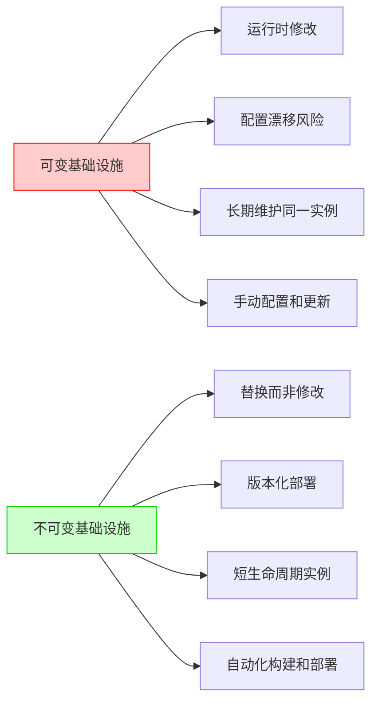
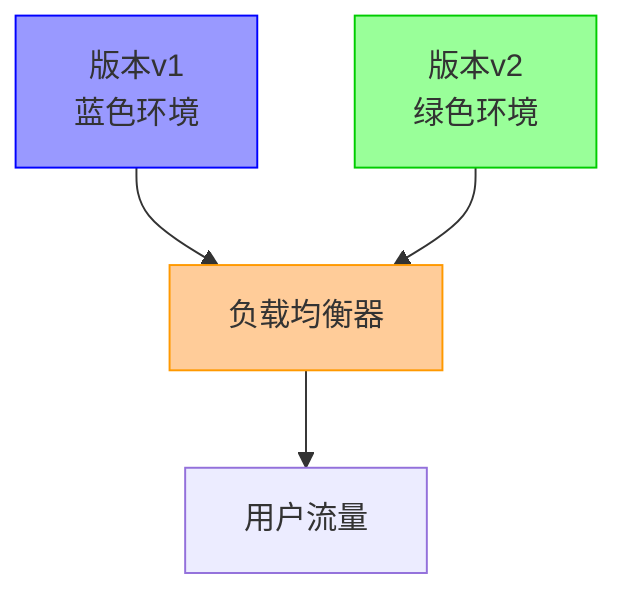
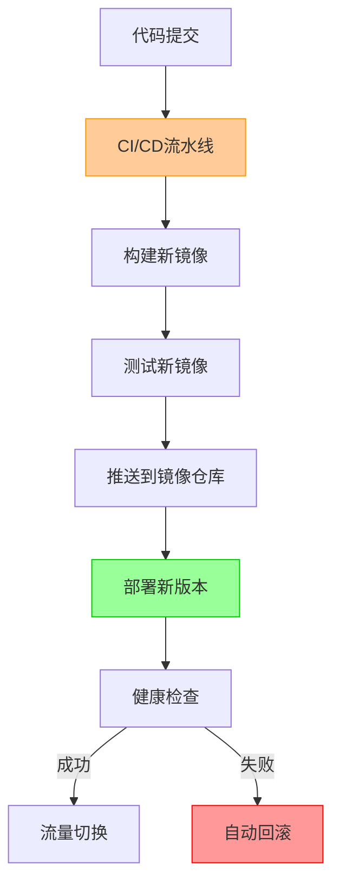
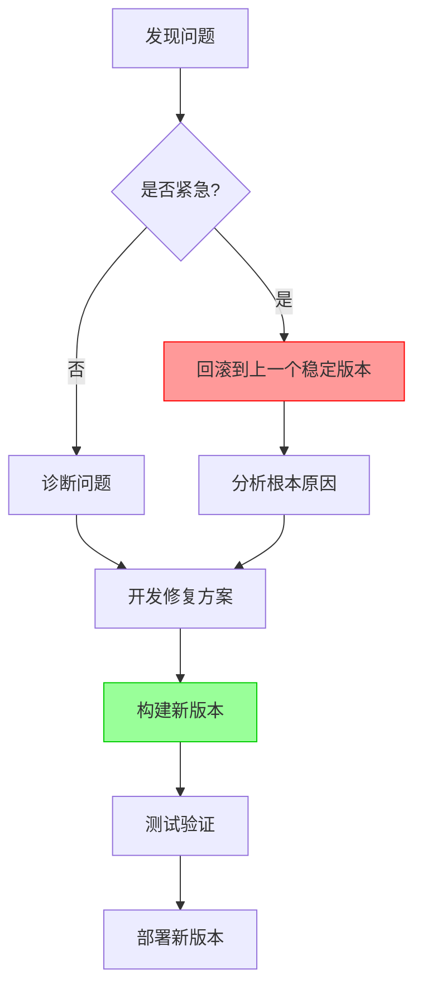
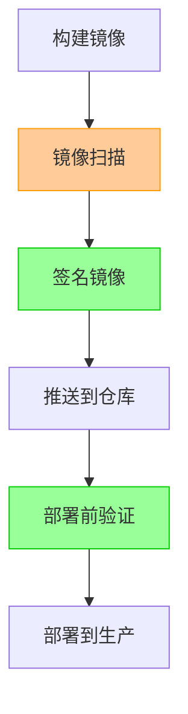
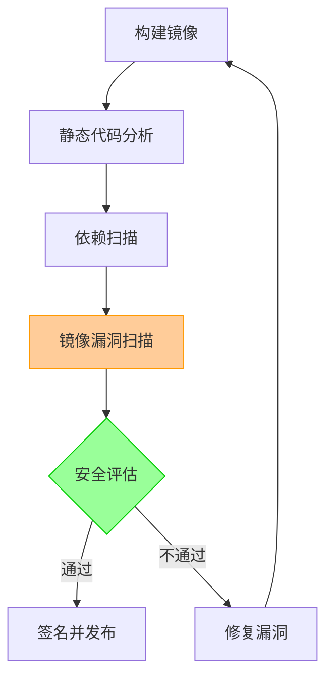
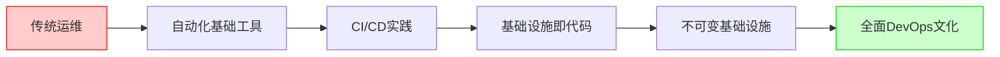

# 不可变基础设施理念  

不可变基础设施（Immutable Infrastructure）是一种现代化的基础设施管理方法，它强调一旦部署就不再修改服务器或容器实例，而是通过替换整个实例来实现更新。这种方法彻底改变了传统的基础设施管理模式，为云原生应用提供了更可靠、一致和可预测的运行环境。

## 1. 核心理念解析  

不可变基础设施的核心思想是将基础设施视为一次性资源，一旦创建就不再修改。当需要更新时，创建新的实例并替换旧实例，而不是在现有实例上进行更改。

### 1.1 与传统架构对比  

传统的可变基础设施与不可变基础设施在管理方式和生命周期上有根本性的区别：



**可变基础设施的问题：**

1. **配置漂移**：随着时间推移，服务器配置逐渐偏离初始状态，导致"特殊"服务器的出现
2. **环境不一致**：开发、测试和生产环境之间存在差异，导致"在我机器上能运行"的问题
3. **部署不可预测**：由于每台服务器状态不同，部署结果难以预测
4. **故障排除复杂**：问题可能源于特定服务器的独特配置，难以复现和解决
5. **安全风险**：运行时修改增加了安全漏洞的风险

**不可变基础设施的优势：**

1. **一致性保证**：所有环境使用相同的镜像，消除环境差异
2. **可预测的部署**：每次部署都是全新的、一致的实例
3. **简化回滚**：只需切换回之前的镜像版本
4. **提高安全性**：减少运行时修改，降低攻击面

### 1.2 核心优势  

不可变基础设施为现代云原生应用提供了多方面的优势：

| 特性            | 说明                                                | 实际效益                                |
|----------------|-----------------------------------------------------|----------------------------------------|
| 一致性          | 消除环境差异，所有实例完全相同                        | 减少"在我机器上能运行"的问题，提高部署成功率 |
| 可重复性        | 通过镜像保证部署一致性，任何时候都能精确复制环境       | 简化灾难恢复，加速新环境创建               |
| 可审计性        | 完整版本记录，每个部署都有明确的版本标识              | 满足合规要求，简化问题追踪                 |
| 简化运维        | 无需管理配置漂移，减少运维复杂性                      | 降低运维成本，减少人为错误                 |
| 快速部署与回滚   | 部署和回滚只需替换镜像，无需复杂的配置管理            | 减少部署时间，提高故障恢复速度             |
| 提高安全性      | 减少运行时修改，定期替换实例减少安全漏洞              | 降低被攻击风险，简化安全补丁管理           |
| 水平扩展能力    | 所有实例完全相同，简化自动扩展                        | 提高系统弹性，应对流量波动                |

## 2. 实现技术栈  

不可变基础设施的实现依赖于多种现代技术，包括容器化、基础设施即代码、自动化部署等。

### 2.1 容器化实现  

容器是实现不可变基础设施的理想技术，它将应用及其依赖打包成标准化单元，确保在任何环境中一致运行。

**基本Dockerfile示例：**

```dockerfile:c:\project\kphub\infrastructure\Dockerfile
FROM alpine:3.15

# 安装依赖
RUN apk add --no-cache curl tzdata ca-certificates && \
    update-ca-certificates

# 设置时区
ENV TZ=Asia/Shanghai

# 创建非root用户
RUN addgroup -S appgroup && adduser -S appuser -G appgroup

# 复制应用
COPY build/app /opt/app

# 设置权限
RUN chmod +x /opt/app && \
    chown -R appuser:appgroup /opt

# 切换到非root用户
USER appuser

# 暴露端口
EXPOSE 8080

# 健康检查
HEALTHCHECK --interval=30s --timeout=3s --start-period=5s --retries=3 \
  CMD curl -f http://localhost:8080/health || exit 1

# 启动应用
ENTRYPOINT ["/opt/app"]
```

**多阶段构建示例：**

```dockerfile:c:\project\kphub\infrastructure\multi-stage.Dockerfile
# 构建阶段
FROM golang:1.18 AS builder

WORKDIR /app

# 复制源代码
COPY . .

# 构建应用
RUN go mod download && \
    CGO_ENABLED=0 GOOS=linux go build -a -installsuffix cgo -o app .

# 运行阶段
FROM alpine:3.15

# 安装基本工具
RUN apk add --no-cache ca-certificates tzdata

# 从构建阶段复制二进制文件
COPY --from=builder /app/app /opt/app

# 设置权限
RUN chmod +x /opt/app

# 暴露端口
EXPOSE 8080

# 启动应用
ENTRYPOINT ["/opt/app"]
```

**容器化最佳实践：**

1. **使用多阶段构建**：减小最终镜像大小
2. **最小化基础镜像**：使用Alpine等轻量级基础镜像
3. **不存储状态**：容器内不保存状态数据
4. **使用非root用户**：提高安全性
5. **版本化标签**：不使用latest标签，使用明确的版本号
6. **健康检查**：添加健康检查确保应用正常运行
7. **镜像扫描**：部署前扫描安全漏洞

### 2.2 基础设施即代码  

基础设施即代码（Infrastructure as Code, IaC）是不可变基础设施的关键实现方式，它将基础设施配置以代码形式管理，确保环境一致性和可重复性。

**Terraform示例：**

```terraform:c:\project\kphub\infrastructure\main.tf
# 定义AWS提供商
provider "aws" {
  region = "us-west-2"
}

# 定义变量
variable "app_version" {
  description = "应用版本号"
  type        = string
  default     = "1.2.0"
}

variable "environment" {
  description = "部署环境"
  type        = string
  default     = "prod"
}

# 创建EC2实例
resource "aws_instance" "app" {
  ami           = "ami-0c55b159cbfafe1f0"
  instance_type = "t3.micro"
  user_data     = file("init.sh")
  
  vpc_security_group_ids = [aws_security_group.app_sg.id]
  
  tags = {
    Name        = "${var.environment}-app-v${var.app_version}"
    Environment = var.environment
    Version     = var.app_version
    ManagedBy   = "terraform"
  }
  
  # 防止意外修改
  lifecycle {
    create_before_destroy = true
  }
}

# 安全组配置
resource "aws_security_group" "app_sg" {
  name        = "${var.environment}-app-sg"
  description = "Allow inbound traffic for app"

  ingress {
    from_port   = 80
    to_port     = 80
    protocol    = "tcp"
    cidr_blocks = ["0.0.0.0/0"]
  }

  ingress {
    from_port   = 443
    to_port     = 443
    protocol    = "tcp"
    cidr_blocks = ["0.0.0.0/0"]
  }

  egress {
    from_port   = 0
    to_port     = 0
    protocol    = "-1"
    cidr_blocks = ["0.0.0.0/0"]
  }
}

# 输出
output "instance_ip" {
  value = aws_instance.app.public_ip
}
```

**Kubernetes清单示例：**

```yaml:c:\project\kphub\infrastructure\deployment.yaml
apiVersion: apps/v1
kind: Deployment
metadata:
  name: app
  labels:
    app: myapp
    version: v1.2.0
spec:
  replicas: 3
  selector:
    matchLabels:
      app: myapp
  template:
    metadata:
      labels:
        app: myapp
        version: v1.2.0
    spec:
      containers:
      - name: app
        image: myregistry/app:v1.2.0
        imagePullPolicy: Always
        ports:
        - containerPort: 8080
        resources:
          limits:
            cpu: "500m"
            memory: "512Mi"
          requests:
            cpu: "200m"
            memory: "256Mi"
        readinessProbe:
          httpGet:
            path: /health
            port: 8080
          initialDelaySeconds: 5
          periodSeconds: 10
        livenessProbe:
          httpGet:
            path: /health
            port: 8080
          initialDelaySeconds: 15
          periodSeconds: 20
      imagePullSecrets:
      - name: registry-credentials
```

**基础设施即代码最佳实践：**

1. **版本控制**：将所有IaC文件纳入版本控制系统
2. **模块化**：将基础设施代码组织为可重用模块
3. **环境分离**：为不同环境（开发、测试、生产）使用不同配置
4. **自动化验证**：使用自动化工具验证基础设施代码
5. **状态管理**：安全存储和管理基础设施状态文件
6. **最小权限原则**：使用最小必要权限执行部署

## 3. 部署模式  

不可变基础设施需要特定的部署模式来确保系统稳定性和可用性。

### 3.1 蓝绿部署  

蓝绿部署是一种零停机部署策略，通过同时维护两个相同的生产环境（蓝色和绿色）来实现无缝切换。



**蓝绿部署流程：**

1. **初始状态**：所有流量路由到蓝色环境（当前生产环境）
2. **部署新版本**：在绿色环境中部署新版本
3. **测试验证**：在绿色环境中进行测试和验证
4. **流量切换**：将流量从蓝色环境切换到绿色环境
5. **监控**：监控绿色环境的性能和错误
6. **完成或回滚**：如果成功，蓝色环境成为备用；如果失败，流量切回蓝色环境

**AWS蓝绿部署示例：**

```terraform:c:\project\kphub\infrastructure\blue-green.tf
# 蓝色环境
resource "aws_instance" "blue" {
  count         = var.blue_instances
  ami           = var.blue_ami
  instance_type = "t3.micro"
  
  tags = {
    Name        = "blue-app-${count.index}"
    Environment = "production"
    Color       = "blue"
  }
}

# 绿色环境
resource "aws_instance" "green" {
  count         = var.green_instances
  ami           = var.green_ami
  instance_type = "t3.micro"
  
  tags = {
    Name        = "green-app-${count.index}"
    Environment = "production"
    Color       = "green"
  }
}

# 负载均衡器
resource "aws_lb" "app_lb" {
  name               = "app-lb"
  internal           = false
  load_balancer_type = "application"
  subnets            = var.public_subnets
}

# 蓝色目标组
resource "aws_lb_target_group" "blue" {
  name     = "blue-tg"
  port     = 80
  protocol = "HTTP"
  vpc_id   = var.vpc_id
  
  health_check {
    path                = "/health"
    interval            = 30
    timeout             = 5
    healthy_threshold   = 2
    unhealthy_threshold = 2
  }
}

# 绿色目标组
resource "aws_lb_target_group" "green" {
  name     = "green-tg"
  port     = 80
  protocol = "HTTP"
  vpc_id   = var.vpc_id
  
  health_check {
    path                = "/health"
    interval            = 30
    timeout             = 5
    healthy_threshold   = 2
    unhealthy_threshold = 2
  }
}

# 负载均衡器监听器
resource "aws_lb_listener" "app_listener" {
  load_balancer_arn = aws_lb.app_lb.arn
  port              = 80
  protocol          = "HTTP"
  
  default_action {
    type             = "forward"
    target_group_arn = var.active_color == "blue" ? aws_lb_target_group.blue.arn : aws_lb_target_group.green.arn
  }
}
```

### 3.2 不可变更新流程  

不可变更新流程是不可变基础设施的核心操作模式，它确保每次更新都是通过替换而非修改来实现。

**容器化应用更新流程：**



**Docker镜像构建与部署：**

```powershell
# 构建新版本镜像
docker build -t myregistry/app:v1.2.0 -f c:\project\kphub\infrastructure\Dockerfile .

# 测试镜像
docker run --rm -p 8080:8080 myregistry/app:v1.2.0 test

# 推送镜像到仓库
docker push myregistry/app:v1.2.0

# Kubernetes滚动更新部署
kubectl set image deployment/app app=myregistry/app:v1.2.0

# 监控部署状态
kubectl rollout status deployment/app

# 如果需要回滚
kubectl rollout undo deployment/app
```

**Kubernetes滚动更新配置：**

```yaml:c:\project\kphub\infrastructure\rolling-update.yaml
apiVersion: apps/v1
kind: Deployment
metadata:
  name: app
spec:
  replicas: 5
  strategy:
    type: RollingUpdate
    rollingUpdate:
      maxSurge: 1        # 最多可以创建多少个超出期望副本数的Pod
      maxUnavailable: 1  # 最多可以有多少个Pod处于不可用状态
  selector:
    matchLabels:
      app: myapp
  template:
    metadata:
      labels:
        app: myapp
        version: v1.2.0
    spec:
      containers:
      - name: app
        image: myregistry/app:v1.2.0
        ports:
        - containerPort: 8080
        readinessProbe:
          httpGet:
            path: /health
            port: 8080
          initialDelaySeconds: 5
          periodSeconds: 10
```

**不可变更新最佳实践：**

1. **自动化部署**：使用CI/CD流水线自动化整个部署过程
2. **版本化镜像**：每个镜像都有唯一的版本标识
3. **健康检查**：确保新版本正常运行后再切换流量
4. **灰度发布**：逐步将流量切换到新版本
5. **自动回滚**：在发现问题时自动回滚到上一个稳定版本
6. **部署历史**：保留部署历史记录，便于回滚和审计

## 4. 运维实践  

不可变基础设施改变了传统的运维模式，需要新的运维实践来支持。

### 4.1 故障处理原则  

不可变基础设施的故障处理遵循"替换而非修复"的原则，这与传统运维有根本性的不同。

```text
传统故障处理：
1. SSH登录到问题服务器
2. 实时调试和修复问题
3. 应用补丁或配置更改
4. 重启服务

不可变基础设施故障处理：
1. 不SSH进入容器或实例调试
2. 通过日志和指标诊断问题
3. 在开发环境重现并修复问题
4. 构建新版本镜像并重新部署
5. 替换有问题的实例
```

**故障处理流程：**



**日志和监控最佳实践：**

1. **集中式日志**：将所有日志发送到集中式日志系统（如ELK Stack）
2. **结构化日志**：使用JSON等结构化格式记录日志
3. **关联ID**：使用请求ID关联分布式系统中的相关日志
4. **监控指标**：收集关键性能指标和业务指标
5. **告警机制**：设置适当的告警阈值和通知渠道

### 4.2 配置管理规范  

在不可变基础设施中，配置管理需要特殊处理，因为实例本身是不可变的。

**配置管理策略：**

1. **外部化配置**：将配置从应用代码中分离
2. **环境变量**：使用环境变量注入配置
3. **配置服务**：使用专门的配置服务（如Consul、etcd）
4. **版本化配置**：对配置进行版本控制
5. **配置验证**：部署前验证配置有效性

**Kubernetes ConfigMap示例：**

```yaml:c:\project\kphub\infrastructure\config\app-config.yaml
apiVersion: v1
kind: ConfigMap
metadata:
  name: app-config
  labels:
    app: myapp
    version: "20230301"
data:
  app.properties: |
    server.port=8080
    cache.size=256MB
    log.level=INFO
    feature.new-ui=true
    feature.analytics=false
  
  # 数据库配置
  database.properties: |
    db.url=jdbc:postgresql://db-service:5432/mydb
    db.pool.size=20
    db.timeout=30s
  
  # 缓存配置
  cache.properties: |
    redis.host=redis-service
    redis.port=6379
    redis.ttl=3600
```

**使用ConfigMap的Deployment：**

```yaml:c:\project\kphub\infrastructure\config\deployment-with-config.yaml
apiVersion: apps/v1
kind: Deployment
metadata:
  name: app
spec:
  replicas: 3
  selector:
    matchLabels:
      app: myapp
  template:
    metadata:
      labels:
        app: myapp
    spec:
      containers:
      - name: app
        image: myregistry/app:v1.2.0
        ports:
        - containerPort: 8080
        env:
        - name: CONFIG_VERSION
          value: "20230301"
        volumeMounts:
        - name: config-volume
          mountPath: /etc/app
        - name: secrets-volume
          mountPath: /etc/secrets
          readOnly: true
      volumes:
      - name: config-volume
        configMap:
          name: app-config
      - name: secrets-volume
        secret:
          secretName: app-secrets
```

**配置更新策略：**

1. **创建新的ConfigMap**：不修改现有ConfigMap，而是创建新版本
2. **更新Deployment引用**：更新Deployment以引用新的ConfigMap
3. **滚动更新**：执行滚动更新以应用新配置
4. **监控变更**：监控配置变更的影响

## 5. 生产环境验证  

在不可变基础设施中，生产环境验证是确保系统稳定性和安全性的关键环节。

### 5.1 镜像签名验证  

镜像签名验证确保只有经过授权和验证的镜像才能部署到生产环境。

**镜像签名流程：**



**使用Cosign签名和验证镜像：**

```powershell
# 生成密钥对
cosign generate-key-pair

# 签名镜像
cosign sign --key c:\project\kphub\keys\cosign.key myregistry/app:v1.2.0

# 验证镜像签名
cosign verify --key c:\project\kphub\keys\pub.key myregistry/app:v1.2.0

# 部署验证通过镜像
kubectl apply -f c:\project\kphub\infrastructure\deployment-signed.yaml
```

**Kubernetes验证策略：**

```yaml:c:\project\kphub\infrastructure\image-policy.yaml
apiVersion: admission.k8s.io/v1
kind: ValidatingAdmissionPolicy
metadata:
  name: image-signature-policy
spec:
  failurePolicy: Fail
  matchConstraints:
    resourceRules:
    - apiGroups: ["apps"]
      apiVersions: ["v1"]
      operations: ["CREATE", "UPDATE"]
      resources: ["deployments"]
  validations:
  - expression: "object.spec.template.spec.containers.all(c, c.image.startsWith('myregistry/') && c.image.contains(':v'))"
    message: "Only versioned images from myregistry are allowed"
```

### 5.2 回滚机制  

有效的回滚机制是不可变基础设施的安全网，确保在部署出现问题时能快速恢复。

**Kubernetes回滚配置：**

```yaml:c:\project\kphub\infrastructure\deployment-rollback.yaml
apiVersion: apps/v1
kind: Deployment
metadata:
  name: app
  annotations:
    kubernetes.io/change-cause: "Update to version v1.2.0"
    rollback-to: "v1.1.0"
spec:
  replicas: 3
  revisionHistoryLimit: 5  # 保留的历史版本数量
  selector:
    matchLabels:
      app: myapp
  template:
    metadata:
      labels:
        app: myapp
        version: v1.2.0
    spec:
      containers:
      - name: app
        image: myregistry/app:v1.2.0
```

**回滚命令：**

```powershell
# 查看部署历史
kubectl rollout history deployment/app

# 回滚到上一个版本
kubectl rollout undo deployment/app

# 回滚到特定版本
kubectl rollout undo deployment/app --to-revision=2

# 暂停部署（在发现问题时）
kubectl rollout pause deployment/app

# 恢复部署
kubectl rollout resume deployment/app
```

**自动回滚策略：**

```yaml:c:\project\kphub\infrastructure\auto-rollback.yaml
apiVersion: argoproj.io/v1alpha1
kind: Rollout
metadata:
  name: app-rollout
spec:
  replicas: 5
  selector:
    matchLabels:
      app: myapp
  template:
    metadata:
      labels:
        app: myapp
    spec:
      containers:
      - name: app
        image: myregistry/app:v1.2.0
  strategy:
    canary:
      steps:
      - setWeight: 20
      - pause: {duration: 5m}
      - setWeight: 40
      - pause: {duration: 5m}
      - setWeight: 60
      - pause: {duration: 5m}
      - setWeight: 80
      - pause: {duration: 5m}
      maxSurge: "25%"
      maxUnavailable: 0
      analysis:
        templates:
        - templateName: success-rate
        args:
        - name: service-name
          value: myapp-service
      # 自动回滚条件
      autoPromotionEnabled: false
```

## 6. 进阶模式  

随着不可变基础设施实践的深入，可以采用更高级的模式来增强系统的可靠性和安全性。

### 6.1 不可变网络  

不可变网络将不可变性原则扩展到网络基础设施，通过代码定义和版本控制网络配置。

**Terraform网络配置：**

```terraform:c:\project\kphub\infrastructure\network.tf
# 定义VPC
resource "aws_vpc" "main" {
  cidr_block           = "10.0.0.0/16"
  enable_dns_support   = true
  enable_dns_hostnames = true
  
  tags = {
    Name = "main-vpc"
    Environment = var.environment
  }
  
  lifecycle {
    prevent_destroy = true  # 防止意外删除
  }
}

# 公共子网
resource "aws_subnet" "public" {
  count             = length(var.availability_zones)
  vpc_id            = aws_vpc.main.id
  cidr_block        = "10.0.${count.index}.0/24"
  availability_zone = var.availability_zones[count.index]
  
  map_public_ip_on_launch = true
  
  tags = {
    Name = "public-subnet-${count.index}"
    Environment = var.environment
    Type = "public"
  }
}

# 私有子网
resource "aws_subnet" "private" {
  count             = length(var.availability_zones)
  vpc_id            = aws_vpc.main.id
  cidr_block        = "10.0.${count.index + 100}.0/24"
  availability_zone = var.availability_zones[count.index]
  
  tags = {
    Name = "private-subnet-${count.index}"
    Environment = var.environment
    Type = "private"
  }
}

# 互联网网关
resource "aws_internet_gateway" "main" {
  vpc_id = aws_vpc.main.id
  
  tags = {
    Name =
继续编写不可变基础设施理念文档：

```terraform:c:\project\kphub\infrastructure\network.tf
# 互联网网关
resource "aws_internet_gateway" "main" {
  vpc_id = aws_vpc.main.id
  
  tags = {
    Name = "main-igw"
    Environment = var.environment
  }
}

# NAT网关
resource "aws_nat_gateway" "main" {
  count         = length(var.availability_zones)
  allocation_id = aws_eip.nat[count.index].id
  subnet_id     = aws_subnet.public[count.index].id
  
  tags = {
    Name = "nat-gateway-${count.index}"
    Environment = var.environment
  }
  
  depends_on = [aws_internet_gateway.main]
}

# 弹性IP
resource "aws_eip" "nat" {
  count = length(var.availability_zones)
  vpc   = true
  
  tags = {
    Name = "nat-eip-${count.index}"
    Environment = var.environment
  }
}

# 路由表 - 公共
resource "aws_route_table" "public" {
  vpc_id = aws_vpc.main.id
  
  route {
    cidr_block = "0.0.0.0/0"
    gateway_id = aws_internet_gateway.main.id
  }
  
  tags = {
    Name = "public-route-table"
    Environment = var.environment
  }
}

# 路由表 - 私有
resource "aws_route_table" "private" {
  count  = length(var.availability_zones)
  vpc_id = aws_vpc.main.id
  
  route {
    cidr_block     = "0.0.0.0/0"
    nat_gateway_id = aws_nat_gateway.main[count.index].id
  }
  
  tags = {
    Name = "private-route-table-${count.index}"
    Environment = var.environment
  }
}
```

**不可变网络最佳实践：**

1. **网络即代码**：使用Terraform、CloudFormation等工具定义网络
2. **版本控制**：将网络配置纳入版本控制系统
3. **模块化设计**：将网络组件模块化，便于重用
4. **安全组规则**：明确定义安全组规则，遵循最小权限原则
5. **网络隔离**：使用子网和安全组实现网络隔离
6. **自动化验证**：部署前验证网络配置
7. **灾难恢复**：设计多可用区架构，提高容错能力

### 6.2 数据分离处理  

在不可变基础设施中，数据需要与应用分离，以确保应用实例可以随时替换而不丢失数据。

**Kubernetes StatefulSet示例：**

```yaml:c:\project\kphub\infrastructure\statefulset.yaml
apiVersion: apps/v1
kind: StatefulSet
metadata:
  name: db
  labels:
    app: database
spec:
  serviceName: "db"
  replicas: 3
  selector:
    matchLabels:
      app: database
  template:
    metadata:
      labels:
        app: database
    spec:
      terminationGracePeriodSeconds: 30
      containers:
      - name: postgres
        image: postgres:14
        ports:
        - containerPort: 5432
          name: db-port
        env:
        - name: POSTGRES_PASSWORD
          valueFrom:
            secretKeyRef:
              name: db-credentials
              key: password
        - name: POSTGRES_USER
          valueFrom:
            secretKeyRef:
              name: db-credentials
              key: username
        - name: POSTGRES_DB
          value: myapp
        volumeMounts:
        - name: data
          mountPath: /var/lib/postgresql/data
        resources:
          limits:
            memory: "2Gi"
            cpu: "1000m"
          requests:
            memory: "1Gi"
            cpu: "500m"
  volumeClaimTemplates:
  - metadata:
      name: data
    spec:
      accessModes: ["ReadWriteOnce"]
      storageClassName: "standard"
      resources:
        requests:
          storage: 10Gi
```

**AWS RDS数据库配置：**

```terraform:c:\project\kphub\infrastructure\database.tf
resource "aws_db_instance" "main" {
  identifier           = "${var.environment}-db"
  allocated_storage    = 20
  storage_type         = "gp2"
  engine               = "postgres"
  engine_version       = "14.5"
  instance_class       = "db.t3.medium"
  name                 = "myapp"
  username             = var.db_username
  password             = var.db_password
  parameter_group_name = aws_db_parameter_group.main.name
  
  vpc_security_group_ids = [aws_security_group.db.id]
  db_subnet_group_name   = aws_db_subnet_group.main.name
  
  backup_retention_period = 7
  backup_window           = "03:00-04:00"
  maintenance_window      = "mon:04:00-mon:05:00"
  
  multi_az               = true
  skip_final_snapshot    = false
  final_snapshot_identifier = "${var.environment}-db-final"
  
  tags = {
    Name        = "${var.environment}-db"
    Environment = var.environment
  }
}

resource "aws_db_parameter_group" "main" {
  name   = "${var.environment}-db-pg"
  family = "postgres14"
  
  parameter {
    name  = "log_connections"
    value = "1"
  }
  
  parameter {
    name  = "log_disconnections"
    value = "1"
  }
}

resource "aws_db_subnet_group" "main" {
  name       = "${var.environment}-db-subnet"
  subnet_ids = aws_subnet.private[*].id
  
  tags = {
    Name        = "${var.environment}-db-subnet"
    Environment = var.environment
  }
}
```

**数据管理最佳实践：**

1. **状态分离**：将状态数据与应用分离
2. **持久化存储**：使用专门的持久化存储服务
3. **数据备份**：定期备份数据，测试恢复流程
4. **数据迁移**：设计数据迁移和版本控制策略
5. **数据加密**：加密静态数据和传输中的数据
6. **访问控制**：实施最小权限的数据访问控制

## 7. 安全与合规

不可变基础设施提供了增强安全性和合规性的机会，但也需要特定的安全实践。

### 7.1 镜像安全扫描

在不可变基础设施中，镜像是部署的基本单元，确保镜像安全是至关重要的。

**镜像扫描流程：**



**Trivy扫描示例：**

```yaml:c:\project\kphub\infrastructure\security\scan-pipeline.yaml
stages:
  - build
  - scan
  - publish

build:
  stage: build
  script:
    - docker build -t myregistry/app:v1.2.0 .

scan:
  stage: scan
  script:
    - trivy image --severity HIGH,CRITICAL --exit-code 1 myregistry/app:v1.2.0
    - grype myregistry/app:v1.2.0 --fail-on high

publish:
  stage: publish
  script:
    - cosign sign --key ${COSIGN_KEY} myregistry/app:v1.2.0
    - docker push myregistry/app:v1.2.0
  only:
    - master
```

**安全策略示例：**

```yaml:c:\project\kphub\infrastructure\security\policy.yaml
apiVersion: constraints.gatekeeper.sh/v1beta1
kind: K8sImageAllowedRepos
metadata:
  name: allowed-repositories
spec:
  match:
    kinds:
      - apiGroups: [""]
        kinds: ["Pod"]
    namespaces:
      - "production"
      - "staging"
  parameters:
    repos:
      - "myregistry/"
---
apiVersion: constraints.gatekeeper.sh/v1beta1
kind: K8sRequiredProbes
metadata:
  name: required-probes
spec:
  match:
    kinds:
      - apiGroups: [""]
        kinds: ["Pod"]
  parameters:
    probes: ["readinessProbe", "livenessProbe"]
```

### 7.2 合规自动化

自动化合规检查确保所有部署符合组织的安全和合规要求。

**合规检查流程：**

```yaml:c:\project\kphub\infrastructure\compliance\compliance-check.yaml
apiVersion: batch/v1
kind: CronJob
metadata:
  name: compliance-check
spec:
  schedule: "0 1 * * *"  # 每天凌晨1点运行
  jobTemplate:
    spec:
      template:
        spec:
          containers:
          - name: compliance-scanner
            image: compliance-scanner:latest
            args:
            - --config=/etc/compliance/rules.yaml
            - --output=/data/compliance-report.json
            volumeMounts:
            - name: config
              mountPath: /etc/compliance
            - name: data
              mountPath: /data
          volumes:
          - name: config
            configMap:
              name: compliance-rules
          - name: data
            persistentVolumeClaim:
              claimName: compliance-data
          restartPolicy: OnFailure
```

**合规规则示例：**

```yaml:c:\project\kphub\infrastructure\compliance\rules.yaml
rules:
  - name: ensure-image-scanning
    description: "All images must be scanned for vulnerabilities"
    query: |
      kubectl get pods -o json | jq '.items[] | select(.metadata.annotations."security.scan/status" != "passed")'
    remediation: "Run 'trivy image <image>' to scan the image and add the annotation"
    severity: critical

  - name: ensure-network-policies
    description: "All namespaces must have network policies"
    query: |
      kubectl get ns -o json | jq '.items[] | select(.metadata.name != "kube-system") | select(.metadata.name != "kube-public") | select(.metadata.name as $ns | [kubectl get netpol -n $ns -o json | jq ".items | length"] | .[0] == 0)'
    remediation: "Create default deny network policies for each namespace"
    severity: high

  - name: ensure-resource-limits
    description: "All pods must have resource limits"
    query: |
      kubectl get pods -o json | jq '.items[] | select(.spec.containers[] | select(.resources.limits == null))'
    remediation: "Add resource limits to all container specifications"
    severity: medium
```

## 8. 团队与文化转型

实施不可变基础设施不仅是技术变革，也需要团队文化的转变。

### 8.1 DevOps实践

不可变基础设施与DevOps实践紧密结合，需要开发和运维团队的密切协作。

**DevOps转型路线图：**



**团队责任矩阵：**

| 职责 | 开发团队 | 运维团队 | SRE团队 | 安全团队 |
|------|---------|---------|---------|---------|
| 应用代码开发 | 主要 | 支持 | 顾问 | 审核 |
| 基础设施代码 | 参与 | 主要 | 主要 | 审核 |
| CI/CD流水线 | 参与 | 主要 | 主要 | 审核 |
| 监控告警 | 参与 | 主要 | 主要 | 参与 |
| 安全合规 | 参与 | 参与 | 参与 | 主要 |
| 事件响应 | 支持 | 主要 | 主要 | 支持 |

### 8.2 技能培养

不可变基础设施需要团队掌握新的技能和工具。

**关键技能清单：**

1. **容器技术**：Docker、Kubernetes、容器编排
2. **基础设施即代码**：Terraform、CloudFormation、Pulumi
3. **CI/CD工具**：Jenkins、GitLab CI、GitHub Actions
4. **监控与可观测性**：Prometheus、Grafana、ELK Stack
5. **云服务**：AWS、Azure、GCP核心服务
6. **安全实践**：镜像扫描、合规检查、安全策略
7. **自动化测试**：单元测试、集成测试、基础设施测试

**学习路径示例：**

```yaml:c:\project\kphub\infrastructure\learning\learning-path.yaml
- role: "开发工程师"
  path:
    - name: "容器基础"
      resources:
        - "Docker入门到实践"
        - "Kubernetes基础教程"
    - name: "CI/CD实践"
      resources:
        - "Jenkins Pipeline实战"
        - "GitHub Actions工作流"
    - name: "可观测性"
      resources:
        - "应用监控与日志最佳实践"

- role: "运维工程师"
  path:
    - name: "基础设施即代码"
      resources:
        - "Terraform实战指南"
        - "Kubernetes Operator开发"
    - name: "云原生架构"
      resources:
        - "云原生模式与反模式"
        - "服务网格实践"
    - name: "自动化运维"
      resources:
        - "GitOps工作流"
        - "混沌工程实践"
```

## 9. 总结与展望

不可变基础设施通过版本化、不可变部署单元实现环境一致性，为现代云原生应用提供了坚实的基础。

### 9.1 核心价值总结

不可变基础设施为组织带来的核心价值：

1. **提高部署可靠性**：通过一致的环境和可预测的部署减少故障
2. **加速发布周期**：自动化部署和回滚机制缩短发布时间
3. **增强安全性**：减少运行时修改，降低安全风险
4. **简化运维**：替换而非修改的模式简化了故障处理
5. **提高资源利用率**：标准化部署单元优化资源分配
6. **支持云原生架构**：为微服务和容器化应用提供理想基础

### 9.2 未来发展趋势

不可变基础设施的未来发展方向：

1. **GitOps模式**：通过Git管理所有基础设施和应用配置
2. **无服务器架构**：进一步减少基础设施管理负担
3. **AI辅助运维**：智能分析和自动修复基础设施问题
4. **混沌工程**：主动测试系统弹性，发现潜在问题
5. **平台工程**：构建内部开发平台，简化应用部署
6. **零信任安全**：在不可变基础设施基础上实施零信任架构

不可变基础设施通过版本化、不可变部署单元实现环境一致性，生产环境应建立完整的镜像构建、签名和验证流程。配置管理需与代码分离并通过版本控制，数据持久化需采用独立卷管理。回滚机制和修订历史是保障稳定性的关键要素。随着云原生技术的发展，不可变基础设施将继续演进，与GitOps、无服务器架构等新兴实践相结合，为现代应用提供更强大的基础。