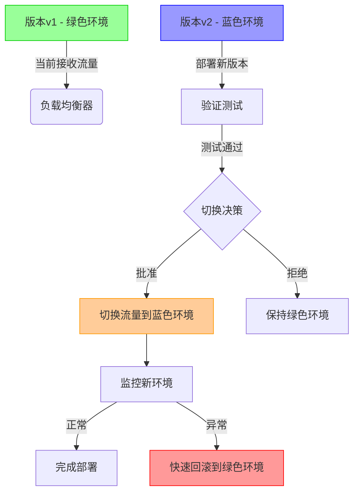
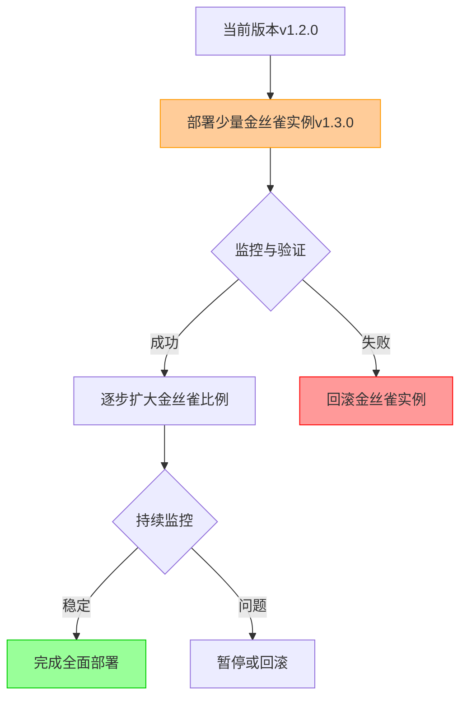
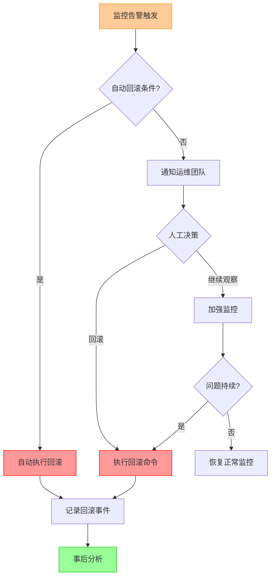
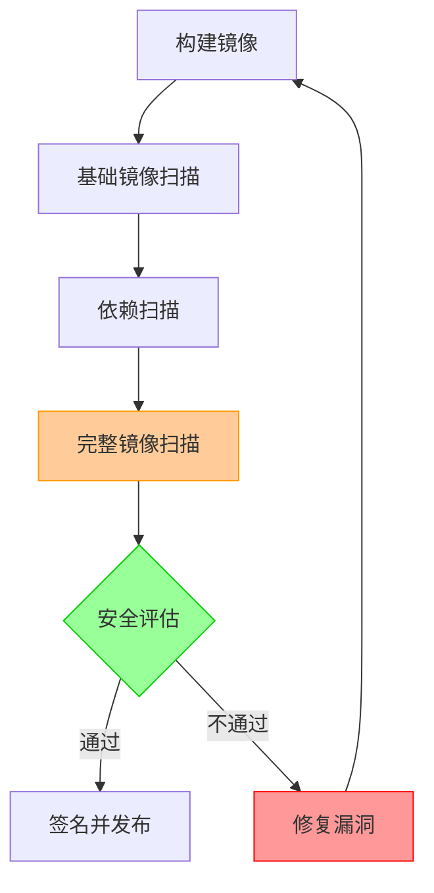

# 不可变基础设施实践  

不可变基础设施是一种现代化的基础设施管理方法，它强调一旦部署就不再修改服务器或容器实例，而是通过替换整个实例来实现更新。本文将详细介绍不可变基础设施的实践方法，从容器镜像构建到部署回滚的全流程。

## 1. 容器镜像构建规范  

容器镜像是不可变基础设施的基本构建单元，良好的镜像构建规范能够确保应用的安全性、性能和可维护性。

### 1.1 安全镜像构建  

安全的镜像构建需要遵循最小权限原则，使用非root用户运行应用，减少攻击面。

```dockerfile:c:\project\kphub\infra-practice\Dockerfile
# 使用官方JRE镜像作为基础镜像
FROM eclipse-temurin:17-jre-jammy

# 创建专用的应用用户和用户组，避免使用root
RUN addgroup --system appuser && adduser --system --no-create-home --ingroup appuser appuser

# 复制应用JAR包并设置正确的所有权
COPY --chown=appuser:appuser target/app.jar /app/app.jar

# 切换到非root用户
USER appuser

# 配置健康检查，确保容器内应用正常运行
HEALTHCHECK --interval=30s --timeout=3s --retries=3 CMD curl -f http://localhost:8080/actuator/health || exit 1

# 声明应用使用的端口
EXPOSE 8080

# 设置容器启动命令
ENTRYPOINT ["java", "-jar", "/app/app.jar"]
```

**安全镜像构建最佳实践：**

1. **使用特定版本标签**：避免使用`latest`标签，确保镜像版本可追溯
2. **最小化基础镜像**：选择体积小的基础镜像，如Alpine或精简版官方镜像
3. **非root用户运行**：创建专用系统用户运行应用，降低权限
4. **多层安全防护**：
   - 移除不必要的工具和库
   - 设置文件系统为只读
   - 实施健康检查
   - 扫描镜像漏洞
5. **敏感信息处理**：不要在Dockerfile中硬编码密钥、证书等敏感信息

### 1.2 多阶段构建优化  

多阶段构建可以显著减小最终镜像的大小，提高部署效率和安全性。

```dockerfile:c:\project\kphub\infra-practice\multi-stage.Dockerfile
# 构建阶段 - 使用Maven镜像编译应用
FROM maven:3.8.6 AS builder

# 复制源代码到构建容器
COPY . /src

# 编译打包应用
RUN mvn -f /src/pom.xml clean package -DskipTests

# 运行阶段 - 使用精简的JRE镜像
FROM eclipse-temurin:17-jre-jammy

# 创建应用用户
RUN addgroup --system appuser && adduser --system --no-create-home --ingroup appuser appuser

# 从构建阶段复制编译好的JAR包
COPY --from=builder --chown=appuser:appuser /src/target/app.jar /app/app.jar

# 设置工作目录
WORKDIR /app

# 切换到非root用户
USER appuser

# 配置健康检查
HEALTHCHECK --interval=30s --timeout=3s --retries=3 CMD curl -f http://localhost:8080/actuator/health || exit 1

# 声明应用端口
EXPOSE 8080

# 设置容器启动命令
ENTRYPOINT ["java", "-jar", "/app/app.jar"]
```

**多阶段构建优势：**

1. **减小镜像体积**：最终镜像只包含运行所需的文件，不含构建工具和源代码
2. **提高安全性**：减少攻击面，降低漏洞风险
3. **加快部署速度**：小体积镜像传输和启动更快
4. **简化构建流程**：单一Dockerfile完成全部构建过程

**多阶段构建最佳实践：**

1. **合理命名构建阶段**：使用有意义的名称标识不同阶段
2. **选择性复制文件**：只复制必要的文件到最终镜像
3. **缓存优化**：合理排序构建步骤，利用Docker缓存机制
4. **并行构建**：利用多阶段构建的并行能力加速构建过程

## 2. 基础设施即代码  

基础设施即代码（Infrastructure as Code, IaC）是不可变基础设施的关键实现方式，它将基础设施配置以代码形式管理，确保环境一致性和可重复性。

### 2.1 Terraform模块化  

Terraform模块化设计可以提高基础设施代码的复用性和可维护性。

**模块目录结构：**

```text:c:\project\kphub\infra-practice\terraform\
terraform/
├── environments/
│   ├── dev/
│   │   ├── main.tf
│   │   ├── variables.tf
│   │   └── outputs.tf
│   └── prod/
│       ├── main.tf
│       ├── variables.tf
│       └── outputs.tf
├── modules/
│   ├── network/
│   │   ├── main.tf
│   │   ├── variables.tf
│   │   └── outputs.tf
│   ├── compute/
│   │   ├── main.tf
│   │   ├── variables.tf
│   │   └── outputs.tf
│   └── database/
│       ├── main.tf
│       ├── variables.tf
│       └── outputs.tf
└── global/
    └── remote-state/
        └── main.tf
```

**网络模块定义：**

```terraform:c:\project\kphub\infra-practice\terraform\modules\network\main.tf
# 网络模块 - 创建VPC、子网、路由表等网络资源

variable "env_name" {
  description = "环境名称"
  type        = string
}

variable "cidr_block" {
  description = "VPC CIDR块"
  type        = string
}

variable "max_azs" {
  description = "使用的可用区数量"
  type        = number
  default     = 2
}

variable "tags" {
  description = "资源标签"
  type        = map(string)
  default     = {}
}

# 创建VPC
resource "aws_vpc" "main" {
  cidr_block           = var.cidr_block
  enable_dns_support   = true
  enable_dns_hostnames = true
  
  tags = merge(
    {
      Name = "${var.env_name}-vpc"
      Environment = var.env_name
    },
    var.tags
  )
}

# 获取可用区列表
data "aws_availability_zones" "available" {}

# 创建公共子网
resource "aws_subnet" "public" {
  count             = var.max_azs
  vpc_id            = aws_vpc.main.id
  cidr_block        = cidrsubnet(var.cidr_block, 8, count.index)
  availability_zone = data.aws_availability_zones.available.names[count.index]
  
  map_public_ip_on_launch = true
  
  tags = merge(
    {
      Name = "${var.env_name}-public-subnet-${count.index + 1}"
      Environment = var.env_name
      Type = "public"
    },
    var.tags
  )
}

# 创建私有子网
resource "aws_subnet" "private" {
  count             = var.max_azs
  vpc_id            = aws_vpc.main.id
  cidr_block        = cidrsubnet(var.cidr_block, 8, count.index + var.max_azs)
  availability_zone = data.aws_availability_zones.available.names[count.index]
  
  tags = merge(
    {
      Name = "${var.env_name}-private-subnet-${count.index + 1}"
      Environment = var.env_name
      Type = "private"
    },
    var.tags
  )
}

# 输出模块创建的资源
output "vpc_id" {
  value = aws_vpc.main.id
}

output "public_subnet_ids" {
  value = aws_subnet.public[*].id
}

output "private_subnet_ids" {
  value = aws_subnet.private[*].id
}
```

**环境配置示例：**

```terraform:c:\project\kphub\infra-practice\terraform\environments\prod\main.tf
provider "aws" {
  region = "us-west-2"
}

# 使用远程状态存储
terraform {
  backend "s3" {
    bucket         = "company-terraform-state"
    key            = "prod/terraform.tfstate"
    region         = "us-west-2"
    dynamodb_table = "terraform-locks"
    encrypt        = true
  }
}

# 引用网络模块
module "vpc" {
  source = "../../modules/network"

  env_name     = "prod"
  cidr_block   = "10.1.0.0/16"
  max_azs      = 2
  
  tags = {
    Project     = "MyApp"
    ManagedBy   = "Terraform"
    Environment = "Production"
  }
}

# 引用计算模块
module "compute" {
  source = "../../modules/compute"
  
  env_name          = "prod"
  vpc_id            = module.vpc.vpc_id
  subnet_ids        = module.vpc.private_subnet_ids
  instance_type     = "t3.medium"
  min_size          = 2
  max_size          = 6
  desired_capacity  = 3
  
  tags = {
    Project     = "MyApp"
    ManagedBy   = "Terraform"
    Environment = "Production"
  }
}

# 引用数据库模块
module "database" {
  source = "../../modules/database"
  
  env_name       = "prod"
  vpc_id         = module.vpc.vpc_id
  subnet_ids     = module.vpc.private_subnet_ids
  instance_class = "db.t3.large"
  
  tags = {
    Project     = "MyApp"
    ManagedBy   = "Terraform"
    Environment = "Production"
  }
}
```

**Terraform模块化最佳实践：**

1. **逻辑分组**：按功能将资源分组到不同模块
2. **环境分离**：为不同环境（开发、测试、生产）创建独立配置
3. **版本控制**：使用Git管理Terraform代码，记录变更历史
4. **状态管理**：使用远程状态存储（如S3+DynamoDB）
5. **变量抽象**：通过变量参数化模块，提高复用性
6. **输出定义**：明确定义模块输出，便于跨模块引用
7. **命名规范**：采用一致的命名约定，提高可读性

### 2.2 Kubernetes资源定义  

Kubernetes资源定义是容器化应用部署的核心，良好的资源定义可以确保应用的可靠性和可扩展性。

**应用部署清单：**

```yaml:c:\project\kphub\infra-practice\k8s\app-deployment.yaml
apiVersion: apps/v1
kind: Deployment
metadata:
  name: app
  namespace: production
  labels:
    app: backend
    version: "v1.2.0"
    environment: production
    team: backend
  annotations:
    kubernetes.io/change-cause: "Release v1.2.0 with performance improvements"
spec:
  # 保留历史版本数量，用于回滚
  revisionHistoryLimit: 5
  # 副本数量
  replicas: 3
  # 选择器，用于匹配Pod
  selector:
    matchLabels:
      app: backend
  # 部署策略
  strategy:
    type: RollingUpdate
    rollingUpdate:
      maxSurge: 1
      maxUnavailable: 0
  # Pod模板
  template:
    metadata:
      labels:
        app: backend
        version: "v1.2.0"
      annotations:
        prometheus.io/scrape: "true"
        prometheus.io/port: "8080"
        prometheus.io/path: "/actuator/prometheus"
    spec:
      # 容器定义
      containers:
      - name: app
        image: registry.example.com/app:v1.2.0
        imagePullPolicy: IfNotPresent
        ports:
        - name: http
          containerPort: 8080
          protocol: TCP
        # 资源限制
        resources:
          limits:
            cpu: "1000m"
            memory: "1Gi"
          requests:
            cpu: "500m"
            memory: "512Mi"
        # 存活探针
        livenessProbe:
          httpGet:
            path: /actuator/health/liveness
            port: 8080
          initialDelaySeconds: 30
          periodSeconds: 10
          timeoutSeconds: 3
          failureThreshold: 3
        # 就绪探针
        readinessProbe:
          httpGet:
            path: /actuator/health/readiness
            port: 8080
          initialDelaySeconds: 5
          periodSeconds: 5
          timeoutSeconds: 2
          failureThreshold: 3
        # 环境变量
        env:
        - name: SPRING_PROFILES_ACTIVE
          value: "production"
        - name: LOG_LEVEL
          value: "INFO"
        # 挂载配置
        volumeMounts:
        - name: config-volume
          mountPath: /app/config
          readOnly: true
      # 镜像拉取密钥
      imagePullSecrets:
      - name: registry-credentials
      # 数据卷
      volumes:
      - name: config-volume
        configMap:
          name: app-config-v1
```

**服务定义：**

```yaml:c:\project\kphub\infra-practice\k8s\app-service.yaml
apiVersion: v1
kind: Service
metadata:
  name: app-service
  namespace: production
  labels:
    app: backend
    environment: production
spec:
  type: ClusterIP
  ports:
  - port: 80
    targetPort: 8080
    protocol: TCP
    name: http
  selector:
    app: backend
```

**水平自动扩缩器：**

```yaml:c:\project\kphub\infra-practice\k8s\app-hpa.yaml
apiVersion: autoscaling/v2
kind: HorizontalPodAutoscaler
metadata:
  name: app-hpa
  namespace: production
spec:
  scaleTargetRef:
    apiVersion: apps/v1
    kind: Deployment
    name: app
  minReplicas: 3
  maxReplicas: 10
  metrics:
  - type: Resource
    resource:
      name: cpu
      target:
        type: Utilization
        averageUtilization: 70
  - type: Resource
    resource:
      name: memory
      target:
        type: Utilization
        averageUtilization: 80
  behavior:
    scaleUp:
      stabilizationWindowSeconds: 60
    scaleDown:
      stabilizationWindowSeconds: 300
```

**Kubernetes资源定义最佳实践：**

1. **资源限制**：为每个容器设置资源请求和限制
2. **健康检查**：配置适当的存活和就绪探针
3. **滚动更新**：使用滚动更新策略，确保零停机部署
4. **标签和注解**：使用一致的标签系统，便于资源管理
5. **配置分离**：使用ConfigMap和Secret管理配置
6. **版本控制**：为所有资源添加版本标签
7. **自动扩缩**：配置HPA根据负载自动调整副本数
8. **网络策略**：实施网络隔离，限制Pod间通信

## 3. 配置管理实践  

在不可变基础设施中，配置管理需要特殊处理，因为实例本身是不可变的。良好的配置管理实践可以确保应用配置的一致性、可追溯性和安全性。

### 3.1 环境分离配置  

环境分离配置允许在不同环境中使用相同的应用镜像，但加载不同的配置。

**配置目录结构：**

```text:c:\project\kphub\infra-practice\config\
config/
├── base/
│   ├── application.properties     # 基础配置，适用于所有环境
│   ├── db.properties              # 数据库基础配置
│   └── cache.properties           # 缓存基础配置
├── dev/
│   ├── application.properties     # 开发环境特定配置
│   ├── db.properties              # 开发环境数据库配置
│   └── secrets.properties         # 开发环境密钥（不应提交到版本控制）
├── test/
│   ├── application.properties     # 测试环境特定配置
│   └── db.properties              # 测试环境数据库配置
└── prod/
    ├── application.properties     # 生产环境特定配置
    └── db.properties              # 生产环境数据库配置
```

**基础配置示例：**

```properties:c:\project\kphub\infra-practice\config\base\application.properties
# 应用基础配置
app.name=MyApplication
app.version=${APP_VERSION:1.0.0}
server.port=8080

# 日志配置
logging.level.root=INFO
logging.pattern.console=%d{yyyy-MM-dd HH:mm:ss} [%thread] %-5level %logger{36} - %msg%n

# 性能配置
server.tomcat.max-threads=200
server.tomcat.min-spare-threads=20

# 功能开关
feature.new-ui=false
feature.analytics=true
```

**生产环境配置覆盖：**

```properties:c:\project\kphub\infra-practice\config\prod\application.properties
# 生产环境特定配置
logging.level.root=WARN
logging.level.com.example=INFO

# 性能调优
server.tomcat.max-threads=400
server.tomcat.min-spare-threads=50

# 缓存配置
spring.cache.type=redis
spring.cache.redis.time-to-live=3600000

# 功能开关
feature.new-ui=true
```

**配置加载策略：**

1. **优先级顺序**：环境特定配置 > 基础配置
2. **环境变量覆盖**：允许通过环境变量覆盖配置
3. **敏感信息处理**：敏感信息通过Kubernetes Secrets管理

### 3.2 ConfigMap版本控制  

ConfigMap版本控制确保配置变更可追踪，并支持配置回滚。

**生成带版本的ConfigMap：**

```powershell
# 生成配置哈希值作为版本标识
$configHash = (Get-FileHash c:\project\kphub\infra-practice\config\prod\application.properties -Algorithm SHA256).Hash.Substring(0,8)

# 创建带版本标签的ConfigMap
kubectl create configmap app-config-$configHash --from-file=c:\project\kphub\infra-practice\config\prod\application.properties --dry-run=client -o yaml | 
  kubectl label --local -f - version=$configHash environment=production --dry-run=client -o yaml > c:\project\kphub\infra-practice\k8s\configmap-$configHash.yaml

# 应用ConfigMap
kubectl apply -f c:\project\kphub\infra-practice\k8s\configmap-$configHash.yaml
```

**ConfigMap定义示例：**

```yaml:c:\project\kphub\infra-practice\k8s\configmap-example.yaml
apiVersion: v1
kind: ConfigMap
metadata:
  name: app-config-a1b2c3d4
  namespace: production
  labels:
    app: backend
    version: a1b2c3d4
    environment: production
    config-type: application
  annotations:
    description: "Application configuration for v1.2.0"
    created-by: "deployment-pipeline"
    created-at: "2023-06-15T10:30:00Z"
data:
  application.properties: |
    # 应用配置
    app.name=MyApplication
    app.version=1.2.0
    server.port=8080
    
    # 日志配置
    logging.level.root=WARN
    logging.level.com.example=INFO
    
    # 性能配置
    server.tomcat.max-threads=400
    server.tomcat.min-spare-threads=50
    
    # 功能开关
    feature.new-ui=true
    feature.analytics=true
```

**更新Deployment引用新ConfigMap：**

```yaml:c:\project\kphub\infra-practice\k8s\deployment-config-update.yaml
apiVersion: apps/v1
kind: Deployment
metadata:
  name: app
  namespace: production
spec:
  template:
    spec:
      volumes:
      - name: config-volume
        configMap:
          name: app-config-a1b2c3d4  # 更新为新的ConfigMap名称
```

**ConfigMap版本控制最佳实践：**

1. **不可变ConfigMap**：创建新ConfigMap而非修改现有ConfigMap
2. **版本标识**：使用哈希值或时间戳作为版本标识
3. **配置历史**：保留历史ConfigMap，便于回滚
4. **关联部署**：记录ConfigMap与应用版本的关联关系
5. **自动化流程**：通过CI/CD流水线自动化配置管理
6. **配置验证**：部署前验证配置有效性

## 4. 部署与更新流程  

不可变基础设施的核心是通过替换而非修改来实现更新。良好的部署与更新流程可以确保系统的稳定性和可靠性。

### 4.1 蓝绿部署方案  

蓝绿部署是一种零停机部署策略，通过同时维护两个相同的生产环境（蓝色和绿色）来实现无缝切换。

**蓝绿部署流程：**



**Kubernetes蓝绿部署实现：**

```yaml:c:\project\kphub\infra-practice\k8s\blue-green\green-deployment.yaml
# 绿色环境（当前生产环境）
apiVersion: apps/v1
kind: Deployment
metadata:
  name: app-green
  namespace: production
  labels:
    app: backend
    version: v1.2.0
    environment: production
    color: green
spec:
  replicas: 3
  selector:
    matchLabels:
      app: backend
      color: green
  template:
    metadata:
      labels:
        app: backend
        version: v1.2.0
        color: green
    spec:
      containers:
      - name: app
        image: registry.example.com/app:v1.2.0
        # 其他配置...
```

```yaml:c:\project\kphub\infra-practice\k8s\blue-green\blue-deployment.yaml
# 蓝色环境（新版本）
apiVersion: apps/v1
kind: Deployment
metadata:
  name: app-blue
  namespace: production
  labels:
    app: backend
    version: v1.3.0
    environment: production
    color: blue
spec:
  replicas: 3
  selector:
    matchLabels:
      app: backend
      color: blue
  template:
    metadata:
      labels:
        app: backend
        version: v1.3.0
        color: blue
    spec:
      containers:
      - name: app
        image: registry.example.com/app:v1.3.0
        # 其他配置...
```

```yaml:c:\project\kphub\infra-practice\k8s\blue-green\service.yaml
# 服务（指向当前活动环境）
apiVersion: v1
kind: Service
metadata:
  name: app-service
  namespace: production
  labels:
    app: backend
    environment: production
spec:
  type: ClusterIP
  ports:
  - port: 80
    targetPort: 8080
    protocol: TCP
    name: http
  selector:
    app: backend
    color: green  # 初始指向绿色环境
```

**蓝绿部署切换命令：**

```powershell
# 部署蓝色环境（新版本）
kubectl apply -f c:\project\kphub\infra-practice\k8s\blue-green\blue-deployment.yaml

# 验证蓝色环境是否就绪
kubectl get pods -n production -l app=backend,color=blue

# 切换流量到蓝色环境
kubectl patch service app-service -n production -p '{"spec":{"selector":{"color":"blue"}}}'

# 验证流量是否正确路由
kubectl describe service app-service -n production

# 如需回滚，切换回绿色环境
kubectl patch service app-service -n production -p '{"spec":{"selector":{"color":"green"}}}'
```

**蓝绿部署最佳实践：**

1. **资源预分配**：提前分配蓝色环境资源，避免部署时资源不足
2. **独立测试**：在切换流量前充分测试蓝色环境
3. **增量切换**：考虑使用流量分割，逐步将流量切换到新环境
4. **自动化验证**：部署后自动运行验证测试
5. **快速回滚机制**：确保在发现问题时能快速回滚
6. **数据库兼容性**：确保新版本兼容现有数据库架构

### 4.2 不可变更新命令  

不可变更新是通过替换而非修改来实现系统更新的核心操作流程。

**完整的不可变更新流程：**

```powershell
# 1. 构建新版本镜像
docker build -t registry.example.com/app:v1.3.0 -f c:\project\kphub\infra-practice\Dockerfile .

# 2. 运行本地测试
docker run --rm -p 8080:8080 registry.example.com/app:v1.3.0 test

# 3. 扫描镜像漏洞
trivy image registry.example.com/app:v1.3.0 --severity HIGH,CRITICAL

# 4. 签名镜像
cosign sign --key c:\project\kphub\infra-practice\keys\app.key registry.example.com/app:v1.3.0

# 5. 推送镜像到仓库
docker push registry.example.com/app:v1.3.0

# 6. 更新Kubernetes部署
# 方法1：直接更新镜像
kubectl set image deployment/app -n production app=registry.example.com/app:v1.3.0 --record

# 方法2：应用新的部署清单
kubectl apply -f c:\project\kphub\infra-practice\k8s\app-deployment-v1.3.0.yaml

# 7. 监控部署状态
kubectl rollout status deployment/app -n production

# 8. 验证新版本
kubectl run -it --rm curl --image=curlimages/curl --restart=Never -- curl http://app-service.production.svc.cluster.local/actuator/info
```

**GitOps方式的不可变更新：**

```yaml:c:\project\kphub\infra-practice\gitops\app-deployment.yaml
apiVersion: apps/v1
kind: Deployment
metadata:
  name: app
  namespace: production
spec:
  template:
    spec:
      containers:
      - name: app
        image: registry.example.com/app:v1.3.0  # 更新镜像版本
```
继续编写不可变基础设施实践文档：

## 5. 生产验证方案  

在不可变基础设施中，生产验证是确保系统稳定性和安全性的关键环节。良好的验证方案可以降低部署风险，提高系统可靠性。

### 5.1 镜像签名验证  

镜像签名验证确保只有经过授权和验证的镜像才能部署到生产环境，防止未经授权的镜像或被篡改的镜像进入系统。

**完整的镜像签名与验证流程：**

```powershell
# 1. 生成签名密钥对（一次性操作）
cosign generate-key-pair --output-key-prefix c:\project\kphub\infra-practice\keys\app

# 2. 安全存储私钥（使用密钥管理系统）
# 私钥应存储在安全的密钥管理系统中，如AWS KMS、HashiCorp Vault等

# 3. 分发公钥到验证环境
# 公钥可以安全分发，用于验证签名

# 4. 构建镜像后进行签名
cosign sign --key c:\project\kphub\infra-practice\keys\app.key registry.example.com/app:v1.3.0

# 5. 部署前验证镜像签名
cosign verify --key c:\project\kphub\infra-practice\keys\app.pub registry.example.com/app:v1.3.0
```

**在CI/CD流水线中集成签名验证：**

```yaml:c:\project\kphub\infra-practice\ci\image-verification.yaml
stages:
  - build
  - sign
  - verify
  - deploy

build:
  stage: build
  script:
    - docker build -t registry.example.com/app:${CI_COMMIT_TAG} -f Dockerfile .
    - docker push registry.example.com/app:${CI_COMMIT_TAG}

sign:
  stage: sign
  script:
    - cosign login registry.example.com -u ${REGISTRY_USER} -p ${REGISTRY_PASSWORD}
    - cosign sign --key ${COSIGN_KEY_PATH} registry.example.com/app:${CI_COMMIT_TAG}
  only:
    - tags

verify:
  stage: verify
  script:
    - cosign verify --key ${COSIGN_PUBLIC_KEY_PATH} registry.example.com/app:${CI_COMMIT_TAG}
  only:
    - tags

deploy:
  stage: deploy
  script:
    - kubectl set image deployment/app app=registry.example.com/app:${CI_COMMIT_TAG}
  only:
    - tags
  when: manual
```

**Kubernetes准入控制器配置：**

```yaml:c:\project\kphub\infra-practice\k8s\admission-controller.yaml
apiVersion: admissionregistration.k8s.io/v1
kind: ValidatingWebhookConfiguration
metadata:
  name: image-signature-validation
webhooks:
- name: verify.signatures.example.com
  clientConfig:
    service:
      namespace: security
      name: signature-validator
      path: "/validate"
    caBundle: ${CA_BUNDLE}
  rules:
  - operations: ["CREATE", "UPDATE"]
    apiGroups: ["apps"]
    apiVersions: ["v1"]
    resources: ["deployments", "statefulsets", "daemonsets"]
  failurePolicy: Fail
  sideEffects: None
  admissionReviewVersions: ["v1"]
```

**镜像签名验证最佳实践：**

1. **密钥安全管理**：使用专业的密钥管理系统存储签名密钥
2. **自动化验证**：在CI/CD流水线和Kubernetes准入控制中自动验证签名
3. **密钥轮换**：定期轮换签名密钥，降低密钥泄露风险
4. **多级签名**：实施多级签名策略，如构建签名和安全团队签名
5. **审计日志**：记录所有签名和验证操作，便于审计
6. **紧急流程**：建立紧急部署流程，应对特殊情况

### 5.2 金丝雀发布策略  

金丝雀发布是一种风险可控的部署策略，通过向一小部分用户或服务器发布新版本，验证其稳定性后再全面推广。

**金丝雀部署流程：**



**Kubernetes金丝雀部署示例：**

```yaml:c:\project\kphub\infra-practice\k8s\canary.yaml
# 金丝雀部署
apiVersion: apps/v1
kind: Deployment
metadata:
  name: app-canary
  namespace: production
  labels:
    app: backend
    version: v1.3.0
    environment: production
    deployment-type: canary
spec:
  replicas: 1  # 金丝雀实例数量，通常是总实例的一小部分
  selector:
    matchLabels:
      app: backend
      deployment-type: canary
  template:
    metadata:
      labels:
        app: backend
        version: v1.3.0
        deployment-type: canary
      annotations:
        prometheus.io/scrape: "true"
        prometheus.io/port: "8080"
    spec:
      containers:
      - name: app
        image: registry.example.com/app:v1.3.0
        ports:
        - containerPort: 8080
        env:
        - name: CANARY_FLAG
          value: "true"  # 标记为金丝雀实例，便于日志分析
        - name: LOG_LEVEL
          value: "DEBUG"  # 金丝雀实例使用更详细的日志级别
        resources:
          limits:
            cpu: "1000m"
            memory: "1Gi"
          requests:
            cpu: "500m"
            memory: "512Mi"
        livenessProbe:
          httpGet:
            path: /actuator/health/liveness
            port: 8080
          initialDelaySeconds: 30
          periodSeconds: 10
        readinessProbe:
          httpGet:
            path: /actuator/health/readiness
            port: 8080
          initialDelaySeconds: 5
          periodSeconds: 5
```

**服务配置（支持金丝雀流量分配）：**

```yaml:c:\project\kphub\infra-practice\k8s\canary-service.yaml
apiVersion: v1
kind: Service
metadata:
  name: app-service
  namespace: production
  labels:
    app: backend
    environment: production
spec:
  type: ClusterIP
  ports:
  - port: 80
    targetPort: 8080
    protocol: TCP
    name: http
  selector:
    app: backend  # 同时匹配主要部署和金丝雀部署
```

**使用Istio进行精确流量控制：**

```yaml:c:\project\kphub\infra-practice\k8s\istio-canary.yaml
apiVersion: networking.istio.io/v1alpha3
kind: VirtualService
metadata:
  name: app-vs
  namespace: production
spec:
  hosts:
  - app-service
  http:
  - route:
    - destination:
        host: app-service
        subset: stable
      weight: 90  # 90%流量路由到稳定版本
    - destination:
        host: app-service
        subset: canary
      weight: 10  # 10%流量路由到金丝雀版本
---
apiVersion: networking.istio.io/v1alpha3
kind: DestinationRule
metadata:
  name: app-dr
  namespace: production
spec:
  host: app-service
  subsets:
  - name: stable
    labels:
      app: backend
      deployment-type: stable
  - name: canary
    labels:
      app: backend
      deployment-type: canary
```

**金丝雀发布命令流程：**

```powershell
# 1. 部署金丝雀版本
kubectl apply -f c:\project\kphub\infra-practice\k8s\canary.yaml

# 2. 验证金丝雀部署状态
kubectl get pods -n production -l app=backend,deployment-type=canary

# 3. 监控金丝雀版本指标
kubectl exec -it -n monitoring prometheus-0 -- curl -s 'http://localhost:9090/api/v1/query?query=sum(rate(http_requests_total{app="backend",deployment_type="canary",status_code=~"5.."}[5m]))/sum(rate(http_requests_total{app="backend",deployment_type="canary"}[5m]))'

# 4. 逐步增加金丝雀比例（使用Istio）
kubectl apply -f c:\project\kphub\infra-practice\k8s\istio-canary-20.yaml  # 增加到20%
kubectl apply -f c:\project\kphub\infra-practice\k8s\istio-canary-50.yaml  # 增加到50%
kubectl apply -f c:\project\kphub\infra-practice\k8s\istio-canary-100.yaml # 完全切换

# 5. 完成部署，更新主要部署
kubectl set image deployment/app -n production app=registry.example.com/app:v1.3.0

# 6. 移除金丝雀部署
kubectl delete -f c:\project\kphub\infra-practice\k8s\canary.yaml
```

**金丝雀发布最佳实践：**

1. **精确控制流量比例**：使用服务网格或入口控制器精确控制流量分配
2. **增强监控**：为金丝雀版本配置更详细的监控和日志
3. **自动化分析**：自动分析金丝雀版本的性能和错误率
4. **渐进式推进**：根据监控结果逐步增加金丝雀流量比例
5. **用户分组**：考虑按用户组或地区进行金丝雀发布
6. **快速回滚能力**：确保在发现问题时能快速回滚
7. **特性标记**：使用特性标记控制新功能的启用

## 6. 监控与回滚  

在不可变基础设施中，监控和回滚机制是确保系统可靠性的关键组成部分。良好的监控可以及时发现问题，而快速回滚能力则是应对问题的最后防线。

### 6.1 健康检查配置  

健康检查是监控应用状态的基础，它可以检测应用是否正常运行，并在发现问题时自动采取措施。

**Kubernetes健康检查配置：**

```yaml:c:\project\kphub\infra-practice\k8s\probes.yaml
apiVersion: apps/v1
kind: Deployment
metadata:
  name: app
  namespace: production
spec:
  template:
    spec:
      containers:
      - name: app
        image: registry.example.com/app:v1.3.0
        ports:
        - containerPort: 8080
        # 存活探针 - 检测应用是否运行，失败时重启容器
        livenessProbe:
          httpGet:
            path: /actuator/health/liveness
            port: 8080
          initialDelaySeconds: 30  # 容器启动后多久开始探测
          periodSeconds: 10        # 探测间隔
          timeoutSeconds: 3        # 探测超时时间
          failureThreshold: 3      # 连续失败多少次视为失败
          successThreshold: 1      # 连续成功多少次视为成功
        
        # 就绪探针 - 检测应用是否准备好接收流量，失败时从服务中移除
        readinessProbe:
          httpGet:
            path: /actuator/health/readiness
            port: 8080
          initialDelaySeconds: 5
          periodSeconds: 5
          timeoutSeconds: 2
          failureThreshold: 3
          successThreshold: 1
        
        # 启动探针 - 检测应用是否启动完成，适用于启动慢的应用
        startupProbe:
          httpGet:
            path: /actuator/health
            port: 8080
          initialDelaySeconds: 10
          periodSeconds: 5
          timeoutSeconds: 2
          failureThreshold: 30     # 允许较多失败次数，适应长启动时间
          successThreshold: 1
```

**Spring Boot健康检查端点实现：**

```java:c:\project\kphub\infra-practice\src\main\java\com\example\health\CustomHealthIndicator.java
package com.example.health;

import org.springframework.boot.actuate.health.Health;
import org.springframework.boot.actuate.health.HealthIndicator;
import org.springframework.stereotype.Component;

@Component
public class CustomHealthIndicator implements HealthIndicator {

    @Override
    public Health health() {
        // 检查关键依赖服务
        boolean databaseHealthy = checkDatabaseConnection();
        boolean cacheHealthy = checkCacheConnection();
        boolean apiDependenciesHealthy = checkExternalApiDependencies();
        
        if (databaseHealthy && cacheHealthy && apiDependenciesHealthy) {
            return Health.up()
                    .withDetail("database", "UP")
                    .withDetail("cache", "UP")
                    .withDetail("api_dependencies", "UP")
                    .build();
        } else {
            Health.Builder builder = Health.down();
            
            if (!databaseHealthy) {
                builder.withDetail("database", "DOWN");
            }
            
            if (!cacheHealthy) {
                builder.withDetail("cache", "DOWN");
            }
            
            if (!apiDependenciesHealthy) {
                builder.withDetail("api_dependencies", "DOWN");
            }
            
            return builder.build();
        }
    }
    
    private boolean checkDatabaseConnection() {
        // 实现数据库连接检查逻辑
        return true; // 示例返回
    }
    
    private boolean checkCacheConnection() {
        // 实现缓存连接检查逻辑
        return true; // 示例返回
    }
    
    private boolean checkExternalApiDependencies() {
        // 检查外部API依赖
        return true; // 示例返回
    }
}
```

**Spring Boot应用配置：**

```properties:c:\project\kphub\infra-practice\src\main\resources\application.properties
# 健康检查配置
management.endpoints.web.exposure.include=health,info,prometheus
management.endpoint.health.show-details=always

# 分组健康检查
management.endpoint.health.group.liveness.include=livenessState,diskSpace
management.endpoint.health.group.readiness.include=readinessState,db,cache,externalServices
```

**健康检查最佳实践：**

1. **分层健康检查**：区分应用存活检查和就绪检查
2. **适当的时间设置**：根据应用启动和响应特性设置合理的时间参数
3. **全面覆盖**：检查所有关键依赖，如数据库、缓存、外部服务
4. **轻量实现**：健康检查应轻量且快速响应，避免过重逻辑
5. **详细状态**：提供详细的健康状态信息，便于问题诊断
6. **独立端点**：为不同类型的健康检查提供独立端点
7. **避免循环依赖**：健康检查不应形成循环依赖

### 6.2 快速回滚操作  

快速回滚是不可变基础设施的关键优势之一，它允许在发现问题时迅速恢复到已知的稳定状态。

**Kubernetes回滚命令：**

```powershell
# 查看部署历史
kubectl rollout history deployment/app -n production

# 查看特定版本的详细信息
kubectl rollout history deployment/app -n production --revision=3

# 回滚到上一个版本
kubectl rollout undo deployment/app -n production

# 回滚到指定版本
kubectl rollout undo deployment/app -n production --to-revision=3

# 暂停部署（在发现问题但尚未完全确认时）
kubectl rollout pause deployment/app -n production

# 恢复部署
kubectl rollout resume deployment/app -n production
```

**自动回滚配置（使用Argo Rollouts）：**

```yaml:c:\project\kphub\infra-practice\k8s\argo-rollout.yaml
apiVersion: argoproj.io/v1alpha1
kind: Rollout
metadata:
  name: app-rollout
  namespace: production
spec:
  replicas: 5
  selector:
    matchLabels:
      app: backend
  template:
    metadata:
      labels:
        app: backend
    spec:
      containers:
      - name: app
        image: registry.example.com/app:v1.3.0
        ports:
        - containerPort: 8080
  strategy:
    canary:
      steps:
      - setWeight: 20
      - pause: {duration: 5m}  # 暂停5分钟观察
      - setWeight: 40
      - pause: {duration: 5m}
      - setWeight: 60
      - pause: {duration: 5m}
      - setWeight: 80
      - pause: {duration: 5m}
      # 自动分析
      analysis:
        templates:
        - templateName: success-rate
        args:
        - name: service-name
          value: app-service
      # 自动回滚条件
      autoPromotionEnabled: false  # 禁用自动晋升，需手动确认
```

**分析模板定义：**

```yaml:c:\project\kphub\infra-practice\k8s\analysis-template.yaml
apiVersion: argoproj.io/v1alpha1
kind: AnalysisTemplate
metadata:
  name: success-rate
  namespace: production
spec:
  metrics:
  - name: success-rate
    interval: 1m
    successCondition: result >= 0.95
    failureCondition: result < 0.95
    failureLimit: 3
    provider:
      prometheus:
        address: http://prometheus-service.monitoring:9090
        query: |
          sum(rate(http_requests_total{service="{{args.service-name}}",status_code=~"2.."}[5m])) 
          / 
          sum(rate(http_requests_total{service="{{args.service-name}}"}[5m]))
```

**回滚监控告警配置：**

```yaml:c:\project\kphub\infra-practice\monitoring\rollback-alert.yaml
apiVersion: monitoring.coreos.com/v1
kind: PrometheusRule
metadata:
  name: rollback-alerts
  namespace: monitoring
spec:
  groups:
  - name: rollback
    rules:
    - alert: HighErrorRate
      expr: sum(rate(http_requests_total{job="app",status_code=~"5.."}[5m])) / sum(rate(http_requests_total{job="app"}[5m])) > 0.05
      for: 2m
      labels:
        severity: critical
        team: backend
      annotations:
        summary: "High error rate detected"
        description: "Error rate is above 5% for 2 minutes, consider rollback"
        runbook_url: "https://wiki.example.com/runbooks/high-error-rate"
        
    - alert: LatencySpike
      expr: histogram_quantile(0.95, sum(rate(http_request_duration_seconds_bucket{job="app"}[5m])) by (le)) > 2
      for: 5m
      labels:
        severity: warning
        team: backend
      annotations:
        summary: "High latency detected"
        description: "95th percentile latency is above 2 seconds for 5 minutes"
        runbook_url: "https://wiki.example.com/runbooks/latency-spike"
```

**回滚决策流程：**



**回滚最佳实践：**

1. **保留部署历史**：配置适当的部署历史保留策略
2. **自动化监控**：设置自动监控和告警，及时发现问题
3. **明确回滚阈值**：定义明确的回滚触发条件
4. **回滚演练**：定期进行回滚演练，确保回滚机制有效
5. **记录回滚事件**：详细记录每次回滚的原因和过程
6. **事后分析**：对每次回滚进行深入分析，避免类似问题再次发生
7. **数据一致性**：确保回滚不会导致数据不一致

## 7. 安全与合规  

在不可变基础设施中，安全和合规是贯穿整个生命周期的关键考量。良好的安全实践可以降低安全风险，确保系统符合合规要求。

### 7.1 镜像安全扫描  

镜像安全扫描是确保容器镜像安全的关键步骤，它可以发现镜像中的漏洞和安全问题。

**镜像扫描流程：**



**使用Trivy进行镜像扫描：**

```powershell
# 安装Trivy
choco install trivy -y

# 扫描镜像
trivy image registry.example.com/app:v1.3.0

# 仅显示高危和严重漏洞
trivy image --severity HIGH,CRITICAL registry.example.com/app:v1.3.0

# 生成JSON格式报告
trivy image --format json --output scan-results.json registry.example.com/app:v1.3.0

# 设置扫描失败条件（发现严重漏洞时失败）
trivy image --exit-code 1 --severity CRITICAL registry.example.com/app:v1.3.0
```

**在CI/CD流水线中集成镜像扫描：**

```yaml:c:\project\kphub\infra-practice\ci\image-scan.yaml
stages:
  - build
  - scan
  - sign
  - deploy

build:
  stage: build
  script:
    - docker build -t registry.example.com/app:${CI_COMMIT_TAG} -f Dockerfile .

scan:
  stage: scan
  script:
    - trivy image --exit-code 1 --severity HIGH,CRITICAL registry.example.com/app:${CI_COMMIT_TAG}
    - grype registry.example.com/app:${CI_COMMIT_TAG} --fail-on high
    - docker scout cves registry.example.com/app:${CI_COMMIT_TAG} --exit-code

sign:
  stage: sign
  script:
    - cosign sign --key ${COSIGN_KEY_PATH} registry.example.com/app:${CI_COMMIT_TAG}
  only:
    - tags
  when: manual

deploy:
  stage: deploy
  script:
    - kubectl set image deployment/app app=registry.example.com/app:${CI_COMMIT_TAG}
  only:
    - tags
  when: manual
```

**镜像安全策略（使用OPA Gatekeeper）：**

```yaml:c:\project\kphub\infra-practice\k8s\security\image-policy.yaml
apiVersion: constraints.gatekeeper.sh/v1beta1
kind: K8sAllowedRepos
metadata:
  name: allowed-repositories
spec:
  match:
    kinds:
      - apiGroups: [""]
        kinds: ["Pod"]
    namespaces:
      - "production"
  parameters:
    repos:
      - "registry.example.com/"
---
apiVersion: constraints.gatekeeper.sh/v1beta1
kind: K8sBlockLatestTag
metadata:
  name: block-latest-tag
spec:
  match:
    kinds:
      - apiGroups: [""]
        kinds: ["Pod"]
```

**镜像安全扫描最佳实践：**

1. **多层扫描**：在构建过程的多个阶段进行扫描
2. **基础镜像选择**：使用官方、精简且经常更新的基础镜像
3. **依赖管理**：定期更新应用依赖，修复已知漏洞
4. **漏洞数据库更新**：确保扫描工具使用最新的漏洞数据库
5. **风险评估**：对发现的漏洞进行风险评估，区分处理优先级
6. **自动化修复**：尽可能自动化漏洞修复流程
7. **扫描结果管理**：保存扫描历史，跟踪漏洞修复进度

### 7.2 合规自动化  

合规自动化确保系统符合组织的安全策略和行业合规要求，通过自动化检查减少人为错误。

**Kubernetes策略执行（使用OPA Gatekeeper）：**

```yaml:c:\project\kphub\infra-practice\k8s\security\compliance-policy.yaml
apiVersion: constraints.gatekeeper.sh/v1beta1
kind: K8sRequiredProbes
metadata:
  name: required-probes
spec:
  match:
    kinds:
      - apiGroups: [""]
        kinds: ["Pod"]
    namespaces:
      - "production"
  parameters:
    probes: ["readinessProbe", "livenessProbe"]
---
apiVersion: constraints.gatekeeper.sh/v1beta1
kind: K8sRequiredResources
metadata:
  name: required-resources
spec:
  match:
    kinds:
      - apiGroups: [""]
        kinds: ["Pod"]
    namespaces:
      - "production"
  parameters:
    limits: ["cpu", "memory"]
    requests: ["cpu", "memory"]
```

**合规检查自动化脚本：**

```powershell
# 合规检查脚本
$complianceIssues = @()

# 检查所有Pod是否设置了资源限制
$podsWithoutLimits = kubectl get pods -n production -o json | ConvertFrom-Json | 
    Select-Object -ExpandProperty items | 
    Where-Object { 
        $_.spec.containers | 
        Where-Object { -not $_.resources -or -not $_.resources.limits } 
    }

if ($podsWithoutLimits) {
    $complianceIssues += "发现未设置资源限制的Pod"
}

# 检查所有Pod是否设置了健康检查
$podsWithoutProbes = kubectl get pods -n production -o json | ConvertFrom-Json | 
    Select-Object -ExpandProperty items | 
    Where-Object { 
        $_.spec.containers | 
        Where-Object { -not $_.livenessProbe -or -not $_.readinessProbe } 
    }

if ($podsWithoutProbes) {
    $complianceIssues += "发现未设置健康检查的Pod"
}

# 检查所有Pod是否使用了非root用户
$podsRunningAsRoot = kubectl get pods -n production -o json | ConvertFrom-Json | 
    Select-Object -ExpandProperty items | 
    Where-Object { 
        $_.spec.containers | 
        Where-Object { -not $_.securityContext -or -not $_.securityContext.runAsNonRoot } 
    }

if ($podsRunningAsRoot)
继续编写不可变基础设施实践文档：

```powershell:c:\project\kphub\infra-practice\scripts\compliance-check.ps1
if ($podsRunningAsRoot) {
    $complianceIssues += "发现以root用户运行的Pod"
}

# 检查所有Secret是否加密
$unencryptedSecrets = kubectl get secrets -n production -o json | ConvertFrom-Json | 
    Select-Object -ExpandProperty items | 
    Where-Object { -not $_.metadata.annotations -or -not $_.metadata.annotations.'encryption.kubernetes.io/encrypted' }

if ($unencryptedSecrets) {
    $complianceIssues += "发现未加密的Secret"
}

# 输出合规检查结果
if ($complianceIssues.Count -gt 0) {
    Write-Host "发现以下合规问题："
    $complianceIssues | ForEach-Object { Write-Host "- $_" }
    exit 1
} else {
    Write-Host "合规检查通过"
    exit 0
}
```

**定期合规检查任务：**

```yaml:c:\project\kphub\infra-practice\k8s\compliance\compliance-check.yaml
apiVersion: batch/v1
kind: CronJob
metadata:
  name: compliance-check
  namespace: security
spec:
  schedule: "0 1 * * *"  # 每天凌晨1点运行
  jobTemplate:
    spec:
      template:
        spec:
          serviceAccountName: compliance-checker
          containers:
          - name: compliance-scanner
            image: compliance-scanner:latest
            args:
            - --config=/etc/compliance/rules.yaml
            - --output=/data/compliance-report.json
            - --notify=true
            volumeMounts:
            - name: config
              mountPath: /etc/compliance
            - name: data
              mountPath: /data
          volumes:
          - name: config
            configMap:
              name: compliance-rules
          - name: data
            persistentVolumeClaim:
              claimName: compliance-data
          restartPolicy: OnFailure
```

**合规规则配置：**

```yaml:c:\project\kphub\infra-practice\k8s\compliance\rules.yaml
rules:
  - name: ensure-resource-limits
    description: "所有Pod必须设置资源限制"
    query: |
      kubectl get pods --all-namespaces -o json | jq '.items[] | select(.spec.containers[] | select(.resources.limits == null or .resources.requests == null))'
    remediation: "为所有容器添加资源请求和限制"
    severity: high

  - name: ensure-health-probes
    description: "所有Pod必须配置健康检查"
    query: |
      kubectl get pods --all-namespaces -o json | jq '.items[] | select(.spec.containers[] | select(.livenessProbe == null or .readinessProbe == null))'
    remediation: "为所有容器添加存活和就绪探针"
    severity: medium

  - name: ensure-non-root-user
    description: "所有容器必须以非root用户运行"
    query: |
      kubectl get pods --all-namespaces -o json | jq '.items[] | select(.spec.containers[] | select(.securityContext.runAsNonRoot != true))'
    remediation: "设置容器的securityContext.runAsNonRoot为true"
    severity: high

  - name: ensure-network-policies
    description: "所有命名空间必须有网络策略"
    query: |
      kubectl get ns -o json | jq '.items[] | select(.metadata.name != "kube-system") | select(.metadata.name as $ns | [kubectl get netpol -n $ns -o json | jq ".items | length"] | .[0] == 0)'
    remediation: "为每个命名空间创建默认拒绝的网络策略"
    severity: medium
```

**合规报告示例：**

```json:c:\project\kphub\infra-practice\reports\compliance-report.json
{
  "timestamp": "2023-06-20T01:00:00Z",
  "summary": {
    "total_rules": 10,
    "passed": 8,
    "failed": 2,
    "compliance_score": 80
  },
  "results": [
    {
      "rule": "ensure-resource-limits",
      "status": "failed",
      "severity": "high",
      "findings": [
        {
          "namespace": "production",
          "resource": "pod/app-backend-7d8f9c8b5b-2xvqz",
          "details": "Container 'sidecar' missing resource limits"
        }
      ],
      "remediation": "为所有容器添加资源请求和限制"
    },
    {
      "rule": "ensure-health-probes",
      "status": "passed",
      "severity": "medium"
    },
    {
      "rule": "ensure-non-root-user",
      "status": "failed",
      "severity": "high",
      "findings": [
        {
          "namespace": "production",
          "resource": "pod/app-cache-6b7d9f5c4d-3ywrx",
          "details": "Container running as root"
        }
      ],
      "remediation": "设置容器的securityContext.runAsNonRoot为true"
    }
  ]
}
```

**合规自动化最佳实践：**

1. **策略即代码**：将合规策略作为代码管理，纳入版本控制
2. **自动化检查**：实施自动化合规检查，减少人为错误
3. **持续验证**：在CI/CD流程中集成合规检查
4. **分级处理**：根据违规严重程度分级处理
5. **修复指南**：为每项合规检查提供明确的修复指南
6. **合规报告**：生成详细的合规报告，便于审计
7. **趋势分析**：跟踪合规状况的变化趋势，持续改进

## 8. 团队与文化转型  

不可变基础设施不仅是技术变革，更是团队文化和工作方式的转变。成功实施不可变基础设施需要团队成员共同参与和适应。

### 8.1 DevOps实践  

DevOps实践是实施不可变基础设施的关键支撑，它打破了开发和运维之间的壁垒，促进协作和自动化。

**DevOps转型路线图：**


**DevOps成熟度评估表：**

| 维度 | 初级 | 中级 | 高级 |
|------|------|------|------|
| 自动化程度 | 手动部署为主 | 部分自动化部署 | 全流程自动化 |
| 协作方式 | 团队隔离，协作少 | 定期协作会议 | 跨职能团队，深度协作 |
| 部署频率 | 月度/季度发布 | 周度发布 | 按需持续发布 |
| 变更失败率 | >40% | 10-40% | <10% |
| 恢复时间 | 数小时至数天 | 数小时 | 分钟级 |
| 监控能力 | 基础监控 | 应用和基础设施监控 | 全栈可观测性 |
| 安全集成 | 部署后安全检查 | 部署前安全扫描 | 全流程安全左移 |

**团队责任矩阵：**

| 职责 | 开发团队 | 运维团队 | SRE团队 | 安全团队 |
|------|---------|---------|---------|---------|
| 应用代码开发 | 主要 | 支持 | 顾问 | 审核 |
| 基础设施代码 | 参与 | 主要 | 主要 | 审核 |
| CI/CD流水线 | 参与 | 主要 | 主要 | 审核 |
| 监控告警 | 参与 | 主要 | 主要 | 参与 |
| 安全合规 | 参与 | 参与 | 参与 | 主要 |
| 事件响应 | 支持 | 主要 | 主要 | 支持 |
| 性能优化 | 主要 | 参与 | 主要 | 顾问 |
| 容量规划 | 参与 | 主要 | 主要 | 顾问 |

**DevOps工具链示例：**

```yaml:c:\project\kphub\infra-practice\devops\toolchain.yaml
toolchain:
  # 代码管理
  source_control:
    tool: GitHub
    usage: 代码仓库、版本控制、协作开发
    
  # 构建工具
  build:
    tool: Jenkins
    usage: 自动化构建、测试和部署
    
  # 容器管理
  container:
    tool: Docker
    usage: 应用容器化
    
  # 容器编排
  orchestration:
    tool: Kubernetes
    usage: 容器编排、自动扩缩、服务发现
    
  # 基础设施即代码
  infrastructure:
    tool: Terraform
    usage: 基础设施自动化
    
  # 配置管理
  configuration:
    tool: Ansible
    usage: 配置自动化
    
  # 监控
  monitoring:
    tool: Prometheus + Grafana
    usage: 指标收集、可视化、告警
    
  # 日志管理
  logging:
    tool: ELK Stack
    usage: 日志收集、分析、可视化
    
  # 安全扫描
  security:
    tool: Trivy + SonarQube
    usage: 代码和容器安全扫描
    
  # 协作沟通
  collaboration:
    tool: Slack + Jira
    usage: 团队协作、任务管理
```

**DevOps实践最佳实践：**

1. **自动化优先**：尽可能自动化重复性任务
2. **共享责任**：开发和运维共同负责产品质量和可靠性
3. **持续改进**：定期回顾和改进流程
4. **度量驱动**：基于数据和指标进行决策
5. **快速反馈**：建立快速反馈循环，及时发现和解决问题
6. **安全左移**：将安全集成到开发早期阶段
7. **知识共享**：促进团队间知识共享和技能提升

### 8.2 技能培养  

不可变基础设施需要团队掌握新的技能和工具，有计划的技能培养可以加速团队适应新的工作方式。

**关键技能清单：**

1. **容器技术**：Docker、Kubernetes、容器编排
2. **基础设施即代码**：Terraform、CloudFormation、Pulumi
3. **CI/CD工具**：Jenkins、GitLab CI、GitHub Actions
4. **监控与可观测性**：Prometheus、Grafana、ELK Stack
5. **云服务**：AWS、Azure、GCP核心服务
6. **安全实践**：镜像扫描、合规检查、安全策略
7. **自动化测试**：单元测试、集成测试、基础设施测试
8. **网络知识**：服务网格、网络策略、负载均衡

**学习路径示例：**

```yaml:c:\project\kphub\infra-practice\learning\learning-path.yaml
- role: "开发工程师"
  path:
    - name: "容器基础"
      resources:
        - "Docker入门到实践"
        - "Kubernetes基础教程"
      skills:
        - "构建优化的Docker镜像"
        - "理解容器生命周期"
        - "编写Kubernetes资源定义"
      projects:
        - "将现有应用容器化"
        - "创建多容器应用的Kubernetes部署"
        
    - name: "CI/CD实践"
      resources:
        - "Jenkins Pipeline实战"
        - "GitHub Actions工作流"
      skills:
        - "编写CI/CD流水线"
        - "自动化测试集成"
        - "实施持续部署"
      projects:
        - "为项目创建完整CI/CD流水线"
        - "实现自动化测试和部署"
        
    - name: "可观测性"
      resources:
        - "应用监控与日志最佳实践"
        - "Prometheus与Grafana实战"
      skills:
        - "实施应用指标收集"
        - "创建有效的监控仪表板"
        - "设置合理的告警规则"
      projects:
        - "为应用添加监控指标"
        - "构建业务和技术指标仪表板"

- role: "运维工程师"
  path:
    - name: "基础设施即代码"
      resources:
        - "Terraform实战指南"
        - "Kubernetes Operator开发"
      skills:
        - "编写模块化Terraform代码"
        - "管理基础设施状态"
        - "实施基础设施测试"
      projects:
        - "使用Terraform创建完整环境"
        - "开发自定义Kubernetes Operator"
        
    - name: "云原生架构"
      resources:
        - "云原生模式与反模式"
        - "服务网格实践"
      skills:
        - "设计可扩展架构"
        - "实施服务网格"
        - "管理云资源成本"
      projects:
        - "迁移应用到云原生架构"
        - "实施Istio服务网格"
        
    - name: "自动化运维"
      resources:
        - "GitOps工作流"
        - "混沌工程实践"
      skills:
        - "实施GitOps部署"
        - "自动化运维任务"
        - "设计故障注入测试"
      projects:
        - "使用ArgoCD实现GitOps"
        - "开发自动化运维脚本"
```

**技能培养活动：**

1. **内部分享会**：定期举办技术分享会，交流经验和知识
2. **实践工作坊**：组织动手实践工作坊，解决实际问题
3. **配对工作**：安排不同角色的团队成员配对工作，相互学习
4. **技术试点**：选择小型项目作为新技术试点，降低风险
5. **外部培训**：参加专业培训课程和认证
6. **开源贡献**：鼓励参与开源项目，提升技术能力
7. **技术社区**：参与技术社区活动，拓展视野

**技能培养最佳实践：**

1. **持续学习文化**：培养团队持续学习的文化氛围
2. **实践导向**：强调实践学习，解决实际问题
3. **渐进式学习**：按照合理顺序学习新技能，避免信息过载
4. **知识共享**：建立知识库，促进团队知识共享
5. **反馈循环**：定期评估学习效果，调整学习计划
6. **激励机制**：设立激励机制，鼓励技能提升
7. **多样化学习**：提供多种学习方式，适应不同学习风格

## 9. 总结与展望  

不可变基础设施通过版本化、不可变部署单元实现环境一致性，为现代云原生应用提供了坚实的基础。

### 9.1 核心价值总结  

不可变基础设施为组织带来的核心价值：

1. **提高部署可靠性**：通过一致的环境和可预测的部署减少故障
   - 消除环境差异导致的"在我机器上能运行"问题
   - 降低配置漂移风险
   - 提供可靠的回滚机制

2. **加速发布周期**：自动化部署和回滚机制缩短发布时间
   - 标准化部署流程
   - 减少手动操作和人为错误
   - 支持频繁、小批量发布

3. **增强安全性**：减少运行时修改，降低安全风险
   - 减少攻击面
   - 简化安全补丁管理
   - 支持全面的安全扫描和验证

4. **简化运维**：替换而非修改的模式简化了故障处理
   - 消除调试环境差异的复杂性
   - 简化问题诊断和修复流程
   - 降低运维人员工作负担

5. **提高资源利用率**：标准化部署单元优化资源分配
   - 支持弹性伸缩
   - 简化容量规划
   - 优化资源使用效率

6. **支持云原生架构**：为微服务和容器化应用提供理想基础
   - 天然适配容器和微服务架构
   - 支持分布式系统的可靠部署
   - 促进服务解耦和独立演进

### 9.2 未来发展趋势  

不可变基础设施的未来发展方向：

1. **GitOps模式**：通过Git管理所有基础设施和应用配置
   - 将Git作为唯一真实来源
   - 自动化配置同步和偏差检测
   - 增强审计和变更追踪能力

2. **无服务器架构**：进一步减少基础设施管理负担
   - 函数即服务(FaaS)的广泛应用
   - 事件驱动架构的普及
   - 按需自动扩缩的资源模型

3. **AI辅助运维**：智能分析和自动修复基础设施问题
   - 异常检测和根因分析
   - 预测性维护
   - 自动化问题修复建议

4. **混沌工程**：主动测试系统弹性，发现潜在问题
   - 故障注入测试的标准化
   - 弹性设计模式的普及
   - 全面的灾难恢复演练

5. **平台工程**：构建内部开发平台，简化应用部署
   - 自服务开发平台
   - 内部开发者体验优化
   - 标准化应用生命周期管理

6. **零信任安全**：在不可变基础设施基础上实施零信任架构
   - 细粒度访问控制
   - 持续身份验证
   - 最小权限原则的全面实施

## 10. 实践案例分析  

通过实际案例分析，可以更好地理解不可变基础设施的实施过程、挑战和收益。

### 10.1 电商平台迁移案例  

**背景**：某电商平台从传统部署模式迁移到不可变基础设施，以应对业务快速增长和季节性流量波动。

**挑战**：
- 遗留系统与现代架构的集成
- 数据库迁移和状态管理
- 团队技能转型
- 保证迁移过程中的业务连续性

**实施步骤**：

1. **评估与规划**
   - 系统架构评估
   - 依赖关系梳理
   - 迁移路线图制定
   - 风险评估与缓解计划

2. **基础设施现代化**
   - 使用Terraform构建云基础设施
   - 实施网络隔离和安全组策略
   - 建立CI/CD流水线
   - 配置监控和日志系统

3. **应用容器化**
   - 将应用拆分为微服务
   - 设计优化的Docker镜像
   - 实施配置外部化
   - 开发健康检查和弹性策略

4. **数据层处理**
   - 实施数据库读写分离
   - 配置数据备份和恢复策略
   - 优化数据访问模式
   - 实施缓存策略

5. **渐进式迁移**
   - 非核心服务先行迁移
   - 流量逐步切换
   - 蓝绿部署确保平滑过渡
   - 持续监控和优化

**成果**：
- 部署频率从每月2次提升到每天多次
- 部署失败率从15%降低到3%以下
- 平均恢复时间从小时级缩短到分钟级
- 系统可用性从99.9%提升到99.99%
- 资源利用率提升30%
- 应对季节性流量峰值的能力显著增强

**经验教训**：
- 数据层迁移是最具挑战性的环节，需要充分测试和验证
- 团队技能培养应提前开始，与技术迁移同步进行
- 监控和可观测性是成功迁移的关键支撑
- 渐进式迁移策略有效降低风险

### 10.2 金融服务合规案例  

**背景**：某金融服务公司实施不可变基础设施，以满足严格的合规要求和提高系统安全性。

**挑战**：
- 严格的行业监管要求
- 高安全性和审计需求
- 零停机时间要求
- 遗留系统集成

**实施步骤**：

1. **合规需求分析**
   - 梳理监管要求
   - 制定合规策略
   - 设计审计机制
   - 建立风险管理框架

2. **安全架构设计**
   - 实施多层安全防护
   - 设计细粒度访问控制
   - 配置加密策略
   - 建立安全监控系统

3. **不可变基础设施实施**
   - 构建安全基线镜像
   - 实施镜像签名和验证
   - 配置网络隔离策略
   - 实施自动化合规检查

4. **自动化部署流程**
   - 构建符合合规要求的CI/CD流水线
   - 实施多环境部署策略
   - 配置自动化测试和验证
   - 实施变更审批流程

5. **监控与审计**
   - 部署全面监控系统
   - 实施集中日志管理
   - 配置安全事件响应
   - 建立审计跟踪机制

**成果**：
- 满足所有监管合规要求
- 安全事件减少60%
- 审计准备时间从数周缩短到数小时
- 系统可用性达到99.999%
- 变更实施时间缩短75%
- 获得多项安全认证

**经验教训**：
- 合规要求应从架构设计阶段就开始考虑
- 自动化合规检查是确保持续合规的关键
- 安全与敏捷并不冲突，关键是流程设计
- 全面的文档和审计跟踪对金融行业至关重要

## 结语  

不可变基础设施通过版本化、不可变部署单元实现环境一致性，生产环境应建立完整的镜像构建、签名和验证流程。配置管理需与代码分离并通过版本控制，数据持久化需采用独立卷管理。回滚机制和修订历史是保障稳定性的关键要素。随着云原生技术的发展，不可变基础设施将继续演进，与GitOps、无服务器架构等新兴实践相结合，为现代应用提供更强大的基础。

通过本文介绍的实践方法和最佳实践，团队可以逐步实施不可变基础设施，提高系统可靠性、安全性和运维效率，为业务创新提供坚实的技术基础。