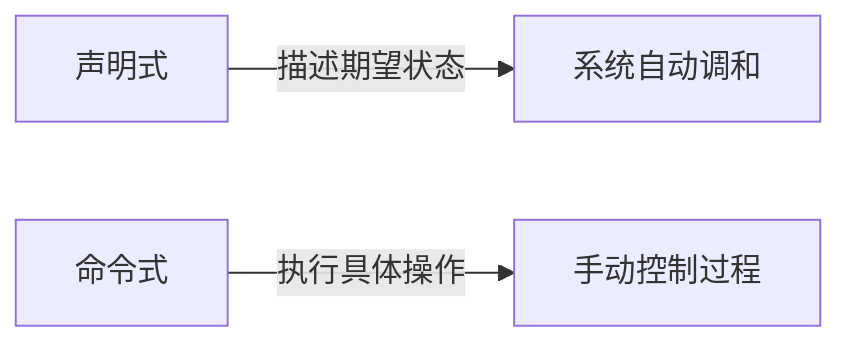
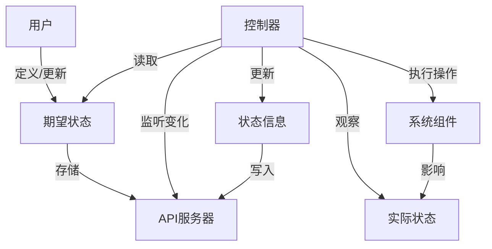
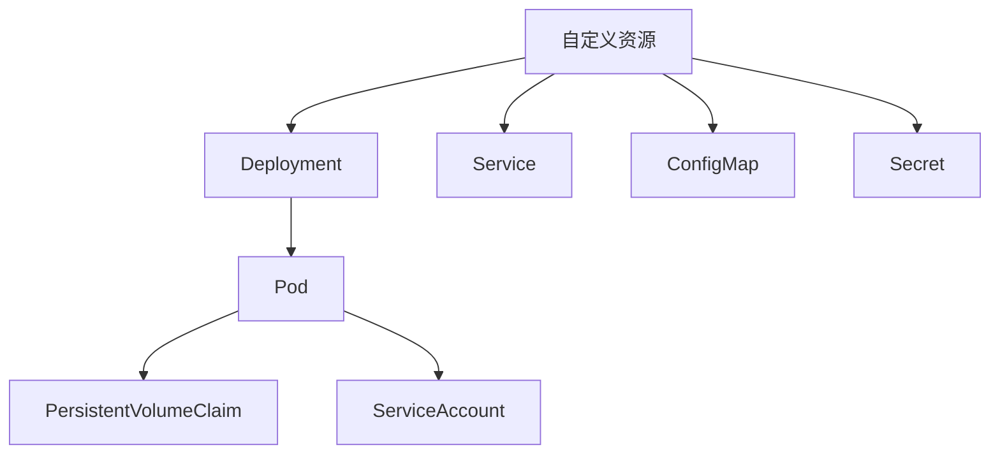
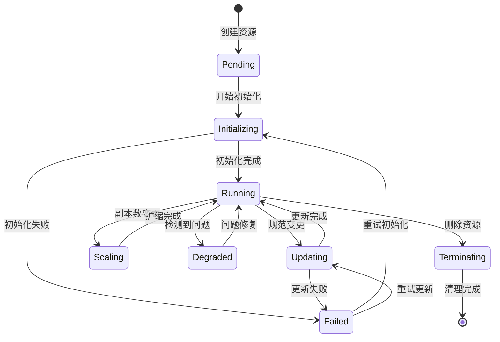
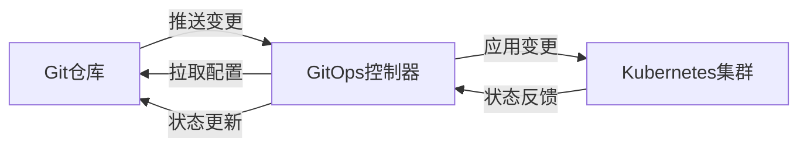

# 声明式API与控制器模式  

声明式API与控制器模式是现代云原生系统的核心设计理念，它彻底改变了我们管理复杂系统的方式。本文将深入探讨这一模式的原理、实现机制及最佳实践。

## 1. 核心概念解析  

### 1.1 声明式 vs 命令式  

在理解声明式API之前，我们需要先明确它与传统命令式方法的根本区别。



**命令式方法**：关注"如何做"，需要明确指定每一步操作。

例如，部署一个应用的命令式方法：
```bash
# 命令式方法示例
kubectl run nginx --image=nginx --port=80
kubectl expose deployment nginx --port=80
kubectl scale deployment nginx --replicas=3
```

这种方法要求用户了解所有必要的步骤，并按正确的顺序执行它们。如果需要更改，用户必须知道应该执行哪些命令来实现变更。

**声明式方法**：关注"做什么"，只需描述期望的最终状态。

例如，部署同一个应用的声明式方法：
```yaml
# 声明式方法示例
apiVersion: apps/v1
kind: Deployment
metadata:
  name: nginx
spec:
  replicas: 3
  selector:
    matchLabels:
      app: nginx
  template:
    metadata:
      labels:
        app: nginx
    spec:
      containers:
      - name: nginx
        image: nginx
        ports:
        - containerPort: 80
---
apiVersion: v1
kind: Service
metadata:
  name: nginx
spec:
  ports:
  - port: 80
    targetPort: 80
  selector:
    app: nginx
```

然后只需一个命令应用这个配置：
```bash
kubectl apply -f nginx.yaml
```

**两种方法的关键区别**：

| 特性 | 命令式 | 声明式 |
|------|--------|--------|
| 关注点 | 过程（如何做） | 结果（做什么） |
| 状态管理 | 用户负责跟踪 | 系统自动管理 |
| 幂等性 | 通常不具备 | 天然具备 |
| 错误恢复 | 需手动干预 | 自动尝试修复 |
| 学习曲线 | 需记忆命令和参数 | 需了解资源模型 |
| 适用场景 | 简单操作、调试 | 复杂系统管理、自动化 |

声明式方法的优势在于，用户只需关注系统应该处于什么状态，而不必关心如何到达该状态。系统会持续监控当前状态，并自动执行必要的操作以达到期望状态。

### 1.2 控制器模式组成  

控制器模式是实现声明式API的核心机制，它由以下关键组件组成：

| 组件           | 作用                          |  
|----------------|-----------------------------|  
| 期望状态(Spec)  | 用户声明的目标状态              |  
| 实际状态(Status)| 系统当前的实际状态              |  
| 调和循环(Reconcile)| 驱动实际状态向期望状态靠拢       |  

**期望状态(Spec)**：
- 由用户定义，描述资源应该达到的状态
- 存储在系统的数据存储中（如Kubernetes的etcd）
- 通常是不可变的，修改需要创建新版本

**实际状态(Status)**：
- 反映系统当前的真实状态
- 由控制器持续更新
- 包含资源的运行时信息、健康状态、阶段等

**调和循环(Reconcile)**：
- 控制器的核心逻辑
- 持续比较期望状态和实际状态
- 执行必要操作使实际状态向期望状态靠拢
- 处理错误和异常情况

**控制器模式工作流程**：



这种模式的核心优势在于：
1. **自动修复**：系统持续监控并自动修复偏差
2. **声明式配置**：用户只需描述期望结果
3. **状态追踪**：系统维护资源的完整状态历史
4. **松耦合**：控制器与API服务器解耦，可独立扩展

## 2. Kubernetes实现机制  

Kubernetes是声明式API和控制器模式的典范实现，它通过精心设计的架构将这些概念付诸实践。

### 2.1 控制器工作流程  

Kubernetes控制器遵循一个简单而强大的工作流程：持续监控资源状态，并执行必要的调和操作。

```go:c:\project\kphub\k8s-controller\controller.go
// 控制器的核心运行逻辑
func (c *Controller) Run(stopCh <-chan struct{}) {
    // 初始化控制器
    c.informerFactory.Start(stopCh)
    
    // 等待缓存同步
    if !cache.WaitForCacheSync(stopCh, c.deploymentsSynced) {
        utilruntime.HandleError(fmt.Errorf("failed to wait for caches to sync"))
        return
    }
    
    // 启动工作线程
    for i := 0; i < c.workers; i++ {
        go wait.Until(c.runWorker, time.Second, stopCh)
    }
    
    <-stopCh
}

// 工作线程处理队列中的项目
func (c *Controller) runWorker() {
    for c.processNextWorkItem() {
    }
}

// 处理队列中的单个项目
func (c *Controller) processNextWorkItem() bool {
    // 从队列获取下一个项目
    key, quit := c.queue.Get()
    if quit {
        return false
    }
    defer c.queue.Done(key)
    
    // 处理项目（调和逻辑）
    err := c.syncHandler(key.(string))
    if err == nil {
        // 成功处理，忘记此项目
        c.queue.Forget(key)
        return true
    }
    
    // 处理失败，重新入队（带退避机制）
    c.handleErr(err, key)
    return true
}

// 调和逻辑的核心实现
func (c *Controller) syncHandler(key string) error {
    // 解析命名空间和名称
    namespace, name, err := cache.SplitMetaNamespaceKey(key)
    if err != nil {
        return err
    }
    
    // 获取期望状态
    deployment, err := c.deploymentsLister.Deployments(namespace).Get(name)
    if errors.IsNotFound(err) {
        // 资源已删除，无需处理
        return nil
    }
    if err != nil {
        return err
    }
    
    // 获取实际状态
    pods, err := c.getPodsForDeployment(deployment)
    if err != nil {
        return err
    }
    
    // 比较期望状态和实际状态
    if !c.isDeploymentSynced(deployment, pods) {
        // 执行调和操作
        return c.reconcileDeployment(deployment, pods)
    }
    
    return nil
}
```

这个简化的控制器实现展示了几个关键概念：

1. **事件驱动**：控制器通过监听资源变化事件触发调和
2. **工作队列**：使用队列管理待处理的工作项
3. **重试机制**：处理失败时自动重试，带有退避策略
4. **调和逻辑**：比较期望状态和实际状态，执行必要操作

实际的Kubernetes控制器更加复杂，包含更多的错误处理、状态管理和优化策略，但基本工作流程是相似的。

### 2.2 资源对象定义  

Kubernetes使用自定义资源定义(CRD)扩展其API，允许用户定义自己的资源类型。

```yaml:c:\project\kphub\k8s-controller\crd.yaml
apiVersion: apiextensions.k8s.io/v1
kind: CustomResourceDefinition
metadata:
  name: myresources.example.com
spec:
  group: example.com
  names:
    kind: MyResource
    listKind: MyResourceList
    plural: myresources
    singular: myresource
    shortNames:
    - mr
  scope: Namespaced
  versions:
  - name: v1
    served: true
    storage: true
    schema:
      openAPIV3Schema:
        type: object
        properties:
          spec:
            type: object
            properties:
              replicas:
                type: integer
                minimum: 1
                default: 1
              image:
                type: string
              port:
                type: integer
                minimum: 1
                maximum: 65535
            required:
            - image
          status:
            type: object
            properties:
              availableReplicas:
                type: integer
              phase:
                type: string
                enum:
                - Pending
                - Running
                - Failed
              message:
                type: string
    subresources:
      status: {}
    additionalPrinterColumns:
    - name: Replicas
      type: integer
      jsonPath: .spec.replicas
    - name: Status
      type: string
      jsonPath: .status.phase
    - name: Age
      type: date
      jsonPath: .metadata.creationTimestamp
```

这个CRD定义了一个名为`MyResource`的自定义资源，具有以下特点：

1. **API分组和版本**：`example.com/v1`
2. **资源名称**：`myresources`（复数形式）
3. **范围**：命名空间级别
4. **结构定义**：
   - `spec`部分定义期望状态（用户提供）
   - `status`部分定义实际状态（控制器更新）
5. **验证规则**：字段类型、必填字段、取值范围等
6. **子资源**：启用status子资源，允许单独更新状态
7. **显示列**：自定义`kubectl get`命令的输出列

使用这个CRD，用户可以创建如下资源：

```yaml:c:\project\kphub\k8s-controller\myresource-example.yaml
apiVersion: example.com/v1
kind: MyResource
metadata:
  name: my-app
  namespace: default
spec:
  replicas: 3
  image: nginx:1.19
  port: 80
```

控制器将监听这些资源的变化，并创建相应的Deployment、Service等底层资源来实现用户的意图。

## 3. 自定义控制器开发  

开发自定义控制器是扩展Kubernetes功能的强大方式，它允许实现特定领域的自动化逻辑。

### 3.1 Operator框架结构  

Operator是特定领域的控制器，通常使用以下结构组织代码：

```text:c:\project\kphub\k8s-controller\operator\
operator/
├── main.go                 # 程序入口点
├── Dockerfile              # 构建容器镜像
├── Makefile                # 构建和部署脚本
├── PROJECT                 # Kubebuilder项目配置
├── go.mod                  # Go模块定义
├── go.sum                  # Go依赖锁定
├── api/                    # API定义
│   └── v1/                 # v1 API版本
│       ├── groupversion_info.go  # API组和版本信息
│       ├── myresource_types.go   # 资源类型定义
│       └── zz_generated.deepcopy.go  # 自动生成的代码
├── controllers/            # 控制器实现
│   ├── myresource_controller.go  # 主控制器逻辑
│   └── suite_test.go       # 测试套件
├── config/                 # Kubernetes配置
│   ├── crd/                # CRD定义
│   ├── rbac/               # 角色和权限
│   ├── manager/            # 控制器管理器配置
│   └── samples/            # 示例资源
└── hack/                   # 脚本和工具
    └── boilerplate.go.txt  # 代码头部模板
```

这种结构遵循Kubernetes Operator模式的最佳实践，使用了如Kubebuilder或Operator SDK等框架的标准布局。

**API定义示例**：

```go:c:\project\kphub\k8s-controller\api\v1\myresource_types.go
package v1

import (
	metav1 "k8s.io/apimachinery/pkg/apis/meta/v1"
)

// MyResourceSpec 定义了MyResource的期望状态
type MyResourceSpec struct {
	// Replicas是应用的副本数
	// +kubebuilder:validation:Minimum=1
	// +kubebuilder:default=1
	Replicas int32 `json:"replicas,omitempty"`

	// Image是容器镜像
	// +kubebuilder:validation:Required
	Image string `json:"image"`

	// Port是应用监听的端口
	// +kubebuilder:validation:Minimum=1
	// +kubebuilder:validation:Maximum=65535
	Port int32 `json:"port,omitempty"`
}

// MyResourceStatus 定义了MyResource的实际状态
type MyResourceStatus struct {
	// AvailableReplicas是当前可用的副本数
	AvailableReplicas int32 `json:"availableReplicas,omitempty"`

	// Phase是资源的当前阶段
	// +kubebuilder:validation:Enum=Pending;Running;Failed
	Phase string `json:"phase,omitempty"`

	// Message提供关于当前状态的额外信息
	Message string `json:"message,omitempty"`
}

// +kubebuilder:object:root=true
// +kubebuilder:subresource:status
// +kubebuilder:printcolumn:name="Replicas",type="integer",JSONPath=".spec.replicas"
// +kubebuilder:printcolumn:name="Status",type="string",JSONPath=".status.phase"
// +kubebuilder:printcolumn:name="Age",type="date",JSONPath=".metadata.creationTimestamp"

// MyResource是自定义资源的定义
type MyResource struct {
	metav1.TypeMeta   `json:",inline"`
	metav1.ObjectMeta `json:"metadata,omitempty"`

	Spec   MyResourceSpec   `json:"spec,omitempty"`
	Status MyResourceStatus `json:"status,omitempty"`
}

// +kubebuilder:object:root=true

// MyResourceList包含MyResource的列表
type MyResourceList struct {
	metav1.TypeMeta `json:",inline"`
	metav1.ListMeta `json:"metadata,omitempty"`
	Items           []MyResource `json:"items"`
}

func init() {
	SchemeBuilder.Register(&MyResource{}, &MyResourceList{})
}
```

这个Go结构体定义了自定义资源的数据模型，包括：
1. **类型元数据**：API组、版本、种类等
2. **对象元数据**：名称、命名空间、标签等
3. **规范(Spec)**：用户定义的期望状态
4. **状态(Status)**：控制器更新的实际状态

注释中的`+kubebuilder`标记用于生成CRD验证规则、子资源配置和自定义列显示。

### 3.2 调和逻辑实现  

控制器的核心是调和循环，它负责将系统状态调整为与规范一致。

```go:c:\project\kphub\k8s-controller\controllers\myresource_controller.go
package controllers

import (
	"context"
	"fmt"
	"time"

	appsv1 "k8s.io/api/apps/v1"
	corev1 "k8s.io/api/core/v1"
	"k8s.io/apimachinery/pkg/api/errors"
	metav1 "k8s.io/apimachinery/pkg/apis/meta/v1"
	"k8s.io/apimachinery/pkg/runtime"
	"k8s.io/apimachinery/pkg/types"
	"k8s.io/apimachinery/pkg/util/intstr"
	ctrl "sigs.k8s.io/controller-runtime"
	"sigs.k8s.io/controller-runtime/pkg/client"
	"sigs.k8s.io/controller-runtime/pkg/controller/controllerutil"
	"sigs.k8s.io/controller-runtime/pkg/log"

	examplev1 "example.com/operator/api/v1"
)

// MyResourceReconciler 调和MyResource资源
type MyResourceReconciler struct {
	client.Client
	Scheme *runtime.Scheme
}

// +kubebuilder:rbac:groups=example.com,resources=myresources,verbs=get;list;watch;create;update;patch;delete
// +kubebuilder:rbac:groups=example.com,resources=myresources/status,verbs=get;update;patch
// +kubebuilder:rbac:groups=apps,resources=deployments,verbs=get;list;watch;create;update;patch;delete
// +kubebuilder:rbac:groups=core,resources=services,verbs=get;list;watch;create;update;patch;delete

// Reconcile 是调和循环的入口点
func (r *MyResourceReconciler) Reconcile(ctx context.Context, req ctrl.Request) (ctrl.Result, error) {
	log := log.FromContext(ctx)
	log.Info("开始调和", "请求", req)

	// 获取MyResource资源
	myRes := &examplev1.MyResource{}
	if err := r.Get(ctx, req.NamespacedName, myRes); err != nil {
		if errors.IsNotFound(err) {
			// 资源已被删除，无需操作
			log.Info("MyResource资源不存在，可能已被删除")
			return ctrl.Result{}, nil
		}
		// 读取错误
		log.Error(err, "获取MyResource资源失败")
		return ctrl.Result{}, err
	}

	// 初始化状态
	if myRes.Status.Phase == "" {
		myRes.Status.Phase = "Pending"
		if err := r.Status().Update(ctx, myRes); err != nil {
			log.Error(err, "初始化状态失败")
			return ctrl.Result{}, err
		}
	}

	// 确保Deployment存在
	deployment, err := r.ensureDeployment(ctx, myRes)
	if err != nil {
		log.Error(err, "确保Deployment存在失败")
		return r.updateStatusWithError(ctx, myRes, err)
	}

	// 确保Service存在
	service, err := r.ensureService(ctx, myRes)
	if err != nil {
		log.Error(err, "确保Service存在失败")
		return r.updateStatusWithError(ctx, myRes, err)
	}

	// 更新状态
	availableReplicas := deployment.Status.AvailableReplicas
	myRes.Status.AvailableReplicas = availableReplicas

	if availableReplicas == myRes.Spec.Replicas {
		myRes.Status.Phase = "Running"
		myRes.Status.Message = fmt.Sprintf("应用运行中，服务地址: %s:%d", service.Spec.ClusterIP, service.Spec.Ports[0].Port)
	} else if availableReplicas > 0 {
		myRes.Status.Phase = "Running"
		myRes.Status.Message = fmt.Sprintf("应用部分可用 (%d/%d)", availableReplicas, myRes.Spec.Replicas)
	} else {
		myRes.Status.Phase = "Pending"
		myRes.Status.Message = "等待Pod就绪"
	}

	if err := r.Status().Update(ctx, myRes); err != nil {
		log.Error(err, "更新状态失败")
		return ctrl.Result{}, err
	}

	// 如果不是所有副本都就绪，稍后重新检查
	if availableReplicas < myRes.Spec.Replicas {
		return ctrl.Result{RequeueAfter: 10 * time.Second}, nil
	}

	return ctrl.Result{RequeueAfter: 30 * time.Second}, nil
}

// ensureDeployment 确保Deployment资源存在并符合期望状态
func (r *MyResourceReconciler) ensureDeployment(ctx context.Context, myRes *examplev1.MyResource) (*appsv1.Deployment, error) {
	// 构建期望的Deployment
	deployment := &appsv1.Deployment{
		ObjectMeta: metav1.ObjectMeta{
			Name:      myRes.Name,
			Namespace: myRes.Namespace,
		},
		Spec: appsv1.DeploymentSpec{
			Replicas: &myRes.Spec.Replicas,
			Selector: &metav1.LabelSelector{
				MatchLabels: map[string]string{
					"app": myRes.Name,
				},
			},
			Template: corev1.PodTemplateSpec{
				ObjectMeta: metav1.ObjectMeta{
					Labels: map[string]string{
						"app": myRes.Name,
					},
				},
				Spec: corev1.PodSpec{
					Containers: []corev1.Container{
						{
							Name:  "app",
							Image: myRes.Spec.Image,
							Ports: []corev1.ContainerPort{
								{
									ContainerPort: myRes.Spec.Port,
								},
							},
						},
					},
				},
			},
		},
	}

	// 设置控制器引用
	if err := controllerutil.SetControllerReference(myRes, deployment, r.Scheme); err != nil {
		return nil, err
	}

	// 创建或更新Deployment
	found := &appsv1.Deployment{}
	err := r.Get(ctx, types.NamespacedName{Name: deployment.Name, Namespace: deployment.Namespace}, found)
	if err != nil {
		if errors.IsNotFound(err) {
			// 创建新Deployment
			if err = r.Create(ctx, deployment); err != nil {
				return nil, err
			}
			return deployment, nil
		}
		return nil, err
	}

	// 更新现有Deployment
	found.Spec = deployment.Spec
	if err = r.Update(ctx, found); err != nil {
		return nil, err
	}

	return found, nil
}

// ensureService 确保Service资源存在并符合期望状态
func (r *MyResourceReconciler) ensureService(ctx context.Context, myRes *examplev1.MyResource) (*corev1.Service, error) {
	// 构建期望的Service
	service := &corev1.Service{
		ObjectMeta: metav1.ObjectMeta{
			Name:      myRes.Name,
			Namespace: myRes.Namespace,
		},
		Spec: corev1.ServiceSpec{
			Selector: map[string]string{
				"app": myRes.Name,
			},
			Ports: []corev1.ServicePort{
				{
					Port:       80,
					TargetPort: intstr.FromInt(int(myRes.Spec.Port)),
				},
			},
		},
	}

	// 设置控制器引用
	if err := controllerutil.SetControllerReference(myRes, service, r.Scheme); err != nil {
		return nil, err
	}

	// 创建或更新Service
	found := &corev1.Service{}
	err := r.Get(ctx, types.NamespacedName{Name: service.Name, Namespace: service.Namespace}, found)
	if err != nil {
		if errors.IsNotFound(err) {
			// 创建新Service
			if err = r.Create(ctx, service); err != nil {
				return nil, err
			}
			return service, nil
		}
		return nil, err
	}

	// 更新现有Service（保留ClusterIP）
	found.Spec.Ports = service.Spec.Ports
	found.Spec.Selector = service.Spec.Selector
	if err = r.Update(ctx, found); err != nil {
		return nil, err
	}

	return found, nil
}

// updateStatusWithError 更新资源状态以反映错误
func (r *MyResourceReconciler) updateStatusWithError(ctx context.Context, myRes *examplev1.MyResource, err error) (ctrl.Result, error) {
	myRes.Status.Phase = "Failed"
	myRes.Status.Message = fmt.Sprintf("错误: %v", err)
	
	if updateErr := r.Status().Update(ctx, myRes); updateErr != nil {
		return ctrl.Result{}, fmt.Errorf("原始错误: %v, 状态更新错误: %v", err, updateErr)
	}
	
	return ctrl.Result{RequeueAfter: 30 * time.Second}, nil
}

// SetupWithManager 设置控制器与管理器
func (r *MyResourceReconciler) SetupWithManager(mgr ctrl.Manager) error {
	return ctrl.NewControllerManagedBy(mgr).
		For(&examplev1.MyResource{}).
		Owns(&appsv1.Deployment{}).
		Owns(&corev1.Service{}).
		Complete(r)
}
```

这个控制器实现了以下关键功能：

1. **资源获取**：读取自定义资源及其关联资源
2. **状态初始化**：为新资源设置初始状态
3. **资源创建/更新**：确保Deployment和Service符合期望状态
4. **所有权管理**：设置控制器引用，建立资源间的父子关系
5. **状态更新**：根据实际情况更新资源状态
6. **错误处理**：捕获并记录错误，更新资源状态
7. **重新排队**：设置适当的重新调和间隔

控制器使用`controller-runtime`库简化了许多常见任务，如资源监视、事件处理和客户端操作。

## 4. 高级模式  

随着系统复杂性增加，控制器需要采用更高级的模式来管理资源和状态。

### 4.1 多资源协调  

实际应用中，一个自定义资源通常需要协调多个底层资源，形成资源依赖图。



**多资源协调的关键考虑因素**：

1. **依赖顺序**：确保按正确顺序创建资源（例如，先创建ConfigMap，再创建依赖它的Deployment）
2. **所有权关系**：使用`ownerReferences`建立资源间的父子关系，实现级联删除
3. **状态聚合**：从多个子资源收集状态信息，更新父资源状态
4. **错误传播**：处理任何子资源操作中的错误，并适当反映在父资源状态中

**实现多资源协调的模式**：

```go:c:\project\kphub\k8s-controller\multi_resource.go
// 多资源协调示例
func (r *MyResourceReconciler) reconcileResources(ctx context.Context, myRes *examplev1.MyResource) error {
    // 1. 创建或更新ConfigMap（包含配置数据）
    if err := r.reconcileConfigMap(ctx, myRes); err != nil {
        return fmt.Errorf("配置映射协调失败: %w", err)
    }
    
    // 2. 创建或更新Secret（包含敏感数据）
    if err := r.reconcileSecret(ctx, myRes); err != nil {
        return fmt.Errorf("密钥协调失败: %w", err)
    }
    
    // 3. 创建或更
继续编写声明式API与控制器模式文档：

```go:c:\project\kphub\k8s-controller\multi_resource.go
    // 3. 创建或更新PersistentVolumeClaim（用于持久化数据）
    if err := r.reconcilePVC(ctx, myRes); err != nil {
        return fmt.Errorf("持久卷声明协调失败: %w", err)
    }
    
    // 4. 创建或更新Deployment（应用主体）
    deployment, err := r.reconcileDeployment(ctx, myRes)
    if err != nil {
        return fmt.Errorf("部署协调失败: %w", err)
    }
    
    // 5. 创建或更新Service（服务暴露）
    service, err := r.reconcileService(ctx, myRes)
    if err != nil {
        return fmt.Errorf("服务协调失败: %w", err)
    }
    
    // 6. 创建或更新Ingress（外部访问）
    if err := r.reconcileIngress(ctx, myRes); err != nil {
        return fmt.Errorf("入口协调失败: %w", err)
    }
    
    // 7. 更新状态（聚合所有子资源状态）
    return r.updateResourceStatus(ctx, myRes, deployment, service)
}
```

多资源协调的最佳实践：

1. **模块化设计**：将每种资源的协调逻辑封装为独立函数
2. **错误处理**：使用包装错误提供上下文信息，便于调试
3. **幂等操作**：确保所有操作都是幂等的，可以安全重试
4. **资源依赖**：明确处理资源间的依赖关系
5. **状态聚合**：从所有子资源收集并聚合状态信息

### 4.2 状态管理策略  

有效的状态管理是控制器的关键部分，它提供了资源当前状态的可见性。

```go:c:\project\kphub\k8s-controller\status_utils.go
package controllers

import (
    "context"
    "encoding/json"
    "fmt"
    "time"

    appsv1 "k8s.io/api/apps/v1"
    corev1 "k8s.io/api/core/v1"
    metav1 "k8s.io/apimachinery/pkg/apis/meta/v1"
    "k8s.io/apimachinery/pkg/types"
    "sigs.k8s.io/controller-runtime/pkg/client"

    examplev1 "example.com/operator/api/v1"
)

// StatusManager 处理资源状态更新
type StatusManager struct {
    client client.Client
}

// NewStatusManager 创建新的状态管理器
func NewStatusManager(c client.Client) *StatusManager {
    return &StatusManager{client: c}
}

// UpdateStatus 更新资源状态
func (m *StatusManager) UpdateStatus(ctx context.Context, obj *examplev1.MyResource, deployment *appsv1.Deployment, service *corev1.Service) error {
    // 计算新状态
    newStatus := calculateStatus(obj, deployment, service)
    
    // 如果状态没有变化，跳过更新
    if statusEqual(obj.Status, newStatus) {
        return nil
    }
    
    // 使用补丁更新状态（避免冲突）
    return m.patchStatus(ctx, obj, newStatus)
}

// calculateStatus 根据子资源计算新状态
func calculateStatus(obj *examplev1.MyResource, deployment *appsv1.Deployment, service *corev1.Service) examplev1.MyResourceStatus {
    status := examplev1.MyResourceStatus{}
    
    // 设置基本字段
    status.ObservedGeneration = obj.Generation
    status.LastUpdateTime = metav1.NewTime(time.Now())
    
    // 从Deployment获取状态
    if deployment != nil {
        status.AvailableReplicas = deployment.Status.AvailableReplicas
        status.ReadyReplicas = deployment.Status.ReadyReplicas
        status.UpdatedReplicas = deployment.Status.UpdatedReplicas
    }
    
    // 从Service获取状态
    if service != nil {
        status.ServiceName = service.Name
        status.ServiceClusterIP = service.Spec.ClusterIP
        if len(service.Spec.Ports) > 0 {
            status.ServicePort = service.Spec.Ports[0].Port
        }
    }
    
    // 计算整体阶段
    if deployment == nil || service == nil {
        status.Phase = "Pending"
        status.Message = "正在创建资源"
    } else if status.AvailableReplicas == 0 {
        status.Phase = "Pending"
        status.Message = "等待Pod就绪"
    } else if status.AvailableReplicas < obj.Spec.Replicas {
        status.Phase = "Degraded"
        status.Message = fmt.Sprintf("部分Pod就绪: %d/%d", status.AvailableReplicas, obj.Spec.Replicas)
    } else if status.UpdatedReplicas < obj.Spec.Replicas {
        status.Phase = "Updating"
        status.Message = fmt.Sprintf("更新中: %d/%d", status.UpdatedReplicas, obj.Spec.Replicas)
    } else {
        status.Phase = "Running"
        status.Message = "所有Pod就绪"
    }
    
    // 添加条件
    status.Conditions = updateConditions(obj.Status.Conditions, status.Phase)
    
    return status
}

// patchStatus 使用补丁更新状态
func (m *StatusManager) patchStatus(ctx context.Context, obj *examplev1.MyResource, newStatus examplev1.MyResourceStatus) error {
    // 创建补丁对象
    patch := client.MergeFrom(obj.DeepCopy())
    
    // 更新状态
    obj.Status = newStatus
    
    // 应用补丁
    return m.client.Status().Patch(ctx, obj, patch)
}

// statusEqual 比较两个状态是否相等
func statusEqual(old, new examplev1.MyResourceStatus) bool {
    // 忽略时间戳等非关键字段
    old.LastUpdateTime = new.LastUpdateTime
    
    // 序列化并比较
    oldData, _ := json.Marshal(old)
    newData, _ := json.Marshal(new)
    return string(oldData) == string(newData)
}

// updateConditions 更新资源条件
func updateConditions(conditions []metav1.Condition, phase string) []metav1.Condition {
    now := metav1.NewTime(time.Now())
    result := []metav1.Condition{}
    
    // 复制现有条件
    conditionMap := make(map[string]metav1.Condition)
    for _, condition := range conditions {
        conditionMap[condition.Type] = condition
    }
    
    // 更新Ready条件
    readyCondition := metav1.Condition{
        Type:               "Ready",
        Status:             metav1.ConditionFalse,
        LastTransitionTime: now,
        Reason:             "Processing",
        Message:            "资源正在处理中",
    }
    
    if phase == "Running" {
        readyCondition.Status = metav1.ConditionTrue
        readyCondition.Reason = "ResourceReady"
        readyCondition.Message = "资源已就绪"
    }
    
    // 检查是否需要更新转换时间
    if existing, found := conditionMap["Ready"]; found {
        if existing.Status == readyCondition.Status {
            readyCondition.LastTransitionTime = existing.LastTransitionTime
        }
    }
    
    result = append(result, readyCondition)
    
    // 添加其他条件...
    
    return result
}
```

这个状态管理器实现了几个关键功能：

1. **状态计算**：基于多个子资源计算聚合状态
2. **条件管理**：维护标准的Kubernetes条件
3. **补丁更新**：使用补丁机制避免更新冲突
4. **状态比较**：避免不必要的状态更新
5. **时间戳管理**：正确处理条件转换时间

**状态管理最佳实践**：

1. **使用子资源**：利用status子资源分离状态更新和规范更新
2. **标准条件**：遵循Kubernetes条件格式（类型、状态、原因、消息、时间戳）
3. **乐观并发**：使用补丁或资源版本处理并发更新
4. **状态缓存**：避免频繁状态更新，减少API服务器负载
5. **丰富信息**：提供足够详细的状态信息，便于用户理解和调试

## 5. 生产实践  

将控制器部署到生产环境需要考虑性能、可靠性和可维护性等因素。

### 5.1 性能优化  

控制器性能对集群稳定性有重要影响，需要进行适当优化。

```yaml:c:\project\kphub\k8s-controller\manager-config.yaml
apiVersion: controller-runtime.sigs.k8s.io/v1alpha1
kind: ControllerManagerConfig
metadata:
  name: controller-manager-config
health:
  healthProbeBindAddress: :8081
metrics:
  bindAddress: :8080
webhook:
  port: 9443
leaderElection:
  leaderElect: true
  resourceName: controller-leader-lock
controller:
  # 调和周期（如果没有变更事件触发）
  syncPeriod: &syncPeriod
    seconds: 300
  # 每个控制器的最大并发调和数
  maxConcurrentReconciles: 3
  # 工作队列配置
  workQueueConfig:
    # 队列大小
    queueSize: 100
    # 重试延迟基数
    baseDelay: 
      milliseconds: 10
    # 最大重试延迟
    maxDelay:
      seconds: 60
    # 失败重试次数
    maxRetries: 5
  # 缓存配置
  cacheConfig:
    # 重新同步周期
    resyncPeriod: *syncPeriod
    # 默认限制器
    defaultLimiter:
      qps: 100
      burst: 200
```

这个配置文件定义了控制器管理器的关键性能参数：

1. **同步周期**：定期重新调和资源的时间间隔
2. **并发数**：每个控制器可以并行处理的调和数量
3. **队列配置**：工作队列大小和重试策略
4. **缓存设置**：客户端缓存刷新频率和限流参数

**性能优化策略**：

1. **资源过滤**：只监视和处理相关资源，减少不必要的调和
   ```go
   // 使用标签选择器过滤资源
   func (r *MyResourceReconciler) SetupWithManager(mgr ctrl.Manager) error {
       return ctrl.NewControllerManagedBy(mgr).
           For(&examplev1.MyResource{}, builder.WithPredicates(
               predicate.LabelSelectorPredicate(
                   metav1.LabelSelector{
                       MatchLabels: map[string]string{"tier": "production"},
                   },
               ),
           )).
           Complete(r)
   }
   ```

2. **事件过滤**：使用谓词过滤不相关的事件
   ```go
   // 过滤不需要处理的事件
   func (r *MyResourceReconciler) SetupWithManager(mgr ctrl.Manager) error {
       return ctrl.NewControllerManagedBy(mgr).
           For(&examplev1.MyResource{}).
           WithEventFilter(predicate.Funcs{
               // 忽略状态更新事件
               UpdateFunc: func(e event.UpdateEvent) bool {
                   oldObj := e.ObjectOld.(*examplev1.MyResource)
                   newObj := e.ObjectNew.(*examplev1.MyResource)
                   // 只有规范变化时才触发调和
                   return !reflect.DeepEqual(oldObj.Spec, newObj.Spec)
               },
           }).
           Complete(r)
   }
   ```

3. **批处理**：批量处理相关操作，减少API调用
   ```go
   // 批量获取Pod
   func (r *MyResourceReconciler) getPodsForDeployment(ctx context.Context, deployment *appsv1.Deployment) (*corev1.PodList, error) {
       podList := &corev1.PodList{}
       labels := client.MatchingLabels(deployment.Spec.Selector.MatchLabels)
       namespace := client.InNamespace(deployment.Namespace)
       
       // 一次获取所有匹配的Pod
       if err := r.List(ctx, podList, namespace, labels); err != nil {
           return nil, err
       }
       
       return podList, nil
   }
   ```

4. **缓存利用**：充分利用客户端缓存，减少API服务器负载
   ```go
   // 使用缓存获取资源
   func (r *MyResourceReconciler) getDeploymentFromCache(ctx context.Context, name, namespace string) (*appsv1.Deployment, error) {
       // 使用Lister从缓存获取（而不是直接调用API服务器）
       return r.deploymentLister.Deployments(namespace).Get(name)
   }
   ```

5. **资源限制**：为控制器设置适当的资源请求和限制
   ```yaml
   resources:
     requests:
       cpu: 100m
       memory: 128Mi
     limits:
       cpu: 500m
       memory: 512Mi
   ```

### 5.2 错误处理机制  

健壮的错误处理对于控制器的可靠性至关重要。

```go:c:\project\kphub\k8s-controller\error_handler.go
package controllers

import (
    "context"
    "fmt"
    "time"

    "k8s.io/apimachinery/pkg/api/errors"
    "k8s.io/client-go/util/retry"
    ctrl "sigs.k8s.io/controller-runtime"
    "sigs.k8s.io/controller-runtime/pkg/log"

    examplev1 "example.com/operator/api/v1"
)

// ErrorHandler 处理控制器错误
type ErrorHandler struct {
    statusManager *StatusManager
}

// NewErrorHandler 创建新的错误处理器
func NewErrorHandler(statusManager *StatusManager) *ErrorHandler {
    return &ErrorHandler{
        statusManager: statusManager,
    }
}

// HandleReconcileError 处理调和过程中的错误
func (h *ErrorHandler) HandleReconcileError(ctx context.Context, obj *examplev1.MyResource, err error) (ctrl.Result, error) {
    log := log.FromContext(ctx)
    
    // 分类错误
    switch {
    case errors.IsNotFound(err):
        // 资源不存在，可能已被删除
        log.Info("资源不存在，忽略错误", "error", err)
        return ctrl.Result{}, nil
        
    case errors.IsConflict(err):
        // 资源冲突，通常是由于并发更新
        log.Info("检测到资源冲突，稍后重试", "error", err)
        return ctrl.Result{Requeue: true}, nil
        
    case errors.IsAlreadyExists(err):
        // 资源已存在
        log.Info("资源已存在，稍后重试", "error", err)
        return ctrl.Result{RequeueAfter: 5 * time.Second}, nil
        
    case errors.IsForbidden(err):
        // 权限问题
        log.Error(err, "权限不足，无法执行操作")
        return h.updateStatusWithError(ctx, obj, "PermissionDenied", err)
        
    case errors.IsTimeout(err) || errors.IsServerTimeout(err):
        // 超时错误
        log.Info("操作超时，稍后重试", "error", err)
        return ctrl.Result{RequeueAfter: 10 * time.Second}, nil
        
    case errors.IsTooManyRequests(err):
        // 限流错误
        log.Info("请求过多，稍后重试", "error", err)
        return ctrl.Result{RequeueAfter: 30 * time.Second}, nil
        
    case isTransientError(err):
        // 临时错误，可以重试
        log.Info("检测到临时错误，稍后重试", "error", err)
        return ctrl.Result{RequeueAfter: 5 * time.Second}, nil
        
    default:
        // 其他错误（可能是永久性错误）
        log.Error(err, "调和过程中发生错误")
        return h.updateStatusWithError(ctx, obj, "ReconcileError", err)
    }
}

// RetryOnError 使用退避重试机制执行操作
func (h *ErrorHandler) RetryOnError(ctx context.Context, operation string, fn func() error) error {
    log := log.FromContext(ctx)
    
    return retry.OnError(retry.DefaultRetry, func(err error) bool {
        // 确定错误是否可重试
        retryable := errors.IsConflict(err) || 
                     errors.IsServerTimeout(err) || 
                     errors.IsTooManyRequests(err) ||
                     isTransientError(err)
                     
        if retryable {
            log.Info("操作失败，将重试", "operation", operation, "error", err)
        }
        
        return retryable
    }, fn)
}

// updateStatusWithError 更新资源状态以反映错误
func (h *ErrorHandler) updateStatusWithError(ctx context.Context, obj *examplev1.MyResource, reason string, err error) (ctrl.Result, error) {
    log := log.FromContext(ctx)
    
    // 创建错误状态
    errStatus := examplev1.MyResourceStatus{
        Phase:   "Failed",
        Message: fmt.Sprintf("错误: %v", err),
        Conditions: []metav1.Condition{
            {
                Type:               "Ready",
                Status:             metav1.ConditionFalse,
                LastTransitionTime: metav1.Now(),
                Reason:             reason,
                Message:            err.Error(),
            },
        },
    }
    
    // 尝试更新状态
    updateErr := retry.RetryOnConflict(retry.DefaultRetry, func() error {
        // 重新获取最新对象
        latest := &examplev1.MyResource{}
        if getErr := h.statusManager.client.Get(ctx, client.ObjectKeyFromObject(obj), latest); getErr != nil {
            return getErr
        }
        
        // 更新状态
        latest.Status = errStatus
        return h.statusManager.client.Status().Update(ctx, latest)
    })
    
    if updateErr != nil {
        log.Error(updateErr, "无法更新错误状态")
        // 返回原始错误，确保调和会重试
        return ctrl.Result{}, err
    }
    
    // 状态已更新，稍后重试
    return ctrl.Result{RequeueAfter: 60 * time.Second}, nil
}

// isTransientError 判断错误是否为临时性错误
func isTransientError(err error) bool {
    // 检查错误是否包含特定字符串
    transientErrorMessages := []string{
        "connection refused",
        "too many open files",
        "temporary unavailable",
        "deadline exceeded",
        "connection reset",
    }
    
    errMsg := err.Error()
    for _, msg := range transientErrorMessages {
        if strings.Contains(errMsg, msg) {
            return true
        }
    }
    
    return false
}
```

这个错误处理器实现了几个关键功能：

1. **错误分类**：根据错误类型采取不同的处理策略
2. **重试机制**：对临时错误使用退避重试
3. **状态更新**：将错误信息反映在资源状态中
4. **日志记录**：记录详细的错误信息，便于调试

**错误处理最佳实践**：

1. **区分错误类型**：永久性错误vs临时性错误，需要不同处理策略
2. **指数退避**：使用指数退避算法重试临时错误
3. **错误传播**：适当包装错误，保留上下文信息
4. **状态反馈**：将错误信息反映在资源状态中，提高可见性
5. **限制重试**：设置最大重试次数，避免无限重试
6. **降级策略**：在关键错误情况下实施降级策略

## 6. 设计模式  

控制器开发中常用的设计模式可以提高代码质量和可维护性。

### 6.1 有限状态机模式  

有限状态机(FSM)模式适用于管理复杂资源的生命周期。



**FSM实现示例**：

```go:c:\project\kphub\k8s-controller\fsm.go
package controllers

import (
    "context"
    "fmt"

    "k8s.io/apimachinery/pkg/api/errors"
    metav1 "k8s.io/apimachinery/pkg/apis/meta/v1"
    ctrl "sigs.k8s.io/controller-runtime"
    "sigs.k8s.io/controller-runtime/pkg/client"
    "sigs.k8s.io/controller-runtime/pkg/log"

    examplev1 "example.com/operator/api/v1"
)

// StateMachine 实现资源状态机
type StateMachine struct {
    client        client.Client
    statusManager *StatusManager
    errorHandler  *ErrorHandler
}

// NewStateMachine 创建新的状态机
func NewStateMachine(c client.Client, sm *StatusManager, eh *ErrorHandler) *StateMachine {
    return &StateMachine{
        client:        c,
        statusManager: sm,
        errorHandler:  eh,
    }
}

// Reconcile 处理资源调和
func (m *StateMachine) Reconcile(ctx context.Context, req ctrl.Request) (ctrl.Result, error) {
    log := log.FromContext(ctx)
    
    // 获取资源
    resource := &examplev1.MyResource{}
    if err := m.client.Get(ctx, req.NamespacedName, resource); err != nil {
        if errors.IsNotFound(err) {
            return ctrl.Result{}, nil
        }
        return ctrl.Result{}, err
    }
    
    // 确定当前状态
    currentState := getState(resource)
    log.Info("开始处理资源", "state", currentState)
    
    // 根据当前状态执行相应处理
    var result ctrl.Result
    var err error
    
    switch currentState {
    case "":
        // 新资源，初始化状态
        result, err = m.handleNewResource(ctx, resource)
    case "Pending":
        // 等待初始化
        result, err = m.handlePendingState(ctx, resource)
    case "Initializing":
        // 初始化中
        result, err = m.handleInitializingState(ctx, resource)
    case "Running":
        // 正常运行
        result, err = m.handleRunningState(ctx, resource)
    case "Updating":
        // 更新中
        result, err = m.handleUpdatingState(ctx, resource)
    case "Scaling":
        // 扩缩中
        result, err = m.handleScalingState(ctx, resource)
    case "Degraded":
        // 降级状态
        result, err = m.handleDegradedState(ctx, resource)
    case "Failed":
        // 失败状态
        result, err = m.handleFailedState(ctx, resource)
    case "Terminating":
        // 终止中
        result, err = m.handleTerminatingState(ctx, resource)
    default:
        // 未知状态
        log.Info("资源处于未知状态", "state", currentState)
        result, err = m.transitionToState(ctx, resource, "Failed", "未知状态")
    }
    
    if err != nil {
        return m.errorHandler.HandleReconcileError(ctx, resource, err)
    }
    
    return result, nil
}

// 处理各种状态的函数
func (m *StateMachine) handleNewResource(ctx context.Context, resource *examplev1.MyResource) (ctrl.Result, error) {
    return m.transitionToState(ctx, resource, "Pending", "资源已创建，等待初始化")
}

func (m *StateMachine) handlePendingState(ctx context.Context, resource *examplev1.MyResource) (ctrl.Result, error) {
    // 检查前置条件
    ready, err := m.checkPrerequisites(ctx, resource)
    if err != nil {
        return ctrl.Result{}, err
    }
    
    if !ready {
        // 前置条件未满足，保持Pending状态
        return ctrl.Result{RequeueAfter: 5 * time.Second}, nil
    }
    
    // 前置条件满足，转换到初始化状态
    return m.transitionToState(ctx, resource, "Initializing", "开始初始化资源")
}

func (m *StateMachine) handleInitializingState(ctx context.Context, resource *examplev1.MyResource) (ctrl.Result, error) {
    // 执行初始化逻辑
    err := m.initializeResource(ctx, resource)
    if err != nil {
        return m.transitionToState(ctx, resource, "Failed", fmt.Sprintf("初始化失败: %v", err))
    }
    
    // 初始化成功，转换到运行状态
    return m.transitionToState(ctx, resource, "Running", "资源初始化完成")
}

func (m *StateMachine) handleRunningState(ctx context.Context, resource *examplev1.MyResource) (ctrl.Result, error) {
    // 检查是否需要更新
    needsUpdate, err := m.checkForUpdates(ctx, resource)
    if err != nil {
        return ctrl.Result{}, err
    }
    
    if needsUpdate {
        // 需要更新，转换到更新状态
        return m.transitionToState(ctx, resource, "Updating", "检测到配置变更，开始更新")
    }
    
    // 检查是否需要扩缩容
    needsScaling, err := m.checkForScaling(ctx, resource)
    if err != nil {
        return ctrl.Result{}, err
    }
    
    if needsScaling {
        // 需要扩缩容，转换到扩缩状态
        return m.transitionToState(ctx, resource, "Scaling", "检测到副本数变更，开始扩缩容")
    }
    
    // 检查健康状态
    healthy, err := m.checkHealth(ctx, resource)
    if err != nil {
        return ctrl.Result{}, err
    }
    
    if !healthy {
        // 不健康，转换到降级状态
        return m.transitionToState(ctx, resource, "Degraded", "检测到健康问题")
    }
    
    // 一切正常，保持运行状态
    return ctrl.Result{RequeueAfter: 30 * time.Second}, nil
}

// 其他状态处理函数...

// 状态转换函数
func (m *StateMachine) transitionToState(ctx context.Context, resource *examplev1.MyResource, state, message string) (ctrl.Result, error) {
    log := log.FromContext(ctx)
    log.Info("转换状态", "from", getState(resource), "to", state, "message", message)
    
    // 更新状态
    resource.Status.Phase = state
    resource.Status.Message = message
    resource.Status.LastTransitionTime = metav1.Now()
    
    // 添加或更新条件
    now := metav1.Now()
    condition := metav1.Condition{
        Type:               "Ready",
        Status:             metav1.ConditionFalse,
        LastTransitionTime: now,
        Reason:             state,
        Message:            message,
    }
    
    if state == "Running" {
        condition.Status = metav1.ConditionTrue
    }
    
    // 更
继续编写声明式API与控制器模式文档：

```go:c:\project\kphub\k8s-controller\fsm.go
    // 更新条件列表
    resource.Status.Conditions = updateCondition(resource.Status.Conditions, condition)
    
    // 应用状态更新
    if err := m.client.Status().Update(ctx, resource); err != nil {
        return ctrl.Result{}, fmt.Errorf("状态更新失败: %w", err)
    }
    
    // 根据新状态决定重新排队策略
    switch state {
    case "Pending", "Initializing", "Updating", "Scaling":
        // 活跃状态，快速重新检查
        return ctrl.Result{RequeueAfter: 5 * time.Second}, nil
    case "Running":
        // 稳定状态，较长间隔检查
        return ctrl.Result{RequeueAfter: 30 * time.Second}, nil
    case "Degraded", "Failed":
        // 问题状态，中等间隔检查
        return ctrl.Result{RequeueAfter: 15 * time.Second}, nil
    default:
        // 默认策略
        return ctrl.Result{RequeueAfter: 10 * time.Second}, nil
    }
}

// 辅助函数
func getState(resource *examplev1.MyResource) string {
    return resource.Status.Phase
}

func updateCondition(conditions []metav1.Condition, newCondition metav1.Condition) []metav1.Condition {
    // 查找现有条件
    for i, condition := range conditions {
        if condition.Type == newCondition.Type {
            // 如果状态没变，保留原转换时间
            if condition.Status == newCondition.Status {
                newCondition.LastTransitionTime = condition.LastTransitionTime
            }
            // 替换现有条件
            conditions[i] = newCondition
            return conditions
        }
    }
    
    // 添加新条件
    return append(conditions, newCondition)
}
```

有限状态机模式的优势：

1. **明确的状态转换**：清晰定义资源的各种状态和转换规则
2. **可预测的行为**：每个状态有明确的处理逻辑和转换条件
3. **简化复杂性**：将复杂的调和逻辑分解为独立的状态处理函数
4. **改进可观测性**：状态和转换记录提供清晰的资源生命周期视图
5. **错误处理**：每个状态可以有专门的错误处理策略

### 6.2 观察者模式实现  

观察者模式允许控制器监视多种资源的变化，并根据这些变化触发调和。

```go:c:\project\kphub\k8s-controller\watcher.go
package controllers

import (
    "context"
    
    appsv1 "k8s.io/api/apps/v1"
    corev1 "k8s.io/api/core/v1"
    "k8s.io/apimachinery/pkg/types"
    ctrl "sigs.k8s.io/controller-runtime"
    "sigs.k8s.io/controller-runtime/pkg/client"
    "sigs.k8s.io/controller-runtime/pkg/handler"
    "sigs.k8s.io/controller-runtime/pkg/reconcile"
    "sigs.k8s.io/controller-runtime/pkg/source"
    
    examplev1 "example.com/operator/api/v1"
)

// ResourceWatcher 实现资源监视功能
type ResourceWatcher struct {
    client client.Client
}

// NewResourceWatcher 创建新的资源监视器
func NewResourceWatcher(c client.Client) *ResourceWatcher {
    return &ResourceWatcher{client: c}
}

// SetupWatchers 为控制器设置资源监视
func (w *ResourceWatcher) SetupWatchers(controller *MyResourceReconciler, mgr ctrl.Manager) error {
    return ctrl.NewControllerManagedBy(mgr).
        // 主资源
        For(&examplev1.MyResource{}).
        // 监视拥有的Deployment
        Owns(&appsv1.Deployment{}).
        // 监视拥有的Service
        Owns(&corev1.Service{}).
        // 监视ConfigMap（即使不是直接拥有）
        Watches(
            &source.Kind{Type: &corev1.ConfigMap{}},
            handler.EnqueueRequestsFromMapFunc(w.mapConfigMapToMyResource),
        ).
        // 监视Secret（即使不是直接拥有）
        Watches(
            &source.Kind{Type: &corev1.Secret{}},
            handler.EnqueueRequestsFromMapFunc(w.mapSecretToMyResource),
        ).
        // 监视Node事件（用于节点状态变化）
        Watches(
            &source.Kind{Type: &corev1.Node{}},
            handler.EnqueueRequestsFromMapFunc(w.mapNodeToMyResource),
        ).
        Complete(controller)
}

// mapConfigMapToMyResource 将ConfigMap映射到相关的MyResource
func (w *ResourceWatcher) mapConfigMapToMyResource(ctx context.Context, obj client.Object) []reconcile.Request {
    configMap := obj.(*corev1.ConfigMap)
    
    // 查找使用此ConfigMap的MyResource
    myResourceList := &examplev1.MyResourceList{}
    if err := w.client.List(ctx, myResourceList); err != nil {
        return nil
    }
    
    var requests []reconcile.Request
    for _, myResource := range myResourceList.Items {
        // 检查此MyResource是否使用了这个ConfigMap
        if usesConfigMap(&myResource, configMap) {
            requests = append(requests, reconcile.Request{
                NamespacedName: types.NamespacedName{
                    Name:      myResource.Name,
                    Namespace: myResource.Namespace,
                },
            })
        }
    }
    
    return requests
}

// mapSecretToMyResource 将Secret映射到相关的MyResource
func (w *ResourceWatcher) mapSecretToMyResource(ctx context.Context, obj client.Object) []reconcile.Request {
    secret := obj.(*corev1.Secret)
    
    // 查找使用此Secret的MyResource
    myResourceList := &examplev1.MyResourceList{}
    if err := w.client.List(ctx, myResourceList); err != nil {
        return nil
    }
    
    var requests []reconcile.Request
    for _, myResource := range myResourceList.Items {
        // 检查此MyResource是否使用了这个Secret
        if usesSecret(&myResource, secret) {
            requests = append(requests, reconcile.Request{
                NamespacedName: types.NamespacedName{
                    Name:      myResource.Name,
                    Namespace: myResource.Namespace,
                },
            })
        }
    }
    
    return requests
}

// mapNodeToMyResource 将Node映射到可能受影响的MyResource
func (w *ResourceWatcher) mapNodeToMyResource(ctx context.Context, obj client.Object) []reconcile.Request {
    node := obj.(*corev1.Node)
    
    // 检查节点是否不可调度或有问题
    if node.Spec.Unschedulable || hasNodeProblems(node) {
        // 获取所有MyResource
        myResourceList := &examplev1.MyResourceList{}
        if err := w.client.List(ctx, myResourceList); err != nil {
            return nil
        }
        
        // 查找在此节点上运行Pod的MyResource
        var requests []reconcile.Request
        for _, myResource := range myResourceList.Items {
            affected, err := w.isAffectedByNode(ctx, &myResource, node)
            if err != nil {
                continue
            }
            
            if affected {
                requests = append(requests, reconcile.Request{
                    NamespacedName: types.NamespacedName{
                        Name:      myResource.Name,
                        Namespace: myResource.Namespace,
                    },
                })
            }
        }
        
        return requests
    }
    
    return nil
}

// 辅助函数
func usesConfigMap(myResource *examplev1.MyResource, configMap *corev1.ConfigMap) bool {
    // 检查MyResource是否在其规范中引用了此ConfigMap
    if myResource.Spec.ConfigMapRef == configMap.Name && 
       myResource.Namespace == configMap.Namespace {
        return true
    }
    return false
}

func usesSecret(myResource *examplev1.MyResource, secret *corev1.Secret) bool {
    // 检查MyResource是否在其规范中引用了此Secret
    if myResource.Spec.SecretRef == secret.Name && 
       myResource.Namespace == secret.Namespace {
        return true
    }
    return false
}

func hasNodeProblems(node *corev1.Node) bool {
    // 检查节点是否有问题条件
    for _, condition := range node.Status.Conditions {
        if condition.Type == corev1.NodeReady && condition.Status != corev1.ConditionTrue {
            return true
        }
        if (condition.Type == corev1.NodeMemoryPressure || 
            condition.Type == corev1.NodeDiskPressure || 
            condition.Type == corev1.NodePIDPressure || 
            condition.Type == corev1.NodeNetworkUnavailable) && 
           condition.Status == corev1.ConditionTrue {
            return true
        }
    }
    return false
}

func (w *ResourceWatcher) isAffectedByNode(ctx context.Context, myResource *examplev1.MyResource, node *corev1.Node) (bool, error) {
    // 获取与MyResource关联的Deployment
    deployment := &appsv1.Deployment{}
    err := w.client.Get(ctx, types.NamespacedName{
        Name:      myResource.Name,
        Namespace: myResource.Namespace,
    }, deployment)
    if err != nil {
        return false, err
    }
    
    // 获取Deployment的Pod
    podList := &corev1.PodList{}
    err = w.client.List(ctx, podList, 
        client.InNamespace(myResource.Namespace),
        client.MatchingLabels(deployment.Spec.Selector.MatchLabels))
    if err != nil {
        return false, err
    }
    
    // 检查是否有Pod运行在此节点上
    for _, pod := range podList.Items {
        if pod.Spec.NodeName == node.Name {
            return true, nil
        }
    }
    
    return false, nil
}
```

观察者模式的优势：

1. **全面监控**：监视所有可能影响资源状态的变化
2. **减少轮询**：基于事件触发调和，而不是定期轮询
3. **关联资源**：处理资源间的间接依赖关系
4. **提高响应性**：快速响应集群变化
5. **减少资源消耗**：避免不必要的调和循环

**观察者模式最佳实践**：

1. **精确映射**：只映射真正相关的资源，避免过度触发
2. **索引优化**：使用索引加速资源查找
   ```go
   // 设置索引
   if err := mgr.GetFieldIndexer().IndexField(context.Background(), 
       &examplev1.MyResource{}, "spec.configMapRef", func(obj client.Object) []string {
           myResource := obj.(*examplev1.MyResource)
           return []string{myResource.Spec.ConfigMapRef}
       }); err != nil {
       return err
   }
   
   // 使用索引查找
   var myResources examplev1.MyResourceList
   if err := r.List(ctx, &myResources, 
       client.MatchingFields{"spec.configMapRef": configMap.Name}); err != nil {
       return nil
   }
   ```

3. **批处理请求**：合并多个相关请求，减少重复调和
4. **过滤不相关事件**：使用谓词过滤不需要处理的事件
5. **处理删除事件**：正确处理资源删除情况

## 7. 实际应用案例  

通过实际案例可以更好地理解声明式API和控制器模式的应用。

### 7.1 数据库操作符  

数据库操作符是控制器模式的典型应用，它自动化数据库的部署、配置和管理。

```yaml:c:\project\kphub\k8s-controller\examples\database-operator\database-crd.yaml
apiVersion: apiextensions.k8s.io/v1
kind: CustomResourceDefinition
metadata:
  name: databases.db.example.com
spec:
  group: db.example.com
  names:
    kind: Database
    listKind: DatabaseList
    plural: databases
    singular: database
    shortNames:
    - db
  scope: Namespaced
  versions:
  - name: v1
    served: true
    storage: true
    schema:
      openAPIV3Schema:
        type: object
        properties:
          spec:
            type: object
            properties:
              engine:
                type: string
                enum: [mysql, postgresql]
              version:
                type: string
              storageSize:
                type: string
                pattern: "^[0-9]+(Gi|Mi)$"
              replicas:
                type: integer
                minimum: 1
                maximum: 5
                default: 1
              users:
                type: array
                items:
                  type: object
                  properties:
                    name:
                      type: string
                    privileges:
                      type: string
                      enum: [readwrite, readonly, admin]
              backup:
                type: object
                properties:
                  schedule:
                    type: string
                  retention:
                    type: integer
            required:
            - engine
            - version
            - storageSize
          status:
            type: object
            properties:
              phase:
                type: string
              primaryInstance:
                type: string
              readyReplicas:
                type: integer
              connectionInfo:
                type: object
                properties:
                  host:
                    type: string
                  port:
                    type: integer
                  secretName:
                    type: string
              lastBackup:
                type: string
              conditions:
                type: array
                items:
                  type: object
                  properties:
                    type:
                      type: string
                    status:
                      type: string
                    lastTransitionTime:
                      type: string
                      format: date-time
                    reason:
                      type: string
                    message:
                      type: string
    subresources:
      status: {}
    additionalPrinterColumns:
    - name: Engine
      type: string
      jsonPath: .spec.engine
    - name: Version
      type: string
      jsonPath: .spec.version
    - name: Status
      type: string
      jsonPath: .status.phase
    - name: Age
      type: date
      jsonPath: .metadata.creationTimestamp
```

**数据库资源示例**：

```yaml:c:\project\kphub\k8s-controller\examples\database-operator\database-example.yaml
apiVersion: db.example.com/v1
kind: Database
metadata:
  name: my-production-db
  namespace: production
spec:
  engine: postgresql
  version: "13.4"
  storageSize: "10Gi"
  replicas: 3
  users:
  - name: app
    privileges: readwrite
  - name: reporter
    privileges: readonly
  backup:
    schedule: "0 2 * * *"  # 每天凌晨2点
    retention: 7  # 保留7天
```

**数据库控制器功能**：

1. **自动部署**：根据规范创建数据库实例
2. **配置管理**：自动配置数据库参数
3. **用户管理**：创建和管理数据库用户
4. **备份恢复**：定期备份和恢复功能
5. **高可用性**：管理主从复制和故障转移
6. **监控集成**：导出监控指标
7. **滚动升级**：安全升级数据库版本

**数据库控制器实现要点**：

```go:c:\project\kphub\k8s-controller\examples\database-operator\database_controller.go
// 数据库控制器核心调和逻辑
func (r *DatabaseReconciler) Reconcile(ctx context.Context, req ctrl.Request) (ctrl.Result, error) {
    log := log.FromContext(ctx)
    
    // 获取数据库资源
    db := &dbv1.Database{}
    if err := r.Get(ctx, req.NamespacedName, db); err != nil {
        return ctrl.Result{}, client.IgnoreNotFound(err)
    }
    
    // 初始化状态机
    stateMachine := NewDatabaseStateMachine(r.Client, db)
    
    // 根据当前阶段执行操作
    switch db.Status.Phase {
    case "":
        // 新数据库，初始化
        return stateMachine.Initialize(ctx)
        
    case "Initializing":
        // 检查初始化进度
        return stateMachine.CheckInitialization(ctx)
        
    case "Running":
        // 检查是否需要更新
        if needsUpdate(db) {
            return stateMachine.StartUpdate(ctx)
        }
        
        // 检查是否需要扩缩容
        if needsScaling(db) {
            return stateMachine.StartScaling(ctx)
        }
        
        // 检查备份
        if needsBackup(db) {
            return stateMachine.PerformBackup(ctx)
        }
        
        // 检查健康状态
        return stateMachine.CheckHealth(ctx)
        
    case "Updating":
        // 检查更新进度
        return stateMachine.CheckUpdate(ctx)
        
    case "Scaling":
        // 检查扩缩容进度
        return stateMachine.CheckScaling(ctx)
        
    case "BackingUp":
        // 检查备份进度
        return stateMachine.CheckBackup(ctx)
        
    case "Failed":
        // 尝试恢复
        return stateMachine.AttemptRecovery(ctx)
        
    case "Terminating":
        // 处理终止
        return stateMachine.Finalize(ctx)
    }
    
    // 未知状态
    log.Info("数据库处于未知状态", "phase", db.Status.Phase)
    return ctrl.Result{RequeueAfter: 10 * time.Second}, nil
}
```

### 7.2 自动扩缩容控制器  

自动扩缩容控制器根据负载指标自动调整应用规模。

```yaml:c:\project\kphub\k8s-controller\examples\autoscaler\autoscaler-crd.yaml
apiVersion: apiextensions.k8s.io/v1
kind: CustomResourceDefinition
metadata:
  name: autoscalers.autoscaling.example.com
spec:
  group: autoscaling.example.com
  names:
    kind: Autoscaler
    listKind: AutoscalerList
    plural: autoscalers
    singular: autoscaler
  scope: Namespaced
  versions:
  - name: v1
    served: true
    storage: true
    schema:
      openAPIV3Schema:
        type: object
        properties:
          spec:
            type: object
            properties:
              targetRef:
                type: object
                properties:
                  apiVersion:
                    type: string
                  kind:
                    type: string
                  name:
                    type: string
                required:
                - apiVersion
                - kind
                - name
              minReplicas:
                type: integer
                minimum: 1
              maxReplicas:
                type: integer
                minimum: 1
              metrics:
                type: array
                items:
                  type: object
                  properties:
                    type:
                      type: string
                      enum: [Resource, Prometheus, External]
                    resource:
                      type: object
                      properties:
                        name:
                          type: string
                          enum: [cpu, memory]
                        targetAverageUtilization:
                          type: integer
                          minimum: 1
                          maximum: 100
                    prometheus:
                      type: object
                      properties:
                        query:
                          type: string
                        targetValue:
                          type: number
                    external:
                      type: object
                      properties:
                        url:
                          type: string
                        targetValue:
                          type: number
                  oneOf:
                  - required: [type, resource]
                  - required: [type, prometheus]
                  - required: [type, external]
              behavior:
                type: object
                properties:
                  scaleUp:
                    type: object
                    properties:
                      stabilizationWindowSeconds:
                        type: integer
                        minimum: 0
                      policies:
                        type: array
                        items:
                          type: object
                          properties:
                            type:
                              type: string
                              enum: [Percent, Pods]
                            value:
                              type: integer
                              minimum: 1
                            periodSeconds:
                              type: integer
                              minimum: 1
                  scaleDown:
                    type: object
                    properties:
                      stabilizationWindowSeconds:
                        type: integer
                        minimum: 0
                      policies:
                        type: array
                        items:
                          type: object
                          properties:
                            type:
                              type: string
                              enum: [Percent, Pods]
                            value:
                              type: integer
                              minimum: 1
                            periodSeconds:
                              type: integer
                              minimum: 1
            required:
            - targetRef
            - minReplicas
            - maxReplicas
            - metrics
          status:
            type: object
            properties:
              currentReplicas:
                type: integer
              desiredReplicas:
                type: integer
              lastScaleTime:
                type: string
                format: date-time
              currentMetrics:
                type: array
                items:
                  type: object
                  properties:
                    type:
                      type: string
                    current:
                      type: object
                      properties:
                        value:
                          type: number
                        utilization:
                          type: integer
              conditions:
                type: array
                items:
                  type: object
                  properties:
                    type:
                      type: string
                    status:
                      type: string
                    lastTransitionTime:
                      type: string
                      format: date-time
                    reason:
                      type: string
                    message:
                      type: string
    subresources:
      status: {}
    additionalPrinterColumns:
    - name: Target
      type: string
      jsonPath: .spec.targetRef.kind
    - name: Min
      type: integer
      jsonPath: .spec.minReplicas
    - name: Max
      type: integer
      jsonPath: .spec.maxReplicas
    - name: Replicas
      type: integer
      jsonPath: .status.currentReplicas
    - name: Age
      type: date
      jsonPath: .metadata.creationTimestamp
```

**自动扩缩容资源示例**：

```yaml:c:\project\kphub\k8s-controller\examples\autoscaler\autoscaler-example.yaml
apiVersion: autoscaling.example.com/v1
kind: Autoscaler
metadata:
  name: web-autoscaler
  namespace: production
spec:
  targetRef:
    apiVersion: apps/v1
    kind: Deployment
    name: web-frontend
  minReplicas: 3
  maxReplicas: 10
  metrics:
  - type: Resource
    resource:
      name: cpu
      targetAverageUtilization: 70
  - type: Prometheus
    prometheus:
      query: 'sum(rate(http_requests_total{job="web-frontend"}[2m])) / count(up{job="web-frontend"})'
      targetValue: 100
  behavior:
    scaleUp:
      stabilizationWindowSeconds: 60
      policies:
      - type: Percent
        value: 100
        periodSeconds: 60
    scaleDown:
      stabilizationWindowSeconds: 300
      policies:
      - type: Percent
        value: 10
        periodSeconds: 60
```

**自动扩缩容控制器实现要点**：

```go:c:\project\kphub\k8s-controller\examples\autoscaler\autoscaler_controller.go
// 自动扩缩容控制器核心调和逻辑
func (r *AutoscalerReconciler) Reconcile(ctx context.Context, req ctrl.Request) (ctrl.Result, error) {
    log := log.FromContext(ctx)
    
    // 获取自动扩缩容资源
    autoscaler := &autoscalingv1.Autoscaler{}
    if err := r.Get(ctx, req.NamespacedName, autoscaler); err != nil {
        return ctrl.Result{}, client.IgnoreNotFound(err)
    }
    
    // 获取目标资源
    targetGVK := schema.FromAPIVersionAndKind(
        autoscaler.Spec.TargetRef.APIVersion,
        autoscaler.Spec.TargetRef.Kind,
    )
    
    target, err := r.getScalableResource(ctx, targetGVK, autoscaler.Spec.TargetRef.Name, autoscaler.Namespace)
    if err != nil {
        return r.handleTargetError(ctx, autoscaler, err)
    }
    
    // 获取当前副本数
    currentReplicas, err := r.getCurrentReplicas(target)
    if err != nil {
        return r.handleTargetError(ctx, autoscaler, err)
    }
    
    // 更新状态中的当前副本数
    if autoscaler.Status.CurrentReplicas != currentReplicas {
        autoscaler.Status.CurrentReplicas = currentReplicas
        if err := r.Status().Update(ctx, autoscaler); err != nil {
            return ctrl.Result{}, err
        }
    }
    
    // 收集指标
    metricValues, err := r.collectMetrics(ctx, autoscaler, target)
    if err != nil {
        return r.handleMetricsError(ctx, autoscaler, err)
    }
    
    // 计算期望副本数
    desiredReplicas, metricStatuses, err := r.calculateDesiredReplicas(autoscaler, currentReplicas, metricValues)
    if err != nil {
        return r.handleCalculationError(ctx, autoscaler, err)
    }
    
    // 应用扩缩容行为规则
    desiredReplicas = r.applyScalingRules(autoscaler, currentReplicas, desiredReplicas)
    
    // 确保在最小和最大副本数范围内
    desiredReplicas = clamp(desiredReplicas, autoscaler.Spec.MinReplicas, autoscaler.Spec.MaxReplicas)
    
    // 更新状态
    autoscaler.Status.DesiredReplicas = desiredReplicas
    autoscaler.Status.CurrentMetrics = metricStatuses
    
    // 如果需要扩缩容
    if currentReplicas != desiredReplicas {
        // 更新目标资源的副本数
        if err := r.scaleTarget(ctx, target, desiredReplicas); err != nil {
            return r.handleScalingError(ctx, autoscaler, err)
        }
        
        // 记录扩缩容时间
        now := metav1.Now()
        autoscaler.Status.LastScaleTime = &now
        
        // 添加扩缩容事件
        r.Recorder.Eventf(autoscaler, corev1.EventTypeNormal, "Scaled",
            "Scaled %s %s from %d to %d",
            autoscaler.Spec.TargetRef.Kind,
            autoscaler.Spec.TargetRef.Name,
            currentReplicas,
            desiredReplicas)
    }
    
    // 更新状态
    if err := r.Status().Update(ctx, autoscaler); err != nil {
        return ctrl.Result{}, err
    }
    
    // 设置下次调和时间
    return ctrl.Result{RequeueAfter: 15 * time.Second}, nil
}
```

## 8. 总结与最佳实践  

声明式API和控制器模式是现代云原生系统的基础，它们提供了强大的自动化和自我修复能力。

### 8.1 设计原则  

成功的控制器设计应遵循以下原则：

1. **单一职责**：每个控制器专注于一种资源类型
2. **幂等操作**：重复执行相同操作应产生相同结果
3. **最终一致性**：控制器应持续工作直到达到期望状态
4. **优雅降级**：在部分系统故障时仍能提供有限功能
5. **防御性编程**：假设任何操作都可能失败，并妥善处理
6. **可观测性**：提供丰富的状态信息和日志
7. **资源效率**：优化控制器资源使用，避免过度消耗集群资源

### 8.2 常见陷阱与解决方案  

开发控制器时常见的陷阱及其解决方案：

| 陷阱 | 症状 | 解决方案 |
|------|------|---------|
| 调和风暴 | 控制器频繁触发调和，消耗大量资源 | 使用指数退避、事件过滤、状态缓存 |
| 资源泄漏 | 删除主资源后，子资源
继续编写声明式API与控制器模式文档：

### 8.2 常见陷阱与解决方案  

开发控制器时常见的陷阱及其解决方案：

| 陷阱 | 症状 | 解决方案 |
|------|------|---------|
| 调和风暴 | 控制器频繁触发调和，消耗大量资源 | 使用指数退避、事件过滤、状态缓存 |
| 资源泄漏 | 删除主资源后，子资源未被清理 | 正确设置所有权引用，使用终结器 |
| 竞态条件 | 多个控制器同时修改资源，导致冲突 | 使用乐观并发控制，实现幂等操作 |
| 级联失败 | 一个组件失败导致整个系统崩溃 | 实现故障隔离，优雅降级 |
| 状态不一致 | 实际状态与期望状态长期不匹配 | 改进错误处理，添加告警机制 |
| 性能瓶颈 | 控制器处理大量资源时响应缓慢 | 实现缓存、分页、索引和批处理 |
| 权限问题 | 控制器无法访问或修改资源 | 正确配置RBAC权限，最小权限原则 |

**调和风暴解决方案**：

```go:c:\project\kphub\k8s-controller\anti_patterns\reconcile_storm.go
// 防止调和风暴的策略

// 1. 使用指数退避重新入队
func (r *MyReconciler) handleError(err error, req ctrl.Request) (ctrl.Result, error) {
    // 获取当前重试次数
    retryCount := r.getRetryCount(req)
    
    // 计算退避时间（指数增长）
    backoffTime := time.Duration(math.Pow(2, float64(retryCount))) * time.Second
    if backoffTime > maxBackoff {
        backoffTime = maxBackoff
    }
    
    // 增加重试计数
    r.incrementRetryCount(req)
    
    // 延迟重新入队
    return ctrl.Result{RequeueAfter: backoffTime}, nil
}

// 2. 使用事件过滤器
func setupWithManager(mgr ctrl.Manager, r *MyReconciler) error {
    return ctrl.NewControllerManagedBy(mgr).
        For(&myv1.MyResource{}).
        WithEventFilter(predicate.Funcs{
            // 只处理规范变更，忽略状态更新
            UpdateFunc: func(e event.UpdateEvent) bool {
                oldObj := e.ObjectOld.(*myv1.MyResource)
                newObj := e.ObjectNew.(*myv1.MyResource)
                
                // 忽略状态更新
                if reflect.DeepEqual(oldObj.Spec, newObj.Spec) {
                    return false
                }
                
                // 忽略生成变更过于频繁的资源
                if isFlapping(oldObj, newObj) {
                    return false
                }
                
                return true
            },
        }).
        Complete(r)
}

// 3. 实现状态缓存
func (r *MyReconciler) updateStatus(ctx context.Context, obj *myv1.MyResource, status myv1.MyResourceStatus) error {
    // 检查状态是否有实质性变化
    if statusEqual(obj.Status, status) {
        return nil
    }
    
    // 检查上次状态更新时间
    lastUpdate := r.statusUpdateTimes[client.ObjectKeyFromObject(obj)]
    if time.Since(lastUpdate) < minStatusUpdateInterval {
        // 状态更新过于频繁，跳过此次更新
        return nil
    }
    
    // 更新状态
    obj.Status = status
    err := r.Status().Update(ctx, obj)
    if err == nil {
        // 记录此次更新时间
        r.statusUpdateTimes[client.ObjectKeyFromObject(obj)] = time.Now()
    }
    
    return err
}
```

**资源泄漏解决方案**：

```go:c:\project\kphub\k8s-controller\anti_patterns\resource_leak.go
// 防止资源泄漏的策略

// 1. 设置所有权引用
func (r *MyReconciler) ensureDeployment(ctx context.Context, obj *myv1.MyResource) error {
    deployment := &appsv1.Deployment{
        ObjectMeta: metav1.ObjectMeta{
            Name:      obj.Name,
            Namespace: obj.Namespace,
        },
        Spec: appsv1.DeploymentSpec{
            // 部署规范...
        },
    }
    
    // 设置控制器引用（建立所有权关系）
    if err := controllerutil.SetControllerReference(obj, deployment, r.Scheme); err != nil {
        return err
    }
    
    // 创建或更新部署
    return r.createOrUpdateDeployment(ctx, deployment)
}

// 2. 使用终结器
const myResourceFinalizer = "myresource.finalizers.example.com"

func (r *MyReconciler) Reconcile(ctx context.Context, req ctrl.Request) (ctrl.Result, error) {
    obj := &myv1.MyResource{}
    if err := r.Get(ctx, req.NamespacedName, obj); err != nil {
        return ctrl.Result{}, client.IgnoreNotFound(err)
    }
    
    // 检查资源是否正在删除
    if !obj.DeletionTimestamp.IsZero() {
        // 资源正在删除，执行清理
        return r.handleDeletion(ctx, obj)
    }
    
    // 确保终结器存在
    if !containsString(obj.Finalizers, myResourceFinalizer) {
        obj.Finalizers = append(obj.Finalizers, myResourceFinalizer)
        if err := r.Update(ctx, obj); err != nil {
            return ctrl.Result{}, err
        }
    }
    
    // 正常调和逻辑...
    return ctrl.Result{}, nil
}

func (r *MyReconciler) handleDeletion(ctx context.Context, obj *myv1.MyResource) (ctrl.Result, error) {
    // 检查终结器是否存在
    if !containsString(obj.Finalizers, myResourceFinalizer) {
        // 终结器已移除，无需操作
        return ctrl.Result{}, nil
    }
    
    // 执行清理操作
    if err := r.cleanupExternalResources(ctx, obj); err != nil {
        // 清理失败，重试
        return ctrl.Result{}, err
    }
    
    // 清理成功，移除终结器
    obj.Finalizers = removeString(obj.Finalizers, myResourceFinalizer)
    if err := r.Update(ctx, obj); err != nil {
        return ctrl.Result{}, err
    }
    
    return ctrl.Result{}, nil
}

func (r *MyReconciler) cleanupExternalResources(ctx context.Context, obj *myv1.MyResource) error {
    // 清理不受所有权引用管理的资源
    // 例如：外部系统资源、PV等
    
    return nil
}
```

### 8.3 性能优化技巧  

控制器性能优化的关键技巧：

1. **缓存利用**：充分利用客户端缓存，减少API调用
   ```go
   // 使用缓存获取资源
   func (r *MyReconciler) getFromCache(name, namespace string) (*myv1.MyResource, error) {
       return r.myResourceLister.MyResources(namespace).Get(name)
   }
   ```

2. **批量处理**：合并多个操作，减少API调用次数
   ```go
   // 批量获取资源
   func (r *MyReconciler) batchGet(ctx context.Context, keys []types.NamespacedName) (map[types.NamespacedName]*myv1.MyResource, error) {
       result := make(map[types.NamespacedName]*myv1.MyResource)
       
       // 使用标签选择器一次获取多个资源
       list := &myv1.MyResourceList{}
       if err := r.List(ctx, list); err != nil {
           return nil, err
       }
       
       // 构建映射
       for i := range list.Items {
           item := &list.Items[i]
           key := types.NamespacedName{Namespace: item.Namespace, Name: item.Name}
           result[key] = item
       }
       
       return result, nil
   }
   ```

3. **索引**：为常用查询创建索引，加速查找
   ```go
   // 设置索引
   func setupIndexer(mgr ctrl.Manager) error {
       return mgr.GetFieldIndexer().IndexField(context.Background(), 
           &myv1.MyResource{}, "spec.targetRef.name", func(obj client.Object) []string {
               resource := obj.(*myv1.MyResource)
               return []string{resource.Spec.TargetRef.Name}
           })
   }
   
   // 使用索引查询
   func (r *MyReconciler) findByTargetName(ctx context.Context, targetName string) ([]myv1.MyResource, error) {
       var list myv1.MyResourceList
       if err := r.List(ctx, &list, client.MatchingFields{"spec.targetRef.name": targetName}); err != nil {
           return nil, err
       }
       return list.Items, nil
   }
   ```

4. **并发处理**：并行处理独立操作
   ```go
   // 并行处理多个资源
   func (r *MyReconciler) processInParallel(ctx context.Context, resources []myv1.MyResource) []error {
       var wg sync.WaitGroup
       errChan := make(chan error, len(resources))
       
       for i := range resources {
           wg.Add(1)
           go func(res myv1.MyResource) {
               defer wg.Done()
               if err := r.processResource(ctx, &res); err != nil {
                   errChan <- err
               }
           }(resources[i])
       }
       
       wg.Wait()
       close(errChan)
       
       var errors []error
       for err := range errChan {
           errors = append(errors, err)
       }
       
       return errors
   }
   ```

5. **资源限制**：限制控制器资源使用
   ```yaml
   resources:
     requests:
       cpu: 100m
       memory: 128Mi
     limits:
       cpu: 500m
       memory: 512Mi
   ```

6. **选择性处理**：只处理相关资源
   ```go
   // 使用标签选择器过滤资源
   func (r *MyReconciler) SetupWithManager(mgr ctrl.Manager) error {
       return ctrl.NewControllerManagedBy(mgr).
           For(&myv1.MyResource{}, builder.WithPredicates(
               predicate.LabelSelectorPredicate(
                   metav1.LabelSelector{
                       MatchLabels: map[string]string{"tier": "production"},
                   },
               ),
           )).
           Complete(r)
   }
   ```

### 8.4 测试策略  

全面的测试策略对于确保控制器可靠性至关重要：

1. **单元测试**：测试控制器的各个组件
   ```go:c:\project\kphub\k8s-controller\testing\unit_test.go
   func TestReconcile(t *testing.T) {
       // 创建模拟客户端
       scheme := runtime.NewScheme()
       _ = myv1.AddToScheme(scheme)
       _ = appsv1.AddToScheme(scheme)
       _ = corev1.AddToScheme(scheme)
       
       // 创建测试资源
       myResource := &myv1.MyResource{
           ObjectMeta: metav1.ObjectMeta{
               Name:      "test-resource",
               Namespace: "default",
           },
           Spec: myv1.MyResourceSpec{
               Replicas: 3,
               Image:    "nginx:latest",
           },
       }
       
       // 初始化客户端
       client := fake.NewClientBuilder().
           WithScheme(scheme).
           WithObjects(myResource).
           Build()
       
       // 创建控制器
       reconciler := &MyReconciler{
           Client: client,
           Scheme: scheme,
       }
       
       // 执行调和
       req := ctrl.Request{
           NamespacedName: types.NamespacedName{
               Name:      "test-resource",
               Namespace: "default",
           },
       }
       
       _, err := reconciler.Reconcile(context.Background(), req)
       if err != nil {
           t.Fatalf("调和失败: %v", err)
       }
       
       // 验证结果
       deployment := &appsv1.Deployment{}
       err = client.Get(context.Background(), types.NamespacedName{
           Name:      "test-resource",
           Namespace: "default",
       }, deployment)
       
       if err != nil {
           t.Fatalf("获取部署失败: %v", err)
       }
       
       // 验证部署规范
       if *deployment.Spec.Replicas != 3 {
           t.Errorf("副本数不匹配: 期望 3, 实际 %d", *deployment.Spec.Replicas)
       }
       
       if deployment.Spec.Template.Spec.Containers[0].Image != "nginx:latest" {
           t.Errorf("镜像不匹配: 期望 nginx:latest, 实际 %s", 
               deployment.Spec.Template.Spec.Containers[0].Image)
       }
   }
   ```

2. **集成测试**：测试控制器与API服务器的交互
   ```go:c:\project\kphub\k8s-controller\testing\integration_test.go
   func TestIntegration(t *testing.T) {
       // 跳过短测试
       if testing.Short() {
           t.Skip("跳过集成测试")
       }
       
       // 创建测试环境
       testEnv := &envtest.Environment{
           CRDDirectoryPaths: []string{filepath.Join("..", "config", "crd", "bases")},
       }
       
       // 启动测试环境
       cfg, err := testEnv.Start()
       if err != nil {
           t.Fatalf("启动测试环境失败: %v", err)
       }
       defer testEnv.Stop()
       
       // 设置客户端
       scheme := runtime.NewScheme()
       _ = myv1.AddToScheme(scheme)
       _ = appsv1.AddToScheme(scheme)
       _ = corev1.AddToScheme(scheme)
       
       k8sClient, err := client.New(cfg, client.Options{Scheme: scheme})
       if err != nil {
           t.Fatalf("创建客户端失败: %v", err)
       }
       
       // 创建控制器管理器
       mgr, err := ctrl.NewManager(cfg, ctrl.Options{
           Scheme: scheme,
       })
       if err != nil {
           t.Fatalf("创建管理器失败: %v", err)
       }
       
       // 设置控制器
       reconciler := &MyReconciler{
           Client: mgr.GetClient(),
           Scheme: mgr.GetScheme(),
       }
       
       if err := reconciler.SetupWithManager(mgr); err != nil {
           t.Fatalf("设置控制器失败: %v", err)
       }
       
       // 启动控制器
       ctx, cancel := context.WithCancel(context.Background())
       defer cancel()
       
       go func() {
           if err := mgr.Start(ctx); err != nil {
               t.Errorf("启动管理器失败: %v", err)
           }
       }()
       
       // 创建测试资源
       myResource := &myv1.MyResource{
           ObjectMeta: metav1.ObjectMeta{
               Name:      "integration-test",
               Namespace: "default",
           },
           Spec: myv1.MyResourceSpec{
               Replicas: 2,
               Image:    "nginx:stable",
           },
       }
       
       // 创建命名空间
       ns := &corev1.Namespace{
           ObjectMeta: metav1.ObjectMeta{
               Name: "default",
           },
       }
       err = k8sClient.Create(ctx, ns)
       if err != nil && !errors.IsAlreadyExists(err) {
           t.Fatalf("创建命名空间失败: %v", err)
       }
       
       // 创建资源
       err = k8sClient.Create(ctx, myResource)
       if err != nil {
           t.Fatalf("创建资源失败: %v", err)
       }
       
       // 等待控制器处理
       time.Sleep(5 * time.Second)
       
       // 验证结果
       deployment := &appsv1.Deployment{}
       err = k8sClient.Get(ctx, types.NamespacedName{
           Name:      "integration-test",
           Namespace: "default",
       }, deployment)
       
       if err != nil {
           t.Fatalf("获取部署失败: %v", err)
       }
       
       // 验证部署规范
       if *deployment.Spec.Replicas != 2 {
           t.Errorf("副本数不匹配: 期望 2, 实际 %d", *deployment.Spec.Replicas)
       }
   }
   ```

3. **端到端测试**：测试整个系统的行为
   ```go:c:\project\kphub\k8s-controller\testing\e2e_test.go
   func TestE2E(t *testing.T) {
       // 跳过短测试
       if testing.Short() {
           t.Skip("跳过端到端测试")
       }
       
       // 使用实际集群
       config, err := clientcmd.BuildConfigFromFlags("", os.Getenv("KUBECONFIG"))
       if err != nil {
           t.Fatalf("加载kubeconfig失败: %v", err)
       }
       
       // 创建客户端
       scheme := runtime.NewScheme()
       _ = myv1.AddToScheme(scheme)
       _ = appsv1.AddToScheme(scheme)
       _ = corev1.AddToScheme(scheme)
       
       k8sClient, err := client.New(config, client.Options{Scheme: scheme})
       if err != nil {
           t.Fatalf("创建客户端失败: %v", err)
       }
       
       // 创建测试命名空间
       ns := &corev1.Namespace{
           ObjectMeta: metav1.ObjectMeta{
               Name: "e2e-test-" + uuid.New().String()[:8],
           },
       }
       
       err = k8sClient.Create(context.Background(), ns)
       if err != nil {
           t.Fatalf("创建命名空间失败: %v", err)
       }
       defer k8sClient.Delete(context.Background(), ns)
       
       // 创建测试资源
       myResource := &myv1.MyResource{
           ObjectMeta: metav1.ObjectMeta{
               Name:      "e2e-test",
               Namespace: ns.Name,
           },
           Spec: myv1.MyResourceSpec{
               Replicas: 1,
               Image:    "nginx:alpine",
           },
       }
       
       err = k8sClient.Create(context.Background(), myResource)
       if err != nil {
           t.Fatalf("创建资源失败: %v", err)
       }
       
       // 等待资源处理完成
       t.Log("等待资源处理...")
       err = wait.PollImmediate(5*time.Second, 2*time.Minute, func() (bool, error) {
           // 检查部署是否创建
           deployment := &appsv1.Deployment{}
           err := k8sClient.Get(context.Background(), types.NamespacedName{
               Name:      "e2e-test",
               Namespace: ns.Name,
           }, deployment)
           
           if err != nil {
               if errors.IsNotFound(err) {
                   return false, nil
               }
               return false, err
           }
           
           // 检查Pod是否就绪
           if deployment.Status.ReadyReplicas != 1 {
               return false, nil
           }
           
           return true, nil
       })
       
       if err != nil {
           t.Fatalf("等待资源就绪超时: %v", err)
       }
       
       // 测试更新
       t.Log("测试资源更新...")
       err = retry.RetryOnConflict(retry.DefaultRetry, func() error {
           // 重新获取最新资源
           err := k8sClient.Get(context.Background(), types.NamespacedName{
               Name:      "e2e-test",
               Namespace: ns.Name,
           }, myResource)
           if err != nil {
               return err
           }
           
           // 更新规范
           myResource.Spec.Replicas = 2
           return k8sClient.Update(context.Background(), myResource)
       })
       
       if err != nil {
           t.Fatalf("更新资源失败: %v", err)
       }
       
       // 等待更新完成
       t.Log("等待更新完成...")
       err = wait.PollImmediate(5*time.Second, 2*time.Minute, func() (bool, error) {
           deployment := &appsv1.Deployment{}
           err := k8sClient.Get(context.Background(), types.NamespacedName{
               Name:      "e2e-test",
               Namespace: ns.Name,
           }, deployment)
           
           if err != nil {
               return false, err
           }
           
           return deployment.Status.ReadyReplicas == 2, nil
       })
       
       if err != nil {
           t.Fatalf("等待更新完成超时: %v", err)
       }
       
       t.Log("测试通过!")
   }
   ```

**测试最佳实践**：

1. **模拟客户端**：使用fake客户端进行单元测试
2. **测试环境**：使用envtest进行集成测试
3. **真实集群**：使用真实集群进行端到端测试
4. **测试覆盖**：测试正常路径和错误路径
5. **并行测试**：使用`t.Parallel()`并行运行独立测试
6. **测试辅助函数**：创建通用的测试辅助函数
7. **测试数据生成器**：使用工厂函数生成测试数据

## 9. 未来发展趋势  

声明式API和控制器模式的未来发展方向：

### 9.1 GitOps与持续交付  

GitOps将声明式配置与Git工作流结合，实现基础设施即代码：



GitOps的核心原则：

1. **声明式系统**：所有配置都是声明式的
2. **版本控制**：所有配置都存储在Git中
3. **自动同步**：系统自动将集群状态与Git配置同步
4. **差异检测**：系统检测并报告实际状态与期望状态的差异
5. **自我修复**：系统自动修复偏差

### 9.2 多集群管理  

随着云原生系统的扩展，多集群管理成为新的挑战：

```yaml:c:\project\kphub\k8s-controller\future\multi_cluster.yaml
apiVersion: multicluster.example.com/v1
kind: ClusterDeployment
metadata:
  name: global-application
spec:
  template:
    apiVersion: apps/v1
    kind: Deployment
    metadata:
      name: my-app
    spec:
      replicas: 3
      template:
        spec:
          containers:
          - name: app
            image: my-app:v1.0
  placement:
    clusters:
    - name: cluster-east
      replicas: 5
    - name: cluster-west
      replicas: 3
    - name: cluster-central
      replicas: 2
  strategy:
    type: RollingUpdate
    rollingUpdate:
      maxUnavailable: 10%
      maxSurge: 20%
  healthCheck:
    type: Readiness
    minAvailablePercentage: 80
```

多集群控制器需要解决的问题：

1. **集群发现**：自动发现和注册集群
2. **工作负载分发**：将工作负载分发到多个集群
3. **状态聚合**：聚合多个集群的状态信息
4. **故障转移**：在集群故障时自动转移工作负载
5. **一致性保证**：确保跨集群配置一致性

### 9.3 自适应控制器  

未来的控制器将更加智能，能够自适应环境变化：

```yaml:c:\project\kphub\k8s-controller\future\adaptive_controller.yaml
apiVersion: adaptive.example.com/v1
kind: AdaptiveDeployment
metadata:
  name: smart-app
spec:
  application:
    image: smart-app:v1.0
    ports:
    - containerPort: 8080
  scaling:
    metrics:
    - type: Resource
      resource:
        name: cpu
        targetAverageUtilization: 70
    - type: Custom
      custom:
        metric: request_latency
        targetValue: 100ms
    learningRate: 0.1
    explorationRate: 0.05
  placement:
    constraints:
    - type: Cost
      weight: 0.7
    - type: Latency
      weight: 0.3
    regions:
    - name: us-east
      priority: high
    - name: us-west
      priority: medium
  resilience:
    circuitBreaker:
      enabled: true
      errorThresholdPercentage: 50
      requestVolumeThreshold: 20
      sleepWindowInMilliseconds: 5000
    retries:
      maxAttempts: 3
      backoffPolicy: exponential
```

自适应控制器的特点：

1. **机器学习集成**：使用ML优化资源分配和扩缩决策
2. **自动调优**：自动调整控制参数
3. **异常检测**：检测并响应异常模式
4. **预测性扩缩**：基于负载预测进行扩缩
5. **自适应路由**：根据性能和可用性动态调整流量

## 10. 结论  

声明式API和控制器模式彻底改变了我们管理复杂系统的方式。通过分离期望状态和实际状态，并使用自动化控制器调和两者，我们可以构建自我修复、高度自动化的系统。

这种模式的核心优势在于：

1. **简化复杂性**：用户只需描述期望结果，而不是详细步骤
2. **自动化管理**：系统自动执行必要操作以达到期望状态
3. **自我修复**：系统持续监控并自动修复偏差
4. **声明式配置**：配置即代码，可版本控制、审计和回滚
5. **扩展性**：通过自定义资源和控制器扩展系统功能

随着云原生技术的发展，声明式API和控制器模式将继续演进，应对更复杂的场景和需求。掌握这一模式的原理和最佳实践，对于构建现代化、可靠的云原生应用至关重要。

无论是开发新的控制器，还是使用现有控制器，理解声明式API和控制器模式的核心概念都将帮助我们更有效地利用云原生技术的优势，构建更强大、更可靠的系统。