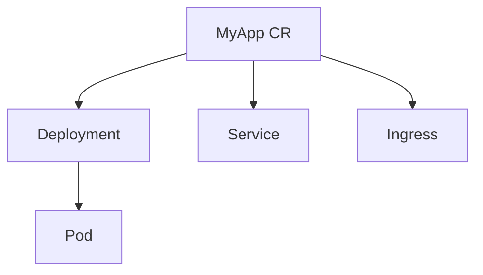

# 声明式API与控制器模式实践  

## 1. 声明式资源管理实战  

### 1.1 Deployment声明式更新  
```yaml:c:\project\kphub\k8s-practice\deployment-patch.yaml
apiVersion: apps/v1
kind: Deployment
metadata:
  name: web-app
spec:
  template:
    spec:
      containers:
      - name: web
        image: nginx:1.21.6  # 更新镜像版本
        resources:
          limits:
            cpu: "1"
            memory: 512Mi
```

### 1.2 批量更新命名空间资源  
```powershell
# 声明式更新所有Deployment的镜像
kubectl get deployments -n app --no-headers | ForEach-Object {
  kubectl set image deployment/$_.Split()[0] *=nginx:1.21.6 -n app
}
```

## 2. 自定义控制器开发  

### 2.1 初始化Operator项目  
```powershell
# 创建Operator脚手架
mkdir c:\project\kphub\my-operator
cd c:\project\kphub\my-operator
kubebuilder init --domain example.com --repo github.com/example/my-operator
kubebuilder create api --group apps --version v1 --kind MyApp
```

### 2.2 核心调和逻辑  
```go:c:\project\kphub\my-operator\controllers\myapp_controller.go
func (r *MyAppReconciler) Reconcile(ctx context.Context, req ctrl.Request) (ctrl.Result, error) {
    logger := log.FromContext(ctx)
    
    // 获取自定义资源
    myApp := &appsv1.MyApp{}
    if err := r.Get(ctx, req.NamespacedName, myApp); err != nil {
        return ctrl.Result{}, client.IgnoreNotFound(err)
    }

    // 确保Deployment存在
    dep := &appsv1.Deployment{}
    if err := r.createOrUpdateDeployment(myApp, dep); err != nil {
        return ctrl.Result{}, err
    }

    // 更新状态
    if err := r.updateStatus(ctx, myApp); err != nil {
        logger.Error(err, "更新状态失败")
        return ctrl.Result{RequeueAfter: 10 * time.Second}, nil
    }

    return ctrl.Result{RequeueAfter: 30 * time.Second}, nil
}
```

## 3. 高级调和模式  

### 3.1 多资源协调  


### 3.2 事件驱动更新  
```go:c:\project\kphub\my-operator\controllers\event_handler.go
func (r *MyAppReconciler) SetupWithManager(mgr ctrl.Manager) error {
    return ctrl.NewControllerManagedBy(mgr).
        For(&appsv1.MyApp{}).
        Owns(&appsv1.Deployment{}).
        Watches(
            &source.Kind{Type: &corev1.ConfigMap{}},
            handler.EnqueueRequestsFromMapFunc(r.findObjectsForConfigMap),
            builder.WithPredicates(predicate.ResourceVersionChangedPredicate{}),
        ).
        Complete(r)
}
```

## 4. 生产环境优化  

### 4.1 性能调优配置  
```yaml:c:\project\kphub\my-operator\config\manager\controller_manager_config.yaml
apiVersion: controller-runtime.sigs.k8s.io/v1alpha1
kind: ControllerManagerConfig
metadata:
  name: controller-manager-config
spec:
  syncPeriod: 1m
  leaderElection:
    leaseDuration: 15s
    renewDeadline: 10s
  metrics:
    bindAddress: ":8080"
```

### 4.2 自定义指标暴露  
```go:c:\project\kphub\my-operator\controllers\metrics.go
func (r *MyAppReconciler) recordMetrics(myApp *appsv1.MyApp) {
    reconcileTotal.WithLabelValues(myApp.Name).Inc()
    lastReconcileTime.WithLabelValues(myApp.Name).SetToCurrentTime()
    
    if myApp.Status.ReadyReplicas > 0 {
        readyStatus.WithLabelValues(myApp.Name).Set(1)
    } else {
        readyStatus.WithLabelValues(myApp.Name).Set(0)
    }
}
```

## 5. 调试与测试  

### 5.1 本地调试配置  
```powershell
# 在本地运行控制器
cd c:\project\kphub\my-operator
kubectl apply -f config\samples\apps_v1_myapp.yaml
make run ENABLE_WEBHOOKS=false
```

### 5.2 集成测试用例  
```go:c:\project\kphub\my-operator\controllers\suite_test.go
func TestMyAppReconciler(t *testing.T) {
    env := &envtest.Environment{
        CRDDirectoryPaths: []string{filepath.Join("..", "config", "crd", "bases")},
    }
    
    cfg, err := env.Start()
    if err != nil {
        t.Fatal(err)
    }
    defer env.Stop()

    // 测试调和逻辑
    g := gomega.NewWithT(t)
    g.Eventually(func() bool {
        return testReconcileComplete(cfg)
    }, 10*time.Second).Should(gomega.BeTrue())
}
```

## 6. 部署与发布  

### 6.1 OLM打包发布  
```yaml:c:\project\kphub\my-operator\bundle\manifests\my-operator.clusterserviceversion.yaml
apiVersion: operators.coreos.com/v1alpha1
kind: ClusterServiceVersion
metadata:
  name: my-operator.v1.0.0
spec:
  installModes:
    - type: OwnNamespace
      supported: true
    - type: SingleNamespace
      supported: true
  install:
    strategy: deployment
    spec:
      deployments:
      - name: my-operator
        spec:
          replicas: 1
          selector:
            matchLabels:
              name: my-operator
          template:
            spec:
              containers:
              - name: operator
                image: quay.io/example/my-operator:v1.0.0
```

### 6.2 生产环境部署  
```powershell
# 构建并推送Operator镜像
docker build -t quay.io/example/my-operator:v1.0.0 -f c:\project\kphub\my-operator\Dockerfile .
docker push quay.io/example/my-operator:v1.0.0

# 部署Operator
kubectl apply -f c:\project\kphub\my-operator\config\deploy\production
```

声明式API实践需要严格遵循"期望状态声明"原则，所有变更都应通过版本化的配置文件进行。自定义控制器开发需重点关注调和逻辑的幂等性和错误恢复能力，生产环境必须配置适当的调和频率和资源监控。Operator模式将领域知识编码到控制器中，是实现复杂业务逻辑自动化的有效方式。