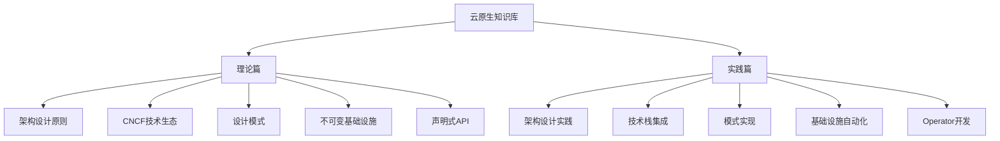

# 云原生知识库概览

云原生技术正在重塑现代应用开发和部署方式，本知识库系统性地整理了云原生领域的核心概念、技术栈和最佳实践，帮助开发者从入门到精通云原生技术体系。

## 知识库结构

本知识库采用"理论+实践"的双层结构，每个主题包含理论基础和实战指南两部分，确保读者既能掌握概念又能应用于实际项目。

## 核心内容模块

### 1. 云原生架构设计

- [**云原生架构设计原则**](c:\project\kphub\01-云原生架构设计原则.md)  
  深入探讨云原生架构的基础理论，包括微服务架构、分布式系统原则、弹性设计、容错机制和自动化运维等核心概念。本文档为云原生技术实践奠定理论基础。

- [**云原生架构设计原则实践**](c:\project\kphub\01.1-云原生架构设计原则实践.md)  
  通过实际案例展示云原生架构原则的应用，包括电商系统微服务拆分、API网关实现、熔断器集成和自动扩缩容配置等实战内容，帮助读者将理论转化为实践能力。

### 2. CNCF技术生态

- [**CNCF技术全景图解析**](c:\project\kphub\02-CNCF技术全景图解析.md)  
  全面解读云原生计算基金会(CNCF)技术全景图，涵盖容器编排、服务网格、持续交付、可观测性和云原生存储等关键技术领域，帮助读者了解云原生技术生态系统的全貌。

- [**CNCF技术全景图实践**](c:\project\kphub\02.1-CNCF技术全景图实践.md)  
  提供CNCF技术栈的实际组合方案，重点介绍Kubernetes+Istio+Prometheus+ArgoCD等主流技术的集成部署和协同工作方式，包含完整的配置示例和故障排除指南。

### 3. 云原生设计模式

- [**云原生应用设计模式**](c:\project\kphub\03-云原生应用设计模式.md)  
  系统介绍云原生环境中的核心设计模式，包括边车模式、断路器模式、Saga分布式事务、领导者选举和分布式会话管理等模式的原理、适用场景和实现方法。

- [**云原生应用设计模式实践**](c:\project\kphub\03.1-云原生应用设计模式实践.md)  
  通过代码示例和配置文件展示各种云原生设计模式的具体实现，包括Kubernetes边车容器配置、Spring Cloud Circuit Breaker实现和分布式锁的多种实现方案等。

### 4. 不可变基础设施

- [**不可变基础设施理念**](c:\project\kphub\04-不可变基础设施理念.md)  
  详细阐述不可变基础设施的核心理念、历史演进和技术优势，包括环境一致性保障、基础设施版本控制、配置漂移防止和系统可审计性等关键特性。

- [**不可变基础设施实践**](c:\project\kphub\04.1-不可变基础设施实践.md)  
  提供不可变基础设施的实战指南，涵盖Terraform基础设施编码、Packer镜像构建、Ansible配置管理和GitOps工作流等工具链的集成使用方法，包含完整的代码示例。

### 5. 控制器模式

- [**声明式API与控制器模式**](c:\project\kphub\05-声明式API与控制器模式.md)  
  深入解析Kubernetes的核心设计理念——声明式API和控制器模式，包括调和循环原理、期望状态与实际状态管理、资源对象设计和自定义资源扩展机制等内容。

- [**声明式API与控制器模式实践**](c:\project\kphub\05.1-声明式API与控制器模式实践.md)  
  通过Kubebuilder框架开发自定义Operator的完整教程，包括CRD设计、控制器逻辑实现、测试方法和部署策略，帮助读者掌握云原生应用的高级扩展能力。

## 知识库特色

本知识库具有以下特色：

1. **理论与实践结合**：每个主题都包含理论解析和实战指南两部分，确保知识可落地
2. **渐进式学习路径**：从基础概念到高级应用，适合不同水平的读者
3. **完整代码示例**：所有实践文档均提供可运行的代码和配置文件
4. **最佳实践指南**：融合业界经验，提供生产级实现方案
5. **性能优化建议**：针对各技术组件提供调优方法
6. **故障排除方法**：包含常见问题的诊断和解决方案

## 使用指南

- 所有示例代码和配置文件均以`c:\project\kphub`为基准目录
- Windows环境下的操作命令已做兼容性处理
- 每个文档末尾提供相关资源链接和进阶学习路径
- 建议按照目录顺序学习，也可根据需要直接查阅特定主题

通过本知识库，您将系统性地掌握云原生技术体系，并能够在实际项目中应用这些知识构建高可用、可扩展的现代应用系统。

无论您是刚接触云原生的初学者，还是希望提升技能的经验开发者，本知识库都能为您提供系统化的学习资源和实用指南。