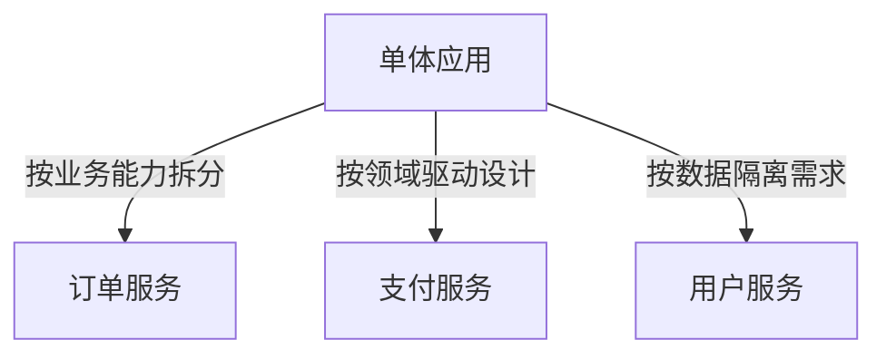
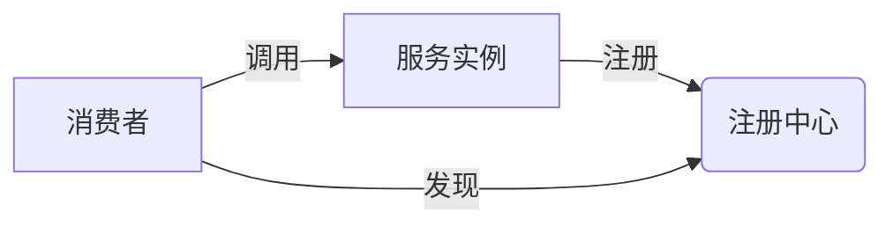

# 微服务架构模式与实践  

## 1. 核心架构模式  

### 1.1 服务拆分原则  


### 1.2 通信模式对比  
| 模式          | 协议      | 适用场景              | 缺点                  |  
|-------------|---------|-------------------|---------------------|  
| 同步RPC       | HTTP/2  | 实时性要求高          | 耦合度高              |  
| 异步消息       | AMQP    | 最终一致性           | 复杂度高              |  
| 事件驱动       | Webhook | 跨系统集成           | 调试困难              |  

## 2. 关键技术实现  

### 2.1 Spring Cloud微服务栈  
```yaml:c:\project\kphub\microservices\config\application.yml
spring:
  application:
    name: order-service
  cloud:
    nacos:
      discovery:
        server-addr: 127.0.0.1:8848
    sentinel:
      transport:
        dashboard: localhost:8080

feign:
  sentinel:
    enabled: true
```

### 2.2 服务网格方案  
```yaml:c:\project\kphub\microservices\istio\virtual-service.yaml
apiVersion: networking.istio.io/v1alpha3
kind: VirtualService
metadata:
  name: product-vs
spec:
  hosts:
  - product-service
  http:
  - route:
    - destination:
        host: product-service
        subset: v1
      weight: 90
    - destination:
        host: product-service  
        subset: v2
      weight: 10
```

## 3. 数据一致性方案  

### 3.1 Saga事务模式  
```java:c:\project\kphub\microservices\saga\OrderSaga.java
@Saga
public class OrderSaga {
    @SagaAction(compensationMethod = "cancelOrder")
    public void createOrder(Order order) {
        orderService.create(order);
    }
    
    public void cancelOrder(Order order) {
        orderService.cancel(order.getId());
    }
}
```

### 3.2 CQRS实现  
```yaml:c:\project\kphub\microservices\cqrs\deployment.yaml
apiVersion: apps/v1
kind: Deployment
metadata:
  name: query-service
spec:
  replicas: 3
  template:
    spec:
      containers:
      - name: query
        image: query-service:1.0
        env:
        - name: SPRING_PROFILES_ACTIVE
          value: "read"
---
apiVersion: apps/v1
kind: Deployment
metadata:
  name: command-service  
spec:
  replicas: 2
  template:
    spec:
      containers:
      - name: command
        image: command-service:1.0
        env:
        - name: SPRING_PROFILES_ACTIVE
          value: "write"
```

## 4. 服务治理  

### 4.1 熔断降级配置  
```java:c:\project\kphub\microservices\circuit-breaker\PaymentService.java
@Slf4j
@Service
public class PaymentService {
    @CircuitBreaker(
        name = "paymentService",
        fallbackMethod = "fallbackPayment",
        ignoreExceptions = {IllegalArgumentException.class}
    )
    public PaymentResult charge(Order order) {
        return paymentClient.charge(order);
    }
    
    private PaymentResult fallbackPayment(Order order, Exception e) {
        log.error("支付服务降级", e);
        return new PaymentResult("FALLBACK", "支付服务暂不可用");
    }
}
```

### 4.2 服务发现架构  


## 5. 性能优化  

### 5.1 分布式缓存  
```yaml:c:\project\kphub\microservices\cache\redis-config.yaml
spring:
  redis:
    host: redis-cluster
    port: 6379
    lettuce:
      pool:
        max-active: 20
        max-idle: 10
        min-idle: 5
```

### 5.2 链路追踪  
```java:c:\project\kphub\microservices\tracing\OrderController.java
@RestController
@RequiredArgsConstructor
public class OrderController {
    private final Tracer tracer;
    
    @GetMapping("/orders/{id}")
    public Order getOrder(@PathVariable String id) {
        Span span = tracer.buildSpan("getOrder").start();
        try (Scope scope = tracer.activateSpan(span)) {
            return orderService.findById(id);
        } finally {
            span.finish();
        }
    }
}
```

## 6. 安全防护  

### 6.1 零信任架构  
```yaml:c:\project\kphub\microservices\security\network-policy.yaml
apiVersion: networking.k8s.io/v1
kind: NetworkPolicy
metadata:
  name: db-policy
spec:
  podSelector:
    matchLabels:
      app: mysql
  policyTypes:
  - Ingress
  ingress:
  - from:
    - podSelector:
        matchLabels:
          app: order-service
    ports:
    - protocol: TCP
      port: 3306
```

### 6.2 JWT认证  
```java:c:\project\kphub\microservices\security\JwtFilter.java
public class JwtFilter extends OncePerRequestFilter {
    @Override
    protected void doFilterInternal(HttpServletRequest request, 
                                   HttpServletResponse response,
                                   FilterChain chain) {
        String token = request.getHeader("Authorization");
        if (jwtUtil.validateToken(token)) {
            Authentication auth = jwtUtil.getAuthentication(token);
            SecurityContextHolder.getContext().setAuthentication(auth);
        }
        chain.doFilter(request, response);
    }
}
```

微服务架构需要根据业务规模选择适当的拆分粒度，初期建议采用Spring Cloud生态快速搭建，后期可逐步引入服务网格。数据一致性方案需权衡性能与一致性需求，生产环境必须实施完善的熔断限流策略。安全防护应从网络边界、API网关和代码层面多层防御。