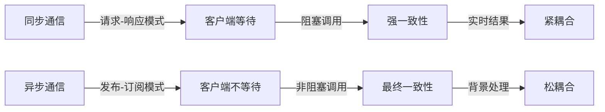

# 微服务通信模型详解

微服务架构将应用拆分为多个独立服务，这些服务之间的通信方式直接影响系统的性能、可靠性和可扩展性。本文深入探讨微服务通信的各种模式、实现方法和最佳实践，帮助开发者选择适合自己业务场景的通信策略。

## 1. 通信模式对比

### 1.1 同步 vs 异步

微服务通信主要分为同步和异步两种基本模式，它们各有优缺点，适用于不同场景。



**同步通信特点：**
- 客户端发送请求后必须等待服务端响应
- 实现简单直观，易于理解和调试
- 提供即时反馈和强一致性保证
- 服务间存在较强依赖，一个服务故障可能导致连锁反应
- 系统吞吐量受限于最慢服务的响应时间

**异步通信特点：**
- 客户端发送请求后立即返回，不等待处理完成
- 通过消息队列或事件总线实现服务解耦
- 提供系统弹性，服务可独立扩展和失败
- 支持更高的吞吐量和更好的负载处理
- 实现复杂度较高，调试和追踪困难
- 只能保证最终一致性，不适合需要即时响应的场景

### 1.2 协议对比矩阵

不同通信协议在性能、可靠性和适用场景上各有特点：

| 通信协议 | 传输方式 | 数据格式 | 延迟 | 吞吐量 | 可靠性 | 适用场景 | 复杂度 |
|---------|---------|---------|------|-------|-------|---------|-------|
| REST (HTTP) | 同步 | JSON/XML | 中 | 中 | 中 | 通用API接口，资源操作 | 低 |
| gRPC | 同步/流式 | Protocol Buffers | 低 | 高 | 高 | 微服务内部通信，性能敏感场景 | 中 |
| GraphQL | 同步 | JSON | 中 | 中 | 中 | 灵活数据查询，前端驱动API | 中 |
| WebSocket | 双向流 | 自定义 | 低 | 高 | 中 | 实时应用，通知推送 | 中 |
| AMQP (RabbitMQ) | 异步 | 二进制 | 中 | 高 | 极高 | 可靠消息传递，工作队列 | 高 |
| Kafka | 异步 | 二进制 | 中 | 极高 | 高 | 高吞吐量事件流，日志收集 | 高 |
| MQTT | 异步 | 二进制 | 低 | 中 | 可配置 | IoT设备通信，资源受限环境 | 中 |
| 事件溯源 | 异步 | 自定义 | 高 | 中 | 极高 | 审计追踪，状态重建，CQRS模式 | 极高 |

**选择建议：**
- 对于简单的CRUD操作，REST API是最佳选择
- 对于性能敏感的内部服务通信，gRPC提供最佳性能
- 对于需要灵活查询的前端应用，GraphQL更适合
- 对于需要可靠性保证的关键业务流程，AMQP是理想选择
- 对于高吞吐量的数据流处理，Kafka是首选
- 对于需要完整历史记录和审计的系统，事件溯源模式更合适

## 2. 同步通信实现

### 2.1 RESTful API设计

REST (Representational State Transfer) 是一种基于HTTP的架构风格，通过标准HTTP方法操作资源。

**RESTful API设计原则：**
1. 资源为中心的URL设计
2. 使用HTTP方法表达操作语义（GET、POST、PUT、DELETE等）
3. 无状态通信
4. 使用HTTP状态码表达结果
5. HATEOAS（超媒体作为应用状态引擎）

```java:c:\project\kphub\communication\OrderController.java
@RestController
@RequestMapping("/api/v1/orders")
public class OrderController {
    private final OrderService orderService;
    
    @Autowired
    public OrderController(OrderService orderService) {
        this.orderService = orderService;
    }
    
    @GetMapping
    public ResponseEntity<Page<OrderSummary>> getOrders(
            @RequestParam(defaultValue = "0") int page,
            @RequestParam(defaultValue = "20") int size,
            @RequestParam(required = false) String status) {
        
        PageRequest pageRequest = PageRequest.of(page, size, Sort.by("createdAt").descending());
        Page<OrderSummary> orders = orderService.findOrders(status, pageRequest);
        
        return ResponseEntity.ok()
            .cacheControl(CacheControl.maxAge(30, TimeUnit.SECONDS))
            .body(orders);
    }
    
    @GetMapping("/{id}")
    public ResponseEntity<Order> getOrder(@PathVariable String id) {
        return orderService.findById(id)
            .map(order -> ResponseEntity.ok()
                .cacheControl(CacheControl.maxAge(30, TimeUnit.SECONDS))
                .body(order))
            .orElseThrow(() -> new ResourceNotFoundException("Order not found: " + id));
    }
    
    @PostMapping
    @ResponseStatus(HttpStatus.CREATED)
    public ResponseEntity<Order> createOrder(@Valid @RequestBody OrderRequest request) {
        Order created = orderService.create(request);
        URI location = ServletUriComponentsBuilder
            .fromCurrentRequest()
            .path("/{id}")
            .buildAndExpand(created.getId())
            .toUri();
            
        return ResponseEntity.created(location).body(created);
    }
    
    @PutMapping("/{id}")
    public ResponseEntity<Order> updateOrder(
            @PathVariable String id, 
            @Valid @RequestBody OrderUpdateRequest request) {
        
        Order updated = orderService.update(id, request);
        return ResponseEntity.ok(updated);
    }
    
    @DeleteMapping("/{id}")
    @ResponseStatus(HttpStatus.NO_CONTENT)
    public void cancelOrder(@PathVariable String id) {
        orderService.cancel(id);
    }
    
    @ExceptionHandler(ResourceNotFoundException.class)
    public ResponseEntity<ErrorResponse> handleNotFound(ResourceNotFoundException ex) {
        ErrorResponse error = new ErrorResponse(
            HttpStatus.NOT_FOUND.value(),
            ex.getMessage(),
            LocalDateTime.now()
        );
        return ResponseEntity.status(HttpStatus.NOT_FOUND).body(error);
    }
}
```

**REST客户端实现：**

```java:c:\project\kphub\communication\OrderServiceClient.java
@Service
@RequiredArgsConstructor
public class OrderServiceClient {
    private final RestTemplate restTemplate;
    private final String orderServiceUrl;
    
    public Order getOrder(String orderId) {
        try {
            return restTemplate.getForObject(
                orderServiceUrl + "/api/v1/orders/{id}", 
                Order.class, 
                orderId
            );
        } catch (HttpClientErrorException.NotFound e) {
            throw new ResourceNotFoundException("Order not found: " + orderId);
        } catch (RestClientException e) {
            throw new ServiceCommunicationException("Failed to retrieve order", e);
        }
    }
    
    public Order createOrder(OrderRequest request) {
        try {
            return restTemplate.postForObject(
                orderServiceUrl + "/api/v1/orders",
                request,
                Order.class
            );
        } catch (RestClientException e) {
            throw new ServiceCommunicationException("Failed to create order", e);
        }
    }
}
```

### 2.2 gRPC服务定义

gRPC是Google开发的高性能RPC框架，使用HTTP/2传输和Protocol Buffers序列化。

**gRPC优势：**
- 高效的二进制序列化
- HTTP/2多路复用和流控制
- 支持多种编程语言
- 内置流式传输
- 强类型接口定义

**服务定义（.proto文件）：**

```protobuf:c:\project\kphub\communication\product.proto
syntax = "proto3";

package com.example.product;

option java_multiple_files = true;
option java_package = "com.example.product.grpc";

import "google/api/annotations.proto";
import "google/protobuf/timestamp.proto";
import "google/protobuf/empty.proto";

service ProductService {
    // 获取单个产品
    rpc GetProduct (ProductRequest) returns (ProductResponse) {
        option (google.api.http) = {
            get: "/v1/products/{id}"
        };
    }
    
    // 创建新产品
    rpc CreateProduct (CreateProductRequest) returns (ProductResponse) {
        option (google.api.http) = {
            post: "/v1/products"
            body: "*"
        };
    }
    
    // 更新产品
    rpc UpdateProduct (UpdateProductRequest) returns (ProductResponse) {
        option (google.api.http) = {
            put: "/v1/products/{id}"
            body: "*"
        };
    }
    
    // 删除产品
    rpc DeleteProduct (ProductRequest) returns (google.protobuf.Empty) {
        option (google.api.http) = {
            delete: "/v1/products/{id}"
        };
    }
    
    // 查询产品列表
    rpc ListProducts (ListProductsRequest) returns (ListProductsResponse) {
        option (google.api.http) = {
            get: "/v1/products"
        };
    }
    
    // 监控产品库存变化（服务器流式RPC）
    rpc WatchInventory (ProductRequest) returns (stream InventoryUpdate) {}
}

message ProductRequest {
    string id = 1;
}

message CreateProductRequest {
    string name = 1;
    string description = 2;
    double price = 3;
    int32 inventory = 4;
    repeated string categories = 5;
}

message UpdateProductRequest {
    string id = 1;
    string name = 2;
    string description = 3;
    double price = 4;
    int32 inventory = 5;
    repeated string categories = 6;
}

message ProductResponse {
    string id = 1;
    string name = 2;
    string description = 3;
    double price = 4;
    int32 inventory = 5;
    repeated string categories = 6;
    google.protobuf.Timestamp created_at = 7;
    google.protobuf.Timestamp updated_at = 8;
}

message ListProductsRequest {
    int32 page_size = 1;
    string page_token = 2;
    string category = 3;
}

message ListProductsResponse {
    repeated ProductResponse products = 1;
    string next_page_token = 2;
    int32 total_size = 3;
}

message InventoryUpdate {
    string product_id = 1;
    int32 new_inventory = 2;
    google.protobuf.Timestamp update_time = 3;
}
```

**gRPC服务实现：**

```java:c:\project\kphub\communication\ProductServiceImpl.java
@GrpcService
public class ProductServiceImpl extends ProductServiceGrpc.ProductServiceImplBase {
    private final ProductRepository productRepository;
    private final InventoryService inventoryService;
    
    @Autowired
    public ProductServiceImpl(ProductRepository productRepository, InventoryService inventoryService) {
        this.productRepository = productRepository;
        this.inventoryService = inventoryService;
    }
    
    @Override
    public void getProduct(ProductRequest request, StreamObserver<ProductResponse> responseObserver) {
        try {
            Product product = productRepository.findById(request.getId())
                .orElseThrow(() -> new StatusRuntimeException(Status.NOT_FOUND
                    .withDescription("Product not found: " + request.getId())));
            
            responseObserver.onNext(mapToProductResponse(product));
            responseObserver.onCompleted();
        } catch (StatusRuntimeException e) {
            responseObserver.onError(e);
        } catch (Exception e) {
            responseObserver.onError(Status.INTERNAL
                .withDescription("Internal error")
                .withCause(e)
                .asRuntimeException());
        }
    }
    
    @Override
    public void createProduct(CreateProductRequest request, StreamObserver<ProductResponse> responseObserver) {
        try {
            Product product = new Product();
            product.setName(request.getName());
            product.setDescription(request.getDescription());
            product.setPrice(request.getPrice());
            product.setInventory(request.getInventory());
            product.setCategories(new HashSet<>(request.getCategoriesList()));
            
            Product saved = productRepository.save(product);
            
            responseObserver.onNext(mapToProductResponse(saved));
            responseObserver.onCompleted();
        } catch (Exception e) {
            responseObserver.onError(Status.INTERNAL
                .withDescription("Failed to create product")
                .withCause(e)
                .asRuntimeException());
        }
    }
    
    @Override
    public void watchInventory(ProductRequest request, StreamObserver<InventoryUpdate> responseObserver) {
        String productId = request.getId();
        
        // 验证产品存在
        if (!productRepository.existsById(productId)) {
            responseObserver.onError(Status.NOT_FOUND
                .withDescription("Product not found: " + productId)
                .asRuntimeException());
            return;
        }
        
        // 订阅库存更新
        Disposable subscription = inventoryService.watchInventoryChanges(productId)
            .map(this::mapToInventoryUpdate)
            .subscribe(
                responseObserver::onNext,
                error -> responseObserver.onError(Status.INTERNAL
                    .withDescription("Inventory watch failed")
                    .withCause(error)
                    .asRuntimeException()),
                responseObserver::onCompleted
            );
        
        // 注册取消监听器
        Context.current().addListener(context -> subscription.dispose(), MoreExecutors.directExecutor());
    }
    
    // 其他方法实现...
    
    private ProductResponse mapToProductResponse(Product product) {
        return ProductResponse.newBuilder()
            .setId(product.getId())
            .setName(product.getName())
            .setDescription(product.getDescription())
            .setPrice(product.getPrice())
            .setInventory(product.getInventory())
            .addAllCategories(product.getCategories())
            .setCreatedAt(Timestamps.fromMillis(product.getCreatedAt().toEpochMilli()))
            .setUpdatedAt(Timestamps.fromMillis(product.getUpdatedAt().toEpochMilli()))
            .build();
    }
    
    private InventoryUpdate mapToInventoryUpdate(InventoryChange change) {
        return InventoryUpdate.newBuilder()
            .setProductId(change.getProductId())
            .setNewInventory(change.getNewLevel())
            .setUpdateTime(Timestamps.fromMillis(change.getTimestamp().toEpochMilli()))
            .build();
    }
}
```

**gRPC客户端实现：**

```java:c:\project\kphub\communication\ProductGrpcClient.java
@Service
public class ProductGrpcClient {
    private final ProductServiceGrpc.ProductServiceBlockingStub blockingStub;
    private final ProductServiceGrpc.ProductServiceStub asyncStub;
    
    @Autowired
    public ProductGrpcClient(
            @GrpcClient("product-service") ProductServiceGrpc.ProductServiceBlockingStub blockingStub,
            @GrpcClient("product-service") ProductServiceGrpc.ProductServiceStub asyncStub) {
        this.blockingStub = blockingStub;
        this.asyncStub = asyncStub;
    }
    
    public ProductResponse getProduct(String productId) {
        try {
            ProductRequest request = ProductRequest.newBuilder()
                .setId(productId)
                .build();
                
            return blockingStub
                .withDeadlineAfter(3, TimeUnit.SECONDS)
                .getProduct(request);
        } catch (StatusRuntimeException e) {
            if (e.getStatus().getCode() == Status.Code.NOT_FOUND) {
                throw new ResourceNotFoundException("Product not found: " + productId);
            }
            throw new ServiceCommunicationException("Failed to get product: " + e.getMessage(), e);
        }
    }
    
    public void watchInventory(String productId, Consumer<InventoryUpdate> updateHandler) {
        ProductRequest request = ProductRequest.newBuilder()
            .setId(productId)
            .build();
            
        asyncStub.watchInventory(request, new StreamObserver<InventoryUpdate>() {
            @Override
            public void onNext(InventoryUpdate update) {
                updateHandler.accept(update);
            }
            
            @Override
            public void onError(Throwable t) {
                log.error("Error watching inventory for product {}: {}", productId, t.getMessage(), t);
            }
            
            @Override
            public void onCompleted() {
                log.info("Inventory watch completed for product {}", productId);
            }
        });
    }
}
```

## 3. 异步通信实现

### 3.1 Spring AMQP配置

RabbitMQ是一个实现AMQP协议的消息代理，适用于可靠的异步通信场景。

**RabbitMQ核心概念：**
- Exchange：接收消息并路由到队列
- Queue：存储消息直到消费者处理
- Binding：定义Exchange和Queue之间的路由规则
- Virtual Host：提供逻辑隔离的环境

**Spring AMQP配置：**

```yaml:c:\project\kphub\communication\application.yml
spring:
  rabbitmq:
    host: rabbitmq-cluster
    port: 5672
    username: ${RABBITMQ_USERNAME}
    password: ${RABBITMQ_PASSWORD}
    virtual-host: /prod
    # 发布者确认机制
    publisher-confirm-type: correlated  # none, simple, correlated
    publisher-returns: true
    template:
      mandatory: true  # 消息无法路由时返回给发送者
      # 重试配置
      retry:
        enabled: true
        initial-interval: 1000ms
        max-attempts: 3
        max-interval: 10000ms
        multiplier: 2.0
    # 消费者配置
    listener:
      simple:
        acknowledge-mode: manual  # none, auto, manual
        prefetch: 10  # 预取消息数量
        concurrency: 5  # 最小消费者数
        max-concurrency: 10  # 最大消费者数
        retry:
          enabled: true
          initial-interval: 1000ms
          max-attempts: 3
          max-interval: 10000ms
          multiplier: 2.0
        default-requeue-rejected: false  # 拒绝的消息不重新入队
```

**RabbitMQ配置类：**

```java:c:\project\kphub\communication\RabbitMQConfig.java
@Configuration
public class RabbitMQConfig {
    
    // 定义交换机
    @Bean
    public DirectExchange orderExchange() {
        return ExchangeBuilder.directExchange("order.exchange")
            .durable(true)
            .build();
    }
    
    @Bean
    public TopicExchange eventExchange() {
        return ExchangeBuilder.topicExchange("event.exchange")
            .durable(true)
            .build();
    }
    
    // 定义队列
    @Bean
    public Queue orderCreatedQueue() {
        return QueueBuilder.durable("order.created.queue")
            .withArgument("x-dead-letter-exchange", "dlx.exchange")
            .withArgument("x-dead-letter-routing-key", "dlx.order.created")
            .withArgument("x-message-ttl", 60000) // 1分钟TTL
            .build();
    }
    
    @Bean
    public Queue orderFulfilledQueue() {
        return QueueBuilder.durable("order.fulfilled.queue")
            .withArgument("x-dead-letter-exchange", "dlx.exchange")
            .withArgument("x-dead-letter-routing-key", "dlx.order.fulfilled")
            .build();
    }
    
    // 定义死信队列
    @Bean
    public DirectExchange deadLetterExchange() {
        return new DirectExchange("dlx.exchange");
    }
    
    @Bean
    public Queue deadLetterQueue() {
        return QueueBuilder.durable("dlx.queue").build();
    }
    
    // 绑定队列到交换机
    @Bean
    public Binding orderCreatedBinding() {
        return BindingBuilder.bind(orderCreatedQueue())
            .to(orderExchange())
            .with("order.created");
    }
    
    @Bean
    public Binding orderFulfilledBinding() {
        return BindingBuilder.bind(orderFulfilledQueue())
            .to(orderExchange())
            .with("order.fulfilled");
    }
    
    @Bean
    public Binding deadLetterBinding() {
        return BindingBuilder.bind(deadLetterQueue())
            .to(deadLetterExchange())
            .with("dlx.#");
    }
    
    // 消息转换器
    @Bean
    public MessageConverter jsonMessageConverter() {
        Jackson2JsonMessageConverter converter = new Jackson2JsonMessageConverter();
        converter.setCreateMessageIds(true);
        return converter;
    }
    
    // RabbitTemplate配置
    @Bean
    public RabbitTemplate rabbitTemplate(ConnectionFactory connectionFactory) {
        RabbitTemplate template = new RabbitTemplate(connectionFactory);
        template.setMessageConverter(jsonMessageConverter());
        template.setConfirmCallback((correlationData, ack, reason) -> {
            if (!ack) {
                log.error("消息发送失败: {}", reason);
                // 可以在这里实现重试逻辑
            }
        });
        template.setReturnsCallback(returned -> {
            log.error("消息路由失败: exchange={}, routingKey={}, replyCode={}, replyText={}",
                returned.getExchange(), returned.getRoutingKey(),
                returned.getReplyCode(), returned.getReplyText());
        });
        return template;
    }
}
```

**消息发布者：**

```java:c:\project\kphub\communication\OrderEventPublisher.java
@Service
@RequiredArgsConstructor
public class OrderEventPublisher {
    private final RabbitTemplate rabbitTemplate;
    private final ObjectMapper objectMapper;
    
    public void publishOrderCreated(Order order) {
        OrderCreatedEvent event = new OrderCreatedEvent(
            order.getId(),
            order.getCustomerId(),
            order.getItems(),
            order.getTotalAmount(),
            LocalDateTime.now()
        );
        
        publish("order.exchange", "order.created", event, order.getId());
    }
    
    public void publishOrderFulfilled(String orderId, String trackingNumber) {
        OrderFulfilledEvent event = new OrderFulfilledEvent(
            orderId,
            trackingNumber,
            LocalDateTime.now()
        );
        
        publish("order.exchange", "order.fulfilled", event, orderId);
    }
    
    private void publish(String exchange, String routingKey, Object event, String businessId) {
        try {
            // 创建消息ID用于跟踪
            String messageId = UUID.randomUUID().toString();
            
            // 设置消息属性
            MessageProperties properties = new MessageProperties();
            properties.setMessageId(messageId);
            properties.setCorrelationId(businessId);
            properties.setContentType(MessageProperties.CONTENT_TYPE_JSON);
            properties.setHeader("event_type", event.getClass().getSimpleName());
            properties.setHeader("created_at", System.currentTimeMillis());
            
            // 序列化消息内容
            byte[] body = objectMapper.writeValueAsBytes(event);
            Message message = new Message(body, properties);
            
            // 发送消息并使用CorrelationData跟踪
            CorrelationData correlationData = new CorrelationData(messageId);
            correlationData.setReturned(new ReturnedMessage(message, 0, "", exchange, routingKey));
            
            rabbitTemplate.convertAndSend(exchange, routingKey, message, correlationData);
            log.info("发布事件: type={}, id={}, businessId={}", 
                event.getClass().getSimpleName(), messageId, businessId);
        } catch (Exception e) {
            log.error("事件发布失败: {}", e.getMessage(), e);
            throw new EventPublishException("Failed to publish event: " + e.getMessage(), e);
        }
    }
}
```

**消息消费者：**

```java:c:\project\kphub\communication\OrderEventConsumer.java
@Service
@RequiredArgsConstructor
public class OrderEventConsumer {
    private final InventoryService inventoryService;
    private final ShippingService shippingService;
    private final ObjectMapper objectMapper;
    
    @RabbitListener(queues = "order.created.queue")
    public void handleOrderCreated(Message message, Channel channel) throws IOException {
        long deliveryTag = message.getMessageProperties().getDeliveryTag();
        
        try {
            // 提取消息元数据
            String messageId = message.getMessageProperties().getMessageId();
            String correlationId = message.getMessageProperties().getCorrelationId();
            String eventType = message.getMessageProperties().getHeader("event_type");
            
            log.info("接收到订单创建事件: messageId={}, correlationId={}, type={}",
                messageId, correlationId, eventType);
            
            // 反序列化消息
            OrderCreatedEvent event = objectMapper.readValue(
                message.getBody(), OrderCreatedEvent.class);
            
            // 处理订单创建事件
            processOrderCreated(event);
            
            // 确认消息已处理
            channel.basicAck(deliveryTag, false);
            log.info("订单创建事件处理成功: orderId={}", event.getOrderId());
        } catch (Exception e) {
            log.error("处理订单创建事件失败: {}", e.getMessage(), e);
            
            // 拒绝消息并不重新入队（将进入死信队列）
            channel.basicReject(deliveryTag, false);
        }
    }
    
    @RabbitListener(queues = "order.fulfilled.queue")
    public void handleOrderFulfilled(Message message, Channel channel) throws IOException {
        long deliveryTag = message.getMessageProperties().getDeliveryTag();
        
        try {
            OrderFulfilledEvent event = objectMapper.readValue(
                message.getBody(), OrderFulfilledEvent.class);
            
            // 处理订单完成事件
            processOrderFulfilled(event);
            
            // 确认消息已处理
            channel.basicAck(deliveryTag, false);
        } catch (Exception e) {
            log.error("处理订单完成事件失败: {}", e.getMessage(), e);
            channel.basicReject(deliveryTag, false);
        }
    }
    
    // 处理死信队列消息
    @RabbitListener(queues = "dlx.queue")
    public void handleDeadLetterMessages(Message message, Channel channel) throws IOException {
        long deliveryTag = message.getMessageProperties().getDeliveryTag();
        
        try {
            String originalExchange = message.getMessageProperties().getHeader("x-first-death-exchange");
            String originalRoutingKey = message.getMessageProperties().getHeader("x-first-death-queue");
            String reason = message.getMessageProperties().getHeader("x-first-death-reason");
            
            log.warn("处理死信消息: exchange={}, routingKey={}, reason={}",
                originalExchange, originalRoutingKey, reason);
            
            // 记录失败消息，可以存储到数据库供后续分析和手动重试
            saveFailedMessage(message, originalExchange, originalRoutingKey, reason);
            
            // 确认死信消息
            channel.basicAck(deliveryTag, false);
        } catch (Exception e) {
            log.error("处理死信消息失败: {}", e.getMessage(), e);
            // 如果处理死信也失败，可以选择重新入队或丢弃
            channel.basicReject(deliveryTag, false);
        }
    }
    
    private void processOrderCreated(OrderCreatedEvent event) {
        // 预留库存
        inventoryService.reserveItems(event.getOrderId(), event.getItems());
        
        // 其他业务逻辑...
    }
    
    private void processOrderFulfilled(OrderFulfilledEvent event) {
        // 更新订单状态
        shippingService.trackShipment(event.getOrderId(), event.getTrackingNumber());
        
        // 其他业务逻辑...
    }
    
    private void saveFailedMessage(Message message, String exchange, String routingKey, String reason) {
        // 实现失败消息的持久化存储
    }
}
```

### 3.
让我继续完成微服务通信模型详解的内容：

### 3.2 Kafka事件生产者

Apache Kafka是一个分布式流处理平台，特别适合高吞吐量的事件流处理场景。

**Kafka核心概念：**
- Topic：消息的逻辑分类
- Partition：Topic的物理分区，提供并行处理能力
- Producer：发送消息到Topic
- Consumer：从Topic消费消息
- Consumer Group：多个消费者组成的逻辑组，共同消费Topic

**Kafka配置：**

```yaml:c:\project\kphub\communication\kafka-config.yaml
spring:
  kafka:
    bootstrap-servers: kafka-cluster:9092
    producer:
      # 生产者配置
      key-serializer: org.apache.kafka.common.serialization.StringSerializer
      value-serializer: org.springframework.kafka.support.serializer.JsonSerializer
      acks: all  # 所有副本确认
      retries: 3  # 重试次数
      batch-size: 16384  # 批处理大小
      buffer-memory: 33554432  # 缓冲区大小
      compression-type: lz4  # 压缩类型
      properties:
        linger.ms: 20  # 延迟发送时间
        request.timeout.ms: 30000  # 请求超时
        max.in.flight.requests.per.connection: 5
        enable.idempotence: true  # 启用幂等性
    consumer:
      # 消费者配置
      key-deserializer: org.apache.kafka.common.serialization.StringDeserializer
      value-deserializer: org.springframework.kafka.support.serializer.JsonDeserializer
      group-id: ${spring.application.name}
      auto-offset-reset: earliest  # 从最早的消息开始消费
      enable-auto-commit: false  # 禁用自动提交
      properties:
        spring.json.trusted.packages: com.example.events
        isolation.level: read_committed  # 事务隔离级别
    listener:
      # 监听器配置
      ack-mode: manual_immediate  # 手动确认模式
      concurrency: 3  # 并发消费者数量
      type: batch  # 批量消费
    admin:
      # 管理配置
      auto-create: false  # 禁止自动创建主题
```

**Kafka配置类：**

```java:c:\project\kphub\communication\KafkaConfig.java
@Configuration
public class KafkaConfig {
    
    // 生产者工厂配置
    @Bean
    public ProducerFactory<String, Object> producerFactory() {
        Map<String, Object> config = new HashMap<>();
        config.put(ProducerConfig.BOOTSTRAP_SERVERS_CONFIG, "${spring.kafka.bootstrap-servers}");
        config.put(ProducerConfig.KEY_SERIALIZER_CLASS_CONFIG, StringSerializer.class);
        config.put(ProducerConfig.VALUE_SERIALIZER_CLASS_CONFIG, JsonSerializer.class);
        config.put(ProducerConfig.ACKS_CONFIG, "all");
        config.put(ProducerConfig.RETRIES_CONFIG, 3);
        config.put(ProducerConfig.BATCH_SIZE_CONFIG, 16384);
        config.put(ProducerConfig.BUFFER_MEMORY_CONFIG, 33554432);
        config.put(ProducerConfig.COMPRESSION_TYPE_CONFIG, "lz4");
        config.put(ProducerConfig.LINGER_MS_CONFIG, 20);
        config.put(ProducerConfig.REQUEST_TIMEOUT_MS_CONFIG, 30000);
        config.put(ProducerConfig.MAX_IN_FLIGHT_REQUESTS_PER_CONNECTION, 5);
        config.put(ProducerConfig.ENABLE_IDEMPOTENCE_CONFIG, true);
        
        return new DefaultKafkaProducerFactory<>(config);
    }
    
    // Kafka模板配置
    @Bean
    public KafkaTemplate<String, Object> kafkaTemplate() {
        KafkaTemplate<String, Object> template = new KafkaTemplate<>(producerFactory());
        template.setProducerListener(new LoggingProducerListener<>());
        return template;
    }
    
    // 消费者工厂配置
    @Bean
    public ConsumerFactory<String, Object> consumerFactory() {
        Map<String, Object> config = new HashMap<>();
        config.put(ConsumerConfig.BOOTSTRAP_SERVERS_CONFIG, "${spring.kafka.bootstrap-servers}");
        config.put(ConsumerConfig.KEY_DESERIALIZER_CLASS_CONFIG, StringDeserializer.class);
        config.put(ConsumerConfig.VALUE_DESERIALIZER_CLASS_CONFIG, JsonDeserializer.class);
        config.put(ConsumerConfig.GROUP_ID_CONFIG, "${spring.application.name}");
        config.put(ConsumerConfig.AUTO_OFFSET_RESET_CONFIG, "earliest");
        config.put(ConsumerConfig.ENABLE_AUTO_COMMIT_CONFIG, false);
        config.put(ConsumerConfig.ISOLATION_LEVEL_CONFIG, "read_committed");
        config.put(JsonDeserializer.TRUSTED_PACKAGES, "com.example.events");
        
        return new DefaultKafkaConsumerFactory<>(config);
    }
    
    // 监听器容器工厂配置
    @Bean
    public ConcurrentKafkaListenerContainerFactory<String, Object> kafkaListenerContainerFactory() {
        ConcurrentKafkaListenerContainerFactory<String, Object> factory = 
            new ConcurrentKafkaListenerContainerFactory<>();
        factory.setConsumerFactory(consumerFactory());
        factory.setConcurrency(3);
        factory.setBatchListener(true);
        factory.getContainerProperties().setAckMode(ContainerProperties.AckMode.MANUAL_IMMEDIATE);
        
        // 配置错误处理器
        factory.setErrorHandler(new SeekToCurrentErrorHandler(
            new DeadLetterPublishingRecoverer(kafkaTemplate(),
                (record, ex) -> new TopicPartition("error." + record.topic(), record.partition())),
            new FixedBackOff(1000L, 3)
        ));
        
        return factory;
    }
    
    // 事务管理器
    @Bean
    public KafkaTransactionManager<String, Object> kafkaTransactionManager() {
        return new KafkaTransactionManager<>(producerFactory());
    }
}
```

**Kafka事件生产者：**

```java:c:\project\kphub\communication\EventPublisher.java
@Service
@RequiredArgsConstructor
@Slf4j
public class EventPublisher {
    private final KafkaTemplate<String, Object> kafkaTemplate;
    private final ObjectMapper objectMapper;
    
    /**
     * 发布订单事件
     * @param event 订单事件对象
     */
    public void publishOrderEvent(OrderEvent event) {
        String topic = "order-events";
        String key = event.getOrderId();
        
        try {
            // 添加元数据
            Map<String, Object> headers = new HashMap<>();
            headers.put("eventType", event.getClass().getSimpleName());
            headers.put("timestamp", System.currentTimeMillis());
            headers.put("version", "1.0");
            
            // 发送消息
            ProducerRecord<String, Object> record = createRecord(topic, key, event, headers);
            
            kafkaTemplate.send(record)
                .addCallback(
                    result -> {
                        RecordMetadata metadata = result.getRecordMetadata();
                        log.info("事件发送成功: topic={}, partition={}, offset={}, key={}",
                            metadata.topic(), metadata.partition(), metadata.offset(), key);
                    },
                    ex -> {
                        log.error("事件发送失败: topic={}, key={}, error={}",
                            topic, key, ex.getMessage(), ex);
                        // 可以在这里实现重试逻辑或将失败事件保存到本地存储
                        handlePublishFailure(topic, key, event, ex);
                    }
                );
        } catch (Exception e) {
            log.error("事件发布异常: {}", e.getMessage(), e);
            throw new EventPublishException("Failed to publish event: " + e.getMessage(), e);
        }
    }
    
    /**
     * 在事务中发布多个事件
     * @param events 事件列表
     */
    @Transactional
    public void publishEventsInTransaction(List<EventWithTopic> events) {
        kafkaTemplate.executeInTransaction(operations -> {
            for (EventWithTopic event : events) {
                operations.send(event.getTopic(), event.getKey(), event.getEvent());
                log.info("事务中发送事件: topic={}, key={}", event.getTopic(), event.getKey());
            }
            return null;
        });
    }
    
    /**
     * 创建生产者记录
     */
    private ProducerRecord<String, Object> createRecord(
            String topic, String key, Object value, Map<String, Object> headers) {
        ProducerRecord<String, Object> record = new ProducerRecord<>(topic, null, key, value);
        
        // 添加头信息
        if (headers != null) {
            headers.forEach((k, v) -> {
                record.headers().add(k, objectMapper.valueToTree(v).toString().getBytes());
            });
        }
        
        return record;
    }
    
    /**
     * 处理发布失败的事件
     */
    private void handlePublishFailure(String topic, String key, Object event, Throwable ex) {
        // 实现失败事件的持久化存储，用于后续重试
        // 可以存储到数据库或本地文件系统
    }
    
    /**
     * 事件与主题的包装类
     */
    @Data
    @AllArgsConstructor
    public static class EventWithTopic {
        private String topic;
        private String key;
        private Object event;
    }
}
```

**Kafka事件消费者：**

```java:c:\project\kphub\communication\EventConsumer.java
@Service
@RequiredArgsConstructor
@Slf4j
public class EventConsumer {
    private final OrderService orderService;
    private final InventoryService inventoryService;
    
    /**
     * 消费订单创建事件
     */
    @KafkaListener(
        topics = "order-events",
        groupId = "order-processor",
        containerFactory = "kafkaListenerContainerFactory"
    )
    public void consumeOrderEvents(
            List<ConsumerRecord<String, OrderEvent>> records,
            Acknowledgment acknowledgment) {
        
        log.info("接收到 {} 条订单事件", records.size());
        
        try {
            for (ConsumerRecord<String, OrderEvent> record : records) {
                String eventType = new String(record.headers().lastHeader("eventType").value());
                OrderEvent event = record.value();
                
                log.info("处理订单事件: topic={}, partition={}, offset={}, key={}, type={}",
                    record.topic(), record.partition(), record.offset(), 
                    record.key(), eventType);
                
                // 根据事件类型处理
                switch (eventType) {
                    case "OrderCreatedEvent":
                        processOrderCreated((OrderCreatedEvent) event);
                        break;
                    case "OrderCancelledEvent":
                        processOrderCancelled((OrderCancelledEvent) event);
                        break;
                    case "OrderShippedEvent":
                        processOrderShipped((OrderShippedEvent) event);
                        break;
                    default:
                        log.warn("未知的事件类型: {}", eventType);
                }
            }
            
            // 处理完所有消息后确认
            acknowledgment.acknowledge();
            log.info("批量处理完成并确认");
        } catch (Exception e) {
            log.error("处理订单事件失败: {}", e.getMessage(), e);
            // 不确认，让消息重新投递
            // 实际应用中应该有更复杂的重试和死信处理逻辑
        }
    }
    
    /**
     * 消费库存事件
     */
    @KafkaListener(
        topics = "inventory-events",
        groupId = "inventory-processor",
        containerFactory = "kafkaListenerContainerFactory"
    )
    public void consumeInventoryEvents(
            List<ConsumerRecord<String, InventoryEvent>> records,
            Acknowledgment acknowledgment) {
        
        try {
            for (ConsumerRecord<String, InventoryEvent> record : records) {
                InventoryEvent event = record.value();
                log.info("处理库存事件: productId={}, quantity={}", 
                    event.getProductId(), event.getQuantity());
                
                // 处理库存事件
                inventoryService.updateInventory(event.getProductId(), event.getQuantity());
            }
            
            acknowledgment.acknowledge();
        } catch (Exception e) {
            log.error("处理库存事件失败: {}", e.getMessage(), e);
        }
    }
    
    private void processOrderCreated(OrderCreatedEvent event) {
        // 处理订单创建事件
        orderService.confirmOrder(event.getOrderId());
        inventoryService.reserveItems(event.getOrderId(), event.getItems());
    }
    
    private void processOrderCancelled(OrderCancelledEvent event) {
        // 处理订单取消事件
        orderService.cancelOrder(event.getOrderId(), event.getReason());
        inventoryService.releaseItems(event.getOrderId());
    }
    
    private void processOrderShipped(OrderShippedEvent event) {
        // 处理订单发货事件
        orderService.markAsShipped(event.getOrderId(), event.getTrackingNumber());
    }
}
```

## 4. 通信可靠性保障

### 4.1 重试机制

在分布式系统中，网络故障和服务不可用是常见问题，实现可靠的重试机制至关重要。

**Spring Retry配置：**

```java:c:\project\kphub\communication\RetryConfig.java
@Configuration
@EnableRetry
public class RetryConfig {
    
    /**
     * 创建重试模板
     */
    @Bean
    public RetryTemplate retryTemplate() {
        // 指数退避策略
        ExponentialBackOffPolicy backOffPolicy = new ExponentialBackOffPolicy();
        backOffPolicy.setInitialInterval(1000); // 初始间隔1秒
        backOffPolicy.setMultiplier(2.0);       // 每次间隔乘以2
        backOffPolicy.setMaxInterval(30000);    // 最大间隔30秒
        
        // 重试策略
        SimpleRetryPolicy retryPolicy = new SimpleRetryPolicy();
        retryPolicy.setMaxAttempts(5);          // 最大尝试次数
        
        // 创建重试模板
        RetryTemplate template = new RetryTemplate();
        template.setBackOffPolicy(backOffPolicy);
        template.setRetryPolicy(retryPolicy);
        
        // 添加重试监听器
        template.registerListener(new RetryListener() {
            @Override
            public <T, E extends Throwable> boolean open(RetryContext context, RetryCallback<T, E> callback) {
                return true; // 允许重试
            }
            
            @Override
            public <T, E extends Throwable> void close(RetryContext context, RetryCallback<T, E> callback, Throwable throwable) {
                if (context.getRetryCount() > 0) {
                    log.info("重试结束: 尝试次数={}, 是否成功={}", 
                        context.getRetryCount(), throwable == null);
                }
            }
            
            @Override
            public <T, E extends Throwable> void onError(RetryContext context, RetryCallback<T, E> callback, Throwable throwable) {
                log.warn("重试失败: 当前尝试次数={}, 异常={}", 
                    context.getRetryCount(), throwable.getMessage());
            }
        });
        
        return template;
    }
    
    /**
     * 自定义重试策略
     */
    @Bean
    public RetryTemplate customRetryTemplate() {
        // 自定义重试策略，根据异常类型决定是否重试
        Map<Class<? extends Throwable>, Boolean> retryableExceptions = new HashMap<>();
        retryableExceptions.put(ResourceAccessException.class, true);
        retryableExceptions.put(TimeoutException.class, true);
        retryableExceptions.put(ConnectException.class, true);
        retryableExceptions.put(SocketTimeoutException.class, true);
        retryableExceptions.put(IllegalStateException.class, false);
        
        // 创建重试策略
        SimpleRetryPolicy retryPolicy = new SimpleRetryPolicy(3, retryableExceptions, true);
        
        // 创建重试模板
        RetryTemplate template = new RetryTemplate();
        template.setRetryPolicy(retryPolicy);
        template.setBackOffPolicy(new ExponentialRandomBackOffPolicy());
        
        return template;
    }
    
    /**
     * 使用重试模板的服务示例
     */
    @Service
    @RequiredArgsConstructor
    public static class RetryableService {
        private final RetryTemplate retryTemplate;
        private final RestTemplate restTemplate;
        
        /**
         * 使用重试模板调用远程服务
         */
        public <T> T callWithRetry(String url, Class<T> responseType) {
            return retryTemplate.execute(context -> {
                log.info("调用服务: url={}, 尝试次数={}", url, context.getRetryCount() + 1);
                return restTemplate.getForObject(url, responseType);
            }, context -> {
                // 降级处理
                log.error("服务调用失败，执行降级策略: url={}", url);
                return handleFallback(url, responseType);
            });
        }
        
        /**
         * 使用注解方式实现重试
         */
        @Retryable(
            value = {ResourceAccessException.class, TimeoutException.class},
            maxAttempts = 3,
            backoff = @Backoff(delay = 1000, multiplier = 2)
        )
        public Order getOrder(String orderId) {
            log.info("获取订单: orderId={}", orderId);
            return restTemplate.getForObject("/api/orders/{id}", Order.class, orderId);
        }
        
        /**
         * 重试失败后的恢复方法
         */
        @Recover
        public Order recoverGetOrder(Exception e, String orderId) {
            log.error("获取订单失败，返回空订单: orderId={}, error={}", orderId, e.getMessage());
            return new Order(); // 返回空对象或默认值
        }
        
        private <T> T handleFallback(String url, Class<T> responseType) {
            // 实现降级逻辑，例如返回缓存数据或默认值
            try {
                return responseType.getDeclaredConstructor().newInstance();
            } catch (Exception e) {
                throw new RuntimeException("Failed to create fallback instance", e);
            }
        }
    }
}
```

### 4.2 死信队列配置

死信队列是处理消息处理失败的重要机制，可以防止消息丢失并提供问题诊断能力。

**RabbitMQ死信队列配置：**

```yaml:c:\project\kphub\communication\rabbitmq-config.yaml
spring:
  rabbitmq:
    # 基本连接配置
    host: rabbitmq-cluster
    port: 5672
    username: ${RABBITMQ_USERNAME}
    password: ${RABBITMQ_PASSWORD}
    virtual-host: /prod
    
    # 发布者确认
    publisher-confirm-type: correlated
    publisher-returns: true
    
    # 消费者配置
    listener:
      simple:
        # 重试配置
        retry:
          enabled: true
          initial-interval: 1000ms
          max-attempts: 3
          max-interval: 10000ms
          multiplier: 2.0
        # 拒绝策略
        default-requeue-rejected: false  # 拒绝的消息不重新入队
        # 确认模式
        acknowledge-mode: manual
      direct:
        default-requeue-rejected: false
    
    # 模板配置
    template:
      # 死信配置
      exchange: dlx.exchange
      routing-key: dlx.routing.key
      # 重试配置
      retry:
        enabled: true
        max-attempts: 3
```

**死信队列Java配置：**

```java:c:\project\kphub\communication\DeadLetterConfig.java
@Configuration
public class DeadLetterConfig {
    
    /**
     * 死信交换机
     */
    @Bean
    public DirectExchange deadLetterExchange() {
        return new DirectExchange("dlx.exchange", true, false);
    }
    
    /**
     * 死信队列
     */
    @Bean
    public Queue deadLetterQueue() {
        return QueueBuilder.durable("dlx.queue")
            .build();
    }
    
    /**
     * 死信队列绑定
     */
    @Bean
    public Binding deadLetterBinding() {
        return BindingBuilder.bind(deadLetterQueue())
            .to(deadLetterExchange())
            .with("dlx.#");
    }
    
    /**
     * 业务队列配置 - 订单处理
     */
    @Bean
    public Queue orderProcessingQueue() {
        return QueueBuilder.durable("order.processing")
            // 配置死信交换机
            .withArgument("x-dead-letter-exchange", "dlx.exchange")
            // 配置死信路由键
            .withArgument("x-dead-letter-routing-key", "dlx.order.processing")
            // 配置消息TTL (10分钟)
            .withArgument("x-message-ttl", 600000)
            // 配置队列最大长度
            .withArgument("x-max-length", 10000)
            // 队列满时拒绝发布
            .withArgument("x-overflow", "reject-publish")
            build();
    }
    
    /**
     * 业务队列配置 - 支付处理
     */
    @Bean
    public Queue paymentProcessingQueue() {
        return QueueBuilder.durable("payment.processing")
            .withArgument("x-dead-letter-exchange", "dlx.exchange")
            .withArgument("x-dead-letter-routing-key", "dlx.payment.processing")
            .withArgument("x-message-ttl", 300000) // 5分钟
            .build();
    }
    
    /**
     * 死信消息处理器
     */
    @Service
    @RequiredArgsConstructor
    public static class DeadLetterProcessor {
        private final RabbitTemplate rabbitTemplate;
        private final ObjectMapper objectMapper;
        
        /**
         * 处理死信队列消息
         */
        @RabbitListener(queues = "dlx.queue")
        public void processDeadLetters(Message message, Channel channel) throws IOException {
            long deliveryTag = message.getMessageProperties().getDeliveryTag();
            
            try {
                // 获取死信消息的原始信息
                String originalExchange = message.getMessageProperties().getHeader("x-first-death-exchange");
                String originalRoutingKey = message.getMessageProperties().getHeader("x-first-death-routing-key");
                String originalQueue = message.getMessageProperties().getHeader("x-first-death-queue");
                String reason = message.getMessageProperties().getHeader("x-first-death-reason");
                int count = (int) message.getMessageProperties().getHeader("x-death-count");
                
                log.info("处理死信消息: exchange={}, routingKey={}, queue={}, reason={}, count={}",
                    originalExchange, originalRoutingKey, originalQueue, reason, count);
                
                // 解析消息内容
                String contentType = message.getMessageProperties().getContentType();
                Object messageContent;
                
                if (contentType != null && contentType.contains("json")) {
                    messageContent = objectMapper.readValue(message.getBody(), Object.class);
                } else {
                    messageContent = new String(message.getBody());
                }
                
                // 记录死信消息
                saveDeadLetterMessage(
                    message.getMessageProperties().getMessageId(),
                    originalExchange,
                    originalRoutingKey,
                    originalQueue,
                    reason,
                    count,
                    messageContent
                );
                
                // 根据死信原因和次数决定处理策略
                if ("rejected".equals(reason) && count < 3) {
                    // 重新发送到原始队列
                    log.info("重新发送消息到原始队列: exchange={}, routingKey={}",
                        originalExchange, originalRoutingKey);
                    
                    rabbitTemplate.convertAndSend(
                        originalExchange,
                        originalRoutingKey,
                        message
                    );
                } else if ("expired".equals(reason)) {
                    // 处理过期消息
                    log.info("处理过期消息: queue={}", originalQueue);
                    handleExpiredMessage(originalQueue, messageContent);
                } else {
                    // 其他情况，可能需要人工干预
                    log.warn("消息需要人工处理: reason={}, count={}", reason, count);
                }
                
                // 确认处理完成
                channel.basicAck(deliveryTag, false);
            } catch (Exception e) {
                log.error("处理死信消息失败: {}", e.getMessage(), e);
                
                // 拒绝消息，不重新入队
                channel.basicReject(deliveryTag, false);
            }
        }
        
        /**
         * 保存死信消息记录
         */
        private void saveDeadLetterMessage(
                String messageId,
                String exchange,
                String routingKey,
                String queue,
                String reason,
                int count,
                Object content) {
            // 实现持久化存储逻辑，例如保存到数据库
            // 这里仅做日志记录
            log.info("保存死信消息: messageId={}, exchange={}, routingKey={}, queue={}, reason={}, count={}",
                messageId, exchange, routingKey, queue, reason, count);
        }
        
        /**
         * 处理过期消息
         */
        private void handleExpiredMessage(String queue, Object content) {
            // 根据不同队列实现特定的过期消息处理逻辑
            if (queue.startsWith("order")) {
                // 处理订单相关的过期消息
                log.info("处理过期的订单消息");
            } else if (queue.startsWith("payment")) {
                // 处理支付相关的过期消息
                log.info("处理过期的支付消息");
            }
        }
    }
}
```

## 5. 性能优化策略

### 5.1 连接池配置

合理配置连接池可以显著提高微服务通信性能，减少资源消耗。

**HTTP客户端连接池：**

```java:c:\project\kphub\communication\HttpClientConfig.java
@Configuration
public class HttpClientConfig {
    
    /**
     * 配置HTTP连接池管理器
     */
    @Bean
    public PoolingHttpClientConnectionManager poolingConnectionManager() {
        // 创建连接池管理器
        PoolingHttpClientConnectionManager connectionManager = new PoolingHttpClientConnectionManager();
        
        // 设置最大连接数
        connectionManager.setMaxTotal(200);
        // 设置每个路由的最大连接数
        connectionManager.setDefaultMaxPerRoute(20);
        // 设置连接验证器
        connectionManager.setValidateAfterInactivity(30000);
        
        // 设置连接配置
        ConnectionConfig connectionConfig = ConnectionConfig.custom()
            .setBufferSize(8192)
            .build();
        connectionManager.setDefaultConnectionConfig(connectionConfig);
        
        // 设置Socket配置
        SocketConfig socketConfig = SocketConfig.custom()
            .setTcpNoDelay(true)
            .setSoKeepAlive(true)
            .setSoTimeout(60000)
            .build();
        connectionManager.setDefaultSocketConfig(socketConfig);
        
        return connectionManager;
    }
    
    /**
     * 配置HTTP客户端
     */
    @Bean
    public CloseableHttpClient httpClient() {
        // 请求配置
        RequestConfig requestConfig = RequestConfig.custom()
            .setConnectTimeout(5000)
            .setSocketTimeout(30000)
            .setConnectionRequestTimeout(5000)
            .build();
        
        // 创建HTTP客户端
        return HttpClients.custom()
            .setConnectionManager(poolingConnectionManager())
            .setKeepAliveStrategy((response, context) -> 30000) // 保持连接30秒
            .setDefaultRequestConfig(requestConfig)
            .setRetryHandler(new DefaultHttpRequestRetryHandler(3, true))
            .build();
    }
    
    /**
     * 配置RestTemplate使用HTTP连接池
     */
    @Bean
    public RestTemplate restTemplate() {
        HttpComponentsClientHttpRequestFactory requestFactory = new HttpComponentsClientHttpRequestFactory();
        requestFactory.setHttpClient(httpClient());
        
        RestTemplate restTemplate = new RestTemplate(requestFactory);
        
        // 添加拦截器
        restTemplate.setInterceptors(Collections.singletonList(
            (request, body, execution) -> {
                request.getHeaders().add("X-Correlation-ID", UUID.randomUUID().toString());
                return execution.execute(request, body);
            }
        ));
        
        // 配置错误处理器
        restTemplate.setErrorHandler(new ResponseErrorHandler() {
            @Override
            public boolean hasError(ClientHttpResponse response) throws IOException {
                return response.getStatusCode().is4xxClientError() || 
                       response.getStatusCode().is5xxServerError();
            }
            
            @Override
            public void handleError(ClientHttpResponse response) throws IOException {
                if (response.getStatusCode().is5xxServer
让我继续完成微服务通信模型详解的内容：

### 5.1 连接池配置（续）

```java:c:\project\kphub\communication\HttpClientConfig.java
            @Override
            public void handleError(ClientHttpResponse response) throws IOException {
                if (response.getStatusCode().is5xxServerError()) {
                    throw new ServiceUnavailableException(
                        "远程服务暂时不可用: " + response.getStatusCode());
                } else if (response.getStatusCode().is4xxClientError()) {
                    throw new ClientRequestException(
                        "客户端请求错误: " + response.getStatusCode());
                }
            }
        });
        
        return restTemplate;
    }
    
    /**
     * 连接池监控任务
     */
    @Bean
    public ScheduledExecutorService scheduledExecutorService(
            PoolingHttpClientConnectionManager connectionManager) {
        ScheduledExecutorService executorService = Executors.newScheduledThreadPool(1);
        
        executorService.scheduleAtFixedRate(() -> {
            log.info("==========连接池状态==========");
            log.info("总连接数: {}", connectionManager.getTotalStats().getLeased() + 
                                  connectionManager.getTotalStats().getAvailable());
            log.info("已租用连接: {}", connectionManager.getTotalStats().getLeased());
            log.info("可用连接: {}", connectionManager.getTotalStats().getAvailable());
            log.info("挂起请求: {}", connectionManager.getTotalStats().getPending());
            log.info("================================");
            
            // 关闭过期连接
            connectionManager.closeExpiredConnections();
            // 关闭空闲超过30秒的连接
            connectionManager.closeIdleConnections(30, TimeUnit.SECONDS);
        }, 0, 60, TimeUnit.SECONDS);
        
        return executorService;
    }
}
```

**gRPC客户端连接池配置：**

```yaml:c:\project\kphub\communication\grpc-config.yaml
grpc:
  client:
    # 产品服务客户端配置
    product-service:
      # 服务地址
      address: static://product-service:6565
      # 启用长连接
      enableKeepAlive: true
      keepAliveWithoutCalls: true
      keepAliveTime: 30s
      keepAliveTimeout: 5s
      # 连接池配置
      pool:
        enabled: true
        maxSize: 16
        minSize: 2
        maxConcurrentCallsPerConnection: 32
        maxIdleTime: 30m
        maxLifeTime: 60m
      # 负载均衡
      loadBalancerPolicy: round_robin
      # 安全配置
      security:
        authorityOverride: product-service
        clientAuthEnabled: true
        trustCertCollection: file:certs/ca.crt
        certificateChain: file:certs/client.crt
        privateKey: file:certs/client.key
      # 重试配置
      retry:
        maxAttempts: 5
        initialBackoff: 0.5s
        maxBackoff: 30s
        backoffMultiplier: 2.0
        retryableStatusCodes:
          - UNAVAILABLE
          - RESOURCE_EXHAUSTED
    
    # 订单服务客户端配置
    order-service:
      address: static://order-service:6565
      enableKeepAlive: true
      pool:
        enabled: true
        maxSize: 8
        maxConcurrentCallsPerConnection: 16
```

**gRPC服务器连接配置：**

```yaml:c:\project\kphub\communication\grpc-server-config.yaml
grpc:
  server:
    # 服务器端口
    port: 6565
    # 最大入站消息大小 (10MB)
    maxInboundMessageSize: 10485760
    # 最大入站元数据大小 (32KB)
    maxInboundMetadataSize: 32768
    # 并发处理的最大连接数
    maxConcurrentCallsPerConnection: 100
    # 保持连接配置
    keepAliveTime: 60s
    keepAliveTimeout: 20s
    permitKeepAliveWithoutCalls: true
    permitKeepAliveTime: 10s
    # 安全配置
    security:
      enabled: true
      certificateChain: file:certs/server.crt
      privateKey: file:certs/server.key
      trustCertCollection: file:certs/ca.crt
      clientAuth: require
    # 拦截器
    interceptors:
      - com.example.interceptor.LoggingInterceptor
      - com.example.interceptor.MetricsInterceptor
```

### 5.2 消息压缩

消息压缩可以减少网络传输量，提高通信效率，特别是对于大型消息。

**Kafka消息压缩配置：**

```java:c:\project\kphub\communication\KafkaConfig.java
@Configuration
public class KafkaConfig {
    
    /**
     * 配置Kafka生产者工厂
     */
    @Bean
    public ProducerFactory<String, Object> producerFactory() {
        Map<String, Object> config = new HashMap<>();
        
        // 基本配置
        config.put(ProducerConfig.BOOTSTRAP_SERVERS_CONFIG, "${spring.kafka.bootstrap-servers}");
        config.put(ProducerConfig.KEY_SERIALIZER_CLASS_CONFIG, StringSerializer.class);
        config.put(ProducerConfig.VALUE_SERIALIZER_CLASS_CONFIG, JsonSerializer.class);
        
        // 压缩配置 - 使用zstd压缩算法
        config.put(ProducerConfig.COMPRESSION_TYPE_CONFIG, "zstd");
        
        // 批处理配置
        config.put(ProducerConfig.BATCH_SIZE_CONFIG, 32768);  // 32KB
        config.put(ProducerConfig.LINGER_MS_CONFIG, 20);      // 20ms延迟发送
        config.put(ProducerConfig.BUFFER_MEMORY_CONFIG, 33554432); // 32MB缓冲区
        
        // 可靠性配置
        config.put(ProducerConfig.ACKS_CONFIG, "all");
        config.put(ProducerConfig.RETRIES_CONFIG, 3);
        config.put(ProducerConfig.ENABLE_IDEMPOTENCE_CONFIG, true);
        
        return new DefaultKafkaProducerFactory<>(config);
    }
    
    /**
     * 配置Kafka消费者工厂
     */
    @Bean
    public ConsumerFactory<String, Object> consumerFactory() {
        Map<String, Object> config = new HashMap<>();
        
        // 基本配置
        config.put(ConsumerConfig.BOOTSTRAP_SERVERS_CONFIG, "${spring.kafka.bootstrap-servers}");
        config.put(ConsumerConfig.KEY_DESERIALIZER_CLASS_CONFIG, StringDeserializer.class);
        config.put(ConsumerConfig.VALUE_DESERIALIZER_CLASS_CONFIG, JsonDeserializer.class);
        config.put(ConsumerConfig.GROUP_ID_CONFIG, "${spring.application.name}");
        
        // 性能优化配置
        config.put(ConsumerConfig.FETCH_MIN_BYTES_CONFIG, 1024);     // 最小获取1KB
        config.put(ConsumerConfig.FETCH_MAX_BYTES_CONFIG, 52428800); // 最大获取50MB
        config.put(ConsumerConfig.FETCH_MAX_WAIT_MS_CONFIG, 500);    // 最大等待500ms
        
        // 批量消费配置
        config.put(ConsumerConfig.MAX_POLL_RECORDS_CONFIG, 500);     // 每次拉取最多500条
        
        // 可靠性配置
        config.put(ConsumerConfig.ENABLE_AUTO_COMMIT_CONFIG, false);
        config.put(ConsumerConfig.AUTO_OFFSET_RESET_CONFIG, "earliest");
        
        return new DefaultKafkaConsumerFactory<>(config);
    }
    
    /**
     * 压缩性能测试方法
     */
    @Bean
    public CommandLineRunner compressionBenchmark(KafkaTemplate<String, Object> kafkaTemplate) {
        return args -> {
            // 创建测试数据
            Map<String, Object> largeMessage = createLargeTestMessage();
            
            // 不同压缩算法的性能对比
            String[] compressionTypes = {"none", "gzip", "snappy", "lz4", "zstd"};
            
            for (String compressionType : compressionTypes) {
                // 设置压缩类型
                kafkaTemplate.getProducerFactory().updateConfigs(
                    Collections.singletonMap(ProducerConfig.COMPRESSION_TYPE_CONFIG, compressionType));
                
                // 重新创建生产者
                kafkaTemplate.getProducerFactory().reset();
                
                // 测试发送性能
                long startTime = System.currentTimeMillis();
                int messageCount = 100;
                
                for (int i = 0; i < messageCount; i++) {
                    kafkaTemplate.send("compression-test", "key-" + i, largeMessage);
                }
                
                kafkaTemplate.flush();
                long endTime = System.currentTimeMillis();
                
                log.info("压缩类型: {}, 发送 {} 条消息耗时: {} ms", 
                    compressionType, messageCount, (endTime - startTime));
            }
        };
    }
    
    /**
     * 创建大型测试消息
     */
    private Map<String, Object> createLargeTestMessage() {
        Map<String, Object> message = new HashMap<>();
        // 添加一些随机数据
        message.put("id", UUID.randomUUID().toString());
        message.put("timestamp", System.currentTimeMillis());
        message.put("type", "test-message");
        
        // 添加大型数据字段
        List<Map<String, Object>> items = new ArrayList<>();
        for (int i = 0; i < 1000; i++) {
            Map<String, Object> item = new HashMap<>();
            item.put("id", i);
            item.put("name", "Item " + i);
            item.put("description", "This is a test item with a long description " + 
                     "that will be repeated multiple times to increase the message size. " +
                     "The purpose is to test different compression algorithms.");
            item.put("price", new Random().nextDouble() * 1000);
            item.put("quantity", new Random().nextInt(100));
            item.put("tags", Arrays.asList("tag1", "tag2", "tag3", "tag4", "tag5"));
            
            items.add(item);
        }
        
        message.put("items", items);
        return message;
    }
}
```

**gRPC消息压缩配置：**

```java:c:\project\kphub\communication\GrpcCompressionConfig.java
@Configuration
public class GrpcCompressionConfig {
    
    /**
     * 配置gRPC客户端压缩
     */
    @Bean
    public ManagedChannel compressedChannel(
            @Value("${grpc.client.target-service.address}") String targetAddress) {
        
        return ManagedChannelBuilder.forTarget(targetAddress)
            .usePlaintext()
            // 启用压缩
            .enableFullStreamDecompression()
            // 设置默认压缩方式
            .compressorRegistry(CompressorRegistry.getDefaultInstance())
            // 设置最大入站消息大小
            .maxInboundMessageSize(20 * 1024 * 1024) // 20MB
            .build();
    }
    
    /**
     * 配置gRPC压缩客户端存根
     */
    @Bean
    public ProductServiceGrpc.ProductServiceBlockingStub compressedBlockingStub(
            ManagedChannel compressedChannel) {
        
        return ProductServiceGrpc.newBlockingStub(compressedChannel)
            // 为所有请求设置压缩
            .withCompression("gzip");
    }
    
    /**
     * 配置gRPC服务器压缩
     */
    @Bean
    public Server grpcServer(
            @Value("${grpc.server.port:6565}") int port,
            BindableService... services) {
        
        ServerBuilder<?> serverBuilder = ServerBuilder.forPort(port)
            // 启用压缩
            .compressorRegistry(CompressorRegistry.getDefaultInstance())
            // 设置最大消息大小
            .maxInboundMessageSize(20 * 1024 * 1024); // 20MB
        
        // 注册所有服务
        for (BindableService service : services) {
            serverBuilder.addService(service);
        }
        
        return serverBuilder.build();
    }
    
    /**
     * 压缩性能测试服务
     */
    @Service
    @RequiredArgsConstructor
    public static class CompressionTestService {
        private final ProductServiceGrpc.ProductServiceBlockingStub blockingStub;
        
        /**
         * 测试不同压缩方式的性能
         */
        public void testCompression() {
            // 创建大型请求对象
            ListProductsRequest request = createLargeRequest();
            
            // 测试不同压缩方式
            String[] compressionTypes = {"identity", "gzip", "deflate"};
            
            for (String compressionType : compressionTypes) {
                // 设置压缩方式
                ProductServiceGrpc.ProductServiceBlockingStub stub = 
                    blockingStub.withCompression(compressionType);
                
                // 测试性能
                long startTime = System.currentTimeMillis();
                int requestCount = 10;
                
                for (int i = 0; i < requestCount; i++) {
                    ListProductsResponse response = stub.listProducts(request);
                    log.info("压缩类型: {}, 响应产品数量: {}", 
                        compressionType, response.getProductsCount());
                }
                
                long endTime = System.currentTimeMillis();
                log.info("压缩类型: {}, 发送 {} 个请求耗时: {} ms", 
                    compressionType, requestCount, (endTime - startTime));
            }
        }
        
        /**
         * 创建大型请求对象
         */
        private ListProductsRequest createLargeRequest() {
            return ListProductsRequest.newBuilder()
                .setPageSize(1000)
                .setPageToken("")
                .setCategory("test-category")
                // 添加更多字段以增加消息大小
                .build();
        }
    }
}
```

## 6. 安全通信方案

### 6.1 mTLS配置

双向TLS(mTLS)是微服务间安全通信的重要机制，确保通信双方身份验证。

**Istio mTLS配置：**

```yaml:c:\project\kphub\communication\istio-peer-auth.yaml
apiVersion: security.istio.io/v1beta1
kind: PeerAuthentication
metadata:
  name: default
  namespace: default
spec:
  mtls:
    mode: STRICT  # 强制使用mTLS
---
apiVersion: security.istio.io/v1beta1
kind: PeerAuthentication
metadata:
  name: permissive-example
  namespace: legacy-systems
spec:
  mtls:
    mode: PERMISSIVE  # 允许非mTLS流量，用于迁移期
---
apiVersion: security.istio.io/v1beta1
kind: PeerAuthentication
metadata:
  name: selective-mtls
  namespace: default
spec:
  selector:
    matchLabels:
      app: payment-service  # 仅对特定服务应用
  mtls:
    mode: STRICT
  portLevelMtls:
    8080:
      mode: DISABLE  # 特定端口禁用mTLS
```

**Spring Boot mTLS配置：**

```yaml:c:\project\kphub\communication\application-mtls.yaml
server:
  port: 8443
  ssl:
    enabled: true
    # 服务器证书配置
    key-store: classpath:keystore.p12
    key-store-password: ${KEY_STORE_PASSWORD}
    key-store-type: PKCS12
    key-alias: microservice
    # 客户端证书验证
    client-auth: need
    trust-store: classpath:truststore.p12
    trust-store-password: ${TRUST_STORE_PASSWORD}
    trust-store-type: PKCS12
    # 协议配置
    protocol: TLS
    enabled-protocols: TLSv1.2,TLSv1.3
    ciphers: >-
      TLS_AES_256_GCM_SHA384,
      TLS_CHACHA20_POLY1305_SHA256,
      TLS_AES_128_GCM_SHA256,
      TLS_ECDHE_RSA_WITH_AES_256_GCM_SHA384

# RestTemplate mTLS配置
rest:
  template:
    ssl:
      key-store: classpath:client-keystore.p12
      key-store-password: ${CLIENT_KEY_STORE_PASSWORD}
      trust-store: classpath:client-truststore.p12
      trust-store-password: ${CLIENT_TRUST_STORE_PASSWORD}
```

**Java mTLS配置类：**

```java:c:\project\kphub\communication\MTLSConfig.java
@Configuration
public class MTLSConfig {
    
    /**
     * 配置支持mTLS的RestTemplate
     */
    @Bean
    public RestTemplate mtlsRestTemplate(
            @Value("${rest.template.ssl.key-store}") Resource keyStore,
            @Value("${rest.template.ssl.key-store-password}") String keyStorePassword,
            @Value("${rest.template.ssl.trust-store}") Resource trustStore,
            @Value("${rest.template.ssl.trust-store-password}") String trustStorePassword) throws Exception {
        
        // 加载客户端证书
        SSLContext sslContext = SSLContextBuilder.create()
            .loadKeyMaterial(
                keyStore.getFile(),
                keyStorePassword.toCharArray(),
                keyStorePassword.toCharArray()
            )
            .loadTrustMaterial(
                trustStore.getFile(),
                trustStorePassword.toCharArray(),
                new TrustSelfSignedStrategy()
            )
            .build();
        
        // 创建SSL连接工厂
        SSLConnectionSocketFactory socketFactory = new SSLConnectionSocketFactory(
            sslContext,
            new String[] {"TLSv1.2", "TLSv1.3"},
            null,
            new DefaultHostnameVerifier()
        );
        
        // 创建HTTP客户端
        CloseableHttpClient httpClient = HttpClients.custom()
            .setSSLSocketFactory(socketFactory)
            .build();
        
        // 创建请求工厂
        HttpComponentsClientHttpRequestFactory requestFactory = 
            new HttpComponentsClientHttpRequestFactory(httpClient);
        requestFactory.setConnectTimeout(5000);
        requestFactory.setReadTimeout(30000);
        
        return new RestTemplate(requestFactory);
    }
    
    /**
     * 配置支持mTLS的WebClient
     */
    @Bean
    public WebClient mtlsWebClient(
            @Value("${rest.template.ssl.key-store}") Resource keyStore,
            @Value("${rest.template.ssl.key-store-password}") String keyStorePassword,
            @Value("${rest.template.ssl.trust-store}") Resource trustStore,
            @Value("${rest.template.ssl.trust-store-password}") String trustStorePassword) throws Exception {
        
        // 加载SSL上下文
        SslContext sslContext = SslContextBuilder.forClient()
            .keyManager(
                KeyManagerFactory.getInstance(KeyManagerFactory.getDefaultAlgorithm())
                    .apply(keyStore.getInputStream(), keyStorePassword.toCharArray())
            )
            .trustManager(
                TrustManagerFactory.getInstance(TrustManagerFactory.getDefaultAlgorithm())
                    .apply(trustStore.getInputStream(), trustStorePassword.toCharArray())
            )
            .build();
        
        // 创建HTTP客户端
        HttpClient httpClient = HttpClient.create()
            .secure(spec -> spec.sslContext(sslContext))
            .option(ChannelOption.CONNECT_TIMEOUT_MILLIS, 5000)
            .responseTimeout(Duration.ofSeconds(30))
            .doOnConnected(conn -> 
                conn.addHandlerLast(new ReadTimeoutHandler(30, TimeUnit.SECONDS))
                    .addHandlerLast(new WriteTimeoutHandler(30, TimeUnit.SECONDS))
            );
        
        // 创建WebClient
        return WebClient.builder()
            .clientConnector(new ReactorClientHttpConnector(httpClient))
            .defaultHeader(HttpHeaders.CONTENT_TYPE, MediaType.APPLICATION_JSON_VALUE)
            .build();
    }
    
    /**
     * 配置支持mTLS的gRPC客户端
     */
    @Bean
    public ManagedChannel mtlsGrpcChannel(
            @Value("${grpc.client.target-service.address}") String targetAddress,
            @Value("${rest.template.ssl.key-store}") Resource keyStore,
            @Value("${rest.template.ssl.key-store-password}") String keyStorePassword,
            @Value("${rest.template.ssl.trust-store}") Resource trustStore,
            @Value("${rest.template.ssl.trust-store-password}") String trustStorePassword) throws Exception {
        
        // 加载客户端证书
        KeyStore clientKeyStore = KeyStore.getInstance("PKCS12");
        clientKeyStore.load(keyStore.getInputStream(), keyStorePassword.toCharArray());
        
        // 加载信任证书
        KeyStore clientTrustStore = KeyStore.getInstance("PKCS12");
        clientTrustStore.load(trustStore.getInputStream(), trustStorePassword.toCharArray());
        
        // 创建SSL上下文
        SslContextBuilder sslContextBuilder = GrpcSslContexts.forClient()
            .keyManager(
                ((X509Certificate) clientKeyStore.getCertificate("microservice")),
                ((PrivateKey) clientKeyStore.getKey("microservice", keyStorePassword.toCharArray()))
            )
            .trustManager(clientTrustStore);
        
        // 创建gRPC通道
        return NettyChannelBuilder.forTarget(targetAddress)
            .sslContext(sslContextBuilder.build())
            .build();
    }
}
```

### 6.2 JWT认证

JWT(JSON Web Token)是微服务间身份验证和授权的标准方案。

**Spring Security JWT配置：**

```java:c:\project\kphub\communication\SecurityConfig.java
@Configuration
@EnableWebSecurity
@EnableMethodSecurity
public class SecurityConfig {
    
    @Value("${spring.security.oauth2.resourceserver.jwt.jwk-set-uri}")
    private String jwkSetUri;
    
    /**
     * 安全过滤器链配置
     */
    @Bean
    public SecurityFilterChain securityFilterChain(HttpSecurity http) throws Exception {
        http
            // 禁用CSRF保护（API服务通常不需要）
            .csrf(csrf -> csrf.disable())
            // 配置CORS
            .cors(cors -> cors.configurationSource(corsConfigurationSource()))
            // 配置请求授权
            .authorizeHttpRequests(auth -> auth
                // 健康检查和监控端点允许访问
                .requestMatchers("/actuator/**", "/health/**").permitAll()
                // Swagger文档允许访问
                .requestMatchers("/swagger-ui/**", "/v3/api-docs/**").permitAll()
                // 公开API允许访问
                .requestMatchers("/api/public/**").permitAll()
                // 用户API需要USER角色
                .requestMatchers("/api/users/**").hasRole("USER")
                // 管理API需要ADMIN角色
                .requestMatchers("/api/admin/**").hasRole("ADMIN")
                // 其他所有请求需要认证
                .anyRequest().authenticated()
            )
            // 配置OAuth2资源服务器
            .oauth2ResourceServer(oauth2 -> oauth2
                .jwt(jwt -> jwt
                    .decoder(jwtDecoder())
                    .jwtAuthenticationConverter(jwtAuthenticationConverter())
                )
            )
            // 配置异常处理
            .exceptionHandling(ex -> ex
                .authenticationEntryPoint(new BearerTokenAuthenticationEntryPoint())
                .accessDeniedHandler(new BearerTokenAccessDeniedHandler())
            )
            // 配置会话管理
            .sessionManagement(session -> session
                .sessionCreationPolicy(SessionCreationPolicy.STATELESS)
            );
        
        return http.build();
    }
    
    /**
     * JWT解码器配置
     */
    @Bean
    public JwtDecoder jwtDecoder() {
        NimbusJwtDecoder jwtDecoder = NimbusJwtDecoder.withJwkSetUri(jwkSetUri).build();
        
        // 配置JWT验证
        OAuth2TokenValidator<Jwt> audienceValidator = new AudienceValidator("api");
        OAuth2TokenValidator<Jwt> issuerValidator = 
            new JwtIssuerValidator("https://auth.example.com");
        OAuth2TokenValidator<Jwt> timestampValidator = 
            new JwtTimestampValidator(Duration.ofSeconds(60));
        
        // 组合验证器
        OAuth2TokenValidator<Jwt> validator = new DelegatingOAuth2TokenValidator<>(
            audienceValidator,
            issuerValidator,
            timestampValidator
        );
        
        jwtDecoder.setJwtValidator(validator);
        
        return jwtDecoder;
    }
    
    /**
     * JWT认证转换器
     */
    @Bean
    public JwtAuthenticationConverter jwtAuthenticationConverter() {
        JwtGrantedAuthoritiesConverter authoritiesConverter = 
            new JwtGrantedAuthoritiesConverter();
        // 设置权限前缀
        authoritiesConverter.setAuthorityPrefix("ROLE_");
        // 设置权限声明
        authoritiesConverter.setAuthoritiesClaimName("roles");
        
        JwtAuthenticationConverter converter = new JwtAuthenticationConverter();
        converter.setJwtGrantedAuthoritiesConverter(authoritiesConverter);
        
        return converter;
    }
    
    /**
     * CORS配置
     */
    @Bean
    public CorsConfigurationSource corsConfigurationSource() {
        CorsConfiguration configuration = new CorsConfiguration();
        configuration.setAllowedOrigins(Arrays.asList("https://app.example.com"));
        configuration.setAllowedMethods(Arrays.asList("GET", "POST", "PUT", "DELETE", "OPTIONS"));
        configuration.setAllowedHeaders(Arrays.asList("Authorization", "Content-Type"));
        configuration.setExposedHeaders(Arrays.asList("X-Custom-Header"));
        configuration.setAllowCredentials(true);
        configuration.setMaxAge(3600L);
        
        UrlBasedCorsConfigurationSource source = new UrlBasedCorsConfigurationSource();
        source.registerCorsConfiguration("/**", configuration);
        return source;
    }
    
    /**
     * 自定义JWT受众验证器
     */
    public static class AudienceValidator implements OAuth2TokenValidator<Jwt> {
        private final String audience;
        
        public AudienceValidator(String audience) {
            this.audience = audience;
        }
        
        @Override
        public OAuth2TokenValidatorResult validate(Jwt jwt) {
            List<String> audiences = jwt.getAudience();
            if (audiences.contains(audience)) {
                return OAuth2TokenValidatorResult.success();
            }
            return OAuth2TokenValidatorResult.failure(
                new OAuth2Error("invalid_token", "The token was not issued for the expected audience", null)
            );
        }
    }
}
```

**JWT客户端配置：**

```java:c:\project\kphub\communication\JwtClientConfig.java
@Configuration
@RequiredArgsConstructor
public class JwtClientConfig {
    
    private final RestTemplate restTemplate;
    
    @Value("${auth.server.url}")
    private String authServerUrl;
    
    @Value("${auth.client.id}")
    private String clientId;
    
    @Value("${auth.client.secret}")
    private String clientSecret;
    
    /**
     * 配置OAuth2客户端
     */
    @Bean
    public OAuth2RestTemplate oauth2RestTemplate(OAuth2ClientContext oauth2ClientContext) {
        ClientCredentialsResourceDetails resourceDetails = new ClientCredentialsResourceDetails();
        resourceDetails.setAccessTokenUri(authServerUrl + "/oauth/token");
        resourceDetails.setClientId(clientId);
        resourceDetails.setClientSecret(clientSecret);
        resourceDetails.setScope(Arrays.asList("read", "write"));
        
        return new OAuth2RestTemplate(resourceDetails, oauth2ClientContext);
    }
    
    /**
     * JWT令牌服务
     */
    @Service
    @RequiredArgsConstructor
    public static class TokenService {
        private final RestTemplate restTemplate;
        private final String authServerUrl;
        private final String clientId;
        private final String clientSecret;
        
        // 缓存令牌
        private String cachedToken;
        private Instant tokenExpiry;
        
        /**
         * 获取访问令牌
         */
        public String getAccessToken() {
            // 检查缓存的令牌是否有效
            if (cachedToken != null && tokenExpiry != null && 
                tokenExpiry.isAfter(Instant.now().plusSeconds(60))) {
                return cachedToken;
            }
            
            // 获取新令牌
            return refreshToken();
        }
        
        /**
         * 刷新访问令牌
         */
        private synchronized String refreshToken() {
            // 再次检查，防止并发刷新
            if (cachedToken != null && tokenExpiry != null && 
                tokenExpiry.isAfter(Instant.now().plusSeconds(60))) {
                return cachedToken;
            }
            
            try {
                // 准备请求参数
                HttpHeaders headers = new HttpHeaders();
                headers.setContentType(MediaType.APPLICATION_FORM_URLENCODED);
                headers.setBasicAuth(clientId, clientSecret);
                
                MultiValueMap<String, String> body = new LinkedMultiValueMap<>();
                body.add("grant_type
让我继续完成微服务通信模型详解的内容：

```java:c:\project\kphub\communication\JwtClientConfig.java
                MultiValueMap<String, String> body = new LinkedMultiValueMap<>();
                body.add("grant_type", "client_credentials");
                body.add("scope", "read write");
                
                HttpEntity<MultiValueMap<String, String>> entity = new HttpEntity<>(body, headers);
                
                // 发送请求获取令牌
                ResponseEntity<Map> response = restTemplate.postForEntity(
                    authServerUrl + "/oauth/token", 
                    entity, 
                    Map.class
                );
                
                // 解析响应
                Map<String, Object> tokenResponse = response.getBody();
                cachedToken = (String) tokenResponse.get("access_token");
                int expiresIn = (Integer) tokenResponse.get("expires_in");
                tokenExpiry = Instant.now().plusSeconds(expiresIn);
                
                log.info("获取新访问令牌成功，有效期: {} 秒", expiresIn);
                return cachedToken;
            } catch (Exception e) {
                log.error("获取访问令牌失败: {}", e.getMessage(), e);
                throw new RuntimeException("Failed to obtain access token", e);
            }
        }
        
        /**
         * 为请求添加JWT授权头
         */
        public HttpHeaders createAuthHeaders() {
            HttpHeaders headers = new HttpHeaders();
            headers.setBearerAuth(getAccessToken());
            return headers;
        }
    }
    
    /**
     * JWT拦截器，为所有请求添加令牌
     */
    @Component
    @RequiredArgsConstructor
    public static class JwtInterceptor implements ClientHttpRequestInterceptor {
        private final TokenService tokenService;
        
        @Override
        public ClientHttpResponse intercept(
                HttpRequest request, byte[] body, ClientHttpRequestExecution execution) 
                throws IOException {
            
            // 为请求添加JWT授权头
            request.getHeaders().setBearerAuth(tokenService.getAccessToken());
            
            // 继续执行请求
            return execution.execute(request, body);
        }
    }
}
```

## 7. 服务发现与负载均衡

### 7.1 Eureka服务注册

Eureka是Spring Cloud生态中常用的服务注册与发现组件。

**Eureka服务器配置：**

```yaml:c:\project\kphub\communication\eureka-server.yaml
server:
  port: 8761

spring:
  application:
    name: eureka-server
  security:
    user:
      name: ${EUREKA_USER:admin}
      password: ${EUREKA_PASSWORD:admin}

eureka:
  instance:
    hostname: localhost
    prefer-ip-address: true
  client:
    register-with-eureka: false
    fetch-registry: false
    service-url:
      defaultZone: http://${eureka.instance.hostname}:${server.port}/eureka/
  server:
    # 启用自我保护模式
    enable-self-preservation: true
    # 清理间隔（毫秒）
    eviction-interval-timer-in-ms: 30000
    # 响应缓存更新间隔
    response-cache-update-interval-ms: 10000
    # 等待初始化的时间
    wait-time-in-ms-when-sync-empty: 5
```

**Eureka客户端配置：**

```yaml:c:\project\kphub\communication\eureka-client.yaml
spring:
  application:
    name: product-service
  security:
    user:
      name: ${SERVICE_USER:service}
      password: ${SERVICE_PASSWORD:service}

eureka:
  client:
    # 注册到Eureka服务器
    register-with-eureka: true
    # 从Eureka获取注册信息
    fetch-registry: true
    # Eureka服务器地址
    service-url:
      defaultZone: http://${EUREKA_USER:admin}:${EUREKA_PASSWORD:admin}@eureka-server:8761/eureka/
    # 注册信息缓存刷新时间
    registry-fetch-interval-seconds: 10
  instance:
    # 使用IP地址注册
    prefer-ip-address: true
    # 实例ID
    instance-id: ${spring.application.name}:${spring.cloud.client.ip-address}:${server.port}
    # 租约续约间隔时间
    lease-renewal-interval-in-seconds: 10
    # 租约到期时间
    lease-expiration-duration-in-seconds: 30
    # 状态页和健康检查URL
    status-page-url-path: /actuator/info
    health-check-url-path: /actuator/health
    # 元数据
    metadata-map:
      management.context-path: /actuator
      version: 1.0.0
      zone: default
```

**Eureka服务器Java配置：**

```java:c:\project\kphub\communication\EurekaServerConfig.java
@Configuration
@EnableEurekaServer
public class EurekaServerConfig {
    
    /**
     * Eureka服务器安全配置
     */
    @Configuration
    @EnableWebSecurity
    public static class EurekaSecurityConfig extends WebSecurityConfigurerAdapter {
        
        @Value("${spring.security.user.name}")
        private String username;
        
        @Value("${spring.security.user.password}")
        private String password;
        
        @Override
        protected void configure(HttpSecurity http) throws Exception {
            http
                .csrf().disable()
                .authorizeRequests()
                    .antMatchers("/actuator/**").permitAll()
                    .anyRequest().authenticated()
                    .and()
                .httpBasic();
        }
        
        @Override
        protected void configure(AuthenticationManagerBuilder auth) throws Exception {
            auth.inMemoryAuthentication()
                .withUser(username)
                .password(passwordEncoder().encode(password))
                .authorities("ROLE_ADMIN");
        }
        
        @Bean
        public PasswordEncoder passwordEncoder() {
            return new BCryptPasswordEncoder();
        }
    }
    
    /**
     * 自定义Eureka实例信息
     */
    @Bean
    public EurekaInstanceConfigBean eurekaInstanceConfig(
            InetUtils inetUtils,
            @Value("${spring.application.name}") String appName) {
        
        EurekaInstanceConfigBean config = new EurekaInstanceConfigBean(inetUtils);
        
        String hostname = config.getHostname();
        String ipAddress = config.getIpAddress();
        
        config.setPreferIpAddress(true);
        config.setInstanceId(String.format("%s:%s:%d", appName, ipAddress, config.getNonSecurePort()));
        
        Map<String, String> metadataMap = config.getMetadataMap();
        metadataMap.put("startup", String.valueOf(System.currentTimeMillis()));
        metadataMap.put("host.name", hostname);
        
        return config;
    }
    
    /**
     * 自定义Eureka服务器配置
     */
    @Bean
    @Primary
    public EurekaServerConfig eurekaServerConfig() {
        return new EurekaServerConfig() {
            @Override
            public int getWaitTimeInMsWhenSyncEmpty() {
                return 5;
            }
            
            @Override
            public int getEvictionIntervalTimerInMs() {
                return 30000;
            }
            
            @Override
            public boolean shouldEnableSelfPreservation() {
                return true;
            }
            
            @Override
            public int getResponseCacheUpdateIntervalMs() {
                return 10000;
            }
        };
    }
}
```

**Eureka客户端Java配置：**

```java:c:\project\kphub\communication\EurekaClientConfig.java
@Configuration
@EnableDiscoveryClient
public class EurekaClientConfig {
    
    /**
     * 自定义Eureka客户端配置
     */
    @Bean
    public EurekaClient eurekaClient(
            ApplicationInfoManager applicationInfoManager,
            EurekaClientConfig config) {
        
        return new DiscoveryClient(applicationInfoManager, config);
    }
    
    /**
     * 健康检查处理器
     */
    @Bean
    public HealthCheckHandler healthCheckHandler(HealthIndicator healthIndicator) {
        return new EurekaHealthCheckHandler(healthIndicator);
    }
    
    /**
     * 自定义健康检查处理器
     */
    public static class EurekaHealthCheckHandler implements HealthCheckHandler {
        private final HealthIndicator healthIndicator;
        
        public EurekaHealthCheckHandler(HealthIndicator healthIndicator) {
            this.healthIndicator = healthIndicator;
        }
        
        @Override
        public InstanceStatus getStatus(InstanceStatus currentStatus) {
            Health health = healthIndicator.health();
            if (health.getStatus() == Status.UP) {
                return InstanceStatus.UP;
            } else if (health.getStatus() == Status.DOWN) {
                return InstanceStatus.DOWN;
            } else if (health.getStatus() == Status.OUT_OF_SERVICE) {
                return InstanceStatus.OUT_OF_SERVICE;
            }
            return currentStatus;
        }
    }
    
    /**
     * 服务发现客户端
     */
    @Service
    @RequiredArgsConstructor
    public static class ServiceDiscoveryClient {
        private final DiscoveryClient discoveryClient;
        
        /**
         * 获取所有服务实例
         */
        public List<String> getServices() {
            return discoveryClient.getServices();
        }
        
        /**
         * 获取指定服务的所有实例
         */
        public List<ServiceInstance> getInstances(String serviceId) {
            return discoveryClient.getInstances(serviceId);
        }
        
        /**
         * 获取指定服务的随机实例
         */
        public ServiceInstance getRandomInstance(String serviceId) {
            List<ServiceInstance> instances = discoveryClient.getInstances(serviceId);
            if (instances.isEmpty()) {
                throw new RuntimeException("No instances available for service: " + serviceId);
            }
            return instances.get(new Random().nextInt(instances.size()));
        }
        
        /**
         * 获取服务URL
         */
        public String getServiceUrl(String serviceId, String fallbackUrl) {
            try {
                ServiceInstance instance = getRandomInstance(serviceId);
                return instance.getUri().toString();
            } catch (Exception e) {
                log.warn("无法获取服务 {} 的URL，使用回退URL: {}", serviceId, fallbackUrl);
                return fallbackUrl;
            }
        }
    }
}
```

### 7.2 Ribbon负载均衡

Ribbon是Netflix开发的客户端负载均衡器，可与Eureka无缝集成。

**Ribbon配置：**

```yaml:c:\project\kphub\communication\ribbon-config.yaml
spring:
  cloud:
    loadbalancer:
      ribbon:
        enabled: true

ribbon:
  # 连接超时
  ConnectTimeout: 3000
  # 读取超时
  ReadTimeout: 5000
  # 最大重试次数(不包括第一次)
  MaxAutoRetries: 1
  # 切换实例的最大重试次数
  MaxAutoRetriesNextServer: 1
  # 所有操作都支持重试
  OkToRetryOnAllOperations: true
  # 启用Eureka
  eureka:
    enabled: true

# 特定服务的Ribbon配置
product-service:
  ribbon:
    # 负载均衡策略
    NFLoadBalancerRuleClassName: com.netflix.loadbalancer.WeightedResponseTimeRule
    # 服务列表刷新间隔
    ServerListRefreshInterval: 5000
    # 启用区域感知
    EnableZoneAffinity: true
    # 区域
    DeploymentContextBasedVipAddresses: product-service
    # 连接超时
    ConnectTimeout: 2000
    # 读取超时
    ReadTimeout: 4000
```

**Ribbon Java配置：**

```java:c:\project\kphub\communication\RibbonConfig.java
@Configuration
@RibbonClients(defaultConfiguration = DefaultRibbonConfig.class)
public class RibbonConfig {
    
    /**
     * 默认Ribbon配置
     */
    @Configuration
    public static class DefaultRibbonConfig {
        
        /**
         * 配置默认负载均衡规则
         */
        @Bean
        public IRule ribbonRule() {
            // 可用选项:
            // RoundRobinRule - 轮询
            // RandomRule - 随机
            // RetryRule - 重试
            // WeightedResponseTimeRule - 响应时间加权
            // ZoneAvoidanceRule - 区域感知
            // BestAvailableRule - 最低并发
            // AvailabilityFilteringRule - 可用性过滤
            return new ZoneAvoidanceRule();
        }
        
        /**
         * 配置Ping策略
         */
        @Bean
        public IPing ribbonPing() {
            // 可用选项:
            // NoOpPing - 不执行ping
            // DummyPing - 始终返回true
            // PingUrl - 通过URL ping
            // PingConstant - 返回配置的常量
            // NIWSDiscoveryPing - 使用Eureka状态
            return new NIWSDiscoveryPing();
        }
        
        /**
         * 配置服务器列表更新器
         */
        @Bean
        public ServerList<Server> ribbonServerList(IClientConfig config) {
            return new DiscoveryEnabledNIWSServerList(config);
        }
        
        /**
         * 配置服务器列表过滤器
         */
        @Bean
        public ServerListFilter<Server> ribbonServerListFilter() {
            return new ZonePreferenceServerListFilter();
        }
        
        /**
         * 配置负载均衡器
         */
        @Bean
        public ILoadBalancer ribbonLoadBalancer(
                IClientConfig config,
                ServerList<Server> serverList,
                ServerListFilter<Server> serverListFilter,
                IRule rule,
                IPing ping) {
            
            return new ZoneAwareLoadBalancer<>(
                config, rule, ping, serverList, serverListFilter, 
                new ServerListUpdater() {
                    @Override
                    public void start(UpdateAction updateAction) {
                        Executors.newSingleThreadScheduledExecutor()
                            .scheduleAtFixedRate(
                                updateAction, 0, 30, TimeUnit.SECONDS);
                    }
                    
                    @Override
                    public void stop() {
                        // 停止更新
                    }
                    
                    @Override
                    public String getLastUpdate() {
                        return new Date().toString();
                    }
                    
                    @Override
                    public long getDurationSinceLastUpdateMs() {
                        return 0;
                    }
                    
                    @Override
                    public int getNumberMissedCycles() {
                        return 0;
                    }
                    
                    @Override
                    public int getCoreThreads() {
                        return 1;
                    }
                }
            );
        }
    }
    
    /**
     * 产品服务特定配置
     */
    @Configuration
    @RibbonClient(name = "product-service", configuration = ProductServiceRibbonConfig.class)
    public static class ProductServiceRibbonConfig {
        
        @Bean
        public IRule ribbonRule() {
            return new WeightedResponseTimeRule();
        }
        
        @Bean
        public IPing ribbonPing() {
            return new PingUrl(false, "/actuator/health");
        }
    }
    
    /**
     * 订单服务特定配置
     */
    @Configuration
    @RibbonClient(name = "order-service", configuration = OrderServiceRibbonConfig.class)
    public static class OrderServiceRibbonConfig {
        
        @Bean
        public IRule ribbonRule() {
            return new AvailabilityFilteringRule();
        }
    }
    
    /**
     * 使用Ribbon的RestTemplate
     */
    @Bean
    @LoadBalanced
    public RestTemplate loadBalancedRestTemplate() {
        RestTemplate restTemplate = new RestTemplate();
        
        // 配置请求工厂
        HttpComponentsClientHttpRequestFactory requestFactory = 
            new HttpComponentsClientHttpRequestFactory();
        requestFactory.setConnectTimeout(3000);
        requestFactory.setReadTimeout(5000);
        
        restTemplate.setRequestFactory(requestFactory);
        
        // 添加拦截器
        restTemplate.setInterceptors(Collections.singletonList(
            new ClientHttpRequestInterceptor() {
                @Override
                public ClientHttpResponse intercept(
                        HttpRequest request, byte[] body, 
                        ClientHttpRequestExecution execution) throws IOException {
                    
                    // 添加请求头
                    request.getHeaders().add("X-Service-Call", "true");
                    
                    // 记录请求
                    log.debug("负载均衡请求: {}", request.getURI());
                    
                    // 执行请求
                    return execution.execute(request, body);
                }
            }
        ));
        
        return restTemplate;
    }
    
    /**
     * 使用Ribbon的服务调用示例
     */
    @Service
    @RequiredArgsConstructor
    public static class RibbonServiceCaller {
        private final RestTemplate loadBalancedRestTemplate;
        
        /**
         * 调用产品服务
         */
        public Product getProduct(String productId) {
            // 使用服务名称而不是具体URL
            String url = "http://product-service/api/products/" + productId;
            
            try {
                return loadBalancedRestTemplate.getForObject(url, Product.class);
            } catch (Exception e) {
                log.error("调用产品服务失败: {}", e.getMessage(), e);
                throw new ServiceCallException("Failed to call product service", e);
            }
        }
        
        /**
         * 调用订单服务
         */
        public Order createOrder(OrderRequest request) {
            String url = "http://order-service/api/orders";
            
            try {
                return loadBalancedRestTemplate.postForObject(url, request, Order.class);
            } catch (Exception e) {
                log.error("调用订单服务失败: {}", e.getMessage(), e);
                throw new ServiceCallException("Failed to call order service", e);
            }
        }
    }
}
```

## 8. 分布式追踪

### 8.1 Spring Cloud Sleuth配置

Spring Cloud Sleuth为分布式追踪提供了自动配置和集成。

**Sleuth配置：**

```yaml:c:\project\kphub\communication\sleuth-config.yaml
spring:
  application:
    name: product-service
  sleuth:
    enabled: true
    sampler:
      # 采样率，1.0表示100%
      probability: 1.0
    web:
      # 启用Web追踪
      enabled: true
    async:
      # 启用异步追踪
      enabled: true
    integration:
      # 启用Spring Integration追踪
      enabled: true
    scheduled:
      # 启用定时任务追踪
      enabled: true
    messaging:
      # 启用消息追踪
      enabled: true
      kafka:
        enabled: true
      rabbit:
        enabled: true
    baggage:
      # 启用上下文传播
      enabled: true
      correlation-fields:
        - x-correlation-id
        - x-tenant-id
      remote-fields:
        - x-correlation-id
        - x-tenant-id
  zipkin:
    # Zipkin服务器地址
    base-url: http://zipkin-server:9411
    # 发送器类型
    sender:
      type: web
    # 服务名称
    service:
      name: ${spring.application.name}
    # 消息压缩
    compression:
      enabled: true
```

**Sleuth Java配置：**

```java:c:\project\kphub\communication\SleuthConfig.java
@Configuration
@EnableAsync
public class SleuthConfig {
    
    /**
     * 自定义追踪器
     */
    @Bean
    public Tracer tracer(Tracing tracing) {
        return tracing.tracer();
    }
    
    /**
     * 自定义Span处理器
     */
    @Bean
    public SpanHandler customSpanHandler() {
        return new SpanHandler() {
            @Override
            public boolean end(TraceContext traceContext, MutableSpan span, Cause cause) {
                // 添加自定义标签
                span.tag("service.version", "1.0.0");
                span.tag("environment", "production");
                
                // 记录重要的业务指标
                if (span.name().contains("product")) {
                    span.tag("business.domain", "product");
                } else if (span.name().contains("order")) {
                    span.tag("business.domain", "order");
                }
                
                return true; // 继续处理
            }
        };
    }
    
    /**
     * 自定义追踪ID生成器
     */
    @Bean
    public Tracing tracing(
            Reporter<zipkin2.Span> reporter,
            CurrentTraceContext currentTraceContext,
            Sampler sampler,
            List<SpanHandler> spanHandlers) {
        
        return Tracing.newBuilder()
            .localServiceName("product-service")
            .spanReporter(reporter)
            .currentTraceContext(currentTraceContext)
            .sampler(sampler)
            .addSpanHandler(new CompositeSpanHandler(spanHandlers))
            .traceId128Bit(true)
            .build();
    }
    
    /**
     * 自定义HTTP请求拦截器
     */
    @Bean
    public ClientHttpRequestInterceptor sleuthClientInterceptor(Tracer tracer) {
        return new ClientHttpRequestInterceptor() {
            @Override
            public ClientHttpResponse intercept(
                    HttpRequest request, byte[] body, 
                    ClientHttpRequestExecution execution) throws IOException {
                
                Span span = tracer.currentSpan();
                if (span != null) {
                    // 添加追踪信息到请求头
                    request.getHeaders().add("X-B3-TraceId", span.context().traceIdString());
                    request.getHeaders().add("X-B3-SpanId", span.context().spanIdString());
                    
                    // 添加业务相关的上下文
                    String correlationId = MDC.get("correlationId");
                    if (correlationId != null) {
                        request.getHeaders().add("X-Correlation-ID", correlationId);
                    }
                    
                    // 记录请求信息
                    span.tag("http.url", request.getURI().toString());
                    span.tag("http.method", request.getMethod().toString());
                }
                
                return execution.execute(request, body);
            }
        };
    }
    
    /**
     * 自定义RestTemplate配置
     */
    @Bean
    public RestTemplate sleuthRestTemplate(ClientHttpRequestInterceptor sleuthClientInterceptor) {
        RestTemplate restTemplate = new RestTemplate();
        
        // 添加Sleuth拦截器
        List<ClientHttpRequestInterceptor> interceptors = 
            new ArrayList<>(restTemplate.getInterceptors());
        interceptors.add(sleuthClientInterceptor);
        restTemplate.setInterceptors(interceptors);
        
        return restTemplate;
    }
    
    /**
     * 使用Sleuth的服务示例
     */
    @Service
    @RequiredArgsConstructor
    public static class TracedService {
        private final Tracer tracer;
        private final RestTemplate sleuthRestTemplate;
        
        /**
         * 创建新的Span
         */
        public void processOrder(String orderId) {
            // 创建新的Span
            Span span = tracer.nextSpan().name("process-order").start();
            
            try (Tracer.SpanInScope ws = tracer.withSpanInScope(span)) {
                // 添加标签
                span.tag("order.id", orderId);
                
                // 执行业务逻辑
                log.info("处理订单: {}", orderId);
                
                // 调用其他服务
                callInventoryService(orderId);
                
                // 记录事件
                span.annotate("order-processed");
            } catch (Exception e) {
                // 记录错误
                span.error(e);
                throw e;
            } finally {
                // 结束Span
                span.finish();
            }
        }
        
        /**
         * 调用库存服务
         */
        private void callInventoryService(String orderId) {
            // 创建子Span
            Span span = tracer.nextSpan().name("call-inventory-service").start();
            
            try (Tracer.SpanInScope ws = tracer.withSpanInScope(span)) {
                // 添加标签
                span.tag("inventory.check", "true");
                
                // 调用服务
                String url = "http://inventory-service/api/inventory/check?orderId=" + orderId;
                sleuthRestTemplate.getForObject(url, String.class);
                
                // 记录事件
                span.annotate("inventory-checked");
            } catch (Exception e) {
                // 记录错误
                span.error(e);
                throw e;
            } finally {
                // 结束Span
                span.finish();
            }
        }
    }
}
```

### 8.2 Zipkin集成

Zipkin是一个分布式追踪系统，可以收集和查询服务调用数据。

**Zipkin配置：**

```yaml:c:\project\kphub\communication\zipkin-config.yaml
zipkin:
  collector:
    # 采样率
    sample-rate: 1.0
    # HTTP收集器
    http:
      enabled: true
    # Kafka收集器
    kafka:
      enabled: true
      bootstrap-servers: kafka:9092
      topic: zipkin
      group-id: zipkin
  storage:
    # 存储类型
    type: elasticsearch
    elasticsearch:
      hosts: http://elasticsearch:9200
      index: zipkin
      index-shards: 5
      index-replicas: 1
  ui:
    # UI端口
    port: 9411
    # 默认查找限制
    default-lookback: 900000
    # 默认限制
    default-limit: 10
```

**Zipkin Docker Compose配置：**

```yaml:c:\project\kphub\communication\zipkin-docker-compose.yaml
version: '3'

services:
  # Zipkin服务器
  zipkin:
    image: openzipkin/zipkin
    container_name: zipkin
    ports:
      - "9411:9411"
    environment:
      - STORAGE_TYPE=elasticsearch
      - ES_HOSTS=http://elasticsearch:9200
      - KAFKA_BOOTSTRAP_SERVERS=kafka:9092
    depends_on:
      - elasticsearch
      - kafka
    networks:
      - microservice-network

  # Elasticsearch存储
  elasticsearch:
    image: docker.elastic.co/elasticsearch/elasticsearch:7.10.0
    container_name: elasticsearch
    ports:
      - "9200:9200"
      - "9300:9300"
    environment:
      - discovery.type=single-node
      - xpack.security.enabled=false
      - "ES_JAVA_OPTS=-Xms512m -Xmx512m"
    volumes:
      - elasticsearch-data:/usr/share/elasticsearch/data
    networks:
      - microservice-network

  # Kafka消息队列
  kafka:
    image: confluentinc/cp-kafka:6.0.0
    container_name: kafka
    ports:
      - "9092:9092"
    environment:
      - KAFKA_ADVERTISED_LISTENERS=PLAINTEXT://kafka:9092
      - KAFKA_OFFSETS_TOPIC_REPLICATION_FACTOR=1
      - KAFKA_ZOOKEEPER_CONNECT=zookeeper:2181
    depends_on:
      - zookeeper
    networks:
      - microservice-network

  # Zookeeper
  zookeeper:
    image: confluentinc/cp-zookeeper:6.0.0
    container_name: zookeeper
    ports:
      - "2181:2181"
    environment:
      - ZOOKEEPER_CLIENT_PORT=2181
    networks:
      - microservice-network

  # Zipkin依赖图
  zipkin-dependencies:
    image: openzipkin/zipkin-dependencies
    container_name: zipkin-dependencies
    environment:
      - STORAGE_TYPE=elasticsearch
      - ES_HOSTS=http://elasticsearch:9200
      - ES_INDEX=zipkin
    depends_on:
      - elasticsearch
    networks:
      - microservice-network

volumes:
  elasticsearch-data:

networks:
  microservice-network:
    driver: bridge
```

## 9. 总结与最佳实践

### 9.1 微服务通信模式选择指南

选择合适的通信模式对微服务架构至关重要，以下是选择指南：

1. **同步通信 (REST/gRPC)**
   - 适用场景：
     - 需要立即响应的用户交互
     - 简单的CRUD操作
     - 查询操作
   - 优势：
     - 简单直观
     - 实时响应
     - 易于调试
   - 劣势：
     - 服务耦合度高
     - 可能导致级联故障
     - 延迟敏感

2. **异步通信 (消息队列)**
   - 适用场景：
     - 长时间运行的处理
     - 系统间解耦
     - 事件驱动架构
     - 峰值负载处理
   - 优势：
     - 服务解耦
     - 更好的弹性
     - 负载平衡
     - 峰值处理能力
   - 劣势：
     - 复杂性增加
     - 一致性挑战
     - 
让我继续完成微服务通信模型详解的内容：

### 9.1 微服务通信模式选择指南（续）

2. **异步通信 (消息队列)**（续）
   - 劣势：
     - 复杂性增加
     - 一致性挑战
     - 调试困难
     - 需要额外的基础设施

3. **混合通信模式**
   - 适用场景：
     - 复杂业务流程
     - 需要平衡实时性和可靠性
   - 实现方式：
     - 查询操作使用同步通信
     - 命令操作使用异步通信
     - 关键路径使用同步，非关键路径使用异步

4. **通信协议选择因素**
   - 性能要求
   - 团队技术栈
   - 跨平台需求
   - 消息大小和复杂性
   - 安全需求
   - 开发效率

### 9.2 微服务通信最佳实践

以下是微服务通信的最佳实践，可以提高系统的可靠性、性能和可维护性：

1. **API设计最佳实践**
   - 使用API版本控制
   - 遵循RESTful设计原则
   - 提供清晰的错误处理
   - 使用标准状态码
   - 实现幂等性
   - 提供完整的API文档

2. **可靠性最佳实践**
   - 实现断路器模式
   - 使用重试机制
   - 设置超时限制
   - 实现降级策略
   - 使用异步通信减少依赖
   - 实现死信队列处理失败消息

3. **性能最佳实践**
   - 使用连接池
   - 实现缓存策略
   - 消息压缩
   - 批量处理
   - 异步处理非关键操作
   - 使用合适的序列化格式

4. **安全最佳实践**
   - 实现TLS/SSL加密
   - 使用双向认证(mTLS)
   - 实现API网关认证
   - 使用JWT或OAuth2.0
   - 实施最小权限原则
   - 定期轮换密钥和证书

5. **可观测性最佳实践**
   - 实现分布式追踪
   - 关联请求ID
   - 标准化日志格式
   - 监控关键指标
   - 设置合理的告警阈值
   - 实现健康检查

6. **测试最佳实践**
   - 实现消费者驱动契约测试
   - 使用服务虚拟化(Mock)
   - 进行混沌测试
   - 实施性能测试
   - 自动化集成测试

### 9.3 常见问题与解决方案

在微服务通信中，以下是常见问题及其解决方案：

1. **服务发现失败**
   - 问题：服务无法找到其他服务的实例
   - 解决方案：
     - 检查服务注册配置
     - 确保服务健康检查正常
     - 实现服务发现缓存
     - 配置合理的刷新间隔

2. **级联故障**
   - 问题：一个服务故障导致整个系统崩溃
   - 解决方案：
     - 实现断路器模式
     - 设置超时限制
     - 实现服务降级
     - 使用异步通信减少依赖

3. **消息丢失**
   - 问题：异步通信中的消息未被正确处理
   - 解决方案：
     - 使用持久化消息队列
     - 实现消息确认机制
     - 配置死信队列
     - 实现消息重试机制

4. **数据一致性问题**
   - 问题：分布式事务难以保证一致性
   - 解决方案：
     - 实现Saga模式
     - 使用事件溯源
     - 实现补偿事务
     - 采用最终一致性模型

5. **性能瓶颈**
   - 问题：服务间通信导致性能下降
   - 解决方案：
     - 优化序列化/反序列化
     - 实现缓存策略
     - 使用消息压缩
     - 批量处理请求
     - 优化网络配置

6. **版本兼容性**
   - 问题：API变更导致服务不兼容
   - 解决方案：
     - 实现API版本控制
     - 使用向后兼容的设计
     - 实施契约测试
     - 渐进式部署新版本

7. **安全漏洞**
   - 问题：服务间通信存在安全风险
   - 解决方案：
     - 实现端到端加密
     - 使用双向TLS认证
     - 实施API网关安全控制
     - 定期安全审计

## 10. 案例研究：电子商务平台

### 10.1 系统架构概述

以下是一个电子商务平台的微服务架构案例，展示了不同通信模式的应用：

```
                                  +----------------+
                                  |                |
                                  |   API Gateway  |
                                  |                |
                                  +--------+-------+
                                           |
                                           v
             +------------+      +-------------------+      +------------+
             |            |      |                   |      |            |
             |  用户服务  +<---->+     产品服务      +<---->+  库存服务  |
             |            |      |                   |      |            |
             +-----+------+      +--------+----------+      +-----+------+
                   ^                      ^                       ^
                   |                      |                       |
                   v                      v                       v
             +------------+      +-------------------+      +------------+
             |            |      |                   |      |            |
             |  订单服务  +<---->+     支付服务      +<---->+  物流服务  |
             |            |      |                   |      |            |
             +-----+------+      +-------------------+      +------------+
                   ^
                   |
                   v
             +------------+
             |            |
             |  通知服务  |
             |            |
             +------------+
```

**服务职责：**
- **API网关**：请求路由、认证、限流
- **用户服务**：用户管理、认证授权
- **产品服务**：产品目录、搜索、推荐
- **库存服务**：库存管理、库存预留
- **订单服务**：订单处理、订单状态管理
- **支付服务**：支付处理、退款处理
- **物流服务**：配送管理、物流追踪
- **通知服务**：邮件、短信、推送通知

### 10.2 通信模式应用

**同步通信场景：**

1. **用户认证流程**
   - API网关调用用户服务验证用户身份
   - 使用REST API，需要实时响应

2. **产品详情查询**
   - 前端通过API网关查询产品服务获取详情
   - 使用REST API，需要实时数据

3. **库存检查**
   - 订单服务调用库存服务检查库存可用性
   - 使用gRPC，需要低延迟高性能

**异步通信场景：**

1. **订单创建流程**
   - 订单服务发布"订单创建"事件
   - 库存服务消费事件并预留库存
   - 支付服务消费事件并创建支付记录
   - 使用Kafka消息队列，实现服务解耦

2. **支付完成流程**
   - 支付服务发布"支付完成"事件
   - 订单服务消费事件并更新订单状态
   - 物流服务消费事件并创建物流单
   - 通知服务消费事件并发送确认通知
   - 使用RabbitMQ，支持消息路由

3. **库存变更通知**
   - 库存服务发布"库存变更"事件
   - 产品服务消费事件并更新产品可用性
   - 使用Kafka，支持高吞吐量

### 10.3 关键流程实现

**下单流程实现：**

```java:c:\project\kphub\ecommerce\OrderService.java
@Service
@RequiredArgsConstructor
@Slf4j
public class OrderService {
    private final ProductClient productClient;
    private final InventoryClient inventoryClient;
    private final OrderRepository orderRepository;
    private final KafkaTemplate<String, OrderEvent> kafkaTemplate;
    
    /**
     * 创建订单
     */
    @Transactional
    public Order createOrder(OrderRequest request) {
        log.info("开始创建订单: userId={}, items={}", request.getUserId(), request.getItems().size());
        
        // 1. 验证产品信息（同步调用）
        List<ProductDto> products = productClient.getProductsByIds(
            request.getItems().stream()
                .map(OrderItemRequest::getProductId)
                .collect(Collectors.toList())
        );
        
        // 2. 检查库存可用性（同步调用）
        Map<String, Integer> inventoryCheck = new HashMap<>();
        request.getItems().forEach(item -> 
            inventoryCheck.put(item.getProductId(), item.getQuantity())
        );
        
        InventoryCheckResponse inventoryResponse = inventoryClient.checkInventory(inventoryCheck);
        
        if (!inventoryResponse.isAvailable()) {
            log.warn("库存不足: {}", inventoryResponse.getUnavailableItems());
            throw new InsufficientInventoryException("部分商品库存不足");
        }
        
        // 3. 创建订单实体
        Order order = new Order();
        order.setOrderId(UUID.randomUUID().toString());
        order.setUserId(request.getUserId());
        order.setStatus(OrderStatus.CREATED);
        order.setTotalAmount(calculateTotalAmount(products, request.getItems()));
        order.setCreatedAt(LocalDateTime.now());
        
        // 添加订单项
        List<OrderItem> orderItems = createOrderItems(order, products, request.getItems());
        order.setItems(orderItems);
        
        // 4. 保存订单到数据库
        Order savedOrder = orderRepository.save(order);
        log.info("订单已保存到数据库: orderId={}", savedOrder.getOrderId());
        
        // 5. 发布订单创建事件（异步通信）
        OrderCreatedEvent event = new OrderCreatedEvent(
            savedOrder.getOrderId(),
            savedOrder.getUserId(),
            savedOrder.getTotalAmount(),
            orderItems.stream()
                .map(item -> new OrderItemDto(
                    item.getProductId(), 
                    item.getQuantity(), 
                    item.getPrice()
                ))
                .collect(Collectors.toList()),
            savedOrder.getCreatedAt()
        );
        
        kafkaTemplate.send("order-events", savedOrder.getOrderId(), event)
            .addCallback(
                result -> log.info("订单创建事件发送成功: orderId={}, topic={}, partition={}, offset={}", 
                    savedOrder.getOrderId(), 
                    result.getRecordMetadata().topic(),
                    result.getRecordMetadata().partition(),
                    result.getRecordMetadata().offset()),
                ex -> log.error("订单创建事件发送失败: orderId={}, error={}", 
                    savedOrder.getOrderId(), ex.getMessage(), ex)
            );
        
        return savedOrder;
    }
    
    /**
     * 计算订单总金额
     */
    private BigDecimal calculateTotalAmount(List<ProductDto> products, List<OrderItemRequest> items) {
        Map<String, ProductDto> productMap = products.stream()
            .collect(Collectors.toMap(ProductDto::getProductId, Function.identity()));
        
        return items.stream()
            .map(item -> {
                ProductDto product = productMap.get(item.getProductId());
                return product.getPrice().multiply(BigDecimal.valueOf(item.getQuantity()));
            })
            .reduce(BigDecimal.ZERO, BigDecimal::add);
    }
    
    /**
     * 创建订单项
     */
    private List<OrderItem> createOrderItems(Order order, List<ProductDto> products, 
                                            List<OrderItemRequest> items) {
        Map<String, ProductDto> productMap = products.stream()
            .collect(Collectors.toMap(ProductDto::getProductId, Function.identity()));
        
        return items.stream()
            .map(item -> {
                ProductDto product = productMap.get(item.getProductId());
                
                OrderItem orderItem = new OrderItem();
                orderItem.setOrder(order);
                orderItem.setProductId(item.getProductId());
                orderItem.setProductName(product.getName());
                orderItem.setQuantity(item.getQuantity());
                orderItem.setPrice(product.getPrice());
                
                return orderItem;
            })
            .collect(Collectors.toList());
    }
    
    /**
     * 处理支付完成事件
     */
    @KafkaListener(topics = "payment-events", groupId = "order-service")
    public void handlePaymentCompletedEvent(PaymentCompletedEvent event) {
        log.info("接收到支付完成事件: orderId={}, paymentId={}", 
            event.getOrderId(), event.getPaymentId());
        
        try {
            // 1. 查找订单
            Order order = orderRepository.findByOrderId(event.getOrderId())
                .orElseThrow(() -> new OrderNotFoundException("订单不存在: " + event.getOrderId()));
            
            // 2. 更新订单状态
            order.setStatus(OrderStatus.PAID);
            order.setPaymentId(event.getPaymentId());
            order.setUpdatedAt(LocalDateTime.now());
            
            // 3. 保存更新后的订单
            orderRepository.save(order);
            log.info("订单状态已更新为已支付: orderId={}", order.getOrderId());
            
            // 4. 发布订单状态变更事件
            OrderStatusChangedEvent statusEvent = new OrderStatusChangedEvent(
                order.getOrderId(),
                OrderStatus.PAID,
                "支付已完成",
                LocalDateTime.now()
            );
            
            kafkaTemplate.send("order-status-events", order.getOrderId(), statusEvent);
            log.info("订单状态变更事件已发送: orderId={}, status={}", 
                order.getOrderId(), OrderStatus.PAID);
        } catch (Exception e) {
            log.error("处理支付完成事件失败: orderId={}, error={}", 
                event.getOrderId(), e.getMessage(), e);
            // 异常处理，可能需要重试或人工干预
        }
    }
}
```

**库存服务实现：**

```java:c:\project\kphub\ecommerce\InventoryService.java
@Service
@RequiredArgsConstructor
@Slf4j
public class InventoryService {
    private final InventoryRepository inventoryRepository;
    private final InventoryReservationRepository reservationRepository;
    private final KafkaTemplate<String, InventoryEvent> kafkaTemplate;
    
    /**
     * 检查库存可用性
     */
    public InventoryCheckResponse checkInventory(Map<String, Integer> productQuantities) {
        log.info("检查库存可用性: {}", productQuantities);
        
        List<String> unavailableItems = new ArrayList<>();
        
        for (Map.Entry<String, Integer> entry : productQuantities.entrySet()) {
            String productId = entry.getKey();
            Integer requestedQuantity = entry.getValue();
            
            Inventory inventory = inventoryRepository.findByProductId(productId)
                .orElse(null);
            
            if (inventory == null || inventory.getAvailableQuantity() < requestedQuantity) {
                unavailableItems.add(productId);
                log.warn("库存不足: productId={}, requested={}, available={}", 
                    productId, requestedQuantity, 
                    inventory != null ? inventory.getAvailableQuantity() : 0);
            }
        }
        
        boolean isAvailable = unavailableItems.isEmpty();
        log.info("库存检查结果: available={}, unavailableItems={}", isAvailable, unavailableItems);
        
        return new InventoryCheckResponse(isAvailable, unavailableItems);
    }
    
    /**
     * 处理订单创建事件，预留库存
     */
    @Transactional
    @KafkaListener(topics = "order-events", groupId = "inventory-service")
    public void handleOrderCreatedEvent(OrderCreatedEvent event) {
        log.info("接收到订单创建事件: orderId={}, items={}", 
            event.getOrderId(), event.getItems().size());
        
        try {
            // 1. 为订单中的每个商品预留库存
            for (OrderItemDto item : event.getItems()) {
                reserveInventory(event.getOrderId(), item.getProductId(), item.getQuantity());
            }
            
            // 2. 发布库存预留事件
            InventoryReservedEvent reservedEvent = new InventoryReservedEvent(
                event.getOrderId(),
                event.getItems().stream()
                    .map(item -> new InventoryItemDto(
                        item.getProductId(), 
                        item.getQuantity()
                    ))
                    .collect(Collectors.toList()),
                LocalDateTime.now()
            );
            
            kafkaTemplate.send("inventory-events", event.getOrderId(), reservedEvent)
                .addCallback(
                    result -> log.info("库存预留事件发送成功: orderId={}", event.getOrderId()),
                    ex -> log.error("库存预留事件发送失败: orderId={}, error={}", 
                        event.getOrderId(), ex.getMessage(), ex)
                );
            
            log.info("订单库存预留完成: orderId={}", event.getOrderId());
        } catch (Exception e) {
            log.error("处理订单创建事件失败: orderId={}, error={}", 
                event.getOrderId(), e.getMessage(), e);
            // 发送库存预留失败事件
            sendInventoryReservationFailedEvent(event.getOrderId(), e.getMessage());
        }
    }
    
    /**
     * 预留库存
     */
    @Transactional
    public void reserveInventory(String orderId, String productId, int quantity) {
        log.info("预留库存: orderId={}, productId={}, quantity={}", 
            orderId, productId, quantity);
        
        // 1. 查找并锁定库存记录
        Inventory inventory = inventoryRepository.findByProductIdWithLock(productId)
            .orElseThrow(() -> new ProductNotFoundException("产品不存在: " + productId));
        
        // 2. 检查可用库存
        if (inventory.getAvailableQuantity() < quantity) {
            log.error("库存不足: productId={}, requested={}, available={}", 
                productId, quantity, inventory.getAvailableQuantity());
            throw new InsufficientInventoryException(
                "库存不足: " + productId + ", 请求: " + quantity + 
                ", 可用: " + inventory.getAvailableQuantity());
        }
        
        // 3. 减少可用库存
        inventory.setAvailableQuantity(inventory.getAvailableQuantity() - quantity);
        inventory.setReservedQuantity(inventory.getReservedQuantity() + quantity);
        inventory.setUpdatedAt(LocalDateTime.now());
        
        inventoryRepository.save(inventory);
        
        // 4. 创建库存预留记录
        InventoryReservation reservation = new InventoryReservation();
        reservation.setOrderId(orderId);
        reservation.setProductId(productId);
        reservation.setQuantity(quantity);
        reservation.setStatus(ReservationStatus.RESERVED);
        reservation.setCreatedAt(LocalDateTime.now());
        
        reservationRepository.save(reservation);
        
        log.info("库存预留成功: orderId={}, productId={}, quantity={}", 
            orderId, productId, quantity);
    }
    
    /**
     * 处理支付完成事件，确认库存扣减
     */
    @Transactional
    @KafkaListener(topics = "payment-events", groupId = "inventory-service")
    public void handlePaymentCompletedEvent(PaymentCompletedEvent event) {
        log.info("接收到支付完成事件: orderId={}, paymentId={}", 
            event.getOrderId(), event.getPaymentId());
        
        try {
            // 1. 查找该订单的所有库存预留
            List<InventoryReservation> reservations = 
                reservationRepository.findByOrderId(event.getOrderId());
            
            if (reservations.isEmpty()) {
                log.warn("未找到订单的库存预留记录: orderId={}", event.getOrderId());
                return;
            }
            
            // 2. 更新库存预留状态为已确认
            for (InventoryReservation reservation : reservations) {
                reservation.setStatus(ReservationStatus.CONFIRMED);
                reservation.setUpdatedAt(LocalDateTime.now());
                reservationRepository.save(reservation);
                
                // 3. 更新库存记录，将预留数量转为已确认数量
                Inventory inventory = inventoryRepository.findByProductIdWithLock(
                    reservation.getProductId()).orElse(null);
                
                if (inventory != null) {
                    inventory.setReservedQuantity(
                        inventory.getReservedQuantity() - reservation.getQuantity());
                    inventory.setConfirmedQuantity(
                        inventory.getConfirmedQuantity() + reservation.getQuantity());
                    inventory.setUpdatedAt(LocalDateTime.now());
                    
                    inventoryRepository.save(inventory);
                }
            }
            
            // 4. 发布库存确认事件
            InventoryConfirmedEvent confirmedEvent = new InventoryConfirmedEvent(
                event.getOrderId(),
                reservations.stream()
                    .map(r -> new InventoryItemDto(r.getProductId(), r.getQuantity()))
                    .collect(Collectors.toList()),
                LocalDateTime.now()
            );
            
            kafkaTemplate.send("inventory-events", event.getOrderId(), confirmedEvent);
            log.info("库存确认完成: orderId={}", event.getOrderId());
        } catch (Exception e) {
            log.error("处理支付完成事件失败: orderId={}, error={}", 
                event.getOrderId(), e.getMessage(), e);
        }
    }
    
    /**
     * 处理订单取消事件，释放库存
     */
    @Transactional
    @KafkaListener(topics = "order-status-events", groupId = "inventory-service")
    public void handleOrderCancelledEvent(OrderStatusChangedEvent event) {
        if (event.getStatus() != OrderStatus.CANCELLED) {
            return;
        }
        
        log.info("接收到订单取消事件: orderId={}", event.getOrderId());
        
        try {
            // 1. 查找该订单的所有库存预留
            List<InventoryReservation> reservations = 
                reservationRepository.findByOrderId(event.getOrderId());
            
            if (reservations.isEmpty()) {
                log.warn("未找到订单的库存预留记录: orderId={}", event.getOrderId());
                return;
            }
            
            // 2. 释放库存
            for (InventoryReservation reservation : reservations) {
                releaseInventory(reservation);
            }
            
            // 3. 发布库存释放事件
            InventoryReleasedEvent releasedEvent = new InventoryReleasedEvent(
                event.getOrderId(),
                reservations.stream()
                    .map(r -> new InventoryItemDto(r.getProductId(), r.getQuantity()))
                    .collect(Collectors.toList()),
                LocalDateTime.now()
            );
            
            kafkaTemplate.send("inventory-events", event.getOrderId(), releasedEvent);
            log.info("库存释放完成: orderId={}", event.getOrderId());
        } catch (Exception e) {
            log.error("处理订单取消事件失败: orderId={}, error={}", 
                event.getOrderId(), e.getMessage(), e);
        }
    }
    
    /**
     * 释放库存
     */
    @Transactional
    public void releaseInventory(InventoryReservation reservation) {
        log.info("释放库存: orderId={}, productId={}, quantity={}", 
            reservation.getOrderId(), reservation.getProductId(), reservation.getQuantity());
        
        // 1. 更新库存预留状态
        reservation.setStatus(ReservationStatus.RELEASED);
        reservation.setUpdatedAt(LocalDateTime.now());
        reservationRepository.save(reservation);
        
        // 2. 更新库存记录
        Inventory inventory = inventoryRepository.findByProductIdWithLock(
            reservation.getProductId()).orElse(null);
        
        if (inventory != null) {
            inventory.setAvailableQuantity(
                inventory.getAvailableQuantity() + reservation.getQuantity());
            inventory.setReservedQuantity(
                inventory.getReservedQuantity() - reservation.getQuantity());
            inventory.setUpdatedAt(LocalDateTime.now());
            
            inventoryRepository.save(inventory);
            log.info("库存释放成功: productId={}, quantity={}", 
                reservation.getProductId(), reservation.getQuantity());
        } else {
            log.warn("未找到产品库存记录: productId={}", reservation.getProductId());
        }
    }
    
    /**
     * 发送库存预留失败事件
     */
    private void sendInventoryReservationFailedEvent(String orderId, String reason) {
        InventoryReservationFailedEvent failedEvent = new InventoryReservationFailedEvent(
            orderId,
            reason,
            LocalDateTime.now()
        );
        
        kafkaTemplate.send("inventory-events", orderId, failedEvent)
            .addCallback(
                result -> log.info("库存预留失败事件发送成功: orderId={}", orderId),
                ex -> log.error("库存预留失败事件发送失败: orderId={}, error={}", 
                    orderId, ex.getMessage(), ex)
            );
    }
}
```

### 10.4 性能优化与监控

**性能监控配置：**

```yaml:c:\project\kphub\ecommerce\monitoring-config.yaml
management:
  endpoints:
    web:
      exposure:
        include: health,info,prometheus,metrics
  metrics:
    export:
      prometheus:
        enabled: true
    distribution:
      percentiles-histogram:
        http.server.requests: true
      percentiles:
        http.server.requests: 0.5, 0.9, 0.95, 0.99
      sla:
        http.server.requests: 50ms, 100ms, 200ms, 500ms
  tracing:
    sampling:
      probability: 1.0
  health:
    circuitbreakers:
      enabled: true
    ratelimiters:
      enabled: true

resilience4j:
  circuitbreaker:
    instances:
      productService:
        registerHealthIndicator: true
        slidingWindowSize: 10
        minimumNumberOfCalls: 5
        permittedNumberOfCallsInHalfOpenState: 3
        automaticTransitionFromOpenToHalfOpenEnabled: true
        waitDurationInOpenState: 5s
        failureRateThreshold: 50
        eventConsumerBufferSize: 10
  retry:
    instances:
      productService:
        maxRetryAttempts: 3
        waitDuration: 1s
        enableExponentialBackoff: true
        exponentialBackoffMultiplier: 2
  bulkhead:
    instances:
      productService:
        maxConcurrentCalls: 20
  ratelimiter:
    instances:
      productService:
        limitForPeriod: 100
        limitRefreshPeriod: 1s
        timeoutDuration: 500ms
```

**性能指标收集：**

```java:c:\project\kphub\ecommerce\MetricsConfig.java
@Configuration
public class MetricsConfig {
    
    /**
     * 自定义指标注册
     */
    @Bean
    public MeterRegistry meterRegistry(MeterRegistry registry) {
        // 注册自定义标签
        registry.config().commonTags(
            "application", "ecommerce-platform",
            "environment", "production"
        );
        
        return registry;
    }
    
    /**
     * 服务调用指标
     */
    @Bean
    public ServiceCallMetrics serviceCallMetrics(MeterRegistry registry) {
        return new ServiceCallMetrics(registry);
    }
    
    /**
     * 消息处理指标
     */
    @Bean
    public MessageProcessingMetrics messageProcessingMetrics(MeterRegistry registry) {
        return new MessageProcessingMetrics(registry);
    }
    
    /**
     * 服务调用指标收集
     */
    @Component
    @RequiredArgsConstructor
    public static class ServiceCallMetrics {
        private final MeterRegistry registry;
        private final Counter totalCalls;
        private final Counter failedCalls;
        private
让我继续完成微服务通信模型详解的内容：

```java:c:\project\kphub\ecommerce\MetricsConfig.java
    @Component
    @RequiredArgsConstructor
    public static class ServiceCallMetrics {
        private final MeterRegistry registry;
        private final Counter totalCalls;
        private final Counter failedCalls;
        private final Timer callDuration;
        
        public ServiceCallMetrics(MeterRegistry registry) {
            this.registry = registry;
            this.totalCalls = Counter.builder("service.calls.total")
                .description("服务调用总次数")
                .register(registry);
            this.failedCalls = Counter.builder("service.calls.failed")
                .description("服务调用失败次数")
                .register(registry);
            this.callDuration = Timer.builder("service.calls.duration")
                .description("服务调用耗时")
                .publishPercentiles(0.5, 0.95, 0.99)
                .publishPercentileHistogram()
                .register(registry);
        }
        
        /**
         * 记录服务调用
         */
        public <T> T recordServiceCall(String serviceName, String operation, Supplier<T> call) {
            Timer.Sample sample = Timer.start(registry);
            
            try {
                T result = call.get();
                sample.stop(callDuration.tag("service", serviceName).tag("operation", operation));
                totalCalls.tag("service", serviceName).tag("operation", operation).increment();
                return result;
            } catch (Exception e) {
                sample.stop(callDuration.tag("service", serviceName).tag("operation", operation));
                totalCalls.tag("service", serviceName).tag("operation", operation).increment();
                failedCalls.tag("service", serviceName).tag("operation", operation)
                    .tag("error", e.getClass().getSimpleName()).increment();
                throw e;
            }
        }
        
        /**
         * 记录服务调用（无返回值）
         */
        public void recordServiceCall(String serviceName, String operation, Runnable call) {
            Timer.Sample sample = Timer.start(registry);
            
            try {
                call.run();
                sample.stop(callDuration.tag("service", serviceName).tag("operation", operation));
                totalCalls.tag("service", serviceName).tag("operation", operation).increment();
            } catch (Exception e) {
                sample.stop(callDuration.tag("service", serviceName).tag("operation", operation));
                totalCalls.tag("service", serviceName).tag("operation", operation).increment();
                failedCalls.tag("service", serviceName).tag("operation", operation)
                    .tag("error", e.getClass().getSimpleName()).increment();
                throw e;
            }
        }
    }
    
    /**
     * 消息处理指标收集
     */
    @Component
    @RequiredArgsConstructor
    public static class MessageProcessingMetrics {
        private final MeterRegistry registry;
        private final Counter receivedMessages;
        private final Counter processedMessages;
        private final Counter failedMessages;
        private final Timer processingTime;
        
        public MessageProcessingMetrics(MeterRegistry registry) {
            this.registry = registry;
            this.receivedMessages = Counter.builder("messages.received")
                .description("接收到的消息数量")
                .register(registry);
            this.processedMessages = Counter.builder("messages.processed")
                .description("成功处理的消息数量")
                .register(registry);
            this.failedMessages = Counter.builder("messages.failed")
                .description("处理失败的消息数量")
                .register(registry);
            this.processingTime = Timer.builder("messages.processing.time")
                .description("消息处理耗时")
                .publishPercentiles(0.5, 0.95, 0.99)
                .publishPercentileHistogram()
                .register(registry);
        }
        
        /**
         * 记录消息接收
         */
        public void recordMessageReceived(String topic, String messageType) {
            receivedMessages.tag("topic", topic).tag("type", messageType).increment();
        }
        
        /**
         * 记录消息处理
         */
        public <T> T recordMessageProcessing(String topic, String messageType, Supplier<T> processing) {
            Timer.Sample sample = Timer.start(registry);
            
            try {
                T result = processing.get();
                sample.stop(processingTime.tag("topic", topic).tag("type", messageType));
                processedMessages.tag("topic", topic).tag("type", messageType).increment();
                return result;
            } catch (Exception e) {
                sample.stop(processingTime.tag("topic", topic).tag("type", messageType));
                failedMessages.tag("topic", topic).tag("type", messageType)
                    .tag("error", e.getClass().getSimpleName()).increment();
                throw e;
            }
        }
        
        /**
         * 记录消息处理（无返回值）
         */
        public void recordMessageProcessing(String topic, String messageType, Runnable processing) {
            Timer.Sample sample = Timer.start(registry);
            
            try {
                processing.run();
                sample.stop(processingTime.tag("topic", topic).tag("type", messageType));
                processedMessages.tag("topic", topic).tag("type", messageType).increment();
            } catch (Exception e) {
                sample.stop(processingTime.tag("topic", topic).tag("type", messageType));
                failedMessages.tag("topic", topic).tag("type", messageType)
                    .tag("error", e.getClass().getSimpleName()).increment();
                throw e;
            }
        }
    }
}
```

**Prometheus监控配置：**

```yaml:c:\project\kphub\ecommerce\prometheus.yaml
global:
  scrape_interval: 15s
  evaluation_interval: 15s

scrape_configs:
  - job_name: 'product-service'
    metrics_path: '/actuator/prometheus'
    static_configs:
      - targets: ['product-service:8080']
        labels:
          application: 'product-service'
          environment: 'production'

  - job_name: 'order-service'
    metrics_path: '/actuator/prometheus'
    static_configs:
      - targets: ['order-service:8080']
        labels:
          application: 'order-service'
          environment: 'production'

  - job_name: 'inventory-service'
    metrics_path: '/actuator/prometheus'
    static_configs:
      - targets: ['inventory-service:8080']
        labels:
          application: 'inventory-service'
          environment: 'production'

  - job_name: 'payment-service'
    metrics_path: '/actuator/prometheus'
    static_configs:
      - targets: ['payment-service:8080']
        labels:
          application: 'payment-service'
          environment: 'production'

  - job_name: 'notification-service'
    metrics_path: '/actuator/prometheus'
    static_configs:
      - targets: ['notification-service:8080']
        labels:
          application: 'notification-service'
          environment: 'production'

  - job_name: 'api-gateway'
    metrics_path: '/actuator/prometheus'
    static_configs:
      - targets: ['api-gateway:8080']
        labels:
          application: 'api-gateway'
          environment: 'production'

  - job_name: 'kafka'
    static_configs:
      - targets: ['kafka-exporter:9308']
        labels:
          application: 'kafka'
          environment: 'production'
```

**Grafana仪表盘配置：**

```json:c:\project\kphub\ecommerce\service-dashboard.json
{
  "annotations": {
    "list": [
      {
        "builtIn": 1,
        "datasource": "-- Grafana --",
        "enable": true,
        "hide": true,
        "iconColor": "rgba(0, 211, 255, 1)",
        "name": "Annotations & Alerts",
        "type": "dashboard"
      }
    ]
  },
  "editable": true,
  "gnetId": null,
  "graphTooltip": 0,
  "id": 1,
  "links": [],
  "panels": [
    {
      "aliasColors": {},
      "bars": false,
      "dashLength": 10,
      "dashes": false,
      "datasource": "Prometheus",
      "fieldConfig": {
        "defaults": {
          "custom": {}
        },
        "overrides": []
      },
      "fill": 1,
      "fillGradient": 0,
      "gridPos": {
        "h": 8,
        "w": 12,
        "x": 0,
        "y": 0
      },
      "hiddenSeries": false,
      "id": 2,
      "legend": {
        "avg": false,
        "current": false,
        "max": false,
        "min": false,
        "show": true,
        "total": false,
        "values": false
      },
      "lines": true,
      "linewidth": 1,
      "nullPointMode": "null",
      "options": {
        "alertThreshold": true
      },
      "percentage": false,
      "pluginVersion": "7.3.7",
      "pointradius": 2,
      "points": false,
      "renderer": "flot",
      "seriesOverrides": [],
      "spaceLength": 10,
      "stack": false,
      "steppedLine": false,
      "targets": [
        {
          "expr": "sum(rate(http_server_requests_seconds_count{application=~\"$application\"}[1m])) by (application, uri)",
          "interval": "",
          "legendFormat": "{{application}} - {{uri}}",
          "refId": "A"
        }
      ],
      "thresholds": [],
      "timeFrom": null,
      "timeRegions": [],
      "timeShift": null,
      "title": "HTTP请求速率",
      "tooltip": {
        "shared": true,
        "sort": 0,
        "value_type": "individual"
      },
      "type": "graph",
      "xaxis": {
        "buckets": null,
        "mode": "time",
        "name": null,
        "show": true,
        "values": []
      },
      "yaxes": [
        {
          "format": "short",
          "label": "请求/秒",
          "logBase": 1,
          "max": null,
          "min": null,
          "show": true
        },
        {
          "format": "short",
          "label": null,
          "logBase": 1,
          "max": null,
          "min": null,
          "show": true
        }
      ],
      "yaxis": {
        "align": false,
        "alignLevel": null
      }
    },
    {
      "aliasColors": {},
      "bars": false,
      "dashLength": 10,
      "dashes": false,
      "datasource": "Prometheus",
      "fieldConfig": {
        "defaults": {
          "custom": {}
        },
        "overrides": []
      },
      "fill": 1,
      "fillGradient": 0,
      "gridPos": {
        "h": 8,
        "w": 12,
        "x": 12,
        "y": 0
      },
      "hiddenSeries": false,
      "id": 4,
      "legend": {
        "avg": false,
        "current": false,
        "max": false,
        "min": false,
        "show": true,
        "total": false,
        "values": false
      },
      "lines": true,
      "linewidth": 1,
      "nullPointMode": "null",
      "options": {
        "alertThreshold": true
      },
      "percentage": false,
      "pluginVersion": "7.3.7",
      "pointradius": 2,
      "points": false,
      "renderer": "flot",
      "seriesOverrides": [],
      "spaceLength": 10,
      "stack": false,
      "steppedLine": false,
      "targets": [
        {
          "expr": "histogram_quantile(0.95, sum(rate(http_server_requests_seconds_bucket{application=~\"$application\"}[1m])) by (application, uri, le))",
          "interval": "",
          "legendFormat": "{{application}} - {{uri}}",
          "refId": "A"
        }
      ],
      "thresholds": [],
      "timeFrom": null,
      "timeRegions": [],
      "timeShift": null,
      "title": "HTTP请求延迟(P95)",
      "tooltip": {
        "shared": true,
        "sort": 0,
        "value_type": "individual"
      },
      "type": "graph",
      "xaxis": {
        "buckets": null,
        "mode": "time",
        "name": null,
        "show": true,
        "values": []
      },
      "yaxes": [
        {
          "format": "s",
          "label": "延迟",
          "logBase": 1,
          "max": null,
          "min": null,
          "show": true
        },
        {
          "format": "short",
          "label": null,
          "logBase": 1,
          "max": null,
          "min": null,
          "show": true
        }
      ],
      "yaxis": {
        "align": false,
        "alignLevel": null
      }
    },
    {
      "aliasColors": {},
      "bars": false,
      "dashLength": 10,
      "dashes": false,
      "datasource": "Prometheus",
      "fieldConfig": {
        "defaults": {
          "custom": {}
        },
        "overrides": []
      },
      "fill": 1,
      "fillGradient": 0,
      "gridPos": {
        "h": 8,
        "w": 12,
        "x": 0,
        "y": 8
      },
      "hiddenSeries": false,
      "id": 6,
      "legend": {
        "avg": false,
        "current": false,
        "max": false,
        "min": false,
        "show": true,
        "total": false,
        "values": false
      },
      "lines": true,
      "linewidth": 1,
      "nullPointMode": "null",
      "options": {
        "alertThreshold": true
      },
      "percentage": false,
      "pluginVersion": "7.3.7",
      "pointradius": 2,
      "points": false,
      "renderer": "flot",
      "seriesOverrides": [],
      "spaceLength": 10,
      "stack": false,
      "steppedLine": false,
      "targets": [
        {
          "expr": "sum(rate(service_calls_total{application=~\"$application\"}[1m])) by (application, service, operation)",
          "interval": "",
          "legendFormat": "{{application}} - {{service}} - {{operation}}",
          "refId": "A"
        }
      ],
      "thresholds": [],
      "timeFrom": null,
      "timeRegions": [],
      "timeShift": null,
      "title": "服务调用速率",
      "tooltip": {
        "shared": true,
        "sort": 0,
        "value_type": "individual"
      },
      "type": "graph",
      "xaxis": {
        "buckets": null,
        "mode": "time",
        "name": null,
        "show": true,
        "values": []
      },
      "yaxes": [
        {
          "format": "short",
          "label": "调用/秒",
          "logBase": 1,
          "max": null,
          "min": null,
          "show": true
        },
        {
          "format": "short",
          "label": null,
          "logBase": 1,
          "max": null,
          "min": null,
          "show": true
        }
      ],
      "yaxis": {
        "align": false,
        "alignLevel": null
      }
    },
    {
      "aliasColors": {},
      "bars": false,
      "dashLength": 10,
      "dashes": false,
      "datasource": "Prometheus",
      "fieldConfig": {
        "defaults": {
          "custom": {}
        },
        "overrides": []
      },
      "fill": 1,
      "fillGradient": 0,
      "gridPos": {
        "h": 8,
        "w": 12,
        "x": 12,
        "y": 8
      },
      "hiddenSeries": false,
      "id": 8,
      "legend": {
        "avg": false,
        "current": false,
        "max": false,
        "min": false,
        "show": true,
        "total": false,
        "values": false
      },
      "lines": true,
      "linewidth": 1,
      "nullPointMode": "null",
      "options": {
        "alertThreshold": true
      },
      "percentage": false,
      "pluginVersion": "7.3.7",
      "pointradius": 2,
      "points": false,
      "renderer": "flot",
      "seriesOverrides": [],
      "spaceLength": 10,
      "stack": false,
      "steppedLine": false,
      "targets": [
        {
          "expr": "sum(rate(service_calls_failed{application=~\"$application\"}[1m])) by (application, service, operation, error)",
          "interval": "",
          "legendFormat": "{{application}} - {{service}} - {{operation}} - {{error}}",
          "refId": "A"
        }
      ],
      "thresholds": [],
      "timeFrom": null,
      "timeRegions": [],
      "timeShift": null,
      "title": "服务调用失败率",
      "tooltip": {
        "shared": true,
        "sort": 0,
        "value_type": "individual"
      },
      "type": "graph",
      "xaxis": {
        "buckets": null,
        "mode": "time",
        "name": null,
        "show": true,
        "values": []
      },
      "yaxes": [
        {
          "format": "short",
          "label": "失败/秒",
          "logBase": 1,
          "max": null,
          "min": null,
          "show": true
        },
        {
          "format": "short",
          "label": null,
          "logBase": 1,
          "max": null,
          "min": null,
          "show": true
        }
      ],
      "yaxis": {
        "align": false,
        "alignLevel": null
      }
    },
    {
      "aliasColors": {},
      "bars": false,
      "dashLength": 10,
      "dashes": false,
      "datasource": "Prometheus",
      "fieldConfig": {
        "defaults": {
          "custom": {}
        },
        "overrides": []
      },
      "fill": 1,
      "fillGradient": 0,
      "gridPos": {
        "h": 8,
        "w": 12,
        "x": 0,
        "y": 16
      },
      "hiddenSeries": false,
      "id": 10,
      "legend": {
        "avg": false,
        "current": false,
        "max": false,
        "min": false,
        "show": true,
        "total": false,
        "values": false
      },
      "lines": true,
      "linewidth": 1,
      "nullPointMode": "null",
      "options": {
        "alertThreshold": true
      },
      "percentage": false,
      "pluginVersion": "7.3.7",
      "pointradius": 2,
      "points": false,
      "renderer": "flot",
      "seriesOverrides": [],
      "spaceLength": 10,
      "stack": false,
      "steppedLine": false,
      "targets": [
        {
          "expr": "sum(rate(messages_received{application=~\"$application\"}[1m])) by (application, topic, type)",
          "interval": "",
          "legendFormat": "{{application}} - {{topic}} - {{type}}",
          "refId": "A"
        }
      ],
      "thresholds": [],
      "timeFrom": null,
      "timeRegions": [],
      "timeShift": null,
      "title": "消息接收速率",
      "tooltip": {
        "shared": true,
        "sort": 0,
        "value_type": "individual"
      },
      "type": "graph",
      "xaxis": {
        "buckets": null,
        "mode": "time",
        "name": null,
        "show": true,
        "values": []
      },
      "yaxes": [
        {
          "format": "short",
          "label": "消息/秒",
          "logBase": 1,
          "max": null,
          "min": null,
          "show": true
        },
        {
          "format": "short",
          "label": null,
          "logBase": 1,
          "max": null,
          "min": null,
          "show": true
        }
      ],
      "yaxis": {
        "align": false,
        "alignLevel": null
      }
    },
    {
      "aliasColors": {},
      "bars": false,
      "dashLength": 10,
      "dashes": false,
      "datasource": "Prometheus",
      "fieldConfig": {
        "defaults": {
          "custom": {}
        },
        "overrides": []
      },
      "fill": 1,
      "fillGradient": 0,
      "gridPos": {
        "h": 8,
        "w": 12,
        "x": 12,
        "y": 16
      },
      "hiddenSeries": false,
      "id": 12,
      "legend": {
        "avg": false,
        "current": false,
        "max": false,
        "min": false,
        "show": true,
        "total": false,
        "values": false
      },
      "lines": true,
      "linewidth": 1,
      "nullPointMode": "null",
      "options": {
        "alertThreshold": true
      },
      "percentage": false,
      "pluginVersion": "7.3.7",
      "pointradius": 2,
      "points": false,
      "renderer": "flot",
      "seriesOverrides": [],
      "spaceLength": 10,
      "stack": false,
      "steppedLine": false,
      "targets": [
        {
          "expr": "histogram_quantile(0.95, sum(rate(messages_processing_time_seconds_bucket{application=~\"$application\"}[1m])) by (application, topic, type, le))",
          "interval": "",
          "legendFormat": "{{application}} - {{topic}} - {{type}}",
          "refId": "A"
        }
      ],
      "thresholds": [],
      "timeFrom": null,
      "timeRegions": [],
      "timeShift": null,
      "title": "消息处理时间(P95)",
      "tooltip": {
        "shared": true,
        "sort": 0,
        "value_type": "individual"
      },
      "type": "graph",
      "xaxis": {
        "buckets": null,
        "mode": "time",
        "name": null,
        "show": true,
        "values": []
      },
      "yaxes": [
        {
          "format": "s",
          "label": "处理时间",
          "logBase": 1,
          "max": null,
          "min": null,
          "show": true
        },
        {
          "format": "short",
          "label": null,
          "logBase": 1,
          "max": null,
          "min": null,
          "show": true
        }
      ],
      "yaxis": {
        "align": false,
        "alignLevel": null
      }
    }
  ],
  "refresh": "5s",
  "schemaVersion": 26,
  "style": "dark",
  "tags": [],
  "templating": {
    "list": [
      {
        "allValue": null,
        "current": {
          "selected": false,
          "text": "All",
          "value": "$__all"
        },
        "datasource": "Prometheus",
        "definition": "label_values(application)",
        "hide": 0,
        "includeAll": true,
        "label": "应用",
        "multi": false,
        "name": "application",
        "options": [],
        "query": "label_values(application)",
        "refresh": 1,
        "regex": "",
        "skipUrlSync": false,
        "sort": 0,
        "tagValuesQuery": "",
        "tags": [],
        "tagsQuery": "",
        "type": "query",
        "useTags": false
      }
    ]
  },
  "time": {
    "from": "now-1h",
    "to": "now"
  },
  "timepicker": {
    "refresh_intervals": [
      "5s",
      "10s",
      "30s",
      "1m",
      "5m",
      "15m",
      "30m",
      "1h",
      "2h",
      "1d"
    ]
  },
  "timezone": "",
  "title": "微服务监控仪表盘",
  "uid": "microservices",
  "version": 1
}
```

## 11. 未来趋势与发展方向

### 11.1 服务网格(Service Mesh)

服务网格是微服务通信的下一代解决方案，它将通信逻辑从业务代码中分离出来，由专门的基础设施层处理。

**Istio服务网格配置：**

```yaml:c:\project\kphub\communication\istio-config.yaml
apiVersion: networking.istio.io/v1alpha3
kind: VirtualService
metadata:
  name: product-service
spec:
  hosts:
  - product-service
  http:
  - route:
    - destination:
        host: product-service
        subset: v1
      weight: 90
    - destination:
        host: product-service
        subset: v2
      weight: 10
    retries:
      attempts: 3
      perTryTimeout: 2s
    timeout: 5s
---
apiVersion: networking.istio.io/v1alpha3
kind: DestinationRule
metadata:
  name: product-service
spec:
  host: product-service
  trafficPolicy:
    connectionPool:
      http:
        http1MaxPendingRequests: 100
        maxRequestsPerConnection: 10
      tcp:
        maxConnections: 100
    outlierDetection:
      consecutive5xxErrors: 5
      interval: 30s
      baseEjectionTime: 30s
  subsets:
  - name: v1
    labels:
      version: v1
  - name: v2
    labels:
      version: v2
---
apiVersion: networking.istio.io/v1alpha3
kind: VirtualService
metadata:
  name: order-service
spec:
  hosts:
  - order-service
  http:
  - route:
    - destination:
        host: order-service
    retries:
      attempts: 3
      perTryTimeout: 2s
    timeout: 10s
    fault:
      delay:
        percentage:
          value: 0.1
        fixedDelay: 5s
---
apiVersion: security.istio.io/v1beta1
kind: AuthorizationPolicy
metadata:
  name: product-service-policy
spec:
  selector:
    matchLabels:
      app: product-service
  rules:
  - from:
    - source:
        principals: ["cluster.local/ns/default/sa/order-service"]
    to:
    - operation:
        methods: ["GET"]
        paths: ["/api/products/*"]
  - from:
    - source:
        principals: ["cluster.local/ns/default/sa/inventory-service"]
    to:
    - operation:
        methods: ["GET", "PUT"]
        paths: ["/api/products/*"]
```

### 11.2 无服务器架构(Serverless)

无服务器架构是微服务的进一步演进，它允许开发者专注于业务逻辑，而不必关心基础设施。

**AWS Lambda函数示例：**

```java:c:\project\kphub\communication\OrderProcessorFunction.java
public class OrderProcessorFunction implements RequestHandler<APIGatewayProxyRequestEvent, APIGatewayProxyResponseEvent> {
    
    private final AmazonDynamoDB dynamoDBClient = AmazonDynamoDBClientBuilder.standard().build();
    private final DynamoDBMapper dynamoDBMapper = new DynamoDBMapper(dynamoDBClient);
    private final AmazonSQS sqsClient = AmazonSQSClientBuilder.standard().build();
    private final ObjectMapper objectMapper = new ObjectMapper();
    
    @Override
    public APIGatewayProxyResponseEvent handleRequest(APIGatewayProxyRequestEvent input, Context context) {
        LambdaLogger logger = context.getLogger();
        logger.log("Received event: " + input.getBody());
        
        APIGatewayProxyResponseEvent response = new APIGatewayProxyResponseEvent();
        response.setHeaders(Map.of("Content-Type", "application/json"));
        
        try {
            // 解析请求
            OrderRequest orderRequest = objectMapper.readValue(input.getBody(), OrderRequest.class);
            
            // 创建订单
            Order order = createOrder(orderRequest);
            
            // 保存订单到DynamoDB
            dynamoDBMapper.save(order);
            logger.log("Order saved to DynamoDB: " + order.getOrderId());
            
            // 发送订单创建事件到SQS
            sendOrderCreatedEvent(order);
            logger.log("Order created event sent to SQS: " + order.getOrderId());
            
            // 返回成功响应
            response.setStatusCode(201);
            response.setBody(objectMapper.writeValueAsString(order));
            
        } catch (Exception e) {
            logger.log("Error processing order: " + e.getMessage());
            
            // 返回错误响应
            response.setStatusCode(500);
            response.setBody(objectMapper.writeValueAsString(
                Map.of("error", "Failed to process order: " + e.getMessage())));
        }
        
        return response;
    }
    
    /**
     * 创建订单
     */
    private Order createOrder(OrderRequest
让我继续完成微服务通信模型详解的内容：

```java:c:\project\kphub\communication\OrderProcessorFunction.java
    /**
     * 创建订单
     */
    private Order createOrder(OrderRequest orderRequest) {
        Order order = new Order();
        order.setOrderId(UUID.randomUUID().toString());
        order.setUserId(orderRequest.getUserId());
        order.setStatus(OrderStatus.CREATED);
        order.setTotalAmount(calculateTotalAmount(orderRequest.getItems()));
        order.setCreatedAt(Instant.now());
        
        List<OrderItem> orderItems = orderRequest.getItems().stream()
            .map(item -> {
                OrderItem orderItem = new OrderItem();
                orderItem.setProductId(item.getProductId());
                orderItem.setQuantity(item.getQuantity());
                orderItem.setPrice(item.getPrice());
                return orderItem;
            })
            .collect(Collectors.toList());
        
        order.setItems(orderItems);
        return order;
    }
    
    /**
     * 计算订单总金额
     */
    private BigDecimal calculateTotalAmount(List<OrderItemRequest> items) {
        return items.stream()
            .map(item -> item.getPrice().multiply(BigDecimal.valueOf(item.getQuantity())))
            .reduce(BigDecimal.ZERO, BigDecimal::add);
    }
    
    /**
     * 发送订单创建事件到SQS
     */
    private void sendOrderCreatedEvent(Order order) throws JsonProcessingException {
        OrderCreatedEvent event = new OrderCreatedEvent(
            order.getOrderId(),
            order.getUserId(),
            order.getTotalAmount(),
            order.getItems().stream()
                .map(item -> new OrderItemDto(
                    item.getProductId(), 
                    item.getQuantity(), 
                    item.getPrice()
                ))
                .collect(Collectors.toList()),
            order.getCreatedAt()
        );
        
        String eventJson = objectMapper.writeValueAsString(event);
        
        SendMessageRequest sendMessageRequest = new SendMessageRequest()
            .withQueueUrl(System.getenv("ORDER_EVENTS_QUEUE_URL"))
            .withMessageBody(eventJson)
            .withMessageAttributes(Map.of(
                "EventType", new MessageAttributeValue()
                    .withDataType("String")
                    .withStringValue("OrderCreated")
            ));
        
        sqsClient.sendMessage(sendMessageRequest);
    }
    
    /**
     * DynamoDB订单实体
     */
    @DynamoDBTable(tableName = "Orders")
    public static class Order {
        private String orderId;
        private String userId;
        private OrderStatus status;
        private BigDecimal totalAmount;
        private List<OrderItem> items;
        private String paymentId;
        private Instant createdAt;
        private Instant updatedAt;
        
        @DynamoDBHashKey
        public String getOrderId() {
            return orderId;
        }
        
        public void setOrderId(String orderId) {
            this.orderId = orderId;
        }
        
        @DynamoDBAttribute
        public String getUserId() {
            return userId;
        }
        
        public void setUserId(String userId) {
            this.userId = userId;
        }
        
        @DynamoDBTypeConvertedEnum
        public OrderStatus getStatus() {
            return status;
        }
        
        public void setStatus(OrderStatus status) {
            this.status = status;
        }
        
        @DynamoDBAttribute
        public BigDecimal getTotalAmount() {
            return totalAmount;
        }
        
        public void setTotalAmount(BigDecimal totalAmount) {
            this.totalAmount = totalAmount;
        }
        
        @DynamoDBAttribute
        public List<OrderItem> getItems() {
            return items;
        }
        
        public void setItems(List<OrderItem> items) {
            this.items = items;
        }
        
        @DynamoDBAttribute
        public String getPaymentId() {
            return paymentId;
        }
        
        public void setPaymentId(String paymentId) {
            this.paymentId = paymentId;
        }
        
        @DynamoDBAttribute
        public Instant getCreatedAt() {
            return createdAt;
        }
        
        public void setCreatedAt(Instant createdAt) {
            this.createdAt = createdAt;
        }
        
        @DynamoDBAttribute
        public Instant getUpdatedAt() {
            return updatedAt;
        }
        
        public void setUpdatedAt(Instant updatedAt) {
            this.updatedAt = updatedAt;
        }
    }
}
```

**AWS SAM模板：**

```yaml:c:\project\kphub\communication\serverless-template.yaml
AWSTemplateFormatVersion: '2010-09-09'
Transform: AWS::Serverless-2016-10-31
Description: E-commerce Serverless Application

Globals:
  Function:
    Timeout: 30
    MemorySize: 512
    Runtime: java11
    Environment:
      Variables:
        ORDER_EVENTS_QUEUE_URL: !Ref OrderEventsQueue
        INVENTORY_EVENTS_QUEUE_URL: !Ref InventoryEventsQueue
        PAYMENT_EVENTS_QUEUE_URL: !Ref PaymentEventsQueue

Resources:
  # API Gateway
  EcommerceApi:
    Type: AWS::Serverless::Api
    Properties:
      StageName: prod
      Cors:
        AllowMethods: "'GET,POST,PUT,DELETE'"
        AllowHeaders: "'Content-Type,Authorization'"
        AllowOrigin: "'*'"
      Auth:
        DefaultAuthorizer: CognitoAuthorizer
        Authorizers:
          CognitoAuthorizer:
            UserPoolArn: !GetAtt UserPool.Arn

  # Cognito User Pool
  UserPool:
    Type: AWS::Cognito::UserPool
    Properties:
      UserPoolName: EcommerceUserPool
      AutoVerifiedAttributes:
        - email
      UsernameAttributes:
        - email
      Policies:
        PasswordPolicy:
          MinimumLength: 8
          RequireLowercase: true
          RequireNumbers: true
          RequireSymbols: false
          RequireUppercase: true

  # Lambda Functions
  OrderProcessorFunction:
    Type: AWS::Serverless::Function
    Properties:
      CodeUri: ./
      Handler: com.ecommerce.OrderProcessorFunction::handleRequest
      Policies:
        - DynamoDBCrudPolicy:
            TableName: !Ref OrdersTable
        - SQSSendMessagePolicy:
            QueueName: !GetAtt OrderEventsQueue.QueueName
      Events:
        CreateOrder:
          Type: Api
          Properties:
            RestApiId: !Ref EcommerceApi
            Path: /orders
            Method: post

  InventoryProcessorFunction:
    Type: AWS::Serverless::Function
    Properties:
      CodeUri: ./
      Handler: com.ecommerce.InventoryProcessorFunction::handleRequest
      Policies:
        - DynamoDBCrudPolicy:
            TableName: !Ref InventoryTable
        - SQSSendMessagePolicy:
            QueueName: !GetAtt InventoryEventsQueue.QueueName
      Events:
        OrderCreatedEvent:
          Type: SQS
          Properties:
            Queue: !GetAtt OrderEventsQueue.Arn
            BatchSize: 10

  PaymentProcessorFunction:
    Type: AWS::Serverless::Function
    Properties:
      CodeUri: ./
      Handler: com.ecommerce.PaymentProcessorFunction::handleRequest
      Policies:
        - DynamoDBCrudPolicy:
            TableName: !Ref PaymentsTable
        - SQSSendMessagePolicy:
            QueueName: !GetAtt PaymentEventsQueue.QueueName
      Events:
        ProcessPayment:
          Type: Api
          Properties:
            RestApiId: !Ref EcommerceApi
            Path: /payments
            Method: post

  NotificationFunction:
    Type: AWS::Serverless::Function
    Properties:
      CodeUri: ./
      Handler: com.ecommerce.NotificationFunction::handleRequest
      Policies:
        - SESCrudPolicy:
            IdentityName: '*'
      Events:
        OrderStatusChanged:
          Type: SQS
          Properties:
            Queue: !GetAtt OrderStatusEventsQueue.Arn
            BatchSize: 10
        PaymentCompleted:
          Type: SQS
          Properties:
            Queue: !GetAtt PaymentEventsQueue.Arn
            BatchSize: 10

  # DynamoDB Tables
  OrdersTable:
    Type: AWS::DynamoDB::Table
    Properties:
      TableName: Orders
      BillingMode: PAY_PER_REQUEST
      AttributeDefinitions:
        - AttributeName: orderId
          AttributeType: S
      KeySchema:
        - AttributeName: orderId
          KeyType: HASH

  InventoryTable:
    Type: AWS::DynamoDB::Table
    Properties:
      TableName: Inventory
      BillingMode: PAY_PER_REQUEST
      AttributeDefinitions:
        - AttributeName: productId
          AttributeType: S
      KeySchema:
        - AttributeName: productId
          KeyType: HASH

  PaymentsTable:
    Type: AWS::DynamoDB::Table
    Properties:
      TableName: Payments
      BillingMode: PAY_PER_REQUEST
      AttributeDefinitions:
        - AttributeName: paymentId
          AttributeType: S
      KeySchema:
        - AttributeName: paymentId
          KeyType: HASH

  # SQS Queues
  OrderEventsQueue:
    Type: AWS::SQS::Queue
    Properties:
      QueueName: OrderEventsQueue
      VisibilityTimeout: 300
      MessageRetentionPeriod: 1209600

  InventoryEventsQueue:
    Type: AWS::SQS::Queue
    Properties:
      QueueName: InventoryEventsQueue
      VisibilityTimeout: 300
      MessageRetentionPeriod: 1209600

  PaymentEventsQueue:
    Type: AWS::SQS::Queue
    Properties:
      QueueName: PaymentEventsQueue
      VisibilityTimeout: 300
      MessageRetentionPeriod: 1209600

  OrderStatusEventsQueue:
    Type: AWS::SQS::Queue
    Properties:
      QueueName: OrderStatusEventsQueue
      VisibilityTimeout: 300
      MessageRetentionPeriod: 1209600

Outputs:
  EcommerceApiEndpoint:
    Description: "API Gateway endpoint URL"
    Value: !Sub "https://${EcommerceApi}.execute-api.${AWS::Region}.amazonaws.com/prod/"
  
  UserPoolId:
    Description: "Cognito User Pool ID"
    Value: !Ref UserPool
```

### 11.3 事件驱动架构(Event-Driven Architecture)

事件驱动架构是微服务通信的高级模式，它通过事件流实现系统组件的松耦合。

**Apache Kafka Streams应用示例：**

```java:c:\project\kphub\communication\OrderProcessingStream.java
@SpringBootApplication
public class OrderProcessingStream {
    
    public static void main(String[] args) {
        SpringApplication.run(OrderProcessingStream.class, args);
    }
    
    @Bean
    public KStream<String, OrderEvent> processOrders(StreamsBuilder streamsBuilder) {
        // 订单事件流
        KStream<String, OrderEvent> orderEvents = streamsBuilder
            .stream("order-events", Consumed.with(Serdes.String(), new JsonSerde<>(OrderEvent.class)));
        
        // 订单创建事件
        KStream<String, OrderCreatedEvent> orderCreatedEvents = orderEvents
            .filter((key, event) -> event.getType().equals("ORDER_CREATED"))
            .mapValues(event -> (OrderCreatedEvent) event);
        
        // 发送到库存服务进行处理
        orderCreatedEvents
            .to("inventory-commands", Produced.with(Serdes.String(), new JsonSerde<>(OrderCreatedEvent.class)));
        
        // 支付完成事件
        KStream<String, PaymentCompletedEvent> paymentCompletedEvents = orderEvents
            .filter((key, event) -> event.getType().equals("PAYMENT_COMPLETED"))
            .mapValues(event -> (PaymentCompletedEvent) event);
        
        // 更新订单状态
        paymentCompletedEvents
            .mapValues(event -> {
                OrderStatusUpdatedEvent statusEvent = new OrderStatusUpdatedEvent();
                statusEvent.setOrderId(event.getOrderId());
                statusEvent.setStatus(OrderStatus.PAID);
                statusEvent.setTimestamp(Instant.now());
                return statusEvent;
            })
            .to("order-status", Produced.with(Serdes.String(), new JsonSerde<>(OrderStatusUpdatedEvent.class)));
        
        // 订单状态变更事件
        KStream<String, OrderStatusUpdatedEvent> orderStatusEvents = orderEvents
            .filter((key, event) -> event.getType().equals("ORDER_STATUS_UPDATED"))
            .mapValues(event -> (OrderStatusUpdatedEvent) event);
        
        // 已支付订单发送到物流服务
        orderStatusEvents
            .filter((key, event) -> event.getStatus().equals(OrderStatus.PAID))
            .to("logistics-commands", Produced.with(Serdes.String(), new JsonSerde<>(OrderStatusUpdatedEvent.class)));
        
        // 已发货订单发送通知
        orderStatusEvents
            .filter((key, event) -> event.getStatus().equals(OrderStatus.SHIPPED))
            .to("notification-commands", Produced.with(Serdes.String(), new JsonSerde<>(OrderStatusUpdatedEvent.class)));
        
        return orderEvents;
    }
    
    @Bean
    public KStream<String, InventoryEvent> processInventory(StreamsBuilder streamsBuilder) {
        // 库存事件流
        KStream<String, InventoryEvent> inventoryEvents = streamsBuilder
            .stream("inventory-events", Consumed.with(Serdes.String(), new JsonSerde<>(InventoryEvent.class)));
        
        // 库存预留成功事件
        KStream<String, InventoryReservedEvent> inventoryReservedEvents = inventoryEvents
            .filter((key, event) -> event.getType().equals("INVENTORY_RESERVED"))
            .mapValues(event -> (InventoryReservedEvent) event);
        
        // 发送到支付服务进行处理
        inventoryReservedEvents
            .to("payment-commands", Produced.with(Serdes.String(), new JsonSerde<>(InventoryReservedEvent.class)));
        
        // 库存预留失败事件
        KStream<String, InventoryReservationFailedEvent> reservationFailedEvents = inventoryEvents
            .filter((key, event) -> event.getType().equals("INVENTORY_RESERVATION_FAILED"))
            .mapValues(event -> (InventoryReservationFailedEvent) event);
        
        // 更新订单状态为失败
        reservationFailedEvents
            .mapValues(event -> {
                OrderStatusUpdatedEvent statusEvent = new OrderStatusUpdatedEvent();
                statusEvent.setOrderId(event.getOrderId());
                statusEvent.setStatus(OrderStatus.FAILED);
                statusEvent.setReason("库存不足");
                statusEvent.setTimestamp(Instant.now());
                return statusEvent;
            })
            .to("order-status", Produced.with(Serdes.String(), new JsonSerde<>(OrderStatusUpdatedEvent.class)));
        
        return inventoryEvents;
    }
    
    @Bean
    public KTable<String, OrderAggregate> buildOrderAggregates(StreamsBuilder streamsBuilder) {
        // 订单事件流
        KStream<String, OrderEvent> orderEvents = streamsBuilder
            .stream("order-events", Consumed.with(Serdes.String(), new JsonSerde<>(OrderEvent.class)));
        
        // 构建订单聚合视图
        KTable<String, OrderAggregate> orderAggregates = orderEvents
            .groupByKey()
            .aggregate(
                OrderAggregate::new,
                (orderId, event, aggregate) -> {
                    // 根据事件类型更新聚合
                    switch (event.getType()) {
                        case "ORDER_CREATED":
                            OrderCreatedEvent createdEvent = (OrderCreatedEvent) event;
                            aggregate.setOrderId(createdEvent.getOrderId());
                            aggregate.setUserId(createdEvent.getUserId());
                            aggregate.setTotalAmount(createdEvent.getTotalAmount());
                            aggregate.setItems(createdEvent.getItems());
                            aggregate.setStatus(OrderStatus.CREATED);
                            aggregate.setCreatedAt(createdEvent.getTimestamp());
                            break;
                        case "PAYMENT_COMPLETED":
                            PaymentCompletedEvent paymentEvent = (PaymentCompletedEvent) event;
                            aggregate.setStatus(OrderStatus.PAID);
                            aggregate.setPaymentId(paymentEvent.getPaymentId());
                            aggregate.setUpdatedAt(paymentEvent.getTimestamp());
                            break;
                        case "ORDER_STATUS_UPDATED":
                            OrderStatusUpdatedEvent statusEvent = (OrderStatusUpdatedEvent) event;
                            aggregate.setStatus(statusEvent.getStatus());
                            aggregate.setUpdatedAt(statusEvent.getTimestamp());
                            break;
                    }
                    return aggregate;
                },
                Materialized.<String, OrderAggregate, KeyValueStore<Bytes, byte[]>>as("order-aggregates-store")
                    .withKeySerde(Serdes.String())
                    .withValueSerde(new JsonSerde<>(OrderAggregate.class))
            );
        
        // 将聚合视图发布到主题
        orderAggregates.toStream()
            .to("order-aggregates", Produced.with(Serdes.String(), new JsonSerde<>(OrderAggregate.class)));
        
        return orderAggregates;
    }
    
    /**
     * 订单聚合视图
     */
    public static class OrderAggregate {
        private String orderId;
        private String userId;
        private BigDecimal totalAmount;
        private List<OrderItemDto> items;
        private OrderStatus status;
        private String paymentId;
        private Instant createdAt;
        private Instant updatedAt;
        
        // Getters and setters
        public String getOrderId() {
            return orderId;
        }
        
        public void setOrderId(String orderId) {
            this.orderId = orderId;
        }
        
        public String getUserId() {
            return userId;
        }
        
        public void setUserId(String userId) {
            this.userId = userId;
        }
        
        public BigDecimal getTotalAmount() {
            return totalAmount;
        }
        
        public void setTotalAmount(BigDecimal totalAmount) {
            this.totalAmount = totalAmount;
        }
        
        public List<OrderItemDto> getItems() {
            return items;
        }
        
        public void setItems(List<OrderItemDto> items) {
            this.items = items;
        }
        
        public OrderStatus getStatus() {
            return status;
        }
        
        public void setStatus(OrderStatus status) {
            this.status = status;
        }
        
        public String getPaymentId() {
            return paymentId;
        }
        
        public void setPaymentId(String paymentId) {
            this.paymentId = paymentId;
        }
        
        public Instant getCreatedAt() {
            return createdAt;
        }
        
        public void setCreatedAt(Instant createdAt) {
            this.createdAt = createdAt;
        }
        
        public Instant getUpdatedAt() {
            return updatedAt;
        }
        
        public void setUpdatedAt(Instant updatedAt) {
            this.updatedAt = updatedAt;
        }
    }
}
```

### 11.4 GraphQL API

GraphQL是一种用于API的查询语言，它允许客户端精确地指定所需的数据，避免了过度获取和数据不足的问题。

**GraphQL API示例：**

```java:c:\project\kphub\communication\GraphQLConfig.java
@Configuration
public class GraphQLConfig {
    
    /**
     * 产品查询解析器
     */
    @Component
    @RequiredArgsConstructor
    public static class ProductQueryResolver implements GraphQLQueryResolver {
        private final ProductService productService;
        
        /**
         * 获取产品列表
         */
        public List<Product> getProducts(int page, int size, String sortBy) {
            return productService.getProducts(page, size, sortBy);
        }
        
        /**
         * 获取产品详情
         */
        public Product getProduct(String id) {
            return productService.getProductById(id);
        }
        
        /**
         * 搜索产品
         */
        public List<Product> searchProducts(String keyword, String category, 
                                           BigDecimal minPrice, BigDecimal maxPrice) {
            return productService.searchProducts(keyword, category, minPrice, maxPrice);
        }
    }
    
    /**
     * 订单查询解析器
     */
    @Component
    @RequiredArgsConstructor
    public static class OrderQueryResolver implements GraphQLQueryResolver {
        private final OrderService orderService;
        
        /**
         * 获取用户订单列表
         */
        public List<Order> getUserOrders(String userId, int page, int size) {
            return orderService.getUserOrders(userId, page, size);
        }
        
        /**
         * 获取订单详情
         */
        public Order getOrder(String id) {
            return orderService.getOrderById(id);
        }
    }
    
    /**
     * 产品变更解析器
     */
    @Component
    @RequiredArgsConstructor
    public static class ProductMutationResolver implements GraphQLMutationResolver {
        private final ProductService productService;
        
        /**
         * 创建产品
         */
        public Product createProduct(ProductInput input) {
            return productService.createProduct(input);
        }
        
        /**
         * 更新产品
         */
        public Product updateProduct(String id, ProductInput input) {
            return productService.updateProduct(id, input);
        }
        
        /**
         * 删除产品
         */
        public boolean deleteProduct(String id) {
            return productService.deleteProduct(id);
        }
    }
    
    /**
     * 订单变更解析器
     */
    @Component
    @RequiredArgsConstructor
    public static class OrderMutationResolver implements GraphQLMutationResolver {
        private final OrderService orderService;
        
        /**
         * 创建订单
         */
        public Order createOrder(OrderInput input) {
            return orderService.createOrder(input);
        }
        
        /**
         * 取消订单
         */
        public Order cancelOrder(String id) {
            return orderService.cancelOrder(id);
        }
    }
}
```

**GraphQL Schema定义：**

```graphql:c:\project\kphub\communication\schema.graphql
type Query {
    # 产品查询
    products(page: Int = 0, size: Int = 10, sortBy: String = "createdAt"): [Product!]!
    product(id: ID!): Product
    searchProducts(keyword: String, category: String, minPrice: Float, maxPrice: Float): [Product!]!
    
    # 订单查询
    userOrders(userId: ID!, page: Int = 0, size: Int = 10): [Order!]!
    order(id: ID!): Order
}

type Mutation {
    # 产品变更
    createProduct(input: ProductInput!): Product!
    updateProduct(id: ID!, input: ProductInput!): Product!
    deleteProduct(id: ID!): Boolean!
    
    # 订单变更
    createOrder(input: OrderInput!): Order!
    cancelOrder(id: ID!): Order!
}

type Product {
    id: ID!
    name: String!
    description: String
    price: Float!
    category: String!
    imageUrl: String
    inventory: Inventory
    reviews: [Review!]
    createdAt: String!
    updatedAt: String
}

type Inventory {
    productId: ID!
    availableQuantity: Int!
    reservedQuantity: Int!
    status: String!
}

type Review {
    id: ID!
    productId: ID!
    userId: ID!
    rating: Int!
    comment: String
    createdAt: String!
}

type Order {
    id: ID!
    userId: ID!
    status: OrderStatus!
    totalAmount: Float!
    items: [OrderItem!]!
    paymentId: String
    createdAt: String!
    updatedAt: String
}

type OrderItem {
    productId: ID!
    productName: String!
    quantity: Int!
    price: Float!
}

enum OrderStatus {
    CREATED
    PAID
    PROCESSING
    SHIPPED
    DELIVERED
    CANCELLED
    FAILED
}

input ProductInput {
    name: String!
    description: String
    price: Float!
    category: String!
    imageUrl: String
    availableQuantity: Int!
}

input OrderInput {
    userId: ID!
    items: [OrderItemInput!]!
}

input OrderItemInput {
    productId: ID!
    quantity: Int!
}

# 订阅
type Subscription {
    orderStatusChanged(orderId: ID!): OrderStatusUpdate!
    productInventoryChanged(productId: ID!): Inventory!
}

type OrderStatusUpdate {
    orderId: ID!
    status: OrderStatus!
    timestamp: String!
}
```

## 12. 总结

本文详细介绍了微服务架构中的通信模型，包括同步通信、异步通信、服务发现、负载均衡、安全认证和分布式追踪等关键技术。通过实际案例和代码示例，展示了如何在实际项目中应用这些技术，以构建可靠、高效、可扩展的微服务系统。

微服务通信是整个微服务架构的核心，选择合适的通信模式和技术对系统的性能、可靠性和可维护性至关重要。随着技术的发展，服务网格、无服务器架构和事件驱动架构等新兴技术正在改变微服务通信的方式，为开发者提供更多选择。

在实际应用中，应根据业务需求、团队技术栈和系统规模等因素，选择最适合的通信模式和技术，并遵循最佳实践，以构建高质量的微服务系统。

## 参考资料

1. Spring Cloud官方文档: https://spring.io/projects/spring-cloud
2. Netflix OSS: https://netflix.github.io/
3. Apache Kafka文档: https://kafka.apache.org/documentation/
4. RabbitMQ官方指南: https://www.rabbitmq.com/getstarted.html
5. gRPC官方文档: https://grpc.io/docs/
6. GraphQL官方文档: https://graphql.org/learn/
7. Istio服务网格: https://istio.io/latest/docs/
8. AWS Lambda开发者指南: https://docs.aws.amazon.com/lambda/latest/dg/welcome.html
9. Microservices Patterns (Chris Richardson): https://microservices.io/patterns/index.html
10. Building Microservices (Sam Newman): https://samnewman.io/books/building_microservices/