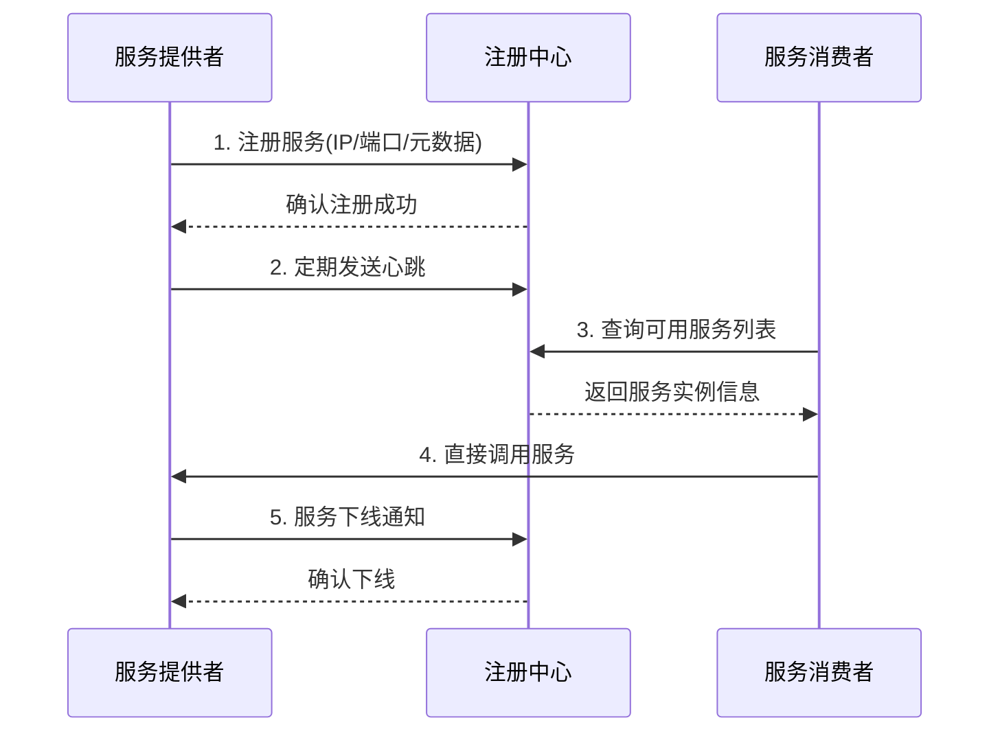

# 服务发现与注册原理

在微服务架构中，服务发现与注册是实现服务间通信的基础设施，它解决了"如何找到并连接到分布式环境中的服务实例"这一核心问题。本文将深入剖析服务发现与注册的工作原理、主流实现方案及最佳实践。

## 1. 核心工作机制

### 1.1 注册发现流程

服务发现与注册的基本流程包括四个关键步骤：服务注册、服务发现、健康检查和服务注销。



**详细说明：**

1. **服务注册**：服务实例启动时，将自身的网络位置（IP地址、端口）和服务标识（名称、版本等）注册到注册中心。
2. **健康检查**：服务实例定期向注册中心发送心跳，或接受注册中心的健康探测，以确认服务的可用性。
3. **服务发现**：消费者向注册中心查询所需服务的可用实例列表。
4. **服务调用**：消费者根据获取的实例信息，直接向服务提供者发起调用。
5. **服务注销**：服务实例在正常关闭时，主动从注册中心注销自己的信息。

### 1.2 健康检查机制

健康检查是确保服务发现准确性的关键机制，主要有三种实现方式：

| 检查方式       | 原理                       | 优点                     | 缺点                     |
|--------------|---------------------------|--------------------------|--------------------------|
| 客户端主动上报  | 服务实例定期发送心跳包到注册中心 | 实时性高，实现简单          | 增加网络负担，注册中心压力大  |
| 服务端探针     | 注册中心主动探测服务实例健康状态 | 可靠性高，减轻客户端负担     | 存在检测延迟，增加注册中心负载 |
| 混合模式       | 心跳+主动探测结合            | 平衡实时性与可靠性，容错性强  | 实现复杂，配置要求高         |

**健康检查实现细节：**

```java:c:\project\kphub\discovery\health-check\src\main\java\com\example\health\HealthCheckConfig.java
@Configuration
public class HealthCheckConfig {
    
    @Bean
    public HealthIndicator customHealthIndicator() {
        return new AbstractHealthIndicator() {
            @Override
            protected void doHealthCheck(Health.Builder builder) throws Exception {
                // 检查数据库连接
                boolean dbStatus = checkDatabaseConnection();
                
                // 检查依赖服务
                boolean dependencyStatus = checkDependencyServices();
                
                // 检查系统资源
                boolean resourceStatus = checkSystemResources();
                
                if (dbStatus && dependencyStatus && resourceStatus) {
                    builder.up()
                           .withDetail("database", "Connected")
                           .withDetail("dependencies", "Available")
                           .withDetail("resources", "Sufficient");
                } else {
                    builder.down()
                           .withDetail("database", dbStatus ? "Connected" : "Disconnected")
                           .withDetail("dependencies", dependencyStatus ? "Available" : "Unavailable")
                           .withDetail("resources", resourceStatus ? "Sufficient" : "Insufficient");
                }
            }
            
            private boolean checkDatabaseConnection() {
                // 实际检查数据库连接的逻辑
                return true;
            }
            
            private boolean checkDependencyServices() {
                // 检查关键依赖服务的逻辑
                return true;
            }
            
            private boolean checkSystemResources() {
                // 检查系统资源（内存、CPU等）的逻辑
                return Runtime.getRuntime().freeMemory() > 100 * 1024 * 1024; // 至少100MB可用内存
            }
        };
    }
}
```

### 1.3 服务实例元数据

服务实例元数据是描述服务特性和状态的关键信息，包括但不限于：

- **基础信息**：服务ID、名称、IP地址、端口
- **运行状态**：健康状态、启动时间、最后心跳时间
- **路由信息**：权重、分组、集群、区域
- **业务属性**：版本、环境、协议、安全级别
- **自定义标签**：用于特定业务场景的自定义属性

元数据在服务发现、负载均衡、灰度发布等场景中发挥着重要作用。

## 2. 主流实现方案

### 2.1 Eureka

Eureka是Netflix开发的服务发现框架，采用AP架构（可用性和分区容错性），适合对可用性要求高的场景。

**Eureka服务端配置：**

```java:c:\project\kphub\discovery\eureka-server\src\main\java\com\example\EurekaServerApplication.java
@SpringBootApplication
@EnableEurekaServer
public class EurekaServerApplication {
    public static void main(String[] args) {
        SpringApplication.run(EurekaServerApplication.class, args);
    }
}
```

```yaml:c:\project\kphub\discovery\eureka-server\src\main\resources\application.yml
server:
  port: 8761

spring:
  application:
    name: eureka-server

eureka:
  instance:
    hostname: localhost
  client:
    register-with-eureka: false  # 不向自己注册
    fetch-registry: false        # 不从自己获取注册信息
  server:
    enable-self-preservation: true  # 启用自我保护机制
    renewal-percent-threshold: 0.85 # 续约百分比阈值
    eviction-interval-timer-in-ms: 60000 # 清理无效节点的时间间隔
```

**Eureka客户端配置：**

```java:c:\project\kphub\discovery\eureka-client\src\main\java\com\example\config\EurekaConfig.java
@Configuration
public class EurekaConfig {
    @Bean
    public EurekaInstanceConfigBean eurekaInstanceConfig() {
        EurekaInstanceConfigBean config = new EurekaInstanceConfigBean();
        config.setAppname("order-service");
        config.setInstanceId("${spring.cloud.client.hostname}:${spring.application.name}:${server.port}");
        config.setLeaseRenewalIntervalInSeconds(30);  // 心跳间隔
        config.setLeaseExpirationDurationInSeconds(90);  // 租约过期时间
        
        // 添加自定义元数据
        Map<String, String> metadata = new HashMap<>();
        metadata.put("version", "1.0");
        metadata.put("region", "cn-north");
        metadata.put("weight", "100");
        config.setMetadataMap(metadata);
        
        return config;
    }
}
```

**Eureka工作原理：**

1. **服务注册**：服务启动时通过REST API向Eureka Server注册
2. **心跳续约**：默认每30秒发送一次心跳
3. **服务发现**：客户端从Eureka Server获取注册表信息并缓存
4. **服务下线**：服务正常关闭时发送下线请求
5. **自我保护**：当心跳失败比例超过阈值时，Eureka进入自我保护模式，不再剔除服务实例

### 2.2 Nacos

Nacos是阿里巴巴开源的服务发现和配置管理平台，支持AP和CP两种模式，适合多种场景需求。

**Nacos服务注册配置：**

```yaml:c:\project\kphub\discovery\nacos\application.yml
spring:
  application:
    name: product-service
  cloud:
    nacos:
      discovery:
        server-addr: 127.0.0.1:8848
        namespace: dev
        cluster-name: BJ-A
        ephemeral: false  # 永久实例
        metadata:
          version: 1.0
          env: production
          weight: 100
          protocol: http
```

**Nacos服务发现使用：**

```java:c:\project\kphub\discovery\nacos\src\main\java\com\example\service\ServiceDiscovery.java
@Service
@RequiredArgsConstructor
public class ServiceDiscovery {
    
    private final NacosDiscoveryProperties nacosDiscoveryProperties;
    private final NamingService namingService;
    
    public List<Instance> getServiceInstances(String serviceName) throws NacosException {
        // 获取指定服务的所有实例
        return namingService.selectInstances(serviceName, true);
    }
    
    public List<Instance> getServiceInstancesByCluster(String serviceName, String clusterName) throws NacosException {
        // 获取指定集群的服务实例
        return namingService.selectInstances(serviceName, clusterName, true);
    }
    
    public Instance selectOneHealthyInstance(String serviceName) throws NacosException {
        // 选择一个健康的实例（内置负载均衡）
        return namingService.selectOneHealthyInstance(serviceName);
    }
    
    public void registerInstance(String serviceName, String ip, int port) throws NacosException {
        // 手动注册实例
        Instance instance = new Instance();
        instance.setIp(ip);
        instance.setPort(port);
        instance.setWeight(100);
        instance.setClusterName(nacosDiscoveryProperties.getClusterName());
        
        Map<String, String> metadata = new HashMap<>();
        metadata.put("version", "1.0");
        metadata.put("env", "test");
        instance.setMetadata(metadata);
        
        namingService.registerInstance(serviceName, instance);
    }
    
    public void deregisterInstance(String serviceName, String ip, int port) throws NacosException {
        // 手动注销实例
        namingService.deregisterInstance(serviceName, ip, port);
    }
}
```

**Nacos特性：**

1. **临时实例与永久实例**：支持两种实例类型，临时实例健康检查失败会被自动剔除，永久实例不会
2. **多集群管理**：支持同一服务部署在多个集群，优先访问同集群实例
3. **权重路由**：支持基于权重的负载均衡
4. **元数据管理**：丰富的元数据支持，便于实现灰度发布等高级功能
5. **命名空间隔离**：通过命名空间实现环境隔离

### 2.3 Consul

Consul是HashiCorp开发的服务发现和配置管理工具，采用CP架构（一致性和分区容错性），适合对一致性要求高的场景。

**Consul配置：**

```yaml:c:\project\kphub\discovery\consul\application.yml
spring:
  application:
    name: payment-service
  cloud:
    consul:
      host: localhost
      port: 8500
      discovery:
        instance-id: ${spring.application.name}:${random.value}
        service-name: ${spring.application.name}
        health-check-path: /actuator/health
        health-check-interval: 15s
        tags:
          - version=1.0
          - env=prod
        metadata:
          zone: cn-east
          weight: 100
```

**Consul健康检查配置：**

```java:c:\project\kphub\discovery\consul\src\main\java\com\example\config\ConsulConfig.java
@Configuration
public class ConsulConfig {
    
    @Bean
    public ConsulHealthIndicator consulHealthIndicator(ConsulClient consulClient) {
        return new ConsulHealthIndicator(consulClient);
    }
    
    @Bean
    public ConsulServiceRegistry consulServiceRegistry(
            ConsulClient consulClient,
            ConsulDiscoveryProperties properties,
            HeartbeatProperties heartbeatProperties) {
        return new ConsulServiceRegistry(consulClient, properties, heartbeatProperties);
    }
    
    @Bean
    public ConsulCatalogWatch consulCatalogWatch(ConsulClient consulClient) {
        return new ConsulCatalogWatch(consulClient, 10);  // 10秒刷新一次服务列表
    }
}
```

**Consul特性：**

1. **强一致性**：基于Raft算法实现的强一致性
2. **健康检查**：支持多种健康检查方式（HTTP、TCP、脚本等）
3. **KV存储**：内置键值存储，可用于配置管理
4. **多数据中心**：原生支持多数据中心部署
5. **安全机制**：支持ACL和TLS，提供安全保障

## 3. 高级功能实现

### 3.1 权重路由配置

权重路由是实现流量精细化控制的重要手段，可用于灰度发布、容量管理等场景。

**基于Nacos的权重路由实现：**

```java:c:\project\kphub\discovery\nacos-ribbon\src\main\java\com\example\rule\WeightRule.java
public class WeightRule extends AbstractLoadBalancerRule {
    
    private final NamingService namingService;
    
    public WeightRule(NamingService namingService) {
        this.namingService = namingService;
    }
    
    @Override
    public void initWithNiwsConfig(IClientConfig clientConfig) {
        // 初始化配置
    }
    
    @Override
    public Server choose(Object key) {
        try {
            String serviceName = getLoadBalancer().getName();
            // 使用Nacos原生权重选择算法选择实例
            Instance instance = namingService.selectOneHealthyInstance(serviceName);
            
            // 转换为Ribbon的Server对象
            return new Server(instance.getIp(), instance.getPort());
        } catch (Exception e) {
            // 降级处理：使用普通轮询
            return roundRobinChoose(getLoadBalancer(), key);
        }
    }
    
    private Server roundRobinChoose(ILoadBalancer lb, Object key) {
        List<Server> servers = lb.getReachableServers();
        if (servers.isEmpty()) {
            return null;
        }
        
        int index = (int) (System.currentTimeMillis() / 1000) % servers.size();
        return servers.get(index);
    }
}
```

**权重路由配置类：**

```java:c:\project\kphub\discovery\nacos-ribbon\src\main\java\com\example\config\RibbonConfig.java
@Configuration
public class RibbonConfig {
    
    @Bean
    @ConditionalOnProperty(value = "ribbon.rule.type", havingValue = "weight")
    public IRule weightRule(NamingService namingService) {
        return new WeightRule(namingService);
    }
    
    @Bean
    public IClientConfig ribbonClientConfig() {
        DefaultClientConfigImpl config = new DefaultClientConfigImpl();
        config.loadProperties("product-service");
        return config;
    }
}
```

### 3.2 多集群容灾

多集群部署是提高系统可用性的重要手段，通过跨集群调用实现容灾。

**Nacos多集群配置：**

```yaml:c:\project\kphub\discovery\nacos-cluster\cluster.conf
# Nacos集群节点配置
192.168.1.101:8848
192.168.1.102:8848 
192.168.1.103:8848
```

**多集群调用策略实现：**

```java:c:\project\kphub\discovery\nacos-cluster\src\main\java\com\example\rule\ClusterAwareRule.java
public class ClusterAwareRule extends AbstractLoadBalancerRule {
    
    private final NamingService namingService;
    private final NacosDiscoveryProperties nacosDiscoveryProperties;
    
    public ClusterAwareRule(NamingService namingService, NacosDiscoveryProperties nacosDiscoveryProperties) {
        this.namingService = namingService;
        this.nacosDiscoveryProperties = nacosDiscoveryProperties;
    }
    
    @Override
    public void initWithNiwsConfig(IClientConfig clientConfig) {
        // 初始化配置
    }
    
    @Override
    public Server choose(Object key) {
        try {
            String serviceName = getLoadBalancer().getName();
            String clusterName = nacosDiscoveryProperties.getClusterName();
            
            // 1. 优先选择同集群实例
            List<Instance> sameClusterInstances = namingService.selectInstances(
                    serviceName, clusterName, true);
            
            // 2. 如果同集群没有可用实例，则选择其他集群
            if (sameClusterInstances.isEmpty()) {
                log.warn("No instance in cluster [{}] for service [{}], fallback to other clusters",
                        clusterName, serviceName);
                List<Instance> allInstances = namingService.selectInstances(serviceName, true);
                if (allInstances.isEmpty()) {
                    return null;
                }
                
                // 随机选择一个实例
                Instance instance = allInstances.get(ThreadLocalRandom.current().nextInt(allInstances.size()));
                return new Server(instance.getIp(), instance.getPort());
            }
            
            // 3. 同集群内基于权重选择
            Instance instance = ExtendBalancer.getHostByRandomWeight2(sameClusterInstances);
            return new Server(instance.getIp(), instance.getPort());
            
        } catch (Exception e) {
            log.error("Error choosing server via Nacos", e);
            return null;
        }
    }
}
```

### 3.3 服务分组与隔离

服务分组是实现环境隔离、灰度发布的重要手段。

**Nacos服务分组配置：**

```yaml:c:\project\kphub\discovery\nacos-group\application.yml
spring:
  cloud:
    nacos:
      discovery:
        server-addr: 127.0.0.1:8848
        namespace: ${spring.profiles.active}  # 使用环境作为命名空间
        group: ${service.group:DEFAULT_GROUP} # 服务分组
```

**服务调用时指定分组：**

```java:c:\project\kphub\discovery\nacos-group\src\main\java\com\example\service\GroupAwareService.java
@Service
@RequiredArgsConstructor
public class GroupAwareService {
    
    private final RestTemplate restTemplate;
    private final LoadBalancerClient loadBalancerClient;
    private final NamingService namingService;
    
    public String callServiceWithGroup(String serviceName, String group) throws NacosException {
        // 1. 获取指定分组的实例
        List<Instance> instances = namingService.selectInstances(serviceName, group, true);
        if (instances.isEmpty()) {
            throw new RuntimeException("No available instance for " + serviceName + " in group " + group);
        }
        
        // 2. 选择一个实例
        Instance instance = instances.get(0);
        
        // 3. 构建URL并调用
        String url = "http://" + instance.getIp() + ":" + instance.getPort() + "/api/resource";
        return restTemplate.getForObject(url, String.class);
    }
    
    // 使用Feign时可以通过配置指定分组
    @FeignClient(name = "product-service", configuration = ProductFeignConfig.class)
    public interface ProductClient {
        @GetMapping("/api/products/{id}")
        ProductDTO getProduct(@PathVariable("id") Long id);
    }
    
    // Feign配置类
    public class ProductFeignConfig {
        @Bean
        public FeignNameResolver feignNameResolver() {
            return new FeignNameResolver() {
                @Override
                public String resolve(String name) {
                    // 返回服务名加分组
                    return name + "@" + "gray-group";
                }
            };
        }
    }
}
```

## 4. 性能优化策略

### 4.1 客户端缓存机制

客户端缓存是减轻注册中心压力、提高服务发现效率的重要手段。

**Eureka客户端缓存实现：**

```java:c:\project\kphub\discovery\eureka-cache\src\main\java\com\example\cache\ServiceCache.java
@Component
@RequiredArgsConstructor
public class ServiceCache {
    
    private final EurekaClient eurekaClient;
    private final AtomicReference<List<Application>> localCache = new AtomicReference<>(new ArrayList<>());
    private final Logger log = LoggerFactory.getLogger(ServiceCache.class);
    
    @PostConstruct
    public void init() {
        refreshCache();
    }
    
    @Scheduled(fixedDelay = 30000)  // 每30秒刷新一次缓存
    public void refreshCache() {
        try {
            Applications apps = eurekaClient.getApplications();
            localCache.set(apps.getRegisteredApplications());
            log.debug("Refreshed service cache, total services: {}", localCache.get().size());
        } catch (Exception e) {
            log.error("Failed to refresh service cache", e);
        }
    }
    
    public List<InstanceInfo> getInstances(String appName) {
        // 1. 先从本地缓存获取
        List<Application> apps = localCache.get();
        for (Application app : apps) {
            if (app.getName().equals(appName)) {
                return app.getInstances();
            }
        }
        
        // 2. 缓存未命中，直接从Eureka获取并更新缓存
        log.debug("Cache miss for service: {}, fetching from Eureka", appName);
        Application app = eurekaClient.getApplication(appName);
        if (app != null) {
            return app.getInstances();
        }
        
        return Collections.emptyList();
    }
    
    public InstanceInfo getInstance(String appName) {
        List<InstanceInfo> instances = getInstances(appName);
        if (instances.isEmpty()) {
            return null;
        }
        
        // 简单的负载均衡：随机选择一个实例
        int index = ThreadLocalRandom.current().nextInt(instances.size());
        return instances.get(index);
    }
}
```

### 4.2 注册中心集群

注册中心集群是保证服务发现高可用的关键。

**Eureka集群配置：**

```properties:c:\project\kphub\discovery\eureka-server\src\main\resources\application-peer1.properties
spring.application.name=eureka-server
server.port=8761

eureka.instance.hostname=peer1
eureka.client.register-with-eureka=true
eureka.client.fetch-registry=true
eureka.client.service-url.defaultZone=http://peer2:8762/eureka/,http://peer3:8763/eureka/

eureka.server.enable-self-preservation=true
eureka.server.eviction-interval-timer-in-ms=60000
```

```properties:c:\project\kphub\discovery\eureka-server\src\main\resources\application-peer2.properties
spring.application.name=eureka-server
server.port=8762

eureka.instance.hostname=peer2
eureka.client.register-with-eureka=true
eureka.client.fetch-registry=true
eureka.client.service-url.defaultZone=http://peer1:8761/eureka/,http://peer3:8763/eureka/

eureka.server.enable-self-preservation=true
eureka.server.eviction-interval-timer-in-ms=60000
```

**Nacos集群配置：**

```yaml:c:\project\kphub\discovery\nacos-cluster\application.yml
spring:
  cloud:
    nacos:
      discovery:
        server-addr: 192.168.1.101:8848,192.168.1.102:8848,192.168.1.103:8848
        cluster-name: BJ-A
```

### 4.3 服务发现性能调优

服务发现性能调优涉及多个方面，包括网络配置、缓存策略、心跳频率等。

**Eureka性能调优：**

```yaml:c:\project\kphub\discovery\eureka-performance\application.yml
eureka:
  client:
    registry-fetch-interval-seconds: 30  # 从Eureka获取注册表的间隔
    eureka-service-url-poll-interval-seconds: 300  # 轮询Eureka服务URL的间隔
    eureka-server-read-timeout-seconds: 8  # 读取Eureka服务器的超时时间
    eureka-server-connect-timeout-seconds: 5  # 连接Eureka服务器的超时时间
    eureka-server-total-connections: 200  # 与Eureka服务器的最大连接数
    eureka-server-total-connections-per-host: 50  # 与每个Eureka服务器主机的最大连接数
    eureka-connection-idle-timeout-seconds: 30  # 连接空闲超时
    use-dns-for-fetching-service-urls: false  # 是否使用DNS获取服务URL
    disable-delta: false  # 是否禁用增量获取
    fetch-remote-regions-registry: false  # 是否获取远程区域的注册表
  instance:
    lease-renewal-interval-in-seconds: 30  # 心跳间隔
    lease-expiration-duration-in-seconds: 90  # 租约过期时间
    prefer-ip-address: true  # 优先使用IP地址
  server:
    response-cache-update-interval-ms: 30000  # 响应缓存更新间隔
    use-read-only-response-cache: true  # 使用只读响应缓存
    max-threads-for-peer-replication: 20  # 对等复制的最大线程数
```

**Nacos性能调优：**

```yaml:c:\project\kphub\discovery\nacos-performance\application.yml
spring:
  cloud:
    nacos:
      discovery:
        server-addr: 127.0.0.1:8848
        watch:
          enabled: true  # 启用服务列表监听
        naming-load-cache-at-start: true  # 启动时加载服务列表缓存
        heart-beat-interval: 5000  # 心跳间隔，单位毫秒
        heart-beat-timeout: 15000  # 心跳超时，单位毫秒
        ip-delete-timeout: 30000  # IP删除超时，单位毫秒
```

## 5. 生产环境实践

### 5.1 优雅下线流程

优雅下线是保证服务平滑迁移、避免服务调用失败的关键。

**Spring Boot应用优雅下线实现：**

```java:c:\project\kphub\discovery\shutdown-hook\src\main\java\com\example\hook\GracefulShutdown.java
@Component
@RequiredArgsConstructor
public class GracefulShutdown {
    
    private final EurekaClient eurekaClient;
    private final ApplicationContext context;
    private final Logger log = LoggerFactory.getLogger(GracefulShutdown.class);
    
    @PreDestroy
    public void deregister() {
        log.info("Application is shutting down, deregistering from Eureka...");
        
        // 1. 修改服务状态为DOWN，阻止新请求
        if (eurekaClient.getApplicationInfoManager() != null) {
            eurekaClient.getApplicationInfoManager().setInstanceStatus(InstanceStatus.DOWN);
            log.info("Instance status set to DOWN");
        }
        
        // 2. 等待一段时间，让服务消费者刷新服务列表
        try {
            log.info("Waiting for clients to refresh their service registry...");
            Thread.sleep(5000);
        } catch (InterruptedException e) {
            Thread.currentThread().interrupt();
        }
        
        // 3. 关闭Eureka客户端
        log.info("Shutting down Eureka client...");
        eurekaClient.shutdown();
        
        // 4. 等待处理中的请求完成
        awaitTermination(30, TimeUnit.SECONDS);
        
        log.info("Graceful shutdown completed");
    }
    
    private void awaitTermination(long timeout, TimeUnit unit) {
        log.info("Waiting for in-flight requests to
让我继续完成服务发现与注册原理的内容：

```java:c:\project\kphub\discovery\shutdown-hook\src\main\java\com\example\hook\GracefulShutdown.java
    private void awaitTermination(long timeout, TimeUnit unit) {
        log.info("Waiting for in-flight requests to complete, timeout: {} {}", timeout, unit);
        
        // 获取Web服务器
        WebServer webServer = getWebServer();
        if (webServer == null) {
            log.warn("WebServer not found, skipping await termination");
            return;
        }
        
        // 获取Tomcat服务器
        if (webServer instanceof TomcatWebServer) {
            Tomcat tomcat = ((TomcatWebServer) webServer).getTomcat();
            
            // 获取连接器
            Connector connector = tomcat.getConnector();
            connector.pause();
            
            // 等待处理中的请求完成
            ExecutorService executor = connector.getProtocolHandler().getExecutor();
            if (executor instanceof ThreadPoolExecutor) {
                ThreadPoolExecutor threadPoolExecutor = (ThreadPoolExecutor) executor;
                threadPoolExecutor.shutdown();
                try {
                    if (!threadPoolExecutor.awaitTermination(timeout, unit)) {
                        log.warn("Tomcat thread pool did not shut down gracefully within {} {}. Proceeding with forced shutdown", 
                                timeout, unit);
                    } else {
                        log.info("All requests completed successfully");
                    }
                } catch (InterruptedException e) {
                    Thread.currentThread().interrupt();
                    log.warn("Interrupted while waiting for Tomcat thread pool to terminate", e);
                }
            }
        } else {
            log.info("Not a Tomcat web server, waiting fixed delay");
            try {
                Thread.sleep(unit.toMillis(timeout));
            } catch (InterruptedException e) {
                Thread.currentThread().interrupt();
            }
        }
    }
    
    private WebServer getWebServer() {
        try {
            // 尝试获取WebServerApplicationContext
            if (context instanceof WebServerApplicationContext) {
                WebServerApplicationContext webServerContext = (WebServerApplicationContext) context;
                return webServerContext.getWebServer();
            }
        } catch (Exception e) {
            log.warn("Failed to get WebServer", e);
        }
        return null;
    }
}
```

### 5.2 元数据管理

元数据是服务发现的重要组成部分，通过元数据可以实现更精细的服务治理。

```yaml:c:\project\kphub\discovery\metadata\bootstrap.yml
spring:
  application:
    name: user-service
  cloud:
    consul:
      host: localhost
      port: 8500
      discovery:
        tags: version=1.0,env=prod
        metadata:
          zone: BJ-A
          weight: 100
          protocol: http2
          canary: false
          owner: team-a
          api-version: v2
```

**元数据管理工具类：**

```java:c:\project\kphub\discovery\metadata\src\main\java\com\example\metadata\MetadataManager.java
@Component
@RequiredArgsConstructor
public class MetadataManager {
    
    private final ConsulDiscoveryProperties discoveryProperties;
    private final ConsulServiceRegistry serviceRegistry;
    private final ConsulClient consulClient;
    
    /**
     * 更新服务实例元数据
     */
    public void updateMetadata(String key, String value) {
        Map<String, String> metadata = new HashMap<>(discoveryProperties.getMetadata());
        metadata.put(key, value);
        discoveryProperties.setMetadata(metadata);
        
        // 重新注册服务以更新元数据
        serviceRegistry.register(new ConsulRegistration(discoveryProperties, consulClient));
    }
    
    /**
     * 批量更新服务实例元数据
     */
    public void updateMetadata(Map<String, String> metadataUpdates) {
        Map<String, String> metadata = new HashMap<>(discoveryProperties.getMetadata());
        metadata.putAll(metadataUpdates);
        discoveryProperties.setMetadata(metadata);
        
        // 重新注册服务以更新元数据
        serviceRegistry.register(new ConsulRegistration(discoveryProperties, consulClient));
    }
    
    /**
     * 获取指定服务的元数据
     */
    public Map<String, String> getServiceMetadata(String serviceName, String instanceId) {
        Response<CatalogService> response = consulClient.getCatalogService(instanceId, QueryParams.DEFAULT);
        if (response.getValue() != null) {
            return response.getValue().getServiceMeta();
        }
        return Collections.emptyMap();
    }
    
    /**
     * 基于元数据过滤服务实例
     */
    public List<ServiceInstance> filterInstancesByMetadata(String serviceName, Map<String, String> criteria) {
        List<ServiceInstance> instances = serviceRegistry.getInstances(serviceName);
        
        return instances.stream()
                .filter(instance -> {
                    Map<String, String> metadata = instance.getMetadata();
                    // 检查所有条件是否匹配
                    for (Map.Entry<String, String> entry : criteria.entrySet()) {
                        String value = metadata.get(entry.getKey());
                        if (value == null || !value.equals(entry.getValue())) {
                            return false;
                        }
                    }
                    return true;
                })
                .collect(Collectors.toList());
    }
}
```

### 5.3 跨区域服务发现

跨区域服务发现是构建多区域部署架构的基础。

**Eureka跨区域配置：**

```yaml:c:\project\kphub\discovery\eureka-region\application.yml
eureka:
  client:
    region: cn-north
    availability-zones:
      cn-north: zone1,zone2
      cn-south: zone1,zone2
    service-url:
      zone1: http://eureka-zone1:8761/eureka/
      zone2: http://eureka-zone2:8762/eureka/
    fetch-remote-regions-registry: cn-south
    prefer-same-zone-eureka: true
```

**跨区域服务调用实现：**

```java:c:\project\kphub\discovery\eureka-region\src\main\java\com\example\region\RegionAwareLoadBalancer.java
public class RegionAwareLoadBalancer extends ZoneAwareLoadBalancer<Server> {
    
    private final EurekaClient eurekaClient;
    
    public RegionAwareLoadBalancer(IClientConfig clientConfig, IRule rule, IPing ping, 
                                  ServerList<Server> serverList, ServerListFilter<Server> filter,
                                  EurekaClient eurekaClient) {
        super(clientConfig, rule, ping, serverList, filter);
        this.eurekaClient = eurekaClient;
    }
    
    @Override
    public Server chooseServer(Object key) {
        // 1. 尝试从本区域选择服务器
        Server server = super.chooseServer(key);
        
        // 2. 如果本区域没有可用服务，尝试从其他区域选择
        if (server == null) {
            log.warn("No server available in current region, trying remote regions");
            
            // 获取所有区域的服务实例
            List<InstanceInfo> instances = eurekaClient.getInstancesByVipAddress(
                    getClientConfig().getClientName(), false);
            
            if (!instances.isEmpty()) {
                // 随机选择一个实例
                InstanceInfo instance = instances.get(ThreadLocalRandom.current().nextInt(instances.size()));
                server = new Server(instance.getHostName(), instance.getPort());
                log.info("Selected server from remote region: {}", server);
            }
        }
        
        return server;
    }
}
```

## 6. 安全控制方案

### 6.1 ACL访问控制

访问控制列表（ACL）是保护服务注册中心安全的重要手段。

**Nacos安全配置：**

```yaml:c:\project\kphub\discovery\nacos-security\application.yml
nacos:
  core:
    auth:
      enabled: true
      system:
        type: nacos
        admin: nacos-admin
      client:
        username: service-account
        password: encrypted-password
```

**Nacos客户端安全配置：**

```java:c:\project\kphub\discovery\nacos-security\src\main\java\com\example\config\NacosSecurityConfig.java
@Configuration
public class NacosSecurityConfig {
    
    @Bean
    @ConditionalOnProperty(name = "nacos.core.auth.enabled", havingValue = "true")
    public NacosDiscoveryProperties nacosDiscoveryProperties() {
        NacosDiscoveryProperties properties = new NacosDiscoveryProperties();
        properties.setUsername("${nacos.core.auth.client.username}");
        properties.setPassword("${nacos.core.auth.client.password}");
        properties.setNamespace("${nacos.discovery.namespace:public}");
        return properties;
    }
    
    @Bean
    public NacosServiceManager nacosServiceManager(NacosDiscoveryProperties properties) {
        return new NacosServiceManager(properties);
    }
}
```

### 6.2 TLS通信加密

TLS加密是保护服务注册与发现过程中数据安全的关键。

**生成证书：**

```bash
# 生成Nacos服务端证书
keytool -genkeypair -alias nacos -keyalg RSA \
  -keystore c:\project\kphub\discovery\nacos-tls\nacos.keystore \
  -validity 365 -storepass nacos123
```

**Nacos TLS配置：**

```properties:c:\project\kphub\discovery\nacos-tls\application.properties
server.ssl.enabled=true
server.ssl.key-store=file:c:/project/kphub/discovery/nacos-tls/nacos.keystore
server.ssl.key-store-password=nacos123
server.ssl.key-store-type=JKS
```

**客户端TLS配置：**

```java:c:\project\kphub\discovery\nacos-tls\src\main\java\com\example\config\TlsConfig.java
@Configuration
public class TlsConfig {
    
    @Bean
    public RestTemplate restTemplate() throws Exception {
        // 加载信任证书库
        Resource trustStore = new ClassPathResource("truststore.jks");
        char[] trustStorePassword = "password".toCharArray();
        
        KeyStore trustKeyStore = KeyStore.getInstance(KeyStore.getDefaultType());
        trustKeyStore.load(trustStore.getInputStream(), trustStorePassword);
        
        // 创建SSL上下文
        SSLContext sslContext = SSLContexts.custom()
                .loadTrustMaterial(trustKeyStore, null)
                .build();
        
        // 配置SSL连接工厂
        SSLConnectionSocketFactory socketFactory = new SSLConnectionSocketFactory(
                sslContext, new String[] { "TLSv1.2" }, null, NoopHostnameVerifier.INSTANCE);
        
        // 创建HttpClient
        CloseableHttpClient httpClient = HttpClients.custom()
                .setSSLSocketFactory(socketFactory)
                .build();
        
        // 配置RestTemplate使用自定义HttpClient
        HttpComponentsClientHttpRequestFactory requestFactory = 
                new HttpComponentsClientHttpRequestFactory(httpClient);
        
        return new RestTemplate(requestFactory);
    }
    
    @Bean
    @Primary
    public NacosRestTemplate nacosRestTemplate(RestTemplate restTemplate) {
        return new NacosRestTemplate(restTemplate);
    }
}
```

### 6.3 服务鉴权

服务间调用的鉴权是微服务安全的重要环节。

**基于JWT的服务鉴权：**

```java:c:\project\kphub\discovery\service-auth\src\main\java\com\example\auth\ServiceAuthInterceptor.java
@Component
@RequiredArgsConstructor
public class ServiceAuthInterceptor implements ClientHttpRequestInterceptor {
    
    private final JwtTokenProvider tokenProvider;
    
    @Override
    public ClientHttpResponse intercept(HttpRequest request, byte[] body, 
                                      ClientHttpRequestExecution execution) throws IOException {
        // 生成服务间调用的JWT令牌
        String serviceToken = tokenProvider.generateServiceToken();
        
        // 添加到请求头
        request.getHeaders().add("X-Service-Auth", serviceToken);
        
        // 继续执行请求
        return execution.execute(request, body);
    }
}

@Component
public class JwtTokenProvider {
    
    @Value("${service.auth.secret}")
    private String secretKey;
    
    @Value("${service.auth.expiration:300000}")
    private long validityInMilliseconds; // 5 minutes
    
    @Value("${spring.application.name}")
    private String serviceName;
    
    @PostConstruct
    protected void init() {
        secretKey = Base64.getEncoder().encodeToString(secretKey.getBytes());
    }
    
    public String generateServiceToken() {
        Claims claims = Jwts.claims().setSubject(serviceName);
        claims.put("role", "SERVICE");
        
        Date now = new Date();
        Date validity = new Date(now.getTime() + validityInMilliseconds);
        
        return Jwts.builder()
                .setClaims(claims)
                .setIssuedAt(now)
                .setExpiration(validity)
                .signWith(SignatureAlgorithm.HS256, secretKey)
                .compact();
    }
    
    public boolean validateToken(String token) {
        try {
            Jws<Claims> claims = Jwts.parser().setSigningKey(secretKey).parseClaimsJws(token);
            return !claims.getBody().getExpiration().before(new Date());
        } catch (JwtException | IllegalArgumentException e) {
            return false;
        }
    }
    
    public String getServiceName(String token) {
        return Jwts.parser().setSigningKey(secretKey).parseClaimsJws(token).getBody().getSubject();
    }
}
```

## 7. 服务发现最佳实践

### 7.1 选型决策指南

选择合适的服务发现解决方案需要考虑多个因素：

| 因素 | Eureka | Nacos | Consul | Zookeeper |
|------|--------|-------|--------|-----------|
| 一致性模型 | AP | AP/CP | CP | CP |
| 健康检查 | 客户端心跳 | 客户端心跳+服务端探测 | 多种健康检查 | 会话超时 |
| 多数据中心 | 有限支持 | 支持 | 原生支持 | 有限支持 |
| 配置管理 | 不支持 | 支持 | 支持 | 支持 |
| 安全机制 | 基础认证 | 用户名密码+TLS | ACL+TLS | ACL |
| 可观测性 | 有限 | 丰富 | 丰富 | 有限 |
| 社区活跃度 | 高 | 高 | 高 | 中 |
| Spring集成 | 原生支持 | 良好 | 良好 | 良好 |

**选型建议：**

1. **小型项目**：Eureka - 简单易用，与Spring Cloud生态完美集成
2. **中型项目**：Nacos - 功能丰富，配置管理与服务发现一体化
3. **大型分布式系统**：Consul - 多数据中心支持，强一致性
4. **对一致性要求极高**：Zookeeper - CP模型，成熟稳定

### 7.2 高可用部署架构

高可用是服务发现系统的核心要求，以下是推荐的部署架构：

**Nacos集群高可用部署：**

```yaml:c:\project\kphub\discovery\ha-deployment\nacos-cluster.yaml
version: '3'
services:
  nacos1:
    image: nacos/nacos-server:latest
    container_name: nacos1
    networks:
      nacos_net:
        ipv4_address: 172.16.238.10
    volumes:
      - ./cluster-logs/nacos1:/home/nacos/logs
      - ./init.d/custom.properties:/home/nacos/init.d/custom.properties
    ports:
      - "8848:8848"
      - "9848:9848"
      - "9555:9555"
    environment:
      - PREFER_HOST_MODE=hostname
      - MODE=cluster
      - NACOS_SERVERS=172.16.238.10:8848 172.16.238.11:8848 172.16.238.12:8848
      - SPRING_DATASOURCE_PLATFORM=mysql
      - MYSQL_SERVICE_HOST=mysql
      - MYSQL_SERVICE_DB_NAME=nacos_config
      - MYSQL_SERVICE_PORT=3306
      - MYSQL_SERVICE_USER=nacos
      - MYSQL_SERVICE_PASSWORD=nacos
      - JVM_XMS=512m
      - JVM_XMX=512m

  nacos2:
    image: nacos/nacos-server:latest
    container_name: nacos2
    networks:
      nacos_net:
        ipv4_address: 172.16.238.11
    volumes:
      - ./cluster-logs/nacos2:/home/nacos/logs
      - ./init.d/custom.properties:/home/nacos/init.d/custom.properties
    ports:
      - "8849:8848"
    environment:
      - PREFER_HOST_MODE=hostname
      - MODE=cluster
      - NACOS_SERVERS=172.16.238.10:8848 172.16.238.11:8848 172.16.238.12:8848
      - SPRING_DATASOURCE_PLATFORM=mysql
      - MYSQL_SERVICE_HOST=mysql
      - MYSQL_SERVICE_DB_NAME=nacos_config
      - MYSQL_SERVICE_PORT=3306
      - MYSQL_SERVICE_USER=nacos
      - MYSQL_SERVICE_PASSWORD=nacos
      - JVM_XMS=512m
      - JVM_XMX=512m

  nacos3:
    image: nacos/nacos-server:latest
    container_name: nacos3
    networks:
      nacos_net:
        ipv4_address: 172.16.238.12
    volumes:
      - ./cluster-logs/nacos3:/home/nacos/logs
      - ./init.d/custom.properties:/home/nacos/init.d/custom.properties
    ports:
      - "8850:8848"
    environment:
      - PREFER_HOST_MODE=hostname
      - MODE=cluster
      - NACOS_SERVERS=172.16.238.10:8848 172.16.238.11:8848 172.16.238.12:8848
      - SPRING_DATASOURCE_PLATFORM=mysql
      - MYSQL_SERVICE_HOST=mysql
      - MYSQL_SERVICE_DB_NAME=nacos_config
      - MYSQL_SERVICE_PORT=3306
      - MYSQL_SERVICE_USER=nacos
      - MYSQL_SERVICE_PASSWORD=nacos
      - JVM_XMS=512m
      - JVM_XMX=512m

  mysql:
    container_name: mysql
    image: mysql:5.7
    networks:
      nacos_net:
        ipv4_address: 172.16.238.13
    volumes:
      - ./mysql:/var/lib/mysql
    environment:
      - MYSQL_ROOT_PASSWORD=root
      - MYSQL_DATABASE=nacos_config
      - MYSQL_USER=nacos
      - MYSQL_PASSWORD=nacos
    ports:
      - "3306:3306"

networks:
  nacos_net:
    driver: bridge
    ipam:
      config:
        - subnet: 172.16.238.0/24
```

### 7.3 监控与告警

服务发现系统的监控是保障微服务稳定运行的关键。

**Prometheus监控配置：**

```yaml:c:\project\kphub\discovery\monitoring\prometheus.yml
global:
  scrape_interval: 15s
  evaluation_interval: 15s

scrape_configs:
  - job_name: 'nacos'
    metrics_path: '/nacos/actuator/prometheus'
    static_configs:
      - targets: ['nacos1:8848', 'nacos2:8848', 'nacos3:8848']
        labels:
          service: 'nacos'

  - job_name: 'spring-boot'
    metrics_path: '/actuator/prometheus'
    static_configs:
      - targets: ['service1:8080', 'service2:8081', 'service3:8082']
        labels:
          service: 'microservices'
```

**Grafana告警配置：**

```json:c:\project\kphub\discovery\monitoring\service-discovery-alerts.json
{
  "alertName": "ServiceDiscoveryUnhealthy",
  "message": "服务发现系统健康状态异常",
  "alertRuleTags": {},
  "conditions": [
    {
      "evaluator": {
        "params": [0.7],
        "type": "lt"
      },
      "operator": {
        "type": "and"
      },
      "query": {
        "params": ["A", "5m", "now"]
      },
      "reducer": {
        "params": [],
        "type": "avg"
      },
      "type": "query"
    }
  ],
  "executionErrorState": "alerting",
  "for": "5m",
  "frequency": "1m",
  "handler": 1,
  "name": "服务发现健康状态",
  "noDataState": "no_data",
  "notifications": [
    {
      "uid": "notification-channel-1"
    }
  ]
}
```

## 8. 总结与展望

服务发现与注册是微服务架构的基础设施，它解决了分布式系统中服务定位和通信的核心问题。随着云原生技术的发展，服务发现机制也在不断演进。

### 8.1 关键要点总结

1. **核心机制**：服务注册、服务发现、健康检查和服务注销构成了完整的服务发现生命周期
2. **主流方案**：Eureka、Nacos、Consul和Zookeeper各有特点，适用于不同场景
3. **高级功能**：权重路由、多集群容灾、服务分组等功能提供了精细化的服务治理能力
4. **性能优化**：客户端缓存、注册中心集群是提高性能和可用性的关键
5. **生产实践**：优雅下线、元数据管理、跨区域服务发现是生产环境的必备功能
6. **安全控制**：ACL访问控制、TLS通信加密、服务鉴权保障了服务发现的安全性

### 8.2 未来发展趋势

1. **服务网格集成**：与Istio、Linkerd等服务网格技术深度集成，实现更强大的服务治理
2. **多云环境支持**：跨云服务发现将成为标准，支持混合云和多云部署
3. **自动化运维**：自动扩缩容、自动故障转移等自动化运维能力将进一步增强
4. **AI辅助决策**：引入AI技术辅助服务路由决策，优化系统性能
5. **边缘计算支持**：扩展到边缘计算场景，支持边缘节点的服务发现

服务发现与注册技术将继续发展，为构建更加可靠、高效、安全的微服务架构提供坚实基础。