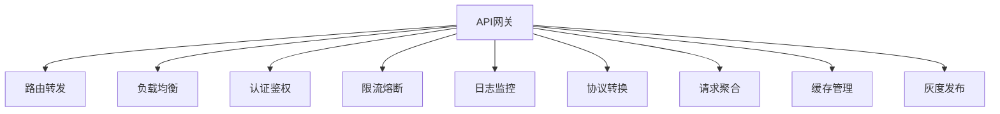
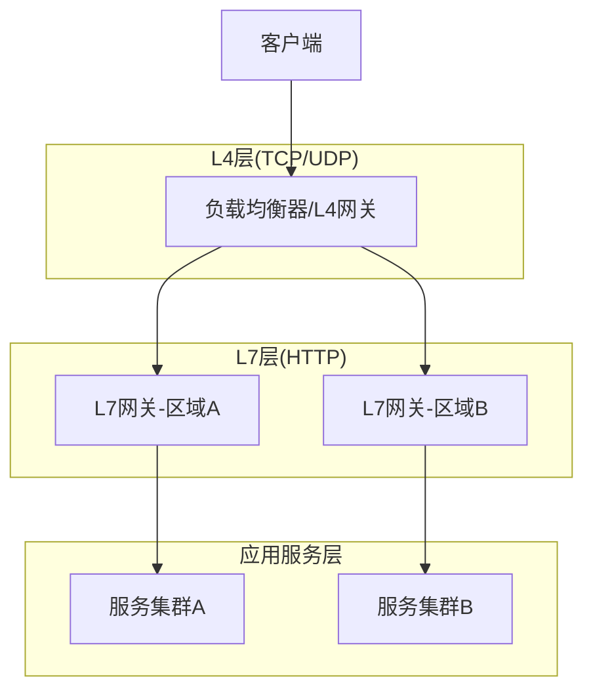
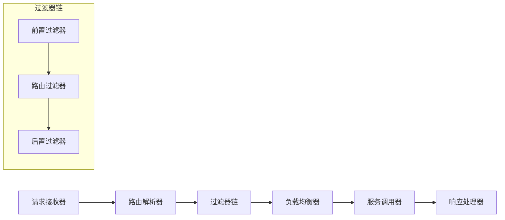
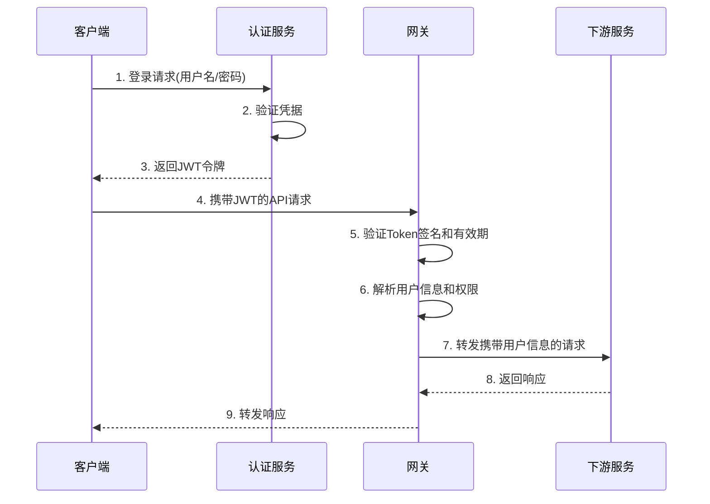
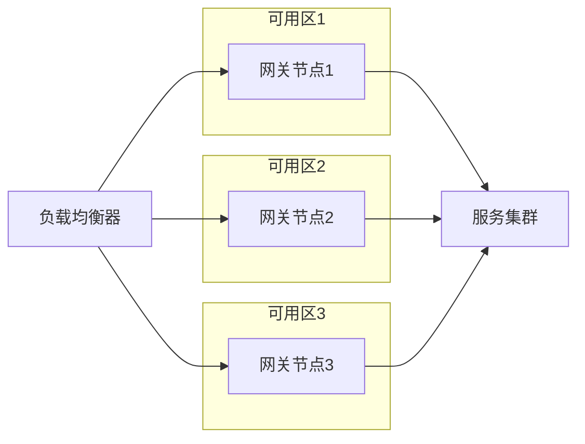

# API网关设计原则

API网关是微服务架构中的关键组件，作为系统的统一入口，它承担着流量分发、安全防护、协议转换等重要职责。本文将深入探讨API网关的设计原则，帮助开发者构建高性能、安全可靠的API网关系统。

## 1. 核心功能架构

API网关作为微服务架构的"守门员"，需要提供丰富的功能来保障系统的安全性、可用性和可观测性。

### 1.1 网关功能矩阵



**核心功能详解：**

1. **路由转发**：将客户端请求精确转发到后端相应的微服务
2. **负载均衡**：在多个服务实例间分发流量，确保系统负载均衡
3. **认证鉴权**：统一验证用户身份和访问权限
4. **限流熔断**：控制请求流量，防止系统过载
5. **日志监控**：记录请求日志，监控系统运行状态
6. **协议转换**：在不同协议间进行转换（如HTTP到gRPC）
7. **请求聚合**：将多个微服务的响应聚合，减少客户端请求次数
8. **缓存管理**：缓存常用数据，提高响应速度
9. **灰度发布**：支持新版本的平滑发布和流量控制

### 1.2 流量治理层次

API网关的流量治理通常分为三个层次，每个层次关注不同的处理维度：

| 层级 | 功能                  | 实现技术               | 关注点                |
|------|---------------------|---------------------|----------------------|
| L4   | TCP/UDP转发          | Nginx/Envoy/HAProxy | 连接管理、简单负载均衡    |
| L7   | HTTP协议处理         | Spring Cloud Gateway/Zuul/Kong | 路由规则、协议转换、请求处理 |
| 应用层 | 业务逻辑处理          | 自定义插件/BFF层       | 数据转换、聚合、业务规则   |

**多层网关架构示例：**



### 1.3 网关核心组件

一个完整的API网关系统通常包含以下核心组件：



**组件职责：**

- **请求接收器**：接收并解析客户端请求
- **路由解析器**：根据请求信息确定目标服务
- **过滤器链**：按顺序执行各种处理逻辑
- **负载均衡器**：选择合适的服务实例
- **服务调用器**：执行实际的服务调用
- **响应处理器**：处理并返回响应结果

## 2. 关键设计原则

### 2.1 高性能路由配置

路由是API网关的核心功能，高效的路由配置能显著提升网关性能。

**Spring Cloud Gateway路由配置：**

```yaml:c:\project\kphub\gateway\config\route-config.yml
spring:
  cloud:
    gateway:
      routes:
      - id: order-service
        uri: lb://order-service
        predicates:
        - Path=/api/orders/**
        - Method=GET,POST,PUT,DELETE
        - Header=X-API-Version, v1
        filters:
        - StripPrefix=1
        - name: RequestRateLimiter
          args:
            redis-rate-limiter.replenishRate: 100
            redis-rate-limiter.burstCapacity: 200
            key-resolver: "#{@userKeyResolver}"
        - name: Retry
          args:
            retries: 3
            statuses: BAD_GATEWAY,SERVICE_UNAVAILABLE
            methods: GET
            backoff:
              firstBackoff: 100ms
              maxBackoff: 500ms
              factor: 2
              basedOnPreviousValue: false
        - name: CircuitBreaker
          args:
            name: orderServiceCircuitBreaker
            fallbackUri: forward:/fallback/orders
      
      - id: product-service
        uri: lb://product-service
        predicates:
        - Path=/api/products/**
        filters:
        - StripPrefix=1
        - name: RequestSize
          args:
            maxSize: 5MB
        - AddResponseHeader=X-Response-Source, API-Gateway
        
      - id: user-service
        uri: lb://user-service
        predicates:
        - Path=/api/users/**
        - Weight=user-service, 90
        filters:
        - StripPrefix=1
        - name: RequestRateLimiter
          args:
            redis-rate-limiter.replenishRate: 50
            redis-rate-limiter.burstCapacity: 100
            key-resolver: "#{@ipKeyResolver}"
```

**路由配置最佳实践：**

1. **精确的路径匹配**：使用精确的路径模式，避免过于宽泛的匹配规则
2. **合理的断言组合**：结合路径、方法、头部等多种断言，提高路由精确性
3. **按需添加过滤器**：只添加必要的过滤器，减少处理链长度
4. **优化负载均衡策略**：根据服务特性选择合适的负载均衡算法
5. **配置超时和重试**：设置合理的超时时间和重试策略，提高系统弹性

### 2.2 插件化架构设计

插件化架构是API网关的核心设计原则，它使网关具有高度的可扩展性和灵活性。

**插件系统核心接口：**

```java:c:\project\kphub\gateway\src\main\java\com\example\gateway\core\PluginChain.java
/**
 * 网关插件接口
 */
public interface GatewayPlugin {
    /**
     * 执行插件逻辑
     * @param ctx 请求上下文
     */
    void apply(RequestContext ctx);
    
    /**
     * 判断是否应该执行此插件
     * @param ctx 请求上下文
     * @return 是否执行
     */
    boolean shouldFilter(RequestContext ctx);
    
    /**
     * 插件执行顺序，数字越小越先执行
     * @return 顺序值
     */
    int order();
}

/**
 * 请求上下文，包含请求和响应信息
 */
public class RequestContext {
    private ServerHttpRequest request;
    private ServerHttpResponse response;
    private Map<String, Object> attributes = new HashMap<>();
    
    // 省略getter/setter
    
    public void setAttribute(String key, Object value) {
        attributes.put(key, value);
    }
    
    public Object getAttribute(String key) {
        return attributes.get(key);
    }
}

/**
 * 插件执行链
 */
public class PluginChain {
    private List<GatewayPlugin> plugins;
    
    public PluginChain(List<GatewayPlugin> plugins) {
        this.plugins = plugins;
    }
    
    /**
     * 执行所有适用的插件
     * @param ctx 请求上下文
     */
    public void execute(RequestContext ctx) {
        plugins.stream()
            .filter(p -> p.shouldFilter(ctx))
            .sorted(Comparator.comparingInt(GatewayPlugin::order))
            .forEach(p -> {
                try {
                    p.apply(ctx);
                } catch (Exception e) {
                    // 异常处理
                    handlePluginException(p, ctx, e);
                }
            });
    }
    
    private void handlePluginException(GatewayPlugin plugin, RequestContext ctx, Exception e) {
        // 记录异常日志
        log.error("Plugin execution error: {}", plugin.getClass().getName(), e);
        
        // 设置错误响应
        ctx.getResponse().setStatusCode(HttpStatus.INTERNAL_SERVER_ERROR);
        // 可以根据需要返回更详细的错误信息
    }
}
```

**插件实现示例：**

```java:c:\project\kphub\gateway\src\main\java\com\example\gateway\plugins\AuthenticationPlugin.java
/**
 * 认证插件
 */
@Component
@Order(100)
public class AuthenticationPlugin implements GatewayPlugin {
    
    private final JwtTokenService tokenService;
    
    public AuthenticationPlugin(JwtTokenService tokenService) {
        this.tokenService = tokenService;
    }
    
    @Override
    public void apply(RequestContext ctx) {
        ServerHttpRequest request = ctx.getRequest();
        
        // 获取Authorization头
        String authHeader = request.getHeaders().getFirst("Authorization");
        if (authHeader != null && authHeader.startsWith("Bearer ")) {
            String token = authHeader.substring(7);
            
            // 验证token
            try {
                UserDetails userDetails = tokenService.validateToken(token);
                // 将用户信息添加到上下文
                ctx.setAttribute("user", userDetails);
                
                // 修改请求，添加用户信息到头部
                ServerHttpRequest modifiedRequest = request.mutate()
                    .header("X-User-Id", userDetails.getId())
                    .header("X-User-Roles", String.join(",", userDetails.getRoles()))
                    .build();
                
                // 更新上下文中的请求
                ctx.setRequest(modifiedRequest);
            } catch (Exception e) {
                // Token无效，设置401响应
                ctx.getResponse().setStatusCode(HttpStatus.UNAUTHORIZED);
                throw new AuthenticationException("Invalid token", e);
            }
        } else {
            // 检查是否是公开路径
            String path = request.getPath().value();
            if (!isPublicPath(path)) {
                ctx.getResponse().setStatusCode(HttpStatus.UNAUTHORIZED);
                throw new AuthenticationException("Authentication required");
            }
        }
    }
    
    @Override
    public boolean shouldFilter(RequestContext ctx) {
        // 可以根据路径或其他条件决定是否需要认证
        return true;
    }
    
    @Override
    public int order() {
        return 100; // 认证应该在较早阶段执行
    }
    
    private boolean isPublicPath(String path) {
        // 判断是否是公开访问路径
        List<String> publicPaths = Arrays.asList(
            "/api/auth/login",
            "/api/auth/register",
            "/api/public",
            "/actuator/health"
        );
        
        return publicPaths.stream().anyMatch(path::startsWith);
    }
}
```

**插件注册与管理：**

```java:c:\project\kphub\gateway\src\main\java\com\example\gateway\config\PluginConfig.java
@Configuration
public class PluginConfig {
    
    @Bean
    public PluginRegistry pluginRegistry(List<GatewayPlugin> plugins) {
        return new PluginRegistry(plugins);
    }
    
    @Bean
    public WebFilter pluginWebFilter(PluginRegistry registry) {
        return (exchange, chain) -> {
            ServerHttpRequest request = exchange.getRequest();
            ServerHttpResponse response = exchange.getResponse();
            
            // 创建请求上下文
            RequestContext ctx = new RequestContext();
            ctx.setRequest(request);
            ctx.setResponse(response);
            
            // 执行插件链
            try {
                registry.getPluginChain().execute(ctx);
                
                // 如果响应已经完成，直接返回
                if (response.isCommitted()) {
                    return Mono.empty();
                }
                
                // 继续处理请求
                return chain.filter(
                    exchange.mutate()
                        .request(ctx.getRequest())
                        .response(ctx.getResponse())
                        .build()
                );
            } catch (Exception e) {
                // 处理异常
                return handleException(exchange, e);
            }
        };
    }
    
    private Mono<Void> handleException(ServerWebExchange exchange, Exception e) {
        ServerHttpResponse response = exchange.getResponse();
        
        // 设置状态码
        HttpStatus status = HttpStatus.INTERNAL_SERVER_ERROR;
        if (e instanceof AuthenticationException) {
            status = HttpStatus.UNAUTHORIZED;
        } else if (e instanceof ForbiddenException) {
            status = HttpStatus.FORBIDDEN;
        }
        
        response.setStatusCode(status);
        
        // 返回错误信息
        byte[] bytes = ("{\"error\":\"" + e.getMessage() + "\"}").getBytes(StandardCharsets.UTF_8);
        DataBuffer buffer = response.bufferFactory().wrap(bytes);
        response.getHeaders().setContentType(MediaType.APPLICATION_JSON);
        
        return response.writeWith(Mono.just(buffer));
    }
}
```

### 2.3 动态配置管理

API网关需要支持动态配置更新，以便在不重启服务的情况下修改路由规则、限流策略等。

**基于配置中心的动态配置：**

```java:c:\project\kphub\gateway\src\main\java\com\example\gateway\config\DynamicRouteConfig.java
@Configuration
public class DynamicRouteConfig {
    
    private final RouteDefinitionRepository repository;
    private final ApplicationEventPublisher publisher;
    
    public DynamicRouteConfig(RouteDefinitionRepository repository, ApplicationEventPublisher publisher) {
        this.repository = repository;
        this.publisher = publisher;
    }
    
    /**
     * 添加路由
     */
    public String addRoute(RouteDefinition definition) {
        repository.save(Mono.just(definition)).subscribe();
        publisher.publishEvent(new RefreshRoutesEvent(this));
        return "success";
    }
    
    /**
     * 更新路由
     */
    public String updateRoute(RouteDefinition definition) {
        try {
            repository.delete(Mono.just(definition.getId())).subscribe();
        } catch (Exception e) {
            return "update failed, route not found";
        }
        
        repository.save(Mono.just(definition)).subscribe();
        publisher.publishEvent(new RefreshRoutesEvent(this));
        return "success";
    }
    
    /**
     * 删除路由
     */
    public String deleteRoute(String id) {
        try {
            repository.delete(Mono.just(id)).subscribe();
            publisher.publishEvent(new RefreshRoutesEvent(this));
            return "success";
        } catch (Exception e) {
            return "delete failed, route not found";
        }
    }
    
    /**
     * 配置监听器，监听配置变化
     */
    @Bean
    @ConditionalOnProperty(name = "spring.cloud.nacos.config.enabled", havingValue = "true")
    public NacosConfigListener nacosConfigListener(NacosConfigManager nacosConfigManager) {
        return new NacosConfigListener(nacosConfigManager, this);
    }
}

/**
 * Nacos配置监听器
 */
@Slf4j
public class NacosConfigListener {
    
    private final NacosConfigManager configManager;
    private final DynamicRouteConfig routeConfig;
    
    public NacosConfigListener(NacosConfigManager configManager, DynamicRouteConfig routeConfig) {
        this.configManager = configManager;
        this.routeConfig = routeConfig;
        
        try {
            // 监听路由配置变化
            configManager.getConfigService().addListener(
                "gateway-routes.json",
                "DEFAULT_GROUP",
                new Listener() {
                    @Override
                    public void receiveConfigInfo(String configInfo) {
                        log.info("Received updated gateway routes: {}", configInfo);
                        updateRoutes(configInfo);
                    }
                    
                    @Override
                    public Executor getExecutor() {
                        return null;
                    }
                }
            );
        } catch (NacosException e) {
            log.error("Failed to add nacos config listener", e);
        }
    }
    
    private void updateRoutes(String configInfo) {
        try {
            // 解析配置
            ObjectMapper mapper = new ObjectMapper();
            List<RouteDefinition> routes = mapper.readValue(
                configInfo,
                new TypeReference<List<RouteDefinition>>() {}
            );
            
            // 更新路由
            for (RouteDefinition route : routes) {
                routeConfig.updateRoute(route);
            }
        } catch (Exception e) {
            log.error("Failed to update routes", e);
        }
    }
}
```

## 3. 安全防护体系

API网关是系统的第一道防线，需要实施全面的安全防护措施。

### 3.1 JWT认证流程

JWT（JSON Web Token）是API网关中常用的认证机制，它允许网关验证用户身份并将用户信息传递给后端服务。



**JWT认证过滤器实现：**

```java:c:\project\kphub\gateway\src\main\java\com\example\gateway\filter\JwtAuthenticationFilter.java
@Component
@Order(-1)
public class JwtAuthenticationFilter implements GlobalFilter {
    
    private final JwtTokenProvider tokenProvider;
    private final ReactiveAuthenticationManager authenticationManager;
    private final SecurityContextRepository securityContextRepository;
    
    public JwtAuthenticationFilter(JwtTokenProvider tokenProvider,
                                  ReactiveAuthenticationManager authenticationManager,
                                  SecurityContextRepository securityContextRepository) {
        this.tokenProvider = tokenProvider;
        this.authenticationManager = authenticationManager;
        this.securityContextRepository = securityContextRepository;
    }
    
    @Override
    public Mono<Void> filter(ServerWebExchange exchange, GatewayFilterChain chain) {
        ServerHttpRequest request = exchange.getRequest();
        
        // 检查是否是公开路径
        if (isPublicPath(request.getPath().value())) {
            return chain.filter(exchange);
        }
        
        // 获取Authorization头
        String token = resolveToken(request);
        if (token != null && tokenProvider.validateToken(token)) {
            // 解析用户信息
            Authentication auth = tokenProvider.getAuthentication(token);
            
            // 创建认证上下文
            return authenticationManager.authenticate(auth)
                .flatMap(authentication -> {
                    SecurityContextImpl securityContext = new SecurityContextImpl(authentication);
                    return securityContextRepository.save(exchange, securityContext)
                        .then(Mono.defer(() -> {
                            // 添加用户信息到请求头
                            ServerHttpRequest mutatedRequest = mutateRequestWithUserInfo(request, authentication);
                            ServerWebExchange mutatedExchange = exchange.mutate().request(mutatedRequest).build();
                            
                            return chain.filter(mutatedExchange);
                        }));
                });
        }
        
        // Token无效或不存在
        return onAuthenticationFailure(exchange);
    }
    
    private String resolveToken(ServerHttpRequest request) {
        String bearerToken = request.getHeaders().getFirst("Authorization");
        if (bearerToken != null && bearerToken.startsWith("Bearer ")) {
            return bearerToken.substring(7);
        }
        return null;
    }
    
    private boolean isPublicPath(String path) {
        List<String> publicPaths = Arrays.asList(
            "/api/auth/login",
            "/api/auth/register",
            "/api/public",
            "/actuator/health"
        );
        
        return publicPaths.stream().anyMatch(path::startsWith);
    }
    
    private ServerHttpRequest mutateRequestWithUserInfo(ServerHttpRequest request, Authentication authentication) {
        UserDetails userDetails = (UserDetails) authentication.getPrincipal();
        
        return request.mutate()
            .header("X-User-Id", userDetails.getUsername())
            .header("X-User-Roles", String.join(",", 
                userDetails.getAuthorities().stream()
                    .map(GrantedAuthority::getAuthority)
                    .collect(Collectors.toList())))
            .build();
    }
    
    private Mono<Void> onAuthenticationFailure(ServerWebExchange exchange) {
        ServerHttpResponse response = exchange.getResponse();
        response.setStatusCode(HttpStatus.UNAUTHORIZED);
        
        response.getHeaders().setContentType(MediaType.APPLICATION_JSON);
        String body = "{\"error\":\"Unauthorized\",\"message\":\"Invalid or missing authentication token\"}";
        DataBuffer buffer = response.bufferFactory().wrap(body.getBytes(StandardCharsets.UTF_8));
        
        return response.writeWith(Mono.just(buffer));
    }
}
```

### 3.2 防重放攻击配置

重放攻击是一种常见的安全威胁，攻击者通过重复发送已捕获的有效请求来实现非法操作。API网关需要实施防重放机制来防止此类攻击。

```java:c:\project\kphub\gateway\src\main\java\com\example\gateway\filter\ReplayAttackFilter.java
@Component
public class ReplayAttackFilter implements GatewayFilter, Ordered {
    
    private final StringRedisTemplate redisTemplate;
    
    public ReplayAttackFilter(StringRedisTemplate redisTemplate) {
        this.redisTemplate = redisTemplate;
    }
    
    @Override
    public Mono<Void> filter(ServerWebExchange exchange, GatewayFilterChain chain) {
        ServerHttpRequest request = exchange.getRequest();
        
        // 获取请求中的防重放参数
        String nonce = request.getHeaders().getFirst("X-Nonce");
        String timestamp = request.getHeaders().getFirst("X-Timestamp");
        String signature = request.getHeaders().getFirst("X-Signature");
        
        // 验证参数是否存在
        if (nonce == null || timestamp == null || signature == null) {
            return onInvalidRequest(exchange, "Missing replay protection headers");
        }
        
        // 验证时间戳是否在允许范围内（例如5分钟）
        long requestTime;
        try {
            requestTime = Long.parseLong(timestamp);
        } catch (NumberFormatException e) {
            return onInvalidRequest(exchange, "Invalid timestamp format");
        }
        
        long currentTime = System.currentTimeMillis();
        long timeWindow = 5 * 60 * 1000; // 5分钟
        
        if (Math.abs(currentTime - requestTime) > timeWindow) {
            return onInvalidRequest(exchange, "Request expired");
        }
        
        // 验证nonce是否已使用（防止重放）
        String nonceKey = "nonce:" + nonce;
        return redisTemplate.opsForValue().setIfAbsent(nonceKey, "1", 5, TimeUnit.MINUTES)
            .flatMap(success -> {
                if (Boolean.TRUE.equals(success)) {
                    // nonce未使用过，验证签名
                    if (verifySignature(request, nonce, timestamp, signature)) {
                        return chain.filter(exchange);
                    } else {
                        return onInvalidRequest(exchange, "Invalid signature");
                    }
                } else {
                    // nonce已使用过，拒绝请求
                    return onInvalidRequest(exchange, "Duplicate request detected");
                }
            });
    }
    
    private boolean verifySignature(ServerHttpRequest request, String nonce, String timestamp, String signature) {
        // 实际应用中，这里应该实现真正的签名验证逻辑
        // 例如：使用HMAC-SHA256算法验证签名
        
        // 示例实现（实际应用中需要替换为真正的验证逻辑）
        String method = request.getMethodValue();
        String path = request.getPath().value();
        String secretKey = "your-secret-key"; // 实际应用中应该从安全的地方获取
        
        String data = method + path + nonce + timestamp;
        String expectedSignature = generateHmacSha256(data, secretKey);
        
        return expectedSignature.equals(signature);
    }
    
    private String generateHmacSha256(String data, String key) {
        try {
            Mac sha256_HMAC = Mac.getInstance("HmacSHA256");
            SecretKeySpec secret_key = new SecretKeySpec(key.getBytes(StandardCharsets.UTF_8), "HmacSHA256");
            sha256_HMAC.init(secret_key);
            
            byte[] hash = sha256_HMAC.doFinal(data.getBytes(StandardCharsets.UTF_8));
            return Base64.getEncoder().encodeToString(hash);
        } catch (Exception e) {
            throw new RuntimeException("Failed to generate HMAC-SHA256", e);
        }
    }
    
    private Mono<Void> onInvalidRequest(ServerWebExchange exchange, String message) {
        ServerHttpResponse response = exchange.getResponse();
        response.setStatusCode(HttpStatus.BAD_REQUEST);
        
        response.getHeaders().setContentType(MediaType.APPLICATION_JSON);
        String body = "{\"error\":\"Invalid Request\",\"message\":\"" + message + "\"}";
        DataBuffer buffer = response.bufferFactory().wrap(body.getBytes(StandardCharsets.UTF_8));
        
        return response.writeWith(Mono.just(buffer));
    }
    
    @Override
    public int getOrder() {
        return Ordered.HIGHEST_PRECEDENCE + 100; // 在认证之后执行
    }
    
    public static class Config {
        // 配置参数
    }
    
    public static class GatewayFilterFactory extends AbstractGatewayFilterFactory<Config> {
        private final ReplayAttackFilter filter;
        
        public GatewayFilterFactory(ReplayAttackFilter filter) {
            super(Config.class);
            this.filter = filter;
        }
        
        @Override
        public GatewayFilter apply(Config config) {
            return filter;
        }
    }
}
```

### 3.3 API访问控制

API网关需要实施细粒度的访问控制，确保用户只能访问其有权限的API。

```java:c:\project\kphub\gateway\src\main\java\com\example\gateway\filter\AccessControlFilter.java
@Component
public class AccessControlFilter implements GlobalFilter, Ordered {
    
    private final ReactiveAuthorizationManager<AuthorizationContext> authorizationManager;
    
    public AccessControlFilter(ReactiveAuthorizationManager<AuthorizationContext> authorizationManager) {
        this.authorizationManager = authorizationManager;
    }
    
    @Override
    public Mono<Void> filter(ServerWebExchange exchange, GatewayFilterChain chain) {
        ServerHttpRequest request = exchange.getRequest();
        SecurityContext securityContext = exchange.getAttribute(SecurityContext.class.getName());
        
        if (securityContext == null || securityContext.getAuthentication() == null) {
            return chain.filter(exchange);
        }
        
        Authentication authentication = securityContext.getAuthentication();
        
        // 创建授权上下文
        AuthorizationContext authorizationContext = new AuthorizationContext(authentication, request);
        
        // 检查授权
        return authorizationManager.check(Mono.just(authentication), authorizationContext)
            .filter(AuthorizationDecision::isGranted)
            .switchIfEmpty(Mono.defer(() -> onAccessDenied(exchange)))
            .flatMap(decision -> chain.filter(exchange));
    }
    
    private Mono<AuthorizationDecision> onAccessDenied(ServerWebExchange exchange) {
        ServerHttpResponse response = exchange.getResponse();
        response.setStatusCode(HttpStatus.FORBIDDEN);
        
        response.getHeaders().setContentType(MediaType.APPLICATION_
让我继续完成API网关设计原则的内容：

```java:c:\project\kphub\gateway\src\main\java\com\example\gateway\filter\AccessControlFilter.java
    private Mono<AuthorizationDecision> onAccessDenied(ServerWebExchange exchange) {
        ServerHttpResponse response = exchange.getResponse();
        response.setStatusCode(HttpStatus.FORBIDDEN);
        
        response.getHeaders().setContentType(MediaType.APPLICATION_JSON);
        String body = "{\"error\":\"Access Denied\",\"message\":\"You do not have permission to access this resource\"}";
        DataBuffer buffer = response.bufferFactory().wrap(body.getBytes(StandardCharsets.UTF_8));
        
        return response.writeWith(Mono.just(buffer))
            .then(Mono.empty());
    }
    
    @Override
    public int getOrder() {
        return Ordered.HIGHEST_PRECEDENCE + 200; // 在认证和防重放之后执行
    }
}
```

**基于角色的访问控制配置：**

```java:c:\project\kphub\gateway\src\main\java\com\example\gateway\config\AccessControlConfig.java
@Configuration
@EnableWebFluxSecurity
public class AccessControlConfig {
    
    @Bean
    public SecurityWebFilterChain securityWebFilterChain(ServerHttpSecurity http) {
        return http
            .csrf().disable()
            .httpBasic().disable()
            .formLogin().disable()
            .authorizeExchange()
                .pathMatchers("/api/public/**").permitAll()
                .pathMatchers("/api/auth/**").permitAll()
                .pathMatchers("/actuator/health").permitAll()
                .pathMatchers("/api/admin/**").hasRole("ADMIN")
                .pathMatchers("/api/users/**").hasAnyRole("ADMIN", "USER_MANAGER")
                .pathMatchers("/api/orders/**").hasAnyRole("ADMIN", "ORDER_MANAGER", "USER")
                .pathMatchers("/api/products/**").hasAnyRole("ADMIN", "PRODUCT_MANAGER", "USER")
                .anyExchange().authenticated()
            .and()
            .exceptionHandling()
                .authenticationEntryPoint((exchange, ex) -> {
                    ServerHttpResponse response = exchange.getResponse();
                    response.setStatusCode(HttpStatus.UNAUTHORIZED);
                    response.getHeaders().setContentType(MediaType.APPLICATION_JSON);
                    String body = "{\"error\":\"Unauthorized\",\"message\":\"Authentication is required\"}";
                    DataBuffer buffer = response.bufferFactory().wrap(body.getBytes(StandardCharsets.UTF_8));
                    return response.writeWith(Mono.just(buffer));
                })
                .accessDeniedHandler((exchange, denied) -> {
                    ServerHttpResponse response = exchange.getResponse();
                    response.setStatusCode(HttpStatus.FORBIDDEN);
                    response.getHeaders().setContentType(MediaType.APPLICATION_JSON);
                    String body = "{\"error\":\"Forbidden\",\"message\":\"Access denied\"}";
                    DataBuffer buffer = response.bufferFactory().wrap(body.getBytes(StandardCharsets.UTF_8));
                    return response.writeWith(Mono.just(buffer));
                })
            .and()
            .build();
    }
    
    @Bean
    public ReactiveAuthorizationManager<AuthorizationContext> authorizationManager() {
        // 创建基于角色的授权管理器
        return new DelegatingReactiveAuthorizationManager.Builder()
            .add(new PathPatternParserServerWebExchangeMatcher("/api/admin/**"), 
                 new AuthorityReactiveAuthorizationManager<>("ROLE_ADMIN"))
            .add(new PathPatternParserServerWebExchangeMatcher("/api/users/**"), 
                 new AuthorityReactiveAuthorizationManager<>("ROLE_ADMIN", "ROLE_USER_MANAGER"))
            .add(new PathPatternParserServerWebExchangeMatcher("/api/orders/**"), 
                 new AuthorityReactiveAuthorizationManager<>("ROLE_ADMIN", "ROLE_ORDER_MANAGER", "ROLE_USER"))
            .add(new PathPatternParserServerWebExchangeMatcher("/api/products/**"), 
                 new AuthorityReactiveAuthorizationManager<>("ROLE_ADMIN", "ROLE_PRODUCT_MANAGER", "ROLE_USER"))
            .build();
    }
}
```

## 4. 性能优化策略

API网关作为系统的入口，其性能直接影响整个系统的响应速度和用户体验。

### 4.1 缓存响应配置

缓存是提高API网关性能的重要手段，通过缓存常用响应数据，可以减少后端服务的负载并提高响应速度。

```yaml:c:\project\kphub\gateway\config\cache-config.yml
spring:
  cloud:
    gateway:
      default-filters:
      - name: CacheResponse
        args:
          cache-time: 30s
          cacheable-status-codes: 200,304
          cache-control: max-age=30, public
          vary-by-headers: Accept-Language,Accept-Encoding
          exclude-paths: /api/dynamic/**,/api/realtime/**
```

**自定义响应缓存过滤器：**

```java:c:\project\kphub\gateway\src\main\java\com\example\gateway\filter\ResponseCacheFilter.java
@Component
public class ResponseCacheFilter implements GatewayFilter, Ordered {
    
    private final ReactiveRedisTemplate<String, byte[]> redisTemplate;
    private final ObjectMapper objectMapper;
    
    public ResponseCacheFilter(ReactiveRedisTemplate<String, byte[]> redisTemplate, ObjectMapper objectMapper) {
        this.redisTemplate = redisTemplate;
        this.objectMapper = objectMapper;
    }
    
    @Override
    public Mono<Void> filter(ServerWebExchange exchange, GatewayFilterChain chain) {
        ServerHttpRequest request = exchange.getRequest();
        
        // 检查请求方法，只缓存GET请求
        if (!HttpMethod.GET.equals(request.getMethod())) {
            return chain.filter(exchange);
        }
        
        // 检查是否是可缓存的路径
        String path = request.getPath().value();
        if (isExcludedPath(path)) {
            return chain.filter(exchange);
        }
        
        // 生成缓存键
        String cacheKey = generateCacheKey(request);
        
        // 尝试从缓存获取响应
        return redisTemplate.opsForValue().get(cacheKey)
            .flatMap(cachedResponse -> {
                try {
                    // 解析缓存的响应
                    CachedResponse response = objectMapper.readValue(cachedResponse, CachedResponse.class);
                    
                    // 检查缓存是否过期
                    if (response.isExpired()) {
                        return chain.filter(exchange)
                            .then(cacheResponse(exchange, cacheKey));
                    }
                    
                    // 使用缓存的响应
                    return writeResponseFromCache(exchange, response);
                } catch (Exception e) {
                    // 缓存解析失败，执行正常请求并重新缓存
                    return chain.filter(exchange)
                        .then(cacheResponse(exchange, cacheKey));
                }
            })
            .switchIfEmpty(
                // 缓存未命中，执行正常请求并缓存结果
                chain.filter(exchange)
                    .then(cacheResponse(exchange, cacheKey))
            );
    }
    
    private boolean isExcludedPath(String path) {
        List<String> excludePaths = Arrays.asList(
            "/api/dynamic/",
            "/api/realtime/",
            "/api/auth/",
            "/actuator/"
        );
        
        return excludePaths.stream().anyMatch(path::startsWith);
    }
    
    private String generateCacheKey(ServerHttpRequest request) {
        // 基于请求路径、查询参数和部分头信息生成缓存键
        StringBuilder keyBuilder = new StringBuilder();
        keyBuilder.append(request.getMethodValue())
                 .append(":")
                 .append(request.getPath().value());
        
        // 添加查询参数
        String queryParams = request.getQueryParams().toString();
        if (!queryParams.isEmpty()) {
            keyBuilder.append("?").append(queryParams);
        }
        
        // 添加可能影响响应内容的头信息
        List<String> varyHeaders = Arrays.asList("Accept-Language", "Accept-Encoding");
        for (String header : varyHeaders) {
            List<String> values = request.getHeaders().get(header);
            if (values != null && !values.isEmpty()) {
                keyBuilder.append(":").append(header).append("=").append(String.join(",", values));
            }
        }
        
        // 使用MD5哈希作为最终的缓存键
        try {
            MessageDigest md = MessageDigest.getInstance("MD5");
            byte[] digest = md.digest(keyBuilder.toString().getBytes(StandardCharsets.UTF_8));
            return "response-cache:" + Base64.getEncoder().encodeToString(digest);
        } catch (NoSuchAlgorithmException e) {
            // 降级为原始字符串
            return "response-cache:" + keyBuilder.toString();
        }
    }
    
    private Mono<Void> cacheResponse(ServerWebExchange exchange, String cacheKey) {
        ServerHttpResponse response = exchange.getResponse();
        
        // 检查响应状态码是否可缓存
        HttpStatus statusCode = response.getStatusCode();
        if (statusCode == null || !isCacheableStatus(statusCode.value())) {
            return Mono.empty();
        }
        
        // 获取响应数据
        DataBufferFactory bufferFactory = response.bufferFactory();
        
        // 包装响应写入器以捕获响应内容
        CachingResponseDecorator decorator = new CachingResponseDecorator(response, bufferFactory);
        
        // 设置装饰器
        exchange.mutate().response(decorator).build();
        
        // 在响应完成后缓存内容
        return decorator.getBody()
            .collectList()
            .flatMap(dataBuffers -> {
                byte[] responseBody = dataBuffers.stream()
                    .map(DataBuffer::asByteBuffer)
                    .map(buffer -> {
                        byte[] data = new byte[buffer.remaining()];
                        buffer.get(data);
                        return data;
                    })
                    .reduce(new byte[0], this::concatenate);
                
                // 创建缓存对象
                CachedResponse cachedResponse = new CachedResponse();
                cachedResponse.setStatusCode(statusCode.value());
                cachedResponse.setHeaders(response.getHeaders().toSingleValueMap());
                cachedResponse.setBody(responseBody);
                cachedResponse.setTimestamp(System.currentTimeMillis());
                cachedResponse.setTtl(30); // 30秒缓存时间
                
                try {
                    // 序列化并存储到Redis
                    byte[] serialized = objectMapper.writeValueAsBytes(cachedResponse);
                    return redisTemplate.opsForValue().set(cacheKey, serialized, Duration.ofSeconds(30))
                        .then();
                } catch (Exception e) {
                    return Mono.error(e);
                }
            })
            .onErrorResume(e -> {
                // 缓存失败不应影响正常响应
                return Mono.empty();
            });
    }
    
    private byte[] concatenate(byte[] a, byte[] b) {
        byte[] result = new byte[a.length + b.length];
        System.arraycopy(a, 0, result, 0, a.length);
        System.arraycopy(b, 0, result, a.length, b.length);
        return result;
    }
    
    private boolean isCacheableStatus(int statusCode) {
        // 只缓存成功的响应
        return statusCode == 200 || statusCode == 304;
    }
    
    private Mono<Void> writeResponseFromCache(ServerWebExchange exchange, CachedResponse cachedResponse) {
        ServerHttpResponse response = exchange.getResponse();
        
        // 设置状态码
        response.setStatusCode(HttpStatus.valueOf(cachedResponse.getStatusCode()));
        
        // 设置头信息
        cachedResponse.getHeaders().forEach((name, value) -> {
            if (!response.getHeaders().containsKey(name)) {
                response.getHeaders().add(name, value);
            }
        });
        
        // 添加缓存标记
        response.getHeaders().add("X-Cache", "HIT");
        
        // 写入响应体
        DataBuffer buffer = response.bufferFactory().wrap(cachedResponse.getBody());
        return response.writeWith(Mono.just(buffer));
    }
    
    @Override
    public int getOrder() {
        return Ordered.HIGHEST_PRECEDENCE + 10000; // 在大多数过滤器之后执行
    }
    
    @Data
    public static class CachedResponse {
        private int statusCode;
        private Map<String, String> headers;
        private byte[] body;
        private long timestamp;
        private long ttl; // 缓存时间，单位秒
        
        public boolean isExpired() {
            return System.currentTimeMillis() > (timestamp + ttl * 1000);
        }
    }
    
    // 响应装饰器，用于捕获响应内容
    private static class CachingResponseDecorator implements ServerHttpResponse {
        private final ServerHttpResponse delegate;
        private final DataBufferFactory bufferFactory;
        private final Flux<DataBuffer> body = ReplayProcessor.create();
        
        public CachingResponseDecorator(ServerHttpResponse delegate, DataBufferFactory bufferFactory) {
            this.delegate = delegate;
            this.bufferFactory = bufferFactory;
        }
        
        @Override
        public Mono<Void> writeWith(Publisher<? extends DataBuffer> body) {
            // 捕获响应内容
            Flux<DataBuffer> cached = Flux.from(body)
                .map(buffer -> {
                    DataBuffer cachedBuffer = bufferFactory.allocateBuffer(buffer.readableByteCount());
                    cachedBuffer.write(buffer.asByteBuffer().duplicate());
                    return cachedBuffer;
                })
                .doOnNext(buffer -> ((ReplayProcessor<DataBuffer>) this.body).onNext(buffer));
            
            // 写入原始响应
            return delegate.writeWith(cached);
        }
        
        public Flux<DataBuffer> getBody() {
            return body;
        }
        
        // 委托其他方法到原始响应
        // ... 省略其他方法的实现 ...
    }
}
```

### 4.2 连接池优化

连接池是API网关性能优化的关键，合理配置连接池参数可以提高网关的吞吐量和响应速度。

```properties:c:\project\kphub\gateway\src\main\resources\application.properties
# 服务器配置
server.tomcat.max-threads=200
server.tomcat.max-connections=1000
server.tomcat.accept-count=100
server.tomcat.connection-timeout=5000

# 网关HTTP客户端配置
spring.cloud.gateway.httpclient.pool.max-idle-time=60000
spring.cloud.gateway.httpclient.pool.max-connections=500
spring.cloud.gateway.httpclient.pool.acquire-timeout=45000
spring.cloud.gateway.httpclient.pool.max-life-time=120000
spring.cloud.gateway.httpclient.connect-timeout=2000
spring.cloud.gateway.httpclient.response-timeout=10000
```

**自定义HTTP客户端配置：**

```java:c:\project\kphub\gateway\src\main\java\com\example\gateway\config\HttpClientConfig.java
@Configuration
public class HttpClientConfig {
    
    @Bean
    public HttpClient httpClient() {
        // 创建连接池配置
        ConnectionProvider provider = ConnectionProvider.builder("gateway-pool")
            .maxConnections(500)
            .maxIdleTime(Duration.ofSeconds(60))
            .maxLifeTime(Duration.ofMinutes(5))
            .pendingAcquireTimeout(Duration.ofSeconds(45))
            .pendingAcquireMaxCount(-1)
            .evictInBackground(Duration.ofSeconds(30))
            .build();
        
        // 创建HTTP客户端
        return HttpClient.create(provider)
            .option(ChannelOption.CONNECT_TIMEOUT_MILLIS, 2000)
            .option(ChannelOption.SO_KEEPALIVE, true)
            .option(ChannelOption.TCP_NODELAY, true)
            .option(ChannelOption.SO_REUSEADDR, true)
            .responseTimeout(Duration.ofSeconds(10))
            .doOnConnected(conn -> 
                conn.addHandlerLast(new ReadTimeoutHandler(10, TimeUnit.SECONDS))
                    .addHandlerLast(new WriteTimeoutHandler(10, TimeUnit.SECONDS))
            );
    }
    
    @Bean
    public WebClientCustomizer webClientCustomizer(HttpClient httpClient) {
        return webClientBuilder -> webClientBuilder.clientConnector(
            new ReactorClientHttpConnector(httpClient)
        );
    }
}
```

### 4.3 异步处理优化

API网关处理大量并发请求时，异步处理是提高性能的关键。

```java:c:\project\kphub\gateway\src\main\java\com\example\gateway\config\AsyncConfig.java
@Configuration
@EnableAsync
public class AsyncConfig {
    
    @Bean
    public Executor asyncExecutor() {
        ThreadPoolTaskExecutor executor = new ThreadPoolTaskExecutor();
        executor.setCorePoolSize(10);
        executor.setMaxPoolSize(50);
        executor.setQueueCapacity(100);
        executor.setThreadNamePrefix("gateway-async-");
        executor.setRejectedExecutionHandler(new ThreadPoolExecutor.CallerRunsPolicy());
        executor.initialize();
        return executor;
    }
    
    @Bean
    public ErrorWebExceptionHandler errorWebExceptionHandler() {
        return (ServerWebExchange exchange, Throwable ex) -> {
            ServerHttpResponse response = exchange.getResponse();
            
            if (response.isCommitted()) {
                return Mono.error(ex);
            }
            
            // 设置错误状态码
            response.setStatusCode(HttpStatus.INTERNAL_SERVER_ERROR);
            response.getHeaders().setContentType(MediaType.APPLICATION_JSON);
            
            // 构建错误响应
            Map<String, Object> errorResponse = new HashMap<>();
            errorResponse.put("error", "Internal Server Error");
            errorResponse.put("message", ex.getMessage());
            errorResponse.put("path", exchange.getRequest().getPath().value());
            errorResponse.put("timestamp", new Date().toString());
            
            try {
                String json = new ObjectMapper().writeValueAsString(errorResponse);
                DataBuffer buffer = response.bufferFactory().wrap(json.getBytes(StandardCharsets.UTF_8));
                return response.writeWith(Mono.just(buffer));
            } catch (JsonProcessingException e) {
                return Mono.error(e);
            }
        };
    }
}
```

## 5. 高可用方案

API网关作为系统的入口，其可用性直接影响整个系统的可用性，因此需要实施全面的高可用方案。

### 5.1 集群部署架构

集群部署是保证API网关高可用的基础，通过多节点部署和负载均衡，可以实现无单点故障的系统架构。



**Kubernetes部署配置：**

```yaml:c:\project\kphub\gateway\k8s\gateway-deployment.yml
apiVersion: apps/v1
kind: Deployment
metadata:
  name: api-gateway
  namespace: api-gateway
spec:
  replicas: 3
  selector:
    matchLabels:
      app: api-gateway
  strategy:
    type: RollingUpdate
    rollingUpdate:
      maxSurge: 1
      maxUnavailable: 0
  template:
    metadata:
      labels:
        app: api-gateway
    spec:
      affinity:
        podAntiAffinity:
          preferredDuringSchedulingIgnoredDuringExecution:
          - weight: 100
            podAffinityTerm:
              labelSelector:
                matchExpressions:
                - key: app
                  operator: In
                  values:
                  - api-gateway
              topologyKey: kubernetes.io/hostname
      containers:
      - name: api-gateway
        image: kphub/api-gateway:latest
        ports:
        - containerPort: 8080
        resources:
          requests:
            cpu: 500m
            memory: 512Mi
          limits:
            cpu: 1000m
            memory: 1Gi
        readinessProbe:
          httpGet:
            path: /actuator/health
            port: 8080
          initialDelaySeconds: 30
          periodSeconds: 10
        livenessProbe:
          httpGet:
            path: /actuator/health
            port: 8080
          initialDelaySeconds: 60
          periodSeconds: 15
        env:
        - name: SPRING_PROFILES_ACTIVE
          value: "prod"
        - name: JAVA_OPTS
          value: "-Xms512m -Xmx512m -XX:+UseG1GC"
        volumeMounts:
        - name: config-volume
          mountPath: /app/config
      volumes:
      - name: config-volume
        configMap:
          name: api-gateway-config
```

**服务和入口配置：**

```yaml:c:\project\kphub\gateway\k8s\gateway-service.yml
apiVersion: v1
kind: Service
metadata:
  name: api-gateway
  namespace: api-gateway
spec:
  selector:
    app: api-gateway
  ports:
  - port: 80
    targetPort: 8080
  type: ClusterIP
---
apiVersion: networking.k8s.io/v1
kind: Ingress
metadata:
  name: api-gateway-ingress
  namespace: api-gateway
  annotations:
    kubernetes.io/ingress.class: "nginx"
    nginx.ingress.kubernetes.io/ssl-redirect: "true"
    nginx.ingress.kubernetes.io/proxy-body-size: "10m"
    nginx.ingress.kubernetes.io/proxy-connect-timeout: "60"
    nginx.ingress.kubernetes.io/proxy-read-timeout: "60"
    nginx.ingress.kubernetes.io/proxy-send-timeout: "60"
spec:
  rules:
  - host: api.example.com
    http:
      paths:
      - path: /
        pathType: Prefix
        backend:
          service:
            name: api-gateway
            port:
              number: 80
  tls:
  - hosts:
    - api.example.com
    secretName: api-tls-secret
```

### 5.2 零宕机更新

零宕机更新是保证API网关服务连续性的重要手段，通过滚动更新和优雅关闭，可以实现不中断服务的系统更新。

```powershell
# 滚动更新网关集群
kubectl rollout restart deployment/api-gateway -n api-gateway

# 监控更新状态
kubectl rollout status deployment/api-gateway -n api-gateway
```

**优雅关闭配置：**

```yaml:c:\project\kphub\gateway\config\graceful-shutdown.yml
server:
  shutdown: graceful
spring:
  lifecycle:
    timeout-per-shutdown-phase: 30s
```

**优雅关闭实现：**

```java:c:\project\kphub\gateway\src\main\java\com\example\gateway\config\GracefulShutdownConfig.java
@Configuration
public class GracefulShutdownConfig {
    
    private final Logger log = LoggerFactory.getLogger(GracefulShutdownConfig.class);
    
    @Bean
    public GracefulShutdownHook gracefulShutdownHook() {
        return new GracefulShutdownHook();
    }
    
    public class GracefulShutdownHook {
        
        @EventListener(ContextClosedEvent.class)
        public void onContextClosed() {
            log.info("Application shutdown initiated, starting graceful shutdown process");
            
            // 执行自定义关闭逻辑
            performCustomShutdownTasks();
        }
        
        private void performCustomShutdownTasks() {
            try {
                // 1. 从服务注册中心注销
                log.info("Deregistering from service registry");
                // 实际实现取决于使用的服务注册中心
                
                // 2. 等待处理中的请求完成
                log.info("Waiting for in-flight requests to complete");
                Thread.sleep(5000); // 简化示例，实际应该使用更复杂的机制
                
                // 3. 关闭连接池
                log.info("Closing connection pools");
                // 实际实现取决于使用的连接池
                
                log.info("Graceful shutdown completed successfully");
            } catch (Exception e) {
                log.error("Error during graceful shutdown", e);
            }
        }
    }
}
```

### 5.3 熔断降级策略

熔断降级是保障API网关稳定性的重要手段，通过及时熔断故障服务和降级处理，可以防止故障扩散。

```java:c:\project\kphub\gateway\src\main\java\com\example\gateway\config\CircuitBreakerConfig.java
@Configuration
public class CircuitBreakerConfig {
    
    @Bean
    public ReactiveResilience4JCircuitBreakerFactory circuitBreakerFactory() {
        CircuitBreakerConfig circuitBreakerConfig = CircuitBreakerConfig.custom()
            .failureRateThreshold(50)
            .waitDurationInOpenState(Duration.ofSeconds(10))
            .permittedNumberOfCallsInHalfOpenState(10)
            .slidingWindowSize(100)
            .slidingWindowType(CircuitBreakerConfig.SlidingWindowType.COUNT_BASED)
            .build();
        
        TimeLimiterConfig timeLimiterConfig = TimeLimiterConfig.custom()
            .timeoutDuration(Duration.ofSeconds(5))
            .build();
        
        ReactiveResilience4JCircuitBreakerFactory factory = new ReactiveResilience4JCircuitBreakerFactory();
        factory.configureDefault(id -> new Resilience4JConfigBuilder(id)
            .circuitBreakerConfig(circuitBreakerConfig)
            .timeLimiterConfig(timeLimiterConfig)
            .build());
        
        // 为特定服务配置不同的熔断策略
        factory.configure(builder -> builder
            .circuitBreakerConfig(CircuitBreakerConfig.custom()
                .failureRateThreshold(30)
                .waitDurationInOpenState(Duration.ofSeconds(5))
                .build())
            .timeLimiterConfig(TimeLimiterConfig.custom()
                .timeoutDuration(Duration.ofSeconds(2))
                .build()),
            "order-service", "payment-service");
        
        return factory;
    }
    
    @Bean
    public SpringCloudCircuitBreakerFilterFactory circuitBreakerFilterFactory(
            ReactiveResilience4JCircuitBreakerFactory circuitBreakerFactory) {
        return new SpringCloudCircuitBreakerFilterFactory(circuitBreakerFactory);
    }
    
    @Bean
    public FallbackHeadersGatewayFilterFactory fallbackHeadersGatewayFilterFactory() {
        return new FallbackHeadersGatewayFilterFactory();
    }
}
```

**降级处理控制器：**

```java:c:\project\kphub\gateway\src\main\java\com\example\gateway\controller\FallbackController.java
@RestController
@RequestMapping("/fallback")
public class FallbackController {
    
    @GetMapping("/default")
    public Mono<Map<String, Object>> defaultFallback(ServerWebExchange exchange) {
        Map<String, Object> response = new HashMap<>();
        response.put("status", "error");
        response.put("message", "Service temporarily unavailable");
        
        // 获取原始请求信息
        ServerHttpRequest request = exchange.getRequest();
        response.put("path", request.getPath().value());
        response.put("timestamp", new Date().toString());
        
        // 获取熔断器信息
        String circuitBreakerName = exchange.getAttribute("circuit_breaker_name");
        if (circuitBreakerName != null) {
            response.put("circuit_breaker", circuitBreakerName);
        }
        
        // 获取异常信息
        Throwable exception = exchange.getAttribute("circuit_breaker_exception");
        if (exception != null) {
            response.put("error", exception.getClass().getSimpleName());
            response.put("error_message", exception.getMessage());
        }
        
        return Mono.just(response);
    }
    
    @GetMapping("/orders")
    public Mono<Map<String, Object>> ordersFallback(ServerWebExchange exchange) {
        Map<String, Object> response = new HashMap<>();
        response.put("status", "error");
        response.put("message", "Order service temporarily unavailable");
        response.put("fallback_data", Collections.emptyList());
        response.put("timestamp", new Date().toString());
        
        return Mono.just(response);
    }
    
    @GetMapping("/products")
    public Mono<Map<String, Object>> productsFallback(ServerWebExchange exchange) {
        Map<String, Object> response = new HashMap<>();
        response.put("status", "error");
        response.put("message", "Product service temporarily unavailable");
        response.put("fallback_data", Collections.emptyList());
        response.put("timestamp", new Date().toString());
        
        return Mono.just(response);
    }
}
```

## 6. 监控告警体系

完善的监控告警体系是保障API网
让我继续完成API网关监控告警体系的内容：

## 6. 监控告警体系

完善的监控告警体系是保障API网关稳定运行的关键，通过实时监控关键指标和及时告警，可以快速发现并解决潜在问题。

### 6.1 关键指标采集

API网关需要采集多维度的指标，包括请求量、响应时间、错误率等，以全面了解系统运行状况。

```java:c:\project\kphub\gateway\src\main\java\com\example\gateway\monitor\GatewayMetrics.java
@Configuration
public class GatewayMetrics {
    
    @Bean
    public MeterRegistryCustomizer<MeterRegistry> metricsCommonTags() {
        return registry -> registry.config()
            .commonTags("application", "api-gateway");
    }
    
    @Bean
    public MeterRegistryCustomizer<MeterRegistry> metricsConfig() {
        return registry -> {
            registry.config().meterFilter(
                new MeterFilter() {
                    @Override
                    public DistributionStatisticConfig configure(Meter.Id id, DistributionStatisticConfig config) {
                        if (id.getName().startsWith("http.server.requests")) {
                            return config.merge(DistributionStatisticConfig.builder()
                                .percentiles(0.5, 0.95, 0.99)
                                .minimumExpectedValue(Duration.ofMillis(1).toNanos())
                                .maximumExpectedValue(Duration.ofSeconds(30).toNanos())
                                .build());
                        }
                        return config;
                    }
                }
            );
        };
    }
    
    @Bean
    public WebFluxTagsProvider webFluxTagsProvider() {
        return new DefaultWebFluxTagsProvider() {
            @Override
            public Iterable<Tag> httpRequestTags(ServerWebExchange exchange, Throwable exception) {
                // 获取基础标签
                List<Tag> tags = new ArrayList<>(super.httpRequestTags(exchange, exception));
                
                // 添加自定义标签
                ServerHttpRequest request = exchange.getRequest();
                
                // 添加路由ID标签
                Object routeId = exchange.getAttribute(ServerWebExchangeUtils.GATEWAY_ROUTE_ATTR);
                if (routeId != null) {
                    tags.add(Tag.of("route", routeId.toString()));
                }
                
                // 添加API版本标签
                String apiVersion = request.getHeaders().getFirst("X-API-Version");
                if (apiVersion != null) {
                    tags.add(Tag.of("api_version", apiVersion));
                }
                
                // 添加客户端标签
                String userAgent = request.getHeaders().getFirst(HttpHeaders.USER_AGENT);
                if (userAgent != null) {
                    String clientType = parseUserAgent(userAgent);
                    tags.add(Tag.of("client_type", clientType));
                }
                
                return tags;
            }
            
            private String parseUserAgent(String userAgent) {
                // 简化的User-Agent解析
                if (userAgent.contains("Mobile")) {
                    return "mobile";
                } else if (userAgent.contains("Tablet")) {
                    return "tablet";
                } else {
                    return "desktop";
                }
            }
        };
    }
    
    @Bean
    public GatewayMetricsFilter gatewayMetricsFilter(MeterRegistry meterRegistry) {
        return new GatewayMetricsFilter(meterRegistry);
    }
    
    /**
     * 自定义网关指标过滤器
     */
    public static class GatewayMetricsFilter implements GlobalFilter, Ordered {
        
        private final MeterRegistry meterRegistry;
        
        public GatewayMetricsFilter(MeterRegistry meterRegistry) {
            this.meterRegistry = meterRegistry;
        }
        
        @Override
        public Mono<Void> filter(ServerWebExchange exchange, GatewayFilterChain chain) {
            long startTime = System.currentTimeMillis();
            
            // 记录请求计数
            recordRequestCount(exchange);
            
            // 包装响应，记录响应时间和状态
            return chain.filter(exchange)
                .doOnSuccess(v -> recordSuccess(exchange, startTime))
                .doOnError(e -> recordError(exchange, e, startTime));
        }
        
        private void recordRequestCount(ServerWebExchange exchange) {
            ServerHttpRequest request = exchange.getRequest();
            String path = request.getPath().value();
            String method = request.getMethodValue();
            
            // 获取路由ID
            Object routeObj = exchange.getAttribute(ServerWebExchangeUtils.GATEWAY_ROUTE_ATTR);
            String routeId = routeObj != null ? routeObj.toString() : "unknown";
            
            // 记录请求计数
            Counter.builder("gateway.requests.count")
                .tag("path", path)
                .tag("method", method)
                .tag("route", routeId)
                .register(meterRegistry)
                .increment();
            
            // 记录活跃请求数
            meterRegistry.gauge("gateway.requests.active", 
                Tags.of("route", routeId), 
                new AtomicInteger(1), 
                AtomicInteger::incrementAndGet);
        }
        
        private void recordSuccess(ServerWebExchange exchange, long startTime) {
            ServerHttpResponse response = exchange.getResponse();
            HttpStatus status = response.getStatusCode();
            
            if (status != null) {
                recordResponse(exchange, status.value(), System.currentTimeMillis() - startTime);
            }
            
            // 减少活跃请求计数
            decrementActiveRequests(exchange);
        }
        
        private void recordError(ServerWebExchange exchange, Throwable error, long startTime) {
            // 记录错误
            String path = exchange.getRequest().getPath().value();
            String method = exchange.getRequest().getMethodValue();
            Object routeObj = exchange.getAttribute(ServerWebExchangeUtils.GATEWAY_ROUTE_ATTR);
            String routeId = routeObj != null ? routeObj.toString() : "unknown";
            
            Counter.builder("gateway.requests.errors")
                .tag("path", path)
                .tag("method", method)
                .tag("route", routeId)
                .tag("error", error.getClass().getSimpleName())
                .register(meterRegistry)
                .increment();
            
            // 记录响应时间
            recordResponse(exchange, 500, System.currentTimeMillis() - startTime);
            
            // 减少活跃请求计数
            decrementActiveRequests(exchange);
        }
        
        private void recordResponse(ServerWebExchange exchange, int status, long duration) {
            ServerHttpRequest request = exchange.getRequest();
            String path = request.getPath().value();
            String method = request.getMethodValue();
            
            // 获取路由ID
            Object routeObj = exchange.getAttribute(ServerWebExchangeUtils.GATEWAY_ROUTE_ATTR);
            String routeId = routeObj != null ? routeObj.toString() : "unknown";
            
            // 记录响应时间
            Timer.builder("gateway.requests.duration")
                .tag("path", path)
                .tag("method", method)
                .tag("status", String.valueOf(status))
                .tag("route", routeId)
                .register(meterRegistry)
                .record(duration, TimeUnit.MILLISECONDS);
        }
        
        private void decrementActiveRequests(ServerWebExchange exchange) {
            Object routeObj = exchange.getAttribute(ServerWebExchangeUtils.GATEWAY_ROUTE_ATTR);
            String routeId = routeObj != null ? routeObj.toString() : "unknown";
            
            meterRegistry.gauge("gateway.requests.active", 
                Tags.of("route", routeId), 
                new AtomicInteger(0), 
                AtomicInteger::decrementAndGet);
        }
        
        @Override
        public int getOrder() {
            return Ordered.HIGHEST_PRECEDENCE;
        }
    }
}
```

### 6.2 告警规则配置

基于采集的指标，配置合理的告警规则，及时发现系统异常。

```yaml:c:\project\kphub\gateway\config\alert-rules.yml
groups:
- name: gateway-alerts
  rules:
  # 高错误率告警
  - alert: HighErrorRate
    expr: rate(gateway_requests_errors_total[1m]) / rate(gateway_requests_total[1m]) > 0.01
    for: 5m
    labels:
      severity: critical
    annotations:
      summary: "High error rate on {{ $labels.route }}"
      description: "Error rate is {{ $value | humanizePercentage }} for the last 5 minutes on route {{ $labels.route }}"
      
  # 高延迟告警
  - alert: HighLatency
    expr: histogram_quantile(0.95, sum(rate(gateway_requests_duration_seconds_bucket[5m])) by (le, route)) > 1
    for: 5m
    labels:
      severity: warning
    annotations:
      summary: "High latency on {{ $labels.route }}"
      description: "95th percentile of request duration is {{ $value }} seconds for the last 5 minutes on route {{ $labels.route }}"
      
  # 高流量告警
  - alert: HighTraffic
    expr: sum(rate(gateway_requests_total[1m])) by (route) > 1000
    for: 5m
    labels:
      severity: warning
    annotations:
      summary: "High traffic on {{ $labels.route }}"
      description: "Traffic is {{ $value }} requests per second for the last 5 minutes on route {{ $labels.route }}"
      
  # 熔断器开启告警
  - alert: CircuitBreakerOpen
    expr: gateway_circuit_breaker_state{state="open"} > 0
    for: 1m
    labels:
      severity: critical
    annotations:
      summary: "Circuit breaker open for {{ $labels.route }}"
      description: "Circuit breaker has been open for {{ $labels.route }} for more than 1 minute"
      
  # 实例健康状态告警
  - alert: GatewayInstanceDown
    expr: up{job="api-gateway"} == 0
    for: 1m
    labels:
      severity: critical
    annotations:
      summary: "Gateway instance down"
      description: "Gateway instance {{ $labels.instance }} has been down for more than 1 minute"
      
  # 内存使用率告警
  - alert: HighMemoryUsage
    expr: process_resident_memory_bytes{job="api-gateway"} / 1024 / 1024 / 1024 > 0.8
    for: 5m
    labels:
      severity: warning
    annotations:
      summary: "High memory usage on {{ $labels.instance }}"
      description: "Memory usage is {{ $value | humanizePercentage }} for the last 5 minutes on instance {{ $labels.instance }}"
```

### 6.3 监控面板配置

通过可视化监控面板，直观展示系统运行状况。

```json:c:\project\kphub\gateway\config\grafana-dashboard.json
{
  "annotations": {
    "list": [
      {
        "builtIn": 1,
        "datasource": "-- Grafana --",
        "enable": true,
        "hide": true,
        "iconColor": "rgba(0, 211, 255, 1)",
        "name": "Annotations & Alerts",
        "type": "dashboard"
      }
    ]
  },
  "editable": true,
  "gnetId": null,
  "graphTooltip": 0,
  "id": 1,
  "links": [],
  "panels": [
    {
      "aliasColors": {},
      "bars": false,
      "dashLength": 10,
      "dashes": false,
      "datasource": "Prometheus",
      "fieldConfig": {
        "defaults": {
          "custom": {}
        },
        "overrides": []
      },
      "fill": 1,
      "fillGradient": 0,
      "gridPos": {
        "h": 8,
        "w": 12,
        "x": 0,
        "y": 0
      },
      "hiddenSeries": false,
      "id": 2,
      "legend": {
        "avg": false,
        "current": false,
        "max": false,
        "min": false,
        "show": true,
        "total": false,
        "values": false
      },
      "lines": true,
      "linewidth": 1,
      "nullPointMode": "null",
      "options": {
        "alertThreshold": true
      },
      "percentage": false,
      "pluginVersion": "7.3.7",
      "pointradius": 2,
      "points": false,
      "renderer": "flot",
      "seriesOverrides": [],
      "spaceLength": 10,
      "stack": false,
      "steppedLine": false,
      "targets": [
        {
          "expr": "sum(rate(gateway_requests_total[1m])) by (route)",
          "interval": "",
          "legendFormat": "{{route}}",
          "refId": "A"
        }
      ],
      "thresholds": [],
      "timeFrom": null,
      "timeRegions": [],
      "timeShift": null,
      "title": "Requests Rate by Route",
      "tooltip": {
        "shared": true,
        "sort": 0,
        "value_type": "individual"
      },
      "type": "graph",
      "xaxis": {
        "buckets": null,
        "mode": "time",
        "name": null,
        "show": true,
        "values": []
      },
      "yaxes": [
        {
          "format": "short",
          "label": "Requests/s",
          "logBase": 1,
          "max": null,
          "min": null,
          "show": true
        },
        {
          "format": "short",
          "label": null,
          "logBase": 1,
          "max": null,
          "min": null,
          "show": true
        }
      ],
      "yaxis": {
        "align": false,
        "alignLevel": null
      }
    },
    {
      "aliasColors": {},
      "bars": false,
      "dashLength": 10,
      "dashes": false,
      "datasource": "Prometheus",
      "fieldConfig": {
        "defaults": {
          "custom": {}
        },
        "overrides": []
      },
      "fill": 1,
      "fillGradient": 0,
      "gridPos": {
        "h": 8,
        "w": 12,
        "x": 12,
        "y": 0
      },
      "hiddenSeries": false,
      "id": 4,
      "legend": {
        "avg": false,
        "current": false,
        "max": false,
        "min": false,
        "show": true,
        "total": false,
        "values": false
      },
      "lines": true,
      "linewidth": 1,
      "nullPointMode": "null",
      "options": {
        "alertThreshold": true
      },
      "percentage": false,
      "pluginVersion": "7.3.7",
      "pointradius": 2,
      "points": false,
      "renderer": "flot",
      "seriesOverrides": [],
      "spaceLength": 10,
      "stack": false,
      "steppedLine": false,
      "targets": [
        {
          "expr": "histogram_quantile(0.95, sum(rate(gateway_requests_duration_seconds_bucket[5m])) by (le, route))",
          "interval": "",
          "legendFormat": "{{route}}",
          "refId": "A"
        }
      ],
      "thresholds": [],
      "timeFrom": null,
      "timeRegions": [],
      "timeShift": null,
      "title": "95th Percentile Response Time",
      "tooltip": {
        "shared": true,
        "sort": 0,
        "value_type": "individual"
      },
      "type": "graph",
      "xaxis": {
        "buckets": null,
        "mode": "time",
        "name": null,
        "show": true,
        "values": []
      },
      "yaxes": [
        {
          "format": "s",
          "label": "Response Time",
          "logBase": 1,
          "max": null,
          "min": null,
          "show": true
        },
        {
          "format": "short",
          "label": null,
          "logBase": 1,
          "max": null,
          "min": null,
          "show": true
        }
      ],
      "yaxis": {
        "align": false,
        "alignLevel": null
      }
    },
    {
      "aliasColors": {},
      "bars": false,
      "dashLength": 10,
      "dashes": false,
      "datasource": "Prometheus",
      "fieldConfig": {
        "defaults": {
          "custom": {}
        },
        "overrides": []
      },
      "fill": 1,
      "fillGradient": 0,
      "gridPos": {
        "h": 8,
        "w": 12,
        "x": 0,
        "y": 8
      },
      "hiddenSeries": false,
      "id": 6,
      "legend": {
        "avg": false,
        "current": false,
        "max": false,
        "min": false,
        "show": true,
        "total": false,
        "values": false
      },
      "lines": true,
      "linewidth": 1,
      "nullPointMode": "null",
      "options": {
        "alertThreshold": true
      },
      "percentage": false,
      "pluginVersion": "7.3.7",
      "pointradius": 2,
      "points": false,
      "renderer": "flot",
      "seriesOverrides": [],
      "spaceLength": 10,
      "stack": false,
      "steppedLine": false,
      "targets": [
        {
          "expr": "sum(rate(gateway_requests_errors_total[1m])) by (route)",
          "interval": "",
          "legendFormat": "{{route}}",
          "refId": "A"
        }
      ],
      "thresholds": [],
      "timeFrom": null,
      "timeRegions": [],
      "timeShift": null,
      "title": "Error Rate by Route",
      "tooltip": {
        "shared": true,
        "sort": 0,
        "value_type": "individual"
      },
      "type": "graph",
      "xaxis": {
        "buckets": null,
        "mode": "time",
        "name": null,
        "show": true,
        "values": []
      },
      "yaxes": [
        {
          "format": "short",
          "label": "Errors/s",
          "logBase": 1,
          "max": null,
          "min": null,
          "show": true
        },
        {
          "format": "short",
          "label": null,
          "logBase": 1,
          "max": null,
          "min": null,
          "show": true
        }
      ],
      "yaxis": {
        "align": false,
        "alignLevel": null
      }
    },
    {
      "datasource": "Prometheus",
      "fieldConfig": {
        "defaults": {
          "custom": {},
          "mappings": [],
          "thresholds": {
            "mode": "absolute",
            "steps": [
              {
                "color": "green",
                "value": null
              },
              {
                "color": "red",
                "value": 1
              }
            ]
          }
        },
        "overrides": []
      },
      "gridPos": {
        "h": 8,
        "w": 12,
        "x": 12,
        "y": 8
      },
      "id": 8,
      "options": {
        "colorMode": "value",
        "graphMode": "area",
        "justifyMode": "auto",
        "orientation": "auto",
        "reduceOptions": {
          "calcs": [
            "mean"
          ],
          "fields": "",
          "values": false
        },
        "textMode": "auto"
      },
      "pluginVersion": "7.3.7",
      "targets": [
        {
          "expr": "sum(gateway_circuit_breaker_state{state=\"open\"}) by (route)",
          "interval": "",
          "legendFormat": "{{route}}",
          "refId": "A"
        }
      ],
      "timeFrom": null,
      "timeShift": null,
      "title": "Open Circuit Breakers",
      "type": "stat"
    }
  ],
  "refresh": "5s",
  "schemaVersion": 26,
  "style": "dark",
  "tags": [],
  "templating": {
    "list": []
  },
  "time": {
    "from": "now-15m",
    "to": "now"
  },
  "timepicker": {},
  "timezone": "",
  "title": "API Gateway Dashboard",
  "uid": "api-gateway",
  "version": 1
}
```

## 7. 总结与最佳实践

### 7.1 设计原则总结

API网关设计应遵循以下核心原则：

1. **单一职责原则**：每个网关组件应专注于单一功能，避免功能过度耦合
2. **可扩展性原则**：采用插件化架构，支持功能的灵活扩展
3. **高性能原则**：优化路由配置、连接池管理和响应缓存，提高系统性能
4. **安全防护原则**：实施多层次安全防护，包括认证、授权、防重放等
5. **可观测性原则**：提供全面的监控指标和日志，便于问题排查
6. **弹性设计原则**：实施熔断、限流、降级等机制，提高系统弹性
7. **高可用原则**：采用集群部署和零宕机更新，确保系统高可用

### 7.2 实施最佳实践

在实施API网关时，应注意以下最佳实践：

1. **路由配置优化**
   - 使用精确的路径匹配，避免过于宽泛的匹配规则
   - 合理组合断言条件，提高路由精确性
   - 按需添加过滤器，减少处理链长度

2. **安全防护措施**
   - 统一认证鉴权，避免重复实现
   - 实施细粒度的访问控制
   - 防范常见安全威胁，如CSRF、XSS、重放攻击等

3. **性能优化策略**
   - 合理配置连接池参数
   - 缓存常用响应数据
   - 使用异步处理提高并发能力

4. **高可用部署**
   - 跨可用区部署多个网关节点
   - 实施滚动更新和优雅关闭
   - 配置合理的健康检查和自动恢复机制

5. **监控告警体系**
   - 监控关键指标：请求量、响应时间、错误率等
   - 设置合理的告警阈值
   - 建立完善的问题响应流程

### 7.3 常见陷阱与规避

在API网关设计和实施过程中，应注意避免以下常见陷阱：

1. **功能过度集中**
   - 问题：将过多业务逻辑放入网关，导致网关臃肿难维护
   - 规避：保持网关轻量，将业务逻辑下沉到微服务或BFF层

2. **过度依赖网关**
   - 问题：所有服务间通信都经过网关，形成性能瓶颈
   - 规避：内部服务间通信可直接调用，不必经过网关

3. **缺乏降级策略**
   - 问题：网关故障导致整个系统不可用
   - 规避：实施熔断降级机制，提供降级响应

4. **安全配置不当**
   - 问题：安全配置不当导致安全漏洞
   - 规避：遵循安全最佳实践，定期进行安全审计

5. **监控不完善**
   - 问题：缺乏有效监控，无法及时发现问题
   - 规避：建立全面的监控体系，覆盖所有关键指标

通过遵循这些设计原则和最佳实践，可以构建高性能、安全可靠、易于维护的API网关系统，为微服务架构提供坚实的基础。