# 微服务拆分策略与最佳实践

微服务架构作为一种分布式应用架构模式，通过将单体应用拆分为一组小型服务来提高系统的可扩展性、弹性和敏捷性。然而，如何合理地进行服务拆分是微服务架构实施过程中最具挑战性的环节之一。本文将详细介绍微服务拆分的策略、方法和最佳实践，帮助开发团队在微服务化过程中做出更明智的决策。

## 1. 微服务拆分的基本原则

在进行微服务拆分之前，我们需要明确一些基本原则，这些原则将指导整个拆分过程：

### 1.1 单一职责原则

每个微服务应该只负责一个特定的业务功能或领域。这种"专注"使得服务更容易理解、开发和维护。

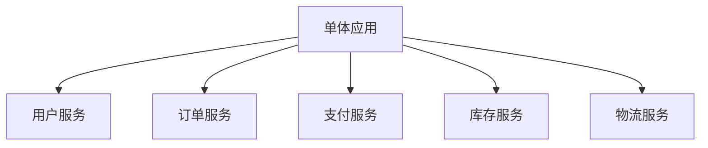

### 1.2 服务自治原则

微服务应该是自治的，能够独立部署、升级和扩展，不依赖于其他服务的部署。这要求服务之间通过定义良好的API进行通信，而不是共享数据库或代码。

### 1.3 数据隔离原则

每个微服务应该拥有自己的数据存储，不与其他服务共享数据库。这样可以确保服务之间的松耦合，并允许每个服务选择最适合其需求的数据存储技术。

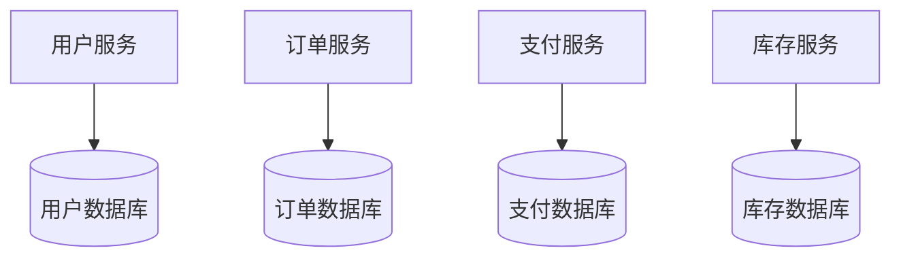

### 1.4 服务边界清晰原则

微服务的边界应该清晰明确，这意味着服务之间的接口应该稳定且定义良好。清晰的边界有助于减少服务之间的依赖，并使系统更容易理解和维护。

### 1.5 适度拆分原则

服务拆分应该适度，既不过度拆分也不过于保守。过度拆分会导致服务间通信复杂度增加，而拆分不足则无法充分发挥微服务的优势。

## 2. 微服务拆分的主要方法

### 2.1 领域驱动设计（DDD）

领域驱动设计是一种软件开发方法，它强调业务领域概念与软件模型的一致性。在微服务拆分中，DDD提供了一种基于业务领域的服务划分方法。

#### 2.1.1 限界上下文（Bounded Context）

限界上下文是DDD中的核心概念，它定义了特定领域模型的适用范围。在微服务架构中，每个限界上下文通常对应一个微服务。

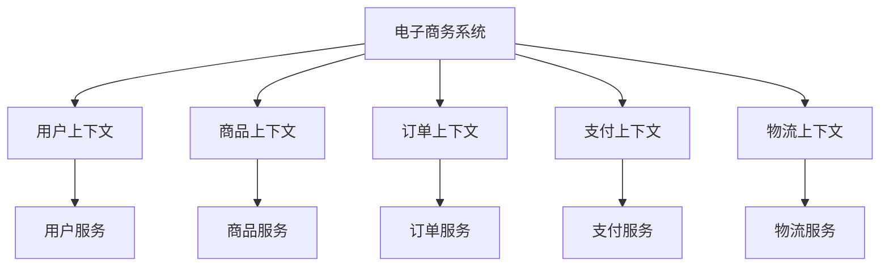

#### 2.1.2 聚合（Aggregate）

聚合是一组相关对象的集合，作为一个整体被视为数据变更的单元。聚合根是聚合中的主要实体，外部对象只能引用聚合根，而不能直接引用聚合内的其他对象。

在微服务拆分中，聚合可以帮助我们确定服务的边界。通常，一个微服务应该包含一个或多个完整的聚合。

```java:c:\project\kphub\order-service\src\main\java\com\example\order\domain\Order.java
/**
 * 订单聚合根
 */
public class Order {
    private OrderId id;
    private CustomerId customerId;
    private List<OrderItem> items;
    private Address shippingAddress;
    private OrderStatus status;
    private Money totalAmount;
    
    // 创建订单
    public static Order create(CustomerId customerId, List<OrderItem> items, Address shippingAddress) {
        // 业务逻辑验证
        if (items == null || items.isEmpty()) {
            throw new IllegalArgumentException("订单必须包含至少一个商品");
        }
        
        Order order = new Order();
        order.id = new OrderId(UUID.randomUUID().toString());
        order.customerId = customerId;
        order.items = new ArrayList<>(items);
        order.shippingAddress = shippingAddress;
        order.status = OrderStatus.CREATED;
        order.totalAmount = calculateTotalAmount(items);
        
        return order;
    }
    
    // 添加订单项
    public void addItem(OrderItem item) {
        // 业务规则验证
        if (status != OrderStatus.CREATED) {
            throw new IllegalStateException("只有处于创建状态的订单才能添加商品");
        }
        
        items.add(item);
        totalAmount = totalAmount.add(item.getSubtotal());
    }
    
    // 确认订单
    public void confirm() {
        if (status != OrderStatus.CREATED) {
            throw new IllegalStateException("只有处于创建状态的订单才能确认");
        }
        
        status = OrderStatus.CONFIRMED;
        // 可能会发布领域事件
    }
    
    // 其他业务方法...
    
    private static Money calculateTotalAmount(List<OrderItem> items) {
        return items.stream()
                .map(OrderItem::getSubtotal)
                .reduce(Money.ZERO, Money::add);
    }
}
```

#### 2.1.3 领域事件（Domain Event）

领域事件表示领域中发生的重要事件，它们可以用于服务间的通信和集成。在微服务架构中，领域事件通常通过消息队列或事件总线进行传递。

```java:c:\project\kphub\order-service\src\main\java\com\example\order\domain\event\OrderConfirmedEvent.java
/**
 * 订单确认事件
 */
public class OrderConfirmedEvent implements DomainEvent {
    private final OrderId orderId;
    private final CustomerId customerId;
    private final Money totalAmount;
    private final Instant occurredOn;
    
    public OrderConfirmedEvent(OrderId orderId, CustomerId customerId, Money totalAmount) {
        this.orderId = orderId;
        this.customerId = customerId;
        this.totalAmount = totalAmount;
        this.occurredOn = Instant.now();
    }
    
    // Getters...
    
    @Override
    public Instant occurredOn() {
        return occurredOn;
    }
}
```

### 2.2 业务能力分析

业务能力分析是一种自上而下的方法，它从组织的业务能力出发，将这些能力映射到微服务。

#### 2.2.1 识别业务能力

首先，我们需要识别组织的核心业务能力。例如，一个电子商务平台可能具有以下业务能力：

- 用户管理
- 商品管理
- 订单处理
- 支付处理
- 库存管理
- 物流配送
- 客户服务

#### 2.2.2 能力分解

将高级业务能力分解为更细粒度的子能力。例如，"订单处理"可以分解为：

- 购物车管理
- 订单创建
- 订单确认
- 订单支付
- 订单履行
- 订单取消/退款

#### 2.2.3 映射到微服务

根据业务能力的粒度和相关性，将它们映射到微服务。一个微服务可能对应一个或多个相关的业务能力。

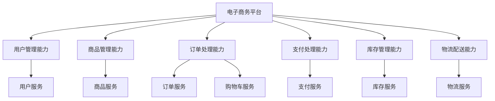

### 2.3 子域分析

子域分析是DDD中的一个概念，它将业务领域划分为核心子域、支撑子域和通用子域。

#### 2.3.1 核心子域

核心子域是业务的核心竞争力所在，需要投入最多资源进行定制开发。例如，对于一个电子商务平台，商品推荐和定价策略可能是核心子域。

#### 2.3.2 支撑子域

支撑子域是支持核心业务的领域，虽然重要但不是核心竞争力。例如，订单管理和用户管理。

#### 2.3.3 通用子域

通用子域是行业内通用的领域，可以考虑使用现成的解决方案。例如，支付处理和身份认证。

根据子域的类型，我们可以采取不同的服务设计和实现策略：

- 核心子域：精心设计，内部实现，高度定制
- 支撑子域：适度设计，可能内部实现或外包
- 通用子域：考虑使用现成的解决方案或服务

## 3. 微服务拆分的实践步骤

### 3.1 系统分析与建模

#### 3.1.1 业务流程分析

首先，我们需要分析和理解业务流程。可以使用业务流程图（BPMN）或用户故事地图等工具来可视化业务流程。

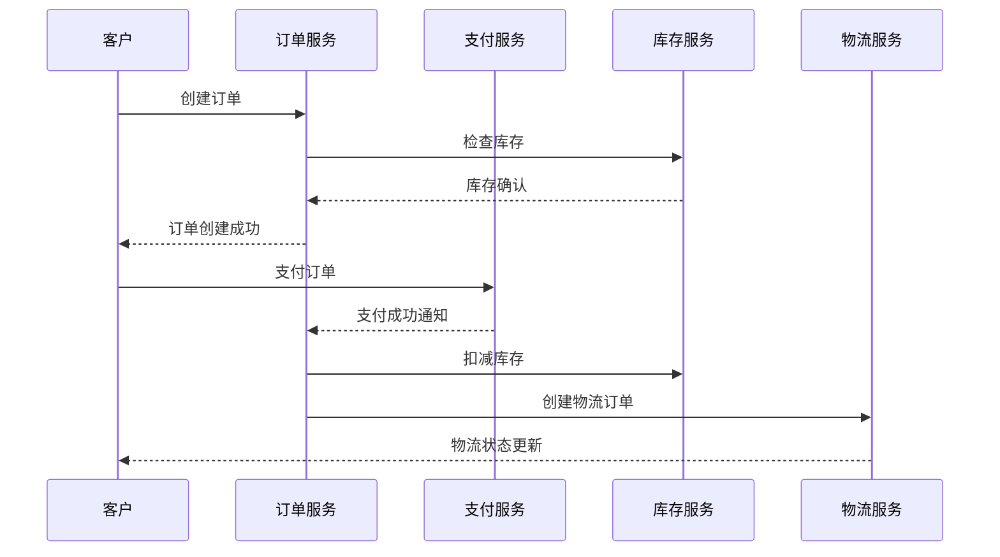

#### 3.1.2 领域模型设计

基于业务分析，设计领域模型，包括实体、值对象、聚合和领域服务。

```java:c:\project\kphub\order-service\src\main\java\com\example\order\domain\model\OrderAggregate.java
/**
 * 订单聚合
 */
public class OrderAggregate {
    // 聚合根
    private Order order;
    // 聚合内的实体
    private List<OrderItem> items;
    private Payment payment;
    private Shipment shipment;
    
    // 值对象
    private CustomerId customerId;
    private Address shippingAddress;
    private Money totalAmount;
    
    // 业务方法
    public void confirm() {
        // 业务逻辑
    }
    
    public void pay(PaymentMethod paymentMethod, Money amount) {
        // 业务逻辑
    }
    
    public void ship() {
        // 业务逻辑
    }
    
    // 其他方法...
}
```

#### 3.1.3 服务边界识别

基于领域模型和业务能力，识别潜在的服务边界。可以使用上下文映射图来可视化服务之间的关系。

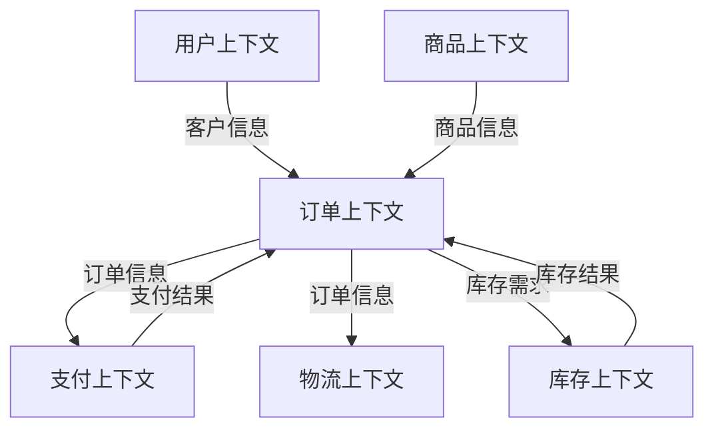

### 3.2 服务拆分决策

#### 3.2.1 拆分粒度确定

根据业务复杂度、团队规模和组织结构确定服务的粒度。一般来说，服务应该足够小以便于理解和维护，但又不能太小导致过度通信。

**粒度评估因素：**

- 业务内聚性：服务应该围绕相关的业务功能
- 数据内聚性：频繁一起使用的数据应该在同一个服务中
- 变更频率：变更频率不同的功能可能应该分到不同服务
- 团队结构：服务边界应该与团队边界一致
- 技术需求：不同的性能、可用性需求可能导致服务分离

#### 3.2.2 服务依赖分析

分析服务之间的依赖关系，尽量减少循环依赖。可以使用依赖图来可视化服务间的依赖。

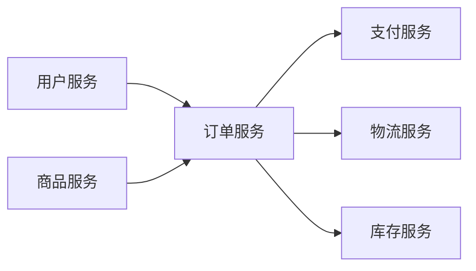

#### 3.2.3 数据一致性考量

在微服务架构中，跨服务的事务一致性是一个挑战。需要考虑使用最终一致性、SAGA模式或事件溯源等方法来处理跨服务的数据一致性问题。

```java:c:\project\kphub\order-service\src\main\java\com\example\order\application\saga\OrderProcessingSaga.java
/**
 * 订单处理SAGA
 */
public class OrderProcessingSaga {
    
    @Autowired
    private CommandGateway commandGateway;
    
    @StartSaga
    @SagaEventHandler(associationProperty = "orderId")
    public void handle(OrderCreatedEvent event) {
        // 发送验证支付命令
        commandGateway.send(new ValidatePaymentCommand(
            event.getOrderId(),
            event.getCustomerId(),
            event.getTotalAmount()
        ));
    }
    
    @SagaEventHandler(associationProperty = "orderId")
    public void handle(PaymentValidatedEvent event) {
        // 发送预留库存命令
        commandGateway.send(new ReserveInventoryCommand(
            event.getOrderId(),
            event.getItems()
        ));
    }
    
    @SagaEventHandler(associationProperty = "orderId")
    public void handle(InventoryReservedEvent event) {
        // 发送处理支付命令
        commandGateway.send(new ProcessPaymentCommand(
            event.getOrderId(),
            event.getPaymentId()
        ));
    }
    
    @SagaEventHandler(associationProperty = "orderId")
    public void handle(PaymentProcessedEvent event) {
        // 发送创建物流订单命令
        commandGateway.send(new CreateShipmentCommand(
            event.getOrderId(),
            event.getShippingAddress(),
            event.getItems()
        ));
    }
    
    @SagaEventHandler(associationProperty = "orderId")
    @EndSaga
    public void handle(ShipmentCreatedEvent event) {
        // SAGA结束
    }
    
    // 补偿事务处理
    @SagaEventHandler(associationProperty = "orderId")
    public void handle(PaymentFailedEvent event) {
        // 发送取消订单命令
        commandGateway.send(new CancelOrderCommand(
            event.getOrderId(),
            "支付失败"
        ));
        // 结束SAGA
    }
    
    @SagaEventHandler(associationProperty = "orderId")
    public void handle(InventoryReservationFailedEvent event) {
        // 发送取消支付命令
        commandGateway.send(new CancelPaymentCommand(
            event.getOrderId(),
            event.getPaymentId()
        ));
        // 发送取消订单命令
        commandGateway.send(new CancelOrderCommand(
            event.getOrderId(),
            "库存不足"
        ));
        // 结束SAGA
    }
}
```

### 3.3 服务接口设计

#### 3.3.1 API设计原则

设计清晰、稳定的服务API是微服务成功的关键。API设计应该遵循以下原则：

- 面向资源：API应该围绕业务资源设计
- 版本控制：支持API版本演进
- 兼容性：尽量保持向后兼容
- 幂等性：支持幂等操作，便于重试
- 安全性：考虑认证、授权和数据保护

```java:c:\project\kphub\order-service\src\main\java\com\example\order\api\OrderController.java
@RestController
@RequestMapping("/api/v1/orders")
public class OrderController {
    
    @Autowired
    private OrderApplicationService orderService;
    
    @PostMapping
    @ResponseStatus(HttpStatus.CREATED)
    public OrderDto createOrder(@RequestBody @Valid CreateOrderRequest request) {
        return orderService.createOrder(request);
    }
    
    @GetMapping("/{orderId}")
    public OrderDto getOrder(@PathVariable String orderId) {
        return orderService.getOrder(orderId);
    }
    
    @PutMapping("/{orderId}/confirm")
    public OrderDto confirmOrder(@PathVariable String orderId) {
        return orderService.confirmOrder(orderId);
    }
    
    @PutMapping("/{orderId}/cancel")
    public OrderDto cancelOrder(@PathVariable String orderId, @RequestBody CancelOrderRequest request) {
        return orderService.cancelOrder(orderId, request.getReason());
    }
    
    @GetMapping
    public Page<OrderDto> getOrders(
            @RequestParam(required = false) String customerId,
            @RequestParam(defaultValue = "0") int page,
            @RequestParam(defaultValue = "20") int size,
            @RequestParam(defaultValue = "createdAt,desc") String[] sort) {
        return orderService.getOrders(customerId, page, size, sort);
    }
}
```

#### 3.3.2 服务契约定义

使用OpenAPI/Swagger、Protocol Buffers或GraphQL等工具定义服务契约，便于服务消费者理解和使用API。

```yaml:c:\project\kphub\order-service\src\main\resources\api-docs\order-api.yaml
openapi: 3.0.0
info:
  title: Order Service API
  description: API for managing orders
  version: 1.0.0
paths:
  /api/v1/orders:
    post:
      summary: Create a new order
      requestBody:
        required: true
        content:
          application/json:
            schema:
              $ref: '#/components/schemas/CreateOrderRequest'
      responses:
        '201':
          description: Order created
          content:
            application/json:
              schema:
                $ref: '#/components/schemas/OrderDto'
    get:
      summary: Get orders
      parameters:
        - name: customerId
          in: query
          schema:
            type: string
        - name: page
          in: query
          schema:
            type: integer
            default: 0
        - name: size
          in: query
          schema:
            type: integer
            default: 20
        - name: sort
          in: query
          schema:
            type: array
            items:
              type: string
            default: ["createdAt,desc"]
      responses:
        '200':
          description: List of orders
          content:
            application/json:
              schema:
                type: object
                properties:
                  content:
                    type: array
                    items:
                      $ref: '#/components/schemas/OrderDto'
                  totalElements:
                    type: integer
                  totalPages:
                    type: integer
                  size:
                    type: integer
                  number:
                    type: integer

  /api/v1/orders/{orderId}:
    get:
      summary: Get order by ID
      parameters:
        - name: orderId
          in: path
          required: true
          schema:
            type: string
      responses:
        '200':
          description: Order details
          content:
            application/json:
              schema:
                $ref: '#/components/schemas/OrderDto'
        '404':
          description: Order not found

components:
  schemas:
    CreateOrderRequest:
      type: object
      required:
        - customerId
        - items
        - shippingAddress
      properties:
        customerId:
          type: string
        items:
          type: array
          items:
            $ref: '#/components/schemas/OrderItemRequest'
        shippingAddress:
          $ref: '#/components/schemas/AddressDto'
          
    OrderItemRequest:
      type: object
      required:
        - productId
        - quantity
      properties:
        productId:
          type: string
        quantity:
          type: integer
          minimum: 1
          
    AddressDto:
      type: object
      required:
        - street
        - city
        - country
        - postalCode
      properties:
        street:
          type: string
        city:
          type: string
        country:
          type: string
        postalCode:
          type: string
          
    OrderDto:
      type: object
      properties:
        id:
          type: string
        customerId:
          type: string
        status:
          type: string
          enum: [CREATED, CONFIRMED, PAID, SHIPPED, DELIVERED, CANCELLED]
        items:
          type: array
          items:
            $ref: '#/components/schemas/OrderItemDto'
        shippingAddress:
          $ref: '#/components/schemas/AddressDto'
        totalAmount:
          $ref: '#/components/schemas/MoneyDto'
        createdAt:
          type: string
          format: date-time
        updatedAt:
          type: string
          format: date-time
          
    OrderItemDto:
      type: object
      properties:
        productId:
          type: string
        productName:
          type: string
        quantity:
          type: integer
        unitPrice:
          $ref: '#/components/schemas/MoneyDto'
        subtotal:
          $ref: '#/components/schemas/MoneyDto'
          
    MoneyDto:
      type: object
      properties:
        amount:
          type: number
        currency:
          type: string
```

#### 3.3.3 服务通信模式

根据业务需求选择合适的服务通信模式：

- 同步通信（REST、gRPC）：适用于需要立即响应的场景
- 异步通信（消息队列、事件总线）：适用于可以异步处理的场景
- 混合模式：根据不同的业务场景选择不同的通信模式

```java:c:\project\kphub\order-service\src\main\java\com\example\order\infrastructure\messaging\OrderEventPublisher.java
@Service
public class OrderEventPublisher {
    
    @Autowired
    private KafkaTemplate<String, DomainEvent> kafkaTemplate;
    
    public void publishOrderCreatedEvent(OrderCreatedEvent event) {
        kafkaTemplate.send("order-events", event.getOrderId().toString(), event);
    }
    
    public void publishOrderConfirmedEvent(OrderConfirmedEvent event) {
        kafkaTemplate.send("order-events", event.getOrderId().toString(), event);
    }
    
    public void publishOrderCancelledEvent(OrderCancelledEvent event) {
        kafkaTemplate.send("order-events", event.getOrderId().toString(), event);
    }
}
```

## 4. 微服务拆分的常见挑战与解决方案

### 4.1 数据一致性问题

在微服务架构中，由于每个服务拥有自己的数据库，跨服务的事务一致性成为一个挑战。

#### 4.1.1 最终一致性

采用最终一致性模型，通过异步消息和补偿事务来保证数据最终一致。

```java:c:\project\kphub\order-service\src\main\java\com\example\order\application\service\OrderApplicationService.java
@Service
@Transactional
public class OrderApplicationService {
    
    @Autowired
    private OrderRepository orderRepository;
    
    @Autowired
    private OrderEventPublisher eventPublisher;
    
    public OrderDto createOrder(CreateOrderRequest request) {
        // 创建订单
        Order order = Order.create(
            new CustomerId(request.getCustomerId()),
            mapToOrderItems(request.getItems()),
            new Address(request.getShippingAddress())
        );
        
        // 保存订单
        orderRepository.save(order);
        
        // 发布订单创建事件
        eventPublisher.publishOrderCreatedEvent(new OrderCreatedEvent(
            order.getId(),
            order.getCustomerId(),
            order.getItems(),
            order.getTotalAmount()
        ));
        
        return mapToOrderDto(order);
    }
    
    // 其他方法...
}
```

#### 4.1.2 SAGA模式

对于需要跨多个服务的复杂业务流程，可以使用SAGA模式来协调和管理分布式事务。

```java:c:\project\kphub\order-service\src\main\java\com\example\order\application\saga\OrderSagaManager.java
@Service
public class OrderSagaManager {
    
    @Autowired
    private SagaInstanceFactory sagaFactory;
    
    public void startOrderProcessingSaga(OrderCreatedEvent event) {
        // 创建SAGA实例
        String sagaId = UUID.randomUUID().toString();
        SagaDefinition<OrderProcessingSaga> sagaDefinition = SagaDefinition.builder(OrderProcessingSaga.class)
            .withId(sagaId)
            .withAssociation("orderId", event.getOrderId().toString())
            .build();
        
        // 启动SAGA
        sagaFactory.create(sagaDefinition, event);
    }
}
```

#### 4.1.3 事件溯源

事件溯源是一种将实体状态变化存储为事件序列的模式，它可以帮助解决分布式系统中的数据一致性问题。

```java:c:\project\kphub\order-service\src\main\java\com\example\order\infrastructure\eventstore\OrderEventStore.java
@Repository
public class OrderEventStore {
    
    @Autowired
    private JdbcTemplate jdbcTemplate;
    
    public void saveEvent(OrderEvent event) {
        jdbcTemplate.update(
            "INSERT INTO order_events (order_id, event_type, event_data, created_at) VALUES (?, ?, ?, ?)",
            event.getOrderId().toString(),
            event.getClass().getSimpleName(),
            serializeEvent(event),
            event.getCreatedAt()
        );
    }
    
    public List<OrderEvent> getEvents(OrderId orderId) {
        return jdbcTemplate.query(
            "SELECT event_type, event_data, created_at FROM order_events WHERE order_id = ? ORDER BY created_at",
            (rs, rowNum) -> deserializeEvent(
                rs.getString("event_type"),
                rs.getString("event_data"),
                rs.getTimestamp("created_at")
            ),
            orderId.toString()
        );
    }
    
    // 序列化和反序列化方法...
}
```

### 4.2 服务间依赖管理

微服务之间的依赖关系如果处理不当，可能导致系统脆弱和难以维护。

#### 4.2.1 服务发现

使用服务发现机制，使服务能够动态地发现和调用其他服务，减少硬编码依赖。

```yaml:c:\project\kphub\order-service\src\main\resources\application.yml
spring:
  application:
    name: order-service
  cloud:
    consul:
      host: localhost
      port: 8500
      discovery:
        instanceId: ${spring.application.name}:${random.value}
        healthCheckPath: /actuator/health
        healthCheckInterval: 15s
```

#### 4.2.2 API网关
让我继续完成微服务拆分策略与最佳实践的内容：

#### 4.2.2 API网关

使用API网关作为服务的统一入口，处理跨服务的关注点，如认证、授权、限流等，并简化客户端与服务的交互。

```yaml:c:\project\kphub\gateway\src\main\resources\application.yml
spring:
  application:
    name: api-gateway
  cloud:
    gateway:
      routes:
        - id: order-service
          uri: lb://order-service
          predicates:
            - Path=/api/orders/**
          filters:
            - StripPrefix=1
            - name: CircuitBreaker
              args:
                name: orderService
                fallbackUri: forward:/fallback/orders
        - id: payment-service
          uri: lb://payment-service
          predicates:
            - Path=/api/payments/**
          filters:
            - StripPrefix=1
            - name: CircuitBreaker
              args:
                name: paymentService
                fallbackUri: forward:/fallback/payments
```

#### 4.2.3 客户端弹性模式

在服务调用中实施断路器、重试、超时等弹性模式，提高系统的容错能力。

```java:c:\project\kphub\order-service\src\main\java\com\example\order\infrastructure\client\PaymentServiceClient.java
@Service
public class PaymentServiceClient {
    
    @Autowired
    private WebClient.Builder webClientBuilder;
    
    @CircuitBreaker(name = "paymentService", fallbackMethod = "processPaymentFallback")
    @Retry(name = "paymentService", fallbackMethod = "processPaymentFallback")
    @Bulkhead(name = "paymentService", fallbackMethod = "processPaymentFallback")
    @TimeLimiter(name = "paymentService", fallbackMethod = "processPaymentTimeoutFallback")
    public Mono<PaymentResponse> processPayment(PaymentRequest request) {
        return webClientBuilder.build()
            .post()
            .uri("http://payment-service/api/payments")
            .bodyValue(request)
            .retrieve()
            .bodyToMono(PaymentResponse.class);
    }
    
    public Mono<PaymentResponse> processPaymentFallback(PaymentRequest request, Exception ex) {
        // 降级处理
        log.error("Payment service call failed", ex);
        return Mono.just(new PaymentResponse(PaymentStatus.FAILED, "服务暂时不可用"));
    }
    
    public Mono<PaymentResponse> processPaymentTimeoutFallback(PaymentRequest request, TimeoutException ex) {
        // 超时处理
        log.error("Payment service call timed out", ex);
        return Mono.just(new PaymentResponse(PaymentStatus.PENDING, "处理超时，请稍后查询状态"));
    }
}
```

### 4.3 服务治理挑战

随着微服务数量的增加，服务治理变得越来越复杂。

#### 4.3.1 配置管理

使用集中式配置管理，使服务配置更加灵活和可控。

```yaml:c:\project\kphub\order-service\src\main\resources\bootstrap.yml
spring:
  application:
    name: order-service
  cloud:
    config:
      uri: http://config-server:8888
      fail-fast: true
      retry:
        initial-interval: 1000
        max-interval: 2000
        max-attempts: 6
```

#### 4.3.2 服务监控与追踪

实施全链路追踪和监控，便于问题排查和性能优化。

```yaml:c:\project\kphub\order-service\src\main\resources\application.yml
spring:
  application:
    name: order-service
  zipkin:
    base-url: http://zipkin:9411
    sender:
      type: web
  sleuth:
    sampler:
      probability: 1.0
```

```java:c:\project\kphub\order-service\src\main\java\com\example\order\infrastructure\monitoring\OrderMetrics.java
@Component
public class OrderMetrics {
    
    private final MeterRegistry registry;
    
    public OrderMetrics(MeterRegistry registry) {
        this.registry = registry;
        
        // 注册订单状态计数器
        Arrays.stream(OrderStatus.values()).forEach(status -> 
            Counter.builder("orders.status")
                .tag("status", status.name())
                .description("Number of orders by status")
                .register(registry)
        );
    }
    
    public void recordOrderCreated() {
        Counter.builder("orders.created")
            .description("Number of created orders")
            .register(registry)
            .increment();
    }
    
    public void recordOrderStatusChange(OrderStatus oldStatus, OrderStatus newStatus) {
        Counter.builder("orders.status.change")
            .tag("from", oldStatus.name())
            .tag("to", newStatus.name())
            .description("Number of order status changes")
            .register(registry)
            .increment();
        
        // 更新状态计数
        Counter.builder("orders.status")
            .tag("status", oldStatus.name())
            .register(registry)
            .increment(-1);
        
        Counter.builder("orders.status")
            .tag("status", newStatus.name())
            .register(registry)
            .increment();
    }
    
    public void recordOrderProcessingTime(long processingTimeMs) {
        Timer.builder("orders.processing.time")
            .description("Order processing time")
            .register(registry)
            .record(processingTimeMs, TimeUnit.MILLISECONDS);
    }
}
```

## 5. 微服务拆分的最佳实践

### 5.1 渐进式拆分策略

对于已有的单体应用，采用渐进式拆分策略，逐步将单体应用拆分为微服务。

#### 5.1.1 识别拆分边界

首先识别单体应用中的自然边界，如业务模块、数据边界等。

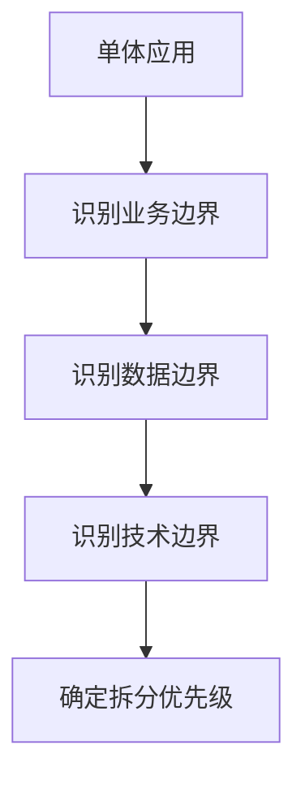

#### 5.1.2 构建抽象层

在拆分前，先在单体应用中构建抽象层，为未来的服务拆分做准备。

```java:c:\project\kphub\monolith\src\main\java\com\example\monolith\order\OrderService.java
/**
 * 订单服务抽象层
 * 为未来拆分为独立微服务做准备
 */
@Service
public class OrderService {
    
    @Autowired
    private OrderRepository orderRepository;
    
    @Autowired
    private OrderEventPublisher eventPublisher;
    
    // 所有订单相关操作都通过这个服务进行
    // 不允许其他模块直接访问OrderRepository
    
    public Order createOrder(OrderRequest request) {
        // 业务逻辑
        Order order = new Order();
        // ...
        
        orderRepository.save(order);
        
        // 发布事件，为未来的异步通信做准备
        eventPublisher.publishOrderCreatedEvent(order);
        
        return order;
    }
    
    // 其他方法...
}
```

#### 5.1.3 逐步拆分与迁移

按照优先级逐步拆分服务，并平滑迁移流量。

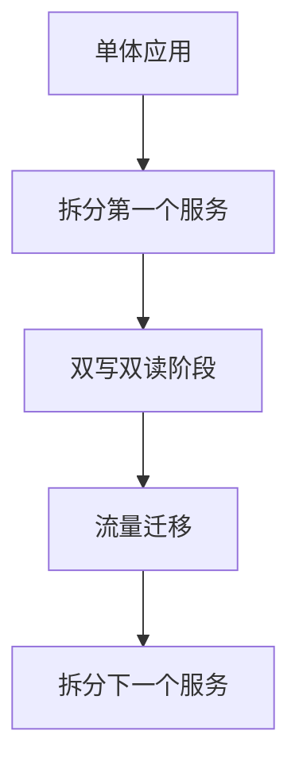

### 5.2 团队组织与Conway定律

Conway定律指出，系统设计会反映组织的沟通结构。因此，微服务的拆分应该考虑团队结构。

#### 5.2.1 团队与服务的映射

理想情况下，每个微服务应该由一个团队负责，这个团队对服务的开发、测试和运维负全责。

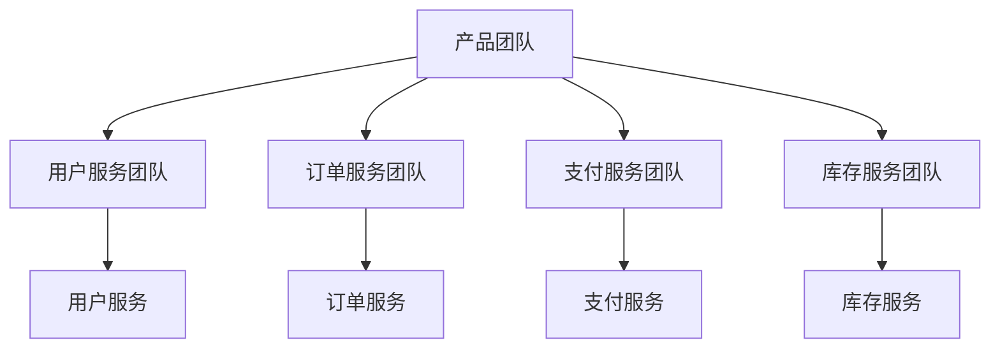

#### 5.2.2 跨功能团队

每个服务团队应该是跨功能的，包含开发、测试、运维等角色，能够独立完成服务的全生命周期管理。

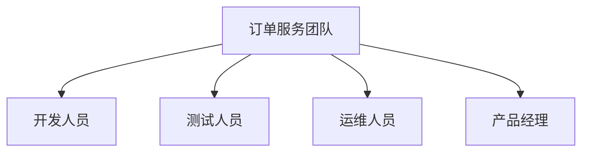

### 5.3 服务治理最佳实践

#### 5.3.1 API版本管理

实施良好的API版本管理策略，确保服务能够平滑演进。

```java:c:\project\kphub\order-service\src\main\java\com\example\order\api\v1\OrderControllerV1.java
@RestController
@RequestMapping("/api/v1/orders")
public class OrderControllerV1 {
    // V1版本API实现
}
```

```java:c:\project\kphub\order-service\src\main\java\com\example\order\api\v2\OrderControllerV2.java
@RestController
@RequestMapping("/api/v2/orders")
public class OrderControllerV2 {
    // V2版本API实现，可能包含新功能或改进
}
```

#### 5.3.2 服务文档与契约

维护完善的服务文档和契约，便于服务消费者理解和使用API。

```java:c:\project\kphub\order-service\src\main\java\com\example\order\config\SwaggerConfig.java
@Configuration
@EnableSwagger2
public class SwaggerConfig {
    
    @Bean
    public Docket apiV1() {
        return new Docket(DocumentationType.SWAGGER_2)
            .groupName("v1")
            .select()
            .apis(RequestHandlerSelectors.basePackage("com.example.order.api.v1"))
            .paths(PathSelectors.any())
            .build()
            .apiInfo(apiInfoV1());
    }
    
    @Bean
    public Docket apiV2() {
        return new Docket(DocumentationType.SWAGGER_2)
            .groupName("v2")
            .select()
            .apis(RequestHandlerSelectors.basePackage("com.example.order.api.v2"))
            .paths(PathSelectors.any())
            .build()
            .apiInfo(apiInfoV2());
    }
    
    private ApiInfo apiInfoV1() {
        return new ApiInfoBuilder()
            .title("Order Service API V1")
            .description("API for managing orders - Version 1")
            .version("1.0")
            .build();
    }
    
    private ApiInfo apiInfoV2() {
        return new ApiInfoBuilder()
            .title("Order Service API V2")
            .description("API for managing orders - Version 2")
            .version("2.0")
            .build();
    }
}
```

#### 5.3.3 服务健康检查与自愈

实施健康检查和自愈机制，提高服务的可用性。

```java:c:\project\kphub\order-service\src\main\java\com\example\order\infrastructure\health\OrderServiceHealthIndicator.java
@Component
public class OrderServiceHealthIndicator implements HealthIndicator {
    
    @Autowired
    private DataSource dataSource;
    
    @Autowired
    private KafkaTemplate<String, Object> kafkaTemplate;
    
    @Override
    public Health health() {
        Health.Builder builder = new Health.Builder();
        
        // 检查数据库连接
        try (Connection conn = dataSource.getConnection()) {
            if (conn.isValid(1000)) {
                builder.up().withDetail("database", "UP");
            } else {
                builder.down().withDetail("database", "DOWN");
                return builder.build();
            }
        } catch (SQLException e) {
            builder.down().withDetail("database", "DOWN").withException(e);
            return builder.build();
        }
        
        // 检查Kafka连接
        try {
            kafkaTemplate.getDefaultTopic();
            builder.withDetail("kafka", "UP");
        } catch (Exception e) {
            builder.down().withDetail("kafka", "DOWN").withException(e);
            return builder.build();
        }
        
        // 检查依赖服务
        try {
            // 检查库存服务
            // 检查支付服务
            // ...
            builder.withDetail("dependencies", "UP");
        } catch (Exception e) {
            builder.down().withDetail("dependencies", "DOWN").withException(e);
            return builder.build();
        }
        
        return builder.build();
    }
}
```

## 6. 案例研究：电子商务平台微服务拆分

### 6.1 业务场景与需求

假设我们需要将一个单体电子商务平台拆分为微服务架构。该平台包含以下主要功能：

- 用户管理：注册、登录、个人信息管理
- 商品管理：商品信息、分类、搜索
- 订单管理：购物车、下单、支付
- 库存管理：库存查询、库存更新
- 物流管理：配送信息、物流跟踪
- 评价管理：商品评价、回复
- 营销管理：优惠券、促销活动

### 6.2 领域分析与服务划分

#### 6.2.1 领域模型分析

首先，我们分析业务领域，识别核心实体和它们之间的关系。

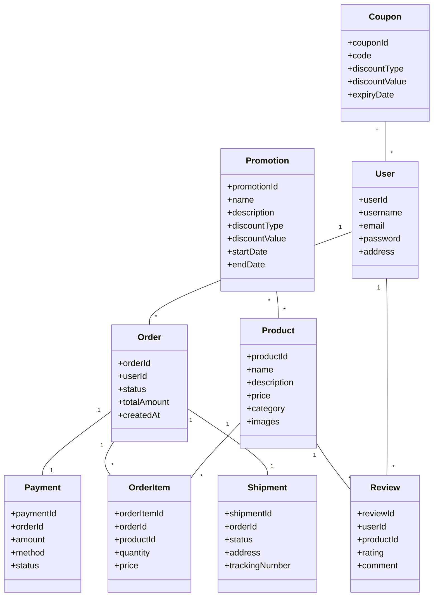

#### 6.2.2 服务划分

基于领域模型和业务能力，我们将系统划分为以下微服务：

1. **用户服务（User Service）**
   - 用户注册、登录
   - 用户信息管理
   - 地址管理

2. **商品服务（Product Service）**
   - 商品信息管理
   - 商品分类
   - 商品搜索

3. **订单服务（Order Service）**
   - 订单创建和管理
   - 购物车管理

4. **支付服务（Payment Service）**
   - 支付处理
   - 退款处理

5. **库存服务（Inventory Service）**
   - 库存管理
   - 库存预留和释放

6. **物流服务（Shipping Service）**
   - 物流订单创建
   - 物流状态跟踪

7. **评价服务（Review Service）**
   - 商品评价
   - 评价管理

8. **营销服务（Marketing Service）**
   - 优惠券管理
   - 促销活动管理

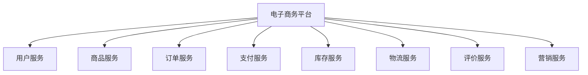

### 6.3 服务间通信与数据一致性

#### 6.3.1 下单流程

下单是一个跨多个服务的复杂流程，涉及订单、库存、支付和物流服务。

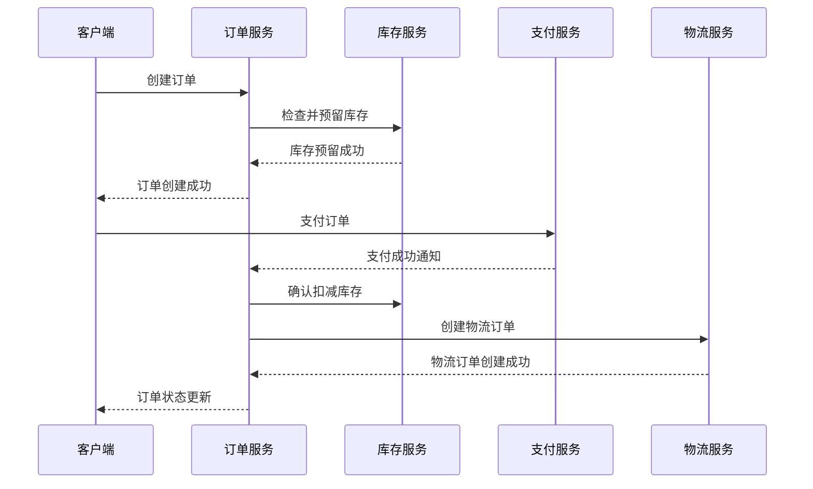

#### 6.3.2 SAGA模式实现

使用SAGA模式处理跨服务的事务一致性。

```java:c:\project\kphub\order-service\src\main\java\com\example\order\application\saga\OrderProcessingSaga.java
@Component
public class OrderProcessingSaga {
    
    @Autowired
    private CommandGateway commandGateway;
    
    @Autowired
    private OrderRepository orderRepository;
    
    @Autowired
    private OrderEventPublisher eventPublisher;
    
    @Transactional
    public void startOrderProcessing(OrderCreatedEvent event) {
        // 1. 预留库存
        ReserveInventoryCommand reserveCommand = new ReserveInventoryCommand(
            event.getOrderId(),
            event.getItems().stream()
                .map(item -> new InventoryItem(item.getProductId(), item.getQuantity()))
                .collect(Collectors.toList())
        );
        
        try {
            // 同步调用库存服务
            InventoryReservationResponse response = commandGateway.sendAndWait(reserveCommand);
            
            if (response.isSuccess()) {
                // 库存预留成功，更新订单状态
                Order order = orderRepository.findById(event.getOrderId())
                    .orElseThrow(() -> new OrderNotFoundException(event.getOrderId()));
                
                order.setStatus(OrderStatus.INVENTORY_RESERVED);
                orderRepository.save(order);
                
                // 发布库存预留成功事件
                eventPublisher.publishInventoryReservedEvent(new InventoryReservedEvent(
                    event.getOrderId(),
                    event.getCustomerId()
                ));
            } else {
                // 库存预留失败，取消订单
                handleInventoryReservationFailure(event.getOrderId(), response.getReason());
            }
        } catch (Exception e) {
            // 处理异常
            handleInventoryReservationFailure(event.getOrderId(), "库存服务暂时不可用");
        }
    }
    
    @Transactional
    public void handlePaymentCompleted(PaymentCompletedEvent event) {
        // 支付完成，更新订单状态
        Order order = orderRepository.findById(event.getOrderId())
            .orElseThrow(() -> new OrderNotFoundException(event.getOrderId()));
        
        order.setStatus(OrderStatus.PAID);
        orderRepository.save(order);
        
        // 创建物流订单
        CreateShipmentCommand shipmentCommand = new CreateShipmentCommand(
            event.getOrderId(),
            order.getShippingAddress(),
            order.getItems()
        );
        
        try {
            // 同步调用物流服务
            ShipmentCreationResponse response = commandGateway.sendAndWait(shipmentCommand);
            
            if (response.isSuccess()) {
                // 物流订单创建成功，更新订单状态
                order.setStatus(OrderStatus.SHIPPING);
                order.setTrackingNumber(response.getTrackingNumber());
                orderRepository.save(order);
                
                // 发布订单发货事件
                eventPublisher.publishOrderShippedEvent(new OrderShippedEvent(
                    event.getOrderId(),
                    response.getTrackingNumber()
                ));
            } else {
                // 物流订单创建失败，记录错误但不回滚支付
                // 可以通过人工干预或重试机制处理
                log.error("Failed to create shipment for order {}: {}", 
                    event.getOrderId(), response.getReason());
            }
        } catch (Exception e) {
            // 处理异常
            log.error("Error creating shipment for order {}", event.getOrderId(), e);
        }
    }
    
    @Transactional
    public void handlePaymentFailed(PaymentFailedEvent event) {
        // 支付失败，取消订单并释放库存
        Order order = orderRepository.findById(event.getOrderId())
            .orElseThrow(() -> new OrderNotFoundException(event.getOrderId()));
        
        order.setStatus(OrderStatus.PAYMENT_FAILED);
        orderRepository.save(order);
        
        // 释放库存
        ReleaseInventoryCommand releaseCommand = new ReleaseInventoryCommand(
            event.getOrderId(),
            order.getItems().stream()
                .map(item -> new InventoryItem(item.getProductId(), item.getQuantity()))
                .collect(Collectors.toList())
        );
        
        try {
            commandGateway.send(releaseCommand);
        } catch (Exception e) {
            // 记录错误但不阻止订单取消
            log.error("Failed to release inventory for order {}", event.getOrderId(), e);
        }
        
        // 发布订单取消事件
        eventPublisher.publishOrderCancelledEvent(new OrderCancelledEvent(
            event.getOrderId(),
            "支付失败"
        ));
    }
    
    private void handleInventoryReservationFailure(String orderId, String reason) {
        Order order = orderRepository.findById(orderId)
            .orElseThrow(() -> new OrderNotFoundException(orderId));
        
        order.setStatus(OrderStatus.CANCELLED);
        order.setCancellationReason(reason);
        orderRepository.save(order);
        
        // 发布订单取消事件
        eventPublisher.publishOrderCancelledEvent(new OrderCancelledEvent(
            orderId,
            reason
        ));
    }
}
```

### 6.4 服务部署与运维

#### 6.4.1 容器化部署

使用Docker容器化部署微服务，提高环境一致性和部署效率。

```dockerfile:c:\project\kphub\order-service\Dockerfile
FROM openjdk:11-jre-slim

WORKDIR /app

COPY target/order-service-0.0.1-SNAPSHOT.jar app.jar

EXPOSE 8080

ENTRYPOINT ["java", "-jar", "app.jar"]
```

#### 6.4.2 Kubernetes编排

使用Kubernetes进行服务编排和管理。

```yaml:c:\project\kphub\order-service\k8s\deployment.yaml
apiVersion: apps/v1
kind: Deployment
metadata:
  name: order-service
  namespace: ecommerce
spec:
  replicas: 3
  selector:
    matchLabels:
      app: order-service
  template:
    metadata:
      labels:
        app: order-service
    spec:
      containers:
      - name: order-service
        image: ecommerce/order-service:latest
        ports:
        - containerPort: 8080
        env:
        - name: SPRING_PROFILES_ACTIVE
          value: "prod"
        - name: SPRING_CLOUD_CONFIG_URI
          value: "http://config-server:8888"
        resources:
          requests:
            memory: "512Mi"
            cpu: "500m"
          limits:
            memory: "1Gi"
            cpu: "1000m"
        readinessProbe:
          httpGet:
            path: /actuator/health
            port: 8080
          initialDelaySeconds: 30
          periodSeconds: 10
        livenessProbe:
          httpGet:
            path: /actuator/health
            port: 8080
          initialDelaySeconds: 60
          periodSeconds: 15
```

## 7. 总结与展望

### 7.1 微服务拆分的关键成功因素

成功的微服务拆分需要考虑以下关键因素：

1. **明确的业务边界**：基于业务领域和能力进行服务划分
2. **适当的粒度**：避免过度拆分或拆分不足
3. **团队结构匹配**：服务边界与团队边界一致
4. **数据一致性策略**：合理处理跨服务的数据一致性
5. **服务治理机制**：完善的监控、追踪和配置管理
6. **渐进式实施**：逐步拆分，平滑迁移

### 7.2 微服务架构的演进趋势

微服务架构正在向以下方向演进：

1. **服务网格（Service Mesh）**：将服务通信、安全、可观测性等关注点从应用代码中分离出来
2. **无服务器架构（Serverless）**：进一步降低运维复杂度，专注于业务逻辑
3. **事件驱动架构**：通过事件驱动实现更松耦合的服务集成
4. **云原生设计**：充分利用云平台的弹性和可扩展性

### 7.3 实施建议

对于计划实施微服务拆分的团队，建议：

1. **从业务出发**：基于业务需求和价值进行拆分，而不是技术驱动
2. **小步快跑**：采用增量式拆分，逐步验证和调整
3. **关注基础设施**：提前建立微服务所需的基础设施和平台能力
4. **重视团队文化**：培养DevOps文化和自主性团队
5. **持续优化**：根据实际运行情况不断调整服务边界和架构

微服务拆分是一个持续的过程，需要在实践中不断学习和调整。通过合理的拆分策略和最佳实践，可以构建出灵活、可扩展、高效的微服务架构，为业务创新和快速响应市场变化提供有力支持。