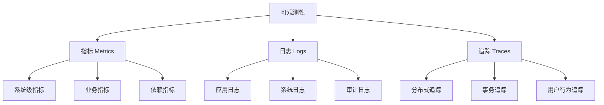
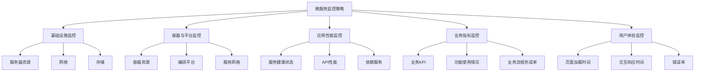

# 微服务监控与可观测性

可观测性是保障微服务稳定运行的基础，它使开发和运维团队能够深入了解分布式系统的内部状态。在微服务架构中，由于系统组件分散且相互依赖，传统的监控方法往往难以应对复杂性带来的挑战。本文将详细介绍微服务环境中的监控、日志、追踪等可观测性实践和工具，帮助团队构建全面的可观测性体系。

## 1. 可观测性基础

### 1.1 什么是可观测性

可观测性（Observability）源自控制理论，指通过系统的外部输出来推断系统内部状态的能力。在微服务环境中，可观测性通常由三大支柱构成：

- **指标（Metrics）**：系统行为的数值表示，如请求数、响应时间、错误率等
- **日志（Logs）**：系统生成的带时间戳的事件记录
- **追踪（Traces）**：跨多个服务的请求流程记录

这三大支柱相互补充，共同提供了系统运行状态的全面视图：



### 1.2 可观测性与监控的区别

虽然可观测性和监控经常被混用，但它们有着本质区别：

- **监控（Monitoring）**：基于预定义的指标和阈值，告诉你系统何时出现问题
- **可观测性（Observability）**：提供足够的数据和工具，让你能够提出新问题并找出未预见问题的根本原因

简而言之，监控告诉你"是否有问题"，而可观测性帮助你理解"为什么有问题"。

### 1.3 微服务架构中的可观测性挑战

微服务架构带来了特有的可观测性挑战：

1. **分布式复杂性**：服务分散在多个节点，难以获得统一视图
2. **服务依赖关系**：服务间的复杂依赖使故障定位变得困难
3. **技术异构性**：不同服务可能使用不同的技术栈，需要统一的可观测性标准
4. **动态性**：服务实例可能动态扩缩容，增加了追踪的复杂性
5. **数据量巨大**：大量服务产生的监控数据需要高效存储和查询

## 2. 微服务监控

### 2.1 监控策略

有效的微服务监控策略应该覆盖以下几个层面：



### 2.2 关键监控指标

#### 2.2.1 RED方法

RED方法是一种针对服务的监控方法，关注三个关键指标：

- **Rate（请求率）**：每秒接收的请求数
- **Errors（错误率）**：失败请求的百分比
- **Duration（持续时间）**：请求处理时间

这三个指标提供了服务健康状态的基本视图。

#### 2.2.2 USE方法

USE方法适用于资源监控，关注：

- **Utilization（利用率）**：资源繁忙的时间比例
- **Saturation（饱和度）**：资源的额外工作量
- **Errors（错误数）**：错误事件计数

#### 2.2.3 四个黄金信号

Google SRE团队提出的四个黄金信号是：

- **延迟（Latency）**：请求服务所需时间
- **流量（Traffic）**：系统需求量
- **错误（Errors）**：失败请求率
- **饱和度（Saturation）**：系统资源使用程度

### 2.3 监控工具与实现

#### 2.3.1 Prometheus

Prometheus是一个开源的监控和告警系统，特别适合微服务架构：

```mermaid
graph LR
    A[Prometheus Server] --> B[数据存储]
    C[Exporter] --> A
    D[服务实例] --> C
    A --> E[Alertmanager]
    E --> F[告警通知]
    A --> G[Grafana]
    G --> H[可视化仪表