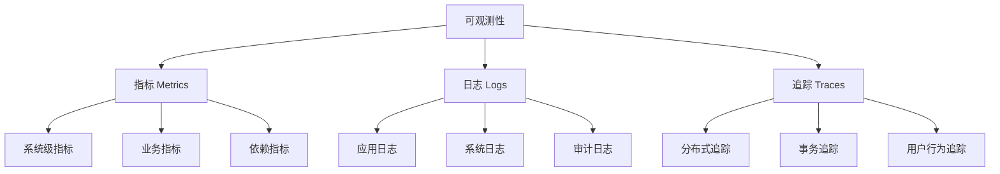
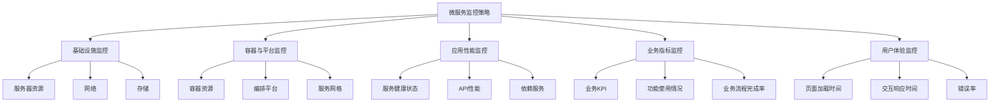
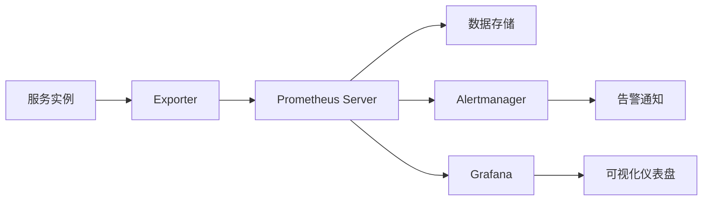
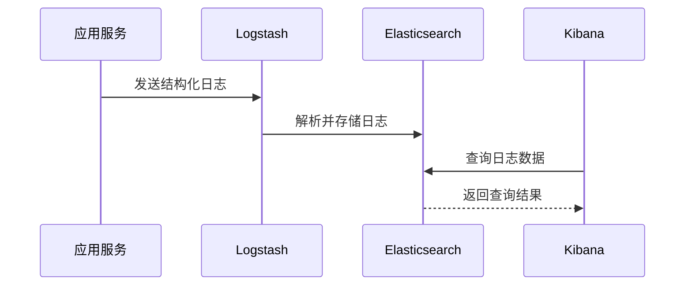
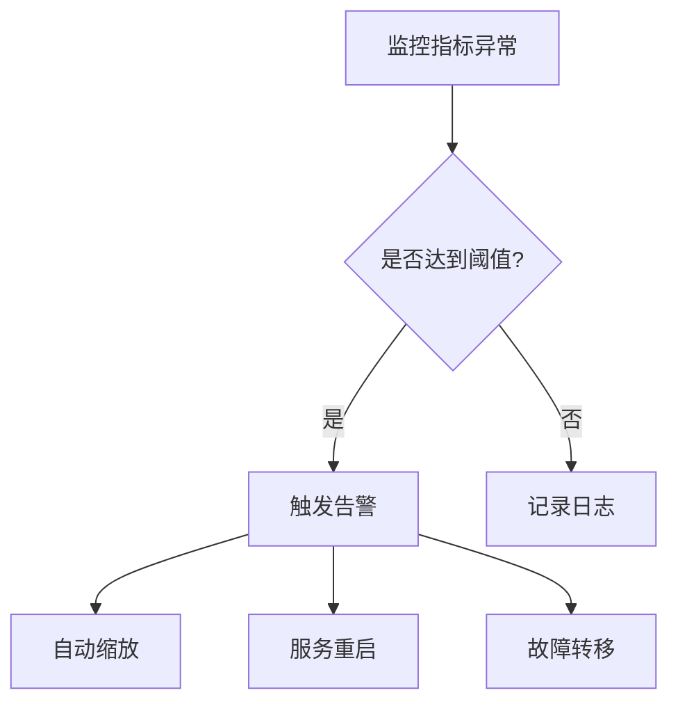
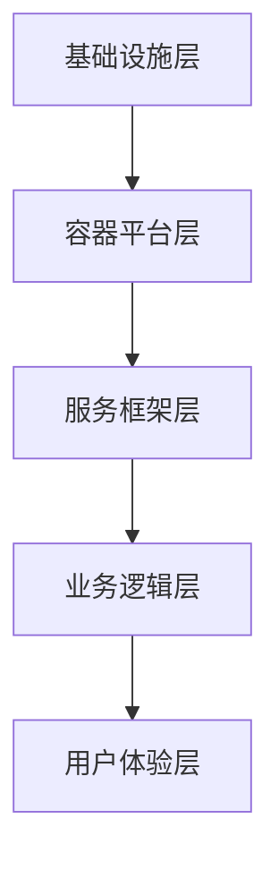
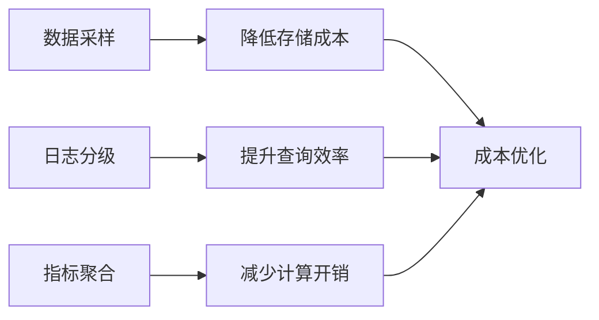
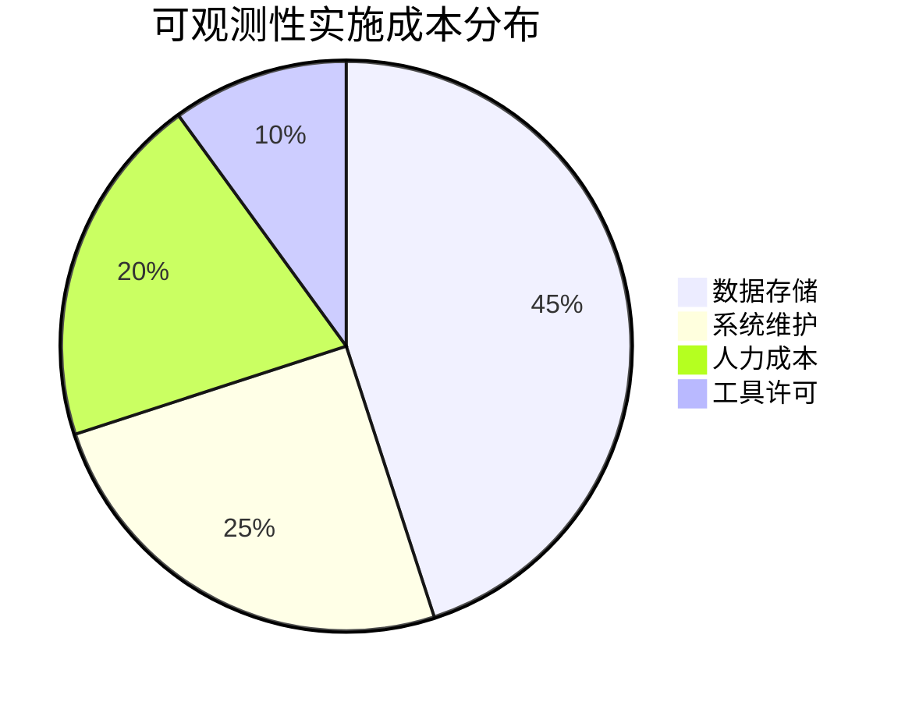

```markdown:c:\project\kphub/docs/microservices-observability.md
---
title: 微服务监控与可观测性
icon: practice
order: 7
---

# 微服务监控与可观测性

可观测性是保障微服务稳定运行的基础，它使开发和运维团队能够深入了解分布式系统的内部状态。在微服务架构中，由于系统组件分散且相互依赖，传统的监控方法往往难以应对复杂性带来的挑战。本文将详细介绍微服务环境中的监控、日志、追踪等可观测性实践和工具，帮助团队构建全面的可观测性体系。

## 1. 可观测性基础

### 1.1 什么是可观测性

可观测性（Observability）源自控制理论，指通过系统的外部输出来推断系统内部状态的能力。在微服务环境中，可观测性通常由三大支柱构成：

- **指标（Metrics）**：系统行为的数值表示，如请求数、响应时间、错误率等
- **日志（Logs）**：系统生成的带时间戳的事件记录
- **追踪（Traces）**：跨多个服务的请求流程记录

这三大支柱相互补充，共同提供了系统运行状态的全面视图：



### 1.2 可观测性与监控的区别

虽然可观测性和监控经常被混用，但它们有着本质区别：

- **监控（Monitoring）**：基于预定义的指标和阈值，告诉你系统何时出现问题
- **可观测性（Observability）**：提供足够的数据和工具，让你能够提出新问题并找出未预见问题的根本原因

简而言之，监控告诉你"是否有问题"，而可观测性帮助你理解"为什么有问题"。

### 1.3 微服务架构中的可观测性挑战

微服务架构带来了特有的可观测性挑战：

1. **分布式复杂性**：服务分散在多个节点，难以获得统一视图
2. **服务依赖关系**：服务间的复杂依赖使故障定位变得困难
3. **技术异构性**：不同服务可能使用不同的技术栈，需要统一的可观测性标准
4. **动态性**：服务实例可能动态扩缩容，增加了追踪的复杂性
5. **数据量巨大**：大量服务产生的监控数据需要高效存储和查询

## 2. 微服务监控

### 2.1 监控策略

有效的微服务监控策略应该覆盖以下几个层面：



### 2.2 关键监控指标

#### 2.2.1 RED方法

RED方法是一种针对服务的监控方法，关注三个关键指标：

- **Rate（请求率）**：每秒接收的请求数
- **Errors（错误率）**：失败请求的百分比
- **Duration（持续时间）**：请求处理时间

这三个指标提供了服务健康状态的基本视图。

#### 2.2.2 USE方法

USE方法适用于资源监控，关注：

- **Utilization（利用率）**：资源繁忙的时间比例
- **Saturation（饱和度）**：资源的额外工作量
- **Errors（错误数）**：错误事件计数

#### 2.2.3 四个黄金信号

Google SRE团队提出的四个黄金信号是：

- **延迟（Latency）**：请求服务所需时间
- **流量（Traffic）**：系统需求量
- **错误（Errors）**：失败请求率
- **饱和度（Saturation）**：系统资源使用程度

### 2.3 监控工具与实现

#### 2.3.1 Prometheus

Prometheus是一个开源的监控和告警系统，特别适合微服务架构：



典型配置示例（prometheus.yml）：
```yaml
global:
  scrape_interval: 15s

scrape_configs:
  - job_name: 'node'
    static_configs:
      - targets: ['node-exporter:9100']
        
  - job_name: 'spring-boot'
    metrics_path: '/actuator/prometheus'
    static_configs:
      - targets: ['app-server:8080']
```

#### 2.3.2 Grafana可视化

Grafana仪表盘配置示例（dashboard.json）：
```json
{
  "title": "微服务监控",
  "panels": [
    {
      "type": "graph",
      "title": "请求速率",
      "targets": [{
        "expr": "rate(http_requests_total[5m])",
        "legendFormat": "{{instance}}"
      }]
    },
    {
      "type": "singlestat",
      "title": "错误率",
      "targets": [{
        "expr": "sum(rate(http_requests_total{status=~'5..'}[5m])) / sum(rate(http_requests_total[5m]))"
      }]
    }
  ]
}
```

## 3. 日志管理

### 3.1 ELK Stack实战



Filebeat配置示例（filebeat.yml）：
```yaml
filebeat.inputs:
- type: log
  paths:
    - /var/log/*.log

output.logstash:
  hosts: ["logstash:5044"]
```

### 3.2 日志规范

推荐日志格式：
```log
2023-09-15T14:23:45.123Z INFO  [com.example.OrderService] [traceId=abc123] 用户订单创建成功 userId=1001 orderId=2002
```

关键字段说明：
- 时间戳：ISO8601格式
- 日志级别：DEBUG/INFO/WARN/ERROR
- 类名：产生日志的组件
- TraceID：分布式追踪标识
- 业务字段：键值对形式

## 4. 分布式追踪

### 4.1 OpenTelemetry实现

Java应用集成示例：
```java
// 初始化Tracer
Tracer tracer = OpenTelemetry.getTracer("order-service");

// 创建Span
Span span = tracer.spanBuilder("processOrder").startSpan();
try (Scope scope = span.makeCurrent()) {
    // 业务逻辑
    span.addEvent("库存扣减成功");
    span.setAttribute("user.id", userId);
} finally {
    span.end();
}
```

### 4.2 Jaeger追踪系统

部署配置示例（docker-compose.yml）：
```yaml
services:
  jaeger:
    image: jaegertracing/all-in-one:1.35
    ports:
      - "16686:16686"
      - "6831:6831/udp"
```

## 5. 告警与自动化

### 5.1 Alertmanager配置

告警规则示例（alert.rules.yml）：
```yaml
groups:
- name: service-alerts
  rules:
  - alert: HighErrorRate
    expr: sum(rate(http_requests_total{status=~"5.."}[5m])) / sum(rate(http_requests_total[5m])) > 0.05
    for: 10m
    labels:
      severity: critical
    annotations:
      summary: "高错误率报警（实例 {{ $labels.instance }}）"
      description: "当前错误率已达 {{ $value }}"
```

### 5.2 自动化故障处理



## 6. 最佳实践

### 6.1 可观测性设计原则

1. **分层监控**：


2. **黄金指标跟踪**：
```python
def calculate_health_score(latency, error_rate, saturation):
    # 加权计算公式示例
    return (latency * 0.4) + (error_rate * 0.3) + (saturation * 0.3)
```

### 6.2 性能优化策略



## 7. 工具对比

| 工具类型       | 推荐方案           | 适用场景                      |
|----------------|--------------------|-----------------------------|
| 指标监控       | Prometheus + Thanos| 大规模集群监控                |
| 日志管理       | ELK + Filebeat     | 复杂日志分析需求              |
| 分布式追踪     | Jaeger + OpenTelemetry | 全链路追踪调试          |
| 可视化         | Grafana + Kibana   | 多维度数据展示                |
| 告警管理       | Alertmanager       | 多通道告警通知                |



通过本文的系统性介绍，读者可以建立起完整的微服务可观测性知识体系。从基础概念到工具实践，从监控策略到最佳实践，各层次内容相互衔接，形成闭环知识结构。实际落地时建议根据团队规模和技术栈选择合适的工具组合，逐步构建符合业务需求的可观测性体系。
```