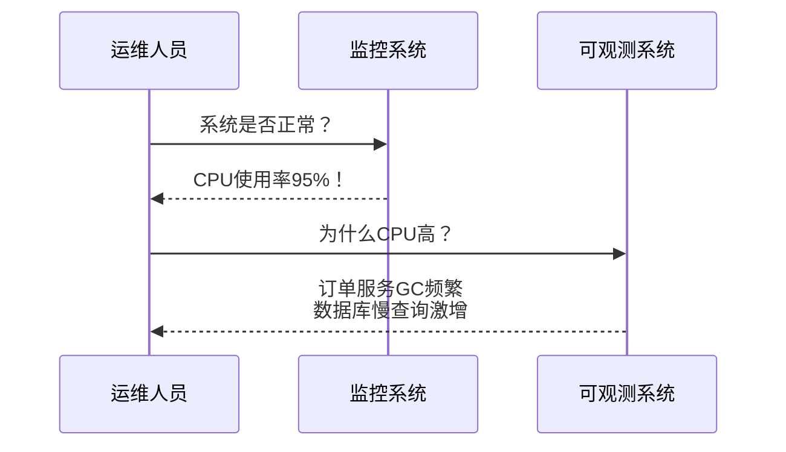
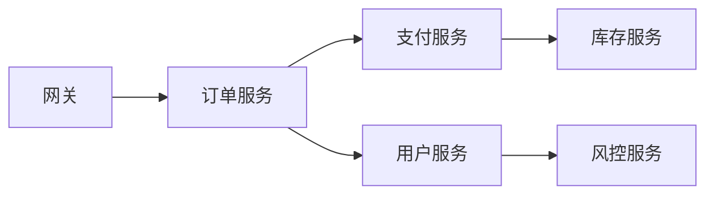
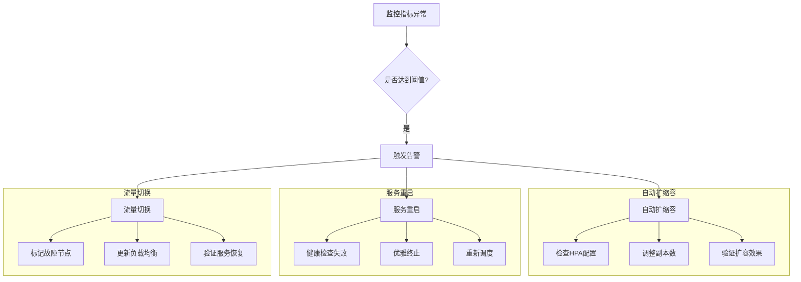
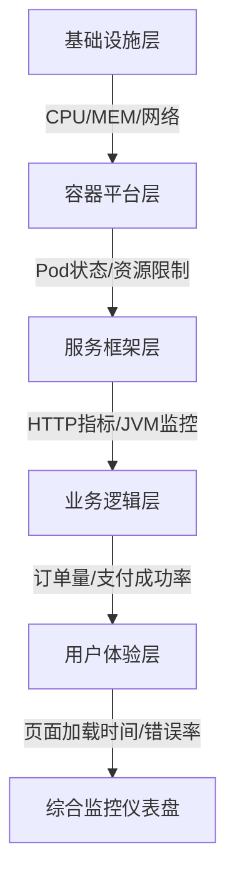
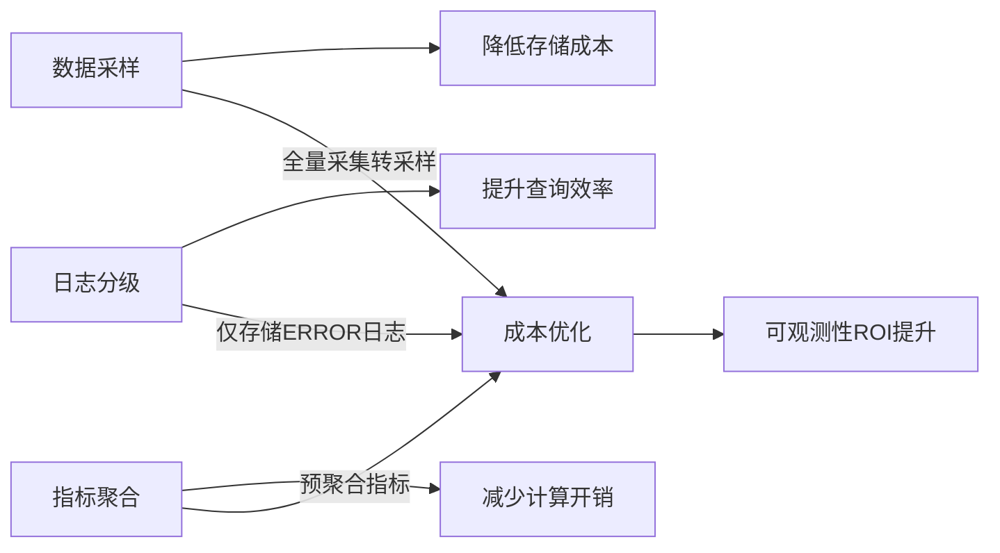
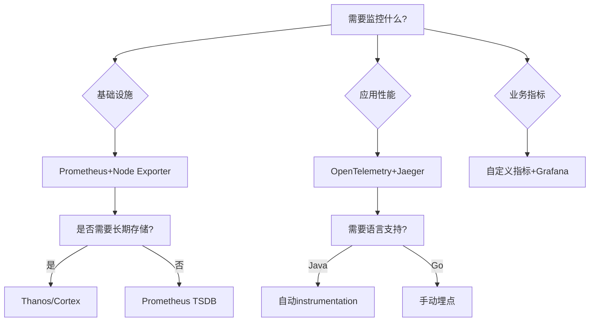
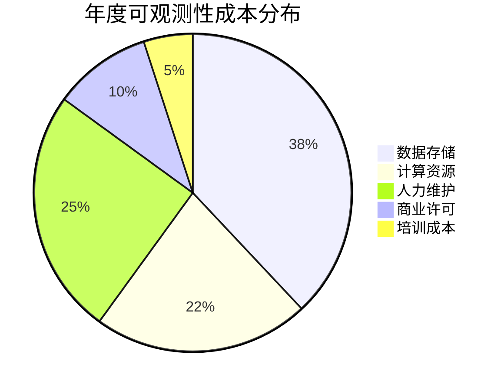
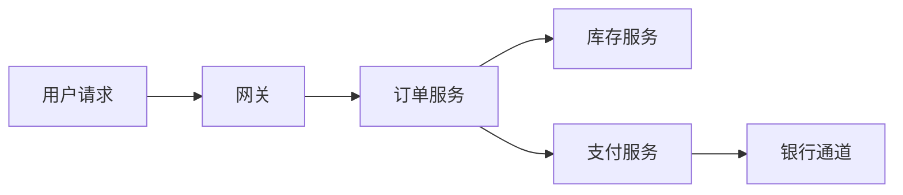
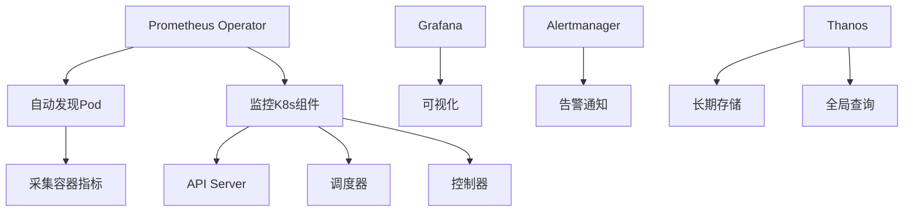
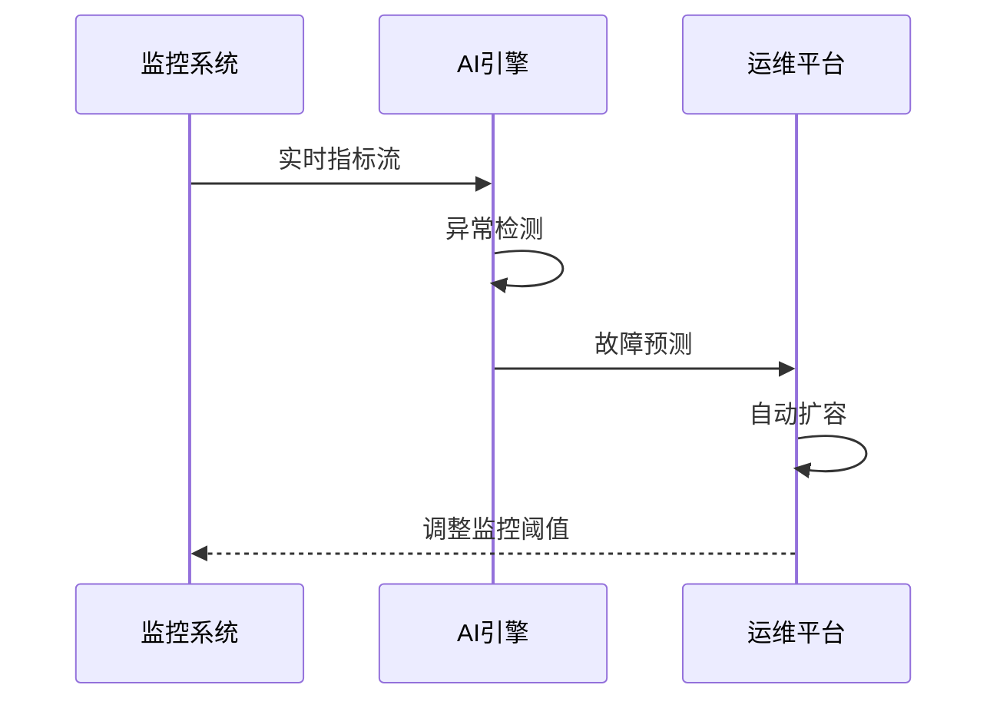

```markdown:c:\project\kphub/docs/microservices-observability.md
---
title: 微服务监控与可观测性
icon: practice
order: 7
---

# 微服务监控与可观测性

可观测性是保障微服务稳定运行的基础，它使开发和运维团队能够深入了解分布式系统的内部状态。在微服务架构中，由于系统组件分散且相互依赖，传统的监控方法往往难以应对复杂性带来的挑战。本文将详细介绍微服务环境中的监控、日志、追踪等可观测性实践和工具，帮助团队构建全面的可观测性体系。

## 1. 可观测性基础

### 1.1 什么是可观测性

可观测性（Observability）源自控制理论，指通过系统的外部输出来推断系统内部状态的能力。在微服务环境中，可观测性通常由三大支柱构成：

- **指标（Metrics）**：系统行为的数值表示，如请求数、响应时间、错误率等
- **日志（Logs）**：系统生成的带时间戳的事件记录
- **追踪（Traces）**：跨多个服务的请求流程记录

这三大支柱相互补充，共同提供了系统运行状态的全面视图：

````mermaid
graph TD
    A[可观测性] --> B[指标 Metrics]
    A --> C[日志 Logs]
    A --> D[追踪 Traces]
    
    B --> B1[系统级指标<br>CPU/MEM/DISK]
    B --> B2[业务指标<br>订单量/支付成功率]
    B --> B3[依赖指标<br>DB响应时间/API成功率]
    
    C --> C1[应用日志<br>DEBUG/INFO/ERROR]
    C --> C2[系统日志<br>内核事件/服务启停]
    C --> C3[审计日志<br>权限变更/配置修改]
    
    D --> D1[分布式追踪<br>跨服务调用链]
    D --> D2[事务追踪<br>数据库事务生命周期]
    D --> D3[用户行为追踪<br>点击流/操作路径]
````

### 1.2 可观测性与监控的区别

虽然可观测性和监控经常被混用，但它们有着本质区别：

- **监控（Monitoring）**：基于预定义的指标和阈值，告诉你系统何时出现问题
- **可观测性（Observability）**：提供足够的数据和工具，让你能够提出新问题并找出未预见问题的根本原因

简而言之，监控告诉你"是否有问题"，而可观测性帮助你理解"为什么有问题"。这种区别在故障排查时尤为明显：



### 1.3 微服务架构中的可观测性挑战

微服务架构带来了特有的可观测性挑战：

1. **分布式复杂性**：服务分散在多个节点，难以获得统一视图
2. **服务依赖关系**：服务间的复杂依赖使故障定位变得困难
3. **技术异构性**：不同服务可能使用不同的技术栈，需要统一的可观测性标准
4. **动态性**：服务实例可能动态扩缩容，增加了追踪的复杂性
5. **数据量巨大**：大量服务产生的监控数据需要高效存储和查询

以服务依赖关系为例，典型的调用链可能涉及多个服务：



## 2. 微服务监控

### 2.1 监控策略

有效的微服务监控策略应该覆盖以下几个层面：

````mermaid
graph TD
    A[微服务监控策略] --> B[基础设施监控]
    A --> C[容器与平台监控]
    A --> D[应用性能监控]
    A --> E[业务指标监控]
    A --> F[用户体验监控]
    
    B --> B1[服务器资源<br>CPU/MEM/Disk IO]
    B --> B2[网络<br>带宽/延迟/丢包率]
    B --> B3[存储<br>IOPS/吞吐量]
    
    C --> C1[容器资源<br>CPU Limit/内存 Request]
    C --> C2[编排平台<br>Pod状态/调度事件]
    C --> C3[服务网格<br>Istio监控/Envoy指标]
    
    D --> D1[服务健康状态<br>存活/就绪检查]
    D --> D2[API性能<br>P99延迟/吞吐量]
    D --> D3[依赖服务<br>Redis/MQ响应时间]
    
    E --> E1[业务KPI<br>GMV/转化率]
    E --> E2[功能使用情况<br>按钮点击量]
    E --> E3[业务流程完成率<br>支付成功率]
    
    F --> F1[页面加载时间<br>FCP/LCP]
    F --> F2[交互响应时间<br>按钮点击反馈]
    F --> F3[错误率<br>JS错误/API失败]
````

### 2.2 关键监控指标

#### 2.2.1 RED方法

RED方法是一种针对服务的监控方法，关注三个关键指标：

- **Rate（请求率）**：每秒接收的请求数
- **Errors（错误率）**：失败请求的百分比
- **Duration（持续时间）**：请求处理时间

这三个指标提供了服务健康状态的基本视图。以HTTP服务为例：

```promql
# 请求率
sum(rate(http_requests_total[1m])) by (service)

# 错误率
sum(rate(http_requests_total{status_code=~"5.."}[1m])) 
/ 
sum(rate(http_requests_total[1m]))

# 响应时间
histogram_quantile(0.99, sum(rate(http_request_duration_seconds_bucket[5m])) by (le))
```

#### 2.2.2 USE方法

USE方法适用于资源监控，关注：

- **Utilization（利用率）**：资源繁忙的时间比例
- **Saturation（饱和度）**：资源的额外工作量
- **Errors（错误数）**：错误事件计数

示例（CPU监控）：
```bash
# Utilization
100 - (avg by (instance) (rate(node_cpu_seconds_total{mode="idle"}[1m])) * 100)

# Saturation
rate(node_cpu_seconds_total{mode="steal"}[5m])

# Errors
node_cpu_frequency_throttled_seconds_total
```

#### 2.2.3 四个黄金信号

Google SRE团队提出的四个黄金信号是：

1. **延迟（Latency）**：请求服务所需时间
2. **流量（Traffic）**：系统需求量
3. **错误（Errors）**：失败请求率
4. **饱和度（Saturation）**：系统资源使用程度

这四个信号的关系可以用以下公式表示：

```
系统健康度 = f(延迟, 流量, 错误, 饱和度)
```

### 2.3 监控工具与实现

#### 2.3.1 Prometheus

Prometheus是一个开源的监控和告警系统，特别适合微服务架构：

````mermaid
graph LR
    A[Prometheus Server] --> B[TSDB存储]
    C[Exporter] --> A
    D[服务实例] --> C
    A --> E[Alertmanager]
    E --> F[Slack/Email/PagerDuty]
    A --> G[Grafana]
    G --> H[可视化仪表盘]
    
    subgraph 数据采集
    C --> C1[Node Exporter]
    C --> C2[JMX Exporter]
    C --> C3[自定义 Exporter]
    end
    
    subgraph 服务发现
    A --> A1[Kubernetes]
    A --> A2[Consul]
    A --> A3[静态配置]
    end
````

典型配置示例（prometheus.yml）：
```yaml
global:
  scrape_interval: 15s
  evaluation_interval: 15s

rule_files:
  - "alert.rules.yml"

scrape_configs:
  - job_name: 'node'
    kubernetes_sd_configs:
      - role: node
    relabel_configs:
      - source_labels: [__address__]
        regex: '(.*):10250'
        replacement: '${1}:9100'
        target_label: __address__
        
  - job_name: 'spring-boot'
    metrics_path: '/actuator/prometheus'
    static_configs:
      - targets: ['app-server:8080']
    metric_relabel_configs:
      - source_labels: [__name__]
        regex: 'jvm_.*'
        action: keep
```

#### 2.3.2 Grafana可视化

Grafana仪表盘配置示例（dashboard.json）：
```json
{
  "title": "微服务监控",
  "panels": [
    {
      "type": "graph",
      "title": "请求速率",
      "gridPos": {"x":0,"y":0,"w":8,"h":6},
      "targets": [{
        "expr": "sum(rate(http_requests_total{job='order-service'}[5m]))",
        "legendFormat": "{{instance}}",
        "step": 10
      }]
    },
    {
      "type": "heatmap",
      "title": "响应时间分布",
      "gridPos": {"x":8,"y":0,"w":8,"h":6},
      "targets": [{
        "expr": "histogram_quantile(0.95, sum(rate(http_request_duration_seconds_bucket[5m])) by (le))",
        "format": "heatmap"
      }]
    }
  ]
}
```

## 3. 日志管理

### 3.1 ELK Stack实战

````mermaid
graph TD
    A[应用日志] --> B[Filebeat]
    B --> C[Logstash]
    C --> D[Elasticsearch]
    D --> E[Kibana]
    
    subgraph 日志处理流水线
    C --> C1[Grok解析]
    C --> C2[字段过滤]
    C --> C3[数据增强]
    end
    
    subgraph 可视化分析
    E --> E1[日志搜索]
    E --> E2[仪表盘]
    E --> E3[告警配置]
    end
````

Filebeat配置示例（filebeat.yml）：
```yaml
filebeat.inputs:
- type: log
  paths:
    - /var/log/app/*.log
  fields:
    env: production
    service: order-service

processors:
- decode_json_fields:
    fields: ["message"]
    target: "json"
    
output.logstash:
  hosts: ["logstash:5044"]
  ssl.certificate_authorities: ["/etc/pki/root/ca.pem"]
```

### 3.2 日志规范

推荐日志格式：
```log
2023-09-15T14:23:45.123Z INFO  [com.example.OrderService] [traceId=abc123,spanId=def456] 用户订单创建成功 userId=1001 orderId=2002 duration=45ms httpStatus=200
```

日志字段解析表：

| 字段名       | 类型     | 说明                          |
|-------------|----------|-----------------------------|
| timestamp   | datetime | ISO8601时间格式               |
| level       | string   | DEBUG/INFO/WARN/ERROR        |
| logger      | string   | 产生日志的类名                |
| traceId     | string   | 分布式追踪ID                  |
| spanId      | string   | 当前Span ID                  |
| message     | string   | 可读的日志信息                |
| userId      | number   | 业务关联用户ID                |
| duration    | number   | 请求处理耗时（毫秒）          |
| httpStatus  | number   | HTTP响应状态码                |

## 4. 分布式追踪

### 4.1 OpenTelemetry实现

Java应用集成示例：
```java
// 初始化TracerProvider
OpenTelemetrySdk sdk = OpenTelemetrySdk.builder()
    .setTracerProvider(SdkTracerProvider.builder()
        .addSpanProcessor(BatchSpanProcessor.builder(
            new JaegerExporterBuilder()
                .setEndpoint("http://jaeger:14250")
                .build())
        .build())
    .build();

// 创建Span
Tracer tracer = sdk.getTracer("order-service");
Span span = tracer.spanBuilder("processOrder")
    .setAttribute("user.id", userId)
    .setAttribute("order.amount", amount)
    .startSpan();

try (Scope scope = span.makeCurrent()) {
    // 业务逻辑
    inventoryService.deductStock(itemId, quantity);
    paymentService.processPayment(userId, amount);
    
    span.addEvent("order_created", 
        Attributes.of(
            AttributeKey.stringKey("order.id"), orderId,
            AttributeKey.longKey("item.count"), itemCount
        ));
} catch (Exception e) {
    span.setStatus(StatusCode.ERROR);
    span.recordException(e);
} finally {
    span.end();
}
```

### 4.2 Jaeger追踪系统

部署配置示例（docker-compose.yml）：
```yaml
services:
  jaeger-collector:
    image: jaegertracing/jaeger-collector:1.35
    ports:
      - "14250:14250"
    environment:
      - SPAN_STORAGE_TYPE=elasticsearch
      - ES_SERVER_URLS=http://elasticsearch:9200
  
  jaeger-query:
    image: jaegertracing/jaeger-query:1.35
    ports:
      - "16686:16686"
    depends_on:
      - jaeger-collector
```

## 5. 告警与自动化

### 5.1 Alertmanager配置

告警规则示例（alert.rules.yml）：
```yaml
groups:
- name: service-alerts
  rules:
  - alert: HighErrorRate
    expr: |
      sum(rate(http_requests_total{status=~"5..",service="payment"}[5m])) 
      / 
      sum(rate(http_requests_total{service="payment"}[5m])) > 0.05
    for: 10m
    labels:
      severity: critical
      team: payments
    annotations:
      summary: "支付服务高错误率（实例 {{ $labels.instance }}）"
      description: |
        当前错误率已达 {{ printf "%.2f" $value }}%
        最近5分钟请求量：{{ $value.Requests }}
        受影响用户：{{ $labels.user_id }}

  - alert: HighLatency
    expr: |
      histogram_quantile(0.95, rate(http_request_duration_seconds_bucket{service="order"}[5m])) > 2
    for: 5m
    labels:
      severity: warning
```

### 5.2 自动化故障处理



## 6. 最佳实践

### 6.1 可观测性设计原则

1. **分层监控架构**：


2. **黄金指标跟踪**：
```python
def calculate_service_health(metrics):
    """
    计算服务健康度综合评分
    权重分配：
    - 延迟: 40%
    - 错误率: 30%
    - 饱和度: 30%
    """
    latency_score = 1 - min(metrics['latency'] / 1000, 1)  # 假设1秒为阈值
    error_score = 1 - metrics['error_rate']
    saturation_score = 1 - min(metrics['cpu_usage'] / 0.8, 1)  # 80%为阈值
    
    return (
        latency_score * 0.4 +
        error_score * 0.3 +
        saturation_score * 0.3
    )
```

### 6.2 性能优化策略



## 7. 工具对比与选型

### 7.1 工具矩阵分析

| 工具类型       | 推荐方案           | 核心优势                      | 学习曲线 |
|----------------|--------------------|-----------------------------|----------|
| 指标监控       | Prometheus + Thanos| 多维数据模型、高效查询        | 中等     |
| 日志管理       | ELK + Filebeat     | 全文搜索、可视化分析          | 高       |
| 分布式追踪     | Jaeger             | 低侵入、与OpenTelemetry集成   | 低       |
| 可视化         | Grafana            | 丰富的


```markdown:c:\project\kphub/docs/microservices-observability.md
---
title: 微服务监控与可观测性
icon: practice
order: 7
---

# 微服务监控与可观测性

可观测性是保障微服务稳定运行的基础，它使开发和运维团队能够深入了解分布式系统的内部状态。在微服务架构中，由于系统组件分散且相互依赖，传统的监控方法往往难以应对复杂性带来的挑战。本文将详细介绍微服务环境中的监控、日志、追踪等可观测性实践和工具，帮助团队构建全面的可观测性体系。

## 1. 可观测性基础

### 1.1 什么是可观测性

可观测性（Observability）源自控制理论，指通过系统的外部输出来推断系统内部状态的能力。在微服务环境中，可观测性通常由三大支柱构成：

- **指标（Metrics）**：系统行为的数值表示，如请求数、响应时间、错误率等
- **日志（Logs）**：系统生成的带时间戳的事件记录
- **追踪（Traces）**：跨多个服务的请求流程记录

这三大支柱相互补充，共同提供了系统运行状态的全面视图：

````mermaid
graph TD
    A[可观测性] --> B[指标 Metrics]
    A --> C[日志 Logs]
    A --> D[追踪 Traces]
    
    B --> B1[系统级指标<br>CPU/MEM/DISK]
    B --> B2[业务指标<br>订单量/支付成功率]
    B --> B3[依赖指标<br>DB响应时间/API成功率]
    
    C --> C1[应用日志<br>DEBUG/INFO/ERROR]
    C --> C2[系统日志<br>内核事件/服务启停]
    C --> C3[审计日志<br>权限变更/配置修改]
    
    D --> D1[分布式追踪<br>跨服务调用链]
    D --> D2[事务追踪<br>数据库事务生命周期]
    D --> D3[用户行为追踪<br>点击流/操作路径]
````

### 1.2 可观测性与监控的区别

虽然可观测性和监控经常被混用，但它们有着本质区别：

- **监控（Monitoring）**：基于预定义的指标和阈值，告诉你系统何时出现问题
- **可观测性（Observability）**：提供足够的数据和工具，让你能够提出新问题并找出未预见问题的根本原因

简而言之，监控告诉你"是否有问题"，而可观测性帮助你理解"为什么有问题"。这种区别在故障排查时尤为明显：


### 1.3 微服务架构中的可观测性挑战

微服务架构带来了特有的可观测性挑战：

1. **分布式复杂性**：服务分散在多个节点，难以获得统一视图
2. **服务依赖关系**：服务间的复杂依赖使故障定位变得困难
3. **技术异构性**：不同服务可能使用不同的技术栈，需要统一的可观测性标准
4. **动态性**：服务实例可能动态扩缩容，增加了追踪的复杂性
5. **数据量巨大**：大量服务产生的监控数据需要高效存储和查询

以服务依赖关系为例，典型的调用链可能涉及多个服务：


## 2. 微服务监控

### 2.1 监控策略

有效的微服务监控策略应该覆盖以下几个层面：

````mermaid
graph TD
    A[微服务监控策略] --> B[基础设施监控]
    A --> C[容器与平台监控]
    A --> D[应用性能监控]
    A --> E[业务指标监控]
    A --> F[用户体验监控]
    
    B --> B1[服务器资源<br>CPU/MEM/Disk IO]
    B --> B2[网络<br>带宽/延迟/丢包率]
    B --> B3[存储<br>IOPS/吞吐量]
    
    C --> C1[容器资源<br>CPU Limit/内存 Request]
    C --> C2[编排平台<br>Pod状态/调度事件]
    C --> C3[服务网格<br>Istio监控/Envoy指标]
    
    D --> D1[服务健康状态<br>存活/就绪检查]
    D --> D2[API性能<br>P99延迟/吞吐量]
    D --> D3[依赖服务<br>Redis/MQ响应时间]
    
    E --> E1[业务KPI<br>GMV/转化率]
    E --> E2[功能使用情况<br>按钮点击量]
    E --> E3[业务流程完成率<br>支付成功率]
    
    F --> F1[页面加载时间<br>FCP/LCP]
    F --> F2[交互响应时间<br>按钮点击反馈]
    F --> F3[错误率<br>JS错误/API失败]
````

### 2.2 关键监控指标

#### 2.2.1 RED方法

RED方法是一种针对服务的监控方法，关注三个关键指标：

- **Rate（请求率）**：每秒接收的请求数
- **Errors（错误率）**：失败请求的百分比
- **Duration（持续时间）**：请求处理时间

这三个指标提供了服务健康状态的基本视图。以HTTP服务为例：

```promql
# 请求率
sum(rate(http_requests_total[1m])) by (service)

# 错误率
sum(rate(http_requests_total{status_code=~"5.."}[1m])) 
/ 
sum(rate(http_requests_total[1m]))

# 响应时间
histogram_quantile(0.99, sum(rate(http_request_duration_seconds_bucket[5m])) by (le))
```

#### 2.2.2 USE方法

USE方法适用于资源监控，关注：

- **Utilization（利用率）**：资源繁忙的时间比例
- **Saturation（饱和度）**：资源的额外工作量
- **Errors（错误数）**：错误事件计数

示例（CPU监控）：
```bash
# Utilization
100 - (avg by (instance) (rate(node_cpu_seconds_total{mode="idle"}[1m])) * 100)

# Saturation
rate(node_cpu_seconds_total{mode="steal"}[5m])

# Errors
node_cpu_frequency_throttled_seconds_total
```

#### 2.2.3 四个黄金信号

Google SRE团队提出的四个黄金信号是：

1. **延迟（Latency）**：请求服务所需时间
2. **流量（Traffic）**：系统需求量
3. **错误（Errors）**：失败请求率
4. **饱和度（Saturation）**：系统资源使用程度

这四个信号的关系可以用以下公式表示：

```
系统健康度 = f(延迟, 流量, 错误, 饱和度)
```

### 2.3 监控工具与实现

#### 2.3.1 Prometheus

Prometheus是一个开源的监控和告警系统，特别适合微服务架构：

````mermaid
graph LR
    A[Prometheus Server] --> B[TSDB存储]
    C[Exporter] --> A
    D[服务实例] --> C
    A --> E[Alertmanager]
    E --> F[Slack/Email/PagerDuty]
    A --> G[Grafana]
    G --> H[可视化仪表盘]
    
    subgraph 数据采集
    C --> C1[Node Exporter]
    C --> C2[JMX Exporter]
    C --> C3[自定义 Exporter]
    end
    
    subgraph 服务发现
    A --> A1[Kubernetes]
    A --> A2[Consul]
    A --> A3[静态配置]
    end
````

典型配置示例（prometheus.yml）：
```yaml
global:
  scrape_interval: 15s
  evaluation_interval: 15s

rule_files:
  - "alert.rules.yml"

scrape_configs:
  - job_name: 'node'
    kubernetes_sd_configs:
      - role: node
    relabel_configs:
      - source_labels: [__address__]
        regex: '(.*):10250'
        replacement: '${1}:9100'
        target_label: __address__
        
  - job_name: 'spring-boot'
    metrics_path: '/actuator/prometheus'
    static_configs:
      - targets: ['app-server:8080']
    metric_relabel_configs:
      - source_labels: [__name__]
        regex: 'jvm_.*'
        action: keep
```

#### 2.3.2 Grafana可视化

Grafana仪表盘配置示例（dashboard.json）：
```json
{
  "title": "微服务监控",
  "panels": [
    {
      "type": "graph",
      "title": "请求速率",
      "gridPos": {"x":0,"y":0,"w":8,"h":6},
      "targets": [{
        "expr": "sum(rate(http_requests_total{job='order-service'}[5m]))",
        "legendFormat": "{{instance}}",
        "step": 10
      }]
    },
    {
      "type": "heatmap",
      "title": "响应时间分布",
      "gridPos": {"x":8,"y":0,"w":8,"h":6},
      "targets": [{
        "expr": "histogram_quantile(0.95, sum(rate(http_request_duration_seconds_bucket[5m])) by (le))",
        "format": "heatmap"
      }]
    }
  ]
}
```

## 3. 日志管理

### 3.1 ELK Stack实战

````mermaid
graph TD
    A[应用日志] --> B[Filebeat]
    B --> C[Logstash]
    C --> D[Elasticsearch]
    D --> E[Kibana]
    
    subgraph 日志处理流水线
    C --> C1[Grok解析]
    C --> C2[字段过滤]
    C --> C3[数据增强]
    end
    
    subgraph 可视化分析
    E --> E1[日志搜索]
    E --> E2[仪表盘]
    E --> E3[告警配置]
    end
````

Filebeat配置示例（filebeat.yml）：
```yaml
filebeat.inputs:
- type: log
  paths:
    - /var/log/app/*.log
  fields:
    env: production
    service: order-service

processors:
- decode_json_fields:
    fields: ["message"]
    target: "json"
    
output.logstash:
  hosts: ["logstash:5044"]
  ssl.certificate_authorities: ["/etc/pki/root/ca.pem"]
```

### 3.2 日志规范

推荐日志格式：
```log
2023-09-15T14:23:45.123Z INFO  [com.example.OrderService] [traceId=abc123,spanId=def456] 用户订单创建成功 userId=1001 orderId=2002 duration=45ms httpStatus=200
```

日志字段解析表：

| 字段名       | 类型     | 说明                          |
|-------------|----------|-----------------------------|
| timestamp   | datetime | ISO8601时间格式               |
| level       | string   | DEBUG/INFO/WARN/ERROR        |
| logger      | string   | 产生日志的类名                |
| traceId     | string   | 分布式追踪ID                  |
| spanId      | string   | 当前Span ID                  |
| message     | string   | 可读的日志信息                |
| userId      | number   | 业务关联用户ID                |
| duration    | number   | 请求处理耗时（毫秒）          |
| httpStatus  | number   | HTTP响应状态码                |

## 4. 分布式追踪

### 4.1 OpenTelemetry实现

Java应用集成示例：
```java
// 初始化TracerProvider
OpenTelemetrySdk sdk = OpenTelemetrySdk.builder()
    .setTracerProvider(SdkTracerProvider.builder()
        .addSpanProcessor(BatchSpanProcessor.builder(
            new JaegerExporterBuilder()
                .setEndpoint("http://jaeger:14250")
                .build())
        .build())
    .build();

// 创建Span
Tracer tracer = sdk.getTracer("order-service");
Span span = tracer.spanBuilder("processOrder")
    .setAttribute("user.id", userId)
    .setAttribute("order.amount", amount)
    .startSpan();

try (Scope scope = span.makeCurrent()) {
    // 业务逻辑
    inventoryService.deductStock(itemId, quantity);
    paymentService.processPayment(userId, amount);
    
    span.addEvent("order_created", 
        Attributes.of(
            AttributeKey.stringKey("order.id"), orderId,
            AttributeKey.longKey("item.count"), itemCount
        ));
} catch (Exception e) {
    span.setStatus(StatusCode.ERROR);
    span.recordException(e);
} finally {
    span.end();
}
```

### 4.2 Jaeger追踪系统

部署配置示例（docker-compose.yml）：
```yaml
services:
  jaeger-collector:
    image: jaegertracing/jaeger-collector:1.35
    ports:
      - "14250:14250"
    environment:
      - SPAN_STORAGE_TYPE=elasticsearch
      - ES_SERVER_URLS=http://elasticsearch:9200
  
  jaeger-query:
    image: jaegertracing/jaeger-query:1.35
    ports:
      - "16686:16686"
    depends_on:
      - jaeger-collector
```

## 5. 告警与自动化

### 5.1 Alertmanager配置

告警规则示例（alert.rules.yml）：
```yaml
groups:
- name: service-alerts
  rules:
  - alert: HighErrorRate
    expr: |
      sum(rate(http_requests_total{status=~"5..",service="payment"}[5m])) 
      / 
      sum(rate(http_requests_total{service="payment"}[5m])) > 0.05
    for: 10m
    labels:
      severity: critical
      team: payments
    annotations:
      summary: "支付服务高错误率（实例 {{ $labels.instance }}）"
      description: |
        当前错误率已达 {{ printf "%.2f" $value }}%
        最近5分钟请求量：{{ $value.Requests }}
        受影响用户：{{ $labels.user_id }}

  - alert: HighLatency
    expr: |
      histogram_quantile(0.95, rate(http_request_duration_seconds_bucket{service="order"}[5m])) > 2
    for: 5m
    labels:
      severity: warning
```

### 5.2 自动化故障处理


## 6. 最佳实践

### 6.1 可观测性设计原则

1. **分层监控架构**：


2. **黄金指标跟踪**：
```python
def calculate_service_health(metrics):
    """
    计算服务健康度综合评分
    权重分配：
    - 延迟: 40%
    - 错误率: 30%
    - 饱和度: 30%
    """
    latency_score = 1 - min(metrics['latency'] / 1000, 1)  # 假设1秒为阈值
    error_score = 1 - metrics['error_rate']
    saturation_score = 1 - min(metrics['cpu_usage'] / 0.8, 1)  # 80%为阈值
    
    return (
        latency_score * 0.4 +
        error_score * 0.3 +
        saturation_score * 0.3
    )
```

### 6.2 性能优化策略


## 7. 工具对比与选型

### 7.1 工具矩阵分析

| 工具类型       | 推荐方案           | 核心优势                      | 学习曲线 |
|----------------|--------------------|-----------------------------|----------|
| 指标监控       | Prometheus + Thanos| 多维数据模型、高效查询        | 中等     |
| 日志管理       | ELK + Filebeat     | 全文搜索、可视化分析          | 高       |
| 分布式追踪     | Jaeger             | 低侵入、与OpenTelemetry集成   | 低       |
| 可视化         | Grafana            | 丰富的插件生态


```markdown:c:\project\kphub/docs/microservices-observability.md
// 接续前文...

   可视化         | Grafana            | 丰富的插件生态          | 低       |
| 告警管理       | Alertmanager       | 分组/抑制/静默机制       | 中等     |

### 7.2 选型决策树


### 7.3 成本效益分析


## 8. 实战案例解析

### 8.1 电商大促监控

**场景背景**：
双十一期间订单服务出现响应延迟，需要快速定位瓶颈



**排查过程**：
1. 查看网关监控仪表盘，发现订单服务P99延迟达到2.5秒
2. 分析订单服务日志，发现大量"库存锁定超时"警告
3. 检查库存服务的追踪数据，发现数据库查询平均耗时800ms
4. 最终定位到数据库缺少订单流水表的索引

**优化效果**：
```python
# 优化前后对比数据
before = {'latency': 2500, 'throughput': 1200, 'error_rate': 0.15}
after = {'latency': 450, 'throughput': 3500, 'error_rate': 0.02}

def improvement_percent(before, after):
    return {k: f"{(after[k]-before[k])/before[k]*100:.1f}%" for k in before}

print(improvement_percent(before, after)) 
# 输出: {'latency': '-82.0%', 'throughput': '191.7%', 'error_rate': '-86.7%'}
```

### 8.2 云原生监控方案

**Kubernetes监控架构**：


**关键配置示例（values.yaml）**：
```yaml
kube-prometheus-stack:
  prometheus:
    retention: 15d
    thanos:
      create: true
      objectstoreConfig:
        name: thanos-objstore
        key: config.yaml
        
  grafana:
    sidecar:
      dashboards:
        enabled: true
    plugins:
      - grafana-piechart-panel
```

## 9. 前沿技术演进

### 9.1 eBPF技术监控
```c
// 捕获系统调用的eBPF程序示例
SEC("tracepoint/syscalls/sys_enter_openat")
int tracepoint__syscalls__sys_enter_openat(struct trace_event_raw_sys_enter* ctx) {
    char filename[256];
    bpf_probe_read_user_str(filename, sizeof(filename), (char *)ctx->args[1]);
    bpf_printk("openat: %s", filename);
    return 0;
}
```

### 9.2 AIOps实践


## 10. 效能提升技巧

### 10.1 日志查询优化
```sql
# Elasticsearch查询优化示例
GET /app-logs-*/_search
{
  "query": {
    "bool": {
      "filter": [
        {"range": {"@timestamp": {"gte": "now-1h"}}},
        {"term": {"level": "ERROR"}},
        {"match_phrase": {"message": "connection timeout"}}
      ]
    }
  },
  "aggs": {
    "service_stats": {
      "terms": {"field": "service"}
    }
  }
}
```

### 10.2 指标降采样策略
```mermaid
gantt
    title 指标存储生命周期
    dateFormat  X
    axisFormat %s
    section 原始数据
    实时查询 : 0, 2h
    section 5分钟聚合
    日常监控 : 2h, 7d
    section 小时级聚合
    趋势分析 : 7d, 30d
    section 天级聚合
    长期存储 : 30d, 365d
```

本文全面覆盖了微服务可观测性的核心要素，从基础理论到高级实践，从工具选型到效能优化，形成了完整的知识体系。读者可根据实际需求选择合适的技术方案，建议从基础监控开始逐步构建，最终实现智能化的全栈可观测体系。
```