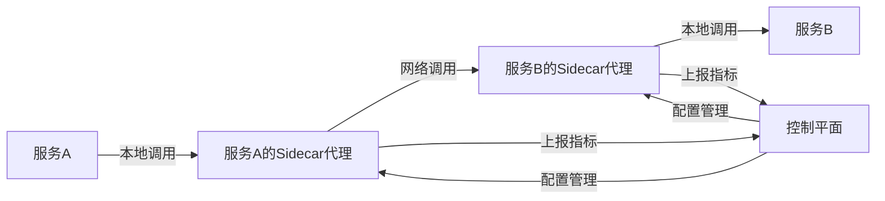

# 服务网格技术原理

服务网格是一个专用的基础设施层，用于处理服务到服务的通信，使其安全、快速和可靠。随着微服务架构的广泛采用，服务间通信变得越来越复杂，服务网格应运而生，为开发者提供了一种透明管理服务通信的方式，而无需修改应用代码。

## 什么是服务网格

服务网格是一个位于应用程序网络层之上的抽象层，负责处理服务间通信的复杂性。它不仅提供了可靠的服务发现、负载均衡、加密通信等基础功能，还支持更高级的能力，如A/B测试、金丝雀发布、限流熔断、指标收集和分布式追踪等。

服务网格的核心价值在于将这些通信功能从应用程序代码中剥离出来，实现了控制平面和数据平面的分离，使开发者可以专注于业务逻辑的开发，而将复杂的网络通信交给服务网格处理。

## 服务网格的架构组成

服务网格通常由两个主要部分组成：

### 1. 数据平面（Data Plane）

数据平面由一组智能代理（通常是边车代理，Sidecar Proxy）组成，这些代理与应用服务部署在一起，但运行在独立的进程中。它们负责处理服务间的所有网络通信，包括：

- **服务发现**：自动发现可用的服务实例
- **负载均衡**：在多个服务实例之间分配流量
- **健康检查**：监控服务健康状态并移除不健康的实例
- **流量路由**：根据规则将请求路由到不同的服务版本
- **熔断降级**：防止级联故障
- **重试机制**：自动重试失败的请求
- **安全通信**：提供TLS加密和身份验证
- **指标收集**：收集请求延迟、流量等指标数据

常见的数据平面实现包括Envoy、NGINX、Linkerd等。其中Envoy因其高性能和可扩展性成为了最流行的选择。

### 2. 控制平面（Control Plane）

控制平面负责管理和配置数据平面的代理，提供API来设置策略和收集遥测数据。它的主要功能包括：

- **配置管理**：集中管理和分发代理配置
- **服务发现集成**：与服务注册中心集成
- **证书管理**：自动生成和轮换TLS证书
- **策略执行**：定义和执行访问控制策略
- **可观测性**：聚合和展示监控数据

主流的控制平面实现有Istio、Consul Connect、Linkerd等。

## 服务网格的工作原理

服务网格的工作流程可以简化为以下步骤：

1. **请求拦截**：当服务A需要调用服务B时，请求首先被服务A的Sidecar代理拦截
2. **服务发现**：Sidecar代理查询控制平面获取服务B的可用实例
3. **负载均衡**：代理根据负载均衡算法选择一个服务B的实例
4. **策略应用**：应用流量控制、安全策略等
5. **请求转发**：代理将请求转发到选定的服务B实例的Sidecar代理
6. **响应处理**：服务B的Sidecar代理接收响应并返回给服务A的代理
7. **指标收集**：整个过程中，代理收集请求/响应的各种指标

整个过程对应用程序是透明的，应用只需要知道要调用的服务名称，而不需要关心服务发现、负载均衡等复杂逻辑。



## Sidecar模式详解

服务网格的核心实现方式是Sidecar（边车）模式，这是一种将应用功能从主应用中分离出来的设计模式。在服务网格中，每个服务实例旁边都部署了一个网络代理（Sidecar），所有进出服务的网络流量都通过这个代理。

### Sidecar注入方式

Sidecar代理的注入通常有两种方式：

1. **手动注入**：在部署配置中明确定义Sidecar容器
2. **自动注入**：通过准入控制器（如Kubernetes的Mutating Webhook）在部署时自动注入Sidecar

以Kubernetes环境中的Istio为例，自动注入过程如下：

```yaml
apiVersion: apps/v1
kind: Deployment
metadata:
  name: my-service
  labels:
    app: my-service
spec:
  replicas: 3
  selector:
    matchLabels:
      app: my-service
  template:
    metadata:
      labels:
        app: my-service
      annotations:
        sidecar.istio.io/inject: "true"  # 启用Sidecar自动注入
    spec:
      containers:
      - name: my-service
        image: my-service:1.0
        ports:
        - containerPort: 8080
```

当这个Deployment被提交到启用了Istio的Kubernetes集群时，Istio的准入控制器会自动向Pod规范中添加Envoy Sidecar容器。

### 流量劫持机制

Sidecar代理需要能够拦截所有进出服务的流量。在Kubernetes环境中，这通常通过iptables规则或EBPF技术实现：

1. **iptables方式**：通过修改Pod的网络命名空间中的iptables规则，将所有入站和出站流量重定向到Sidecar代理的端口
2. **EBPF方式**：使用Linux内核的EBPF技术，在更低层次上拦截和重定向网络流量，性能更好

以Istio为例，它使用名为`istio-init`的初始化容器在Pod启动时设置iptables规则：

```
# 将所有出站流量重定向到Envoy代理的15001端口
iptables -t nat -A PREROUTING -p tcp -j REDIRECT --to-port 15001
# 将所有入站流量重定向到Envoy代理的15006端口
iptables -t nat -A OUTPUT -p tcp -j REDIRECT --to-port 15006
```

## 服务网格的高级功能

### 流量管理

服务网格提供了丰富的流量管理能力：

1. **请求路由**：基于HTTP头、URI路径等条件路由请求
2. **流量分割**：支持金丝雀发布、A/B测试等场景
3. **故障注入**：模拟网络故障和延迟，测试服务弹性
4. **超时控制**：为请求设置超时时间
5. **重试策略**：自动重试失败的请求，支持指数退避

以Istio的VirtualService为例，可以实现基于权重的流量分割：

```yaml
apiVersion: networking.istio.io/v1alpha3
kind: VirtualService
metadata:
  name: reviews
spec:
  hosts:
  - reviews
  http:
  - route:
    - destination:
        host: reviews
        subset: v1
      weight: 80
    - destination:
        host: reviews
        subset: v2
      weight: 20
```

这个配置将80%的流量路由到v1版本，20%的流量路由到v2版本，实现了金丝雀发布。

### 弹性能力

服务网格增强了微服务系统的弹性：

1. **熔断器**：当检测到服务不健康时自动断开连接
2. **限流**：控制请求速率，防止过载
3. **舱壁隔离**：隔离故障，防止级联失败
4. **负载均衡**：支持多种负载均衡算法，如轮询、最少连接等

以Istio的DestinationRule为例，配置熔断策略：

```yaml
apiVersion: networking.istio.io/v1alpha3
kind: DestinationRule
metadata:
  name: reviews
spec:
  host: reviews
  trafficPolicy:
    connectionPool:
      tcp:
        maxConnections: 100
      http:
        http1MaxPendingRequests: 10
        maxRequestsPerConnection: 10
    outlierDetection:
      consecutiveErrors: 5
      interval: 30s
      baseEjectionTime: 30s
```

这个配置限制了到reviews服务的最大连接数，并设置了异常检测策略，当连续5次错误时将实例暂时从负载均衡池中移除。

### 安全功能

服务网格提供了多层次的安全保障：

1. **mTLS**：服务间的双向TLS认证，确保通信加密和身份验证
2. **访问控制**：基于身份的细粒度访问策略
3. **证书管理**：自动生成、分发和轮换证书
4. **认证授权**：支持JWT验证、RBAC等机制

以Istio的PeerAuthentication为例，启用mTLS：

```yaml
apiVersion: security.istio.io/v1beta1
kind: PeerAuthentication
metadata:
  name: default
  namespace: istio-system
spec:
  mtls:
    mode: STRICT  # 强制所有服务间通信使用mTLS
```

### 可观测性

服务网格为微服务提供了三大可观测性支柱：

1. **指标（Metrics）**：收集请求量、延迟、错误率等指标
2. **日志（Logging）**：记录请求和响应的详细信息
3. **追踪（Tracing）**：分布式追踪，跟踪请求在服务间的传播路径

服务网格通常与Prometheus、Grafana、Jaeger等工具集成，提供完整的可观测性解决方案。

## 主流服务网格实现对比

### Istio

Istio是目前最流行的服务网格实现，由Google、IBM和Lyft联合开发。

**优势**：
- 功能全面，支持复杂的流量管理
- 强大的安全功能
- 与Kubernetes深度集成
- 活跃的社区支持

**劣势**：
- 较高的资源消耗
- 配置复杂
- 学习曲线陡峭

### Linkerd

Linkerd是CNCF毕业项目，专注于简单性和易用性。

**优势**：
- 轻量级，资源消耗低
- 简单易用，学习曲线平缓
- 专注于性能和稳定性
- 使用Rust编写的数据平面，性能优异

**劣势**：
- 功能相对Istio少
- 扩展性有限

### Consul Connect

HashiCorp的Consul Connect将服务网格功能集成到Consul服务发现中。

**优势**：
- 与Consul无缝集成
- 支持多数据中心
- 适用于Kubernetes和非Kubernetes环境
- 配置相对简单

**劣势**：
- 功能不如Istio全面
- 社区相对较小

## 服务网格的性能影响

服务网格虽然提供了丰富的功能，但也会带来一定的性能开销：

1. **延迟增加**：请求需要经过两个额外的代理（发送方和接收方的Sidecar）
2. **资源消耗**：每个服务实例都需要运行一个Sidecar代理，增加了CPU和内存使用
3. **启动时间**：Sidecar注入和初始化会增加服务启动时间

为了减轻这些影响，可以采取以下措施：

- 使用更轻量级的服务网格实现（如Linkerd）
- 优化Sidecar代理的资源配置
- 只在需要服务网格功能的服务上启用它
- 考虑使用eBPF等更高效的流量拦截技术

## 服务网格的适用场景

服务网格并非适用于所有情况，以下场景特别适合采用服务网格：

1. **大规模微服务架构**：服务数量多，通信复杂
2. **多语言环境**：不同服务使用不同的编程语言
3. **安全要求高**：需要强制执行服务间加密和身份验证
4. **复杂的部署策略**：需要金丝雀发布、A/B测试等能力
5. **需要详细可观测性**：需要全面监控服务间通信

对于小型应用或单体应用，服务网格可能是过度设计，带来的复杂性可能超过其价值。

## 服务网格的发展趋势

服务网格技术正在快速发展，未来趋势包括：

1. **WebAssembly扩展**：使用WebAssembly扩展代理功能，无需重新编译
2. **多集群支持**：跨多个Kubernetes集群的服务网格
3. **与API网关的融合**：服务网格和API网关功能的统一
4. **eBPF技术应用**：使用eBPF提高性能和降低资源消耗
5. **无Sidecar架构**：探索不依赖Sidecar的服务网格实现

## 总结

服务网格为微服务架构提供了强大的通信基础设施，解决了服务发现、负载均衡、弹性、安全和可观测性等关键挑战。通过将这些功能从应用代码中分离出来，服务网格使开发者能够专注于业务逻辑，同时享受统一管理的网络通信能力。

虽然服务网格带来了一定的复杂性和性能开销，但在大规模微服务环境中，其带来的好处通常超过了这些成本。随着技术的不断发展和成熟，服务网格正在成为构建现代云原生应用的重要组成部分。

选择是否使用服务网格以及选择哪种实现，应该基于具体的业务需求、团队能力和基础设施环境来决定。无论如何，理解服务网格的核心原理和工作机制，对于设计和构建可靠、安全、可观测的微服务系统都是非常有价值的。