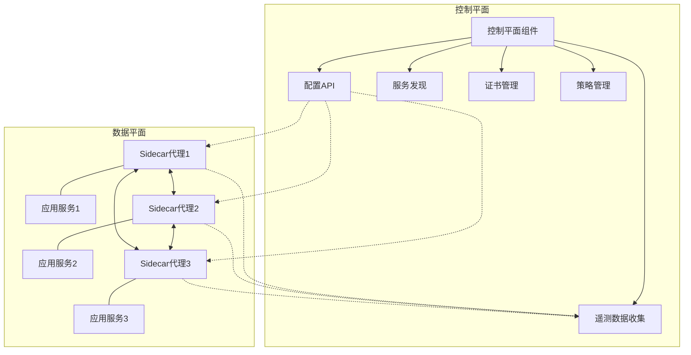
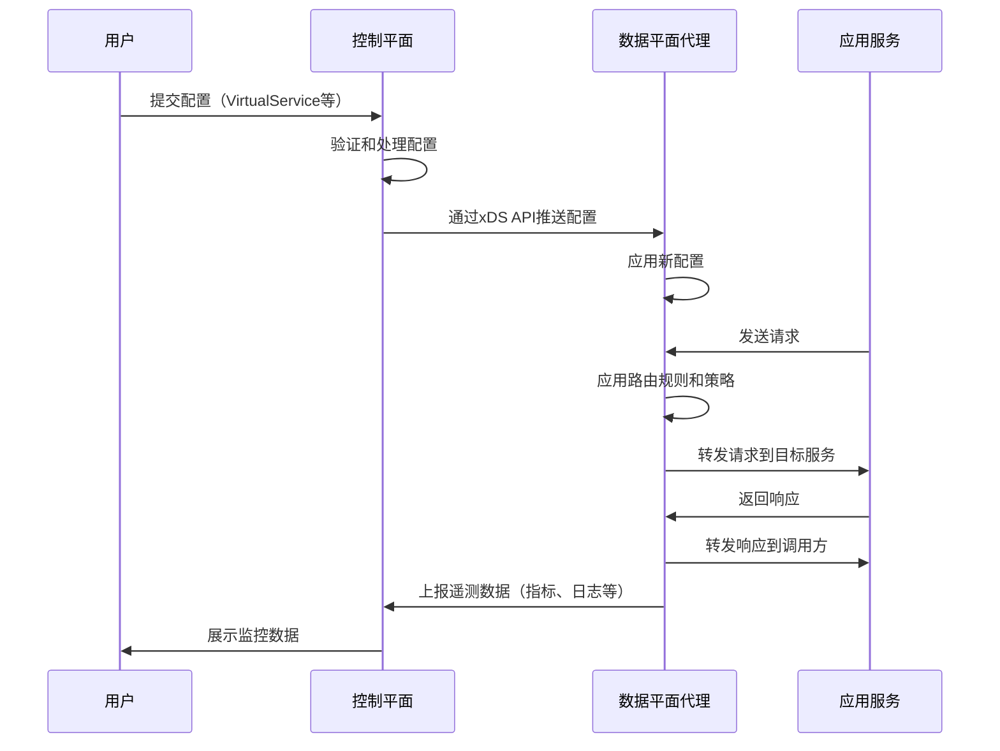

# 数据平面与控制平面

服务网格由数据平面和控制平面两部分组成，它们共同协作提供完整的服务网格功能。这种架构设计遵循了关注点分离的原则，使得服务网格能够高效地管理微服务通信，同时保持良好的可扩展性和可维护性。

## 架构概述

在深入了解数据平面和控制平面之前，我们先来看一下服务网格的整体架构：



这种分层架构将网络通信的执行（数据平面）与管理和配置（控制平面）分离，使得每个平面都能专注于自己的职责。

## 数据平面详解

### 定义与职责

数据平面是服务网格的执行层，负责处理服务之间的所有网络通信。它由一组分布式的代理组成，这些代理通常以边车（Sidecar）模式部署在每个服务实例旁边。

数据平面的主要职责包括：

1. **请求转发**：拦截并转发服务间的所有入站和出站流量
2. **负载均衡**：在多个服务实例之间分配流量
3. **健康检查**：监控服务实例的健康状态
4. **流量控制**：实施限流、熔断、重试等机制
5. **安全通信**：处理TLS加密、身份验证等
6. **可观测性数据收集**：收集请求指标、日志和追踪信息

### 常见实现

数据平面的主流实现包括：

1. **Envoy**：由Lyft开发的高性能C++代理，是Istio的默认数据平面
2. **NGINX**：广泛使用的Web服务器和反向代理
3. **HAProxy**：高性能的TCP/HTTP负载均衡器
4. **Linkerd2-proxy**：Linkerd服务网格使用的轻量级Rust代理

其中，Envoy因其丰富的功能、高性能和可扩展性成为了最流行的选择。

### 工作原理

以Envoy为例，数据平面的工作流程如下：

1. **流量拦截**：通过iptables规则或eBPF程序拦截进出服务的流量
2. **协议解析**：识别并解析HTTP、gRPC、TCP等协议
3. **路由决策**：根据配置的规则决定请求的目标服务
4. **负载均衡**：选择目标服务的一个健康实例
5. **策略执行**：应用超时、重试、熔断等策略
6. **指标收集**：记录请求延迟、状态码等指标
7. **转发请求**：将请求发送到目标服务
8. **处理响应**：接收响应并返回给调用方

下面是一个简化的Envoy配置示例，展示了如何设置监听器、集群和路由：

```yaml
static_resources:
  listeners:
  - name: listener_0
    address:
      socket_address:
        address: 0.0.0.0
        port_value: 15001
    filter_chains:
    - filters:
      - name: envoy.filters.network.http_connection_manager
        typed_config:
          "@type": type.googleapis.com/envoy.extensions.filters.network.http_connection_manager.v3.HttpConnectionManager
          stat_prefix: ingress_http
          route_config:
            name: local_route
            virtual_hosts:
            - name: local_service
              domains: ["*"]
              routes:
              - match:
                  prefix: "/service-a"
                route:
                  cluster: service_a
          http_filters:
          - name: envoy.filters.http.router
            typed_config:
              "@type": type.googleapis.com/envoy.extensions.filters.http.router.v3.Router
  
  clusters:
  - name: service_a
    connect_timeout: 0.25s
    type: STRICT_DNS
    lb_policy: ROUND_ROBIN
    load_assignment:
      cluster_name: service_a
      endpoints:
      - lb_endpoints:
        - endpoint:
            address:
              socket_address:
                address: service-a
                port_value: 8080
```

这个配置定义了一个监听器（listener_0）和一个集群（service_a），所有以"/service-a"开头的请求都会被路由到service-a服务。

## 控制平面详解

### 定义与职责

控制平面是服务网格的管理层，负责配置和监控数据平面的行为。它提供了集中式的API来管理服务网格的各种策略和规则。

控制平面的主要职责包括：

1. **配置管理**：生成并分发数据平面代理的配置
2. **服务发现**：维护可用服务实例的注册表
3. **证书管理**：生成、分发和轮换TLS证书
4. **策略定义**：定义访问控制、流量管理等策略
5. **遥测数据处理**：收集、聚合和展示监控数据

### 常见实现

控制平面的主流实现包括：

1. **Istio**：由Google、IBM和Lyft联合开发，功能全面
2. **Linkerd**：CNCF项目，注重简单性和易用性
3. **Consul Connect**：HashiCorp的服务网格解决方案
4. **AWS App Mesh**：亚马逊云的托管服务网格
5. **Kuma**：由Kong开发的通用服务网格

### 工作原理

以Istio为例，控制平面由以下组件组成：

1. **Istiod**：Istio的控制平面核心，整合了多个功能组件
   - **Pilot**：负责服务发现和流量管理
   - **Citadel**：负责证书管理和身份验证
   - **Galley**：负责配置验证和处理
   - **Mixer**（在新版本中已弃用）：负责策略执行和遥测数据收集

控制平面的工作流程如下：

1. **配置接收**：通过Kubernetes CRD或API接收用户配置
2. **配置验证**：验证配置的有效性和一致性
3. **服务发现**：与Kubernetes API服务器或其他服务注册中心集成
4. **配置转换**：将高级配置转换为数据平面代理可理解的格式
5. **配置分发**：将配置推送到数据平面代理
6. **证书管理**：生成和分发用于mTLS的证书
7. **遥测数据处理**：收集和处理来自数据平面的监控数据

下面是一个Istio VirtualService配置示例，展示了如何定义流量路由规则：

```yaml
apiVersion: networking.istio.io/v1alpha3
kind: VirtualService
metadata:
  name: reviews
spec:
  hosts:
  - reviews
  http:
  - match:
    - headers:
        end-user:
          exact: jason
    route:
    - destination:
        host: reviews
        subset: v2
  - route:
    - destination:
        host: reviews
        subset: v1
```

这个配置定义了一个路由规则：当请求头中的"end-user"字段为"jason"时，流量路由到reviews服务的v2版本；其他情况下，流量路由到v1版本。

## 平面间的交互机制

数据平面和控制平面之间的交互是服务网格正常运行的关键。这种交互主要通过以下机制实现：

### 1. xDS API

xDS（x Discovery Service）是一组用于服务发现和配置分发的API，包括：

- **LDS**（Listener Discovery Service）：发现监听器配置
- **RDS**（Route Discovery Service）：发现路由配置
- **CDS**（Cluster Discovery Service）：发现集群配置
- **EDS**（Endpoint Discovery Service）：发现端点配置
- **SDS**（Secret Discovery Service）：发现密钥配置

控制平面通过这些API将配置推送到数据平面代理。

### 2. 配置推送模式

配置分发通常有两种模式：

1. **推送模式（Push）**：控制平面主动将配置变更推送到数据平面
2. **拉取模式（Pull）**：数据平面定期从控制平面拉取最新配置

大多数现代服务网格采用推送模式，以确保配置变更能够快速生效。

### 3. 遥测数据收集

数据平面代理收集的遥测数据（指标、日志、追踪）通过以下方式发送到控制平面或外部监控系统：

1. **直接推送**：代理直接将数据推送到控制平面
2. **中间存储**：代理将数据发送到Prometheus、Elasticsearch等存储系统
3. **代理暴露**：代理暴露指标端点，由外部系统抓取

下图展示了数据平面和控制平面之间的交互流程：



## 平面分离的优势

数据平面和控制平面的分离带来了多项优势：

### 1. 关注点分离

- **数据平面**专注于高性能、低延迟的请求处理
- **控制平面**专注于策略管理和配置分发
- 这种分离使得每个平面都能针对其特定需求进行优化

### 2. 可扩展性

- **数据平面**可以独立扩展以处理增加的流量
- **控制平面**可以独立扩展以管理更多的服务和代理
- 平面间的松耦合使得系统更容易水平扩展

### 3. 高可用性

- **数据平面**即使在控制平面不可用时也能继续工作
- 这种设计确保了即使控制平面出现故障，服务间通信也不会中断
- 控制平面可以设计为高可用架构，而不影响数据平面的性能

### 4. 灵活性

- 可以根据需要替换或升级任一平面，而不必同时更改另一平面
- 支持混合使用不同的数据平面实现
- 便于引入新功能和改进

## 实际应用中的挑战与最佳实践

### 挑战

1. **性能开销**：数据平面代理引入的额外网络跳转可能增加延迟
2. **配置复杂性**：控制平面的配置模型可能复杂且难以理解
3. **调试困难**：分布式代理使得问题定位变得更加困难
4. **资源消耗**：每个服务实例都需要一个代理，增加了资源开销

### 最佳实践

1. **性能优化**
   - 使用高性能的数据平面代理（如Envoy）
   - 优化代理配置，减少不必要的处理
   - 考虑使用eBPF等技术降低流量拦截的开销

2. **配置管理**
   - 采用GitOps方法管理服务网格配置
   - 使用配置验证工具确保配置正确
   - 实施渐进式部署策略，先在测试环境验证配置

3. **可观测性增强**
   - 部署全面的监控和告警系统
   - 使用分布式追踪跟踪请求路径
   - 收集详细的代理日志用于问题排查

4. **资源管理**
   - 为代理设置合理的资源限制
   - 考虑使用更轻量级的服务网格实现
   - 只在需要服务网格功能的服务上启用它

## 不同服务网格实现的对比

### Istio

**控制平面**：Istiod（整合了Pilot、Citadel和Galley）
**数据平面**：Envoy
**特点**：
- 功能全面，支持复杂的流量管理
- 强大的安全功能
- 与Kubernetes深度集成
- 配置模型复杂

### Linkerd

**控制平面**：控制平面由多个微服务组成
**数据平面**：自定义的轻量级Rust代理
**特点**：
- 简单易用，学习曲线平缓
- 资源消耗低
- 性能优化
- 功能相对简单

### Consul Connect

**控制平面**：Consul服务器
**数据平面**：Envoy
**特点**：
- 与Consul服务发现无缝集成
- 支持多数据中心
- 适用于Kubernetes和非Kubernetes环境
- 配置相对简单

### AWS App Mesh

**控制平面**：AWS托管控制平面
**数据平面**：Envoy
**特点**：
- 与AWS服务深度集成
- 托管服务，减少运维负担
- 支持ECS、EKS和EC2
- 功能相对有限

## 未来发展趋势

服务网格的数据平面和控制平面架构正在不断发展，未来趋势包括：

1. **无Sidecar架构**：探索不依赖Sidecar的服务网格实现，如eBPF-based服务网格
2. **WebAssembly扩展**：使用WebAssembly扩展数据平面功能，无需重新编译
3. **多集群和多云支持**：增强跨集群和跨云服务网格的能力
4. **与API网关的融合**：服务网格和API网关功能的统一
5. **自适应控制**：基于机器学习的自动配置和优化

## 总结

数据平面和控制平面的分离是服务网格架构的核心设计原则，这种设计使得服务网格能够高效地管理微服务通信，同时保持良好的可扩展性和可维护性。

数据平面负责执行服务间通信，处理请求路由、负载均衡、故障恢复等功能；控制平面负责管理和配置数据平面，提供服务发现、证书管理、策略定义等功能。两个平面通过xDS API等机制进行交互，共同提供完整的服务网格功能。

理解数据平面和控制平面的工作原理、职责划分和交互机制，对于正确设计、部署和运维服务网格至关重要。随着技术的不断发展，服务网格的架构也在不断演进，但分离关注点的核心原则仍将保持不变。