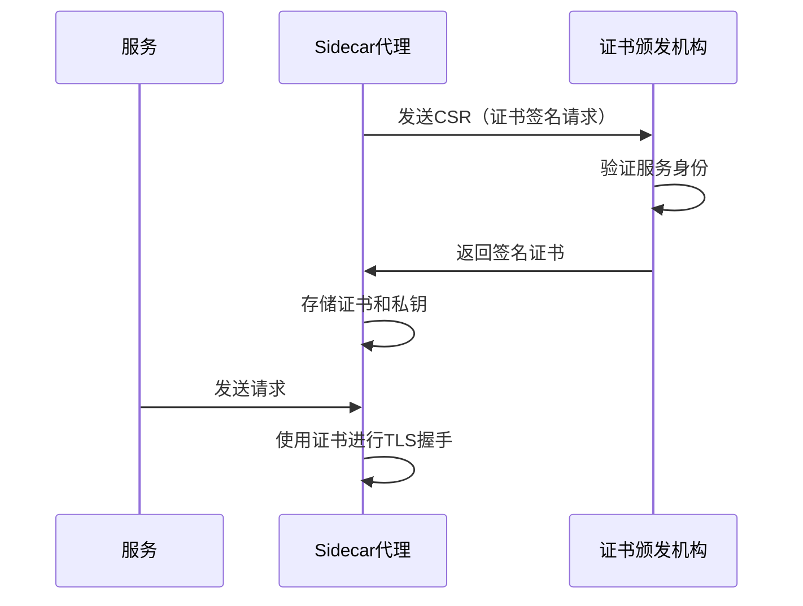
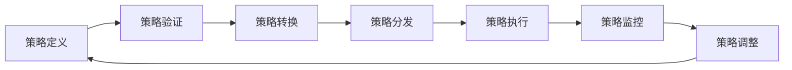

# 服务网格安全模型

服务网格提供了强大的安全功能，包括身份验证、授权和加密通信。随着微服务架构的广泛采用，应用被拆分为众多独立服务，服务间通信的安全性变得尤为重要。服务网格通过内置的安全机制，为微服务提供了全面的安全保障，而无需修改应用代码。

## 服务网格安全架构

服务网格的安全架构建立在以下核心概念之上：

### 1. 服务身份

在服务网格中，每个服务都有一个唯一的身份标识。这个身份通常基于以下因素：

- **服务名称**：服务的逻辑名称
- **命名空间**：服务所属的逻辑分组
- **账户**：服务运行时使用的账户（如Kubernetes中的ServiceAccount）
- **集群**：在多集群环境中，服务所属的集群

服务身份是服务网格安全模型的基础，用于身份验证和授权决策。以Istio为例，服务身份通常表示为SPIFFE（Secure Production Identity Framework For Everyone）URI格式：

```
spiffe://trust-domain/ns/namespace/sa/service-account
```

例如，一个运行在`default`命名空间中，使用`bookinfo-productpage`服务账户的服务，其SPIFFE ID可能是：

```
spiffe://cluster.local/ns/default/sa/bookinfo-productpage
```

### 2. 证书管理

服务网格使用X.509证书来验证服务身份。证书管理包括以下方面：

- **证书颁发机构（CA）**：负责签发和验证证书
- **证书生成**：为每个服务创建私钥和证书
- **证书分发**：将证书安全地分发给服务
- **证书轮换**：定期更新证书以提高安全性

服务网格通常提供内置的CA，也支持与外部CA集成。证书管理过程如下图所示：



### 3. 安全通信

服务网格通过以下机制确保服务间通信的安全：

- **传输层安全（TLS）**：加密服务间的通信
- **相互TLS（mTLS）**：客户端和服务器相互验证身份
- **证书验证**：验证通信双方的证书有效性

mTLS是服务网格安全通信的核心，它确保了：

1. **加密**：所有服务间通信都经过加密，防止窃听
2. **身份验证**：通信双方都验证对方的身份
3. **完整性**：检测数据在传输过程中是否被篡改

下面是一个Istio中启用mTLS的配置示例：

```yaml
apiVersion: security.istio.io/v1beta1
kind: PeerAuthentication
metadata:
  name: default
  namespace: istio-system
spec:
  mtls:
    mode: STRICT  # 强制所有服务间通信使用mTLS
```

### 4. 授权控制

服务网格提供细粒度的授权控制，基于以下因素做出决策：

- **身份**：请求方的服务身份
- **路径**：请求的API路径
- **方法**：HTTP方法（GET、POST等）
- **头部**：HTTP请求头
- **源IP**：请求的源IP地址
- **时间**：请求的时间

授权策略通常采用"默认拒绝，明确允许"的安全原则，即除非明确允许，否则所有请求都被拒绝。

以下是Istio中的授权策略示例，允许`reviews`服务访问`ratings`服务的特定API：

```yaml
apiVersion: security.istio.io/v1beta1
kind: AuthorizationPolicy
metadata:
  name: ratings-viewer
  namespace: default
spec:
  selector:
    matchLabels:
      app: ratings
  action: ALLOW
  rules:
  - from:
    - source:
        principals: ["cluster.local/ns/default/sa/bookinfo-reviews"]
    to:
    - operation:
        methods: ["GET"]
        paths: ["/ratings/*"]
```

## 零信任模型实现

### 零信任安全原则

零信任安全模型基于"永不信任，始终验证"的原则，它假设网络边界内外都存在威胁。服务网格通过以下方式实现零信任：

1. **身份为核心**：基于强身份验证，而非网络位置
2. **最小权限**：仅授予完成任务所需的最小权限
3. **持续验证**：每个请求都需要验证，而非仅在边界处验证
4. **动态策略**：基于多种因素动态调整访问策略
5. **加密通信**：所有通信都经过加密，无论源和目的地

### 服务网格中的零信任实现

服务网格通过以下机制实现零信任安全模型：

#### 1. 强身份验证

每个服务都有一个加密验证的身份，通过X.509证书实现。这确保了：

- 服务身份不可伪造
- 身份与服务紧密绑定
- 身份可以跨环境一致使用

#### 2. 细粒度访问控制

服务网格提供多层次的访问控制：

- **服务级别**：控制哪些服务可以相互通信
- **方法级别**：控制可以访问哪些API端点
- **请求级别**：基于请求属性（头部、参数等）控制访问

下面是一个实现细粒度访问控制的Istio授权策略示例：

```yaml
apiVersion: security.istio.io/v1beta1
kind: AuthorizationPolicy
metadata:
  name: httpbin-policy
  namespace: foo
spec:
  selector:
    matchLabels:
      app: httpbin
  action: ALLOW
  rules:
  - from:
    - source:
        principals: ["cluster.local/ns/default/sa/sleep"]
    to:
    - operation:
        methods: ["GET"]
        paths: ["/info*"]
    when:
    - key: request.headers[X-Token]
      values: ["valid-token"]
```

这个策略只允许带有特定令牌的GET请求访问`/info`路径。

#### 3. 加密通信

服务网格确保所有服务间通信都经过加密，防止数据泄露和中间人攻击：

- **自动TLS**：自动为服务间通信启用TLS
- **证书管理**：自动处理证书生命周期
- **密钥轮换**：定期轮换密钥，减少长期暴露风险

#### 4. 持续监控与审计

零信任模型需要持续监控和审计，服务网格通过以下方式实现：

- **请求日志**：记录所有服务间请求
- **异常检测**：识别异常访问模式
- **策略违规告警**：当检测到策略违规时发出告警
- **访问审计**：提供详细的访问审计日志

## 安全策略管理机制

### 策略定义与分发

服务网格的安全策略通常通过声明式配置定义，并由控制平面分发到数据平面。这个过程包括：

1. **策略定义**：管理员定义安全策略（如授权规则、mTLS设置）
2. **策略验证**：控制平面验证策略的有效性和一致性
3. **策略转换**：将高级策略转换为数据平面可理解的格式
4. **策略分发**：将策略分发到相关的数据平面代理
5. **策略执行**：数据平面代理执行策略，控制请求访问

下图展示了安全策略的生命周期：



### 多层次安全策略

服务网格支持多层次的安全策略，从全局到局部：

1. **网格级策略**：适用于整个服务网格的默认策略
2. **命名空间级策略**：适用于特定命名空间的策略
3. **工作负载级策略**：适用于特定服务的策略

这种分层方法允许管理员设置全局安全基线，同时为特定服务提供定制化的安全策略。

以Istio为例，PeerAuthentication策略可以应用于不同级别：

```yaml
# 网格级策略 - 应用于所有服务
apiVersion: security.istio.io/v1beta1
kind: PeerAuthentication
metadata:
  name: default
  namespace: istio-system
spec:
  mtls:
    mode: PERMISSIVE
---
# 命名空间级策略 - 应用于特定命名空间
apiVersion: security.istio.io/v1beta1
kind: PeerAuthentication
metadata:
  name: default
  namespace: prod
spec:
  mtls:
    mode: STRICT
---
# 工作负载级策略 - 应用于特定服务
apiVersion: security.istio.io/v1beta1
kind: PeerAuthentication
metadata:
  name: payment-service
  namespace: prod
spec:
  selector:
    matchLabels:
      app: payment
  mtls:
    mode: STRICT
  portLevelMtls:
    8080:
      mode: DISABLE  # 特定端口禁用mTLS
```

### 安全策略冲突解决

当多个层次的策略应用于同一个服务时，服务网格需要解决潜在的冲突。通常采用以下优先级规则：

1. **最具体的策略优先**：工作负载级 > 命名空间级 > 网格级
2. **拒绝优先于允许**：如果多个授权策略适用，只要有一个拒绝，请求就会被拒绝
3. **显式配置优先于默认配置**：明确配置的策略优先于默认策略

### 渐进式安全实施

服务网格支持渐进式安全实施，允许组织逐步提高安全级别：

1. **监控模式**：记录策略违规，但不强制执行
2. **宽容模式**：允许非安全通信，但优先使用安全通信
3. **严格模式**：强制要求安全通信

这种渐进式方法使组织能够在不中断服务的情况下实施安全策略。

以mTLS为例，Istio支持以下模式：

- **DISABLE**：禁用mTLS
- **PERMISSIVE**：接受明文和mTLS流量，但始终使用mTLS发送
- **STRICT**：只接受mTLS流量

组织可以先在PERMISSIVE模式下运行，确认所有服务都支持mTLS后，再切换到STRICT模式。

## 常见安全场景与实践

### 1. 服务到服务认证

服务网格通过mTLS实现服务到服务的认证，确保只有经过验证的服务才能相互通信。

**实现步骤**：

1. 启用网格级mTLS（通常从PERMISSIVE模式开始）
2. 监控服务间通信，确保没有问题
3. 逐步将关键命名空间切换到STRICT模式
4. 最终将整个网格切换到STRICT模式

**Istio配置示例**：

```yaml
# 步骤1：启用网格级PERMISSIVE模式
apiVersion: security.istio.io/v1beta1
kind: PeerAuthentication
metadata:
  name: default
  namespace: istio-system
spec:
  mtls:
    mode: PERMISSIVE
---
# 步骤3：将关键命名空间切换到STRICT模式
apiVersion: security.istio.io/v1beta1
kind: PeerAuthentication
metadata:
  name: default
  namespace: payment
spec:
  mtls:
    mode: STRICT
```

### 2. 基于角色的访问控制

服务网格支持基于角色的访问控制（RBAC），根据服务身份和请求属性控制访问权限。

**实现步骤**：

1. 定义服务角色（如前端、后端、管理服务等）
2. 为每个角色定义访问权限
3. 将服务映射到相应角色
4. 实施访问控制策略

**Istio配置示例**：

```yaml
# 允许前端服务访问后端API
apiVersion: security.istio.io/v1beta1
kind: AuthorizationPolicy
metadata:
  name: backend-policy
  namespace: default
spec:
  selector:
    matchLabels:
      app: backend
  action: ALLOW
  rules:
  - from:
    - source:
        principals: ["cluster.local/ns/default/sa/frontend"]
    to:
    - operation:
        methods: ["GET"]
        paths: ["/api/v1/*"]
```

### 3. 外部服务访问控制

服务网格可以控制微服务对外部服务的访问，实现出站流量的安全管理。

**实现步骤**：

1. 定义允许访问的外部服务
2. 为外部服务配置TLS设置
3. 实施访问控制策略

**Istio配置示例**：

```yaml
# 定义外部服务
apiVersion: networking.istio.io/v1alpha3
kind: ServiceEntry
metadata:
  name: external-api
spec:
  hosts:
  - api.example.com
  ports:
  - number: 443
    name: https
    protocol: HTTPS
  resolution: DNS
  location: MESH_EXTERNAL
---
# 控制对外部服务的访问
apiVersion: security.istio.io/v1beta1
kind: AuthorizationPolicy
metadata:
  name: egress-control
  namespace: istio-system
spec:
  action: ALLOW
  rules:
  - from:
    - source:
        principals: ["cluster.local/ns/default/sa/payment-service"]
    to:
    - operation:
        hosts: ["api.example.com"]
```

### 4. API网关集成

服务网格可以与API网关集成，提供端到端的安全保障。

**实现步骤**：

1. 将API网关纳入服务网格
2. 配置网关的身份验证（如JWT验证）
3. 在网关和内部服务之间启用mTLS
4. 实施细粒度的访问控制

**Istio配置示例**：

```yaml
# 在网关上配置JWT验证
apiVersion: security.istio.io/v1beta1
kind: RequestAuthentication
metadata:
  name: jwt-auth
  namespace: istio-system
spec:
  selector:
    matchLabels:
      istio: ingressgateway
  jwtRules:
  - issuer: "https://accounts.example.com"
    jwksUri: "https://accounts.example.com/.well-known/jwks.json"
---
# 基于JWT声明的授权策略
apiVersion: security.istio.io/v1beta1
kind: AuthorizationPolicy
metadata:
  name: frontend-ingress
  namespace: istio-system
spec:
  selector:
    matchLabels:
      istio: ingressgateway
  action: ALLOW
  rules:
  - from:
    - source:
        requestPrincipals: ["*"]
    when:
    - key: request.auth.claims[groups]
      values: ["customer"]
```

## 安全最佳实践

### 1. 默认安全原则

- **默认拒绝**：采用白名单方式，只允许明确授权的访问
- **最小权限**：为服务提供完成任务所需的最小权限
- **深度防御**：实施多层安全控制，不依赖单一防御机制

### 2. 证书管理

- **自动轮换**：启用证书自动轮换，减少长期暴露风险
- **短期证书**：使用短期证书（如24小时），减少证书泄露的影响
- **安全存储**：确保私钥安全存储，避免未授权访问

### 3. 策略管理

- **版本控制**：将安全策略纳入版本控制系统
- **渐进式实施**：先监控后强制，确保策略不会破坏现有功能
- **定期审查**：定期审查和更新安全策略，移除不必要的权限

### 4. 监控与审计

- **集中日志**：集中收集和分析安全日志
- **异常检测**：实施异常检测，及时发现潜在安全问题
- **合规审计**：保留详细的访问记录，支持合规审计

### 5. 安全测试

- **渗透测试**：定期进行渗透测试，验证安全控制有效性
- **策略验证**：自动验证安全策略的一致性和完整性
- **故障注入**：测试安全控制在异常情况下的行为

## 服务网格安全的挑战与解决方案

### 1. 性能开销

**挑战**：安全功能（如mTLS、策略检查）可能增加延迟和资源消耗。

**解决方案**：
- 优化代理配置，减少不必要的处理
- 使用高性能的数据平面实现
- 考虑使用硬件加速（如Intel AES-NI）提高加密性能
- 实施缓存机制，减少重复验证

### 2. 复杂性管理

**挑战**：安全策略可能变得复杂且难以管理，特别是在大规模部署中。

**解决方案**：
- 采用分层策略管理，从全局到局部
- 使用策略模板和最佳实践
- 实施自动化策略验证和测试
- 提供可视化工具，帮助理解策略影响

### 3. 证书管理

**挑战**：在大规模环境中管理和轮换证书可能变得复杂。

**解决方案**：
- 使用服务网格内置的证书管理功能
- 与企业PKI系统集成
- 实施自动证书轮换
- 监控证书生命周期，避免意外过期

### 4. 调试困难

**挑战**：安全问题的调试可能很复杂，特别是在分布式系统中。

**解决方案**：
- 实施详细的安全日志记录
- 提供调试工具和可视化界面
- 支持临时放宽安全策略进行故障排除
- 使用分布式追踪跟踪请求路径

## 未来发展趋势

服务网格安全正在不断发展，未来趋势包括：

### 1. 机器学习与自适应安全

- 使用机器学习识别异常访问模式
- 基于行为分析动态调整安全策略
- 自动响应安全事件

### 2. 联邦身份与跨网格安全

- 支持跨服务网格的身份联邦
- 实现多集群和多云环境中的统一安全模型
- 标准化服务身份表示和验证

### 3. 硬件安全集成

- 与可信执行环境（TEE）集成
- 利用硬件安全模块（HSM）保护密钥
- 支持机密计算技术

### 4. 零配置安全

- 基于意图的安全策略
- 自动推断和生成最佳安全配置
- 减少手动配置的需求

## 总结

服务网格提供了全面的安全模型，通过身份验证、授权和加密通信保护微服务架构。它实现了零信任安全原则，确保每个服务请求都经过验证和授权，无论请求来自何处。

服务网格的安全功能包括：

- 基于强身份的服务认证
- 相互TLS加密通信
- 细粒度的访问控制
- 自动证书管理
- 多层次安全策略

通过这些功能，服务网格为微服务提供了一致、可管理且强大的安全保障，同时将安全逻辑与业务逻辑分离，使开发者能够专注于应用功能而非安全实现。

随着微服务架构的不断发展，服务网格安全模型也将继续演进，提供更智能、更自动化的安全保障，应对不断变化的安全挑战。