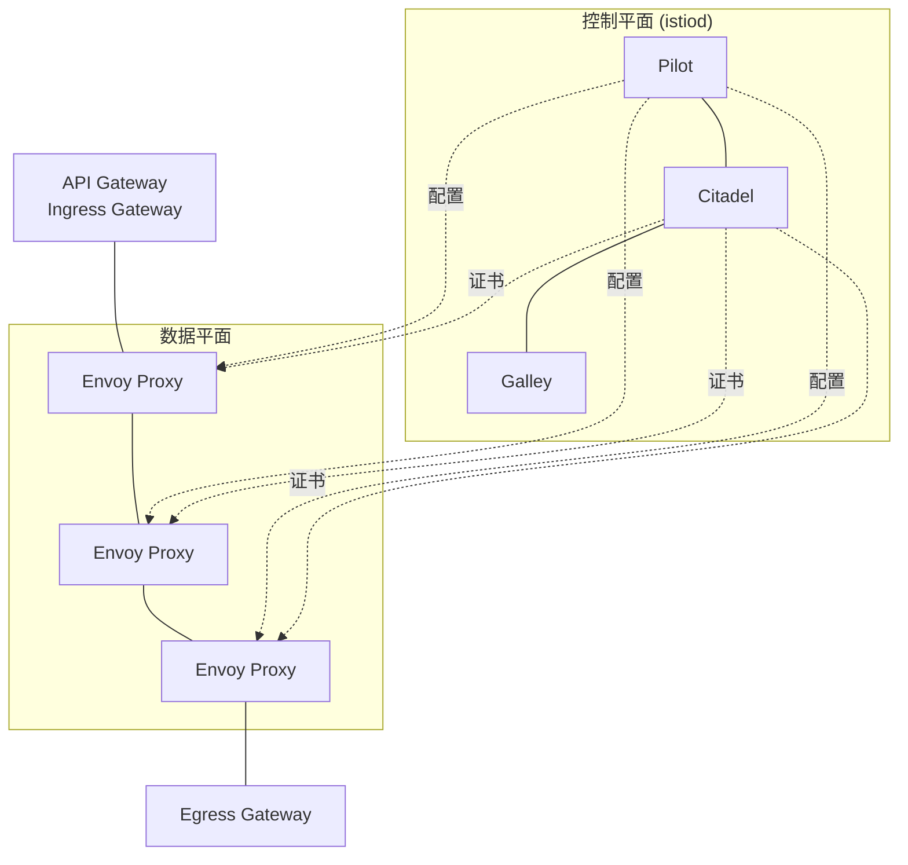
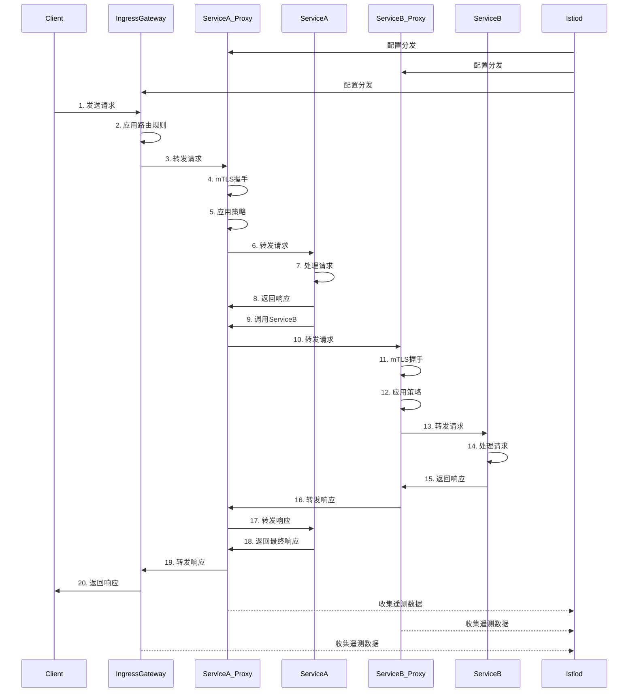

# Istio架构与核心组件

Istio是最流行的服务网格实现之一，提供了丰富的流量管理、安全和可观测性功能。作为一个开源的服务网格平台，Istio通过透明地为现有分布式应用程序添加强大的功能层，解决了微服务架构中的常见挑战，而无需修改应用代码。

## Istio概述

Istio最初由Google、IBM和Lyft联合开发，于2017年首次发布。它的名称来源于希腊语，意为"起航"，象征着帮助企业在微服务的海洋中航行。Istio构建在Envoy代理的基础上，提供了一个完整的服务网格解决方案，包括流量管理、安全性和可观测性。

### 主要功能

Istio提供的核心功能包括：

1. **流量管理**：智能路由、负载均衡、故障恢复、流量分割等
2. **安全**：服务间通信加密、身份验证、授权控制
3. **可观测性**：指标收集、分布式追踪、访问日志
4. **策略执行**：速率限制、配额管理、访问控制

这些功能使得开发团队能够专注于业务逻辑，而将复杂的服务通信、安全和监控交给Istio处理。

## Istio整体架构

Istio采用了经典的服务网格架构，分为数据平面和控制平面：



### 数据平面

Istio的数据平面由一组智能代理（Envoy）组成，这些代理以边车（Sidecar）容器的形式部署在每个服务实例旁边。数据平面负责处理服务之间的所有网络通信，并执行控制平面定义的策略。

### 控制平面

Istio的控制平面负责管理和配置数据平面代理，实现服务发现、证书管理和策略执行。在最新版本中，控制平面被整合为一个单一组件：istiod。

## 核心组件详解

### istiod

从Istio 1.5版本开始，控制平面的多个组件被整合到一个名为istiod的单一进程中，简化了部署和维护。istiod包含了以下功能组件：

#### 1. Pilot（服务发现与配置）

Pilot是Istio控制平面的核心组件，负责：

- **服务发现**：与底层平台（如Kubernetes）集成，维护可用服务实例的注册表
- **配置分发**：将流量规则、策略等转换为Envoy可理解的配置，并分发给数据平面代理
- **A/B测试**：支持金丝雀发布、流量分割等高级部署策略
- **弹性功能**：配置超时、重试、熔断等弹性能力

Pilot通过xDS API与Envoy代理通信，xDS是一组用于服务发现和配置分发的API：

- LDS（Listener Discovery Service）：发现监听器配置
- RDS（Route Discovery Service）：发现路由配置
- CDS（Cluster Discovery Service）：发现集群配置
- EDS（Endpoint Discovery Service）：发现端点配置

下面是一个简化的流量管理配置示例，展示了Pilot如何处理VirtualService和DestinationRule：

```yaml
# VirtualService定义路由规则
apiVersion: networking.istio.io/v1alpha3
kind: VirtualService
metadata:
  name: reviews
spec:
  hosts:
  - reviews
  http:
  - match:
    - headers:
        end-user:
          exact: jason
    route:
    - destination:
        host: reviews
        subset: v2
  - route:
    - destination:
        host: reviews
        subset: v1

# DestinationRule定义子集和流量策略
apiVersion: networking.istio.io/v1alpha3
kind: DestinationRule
metadata:
  name: reviews
spec:
  host: reviews
  subsets:
  - name: v1
    labels:
      version: v1
  - name: v2
    labels:
      version: v2
  trafficPolicy:
    connectionPool:
      tcp:
        maxConnections: 100
```

当用户提交这些配置后，Pilot会：
1. 验证配置的有效性
2. 将高级配置转换为Envoy可理解的低级配置
3. 通过xDS API将配置推送到相关的Envoy代理

#### 2. Citadel（安全）

Citadel是Istio的安全组件，负责：

- **身份管理**：为每个服务分配强身份标识
- **证书管理**：生成、分发和轮换TLS证书
- **密钥管理**：安全地管理加密密钥

Citadel实现了服务网格中的零信任安全模型，通过以下机制保障服务通信安全：

- **服务身份**：基于SPIFFE（Secure Production Identity Framework For Everyone）标准
- **mTLS**：服务间的双向TLS认证和加密
- **证书轮换**：自动轮换证书，减少长期暴露风险

下面是一个启用mTLS的配置示例：

```yaml
# 启用严格模式的mTLS
apiVersion: security.istio.io/v1beta1
kind: PeerAuthentication
metadata:
  name: default
  namespace: istio-system
spec:
  mtls:
    mode: STRICT
```

当此配置应用后，Citadel会：
1. 确保所有服务间通信都使用mTLS
2. 为新服务自动生成和分发证书
3. 定期轮换证书以提高安全性

#### 3. Galley（配置验证与处理）

Galley是Istio的配置验证和处理组件，负责：

- **配置验证**：验证用户提交的Istio配置的语法和语义正确性
- **配置处理**：将配置转换为内部格式，供其他组件使用
- **配置分发**：将处理后的配置分发给控制平面的其他组件

Galley作为配置的单一真实来源，简化了Istio与不同平台的集成，并提高了配置管理的可靠性。

### Envoy代理

Envoy是Istio数据平面的核心组件，是一个高性能的C++代理，负责处理服务间的所有网络通信。Envoy以Sidecar模式部署在每个服务实例旁边，拦截进出服务的所有流量。

Envoy的主要功能包括：

- **协议支持**：支持HTTP/1.1、HTTP/2、gRPC、TCP等多种协议
- **动态配置**：支持通过xDS API动态更新配置
- **负载均衡**：支持多种负载均衡算法
- **健康检查**：主动和被动健康检查
- **熔断器**：防止级联故障
- **TLS终止**：处理TLS连接的建立和终止
- **指标收集**：收集请求延迟、流量等指标

Envoy的核心概念包括：

1. **监听器（Listener）**：监听特定端口的网络连接
2. **过滤器链（Filter Chain）**：处理请求的一系列过滤器
3. **路由（Route）**：根据请求属性决定目标集群
4. **集群（Cluster）**：表示上游服务
5. **端点（Endpoint）**：集群中的实际服务实例

### 入口和出口网关

除了Sidecar代理，Istio还提供了专门的入口和出口网关，用于管理进出服务网格的流量：

#### 入口网关（Ingress Gateway）

入口网关是部署在服务网格边缘的Envoy代理，负责接收外部流量并将其路由到网格内的服务。入口网关提供了以下功能：

- **流量路由**：根据主机名、路径等将流量路由到不同服务
- **TLS终止**：处理外部TLS连接
- **认证授权**：验证外部请求的身份和权限
- **流量管理**：应用速率限制、重试等策略

下面是一个入口网关配置示例：

```yaml
# 定义网关
apiVersion: networking.istio.io/v1alpha3
kind: Gateway
metadata:
  name: bookinfo-gateway
spec:
  selector:
    istio: ingressgateway
  servers:
  - port:
      number: 80
      name: http
      protocol: HTTP
    hosts:
    - "bookinfo.example.com"

# 定义与网关关联的路由规则
apiVersion: networking.istio.io/v1alpha3
kind: VirtualService
metadata:
  name: bookinfo
spec:
  hosts:
  - "bookinfo.example.com"
  gateways:
  - bookinfo-gateway
  http:
  - match:
    - uri:
        prefix: /productpage
    route:
    - destination:
        host: productpage
        port:
          number: 9080
```

#### 出口网关（Egress Gateway）

出口网关是部署在服务网格边缘的Envoy代理，负责处理从网格内部到外部服务的流量。出口网关提供了以下功能：

- **流量控制**：控制哪些服务可以访问外部资源
- **TLS发起**：为出站流量建立TLS连接
- **监控和审计**：记录和监控出站流量
- **流量策略**：应用超时、重试等策略

下面是一个出口网关配置示例：

```yaml
# 定义外部服务
apiVersion: networking.istio.io/v1alpha3
kind: ServiceEntry
metadata:
  name: external-svc
spec:
  hosts:
  - api.external-service.com
  location: MESH_EXTERNAL
  ports:
  - number: 443
    name: https
    protocol: HTTPS
  resolution: DNS

# 定义出口网关
apiVersion: networking.istio.io/v1alpha3
kind: Gateway
metadata:
  name: istio-egressgateway
spec:
  selector:
    istio: egressgateway
  servers:
  - port:
      number: 443
      name: https
      protocol: HTTPS
    hosts:
    - api.external-service.com
    tls:
      mode: PASSTHROUGH

# 定义路由规则
apiVersion: networking.istio.io/v1alpha3
kind: VirtualService
metadata:
  name: direct-external-svc-through-egress-gateway
spec:
  hosts:
  - api.external-service.com
  gateways:
  - mesh
  - istio-egressgateway
  http:
  - match:
    - gateways:
      - mesh
      port: 80
    route:
    - destination:
        host: istio-egressgateway.istio-system.svc.cluster.local
        port:
          number: 443
  - match:
    - gateways:
      - istio-egressgateway
      port: 443
    route:
    - destination:
        host: api.external-service.com
        port:
          number: 443
```

## Istio的工作流程

为了更好地理解Istio的工作原理，让我们看一下一个请求在Istio服务网格中的完整流程：



这个流程展示了：
1. Istiod如何配置所有代理
2. 请求如何通过入口网关进入服务网格
3. 服务间通信如何通过Sidecar代理进行
4. 每个代理如何应用安全和流量策略
5. 遥测数据如何被收集

## Istio的部署模型

Istio支持多种部署模型，适应不同的需求和环境：

### 1. 单集群部署

最简单的部署模型，所有组件都部署在一个Kubernetes集群中：

```bash
# 使用默认配置安装Istio
istioctl install --set profile=default
```

### 2. 多集群部署

Istio支持跨多个Kubernetes集群的服务网格，有两种主要模式：

#### 主从模式（Primary-Remote）

一个主集群包含完整的控制平面，远程集群只包含数据平面组件：

```bash
# 在主集群安装
istioctl install --set profile=default

# 在远程集群安装
istioctl install --set profile=remote \
  --set values.global.remotePilotAddress=<主集群Istiod地址>
```

#### 多主模式（Multi-Primary）

多个集群都有自己的控制平面，相互独立但共享服务网格：

```bash
# 在每个集群上安装
istioctl install --set profile=default \
  --set values.global.meshID=mesh1 \
  --set values.global.multiCluster.clusterName=cluster1
```

### 3. 虚拟机集成

Istio还支持将虚拟机上的服务纳入服务网格：

```bash
# 创建虚拟机命名空间
kubectl create ns vm-namespace

# 生成虚拟机配置
istioctl x workload entry configure \
  --name vm1 \
  --namespace vm-namespace \
  --labels app=vm-app \
  --serviceAccount vm-sa
```

## Istio的配置模型

Istio使用Kubernetes自定义资源（CRD）来配置服务网格。主要的配置资源包括：

### 1. 流量管理

- **VirtualService**：定义路由规则，控制流量如何路由到服务
- **DestinationRule**：定义子集和流量策略，如负载均衡、连接池设置
- **Gateway**：定义入口和出口网关的配置
- **ServiceEntry**：将外部服务添加到服务网格
- **Sidecar**：自定义Sidecar代理的配置

### 2. 安全

- **PeerAuthentication**：配置服务间的认证策略（如mTLS）
- **RequestAuthentication**：配置终端用户认证（如JWT验证）
- **AuthorizationPolicy**：定义访问控制策略

### 3. 可观测性

- **Telemetry**：配置遥测数据收集和报告

下面是一个综合配置示例，展示了如何使用这些资源：

```yaml
# 定义服务的流量路由规则
apiVersion: networking.istio.io/v1alpha3
kind: VirtualService
metadata:
  name: reviews
spec:
  hosts:
  - reviews
  http:
  - match:
    - headers:
        end-user:
          exact: jason
    route:
    - destination:
        host: reviews
        subset: v2
  - route:
    - destination:
        host: reviews
        subset: v1

# 定义服务的子集和流量策略
apiVersion: networking.istio.io/v1alpha3
kind: DestinationRule
metadata:
  name: reviews
spec:
  host: reviews
  subsets:
  - name: v1
    labels:
      version: v1
  - name: v2
    labels:
      version: v2
  trafficPolicy:
    loadBalancer:
      simple: RANDOM

# 配置服务间认证
apiVersion: security.istio.io/v1beta1
kind: PeerAuthentication
metadata:
  name: reviews
spec:
  selector:
    matchLabels:
      app: reviews
  mtls:
    mode: STRICT

# 配置访问控制
apiVersion: security.istio.io/v1beta1
kind: AuthorizationPolicy
metadata:
  name: reviews-policy
spec:
  selector:
    matchLabels:
      app: reviews
  action: ALLOW
  rules:
  - from:
    - source:
        principals: ["cluster.local/ns/default/sa/productpage"]
    to:
    - operation:
        methods: ["GET"]
```

## Istio的可观测性

Istio提供了强大的可观测性功能，帮助运维人员了解服务网格的状态和性能：

### 1. 指标（Metrics）

Istio自动收集服务级别的指标，包括：

- 请求量
- 错误率
- 响应时间
- TCP连接指标

这些指标可以通过Prometheus收集，并使用Grafana可视化：

```yaml
# 配置Prometheus适配器
apiVersion: telemetry.istio.io/v1alpha1
kind: Telemetry
metadata:
  name: mesh-default
  namespace: istio-system
spec:
  metrics:
  - providers:
    - name: prometheus
```

### 2. 分布式追踪（Tracing）

Istio支持分布式追踪，跟踪请求在服务间的传播路径：

```yaml
# 配置追踪
apiVersion: telemetry.istio.io/v1alpha1
kind: Telemetry
metadata:
  name: mesh-default
  namespace: istio-system
spec:
  tracing:
  - providers:
    - name: zipkin
    randomSamplingPercentage: 100.0
```

### 3. 访问日志（Access Logs）

Istio可以记录详细的访问日志，包括请求和响应的详细信息：

```yaml
# 配置访问日志
apiVersion: telemetry.istio.io/v1alpha1
kind: Telemetry
metadata:
  name: mesh-default
  namespace: istio-system
spec:
  accessLogging:
  - providers:
    - name: envoy
```

## Istio的最佳实践

### 1. 渐进式采用

- 从非关键服务开始
- 先启用可观测性功能，再启用流量管理和安全功能
- 使用PERMISSIVE模式过渡到mTLS

### 2. 资源优化

- 为Envoy代理设置合理的资源限制
- 使用适当的Istio配置文件（profile）
- 只启用需要的功能

### 3. 安全配置

- 默认启用mTLS
- 实施最小权限原则
- 定期轮换证书

### 4. 监控与告警

- 设置关键指标的告警
- 监控控制平面和数据平面的健康状态
- 实施自动化故障恢复机制

## Istio的局限性与挑战

尽管Istio提供了强大的功能，但也面临一些挑战：

1. **复杂性**：Istio的配置模型复杂，学习曲线陡峭
2. **性能开销**：Sidecar代理引入的额外网络跳转增加了延迟
3. **资源消耗**：控制平面和数据平面都需要额外的计算资源
4. **调试困难**：分布式系统的问题定位变得更加复杂

为了应对这些挑战，Istio社区一直在努力简化配置、提高性能和改善用户体验。

## Istio与其他服务网格的对比

Istio与其他流行的服务网格实现相比有以下特点：

| 特性 | Istio | Linkerd | Consul Connect |
|------|-------|---------|----------------|
| 数据平面 | Envoy | 自定义Rust代理 | Envoy |
| 功能丰富度 | 高 | 中 | 中 |
| 性能开销 | 中 | 低 | 中 |
| 易用性 | 复杂 | 简单 | 中等 |
| 社区活跃度 | 高 | 高 | 中 |
| 多集群支持 | 强 | 有限 | 强 |
| 非K8s支持 | 有限 | 无 | 强 |

## 未来发展趋势

Istio正在不断发展，未来趋势包括：

1. **简化配置**：减少配置复杂性，提高易用性
2. **性能优化**：减少Sidecar代理的资源消耗和延迟
3. **WebAssembly扩展**：使用WebAssembly扩展Envoy功能
4. **多集群增强**：改进跨集群服务网格的能力
5. **与边缘计算集成**：扩展到边缘计算场景

## 总结

Istio是一个功能全面的服务网格平台，通过其控制平面（istiod）和数据平面（Envoy代理）提供了强大的流量管理、安全和可观测性功能。它的架构设计使得微服务通信变得更加安全、可靠和可观测，同时将这些功能与应用代码分离，使开发者能够专注于业务逻辑。

尽管Istio有一定的复杂性和资源开销，但其带来的好处通常超过了这些成本，特别是在大规模微服务环境中。随着Istio的不断发展和成熟，它正在成为构建现代云原生应用的重要组成部分。

无论是刚开始探索服务网格，还是已经在生产环境中使用Istio，理解其架构和核心组件的工作原理都是充分利用这一强大平台的关键。