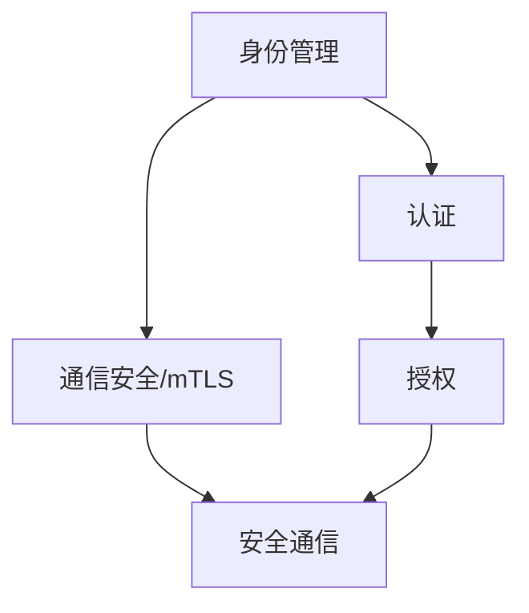
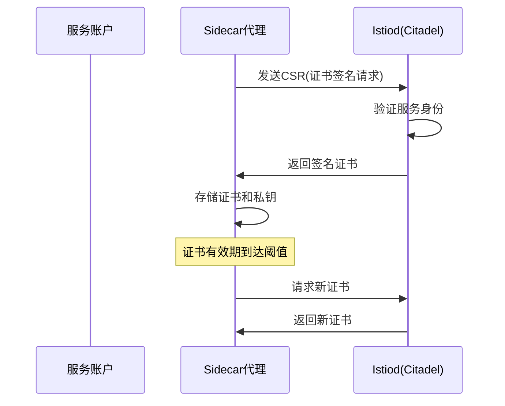
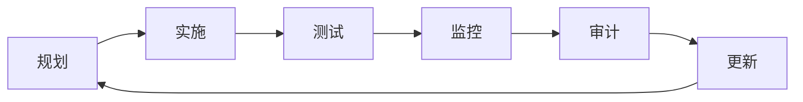
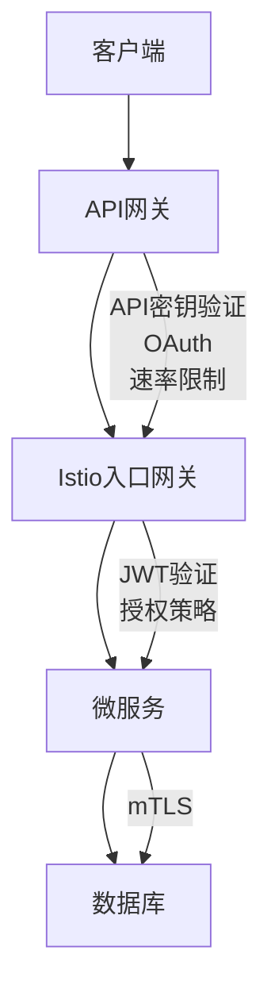

# Istio安全策略实施

Istio提供了全面的安全功能，包括mTLS通信、访问控制和认证授权。这些安全功能构成了一个多层次的安全架构，能够在不修改应用代码的情况下为微服务环境提供强大的安全保障。本文将详细介绍如何在Istio中配置和实施各种安全策略，帮助您构建一个安全可靠的服务网格。

## Istio安全架构概述

在深入了解具体的安全策略之前，我们需要先了解Istio的安全架构。Istio安全架构由以下几个关键部分组成：

1. **身份管理**：为网格中的每个服务提供强身份标识
2. **通信安全**：通过自动mTLS加密服务间通信
3. **认证**：验证服务和用户的身份
4. **授权**：控制对服务的访问权限

这些组件共同工作，形成了一个全面的安全框架：



## 服务身份与证书管理

### 服务身份

在Istio中，每个服务都有一个唯一的身份标识。在Kubernetes环境中，这个身份通常基于服务账户（ServiceAccount）。Istio使用SPIFFE（Secure Production Identity Framework For Everyone）标准来表示服务身份，格式为：

```
spiffe://trust-domain/ns/namespace/sa/service-account
```

例如，一个运行在`default`命名空间中，使用`bookinfo-productpage`服务账户的服务，其SPIFFE ID为：

```
spiffe://cluster.local/ns/default/sa/bookinfo-productpage
```

### 证书管理

Istio的证书管理由istiod中的Citadel组件负责。它执行以下功能：

1. 生成和分发证书
2. 轮换证书
3. 撤销证书

证书生命周期管理流程如下：



默认情况下，Istio生成的证书有效期为24小时，并在证书有效期达到80%时自动轮换。

## 配置相互TLS(mTLS)

相互TLS（mTLS）是Istio安全通信的基础，它确保服务间的通信既经过加密，又经过身份验证。

### mTLS模式

Istio支持三种mTLS模式：

1. **DISABLE**：禁用mTLS，使用明文通信
2. **PERMISSIVE**：同时接受明文和mTLS流量，但始终使用mTLS发送流量
3. **STRICT**：只接受mTLS流量，拒绝明文通信

### 配置网格级mTLS

要为整个服务网格启用mTLS，可以创建一个网格级的`PeerAuthentication`资源：

```yaml
apiVersion: security.istio.io/v1beta1
kind: PeerAuthentication
metadata:
  name: default
  namespace: istio-system  # 应用于整个网格
spec:
  mtls:
    mode: STRICT  # 强制使用mTLS
```

### 配置命名空间级mTLS

对于特定命名空间，可以创建命名空间级的`PeerAuthentication`：

```yaml
apiVersion: security.istio.io/v1beta1
kind: PeerAuthentication
metadata:
  name: default
  namespace: prod  # 仅应用于prod命名空间
spec:
  mtls:
    mode: STRICT
```

### 配置工作负载级mTLS

对于特定工作负载，可以使用选择器创建工作负载级的`PeerAuthentication`：

```yaml
apiVersion: security.istio.io/v1beta1
kind: PeerAuthentication
metadata:
  name: payment-service-mtls
  namespace: prod
spec:
  selector:
    matchLabels:
      app: payment  # 仅应用于标签为app=payment的工作负载
  mtls:
    mode: STRICT
```

### 配置端口级mTLS

Istio甚至支持为特定端口配置不同的mTLS模式：

```yaml
apiVersion: security.istio.io/v1beta1
kind: PeerAuthentication
metadata:
  name: payment-service-mtls
  namespace: prod
spec:
  selector:
    matchLabels:
      app: payment
  mtls:
    mode: STRICT
  portLevelMtls:
    8080:
      mode: PERMISSIVE  # 8080端口使用PERMISSIVE模式
```

### 渐进式mTLS迁移

在生产环境中，通常需要渐进式地迁移到mTLS。以下是一个推荐的迁移路径：

1. **安装Istio**，默认使用PERMISSIVE模式
2. **监控**服务间通信，确保没有问题
3. **命名空间级迁移**：逐个命名空间切换到STRICT模式
4. **全网格迁移**：所有命名空间验证无误后，设置网格级STRICT模式

```yaml
# 步骤1：安装Istio时使用PERMISSIVE模式（默认）

# 步骤3：逐个命名空间迁移
apiVersion: security.istio.io/v1beta1
kind: PeerAuthentication
metadata:
  name: default
  namespace: prod
spec:
  mtls:
    mode: STRICT

# 步骤4：全网格迁移
apiVersion: security.istio.io/v1beta1
kind: PeerAuthentication
metadata:
  name: default
  namespace: istio-system
spec:
  mtls:
    mode: STRICT
```

### 验证mTLS状态

可以使用以下命令验证mTLS的配置和状态：

```bash
# 查看PeerAuthentication配置
kubectl get peerauthentication --all-namespaces

# 检查特定服务的mTLS状态
istioctl authn tls-check <pod-name> <service-name>

# 查看服务间通信的TLS状态
istioctl proxy-status
```

## 配置请求认证

除了服务间的mTLS认证，Istio还支持终端用户认证，主要通过JWT（JSON Web Token）实现。

### JWT认证配置

使用`RequestAuthentication`资源配置JWT认证：

```yaml
apiVersion: security.istio.io/v1beta1
kind: RequestAuthentication
metadata:
  name: jwt-auth
  namespace: prod
spec:
  selector:
    matchLabels:
      app: frontend
  jwtRules:
  - issuer: "https://accounts.example.com"
    jwksUri: "https://accounts.example.com/.well-known/jwks.json"
    audiences:
    - "frontend.example.com"
```

这个配置要求发送到`app=frontend`服务的请求必须包含有效的JWT令牌。

### 多JWT提供者

Istio支持配置多个JWT提供者：

```yaml
apiVersion: security.istio.io/v1beta1
kind: RequestAuthentication
metadata:
  name: multi-jwt-auth
  namespace: prod
spec:
  selector:
    matchLabels:
      app: frontend
  jwtRules:
  - issuer: "https://accounts.example.com"
    jwksUri: "https://accounts.example.com/.well-known/jwks.json"
  - issuer: "https://alt-accounts.example.com"
    jwksUri: "https://alt-accounts.example.com/.well-known/jwks.json"
```

### JWT位置配置

默认情况下，Istio在Authorization头部查找JWT，但也可以配置从其他位置提取JWT：

```yaml
apiVersion: security.istio.io/v1beta1
kind: RequestAuthentication
metadata:
  name: jwt-auth
  namespace: prod
spec:
  selector:
    matchLabels:
      app: frontend
  jwtRules:
  - issuer: "https://accounts.example.com"
    jwksUri: "https://accounts.example.com/.well-known/jwks.json"
    fromHeaders:
    - name: x-jwt-token  # 从自定义头部提取JWT
    fromParams:
    - name: access_token  # 从查询参数提取JWT
```

### 验证JWT认证

可以使用curl测试JWT认证：

```bash
# 不带JWT的请求（应该被拒绝）
curl -i http://frontend.example.com/api

# 带有有效JWT的请求
curl -i -H "Authorization: Bearer $VALID_JWT" http://frontend.example.com/api
```

## 配置授权策略

Istio的授权策略通过`AuthorizationPolicy`资源实现，它支持基于身份、源IP、请求属性等因素控制访问权限。

### 授权策略基本结构

一个典型的授权策略包含以下部分：

1. **选择器**：指定策略应用的工作负载
2. **动作**：ALLOW、DENY或CUSTOM
3. **规则**：定义何时应用该动作

```yaml
apiVersion: security.istio.io/v1beta1
kind: AuthorizationPolicy
metadata:
  name: payment-policy
  namespace: prod
spec:
  selector:
    matchLabels:
      app: payment
  action: ALLOW  # 可以是ALLOW、DENY或CUSTOM
  rules:
  - from:
    - source:
        principals: ["cluster.local/ns/default/sa/frontend"]
    to:
    - operation:
        methods: ["GET"]
        paths: ["/api/payments"]
    when:
    - key: request.headers[x-api-key]
      values: ["valid-api-key"]
```

这个策略只允许来自`frontend`服务账户的GET请求访问`/api/payments`路径，且请求必须包含特定的API密钥。

### 默认拒绝策略

Istio授权遵循"默认拒绝"原则。如果没有明确允许，访问将被拒绝。可以通过创建一个空的ALLOW策略来允许所有访问：

```yaml
apiVersion: security.istio.io/v1beta1
kind: AuthorizationPolicy
metadata:
  name: allow-all
  namespace: prod
spec:
  action: ALLOW
  rules:
  - {}  # 空规则匹配所有请求
```

### 基于身份的授权

使用`principals`字段基于服务身份控制访问：

```yaml
apiVersion: security.istio.io/v1beta1
kind: AuthorizationPolicy
metadata:
  name: ratings-policy
  namespace: prod
spec:
  selector:
    matchLabels:
      app: ratings
  action: ALLOW
  rules:
  - from:
    - source:
        principals: ["cluster.local/ns/default/sa/reviews"]
```

这个策略只允许来自`reviews`服务的请求访问`ratings`服务。

### 基于命名空间的授权

使用`namespaces`字段基于源命名空间控制访问：

```yaml
apiVersion: security.istio.io/v1beta1
kind: AuthorizationPolicy
metadata:
  name: ratings-ns-policy
  namespace: prod
spec:
  selector:
    matchLabels:
      app: ratings
  action: ALLOW
  rules:
  - from:
    - source:
        namespaces: ["default", "frontend"]
```

这个策略只允许来自`default`和`frontend`命名空间的请求访问`ratings`服务。

### 基于IP的授权

使用`ipBlocks`字段基于源IP控制访问：

```yaml
apiVersion: security.istio.io/v1beta1
kind: AuthorizationPolicy
metadata:
  name: frontend-ip-policy
  namespace: prod
spec:
  selector:
    matchLabels:
      app: frontend
  action: ALLOW
  rules:
  - from:
    - source:
        ipBlocks: ["10.0.0.0/24", "192.168.1.1"]
```

这个策略只允许来自特定IP范围的请求访问`frontend`服务。

### 基于HTTP方法和路径的授权

使用`methods`和`paths`字段基于HTTP方法和路径控制访问：

```yaml
apiVersion: security.istio.io/v1beta1
kind: AuthorizationPolicy
metadata:
  name: api-methods-policy
  namespace: prod
spec:
  selector:
    matchLabels:
      app: api
  action: ALLOW
  rules:
  - to:
    - operation:
        methods: ["GET", "HEAD"]
        paths: ["/api/v1/*", "/healthz"]
```

这个策略只允许GET和HEAD请求访问特定的API路径。

### 基于JWT声明的授权

结合`RequestAuthentication`和`AuthorizationPolicy`，可以基于JWT声明控制访问：

```yaml
# 首先配置JWT认证
apiVersion: security.istio.io/v1beta1
kind: RequestAuthentication
metadata:
  name: jwt-auth
  namespace: prod
spec:
  selector:
    matchLabels:
      app: frontend
  jwtRules:
  - issuer: "https://accounts.example.com"
    jwksUri: "https://accounts.example.com/.well-known/jwks.json"

# 然后基于JWT声明配置授权
apiVersion: security.istio.io/v1beta1
kind: AuthorizationPolicy
metadata:
  name: frontend-jwt-policy
  namespace: prod
spec:
  selector:
    matchLabels:
      app: frontend
  action: ALLOW
  rules:
  - from:
    - source:
        requestPrincipals: ["*"]
    when:
    - key: request.auth.claims[groups]
      values: ["admin", "editor"]
```

这个策略只允许JWT中`groups`声明包含`admin`或`editor`的请求访问`frontend`服务。

### 拒绝策略

使用`DENY`动作创建拒绝策略：

```yaml
apiVersion: security.istio.io/v1beta1
kind: AuthorizationPolicy
metadata:
  name: deny-policy
  namespace: prod
spec:
  selector:
    matchLabels:
      app: api
  action: DENY
  rules:
  - from:
    - source:
        namespaces: ["dev"]
    to:
    - operation:
        methods: ["DELETE"]
```

这个策略拒绝来自`dev`命名空间的DELETE请求。拒绝策略的优先级高于允许策略。

### 条件授权

使用`when`字段基于请求属性创建条件授权：

```yaml
apiVersion: security.istio.io/v1beta1
kind: AuthorizationPolicy
metadata:
  name: conditional-policy
  namespace: prod
spec:
  selector:
    matchLabels:
      app: api
  action: ALLOW
  rules:
  - when:
    - key: request.headers[user-agent]
      values: ["Mozilla/*"]
    - key: request.time
      values: ["2022-01-01T00:00:00Z/2023-01-01T00:00:00Z"]
```

这个策略只允许特定用户代理在特定时间范围内的请求。

### 授权策略的作用域

授权策略可以应用于不同的作用域：

1. **网格级**：应用于整个服务网格
2. **命名空间级**：应用于特定命名空间
3. **工作负载级**：应用于特定工作负载

```yaml
# 网格级策略（放在根命名空间，通常是istio-system）
apiVersion: security.istio.io/v1beta1
kind: AuthorizationPolicy
metadata:
  name: mesh-policy
  namespace: istio-system
spec:
  action: ALLOW
  rules:
  - {}

# 命名空间级策略（不使用选择器）
apiVersion: security.istio.io/v1beta1
kind: AuthorizationPolicy
metadata:
  name: ns-policy
  namespace: prod
spec:
  action: ALLOW
  rules:
  - {}

# 工作负载级策略（使用选择器）
apiVersion: security.istio.io/v1beta1
kind: AuthorizationPolicy
metadata:
  name: workload-policy
  namespace: prod
spec:
  selector:
    matchLabels:
      app: api
  action: ALLOW
  rules:
  - {}
```

## 高级安全场景

### 零信任安全模型实施

Istio可以帮助实施零信任安全模型，其核心原则是"永不信任，始终验证"。以下是实施步骤：

1. **启用严格mTLS**：确保所有服务间通信都经过加密和身份验证

```yaml
apiVersion: security.istio.io/v1beta1
kind: PeerAuthentication
metadata:
  name: default
  namespace: istio-system
spec:
  mtls:
    mode: STRICT
```

2. **实施最小权限原则**：只允许必要的服务间通信

```yaml
# 默认拒绝所有通信
apiVersion: security.istio.io/v1beta1
kind: AuthorizationPolicy
metadata:
  name: deny-all
  namespace: default
spec:
  action: DENY
  rules:
  - {}

# 然后为每个服务明确允许必要的通信
apiVersion: security.istio.io/v1beta1
kind: AuthorizationPolicy
metadata:
  name: productpage-viewer
  namespace: default
spec:
  selector:
    matchLabels:
      app: productpage
  action: ALLOW
  rules:
  - from:
    - source:
        principals: ["cluster.local/ns/default/sa/ingress-gateway"]
```

3. **启用终端用户认证**：验证终端用户身份

```yaml
apiVersion: security.istio.io/v1beta1
kind: RequestAuthentication
metadata:
  name: jwt-auth
  namespace: default
spec:
  selector:
    matchLabels:
      app: productpage
  jwtRules:
  - issuer: "https://accounts.example.com"
    jwksUri: "https://accounts.example.com/.well-known/jwks.json"
```

4. **基于上下文的授权**：考虑多种因素做出授权决策

```yaml
apiVersion: security.istio.io/v1beta1
kind: AuthorizationPolicy
metadata:
  name: context-aware-policy
  namespace: default
spec:
  selector:
    matchLabels:
      app: productpage
  action: ALLOW
  rules:
  - from:
    - source:
        principals: ["cluster.local/ns/default/sa/ingress-gateway"]
    to:
    - operation:
        methods: ["GET"]
    when:
    - key: request.auth.claims[groups]
      values: ["customer"]
    - key: request.headers[user-agent]
      notValues: ["BadBot"]
    - key: connection.sni
      values: ["*.example.com"]
```

### 外部服务访问控制

控制微服务对外部服务的访问是安全策略的重要部分：

1. **定义外部服务**

```yaml
apiVersion: networking.istio.io/v1alpha3
kind: ServiceEntry
metadata:
  name: external-api
spec:
  hosts:
  - api.external.com
  ports:
  - number: 443
    name: https
    protocol: HTTPS
  resolution: DNS
  location: MESH_EXTERNAL
```

2. **控制对外部服务的访问**

```yaml
apiVersion: security.istio.io/v1beta1
kind: AuthorizationPolicy
metadata:
  name: external-api-policy
  namespace: istio-system
spec:
  action: ALLOW
  rules:
  - from:
    - source:
        principals: ["cluster.local/ns/default/sa/payment-service"]
    to:
    - operation:
        hosts: ["api.external.com"]
```

3. **通过出口网关路由外部流量**

```yaml
apiVersion: networking.istio.io/v1alpha3
kind: Gateway
metadata:
  name: istio-egressgateway
spec:
  selector:
    istio: egressgateway
  servers:
  - port:
      number: 443
      name: https
      protocol: HTTPS
    hosts:
    - api.external.com
    tls:
      mode: PASSTHROUGH

apiVersion: networking.istio.io/v1alpha3
kind: VirtualService
metadata:
  name: direct-external-api-through-egress-gateway
spec:
  hosts:
  - api.external.com
  gateways:
  - mesh
  - istio-egressgateway
  http:
  - match:
    - gateways:
      - mesh
      port: 443
    route:
    - destination:
        host: istio-egressgateway.istio-system.svc.cluster.local
        port:
          number: 443
  - match:
    - gateways:
      - istio-egressgateway
      port: 443
    route:
    - destination:
        host: api.external.com
        port:
          number: 443
```

### 入口流量安全

保护入口流量是安全策略的第一道防线：

1. **配置入口网关**

```yaml
apiVersion: networking.istio.io/v1alpha3
kind: Gateway
metadata:
  name: bookinfo-gateway
spec:
  selector:
    istio: ingressgateway
  servers:
  - port:
      number: 443
      name: https
      protocol: HTTPS
    hosts:
    - "bookinfo.example.com"
    tls:
      mode: SIMPLE
      credentialName: bookinfo-cert  # 引用Kubernetes Secret
```

2. **配置入口网关的JWT认证**

```yaml
apiVersion: security.istio.io/v1beta1
kind: RequestAuthentication
metadata:
  name: ingress-jwt
  namespace: istio-system
spec:
  selector:
    matchLabels:
      istio: ingressgateway
  jwtRules:
  - issuer: "https://accounts.example.com"
    jwksUri: "https://accounts.example.com/.well-known/jwks.json"
```

3. **配置入口网关的授权策略**

```yaml
apiVersion: security.istio.io/v1beta1
kind: AuthorizationPolicy
metadata:
  name: ingress-policy
  namespace: istio-system
spec:
  selector:
    matchLabels:
      istio: ingressgateway
  action: ALLOW
  rules:
  - from:
    - source:
        ipBlocks: ["203.0.113.0/24"]  # 允许的IP范围
    to:
    - operation:
        hosts: ["bookinfo.example.com"]
    when:
    - key: request.auth.claims[iss]
      values: ["https://accounts.example.com"]
```

## 安全策略故障排查

实施安全策略时可能会遇到各种问题。以下是常见问题及其排查方法：

### 1. mTLS连接问题

症状：服务间通信失败，出现TLS握手错误

排查步骤：

```bash
# 检查PeerAuthentication配置
kubectl get peerauthentication --all-namespaces

# 检查服务的mTLS状态
istioctl authn tls-check <pod-name> <service-name>

# 检查Envoy日志
kubectl logs <pod-name> -c istio-proxy

# 临时降级为PERMISSIVE模式进行测试
kubectl apply -f - <<EOF
apiVersion: security.istio.io/v1beta1
kind: PeerAuthentication
metadata:
  name: default
  namespace: istio-system
spec:
  mtls:
    mode: PERMISSIVE
EOF
```

### 2. JWT认证问题

症状：请求被拒绝，出现JWT相关错误

排查步骤：

```bash
# 检查RequestAuthentication配置
kubectl get requestauthentication -n <namespace>

# 检查JWT令牌是否有效
# 可以使用jwt.io网站或jq工具解析JWT
echo $JWT | jq -R 'split(".") | .[0],.[1] | @base64d | fromjson'

# 检查Envoy日志
kubectl logs <pod-name> -c istio-proxy | grep jwt

# 使用curl测试不同的JWT
curl -i -H "Authorization: Bearer $JWT" http://service-url
```

### 3. 授权策略问题

症状：请求被意外拒绝或允许

排查步骤：

```bash
# 检查所有授权策略
kubectl get authorizationpolicy --all-namespaces

# 检查特定命名空间的授权策略
kubectl get authorizationpolicy -n <namespace> -o yaml

# 启用调试日志
istioctl proxy-config log <pod-name> --level debug

# 检查Envoy授权配置
istioctl proxy-config listeners <pod-name> -o json | grep authz

# 使用curl测试不同的请求属性
curl -i -H "X-Custom-Header: value" http://service-url
```

### 4. 使用授权策略调试工具

Istio提供了`authz-check`工具，帮助调试授权策略：

```bash
# 检查特定请求是否被允许
istioctl experimental authz-check <pod-name> -a <action> -m <method> -p <path> -u <user>

# 例如
istioctl experimental authz-check productpage-v1-7f4cc988c6-qxqjs \
  -a GET \
  -m GET \
  -p /productpage \
  -u cluster.local/ns/default/sa/bookinfo-productpage
```

## 安全最佳实践

### 1. 渐进式安全实施

- 从非关键服务开始实施安全策略
- 使用PERMISSIVE模式过渡到mTLS
- 先监控后强制，确保策略不会破坏现有功能

### 2. 深度防御

- 实施多层安全控制
- 结合网络策略和Istio安全策略
- 不仅保护服务间通信，也保护数据存储和API

### 3. 最小权限原则

- 默认拒绝所有通信，只允许必要的访问
- 使用细粒度的授权策略，限制访问范围
- 定期审查和更新安全策略，移除不必要的权限

### 4. 证书管理

- 使用短期证书，减少证书泄露的影响
- 实施证书自动轮换
- 考虑与企业PKI系统集成

### 5. 监控与审计

- 启用详细的安全日志
- 监控异常访问模式
- 实施安全事件告警
- 定期进行安全审计

## 安全策略配置示例

以下是一个综合示例，展示了如何为一个多服务应用配置完整的安全策略：

```yaml
# 1. 启用严格mTLS
apiVersion: security.istio.io/v1beta1
kind: PeerAuthentication
metadata:
  name: default
  namespace: istio-system
spec:
  mtls:
    mode: STRICT

# 2. 配置入口网关
apiVersion: networking.istio.io/v1alpha3
kind: Gateway
metadata:
  name: bookinfo-gateway
spec:
  selector:
    istio: ingressgateway
  servers:
  - port:
      number: 443
      name: https
      protocol: HTTPS
    hosts:
    - "bookinfo.example.com"
    tls:
      mode: SIMPLE
      credentialName: bookinfo-cert

# 3. 配置JWT认证
apiVersion: security.istio.io/v1beta1
kind: RequestAuthentication
metadata:
  name: jwt-auth
  namespace: default
spec:
  selector:
    matchLabels:
      app: productpage
  jwtRules:
  - issuer: "https://accounts.example.com"
    jwksUri: "https://accounts.example.com/.well-known/jwks.json"

# 4. 配置入口网关授权
apiVersion: security.istio.io/v1beta1
kind: AuthorizationPolicy
metadata:
  name: ingress-policy
  namespace: istio-system
spec:
  selector:
    matchLabels:
      istio: ingressgateway
  action: ALLOW
  rules:
  - to:
    - operation:
        hosts: ["bookinfo.example.com"]

# 5. 配置productpage服务授权
让我继续完成 Istio 安全策略实施的文档内容：

```yaml
# 5. 配置productpage服务授权
apiVersion: security.istio.io/v1beta1
kind: AuthorizationPolicy
metadata:
  name: productpage-policy
  namespace: default
spec:
  selector:
    matchLabels:
      app: productpage
  action: ALLOW
  rules:
  - from:
    - source:
        principals: ["cluster.local/ns/istio-system/sa/istio-ingressgateway-service-account"]
    when:
    - key: request.auth.claims[groups]
      values: ["customer", "admin"]

# 6. 配置reviews服务授权
apiVersion: security.istio.io/v1beta1
kind: AuthorizationPolicy
metadata:
  name: reviews-policy
  namespace: default
spec:
  selector:
    matchLabels:
      app: reviews
  action: ALLOW
  rules:
  - from:
    - source:
        principals: ["cluster.local/ns/default/sa/bookinfo-productpage"]
    to:
    - operation:
        methods: ["GET"]

# 7. 配置ratings服务授权
apiVersion: security.istio.io/v1beta1
kind: AuthorizationPolicy
metadata:
  name: ratings-policy
  namespace: default
spec:
  selector:
    matchLabels:
      app: ratings
  action: ALLOW
  rules:
  - from:
    - source:
        principals: ["cluster.local/ns/default/sa/bookinfo-reviews"]
    to:
    - operation:
        methods: ["GET"]

# 8. 配置details服务授权
apiVersion: security.istio.io/v1beta1
kind: AuthorizationPolicy
metadata:
  name: details-policy
  namespace: default
spec:
  selector:
    matchLabels:
      app: details
  action: ALLOW
  rules:
  - from:
    - source:
        principals: ["cluster.local/ns/default/sa/bookinfo-productpage"]
    to:
    - operation:
        methods: ["GET"]
```

## 安全策略的演进与维护

安全不是一次性工作，而是一个持续的过程。随着应用的发展，安全策略也需要相应调整。

### 安全策略生命周期管理

有效的安全策略生命周期管理包括以下阶段：

1. **规划**：确定安全需求和目标
2. **实施**：配置和部署安全策略
3. **测试**：验证安全策略的有效性
4. **监控**：持续监控安全状态
5. **审计**：定期审查安全策略
6. **更新**：根据需求变化和安全威胁更新策略



### 安全策略自动化

随着服务数量的增加，手动管理安全策略变得越来越困难。自动化可以帮助解决这个问题：

1. **基础设施即代码**：将安全策略作为代码管理，存储在版本控制系统中
2. **CI/CD集成**：将安全策略部署集成到CI/CD流程中
3. **策略生成器**：基于服务依赖关系自动生成安全策略
4. **合规检查**：自动验证安全策略是否符合组织安全标准

### 安全策略版本控制

安全策略应该像应用代码一样进行版本控制：

1. **存储在Git仓库**：将安全策略YAML文件存储在Git仓库中
2. **变更审查**：通过Pull Request流程审查安全策略变更
3. **回滚能力**：在安全策略导致问题时能够快速回滚
4. **环境分离**：为不同环境（开发、测试、生产）维护不同的安全策略

## 与其他安全控制的集成

Istio安全策略应该作为整体安全架构的一部分，与其他安全控制协同工作。

### 与Kubernetes网络策略集成

Kubernetes网络策略和Istio授权策略可以结合使用，提供多层防御：

```yaml
# Kubernetes网络策略
apiVersion: networking.k8s.io/v1
kind: NetworkPolicy
metadata:
  name: ratings-network-policy
  namespace: default
spec:
  podSelector:
    matchLabels:
      app: ratings
  policyTypes:
  - Ingress
  ingress:
  - from:
    - podSelector:
        matchLabels:
          app: reviews
    ports:
    - protocol: TCP
      port: 9080

# Istio授权策略
apiVersion: security.istio.io/v1beta1
kind: AuthorizationPolicy
metadata:
  name: ratings-policy
  namespace: default
spec:
  selector:
    matchLabels:
      app: ratings
  action: ALLOW
  rules:
  - from:
    - source:
        principals: ["cluster.local/ns/default/sa/bookinfo-reviews"]
    to:
    - operation:
        methods: ["GET"]
```

Kubernetes网络策略在网络层控制流量，而Istio授权策略在应用层控制访问，两者结合提供了更全面的保护。

### 与API网关集成

Istio可以与API网关（如Kong、Apigee）集成，形成完整的API安全架构：

1. **API网关**：处理API密钥验证、速率限制、OAuth流程
2. **Istio**：处理服务间通信安全、细粒度授权



### 与SIEM系统集成

将Istio安全日志集成到安全信息和事件管理(SIEM)系统中，可以提供全面的安全监控：

1. **收集Istio安全日志**：包括认证失败、授权拒绝等事件
2. **集中分析**：与其他安全日志一起分析，识别安全威胁
3. **告警**：设置安全事件告警
4. **响应**：自动或手动响应安全事件

## 总结

Istio提供了全面的安全功能，使组织能够在微服务环境中实施强大的安全控制。通过mTLS通信、身份验证和细粒度授权策略，Istio帮助组织构建符合零信任安全模型的服务网格。

实施Istio安全策略需要遵循渐进式方法，从基本的mTLS通信开始，逐步添加更复杂的认证和授权策略。同时，安全策略应该作为代码管理，集成到CI/CD流程中，并与其他安全控制协同工作。

通过本文介绍的配置方法和最佳实践，您可以充分利用Istio的安全功能，为微服务环境提供全面的保护。随着微服务架构的不断发展，Istio的安全功能也将继续演进，提供更强大、更灵活的安全控制能力。