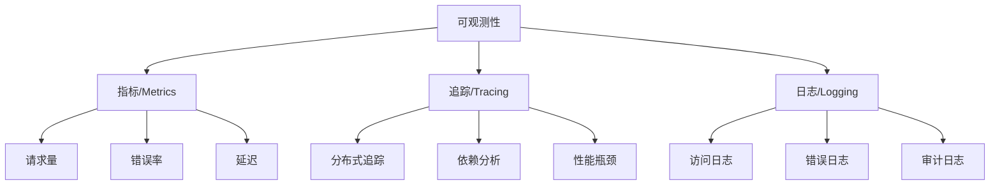
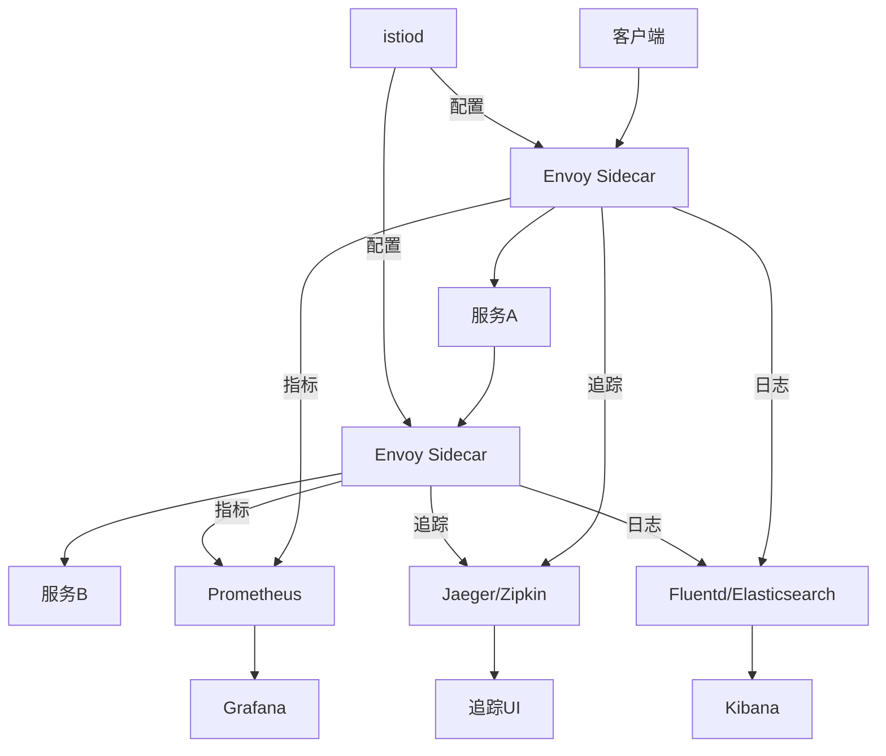
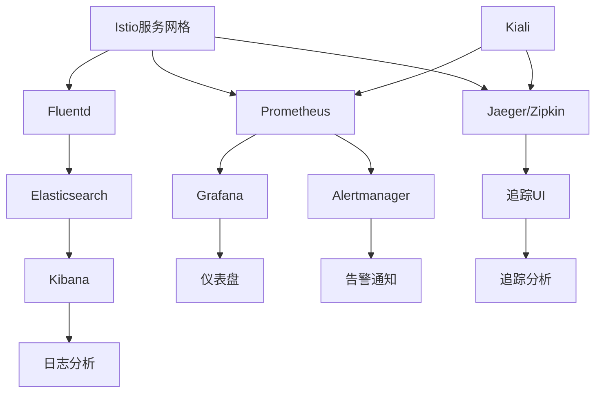

# Istio可观测性配置

Istio提供了强大的可观测性功能，包括指标收集、分布式追踪和访问日志。这些功能使运维和开发团队能够深入了解服务网格的运行状况、性能和行为，从而更有效地监控、排障和优化微服务应用。本文将详细介绍Istio的可观测性架构和配置方法，帮助读者构建全面的监控体系。

## 可观测性的三大支柱

在深入Istio的可观测性功能之前，我们需要理解可观测性的三大支柱：

1. **指标（Metrics）**：数值化的服务行为数据，如请求数、错误率、延迟等
2. **追踪（Tracing）**：记录请求在分布式系统中的完整路径
3. **日志（Logging）**：详细记录系统中发生的事件

Istio为这三个方面都提供了强大的支持，使微服务架构变得更加透明和可理解。



## Istio可观测性架构

Istio的可观测性架构基于其数据平面（Envoy代理）和控制平面（istiod）组件：



在这个架构中：

1. Envoy Sidecar代理拦截所有进出服务的流量
2. 代理自动收集指标、生成追踪数据和访问日志
3. 这些数据被发送到相应的后端系统（Prometheus、Jaeger/Zipkin、日志存储）
4. 可视化工具（Grafana、追踪UI、Kibana）提供数据查询和展示界面

## 指标收集配置

### Istio指标体系

Istio自动生成和收集四类核心指标：

1. **代理级别指标**：Envoy代理的内部状态
2. **服务级别指标**：HTTP/gRPC请求数、错误率、延迟等
3. **控制平面指标**：istiod组件的运行状况
4. **网格监控指标**：整个服务网格的健康状况

### 标准指标集

Istio默认生成以下关键指标：

| 指标名称 | 类型 | 描述 |
|---------|------|------|
| `istio_requests_total` | 计数器 | 服务请求总数 |
| `istio_request_duration_milliseconds` | 直方图 | 请求处理时间 |
| `istio_request_bytes` | 直方图 | 请求体大小 |
| `istio_response_bytes` | 直方图 | 响应体大小 |
| `istio_tcp_sent_bytes_total` | 计数器 | TCP连接发送的字节数 |
| `istio_tcp_received_bytes_total` | 计数器 | TCP连接接收的字节数 |
| `istio_tcp_connections_opened_total` | 计数器 | 打开的TCP连接数 |
| `istio_tcp_connections_closed_total` | 计数器 | 关闭的TCP连接数 |

这些指标都带有丰富的标签（如源服务、目标服务、响应代码等），便于进行多维度分析。

### 配置Prometheus适配器

Istio使用Prometheus作为默认的指标后端。在安装Istio时，可以通过配置文件启用Prometheus：

```yaml
apiVersion: install.istio.io/v1alpha1
kind: IstioOperator
spec:
  components:
    telemetry:
      enabled: true
  values:
    telemetry:
      enabled: true
      v2:
        enabled: true
        prometheus:
          enabled: true
```

如果使用的是较新版本的Istio，可以通过Telemetry API配置指标收集：

```yaml
apiVersion: telemetry.istio.io/v1alpha1
kind: Telemetry
metadata:
  name: mesh-default
  namespace: istio-system
spec:
  metrics:
  - providers:
    - name: prometheus
```

### 自定义指标配置

Istio允许自定义指标收集行为，包括：

1. **启用/禁用特定指标**
2. **调整指标维度**
3. **配置指标采样率**

以下是一个自定义指标配置示例：

```yaml
apiVersion: telemetry.istio.io/v1alpha1
kind: Telemetry
metadata:
  name: custom-metrics
  namespace: default
spec:
  metrics:
  - providers:
    - name: prometheus
    overrides:
    # 禁用请求大小指标
    - match:
        metric: REQUEST_SIZE
        mode: CLIENT_AND_SERVER
      disabled: true
    # 为请求计数添加自定义标签
    - match:
        metric: REQUEST_COUNT
        mode: CLIENT
      tagOverrides:
        custom_tag:
          value: "custom_value"
    # 调整指标维度
    dimensions:
      source_cluster: source.cluster.name
      destination_cluster: destination.cluster.name
```

### 配置Grafana仪表盘

Istio提供了一组预配置的Grafana仪表盘，用于可视化服务网格指标。可以在安装Istio时启用Grafana：

```yaml
apiVersion: install.istio.io/v1alpha1
kind: IstioOperator
spec:
  addonComponents:
    grafana:
      enabled: true
```

安装后，可以通过端口转发访问Grafana界面：

```bash
kubectl -n istio-system port-forward svc/grafana 3000:3000
```

Istio提供的Grafana仪表盘包括：

1. **Mesh Dashboard**：整个服务网格的概览
2. **Service Dashboard**：特定服务的详细指标
3. **Workload Dashboard**：特定工作负载的详细指标
4. **Performance Dashboard**：性能相关指标

## 分布式追踪配置

### 追踪原理

分布式追踪通过跟踪请求在多个服务间的传播路径，帮助理解系统行为和定位性能瓶颈。Istio支持多种追踪后端，包括Jaeger、Zipkin和Lightstep。

追踪的核心概念包括：

1. **Trace**：一个完整请求的端到端记录
2. **Span**：Trace中的一个逻辑单元，表示一个操作
3. **SpanContext**：包含Trace ID和Span ID的上下文信息，用于跨服务传递

### 配置追踪后端

以Jaeger为例，可以在安装Istio时启用追踪：

```yaml
apiVersion: install.istio.io/v1alpha1
kind: IstioOperator
spec:
  addonComponents:
    tracing:
      enabled: true
  values:
    tracing:
      enabled: true
      provider: jaeger
      sampling: 100.0  # 采样率，100表示100%
```

对于较新版本的Istio，可以使用Telemetry API配置追踪：

```yaml
apiVersion: telemetry.istio.io/v1alpha1
kind: Telemetry
metadata:
  name: mesh-default
  namespace: istio-system
spec:
  tracing:
  - providers:
    - name: zipkin
    randomSamplingPercentage: 100.0
```

安装后，可以通过端口转发访问Jaeger界面：

```bash
kubectl -n istio-system port-forward svc/jaeger-query 16686:16686
```

### 应用程序集成

虽然Istio自动生成和传播追踪头部，但为了获得完整的追踪信息，应用程序需要正确传递追踪上下文。以下是不同语言的示例：

#### Java (Spring Boot)

```java
@RestController
public class ServiceController {
    @Autowired
    private RestTemplate restTemplate;
    
    @GetMapping("/api/service")
    public ResponseEntity<String> callService() {
        // 无需手动处理追踪头部，Spring Cloud Sleuth会自动处理
        return restTemplate.getForEntity("http://another-service/api/endpoint", String.class);
    }
}
```

#### Node.js

```javascript
const express = require('express');
const axios = require('axios');
const app = express();

app.get('/api/service', (req, res) => {
  // 将追踪头部从请求传递到下游服务
  const headers = {
    'x-b3-traceid': req.headers['x-b3-traceid'],
    'x-b3-spanid': req.headers['x-b3-spanid'],
    'x-b3-parentspanid': req.headers['x-b3-spanid'],
    'x-b3-sampled': req.headers['x-b3-sampled']
  };
  
  axios.get('http://another-service/api/endpoint', { headers })
    .then(response => res.json(response.data))
    .catch(error => res.status(500).send(error.message));
});
```

#### Python

```python
from flask import Flask, request
import requests

app = Flask(__name__)

@app.route('/api/service')
def call_service():
    # 提取并传递追踪头部
    headers = {
        'x-b3-traceid': request.headers.get('x-b3-traceid'),
        'x-b3-spanid': request.headers.get('x-b3-spanid'),
        'x-b3-parentspanid': request.headers.get('x-b3-spanid'),
        'x-b3-sampled': request.headers.get('x-b3-sampled')
    }
    
    response = requests.get('http://another-service/api/endpoint', headers=headers)
    return response.text
```

### 自定义追踪配置

Istio允许自定义追踪配置，包括：

1. **调整采样率**：控制被追踪请求的百分比
2. **配置追踪标签**：添加自定义标签到追踪数据
3. **选择追踪提供者**：Jaeger、Zipkin或Lightstep

```yaml
apiVersion: telemetry.istio.io/v1alpha1
kind: Telemetry
metadata:
  name: custom-tracing
  namespace: default
spec:
  tracing:
  - providers:
    - name: zipkin
      zipkin:
        address: zipkin.custom-namespace.svc:9411
    randomSamplingPercentage: 50.0  # 50%采样率
    customTags:
      environment:
        literal:
          value: "production"
```

## 访问日志配置

### 访问日志概述

访问日志记录了服务间通信的详细信息，包括请求方法、路径、响应状态码、延迟等。Istio可以配置Envoy代理生成访问日志，并将其发送到标准输出或自定义日志后端。

### 启用访问日志

在Istio 1.9及更高版本中，可以使用Telemetry API配置访问日志：

```yaml
apiVersion: telemetry.istio.io/v1alpha1
kind: Telemetry
metadata:
  name: mesh-default
  namespace: istio-system
spec:
  accessLogging:
  - providers:
    - name: envoy
```

对于较早版本，可以通过MeshConfig配置访问日志：

```yaml
apiVersion: install.istio.io/v1alpha1
kind: IstioOperator
spec:
  meshConfig:
    accessLogFile: "/dev/stdout"
    accessLogFormat: |
      [%START_TIME%] "%REQ(:METHOD)% %REQ(X-ENVOY-ORIGINAL-PATH?:PATH)% %PROTOCOL%" %RESPONSE_CODE% %RESPONSE_FLAGS% %RESPONSE_CODE_DETAILS% %CONNECTION_TERMINATION_DETAILS% "%UPSTREAM_TRANSPORT_FAILURE_REASON%" %BYTES_RECEIVED% %BYTES_SENT% %DURATION% %RESP(X-ENVOY-UPSTREAM-SERVICE-TIME)% "%REQ(X-FORWARDED-FOR)%" "%REQ(USER-AGENT)%" "%REQ(X-REQUEST-ID)%" "%REQ(:AUTHORITY)%" "%UPSTREAM_HOST%" %UPSTREAM_CLUSTER% %UPSTREAM_LOCAL_ADDRESS% %DOWNSTREAM_LOCAL_ADDRESS% %DOWNSTREAM_REMOTE_ADDRESS% %REQUESTED_SERVER_NAME% %ROUTE_NAME%
```

### 自定义日志格式

Istio支持自定义访问日志格式，可以选择预定义格式或自定义格式：

```yaml
apiVersion: telemetry.istio.io/v1alpha1
kind: Telemetry
metadata:
  name: custom-logging
  namespace: default
spec:
  accessLogging:
  - providers:
    - name: envoy
    filter:
      expression: "response.code >= 400"  # 只记录错误响应
    # 使用预定义格式
    match:
      mode: CLIENT_AND_SERVER
```

对于更复杂的自定义格式，可以使用JSON格式：

```yaml
apiVersion: telemetry.istio.io/v1alpha1
kind: Telemetry
metadata:
  name: json-logging
  namespace: default
spec:
  accessLogging:
  - providers:
    - name: envoy
      envoy:
        # JSON格式日志
        logFormat:
          json:
            timestampFormat: "2006-01-02T15:04:05.000Z"
            fields:
              - name: "start_time"
                jsonPath: "$.start_time"
              - name: "method"
                jsonPath: "$.request.method"
              - name: "path"
                jsonPath: "$.request.path"
              - name: "protocol"
                jsonPath: "$.protocol"
              - name: "response_code"
                jsonPath: "$.response.code"
              - name: "response_flags"
                jsonPath: "$.response_flags"
              - name: "duration"
                jsonPath: "$.duration"
              - name: "upstream_host"
                jsonPath: "$.upstream_host"
              - name: "downstream_remote_address"
                jsonPath: "$.downstream_remote_address"
              - name: "user_agent"
                jsonPath: "$.request.useragent"
              - name: "request_id"
                jsonPath: "$.request.id"
```

### 集成外部日志系统

Istio生成的访问日志可以集成到外部日志系统，如ELK（Elasticsearch、Logstash、Kibana）或Fluentd：

1. **部署日志收集器**：在Kubernetes集群中部署Fluentd或Filebeat
2. **配置日志收集**：配置收集器从容器日志路径收集日志
3. **发送到日志存储**：将收集的日志发送到Elasticsearch或其他存储
4. **配置可视化**：使用Kibana或其他工具可视化日志

以下是一个使用Fluentd收集Istio访问日志的配置示例：

```yaml
apiVersion: v1
kind: ConfigMap
metadata:
  name: fluentd-config
  namespace: logging
data:
  fluent.conf: |
    <source>
      @type tail
      path /var/log/containers/*.log
      pos_file /var/log/fluentd-containers.log.pos
      tag kubernetes.*
      read_from_head true
      <parse>
        @type json
        time_format %Y-%m-%dT%H:%M:%S.%NZ
      </parse>
    </source>
    
    <filter kubernetes.**>
      @type kubernetes_metadata
    </filter>
    
    <filter kubernetes.**>
      @type grep
      <regexp>
        key log
        pattern /\[.*\] ".*" \d+ .*/
      </regexp>
    </filter>
    
    <match kubernetes.**>
      @type elasticsearch
      host elasticsearch
      port 9200
      logstash_format true
      logstash_prefix istio-access
    </match>
```

## 整合可观测性工具链

为了构建完整的可观测性解决方案，通常需要整合多种工具：

### 典型的Istio可观测性栈



### 安装完整可观测性套件

可以使用Istio的插件功能安装完整的可观测性套件：

```yaml
apiVersion: install.istio.io/v1alpha1
kind: IstioOperator
spec:
  addonComponents:
    grafana:
      enabled: true
    prometheus:
      enabled: true
    tracing:
      enabled: true
    kiali:
      enabled: true
  values:
    grafana:
      accessMode: ReadWriteMany
    prometheus:
      retention: 7d
    tracing:
      provider: jaeger
      sampling: 100.0
    kiali:
      dashboard:
        grafanaURL: http://grafana:3000
        jaegerURL: http://jaeger-query:16686
```

安装后，可以通过以下命令访问各个组件：

```bash
# 访问Grafana
kubectl -n istio-system port-forward svc/grafana 3000:3000

# 访问Prometheus
kubectl -n istio-system port-forward svc/prometheus 9090:9090

# 访问Jaeger
kubectl -n istio-system port-forward svc/jaeger-query 16686:16686

# 访问Kiali
kubectl -n istio-system port-forward svc/kiali 20001:20001
```

### 使用Kiali进行服务网格可视化

Kiali是专为Istio设计的服务网格可视化工具，提供了网格拓扑、健康状况和配置验证等功能：

1. **服务拓扑图**：可视化服务间的调用关系
2. **流量分析**：查看服务间流量的详细信息
3. **健康检查**：监控服务和工作负载的健康状况
4. **配置验证**：验证Istio配置的正确性

Kiali与Prometheus、Jaeger等工具集成，提供了统一的可观测性界面。

## 高级可观测性场景

### 服务级别目标(SLO)监控

服务级别目标(SLO)是衡量服务可靠性的关键指标。可以使用Istio收集的指标来监控SLO：

1. **可用性SLO**：成功请求的百分比
2. **延迟SLO**：请求响应时间的百分位数

以下是一个使用Prometheus监控SLO的查询示例：

```
# 可用性SLO (99.9%)
sum(rate(istio_requests_total{destination_service="my-service.default.svc.cluster.local",response_code!~"5.*"}[5m])) / sum(rate(istio_requests_total{destination_service="my-service.default.svc.cluster.local"}[5m])) >= 0.999

# 延迟SLO (95%的请求在200ms内完成)
histogram_quantile(0.95, sum(rate(istio_request_duration_milliseconds_bucket{destination_service="my-service.default.svc.cluster.local"}[5m])) by (le)) <= 200
```

可以基于这些查询设置Prometheus告警规则：

```yaml
apiVersion: monitoring.coreos.com/v1
kind: PrometheusRule
metadata:
  name: service-slos
  namespace: monitoring
spec:
  groups:
  - name: slo.rules
    rules:
    - alert: AvailabilitySLOViolation
      expr: sum(rate(istio_requests_total{destination_service="my-service.default.svc.cluster.local",response_code!~"5.*"}[5m])) / sum(rate(istio_requests_total{destination_service="my-service.default.svc.cluster.local"}[5m])) < 0.999
      for: 5m
      labels:
        severity: critical
      annotations:
        summary: "可用性SLO违规"
        description: "服务my-service的可用性低于99.9%"
    
    - alert: LatencySLOViolation
      expr: histogram_quantile(0.95, sum(rate(istio_request_duration_milliseconds_bucket{destination_service="my-service.default.svc.cluster.local"}[5m])) by (le)) > 200
      for: 5m
      labels:
        severity: critical
      annotations:
        summary: "延迟SLO违规"
        description: "服务my-service的P95延迟超过200ms"
```

### 异常检测与根因分析

结合Istio的可观测性数据，可以实现异常检测和根因分析：

1. **异常检测**：使用统计方法或机器学习识别异常模式
2. **根因分析**：通过追踪和日志定位问题根源
3. **自动修复**：基于异常检测结果触发自动修复操作

以下是一个使用Prometheus进行简单异常检测的查询示例：

```
# 检测错误率突增
abs(rate(istio_requests_total{response_code=~"5.*"}[5m]) - rate(istio_requests_total{response_code=~"5.*"}[1h:5m])) > 0.1

# 检测延迟异常
abs(histogram_quantile(0.95, rate(istio_request_duration_milliseconds_bucket[5m])) - histogram_quantile(0.95, rate(istio_request_duration_milliseconds_bucket[1d:5m]))) > 100
```

### 多集群可观测性

对于跨多个集群的Istio部署，可以实现统一的可观测性：

1. **中心化指标存储**：将所有集群的指标发送到中央Prometheus
2. **跨集群追踪**：配置统一的追踪后端，收集所有集群的追踪数据
3. **集群标识**：为指标和追踪数据添加集群标识符

以下是一个多集群Prometheus配置示例：

```yaml
apiVersion: v1
kind: ConfigMap
metadata:
  name: prometheus-config
  namespace: istio-system
data:
  prometheus.yml: |
    global:
      scrape_interval: 15s
    
    scrape_configs:
    - job_name: 'federate-cluster1'
      honor_labels: true
      metrics_path: '/federate'
      params:
        'match[]':
          - '{job="istio-mesh"}'
          - '{job="envoy-stats"}'
      static_configs:
        - targets:
          - 'prometheus.cluster1.example.com'
      
    - job_name: 'federate-cluster2'
      honor_labels: true
      metrics_path: '/federate'
      params:
        'match[]':
          - '{job="istio-mesh"}'
          - '{job="envoy-stats"}'
      static_configs:
        - targets:
          - 'prometheus.cluster2.example.com'
      
    - job_name: 'kubernetes-pods'
      kubernetes_sd_configs:
      - role: pod
      relabel_configs:
      - source_labels: [__meta_kubernetes_pod_annotation_prometheus_io_scrape]
        action: keep
        regex: true
```

## 可观测性最佳实践

### 1. 分层监控策略

实施分层监控策略，从不同层面监控服务网格：

1. **基础设施层**：监控节点、容器和网络
2. **服务网格层**：监控Istio组件和代理
3. **应用层**：监控业务指标和用户体验

### 2. 合理设置采样率

根据流量和资源情况调整追踪采样率：

- **开发环境**：使用100%采样率，捕获所有请求
- **生产环境**：使用较低采样率（如1-5%），减少开销
- **关键路径**：为关键服务路径设置更高的采样率

### 3. 实施告警策略

基于收集的指标设置多级告警：

1. **警告级**：性能下降或轻微异常
2. **错误级**：影响用户体验的问题
3. **紧急级**：严重服务中断

告警应该包含足够的上下文信息，便于快速定位问题。

### 4. 日志级别动态调整

根据需要动态调整日志级别：

- **正常情况**：使用INFO级别，减少日志量
- **排障时**：临时提升到DEBUG级别，获取更详细信息
- **关键服务**：使用更详细的日志配置

### 5. 可观测性数据保留策略

根据数据价值和存储成本制定保留策略：

- **高频指标**：保留7-30天
- **低频指标**：保留3-6个月
- **关键追踪**：保留更长时间
- **访问日志**：根据合规要求保留

## 可观测性故障排查

### 指标收集问题

如果指标收集不正常，可以检查以下几点：

1. **验证Prometheus配置**

```bash
# 检查Prometheus配置
kubectl -n istio-system get cm prometheus -o yaml

# 检查Prometheus目标
kubectl -n istio-system port-forward svc/prometheus 9090:9090
# 然后在浏览器访问http://localhost:9090/targets
```

2. **检查Envoy指标端点**

```bash
# 获取Pod名称
POD_NAME=$(kubectl get pod -l app=your-app -o jsonpath='{.items[0].metadata.name}')

# 检查Envoy统计信息
kubectl exec $POD_NAME -c istio-proxy -- curl localhost:15000/stats | grep istio
```

3. **验证Istio指标配置**

```bash
# 检查Telemetry资源
kubectl get telemetry --all-namespaces

# 检查istiod日志
kubectl -n istio-system logs -l app=istiod | grep metrics
```

### 追踪问题

如果追踪数据不完整或缺失，可以检查以下几点：

1. **验证追踪配置**

```bash
# 检查追踪配置
kubectl -n istio-system get cm istio -o yaml | grep trace

# 检查Telemetry资源
kubectl get telemetry --all-namespaces -o yaml | grep tracing
```

2. **检查追踪头部传播**

```bash
# 使用测试请求检查头部传播
kubectl exec $POD_NAME -c istio-proxy -- curl -v http://service-b:port
```

3. **验证追踪后端连接**

```bash
# 检查Jaeger服务
kubectl -n istio-system get svc jaeger-collector

# 检查Jaeger日志
kubectl -n istio-system logs -l app=jaeger
```

### 日志问题

如果访问日志不正常，可以检查以下几点：

1. **验证日志配置**

```bash
# 检查日志配置
kubectl -n istio-system get cm istio -o yaml | grep accessLogFile

# 检查Telemetry资源
kubectl get telemetry --all-namespaces -o yaml |
让我继续完成 Istio 可观测性配置的文档内容：

```yaml
# 检查Telemetry资源
kubectl get telemetry --all-namespaces -o yaml | grep accessLogging
```

2. **检查Envoy日志配置**

```bash
# 获取Pod名称
POD_NAME=$(kubectl get pod -l app=your-app -o jsonpath='{.items[0].metadata.name}')

# 检查Envoy日志配置
kubectl exec $POD_NAME -c istio-proxy -- curl localhost:15000/config_dump | grep access_log
```

3. **验证日志输出**

```bash
# 检查istio-proxy容器日志
kubectl logs $POD_NAME -c istio-proxy

# 如果使用了自定义日志后端，检查日志收集器状态
kubectl get pods -n logging
kubectl logs -n logging -l app=fluentd
```

## 实际案例分析

为了更好地理解Istio可观测性的应用，我们来看几个实际案例：

### 案例1：服务性能下降排查

**场景**：用户报告服务响应变慢

**排查步骤**：

1. **查看服务级别指标**：
   - 在Grafana中查看服务响应时间趋势
   - 识别延迟开始增加的时间点

```bash
# Prometheus查询：P95延迟
histogram_quantile(0.95, sum(rate(istio_request_duration_milliseconds_bucket{destination_service="slow-service.default.svc.cluster.local"}[5m])) by (le))
```

2. **分析追踪数据**：
   - 在Jaeger中查找高延迟请求的追踪
   - 识别哪个服务或操作导致延迟

3. **检查相关日志**：
   - 查看高延迟请求的访问日志
   - 寻找错误或警告信息

4. **根因分析**：
   - 发现数据库查询延迟增加
   - 通过追踪确认是特定查询导致问题
   - 优化数据库查询解决问题

### 案例2：间歇性错误排查

**场景**：服务偶尔返回500错误

**排查步骤**：

1. **查看错误率指标**：
   - 在Grafana中查看错误率趋势
   - 识别错误发生的模式（是否与流量峰值相关）

```bash
# Prometheus查询：错误率
sum(rate(istio_requests_total{destination_service="error-service.default.svc.cluster.local",response_code=~"5.*"}[5m])) / sum(rate(istio_requests_total{destination_service="error-service.default.svc.cluster.local"}[5m]))
```

2. **分析错误请求的追踪**：
   - 在Jaeger中筛选失败的请求
   - 查看错误发生在哪个服务

3. **检查相关日志**：
   - 查看错误请求的详细日志
   - 寻找异常堆栈或错误消息

4. **根因分析**：
   - 发现在高并发时资源耗尽
   - 通过追踪确认是连接池配置不足
   - 调整连接池设置解决问题

### 案例3：服务依赖分析

**场景**：需要了解服务依赖关系以进行架构优化

**分析步骤**：

1. **使用Kiali查看服务拓扑**：
   - 打开Kiali界面
   - 查看服务依赖图
   - 识别关键服务和潜在瓶颈

2. **分析流量分布**：
   - 查看服务间流量大小
   - 识别高流量路径

3. **检查服务健康状况**：
   - 查看各服务的错误率和延迟
   - 识别问题服务

4. **优化建议**：
   - 识别可以合并的服务
   - 发现可以优化的调用路径
   - 提出缓存策略建议

## 构建自定义监控仪表盘

为了满足特定业务需求，通常需要构建自定义监控仪表盘：

### Grafana自定义仪表盘

以下是创建自定义Grafana仪表盘的步骤：

1. **登录Grafana**：访问Grafana界面
2. **创建新仪表盘**：点击"+"图标，选择"Dashboard"
3. **添加面板**：点击"Add panel"
4. **配置数据源**：选择Prometheus数据源
5. **编写查询**：使用PromQL编写查询

以下是一些有用的查询示例：

```
# 服务请求量
sum(rate(istio_requests_total{destination_service=~"$service"}[5m])) by (destination_service)

# 服务错误率
sum(rate(istio_requests_total{destination_service=~"$service",response_code=~"5.*"}[5m])) / sum(rate(istio_requests_total{destination_service=~"$service"}[5m])) * 100

# 服务P50/P90/P99延迟
histogram_quantile(0.50, sum(rate(istio_request_duration_milliseconds_bucket{destination_service=~"$service"}[5m])) by (destination_service, le))
histogram_quantile(0.90, sum(rate(istio_request_duration_milliseconds_bucket{destination_service=~"$service"}[5m])) by (destination_service, le))
histogram_quantile(0.99, sum(rate(istio_request_duration_milliseconds_bucket{destination_service=~"$service"}[5m])) by (destination_service, le))

# 服务依赖健康状况
sum(rate(istio_requests_total{source_workload=~"$workload"}[5m])) by (destination_service, response_code)
```

6. **设置可视化**：选择适当的图表类型（如折线图、柱状图）
7. **添加变量**：创建模板变量，使仪表盘可重用
8. **保存仪表盘**：为仪表盘命名并保存

### 自定义业务指标

除了Istio提供的标准指标外，还可以收集和监控自定义业务指标：

1. **应用程序暴露指标**：使用Prometheus客户端库在应用中暴露业务指标
2. **配置Prometheus抓取**：配置Prometheus抓取应用指标
3. **在Grafana中可视化**：创建包含业务指标的仪表盘

以下是一个Java应用暴露自定义指标的示例：

```java
import io.prometheus.client.Counter;
import io.prometheus.client.Gauge;
import io.prometheus.client.Histogram;

// 定义指标
static final Counter ORDERS_TOTAL = Counter.build()
    .name("business_orders_total")
    .help("Total number of orders")
    .labelNames("status")
    .register();

static final Gauge CART_SIZE = Gauge.build()
    .name("business_cart_size")
    .help("Current cart size")
    .register();

static final Histogram ORDER_VALUE = Histogram.build()
    .name("business_order_value_dollars")
    .help("Order value in dollars")
    .buckets(10, 20, 50, 100, 200, 500, 1000)
    .register();

// 使用指标
public void processOrder(Order order) {
    // 业务逻辑
    // ...
    
    // 更新指标
    ORDERS_TOTAL.labels(order.getStatus()).inc();
    ORDER_VALUE.observe(order.getTotalValue());
}
```

然后配置Prometheus抓取这些指标：

```yaml
apiVersion: v1
kind: Service
metadata:
  name: my-service
  annotations:
    prometheus.io/scrape: "true"
    prometheus.io/port: "8080"
    prometheus.io/path: "/metrics"
spec:
  selector:
    app: my-app
  ports:
  - port: 80
    targetPort: 8080
```

## 可观测性与GitOps集成

将可观测性配置纳入GitOps工作流，可以实现配置的版本控制和自动化部署：

1. **将配置存储在Git仓库**：
   - 将Telemetry、Grafana仪表盘、Prometheus规则等配置存储在Git仓库
   - 使用结构化目录组织不同环境的配置

2. **使用CI/CD自动部署**：
   - 配置CI/CD流水线自动应用配置变更
   - 实现配置变更的自动验证

3. **实现配置一致性**：
   - 确保所有环境使用一致的可观测性配置
   - 通过Git历史跟踪配置变更

## 总结

Istio提供了强大而全面的可观测性功能，包括指标收集、分布式追踪和访问日志。通过这些功能，运维和开发团队可以深入了解服务网格的运行状况、性能和行为，从而更有效地监控、排障和优化微服务应用。

构建完整的可观测性解决方案需要整合多种工具，如Prometheus、Grafana、Jaeger和ELK等。通过合理配置这些工具，并遵循最佳实践，可以构建一个强大的监控体系，为微服务架构提供全面的可见性。

随着微服务架构的不断发展，可观测性变得越来越重要。Istio的可观测性功能将继续演进，提供更强大、更灵活的监控和分析能力，帮助组织更好地理解和管理复杂的分布式系统。