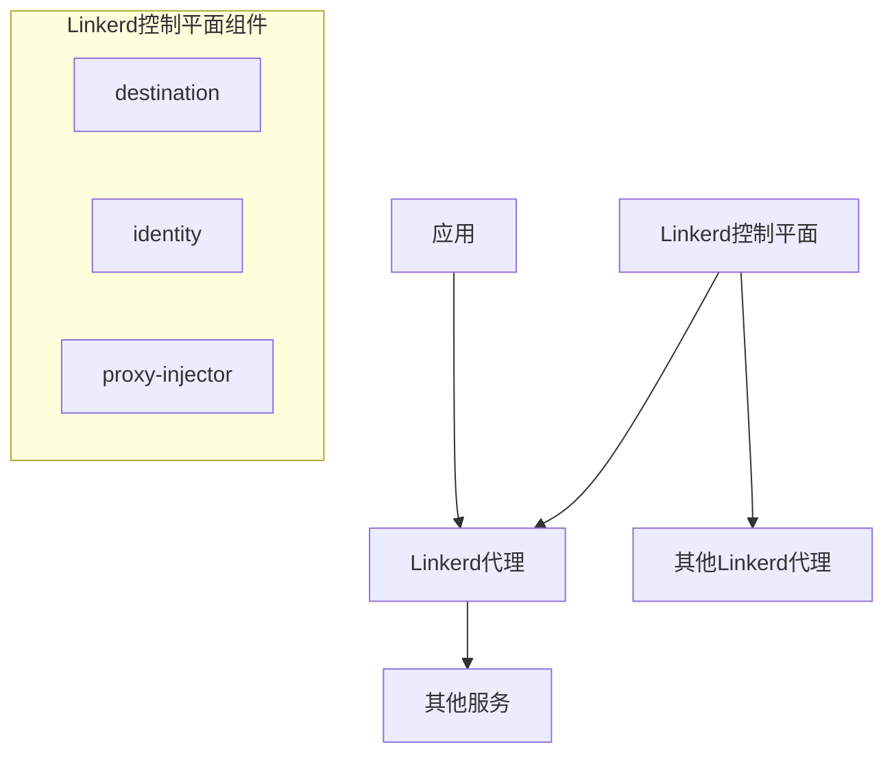
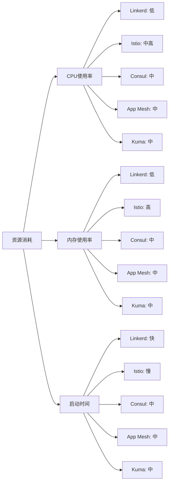

# Linkerd/Consul等其他服务网格对比

除了Istio外，还有多种服务网格实现，如Linkerd、Consul Connect等。本文将详细对比不同服务网格的特点、优势和适用场景，帮助读者选择合适的服务网格方案。

## 服务网格概述

在深入比较不同的服务网格实现之前，让我们先回顾一下服务网格的基本概念和核心功能。

服务网格是一个专用的基础设施层，用于处理服务间通信，它负责在现代云原生应用的复杂服务拓扑中可靠地传递请求。服务网格通常通过一组轻量级网络代理（通常以边车容器的形式部署）来实现，这些代理与应用程序代码一起部署，但对应用程序透明。

### 服务网格的核心功能

所有主流服务网格实现通常提供以下核心功能：

1. **流量管理**：路由、负载均衡、流量分割、故障注入
2. **安全性**：加密通信、身份验证、授权
3. **可观测性**：指标收集、分布式追踪、访问日志
4. **弹性**：超时、重试、熔断、故障转移

不同的服务网格实现在这些功能的实现方式、复杂性和成熟度上有所不同。

## 主要服务网格实现对比

### Istio

Istio是由Google、IBM和Lyft联合开发的开源服务网格，是目前市场上最受欢迎和功能最全面的服务网格之一。

**架构特点**：
- 使用Envoy作为数据平面代理
- 控制平面由istiod组件组成，整合了Pilot（流量管理）、Citadel（安全）和Galley（配置）
- 支持多集群和多租户部署

**优势**：
- 功能最全面的服务网格实现
- 强大的流量管理能力
- 完善的安全功能
- 丰富的集成生态系统
- 活跃的社区和企业支持

**劣势**：
- 复杂度较高，学习曲线陡峭
- 资源消耗相对较大
- 配置模型复杂

**适用场景**：
- 大型企业级微服务部署
- 需要高级流量管理和安全功能的场景
- 有足够资源投入学习和维护的团队

### Linkerd

Linkerd是由Buoyant开发的开源服务网格，是CNCF（Cloud Native Computing Foundation）的毕业项目。Linkerd特别注重简单性和性能。

**架构特点**：
- 使用自研的超轻量级Rust代理作为数据平面
- 控制平面由多个专用组件组成
- 采用"渐进式交付"理念，专注于简单易用

**优势**：
- 极低的资源消耗和性能开销
- 简单易用，学习曲线平缓
- 安装和配置简单
- 自动mTLS加密
- 优秀的可观测性功能

**劣势**：
- 功能相对Istio较少
- 高级流量管理能力有限
- 生态系统相对较小

**适用场景**：
- 资源受限的环境（如边缘计算）
- 初次尝试服务网格的团队
- 注重简单性和性能的项目
- Kubernetes原生应用

### Consul Connect

Consul Connect是HashiCorp的Consul产品的服务网格功能，它是Consul服务发现和配置管理功能的扩展。

**架构特点**：
- 可以使用内置代理或Envoy作为数据平面
- 控制平面与Consul紧密集成
- 支持Kubernetes和非Kubernetes环境
- 支持多数据中心部署

**优势**：
- 与Consul的无缝集成
- 支持多平台（不仅限于Kubernetes）
- 强大的服务发现能力
- 支持非容器化应用
- 配置简单，易于理解

**劣势**：
- 某些高级功能需要企业版
- 与Kubernetes的集成不如Istio和Linkerd原生
- 社区相对较小

**适用场景**：
- 已经使用Consul的环境
- 混合部署（Kubernetes和非Kubernetes）
- 需要跨数据中心服务网格的场景
- 需要服务发现和配置管理的场景

### AWS App Mesh

AWS App Mesh是亚马逊提供的托管服务网格服务，专为AWS环境设计。

**架构特点**：
- 使用Envoy作为数据平面代理
- 控制平面完全由AWS管理
- 与AWS服务紧密集成

**优势**：
- 与AWS服务的无缝集成
- 无需管理控制平面
- 支持ECS、EKS和EC2
- 简化的配置模型

**劣势**：
- 仅限于AWS环境
- 功能相对有限
- 缺乏一些高级流量管理功能

**适用场景**：
- AWS原生应用
- 需要简化运维的团队
- 已深度使用AWS服务的环境

### Kuma

Kuma是由Kong开发的开源服务网格，现已成为CNCF的沙箱项目。

**架构特点**：
- 使用Envoy作为数据平面代理
- 支持Kubernetes和VM环境
- 支持多区域部署
- 提供GUI控制面板

**优势**：
- 支持多平台（Kubernetes和VM）
- 简单易用的控制平面
- 与Kong API网关的良好集成
- 内置策略支持

**劣势**：
- 社区相对较小
- 生态系统不如Istio丰富
- 某些高级功能仍在开发中

**适用场景**：
- 混合环境（Kubernetes和VM）
- 已使用Kong API网关的团队
- 需要简单服务网格的场景

## 功能对比矩阵

下面是主要服务网格实现在关键功能上的对比：

| 功能 | Istio | Linkerd | Consul Connect | AWS App Mesh | Kuma |
|------|-------|---------|----------------|--------------|------|
| **流量管理** |
| 路由 | ✅ 高级 | ✅ 基础 | ✅ 中级 | ✅ 基础 | ✅ 中级 |
| 负载均衡 | ✅ 多种算法 | ✅ 基础 | ✅ 中级 | ✅ 基础 | ✅ 中级 |
| 流量分割 | ✅ 高级 | ✅ 基础 | ✅ 基础 | ✅ 基础 | ✅ 基础 |
| 故障注入 | ✅ | ✅ | ⚠️ 有限 | ⚠️ 有限 | ✅ |
| **安全性** |
| mTLS | ✅ 自动 | ✅ 自动 | ✅ | ✅ | ✅ |
| 身份验证 | ✅ 高级 | ✅ 基础 | ✅ 中级 | ✅ 基础 | ✅ 中级 |
| 授权 | ✅ 高级 | ⚠️ 有限 | ✅ 中级 | ⚠️ 有限 | ✅ 中级 |
| **可观测性** |
| 指标 | ✅ 丰富 | ✅ 丰富 | ✅ 中级 | ✅ 中级 | ✅ 中级 |
| 分布式追踪 | ✅ | ✅ | ✅ | ✅ | ✅ |
| 访问日志 | ✅ 高度可配置 | ✅ 基础 | ✅ 基础 | ✅ 基础 | ✅ 中级 |
| **弹性** |
| 超时/重试 | ✅ 高度可配置 | ✅ 基础 | ✅ 中级 | ✅ 基础 | ✅ 中级 |
| 熔断 | ✅ | ✅ | ✅ | ✅ | ✅ |
| 故障转移 | ✅ | ✅ | ✅ | ✅ | ✅ |
| **部署** |
| Kubernetes | ✅ | ✅ 原生 | ✅ | ✅ (EKS) | ✅ |
| VM/裸机 | ⚠️ 有限 | ❌ | ✅ | ⚠️ (EC2) | ✅ |
| 多集群 | ✅ | ✅ | ✅ | ⚠️ 有限 | ✅ |
| **资源消耗** |
| CPU/内存 | ⚠️ 较高 | ✅ 极低 | ⚠️ 中等 | ⚠️ 中等 | ⚠️ 中等 |
| 延迟影响 | ⚠️ 可感知 | ✅ 极小 | ⚠️ 可感知 | ⚠️ 可感知 | ⚠️ 可感知 |
| **其他** |
| 学习曲线 | ⚠️ 陡峭 | ✅ 平缓 | ⚠️ 中等 | ✅ 平缓 | ✅ 平缓 |
| 社区活跃度 | ✅ 非常活跃 | ✅ 活跃 | ⚠️ 中等 | ⚠️ 有限 | ⚠️ 增长中 |
| 企业支持 | ✅ 多家 | ✅ Buoyant | ✅ HashiCorp | ✅ AWS | ✅ Kong |

## 性能对比

服务网格的性能是选择时的重要考量因素。以下是主要服务网格在性能方面的对比：

### 资源消耗

不同服务网格的数据平面代理对系统资源的消耗：

### 延迟影响

服务网格引入的额外延迟（以毫秒为单位，基于典型场景）：

| 服务网格 | P50延迟 | P99延迟 | 备注 |
|---------|---------|---------|------|
| 无服务网格 | 基准线 | 基准线 | - |
| Linkerd | +0.5-1ms | +2-3ms | 最低延迟影响 |
| Istio | +2-5ms | +10-15ms | 功能全面但有性能开销 |
| Consul Connect | +1-3ms | +5-10ms | 中等性能影响 |
| AWS App Mesh | +1-3ms | +5-10ms | 与Envoy性能相当 |
| Kuma | +1-3ms | +5-10ms | 与Envoy性能相当 |

> 注：实际性能会因具体配置、硬件和工作负载而异。

### 扩展性

不同服务网格在大规模部署时的表现：

| 服务网格 | 支持的最大服务数 | 控制平面扩展性 | 大规模部署经验 |
|---------|----------------|--------------|--------------|
| Istio | 数千 | 高（可水平扩展） | 丰富（多家大型企业） |
| Linkerd | 数千 | 中（组件化设计） | 中等（部分大型部署） |
| Consul Connect | 数千 | 高（企业版支持集群） | 中等（HashiCorp客户） |
| AWS App Mesh | 由AWS限制 | 由AWS管理 | 有限（AWS客户） |
| Kuma | 数千 | 中（全局+区域控制平面） | 有限（较新项目） |

## 使用场景分析

### 场景1：大型企业微服务迁移

**需求**：
- 数百个微服务
- 严格的安全要求
- 复杂的流量路由需求
- 多集群/多区域部署
- 完善的监控和可观测性

**推荐选择**：**Istio**

**理由**：
- Istio提供最全面的功能集
- 强大的流量管理满足复杂路由需求
- 完善的安全功能满足企业级要求
- 丰富的集成选项和生态系统
- 多集群支持成熟

**替代选择**：Consul Connect（如果已使用Consul或需要支持非Kubernetes环境）

### 场景2：初创公司/小型团队

**需求**：
- 十几个微服务
- 简单易用，快速上手
- 资源有限
- 基本的流量管理和安全需求
- 良好的可观测性

**推荐选择**：**Linkerd**

**理由**：
- 极低的资源消耗
- 简单易用，学习曲线平缓
- 安装和配置简单
- 提供良好的基础功能
- 优秀的可观测性功能

**替代选择**：Kuma（如果需要支持VM环境）

### 场景3：混合环境（Kubernetes + VM）

**需求**：
- 同时运行在Kubernetes和VM上的服务
- 统一的服务发现
- 跨环境的安全通信
- 中等复杂度的流量管理

**推荐选择**：**Consul Connect**

**理由**：
- 原生支持Kubernetes和VM环境
- 强大的服务发现能力
- 跨平台一致的安全策略
- 多数据中心支持

**替代选择**：Kuma（更轻量级的选择）或Istio（如果功能需求更高）

### 场景4：AWS原生应用

**需求**：
- 完全运行在AWS上的服务
- 与AWS服务紧密集成
- 简化的运维
- 基本的服务网格功能

**推荐选择**：**AWS App Mesh**

**理由**：
- 与AWS服务无缝集成
- 托管控制平面减少运维负担
- 支持ECS、EKS和EC2
- AWS提供的支持和文档

**替代选择**：Istio on EKS（如果需要更多高级功能）

## 迁移和互操作性考虑

### 从一个服务网格迁移到另一个

迁移服务网格是一项复杂的工作，需要仔细规划。以下是一些关键考虑因素：

1. **渐进式迁移**：
   - 先在非关键服务上测试新服务网格
   - 使用金丝雀发布策略逐步迁移
   - 保持旧服务网格作为备份

2. **配置映射**：
   - 创建从旧服务网格配置到新服务网格配置的映射
   - 注意配置模型和API的差异
   - 使用自动化工具转换配置（如果可用）

3. **可观测性连续性**：
   - 确保在迁移过程中保持可观测性
   - 可能需要同时维护两套监控系统
   - 逐步迁移告警和仪表盘

### 多服务网格共存

在某些情况下，可能需要多个服务网格共存：

1. **网格间通信**：
   - 使用网关连接不同的服务网格
   - 确保证书和身份系统的互操作性
   - 考虑使用服务入口/出口点

2. **管理复杂性**：
   - 明确定义每个服务网格的责任边界
   - 使用统一的命名约定
   - 考虑使用多集群管理工具

3. **团队责任**：
   - 明确定义不同团队对不同服务网格的责任
   - 建立跨团队协作流程
   - 共享最佳实践和经验

## 服务网格的未来趋势

服务网格技术仍在快速发展，以下是一些值得关注的趋势：

### 1. WebAssembly (Wasm) 扩展

WebAssembly正成为扩展服务网格功能的重要方式：

- Istio和Envoy已支持Wasm扩展
- 允许使用多种语言编写扩展
- 提供安全的沙箱环境
- 支持动态加载和更新

### 2. 多集群和混合云支持

随着企业采用多云和混合云策略，服务网格正在增强这方面的能力：

- 跨集群和跨云的统一服务网格
- 全球负载均衡和故障转移
- 多区域流量管理
- 统一的安全策略

### 3. eBPF技术集成

eBPF (extended Berkeley Packet Filter) 技术正在改变服务网格的实现方式：

- 减少边车代理的性能开销
- 提供内核级别的网络控制
- 增强可观测性能力
- 潜在地简化服务网格架构

### 4. 服务网格标准化

服务网格接口和API的标准化正在推进：

- 服务网格接口 (SMI) 规范
- 通用控制平面API
- 跨服务网格互操作性
- 简化迁移和多网格场景

### 5. 边缘计算集成

服务网格正在扩展到边缘计算场景：

- 轻量级服务网格实现
- 适应资源受限环境
- 支持间歇性连接
- 边缘-云协同能力

## 选择服务网格的决策框架

选择合适的服务网格需要考虑多种因素。以下是一个决策框架，帮助您做出明智的选择：

### 步骤1：评估需求

首先明确您的具体需求：

- **规模**：服务数量、请求量、地理分布
- **功能需求**：流量管理、安全、可观测性的具体要求
- **环境**：Kubernetes、VM、裸机、混合环境
- **团队能力**：运维经验、学习曲线接受度
- **资源限制**：CPU、内存、网络带宽限制

### 步骤2：评估候选服务网格

根据需求评估候选服务网格：

- 功能匹配度
- 性能特性
- 社区活跃度和支持
- 学习曲线和文档质量
- 长期维护前景

### 步骤3：概念验证

在做出最终决定前进行概念验证：

- 在代表性工作负载上测试
- 验证关键功能和性能
- 评估运维复杂性
- 收集团队反馈

### 步骤4：制定实施计划

选定服务网格后，制定详细的实施计划：

- 渐进式部署策略
- 培训和技能提升计划
- 监控和告警设置
- 备份和回滚机制

## 总结

服务网格技术为微服务架构提供了强大的网络基础设施，但不同的实现有各自的优势和适用场景。

- **Istio** 提供最全面的功能，适合大型企业和复杂场景，但学习曲线较陡
- **Linkerd** 以简单性和性能著称，是小型团队和资源受限环境的理想选择
- **Consul Connect** 在混合环境和多数据中心场景中表现出色
- **AWS App Mesh** 为AWS用户提供了无缝集成的服务网格体验
- **Kuma** 提供了多平台支持和简单的用户体验

选择服务网格时，应根据自身需求、环境限制和团队能力做出决策。无论选择哪种服务网格，都应该从小规模开始，渐进式地扩大应用范围，并持续评估其带来的价值和挑战。

随着服务网格技术的不断发展，我们可以期待看到更多创新，如WebAssembly扩展、eBPF集成和边缘计算支持等，这些将进一步增强服务网格的能力和适用性。