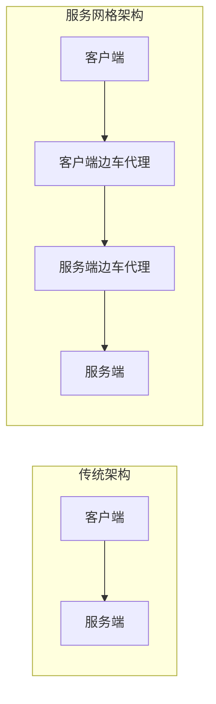

# 服务网格性能优化策略

服务网格虽然提供了丰富的功能，但也会带来一定的性能开销。本文将详细介绍服务网格的性能影响因素和优化策略，帮助读者构建高性能的服务网格环境。

## 服务网格性能开销分析

在深入优化策略之前，我们需要理解服务网格引入的性能开销来源。服务网格主要通过边车代理（Sidecar Proxy）拦截和处理服务间通信，这一过程会引入额外的延迟和资源消耗。

### 性能开销的主要来源

1. **网络路径延长**：请求需要经过额外的网络跳转（进出边车代理）
2. **协议处理开销**：TLS握手、协议转换、请求/响应处理
3. **策略执行开销**：流量控制、安全策略、遥测数据收集
4. **资源消耗**：边车代理和控制平面组件消耗CPU和内存

下图展示了服务网格中请求流经的路径与传统架构的对比：



### 性能影响的量化

服务网格引入的性能开销可以从以下几个方面进行量化：

1. **延迟增加**：
   - P50延迟：通常增加0.5-5ms
   - P99延迟：通常增加2-15ms
   - 冷启动延迟：首次请求可能增加10-100ms

2. **资源消耗**：
   - CPU：每个边车代理通常消耗0.1-0.5核
   - 内存：每个边车代理通常消耗30-100MB
   - 控制平面：根据规模，可能需要1-8核CPU和1-4GB内存

3. **网络开销**：
   - 额外的网络跳转
   - 控制平面与数据平面之间的通信
   - 遥测数据传输

## 性能优化的关键领域

服务网格性能优化可以从多个层面进行，包括架构设计、配置调优和资源分配等方面。

### 1. 边车代理优化

边车代理是服务网格中最关键的性能影响点，也是优化的重点：

#### 资源配置优化

为边车代理分配合适的资源是基础优化措施：

```yaml
apiVersion: apps/v1
kind: Deployment
metadata:
  name: my-service
spec:
  template:
    spec:
      containers:
      - name: istio-proxy
        resources:
          requests:
            cpu: 100m
            memory: 128Mi
          limits:
            cpu: 500m
            memory: 256Mi
```

根据实际工作负载和流量模式，调整这些值至最佳点。对于高流量服务，可能需要更多资源；对于低流量服务，可以减少资源分配。

#### 并发和连接池配置

优化连接池设置可以显著提高性能：

```yaml
apiVersion: networking.istio.io/v1alpha3
kind: DestinationRule
metadata:
  name: connection-pool-settings
spec:
  host: my-service
  trafficPolicy:
    connectionPool:
      tcp:
        maxConnections: 100       # 最大连接数
        connectTimeout: 5s        # 连接超时
      http:
        http1MaxPendingRequests: 100  # HTTP/1.1最大等待请求数
        maxRequestsPerConnection: 10  # 每个连接的最大请求数
        maxRetries: 3             # 最大重试次数
```

这些参数应根据服务的特性进行调整：
- 高吞吐量服务可能需要更多的连接和更高的并发设置
- 低延迟要求的服务可能需要更短的超时和更少的重试

#### 协议优化

选择合适的协议可以减少开销：

1. **使用HTTP/2**：相比HTTP/1.1，HTTP/2提供多路复用，减少连接建立开销
2. **考虑gRPC**：对于服务间通信，gRPC通常比REST更高效
3. **启用keepalive**：减少连接建立次数

```yaml
apiVersion: networking.istio.io/v1alpha3
kind: DestinationRule
metadata:
  name: protocol-settings
spec:
  host: my-service
  trafficPolicy:
    tls:
      mode: ISTIO_MUTUAL
    connectionPool:
      http:
        h2UpgradePolicy: UPGRADE  # 尝试升级到HTTP/2
```

### 2. 控制平面优化

控制平面的性能直接影响配置分发效率和整体稳定性：

#### 控制平面资源配置

为控制平面组件分配足够资源：

```yaml
apiVersion: install.istio.io/v1alpha1
kind: IstioOperator
spec:
  components:
    pilot:
      k8s:
        resources:
          requests:
            cpu: 1000m
            memory: 1Gi
          limits:
            cpu: 2000m
            memory: 2Gi
```

对于大型部署（>500个服务），可能需要更多资源或考虑水平扩展控制平面。

#### 配置分发优化

减少配置变更频率和范围：

1. **使用命名空间隔离**：将服务分组到不同命名空间，限制配置变更影响范围
2. **批量应用配置**：避免频繁小规模配置变更
3. **使用标签选择器**：精确定位配置应用范围

```yaml
apiVersion: networking.istio.io/v1alpha3
kind: VirtualService
metadata:
  name: targeted-routing
spec:
  hosts:
  - my-service
  http:
  - match:
    - sourceLabels:
        app: specific-client  # 只影响特定客户端
    route:
    - destination:
        host: my-service
        subset: v1
```

#### 控制平面扩展性设置

调整控制平面的扩展性参数：

```yaml
apiVersion: install.istio.io/v1alpha1
kind: IstioOperator
spec:
  meshConfig:
    concurrency: 2  # 工作线程数
    protocolDetectionTimeout: 100ms  # 协议检测超时
  values:
    pilot:
      env:
        PILOT_PUSH_THROTTLE: 100  # 推送节流
        PILOT_DEBOUNCE_AFTER: 100ms  # 配置变更延迟聚合时间
        PILOT_DEBOUNCE_MAX: 1s  # 最大聚合时间
```

这些参数可以根据集群规模和变更频率进行调整，以平衡响应速度和系统负载。

### 3. 遥测和可观测性优化

遥测数据收集是服务网格的重要功能，但也是性能开销的主要来源之一：

#### 采样率调整

不必对所有请求进行全量遥测数据收集，可以通过采样降低开销：

```yaml
apiVersion: telemetry.istio.io/v1alpha1
kind: Telemetry
metadata:
  name: telemetry-settings
spec:
  tracing:
    randomSamplingPercentage: 1.0  # 采样1%的请求
  metrics:
    overrides:
    - match:
        metric: REQUEST_COUNT
      disabled: false  # 保留请求计数指标
    - match:
        metric: REQUEST_DURATION
      disabled: false  # 保留请求持续时间指标
    - match:
        metric: REQUEST_SIZE
      disabled: true   # 禁用请求大小指标
    - match:
        metric: RESPONSE_SIZE
      disabled: true   # 禁用响应大小指标
```

对于生产环境，通常建议：
- 高流量服务：采样率设为0.1%-1%
- 中等流量服务：采样率设为1%-10%
- 低流量服务：采样率可以设为10%-100%

#### 日志级别和过滤

调整日志级别和过滤规则可以减少日志处理开销：

```yaml
apiVersion: telemetry.istio.io/v1alpha1
kind: Telemetry
metadata:
  name: access-logging
spec:
  accessLogging:
  - providers:
    - name: envoy
    filter:
      expression: "response.code >= 400"  # 只记录错误响应
```

这样只记录错误响应的日志，大幅减少日志量。

#### 指标收集优化

选择性收集关键指标，减少非必要指标：

```yaml
apiVersion: install.istio.io/v1alpha1
kind: IstioOperator
spec:
  meshConfig:
    defaultConfig:
      proxyStatsMatcher:
        inclusionPrefixes:
        - "cluster_manager"
        - "listener_manager"
        - "http_mixer_filter"
        - "tcp_mixer_filter"
        - "server"
        - "cluster.outbound"
        inclusionRegexps:
        - "cluster\\..*\\.upstream_rq_2xx"
```

这样可以只收集关键的Envoy统计信息，减少指标处理和存储开销。

### 4. 流量管理优化

流量管理策略的设计和实现也会影响性能：

#### 简化路由规则

复杂的路由规则会增加处理开销，应尽量简化：

```yaml
# 避免使用过于复杂的匹配条件
apiVersion: networking.istio.io/v1alpha3
kind: VirtualService
metadata:
  name: simple-routing
spec:
  hosts:
  - my-service
  http:
  - route:
    - destination:
        host: my-service-v1
      weight: 90
    - destination:
        host: my-service-v2
      weight: 10
```

相比使用多层嵌套的匹配条件，简单的基于权重的路由规则处理效率更高。

#### 减少配置对象数量

合并相关的配置对象可以减少处理开销：

```yaml
# 合并多个VirtualService为一个
apiVersion: networking.istio.io/v1alpha3
kind: VirtualService
metadata:
  name: consolidated-services
spec:
  hosts:
  - service-a
  - service-b
  - service-c
  http:
  - match:
    - uri:
        prefix: "/api/a"
    route:
    - destination:
        host: service-a
  - match:
    - uri:
        prefix: "/api/b"
    route:
    - destination:
        host: service-b
  - match:
    - uri:
        prefix: "/api/c"
    route:
    - destination:
        host: service-c
```

这样可以减少配置对象数量，降低控制平面和数据平面的处理负担。

#### 优化故障处理策略

合理设置超时、重试和熔断参数：

```yaml
apiVersion: networking.istio.io/v1alpha3
kind: VirtualService
metadata:
  name: timeout-retry-settings
spec:
  hosts:
  - my-service
  http:
  - route:
    - destination:
        host: my-service
    timeout: 1s  # 较短的超时
    retries:
      attempts: 2  # 有限的重试次数
      perTryTimeout: 0.5s
      retryOn: connect-failure,refused-stream,unavailable

---
apiVersion: networking.istio.io/v1alpha3
kind: DestinationRule
metadata:
  name: circuit-breaker
spec:
  host: my-service
  trafficPolicy:
    outlierDetection:
      consecutiveErrors: 5
      interval: 5s
      baseEjectionTime: 30s
```

这些设置可以防止故障级联和资源耗尽，同时减少不必要的重试开销。

### 5. 安全策略优化

安全功能是服务网格的核心优势，但也会带来显著的性能开销：

#### mTLS优化

根据实际需求配置mTLS策略：

```yaml
apiVersion: security.istio.io/v1beta1
kind: PeerAuthentication
metadata:
  name: mtls-policy
  namespace: istio-system  # 应用于整个网格
spec:
  mtls:
    mode: PERMISSIVE  # 允许非mTLS流量，但优先使用mTLS
```

对于内部非敏感服务，可以考虑使用PERMISSIVE模式减少TLS握手开销；对于敏感服务，则应使用STRICT模式确保安全性。

#### 证书轮换优化

调整证书轮换参数，平衡安全性和性能：

```yaml
apiVersion: install.istio.io/v1alpha1
kind: IstioOperator
spec:
  meshConfig:
    certificates:
      - secretName: cacerts
        dnsNames:
          - istio-ca.istio-system.svc
        subject: "CN=Istio CA,O=Istio"
    defaultConfig:
      proxyMetadata:
        SECRET_TTL: "48h"  # 证书有效期
        SECRET_GRACE_PERIOD: "24h"  # 提前更新时间
```

延长证书有效期可以减少证书轮换频率，但需要平衡安全风险。

#### 授权策略优化

简化授权策略，减少评估开销：

```yaml
# 使用命名空间级别的策略而非大量细粒度策略
apiVersion: security.istio.io/v1beta1
kind: AuthorizationPolicy
metadata:
  name: namespace-policy
  namespace: my-namespace
spec:
  action: ALLOW
  rules:
  - from:
    - source:
        namespaces: ["trusted-namespace"]
```

相比为每个服务配置单独的授权策略，使用较少的命名空间级策略可以减少配置复杂度和评估开销。

## 高级优化技术

除了基本优化外，还有一些高级技术可以进一步提升服务网格性能：

### 1. 拓扑感知路由

利用拓扑感知路由减少跨区域流量：

```yaml
apiVersion: install.istio.io/v1alpha1
kind: IstioOperator
spec:
  meshConfig:
    localityLbSetting:
      enabled: true
      distribute:
      - from: "us-west/zone1/subzone1"
        to:
          "us-west/zone1/subzone1": 80
          "us-west/zone1/subzone2": 15
          "us-west/zone2/subzone1": 5
```

这样可以优先将流量路由到同一区域的服务实例，减少网络延迟和成本。

### 2. 网关优化

为入口和出口网关分配足够资源，并优化配置：

```yaml
apiVersion: install.istio.io/v1alpha1
kind: IstioOperator
spec:
  components:
    ingressGateways:
    - name: istio-ingressgateway
      enabled: true
      k8s:
        resources:
          requests:
            cpu: 500m
            memory: 512Mi
          limits:
            cpu: 2000m
            memory: 1Gi
        hpaSpec:
          minReplicas: 2
          maxReplicas: 10
          metrics:
          - type: Resource
            resource:
              name: cpu
              targetAverageUtilization: 80
```

对于高流量场景，应考虑使用水平自动扩展（HPA）和节点亲和性来优化网关性能。

### 3. CNI插件使用

使用Istio CNI插件可以避免初始化容器和特权要求：

```yaml
apiVersion: install.istio.io/v1alpha1
kind: IstioOperator
spec:
  components:
    cni:
      enabled: true
  values:
    cni:
      excludeNamespaces:
        - istio-system
        - kube-system
```

CNI插件可以减少Pod启动时间，并简化网络配置。

### 4. 代理配置优化

调整Envoy代理的底层配置参数：

```yaml
apiVersion: install.istio.io/v1alpha1
kind: IstioOperator
spec:
  meshConfig:
    defaultConfig:
      concurrency: 2  # 工作线程数，通常设置为CPU核心数
      proxyMetadata:
        ISTIO_META_HTTP10: "1"  # 支持HTTP/1.0
      terminationDrainDuration: 5s  # 优雅终止时间
```

对于资源受限的环境，可以减少并发度；对于高性能环境，可以增加并发度以提高吞吐量。

### 5. 使用服务入口优化外部服务访问

对于频繁访问的外部服务，使用ServiceEntry可以优化性能：

```yaml
apiVersion: networking.istio.io/v1alpha3
kind: ServiceEntry
metadata:
  name: external-api
spec:
  hosts:
  - api.external-service.com
  ports:
  - number: 443
    name: https
    protocol: HTTPS
  resolution: DNS
  location: MESH_EXTERNAL
  endpoints:
  - address: 172.16.1.1  # 预解析的IP地址
```

这样可以减少DNS解析开销，并允许对外部服务应用流量管理策略。

## 性能测试与监控

优化是一个持续过程，需要通过测试和监控来验证效果：

### 性能基准测试

在优化前后进行基准测试，量化改进效果：

1. **延迟测试**：使用工具如Fortio测试服务响应时间
   ```bash
   fortio load -c 50 -qps 500 -t 60s http://service-url
   ```

2. **吞吐量测试**：测量系统在不同负载下的最大吞吐量
   ```bash
   fortio load -c 100 -qps 0 -t 30s http://service-url
   ```

3. **资源使用测试**：监控CPU、内存和网络使用情况
   ```bash
   kubectl top pods -n my-namespace
   ```

### 持续监控指标

设置关键性能指标的持续监控：

1. **代理性能指标**：
   - 请求处理延迟
   - 连接数
   - 错误率
   - CPU和内存使用率

2. **控制平面指标**：
   - 配置推送延迟
   - 推送错误率
   - 资源使用率

3. **端到端性能指标**：
   - 服务调用延迟
   - 成功率
   - 吞吐量

可以使用Grafana仪表盘可视化这些指标：

```yaml
apiVersion: install.istio.io/v1alpha1
kind: IstioOperator
spec:
  addonComponents:
    grafana:
      enabled: true
    prometheus:
      enabled: true
```

## 实际案例分析

以下是几个实际优化案例，展示了不同场景下的优化策略和效果：

### 案例1：高流量API网关优化

**场景**：API网关每秒处理5000+请求，延迟开始增加

**优化措施**：
1. 增加入口网关资源分配（2核→4核）
2. 优化连接池设置（增加最大连接数）
3. 减少遥测数据采样率（从100%→5%）
4. 启用HTTP/2和keepalive

**效果**：
- P50延迟降低40%（从25ms→15ms）
- P99延迟降低60%（从120ms→48ms）
- CPU使用率降低30%

### 案例2：微服务集群内存优化

**场景**：包含200+服务的集群，边车代理内存使用过高

**优化措施**：
1. 调整并发设置（根据流量调整）
2. 简化路由规则（合并虚拟服务）
3. 优化指标收集（只收集关键指标）
4. 调整证书轮换周期（24h→48h）

**效果**：
- 边车代理平均内存使用降低40%（从80MB→48MB）
- 集群总内存使用降低6GB
- 无功能损失

### 案例3：多区域部署优化

**场景**：跨三个区域的服务网格，区域间延迟高

**优化措施**：
1. 启用拓扑感知路由
2. 为每个区域部署控制平面
3. 优化跨区域mTLS设置
4. 实施区域级故障隔离

**效果**：
- 区域内请求延迟降低70%
- 跨区域流量减少80%
- 系统整体可用性提高

## 不同规模部署的优化建议

根据部署规模，优化策略也会有所不同：

### 小型部署（<50个服务）

优先考虑简单性和易管理性：
- 使用默认配置，仅针对性能热点进行优化
- 集中控制平面，避免过度分布
- 适度减少遥测数据收集
- 关注资源效率，避免过度配置

### 中型部署（50-200个服务）

平衡功能和性能：
- 根据服务重要性分级优化
- 优化控制平面资源分配
- 实施命名空间级隔离
- 针对高流量路径进行专项优化
- 定期审查和优化配置

### 大型部署（>200个服务）

注重扩展性和隔离性：
- 考虑多控制平面架构
- 实施严格的命名空间和服务隔离
- 大幅减少全局遥测数据采样率
- 优化证书管理和分发
- 自动化配置管理和优化
- 实施渐进式部署和验证

## 总结与最佳实践

服务网格性能优化是一个持续过程，需要综合考虑多个因素：

### 关键优化原则

1. **了解性能瓶颈**：通过监控和测试识别真正的瓶颈
2. **渐进式优化**：从最大影响点开始，逐步优化
3. **平衡功能和性能**：不要为了性能牺牲关键功能
4. **持续监控和调整**：随着系统演化不断优化

### 优化检查清单

实施服务网格优化时，可以参考以下检查清单：

- [ ] 边车代理资源配置是否合理？
- [ ] 连接池和并发设置是否适合工作负载？
- [ ] 遥测数据采样率是否过高？
- [ ] 路由规则是否过于复杂？
- [ ] 安全策略是否过于严格？
- [ ] 控制平面资源是否足够？
- [ ] 是否有不必要的服务网格功能？
- [ ] 是否针对高流量路径进行了专项优化？

### 未来趋势

服务网格性能优化领域的发展趋势：

1. **eBPF技术**：使用eBPF减少边车代理开销
2. **WebAssembly扩展**：更高效的自定义扩展
3. **智能自适应优化**：基于AI的自动性能调优
4. **无边车架构**：探索无边车代理的服务网格实现

通过理解服务网格的性能特性并应用本文介绍的优化策略，您可以在享受服务网格带来的强大功能的同时，将性能开销降到最低，构建高效、可靠的微服务架构。